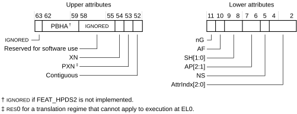
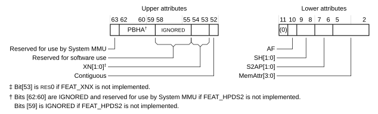

# ​G5.5.3 Attribute fields in VMSAv8-32 Long-descriptor translation table format descriptors

Source: <https://developer.arm.com/documentation/ddi0487/mc/-Part-G-The-AArch32-System-Level-Architecture/-Chapter-G5-The-AArch32-Virtual-Memory-System-Architecture/-G5-5-The-VMSAv8-32-Long-descriptor-translation-table-format/-G5-5-3-Attribute-fields-in-VMSAv8-32-Long-descriptor-translation-table-format-descriptors>

##### G5.5.3 Attribute fields in VMSAv8-32 Long-descriptor translation table format descriptors

The memory attributes in the VMSAv8-32 Long-descriptor translation tables are based on those in the Short-descriptor translation table format, with some extensions. [Memory region attributes](/documentation/ddi0487/mc/-Part-G-The-AArch32-System-Level-Architecture/-Chapter-G5-The-AArch32-Virtual-Memory-System-Architecture/-G5-7-Memory-region-attributes?lang=en#chdbdaai) describes these attributes. In the Long-descriptor translation table format:

- Table entries for stage 1 translations define attributes for the next level of lookup, see [Next-level attributes in VMSAv8-32 Long-descriptor stage 1 Table descriptors](/documentation/ddi0487/mc/-Part-G-The-AArch32-System-Level-Architecture/-Chapter-G5-The-AArch32-Virtual-Memory-System-Architecture/-G5-5-The-VMSAv8-32-Long-descriptor-translation-table-format/-G5-5-3-Attribute-fields-in-VMSAv8-32-Long-descriptor-translation-table-format-descriptors?lang=en#chdchjcf).

  The hierarchical permissions in the translation tables, APTable, XNTable, and PXNTable, permit subtrees of the translation tables to be used by different agents. Not all operating systems use this functionality, and so [FEAT\_AA32HPD](/documentation/ddi0487/mc/-Part-A-Arm-Architecture-Introduction-and-Overview/-Chapter-A2-A-profile-Architecture-Extensions/-A2-2-Armv8-A-architecture-extensions/-A2-2-3-The-Armv8-2-architecture-extension?lang=en#feat_feat_aa32hpd) adds a facility to disable these bits.

  This ability to disable hierarchical permissions bits has no effect on the NSTable bit.
- Block and Page entries define memory attributes for the target block or page of memory. Stage 1 and stage 2 translations have some differences in these attributes, see:

  - [Attribute fields in VMSAv8-32 Long-descriptor stage 1 Block and Page descriptors](/documentation/ddi0487/mc/-Part-G-The-AArch32-System-Level-Architecture/-Chapter-G5-The-AArch32-Virtual-Memory-System-Architecture/-G5-5-The-VMSAv8-32-Long-descriptor-translation-table-format/-G5-5-3-Attribute-fields-in-VMSAv8-32-Long-descriptor-translation-table-format-descriptors?lang=en#chdgjihe).
  - [Attribute fields in VMSAv8-32 Long-descriptor stage 2 Block and Page descriptors](/documentation/ddi0487/mc/-Part-G-The-AArch32-System-Level-Architecture/-Chapter-G5-The-AArch32-Virtual-Memory-System-Architecture/-G5-5-The-VMSAv8-32-Long-descriptor-translation-table-format/-G5-5-3-Attribute-fields-in-VMSAv8-32-Long-descriptor-translation-table-format-descriptors?lang=en#chdediga).

###### G5.5.3.1 Next-level attributes in VMSAv8-32 Long-descriptor stage 1 Table descriptors

In a Table descriptor for a stage 1 translation, bits[63:59] of the descriptor define the following attributes for the next-level translation table access:

NSTable, bit[63]
:   For memory accesses from Secure state, specifies the Security state for subsequent levels of lookup, see [Hierarchical control of Secure or Non-secure memory accesses, Long-descriptor format](/documentation/ddi0487/mc/-Part-G-The-AArch32-System-Level-Architecture/-Chapter-G5-The-AArch32-Virtual-Memory-System-Architecture/-G5-5-The-VMSAv8-32-Long-descriptor-translation-table-format/-G5-5-4-Control-of-Secure-or-Non-secure-memory-access--VMSAv8-32-Long-descriptor-format?lang=en#chdffghj).

    For memory accesses from Non-secure state, this bit is ignored.

APTable, bits[62:61]
:   Access permissions limit for subsequent levels of lookup, see [Hierarchical control of access permissions, Long-descriptor format](/documentation/ddi0487/mc/-Part-G-The-AArch32-System-Level-Architecture/-Chapter-G5-The-AArch32-Virtual-Memory-System-Architecture/-G5-6-Memory-access-control/-G5-6-1-About-access-permissions?lang=en#chdjgghb).

    APTable[0] is reserved, SBZ, in the Non-secure EL2 stage 1 translation tables.

    From Armv8.2, when [FEAT\_AA32HPD](/documentation/ddi0487/mc/-Part-A-Arm-Architecture-Introduction-and-Overview/-Chapter-A2-A-profile-Architecture-Extensions/-A2-2-Armv8-A-architecture-extensions/-A2-2-3-The-Armv8-2-architecture-extension?lang=en#feat_feat_aa32hpd) is implemented, this field can be disabled.

    When the value of [TTBCR2](/documentation/ddi0487/mc/-Part-G-The-AArch32-System-Level-Architecture/-Chapter-G8-AArch32-System-Register-Descriptions/-G8-2-General-system-control-registers/-G8-2-166-TTBCR2--Translation-Table-Base-Control-Register-2?lang=en#reg_aarch32_ttbcr2).HPD0 or TTBCR2.HPD1 is 1, and the value of TTBCR.T2E is also 1:

    - The value of the corresponding APTable field is IGNORED by hardware, allowing the field to be used by software.
    - The behavior of the system is as if the value of the corresponding APTable field is 0, that is to say, the APTable field has an [Effective value](/documentation/ddi0487/mc/-Part-K-Appendixes/Glossary?lang=en#effective_value) of 0.

XNTable, bit[60]
:   XN limit for subsequent levels of lookup, see [Hierarchical control of instruction fetching, Long-descriptor format](/documentation/ddi0487/mc/-Part-G-The-AArch32-System-Level-Architecture/-Chapter-G5-The-AArch32-Virtual-Memory-System-Architecture/-G5-6-Memory-access-control/-G5-6-3-Access-permissions-for-instruction-execution?lang=en#chdigjce).

    From Armv8.2, when [FEAT\_AA32HPD](/documentation/ddi0487/mc/-Part-A-Arm-Architecture-Introduction-and-Overview/-Chapter-A2-A-profile-Architecture-Extensions/-A2-2-Armv8-A-architecture-extensions/-A2-2-3-The-Armv8-2-architecture-extension?lang=en#feat_feat_aa32hpd) is implemented, this field can be disabled.

    When the value of [TTBCR2](/documentation/ddi0487/mc/-Part-G-The-AArch32-System-Level-Architecture/-Chapter-G8-AArch32-System-Register-Descriptions/-G8-2-General-system-control-registers/-G8-2-166-TTBCR2--Translation-Table-Base-Control-Register-2?lang=en#reg_aarch32_ttbcr2).HPD0 or [TTBCR2](/documentation/ddi0487/mc/-Part-G-The-AArch32-System-Level-Architecture/-Chapter-G8-AArch32-System-Register-Descriptions/-G8-2-General-system-control-registers/-G8-2-166-TTBCR2--Translation-Table-Base-Control-Register-2?lang=en#reg_aarch32_ttbcr2).HPD1 is 1, and the value of TTBCR.T2E is also 1:

    - The value of the corresponding XNTable field is IGNORED by hardware, allowing the field to be used by software.
    - The behavior of the system is as if the value of the corresponding XNTable field is 0, that is to say, the XNTable field has an [Effective value](/documentation/ddi0487/mc/-Part-K-Appendixes/Glossary?lang=en#effective_value) of 0.

PXNTable, bit[59]
:   PXN limit for subsequent levels of lookup, see [Hierarchical control of instruction fetching, Long-descriptor format](/documentation/ddi0487/mc/-Part-G-The-AArch32-System-Level-Architecture/-Chapter-G5-The-AArch32-Virtual-Memory-System-Architecture/-G5-6-Memory-access-control/-G5-6-3-Access-permissions-for-instruction-execution?lang=en#chdigjce).

    This bit is RES0 in the Non-secure EL2 stage 1 translation tables.

    From Armv8.2, when [FEAT\_AA32HPD](/documentation/ddi0487/mc/-Part-A-Arm-Architecture-Introduction-and-Overview/-Chapter-A2-A-profile-Architecture-Extensions/-A2-2-Armv8-A-architecture-extensions/-A2-2-3-The-Armv8-2-architecture-extension?lang=en#feat_feat_aa32hpd) is implemented, this field can be disabled.

    When the value of [TTBCR2](/documentation/ddi0487/mc/-Part-G-The-AArch32-System-Level-Architecture/-Chapter-G8-AArch32-System-Register-Descriptions/-G8-2-General-system-control-registers/-G8-2-166-TTBCR2--Translation-Table-Base-Control-Register-2?lang=en#reg_aarch32_ttbcr2).HPD0 or [TTBCR2](/documentation/ddi0487/mc/-Part-G-The-AArch32-System-Level-Architecture/-Chapter-G8-AArch32-System-Register-Descriptions/-G8-2-General-system-control-registers/-G8-2-166-TTBCR2--Translation-Table-Base-Control-Register-2?lang=en#reg_aarch32_ttbcr2).HPD1 is 1 and the value of TTBCR.T2E is also 1:

    - The value of the corresponding PXNTable field is ignored by hardware, allowing the field to be used by software.
    - The behavior of the system is as if the value of the corresponding PXNTable field is 0, that is to say, the PXNTable field has an [Effective value](/documentation/ddi0487/mc/-Part-K-Appendixes/Glossary?lang=en#effective_value) of 0.

###### G5.5.3.2 Attribute fields in VMSAv8-32 Long-descriptor stage 1 Block and Page descriptors

In Block and Page descriptors, the memory attributes are split into an upper block and a lower block as shown for a stage 1 translation:

For a stage 1 descriptor, the attributes are:

PBHA, bits[62:59]
:   Page-based hardware attributes bits.

    These bits are IGNORED when [FEAT\_HPDS2](/documentation/ddi0487/mc/-Part-A-Arm-Architecture-Introduction-and-Overview/-Chapter-A2-A-profile-Architecture-Extensions/-A2-2-Armv8-A-architecture-extensions/-A2-2-3-The-Armv8-2-architecture-extension?lang=en#feat_feat_hpds2) is not implemented.

    When [FEAT\_HPDS2](/documentation/ddi0487/mc/-Part-A-Arm-Architecture-Introduction-and-Overview/-Chapter-A2-A-profile-Architecture-Extensions/-A2-2-Armv8-A-architecture-extensions/-A2-2-3-The-Armv8-2-architecture-extension?lang=en#feat_feat_hpds2) is implemented, the [HTCR](/documentation/ddi0487/mc/-Part-G-The-AArch32-System-Level-Architecture/-Chapter-G8-AArch32-System-Register-Descriptions/-G8-2-General-system-control-registers/-G8-2-76-HTCR--Hyp-Translation-Control-Register?lang=en#reg_aarch32_htcr) and the [TTBCR2](/documentation/ddi0487/mc/-Part-G-The-AArch32-System-Level-Architecture/-Chapter-G8-AArch32-System-Register-Descriptions/-G8-2-General-system-control-registers/-G8-2-166-TTBCR2--Translation-Table-Base-Control-Register-2?lang=en#reg_aarch32_ttbcr2) registers both contain a control bit for each PBHA bit in the translation tables that they control. When the value of that control bit is 1, and the value of the corresponding Hierarchical permission disables bit is 1, hardware can use that PBHA bit for IMPLEMENTATION DEFINED purposes. When the PBHA bit is used for IMPLEMENTATION DEFINED purposes, the value of 0 in the PBHA bit is a safe default setting that gives the same behavior as when the PBHA bit is not used for IMPLEMENTATION DEFINED purposes.

    The control bits for this feature are:

    For a Non-secure EL2 translation regime:
    :   HTCR.HWUnn
        :   Controls whether Block or Page descriptor bit[nn] can be used by hardware.

            These controls apply only when the value of [HTCR](/documentation/ddi0487/mc/-Part-G-The-AArch32-System-Level-Architecture/-Chapter-G8-AArch32-System-Register-Descriptions/-G8-2-General-system-control-registers/-G8-2-76-HTCR--Hyp-Translation-Control-Register?lang=en#reg_aarch32_htcr).HPD is 1.

    For a PL1&0 translation regime:
    :   TTBCR2.HWU1nn
        :   For the translation tables indicated by [TTBR1](/documentation/ddi0487/mc/-Part-G-The-AArch32-System-Level-Architecture/-Chapter-G8-AArch32-System-Register-Descriptions/-G8-2-General-system-control-registers/-G8-2-168-TTBR1--Translation-Table-Base-Register-1?lang=en#reg_aarch32_ttbr1), controls whether Block or Page descriptor bit[nn] can be used by hardware.

            These controls apply only when the value of [TTBCR2](/documentation/ddi0487/mc/-Part-G-The-AArch32-System-Level-Architecture/-Chapter-G8-AArch32-System-Register-Descriptions/-G8-2-General-system-control-registers/-G8-2-166-TTBCR2--Translation-Table-Base-Control-Register-2?lang=en#reg_aarch32_ttbcr2).HPD1 is 1 and the value of [TTBCR](/documentation/ddi0487/mc/-Part-G-The-AArch32-System-Level-Architecture/-Chapter-G8-AArch32-System-Register-Descriptions/-G8-2-General-system-control-registers/-G8-2-165-TTBCR--Translation-Table-Base-Control-Register?lang=en#reg_aarch32_ttbcr).T2E is 1.

        TTBCR2.HWU0nn
        :   For the translation tables indicated by [TTBR0](/documentation/ddi0487/mc/-Part-G-The-AArch32-System-Level-Architecture/-Chapter-G8-AArch32-System-Register-Descriptions/-G8-2-General-system-control-registers/-G8-2-167-TTBR0--Translation-Table-Base-Register-0?lang=en#reg_aarch32_ttbr0), controls whether Block or Page descriptor bit[nn] can be used by hardware.

            These controls apply only when the value of [TTBCR2](/documentation/ddi0487/mc/-Part-G-The-AArch32-System-Level-Architecture/-Chapter-G8-AArch32-System-Register-Descriptions/-G8-2-General-system-control-registers/-G8-2-166-TTBCR2--Translation-Table-Base-Control-Register-2?lang=en#reg_aarch32_ttbcr2).HPD0 is 1 and the value of [TTBCR](/documentation/ddi0487/mc/-Part-G-The-AArch32-System-Level-Architecture/-Chapter-G8-AArch32-System-Register-Descriptions/-G8-2-General-system-control-registers/-G8-2-165-TTBCR--Translation-Table-Base-Control-Register?lang=en#reg_aarch32_ttbcr).T2E is 1.

    Implementation of [FEAT\_HPDS2](/documentation/ddi0487/mc/-Part-A-Arm-Architecture-Introduction-and-Overview/-Chapter-A2-A-profile-Architecture-Extensions/-A2-2-Armv8-A-architecture-extensions/-A2-2-3-The-Armv8-2-architecture-extension?lang=en#feat_feat_hpds2) requires the implementation of [FEAT\_AA32HPD](/documentation/ddi0487/mc/-Part-A-Arm-Architecture-Introduction-and-Overview/-Chapter-A2-A-profile-Architecture-Extensions/-A2-2-Armv8-A-architecture-extensions/-A2-2-3-The-Armv8-2-architecture-extension?lang=en#feat_feat_aa32hpd), which provides the Hierarchical permission disables bits. If [FEAT\_AA32HPD](/documentation/ddi0487/mc/-Part-A-Arm-Architecture-Introduction-and-Overview/-Chapter-A2-A-profile-Architecture-Extensions/-A2-2-Armv8-A-architecture-extensions/-A2-2-3-The-Armv8-2-architecture-extension?lang=en#feat_feat_aa32hpd) is implemented but [FEAT\_HPDS2](/documentation/ddi0487/mc/-Part-A-Arm-Architecture-Introduction-and-Overview/-Chapter-A2-A-profile-Architecture-Extensions/-A2-2-Armv8-A-architecture-extensions/-A2-2-3-The-Armv8-2-architecture-extension?lang=en#feat_feat_hpds2) is not implemented, then the control bits are RAZ/WI but other aspects of [FEAT\_AA32HPD](/documentation/ddi0487/mc/-Part-A-Arm-Architecture-Introduction-and-Overview/-Chapter-A2-A-profile-Architecture-Extensions/-A2-2-Armv8-A-architecture-extensions/-A2-2-3-The-Armv8-2-architecture-extension?lang=en#feat_feat_aa32hpd) functionality are implemented. If neither feature is implemented, then:

    - The control bits are RAZ/WI.
    - The [FEAT\_AA32HPD](/documentation/ddi0487/mc/-Part-A-Arm-Architecture-Introduction-and-Overview/-Chapter-A2-A-profile-Architecture-Extensions/-A2-2-Armv8-A-architecture-extensions/-A2-2-3-The-Armv8-2-architecture-extension?lang=en#feat_feat_aa32hpd) identification registers indicate that the functionality is not supported, see [FEAT\_AA32HPD](/documentation/ddi0487/mc/-Part-A-Arm-Architecture-Introduction-and-Overview/-Chapter-A2-A-profile-Architecture-Extensions/-A2-2-Armv8-A-architecture-extensions/-A2-2-3-The-Armv8-2-architecture-extension?lang=en#feat_feat_aa32hpd).
    - The [TTBCR2](/documentation/ddi0487/mc/-Part-G-The-AArch32-System-Level-Architecture/-Chapter-G8-AArch32-System-Register-Descriptions/-G8-2-General-system-control-registers/-G8-2-166-TTBCR2--Translation-Table-Base-Control-Register-2?lang=en#reg_aarch32_ttbcr2) register encoding is treated as unallocated.

XN, bit[54]
:   The Execute-never field, see [Access permissions for instruction execution](/documentation/ddi0487/mc/-Part-G-The-AArch32-System-Level-Architecture/-Chapter-G5-The-AArch32-Virtual-Memory-System-Architecture/-G5-6-Memory-access-control/-G5-6-3-Access-permissions-for-instruction-execution?lang=en#chddcjhb).

PXN, bit[53]
:   The Privileged execute-never field, see [Access permissions for instruction execution](/documentation/ddi0487/mc/-Part-G-The-AArch32-System-Level-Architecture/-Chapter-G5-The-AArch32-Virtual-Memory-System-Architecture/-G5-6-Memory-access-control/-G5-6-3-Access-permissions-for-instruction-execution?lang=en#chddcjhb).

    This bit is RES0 in the Non-secure EL2 stage 1 translation tables.

Contiguous, bit[52]
:   Indicates that 16 adjacent translation table entries point to contiguous memory regions, see [Contiguous bit](/documentation/ddi0487/mc/-Part-G-The-AArch32-System-Level-Architecture/-Chapter-G5-The-AArch32-Virtual-Memory-System-Architecture/-G5-7-Memory-region-attributes/-G5-7-4-VMSAv8-32-Long-descriptor-format-memory-region-attributes?lang=en#chdeijcb).

nG, bit[11]
:   The not global bit. Determines how the translation is marked in the TLB, see [Global and process-specific translation table entries](/documentation/ddi0487/mc/-Part-G-The-AArch32-System-Level-Architecture/-Chapter-G5-The-AArch32-Virtual-Memory-System-Architecture/-G5-8-Translation-Lookaside-Buffers/-G5-8-1-Global-and-process-specific-translation-table-entries?lang=en#chdeghgf).

    This bit is RES0 in the Non-secure EL2 stage 1 translation tables.

AF, bit[10]
:   The Access flag, see [The Access flag](/documentation/ddi0487/mc/-Part-G-The-AArch32-System-Level-Architecture/-Chapter-G5-The-AArch32-Virtual-Memory-System-Architecture/-G5-6-Memory-access-control/-G5-6-5-The-Access-flag?lang=en#chddehag).

SH, bits[9:8]
:   Shareability field, see [Memory region attributes](/documentation/ddi0487/mc/-Part-G-The-AArch32-System-Level-Architecture/-Chapter-G5-The-AArch32-Virtual-Memory-System-Architecture/-G5-7-Memory-region-attributes?lang=en#chdbdaai).

AP[2:1], bits[7:6]
:   Access Permissions bits, see [Memory access control](/documentation/ddi0487/mc/-Part-G-The-AArch32-System-Level-Architecture/-Chapter-G5-The-AArch32-Virtual-Memory-System-Architecture/-G5-6-Memory-access-control?lang=en#chdiggbh).

    > #### Note
    >
    > For consistency with the Short-descriptor translation table formats, the Long-descriptor format defines AP[2:1] as the Access Permissions bits, and does not define an AP[0] bit.

    AP[1] is RES1 in the Non-secure EL2 stage 1 translation tables.

NS, bit[5]
:   Non-secure bit. For memory accesses from Secure state, specifies whether the output address is in Secure or Non-secure memory, see [Control of Secure or Non-secure memory access, VMSAv8-32 Long-descriptor format](/documentation/ddi0487/mc/-Part-G-The-AArch32-System-Level-Architecture/-Chapter-G5-The-AArch32-Virtual-Memory-System-Architecture/-G5-5-The-VMSAv8-32-Long-descriptor-translation-table-format/-G5-5-4-Control-of-Secure-or-Non-secure-memory-access--VMSAv8-32-Long-descriptor-format?lang=en#chdcjgjj).

    For memory accesses from Non-secure state, this bit is RES0 and is ignored by the PE.

AttrIndx[2:0], bits[4:2]
:   Stage 1 memory attributes index field, for the indicated Memory Attribute Indirection Register, see [VMSAv8-32 Long-descriptor format memory region attributes](/documentation/ddi0487/mc/-Part-G-The-AArch32-System-Level-Architecture/-Chapter-G5-The-AArch32-Virtual-Memory-System-Architecture/-G5-7-Memory-region-attributes/-G5-7-4-VMSAv8-32-Long-descriptor-format-memory-region-attributes?lang=en#chdjegcd).

The definition of IGNORED means the architecture guarantees that the PE makes no use of the field, see [IGNORED](/documentation/ddi0487/mc/-Part-K-Appendixes/Glossary?lang=en#cbaehfib). For more information about these fields, see [Other fields in the Long-descriptor translation table format descriptors](/documentation/ddi0487/mc/-Part-G-The-AArch32-System-Level-Architecture/-Chapter-G5-The-AArch32-Virtual-Memory-System-Architecture/-G5-7-Memory-region-attributes/-G5-7-4-VMSAv8-32-Long-descriptor-format-memory-region-attributes?lang=en#chdfahib).

###### G5.5.3.3 Attribute fields in VMSAv8-32 Long-descriptor stage 2 Block and Page descriptors

In Block and Page descriptors, the memory attributes are split into an upper block and a lower block as shown for a stage 2 translation:

For a stage 2 descriptor, the attributes are:

PBHA[3:1], bits[62:60]
:   Page-based hardware attributes bits.

    These bits are IGNORED and reserved for System MMU use when [FEAT\_HPDS2](/documentation/ddi0487/mc/-Part-A-Arm-Architecture-Introduction-and-Overview/-Chapter-A2-A-profile-Architecture-Extensions/-A2-2-Armv8-A-architecture-extensions/-A2-2-3-The-Armv8-2-architecture-extension?lang=en#feat_feat_hpds2) is not implemented.

    When [FEAT\_HPDS2](/documentation/ddi0487/mc/-Part-A-Arm-Architecture-Introduction-and-Overview/-Chapter-A2-A-profile-Architecture-Extensions/-A2-2-Armv8-A-architecture-extensions/-A2-2-3-The-Armv8-2-architecture-extension?lang=en#feat_feat_hpds2) is implemented, [VTCR\_EL2](/documentation/ddi0487/mc/-Part-D-The-AArch64-System-Level-Architecture/-Chapter-D24-AArch64-System-Register-Descriptions/-D24-2-General-system-control-registers/-D24-2-223-VTCR-EL2--Virtualization-Translation-Control-Register?lang=en#reg_aarch64_vtcr_el2) has a control bit for each PBHA bit in the EL1&0 stage 2 translation tables:

    - When the value of that control bit is 1, hardware can use the corresponding PBHA bit for IMPLEMENTATION DEFINED purposes. When the PBHA bit is used for IMPLEMENTATION DEFINED purposes, the value of 0 in the PBHA bit is a safe default setting that gives the same behavior as when the PBHA bit is not used for IMPLEMENTATION DEFINED purposes.
    - When the value of that control bit is 0, the corresponding PBHA bit is IGNORED and reserved for System MMU use.

PBHA[0], bit[59]
:   Page-based hardware attributes bit.

    This bit is IGNORED when [FEAT\_HPDS2](/documentation/ddi0487/mc/-Part-A-Arm-Architecture-Introduction-and-Overview/-Chapter-A2-A-profile-Architecture-Extensions/-A2-2-Armv8-A-architecture-extensions/-A2-2-3-The-Armv8-2-architecture-extension?lang=en#feat_feat_hpds2) is not implemented.

    When [FEAT\_HPDS2](/documentation/ddi0487/mc/-Part-A-Arm-Architecture-Introduction-and-Overview/-Chapter-A2-A-profile-Architecture-Extensions/-A2-2-Armv8-A-architecture-extensions/-A2-2-3-The-Armv8-2-architecture-extension?lang=en#feat_feat_hpds2) is implemented, [VTCR\_EL2](/documentation/ddi0487/mc/-Part-D-The-AArch64-System-Level-Architecture/-Chapter-D24-AArch64-System-Register-Descriptions/-D24-2-General-system-control-registers/-D24-2-223-VTCR-EL2--Virtualization-Translation-Control-Register?lang=en#reg_aarch64_vtcr_el2) has a control bit for this bit in the EL1&0 stage 2 translation tables:

    - When the value of that control bit is 1, hardware can use this bit for IMPLEMENTATION DEFINED purposes. When the PBHA bit is used for IMPLEMENTATION DEFINED purposes, the value of 0 in the PBHA bit is a safe default setting that gives the same behavior as when the PBHA bit is not used for IMPLEMENTATION DEFINED purposes.
    - When the value of that control bit is 0, this bit is IGNORED.

XN[1:0], bits[54:53]
:   The stage 2 Execute-never field, see [Access permissions for instruction execution](/documentation/ddi0487/mc/-Part-G-The-AArch32-System-Level-Architecture/-Chapter-G5-The-AArch32-Virtual-Memory-System-Architecture/-G5-6-Memory-access-control/-G5-6-3-Access-permissions-for-instruction-execution?lang=en#chddcjhb).

    If [FEAT\_XNX](/documentation/ddi0487/mc/-Part-A-Arm-Architecture-Introduction-and-Overview/-Chapter-A2-A-profile-Architecture-Extensions/-A2-2-Armv8-A-architecture-extensions/-A2-2-3-The-Armv8-2-architecture-extension?lang=en#feat_feat_xnx) is not implemented, bit[53] is RES0.

Contiguous, bit[52]
:   Indicates that 16 adjacent translation table entries point to contiguous memory regions, see [Contiguous bit](/documentation/ddi0487/mc/-Part-G-The-AArch32-System-Level-Architecture/-Chapter-G5-The-AArch32-Virtual-Memory-System-Architecture/-G5-7-Memory-region-attributes/-G5-7-4-VMSAv8-32-Long-descriptor-format-memory-region-attributes?lang=en#chdeijcb).

AF, bit[10]
:   The Access flag, see [The Access flag](/documentation/ddi0487/mc/-Part-G-The-AArch32-System-Level-Architecture/-Chapter-G5-The-AArch32-Virtual-Memory-System-Architecture/-G5-6-Memory-access-control/-G5-6-5-The-Access-flag?lang=en#chddehag).

SH, bits[9:8]
:   Shareability field, see [EL2 control of Non-secure memory region attributes](/documentation/ddi0487/mc/-Part-G-The-AArch32-System-Level-Architecture/-Chapter-G5-The-AArch32-Virtual-Memory-System-Architecture/-G5-7-Memory-region-attributes/-G5-7-5-EL2-control-of-Non-secure-memory-region-attributes?lang=en#chdjacdh).

S2AP, bits[7:6]
:   Stage 2 Access Permissions bits, see [Hyp mode control of Non-secure access permissions](/documentation/ddi0487/mc/-Part-G-The-AArch32-System-Level-Architecture/-Chapter-G5-The-AArch32-Virtual-Memory-System-Architecture/-G5-6-Memory-access-control/-G5-6-6-Hyp-mode-control-of-Non-secure-access-permissions?lang=en#beicehag).

    > #### Note
    >
    > In the original VMSAv7-32 Long-descriptor attribute definition, this field was called HAP[2:1], for consistency with the AP[2:1] field in the stage 1 descriptors and despite there being no HAP[0] bit. VMSAv8-32 renames the field for greater clarity.

MemAttr, bits[5:2]
:   Stage 2 memory attributes, see [EL2 control of Non-secure memory region attributes](/documentation/ddi0487/mc/-Part-G-The-AArch32-System-Level-Architecture/-Chapter-G5-The-AArch32-Virtual-Memory-System-Architecture/-G5-7-Memory-region-attributes/-G5-7-5-EL2-control-of-Non-secure-memory-region-attributes?lang=en#chdjacdh).

The definition of IGNORED means the architecture guarantees that the PE makes no use of the field, see [IGNORED](/documentation/ddi0487/mc/-Part-K-Appendixes/Glossary?lang=en#cbaehfib). For more information about these fields, see [Other fields in the Long-descriptor translation table format descriptors](/documentation/ddi0487/mc/-Part-G-The-AArch32-System-Level-Architecture/-Chapter-G5-The-AArch32-Virtual-Memory-System-Architecture/-G5-7-Memory-region-attributes/-G5-7-4-VMSAv8-32-Long-descriptor-format-memory-region-attributes?lang=en#chdfahib).
