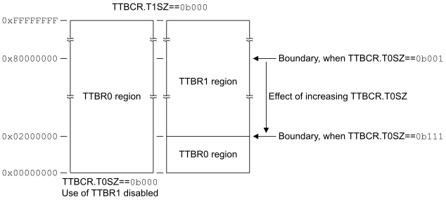

# ​G5.5.5 Selecting between TTBR0 and TTBR1, VMSAv8-32 Long-descriptor translation table format

Source: <https://developer.arm.com/documentation/ddi0487/mc/-Part-G-The-AArch32-System-Level-Architecture/-Chapter-G5-The-AArch32-Virtual-Memory-System-Architecture/-G5-5-The-VMSAv8-32-Long-descriptor-translation-table-format/-G5-5-5-Selecting-between-TTBR0-and-TTBR1--VMSAv8-32-Long-descriptor-translation-table-format>

##### G5.5.5 Selecting between TTBR0 and TTBR1, VMSAv8-32 Long-descriptor translation table format

As described in [Determining the translation table base address in the VMSAv8-32 translation regimes](/documentation/ddi0487/mc/-Part-G-The-AArch32-System-Level-Architecture/-Chapter-G5-The-AArch32-Virtual-Memory-System-Architecture/-G5-3-Translation-tables/-G5-3-3-Determining-the-translation-table-base-address-in-the-VMSAv8-32-translation-regimes?lang=en#beigabed), two sets of translation tables can be defined for each of the PL1&0 stage 1 translations, and [TTBR0](/documentation/ddi0487/mc/-Part-G-The-AArch32-System-Level-Architecture/-Chapter-G8-AArch32-System-Register-Descriptions/-G8-2-General-system-control-registers/-G8-2-167-TTBR0--Translation-Table-Base-Register-0?lang=en#reg_aarch32_ttbr0) and [TTBR1](/documentation/ddi0487/mc/-Part-G-The-AArch32-System-Level-Architecture/-Chapter-G8-AArch32-System-Register-Descriptions/-G8-2-General-system-control-registers/-G8-2-168-TTBR1--Translation-Table-Base-Register-1?lang=en#reg_aarch32_ttbr1) hold the base addresses for the two sets of tables. The Long-descriptor translation table format provides more flexibility in defining the boundary between using [TTBR0](/documentation/ddi0487/mc/-Part-G-The-AArch32-System-Level-Architecture/-Chapter-G8-AArch32-System-Register-Descriptions/-G8-2-General-system-control-registers/-G8-2-167-TTBR0--Translation-Table-Base-Register-0?lang=en#reg_aarch32_ttbr0) and using [TTBR1](/documentation/ddi0487/mc/-Part-G-The-AArch32-System-Level-Architecture/-Chapter-G8-AArch32-System-Register-Descriptions/-G8-2-General-system-control-registers/-G8-2-168-TTBR1--Translation-Table-Base-Register-1?lang=en#reg_aarch32_ttbr1). When a PL1&0 stage 1 address translation is enabled, [TTBR0](/documentation/ddi0487/mc/-Part-G-The-AArch32-System-Level-Architecture/-Chapter-G8-AArch32-System-Register-Descriptions/-G8-2-General-system-control-registers/-G8-2-167-TTBR0--Translation-Table-Base-Register-0?lang=en#reg_aarch32_ttbr0) is always used. If [TTBR1](/documentation/ddi0487/mc/-Part-G-The-AArch32-System-Level-Architecture/-Chapter-G8-AArch32-System-Register-Descriptions/-G8-2-General-system-control-registers/-G8-2-168-TTBR1--Translation-Table-Base-Register-1?lang=en#reg_aarch32_ttbr1) is also used then:

- [TTBR1](/documentation/ddi0487/mc/-Part-G-The-AArch32-System-Level-Architecture/-Chapter-G8-AArch32-System-Register-Descriptions/-G8-2-General-system-control-registers/-G8-2-168-TTBR1--Translation-Table-Base-Register-1?lang=en#reg_aarch32_ttbr1) is used for the top part of the input address range.
- [TTBR0](/documentation/ddi0487/mc/-Part-G-The-AArch32-System-Level-Architecture/-Chapter-G8-AArch32-System-Register-Descriptions/-G8-2-General-system-control-registers/-G8-2-167-TTBR0--Translation-Table-Base-Register-0?lang=en#reg_aarch32_ttbr0) is used for the bottom part of the input address range.

The [TTBCR](/documentation/ddi0487/mc/-Part-G-The-AArch32-System-Level-Architecture/-Chapter-G8-AArch32-System-Register-Descriptions/-G8-2-General-system-control-registers/-G8-2-165-TTBCR--Translation-Table-Base-Control-Register?lang=en#reg_aarch32_ttbcr).T0SZ and [TTBCR](/documentation/ddi0487/mc/-Part-G-The-AArch32-System-Level-Architecture/-Chapter-G8-AArch32-System-Register-Descriptions/-G8-2-General-system-control-registers/-G8-2-165-TTBCR--Translation-Table-Base-Control-Register?lang=en#reg_aarch32_ttbcr).T1SZ size fields control the use of [TTBR0](/documentation/ddi0487/mc/-Part-G-The-AArch32-System-Level-Architecture/-Chapter-G8-AArch32-System-Register-Descriptions/-G8-2-General-system-control-registers/-G8-2-167-TTBR0--Translation-Table-Base-Register-0?lang=en#reg_aarch32_ttbr0) and [TTBR1](/documentation/ddi0487/mc/-Part-G-The-AArch32-System-Level-Architecture/-Chapter-G8-AArch32-System-Register-Descriptions/-G8-2-General-system-control-registers/-G8-2-168-TTBR1--Translation-Table-Base-Register-1?lang=en#reg_aarch32_ttbr1), as [Table G5-2](/documentation/ddi0487/mc/-Part-G-The-AArch32-System-Level-Architecture/-Chapter-G5-The-AArch32-Virtual-Memory-System-Architecture/-G5-5-The-VMSAv8-32-Long-descriptor-translation-table-format/-G5-5-5-Selecting-between-TTBR0-and-TTBR1--VMSAv8-32-Long-descriptor-translation-table-format?lang=en#tbl_beigdibi) shows.

<table id="tbl_beigdibi">
 <caption>
  Table G5-2 Use of TTBR0 and TTBR1, Long-descriptor format
 </caption>
 <colgroup>
  <col/>
  <col/>
  <col/>
  <col/>
 </colgroup>
 <thead>
  <tr>
   <th colspan="2">
    TTBCR
   </th>
   <th colspan="2">
    Input address range using:
   </th>
  </tr>
  <tr>
   <th>
    T0SZ
   </th>
   <th>
    T1SZ
   </th>
   <th>
    TTBR0
   </th>
   <th>
    TTBR1
   </th>
  </tr>
 </thead>
 <tbody>
  <tr>
   <td>
    <code>
     0b000
    </code>
   </td>
   <td>
    <code>
     0b000
    </code>
   </td>
   <td>
    All addresses
   </td>
   <td>
    Not used
   </td>
  </tr>
  <tr>
   <td>
    <em>
     M
    </em>
    <a class="document-topic" document-topic-path="/ddi0487/mc/-Part-G-The-AArch32-System-Level-Architecture/-Chapter-G5-The-AArch32-Virtual-Memory-System-Architecture/-G5-5-The-VMSAv8-32-Long-descriptor-translation-table-format/-G5-5-5-Selecting-between-TTBR0-and-TTBR1--VMSAv8-32-Long-descriptor-translation-table-format?lang=en#fn_tbl_beigdibi_a" href="/documentation/ddi0487/mc/-Part-G-The-AArch32-System-Level-Architecture/-Chapter-G5-The-AArch32-Virtual-Memory-System-Architecture/-G5-5-The-VMSAv8-32-Long-descriptor-translation-table-format/-G5-5-5-Selecting-between-TTBR0-and-TTBR1--VMSAv8-32-Long-descriptor-translation-table-format?lang=en#fn_tbl_beigdibi_a">
     
      a
     
    </a>
   </td>
   <td>
    <code>
     0b000
    </code>
   </td>
   <td>
    Zero to (2
    
     (32-
     <em>
      M
     </em>
     )
    
    -1)
   </td>
   <td>
    2
    
     32-
     <em>
      M
     </em>
    
    to maximum input address
   </td>
  </tr>
  <tr>
   <td>
    <code>
     0b000
    </code>
   </td>
   <td>
    <em>
     N
    </em>
    <a class="document-topic" document-topic-path="/ddi0487/mc/-Part-G-The-AArch32-System-Level-Architecture/-Chapter-G5-The-AArch32-Virtual-Memory-System-Architecture/-G5-5-The-VMSAv8-32-Long-descriptor-translation-table-format/-G5-5-5-Selecting-between-TTBR0-and-TTBR1--VMSAv8-32-Long-descriptor-translation-table-format?lang=en#fn_tbl_beigdibi_a" href="/documentation/ddi0487/mc/-Part-G-The-AArch32-System-Level-Architecture/-Chapter-G5-The-AArch32-Virtual-Memory-System-Architecture/-G5-5-The-VMSAv8-32-Long-descriptor-translation-table-format/-G5-5-5-Selecting-between-TTBR0-and-TTBR1--VMSAv8-32-Long-descriptor-translation-table-format?lang=en#fn_tbl_beigdibi_a">
     
      a
     
    </a>
   </td>
   <td>
    Zero to (2
    
     32
    
    -2
    
     (32-
     <em>
      N
     </em>
     )
    
    -1)
   </td>
   <td>
    2
    
     32
    
    -2
    
     (32-
     <em>
      N
     </em>
     )
    
    to maximum input address
   </td>
  </tr>
  <tr>
   <td>
    <em>
     M
    </em>
    <a class="document-topic" document-topic-path="/ddi0487/mc/-Part-G-The-AArch32-System-Level-Architecture/-Chapter-G5-The-AArch32-Virtual-Memory-System-Architecture/-G5-5-The-VMSAv8-32-Long-descriptor-translation-table-format/-G5-5-5-Selecting-between-TTBR0-and-TTBR1--VMSAv8-32-Long-descriptor-translation-table-format?lang=en#fn_tbl_beigdibi_a" href="/documentation/ddi0487/mc/-Part-G-The-AArch32-System-Level-Architecture/-Chapter-G5-The-AArch32-Virtual-Memory-System-Architecture/-G5-5-The-VMSAv8-32-Long-descriptor-translation-table-format/-G5-5-5-Selecting-between-TTBR0-and-TTBR1--VMSAv8-32-Long-descriptor-translation-table-format?lang=en#fn_tbl_beigdibi_a">
     
      a
     
    </a>
   </td>
   <td>
    <em>
     N
    </em>
    <a class="document-topic" document-topic-path="/ddi0487/mc/-Part-G-The-AArch32-System-Level-Architecture/-Chapter-G5-The-AArch32-Virtual-Memory-System-Architecture/-G5-5-The-VMSAv8-32-Long-descriptor-translation-table-format/-G5-5-5-Selecting-between-TTBR0-and-TTBR1--VMSAv8-32-Long-descriptor-translation-table-format?lang=en#fn_tbl_beigdibi_a" href="/documentation/ddi0487/mc/-Part-G-The-AArch32-System-Level-Architecture/-Chapter-G5-The-AArch32-Virtual-Memory-System-Architecture/-G5-5-The-VMSAv8-32-Long-descriptor-translation-table-format/-G5-5-5-Selecting-between-TTBR0-and-TTBR1--VMSAv8-32-Long-descriptor-translation-table-format?lang=en#fn_tbl_beigdibi_a">
     
      a
     
    </a>
   </td>
   <td>
    Zero to (2
    
     (32-
     <em>
      M
     </em>
     )
    
    -1)
   </td>
   <td>
    2
    
     32
    
    -2
    
     (32-
     <em>
      N
     </em>
     )
    
    to maximum input address
   </td>
  </tr>
 </tbody>
</table>

a. *M*, *N* must be greater than 0. The maximum possible value for each of T0SZ and T1SZ is 7.

For stage 1 translations, the input address is always a VA, and the maximum possible VA is (232-1).

When address translation is using the Long-descriptor translation table format:

- [Figure G5-12](/documentation/ddi0487/mc/-Part-G-The-AArch32-System-Level-Architecture/-Chapter-G5-The-AArch32-Virtual-Memory-System-Architecture/-G5-5-The-VMSAv8-32-Long-descriptor-translation-table-format/-G5-5-5-Selecting-between-TTBR0-and-TTBR1--VMSAv8-32-Long-descriptor-translation-table-format?lang=en#fig_beiiijgi) shows how, when [TTBCR](/documentation/ddi0487/mc/-Part-G-The-AArch32-System-Level-Architecture/-Chapter-G8-AArch32-System-Register-Descriptions/-G8-2-General-system-control-registers/-G8-2-165-TTBCR--Translation-Table-Base-Control-Register?lang=en#reg_aarch32_ttbcr).T1SZ is zero, the value of [TTBCR](/documentation/ddi0487/mc/-Part-G-The-AArch32-System-Level-Architecture/-Chapter-G8-AArch32-System-Register-Descriptions/-G8-2-General-system-control-registers/-G8-2-165-TTBCR--Translation-Table-Base-Control-Register?lang=en#reg_aarch32_ttbcr).T0SZ controls the boundary between VAs that are translated using [TTBR0](/documentation/ddi0487/mc/-Part-G-The-AArch32-System-Level-Architecture/-Chapter-G8-AArch32-System-Register-Descriptions/-G8-2-General-system-control-registers/-G8-2-167-TTBR0--Translation-Table-Base-Register-0?lang=en#reg_aarch32_ttbr0), and VAs that are translated using [TTBR1](/documentation/ddi0487/mc/-Part-G-The-AArch32-System-Level-Architecture/-Chapter-G8-AArch32-System-Register-Descriptions/-G8-2-General-system-control-registers/-G8-2-168-TTBR1--Translation-Table-Base-Register-1?lang=en#reg_aarch32_ttbr1).

  Figure G5-12 Control of TTBR boundary, when TTBCR.T1SZ is zero

  
- [Figure G5-13](/documentation/ddi0487/mc/-Part-G-The-AArch32-System-Level-Architecture/-Chapter-G5-The-AArch32-Virtual-Memory-System-Architecture/-G5-5-The-VMSAv8-32-Long-descriptor-translation-table-format/-G5-5-5-Selecting-between-TTBR0-and-TTBR1--VMSAv8-32-Long-descriptor-translation-table-format?lang=en#fig_beiecjac) shows how, when [TTBCR](/documentation/ddi0487/mc/-Part-G-The-AArch32-System-Level-Architecture/-Chapter-G8-AArch32-System-Register-Descriptions/-G8-2-General-system-control-registers/-G8-2-165-TTBCR--Translation-Table-Base-Control-Register?lang=en#reg_aarch32_ttbcr).T1SZ is nonzero, the values of [TTBCR](/documentation/ddi0487/mc/-Part-G-The-AArch32-System-Level-Architecture/-Chapter-G8-AArch32-System-Register-Descriptions/-G8-2-General-system-control-registers/-G8-2-165-TTBCR--Translation-Table-Base-Control-Register?lang=en#reg_aarch32_ttbcr).T0SZ and [TTBCR](/documentation/ddi0487/mc/-Part-G-The-AArch32-System-Level-Architecture/-Chapter-G8-AArch32-System-Register-Descriptions/-G8-2-General-system-control-registers/-G8-2-165-TTBCR--Translation-Table-Base-Control-Register?lang=en#reg_aarch32_ttbcr).T1SZ control the boundaries between VAs that are translated using [TTBR0](/documentation/ddi0487/mc/-Part-G-The-AArch32-System-Level-Architecture/-Chapter-G8-AArch32-System-Register-Descriptions/-G8-2-General-system-control-registers/-G8-2-167-TTBR0--Translation-Table-Base-Register-0?lang=en#reg_aarch32_ttbr0), and VAs that are translated using [TTBR1](/documentation/ddi0487/mc/-Part-G-The-AArch32-System-Level-Architecture/-Chapter-G8-AArch32-System-Register-Descriptions/-G8-2-General-system-control-registers/-G8-2-168-TTBR1--Translation-Table-Base-Register-1?lang=en#reg_aarch32_ttbr1).

  Figure G5-13 Control of TTBR boundaries, when TTBCR.T1SZ is nonzero

  

  When T0SZ and T1SZ are both nonzero:

  - If both fields are set to `0b001`, the boundary between the two regions is `0x8000_0000`. This is identical to having T0SZ set to `0b000` and T1SZ set to `0b001`.
  - Otherwise, the [TTBR0](/documentation/ddi0487/mc/-Part-G-The-AArch32-System-Level-Architecture/-Chapter-G8-AArch32-System-Register-Descriptions/-G8-2-General-system-control-registers/-G8-2-167-TTBR0--Translation-Table-Base-Register-0?lang=en#reg_aarch32_ttbr0) and [TTBR1](/documentation/ddi0487/mc/-Part-G-The-AArch32-System-Level-Architecture/-Chapter-G8-AArch32-System-Register-Descriptions/-G8-2-General-system-control-registers/-G8-2-168-TTBR1--Translation-Table-Base-Register-1?lang=en#reg_aarch32_ttbr1) regions are non-contiguous. In this case, any attempt to access an address that is in that gap between the [TTBR0](/documentation/ddi0487/mc/-Part-G-The-AArch32-System-Level-Architecture/-Chapter-G8-AArch32-System-Register-Descriptions/-G8-2-General-system-control-registers/-G8-2-167-TTBR0--Translation-Table-Base-Register-0?lang=en#reg_aarch32_ttbr0) and [TTBR1](/documentation/ddi0487/mc/-Part-G-The-AArch32-System-Level-Architecture/-Chapter-G8-AArch32-System-Register-Descriptions/-G8-2-General-system-control-registers/-G8-2-168-TTBR1--Translation-Table-Base-Register-1?lang=en#reg_aarch32_ttbr1) regions generates a Translation fault.

    > #### Note
    >
    > The handling of the Contiguous bit can mean that the boundary between the translation regions defined by the [TCR\_EL1](/documentation/ddi0487/mc/-Part-D-The-AArch64-System-Level-Architecture/-Chapter-D24-AArch64-System-Register-Descriptions/-D24-2-General-system-control-registers/-D24-2-193-TCR-EL1--Translation-Control-Register--EL1-?lang=en#reg_aarch64_tcr_el1).TnSZ values and the region for which an access generates a Translation fault is wider than shown in [Figure G5-13](/documentation/ddi0487/mc/-Part-G-The-AArch32-System-Level-Architecture/-Chapter-G5-The-AArch32-Virtual-Memory-System-Architecture/-G5-5-The-VMSAv8-32-Long-descriptor-translation-table-format/-G5-5-5-Selecting-between-TTBR0-and-TTBR1--VMSAv8-32-Long-descriptor-translation-table-format?lang=en#fig_beiecjac). That is, if the descriptor for an access to the region shown as generating a fault has the Contiguous bit set to 1, the access might not generate a fault. [Possible errors in programming the translation table registers](/documentation/ddi0487/mc/-Part-G-The-AArch32-System-Level-Architecture/-Chapter-G5-The-AArch32-Virtual-Memory-System-Architecture/-G5-5-The-VMSAv8-32-Long-descriptor-translation-table-format/-G5-5-5-Selecting-between-TTBR0-and-TTBR1--VMSAv8-32-Long-descriptor-translation-table-format?lang=en#chdeciag) describes this possibility.

When using the Long-descriptor translation table format:

- The [TTBCR](/documentation/ddi0487/mc/-Part-G-The-AArch32-System-Level-Architecture/-Chapter-G8-AArch32-System-Register-Descriptions/-G8-2-General-system-control-registers/-G8-2-165-TTBCR--Translation-Table-Base-Control-Register?lang=en#reg_aarch32_ttbcr) contains fields that define memory region attributes for the translation table walk, for each TTBR. These are the SH0, ORGN0, IRGN0, SH1, ORGN1, and IRGN1 bits.
- [TTBR0](/documentation/ddi0487/mc/-Part-G-The-AArch32-System-Level-Architecture/-Chapter-G8-AArch32-System-Register-Descriptions/-G8-2-General-system-control-registers/-G8-2-167-TTBR0--Translation-Table-Base-Register-0?lang=en#reg_aarch32_ttbr0) and [TTBR1](/documentation/ddi0487/mc/-Part-G-The-AArch32-System-Level-Architecture/-Chapter-G8-AArch32-System-Register-Descriptions/-G8-2-General-system-control-registers/-G8-2-168-TTBR1--Translation-Table-Base-Register-1?lang=en#reg_aarch32_ttbr1) each contain an ASID field, and the [TTBCR](/documentation/ddi0487/mc/-Part-G-The-AArch32-System-Level-Architecture/-Chapter-G8-AArch32-System-Register-Descriptions/-G8-2-General-system-control-registers/-G8-2-165-TTBCR--Translation-Table-Base-Control-Register?lang=en#reg_aarch32_ttbcr).A1 field selects which ASID to use.

For this translation table format, [VMSAv8-32 Long-descriptor translation table format address lookup levels](/documentation/ddi0487/mc/-Part-G-The-AArch32-System-Level-Architecture/-Chapter-G5-The-AArch32-Virtual-Memory-System-Architecture/-G5-5-The-VMSAv8-32-Long-descriptor-translation-table-format/-G5-5-6-VMSAv8-32-Long-descriptor-translation-table-format-address-lookup-levels?lang=en#beieaejg) summarizes the lookup levels, and [Translation table walks, when using the VMSAv8-32 Long-descriptor translation table format](/documentation/ddi0487/mc/-Part-G-The-AArch32-System-Level-Architecture/-Chapter-G5-The-AArch32-Virtual-Memory-System-Architecture/-G5-5-The-VMSAv8-32-Long-descriptor-translation-table-format/-G5-5-7-Translation-table-walks--when-using-the-VMSAv8-32-Long-descriptor-translation-table-format?lang=en#chdgeafa) describes the possible translations.

###### G5.5.5.1 Possible errors in programming the translation table registers

In all the descriptions in this subsection, the *size of the input address* supported for a PL1&0 stage 1 translation refers to the size specified by a [TTBCR](/documentation/ddi0487/mc/-Part-G-The-AArch32-System-Level-Architecture/-Chapter-G8-AArch32-System-Register-Descriptions/-G8-2-General-system-control-registers/-G8-2-165-TTBCR--Translation-Table-Base-Control-Register?lang=en#reg_aarch32_ttbcr).TxSZ field.

> #### Note
>
> For a PL1&0 stage 1 translation, the input address range can be split so that the lower addresses are translated by [TTBR0](/documentation/ddi0487/mc/-Part-G-The-AArch32-System-Level-Architecture/-Chapter-G8-AArch32-System-Register-Descriptions/-G8-2-General-system-control-registers/-G8-2-167-TTBR0--Translation-Table-Base-Register-0?lang=en#reg_aarch32_ttbr0) and the higher addresses are translated by [TTBR1](/documentation/ddi0487/mc/-Part-G-The-AArch32-System-Level-Architecture/-Chapter-G8-AArch32-System-Register-Descriptions/-G8-2-General-system-control-registers/-G8-2-168-TTBR1--Translation-Table-Base-Register-1?lang=en#reg_aarch32_ttbr1). In this case, each of input address sizes specified by [TTBCR](/documentation/ddi0487/mc/-Part-G-The-AArch32-System-Level-Architecture/-Chapter-G8-AArch32-System-Register-Descriptions/-G8-2-General-system-control-registers/-G8-2-165-TTBCR--Translation-Table-Base-Control-Register?lang=en#reg_aarch32_ttbcr).{T0SZ, T1SZ} is smaller than the total address size supported by the stage of translation.

The following are possible errors in the programming of [TTBR0](/documentation/ddi0487/mc/-Part-G-The-AArch32-System-Level-Architecture/-Chapter-G8-AArch32-System-Register-Descriptions/-G8-2-General-system-control-registers/-G8-2-167-TTBR0--Translation-Table-Base-Register-0?lang=en#reg_aarch32_ttbr0), [TTBR1](/documentation/ddi0487/mc/-Part-G-The-AArch32-System-Level-Architecture/-Chapter-G8-AArch32-System-Register-Descriptions/-G8-2-General-system-control-registers/-G8-2-168-TTBR1--Translation-Table-Base-Register-1?lang=en#reg_aarch32_ttbr1), and [TTBCR](/documentation/ddi0487/mc/-Part-G-The-AArch32-System-Level-Architecture/-Chapter-G8-AArch32-System-Register-Descriptions/-G8-2-General-system-control-registers/-G8-2-165-TTBCR--Translation-Table-Base-Control-Register?lang=en#reg_aarch32_ttbcr). For the translation of a particular address at a particular stage of translation, either:

- The block size being used to translate the address is larger than the size of the input address supported at a stage of translation used in performing the required translation. This can occur only for the PL1&0 stage 1 translations, and only when either [TTBCR](/documentation/ddi0487/mc/-Part-G-The-AArch32-System-Level-Architecture/-Chapter-G8-AArch32-System-Register-Descriptions/-G8-2-General-system-control-registers/-G8-2-165-TTBCR--Translation-Table-Base-Control-Register?lang=en#reg_aarch32_ttbcr).T0SZ or [TTBCR](/documentation/ddi0487/mc/-Part-G-The-AArch32-System-Level-Architecture/-Chapter-G8-AArch32-System-Register-Descriptions/-G8-2-General-system-control-registers/-G8-2-165-TTBCR--Translation-Table-Base-Control-Register?lang=en#reg_aarch32_ttbcr).T1SZ is zero, meaning there is no gap between the address range translated by [TTBR0](/documentation/ddi0487/mc/-Part-G-The-AArch32-System-Level-Architecture/-Chapter-G8-AArch32-System-Register-Descriptions/-G8-2-General-system-control-registers/-G8-2-167-TTBR0--Translation-Table-Base-Register-0?lang=en#reg_aarch32_ttbr0) and the range translated by [TTBR1](/documentation/ddi0487/mc/-Part-G-The-AArch32-System-Level-Architecture/-Chapter-G8-AArch32-System-Register-Descriptions/-G8-2-General-system-control-registers/-G8-2-168-TTBR1--Translation-Table-Base-Register-1?lang=en#reg_aarch32_ttbr1). In this case, this programming error occurs if a block translated from the region that has TxSZ set to zero straddles the boundary between the two address ranges. [Example G5-2](/documentation/ddi0487/mc/-Part-G-The-AArch32-System-Level-Architecture/-Chapter-G5-The-AArch32-Virtual-Memory-System-Architecture/-G5-5-The-VMSAv8-32-Long-descriptor-translation-table-format/-G5-5-5-Selecting-between-TTBR0-and-TTBR1--VMSAv8-32-Long-descriptor-translation-table-format?lang=en#ex_beieahda) shows an example of this misprogramming.
- The address range translated by a set of blocks marked as contiguous, by use of the contiguous bit, is larger than the size of the input address supported at a stage of translation used in performing the required translation.

> Example G5-2 Error in programming the translation table registers
>
> If [TTBCR](/documentation/ddi0487/mc/-Part-G-The-AArch32-System-Level-Architecture/-Chapter-G8-AArch32-System-Register-Descriptions/-G8-2-General-system-control-registers/-G8-2-165-TTBCR--Translation-Table-Base-Control-Register?lang=en#reg_aarch32_ttbcr).T0SZ is programmed to 0 and [TTBCR](/documentation/ddi0487/mc/-Part-G-The-AArch32-System-Level-Architecture/-Chapter-G8-AArch32-System-Register-Descriptions/-G8-2-General-system-control-registers/-G8-2-165-TTBCR--Translation-Table-Base-Control-Register?lang=en#reg_aarch32_ttbcr).T1SZ is programmed to 7, this means:
>
> - [TTBR0](/documentation/ddi0487/mc/-Part-G-The-AArch32-System-Level-Architecture/-Chapter-G8-AArch32-System-Register-Descriptions/-G8-2-General-system-control-registers/-G8-2-167-TTBR0--Translation-Table-Base-Register-0?lang=en#reg_aarch32_ttbr0) translates addresses in the range `0x0000_0000`-`0xFDFF_FFFF`.
> - [TTBR1](/documentation/ddi0487/mc/-Part-G-The-AArch32-System-Level-Architecture/-Chapter-G8-AArch32-System-Register-Descriptions/-G8-2-General-system-control-registers/-G8-2-168-TTBR1--Translation-Table-Base-Register-1?lang=en#reg_aarch32_ttbr1) translates addresses in the range `0xFE00_0000`-`0xFFFF_FFFF`.
>
> The translation table indicated by [TTBR0](/documentation/ddi0487/mc/-Part-G-The-AArch32-System-Level-Architecture/-Chapter-G8-AArch32-System-Register-Descriptions/-G8-2-General-system-control-registers/-G8-2-167-TTBR0--Translation-Table-Base-Register-0?lang=en#reg_aarch32_ttbr0) might be programmed with a block entry for a 1GB region starting at `0xC000_0000`. This covers the address range `0xC000_0000`-`0xFFFF_FFFF`, that overlaps the [TTBR1](/documentation/ddi0487/mc/-Part-G-The-AArch32-System-Level-Architecture/-Chapter-G8-AArch32-System-Register-Descriptions/-G8-2-General-system-control-registers/-G8-2-168-TTBR1--Translation-Table-Base-Register-1?lang=en#reg_aarch32_ttbr1) address range. This means this block size is larger than the input address size supported for translations using [TTBR0](/documentation/ddi0487/mc/-Part-G-The-AArch32-System-Level-Architecture/-Chapter-G8-AArch32-System-Register-Descriptions/-G8-2-General-system-control-registers/-G8-2-167-TTBR0--Translation-Table-Base-Register-0?lang=en#reg_aarch32_ttbr0), and therefore this is a programming error.
>
> To understand why this must be a programming error, consider a memory access to address `0xFFFF_0000`. According to the [TTBCR](/documentation/ddi0487/mc/-Part-G-The-AArch32-System-Level-Architecture/-Chapter-G8-AArch32-System-Register-Descriptions/-G8-2-General-system-control-registers/-G8-2-165-TTBCR--Translation-Table-Base-Control-Register?lang=en#reg_aarch32_ttbcr).{T0SZ, T1SZ} values, this must be translated using [TTBR1](/documentation/ddi0487/mc/-Part-G-The-AArch32-System-Level-Architecture/-Chapter-G8-AArch32-System-Register-Descriptions/-G8-2-General-system-control-registers/-G8-2-168-TTBR1--Translation-Table-Base-Register-1?lang=en#reg_aarch32_ttbr1). However, the access matches a TLB entry for the translation, using [TTBR0](/documentation/ddi0487/mc/-Part-G-The-AArch32-System-Level-Architecture/-Chapter-G8-AArch32-System-Register-Descriptions/-G8-2-General-system-control-registers/-G8-2-167-TTBR0--Translation-Table-Base-Register-0?lang=en#reg_aarch32_ttbr0), of the block at `0xC000_0000`. Hardware is not required to detect that the access to `0xFFFF_0000` is being translated incorrectly.

In these cases, an implementation might use one of the following approaches:

- Treat such a block as causing a Translation fault, even though the block is valid, and the address accessed within that block is within the size of the input address supported at a stage of translation.

  The block might be a block within a contiguous set of blocks.
- Treat such a block as not causing a Translation fault, even though the address accessed within that block is outside the size of the input address supported at a stage of translation, provided that both of the following apply:

  - The block is valid.
  - At least one address within the block, or contiguous set of blocks, is within the size of the input address supported at a stage of translation.

  The block might be a block within a contiguous set of blocks.

Additional constraints apply to programming the [VTCR](/documentation/ddi0487/mc/-Part-G-The-AArch32-System-Level-Architecture/-Chapter-G8-AArch32-System-Register-Descriptions/-G8-2-General-system-control-registers/-G8-2-172-VTCR--Virtualization-Translation-Control-Register?lang=en#reg_aarch32_vtcr), see [Determining the required initial lookup level for stage 2 translations](/documentation/ddi0487/mc/-Part-G-The-AArch32-System-Level-Architecture/-Chapter-G5-The-AArch32-Virtual-Memory-System-Architecture/-G5-5-The-VMSAv8-32-Long-descriptor-translation-table-format/-G5-5-7-Translation-table-walks--when-using-the-VMSAv8-32-Long-descriptor-translation-table-format?lang=en#beicfaga).
