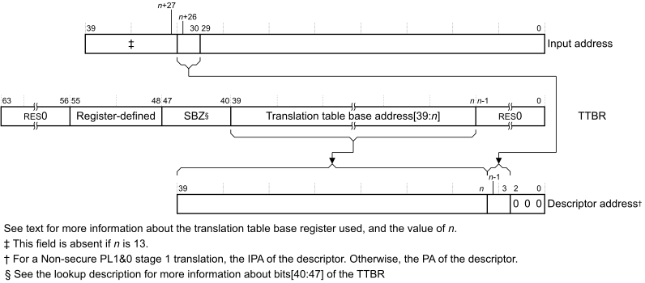

# ​G5.5.7 Translation table walks, when using the VMSAv8-32 Long-descriptor translation table format

Source: <https://developer.arm.com/documentation/ddi0487/mc/-Part-G-The-AArch32-System-Level-Architecture/-Chapter-G5-The-AArch32-Virtual-Memory-System-Architecture/-G5-5-The-VMSAv8-32-Long-descriptor-translation-table-format/-G5-5-7-Translation-table-walks--when-using-the-VMSAv8-32-Long-descriptor-translation-table-format>

##### G5.5.7 Translation table walks, when using the VMSAv8-32 Long-descriptor translation table format

[Figure G5-2](/documentation/ddi0487/mc/-Part-G-The-AArch32-System-Level-Architecture/-Chapter-G5-The-AArch32-Virtual-Memory-System-Architecture/-G5-1-About-VMSAv8-32/-G5-1-4-About-address-translation-for-VMSAv8-32?lang=en#fig_beigcedg) shows the possible address translations. If a stage of translation is controlled from an Exception level that is using AArch32, the input and output address constraints and the registers that control the translation are as follows:

Stage 1 translations
:   For all stage 1 translations:

    - The input address range is up to 32 bits, as determined by either:

      - [TTBCR](/documentation/ddi0487/mc/-Part-G-The-AArch32-System-Level-Architecture/-Chapter-G8-AArch32-System-Register-Descriptions/-G8-2-General-system-control-registers/-G8-2-165-TTBCR--Translation-Table-Base-Control-Register?lang=en#reg_aarch32_ttbcr).T0SZ or [TTBCR](/documentation/ddi0487/mc/-Part-G-The-AArch32-System-Level-Architecture/-Chapter-G8-AArch32-System-Register-Descriptions/-G8-2-General-system-control-registers/-G8-2-165-TTBCR--Translation-Table-Base-Control-Register?lang=en#reg_aarch32_ttbcr).T1SZ, for a PL1&0 stage 1 translation.
      - [HTCR](/documentation/ddi0487/mc/-Part-G-The-AArch32-System-Level-Architecture/-Chapter-G8-AArch32-System-Register-Descriptions/-G8-2-General-system-control-registers/-G8-2-76-HTCR--Hyp-Translation-Control-Register?lang=en#reg_aarch32_htcr).T0SZ, for an EL2 stage 1 translation.
    - The output address range is 40 bits.

    The stage 1 translations are:

    Non-secure PL1&0 stage 1 translation
    :   The stage 1 translation for memory accesses from Non-secure modes other than Hyp mode. This translates a VA to an IPA. For this translation, when Non-secure EL1 is using AArch32:

        - Non-secure [TTBR0](/documentation/ddi0487/mc/-Part-G-The-AArch32-System-Level-Architecture/-Chapter-G8-AArch32-System-Register-Descriptions/-G8-2-General-system-control-registers/-G8-2-167-TTBR0--Translation-Table-Base-Register-0?lang=en#reg_aarch32_ttbr0) or [TTBR1](/documentation/ddi0487/mc/-Part-G-The-AArch32-System-Level-Architecture/-Chapter-G8-AArch32-System-Register-Descriptions/-G8-2-General-system-control-registers/-G8-2-168-TTBR1--Translation-Table-Base-Register-1?lang=en#reg_aarch32_ttbr1) holds the translation table base address.
        - Non-secure [TTBCR](/documentation/ddi0487/mc/-Part-G-The-AArch32-System-Level-Architecture/-Chapter-G8-AArch32-System-Register-Descriptions/-G8-2-General-system-control-registers/-G8-2-165-TTBCR--Translation-Table-Base-Control-Register?lang=en#reg_aarch32_ttbcr) determines which TTBR is used.

    Non-secure EL2 stage 1 translation
    :   The stage 1 translation for memory accesses from Hyp mode, translates a VA to a PA. For this translation, when EL2 is using AArch32, [HTTBR](/documentation/ddi0487/mc/-Part-G-The-AArch32-System-Level-Architecture/-Chapter-G8-AArch32-System-Register-Descriptions/-G8-2-General-system-control-registers/-G8-2-78-HTTBR--Hyp-Translation-Table-Base-Register?lang=en#reg_aarch32_httbr) holds the translation table base address.

    Secure PL1&0 stage 1 translation
    :   The stage 1 translation for memory accesses from Secure modes, translates a VA to a PA. For this translation, when the Secure PL1 modes are using AArch32:

        - Secure [TTBR0](/documentation/ddi0487/mc/-Part-G-The-AArch32-System-Level-Architecture/-Chapter-G8-AArch32-System-Register-Descriptions/-G8-2-General-system-control-registers/-G8-2-167-TTBR0--Translation-Table-Base-Register-0?lang=en#reg_aarch32_ttbr0) or [TTBR1](/documentation/ddi0487/mc/-Part-G-The-AArch32-System-Level-Architecture/-Chapter-G8-AArch32-System-Register-Descriptions/-G8-2-General-system-control-registers/-G8-2-168-TTBR1--Translation-Table-Base-Register-1?lang=en#reg_aarch32_ttbr1) holds the translation table base address.
        - Secure [TTBCR](/documentation/ddi0487/mc/-Part-G-The-AArch32-System-Level-Architecture/-Chapter-G8-AArch32-System-Register-Descriptions/-G8-2-General-system-control-registers/-G8-2-165-TTBCR--Translation-Table-Base-Control-Register?lang=en#reg_aarch32_ttbcr) determines which TTBR is used.

Stage 2 translation
:   Non-secure PL1&0 stage 2 translation
    :   The stage 2 translation for memory accesses from Non-secure modes other than Hyp mode, and translates an IPA to a PA. For this translation, when EL2 is using AArch32:

        - The input address range is 40 bits, and [VTCR](/documentation/ddi0487/mc/-Part-G-The-AArch32-System-Level-Architecture/-Chapter-G8-AArch32-System-Register-Descriptions/-G8-2-General-system-control-registers/-G8-2-172-VTCR--Virtualization-Translation-Control-Register?lang=en#reg_aarch32_vtcr).T0SZ determines the input address size.
        - The output address range depends on the implemented memory system, and is up to 40 bits.
        - [VTTBR](/documentation/ddi0487/mc/-Part-G-The-AArch32-System-Level-Architecture/-Chapter-G8-AArch32-System-Register-Descriptions/-G8-2-General-system-control-registers/-G8-2-173-VTTBR--Virtualization-Translation-Table-Base-Register?lang=en#reg_aarch32_vttbr) holds the translation table base address.
        - [VTCR](/documentation/ddi0487/mc/-Part-G-The-AArch32-System-Level-Architecture/-Chapter-G8-AArch32-System-Register-Descriptions/-G8-2-General-system-control-registers/-G8-2-172-VTCR--Virtualization-Translation-Control-Register?lang=en#reg_aarch32_vtcr) specifies the required input address range, and whether the initial lookup is at level 1 or at level 2.

The descriptions of the VMSAv8-32 translation stages state that the maximum output address size is 40 bits. However, the register and Long-descriptor Format descriptor fields that hold these addresses are 48 bits wide. If bits[47:40] of an output address are not all zero, then the address generates an Address size fault.

The Long-descriptor translation table format provides up to three levels of address lookup, as described in [VMSAv8-32 Long-descriptor translation table format address lookup levels](/documentation/ddi0487/mc/-Part-G-The-AArch32-System-Level-Architecture/-Chapter-G5-The-AArch32-Virtual-Memory-System-Architecture/-G5-5-The-VMSAv8-32-Long-descriptor-translation-table-format/-G5-5-6-VMSAv8-32-Long-descriptor-translation-table-format-address-lookup-levels?lang=en#beieaejg), and the initial lookup, in which the MMU reads the translation table base address, is at either level 1 or level 2. The following determines the level of the initial lookup:

- For a stage 1 translation, the required input address range. For more information, see [Determining the required initial lookup level for stage 1 translations](/documentation/ddi0487/mc/-Part-G-The-AArch32-System-Level-Architecture/-Chapter-G5-The-AArch32-Virtual-Memory-System-Architecture/-G5-5-The-VMSAv8-32-Long-descriptor-translation-table-format/-G5-5-7-Translation-table-walks--when-using-the-VMSAv8-32-Long-descriptor-translation-table-format?lang=en#beibhdgf).
- For a stage 2 translation, the level specified by the [VTCR](/documentation/ddi0487/mc/-Part-G-The-AArch32-System-Level-Architecture/-Chapter-G8-AArch32-System-Register-Descriptions/-G8-2-General-system-control-registers/-G8-2-172-VTCR--Virtualization-Translation-Control-Register?lang=en#reg_aarch32_vtcr).SL0 field. For more information, see [Determining the required initial lookup level for stage 2 translations](/documentation/ddi0487/mc/-Part-G-The-AArch32-System-Level-Architecture/-Chapter-G5-The-AArch32-Virtual-Memory-System-Architecture/-G5-5-The-VMSAv8-32-Long-descriptor-translation-table-format/-G5-5-7-Translation-table-walks--when-using-the-VMSAv8-32-Long-descriptor-translation-table-format?lang=en#beicfaga).

  > #### Note
  >
  > For a stage 2 translation, the size of the required input address range constrains the [VTCR](/documentation/ddi0487/mc/-Part-G-The-AArch32-System-Level-Architecture/-Chapter-G8-AArch32-System-Register-Descriptions/-G8-2-General-system-control-registers/-G8-2-172-VTCR--Virtualization-Translation-Control-Register?lang=en#reg_aarch32_vtcr).SL0 value.

[Figure G5-14](/documentation/ddi0487/mc/-Part-G-The-AArch32-System-Level-Architecture/-Chapter-G5-The-AArch32-Virtual-Memory-System-Architecture/-G5-5-The-VMSAv8-32-Long-descriptor-translation-table-format/-G5-5-7-Translation-table-walks--when-using-the-VMSAv8-32-Long-descriptor-translation-table-format?lang=en#fig_chdhfcch) shows how the descriptor address for the initial lookup for a translation using the Long-descriptor translation table format is determined from the input address and the [TTBR](/documentation/ddi0487/mc/-Part-K-Appendixes/-Appendix-K14-Registers-Index/-K14-1-Introduction-and-register-disambiguation/-K14-1-1-Register-name-disambiguation-by-Execution-state?lang=en#cegcjgag) value. This figure shows the lookup for a translation that starts with a level 1 lookup, that translates bits[39:30] of the input address, zero extended if necessary.

Figure G5-14 VMSAv8-32 Long-descriptor initial lookup, starting at level 1

If bits[47:40] of the [TTBR](/documentation/ddi0487/mc/-Part-K-Appendixes/-Appendix-K14-Registers-Index/-K14-1-Introduction-and-register-disambiguation/-K14-1-1-Register-name-disambiguation-by-Execution-state?lang=en#cegcjgag) are not zero then the initial lookup will generate an Address size fault, see [Address size fault](/documentation/ddi0487/mc/-Part-G-The-AArch32-System-Level-Architecture/-Chapter-G5-The-AArch32-Virtual-Memory-System-Architecture/-G5-11-VMSAv8-32-memory-aborts/-G5-11-1-Types-of-MMU-faults?lang=en#chdefhib).

For a translation that starts with a level 1 lookup, as shown in [Figure G5-14](/documentation/ddi0487/mc/-Part-G-The-AArch32-System-Level-Architecture/-Chapter-G5-The-AArch32-Virtual-Memory-System-Architecture/-G5-5-The-VMSAv8-32-Long-descriptor-translation-table-format/-G5-5-7-Translation-table-walks--when-using-the-VMSAv8-32-Long-descriptor-translation-table-format?lang=en#fig_chdhfcch):

For a stage 1 translation
:   *n* is in the range 4-5 and:

    - For a memory access from Hyp mode:

      - [HTTBR](/documentation/ddi0487/mc/-Part-G-The-AArch32-System-Level-Architecture/-Chapter-G8-AArch32-System-Register-Descriptions/-G8-2-General-system-control-registers/-G8-2-78-HTTBR--Hyp-Translation-Table-Base-Register?lang=en#reg_aarch32_httbr) is the [TTBR](/documentation/ddi0487/mc/-Part-K-Appendixes/-Appendix-K14-Registers-Index/-K14-1-Introduction-and-register-disambiguation/-K14-1-1-Register-name-disambiguation-by-Execution-state?lang=en#cegcjgag).
      - *n*=5-([HTCR](/documentation/ddi0487/mc/-Part-G-The-AArch32-System-Level-Architecture/-Chapter-G8-AArch32-System-Register-Descriptions/-G8-2-General-system-control-registers/-G8-2-76-HTCR--Hyp-Translation-Control-Register?lang=en#reg_aarch32_htcr).T0SZ).
    - For other accesses:

      - The Secure or Non-secure instance of [TTBR0](/documentation/ddi0487/mc/-Part-G-The-AArch32-System-Level-Architecture/-Chapter-G8-AArch32-System-Register-Descriptions/-G8-2-General-system-control-registers/-G8-2-167-TTBR0--Translation-Table-Base-Register-0?lang=en#reg_aarch32_ttbr0) or [TTBR1](/documentation/ddi0487/mc/-Part-G-The-AArch32-System-Level-Architecture/-Chapter-G8-AArch32-System-Register-Descriptions/-G8-2-General-system-control-registers/-G8-2-168-TTBR1--Translation-Table-Base-Register-1?lang=en#reg_aarch32_ttbr1) is the [TTBR](/documentation/ddi0487/mc/-Part-K-Appendixes/-Appendix-K14-Registers-Index/-K14-1-Introduction-and-register-disambiguation/-K14-1-1-Register-name-disambiguation-by-Execution-state?lang=en#cegcjgag).
      - *n*=(5-[TTBCR](/documentation/ddi0487/mc/-Part-G-The-AArch32-System-Level-Architecture/-Chapter-G8-AArch32-System-Register-Descriptions/-G8-2-General-system-control-registers/-G8-2-165-TTBCR--Translation-Table-Base-Control-Register?lang=en#reg_aarch32_ttbcr).T*x*SZ), where *x* is 0 when using [TTBR0](/documentation/ddi0487/mc/-Part-G-The-AArch32-System-Level-Architecture/-Chapter-G8-AArch32-System-Register-Descriptions/-G8-2-General-system-control-registers/-G8-2-167-TTBR0--Translation-Table-Base-Register-0?lang=en#reg_aarch32_ttbr0), and 1 when using [TTBR1](/documentation/ddi0487/mc/-Part-G-The-AArch32-System-Level-Architecture/-Chapter-G8-AArch32-System-Register-Descriptions/-G8-2-General-system-control-registers/-G8-2-168-TTBR1--Translation-Table-Base-Register-1?lang=en#reg_aarch32_ttbr1).

For a stage 2 translation
:   *n* is in the range 4-13 and:

    - [VTTBR](/documentation/ddi0487/mc/-Part-G-The-AArch32-System-Level-Architecture/-Chapter-G8-AArch32-System-Register-Descriptions/-G8-2-General-system-control-registers/-G8-2-173-VTTBR--Virtualization-Translation-Table-Base-Register?lang=en#reg_aarch32_vttbr) is the [TTBR](/documentation/ddi0487/mc/-Part-K-Appendixes/-Appendix-K14-Registers-Index/-K14-1-Introduction-and-register-disambiguation/-K14-1-1-Register-name-disambiguation-by-Execution-state?lang=en#cegcjgag).
    - *n*=5-([VTCR](/documentation/ddi0487/mc/-Part-G-The-AArch32-System-Level-Architecture/-Chapter-G8-AArch32-System-Register-Descriptions/-G8-2-General-system-control-registers/-G8-2-172-VTCR--Virtualization-Translation-Control-Register?lang=en#reg_aarch32_vtcr).T0SZ).

For a translation that starts with a level 2 lookup, the descriptor address is obtained in the same way, except that bits[(*n*+17):21] of the input address provide bits[(*n*-1):3] of the descriptor address, where:

For a stage 1 translation
:   *n* is in the range 7-12. As [Determining the required initial lookup level for stage 1 translations](/documentation/ddi0487/mc/-Part-G-The-AArch32-System-Level-Architecture/-Chapter-G5-The-AArch32-Virtual-Memory-System-Architecture/-G5-5-The-VMSAv8-32-Long-descriptor-translation-table-format/-G5-5-7-Translation-table-walks--when-using-the-VMSAv8-32-Long-descriptor-translation-table-format?lang=en#beibhdgf) shows, for a stage 1 translation to start with a level 2 lookup, the corresponding T0SZ or T1SZ field must be 2 or more. This means:

    - For a memory access from Hyp mode, *n*=14-[HTCR](/documentation/ddi0487/mc/-Part-G-The-AArch32-System-Level-Architecture/-Chapter-G8-AArch32-System-Register-Descriptions/-G8-2-General-system-control-registers/-G8-2-76-HTCR--Hyp-Translation-Control-Register?lang=en#reg_aarch32_htcr).T0SZ.
    - For other memory accesses, *n*=14-([TTBCR](/documentation/ddi0487/mc/-Part-G-The-AArch32-System-Level-Architecture/-Chapter-G8-AArch32-System-Register-Descriptions/-G8-2-General-system-control-registers/-G8-2-165-TTBCR--Translation-Table-Base-Control-Register?lang=en#reg_aarch32_ttbcr).T*x*SZ), where *x* is 0 when using [TTBR0](/documentation/ddi0487/mc/-Part-G-The-AArch32-System-Level-Architecture/-Chapter-G8-AArch32-System-Register-Descriptions/-G8-2-General-system-control-registers/-G8-2-167-TTBR0--Translation-Table-Base-Register-0?lang=en#reg_aarch32_ttbr0), and 1 when using [TTBR1](/documentation/ddi0487/mc/-Part-G-The-AArch32-System-Level-Architecture/-Chapter-G8-AArch32-System-Register-Descriptions/-G8-2-General-system-control-registers/-G8-2-168-TTBR1--Translation-Table-Base-Register-1?lang=en#reg_aarch32_ttbr1).

For a stage 2 translation
:   *n* is in the range 7-16. For a stage 2 translation to start with a level 2 lookup, [VTCR](/documentation/ddi0487/mc/-Part-G-The-AArch32-System-Level-Architecture/-Chapter-G8-AArch32-System-Register-Descriptions/-G8-2-General-system-control-registers/-G8-2-172-VTCR--Virtualization-Translation-Control-Register?lang=en#reg_aarch32_vtcr).SL0 is `0b00`, and *n*=14-([VTCR](/documentation/ddi0487/mc/-Part-G-The-AArch32-System-Level-Architecture/-Chapter-G8-AArch32-System-Register-Descriptions/-G8-2-General-system-control-registers/-G8-2-172-VTCR--Virtualization-Translation-Control-Register?lang=en#reg_aarch32_vtcr).T0SZ).

The following sections describe how the level of the initial lookup is determined:

- [Determining the required initial lookup level for stage 1 translations](/documentation/ddi0487/mc/-Part-G-The-AArch32-System-Level-Architecture/-Chapter-G5-The-AArch32-Virtual-Memory-System-Architecture/-G5-5-The-VMSAv8-32-Long-descriptor-translation-table-format/-G5-5-7-Translation-table-walks--when-using-the-VMSAv8-32-Long-descriptor-translation-table-format?lang=en#beibhdgf).
- [Determining the required initial lookup level for stage 2 translations](/documentation/ddi0487/mc/-Part-G-The-AArch32-System-Level-Architecture/-Chapter-G5-The-AArch32-Virtual-Memory-System-Architecture/-G5-5-The-VMSAv8-32-Long-descriptor-translation-table-format/-G5-5-7-Translation-table-walks--when-using-the-VMSAv8-32-Long-descriptor-translation-table-format?lang=en#beicfaga).

[Address translation examples using the VMSAv8-32 Long descriptor translation table format](/documentation/ddi0487/mc/-Part-K-Appendixes/-Appendix-K8-Address-Translation-Examples/-K8-2-AArch32-Address-translation-examples/-K8-2-2-Address-translation-examples-using-the-VMSAv8-32-Long-descriptor-translation-table-format?lang=en#babfahie) shows examples of full translation flows, to an entry for a 4KB memory page, for lookups starting at level 1 and lookups starting at level 2.

###### G5.5.7.1 Determining the required initial lookup level for stage 1 translations

For a stage 1 translation, the required input address range, indicated by a T0SZ or T1SZ field in a translation table control register, determines the initial lookup level. The size of this input address region is 2(32-T*x*SZ) bytes, and if this size is:

- Less than or equal to 230 bytes, the required start is at level 2, and translation requires two levels of table to map to 4KB pages. This corresponds to a T*x*SZ value of 2 or more.
- More than 230 bytes, the required start is at level 1, and translation requires three levels of table to map to 4KB pages. This corresponds to a T*x*SZ value that is less than 2.

For the PL1&0 stage 1 translations, the [TTBCR](/documentation/ddi0487/mc/-Part-G-The-AArch32-System-Level-Architecture/-Chapter-G8-AArch32-System-Register-Descriptions/-G8-2-General-system-control-registers/-G8-2-165-TTBCR--Translation-Table-Base-Control-Register?lang=en#reg_aarch32_ttbcr):

- Splits the 32-bit VA input address range between [TTBR0](/documentation/ddi0487/mc/-Part-G-The-AArch32-System-Level-Architecture/-Chapter-G8-AArch32-System-Register-Descriptions/-G8-2-General-system-control-registers/-G8-2-167-TTBR0--Translation-Table-Base-Register-0?lang=en#reg_aarch32_ttbr0) and [TTBR1](/documentation/ddi0487/mc/-Part-G-The-AArch32-System-Level-Architecture/-Chapter-G8-AArch32-System-Register-Descriptions/-G8-2-General-system-control-registers/-G8-2-168-TTBR1--Translation-Table-Base-Register-1?lang=en#reg_aarch32_ttbr1), see [Selecting between TTBR0 and TTBR1, VMSAv8-32 Long-descriptor translation table format](/documentation/ddi0487/mc/-Part-G-The-AArch32-System-Level-Architecture/-Chapter-G5-The-AArch32-Virtual-Memory-System-Architecture/-G5-5-The-VMSAv8-32-Long-descriptor-translation-table-format/-G5-5-5-Selecting-between-TTBR0-and-TTBR1--VMSAv8-32-Long-descriptor-translation-table-format?lang=en#chdfdaje).
- Holds the input address range sizes for [TTBR0](/documentation/ddi0487/mc/-Part-G-The-AArch32-System-Level-Architecture/-Chapter-G8-AArch32-System-Register-Descriptions/-G8-2-General-system-control-registers/-G8-2-167-TTBR0--Translation-Table-Base-Register-0?lang=en#reg_aarch32_ttbr0) and [TTBR1](/documentation/ddi0487/mc/-Part-G-The-AArch32-System-Level-Architecture/-Chapter-G8-AArch32-System-Register-Descriptions/-G8-2-General-system-control-registers/-G8-2-168-TTBR1--Translation-Table-Base-Register-1?lang=en#reg_aarch32_ttbr1), in the [TTBCR](/documentation/ddi0487/mc/-Part-G-The-AArch32-System-Level-Architecture/-Chapter-G8-AArch32-System-Register-Descriptions/-G8-2-General-system-control-registers/-G8-2-165-TTBCR--Translation-Table-Base-Control-Register?lang=en#reg_aarch32_ttbcr).T0SZ and [TTBCR](/documentation/ddi0487/mc/-Part-G-The-AArch32-System-Level-Architecture/-Chapter-G8-AArch32-System-Register-Descriptions/-G8-2-General-system-control-registers/-G8-2-165-TTBCR--Translation-Table-Base-Control-Register?lang=en#reg_aarch32_ttbcr).T1SZ fields.

For the EL2 stage 1 translations, [HTCR](/documentation/ddi0487/mc/-Part-G-The-AArch32-System-Level-Architecture/-Chapter-G8-AArch32-System-Register-Descriptions/-G8-2-General-system-control-registers/-G8-2-76-HTCR--Hyp-Translation-Control-Register?lang=en#reg_aarch32_htcr).T0SZ indicates the size of the required input address range. For example, if this field is `0b000`, it indicates a 32-bit VA input address range, and translation lookup must start at level 1.

###### G5.5.7.2 Determining the required initial lookup level for stage 2 translations

For a PL1&0 stage 2 translation, the output address range from the PL1&0 stage 1 translations determines the required input address range for the stage 2 translation.

[VTCR](/documentation/ddi0487/mc/-Part-G-The-AArch32-System-Level-Architecture/-Chapter-G8-AArch32-System-Register-Descriptions/-G8-2-General-system-control-registers/-G8-2-172-VTCR--Virtualization-Translation-Control-Register?lang=en#reg_aarch32_vtcr).SL0 indicates the starting level for the lookup. The permitted SL0 values are:

`0b00`
:   Stage 2 translation lookup must start at level 2.

`0b01`
:   Stage 2 translation lookup must start at level 1.

In addition, [VTCR](/documentation/ddi0487/mc/-Part-G-The-AArch32-System-Level-Architecture/-Chapter-G8-AArch32-System-Register-Descriptions/-G8-2-General-system-control-registers/-G8-2-172-VTCR--Virtualization-Translation-Control-Register?lang=en#reg_aarch32_vtcr).T0SZ must indicate the required input address range. The size of the input address region is 2(32-T0SZ) bytes.

> #### Note
>
> [VTCR](/documentation/ddi0487/mc/-Part-G-The-AArch32-System-Level-Architecture/-Chapter-G8-AArch32-System-Register-Descriptions/-G8-2-General-system-control-registers/-G8-2-172-VTCR--Virtualization-Translation-Control-Register?lang=en#reg_aarch32_vtcr).T0SZ holds a four-bit signed integer value, meaning it supports values from -8 to 7. This is different from the other translation control registers, where T*n*SZ holds a three-bit unsigned integer, supporting values from 0 to 7.

The programming of [VTCR](/documentation/ddi0487/mc/-Part-G-The-AArch32-System-Level-Architecture/-Chapter-G8-AArch32-System-Register-Descriptions/-G8-2-General-system-control-registers/-G8-2-172-VTCR--Virtualization-Translation-Control-Register?lang=en#reg_aarch32_vtcr) must follow the constraints shown in [Table G5-5](/documentation/ddi0487/mc/-Part-G-The-AArch32-System-Level-Architecture/-Chapter-G5-The-AArch32-Virtual-Memory-System-Architecture/-G5-5-The-VMSAv8-32-Long-descriptor-translation-table-format/-G5-5-7-Translation-table-walks--when-using-the-VMSAv8-32-Long-descriptor-translation-table-format?lang=en#tbl_beihfidj), otherwise any attempt to perform a translation table walk that uses the stage 2 address translation generates a stage 2 level 1 Translation Fault. The table also shows how the [VTCR](/documentation/ddi0487/mc/-Part-G-The-AArch32-System-Level-Architecture/-Chapter-G8-AArch32-System-Register-Descriptions/-G8-2-General-system-control-registers/-G8-2-172-VTCR--Virtualization-Translation-Control-Register?lang=en#reg_aarch32_vtcr).SL0 and [VTCR](/documentation/ddi0487/mc/-Part-G-The-AArch32-System-Level-Architecture/-Chapter-G8-AArch32-System-Register-Descriptions/-G8-2-General-system-control-registers/-G8-2-172-VTCR--Virtualization-Translation-Control-Register?lang=en#reg_aarch32_vtcr).T0SZ values determine the [VTTBR](/documentation/ddi0487/mc/-Part-G-The-AArch32-System-Level-Architecture/-Chapter-G8-AArch32-System-Register-Descriptions/-G8-2-General-system-control-registers/-G8-2-173-VTTBR--Virtualization-Translation-Table-Base-Register?lang=en#reg_aarch32_vttbr).BADDR field width.

> #### Note
>
> If [VTCR](/documentation/ddi0487/mc/-Part-G-The-AArch32-System-Level-Architecture/-Chapter-G8-AArch32-System-Register-Descriptions/-G8-2-General-system-control-registers/-G8-2-172-VTCR--Virtualization-Translation-Control-Register?lang=en#reg_aarch32_vtcr).SL0 is programmed to a reserved value then the constraints shown in [Table G5-5](/documentation/ddi0487/mc/-Part-G-The-AArch32-System-Level-Architecture/-Chapter-G5-The-AArch32-Virtual-Memory-System-Architecture/-G5-5-The-VMSAv8-32-Long-descriptor-translation-table-format/-G5-5-7-Translation-table-walks--when-using-the-VMSAv8-32-Long-descriptor-translation-table-format?lang=en#tbl_beihfidj) are not met, and a translation table walk that uses stage 2 translation generates a stage 2 level 1 Translation fault.

<table id="tbl_beihfidj">
 <caption>
  Table G5-5 Input address range constraints on programming VTCR
 </caption>
 <colgroup>
  <col/>
  <col/>
  <col/>
  <col/>
  <col/>
 </colgroup>
 <thead>
  <tr>
   <th>
    <a class="document-topic" document-topic-path="/ddi0487/mc/-Part-G-The-AArch32-System-Level-Architecture/-Chapter-G8-AArch32-System-Register-Descriptions/-G8-2-General-system-control-registers/-G8-2-172-VTCR--Virtualization-Translation-Control-Register?lang=en#reg_aarch32_vtcr" href="/documentation/ddi0487/mc/-Part-G-The-AArch32-System-Level-Architecture/-Chapter-G8-AArch32-System-Register-Descriptions/-G8-2-General-system-control-registers/-G8-2-172-VTCR--Virtualization-Translation-Control-Register?lang=en#reg_aarch32_vtcr">
     VTCR
    </a>
    .SL0
   </th>
   <th>
    <a class="document-topic" document-topic-path="/ddi0487/mc/-Part-G-The-AArch32-System-Level-Architecture/-Chapter-G8-AArch32-System-Register-Descriptions/-G8-2-General-system-control-registers/-G8-2-172-VTCR--Virtualization-Translation-Control-Register?lang=en#reg_aarch32_vtcr" href="/documentation/ddi0487/mc/-Part-G-The-AArch32-System-Level-Architecture/-Chapter-G8-AArch32-System-Register-Descriptions/-G8-2-General-system-control-registers/-G8-2-172-VTCR--Virtualization-Translation-Control-Register?lang=en#reg_aarch32_vtcr">
     VTCR
    </a>
    .T0SZ
   </th>
   <th>
    Input address range, R
   </th>
   <th>
    Initial lookup level
   </th>
   <th>
    BADDR[39:x] width
    <a class="document-topic" document-topic-path="/ddi0487/mc/-Part-G-The-AArch32-System-Level-Architecture/-Chapter-G5-The-AArch32-Virtual-Memory-System-Architecture/-G5-5-The-VMSAv8-32-Long-descriptor-translation-table-format/-G5-5-7-Translation-table-walks--when-using-the-VMSAv8-32-Long-descriptor-translation-table-format?lang=en#fn_tbl_beihfidj_a" href="/documentation/ddi0487/mc/-Part-G-The-AArch32-System-Level-Architecture/-Chapter-G5-The-AArch32-Virtual-Memory-System-Architecture/-G5-5-The-VMSAv8-32-Long-descriptor-translation-table-format/-G5-5-7-Translation-table-walks--when-using-the-VMSAv8-32-Long-descriptor-translation-table-format?lang=en#fn_tbl_beihfidj_a">
     
      a
     
    </a>
   </th>
  </tr>
 </thead>
 <tbody>
  <tr>
   <td>
    <code>
     0b00
    </code>
   </td>
   <td>
    2 to 7
   </td>
   <td>
    R &le; 2
    
     30
    
    bytes
   </td>
   <td>
    Level 2
   </td>
   <td>
    [39:12] to [39:7]
   </td>
  </tr>
  <tr>
   <td>
    <code>
     0b00
    </code>
   </td>
   <td>
    -2 to 1
   </td>
   <td rowspan="2">
    2
    
     30
    
    &lt; R &le; 2
    
     34
    
    bytes
   </td>
   <td>
    Level 2
   </td>
   <td>
    [39:16] to [39:13]
   </td>
  </tr>
  <tr>
   <td>
    <code>
     0b01
    </code>
   </td>
   <td>
    -2 to 1
   </td>
   <td>
    Level 1
   </td>
   <td>
    [39:7] to [39:4]
   </td>
  </tr>
  <tr>
   <td>
    <code>
     0b01
    </code>
   </td>
   <td>
    -8 to -3
   </td>
   <td>
    2
    
     34
    
    &lt; R
   </td>
   <td>
    Level 1
   </td>
   <td>
    [39:13] to [39:8]
   </td>
  </tr>
 </tbody>
</table>

a. The first range corresponds to the first T0SZ value, the second range to the second T0SZ value.

In addition, [VTCR](/documentation/ddi0487/mc/-Part-G-The-AArch32-System-Level-Architecture/-Chapter-G8-AArch32-System-Register-Descriptions/-G8-2-General-system-control-registers/-G8-2-172-VTCR--Virtualization-Translation-Control-Register?lang=en#reg_aarch32_vtcr).S must be programmed to the value of T0SZ[3], otherwise behavior is CONSTRAINED UNPREDICTABLE with the resulting behavior being that [VTCR](/documentation/ddi0487/mc/-Part-G-The-AArch32-System-Level-Architecture/-Chapter-G8-AArch32-System-Register-Descriptions/-G8-2-General-system-control-registers/-G8-2-172-VTCR--Virtualization-Translation-Control-Register?lang=en#reg_aarch32_vtcr).T0SZ is treated as an UNKNOWN value.

> #### Note
>
> [VTCR](/documentation/ddi0487/mc/-Part-G-The-AArch32-System-Level-Architecture/-Chapter-G8-AArch32-System-Register-Descriptions/-G8-2-General-system-control-registers/-G8-2-172-VTCR--Virtualization-Translation-Control-Register?lang=en#reg_aarch32_vtcr).T0SZ being treated as an UNKNOWN value results in a stage 2 level 1 Translation Fault if that UNKNOWN value is not consistent with the programmed value of [VTCR](/documentation/ddi0487/mc/-Part-G-The-AArch32-System-Level-Architecture/-Chapter-G8-AArch32-System-Register-Descriptions/-G8-2-General-system-control-registers/-G8-2-172-VTCR--Virtualization-Translation-Control-Register?lang=en#reg_aarch32_vtcr).SL0.

[CONSTRAINED UNPREDICTABLE behaviors associated with the VTCR](/documentation/ddi0487/mc/-Part-K-Appendixes/-Appendix-K1-Architectural-Constraints-on-UNPREDICTABLE-Behaviors/-K1-1-AArch32-CONSTRAINED-UNPREDICTABLE-behaviors/-K1-1-32-CONSTRAINED-UNPREDICTABLE-behaviors-associated-with-the-VTCR?lang=en#cegdghdh) describes these CONSTRAINED UNPREDICTABLE behaviors.

Where necessary, the initial lookup level provides multiple concatenated translation tables, as described in [Use of concatenated level 2 translation tables](/documentation/ddi0487/mc/-Part-G-The-AArch32-System-Level-Architecture/-Chapter-G5-The-AArch32-Virtual-Memory-System-Architecture/-G5-5-The-VMSAv8-32-Long-descriptor-translation-table-format/-G5-5-6-VMSAv8-32-Long-descriptor-translation-table-format-address-lookup-levels?lang=en#beiicejf). This section also gives more information about the alternatives, shown in [Table G5-5](/documentation/ddi0487/mc/-Part-G-The-AArch32-System-Level-Architecture/-Chapter-G5-The-AArch32-Virtual-Memory-System-Architecture/-G5-5-The-VMSAv8-32-Long-descriptor-translation-table-format/-G5-5-7-Translation-table-walks--when-using-the-VMSAv8-32-Long-descriptor-translation-table-format?lang=en#tbl_beihfidj), when R is in the range 231 - 234.
