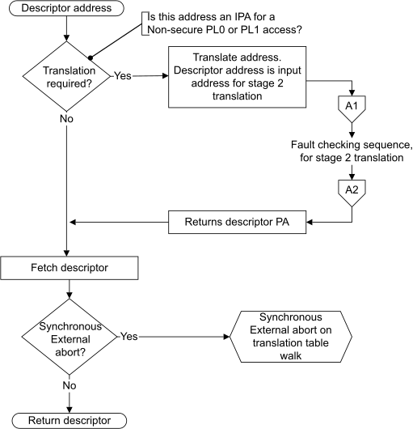
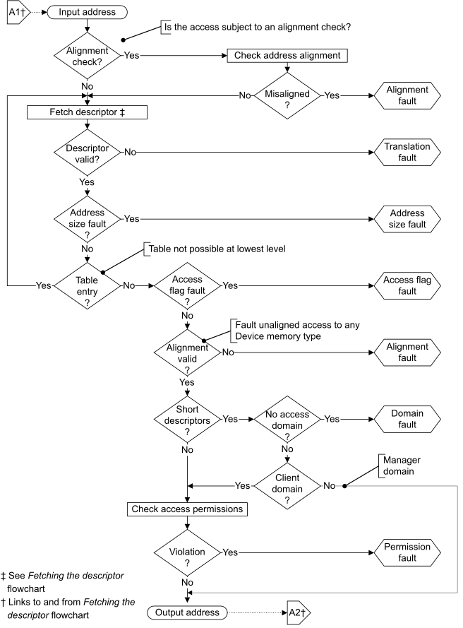

# ​G5.11.3 The MMU fault-checking sequence

Source: <https://developer.arm.com/documentation/ddi0487/mc/-Part-G-The-AArch32-System-Level-Architecture/-Chapter-G5-The-AArch32-Virtual-Memory-System-Architecture/-G5-11-VMSAv8-32-memory-aborts/-G5-11-3-The-MMU-fault-checking-sequence>

##### G5.11.3 The MMU fault-checking sequence

This section describes the MMU checks made for the memory accesses required for instruction fetches and for explicit memory effects:

- If an instruction fetch faults it generates a Prefetch Abort exception.
- If an data memory access faults it generates a Data Abort exception.

For more information about Prefetch Abort exceptions and Data Abort exceptions see [Handling exceptions that are taken to an Exception level using AArch32](/documentation/ddi0487/mc/-Part-G-The-AArch32-System-Level-Architecture/-Chapter-G1-The-AArch32-System-Level-Programmers--Model/-G1-13-Handling-exceptions-that-are-taken-to-an-Exception-level-using-AArch32?lang=en#cihgiebj).

In VMSAv8-32, all memory accesses require VA to PA translation. Therefore, when a corresponding stage of address translation is enabled, each access requires a lookup of the Translation Table descriptor for the accessed VA. For more information, see [Translation tables](/documentation/ddi0487/mc/-Part-G-The-AArch32-System-Level-Architecture/-Chapter-G5-The-AArch32-Virtual-Memory-System-Architecture/-G5-3-Translation-tables?lang=en#chdfehah) and subsequent sections of this chapter. [MMU fault](/documentation/ddi0487/mc/-Part-G-The-AArch32-System-Level-Architecture/-Chapter-G5-The-AArch32-Virtual-Memory-System-Architecture/-G5-11-VMSAv8-32-memory-aborts?lang=en#aa32_mmu_fault) checking is performed for each level of translation table lookup. If an implementation includes EL2 and is operating in Non-secure state, [MMU fault](/documentation/ddi0487/mc/-Part-G-The-AArch32-System-Level-Architecture/-Chapter-G5-The-AArch32-Virtual-Memory-System-Architecture/-G5-11-VMSAv8-32-memory-aborts?lang=en#aa32_mmu_fault) checking is performed for each stage of address translation.

> #### Note
>
> In an implementation that includes EL2, if a PE is executing in Non-secure state, the operating system or similar Non-secure system software defines the stage 1 translation tables in the IPA address map, and typically is unaware of the stage 2 translation from IPA to PA. However, each Non-secure stage 1 translation table access is subject to stage 2 address translation, and might be faulted at that stage.

The [MMU fault](/documentation/ddi0487/mc/-Part-G-The-AArch32-System-Level-Architecture/-Chapter-G5-The-AArch32-Virtual-Memory-System-Architecture/-G5-11-VMSAv8-32-memory-aborts?lang=en#aa32_mmu_fault) checking sequence is largely independent of the translation table format, as the figures in this section show. The differences are:

When using the Short-descriptor format
:   - There are one or two levels of lookup.
    - Lookup always starts at level 1.
    - The final level of lookup checks the Domain field of the descriptor and:

      - Faults if there is no access to the Domain.
      - Checks the access permissions only for Client domains.

When using the Long-descriptor format
:   - There are one, two, or three levels of lookup.
    - Lookup starts at either level 1 or level 2.
    - Domains are not supported. All accesses are treated as Client domain accesses.

The fault-checking sequence shows a translation from an Input address to an Output address. For more information about this terminology, see [About address translation for VMSAv8-32](/documentation/ddi0487/mc/-Part-G-The-AArch32-System-Level-Architecture/-Chapter-G5-The-AArch32-Virtual-Memory-System-Architecture/-G5-1-About-VMSAv8-32/-G5-1-4-About-address-translation-for-VMSAv8-32?lang=en#chdiciha).

> #### Note
>
> The descriptions in this section do not include the possibility that the attempted address translation generates a TLB conflict abort, as described in [TLB conflict aborts](/documentation/ddi0487/mc/-Part-G-The-AArch32-System-Level-Architecture/-Chapter-G5-The-AArch32-Virtual-Memory-System-Architecture/-G5-8-Translation-Lookaside-Buffers/-G5-8-5-TLB-conflict-aborts?lang=en#beifagbe).

[Types of MMU faults](/documentation/ddi0487/mc/-Part-G-The-AArch32-System-Level-Architecture/-Chapter-G5-The-AArch32-Virtual-Memory-System-Architecture/-G5-11-VMSAv8-32-memory-aborts/-G5-11-1-Types-of-MMU-faults?lang=en#chddcjfc) describes the faults that an MMU fault-checking sequence can report.

[Figure G5-15](/documentation/ddi0487/mc/-Part-G-The-AArch32-System-Level-Architecture/-Chapter-G5-The-AArch32-Virtual-Memory-System-Architecture/-G5-11-VMSAv8-32-memory-aborts/-G5-11-3-The-MMU-fault-checking-sequence?lang=en#fig_chddegeb) shows the process of fetching a descriptor from the translation table. For the top-level fetch for any translation, the descriptor is fetched only if the input address passes any required alignment check. As the figure shows, in an implementation that includes EL2, if the translation is stage 1 of the Non-secure PL1&0 translation regime, then the descriptor address is in the IPA address map, and is subject to a stage 2 translation to obtain the required PA. This stage 2 translation requires a recursive entry to the fault checking sequence.

> #### Note
>
> [Figure G5-15](/documentation/ddi0487/mc/-Part-G-The-AArch32-System-Level-Architecture/-Chapter-G5-The-AArch32-Virtual-Memory-System-Architecture/-G5-11-VMSAv8-32-memory-aborts/-G5-11-3-The-MMU-fault-checking-sequence?lang=en#fig_chddegeb) and [Figure G5-16](/documentation/ddi0487/mc/-Part-G-The-AArch32-System-Level-Architecture/-Chapter-G5-The-AArch32-Virtual-Memory-System-Architecture/-G5-11-VMSAv8-32-memory-aborts/-G5-11-3-The-MMU-fault-checking-sequence?lang=en#fig_chddidhh) give an overview of the fault checking performed by the MMU. See [AArch32 state prioritization of synchronous aborts from a single stage of address translation](/documentation/ddi0487/mc/-Part-G-The-AArch32-System-Level-Architecture/-Chapter-G5-The-AArch32-Virtual-Memory-System-Architecture/-G5-11-VMSAv8-32-memory-aborts/-G5-11-6-AArch32-state-prioritization-of-synchronous-aborts-from-a-single-stage-of-address-translation?lang=en#babehaie) for the complete set of possible faults and their prioritization.

Figure G5-15 Fetching the descriptor in a VMSAv8-32 translation table walk

[Figure G5-16](/documentation/ddi0487/mc/-Part-G-The-AArch32-System-Level-Architecture/-Chapter-G5-The-AArch32-Virtual-Memory-System-Architecture/-G5-11-VMSAv8-32-memory-aborts/-G5-11-3-The-MMU-fault-checking-sequence?lang=en#fig_chddidhh) shows the full VMSAv8-32 fault checking sequence, including the alignment check on the initial access.

Figure G5-16 VMSAv8-32 fault checking sequence

###### G5.11.3.1 Stage 2 fault on a stage 1 translation table walk

When an implementation that includes EL2 is operating in a Non-secure PL1 or EL0 mode, any memory access goes through two stages of translation:

- Stage 1, from VA to IPA.
- Stage 2, from IPA to PA.

> #### Note
>
> In a virtualized system that is using AArch32, typically, a Guest OS operating in a Non-secure PL1 mode defines the translation tables and translation table register entries controlling the Non-secure PL1&0 stage 1 translations. A Guest OS has no awareness of the stage 2 address translation, and therefore believes it is specifying translation table addresses in the PA map. However, it actually specifies these addresses in its IPA map. Therefore, to support virtualization, translation table addresses for the Non-secure PL1&0 stage 1 translations are always defined in the IPA address map.

On performing a translation table walk for the stage 1 translations, the descriptor addresses must be translated from IPA to PA, using a stage 2 translation. This means that a memory access made as part of a stage 1 translation table lookup might generate, on a stage 2 translation:

- A Translation fault, Access flag fault, or Permission fault.
- A synchronous External abort on the memory access.

If [SCR](/documentation/ddi0487/mc/-Part-K-Appendixes/-Appendix-K14-Registers-Index/-K14-1-Introduction-and-register-disambiguation/-K14-1-1-Register-name-disambiguation-by-Execution-state?lang=en#cegceecb).EA is set to 1, a synchronous External abort is taken to EL3, and if EL3 is using AArch32 it is taken to Secure Monitor mode. Otherwise, these faults are reported as stage 2 memory aborts. When EL2 is using AArch32, [HSR](/documentation/ddi0487/mc/-Part-G-The-AArch32-System-Level-Architecture/-Chapter-G8-AArch32-System-Register-Descriptions/-G8-2-General-system-control-registers/-G8-2-74-HSR--Hyp-Syndrome-Register?lang=en#reg_aarch32_hsr).ISS[7] is set to 1, to indicate a stage 2 fault during a stage 1 translation table walk, and the part of the ISS field that might contain details of the instruction is invalid. For more information, see [Use of the HSR](/documentation/ddi0487/mc/-Part-G-The-AArch32-System-Level-Architecture/-Chapter-G5-The-AArch32-Virtual-Memory-System-Architecture/-G5-12-Exception-reporting-in-a-VMSAv8-32-implementation/-G5-12-5-Reporting-exceptions-taken-to-Hyp-mode?lang=en#beidbeag).

Alternatively, a memory access made as part of a stage 1 translation table lookup might target an area of memory with the Device memory attribute assigned on the stage 2 translation of the address accessed. When the value of the [HCR](/documentation/ddi0487/mc/-Part-K-Appendixes/-Appendix-K14-Registers-Index/-K14-1-Introduction-and-register-disambiguation/-K14-1-1-Register-name-disambiguation-by-Execution-state?lang=en#cegfdifj).PTW bit is 1, such an access generates a stage 2 Permission fault.

> #### Note
>
> - On most systems, such a mapping to a Device memory type on the stage 2 translation is likely to indicate a Guest OS error, where the stage 1 translation table is corrupted. Therefore, it is appropriate to trap this access to the hypervisor.

A TLB might hold entries that depend on the effect of [HCR](/documentation/ddi0487/mc/-Part-K-Appendixes/-Appendix-K14-Registers-Index/-K14-1-Introduction-and-register-disambiguation/-K14-1-1-Register-name-disambiguation-by-Execution-state?lang=en#cegfdifj).PTW. Therefore, if [HCR](/documentation/ddi0487/mc/-Part-K-Appendixes/-Appendix-K14-Registers-Index/-K14-1-Introduction-and-register-disambiguation/-K14-1-1-Register-name-disambiguation-by-Execution-state?lang=en#cegfdifj).PTW is changed without changing the current VMID, the TLBs must be invalidated before executing in a Non-secure PL1 or EL0 mode. For more information, see [Changing HCR.PTW](/documentation/ddi0487/mc/-Part-G-The-AArch32-System-Level-Architecture/-Chapter-G5-The-AArch32-Virtual-Memory-System-Architecture/-G5-9-TLB-maintenance-requirements/-G5-9-2-Maintenance-requirements-on-changing-System-register-values?lang=en#chdiiadi).

A cache maintenance instruction executed at Non-secure PL1 can cause a stage 1 translation table walk that might generate a stage 2 Permission fault, as described in this section. However:

- If the Point of Coherency is before any level of cache, it is IMPLEMENTATION DEFINED whether a cache maintenance by VA instruction can generate a Permission fault in this way.
- If the Point of Unification is before any level of data cache, it is IMPLEMENTATION DEFINED whether a data or unified cache clean by VA to the Point of Unification instruction can generate a Permission fault in this way.

> #### Note
>
> This is an exception to the general rule that a cache maintenance instruction cannot generate a Permission fault.

**G5.11.3.1.1 The level associated with MMU faults**

When an [MMU fault](/documentation/ddi0487/mc/-Part-G-The-AArch32-System-Level-Architecture/-Chapter-G5-The-AArch32-Virtual-Memory-System-Architecture/-G5-11-VMSAv8-32-memory-aborts?lang=en#aa32_mmu_fault) is from a stage of translation that is using Long-descriptor translation table format, [Table G5-25](/documentation/ddi0487/mc/-Part-G-The-AArch32-System-Level-Architecture/-Chapter-G5-The-AArch32-Virtual-Memory-System-Architecture/-G5-11-VMSAv8-32-memory-aborts/-G5-11-3-The-MMU-fault-checking-sequence?lang=en#tbl_cacdcjig) shows how the LL bits in the STATUS field of [DFSR](/documentation/ddi0487/mc/-Part-G-The-AArch32-System-Level-Architecture/-Chapter-G8-AArch32-System-Register-Descriptions/-G8-2-General-system-control-registers/-G8-2-47-DFSR--Data-Fault-Status-Register?lang=en#reg_aarch32_dfsr), [IFSR](/documentation/ddi0487/mc/-Part-G-The-AArch32-System-Level-Architecture/-Chapter-G8-AArch32-System-Register-Descriptions/-G8-2-General-system-control-registers/-G8-2-103-IFSR--Instruction-Fault-Status-Register?lang=en#reg_aarch32_ifsr), and [HSR](/documentation/ddi0487/mc/-Part-G-The-AArch32-System-Level-Architecture/-Chapter-G8-AArch32-System-Register-Descriptions/-G8-2-General-system-control-registers/-G8-2-74-HSR--Hyp-Syndrome-Register?lang=en#reg_aarch32_hsr) encode the lookup level associated with the fault.

<table id="tbl_cacdcjig">
 <caption>
  Table G5-25 Use of LL bits to encode the lookup level at which the fault occurred
 </caption>
 <colgroup>
  <col/>
  <col/>
 </colgroup>
 <thead>
  <tr>
   <th>
    LL bits
   </th>
   <th>
    Meaning
   </th>
  </tr>
 </thead>
 <tbody>
  <tr>
   <td>
    00
   </td>
   <td>
    Level 0 of translation or translation table base register.
   </td>
  </tr>
  <tr>
   <td>
    01
   </td>
   <td>
    Level 1.
   </td>
  </tr>
  <tr>
   <td>
    10
   </td>
   <td>
    Level 2.
   </td>
  </tr>
  <tr>
   <td>
    11
   </td>
   <td>
    Level 3. When xFSR.STATUS indicates a Domain fault, this value is reserved.
   </td>
  </tr>
 </tbody>
</table>

The lookup level associated with a fault is:

- For a fault generated on a translation table walk, the lookup level of the walk being performed.
- For a Translation fault, the lookup level of the translation table that gave the fault. If a fault occurs because a stage of address translation is disabled, or because the input address is outside the range specified by the appropriate base address register or registers, the fault is reported as a level 1 fault.
- For an Access flag fault, the lookup level of the translation table that gave the fault.
- For a Permission fault, including a Permission fault caused by hierarchical permissions, the lookup level of the final level of translation table accessed for the translation. That is, the lookup level of the translation table that returned a Block or Page descriptor.

Also see [Synchronous External abort errors from address translation caching structures](/documentation/ddi0487/mc/-Part-G-The-AArch32-System-Level-Architecture/-Chapter-G5-The-AArch32-Virtual-Memory-System-Architecture/-G5-11-VMSAv8-32-memory-aborts/-G5-11-6-AArch32-state-prioritization-of-synchronous-aborts-from-a-single-stage-of-address-translation?lang=en#chdihcic).
