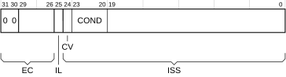

# ​G5.12.5 Reporting exceptions taken to Hyp mode

Source: <https://developer.arm.com/documentation/ddi0487/mc/-Part-G-The-AArch32-System-Level-Architecture/-Chapter-G5-The-AArch32-Virtual-Memory-System-Architecture/-G5-12-Exception-reporting-in-a-VMSAv8-32-implementation/-G5-12-5-Reporting-exceptions-taken-to-Hyp-mode>

##### G5.12.5 Reporting exceptions taken to Hyp mode

Hyp mode is the Non-secure EL2 mode. It is entered by taking an exception to Hyp mode.

> #### Note
>
> Software executing in Monitor mode, or at EL3 when EL3 is using AArch64, can perform an exception return to Hyp mode. This means Hyp mode can be entered either by taking an exception, or by a permitted exception return.

When EL2 is using AArch32, the following exceptions are taken to Hyp mode:

- SError exceptions, IRQ exceptions, and FIQ exceptions, from Non-secure PL1 and EL0 modes, if not routed to Secure Monitor mode, and if configured by the AMO, FMO or IMO bits. For more information, see [Asynchronous exception routing controls](/documentation/ddi0487/mc/-Part-G-The-AArch32-System-Level-Architecture/-Chapter-G1-The-AArch32-System-Level-Programmers--Model/-G1-16-Asynchronous-exception-behavior-for-exceptions-taken-from-AArch32-state/-G1-16-2-Asynchronous-exception-routing-controls?lang=en#beijddjj).
- When [HCR](/documentation/ddi0487/mc/-Part-G-The-AArch32-System-Level-Architecture/-Chapter-G8-AArch32-System-Register-Descriptions/-G8-2-General-system-control-registers/-G8-2-65-HCR--Hyp-Configuration-Register?lang=en#reg_aarch32_hcr).TGE is set to 1, all exceptions that would be routed to Non-secure PL1 modes.

  For more information, see [Routing exceptions from Non-secure EL0 to EL2](/documentation/ddi0487/mc/-Part-G-The-AArch32-System-Level-Architecture/-Chapter-G1-The-AArch32-System-Level-Programmers--Model/-G1-13-Handling-exceptions-that-are-taken-to-an-Exception-level-using-AArch32/-G1-13-6-Routing-exceptions-from-Non-secure-EL0-to-EL2?lang=en#beiicdac).
- When [HDCR](/documentation/ddi0487/mc/-Part-G-The-AArch32-System-Level-Architecture/-Chapter-G8-AArch32-System-Register-Descriptions/-G8-3-Debug-System-registers/-G8-3-32-HDCR--Hyp-Debug-Control-Register?lang=en#reg_aarch32_hdcr).TDE is set to 1, any debug exception that would otherwise be taken to a Non-secure PL1 mode, see [Routing debug exceptions to EL2 using AArch32](/documentation/ddi0487/mc/-Part-G-The-AArch32-System-Level-Architecture/-Chapter-G1-The-AArch32-System-Level-Programmers--Model/-G1-13-Handling-exceptions-that-are-taken-to-an-Exception-level-using-AArch32/-G1-13-7-Routing-debug-exceptions-to-EL2-using-AArch32?lang=en#beijccii).
- The privilege rules for taking exceptions mean that any exception taken from Hyp mode, if not routed to EL3, must be taken to Hyp mode.
- An abort that [Routing of aborts taken to AArch32 state](/documentation/ddi0487/mc/-Part-G-The-AArch32-System-Level-Architecture/-Chapter-G1-The-AArch32-System-Level-Programmers--Model/-G1-14-Routing-of-aborts-taken-to-AArch32-state?lang=en#beijfcaf) identifies as taken to Hyp mode.
- Hypervisor Call exceptions, and Hyp Trap exceptions, are always taken to Hyp mode. These exceptions are supported only as part of EL2.

  When EL2 is implemented, various operations from Non-secure PL1 and EL0 modes can be *trapped* to Hyp mode, using the Hyp Trap exception. For more information, see [EL2 configurable controls](/documentation/ddi0487/mc/-Part-G-The-AArch32-System-Level-Architecture/-Chapter-G1-The-AArch32-System-Level-Programmers--Model/-G1-22-Configurable-instruction-controls/-G1-22-5-EL2-configurable-controls?lang=en#beidfafd).

Synchronous exceptions taken to Hyp mode provide syndrome information in the [HSR](/documentation/ddi0487/mc/-Part-G-The-AArch32-System-Level-Architecture/-Chapter-G8-AArch32-System-Register-Descriptions/-G8-2-General-system-control-registers/-G8-2-74-HSR--Hyp-Syndrome-Register?lang=en#reg_aarch32_hsr).

On an abort exception taken to Hyp mode, the syndrome information in the [HSR](/documentation/ddi0487/mc/-Part-G-The-AArch32-System-Level-Architecture/-Chapter-G8-AArch32-System-Register-Descriptions/-G8-2-General-system-control-registers/-G8-2-74-HSR--Hyp-Syndrome-Register?lang=en#reg_aarch32_hsr) includes the Fault status code otherwise provided by the fault status register, and extends the fault reporting compared to that available for an exception taken to a PL1 mode.

In addition, for a Debug exception taken to Hyp mode, [DBGDSCRint](/documentation/ddi0487/mc/-Part-G-The-AArch32-System-Level-Architecture/-Chapter-G8-AArch32-System-Register-Descriptions/-G8-3-Debug-System-registers/-G8-3-15-DBGDSCRint--Debug-Status-and-Control-Register--Internal-View?lang=en#reg_aarch32_dbgdscrint).MOE or [DBGDSCRext](/documentation/ddi0487/mc/-Part-G-The-AArch32-System-Level-Architecture/-Chapter-G8-AArch32-System-Register-Descriptions/-G8-3-Debug-System-registers/-G8-3-14-DBGDSCRext--Debug-Status-and-Control-Register--External-View?lang=en#reg_aarch32_dbgdscrext).MOE shows what caused the Debug exception. This field is valid regardless of whether the Debug exception was taken from Hyp mode or from another Non-secure mode.

For more information, see the following subsections:

- [Registers used for reporting exceptions taken to Hyp mode](/documentation/ddi0487/mc/-Part-G-The-AArch32-System-Level-Architecture/-Chapter-G5-The-AArch32-Virtual-Memory-System-Architecture/-G5-12-Exception-reporting-in-a-VMSAv8-32-implementation/-G5-12-5-Reporting-exceptions-taken-to-Hyp-mode?lang=en#beijdaij).
- [Memory fault reporting in Hyp mode](/documentation/ddi0487/mc/-Part-G-The-AArch32-System-Level-Architecture/-Chapter-G5-The-AArch32-Virtual-Memory-System-Architecture/-G5-12-Exception-reporting-in-a-VMSAv8-32-implementation/-G5-12-5-Reporting-exceptions-taken-to-Hyp-mode?lang=en#beigbceg).
- [Use of the HSR](/documentation/ddi0487/mc/-Part-G-The-AArch32-System-Level-Architecture/-Chapter-G5-The-AArch32-Virtual-Memory-System-Architecture/-G5-12-Exception-reporting-in-a-VMSAv8-32-implementation/-G5-12-5-Reporting-exceptions-taken-to-Hyp-mode?lang=en#beidbeag)

###### G5.12.5.1 Registers used for reporting exceptions taken to Hyp mode

The following registers are used for reporting exceptions taken to Hyp mode:

- The [HSR](/documentation/ddi0487/mc/-Part-G-The-AArch32-System-Level-Architecture/-Chapter-G8-AArch32-System-Register-Descriptions/-G8-2-General-system-control-registers/-G8-2-74-HSR--Hyp-Syndrome-Register?lang=en#reg_aarch32_hsr) holds syndrome information for the exception.
- The [HDFAR](/documentation/ddi0487/mc/-Part-G-The-AArch32-System-Level-Architecture/-Chapter-G8-AArch32-System-Register-Descriptions/-G8-2-General-system-control-registers/-G8-2-67-HDFAR--Hyp-Data-Fault-Address-Register?lang=en#reg_aarch32_hdfar) holds the VA associated with a Data Abort exception.
- The [HIFAR](/documentation/ddi0487/mc/-Part-G-The-AArch32-System-Level-Architecture/-Chapter-G8-AArch32-System-Register-Descriptions/-G8-2-General-system-control-registers/-G8-2-68-HIFAR--Hyp-Instruction-Fault-Address-Register?lang=en#reg_aarch32_hifar) holds the VA associated with a Prefetch Abort exception.
- The [HPFAR](/documentation/ddi0487/mc/-Part-G-The-AArch32-System-Level-Architecture/-Chapter-G8-AArch32-System-Register-Descriptions/-G8-2-General-system-control-registers/-G8-2-71-HPFAR--Hyp-IPA-Fault-Address-Register?lang=en#reg_aarch32_hpfar) holds bits[39:12] of the IPA associated with some aborts on stage 2 address translations.

In addition, if implemented, the optional [HADFSR](/documentation/ddi0487/mc/-Part-G-The-AArch32-System-Level-Architecture/-Chapter-G8-AArch32-System-Register-Descriptions/-G8-2-General-system-control-registers/-G8-2-60-HADFSR--Hyp-Auxiliary-Data-Fault-Status-Register?lang=en#reg_aarch32_hadfsr) and [HAIFSR](/documentation/ddi0487/mc/-Part-G-The-AArch32-System-Level-Architecture/-Chapter-G8-AArch32-System-Register-Descriptions/-G8-2-General-system-control-registers/-G8-2-61-HAIFSR--Hyp-Auxiliary-Instruction-Fault-Status-Register?lang=en#reg_aarch32_haifsr) can provide additional fault information, see [Hyp Auxiliary Fault Syndrome Registers](/documentation/ddi0487/mc/-Part-G-The-AArch32-System-Level-Architecture/-Chapter-G5-The-AArch32-Virtual-Memory-System-Architecture/-G5-12-Exception-reporting-in-a-VMSAv8-32-implementation/-G5-12-5-Reporting-exceptions-taken-to-Hyp-mode?lang=en#chdgbggj).

**G5.12.5.1.1 Hyp Auxiliary Fault Syndrome Registers**

EL2 also defines encodings for the following Hyp Auxiliary Fault Syndrome Registers:

- The Hyp Auxiliary Data Fault Syndrome Register, [HADFSR](/documentation/ddi0487/mc/-Part-G-The-AArch32-System-Level-Architecture/-Chapter-G8-AArch32-System-Register-Descriptions/-G8-2-General-system-control-registers/-G8-2-60-HADFSR--Hyp-Auxiliary-Data-Fault-Status-Register?lang=en#reg_aarch32_hadfsr).
- The Hyp Auxiliary Instruction Fault Syndrome Register, [HAIFSR](/documentation/ddi0487/mc/-Part-G-The-AArch32-System-Level-Architecture/-Chapter-G8-AArch32-System-Register-Descriptions/-G8-2-General-system-control-registers/-G8-2-61-HAIFSR--Hyp-Auxiliary-Instruction-Fault-Status-Register?lang=en#reg_aarch32_haifsr).

An implementation can use these registers to return additional fault status information for aborts taken to Hyp mode. They are the Hyp mode equivalents of the registers described in [Auxiliary Fault Status Registers](/documentation/ddi0487/mc/-Part-G-The-AArch32-System-Level-Architecture/-Chapter-G5-The-AArch32-Virtual-Memory-System-Architecture/-G5-12-Exception-reporting-in-a-VMSAv8-32-implementation/-G5-12-2-Reporting-exceptions-taken-to-PL1-modes?lang=en#beigcihh). An example use of these registers is to return more information for diagnosing parity or ECC errors.

The architectural requirements for the [HADFSR](/documentation/ddi0487/mc/-Part-G-The-AArch32-System-Level-Architecture/-Chapter-G8-AArch32-System-Register-Descriptions/-G8-2-General-system-control-registers/-G8-2-60-HADFSR--Hyp-Auxiliary-Data-Fault-Status-Register?lang=en#reg_aarch32_hadfsr) and [HAIFSR](/documentation/ddi0487/mc/-Part-G-The-AArch32-System-Level-Architecture/-Chapter-G8-AArch32-System-Register-Descriptions/-G8-2-General-system-control-registers/-G8-2-61-HAIFSR--Hyp-Auxiliary-Instruction-Fault-Status-Register?lang=en#reg_aarch32_haifsr) are:

- The position of these registers is architecturally-defined, but the content and use of the registers is IMPLEMENTATION DEFINED.
- An implementation with no requirement for additional fault reporting can implement these registers as RES0, but the architecture does not require it to do so.

###### G5.12.5.2 Memory fault reporting in Hyp mode

Prefetch Abort and Data Abort exceptions taken to Hyp mode report memory faults. For these aborts, the [HSR](/documentation/ddi0487/mc/-Part-G-The-AArch32-System-Level-Architecture/-Chapter-G8-AArch32-System-Register-Descriptions/-G8-2-General-system-control-registers/-G8-2-74-HSR--Hyp-Syndrome-Register?lang=en#reg_aarch32_hsr) contains the following fault status information:

- The [HSR](/documentation/ddi0487/mc/-Part-G-The-AArch32-System-Level-Architecture/-Chapter-G8-AArch32-System-Register-Descriptions/-G8-2-General-system-control-registers/-G8-2-74-HSR--Hyp-Syndrome-Register?lang=en#reg_aarch32_hsr).EC field indicates the type of abort, as [Table G5-31](/documentation/ddi0487/mc/-Part-G-The-AArch32-System-Level-Architecture/-Chapter-G5-The-AArch32-Virtual-Memory-System-Architecture/-G5-12-Exception-reporting-in-a-VMSAv8-32-implementation/-G5-12-5-Reporting-exceptions-taken-to-Hyp-mode?lang=en#tbl_beieegji) shows.
- The [HSR](/documentation/ddi0487/mc/-Part-G-The-AArch32-System-Level-Architecture/-Chapter-G8-AArch32-System-Register-Descriptions/-G8-2-General-system-control-registers/-G8-2-74-HSR--Hyp-Syndrome-Register?lang=en#reg_aarch32_hsr).ISS field holds more information about the abort. In particular:

  - Bits[5:0] of this field hold the STATUS field for the abort, using the encodings defined in [PL1 fault reporting with the Long-descriptor translation table format](/documentation/ddi0487/mc/-Part-G-The-AArch32-System-Level-Architecture/-Chapter-G5-The-AArch32-Virtual-Memory-System-Architecture/-G5-12-Exception-reporting-in-a-VMSAv8-32-implementation/-G5-12-3-Fault-reporting-in-PL1-modes?lang=en#beifdbja).
  - Other subfields of the ISS give more information about the exception, equivalent to the information returned in the FSR for a memory fault reported at PL1.

  See the descriptions of the ISS fields for the memory faults, referenced from the *Syndrome description* column of [Table G5-31](/documentation/ddi0487/mc/-Part-G-The-AArch32-System-Level-Architecture/-Chapter-G5-The-AArch32-Virtual-Memory-System-Architecture/-G5-12-Exception-reporting-in-a-VMSAv8-32-implementation/-G5-12-5-Reporting-exceptions-taken-to-Hyp-mode?lang=en#tbl_beieegji), for information about the returned fault information.

<table id="tbl_beieegji">
 <caption>
  Table G5-31 HSR.EC encodings for aborts taken to Hyp mode
 </caption>
 <colgroup>
  <col/>
  <col/>
  <col/>
 </colgroup>
 <thead>
  <tr>
   <th>
    HSR.EC
   </th>
   <th>
    Abort
   </th>
   <th>
    Syndrome description
   </th>
  </tr>
 </thead>
 <tbody>
  <tr>
   <td>
    <code>
     0x20
    </code>
   </td>
   <td>
    Prefetch Abort taken from Non-secure PL1 or EL0 mode
   </td>
   <td rowspan="2">
    <a class="document-topic" document-topic-path="/ddi0487/mc/-Part-G-The-AArch32-System-Level-Architecture/-Chapter-G8-AArch32-System-Register-Descriptions/-G8-2-General-system-control-registers/-G8-2-74-HSR--Hyp-Syndrome-Register?lang=en#fieldset_aarch32_hsr_fieldset_0_iss_exception_from_a_prefetch_abort" href="/documentation/ddi0487/mc/-Part-G-The-AArch32-System-Level-Architecture/-Chapter-G8-AArch32-System-Register-Descriptions/-G8-2-General-system-control-registers/-G8-2-74-HSR--Hyp-Syndrome-Register?lang=en#fieldset_aarch32_hsr_fieldset_0_iss_exception_from_a_prefetch_abort">
     ISS encoding for exception from a Prefetch Abort
    </a>
   </td>
  </tr>
  <tr>
   <td>
    <code>
     0x21
    </code>
   </td>
   <td>
    Prefetch Abort taken from Hyp mode
   </td>
  </tr>
  <tr>
   <td>
    <code>
     0x24
    </code>
   </td>
   <td>
    Data Abort taken from Non-secure PL1 or EL0 mode
   </td>
   <td rowspan="2">
    <a class="document-topic" document-topic-path="/ddi0487/mc/-Part-G-The-AArch32-System-Level-Architecture/-Chapter-G8-AArch32-System-Register-Descriptions/-G8-2-General-system-control-registers/-G8-2-74-HSR--Hyp-Syndrome-Register?lang=en#fieldset_aarch32_hsr_fieldset_0_iss_exception_from_a_data_abort" href="/documentation/ddi0487/mc/-Part-G-The-AArch32-System-Level-Architecture/-Chapter-G8-AArch32-System-Register-Descriptions/-G8-2-General-system-control-registers/-G8-2-74-HSR--Hyp-Syndrome-Register?lang=en#fieldset_aarch32_hsr_fieldset_0_iss_exception_from_a_data_abort">
     ISS encoding for exception from a Data Abort
    </a>
   </td>
  </tr>
  <tr>
   <td>
    <code>
     0x25
    </code>
   </td>
   <td>
    Data Abort taken from Hyp mode
   </td>
  </tr>
 </tbody>
</table>

For more information, see [Use of the HSR](/documentation/ddi0487/mc/-Part-G-The-AArch32-System-Level-Architecture/-Chapter-G5-The-AArch32-Virtual-Memory-System-Architecture/-G5-12-Exception-reporting-in-a-VMSAv8-32-implementation/-G5-12-5-Reporting-exceptions-taken-to-Hyp-mode?lang=en#beidbeag).

A Prefetch Abort exception is taken synchronously with the instruction that the abort is reported on. This means:

- If the PE attempts to execute the instruction a Prefetch Abort exception is generated.
- If an instruction fetch is issued but the PE does not attempt to execute the prefetched instruction, no Prefetch Abort exception is generated for that instruction. For example, if the execution flow branches round a prefetched instruction that would abort if the PE attempted to execute it, no Prefetch Abort exception is generated.

**G5.12.5.2.1 Register updates on exception reporting in Hyp mode**

The use of the [HSR](/documentation/ddi0487/mc/-Part-G-The-AArch32-System-Level-Architecture/-Chapter-G8-AArch32-System-Register-Descriptions/-G8-2-General-system-control-registers/-G8-2-74-HSR--Hyp-Syndrome-Register?lang=en#reg_aarch32_hsr), and of the other registers listed in [Registers used for reporting exceptions taken to Hyp mode](/documentation/ddi0487/mc/-Part-G-The-AArch32-System-Level-Architecture/-Chapter-G5-The-AArch32-Virtual-Memory-System-Architecture/-G5-12-Exception-reporting-in-a-VMSAv8-32-implementation/-G5-12-5-Reporting-exceptions-taken-to-Hyp-mode?lang=en#beijdaij), depends on the cause of the Abort. In reporting these faults, in general:

- If the fault generates a synchronous Data Abort exception, the [HDFAR](/documentation/ddi0487/mc/-Part-G-The-AArch32-System-Level-Architecture/-Chapter-G8-AArch32-System-Register-Descriptions/-G8-2-General-system-control-registers/-G8-2-67-HDFAR--Hyp-Data-Fault-Address-Register?lang=en#reg_aarch32_hdfar) holds the associated VA, but see [Fault address reporting on synchronous External aborts](/documentation/ddi0487/mc/-Part-G-The-AArch32-System-Level-Architecture/-Chapter-G5-The-AArch32-Virtual-Memory-System-Architecture/-G5-12-Exception-reporting-in-a-VMSAv8-32-implementation/-G5-12-1-About-exception-reporting?lang=en#caceibbf) for a permitted exception to this requirement.
- If the fault generates a Prefetch Abort exception, the [HIFAR](/documentation/ddi0487/mc/-Part-G-The-AArch32-System-Level-Architecture/-Chapter-G8-AArch32-System-Register-Descriptions/-G8-2-General-system-control-registers/-G8-2-68-HIFAR--Hyp-Instruction-Fault-Address-Register?lang=en#reg_aarch32_hifar) holds the associated VA, but see [Fault address reporting on synchronous External aborts](/documentation/ddi0487/mc/-Part-G-The-AArch32-System-Level-Architecture/-Chapter-G5-The-AArch32-Virtual-Memory-System-Architecture/-G5-12-Exception-reporting-in-a-VMSAv8-32-implementation/-G5-12-1-About-exception-reporting?lang=en#caceibbf) for a permitted exception to this requirement.
- In the following cases, the [HPFAR](/documentation/ddi0487/mc/-Part-G-The-AArch32-System-Level-Architecture/-Chapter-G8-AArch32-System-Register-Descriptions/-G8-2-General-system-control-registers/-G8-2-71-HPFAR--Hyp-IPA-Fault-Address-Register?lang=en#reg_aarch32_hpfar) holds the faulting IPA:

  - A Translation or Access flag fault on a stage 2 translation.
  - A Translation, Access flag, or Permission fault on the stage 2 translation of an address accessed in a stage 1 translation table walk.
  - A stage 2 Address size fault.

  In all other cases, the [HPFAR](/documentation/ddi0487/mc/-Part-G-The-AArch32-System-Level-Architecture/-Chapter-G8-AArch32-System-Register-Descriptions/-G8-2-General-system-control-registers/-G8-2-71-HPFAR--Hyp-IPA-Fault-Address-Register?lang=en#reg_aarch32_hpfar) is UNKNOWN.
- On a Data Abort exception that is taken to Hyp mode, the [HIFAR](/documentation/ddi0487/mc/-Part-G-The-AArch32-System-Level-Architecture/-Chapter-G8-AArch32-System-Register-Descriptions/-G8-2-General-system-control-registers/-G8-2-68-HIFAR--Hyp-Instruction-Fault-Address-Register?lang=en#reg_aarch32_hifar) is UNKNOWN.
- On a Prefetch Abort exception that is taken to Hyp mode, the [HDFAR](/documentation/ddi0487/mc/-Part-G-The-AArch32-System-Level-Architecture/-Chapter-G8-AArch32-System-Register-Descriptions/-G8-2-General-system-control-registers/-G8-2-67-HDFAR--Hyp-Data-Fault-Address-Register?lang=en#reg_aarch32_hdfar) is UNKNOWN.

In addition, the reporting of particular aborts is as follows:

Abort on the stage 1 translation for a memory access from Hyp mode
:   The [HDFAR](/documentation/ddi0487/mc/-Part-G-The-AArch32-System-Level-Architecture/-Chapter-G8-AArch32-System-Register-Descriptions/-G8-2-General-system-control-registers/-G8-2-67-HDFAR--Hyp-Data-Fault-Address-Register?lang=en#reg_aarch32_hdfar) or [HIFAR](/documentation/ddi0487/mc/-Part-G-The-AArch32-System-Level-Architecture/-Chapter-G8-AArch32-System-Register-Descriptions/-G8-2-General-system-control-registers/-G8-2-68-HIFAR--Hyp-Instruction-Fault-Address-Register?lang=en#reg_aarch32_hifar) holds the VA that caused the fault. The STATUS subfield of [HSR](/documentation/ddi0487/mc/-Part-G-The-AArch32-System-Level-Architecture/-Chapter-G8-AArch32-System-Register-Descriptions/-G8-2-General-system-control-registers/-G8-2-74-HSR--Hyp-Syndrome-Register?lang=en#reg_aarch32_hsr).ISS indicates the type of fault, Translation, Address size, Access flag, or Permission. The [HPFAR](/documentation/ddi0487/mc/-Part-G-The-AArch32-System-Level-Architecture/-Chapter-G8-AArch32-System-Register-Descriptions/-G8-2-General-system-control-registers/-G8-2-71-HPFAR--Hyp-IPA-Fault-Address-Register?lang=en#reg_aarch32_hpfar) is UNKNOWN.

Abort on the stage 2 translation for a memory access from a Non-secure PL1 or EL0 mode
:   This includes aborts on the stage 2 translation of a memory access made as part of a translation table walk for a stage 1 translation. The [HDFAR](/documentation/ddi0487/mc/-Part-G-The-AArch32-System-Level-Architecture/-Chapter-G8-AArch32-System-Register-Descriptions/-G8-2-General-system-control-registers/-G8-2-67-HDFAR--Hyp-Data-Fault-Address-Register?lang=en#reg_aarch32_hdfar) or [HIFAR](/documentation/ddi0487/mc/-Part-G-The-AArch32-System-Level-Architecture/-Chapter-G8-AArch32-System-Register-Descriptions/-G8-2-General-system-control-registers/-G8-2-68-HIFAR--Hyp-Instruction-Fault-Address-Register?lang=en#reg_aarch32_hifar) holds the VA that caused the fault. The STATUS subfield of [HSR](/documentation/ddi0487/mc/-Part-G-The-AArch32-System-Level-Architecture/-Chapter-G8-AArch32-System-Register-Descriptions/-G8-2-General-system-control-registers/-G8-2-74-HSR--Hyp-Syndrome-Register?lang=en#reg_aarch32_hsr).ISS indicates the type of fault, Translation, Address size, Access flag, or Permission.

    For any Access flag fault or Translation fault, and also for any Permission fault on the stage 2 translation of a memory access made as part of a translation table walk for a stage 1 translation, the [HPFAR](/documentation/ddi0487/mc/-Part-G-The-AArch32-System-Level-Architecture/-Chapter-G8-AArch32-System-Register-Descriptions/-G8-2-General-system-control-registers/-G8-2-71-HPFAR--Hyp-IPA-Fault-Address-Register?lang=en#reg_aarch32_hpfar) holds the IPA that caused the fault. Otherwise, the [HPFAR](/documentation/ddi0487/mc/-Part-G-The-AArch32-System-Level-Architecture/-Chapter-G8-AArch32-System-Register-Descriptions/-G8-2-General-system-control-registers/-G8-2-71-HPFAR--Hyp-IPA-Fault-Address-Register?lang=en#reg_aarch32_hpfar) is UNKNOWN.

Abort caused by a synchronous External abort, or synchronous parity or ECC error, and taken to Hyp mode
:   The [HDFAR](/documentation/ddi0487/mc/-Part-G-The-AArch32-System-Level-Architecture/-Chapter-G8-AArch32-System-Register-Descriptions/-G8-2-General-system-control-registers/-G8-2-67-HDFAR--Hyp-Data-Fault-Address-Register?lang=en#reg_aarch32_hdfar) or [HIFAR](/documentation/ddi0487/mc/-Part-G-The-AArch32-System-Level-Architecture/-Chapter-G8-AArch32-System-Register-Descriptions/-G8-2-General-system-control-registers/-G8-2-68-HIFAR--Hyp-Instruction-Fault-Address-Register?lang=en#reg_aarch32_hifar) holds the VA that caused the fault, but see [Fault address reporting on synchronous External aborts](/documentation/ddi0487/mc/-Part-G-The-AArch32-System-Level-Architecture/-Chapter-G5-The-AArch32-Virtual-Memory-System-Architecture/-G5-12-Exception-reporting-in-a-VMSAv8-32-implementation/-G5-12-1-About-exception-reporting?lang=en#caceibbf) for a permitted exception to this requirement. The [HPFAR](/documentation/ddi0487/mc/-Part-G-The-AArch32-System-Level-Architecture/-Chapter-G8-AArch32-System-Register-Descriptions/-G8-2-General-system-control-registers/-G8-2-71-HPFAR--Hyp-IPA-Fault-Address-Register?lang=en#reg_aarch32_hpfar) is UNKNOWN.

Data Abort caused by a Watchpoint exception and routed to Hyp mode because HDCR.TDE is set to 1
:   When [HDCR](/documentation/ddi0487/mc/-Part-G-The-AArch32-System-Level-Architecture/-Chapter-G8-AArch32-System-Register-Descriptions/-G8-3-Debug-System-registers/-G8-3-32-HDCR--Hyp-Debug-Control-Register?lang=en#reg_aarch32_hdcr).TDE is set to 1, a Watchpoint exception generated in a Non-secure PL1 or EL0 mode, that would otherwise generate a Data Abort exception, is routed to Hyp mode and generates a Hyp Trap exception.

    [HDFAR](/documentation/ddi0487/mc/-Part-G-The-AArch32-System-Level-Architecture/-Chapter-G8-AArch32-System-Register-Descriptions/-G8-2-General-system-control-registers/-G8-2-67-HDFAR--Hyp-Data-Fault-Address-Register?lang=en#reg_aarch32_hdfar) is set to the address that generated the watchpoint.

    > #### Note
    >
    > ELR\_hyp indicates the address of the instruction that triggered the watchpoint.

    A watchpointed address can be any byte-aligned address. The address reported in [HDFAR](/documentation/ddi0487/mc/-Part-G-The-AArch32-System-Level-Architecture/-Chapter-G8-AArch32-System-Register-Descriptions/-G8-2-General-system-control-registers/-G8-2-67-HDFAR--Hyp-Data-Fault-Address-Register?lang=en#reg_aarch32_hdfar) might not be the watchpointed address, and, for a watchpoint due to an operation other than a Data Cache maintenance instruction, can be any address between and including:

    - The lowest address accessed by the instruction that triggered the watchpoint.
    - The highest watchpointed address accessed by that instruction.

    If multiple watchpoints are set in this range, there is no guarantee of which watchpoint is generated.

    > #### Note
    >
    > In particular, there is no guarantee of generating the watchpoint with the lowest address in the range.

    The address must also be within a naturally-aligned block of memory of an IMPLEMENTATION DEFINED power-of-two size, containing a watchpoint address accessed by that location.

    > #### Note
    >
    > The IMPLEMENTATION DEFINED power-of-two size must be no larger than the block size of the AArch64 [DC ZVA](/documentation/ddi0487/mc/-Part-C-The-AArch64-Instruction-Set/-Chapter-C5-The-A64-System-Instruction-Class/-C5-3-A64-System-instructions-for-cache-maintenance/-C5-3-38-DC-ZVA--Data-Cache-Zero-by-VA?lang=en#reg_aarch64_dc_zva) operation.

    See also [Watchpoint exceptions](/documentation/ddi0487/mc/-Part-G-The-AArch32-System-Level-Architecture/-Chapter-G2-AArch32-Self-hosted-Debug/-G2-9-Watchpoint-exceptions?lang=en#g3bcggecbj).

    In all cases, [HPFAR](/documentation/ddi0487/mc/-Part-G-The-AArch32-System-Level-Architecture/-Chapter-G8-AArch32-System-Register-Descriptions/-G8-2-General-system-control-registers/-G8-2-71-HPFAR--Hyp-IPA-Fault-Address-Register?lang=en#reg_aarch32_hpfar) is UNKNOWN.

Prefetch Abort caused by a Breakpoint Instruction exception and taken to Hyp mode
:   This abort is generated if a `BKPT` instruction is executed in Hyp mode. The abort leaves the [HIFAR](/documentation/ddi0487/mc/-Part-G-The-AArch32-System-Level-Architecture/-Chapter-G8-AArch32-System-Register-Descriptions/-G8-2-General-system-control-registers/-G8-2-68-HIFAR--Hyp-Instruction-Fault-Address-Register?lang=en#reg_aarch32_hifar) and [HPFAR](/documentation/ddi0487/mc/-Part-G-The-AArch32-System-Level-Architecture/-Chapter-G8-AArch32-System-Register-Descriptions/-G8-2-General-system-control-registers/-G8-2-71-HPFAR--Hyp-IPA-Fault-Address-Register?lang=en#reg_aarch32_hpfar) UNKNOWN.

    See also [Breakpoint Instruction exceptions](/documentation/ddi0487/mc/-Part-G-The-AArch32-System-Level-Architecture/-Chapter-G2-AArch32-Self-hosted-Debug/-G2-7-Breakpoint-Instruction-exceptions?lang=en#bgbdiaff).

Prefetch Abort caused by a Breakpoint Instruction, Breakpoint, or Vector Catch exception, and routed to Hyp mode because HDCR.TDE is set to 1
:   When [HDCR](/documentation/ddi0487/mc/-Part-G-The-AArch32-System-Level-Architecture/-Chapter-G8-AArch32-System-Register-Descriptions/-G8-3-Debug-System-registers/-G8-3-32-HDCR--Hyp-Debug-Control-Register?lang=en#reg_aarch32_hdcr).TDE is set to 1, a debug exception, generated in a Non-secure PL1 or EL0 mode, that would otherwise generate a Prefetch Abort exception, is routed to Hyp mode and generates a Hyp Trap exception.

    The abort leaves the [HIFAR](/documentation/ddi0487/mc/-Part-G-The-AArch32-System-Level-Architecture/-Chapter-G8-AArch32-System-Register-Descriptions/-G8-2-General-system-control-registers/-G8-2-68-HIFAR--Hyp-Instruction-Fault-Address-Register?lang=en#reg_aarch32_hifar) and [HPFAR](/documentation/ddi0487/mc/-Part-G-The-AArch32-System-Level-Architecture/-Chapter-G8-AArch32-System-Register-Descriptions/-G8-2-General-system-control-registers/-G8-2-71-HPFAR--Hyp-IPA-Fault-Address-Register?lang=en#reg_aarch32_hpfar) UNKNOWN. This is identical to the reporting of a Prefetch Abort exception caused by a Debug exception on a `BKPT` instruction that is executed in Hyp mode.

    > #### Note
    >
    > The difference between these two cases is:
    >
    > - The Debug exception on a `BKPT` instruction executed in Hyp mode generates a Prefetch Abort exception, taken to Hyp mode, and reported in the [HSR](/documentation/ddi0487/mc/-Part-G-The-AArch32-System-Level-Architecture/-Chapter-G8-AArch32-System-Register-Descriptions/-G8-2-General-system-control-registers/-G8-2-74-HSR--Hyp-Syndrome-Register?lang=en#reg_aarch32_hsr) using EC value `0x21`.
    > - Aborts generated because [HDCR](/documentation/ddi0487/mc/-Part-G-The-AArch32-System-Level-Architecture/-Chapter-G8-AArch32-System-Register-Descriptions/-G8-3-Debug-System-registers/-G8-3-32-HDCR--Hyp-Debug-Control-Register?lang=en#reg_aarch32_hdcr).TDE is set to 1 generate a Hyp Trap exception, and are reported in the [HSR](/documentation/ddi0487/mc/-Part-G-The-AArch32-System-Level-Architecture/-Chapter-G8-AArch32-System-Register-Descriptions/-G8-2-General-system-control-registers/-G8-2-74-HSR--Hyp-Syndrome-Register?lang=en#reg_aarch32_hsr) using EC value `0x20`.

###### G5.12.5.3 Use of the HSR

The [HSR](/documentation/ddi0487/mc/-Part-G-The-AArch32-System-Level-Architecture/-Chapter-G8-AArch32-System-Register-Descriptions/-G8-2-General-system-control-registers/-G8-2-74-HSR--Hyp-Syndrome-Register?lang=en#reg_aarch32_hsr) holds syndrome information for any synchronous exception taken to Hyp mode. Compared with the reporting of exceptions taken to PL1 modes, the [HSR](/documentation/ddi0487/mc/-Part-G-The-AArch32-System-Level-Architecture/-Chapter-G8-AArch32-System-Register-Descriptions/-G8-2-General-system-control-registers/-G8-2-74-HSR--Hyp-Syndrome-Register?lang=en#reg_aarch32_hsr):

- Always provides details of the fault. The [DFSR](/documentation/ddi0487/mc/-Part-G-The-AArch32-System-Level-Architecture/-Chapter-G8-AArch32-System-Register-Descriptions/-G8-2-General-system-control-registers/-G8-2-47-DFSR--Data-Fault-Status-Register?lang=en#reg_aarch32_dfsr) and [IFSR](/documentation/ddi0487/mc/-Part-G-The-AArch32-System-Level-Architecture/-Chapter-G8-AArch32-System-Register-Descriptions/-G8-2-General-system-control-registers/-G8-2-103-IFSR--Instruction-Fault-Status-Register?lang=en#reg_aarch32_ifsr) are not used.
- Provides more extensive information, for a wider range of exceptions.

> #### Note
>
> IRQ and FIQ exceptions taken to Hyp mode do not report any syndrome information in the [HSR](/documentation/ddi0487/mc/-Part-G-The-AArch32-System-Level-Architecture/-Chapter-G8-AArch32-System-Register-Descriptions/-G8-2-General-system-control-registers/-G8-2-74-HSR--Hyp-Syndrome-Register?lang=en#reg_aarch32_hsr).

This section summarizes the general form of the [HSR](/documentation/ddi0487/mc/-Part-G-The-AArch32-System-Level-Architecture/-Chapter-G8-AArch32-System-Register-Descriptions/-G8-2-General-system-control-registers/-G8-2-74-HSR--Hyp-Syndrome-Register?lang=en#reg_aarch32_hsr) register, to show how it encodes exception syndrome information, see the register description for more information. The register comprises:

- A 6-bit Exception class field, EC, that indicates the cause of the exception.
- An instruction length bit, IL. When an exception is caused by trapping an instruction to Hyp mode, this bit indicates the length of the trapped instruction, as follows:

  0
  :   16-bit instruction trapped.

  1
  :   32-bit instruction trapped.

  In other cases the IL field is not valid and is RES1.
- An instruction specific syndrome field, ISS. Architecturally, this field could be defined independently for each defined Exception class (EC), but in practice several ISS formats are common to more than one EC.

The format of the HSR depends on the value of the EC field, as follows:

`0b000000` < EC ≤ `0b001100`
:   The ISS part of the returned value includes the CV and COND fields described in [Encoding of ISS[24:20] when `0b000000` < EC ≤ `0b001100`](/documentation/ddi0487/mc/-Part-G-The-AArch32-System-Level-Architecture/-Chapter-G5-The-AArch32-Virtual-Memory-System-Architecture/-G5-12-Exception-reporting-in-a-VMSAv8-32-implementation/-G5-12-5-Reporting-exceptions-taken-to-Hyp-mode?lang=en#beiefchh). [Figure G5-17](/documentation/ddi0487/mc/-Part-G-The-AArch32-System-Level-Architecture/-Chapter-G5-The-AArch32-Virtual-Memory-System-Architecture/-G5-12-Exception-reporting-in-a-VMSAv8-32-implementation/-G5-12-5-Reporting-exceptions-taken-to-Hyp-mode?lang=en#fig_beigajcf) shows the [HSR](/documentation/ddi0487/mc/-Part-G-The-AArch32-System-Level-Architecture/-Chapter-G8-AArch32-System-Register-Descriptions/-G8-2-General-system-control-registers/-G8-2-74-HSR--Hyp-Syndrome-Register?lang=en#reg_aarch32_hsr) format in this case.

    Figure G5-17 HSR format when the ISS includes CV and COND fields

    

EC == `0b000000` or EC == `0b001110`
:   There are no generic fields within the ISS. [Figure G5-18](/documentation/ddi0487/mc/-Part-G-The-AArch32-System-Level-Architecture/-Chapter-G5-The-AArch32-Virtual-Memory-System-Architecture/-G5-12-Exception-reporting-in-a-VMSAv8-32-implementation/-G5-12-5-Reporting-exceptions-taken-to-Hyp-mode?lang=en#fig_chdgcbfc) shows the [HSR](/documentation/ddi0487/mc/-Part-G-The-AArch32-System-Level-Architecture/-Chapter-G8-AArch32-System-Register-Descriptions/-G8-2-General-system-control-registers/-G8-2-74-HSR--Hyp-Syndrome-Register?lang=en#reg_aarch32_hsr) format in this case.

    Figure G5-18 HSR format when the ISS does not include a COND field

    

**G5.12.5.3.1 Encoding of ISS[24:20] when `0b000000` < EC ≤ `0b001100`**

For EC values that are nonzero and less than or equal to `0b001100`, ISS[24:20] provides the Condition code field for the trapped instruction, together with a valid flag for this field. The encoding of this part of the ISS field is:

CV, ISS[24]
:   Condition code valid. Possible values of this bit are:

    0
    :   The COND field is not valid.

    1
    :   The COND field is valid.

COND, ISS[23:20]
:   The Condition code for the trapped instruction. This field is valid only when CV is set to 1.

    If CV is set to 0, this field is RES0.

The full descriptions of the [HSR](/documentation/ddi0487/mc/-Part-G-The-AArch32-System-Level-Architecture/-Chapter-G8-AArch32-System-Register-Descriptions/-G8-2-General-system-control-registers/-G8-2-74-HSR--Hyp-Syndrome-Register?lang=en#reg_aarch32_hsr).ISS formats give more information about the CV field.

> #### Note
>
> In some circumstances, it is IMPLEMENTATION DEFINED whether a conditional instruction that fails its Condition code check generates an Undefined Instruction exception, see [Conditional execution of undefined instructions](/documentation/ddi0487/mc/-Part-G-The-AArch32-System-Level-Architecture/-Chapter-G1-The-AArch32-System-Level-Programmers--Model/-G1-17-AArch32-state-exception-descriptions/-G1-17-1-Undefined-Instruction-exception?lang=en#cihibade).

**G5.12.5.3.2 HSR exception classes**

[Table G5-32](/documentation/ddi0487/mc/-Part-G-The-AArch32-System-Level-Architecture/-Chapter-G5-The-AArch32-Virtual-Memory-System-Architecture/-G5-12-Exception-reporting-in-a-VMSAv8-32-implementation/-G5-12-5-Reporting-exceptions-taken-to-Hyp-mode?lang=en#tbl_beicgddh) shows the encoding of the [HSR](/documentation/ddi0487/mc/-Part-G-The-AArch32-System-Level-Architecture/-Chapter-G8-AArch32-System-Register-Descriptions/-G8-2-General-system-control-registers/-G8-2-74-HSR--Hyp-Syndrome-Register?lang=en#reg_aarch32_hsr) exception class field, EC. Values of EC not shown in the table are reserved. For each EC value, the table references a subsection of the description of the [HSR](/documentation/ddi0487/mc/-Part-G-The-AArch32-System-Level-Architecture/-Chapter-G8-AArch32-System-Register-Descriptions/-G8-2-General-system-control-registers/-G8-2-74-HSR--Hyp-Syndrome-Register?lang=en#reg_aarch32_hsr) that describes the associated ISS format and gives information about the cause of the exception, for example the configuration required to enable the associated trap.

<table id="tbl_beicgddh">
 <caption>
  Table G5-32 HSR.EC field encoding
 </caption>
 <colgroup>
  <col/>
  <col/>
  <col/>
 </colgroup>
 <thead>
  <tr>
   <th>
    EC
   </th>
   <th>
    Exception class
   </th>
   <th>
    ISS description, or notes
   </th>
  </tr>
 </thead>
 <tbody>
  <tr>
   <td>
    <code>
     0b000000
    </code>
   </td>
   <td>
    Unknown reason
   </td>
   <td>
    <a class="document-topic" document-topic-path="/ddi0487/mc/-Part-G-The-AArch32-System-Level-Architecture/-Chapter-G8-AArch32-System-Register-Descriptions/-G8-2-General-system-control-registers/-G8-2-74-HSR--Hyp-Syndrome-Register?lang=en#fieldset_aarch32_hsr_fieldset_0_iss_exceptions_with_an_unknown_reason" href="/documentation/ddi0487/mc/-Part-G-The-AArch32-System-Level-Architecture/-Chapter-G8-AArch32-System-Register-Descriptions/-G8-2-General-system-control-registers/-G8-2-74-HSR--Hyp-Syndrome-Register?lang=en#fieldset_aarch32_hsr_fieldset_0_iss_exceptions_with_an_unknown_reason">
     ISS encoding for exceptions with an unknown reason
    </a>
    .
   </td>
  </tr>
  <tr>
   <td>
    <code>
     0b000001
    </code>
   </td>
   <td>
    Trapped
    <code>
     WFI
    </code>
    or
    <code>
     WFE
    </code>
    instruction
   </td>
   <td>
    <a class="document-topic" document-topic-path="/ddi0487/mc/-Part-G-The-AArch32-System-Level-Architecture/-Chapter-G8-AArch32-System-Register-Descriptions/-G8-2-General-system-control-registers/-G8-2-74-HSR--Hyp-Syndrome-Register?lang=en#fieldset_aarch32_hsr_fieldset_0_iss_exception_from_a_wfi_or_wfe_instruction" href="/documentation/ddi0487/mc/-Part-G-The-AArch32-System-Level-Architecture/-Chapter-G8-AArch32-System-Register-Descriptions/-G8-2-General-system-control-registers/-G8-2-74-HSR--Hyp-Syndrome-Register?lang=en#fieldset_aarch32_hsr_fieldset_0_iss_exception_from_a_wfi_or_wfe_instruction">
     ISS encoding for exception from a WFI or WFE instruction
    </a>
    .
   </td>
  </tr>
  <tr>
   <td>
    <code>
     0b000011
    </code>
   </td>
   <td>
    Trapped
    <code>
     MCR
    </code>
    or
    <code>
     MRC
    </code>
    access with (
    <code>
     coproc
    </code>
    ==
    <code>
     0b1111
    </code>
    )
   </td>
   <td>
    <a class="document-topic" document-topic-path="/ddi0487/mc/-Part-G-The-AArch32-System-Level-Architecture/-Chapter-G8-AArch32-System-Register-Descriptions/-G8-2-General-system-control-registers/-G8-2-74-HSR--Hyp-Syndrome-Register?lang=en#fieldset_aarch32_hsr_fieldset_0_iss_exception_from_an_mcr_or_mrc_access" href="/documentation/ddi0487/mc/-Part-G-The-AArch32-System-Level-Architecture/-Chapter-G8-AArch32-System-Register-Descriptions/-G8-2-General-system-control-registers/-G8-2-74-HSR--Hyp-Syndrome-Register?lang=en#fieldset_aarch32_hsr_fieldset_0_iss_exception_from_an_mcr_or_mrc_access">
     ISS encoding for exception from an MCR or MRC access
    </a>
    .
   </td>
  </tr>
  <tr>
   <td>
    <code>
     0b000100
    </code>
   </td>
   <td>
    Trapped
    <code>
     MCRR
    </code>
    or
    <code>
     MRRC
    </code>
    access with (
    <code>
     coproc
    </code>
    ==
    <code>
     0b1111
    </code>
    )
   </td>
   <td>
    <a class="document-topic" document-topic-path="/ddi0487/mc/-Part-G-The-AArch32-System-Level-Architecture/-Chapter-G8-AArch32-System-Register-Descriptions/-G8-2-General-system-control-registers/-G8-2-74-HSR--Hyp-Syndrome-Register?lang=en#fieldset_aarch32_hsr_fieldset_0_iss_exception_from_an_mcrr_or_mrrc_access" href="/documentation/ddi0487/mc/-Part-G-The-AArch32-System-Level-Architecture/-Chapter-G8-AArch32-System-Register-Descriptions/-G8-2-General-system-control-registers/-G8-2-74-HSR--Hyp-Syndrome-Register?lang=en#fieldset_aarch32_hsr_fieldset_0_iss_exception_from_an_mcrr_or_mrrc_access">
     ISS encoding for exception from an MCRR or MRRC access
    </a>
    .
   </td>
  </tr>
  <tr>
   <td>
    <code>
     0b000101
    </code>
   </td>
   <td>
    Trapped
    <code>
     MCR
    </code>
    or
    <code>
     MRC
    </code>
    access with (
    <code>
     coproc
    </code>
    ==
    <code>
     0b1110
    </code>
    )
   </td>
   <td>
    <a class="document-topic" document-topic-path="/ddi0487/mc/-Part-G-The-AArch32-System-Level-Architecture/-Chapter-G8-AArch32-System-Register-Descriptions/-G8-2-General-system-control-registers/-G8-2-74-HSR--Hyp-Syndrome-Register?lang=en#fieldset_aarch32_hsr_fieldset_0_iss_exception_from_an_mcr_or_mrc_access" href="/documentation/ddi0487/mc/-Part-G-The-AArch32-System-Level-Architecture/-Chapter-G8-AArch32-System-Register-Descriptions/-G8-2-General-system-control-registers/-G8-2-74-HSR--Hyp-Syndrome-Register?lang=en#fieldset_aarch32_hsr_fieldset_0_iss_exception_from_an_mcr_or_mrc_access">
     ISS encoding for exception from an MCR or MRC access
    </a>
    .
   </td>
  </tr>
  <tr>
   <td>
    <code>
     0b000110
    </code>
   </td>
   <td>
    Trapped
    <code>
     LDC
    </code>
    or
    <code>
     STC
    </code>
    access
   </td>
   <td>
    <a class="document-topic" document-topic-path="/ddi0487/mc/-Part-G-The-AArch32-System-Level-Architecture/-Chapter-G8-AArch32-System-Register-Descriptions/-G8-2-General-system-control-registers/-G8-2-74-HSR--Hyp-Syndrome-Register?lang=en#fieldset_aarch32_hsr_fieldset_0_iss_exception_from_an_ldc_or_stc_instruction" href="/documentation/ddi0487/mc/-Part-G-The-AArch32-System-Level-Architecture/-Chapter-G8-AArch32-System-Register-Descriptions/-G8-2-General-system-control-registers/-G8-2-74-HSR--Hyp-Syndrome-Register?lang=en#fieldset_aarch32_hsr_fieldset_0_iss_exception_from_an_ldc_or_stc_instruction">
     ISS encoding for exception from an LDC or STC instruction
    </a>
    .
   </td>
  </tr>
  <tr>
   <td>
    <code>
     0b000111
    </code>
   </td>
   <td>
    Advanced SIMD or floating-point functionality trapped by a
    <a class="document-topic" document-topic-path="/ddi0487/mc/-Part-G-The-AArch32-System-Level-Architecture/-Chapter-G8-AArch32-System-Register-Descriptions/-G8-2-General-system-control-registers/-G8-2-64-HCPTR--Hyp-Architectural-Feature-Trap-Register?lang=en#reg_aarch32_hcptr" href="/documentation/ddi0487/mc/-Part-G-The-AArch32-System-Level-Architecture/-Chapter-G8-AArch32-System-Register-Descriptions/-G8-2-General-system-control-registers/-G8-2-64-HCPTR--Hyp-Architectural-Feature-Trap-Register?lang=en#reg_aarch32_hcptr">
     HCPTR
    </a>
    .{TASE, TCP10} control
   </td>
   <td>
    <a class="document-topic" document-topic-path="/ddi0487/mc/-Part-G-The-AArch32-System-Level-Architecture/-Chapter-G8-AArch32-System-Register-Descriptions/-G8-2-General-system-control-registers/-G8-2-74-HSR--Hyp-Syndrome-Register?lang=en#fieldset_aarch32_hsr_fieldset_0_iss_exception_from_an_access_to_simd_or_floating_point_functionality__resulting_from_hcptr" href="/documentation/ddi0487/mc/-Part-G-The-AArch32-System-Level-Architecture/-Chapter-G8-AArch32-System-Register-Descriptions/-G8-2-General-system-control-registers/-G8-2-74-HSR--Hyp-Syndrome-Register?lang=en#fieldset_aarch32_hsr_fieldset_0_iss_exception_from_an_access_to_simd_or_floating_point_functionality__resulting_from_hcptr">
     ISS encoding for exception from an access to SIMD or floating-point functionality, resulting from HCPTR
    </a>
    .
   </td>
  </tr>
  <tr>
   <td>
    <code>
     0b001000
    </code>
   </td>
   <td>
    Trapped
    <code>
     VMRS
    </code>
    access, from ID group traps, that is not reported using EC
    <code>
     0b000111
    </code>
   </td>
   <td>
    

     <a class="document-topic" document-topic-path="/ddi0487/mc/-Part-G-The-AArch32-System-Level-Architecture/-Chapter-G8-AArch32-System-Register-Descriptions/-G8-2-General-system-control-registers/-G8-2-74-HSR--Hyp-Syndrome-Register?lang=en#fieldset_aarch32_hsr_fieldset_0_iss_exception_from_an_mcr_or_mrc_access" href="/documentation/ddi0487/mc/-Part-G-The-AArch32-System-Level-Architecture/-Chapter-G8-AArch32-System-Register-Descriptions/-G8-2-General-system-control-registers/-G8-2-74-HSR--Hyp-Syndrome-Register?lang=en#fieldset_aarch32_hsr_fieldset_0_iss_exception_from_an_mcr_or_mrc_access">
      ISS encoding for exception from an MCR or MRC access
     </a>
     .
    

    

     This trap is not taken if the
     <a class="document-topic" document-topic-path="/ddi0487/mc/-Part-G-The-AArch32-System-Level-Architecture/-Chapter-G8-AArch32-System-Register-Descriptions/-G8-2-General-system-control-registers/-G8-2-64-HCPTR--Hyp-Architectural-Feature-Trap-Register?lang=en#reg_aarch32_hcptr" href="/documentation/ddi0487/mc/-Part-G-The-AArch32-System-Level-Architecture/-Chapter-G8-AArch32-System-Register-Descriptions/-G8-2-General-system-control-registers/-G8-2-64-HCPTR--Hyp-Architectural-Feature-Trap-Register?lang=en#reg_aarch32_hcptr">
      HCPTR
     </a>
     settings trap the access.
    

   </td>
  </tr>
  <tr>
   <td>
    <code>
     0b001100
    </code>
   </td>
   <td>
    Trapped
    <code>
     MRRC
    </code>
    access with (
    <code>
     coproc
    </code>
    ==
    <code>
     0b1110
    </code>
    )
   </td>
   <td>
    <a class="document-topic" document-topic-path="/ddi0487/mc/-Part-G-The-AArch32-System-Level-Architecture/-Chapter-G8-AArch32-System-Register-Descriptions/-G8-2-General-system-control-registers/-G8-2-74-HSR--Hyp-Syndrome-Register?lang=en#fieldset_aarch32_hsr_fieldset_0_iss_exception_from_an_mcrr_or_mrrc_access" href="/documentation/ddi0487/mc/-Part-G-The-AArch32-System-Level-Architecture/-Chapter-G8-AArch32-System-Register-Descriptions/-G8-2-General-system-control-registers/-G8-2-74-HSR--Hyp-Syndrome-Register?lang=en#fieldset_aarch32_hsr_fieldset_0_iss_exception_from_an_mcrr_or_mrrc_access">
     ISS encoding for exception from an MCRR or MRRC access
    </a>
    .
   </td>
  </tr>
  <tr>
   <td>
    <code>
     0b001110
    </code>
   </td>
   <td>
    Illegal exception return to AArch32 state
   </td>
   <td>
    <a class="document-topic" document-topic-path="/ddi0487/mc/-Part-G-The-AArch32-System-Level-Architecture/-Chapter-G8-AArch32-System-Register-Descriptions/-G8-2-General-system-control-registers/-G8-2-74-HSR--Hyp-Syndrome-Register?lang=en#fieldset_aarch32_hsr_fieldset_0_iss_exception_from_an_illegal_state_or_pc_alignment_fault" href="/documentation/ddi0487/mc/-Part-G-The-AArch32-System-Level-Architecture/-Chapter-G8-AArch32-System-Register-Descriptions/-G8-2-General-system-control-registers/-G8-2-74-HSR--Hyp-Syndrome-Register?lang=en#fieldset_aarch32_hsr_fieldset_0_iss_exception_from_an_illegal_state_or_pc_alignment_fault">
     ISS encoding for exception from an Illegal state or PC alignment fault
    </a>
    .
   </td>
  </tr>
  <tr>
   <td>
    <code>
     0b010001
    </code>
   </td>
   <td>
    Exception on
    <code>
     SVC
    </code>
    execution in AArch32 state routed to EL2
   </td>
   <td rowspan="2">
    <a class="document-topic" document-topic-path="/ddi0487/mc/-Part-G-The-AArch32-System-Level-Architecture/-Chapter-G8-AArch32-System-Register-Descriptions/-G8-2-General-system-control-registers/-G8-2-74-HSR--Hyp-Syndrome-Register?lang=en#fieldset_aarch32_hsr_fieldset_0_iss_exception_from_hvc_or_svc_instruction_execution" href="/documentation/ddi0487/mc/-Part-G-The-AArch32-System-Level-Architecture/-Chapter-G8-AArch32-System-Register-Descriptions/-G8-2-General-system-control-registers/-G8-2-74-HSR--Hyp-Syndrome-Register?lang=en#fieldset_aarch32_hsr_fieldset_0_iss_exception_from_hvc_or_svc_instruction_execution">
     ISS encoding for exception from HVC or SVC instruction execution
    </a>
    .
   </td>
  </tr>
  <tr>
   <td>
    <code>
     0b010010
    </code>
   </td>
   <td>
    <code>
     HVC
    </code>
    instruction execution in AArch32 state, when
    <code>
     HVC
    </code>
    is not disabled
   </td>
  </tr>
  <tr>
   <td>
    <code>
     0b010011
    </code>
   </td>
   <td>
    Trapped execution of
    <code>
     SMC
    </code>
    instruction in AArch32 state
   </td>
   <td>
    <a class="document-topic" document-topic-path="/ddi0487/mc/-Part-G-The-AArch32-System-Level-Architecture/-Chapter-G8-AArch32-System-Register-Descriptions/-G8-2-General-system-control-registers/-G8-2-74-HSR--Hyp-Syndrome-Register?lang=en#fieldset_aarch32_hsr_fieldset_0_iss_exception_from_smc_instruction_execution" href="/documentation/ddi0487/mc/-Part-G-The-AArch32-System-Level-Architecture/-Chapter-G8-AArch32-System-Register-Descriptions/-G8-2-General-system-control-registers/-G8-2-74-HSR--Hyp-Syndrome-Register?lang=en#fieldset_aarch32_hsr_fieldset_0_iss_exception_from_smc_instruction_execution">
     ISS encoding for exception from SMC instruction execution
    </a>
    .
   </td>
  </tr>
  <tr>
   <td>
    <code>
     0b100000
    </code>
   </td>
   <td>
    Prefetch Abort from a lower Exception level
   </td>
   <td rowspan="2">
    <a class="document-topic" document-topic-path="/ddi0487/mc/-Part-G-The-AArch32-System-Level-Architecture/-Chapter-G8-AArch32-System-Register-Descriptions/-G8-2-General-system-control-registers/-G8-2-74-HSR--Hyp-Syndrome-Register?lang=en#fieldset_aarch32_hsr_fieldset_0_iss_exception_from_a_prefetch_abort" href="/documentation/ddi0487/mc/-Part-G-The-AArch32-System-Level-Architecture/-Chapter-G8-AArch32-System-Register-Descriptions/-G8-2-General-system-control-registers/-G8-2-74-HSR--Hyp-Syndrome-Register?lang=en#fieldset_aarch32_hsr_fieldset_0_iss_exception_from_a_prefetch_abort">
     ISS encoding for exception from a Prefetch Abort
    </a>
    .
   </td>
  </tr>
  <tr>
   <td>
    <code>
     0b100001
    </code>
   </td>
   <td>
    Prefetch Abort taken without a change in Exception level
   </td>
  </tr>
  <tr>
   <td>
    <code>
     0b100010
    </code>
   </td>
   <td>
    PC alignment exception.
   </td>
   <td>
    <a class="document-topic" document-topic-path="/ddi0487/mc/-Part-G-The-AArch32-System-Level-Architecture/-Chapter-G8-AArch32-System-Register-Descriptions/-G8-2-General-system-control-registers/-G8-2-74-HSR--Hyp-Syndrome-Register?lang=en#fieldset_aarch32_hsr_fieldset_0_iss_exception_from_an_illegal_state_or_pc_alignment_fault" href="/documentation/ddi0487/mc/-Part-G-The-AArch32-System-Level-Architecture/-Chapter-G8-AArch32-System-Register-Descriptions/-G8-2-General-system-control-registers/-G8-2-74-HSR--Hyp-Syndrome-Register?lang=en#fieldset_aarch32_hsr_fieldset_0_iss_exception_from_an_illegal_state_or_pc_alignment_fault">
     ISS encoding for exception from an Illegal state or PC alignment fault
    </a>
    .
   </td>
  </tr>
  <tr>
   <td>
    <code>
     0b100100
    </code>
   </td>
   <td>
    Data Abort from a lower Exception level
   </td>
   <td rowspan="2">
    <a class="document-topic" document-topic-path="/ddi0487/mc/-Part-G-The-AArch32-System-Level-Architecture/-Chapter-G8-AArch32-System-Register-Descriptions/-G8-2-General-system-control-registers/-G8-2-74-HSR--Hyp-Syndrome-Register?lang=en#fieldset_aarch32_hsr_fieldset_0_iss_exception_from_a_data_abort" href="/documentation/ddi0487/mc/-Part-G-The-AArch32-System-Level-Architecture/-Chapter-G8-AArch32-System-Register-Descriptions/-G8-2-General-system-control-registers/-G8-2-74-HSR--Hyp-Syndrome-Register?lang=en#fieldset_aarch32_hsr_fieldset_0_iss_exception_from_a_data_abort">
     ISS encoding for exception from a Data Abort
    </a>
    .
   </td>
  </tr>
  <tr>
   <td>
    <code>
     0b100101
    </code>
   </td>
   <td>
    Data Abort taken without a change in Exception level
   </td>
  </tr>
 </tbody>
</table>

All EC encodings not shown in [Table G5-31](/documentation/ddi0487/mc/-Part-G-The-AArch32-System-Level-Architecture/-Chapter-G5-The-AArch32-Virtual-Memory-System-Architecture/-G5-12-Exception-reporting-in-a-VMSAv8-32-implementation/-G5-12-5-Reporting-exceptions-taken-to-Hyp-mode?lang=en#tbl_beieegji) are reserved by Arm.
