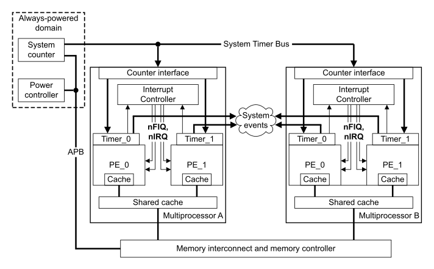

# ​G6.1 About the Generic Timer in AArch32 state

Source: <https://developer.arm.com/documentation/ddi0487/mc/-Part-G-The-AArch32-System-Level-Architecture/-Chapter-G6-The-Generic-Timer-in-AArch32-state/-G6-1-About-the-Generic-Timer-in-AArch32-state>

#### G6.1 About the Generic Timer in AArch32 state

[Figure G6-1](/documentation/ddi0487/mc/-Part-G-The-AArch32-System-Level-Architecture/-Chapter-G6-The-Generic-Timer-in-AArch32-state/-G6-1-About-the-Generic-Timer-in-AArch32-state?lang=en#fig_g5chdcbjgf) shows an example system-on-chip that uses the Generic Timer as a system timer. In this figure:

- This manual defines the architecture of the individual PEs in the multiprocessor blocks.
- The *ARM Generic Interrupt Controller Architecture Specification* defines a possible architecture for the interrupt controllers.
- Generic Timer functionality is distributed across multiple components.

Figure G6-1 Generic Timer example

The Generic Timer:

- Provides a system counter, that measures the passing of time in real-time.

  > #### Note
  >
  > The Generic Timer can also provide other components at a system level, but [Figure G6-1](/documentation/ddi0487/mc/-Part-G-The-AArch32-System-Level-Architecture/-Chapter-G6-The-Generic-Timer-in-AArch32-state/-G6-1-About-the-Generic-Timer-in-AArch32-state?lang=en#fig_g5chdcbjgf) does not show any such components.
- Supports *virtual counters* that measure the passing of virtual-time. That is, a virtual counter can measure the passing of time on a particular virtual machine.
- Timers, that can trigger events after a period of time has passed. The timers:

  - Can be used as count-up or as count-down timers.
  - Can operate in real-time or in virtual-time.

This chapter describes an instance of the Generic Timer component that [Figure G6-1](/documentation/ddi0487/mc/-Part-G-The-AArch32-System-Level-Architecture/-Chapter-G6-The-Generic-Timer-in-AArch32-state/-G6-1-About-the-Generic-Timer-in-AArch32-state?lang=en#fig_g5chdcbjgf) shows as Timer\_0 or Timer\_1 within the Multiprocessor A or Multiprocessor B block. This component can be accessed from AArch64 state or AArch32 state, and this chapter describes access from AArch32 state. [The Generic Timer in AArch64 state](/documentation/ddi0487/mc/-Part-D-The-AArch64-System-Level-Architecture/-Chapter-D12-The-Generic-Timer-in-AArch64-state?lang=en#cchggdgb) describes access to this component from AArch64 state.

> #### Note
>
> The reset requirements of Generic Timer registers are more strict when they are accessed from AArch32 state than when they are accessed from AArch64 state.

A Generic Timer implementation must also include a memory-mapped system component. This component:

- Must provide the System counter shown in [Figure G6-1](/documentation/ddi0487/mc/-Part-G-The-AArch32-System-Level-Architecture/-Chapter-G6-The-Generic-Timer-in-AArch32-state/-G6-1-About-the-Generic-Timer-in-AArch32-state?lang=en#fig_g5chdcbjgf).
- Optionally, can provide timer components for use at a system level.

[System Level Implementation of the Generic Timer](/documentation/ddi0487/mc/-Part-I-Memory-mapped-Components-of-the-Arm-Architecture/-Chapter-I2-System-Level-Implementation-of-the-Generic-Timer?lang=en#cegiiegb) describes this memory-mapped component.
