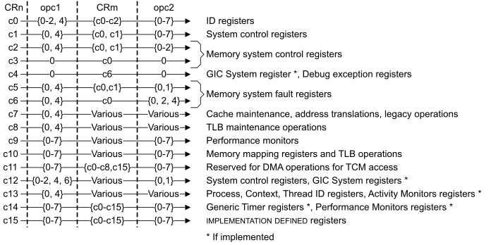

# ​G7.3.1 System register summary for ( coproc == 0b1111) encodings by CRn value

Source: <https://developer.arm.com/documentation/ddi0487/mc/-Part-G-The-AArch32-System-Level-Architecture/-Chapter-G7-AArch32-System-Register-Encoding/-G7-3-Organization-of-registers-in-the---coproc----0b1111--encoding-space/-G7-3-1-System-register-summary-for---coproc----0b1111--encodings-by-CRn-value>

##### G7.3.1 System register summary for ( `coproc` == `0b1111`) encodings by CRn value

[Figure G7-1](/documentation/ddi0487/mc/-Part-G-The-AArch32-System-Level-Architecture/-Chapter-G7-AArch32-System-Register-Encoding/-G7-3-Organization-of-registers-in-the---coproc----0b1111--encoding-space/-G7-3-1-System-register-summary-for---coproc----0b1111--encodings-by-CRn-value?lang=en#fig_cbhfcdbi) summarizes the grouping of the System registers in the (`coproc` == `0b1111`) encoding space, for an AArch32 VMSA implementation, by the value of `CRn` used for a 32-bit access to the register.

Figure G7-1 AArch32 System register groupings for (coproc == 0b1111), for 32-bit registers

> #### Note
>
> For the System registers in the (`coproc` == `0b1111`) encoding space, [Figure G7-1](/documentation/ddi0487/mc/-Part-G-The-AArch32-System-Level-Architecture/-Chapter-G7-AArch32-System-Register-Encoding/-G7-3-Organization-of-registers-in-the---coproc----0b1111--encoding-space/-G7-3-1-System-register-summary-for---coproc----0b1111--encodings-by-CRn-value?lang=en#fig_cbhfcdbi) gives only an overview of the assigned encodings for 32-bit registers for each of the `CRn` values `c0` - `c15`. For more information, see:
>
> - The full list of registers in the (`coproc` == `0b1111`) encoding space, in [Full list of AArch32 VMSA System registers in the ( coproc == `0b1111` ) encoding space](/documentation/ddi0487/mc/-Part-G-The-AArch32-System-Level-Architecture/-Chapter-G7-AArch32-System-Register-Encoding/-G7-3-Organization-of-registers-in-the---coproc----0b1111--encoding-space/-G7-3-2-Full-list-of-AArch32-VMSA-System-registers-in-the---coproc----0b1111--encoding-space?lang=en#babdafjj), for the definition of the assigned and unassigned encodings for that register.
> - The register definitions in [AArch32 System Register Descriptions](/documentation/ddi0487/mc/-Part-G-The-AArch32-System-Level-Architecture/-Chapter-G8-AArch32-System-Register-Descriptions?lang=en#autogen_registers_aarch32) for any dependencies on the implemented Exception levels.

In general, System register accesses using an unallocated set of {`CRn`, `opc1`, `CRm`, `opc2`} values are UNDEFINED. [Behavior of AArch32 VMSA System registers with ( coproc == `0b1111`, CRn == c0)](/documentation/ddi0487/mc/-Part-G-The-AArch32-System-Level-Architecture/-Chapter-G7-AArch32-System-Register-Encoding/-G7-3-Organization-of-registers-in-the---coproc----0b1111--encoding-space/-G7-3-1-System-register-summary-for---coproc----0b1111--encodings-by-CRn-value?lang=en#cihbdhjc) described the only exceptions to this rule.

The 32-bit System registers with (`coproc` == `0b1111`, CRn == c15), and the corresponding 64-bit System registers, are reserved for IMPLEMENTATION DEFINED registers. For more information, see [Reserved encodings in the AArch32 VMSA System register ( coproc == `0b1111` ) space](/documentation/ddi0487/mc/-Part-G-The-AArch32-System-Level-Architecture/-Chapter-G7-AArch32-System-Register-Encoding/-G7-3-Organization-of-registers-in-the---coproc----0b1111--encoding-space/-G7-3-1-System-register-summary-for---coproc----0b1111--encodings-by-CRn-value?lang=en#cihjifef).

###### G7.3.1.1 The HSTR.Tn trap on ( `coproc` == `0b1111`) System registers

When the value of [HSTR](/documentation/ddi0487/mc/-Part-G-The-AArch32-System-Level-Architecture/-Chapter-G8-AArch32-System-Register-Descriptions/-G8-2-General-system-control-registers/-G8-2-75-HSTR--Hyp-System-Trap-Register?lang=en#reg_aarch32_hstr).T*n* is 1, Non-secure PL1 accesses to System registers in the (`coproc` == `0b1111`) encoding space using a `CRn` or `CRm` value that corresponds to the value of T*n* are trapped to EL2, even if the encoding is UNDEFINED when the value of [HSTR](/documentation/ddi0487/mc/-Part-G-The-AArch32-System-Level-Architecture/-Chapter-G8-AArch32-System-Register-Descriptions/-G8-2-General-system-control-registers/-G8-2-75-HSTR--Hyp-System-Trap-Register?lang=en#reg_aarch32_hstr).T*n* is 0. This applies:

- For 32 bit register accesses when the value of `Rn` in the `MCR` or `MRC` instruction corresponds to T*n*.
- For 64 bit register accesses when the value of `Rm` in the `MCRR` or `MRRC` instruction corresponds to T*n*.

If there are matching System register encodings that are accessible from Non-secure EL0 then those accesses are also trapped to EL2 when the value of [HSTR](/documentation/ddi0487/mc/-Part-G-The-AArch32-System-Level-Architecture/-Chapter-G8-AArch32-System-Register-Descriptions/-G8-2-General-system-control-registers/-G8-2-75-HSTR--Hyp-System-Trap-Register?lang=en#reg_aarch32_hstr).T*n* is 1.

###### G7.3.1.2 Behavior of AArch32 VMSA System registers with ( `coproc` == `0b1111`, CRn == c0)

In the (`coproc` == `0b1111`) encoding space, the 32-bit System registers with (`CRn` == `c0`) provide device and feature identification.

[Table G7-3](/documentation/ddi0487/mc/-Part-G-The-AArch32-System-Level-Architecture/-Chapter-G7-AArch32-System-Register-Encoding/-G7-3-Organization-of-registers-in-the---coproc----0b1111--encoding-space/-G7-3-2-Full-list-of-AArch32-VMSA-System-registers-in-the---coproc----0b1111--encoding-space?lang=en#tbl_cihcefac) shows all of the architecturally required System registers with {`coproc` == `0b1111`, `CRn` == `c0`}. The behavior of 32-bit System register encodings in this group that are not shown in the table, and encodings that are part of an unimplemented Exception level, depends on the value of `opc1`, and possibly on the value of `CRm` and `opc2`, as follows:

`opc1` == 0
:   All write accesses to the encodings are UNDEFINED.

    For read accesses:

    - The following encodings return an UNKNOWN value:

      - `CRm` == 3, `opc2` == {0, 1, 2}.
      - `CRm` == {4, 6, 7}, `opc2` == {0, 1}.
      - `CRm` == 5, `opc2` == {0, 1, 4, 5}.
    - All other encodings are RES0.

`opc1` > 0
:   All accesses to the encodings are UNDEFINED.

See also [Accesses to unallocated encodings in the ( coproc == `0b111x` ) encoding space](/documentation/ddi0487/mc/-Part-G-The-AArch32-System-Level-Architecture/-Chapter-G8-AArch32-System-Register-Descriptions/-G8-1-About-the-AArch32-System-registers/-G8-1-2-General-behavior-of-System-registers?lang=en#babjiajb).

> #### Note
>
> Some of these registers were previously described as being part of the CPUID identification scheme, see [The CPUID identification scheme](/documentation/ddi0487/mc/-Part-G-The-AArch32-System-Level-Architecture/-Chapter-G8-AArch32-System-Register-Descriptions/-G8-1-About-the-AArch32-System-registers/-G8-1-2-General-behavior-of-System-registers?lang=en#chdjeibi).

###### G7.3.1.3 Reserved encodings in the AArch32 VMSA System register ( `coproc` == `0b1111`) space

AArch32 state reserves a number of regions in the (coproc == `0b1111`) encoding space for IMPLEMENTATION DEFINED System registers. These reservations are defined in terms of the encoding of 32-bit accesses to the System register encoding space. That is, they are defined by the reserved 32-bit {`CRn`, `opc1`, `CRm`, `opc2`} encodings.

Reserved encodings that do not have an IMPLEMENTATION DEFINED function are UNDEFINED.

The following subsections give more information about these reserved encodings:

- [Reserved 32-bit encodings with { coproc == `0b1111`, CRn == c9 }](/documentation/ddi0487/mc/-Part-G-The-AArch32-System-Level-Architecture/-Chapter-G7-AArch32-System-Register-Encoding/-G7-3-Organization-of-registers-in-the---coproc----0b1111--encoding-space/-G7-3-1-System-register-summary-for---coproc----0b1111--encodings-by-CRn-value?lang=en#chdbgaff).
- [Reserved 32-bit encodings with { coproc == `0b1111`, CRn == c10 }](/documentation/ddi0487/mc/-Part-G-The-AArch32-System-Level-Architecture/-Chapter-G7-AArch32-System-Register-Encoding/-G7-3-Organization-of-registers-in-the---coproc----0b1111--encoding-space/-G7-3-1-System-register-summary-for---coproc----0b1111--encodings-by-CRn-value?lang=en#chdjaaaf).
- [Reserved 32-bit encodings with { coproc == `0b1111`, CRn == c11 }](/documentation/ddi0487/mc/-Part-G-The-AArch32-System-Level-Architecture/-Chapter-G7-AArch32-System-Register-Encoding/-G7-3-Organization-of-registers-in-the---coproc----0b1111--encoding-space/-G7-3-1-System-register-summary-for---coproc----0b1111--encodings-by-CRn-value?lang=en#chdibbdf).
- [Reserved 32-bit encodings with { coproc == `0b1111`, CRn == c15 }](/documentation/ddi0487/mc/-Part-G-The-AArch32-System-Level-Architecture/-Chapter-G7-AArch32-System-Register-Encoding/-G7-3-Organization-of-registers-in-the---coproc----0b1111--encoding-space/-G7-3-1-System-register-summary-for---coproc----0b1111--encodings-by-CRn-value?lang=en#chdjahab).

**G7.3.1.3.1 Reserved 32-bit encodings with { `coproc` == `0b1111`, `CRn` == `c9`}**

In the AArch32 encoding space, for 32-bit encodings with {`coproc` == `0b1111`, `CRn` == `c9`}, the following encodings are reserved for IMPLEMENTATION DEFINED purposes:

- Encodings with {`coproc` == `0b1111`, `CRn` == `c9`, `opc1` == {0 - 7}, `opc2`== {0 - 7}, `CRm` == {`c0` - `c2`, `c5` - `c8`}} are reserved for IMPLEMENTATION DEFINED branch predictor, cache, and TCM operations.
- Encodings with {`coproc` == `0b1111`, `CRn` == `c9`, `opc1` == {0 - 7}, `opc2`== {0 - 7}, `CRm` == `c15` } are reserved for IMPLEMENTATION DEFINED performance monitors.

  > #### Note
  >
  > These are distinct from the OPTIONAL Arm Performance Monitors Extension, the registers for which use the encoding space {`coproc` == `0b1111`, `CRn` == `c9`, `opc1` == {0 - 7}, `opc2`== {0 - 7}, `CRm` == {`c12` - `c14`}}.

**G7.3.1.3.2 Reserved 32-bit encodings with { `coproc` == `0b1111`, `CRn` == `c10`}**

In the AArch32 encoding space, for 32-bit encodings with {`coproc` == `0b1111`, `CRn` == `c10`}, the following encodings are reserved for IMPLEMENTATION DEFINED purposes:

- Encodings with {`coproc` == `0b1111`, `CRn` == `c10`, `opc` == {0 - 7}, `CRm` == {`c0`, `c1`, `c4`, `c8`}} are reserved for IMPLEMENTATION DEFINED TLB lockdown operations.

**G7.3.1.3.3 Reserved 32-bit encodings with { `coproc` == `0b1111`, `CRn` == `c11`}**

In the AArch32 encoding space, for 32-bit encodings with {`coproc` == `0b1111`, `CRn` == `c11`}, the following encodings are reserved for IMPLEMENTATION DEFINED purposes:

- Encodings with {`coproc` == `0b1111`, `CRn` == `c11`, `opc` == {0 - 7}, `CRm` == {`c0` - `c8`, `c15`}} are reserved for IMPLEMENTATION DEFINED DMA operations for TCM access.

The remainder of the AArch32 {`coproc` == `0b1111`, `CRn` == `c11`} encoding space is UNDEFINED.

**G7.3.1.3.4 Reserved 32-bit encodings with { `coproc` == `0b1111`, `CRn` == `c15`}**

The AArch32 System register encodings are reserved with (`coproc` == `0b1111`, `CRn` == `c15`) for IMPLEMENTATION DEFINED purposes, and there are no restrictions on the use of these encodings. The documentation of the Arm implementation must describe fully any registers implemented in the {`coproc` == `0b1111`, `CRn` == `c15`} encoding space. Normally, for processor implementations by Arm, this information is included in the *Technical Reference Manual* for the processor.

Typically, an implementation uses the {`coproc` == `0b1111`, `CRn` == `c15`} encodings to provide test features, and any required configuration options that are not covered by this Manual.

This reservation means that the AArch32 64-bit encodings with {`coproc` == `0b1111`, `CRm` == `c15`} are also reserved for IMPLEMENTATION DEFINED purposes, without any restrictions on the use of these encodings.
