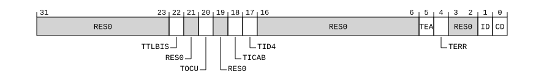

# ​G8.2.66 HCR2, Hyp Configuration Register 2

Source: <https://developer.arm.com/documentation/ddi0487/mc/-Part-G-The-AArch32-System-Level-Architecture/-Chapter-G8-AArch32-System-Register-Descriptions/-G8-2-General-system-control-registers/-G8-2-66-HCR2--Hyp-Configuration-Register-2>

##### G8.2.66 HCR2, Hyp Configuration Register 2

The HCR2 characteristics are:

Purpose
:   Provides additional configuration controls for virtualization.

Configuration
:   If EL2 is not implemented, this register is RES0 from EL3.

    AArch32 System register HCR2 bits [31:0] are architecturally mapped to AArch64 System register [HCR\_EL2](/documentation/ddi0487/mc/-Part-D-The-AArch64-System-Level-Architecture/-Chapter-D24-AArch64-System-Register-Descriptions/-D24-2-General-system-control-registers/-D24-2-61-HCR-EL2--Hypervisor-Configuration-Register?lang=en#reg_aarch64_hcr_el2)[63:32].

    This register is present only when FEAT\_AA32EL2 is implemented. Otherwise, direct accesses to HCR2 are UNDEFINED.

Attributes
:   HCR2 is a 32-bit register.

###### Field descriptions



Bits [31:23]
:   Reserved, RES0.

TTLBIS, bit [22]
:   When FEAT\_EVT is implemented:
    :   Trap TLB maintenance instructions that operate on the Inner Shareable domain. Traps execution of the following TLB maintenance instructions at EL1 to EL2:

        [TLBIALLIS](/documentation/ddi0487/mc/-Part-G-The-AArch32-System-Level-Architecture/-Chapter-G8-AArch32-System-Register-Descriptions/-G8-2-General-system-control-registers/-G8-2-140-TLBIALLIS--TLB-Invalidate-All--Inner-Shareable?lang=en#reg_aarch32_tlbiallis), [TLBIASIDIS](/documentation/ddi0487/mc/-Part-G-The-AArch32-System-Level-Architecture/-Chapter-G8-AArch32-System-Register-Descriptions/-G8-2-General-system-control-registers/-G8-2-144-TLBIASIDIS--TLB-Invalidate-by-ASID-match--Inner-Shareable?lang=en#reg_aarch32_tlbiasidis), [TLBIMVAAIS](/documentation/ddi0487/mc/-Part-G-The-AArch32-System-Level-Architecture/-Chapter-G8-AArch32-System-Register-Descriptions/-G8-2-General-system-control-registers/-G8-2-151-TLBIMVAAIS--TLB-Invalidate-by-VA--All-ASID--Inner-Shareable?lang=en#reg_aarch32_tlbimvaais), [TLBIMVAALIS](/documentation/ddi0487/mc/-Part-G-The-AArch32-System-Level-Architecture/-Chapter-G8-AArch32-System-Register-Descriptions/-G8-2-General-system-control-registers/-G8-2-153-TLBIMVAALIS--TLB-Invalidate-by-VA--All-ASID--Last-level--Inner-Shareable?lang=en#reg_aarch32_tlbimvaalis), [TLBIMVAIS](/documentation/ddi0487/mc/-Part-G-The-AArch32-System-Level-Architecture/-Chapter-G8-AArch32-System-Register-Descriptions/-G8-2-General-system-control-registers/-G8-2-156-TLBIMVAIS--TLB-Invalidate-by-VA--Inner-Shareable?lang=en#reg_aarch32_tlbimvais), and [TLBIMVALIS](/documentation/ddi0487/mc/-Part-G-The-AArch32-System-Level-Architecture/-Chapter-G8-AArch32-System-Register-Descriptions/-G8-2-General-system-control-registers/-G8-2-160-TLBIMVALIS--TLB-Invalidate-by-VA--Last-level--Inner-Shareable?lang=en#reg_aarch32_tlbimvalis)

<table>
 <colgroup>
  <col/>
  <col/>
 </colgroup>
 <thead>
  <tr>
   <th>
    <strong>
     TTLBIS
    </strong>
   </th>
   <th>
    <strong>
     Meaning
    </strong>
   </th>
  </tr>
 </thead>
 <tbody>
  <tr>
   <td>
    <p>
     <code>
      0b0
     </code>
    </p>
   </td>
   <td>
    <p>
     This control does not cause any instructions to be trapped.
    </p>
   </td>
  </tr>
  <tr>
   <td>
    <p>
     <code>
      0b1
     </code>
    </p>
   </td>
   <td>
    <p>
     Non-secure EL1 execution of the specified TLB maintenance instructions is trapped to EL2.
    </p>
   </td>
  </tr>
 </tbody>
</table>

        When the Effective value of [HCR\_EL2](/documentation/ddi0487/mc/-Part-D-The-AArch64-System-Level-Architecture/-Chapter-D24-AArch64-System-Register-Descriptions/-D24-2-General-system-control-registers/-D24-2-61-HCR-EL2--Hypervisor-Configuration-Register?lang=en#reg_aarch64_hcr_el2).{E2H, TGE} is {1, 1}, the Effective value of this field is 0.

        The reset behavior of this field is:

        - On a Warm reset:
          - When the highest implemented Exception level is EL3 or the highest implemented Exception level is EL2, this field resets to `'0'`.
          - Otherwise, this field resets to an architecturally UNKNOWN value.

    Otherwise:
    :   Reserved, RES0.

Bit [21]
:   Reserved, RES0.

TOCU, bit [20]
:   When FEAT\_EVT is implemented:
    :   Trap cache maintenance instructions that operate to the Point of Unification. Traps execution of [DCCMVAU](/documentation/ddi0487/mc/-Part-G-The-AArch32-System-Level-Architecture/-Chapter-G8-AArch32-System-Register-Descriptions/-G8-2-General-system-control-registers/-G8-2-42-DCCMVAU--Data-Cache-line-Clean-by-VA-to-PoU?lang=en#reg_aarch32_dccmvau), [ICIALLU](/documentation/ddi0487/mc/-Part-G-The-AArch32-System-Level-Architecture/-Chapter-G8-AArch32-System-Register-Descriptions/-G8-2-General-system-control-registers/-G8-2-80-ICIALLU--Instruction-Cache-Invalidate-All-to-PoU?lang=en#reg_aarch32_iciallu), and [ICIMVAU](/documentation/ddi0487/mc/-Part-G-The-AArch32-System-Level-Architecture/-Chapter-G8-AArch32-System-Register-Descriptions/-G8-2-General-system-control-registers/-G8-2-82-ICIMVAU--Instruction-Cache-line-Invalidate-by-VA-to-PoU?lang=en#reg_aarch32_icimvau) at EL1 to EL2.

<table>
 <colgroup>
  <col/>
  <col/>
 </colgroup>
 <thead>
  <tr>
   <th>
    <strong>
     TOCU
    </strong>
   </th>
   <th>
    <strong>
     Meaning
    </strong>
   </th>
  </tr>
 </thead>
 <tbody>
  <tr>
   <td>
    <p>
     <code>
      0b0
     </code>
    </p>
   </td>
   <td>
    <p>
     This control does not cause any instructions to be trapped.
    </p>
   </td>
  </tr>
  <tr>
   <td>
    <p>
     <code>
      0b1
     </code>
    </p>
   </td>
   <td>
    <p>
     Non-secure execution of the specified cache maintenance instructions is trapped to EL2.
    </p>
   </td>
  </tr>
 </tbody>
</table>

        If the Point of Unification is before any level of data cache, it is IMPLEMENTATION DEFINED whether the execution of any data or unified cache clean by VA to the Point of Unification instruction can be trapped when the value of this control is 1.

        If the Point of Unification is before any level of instruction cache, it is IMPLEMENTATION DEFINED whether the execution of any instruction cache invalidate to the Point of Unification instruction can be trapped when the value of this control is 1.

        When the Effective value of [HCR\_EL2](/documentation/ddi0487/mc/-Part-D-The-AArch64-System-Level-Architecture/-Chapter-D24-AArch64-System-Register-Descriptions/-D24-2-General-system-control-registers/-D24-2-61-HCR-EL2--Hypervisor-Configuration-Register?lang=en#reg_aarch64_hcr_el2).{E2H, TGE} is {1, 1}, the Effective value of this field is 0.

        The reset behavior of this field is:

        - On a Warm reset:
          - When the highest implemented Exception level is EL3 or the highest implemented Exception level is EL2, this field resets to `'0'`.
          - Otherwise, this field resets to an architecturally UNKNOWN value.

    Otherwise:
    :   Reserved, RES0.

Bit [19]
:   Reserved, RES0.

TICAB, bit [18]
:   When FEAT\_EVT is implemented:
    :   Trap ICIALLUIS cache maintenance instructions. Traps execution of those cache maintenance instructions at EL1 to EL2.

        This applies to the following instructions:

        [ICIALLUIS](/documentation/ddi0487/mc/-Part-G-The-AArch32-System-Level-Architecture/-Chapter-G8-AArch32-System-Register-Descriptions/-G8-2-General-system-control-registers/-G8-2-81-ICIALLUIS--Instruction-Cache-Invalidate-All-to-PoU--Inner-Shareable?lang=en#reg_aarch32_icialluis).

<table>
 <colgroup>
  <col/>
  <col/>
 </colgroup>
 <thead>
  <tr>
   <th>
    <strong>
     TICAB
    </strong>
   </th>
   <th>
    <strong>
     Meaning
    </strong>
   </th>
  </tr>
 </thead>
 <tbody>
  <tr>
   <td>
    <p>
     <code>
      0b0
     </code>
    </p>
   </td>
   <td>
    <p>
     This control does not cause any instructions to be trapped.
    </p>
   </td>
  </tr>
  <tr>
   <td>
    <p>
     <code>
      0b1
     </code>
    </p>
   </td>
   <td>
    <p>
     Non-secure EL1 execution of the specified cache maintenance instructions is trapped to EL2.
    </p>
   </td>
  </tr>
 </tbody>
</table>

        If the Point of Unification is before any level of instruction cache, it is IMPLEMENTATION DEFINED whether the execution of any instruction cache invalidate to the Point of Unification instruction can be trapped when the value of this control is 1.

        When the Effective value of [HCR\_EL2](/documentation/ddi0487/mc/-Part-D-The-AArch64-System-Level-Architecture/-Chapter-D24-AArch64-System-Register-Descriptions/-D24-2-General-system-control-registers/-D24-2-61-HCR-EL2--Hypervisor-Configuration-Register?lang=en#reg_aarch64_hcr_el2).{E2H, TGE} is {1, 1}, the Effective value of this field is 0.

        The reset behavior of this field is:

        - On a Warm reset:
          - When the highest implemented Exception level is EL3 or the highest implemented Exception level is EL2, this field resets to `'0'`.
          - Otherwise, this field resets to an architecturally UNKNOWN value.

    Otherwise:
    :   Reserved, RES0.

TID4, bit [17]
:   When FEAT\_EVT is implemented:
    :   Trap ID group 4. Traps the following register accesses to EL2:

        - EL1 reads of [CCSIDR](/documentation/ddi0487/mc/-Part-G-The-AArch32-System-Level-Architecture/-Chapter-G8-AArch32-System-Register-Descriptions/-G8-2-General-system-control-registers/-G8-2-24-CCSIDR--Current-Cache-Size-ID-Register?lang=en#reg_aarch32_ccsidr), [CCSIDR2](/documentation/ddi0487/mc/-Part-G-The-AArch32-System-Level-Architecture/-Chapter-G8-AArch32-System-Register-Descriptions/-G8-2-General-system-control-registers/-G8-2-25-CCSIDR2--Current-Cache-Size-ID-Register-2?lang=en#reg_aarch32_ccsidr2), [CLIDR](/documentation/ddi0487/mc/-Part-G-The-AArch32-System-Level-Architecture/-Chapter-G8-AArch32-System-Register-Descriptions/-G8-2-General-system-control-registers/-G8-2-27-CLIDR--Cache-Level-ID-Register?lang=en#reg_aarch32_clidr), and [CSSELR](/documentation/ddi0487/mc/-Part-G-The-AArch32-System-Level-Architecture/-Chapter-G8-AArch32-System-Register-Descriptions/-G8-2-General-system-control-registers/-G8-2-36-CSSELR--Cache-Size-Selection-Register?lang=en#reg_aarch32_csselr).
        - EL1 writes to [CSSELR](/documentation/ddi0487/mc/-Part-G-The-AArch32-System-Level-Architecture/-Chapter-G8-AArch32-System-Register-Descriptions/-G8-2-General-system-control-registers/-G8-2-36-CSSELR--Cache-Size-Selection-Register?lang=en#reg_aarch32_csselr).

<table>
 <colgroup>
  <col/>
  <col/>
 </colgroup>
 <thead>
  <tr>
   <th>
    <strong>
     TID4
    </strong>
   </th>
   <th>
    <strong>
     Meaning
    </strong>
   </th>
  </tr>
 </thead>
 <tbody>
  <tr>
   <td>
    <p>
     <code>
      0b0
     </code>
    </p>
   </td>
   <td>
    <p>
     This control does not cause any instructions to be trapped.
    </p>
   </td>
  </tr>
  <tr>
   <td>
    <p>
     <code>
      0b1
     </code>
    </p>
   </td>
   <td>
    <p>
     The specified Non-secure EL1 and EL0 accesses to ID group 4 registers are trapped to EL2.
    </p>
   </td>
  </tr>
 </tbody>
</table>

        When the Effective value of [HCR\_EL2](/documentation/ddi0487/mc/-Part-D-The-AArch64-System-Level-Architecture/-Chapter-D24-AArch64-System-Register-Descriptions/-D24-2-General-system-control-registers/-D24-2-61-HCR-EL2--Hypervisor-Configuration-Register?lang=en#reg_aarch64_hcr_el2).{E2H, TGE} is {1, 1}, the Effective value of this field is 0.

        The reset behavior of this field is:

        - On a Warm reset:
          - When the highest implemented Exception level is EL3 or the highest implemented Exception level is EL2, this field resets to `'0'`.
          - Otherwise, this field resets to an architecturally UNKNOWN value.

    Otherwise:
    :   Reserved, RES0.

Bits [16:6]
:   Reserved, RES0.

TEA, bit [5]
:   When FEAT\_RAS is implemented:
    :   Route synchronous External abort exceptions from EL0 and EL1 to EL2.

<table>
 <colgroup>
  <col/>
  <col/>
 </colgroup>
 <thead>
  <tr>
   <th>
    <strong>
     TEA
    </strong>
   </th>
   <th>
    <strong>
     Meaning
    </strong>
   </th>
  </tr>
 </thead>
 <tbody>
  <tr>
   <td>
    <p>
     <code>
      0b0
     </code>
    </p>
   </td>
   <td>
    <p>
     Does not route synchronous External abort exceptions from Non-secure EL0 and EL1 to EL2.
    </p>
   </td>
  </tr>
  <tr>
   <td>
    <p>
     <code>
      0b1
     </code>
    </p>
   </td>
   <td>
    <p>
     Route synchronous External abort exceptions from Non-secure EL0 and EL1 to EL2, if not routed to EL3.
    </p>
   </td>
  </tr>
 </tbody>
</table>

        The reset behavior of this field is:

        - On a Warm reset:
          - When the highest implemented Exception level is EL3 or the highest implemented Exception level is EL2, this field resets to `'0'`.
          - Otherwise, this field resets to an architecturally UNKNOWN value.

    Otherwise:
    :   Reserved, RES0.

TERR, bit [4]
:   When FEAT\_RAS is implemented:
    :   Trap Error record accesses from EL1 to EL2. Traps MRC or MCR accesses, reported using EC syndrome value `0x03`, and MRRC or MCRR accesses, reported using EC syndrome value `0x04`, to the following registers from EL1 to EL2:

        [ERRIDR](/documentation/ddi0487/mc/-Part-G-The-AArch32-System-Level-Architecture/-Chapter-G8-AArch32-System-Register-Descriptions/-G8-6-RAS-registers/-G8-6-2-ERRIDR--Error-Record-ID-Register?lang=en#reg_aarch32_erridr), [ERRSELR](/documentation/ddi0487/mc/-Part-G-The-AArch32-System-Level-Architecture/-Chapter-G8-AArch32-System-Register-Descriptions/-G8-6-RAS-registers/-G8-6-3-ERRSELR--Error-Record-Select-Register?lang=en#reg_aarch32_errselr), [ERXADDR](/documentation/ddi0487/mc/-Part-G-The-AArch32-System-Level-Architecture/-Chapter-G8-AArch32-System-Register-Descriptions/-G8-6-RAS-registers/-G8-6-4-ERXADDR--Selected-Error-Record-Address-Register?lang=en#reg_aarch32_erxaddr), [ERXADDR2](/documentation/ddi0487/mc/-Part-G-The-AArch32-System-Level-Architecture/-Chapter-G8-AArch32-System-Register-Descriptions/-G8-6-RAS-registers/-G8-6-5-ERXADDR2--Selected-Error-Record-Address-Register-2?lang=en#reg_aarch32_erxaddr2), [ERXCTLR](/documentation/ddi0487/mc/-Part-G-The-AArch32-System-Level-Architecture/-Chapter-G8-AArch32-System-Register-Descriptions/-G8-6-RAS-registers/-G8-6-6-ERXCTLR--Selected-Error-Record-Control-Register?lang=en#reg_aarch32_erxctlr), [ERXCTLR2](/documentation/ddi0487/mc/-Part-G-The-AArch32-System-Level-Architecture/-Chapter-G8-AArch32-System-Register-Descriptions/-G8-6-RAS-registers/-G8-6-7-ERXCTLR2--Selected-Error-Record-Control-Register-2?lang=en#reg_aarch32_erxctlr2), [ERXFR](/documentation/ddi0487/mc/-Part-G-The-AArch32-System-Level-Architecture/-Chapter-G8-AArch32-System-Register-Descriptions/-G8-6-RAS-registers/-G8-6-8-ERXFR--Selected-Error-Record-Feature-Register?lang=en#reg_aarch32_erxfr), [ERXFR2](/documentation/ddi0487/mc/-Part-G-The-AArch32-System-Level-Architecture/-Chapter-G8-AArch32-System-Register-Descriptions/-G8-6-RAS-registers/-G8-6-9-ERXFR2--Selected-Error-Record-Feature-Register-2?lang=en#reg_aarch32_erxfr2), [ERXMISC0](/documentation/ddi0487/mc/-Part-G-The-AArch32-System-Level-Architecture/-Chapter-G8-AArch32-System-Register-Descriptions/-G8-6-RAS-registers/-G8-6-10-ERXMISC0--Selected-Error-Record-Miscellaneous-Register-0?lang=en#reg_aarch32_erxmisc0), [ERXMISC1](/documentation/ddi0487/mc/-Part-G-The-AArch32-System-Level-Architecture/-Chapter-G8-AArch32-System-Register-Descriptions/-G8-6-RAS-registers/-G8-6-11-ERXMISC1--Selected-Error-Record-Miscellaneous-Register-1?lang=en#reg_aarch32_erxmisc1), [ERXMISC2](/documentation/ddi0487/mc/-Part-G-The-AArch32-System-Level-Architecture/-Chapter-G8-AArch32-System-Register-Descriptions/-G8-6-RAS-registers/-G8-6-12-ERXMISC2--Selected-Error-Record-Miscellaneous-Register-2?lang=en#reg_aarch32_erxmisc2), [ERXMISC3](/documentation/ddi0487/mc/-Part-G-The-AArch32-System-Level-Architecture/-Chapter-G8-AArch32-System-Register-Descriptions/-G8-6-RAS-registers/-G8-6-13-ERXMISC3--Selected-Error-Record-Miscellaneous-Register-3?lang=en#reg_aarch32_erxmisc3), and [ERXSTATUS](/documentation/ddi0487/mc/-Part-G-The-AArch32-System-Level-Architecture/-Chapter-G8-AArch32-System-Register-Descriptions/-G8-6-RAS-registers/-G8-6-18-ERXSTATUS--Selected-Error-Record-Primary-Status-Register?lang=en#reg_aarch32_erxstatus).

        When [FEAT\_RASv1p1](/documentation/ddi0487/mc/-Part-A-Arm-Architecture-Introduction-and-Overview/-Chapter-A2-A-profile-Architecture-Extensions/-A2-2-Armv8-A-architecture-extensions/-A2-2-5-The-Armv8-4-architecture-extension?lang=en#feat_feat_rasv1p1) is implemented, [ERXMISC4](/documentation/ddi0487/mc/-Part-G-The-AArch32-System-Level-Architecture/-Chapter-G8-AArch32-System-Register-Descriptions/-G8-6-RAS-registers/-G8-6-14-ERXMISC4--Selected-Error-Record-Miscellaneous-Register-4?lang=en#reg_aarch32_erxmisc4), [ERXMISC5](/documentation/ddi0487/mc/-Part-G-The-AArch32-System-Level-Architecture/-Chapter-G8-AArch32-System-Register-Descriptions/-G8-6-RAS-registers/-G8-6-15-ERXMISC5--Selected-Error-Record-Miscellaneous-Register-5?lang=en#reg_aarch32_erxmisc5), [ERXMISC6](/documentation/ddi0487/mc/-Part-G-The-AArch32-System-Level-Architecture/-Chapter-G8-AArch32-System-Register-Descriptions/-G8-6-RAS-registers/-G8-6-16-ERXMISC6--Selected-Error-Record-Miscellaneous-Register-6?lang=en#reg_aarch32_erxmisc6), and [ERXMISC7](/documentation/ddi0487/mc/-Part-G-The-AArch32-System-Level-Architecture/-Chapter-G8-AArch32-System-Register-Descriptions/-G8-6-RAS-registers/-G8-6-17-ERXMISC7--Selected-Error-Record-Miscellaneous-Register-7?lang=en#reg_aarch32_erxmisc7).

<table>
 <colgroup>
  <col/>
  <col/>
 </colgroup>
 <thead>
  <tr>
   <th>
    <strong>
     TERR
    </strong>
   </th>
   <th>
    <strong>
     Meaning
    </strong>
   </th>
  </tr>
 </thead>
 <tbody>
  <tr>
   <td>
    <p>
     <code>
      0b0
     </code>
    </p>
   </td>
   <td>
    <p>
     This control does not cause any instructions to be trapped.
    </p>
   </td>
  </tr>
  <tr>
   <td>
    <p>
     <code>
      0b1
     </code>
    </p>
   </td>
   <td>
    <p>
     Accesses to the specified registers from EL1 generate a Trap exception to EL2.
    </p>
   </td>
  </tr>
 </tbody>
</table>

        The reset behavior of this field is:

        - On a Warm reset:
          - When the highest implemented Exception level is EL3 or the highest implemented Exception level is EL2, this field resets to `'0'`.
          - Otherwise, this field resets to an architecturally UNKNOWN value.

    Otherwise:
    :   Reserved, RES0.

Bits [3:2]
:   Reserved, RES0.

ID, bit [1]
:   Stage 2 Instruction access cacheability disable. For the Non-secure PL1&0 translation regime, when [HCR](/documentation/ddi0487/mc/-Part-G-The-AArch32-System-Level-Architecture/-Chapter-G8-AArch32-System-Register-Descriptions/-G8-2-General-system-control-registers/-G8-2-65-HCR--Hyp-Configuration-Register?lang=en#reg_aarch32_hcr).VM==1, this control forces all stage 2 translations for instruction accesses to Normal memory to be Non-cacheable.

<table>
 <colgroup>
  <col/>
  <col/>
 </colgroup>
 <thead>
  <tr>
   <th>
    <strong>
     ID
    </strong>
   </th>
   <th>
    <strong>
     Meaning
    </strong>
   </th>
  </tr>
 </thead>
 <tbody>
  <tr>
   <td>
    <p>
     <code>
      0b0
     </code>
    </p>
   </td>
   <td>
    <p>
     This control has no effect on stage 2 of the Non-secure PL1&amp;0 translation regime.
    </p>
   </td>
  </tr>
  <tr>
   <td>
    <p>
     <code>
      0b1
     </code>
    </p>
   </td>
   <td>
    <p>
     For the Non-secure PL1&amp;0 translation regime, forces all stage 2 translations for instruction accesses to Normal memory to be Non-cacheable.
    </p>
   </td>
  </tr>
 </tbody>
</table>

    This bit has no effect on the EL2 translation regime.

    The reset behavior of this field is:

    - On a Warm reset:
      - When the highest implemented Exception level is EL3 or the highest implemented Exception level is EL2, this field resets to `'0'`.
      - Otherwise, this field resets to an architecturally UNKNOWN value.

CD, bit [0]
:   Stage 2 Data access cacheability disable. When [HCR](/documentation/ddi0487/mc/-Part-G-The-AArch32-System-Level-Architecture/-Chapter-G8-AArch32-System-Register-Descriptions/-G8-2-General-system-control-registers/-G8-2-65-HCR--Hyp-Configuration-Register?lang=en#reg_aarch32_hcr).VM==1, this forces all stage 2 translations for data accesses and translation table walks to Normal memory to be Non-cacheable for the Non-secure PL1&0 translation regime.

<table>
 <colgroup>
  <col/>
  <col/>
 </colgroup>
 <thead>
  <tr>
   <th>
    <strong>
     CD
    </strong>
   </th>
   <th>
    <strong>
     Meaning
    </strong>
   </th>
  </tr>
 </thead>
 <tbody>
  <tr>
   <td>
    <p>
     <code>
      0b0
     </code>
    </p>
   </td>
   <td>
    <p>
     This control has no effect on stage 2 of the Non-secure PL1&amp;0 translation regime for data accesses and translation table walks.
    </p>
   </td>
  </tr>
  <tr>
   <td>
    <p>
     <code>
      0b1
     </code>
    </p>
   </td>
   <td>
    <p>
     For the Non-secure PL1&amp;0 translation regime, forces all stage 2 translations for data accesses and translation table walks to Normal memory to be Non-cacheable.
    </p>
   </td>
  </tr>
 </tbody>
</table>

    This bit has no effect on the EL2 translation regime.

    The reset behavior of this field is:

    - On a Warm reset:
      - When the highest implemented Exception level is EL3 or the highest implemented Exception level is EL2, this field resets to `'0'`.
      - Otherwise, this field resets to an architecturally UNKNOWN value.

###### Accessing HCR2

Accesses to this register use the following encodings in the System register encoding space:

###### `MRC{<c>}{<q>} <coproc>, {#}<opc1>, <Rt>, <CRn>, <CRm>{, {#}<opc2>}`

<table>
 <colgroup>
  <col/>
  <col/>
  <col/>
  <col/>
  <col/>
 </colgroup>
 <thead>
  <tr>
   <th>
    <strong>
     coproc
    </strong>
   </th>
   <th>
    <strong>
     opc1
    </strong>
   </th>
   <th>
    <strong>
     CRn
    </strong>
   </th>
   <th>
    <strong>
     CRm
    </strong>
   </th>
   <th>
    <strong>
     opc2
    </strong>
   </th>
  </tr>
 </thead>
 <tbody>
  <tr>
   <td>
    <p>
     <code>
      0b1111
     </code>
    </p>
   </td>
   <td>
    <p>
     <code>
      0b100
     </code>
    </p>
   </td>
   <td>
    <p>
     <code>
      0b0001
     </code>
    </p>
   </td>
   <td>
    <p>
     <code>
      0b0001
     </code>
    </p>
   </td>
   <td>
    <p>
     <code>
      0b100
     </code>
    </p>
   </td>
  </tr>
 </tbody>
</table>

```
if !IsFeatureImplemented(FEAT_AA32EL2) then
    Undefined();
elsif PSTATE.EL == EL0 then
    Undefined();
elsif PSTATE.EL == EL1 then
    if EL2Enabled() && IsFeatureImplemented(FEAT_AA64EL2) && !ELUsingAArch32(EL2) && HSTR_EL2().T1 == '1' then
        AArch64_AArch32SystemAccessTrap(EL2, 0x03);
    elsif EL2Enabled() && IsFeatureImplemented(FEAT_AA32EL2) && ELUsingAArch32(EL2) && HSTR().T1 == '1' then
        AArch32_TakeHypTrapException(0x03);
    else
        Undefined();
    end;
elsif PSTATE.EL == EL2 then
    R(t) = HCR2();
elsif PSTATE.EL == EL3 then
    if SCR().NS == '0' then
        Undefined();
    else
        R(t) = HCR2();
    end;
end;
```

###### `MCR{<c>}{<q>} <coproc>, {#}<opc1>, <Rt>, <CRn>, <CRm>{, {#}<opc2>}`

<table>
 <colgroup>
  <col/>
  <col/>
  <col/>
  <col/>
  <col/>
 </colgroup>
 <thead>
  <tr>
   <th>
    <strong>
     coproc
    </strong>
   </th>
   <th>
    <strong>
     opc1
    </strong>
   </th>
   <th>
    <strong>
     CRn
    </strong>
   </th>
   <th>
    <strong>
     CRm
    </strong>
   </th>
   <th>
    <strong>
     opc2
    </strong>
   </th>
  </tr>
 </thead>
 <tbody>
  <tr>
   <td>
    <p>
     <code>
      0b1111
     </code>
    </p>
   </td>
   <td>
    <p>
     <code>
      0b100
     </code>
    </p>
   </td>
   <td>
    <p>
     <code>
      0b0001
     </code>
    </p>
   </td>
   <td>
    <p>
     <code>
      0b0001
     </code>
    </p>
   </td>
   <td>
    <p>
     <code>
      0b100
     </code>
    </p>
   </td>
  </tr>
 </tbody>
</table>

```
if !IsFeatureImplemented(FEAT_AA32EL2) then
    Undefined();
elsif PSTATE.EL == EL0 then
    Undefined();
elsif PSTATE.EL == EL1 then
    if EL2Enabled() && IsFeatureImplemented(FEAT_AA64EL2) && !ELUsingAArch32(EL2) && HSTR_EL2().T1 == '1' then
        AArch64_AArch32SystemAccessTrap(EL2, 0x03);
    elsif EL2Enabled() && IsFeatureImplemented(FEAT_AA32EL2) && ELUsingAArch32(EL2) && HSTR().T1 == '1' then
        AArch32_TakeHypTrapException(0x03);
    else
        Undefined();
    end;
elsif PSTATE.EL == EL2 then
    HCR2() = R(t);
elsif PSTATE.EL == EL3 then
    if SCR().NS == '0' then
        Undefined();
    else
        HCR2() = R(t);
    end;
end;
```
