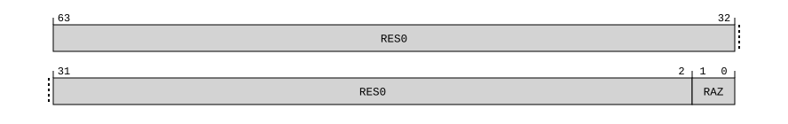

# ​G8.3.13 DBGDSAR, Debug Self Address Register

Source: <https://developer.arm.com/documentation/ddi0487/mc/-Part-G-The-AArch32-System-Level-Architecture/-Chapter-G8-AArch32-System-Register-Descriptions/-G8-3-Debug-System-registers/-G8-3-13-DBGDSAR--Debug-Self-Address-Register>

##### G8.3.13 DBGDSAR, Debug Self Address Register

The DBGDSAR characteristics are:

Purpose
:   In earlier versions of the Arm Architecture, this register defines the offset from the base address defined in [DBGDRAR](/documentation/ddi0487/mc/-Part-G-The-AArch32-System-Level-Architecture/-Chapter-G8-AArch32-System-Register-Descriptions/-G8-3-Debug-System-registers/-G8-3-12-DBGDRAR--Debug-ROM-Address-Register?lang=en#reg_aarch32_dbgdrar) of the physical base address of the debug registers for the PE. Use of this register is deprecated.

Configuration
:   DBGDSAR is a 64-bit register that can also be accessed as a 32-bit value. If it is accessed as a 32-bit register, bits [31:0] are read.

    If EL1 cannot use AArch32 then the implementation of this register is OPTIONAL and deprecated.

    This register is present only when FEAT\_AA32 is implemented. Otherwise, direct accesses to DBGDSAR are UNDEFINED.

Attributes
:   DBGDSAR is a 64-bit register.

###### Field descriptions



Bits [63:2]
:   Reserved, RES0.

Bits [1:0]
:   Reserved, RAZ.

    This field indicates whether the debug self address offset is valid. For ARMv8, this field is always `0b00`, the offset is not valid.

###### Accessing DBGDSAR

Accesses to this register use the following encodings in the System register encoding space:

###### `MRC{<c>}{<q>} <coproc>, {#}<opc1>, <Rt>, <CRn>, <CRm>{, {#}<opc2>}`

<table>
 <colgroup>
  <col/>
  <col/>
  <col/>
  <col/>
  <col/>
 </colgroup>
 <thead>
  <tr>
   <th>
    <strong>
     coproc
    </strong>
   </th>
   <th>
    <strong>
     opc1
    </strong>
   </th>
   <th>
    <strong>
     CRn
    </strong>
   </th>
   <th>
    <strong>
     CRm
    </strong>
   </th>
   <th>
    <strong>
     opc2
    </strong>
   </th>
  </tr>
 </thead>
 <tbody>
  <tr>
   <td>
    <p>
     <code>
      0b1110
     </code>
    </p>
   </td>
   <td>
    <p>
     <code>
      0b000
     </code>
    </p>
   </td>
   <td>
    <p>
     <code>
      0b0010
     </code>
    </p>
   </td>
   <td>
    <p>
     <code>
      0b0000
     </code>
    </p>
   </td>
   <td>
    <p>
     <code>
      0b000
     </code>
    </p>
   </td>
  </tr>
 </tbody>
</table>

```
if !IsFeatureImplemented(FEAT_AA32) then
    Undefined();
elsif Halted() && ConstrainUnpredictableBool(Unpredictable_IGNORETRAPINDEBUG) then
    R(t) = DBGDSAR()[31:0];
elsif HaveEL(EL3) && PSTATE.EL != EL3 && EL3SDDUndefPriority() && IsFeatureImplemented(FEAT_AA64EL3) && !ELUsingAArch32(EL3) && MDCR_EL3().TDA == '1' then
    Undefined();
elsif PSTATE.EL == EL0 then
    if IsFeatureImplemented(FEAT_AA64EL1) && !ELUsingAArch32(EL1) && MDSCR_EL1().TDCC == '1' then
        AArch64_AArch32SystemAccessTraptoEL1orEL2(0x05);
    elsif IsFeatureImplemented(FEAT_AA32EL1) && ELUsingAArch32(EL1) && DBGDSCRext().UDCCdis == '1' then
        if EL2Enabled() && (IsFeatureImplemented(FEAT_AA64EL2) && !ELUsingAArch32(EL2)) && HCR_EL2().TGE == '1' then
            AArch64_AArch32SystemAccessTrap(EL2, 0x05);
        elsif EL2Enabled() && (IsFeatureImplemented(FEAT_AA32EL2) && ELUsingAArch32(EL2)) && HCR().TGE == '1' then
            AArch32_TakeHypTrapException(0x00);
        else
            Undefined();
        end;
    elsif EL2Enabled() && (IsFeatureImplemented(FEAT_AA64EL2) && !ELUsingAArch32(EL2)) && (EffectiveTGEforEL0Traps() == '1' || MDCR_EL2().[TDE,TDRA] != '00') then
        AArch64_AArch32SystemAccessTrap(EL2, 0x05);
    elsif EL2Enabled() && (IsFeatureImplemented(FEAT_AA32EL2) && ELUsingAArch32(EL2)) && (HCR().TGE == '1' || HDCR().[TDE,TDRA] != '00') then
        AArch32_TakeHypTrapException(0x05);
    elsif HaveEL(EL3) && IsFeatureImplemented(FEAT_AA64EL3) && !ELUsingAArch32(EL3) && MDCR_EL3().TDA == '1' then
        if EL3SDDUndef() then
            Undefined();
        else
            AArch64_AArch32SystemAccessTrap(EL3, 0x05);
        end;
    else
        R(t) = DBGDSAR()[31:0];
    end;
elsif PSTATE.EL == EL1 then
    if EL2Enabled() && IsFeatureImplemented(FEAT_AA64EL2) && !ELUsingAArch32(EL2) && MDCR_EL2().[TDE,TDRA] != '00' then
        AArch64_AArch32SystemAccessTrap(EL2, 0x05);
    elsif EL2Enabled() && IsFeatureImplemented(FEAT_AA32EL2) && ELUsingAArch32(EL2) && HDCR().[TDE,TDRA] != '00' then
        AArch32_TakeHypTrapException(0x05);
    elsif HaveEL(EL3) && IsFeatureImplemented(FEAT_AA64EL3) && !ELUsingAArch32(EL3) && MDCR_EL3().TDA == '1' then
        if EL3SDDUndef() then
            Undefined();
        else
            AArch64_AArch32SystemAccessTrap(EL3, 0x05);
        end;
    else
        R(t) = DBGDSAR()[31:0];
    end;
elsif PSTATE.EL == EL2 then
    if HaveEL(EL3) && IsFeatureImplemented(FEAT_AA64EL3) && !ELUsingAArch32(EL3) && MDCR_EL3().TDA == '1' then
        if EL3SDDUndef() then
            Undefined();
        else
            AArch64_AArch32SystemAccessTrap(EL3, 0x05);
        end;
    else
        R(t) = DBGDSAR()[31:0];
    end;
elsif PSTATE.EL == EL3 then
    R(t) = DBGDSAR()[31:0];
end;
```

###### `MRRC{<c>}{<q>} <coproc>, {#}<opc1>, <Rt>, <Rt2>, <CRm>`

<table>
 <colgroup>
  <col/>
  <col/>
  <col/>
 </colgroup>
 <thead>
  <tr>
   <th>
    <strong>
     coproc
    </strong>
   </th>
   <th>
    <strong>
     CRm
    </strong>
   </th>
   <th>
    <strong>
     opc1
    </strong>
   </th>
  </tr>
 </thead>
 <tbody>
  <tr>
   <td>
    <p>
     <code>
      0b1110
     </code>
    </p>
   </td>
   <td>
    <p>
     <code>
      0b0010
     </code>
    </p>
   </td>
   <td>
    <p>
     <code>
      0b0000
     </code>
    </p>
   </td>
  </tr>
 </tbody>
</table>

```
if !IsFeatureImplemented(FEAT_AA32) then
    Undefined();
elsif Halted() && ConstrainUnpredictableBool(Unpredictable_IGNORETRAPINDEBUG) then
    R(t, t2) = DBGDSAR();
elsif HaveEL(EL3) && PSTATE.EL != EL3 && EL3SDDUndefPriority() && IsFeatureImplemented(FEAT_AA64EL3) && !ELUsingAArch32(EL3) && MDCR_EL3().TDA == '1' then
    Undefined();
elsif PSTATE.EL == EL0 then
    if IsFeatureImplemented(FEAT_AA64EL1) && !ELUsingAArch32(EL1) && MDSCR_EL1().TDCC == '1' then
        AArch64_AArch32SystemAccessTraptoEL1orEL2(0x0C);
    elsif IsFeatureImplemented(FEAT_AA32EL1) && ELUsingAArch32(EL1) && DBGDSCRext().UDCCdis == '1' then
        if EL2Enabled() && (IsFeatureImplemented(FEAT_AA64EL2) && !ELUsingAArch32(EL2)) && HCR_EL2().TGE == '1' then
            AArch64_AArch32SystemAccessTrap(EL2, 0x0C);
        elsif EL2Enabled() && (IsFeatureImplemented(FEAT_AA32EL2) && ELUsingAArch32(EL2)) && HCR().TGE == '1' then
            AArch32_TakeHypTrapException(0x00);
        else
            Undefined();
        end;
    elsif EL2Enabled() && (IsFeatureImplemented(FEAT_AA64EL2) && !ELUsingAArch32(EL2)) && (EffectiveTGEforEL0Traps() == '1' || MDCR_EL2().[TDE,TDRA] != '00') then
        AArch64_AArch32SystemAccessTrap(EL2, 0x0C);
    elsif EL2Enabled() && (IsFeatureImplemented(FEAT_AA32EL2) && ELUsingAArch32(EL2)) && (HCR().TGE == '1' || HDCR().[TDE,TDRA] != '00') then
        AArch32_TakeHypTrapException(0x0C);
    elsif HaveEL(EL3) && IsFeatureImplemented(FEAT_AA64EL3) && !ELUsingAArch32(EL3) && MDCR_EL3().TDA == '1' then
        if EL3SDDUndef() then
            Undefined();
        else
            AArch64_AArch32SystemAccessTrap(EL3, 0x0C);
        end;
    else
        R(t, t2) = DBGDSAR();
    end;
elsif PSTATE.EL == EL1 then
    if EL2Enabled() && IsFeatureImplemented(FEAT_AA64EL2) && !ELUsingAArch32(EL2) && MDCR_EL2().[TDE,TDRA] != '00' then
        AArch64_AArch32SystemAccessTrap(EL2, 0x0C);
    elsif EL2Enabled() && IsFeatureImplemented(FEAT_AA32EL2) && ELUsingAArch32(EL2) && HDCR().[TDE,TDRA] != '00' then
        AArch32_TakeHypTrapException(0x0C);
    elsif HaveEL(EL3) && IsFeatureImplemented(FEAT_AA64EL3) && !ELUsingAArch32(EL3) && MDCR_EL3().TDA == '1' then
        if EL3SDDUndef() then
            Undefined();
        else
            AArch64_AArch32SystemAccessTrap(EL3, 0x0C);
        end;
    else
        R(t, t2) = DBGDSAR();
    end;
elsif PSTATE.EL == EL2 then
    if HaveEL(EL3) && IsFeatureImplemented(FEAT_AA64EL3) && !ELUsingAArch32(EL3) && MDCR_EL3().TDA == '1' then
        if EL3SDDUndef() then
            Undefined();
        else
            AArch64_AArch32SystemAccessTrap(EL3, 0x0C);
        end;
    else
        R(t, t2) = DBGDSAR();
    end;
elsif PSTATE.EL == EL3 then
    R(t, t2) = DBGDSAR();
end;
```
