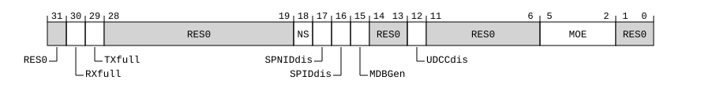

# ​G8.3.15 DBGDSCRint, Debug Status and Control Register, Internal View

Source: <https://developer.arm.com/documentation/ddi0487/mc/-Part-G-The-AArch32-System-Level-Architecture/-Chapter-G8-AArch32-System-Register-Descriptions/-G8-3-Debug-System-registers/-G8-3-15-DBGDSCRint--Debug-Status-and-Control-Register--Internal-View>

##### G8.3.15 DBGDSCRint, Debug Status and Control Register, Internal View

The DBGDSCRint characteristics are:

Purpose
:   Main control register for the debug implementation. This is an internal, read-only view.

Configuration
:   This register is required in all implementations.

    DBGDSCRint.{NS, SPNIDdis, SPIDdis, MDBGen, UDCCdis, MOE} are UNKNOWN when the register is accessed at EL0. However, although these values are not accessible at EL0 by instructions that are neither UNPREDICTABLE nor return UNKNOWN values, it is permissible for an implementation to return the values of DBGDSCRext.{NS, SPNIDdis, SPIDdis, MDBGen, UDCCdis, MOE} for these fields at EL0.

    It is also permissible for an implementation to return the same values as defined for a read of DBGDSCRint at EL1 or above. (This is the case even if the implementation does not support AArch32 at EL1 or above.)

    AArch32 System register DBGDSCRint bits [30:29] are architecturally mapped to AArch64 System register [MDCCSR\_EL0](/documentation/ddi0487/mc/-Part-D-The-AArch64-System-Level-Architecture/-Chapter-D24-AArch64-System-Register-Descriptions/-D24-3-Debug-System-registers/-D24-3-16-MDCCSR-EL0--Monitor-DCC-Status-Register?lang=en#reg_aarch64_mdccsr_el0)[30:29].

    AArch32 System register DBGDSCRint bits [30:29] are architecturally mapped to External register [EDSCR](/documentation/ddi0487/mc/-Part-H-External-Debug/-Chapter-H9-External-Debug-Register-Descriptions/-H9-2-External-debug-registers/-H9-2-48-EDSCR--External-Debug-Status-and-Control-Register?lang=en#reg_ext_edscr)[30:29].

    AArch32 System register DBGDSCRint bit [15] is architecturally mapped to AArch64 System register [MDSCR\_EL1](/documentation/ddi0487/mc/-Part-D-The-AArch64-System-Level-Architecture/-Chapter-D24-AArch64-System-Register-Descriptions/-D24-3-Debug-System-registers/-D24-3-20-MDSCR-EL1--Monitor-Debug-System-Control-Register?lang=en#reg_aarch64_mdscr_el1)[15].

    AArch32 System register DBGDSCRint bit [12] is architecturally mapped to AArch64 System register [MDSCR\_EL1](/documentation/ddi0487/mc/-Part-D-The-AArch64-System-Level-Architecture/-Chapter-D24-AArch64-System-Register-Descriptions/-D24-3-Debug-System-registers/-D24-3-20-MDSCR-EL1--Monitor-Debug-System-Control-Register?lang=en#reg_aarch64_mdscr_el1)[12].

    AArch32 System register DBGDSCRint bits [5:2] are architecturally mapped to AArch64 System register [MDSCR\_EL1](/documentation/ddi0487/mc/-Part-D-The-AArch64-System-Level-Architecture/-Chapter-D24-AArch64-System-Register-Descriptions/-D24-3-Debug-System-registers/-D24-3-20-MDSCR-EL1--Monitor-Debug-System-Control-Register?lang=en#reg_aarch64_mdscr_el1)[5:2].

    AArch32 System register DBGDSCRint bit [15] is architecturally mapped to AArch32 System register [DBGDSCRext](/documentation/ddi0487/mc/-Part-G-The-AArch32-System-Level-Architecture/-Chapter-G8-AArch32-System-Register-Descriptions/-G8-3-Debug-System-registers/-G8-3-14-DBGDSCRext--Debug-Status-and-Control-Register--External-View?lang=en#reg_aarch32_dbgdscrext)[15].

    AArch32 System register DBGDSCRint bit [12] is architecturally mapped to AArch32 System register [DBGDSCRext](/documentation/ddi0487/mc/-Part-G-The-AArch32-System-Level-Architecture/-Chapter-G8-AArch32-System-Register-Descriptions/-G8-3-Debug-System-registers/-G8-3-14-DBGDSCRext--Debug-Status-and-Control-Register--External-View?lang=en#reg_aarch32_dbgdscrext)[12].

    AArch32 System register DBGDSCRint bits [5:2] are architecturally mapped to AArch32 System register [DBGDSCRext](/documentation/ddi0487/mc/-Part-G-The-AArch32-System-Level-Architecture/-Chapter-G8-AArch32-System-Register-Descriptions/-G8-3-Debug-System-registers/-G8-3-14-DBGDSCRext--Debug-Status-and-Control-Register--External-View?lang=en#reg_aarch32_dbgdscrext)[5:2].

    This register is present only when FEAT\_AA32 is implemented. Otherwise, direct accesses to DBGDSCRint are UNDEFINED.

Attributes
:   DBGDSCRint is a 32-bit register.

###### Field descriptions



Bit [31]
:   Reserved, RES0.

RXfull, bit [30]
:   DTRRX full. Read-only view of the equivalent bit in the [EDSCR](/documentation/ddi0487/mc/-Part-H-External-Debug/-Chapter-H9-External-Debug-Register-Descriptions/-H9-2-External-debug-registers/-H9-2-48-EDSCR--External-Debug-Status-and-Control-Register?lang=en#reg_ext_edscr).

TXfull, bit [29]
:   DTRTX full. Read-only view of the equivalent bit in the [EDSCR](/documentation/ddi0487/mc/-Part-H-External-Debug/-Chapter-H9-External-Debug-Register-Descriptions/-H9-2-External-debug-registers/-H9-2-48-EDSCR--External-Debug-Status-and-Control-Register?lang=en#reg_ext_edscr).

Bits [28:19]
:   Reserved, RES0.

NS, bit [18]
:   Non-secure status.

    Read-only view of the equivalent bit in the [DBGDSCRext](/documentation/ddi0487/mc/-Part-G-The-AArch32-System-Level-Architecture/-Chapter-G8-AArch32-System-Register-Descriptions/-G8-3-Debug-System-registers/-G8-3-14-DBGDSCRext--Debug-Status-and-Control-Register--External-View?lang=en#reg_aarch32_dbgdscrext). Arm deprecates use of this field.

SPNIDdis, bit [17]
:   Secure privileged non-invasive debug disable.

    Read-only view of the equivalent bit in the [DBGDSCRext](/documentation/ddi0487/mc/-Part-G-The-AArch32-System-Level-Architecture/-Chapter-G8-AArch32-System-Register-Descriptions/-G8-3-Debug-System-registers/-G8-3-14-DBGDSCRext--Debug-Status-and-Control-Register--External-View?lang=en#reg_aarch32_dbgdscrext). Arm deprecates use of this field.

SPIDdis, bit [16]
:   Secure privileged invasive debug disable.

    Read-only view of the equivalent bit in the [DBGDSCRext](/documentation/ddi0487/mc/-Part-G-The-AArch32-System-Level-Architecture/-Chapter-G8-AArch32-System-Register-Descriptions/-G8-3-Debug-System-registers/-G8-3-14-DBGDSCRext--Debug-Status-and-Control-Register--External-View?lang=en#reg_aarch32_dbgdscrext). Arm deprecates use of this field.

MDBGen, bit [15]
:   Monitor debug events enable.

    Read-only view of the equivalent bit in the [DBGDSCRext](/documentation/ddi0487/mc/-Part-G-The-AArch32-System-Level-Architecture/-Chapter-G8-AArch32-System-Register-Descriptions/-G8-3-Debug-System-registers/-G8-3-14-DBGDSCRext--Debug-Status-and-Control-Register--External-View?lang=en#reg_aarch32_dbgdscrext).

Bits [14:13]
:   Reserved, RES0.

UDCCdis, bit [12]
:   User mode access to Debug Communications Channel disable.

    Read-only view of the equivalent bit in the [DBGDSCRext](/documentation/ddi0487/mc/-Part-G-The-AArch32-System-Level-Architecture/-Chapter-G8-AArch32-System-Register-Descriptions/-G8-3-Debug-System-registers/-G8-3-14-DBGDSCRext--Debug-Status-and-Control-Register--External-View?lang=en#reg_aarch32_dbgdscrext). Arm deprecates use of this field.

Bits [11:6]
:   Reserved, RES0.

MOE, bits [5:2]
:   Method of Entry for debug exception. When a debug exception is taken to an Exception level using AArch32, this field is set to indicate the event that caused the exception:

<table>
 <colgroup>
  <col/>
  <col/>
 </colgroup>
 <thead>
  <tr>
   <th>
    <strong>
     MOE
    </strong>
   </th>
   <th>
    <strong>
     Meaning
    </strong>
   </th>
  </tr>
 </thead>
 <tbody>
  <tr>
   <td>
    <p>
     <code>
      0b0001
     </code>
    </p>
   </td>
   <td>
    <p>
     Breakpoint
    </p>
   </td>
  </tr>
  <tr>
   <td>
    <p>
     <code>
      0b0011
     </code>
    </p>
   </td>
   <td>
    <p>
     Software breakpoint (BKPT) instruction
    </p>
   </td>
  </tr>
  <tr>
   <td>
    <p>
     <code>
      0b0101
     </code>
    </p>
   </td>
   <td>
    <p>
     Vector catch
    </p>
   </td>
  </tr>
  <tr>
   <td>
    <p>
     <code>
      0b1010
     </code>
    </p>
   </td>
   <td>
    <p>
     Watchpoint
    </p>
   </td>
  </tr>
 </tbody>
</table>

    Read-only view of the equivalent bit in the [DBGDSCRext](/documentation/ddi0487/mc/-Part-G-The-AArch32-System-Level-Architecture/-Chapter-G8-AArch32-System-Register-Descriptions/-G8-3-Debug-System-registers/-G8-3-14-DBGDSCRext--Debug-Status-and-Control-Register--External-View?lang=en#reg_aarch32_dbgdscrext).

Bits [1:0]
:   Reserved, RES0.

###### Accessing DBGDSCRint

When <Rt> is APSR\_nzcv, encoded as R15, then instead of reading the entire register, the access copies DBGDSCRint[31:28] into the PSTATE NZCV flags.

Accesses to this register use the following encodings in the System register encoding space:

###### `MRC{<c>}{<q>} <coproc>, {#}<opc1>, <Rt>, <CRn>, <CRm>{, {#}<opc2>}`

<table>
 <colgroup>
  <col/>
  <col/>
  <col/>
  <col/>
  <col/>
 </colgroup>
 <thead>
  <tr>
   <th>
    <strong>
     coproc
    </strong>
   </th>
   <th>
    <strong>
     opc1
    </strong>
   </th>
   <th>
    <strong>
     CRn
    </strong>
   </th>
   <th>
    <strong>
     CRm
    </strong>
   </th>
   <th>
    <strong>
     opc2
    </strong>
   </th>
  </tr>
 </thead>
 <tbody>
  <tr>
   <td>
    <p>
     <code>
      0b1110
     </code>
    </p>
   </td>
   <td>
    <p>
     <code>
      0b000
     </code>
    </p>
   </td>
   <td>
    <p>
     <code>
      0b0000
     </code>
    </p>
   </td>
   <td>
    <p>
     <code>
      0b0001
     </code>
    </p>
   </td>
   <td>
    <p>
     <code>
      0b000
     </code>
    </p>
   </td>
  </tr>
 </tbody>
</table>

```
if !IsFeatureImplemented(FEAT_AA32) then
    Undefined();
elsif Halted() && ConstrainUnpredictableBool(Unpredictable_IGNORETRAPINDEBUG) then
    if t == 15 then
        ConstrainUnpredictableProcedure(Unpredictable_MRC_APSR_TARGET);
    else
        R(t) = DBGDSCRint();
    end;
elsif HaveEL(EL3) && PSTATE.EL != EL3 && EL3SDDUndefPriority() && IsFeatureImplemented(FEAT_AA64EL3) && !ELUsingAArch32(EL3) && IsFeatureImplemented(FEAT_FGT) && MDCR_EL3().TDCC == '1' then
    Undefined();
elsif HaveEL(EL3) && PSTATE.EL != EL3 && EL3SDDUndefPriority() && IsFeatureImplemented(FEAT_AA32EL3) && ELUsingAArch32(EL3) && SDCR().TDCC == '1' then
    Undefined();
elsif HaveEL(EL3) && PSTATE.EL != EL3 && EL3SDDUndefPriority() && IsFeatureImplemented(FEAT_AA64EL3) && !ELUsingAArch32(EL3) && MDCR_EL3().TDA == '1' then
    Undefined();
elsif PSTATE.EL == EL0 then
    if IsFeatureImplemented(FEAT_AA64EL1) && !ELUsingAArch32(EL1) && MDSCR_EL1().TDCC == '1' then
        AArch64_AArch32SystemAccessTraptoEL1orEL2(0x05);
    elsif IsFeatureImplemented(FEAT_AA32EL1) && ELUsingAArch32(EL1) && DBGDSCRext().UDCCdis == '1' then
        if EL2Enabled() && (IsFeatureImplemented(FEAT_AA64EL2) && !ELUsingAArch32(EL2)) && HCR_EL2().TGE == '1' then
            AArch64_AArch32SystemAccessTrap(EL2, 0x05);
        elsif EL2Enabled() && (IsFeatureImplemented(FEAT_AA32EL2) && ELUsingAArch32(EL2)) && HCR().TGE == '1' then
            AArch32_TakeHypTrapException(0x00);
        else
            Undefined();
        end;
    elsif EL2Enabled() && (IsFeatureImplemented(FEAT_AA64EL2) && !ELUsingAArch32(EL2)) && IsFeatureImplemented(FEAT_FGT) && MDCR_EL2().TDCC == '1' then
        AArch64_AArch32SystemAccessTrap(EL2, 0x05);
    elsif EL2Enabled() && (IsFeatureImplemented(FEAT_AA32EL2) && ELUsingAArch32(EL2)) && IsFeatureImplemented(FEAT_FGT) && HDCR().TDCC == '1' then
        AArch32_TakeHypTrapException(0x05);
    elsif EL2Enabled() && (IsFeatureImplemented(FEAT_AA64EL2) && !ELUsingAArch32(EL2)) && (EffectiveTGEforEL0Traps() == '1' || MDCR_EL2().[TDE,TDA] != '00') then
        AArch64_AArch32SystemAccessTrap(EL2, 0x05);
    elsif EL2Enabled() && (IsFeatureImplemented(FEAT_AA32EL2) && ELUsingAArch32(EL2)) && (HCR().TGE == '1' || HDCR().[TDE,TDA] != '00') then
        AArch32_TakeHypTrapException(0x05);
    elsif HaveEL(EL3) && IsFeatureImplemented(FEAT_AA64EL3) && !ELUsingAArch32(EL3) && IsFeatureImplemented(FEAT_FGT) && MDCR_EL3().TDCC == '1' then
        if EL3SDDUndef() then
            Undefined();
        else
            AArch64_AArch32SystemAccessTrap(EL3, 0x05);
        end;
    elsif HaveEL(EL3) && IsFeatureImplemented(FEAT_AA32EL3) && ELUsingAArch32(EL3) && SDCR().TDCC == '1' then
        if EL3SDDUndef() then
            Undefined();
        else
            AArch32_TakeMonitorTrapException();
        end;
    elsif HaveEL(EL3) && IsFeatureImplemented(FEAT_AA64EL3) && !ELUsingAArch32(EL3) && MDCR_EL3().TDA == '1' then
        if EL3SDDUndef() then
            Undefined();
        else
            AArch64_AArch32SystemAccessTrap(EL3, 0x05);
        end;
    else
        if t == 15 then
            if Halted() then
                ConstrainUnpredictableProcedure(Unpredictable_MRC_APSR_TARGET);
            else
                PSTATE.[N,Z,C,V] = DBGDSCRint()[31:28];
            end;
        else
            R(t) = DBGDSCRint();
        end;
    end;
elsif PSTATE.EL == EL1 then
    if EL2Enabled() && IsFeatureImplemented(FEAT_AA64EL2) && !ELUsingAArch32(EL2) && IsFeatureImplemented(FEAT_FGT) && MDCR_EL2().TDCC == '1' then
        AArch64_AArch32SystemAccessTrap(EL2, 0x05);
    elsif EL2Enabled() && IsFeatureImplemented(FEAT_AA32EL2) && ELUsingAArch32(EL2) && HDCR().TDCC == '1' then
        AArch32_TakeHypTrapException(0x05);
    elsif EL2Enabled() && IsFeatureImplemented(FEAT_AA64EL2) && !ELUsingAArch32(EL2) && MDCR_EL2().[TDE,TDA] != '00' then
        AArch64_AArch32SystemAccessTrap(EL2, 0x05);
    elsif EL2Enabled() && IsFeatureImplemented(FEAT_AA32EL2) && ELUsingAArch32(EL2) && HDCR().[TDE,TDA] != '00' then
        AArch32_TakeHypTrapException(0x05);
    elsif HaveEL(EL3) && IsFeatureImplemented(FEAT_AA64EL3) && !ELUsingAArch32(EL3) && IsFeatureImplemented(FEAT_FGT) && MDCR_EL3().TDCC == '1' then
        if EL3SDDUndef() then
            Undefined();
        else
            AArch64_AArch32SystemAccessTrap(EL3, 0x05);
        end;
    elsif HaveEL(EL3) && IsFeatureImplemented(FEAT_AA32EL3) && ELUsingAArch32(EL3) && SDCR().TDCC == '1' then
        if EL3SDDUndef() then
            Undefined();
        else
            AArch32_TakeMonitorTrapException();
        end;
    elsif HaveEL(EL3) && IsFeatureImplemented(FEAT_AA64EL3) && !ELUsingAArch32(EL3) && MDCR_EL3().TDA == '1' then
        if EL3SDDUndef() then
            Undefined();
        else
            AArch64_AArch32SystemAccessTrap(EL3, 0x05);
        end;
    else
        if t == 15 then
            if Halted() then
                ConstrainUnpredictableProcedure(Unpredictable_MRC_APSR_TARGET);
            else
                PSTATE.[N,Z,C,V] = DBGDSCRint()[31:28];
            end;
        else
            R(t) = DBGDSCRint();
        end;
    end;
elsif PSTATE.EL == EL2 then
    if HaveEL(EL3) && IsFeatureImplemented(FEAT_AA64EL3) && !ELUsingAArch32(EL3) && IsFeatureImplemented(FEAT_FGT) && MDCR_EL3().TDCC == '1' then
        if EL3SDDUndef() then
            Undefined();
        else
            AArch64_AArch32SystemAccessTrap(EL3, 0x05);
        end;
    elsif HaveEL(EL3) && IsFeatureImplemented(FEAT_AA32EL3) && ELUsingAArch32(EL3) && SDCR().TDCC == '1' then
        if EL3SDDUndef() then
            Undefined();
        else
            AArch32_TakeMonitorTrapException();
        end;
    elsif HaveEL(EL3) && IsFeatureImplemented(FEAT_AA64EL3) && !ELUsingAArch32(EL3) && MDCR_EL3().TDA == '1' then
        if EL3SDDUndef() then
            Undefined();
        else
            AArch64_AArch32SystemAccessTrap(EL3, 0x05);
        end;
    else
        if t == 15 then
            if Halted() then
                ConstrainUnpredictableProcedure(Unpredictable_MRC_APSR_TARGET);
            else
                PSTATE.[N,Z,C,V] = DBGDSCRint()[31:28];
            end;
        else
            R(t) = DBGDSCRint();
        end;
    end;
elsif PSTATE.EL == EL3 then
    if PSTATE.M != M32_Monitor && SDCR().TDCC == '1' then
        AArch32_TakeMonitorTrapException();
    else
        if t == 15 then
            if Halted() then
                ConstrainUnpredictableProcedure(Unpredictable_MRC_APSR_TARGET);
            else
                PSTATE.[N,Z,C,V] = DBGDSCRint()[31:28];
            end;
        else
            R(t) = DBGDSCRint();
        end;
    end;
end;
```
