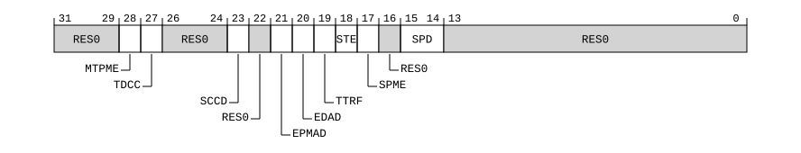

# ​G8.3.35 SDCR, Secure Debug Control Register

Source: <https://developer.arm.com/documentation/ddi0487/mc/-Part-G-The-AArch32-System-Level-Architecture/-Chapter-G8-AArch32-System-Register-Descriptions/-G8-3-Debug-System-registers/-G8-3-35-SDCR--Secure-Debug-Control-Register>

##### G8.3.35 SDCR, Secure Debug Control Register

The SDCR characteristics are:

Purpose
:   Provides EL3 configuration options for self-hosted debug, trace, and the Performance Monitors Extension.

Configuration
:   This register is present only when FEAT\_AA32EL3 is implemented. Otherwise, direct accesses to SDCR are UNDEFINED.

Attributes
:   SDCR is a 32-bit register.

###### Field descriptions



Bits [31:29]
:   Reserved, RES0.

MTPME, bit [28]
:   When FEAT\_MTPMU is implemented:
    :   Multi-threaded PMU Enable. Enables use of the [PMEVTYPER<n>](/documentation/ddi0487/mc/-Part-G-The-AArch32-System-Level-Architecture/-Chapter-G8-AArch32-System-Register-Descriptions/-G8-4-Performance-Monitors-registers/-G8-4-11-PMEVTYPER-n---Performance-Monitors-Event-Type-Registers--n---0---30?lang=en#reg_aarch32_pmevtypern).MT bits.

<table>
 <colgroup>
  <col/>
  <col/>
 </colgroup>
 <thead>
  <tr>
   <th>
    <strong>
     MTPME
    </strong>
   </th>
   <th>
    <strong>
     Meaning
    </strong>
   </th>
  </tr>
 </thead>
 <tbody>
  <tr>
   <td>
    <p>
     <code>
      0b0
     </code>
    </p>
   </td>
   <td>
    <p>
     <a class="document-topic" document-topic-path="/ddi0487/mc/-Part-A-Arm-Architecture-Introduction-and-Overview/-Chapter-A2-A-profile-Architecture-Extensions/-A2-2-Armv8-A-architecture-extensions/-A2-2-7-The-Armv8-6-architecture-extension?lang=en#feat_feat_mtpmu" href="/documentation/ddi0487/mc/-Part-A-Arm-Architecture-Introduction-and-Overview/-Chapter-A2-A-profile-Architecture-Extensions/-A2-2-Armv8-A-architecture-extensions/-A2-2-7-The-Armv8-6-architecture-extension?lang=en#feat_feat_mtpmu">
      FEAT_MTPMU
     </a>
     is disabled. The Effective value of
     <a class="document-topic" document-topic-path="/ddi0487/mc/-Part-G-The-AArch32-System-Level-Architecture/-Chapter-G8-AArch32-System-Register-Descriptions/-G8-4-Performance-Monitors-registers/-G8-4-11-PMEVTYPER-n---Performance-Monitors-Event-Type-Registers--n---0---30?lang=en#reg_aarch32_pmevtypern" href="/documentation/ddi0487/mc/-Part-G-The-AArch32-System-Level-Architecture/-Chapter-G8-AArch32-System-Register-Descriptions/-G8-4-Performance-Monitors-registers/-G8-4-11-PMEVTYPER-n---Performance-Monitors-Event-Type-Registers--n---0---30?lang=en#reg_aarch32_pmevtypern">
      PMEVTYPER&lt;n&gt;
     </a>
     .MT is 0.
    </p>
   </td>
  </tr>
  <tr>
   <td>
    <p>
     <code>
      0b1
     </code>
    </p>
   </td>
   <td>
    <p>
     <a class="document-topic" document-topic-path="/ddi0487/mc/-Part-G-The-AArch32-System-Level-Architecture/-Chapter-G8-AArch32-System-Register-Descriptions/-G8-4-Performance-Monitors-registers/-G8-4-11-PMEVTYPER-n---Performance-Monitors-Event-Type-Registers--n---0---30?lang=en#reg_aarch32_pmevtypern" href="/documentation/ddi0487/mc/-Part-G-The-AArch32-System-Level-Architecture/-Chapter-G8-AArch32-System-Register-Descriptions/-G8-4-Performance-Monitors-registers/-G8-4-11-PMEVTYPER-n---Performance-Monitors-Event-Type-Registers--n---0---30?lang=en#reg_aarch32_pmevtypern">
      PMEVTYPER&lt;n&gt;
     </a>
     .MT bits not affected by this field.
    </p>
   </td>
  </tr>
 </tbody>
</table>

        If [FEAT\_MTPMU](/documentation/ddi0487/mc/-Part-A-Arm-Architecture-Introduction-and-Overview/-Chapter-A2-A-profile-Architecture-Extensions/-A2-2-Armv8-A-architecture-extensions/-A2-2-7-The-Armv8-6-architecture-extension?lang=en#feat_feat_mtpmu) is disabled for any other PE in the system that has the same level 1 Affinity as the PE, it is IMPLEMENTATION DEFINED whether the PE behaves as if this field is 0.

        The reset behavior of this field is:

        - On a Cold reset:
          - When the highest implemented Exception level is EL3, this field resets to `'1'`.

    Otherwise:
    :   Reserved, RES0.

TDCC, bit [27]
:   When FEAT\_FGT is implemented:
    :   Trap DCC. Traps use of the Debug Comms Channel in modes other than Monitor mode to Monitor mode.

<table>
 <colgroup>
  <col/>
  <col/>
 </colgroup>
 <thead>
  <tr>
   <th>
    <strong>
     TDCC
    </strong>
   </th>
   <th>
    <strong>
     Meaning
    </strong>
   </th>
  </tr>
 </thead>
 <tbody>
  <tr>
   <td>
    <p>
     <code>
      0b0
     </code>
    </p>
   </td>
   <td>
    <p>
     This control does not cause any register accesses to be trapped.
    </p>
   </td>
  </tr>
  <tr>
   <td>
    <p>
     <code>
      0b1
     </code>
    </p>
   </td>
   <td>
    <p>
     Accesses to the DCC registers in modes other than Monitor mode generate a Monitor Trap exception, unless the access also generates a higher priority exception.
    </p>
    <p>
     Traps on the DCC data transfer registers are ignored when the PE is in Debug state.
    </p>
   </td>
  </tr>
 </tbody>
</table>

        The DCC registers trapped by this control are:

        - [DBGDTRRXext](/documentation/ddi0487/mc/-Part-G-The-AArch32-System-Level-Architecture/-Chapter-G8-AArch32-System-Register-Descriptions/-G8-3-Debug-System-registers/-G8-3-16-DBGDTRRXext--Debug-OS-Lock-Data-Transfer-Register--Receive--External-View?lang=en#reg_aarch32_dbgdtrrxext), [DBGDTRTXext](/documentation/ddi0487/mc/-Part-G-The-AArch32-System-Level-Architecture/-Chapter-G8-AArch32-System-Register-Descriptions/-G8-3-Debug-System-registers/-G8-3-18-DBGDTRTXext--Debug-OS-Lock-Data-Transfer-Register--Transmit?lang=en#reg_aarch32_dbgdtrtxext), [DBGDSCRint](/documentation/ddi0487/mc/-Part-G-The-AArch32-System-Level-Architecture/-Chapter-G8-AArch32-System-Register-Descriptions/-G8-3-Debug-System-registers/-G8-3-15-DBGDSCRint--Debug-Status-and-Control-Register--Internal-View?lang=en#reg_aarch32_dbgdscrint), [DBGDCCINT](/documentation/ddi0487/mc/-Part-G-The-AArch32-System-Level-Architecture/-Chapter-G8-AArch32-System-Register-Descriptions/-G8-3-Debug-System-registers/-G8-3-7-DBGDCCINT--DCC-Interrupt-Enable-Register?lang=en#reg_aarch32_dbgdccint), and, when the PE is in Non-debug state, [DBGDTRRXint](/documentation/ddi0487/mc/-Part-G-The-AArch32-System-Level-Architecture/-Chapter-G8-AArch32-System-Register-Descriptions/-G8-3-Debug-System-registers/-G8-3-17-DBGDTRRXint--Debug-Data-Transfer-Register--Receive?lang=en#reg_aarch32_dbgdtrrxint) and [DBGDTRTXint](/documentation/ddi0487/mc/-Part-G-The-AArch32-System-Level-Architecture/-Chapter-G8-AArch32-System-Register-Descriptions/-G8-3-Debug-System-registers/-G8-3-19-DBGDTRTXint--Debug-Data-Transfer-Register--Transmit?lang=en#reg_aarch32_dbgdtrtxint).

        When the PE is in Debug state, SDCR.TDCC does not trap any accesses to:

        - [DBGDTRRXint](/documentation/ddi0487/mc/-Part-G-The-AArch32-System-Level-Architecture/-Chapter-G8-AArch32-System-Register-Descriptions/-G8-3-Debug-System-registers/-G8-3-17-DBGDTRRXint--Debug-Data-Transfer-Register--Receive?lang=en#reg_aarch32_dbgdtrrxint) and [DBGDTRTXint](/documentation/ddi0487/mc/-Part-G-The-AArch32-System-Level-Architecture/-Chapter-G8-AArch32-System-Register-Descriptions/-G8-3-Debug-System-registers/-G8-3-19-DBGDTRTXint--Debug-Data-Transfer-Register--Transmit?lang=en#reg_aarch32_dbgdtrtxint).

        The reset behavior of this field is:

        - On a Warm reset, this field resets to an architecturally UNKNOWN value.

    Otherwise:
    :   Reserved, RES0.

Bits [26:24]
:   Reserved, RES0.

SCCD, bit [23]
:   When FEAT\_PMUv3p5 is implemented:
    :   Secure Cycle Counter Disable. Prohibits [PMCCNTR](/documentation/ddi0487/mc/-Part-G-The-AArch32-System-Level-Architecture/-Chapter-G8-AArch32-System-Register-Descriptions/-G8-4-Performance-Monitors-registers/-G8-4-2-PMCCNTR--Performance-Monitors-Cycle-Count-Register?lang=en#reg_aarch32_pmccntr) from counting in Secure state and EL3.

<table>
 <colgroup>
  <col/>
  <col/>
 </colgroup>
 <thead>
  <tr>
   <th>
    <strong>
     SCCD
    </strong>
   </th>
   <th>
    <strong>
     Meaning
    </strong>
   </th>
  </tr>
 </thead>
 <tbody>
  <tr>
   <td>
    <p>
     <code>
      0b0
     </code>
    </p>
   </td>
   <td>
    <p>
     Cycle counting by
     <a class="document-topic" document-topic-path="/ddi0487/mc/-Part-G-The-AArch32-System-Level-Architecture/-Chapter-G8-AArch32-System-Register-Descriptions/-G8-4-Performance-Monitors-registers/-G8-4-2-PMCCNTR--Performance-Monitors-Cycle-Count-Register?lang=en#reg_aarch32_pmccntr" href="/documentation/ddi0487/mc/-Part-G-The-AArch32-System-Level-Architecture/-Chapter-G8-AArch32-System-Register-Descriptions/-G8-4-Performance-Monitors-registers/-G8-4-2-PMCCNTR--Performance-Monitors-Cycle-Count-Register?lang=en#reg_aarch32_pmccntr">
      PMCCNTR
     </a>
     is not affected by this mechanism.
    </p>
   </td>
  </tr>
  <tr>
   <td>
    <p>
     <code>
      0b1
     </code>
    </p>
   </td>
   <td>
    <p>
     Cycle counting by
     <a class="document-topic" document-topic-path="/ddi0487/mc/-Part-G-The-AArch32-System-Level-Architecture/-Chapter-G8-AArch32-System-Register-Descriptions/-G8-4-Performance-Monitors-registers/-G8-4-2-PMCCNTR--Performance-Monitors-Cycle-Count-Register?lang=en#reg_aarch32_pmccntr" href="/documentation/ddi0487/mc/-Part-G-The-AArch32-System-Level-Architecture/-Chapter-G8-AArch32-System-Register-Descriptions/-G8-4-Performance-Monitors-registers/-G8-4-2-PMCCNTR--Performance-Monitors-Cycle-Count-Register?lang=en#reg_aarch32_pmccntr">
      PMCCNTR
     </a>
     is prohibited in Secure state and EL3.
    </p>
   </td>
  </tr>
 </tbody>
</table>

        This field does not affect the CPU\_CYCLES event or any other event that counts cycles.

        The reset behavior of this field is:

        - On a Warm reset:
          - When the highest implemented Exception level is EL3, this field resets to `'0'`.

    Otherwise:
    :   Reserved, RES0.

Bit [22]
:   Reserved, RES0.

EPMAD, bit [21]
:   When FEAT\_Debugv8p4 is implemented and FEAT\_PMUv3\_EXT is implemented:
    :   External Performance Monitors Non-secure access disable. Controls Non-secure access to Performance Monitors registers by an external debugger.

<table>
 <colgroup>
  <col/>
  <col/>
 </colgroup>
 <thead>
  <tr>
   <th>
    <strong>
     EPMAD
    </strong>
   </th>
   <th>
    <strong>
     Meaning
    </strong>
   </th>
  </tr>
 </thead>
 <tbody>
  <tr>
   <td>
    <p>
     <code>
      0b0
     </code>
    </p>
   </td>
   <td>
    <p>
     No accesses from an external debugger to the Performance Monitor registers are prohibited by this control.
    </p>
   </td>
  </tr>
  <tr>
   <td>
    <p>
     <code>
      0b1
     </code>
    </p>
   </td>
   <td>
    <p>
     Non-secure accesses from an external debugger to the affected Performance Monitor registers are prohibited.
    </p>
   </td>
  </tr>
 </tbody>
</table>

        Otherwise, if EL3 is not implemented and the Effective value of [SCR](/documentation/ddi0487/mc/-Part-G-The-AArch32-System-Level-Architecture/-Chapter-G8-AArch32-System-Register-Descriptions/-G8-2-General-system-control-registers/-G8-2-126-SCR--Secure-Configuration-Register?lang=en#reg_aarch32_scr).NS is 0, then the Effective value of this field is 1.

        The reset behavior of this field is:

        - On a Warm reset:
          - When the highest implemented Exception level is EL3, this field resets to `'0'`.

    When FEAT\_PMUv3\_EXT is implemented:
    :   External Performance Monitors access disable. Controls access to Performance Monitors registers by an external debugger.

<table>
 <colgroup>
  <col/>
  <col/>
 </colgroup>
 <thead>
  <tr>
   <th>
    <strong>
     EPMAD
    </strong>
   </th>
   <th>
    <strong>
     Meaning
    </strong>
   </th>
  </tr>
 </thead>
 <tbody>
  <tr>
   <td>
    <p>
     <code>
      0b0
     </code>
    </p>
   </td>
   <td>
    <p>
     No accesses from an external debugger to the Performance Monitor registers are prohibited by this control.
    </p>
   </td>
  </tr>
  <tr>
   <td>
    <p>
     <code>
      0b1
     </code>
    </p>
   </td>
   <td>
    <p>
     If the
     <small>
      IMPLEMENTATION DEFINED
     </small>
     authentication interface function
     <code>
      ExternalSecureInvasiveDebugEnabled()
     </code>
     returns FALSE, then accesses from an external debugger to the affected Performance Monitor registers are prohibited.
    </p>
   </td>
  </tr>
 </tbody>
</table>

        Otherwise, if EL3 is not implemented and the Effective value of [SCR](/documentation/ddi0487/mc/-Part-G-The-AArch32-System-Level-Architecture/-Chapter-G8-AArch32-System-Register-Descriptions/-G8-2-General-system-control-registers/-G8-2-126-SCR--Secure-Configuration-Register?lang=en#reg_aarch32_scr).NS is 0, then the Effective value of this field is 1.

        The reset behavior of this field is:

        - On a Warm reset:
          - When the highest implemented Exception level is EL3, this field resets to `'0'`.

    Otherwise:
    :   Reserved, RES0.

EDAD, bit [20]
:   When FEAT\_Debugv8p4 is implemented:
    :   External debug Non-secure access disable. Controls Non-secure access to breakpoint, watchpoint, and [OSLAR\_EL1](/documentation/ddi0487/mc/-Part-H-External-Debug/-Chapter-H9-External-Debug-Register-Descriptions/-H9-2-External-debug-registers/-H9-2-53-OSLAR-EL1--OS-Lock-Access-Register?lang=en#reg_ext_oslar_el1) registers by an external debugger.

<table>
 <colgroup>
  <col/>
  <col/>
 </colgroup>
 <thead>
  <tr>
   <th>
    <strong>
     EDAD
    </strong>
   </th>
   <th>
    <strong>
     Meaning
    </strong>
   </th>
  </tr>
 </thead>
 <tbody>
  <tr>
   <td>
    <p>
     <code>
      0b0
     </code>
    </p>
   </td>
   <td>
    <p>
     No accesses from an external debugger to the debug registers are prohibited by this control.
    </p>
   </td>
  </tr>
  <tr>
   <td>
    <p>
     <code>
      0b1
     </code>
    </p>
   </td>
   <td>
    <p>
     Non-secure accesses from an external debugger to the affected debug registers are prohibited.
    </p>
   </td>
  </tr>
 </tbody>
</table>

        If EL3 is not implemented and the Effective value of [SCR](/documentation/ddi0487/mc/-Part-G-The-AArch32-System-Level-Architecture/-Chapter-G8-AArch32-System-Register-Descriptions/-G8-2-General-system-control-registers/-G8-2-126-SCR--Secure-Configuration-Register?lang=en#reg_aarch32_scr).NS is 0, then the Effective value of this field is 1.

        The reset behavior of this field is:

        - On a Warm reset:
          - When the highest implemented Exception level is EL3, this field resets to `'0'`.

    When FEAT\_Debugv8p2 is implemented:
    :   External debug access disable. Controls access to breakpoint, watchpoint, and [OSLAR\_EL1](/documentation/ddi0487/mc/-Part-H-External-Debug/-Chapter-H9-External-Debug-Register-Descriptions/-H9-2-External-debug-registers/-H9-2-53-OSLAR-EL1--OS-Lock-Access-Register?lang=en#reg_ext_oslar_el1) registers by an external debugger.

<table>
 <colgroup>
  <col/>
  <col/>
 </colgroup>
 <thead>
  <tr>
   <th>
    <strong>
     EDAD
    </strong>
   </th>
   <th>
    <strong>
     Meaning
    </strong>
   </th>
  </tr>
 </thead>
 <tbody>
  <tr>
   <td>
    <p>
     <code>
      0b0
     </code>
    </p>
   </td>
   <td>
    <p>
     No accesses from an external debugger to the debug registers are prohibited by this control.
    </p>
   </td>
  </tr>
  <tr>
   <td>
    <p>
     <code>
      0b1
     </code>
    </p>
   </td>
   <td>
    <p>
     If the
     <small>
      IMPLEMENTATION DEFINED
     </small>
     authentication interface function
     <code>
      ExternalSecureInvasiveDebugEnabled()
     </code>
     returns FALSE, then accesses from an external debugger to the affected debug registers are prohibited.
    </p>
   </td>
  </tr>
 </tbody>
</table>

        If EL3 is not implemented and the Effective value of [SCR](/documentation/ddi0487/mc/-Part-G-The-AArch32-System-Level-Architecture/-Chapter-G8-AArch32-System-Register-Descriptions/-G8-2-General-system-control-registers/-G8-2-126-SCR--Secure-Configuration-Register?lang=en#reg_aarch32_scr).NS is 0, then the Effective value of this field is 1.

        The reset behavior of this field is:

        - On a Warm reset:
          - When the highest implemented Exception level is EL3, this field resets to `'0'`.

    Otherwise:
    :   External debug access disable. Controls access to breakpoint, watchpoint, and optionally [OSLAR\_EL1](/documentation/ddi0487/mc/-Part-H-External-Debug/-Chapter-H9-External-Debug-Register-Descriptions/-H9-2-External-debug-registers/-H9-2-53-OSLAR-EL1--OS-Lock-Access-Register?lang=en#reg_ext_oslar_el1) registers by an external debugger.

<table>
 <colgroup>
  <col/>
  <col/>
 </colgroup>
 <thead>
  <tr>
   <th>
    <strong>
     EDAD
    </strong>
   </th>
   <th>
    <strong>
     Meaning
    </strong>
   </th>
  </tr>
 </thead>
 <tbody>
  <tr>
   <td>
    <p>
     <code>
      0b0
     </code>
    </p>
   </td>
   <td>
    <p>
     No accesses from an external debugger to the debug registers are prohibited by this control.
    </p>
   </td>
  </tr>
  <tr>
   <td>
    <p>
     <code>
      0b1
     </code>
    </p>
   </td>
   <td>
    <p>
     If the
     <small>
      IMPLEMENTATION DEFINED
     </small>
     authentication interface function
     <code>
      ExternalSecureInvasiveDebugEnabled()
     </code>
     returns FALSE, then accesses from an external debugger to the affected debug registers are prohibited.
    </p>
   </td>
  </tr>
 </tbody>
</table>

        It is IMPLEMENTATION DEFINED whether accesses to [OSLAR\_EL1](/documentation/ddi0487/mc/-Part-H-External-Debug/-Chapter-H9-External-Debug-Register-Descriptions/-H9-2-External-debug-registers/-H9-2-53-OSLAR-EL1--OS-Lock-Access-Register?lang=en#reg_ext_oslar_el1) from an external debugger are affected by this control.

        If EL3 is not implemented and the Effective value of [SCR](/documentation/ddi0487/mc/-Part-G-The-AArch32-System-Level-Architecture/-Chapter-G8-AArch32-System-Register-Descriptions/-G8-2-General-system-control-registers/-G8-2-126-SCR--Secure-Configuration-Register?lang=en#reg_aarch32_scr).NS is 0, then the Effective value of this field is 1.

        The reset behavior of this field is:

        - On a Warm reset:
          - When the highest implemented Exception level is EL3, this field resets to `'0'`.

TTRF, bit [19]
:   When FEAT\_TRF is implemented:
    :   Trap Trace Filter controls. Controls whether accesses in modes other than Monitor mode to the trace filter control registers generate a Monitor Trap exception.

<table>
 <colgroup>
  <col/>
  <col/>
 </colgroup>
 <thead>
  <tr>
   <th>
    <strong>
     TTRF
    </strong>
   </th>
   <th>
    <strong>
     Meaning
    </strong>
   </th>
  </tr>
 </thead>
 <tbody>
  <tr>
   <td>
    <p>
     <code>
      0b0
     </code>
    </p>
   </td>
   <td>
    <p>
     Accesses to
     <a class="document-topic" document-topic-path="/ddi0487/mc/-Part-G-The-AArch32-System-Level-Architecture/-Chapter-G8-AArch32-System-Register-Descriptions/-G8-3-Debug-System-registers/-G8-3-33-HTRFCR--Hyp-Trace-Filter-Control-Register?lang=en#reg_aarch32_htrfcr" href="/documentation/ddi0487/mc/-Part-G-The-AArch32-System-Level-Architecture/-Chapter-G8-AArch32-System-Register-Descriptions/-G8-3-Debug-System-registers/-G8-3-33-HTRFCR--Hyp-Trace-Filter-Control-Register?lang=en#reg_aarch32_htrfcr">
      HTRFCR
     </a>
     and
     <a class="document-topic" document-topic-path="/ddi0487/mc/-Part-G-The-AArch32-System-Level-Architecture/-Chapter-G8-AArch32-System-Register-Descriptions/-G8-3-Debug-System-registers/-G8-3-37-TRFCR--Trace-Filter-Control-Register?lang=en#reg_aarch32_trfcr" href="/documentation/ddi0487/mc/-Part-G-The-AArch32-System-Level-Architecture/-Chapter-G8-AArch32-System-Register-Descriptions/-G8-3-Debug-System-registers/-G8-3-37-TRFCR--Trace-Filter-Control-Register?lang=en#reg_aarch32_trfcr">
      TRFCR
     </a>
     are not affected by this control bit.
    </p>
   </td>
  </tr>
  <tr>
   <td>
    <p>
     <code>
      0b1
     </code>
    </p>
   </td>
   <td>
    <p>
     When not in Monitor mode, accesses to
     <a class="document-topic" document-topic-path="/ddi0487/mc/-Part-G-The-AArch32-System-Level-Architecture/-Chapter-G8-AArch32-System-Register-Descriptions/-G8-3-Debug-System-registers/-G8-3-33-HTRFCR--Hyp-Trace-Filter-Control-Register?lang=en#reg_aarch32_htrfcr" href="/documentation/ddi0487/mc/-Part-G-The-AArch32-System-Level-Architecture/-Chapter-G8-AArch32-System-Register-Descriptions/-G8-3-Debug-System-registers/-G8-3-33-HTRFCR--Hyp-Trace-Filter-Control-Register?lang=en#reg_aarch32_htrfcr">
      HTRFCR
     </a>
     and
     <a class="document-topic" document-topic-path="/ddi0487/mc/-Part-G-The-AArch32-System-Level-Architecture/-Chapter-G8-AArch32-System-Register-Descriptions/-G8-3-Debug-System-registers/-G8-3-37-TRFCR--Trace-Filter-Control-Register?lang=en#reg_aarch32_trfcr" href="/documentation/ddi0487/mc/-Part-G-The-AArch32-System-Level-Architecture/-Chapter-G8-AArch32-System-Register-Descriptions/-G8-3-Debug-System-registers/-G8-3-37-TRFCR--Trace-Filter-Control-Register?lang=en#reg_aarch32_trfcr">
      TRFCR
     </a>
     generate a Monitor Trap exception, unless the access generates a higher priority exception.
    </p>
   </td>
  </tr>
 </tbody>
</table>

        The reset behavior of this field is:

        - On a Warm reset:
          - When the highest implemented Exception level is EL3, this field resets to `'0'`.

    Otherwise:
    :   Reserved, RES0.

STE, bit [18]
:   When FEAT\_TRF is implemented:
    :   Secure Trace Enable. This field enables tracing in Secure state and controls the level of authentication required by an external debugger to enable external tracing.

<table>
 <colgroup>
  <col/>
  <col/>
 </colgroup>
 <thead>
  <tr>
   <th>
    <strong>
     STE
    </strong>
   </th>
   <th>
    <strong>
     Meaning
    </strong>
   </th>
  </tr>
 </thead>
 <tbody>
  <tr>
   <td>
    <p>
     <code>
      0b0
     </code>
    </p>
   </td>
   <td>
    <p>
     Trace is prohibited in Secure state unless overridden by the
     <small>
      IMPLEMENTATION DEFINED
     </small>
     authentication interface.
    </p>
   </td>
  </tr>
  <tr>
   <td>
    <p>
     <code>
      0b1
     </code>
    </p>
   </td>
   <td>
    <p>
     Trace in Secure state is not affected by this field.
    </p>
   </td>
  </tr>
 </tbody>
</table>

        This field also controls the level of authentication required by an external debugger to enable external tracing. See [‘Register controls to enable self-hosted trace’](/documentation/ddi0487/mc/-Part-D-The-AArch64-System-Level-Architecture/-Chapter-D3-AArch64-Self-hosted-Trace/-D3-1-About-self-hosted-trace/-D3-1-2-Register-controls-to-enable-self-hosted-trace?lang=en#babhfddh).

        If EL3 is not implemented and the Effective value of [SCR](/documentation/ddi0487/mc/-Part-G-The-AArch32-System-Level-Architecture/-Chapter-G8-AArch32-System-Register-Descriptions/-G8-2-General-system-control-registers/-G8-2-126-SCR--Secure-Configuration-Register?lang=en#reg_aarch32_scr).NS is 0, the PE behaves as if this field is set to 1.

        The reset behavior of this field is:

        - On a Warm reset:
          - When the highest implemented Exception level is EL3, this field resets to `'0'`.

    Otherwise:
    :   Reserved, RES0.

SPME, bit [17]
:   When FEAT\_PMUv3 is implemented and FEAT\_Debugv8p2 is implemented:
    :   Secure Performance Monitors Enable. Controls event counting in Secure state.

<table>
 <colgroup>
  <col/>
  <col/>
 </colgroup>
 <thead>
  <tr>
   <th>
    <strong>
     SPME
    </strong>
   </th>
   <th>
    <strong>
     Meaning
    </strong>
   </th>
  </tr>
 </thead>
 <tbody>
  <tr>
   <td>
    <p>
     <code>
      0b0
     </code>
    </p>
   </td>
   <td>
    <p>
     Event counting is prohibited in Secure state. If
     <a class="document-topic" document-topic-path="/ddi0487/mc/-Part-G-The-AArch32-System-Level-Architecture/-Chapter-G8-AArch32-System-Register-Descriptions/-G8-4-Performance-Monitors-registers/-G8-4-9-PMCR--Performance-Monitors-Control-Register?lang=en#reg_aarch32_pmcr" href="/documentation/ddi0487/mc/-Part-G-The-AArch32-System-Level-Architecture/-Chapter-G8-AArch32-System-Register-Descriptions/-G8-4-Performance-Monitors-registers/-G8-4-9-PMCR--Performance-Monitors-Control-Register?lang=en#reg_aarch32_pmcr">
      PMCR
     </a>
     .DP is 1,
     <a class="document-topic" document-topic-path="/ddi0487/mc/-Part-G-The-AArch32-System-Level-Architecture/-Chapter-G8-AArch32-System-Register-Descriptions/-G8-4-Performance-Monitors-registers/-G8-4-2-PMCCNTR--Performance-Monitors-Cycle-Count-Register?lang=en#reg_aarch32_pmccntr" href="/documentation/ddi0487/mc/-Part-G-The-AArch32-System-Level-Architecture/-Chapter-G8-AArch32-System-Register-Descriptions/-G8-4-Performance-Monitors-registers/-G8-4-2-PMCCNTR--Performance-Monitors-Cycle-Count-Register?lang=en#reg_aarch32_pmccntr">
      PMCCNTR
     </a>
     is disabled in Secure state. Otherwise,
     <a class="document-topic" document-topic-path="/ddi0487/mc/-Part-G-The-AArch32-System-Level-Architecture/-Chapter-G8-AArch32-System-Register-Descriptions/-G8-4-Performance-Monitors-registers/-G8-4-2-PMCCNTR--Performance-Monitors-Cycle-Count-Register?lang=en#reg_aarch32_pmccntr" href="/documentation/ddi0487/mc/-Part-G-The-AArch32-System-Level-Architecture/-Chapter-G8-AArch32-System-Register-Descriptions/-G8-4-Performance-Monitors-registers/-G8-4-2-PMCCNTR--Performance-Monitors-Cycle-Count-Register?lang=en#reg_aarch32_pmccntr">
      PMCCNTR
     </a>
     is not affected by this mechanism.
    </p>
   </td>
  </tr>
  <tr>
   <td>
    <p>
     <code>
      0b1
     </code>
    </p>
   </td>
   <td>
    <p>
     Event counting and
     <a class="document-topic" document-topic-path="/ddi0487/mc/-Part-G-The-AArch32-System-Level-Architecture/-Chapter-G8-AArch32-System-Register-Descriptions/-G8-4-Performance-Monitors-registers/-G8-4-2-PMCCNTR--Performance-Monitors-Cycle-Count-Register?lang=en#reg_aarch32_pmccntr" href="/documentation/ddi0487/mc/-Part-G-The-AArch32-System-Level-Architecture/-Chapter-G8-AArch32-System-Register-Descriptions/-G8-4-Performance-Monitors-registers/-G8-4-2-PMCCNTR--Performance-Monitors-Cycle-Count-Register?lang=en#reg_aarch32_pmccntr">
      PMCCNTR
     </a>
     are not affected by this mechanism.
    </p>
   </td>
  </tr>
 </tbody>
</table>

        This field affects the operation of all event counters in Secure state, and if [PMCR](/documentation/ddi0487/mc/-Part-G-The-AArch32-System-Level-Architecture/-Chapter-G8-AArch32-System-Register-Descriptions/-G8-4-Performance-Monitors-registers/-G8-4-9-PMCR--Performance-Monitors-Control-Register?lang=en#reg_aarch32_pmcr).DP is 1, the operation of [PMCCNTR](/documentation/ddi0487/mc/-Part-G-The-AArch32-System-Level-Architecture/-Chapter-G8-AArch32-System-Register-Descriptions/-G8-4-Performance-Monitors-registers/-G8-4-2-PMCCNTR--Performance-Monitors-Cycle-Count-Register?lang=en#reg_aarch32_pmccntr) in Secure state. When [PMCR](/documentation/ddi0487/mc/-Part-G-The-AArch32-System-Level-Architecture/-Chapter-G8-AArch32-System-Register-Descriptions/-G8-4-Performance-Monitors-registers/-G8-4-9-PMCR--Performance-Monitors-Control-Register?lang=en#reg_aarch32_pmcr).DP is 0, [PMCCNTR](/documentation/ddi0487/mc/-Part-G-The-AArch32-System-Level-Architecture/-Chapter-G8-AArch32-System-Register-Descriptions/-G8-4-Performance-Monitors-registers/-G8-4-2-PMCCNTR--Performance-Monitors-Cycle-Count-Register?lang=en#reg_aarch32_pmccntr) is not affected by this field.

        If EL3 is not implemented and the Effective value of [SCR](/documentation/ddi0487/mc/-Part-G-The-AArch32-System-Level-Architecture/-Chapter-G8-AArch32-System-Register-Descriptions/-G8-2-General-system-control-registers/-G8-2-126-SCR--Secure-Configuration-Register?lang=en#reg_aarch32_scr).NS is 0, then the Effective value of this field is 1.

        The reset behavior of this field is:

        - On a Warm reset:
          - When the highest implemented Exception level is EL3, this field resets to `'0'`.

    When FEAT\_PMUv3 is implemented:
    :   Secure Performance Monitors Enable. Controls event counting in Secure state.

<table>
 <colgroup>
  <col/>
  <col/>
 </colgroup>
 <thead>
  <tr>
   <th>
    <strong>
     SPME
    </strong>
   </th>
   <th>
    <strong>
     Meaning
    </strong>
   </th>
  </tr>
 </thead>
 <tbody>
  <tr>
   <td>
    <p>
     <code>
      0b0
     </code>
    </p>
   </td>
   <td>
    <p>
     If
     <code>
      ExternalSecureNoninvasiveDebugEnabled()
     </code>
     is FALSE, event counting is prohibited in Secure state, and if
     <a class="document-topic" document-topic-path="/ddi0487/mc/-Part-G-The-AArch32-System-Level-Architecture/-Chapter-G8-AArch32-System-Register-Descriptions/-G8-4-Performance-Monitors-registers/-G8-4-9-PMCR--Performance-Monitors-Control-Register?lang=en#reg_aarch32_pmcr" href="/documentation/ddi0487/mc/-Part-G-The-AArch32-System-Level-Architecture/-Chapter-G8-AArch32-System-Register-Descriptions/-G8-4-Performance-Monitors-registers/-G8-4-9-PMCR--Performance-Monitors-Control-Register?lang=en#reg_aarch32_pmcr">
      PMCR
     </a>
     .DP is 1,
     <a class="document-topic" document-topic-path="/ddi0487/mc/-Part-G-The-AArch32-System-Level-Architecture/-Chapter-G8-AArch32-System-Register-Descriptions/-G8-4-Performance-Monitors-registers/-G8-4-2-PMCCNTR--Performance-Monitors-Cycle-Count-Register?lang=en#reg_aarch32_pmccntr" href="/documentation/ddi0487/mc/-Part-G-The-AArch32-System-Level-Architecture/-Chapter-G8-AArch32-System-Register-Descriptions/-G8-4-Performance-Monitors-registers/-G8-4-2-PMCCNTR--Performance-Monitors-Cycle-Count-Register?lang=en#reg_aarch32_pmccntr">
      PMCCNTR
     </a>
     is disabled in Secure state.
    </p>
   </td>
  </tr>
  <tr>
   <td>
    <p>
     <code>
      0b1
     </code>
    </p>
   </td>
   <td>
    <p>
     Event counting and
     <a class="document-topic" document-topic-path="/ddi0487/mc/-Part-G-The-AArch32-System-Level-Architecture/-Chapter-G8-AArch32-System-Register-Descriptions/-G8-4-Performance-Monitors-registers/-G8-4-2-PMCCNTR--Performance-Monitors-Cycle-Count-Register?lang=en#reg_aarch32_pmccntr" href="/documentation/ddi0487/mc/-Part-G-The-AArch32-System-Level-Architecture/-Chapter-G8-AArch32-System-Register-Descriptions/-G8-4-Performance-Monitors-registers/-G8-4-2-PMCCNTR--Performance-Monitors-Cycle-Count-Register?lang=en#reg_aarch32_pmccntr">
      PMCCNTR
     </a>
     are not affected by this mechanism.
    </p>
   </td>
  </tr>
 </tbody>
</table>

        If `ExternalSecureNoninvasiveDebugEnabled()` is TRUE, the event counters and [PMCCNTR](/documentation/ddi0487/mc/-Part-G-The-AArch32-System-Level-Architecture/-Chapter-G8-AArch32-System-Register-Descriptions/-G8-4-Performance-Monitors-registers/-G8-4-2-PMCCNTR--Performance-Monitors-Cycle-Count-Register?lang=en#reg_aarch32_pmccntr) are not affected by this field.

        Otherwise, this field affects the operation of all event counters in Secure state, and if [PMCR](/documentation/ddi0487/mc/-Part-G-The-AArch32-System-Level-Architecture/-Chapter-G8-AArch32-System-Register-Descriptions/-G8-4-Performance-Monitors-registers/-G8-4-9-PMCR--Performance-Monitors-Control-Register?lang=en#reg_aarch32_pmcr).DP is 1, the operation of [PMCCNTR](/documentation/ddi0487/mc/-Part-G-The-AArch32-System-Level-Architecture/-Chapter-G8-AArch32-System-Register-Descriptions/-G8-4-Performance-Monitors-registers/-G8-4-2-PMCCNTR--Performance-Monitors-Cycle-Count-Register?lang=en#reg_aarch32_pmccntr) in Secure state. When [PMCR](/documentation/ddi0487/mc/-Part-G-The-AArch32-System-Level-Architecture/-Chapter-G8-AArch32-System-Register-Descriptions/-G8-4-Performance-Monitors-registers/-G8-4-9-PMCR--Performance-Monitors-Control-Register?lang=en#reg_aarch32_pmcr).DP is 0, [PMCCNTR](/documentation/ddi0487/mc/-Part-G-The-AArch32-System-Level-Architecture/-Chapter-G8-AArch32-System-Register-Descriptions/-G8-4-Performance-Monitors-registers/-G8-4-2-PMCCNTR--Performance-Monitors-Cycle-Count-Register?lang=en#reg_aarch32_pmccntr) is not affected by this field.

        If EL3 is not implemented and the Effective value of [SCR](/documentation/ddi0487/mc/-Part-G-The-AArch32-System-Level-Architecture/-Chapter-G8-AArch32-System-Register-Descriptions/-G8-2-General-system-control-registers/-G8-2-126-SCR--Secure-Configuration-Register?lang=en#reg_aarch32_scr).NS is 0, then the Effective value of this field is 1.

        The reset behavior of this field is:

        - On a Warm reset:
          - When the highest implemented Exception level is EL3, this field resets to `'0'`.

    Otherwise:
    :   Reserved, RES0.

Bit [16]
:   Reserved, RES0.

SPD, bits [15:14]
:   AArch32 Secure self-hosted Privileged Debug. Enables or disables debug exceptions from EL3, other than Breakpoint Instruction exceptions.

<table>
 <colgroup>
  <col/>
  <col/>
 </colgroup>
 <thead>
  <tr>
   <th>
    <strong>
     SPD
    </strong>
   </th>
   <th>
    <strong>
     Meaning
    </strong>
   </th>
  </tr>
 </thead>
 <tbody>
  <tr>
   <td>
    <p>
     <code>
      0b00
     </code>
    </p>
   </td>
   <td>
    <p>
     Legacy mode. Debug exceptions from EL3 are enabled by the authentication interface.
    </p>
   </td>
  </tr>
  <tr>
   <td>
    <p>
     <code>
      0b10
     </code>
    </p>
   </td>
   <td>
    <p>
     Secure privileged debug disabled. Debug exceptions from EL3 are disabled.
    </p>
   </td>
  </tr>
  <tr>
   <td>
    <p>
     <code>
      0b11
     </code>
    </p>
   </td>
   <td>
    <p>
     Secure privileged debug enabled. Debug exceptions from EL3 are enabled.
    </p>
   </td>
  </tr>
 </tbody>
</table>

    Other values are reserved, and have the CONSTRAINED UNPREDICTABLE behavior that they must have the same behavior as `0b00`. Software must not rely on this property as the behavior of reserved values might change in a future revision of the architecture.

    This field has no effect on Breakpoint Instruction exceptions. These are always enabled.

    This field is ignored in Non-secure state.

    If debug exceptions from EL3 are enabled, then debug exceptions from Secure EL0 are also enabled.

    Otherwise, debug exceptions from Secure EL0 are enabled only if the value of [SDER](/documentation/ddi0487/mc/-Part-G-The-AArch32-System-Level-Architecture/-Chapter-G8-AArch32-System-Register-Descriptions/-G8-3-Debug-System-registers/-G8-3-36-SDER--Secure-Debug-Enable-Register?lang=en#reg_aarch32_sder).SUIDEN is 1.

    If EL3 is not implemented and the Effective value of [SCR](/documentation/ddi0487/mc/-Part-G-The-AArch32-System-Level-Architecture/-Chapter-G8-AArch32-System-Register-Descriptions/-G8-2-General-system-control-registers/-G8-2-126-SCR--Secure-Configuration-Register?lang=en#reg_aarch32_scr).NS is 0, then the Effective value of this field is `0b11`.

    The reset behavior of this field is:

    - On a Warm reset:
      - When the highest implemented Exception level is EL3, this field resets to `'00'`.

Bits [13:0]
:   Reserved, RES0.

###### Accessing SDCR

Accesses to this register use the following encodings in the System register encoding space:

###### `MRC{<c>}{<q>} <coproc>, {#}<opc1>, <Rt>, <CRn>, <CRm>{, {#}<opc2>}`

<table>
 <colgroup>
  <col/>
  <col/>
  <col/>
  <col/>
  <col/>
 </colgroup>
 <thead>
  <tr>
   <th>
    <strong>
     coproc
    </strong>
   </th>
   <th>
    <strong>
     opc1
    </strong>
   </th>
   <th>
    <strong>
     CRn
    </strong>
   </th>
   <th>
    <strong>
     CRm
    </strong>
   </th>
   <th>
    <strong>
     opc2
    </strong>
   </th>
  </tr>
 </thead>
 <tbody>
  <tr>
   <td>
    <p>
     <code>
      0b1111
     </code>
    </p>
   </td>
   <td>
    <p>
     <code>
      0b000
     </code>
    </p>
   </td>
   <td>
    <p>
     <code>
      0b0001
     </code>
    </p>
   </td>
   <td>
    <p>
     <code>
      0b0011
     </code>
    </p>
   </td>
   <td>
    <p>
     <code>
      0b001
     </code>
    </p>
   </td>
  </tr>
 </tbody>
</table>

```
if !IsFeatureImplemented(FEAT_AA32EL3) then
    Undefined();
elsif PSTATE.EL == EL0 then
    Undefined();
elsif PSTATE.EL == EL1 then
    if EL2Enabled() && IsFeatureImplemented(FEAT_AA64EL2) && !ELUsingAArch32(EL2) && HSTR_EL2().T1 == '1' then
        AArch64_AArch32SystemAccessTrap(EL2, 0x03);
    elsif EL2Enabled() && IsFeatureImplemented(FEAT_AA32EL2) && ELUsingAArch32(EL2) && HSTR().T1 == '1' then
        AArch32_TakeHypTrapException(0x03);
    elsif EL2Enabled() && IsFeatureImplemented(FEAT_AA64EL2) && !ELUsingAArch32(EL2) && IsCurrentSecurityState(SS_Secure) then
        AArch64_AArch32SystemAccessTrap(EL2, 0x03);
    elsif IsFeatureImplemented(FEAT_AA64EL3) && !ELUsingAArch32(EL3) && IsCurrentSecurityState(SS_Secure) then
        AArch64_AArch32SystemAccessTrap(EL3, 0x03);
    else
        Undefined();
    end;
elsif PSTATE.EL == EL2 then
    Undefined();
elsif PSTATE.EL == EL3 then
    R(t) = SDCR();
end;
```

###### `MCR{<c>}{<q>} <coproc>, {#}<opc1>, <Rt>, <CRn>, <CRm>{, {#}<opc2>}`

<table>
 <colgroup>
  <col/>
  <col/>
  <col/>
  <col/>
  <col/>
 </colgroup>
 <thead>
  <tr>
   <th>
    <strong>
     coproc
    </strong>
   </th>
   <th>
    <strong>
     opc1
    </strong>
   </th>
   <th>
    <strong>
     CRn
    </strong>
   </th>
   <th>
    <strong>
     CRm
    </strong>
   </th>
   <th>
    <strong>
     opc2
    </strong>
   </th>
  </tr>
 </thead>
 <tbody>
  <tr>
   <td>
    <p>
     <code>
      0b1111
     </code>
    </p>
   </td>
   <td>
    <p>
     <code>
      0b000
     </code>
    </p>
   </td>
   <td>
    <p>
     <code>
      0b0001
     </code>
    </p>
   </td>
   <td>
    <p>
     <code>
      0b0011
     </code>
    </p>
   </td>
   <td>
    <p>
     <code>
      0b001
     </code>
    </p>
   </td>
  </tr>
 </tbody>
</table>

```
if !IsFeatureImplemented(FEAT_AA32EL3) then
    Undefined();
elsif PSTATE.EL == EL0 then
    Undefined();
elsif PSTATE.EL == EL1 then
    if EL2Enabled() && IsFeatureImplemented(FEAT_AA64EL2) && !ELUsingAArch32(EL2) && HSTR_EL2().T1 == '1' then
        AArch64_AArch32SystemAccessTrap(EL2, 0x03);
    elsif EL2Enabled() && IsFeatureImplemented(FEAT_AA32EL2) && ELUsingAArch32(EL2) && HSTR().T1 == '1' then
        AArch32_TakeHypTrapException(0x03);
    elsif EL2Enabled() && IsFeatureImplemented(FEAT_AA64EL2) && !ELUsingAArch32(EL2) && IsCurrentSecurityState(SS_Secure) then
        AArch64_AArch32SystemAccessTrap(EL2, 0x03);
    elsif IsFeatureImplemented(FEAT_AA64EL3) && !ELUsingAArch32(EL3) && IsCurrentSecurityState(SS_Secure) then
        AArch64_AArch32SystemAccessTrap(EL3, 0x03);
    else
        Undefined();
    end;
elsif PSTATE.EL == EL2 then
    Undefined();
elsif PSTATE.EL == EL3 then
    if CP15SDISABLE2 == HIGH then
        Undefined();
    else
        SDCR() = R(t);
    end;
end;
```
