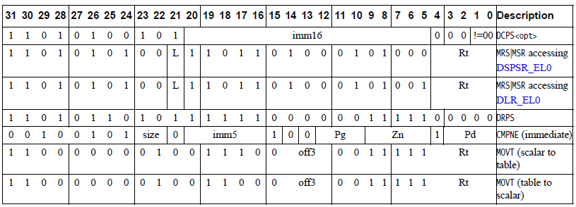
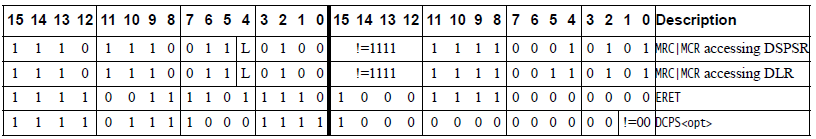
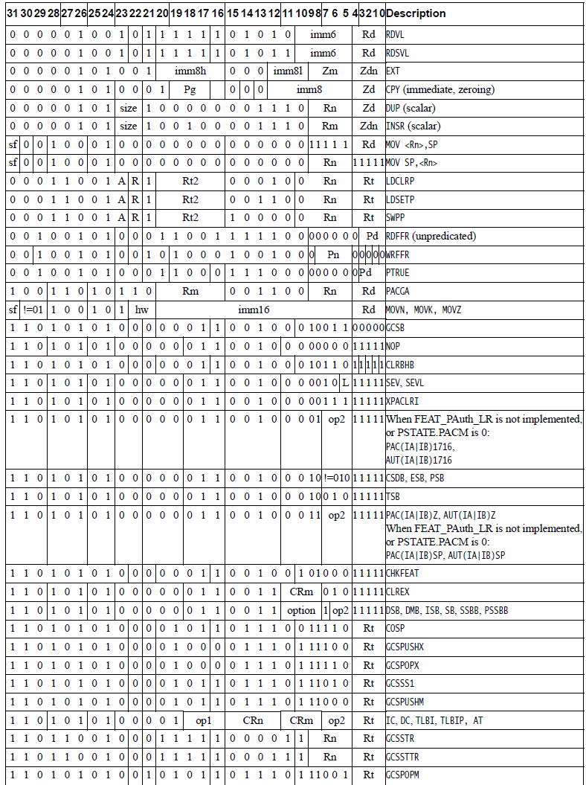
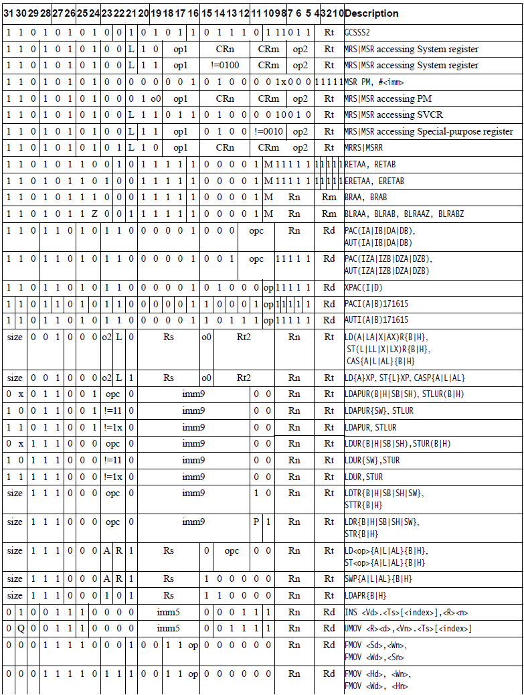
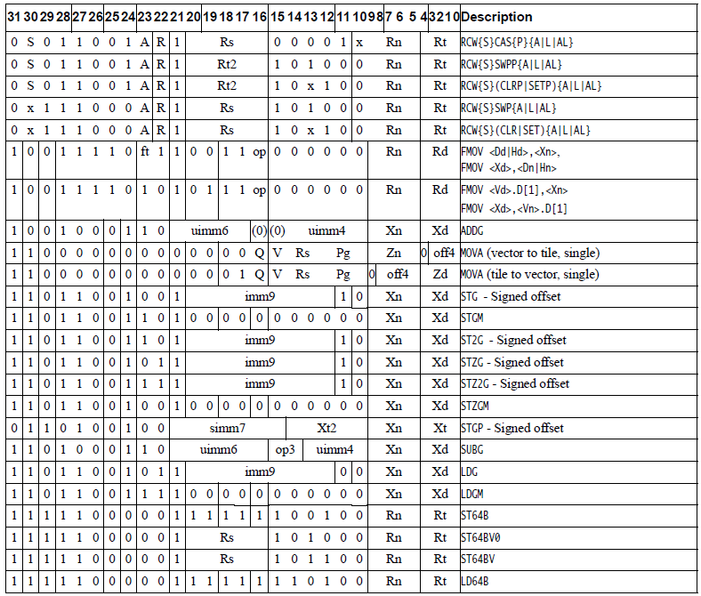
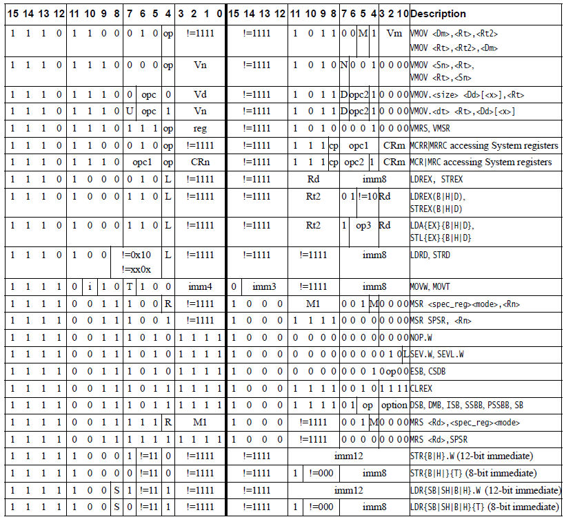

# ​H2.4.3 Decode tables

Source: <https://developer.arm.com/documentation/ddi0487/mc/-Part-H-External-Debug/-Chapter-H2-Debug-State/-H2-4-Behavior-in-Debug-state/-H2-4-3-Decode-tables>

##### H2.4.3 Decode tables

The syntax in the decode tables is defined as follows:

1
:   The bit has a fixed value of 1.

0
:   The bit has a fixed value of 0.

!=
:   The field has any value other than the value or values specified. The field might be an encoding field in the instruction whose value is supplied by the debugger.

> #### Note
>
> The instruction encodings in [A64 Base Instruction Descriptions](/documentation/ddi0487/mc/-Part-C-The-AArch64-Instruction-Set/-Chapter-C6-A64-Base-Instruction-Descriptions?lang=en#autogen_instructions_a64_base) and [T32 and A32 Base Instruction Set Instruction Descriptions](/documentation/ddi0487/mc/-Part-F-The-AArch32-Instruction-Sets/-Chapter-F5-T32-and-A32-Base-Instruction-Set-Instruction-Descriptions?lang=en#autogen_instructions_t32_a32_base) might show these bits as (0) or (1). A debugger must set these bits to 0 or 1, as appropriate.

Any other value indicates an encoding field in the instruction whose value is supplied by the debugger. Some values might be reserved or UNDEFINED, in which case the instruction is UNDEFINED or CONSTRAINED UNPREDICTABLE in Debug state, as it is in Non-debug state.

For more information about the instruction encodings, see:

- [A64 Base Instruction Descriptions](/documentation/ddi0487/mc/-Part-C-The-AArch64-Instruction-Set/-Chapter-C6-A64-Base-Instruction-Descriptions?lang=en#autogen_instructions_a64_base).
- [T32 and A32 Base Instruction Set Instruction Descriptions](/documentation/ddi0487/mc/-Part-F-The-AArch32-Instruction-Sets/-Chapter-F5-T32-and-A32-Base-Instruction-Set-Instruction-Descriptions?lang=en#autogen_instructions_t32_a32_base).

For information about the syntax used in [Figure H2-1](/documentation/ddi0487/mc/-Part-H-External-Debug/-Chapter-H2-Debug-State/-H2-4-Behavior-in-Debug-state/-H2-4-3-Decode-tables?lang=en#fig_caciicca), [Figure H2-2](/documentation/ddi0487/mc/-Part-H-External-Debug/-Chapter-H2-Debug-State/-H2-4-Behavior-in-Debug-state/-H2-4-3-Decode-tables?lang=en#fig_cacdgcgi), [Figure H2-3](/documentation/ddi0487/mc/-Part-H-External-Debug/-Chapter-H2-Debug-State/-H2-4-Behavior-in-Debug-state/-H2-4-3-Decode-tables?lang=en#fig_caccaehc), and [Figure H2-4](/documentation/ddi0487/mc/-Part-H-External-Debug/-Chapter-H2-Debug-State/-H2-4-Behavior-in-Debug-state/-H2-4-3-Decode-tables?lang=en#fig_cacdecjb), see:

- [Common syntax terms](/documentation/ddi0487/mc/-Part-C-The-AArch64-Instruction-Set/-Chapter-C1-The-A64-Instruction-Set/-C1-2-Structure-of-the-A64-assembler-language/-C1-2-2-Common-syntax-terms?lang=en#chdcieeh).
- [Assembler symbols](/documentation/ddi0487/mc/-Part-F-The-AArch32-Instruction-Sets/-Chapter-F1-About-the-T32-and-A32-Instruction-Descriptions/-F1-1-Format-of-instruction-descriptions/-F1-1-4-Assembler-symbols?lang=en#babjichb).

###### H2.4.3.1 A64 instructions that are modified in Debug state

[Figure H2-1](/documentation/ddi0487/mc/-Part-H-External-Debug/-Chapter-H2-Debug-State/-H2-4-Behavior-in-Debug-state/-H2-4-3-Decode-tables?lang=en#fig_caciicca) shows the A64 instructions that are modified in Debug state. For information of how these are packed in the [EDITR](/documentation/ddi0487/mc/-Part-H-External-Debug/-Chapter-H9-External-Debug-Register-Descriptions/-H9-2-External-debug-registers/-H9-2-32-EDITR--External-Debug-Instruction-Transfer-Register?lang=en#reg_ext_editr), see the register description.

Figure H2-1 Modified A64 instructions in Debug state

###### H2.4.3.2 T32 instructions that are modified in Debug state

[Figure H2-2](/documentation/ddi0487/mc/-Part-H-External-Debug/-Chapter-H2-Debug-State/-H2-4-Behavior-in-Debug-state/-H2-4-3-Decode-tables?lang=en#fig_cacdgcgi) shows the T32 instructions that are modified in Debug state, with the first halfword on the left side and the second halfword on the right side. For information of how these are packed in the [EDITR](/documentation/ddi0487/mc/-Part-H-External-Debug/-Chapter-H9-External-Debug-Register-Descriptions/-H9-2-External-debug-registers/-H9-2-32-EDITR--External-Debug-Instruction-Transfer-Register?lang=en#reg_ext_editr), see the register description.

Figure H2-2 Modified T32 instructions in Debug state

###### H2.4.3.3 A64 instructions that are unchanged in Debug state

This section shows the A64 instructions that are unchanged in Debug state, other than some unallocated and UNDEFINED instructions.

Figure H2-3

###### H2.4.3.4 T32 instructions that are unchanged in Debug state

[Figure H2-4](/documentation/ddi0487/mc/-Part-H-External-Debug/-Chapter-H2-Debug-State/-H2-4-Behavior-in-Debug-state/-H2-4-3-Decode-tables?lang=en#fig_cacdecjb) shows the T32 instructions that are unchanged in Debug state, other than some unallocated and UNDEFINED instructions. It shows the T32 instructions with the first halfword on the left side and the second halfword on the right side.

Figure H2-4 T32 instructions that are unchanged in Debug state

