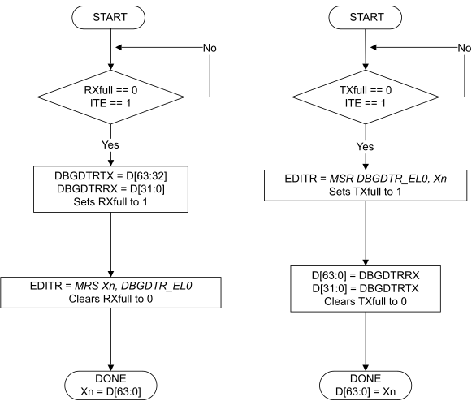
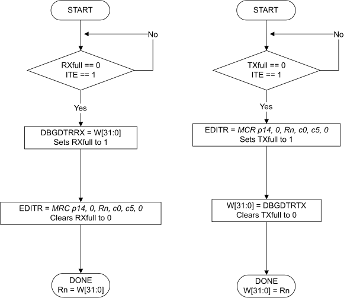

# ​H2.4.8 Accessing registers in Debug state

Source: <https://developer.arm.com/documentation/ddi0487/mc/-Part-H-External-Debug/-Chapter-H2-Debug-State/-H2-4-Behavior-in-Debug-state/-H2-4-8-Accessing-registers-in-Debug-state>

##### H2.4.8 Accessing registers in Debug state

Register accesses are unchanged in Debug state. The view of each register is determined by either the current Exception level or the mode, or both, and accesses might be disabled or trapped by controls at a higher Exception level.

###### H2.4.8.1 General-purpose register access, other than AArch64 state SP access

A single general-purpose register can be read by issuing an `MSR` instruction through the ITR to write [DBGDTR\_EL0](/documentation/ddi0487/mc/-Part-D-The-AArch64-System-Level-Architecture/-Chapter-D24-AArch64-System-Register-Descriptions/-D24-3-Debug-System-registers/-D24-3-6-DBGDTR-EL0--Debug-Data-Transfer-Register--half-duplex?lang=en#reg_aarch64_dbgdtr_el0) in AArch64 state, or an `MCR` instruction through the ITR to write [DBGDTRTXint](/documentation/ddi0487/mc/-Part-G-The-AArch32-System-Level-Architecture/-Chapter-G8-AArch32-System-Register-Descriptions/-G8-3-Debug-System-registers/-G8-3-19-DBGDTRTXint--Debug-Data-Transfer-Register--Transmit?lang=en#reg_aarch32_dbgdtrtxint) in AArch32 state.

The debugger can then read the DTR register or registers through the external debug interface. The reverse sequence writes to a general-purpose register.

[Figure H2-5](/documentation/ddi0487/mc/-Part-H-External-Debug/-Chapter-H2-Debug-State/-H2-4-Behavior-in-Debug-state/-H2-4-8-Accessing-registers-in-Debug-state?lang=en#fig_babiefic) shows the reading and writing of general-purpose registers, other than SP, in Debug state in AArch64 state.

Figure H2-5 Reading and writing general-purpose registers, other than SP, in Debug state in AArch64 state



[Figure H2-6](/documentation/ddi0487/mc/-Part-H-External-Debug/-Chapter-H2-Debug-State/-H2-4-Behavior-in-Debug-state/-H2-4-8-Accessing-registers-in-Debug-state?lang=en#fig_babhcgfg) shows the reading and writing of general-purpose registers in Debug state in AArch32 state.

Figure H2-6 Reading and writing general-purpose registers in Debug state in AArch32 state



###### H2.4.8.2 PC and PSTATE access

The debugger reads the Program Counter and [PSTATE](/documentation/ddi0487/mc/-Part-D-The-AArch64-System-Level-Architecture/-Chapter-D1-The-AArch64-System-Level-Programmers--Model/-D1-5-Process-state--PSTATE?lang=en#pstate) of the process being debugged through the [DLR\_EL0](/documentation/ddi0487/mc/-Part-D-The-AArch64-System-Level-Architecture/-Chapter-D24-AArch64-System-Register-Descriptions/-D24-3-Debug-System-registers/-D24-3-13-DLR-EL0--Debug-Link-Register?lang=en#reg_aarch64_dlr_el0) and [DSPSR\_EL0](/documentation/ddi0487/mc/-Part-D-The-AArch64-System-Level-Architecture/-Chapter-D24-AArch64-System-Register-Descriptions/-D24-3-Debug-System-registers/-D24-3-14-DSPSR-EL0--Debug-Saved-Program-Status-Register?lang=en#reg_aarch64_dspsr_el0) System registers. The actual values of PC and [PSTATE](/documentation/ddi0487/mc/-Part-D-The-AArch64-System-Level-Architecture/-Chapter-D1-The-AArch64-System-Level-Programmers--Model/-D1-5-Process-state--PSTATE?lang=en#pstate) cannot be directly observed in Debug state:

- Instructions that are used for direct reads and writes of PC and [PSTATE](/documentation/ddi0487/mc/-Part-D-The-AArch64-System-Level-Architecture/-Chapter-D1-The-AArch64-System-Level-Programmers--Model/-D1-5-Process-state--PSTATE?lang=en#pstate) in Non-debug state are CONSTRAINED UNPREDICTABLE in Debug state.
- On taking an exception, [ELR\_ELx](/documentation/ddi0487/mc/-Part-K-Appendixes/-Appendix-K14-Registers-Index/-K14-1-Introduction-and-register-disambiguation/-K14-1-2-Register-name-disambiguation-by-Exception-level?lang=en#elr_elx) and [SPSR\_ELx](/documentation/ddi0487/mc/-Part-K-Appendixes/-Appendix-K14-Registers-Index/-K14-1-Introduction-and-register-disambiguation/-K14-1-2-Register-name-disambiguation-by-Exception-level?lang=en#spsr_elx) at the target Exception level are UNKNOWN. They do not record the PC and [PSTATE](/documentation/ddi0487/mc/-Part-D-The-AArch64-System-Level-Architecture/-Chapter-D1-The-AArch64-System-Level-Programmers--Model/-D1-5-Process-state--PSTATE?lang=en#pstate).

[PSTATE](/documentation/ddi0487/mc/-Part-D-The-AArch64-System-Level-Architecture/-Chapter-D1-The-AArch64-System-Level-Programmers--Model/-D1-5-Process-state--PSTATE?lang=en#pstate).{TCO, UAO, PAN, IL, E, M, nRW, EL, SP} are indirectly read by instructions executed in Debug state, but all other [PSTATE](/documentation/ddi0487/mc/-Part-D-The-AArch64-System-Level-Architecture/-Chapter-D1-The-AArch64-System-Level-Programmers--Model/-D1-5-Process-state--PSTATE?lang=en#pstate) fields are ignored and cannot be observed. See also:

- [PSTATE in Debug state](/documentation/ddi0487/mc/-Part-H-External-Debug/-Chapter-H2-Debug-State/-H2-4-Behavior-in-Debug-state/-H2-4-1-PSTATE-in-Debug-state?lang=en#babfhfdj).
- [Executing instructions in Debug state](/documentation/ddi0487/mc/-Part-H-External-Debug/-Chapter-H2-Debug-State/-H2-4-Behavior-in-Debug-state/-H2-4-2-Executing-instructions-in-Debug-state?lang=en#babhejjg).
- [Exceptions in Debug state](/documentation/ddi0487/mc/-Part-H-External-Debug/-Chapter-H2-Debug-State/-H2-4-Behavior-in-Debug-state/-H2-4-7-Exceptions-in-Debug-state?lang=en#babifhhd).

###### H2.4.8.3 Other register accesses

To access other registers, the debugger can use the operations described in [General-purpose register access, other than AArch64 state SP access](/documentation/ddi0487/mc/-Part-H-External-Debug/-Chapter-H2-Debug-State/-H2-4-Behavior-in-Debug-state/-H2-4-8-Accessing-registers-in-Debug-state?lang=en#babbjchj) and the operations described below to build a sequence of operations to move the registers to or from a general-purpose register.

To access a SIMD&FP, SP, or System register, the debugger can use an instruction from the following list to transfer the register to or from a general-purpose register:

- The `UMOV` instruction in AArch64 state or the `VMOV` instruction in AArch32 state for SIMD transfers from SIMD&FP registers.
- The `FMOV` instruction in AArch64 state or the `VMOV` instruction in AArch32 state for floating-point transfers to or from SIMD&FP registers.
- [`MOV` (to/from SP)](/documentation/ddi0487/mc/-Part-C-The-AArch64-Instruction-Set/-Chapter-C6-A64-Base-Instruction-Descriptions/-C6-2-Alphabetical-list-of-A64-base-instructions/-C6-2-278-MOV--to-from-SP-?lang=en#isa_mov_add_addsub_imm) `SP,Xs` and [`MOV` (to/from SP)](/documentation/ddi0487/mc/-Part-C-The-AArch64-Instruction-Set/-Chapter-C6-A64-Base-Instruction-Descriptions/-C6-2-Alphabetical-list-of-A64-base-instructions/-C6-2-278-MOV--to-from-SP-?lang=en#isa_mov_add_addsub_imm) `Xd,SP` instructions in AArch64 state for transfers to or from the SP register.
- [`MSR`](/documentation/ddi0487/mc/-Part-C-The-AArch64-Instruction-Set/-Chapter-C6-A64-Base-Instruction-Descriptions/-C6-2-Alphabetical-list-of-A64-base-instructions/-C6-2-289-MSR--register-?lang=en#isa_msr_reg), [`MSRR`](/documentation/ddi0487/mc/-Part-C-The-AArch64-Instruction-Set/-Chapter-C6-A64-Base-Instruction-Descriptions/-C6-2-Alphabetical-list-of-A64-base-instructions/-C6-2-290-MSRR?lang=en#isa_msrr), [`MRRS`](/documentation/ddi0487/mc/-Part-C-The-AArch64-Instruction-Set/-Chapter-C6-A64-Base-Instruction-Descriptions/-C6-2-Alphabetical-list-of-A64-base-instructions/-C6-2-286-MRRS?lang=en#isa_mrrs), and [`MRS`](/documentation/ddi0487/mc/-Part-C-The-AArch64-Instruction-Set/-Chapter-C6-A64-Base-Instruction-Descriptions/-C6-2-Alphabetical-list-of-A64-base-instructions/-C6-2-287-MRS?lang=en#isa_mrs) instructions in AArch64 state or [`MCR`](/documentation/ddi0487/mc/-Part-F-The-AArch32-Instruction-Sets/-Chapter-F5-T32-and-A32-Base-Instruction-Set-Instruction-Descriptions/-F5-1-Alphabetical-list-of-T32-and-A32-base-instruction-set-instructions/-F5-1-108-MCR?lang=en#isa_mcr), [`MCRR`](/documentation/ddi0487/mc/-Part-F-The-AArch32-Instruction-Sets/-Chapter-F5-T32-and-A32-Base-Instruction-Set-Instruction-Descriptions/-F5-1-Alphabetical-list-of-T32-and-A32-base-instruction-set-instructions/-F5-1-109-MCRR?lang=en#isa_mcrr), [`MRRC`](/documentation/ddi0487/mc/-Part-F-The-AArch32-Instruction-Sets/-Chapter-F5-T32-and-A32-Base-Instruction-Set-Instruction-Descriptions/-F5-1-Alphabetical-list-of-T32-and-A32-base-instruction-set-instructions/-F5-1-117-MRRC?lang=en#isa_mrrc), and [`MRC`](/documentation/ddi0487/mc/-Part-F-The-AArch32-Instruction-Sets/-Chapter-F5-T32-and-A32-Base-Instruction-Set-Instruction-Descriptions/-F5-1-Alphabetical-list-of-T32-and-A32-base-instruction-set-instructions/-F5-1-116-MRC?lang=en#isa_mrc) instructions in AArch32 state for transfers to or from System registers.

To access an SVE scalable vector register, the debugger can use the following instruction sequences to transfer the register to or from a general-purpose register, 64 bits at a time:

- To read, the following sequence to copy the 64-bit element 0 of `Vs` to general-purpose register `Xd` and rotate `Zs` register right by 64 bits:

  ```
  UMOV Xd, Vs.D[0]
  EXT Zs.B, Zs.B, Zs.B, #8
  ```
- To write, the [`INSR`](/documentation/ddi0487/mc/-Part-C-The-AArch64-Instruction-Set/-Chapter-C8-SVE-Instruction-Descriptions/-C8-2-Alphabetical-list-of-SVE-instructions/-C8-2-288-INSR--scalar-?lang=en#isa_insr_z_r) `ZD.D,Xs` instruction to shift vector register `Zd` left by one 64-bit element and copy general-purpose register `Xs` to the 64-bit element 0.

To access an SVE predicate register, the debugger can use a sequence from the following list to transfer the register to or from an SVE scalable vector register:

- If [FEAT\_SVE2p1](/documentation/ddi0487/mc/-Part-A-Arm-Architecture-Introduction-and-Overview/-Chapter-A2-A-profile-Architecture-Extensions/-A2-3-Armv9-A-architecture-extensions/-A2-3-5-The-Armv9-4-architecture-extension?lang=en#feat_feat_sve2p1) is implemented or [FEAT\_SME2p1](/documentation/ddi0487/mc/-Part-A-Arm-Architecture-Introduction-and-Overview/-Chapter-A2-A-profile-Architecture-Extensions/-A2-3-Armv9-A-architecture-extensions/-A2-3-5-The-Armv9-4-architecture-extension?lang=en#feat_feat_sme2p1) is implemented, the [`PMOV`](/documentation/ddi0487/mc/-Part-C-The-AArch64-Instruction-Set/-Chapter-C8-SVE-Instruction-Descriptions/-C8-2-Alphabetical-list-of-SVE-instructions/-C8-2-508-PMOV--to-vector-?lang=en#isa_pmov_z_pi) `Zd,Ps.B` and [`PMOV`](/documentation/ddi0487/mc/-Part-C-The-AArch64-Instruction-Set/-Chapter-C8-SVE-Instruction-Descriptions/-C8-2-Alphabetical-list-of-SVE-instructions/-C8-2-507-PMOV--to-predicate-?lang=en#isa_pmov_p_zi) `Pd.B,Zs` instructions.
- If [FEAT\_SVE2p1](/documentation/ddi0487/mc/-Part-A-Arm-Architecture-Introduction-and-Overview/-Chapter-A2-A-profile-Architecture-Extensions/-A2-3-Armv9-A-architecture-extensions/-A2-3-5-The-Armv9-4-architecture-extension?lang=en#feat_feat_sve2p1) is not implemented and [FEAT\_SME2p1](/documentation/ddi0487/mc/-Part-A-Arm-Architecture-Introduction-and-Overview/-Chapter-A2-A-profile-Architecture-Extensions/-A2-3-Armv9-A-architecture-extensions/-A2-3-5-The-Armv9-4-architecture-extension?lang=en#feat_feat_sme2p1) is not implemented:

  - To read, the [`CPY`](/documentation/ddi0487/mc/-Part-C-The-AArch64-Instruction-Set/-Chapter-C8-SVE-Instruction-Descriptions/-C8-2-Alphabetical-list-of-SVE-instructions/-C8-2-119-CPY--immediate--zeroing-?lang=en#isa_cpy_z_o_i) `Zd.B,Ps/Z,#1` instruction to expand predicate elements in `PS` into zero and one 8-bit element values in `Zd`.
  - To write, the following sequence to convert zero and nonzero 8-bit elements in `Zs` to a corresponding 1-bit predicate elements in `Pd`:

    ```
    PTRUE Pd.B
    CMPNE Pd.B, Pd/Z, Zs.B, #0
    ```

To access the SVE First Fault Register, FFR, the debugger can use the [`RDFFR`](/documentation/ddi0487/mc/-Part-C-The-AArch64-Instruction-Set/-Chapter-C8-SVE-Instruction-Descriptions/-C8-2-Alphabetical-list-of-SVE-instructions/-C8-2-541-RDFFR--predicated-?lang=en#isa_rdffr_p_p_f) and [`WRFFR`](/documentation/ddi0487/mc/-Part-C-The-AArch64-Instruction-Set/-Chapter-C8-SVE-Instruction-Descriptions/-C8-2-Alphabetical-list-of-SVE-instructions/-C8-2-933-WRFFR?lang=en#isa_wrffr_f_p) instructions to transfer the register to or from an SVE predicate register.

To access the SME ZA storage, the debugger can use the [`MOVA` (tile to vector, single)](/documentation/ddi0487/mc/-Part-C-The-AArch64-Instruction-Set/-Chapter-C9-SME-Instruction-Descriptions/-C9-2-Alphabetical-list-of-SME-instructions/-C9-2-180-MOVA--tile-to-vector--single-?lang=en#isa_mova_z_p_rza) and [`MOVA`](/documentation/ddi0487/mc/-Part-C-The-AArch64-Instruction-Set/-Chapter-C9-SME-Instruction-Descriptions/-C9-2-Alphabetical-list-of-SME-instructions/-C9-2-185-MOVA--vector-to-tile--single-?lang=en#isa_mova_za_p_rz) (vector to tile, single) instructions to transfer to or from an SVE scalable vector register.

To access the SME ZT0 register, the debugger can use the [`MOVT` (table to scalar)](/documentation/ddi0487/mc/-Part-C-The-AArch64-Instruction-Set/-Chapter-C9-SME-Instruction-Descriptions/-C9-2-Alphabetical-list-of-SME-instructions/-C9-2-191-MOVT--table-to-scalar-?lang=en#isa_movt_r_zt) and [`MOVT` (scalar to table)](/documentation/ddi0487/mc/-Part-C-The-AArch64-Instruction-Set/-Chapter-C9-SME-Instruction-Descriptions/-C9-2-Alphabetical-list-of-SME-instructions/-C9-2-192-MOVT--scalar-to-table-?lang=en#isa_movt_zt_r) instructions to transfer to or from a general-purpose register, 64 bits at a time.
