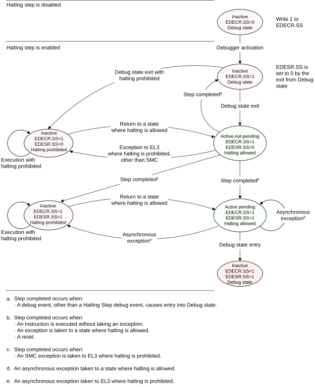

# ​H3.2.2 The Halting Step state machine

Source: <https://developer.arm.com/documentation/ddi0487/mc/-Part-H-External-Debug/-Chapter-H3-Halting-Debug-Events/-H3-2-Halting-Step-debug-events/-H3-2-2-The-Halting-Step-state-machine>

##### H3.2.2 The Halting Step state machine

The state machine states are:

Inactive
:   Halting Step is inactive. No Halting Step debug events can be generated, therefore execution is not affected by Halting Step. The PE is in this state whenever either of the following is true:

    - Halting Step is disabled. That is, [EDECR](/documentation/ddi0487/mc/-Part-H-External-Debug/-Chapter-H9-External-Debug-Register-Descriptions/-H9-2-External-debug-registers/-H9-2-28-EDECR--External-Debug-Execution-Control-Register?lang=en#reg_ext_edecr).SS is set to 0 and [EDESR](/documentation/ddi0487/mc/-Part-H-External-Debug/-Chapter-H9-External-Debug-Register-Descriptions/-H9-2-External-debug-registers/-H9-2-29-EDESR--External-Debug-Event-Status-Register?lang=en#reg_ext_edesr).SS is set to 0.
    - Halting is prohibited. See [Halting the PE on debug events](/documentation/ddi0487/mc/-Part-H-External-Debug/-Chapter-H2-Debug-State/-H2-2-Halting-the-PE-on-debug-events?lang=en#babhajdf). In this state, if [EDECR](/documentation/ddi0487/mc/-Part-H-External-Debug/-Chapter-H9-External-Debug-Register-Descriptions/-H9-2-External-debug-registers/-H9-2-28-EDECR--External-Debug-Execution-Control-Register?lang=en#reg_ext_edecr).SS is set to 1, then a Halting Step debug event is pending.

    In [Figure H3-1](/documentation/ddi0487/mc/-Part-H-External-Debug/-Chapter-H3-Halting-Debug-Events/-H3-2-Halting-Step-debug-events/-H3-2-2-The-Halting-Step-state-machine?lang=en#fig_babedaea), this state is shown in red.

Active-not-pending
:   Halting Step is enabled and active. This is the state in which the PE steps an instruction. [EDECR](/documentation/ddi0487/mc/-Part-H-External-Debug/-Chapter-H9-External-Debug-Register-Descriptions/-H9-2-External-debug-registers/-H9-2-28-EDECR--External-Debug-Execution-Control-Register?lang=en#reg_ext_edecr).SS == 1 and [EDESR](/documentation/ddi0487/mc/-Part-H-External-Debug/-Chapter-H9-External-Debug-Register-Descriptions/-H9-2-External-debug-registers/-H9-2-29-EDESR--External-Debug-Event-Status-Register?lang=en#reg_ext_edesr).SS == 0. Software must not set [EDECR](/documentation/ddi0487/mc/-Part-H-External-Debug/-Chapter-H9-External-Debug-Register-Descriptions/-H9-2-External-debug-registers/-H9-2-28-EDECR--External-Debug-Execution-Control-Register?lang=en#reg_ext_edecr).SS to 1 unless the PE is in Debug state, otherwise behavior is CONSTRAINED UNPREDICTABLE, as described in [Changing the value of EDECR.SS when not in Debug state](/documentation/ddi0487/mc/-Part-H-External-Debug/-Chapter-H3-Halting-Debug-Events/-H3-2-Halting-Step-debug-events/-H3-2-5-Synchronization-and-the-Halting-Step-state-machine?lang=en#beiccchj).

    In [Figure H3-1](/documentation/ddi0487/mc/-Part-H-External-Debug/-Chapter-H3-Halting-Debug-Events/-H3-2-Halting-Step-debug-events/-H3-2-2-The-Halting-Step-state-machine?lang=en#fig_babedaea), this state is shown in green.

Active-pending
:   Halting Step is enabled and active. The step has completed and the PE enters Debug state. [EDESR](/documentation/ddi0487/mc/-Part-H-External-Debug/-Chapter-H9-External-Debug-Register-Descriptions/-H9-2-External-debug-registers/-H9-2-29-EDESR--External-Debug-Event-Status-Register?lang=en#reg_ext_edesr).SS == 1.

    In [Figure H3-1](/documentation/ddi0487/mc/-Part-H-External-Debug/-Chapter-H3-Halting-Debug-Events/-H3-2-Halting-Step-debug-events/-H3-2-2-The-Halting-Step-state-machine?lang=en#fig_babedaea), this state is shown in green.

Whenever Halting Step is enabled and active, whether the state machine is in the active-not-pending state or in the active-pending state depends on [EDESR](/documentation/ddi0487/mc/-Part-H-External-Debug/-Chapter-H9-External-Debug-Register-Descriptions/-H9-2-External-debug-registers/-H9-2-29-EDESR--External-Debug-Event-Status-Register?lang=en#reg_ext_edesr).SS. [Table H3-3](/documentation/ddi0487/mc/-Part-H-External-Debug/-Chapter-H3-Halting-Debug-Events/-H3-2-Halting-Step-debug-events/-H3-2-2-The-Halting-Step-state-machine?lang=en#tbl_babdijgf) shows this.

In the simple sequential execution of the program, the PE executes the Halting Step state machine as follows:

1. Initially, Halting Step is inactive.
2. After exiting Debug state, Halting Step is active-not-pending.
3. The PE executes an instruction and Halting Step is active-pending.
4. The pending Debug state entry is taken on the next instruction and the step is complete.

Exceptions and other changes to the PE context can interrupt this sequence.

[Figure H3-1](/documentation/ddi0487/mc/-Part-H-External-Debug/-Chapter-H3-Halting-Debug-Events/-H3-2-Halting-Step-debug-events/-H3-2-2-The-Halting-Step-state-machine?lang=en#fig_babedaea) shows a Halting Step state machine.

Figure H3-1 Halting Step state machine

> #### Note
>
> [Figure H3-1](/documentation/ddi0487/mc/-Part-H-External-Debug/-Chapter-H3-Halting-Debug-Events/-H3-2-Halting-Step-debug-events/-H3-2-2-The-Halting-Step-state-machine?lang=en#fig_babedaea) describes only state transitions to and from the inactive state by exit from Debug state, executing an exception return, or taking an exception. Other changes to the PE context, including writes to registers such as [EDECR](/documentation/ddi0487/mc/-Part-H-External-Debug/-Chapter-H9-External-Debug-Register-Descriptions/-H9-2-External-debug-registers/-H9-2-28-EDECR--External-Debug-Execution-Control-Register?lang=en#reg_ext_edecr) and [OSDLR](/documentation/ddi0487/mc/-Part-K-Appendixes/-Appendix-K14-Registers-Index/-K14-1-Introduction-and-register-disambiguation/-K14-1-1-Register-name-disambiguation-by-Execution-state?lang=en#babfdbih) and changes to the authentication interface can also cause changes to the Halting Step state machine. These can lead to UNPREDICTABLE or CONSTRAINED UNPREDICTABLE behavior. See [Synchronization and the Halting Step state machine](/documentation/ddi0487/mc/-Part-H-External-Debug/-Chapter-H3-Halting-Debug-Events/-H3-2-Halting-Step-debug-events/-H3-2-5-Synchronization-and-the-Halting-Step-state-machine?lang=en#babeeaea).

The following bits control the state machine, as shown in [Table H3-3](/documentation/ddi0487/mc/-Part-H-External-Debug/-Chapter-H3-Halting-Debug-Events/-H3-2-Halting-Step-debug-events/-H3-2-2-The-Halting-Step-state-machine?lang=en#tbl_babdijgf):

- [EDECR](/documentation/ddi0487/mc/-Part-H-External-Debug/-Chapter-H9-External-Debug-Register-Descriptions/-H9-2-External-debug-registers/-H9-2-28-EDECR--External-Debug-Execution-Control-Register?lang=en#reg_ext_edecr).SS. This is the Halting Step enable bit.
- [EDESR](/documentation/ddi0487/mc/-Part-H-External-Debug/-Chapter-H9-External-Debug-Register-Descriptions/-H9-2-External-debug-registers/-H9-2-29-EDESR--External-Debug-Event-Status-Register?lang=en#reg_ext_edesr).SS. This is the Halting Step debug event pending bit.

[Table H3-3](/documentation/ddi0487/mc/-Part-H-External-Debug/-Chapter-H3-Halting-Debug-Events/-H3-2-Halting-Step-debug-events/-H3-2-2-The-Halting-Step-state-machine?lang=en#tbl_babdijgf) shows the Halting Step state machine states. The letter X in a register column means that the relevant bit can be set to either zero or one.

<table id="tbl_babdijgf">
 <caption>
  Table H3-3 Halting Step state machine states
 </caption>
 <colgroup>
  <col/>
  <col/>
  <col/>
  <col/>
 </colgroup>
 <thead>
  <tr>
   <th>
    Halting
   </th>
   <th>
    <a class="document-topic" document-topic-path="/ddi0487/mc/-Part-H-External-Debug/-Chapter-H9-External-Debug-Register-Descriptions/-H9-2-External-debug-registers/-H9-2-28-EDECR--External-Debug-Execution-Control-Register?lang=en#reg_ext_edecr" href="/documentation/ddi0487/mc/-Part-H-External-Debug/-Chapter-H9-External-Debug-Register-Descriptions/-H9-2-External-debug-registers/-H9-2-28-EDECR--External-Debug-Execution-Control-Register?lang=en#reg_ext_edecr">
     EDECR
    </a>
    .SS
   </th>
   <th>
    <a class="document-topic" document-topic-path="/ddi0487/mc/-Part-H-External-Debug/-Chapter-H9-External-Debug-Register-Descriptions/-H9-2-External-debug-registers/-H9-2-29-EDESR--External-Debug-Event-Status-Register?lang=en#reg_ext_edesr" href="/documentation/ddi0487/mc/-Part-H-External-Debug/-Chapter-H9-External-Debug-Register-Descriptions/-H9-2-External-debug-registers/-H9-2-29-EDESR--External-Debug-Event-Status-Register?lang=en#reg_ext_edesr">
     EDESR
    </a>
    .SS
   </th>
   <th>
    Halting Step state
   </th>
  </tr>
 </thead>
 <tbody>
  <tr>
   <td>
    Prohibited
   </td>
   <td>
    X
   </td>
   <td>
    X
   </td>
   <td>
    Inactive (Halting Step debug even not pending)
   </td>
  </tr>
  <tr>
   <td>
    Prohibited
   </td>
   <td>
    X
   </td>
   <td>
    1
   </td>
   <td>
    Inactive (Halting Step debug event pending)
   </td>
  </tr>
  <tr>
   <td>
    Allowed
   </td>
   <td>
    0
   </td>
   <td>
    0
   </td>
   <td>
    Inactive
   </td>
  </tr>
  <tr>
   <td>
    Allowed
   </td>
   <td>
    1
   </td>
   <td>
    0
   </td>
   <td>
    Active-not-pending
   </td>
  </tr>
  <tr>
   <td>
    Allowed
   </td>
   <td>
    X
   </td>
   <td>
    1
   </td>
   <td>
    Active-pending
   </td>
  </tr>
 </tbody>
</table>
