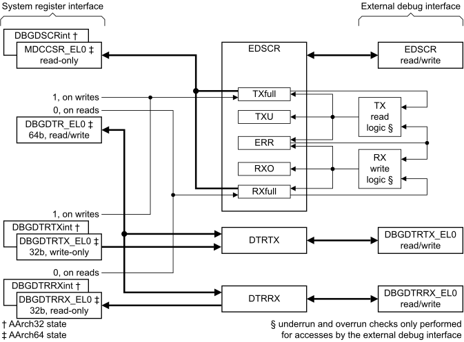
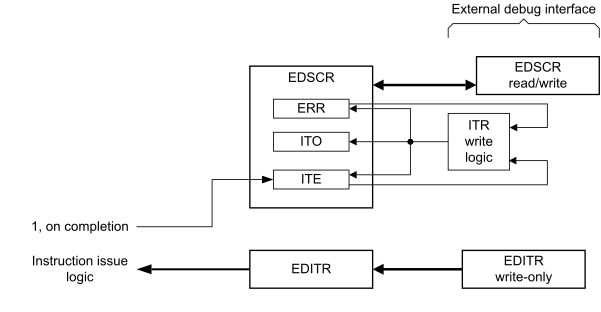
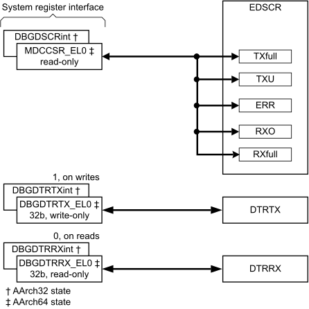

# ​H4.2 DCC and ITR registers

Source: <https://developer.arm.com/documentation/ddi0487/mc/-Part-H-External-Debug/-Chapter-H4-The-Debug-Communication-Channel-and-Instruction-Transfer-Register/-H4-2-DCC-and-ITR-registers>

#### H4.2 DCC and ITR registers

The DCC comprises *data transfer registers*, the DTRs, and associated flow-control flags. The data transfer registers are DTRRX and DTRTX.

The ITR comprises a single register, [EDITR](/documentation/ddi0487/mc/-Part-H-External-Debug/-Chapter-H9-External-Debug-Register-Descriptions/-H9-2-External-debug-registers/-H9-2-32-EDITR--External-Debug-Instruction-Transfer-Register?lang=en#reg_ext_editr), and associated flow-control flags.

In AArch64 state, software can access the data transfer registers as:

- A receive and transmit pair for 32-bit full duplex operation:

  - The write-only [DBGDTRTX\_EL0](/documentation/ddi0487/mc/-Part-D-The-AArch64-System-Level-Architecture/-Chapter-D24-AArch64-System-Register-Descriptions/-D24-3-Debug-System-registers/-D24-3-8-DBGDTRTX-EL0--Debug-Data-Transfer-Register--Transmit?lang=en#reg_aarch64_dbgdtrtx_el0) register to transmit data.
  - The read-only [DBGDTRRX\_EL0](/documentation/ddi0487/mc/-Part-D-The-AArch64-System-Level-Architecture/-Chapter-D24-AArch64-System-Register-Descriptions/-D24-3-Debug-System-registers/-D24-3-7-DBGDTRRX-EL0--Debug-Data-Transfer-Register--Receive?lang=en#reg_aarch64_dbgdtrrx_el0) register to receive data.
- A single 64-bit read/write register, [DBGDTR\_EL0](/documentation/ddi0487/mc/-Part-D-The-AArch64-System-Level-Architecture/-Chapter-D24-AArch64-System-Register-Descriptions/-D24-3-Debug-System-registers/-D24-3-6-DBGDTR-EL0--Debug-Data-Transfer-Register--half-duplex?lang=en#reg_aarch64_dbgdtr_el0), for 64-bit half-duplex operation.
- The read/write [OSDTRTX\_EL1](/documentation/ddi0487/mc/-Part-D-The-AArch64-System-Level-Architecture/-Chapter-D24-AArch64-System-Register-Descriptions/-D24-3-Debug-System-registers/-D24-3-25-OSDTRTX-EL1--OS-Lock-Data-Transfer-Register--Transmit?lang=en#reg_aarch64_osdtrtx_el1) and [OSDTRRX\_EL1](/documentation/ddi0487/mc/-Part-D-The-AArch64-System-Level-Architecture/-Chapter-D24-AArch64-System-Register-Descriptions/-D24-3-Debug-System-registers/-D24-3-24-OSDTRRX-EL1--OS-Lock-Data-Transfer-Register--Receive?lang=en#reg_aarch64_osdtrrx_el1) registers for save and restore.

In AArch32 state, software can access the data transfer registers only as:

- A receive and transmit pair, for 32-bit full duplex operation:

  - The write-only [DBGDTRTXint](/documentation/ddi0487/mc/-Part-G-The-AArch32-System-Level-Architecture/-Chapter-G8-AArch32-System-Register-Descriptions/-G8-3-Debug-System-registers/-G8-3-19-DBGDTRTXint--Debug-Data-Transfer-Register--Transmit?lang=en#reg_aarch32_dbgdtrtxint) register to transmit data.
  - The read-only [DBGDTRRXint](/documentation/ddi0487/mc/-Part-G-The-AArch32-System-Level-Architecture/-Chapter-G8-AArch32-System-Register-Descriptions/-G8-3-Debug-System-registers/-G8-3-17-DBGDTRRXint--Debug-Data-Transfer-Register--Receive?lang=en#reg_aarch32_dbgdtrrxint) register to receive data.
- The read/write [DBGDTRTXext](/documentation/ddi0487/mc/-Part-G-The-AArch32-System-Level-Architecture/-Chapter-G8-AArch32-System-Register-Descriptions/-G8-3-Debug-System-registers/-G8-3-18-DBGDTRTXext--Debug-OS-Lock-Data-Transfer-Register--Transmit?lang=en#reg_aarch32_dbgdtrtxext) and [DBGDTRRXext](/documentation/ddi0487/mc/-Part-G-The-AArch32-System-Level-Architecture/-Chapter-G8-AArch32-System-Register-Descriptions/-G8-3-Debug-System-registers/-G8-3-16-DBGDTRRXext--Debug-OS-Lock-Data-Transfer-Register--Receive--External-View?lang=en#reg_aarch32_dbgdtrrxext) registers for save and restore.

The data transfer registers are also accessible by the external debug interface as a pair of 32-bit registers, [DBGDTRRX\_EL0](/documentation/ddi0487/mc/-Part-H-External-Debug/-Chapter-H9-External-Debug-Register-Descriptions/-H9-2-External-debug-registers/-H9-2-6-DBGDTRRX-EL0--Debug-Data-Transfer-Register--Receive?lang=en#reg_ext_dbgdtrrx_el0) and [DBGDTRTX\_EL0](/documentation/ddi0487/mc/-Part-H-External-Debug/-Chapter-H9-External-Debug-Register-Descriptions/-H9-2-External-debug-registers/-H9-2-7-DBGDTRTX-EL0--Debug-Data-Transfer-Register--Transmit?lang=en#reg_ext_dbgdtrtx_el0). Both registers are read/write, allowing both 32-bit full-duplex and 64-bit half-duplex operation.

The DCC flow-control flags are [EDSCR](/documentation/ddi0487/mc/-Part-H-External-Debug/-Chapter-H9-External-Debug-Register-Descriptions/-H9-2-External-debug-registers/-H9-2-48-EDSCR--External-Debug-Status-and-Control-Register?lang=en#reg_ext_edscr).{RXfull, TXfull, RXO, TXU}:

- The RXfull and TXfull ready flags are used for flow-control and are visible to software in the Debug System registers in [DCCSR](/documentation/ddi0487/mc/-Part-K-Appendixes/-Appendix-K14-Registers-Index/-K14-1-Introduction-and-register-disambiguation/-K14-1-1-Register-name-disambiguation-by-Execution-state?lang=en#babbdeib).
- The RX overrun flag, RXO, and the TX underrun flag, TXU, report flow-control errors.
- The flow-control flags are also accessible by software as simple read/write bits for saving and restoring over a powerdown when the OS Lock is locked in [DSCR](/documentation/ddi0487/mc/-Part-K-Appendixes/-Appendix-K14-Registers-Index/-K14-1-Introduction-and-register-disambiguation/-K14-1-1-Register-name-disambiguation-by-Execution-state?lang=en#babigcjf).
- The flow-control flags are accessible from the external debug interface in [EDSCR](/documentation/ddi0487/mc/-Part-H-External-Debug/-Chapter-H9-External-Debug-Register-Descriptions/-H9-2-External-debug-registers/-H9-2-48-EDSCR--External-Debug-Status-and-Control-Register?lang=en#reg_ext_edscr).

[Figure H4-1](/documentation/ddi0487/mc/-Part-H-External-Debug/-Chapter-H4-The-Debug-Communication-Channel-and-Instruction-Transfer-Register/-H4-2-DCC-and-ITR-registers?lang=en#fig_babbehge) shows the System register and external debug interface views of the [EDSCR](/documentation/ddi0487/mc/-Part-H-External-Debug/-Chapter-H9-External-Debug-Register-Descriptions/-H9-2-External-debug-registers/-H9-2-48-EDSCR--External-Debug-Status-and-Control-Register?lang=en#reg_ext_edscr) and DTR registers in both AArch64 state and AArch32 state. These figures do not include the save and restore views.

Figure H4-1 System register and external debug interface views of EDSCR and DTR registers, Normal access mode

[EDITR](/documentation/ddi0487/mc/-Part-H-External-Debug/-Chapter-H9-External-Debug-Register-Descriptions/-H9-2-External-debug-registers/-H9-2-32-EDITR--External-Debug-Instruction-Transfer-Register?lang=en#reg_ext_editr) and the ITR flow-control flags, [EDSCR](/documentation/ddi0487/mc/-Part-H-External-Debug/-Chapter-H9-External-Debug-Register-Descriptions/-H9-2-External-debug-registers/-H9-2-48-EDSCR--External-Debug-Status-and-Control-Register?lang=en#reg_ext_edscr).{ITE, ITO} are accessible only by the external debug interface:

- The [EDITR](/documentation/ddi0487/mc/-Part-H-External-Debug/-Chapter-H9-External-Debug-Register-Descriptions/-H9-2-External-debug-registers/-H9-2-32-EDITR--External-Debug-Instruction-Transfer-Register?lang=en#reg_ext_editr) specifies an instruction to execute in Debug state.
- The ITR empty flag, ITE, is used for flow-control.
- The ITR overrun flag, ITO, reports flow-control errors.

Figure H4-2 External debug interface views of EDSCR and EDITR registers, Normal access mode

The sticky overflow flag, [EDSCR](/documentation/ddi0487/mc/-Part-H-External-Debug/-Chapter-H9-External-Debug-Register-Descriptions/-H9-2-External-debug-registers/-H9-2-48-EDSCR--External-Debug-Status-and-Control-Register?lang=en#reg_ext_edscr).ERR, is used by both the DCC and ITR to report flow-control errors.

To save and restore the DCC registers for an external debugger over powerdown, software uses:

- The [MDSCR\_EL1](/documentation/ddi0487/mc/-Part-D-The-AArch64-System-Level-Architecture/-Chapter-D24-AArch64-System-Register-Descriptions/-D24-3-Debug-System-registers/-D24-3-20-MDSCR-EL1--Monitor-Debug-System-Control-Register?lang=en#reg_aarch64_mdscr_el1), [OSDTRTX\_EL1](/documentation/ddi0487/mc/-Part-D-The-AArch64-System-Level-Architecture/-Chapter-D24-AArch64-System-Register-Descriptions/-D24-3-Debug-System-registers/-D24-3-25-OSDTRTX-EL1--OS-Lock-Data-Transfer-Register--Transmit?lang=en#reg_aarch64_osdtrtx_el1), and [OSDTRRX\_EL1](/documentation/ddi0487/mc/-Part-D-The-AArch64-System-Level-Architecture/-Chapter-D24-AArch64-System-Register-Descriptions/-D24-3-Debug-System-registers/-D24-3-24-OSDTRRX-EL1--OS-Lock-Data-Transfer-Register--Receive?lang=en#reg_aarch64_osdtrrx_el1) registers in AArch64 state.
- The [DBGDSCRext](/documentation/ddi0487/mc/-Part-G-The-AArch32-System-Level-Architecture/-Chapter-G8-AArch32-System-Register-Descriptions/-G8-3-Debug-System-registers/-G8-3-14-DBGDSCRext--Debug-Status-and-Control-Register--External-View?lang=en#reg_aarch32_dbgdscrext), [DBGDTRTXext](/documentation/ddi0487/mc/-Part-G-The-AArch32-System-Level-Architecture/-Chapter-G8-AArch32-System-Register-Descriptions/-G8-3-Debug-System-registers/-G8-3-18-DBGDTRTXext--Debug-OS-Lock-Data-Transfer-Register--Transmit?lang=en#reg_aarch32_dbgdtrtxext), and [DBGDTRRXext](/documentation/ddi0487/mc/-Part-G-The-AArch32-System-Level-Architecture/-Chapter-G8-AArch32-System-Register-Descriptions/-G8-3-Debug-System-registers/-G8-3-16-DBGDTRRXext--Debug-OS-Lock-Data-Transfer-Register--Receive--External-View?lang=en#reg_aarch32_dbgdtrrxext) registers in AArch32 state.

> #### Note
>
> There is no save and restore mechanism for the ITR registers as the ITR is used only in Debug state.

Figure H4-3 System register views of EDSCR and DTR registers for save and restore

