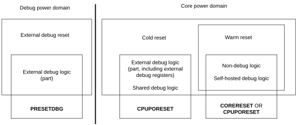

# ​H6.7 Reset and debug

Source: <https://developer.arm.com/documentation/ddi0487/mc/-Part-H-External-Debug/-Chapter-H6-Debug-Reset-and-Powerdown-Support/-H6-7-Reset-and-debug>

#### H6.7 Reset and debug

All registers in the Core power domain are either:

- Reset by both a Cold and a Warm reset.
- Reset only by a Cold reset and are not changed by a Warm reset.

For more information, see [Resets and power domains](/documentation/ddi0487/mc/-Part-D-The-AArch64-System-Level-Architecture/-Chapter-D1-The-AArch64-System-Level-Programmers--Model/-D1-6-Resets-and-power-domains?lang=en#mdsec_resets_and_power_domains).

All registers in the Debug power domain are reset by an External Debug reset.

If [FEAT\_SPMU](/documentation/ddi0487/mc/-Part-A-Arm-Architecture-Introduction-and-Overview/-Chapter-A2-A-profile-Architecture-Extensions/-A2-2-Armv8-A-architecture-extensions/-A2-2-10-The-Armv8-9-architecture-extension?lang=en#feat_feat_spmu) is implemented, the reset signals for a System PMU are IMPLEMENTATION DEFINED.

[Figure H6-1](/documentation/ddi0487/mc/-Part-H-External-Debug/-Chapter-H6-Debug-Reset-and-Powerdown-Support/-H6-7-Reset-and-debug?lang=en#fig_chdeiahd) shows this reset scheme. The following three reset signals are an example implementation of the reset scheme:

- **CORERESET**, which must be asserted for a Warm reset.
- **CPUPORESET**, which must be asserted for a Cold reset.
- **PRESETDBG**, which must be asserted for an External Debug reset.

As shown in the figure, the external debug logic is split between the Debug power domain and the Core power domain.

Figure H6-1 Power and reset domains

For more information about power domains and power states, see [Power domains and debug](/documentation/ddi0487/mc/-Part-H-External-Debug/-Chapter-H6-Debug-Reset-and-Powerdown-Support/-H6-2-Power-domains-and-debug?lang=en#chdgdhjg).

When power is first applied to the Debug power domain, **PRESETDBG** must be asserted.

When power is first applied to the Core power domain, **CPUPORESET** must be asserted.

> #### Note
>
> In this scheme, logic in the Warm reset domain is reset by asserting either **CORERESET** or **CPUPORESET**. This implies a particular implementation style that permits these approaches.

**CPUPORESET** is not normally asserted on moving from a low-power state, where power has not been removed, to a full-power state. This can occur, for example, on exiting a low-power retention state. See also [Emulating low-power states](/documentation/ddi0487/mc/-Part-H-External-Debug/-Chapter-H6-Debug-Reset-and-Powerdown-Support/-H6-5-Emulating-low-power-states?lang=en#chddfhhh) and the [EDPRSR](/documentation/ddi0487/mc/-Part-H-External-Debug/-Chapter-H9-External-Debug-Register-Descriptions/-H9-2-External-debug-registers/-H9-2-46-EDPRSR--External-Debug-Processor-Status-Register?lang=en#reg_ext_edprsr) register description.
