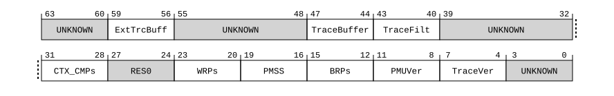

# ​H9.2.24 EDDFR, External Debug Feature Register

Source: <https://developer.arm.com/documentation/ddi0487/mc/-Part-H-External-Debug/-Chapter-H9-External-Debug-Register-Descriptions/-H9-2-External-debug-registers/-H9-2-24-EDDFR--External-Debug-Feature-Register>

##### H9.2.24 EDDFR, External Debug Feature Register

The EDDFR characteristics are:

Purpose
:   Provides top-level information about the debug system.

    > #### Note
    >
    > Debuggers must use [EDDEVARCH](/documentation/ddi0487/mc/-Part-H-External-Debug/-Chapter-H9-External-Debug-Register-Descriptions/-H9-2-External-debug-registers/-H9-2-19-EDDEVARCH--External-Debug-Device-Architecture-Register?lang=en#reg_ext_eddevarch) to determine the Debug architecture version.

    For general information about the interpretation of the ID registers, see [‘Principles of the ID scheme for fields in ID registers’](/documentation/ddi0487/mc/-Part-D-The-AArch64-System-Level-Architecture/-Chapter-D24-AArch64-System-Register-Descriptions/-D24-1-About-the-AArch64-System-registers/-D24-1-3-Principles-of-the-ID-scheme-for-fields-in-ID-registers?lang=en#babfafhi).

Configuration
:   There are no configuration notes.

Attributes
:   EDDFR is a 64-bit register.

###### Field descriptions

Bits [63:60]
:   Reserved, UNKNOWN.

ExtTrcBuff, bits [59:56]
:   Trace Buffer External Mode Extension.

    The value of this field is an IMPLEMENTATION DEFINED choice of:

<table>
 <colgroup>
  <col/>
  <col/>
 </colgroup>
 <thead>
  <tr>
   <th>
    <strong>
     ExtTrcBuff
    </strong>
   </th>
   <th>
    <strong>
     Meaning
    </strong>
   </th>
  </tr>
 </thead>
 <tbody>
  <tr>
   <td>
    

     <code>
      0b0000
     </code>
    

   </td>
   <td>
    

     Trace Buffer Extension not implemented or Trace Buffer External Mode not implemented.
    

   </td>
  </tr>
  <tr>
   <td>
    

     <code>
      0b0001
     </code>
    

   </td>
   <td>
    

     Trace Buffer Extension implemented and Trace Buffer External Mode implemented.
    

   </td>
  </tr>
 </tbody>
</table>

    All other values are reserved.

    If [FEAT\_TRBE](/documentation/ddi0487/mc/-Part-A-Arm-Architecture-Introduction-and-Overview/-Chapter-A2-A-profile-Architecture-Extensions/-A2-3-Armv9-A-architecture-extensions/-A2-3-1-The-Armv9-0-architecture-extension?lang=en#feat_feat_trbe) is not implemented, the only permitted value is `0b0000`.

    [FEAT\_TRBE\_EXT](/documentation/ddi0487/mc/-Part-A-Arm-Architecture-Introduction-and-Overview/-Chapter-A2-A-profile-Architecture-Extensions/-A2-3-Armv9-A-architecture-extensions/-A2-3-5-The-Armv9-4-architecture-extension?lang=en#feat_feat_trbe_ext) implements the functionality identified by the value `0b0001`.

    In an implementation that supports AArch64, this field has the same value as [ID\_AA64DFR0\_EL1](/documentation/ddi0487/mc/-Part-D-The-AArch64-System-Level-Architecture/-Chapter-D24-AArch64-System-Register-Descriptions/-D24-2-General-system-control-registers/-D24-2-79-ID-AA64DFR0-EL1--AArch64-Debug-Feature-Register-0?lang=en#reg_aarch64_id_aa64dfr0_el1).ExtTrcBuff.

    Access to this field is RO.

Bits [55:48]
:   Reserved, UNKNOWN.

TraceBuffer, bits [47:44]
:   When FEAT\_TRBE\_EXT is implemented:
    :   Trace Buffer Extension.

        The value of this field is an IMPLEMENTATION DEFINED choice of:

<table>
 <colgroup>
  <col/>
  <col/>
 </colgroup>
 <thead>
  <tr>
   <th>
    <strong>
     TraceBuffer
    </strong>
   </th>
   <th>
    <strong>
     Meaning
    </strong>
   </th>
  </tr>
 </thead>
 <tbody>
  <tr>
   <td>
    

     <code>
      0b0000
     </code>
    

   </td>
   <td>
    

     Trace Buffer Extension not implemented.
    

   </td>
  </tr>
  <tr>
   <td>
    

     <code>
      0b0001
     </code>
    

   </td>
   <td>
    

     Trace Buffer Extension implemented.
    

   </td>
  </tr>
  <tr>
   <td>
    

     <code>
      0b0010
     </code>
    

   </td>
   <td>
    

     As
     <code>
      0b0001
     </code>
     , and adds:
    

    <ul>
     <li>
      

       If EL2 and
       <a class="document-topic" document-topic-path="/ddi0487/mc/-Part-A-Arm-Architecture-Introduction-and-Overview/-Chapter-A2-A-profile-Architecture-Extensions/-A2-2-Armv8-A-architecture-extensions/-A2-2-7-The-Armv8-6-architecture-extension?lang=en#feat_feat_fgt" href="/documentation/ddi0487/mc/-Part-A-Arm-Architecture-Introduction-and-Overview/-Chapter-A2-A-profile-Architecture-Extensions/-A2-2-Armv8-A-architecture-extensions/-A2-2-7-The-Armv8-6-architecture-extension?lang=en#feat_feat_fgt">
        FEAT_FGT
       </a>
       are implemented, a fine-grained trap on the
       <code>
        TSB CSYNC
       </code>
       instruction.
      

     </li>
     <li>
      

       If EL2 is implemented, an EL2 control to override
       <a class="document-topic" document-topic-path="/ddi0487/mc/-Part-D-The-AArch64-System-Level-Architecture/-Chapter-D24-AArch64-System-Register-Descriptions/-D24-4-Trace-registers/-D24-4-3-TRBLIMITR-EL1--Trace-Buffer-Limit-Address-Register?lang=en#reg_aarch64_trblimitr_el1" href="/documentation/ddi0487/mc/-Part-D-The-AArch64-System-Level-Architecture/-Chapter-D24-AArch64-System-Register-Descriptions/-D24-4-Trace-registers/-D24-4-3-TRBLIMITR-EL1--Trace-Buffer-Limit-Address-Register?lang=en#reg_aarch64_trblimitr_el1">
        TRBLIMITR_EL1
       </a>
       .nVM.
      

     </li>
     <li>
      

       The TRBE Profiling exception extension,
       <a class="document-topic" document-topic-path="/ddi0487/mc/-Part-A-Arm-Architecture-Introduction-and-Overview/-Chapter-A2-A-profile-Architecture-Extensions/-A2-3-Armv9-A-architecture-extensions/-A2-3-7-The-Armv9-6-architecture-extension?lang=en#feat_feat_trbe_exc" href="/documentation/ddi0487/mc/-Part-A-Arm-Architecture-Introduction-and-Overview/-Chapter-A2-A-profile-Architecture-Extensions/-A2-3-Armv9-A-architecture-extensions/-A2-3-7-The-Armv9-6-architecture-extension?lang=en#feat_feat_trbe_exc">
        FEAT_TRBE_EXC
       </a>
       .
      

     </li>
    </ul>
   </td>
  </tr>
 </tbody>
</table>

        All other values are reserved.

        FEAT\_TRBE implements the functionality identified by the value `0b0001`.

        FEAT\_TRBEv1p1 implements the functionality identified by the value `0b0010`.

        In any Armv9 implementation, if [FEAT\_ETE](/documentation/ddi0487/mc/-Part-A-Arm-Architecture-Introduction-and-Overview/-Chapter-A2-A-profile-Architecture-Extensions/-A2-3-Armv9-A-architecture-extensions/-A2-3-1-The-Armv9-0-architecture-extension?lang=en#feat_feat_ete) is implemented, the value `0b0000` is not permitted.

        From Armv9.6, if [FEAT\_TRBE](/documentation/ddi0487/mc/-Part-A-Arm-Architecture-Introduction-and-Overview/-Chapter-A2-A-profile-Architecture-Extensions/-A2-3-Armv9-A-architecture-extensions/-A2-3-1-The-Armv9-0-architecture-extension?lang=en#feat_feat_trbe) is implemented, the value `0b0001` is not permitted.

        Access to this field is RO.

    Otherwise:
    :   Reserved, UNKNOWN.

TraceFilt, bits [43:40]
:   Armv8.4 Self-hosted Trace Extension version.

    The value of this field is an IMPLEMENTATION DEFINED choice of:

<table>
 <colgroup>
  <col/>
  <col/>
 </colgroup>
 <thead>
  <tr>
   <th>
    <strong>
     TraceFilt
    </strong>
   </th>
   <th>
    <strong>
     Meaning
    </strong>
   </th>
  </tr>
 </thead>
 <tbody>
  <tr>
   <td>
    

     <code>
      0b0000
     </code>
    

   </td>
   <td>
    

     Armv8.4 Self-hosted Trace Extension not implemented.
    

   </td>
  </tr>
  <tr>
   <td>
    

     <code>
      0b0001
     </code>
    

   </td>
   <td>
    

     Armv8.4 Self-hosted Trace Extension implemented.
    

   </td>
  </tr>
 </tbody>
</table>

    All other values are reserved.

    [FEAT\_TRF](/documentation/ddi0487/mc/-Part-A-Arm-Architecture-Introduction-and-Overview/-Chapter-A2-A-profile-Architecture-Extensions/-A2-2-Armv8-A-architecture-extensions/-A2-2-5-The-Armv8-4-architecture-extension?lang=en#feat_feat_trf) implements the functionality identified by the value `0b0001`.

    From Armv8.4, if [FEAT\_ETMv4](/documentation/ddi0487/mc/-Part-A-Arm-Architecture-Introduction-and-Overview/-Chapter-A2-A-profile-Architecture-Extensions/-A2-2-Armv8-A-architecture-extensions/-A2-2-1-The-Armv8-0-architecture-extension?lang=en#feat_feat_etmv4) is implemented, the value `0b0000` is not permitted.

    If [FEAT\_ETE](/documentation/ddi0487/mc/-Part-A-Arm-Architecture-Introduction-and-Overview/-Chapter-A2-A-profile-Architecture-Extensions/-A2-3-Armv9-A-architecture-extensions/-A2-3-1-The-Armv9-0-architecture-extension?lang=en#feat_feat_ete) is implemented, the value `0b0000` is not permitted.

    Access to this field is RO.

Bits [39:32]
:   Reserved, UNKNOWN.

CTX\_CMPs, bits [31:28]
:   Number of context-aware breakpoints, minus 1.

    The value of this field is an IMPLEMENTATION DEFINED choice of:

<table>
 <colgroup>
  <col/>
  <col/>
 </colgroup>
 <thead>
  <tr>
   <th>
    <strong>
     CTX_CMPs
    </strong>
   </th>
   <th>
    <strong>
     Meaning
    </strong>
   </th>
  </tr>
 </thead>
 <tbody>
  <tr>
   <td>
    

     <code>
      0b0000
     </code>
     ..
     <code>
      0b1111
     </code>
    

   </td>
   <td>
    

     The number of context-aware breakpoints, minus 1.
    

   </td>
  </tr>
 </tbody>
</table>

    The value of this field is never greater than EDDFR.BRPs.

    In an implementation that supports AArch64, this field has the same value as [ID\_AA64DFR0\_EL1](/documentation/ddi0487/mc/-Part-D-The-AArch64-System-Level-Architecture/-Chapter-D24-AArch64-System-Register-Descriptions/-D24-2-General-system-control-registers/-D24-2-79-ID-AA64DFR0-EL1--AArch64-Debug-Feature-Register-0?lang=en#reg_aarch64_id_aa64dfr0_el1).CTX\_CMPs.

    If [FEAT\_Debugv8p9](/documentation/ddi0487/mc/-Part-A-Arm-Architecture-Introduction-and-Overview/-Chapter-A2-A-profile-Architecture-Extensions/-A2-2-Armv8-A-architecture-extensions/-A2-2-10-The-Armv8-9-architecture-extension?lang=en#feat_feat_debugv8p9) is implemented and 16 or more context-aware breakpoints are implemented, then this field reads as `0b1111` and [EDDFR1](/documentation/ddi0487/mc/-Part-H-External-Debug/-Chapter-H9-External-Debug-Register-Descriptions/-H9-2-External-debug-registers/-H9-2-25-EDDFR1--External-Debug-Feature-Register-1?lang=en#reg_ext_eddfr1).CTX\_CMPs indicates the number of context-aware breakpoints.

    > #### Note
    >
    > If AArch32 is supported at EL1, then the PE does not implement more than 16 breakpoints.

    Access to this field is RO.

Bits [27:24]
:   Reserved, RES0.

WRPs, bits [23:20]
:   Number of watchpoints, minus 1.

    The value of this field is an IMPLEMENTATION DEFINED choice of:

<table>
 <colgroup>
  <col/>
  <col/>
 </colgroup>
 <thead>
  <tr>
   <th>
    <strong>
     WRPs
    </strong>
   </th>
   <th>
    <strong>
     Meaning
    </strong>
   </th>
  </tr>
 </thead>
 <tbody>
  <tr>
   <td>
    

     <code>
      0b0001
     </code>
     ..
     <code>
      0b1111
     </code>
    

   </td>
   <td>
    

     The number of watchpoints, minus 1.
    

   </td>
  </tr>
 </tbody>
</table>

    In an implementation that supports AArch64, this field has the same value as [ID\_AA64DFR0\_EL1](/documentation/ddi0487/mc/-Part-D-The-AArch64-System-Level-Architecture/-Chapter-D24-AArch64-System-Register-Descriptions/-D24-2-General-system-control-registers/-D24-2-79-ID-AA64DFR0-EL1--AArch64-Debug-Feature-Register-0?lang=en#reg_aarch64_id_aa64dfr0_el1).WRPs.

    If [FEAT\_Debugv8p9](/documentation/ddi0487/mc/-Part-A-Arm-Architecture-Introduction-and-Overview/-Chapter-A2-A-profile-Architecture-Extensions/-A2-2-Armv8-A-architecture-extensions/-A2-2-10-The-Armv8-9-architecture-extension?lang=en#feat_feat_debugv8p9) is implemented and 16 or more watchpoints are implemented, then this field reads as `0b1111` and [EDDFR1](/documentation/ddi0487/mc/-Part-H-External-Debug/-Chapter-H9-External-Debug-Register-Descriptions/-H9-2-External-debug-registers/-H9-2-25-EDDFR1--External-Debug-Feature-Register-1?lang=en#reg_ext_eddfr1).WRPs indicates the number of watchpoints.

    > #### Note
    >
    > If AArch32 is supported at EL1, then the PE does not implement more than 16 watchpoints.

    The value `0b0000` is reserved.

    Access to this field is RO.

PMSS, bits [19:16]
:   This field either has the same value as [ID\_AA64DFR0\_EL1](/documentation/ddi0487/mc/-Part-D-The-AArch64-System-Level-Architecture/-Chapter-D24-AArch64-System-Register-Descriptions/-D24-2-General-system-control-registers/-D24-2-79-ID-AA64DFR0-EL1--AArch64-Debug-Feature-Register-0?lang=en#reg_aarch64_id_aa64dfr0_el1).PMSS or reads as zero.

    This field has an IMPLEMENTATION DEFINED value.

    Access to this field is RO.

BRPs, bits [15:12]
:   Number of breakpoints, minus 1.

    The value of this field is an IMPLEMENTATION DEFINED choice of:

<table>
 <colgroup>
  <col/>
  <col/>
 </colgroup>
 <thead>
  <tr>
   <th>
    <strong>
     BRPs
    </strong>
   </th>
   <th>
    <strong>
     Meaning
    </strong>
   </th>
  </tr>
 </thead>
 <tbody>
  <tr>
   <td>
    

     <code>
      0b0001
     </code>
     ..
     <code>
      0b1111
     </code>
    

   </td>
   <td>
    

     The number of breakpoints, minus 1.
    

   </td>
  </tr>
 </tbody>
</table>

    In an implementation that supports AArch64, this field has the same value as [ID\_AA64DFR0\_EL1](/documentation/ddi0487/mc/-Part-D-The-AArch64-System-Level-Architecture/-Chapter-D24-AArch64-System-Register-Descriptions/-D24-2-General-system-control-registers/-D24-2-79-ID-AA64DFR0-EL1--AArch64-Debug-Feature-Register-0?lang=en#reg_aarch64_id_aa64dfr0_el1).BRPs.

    If [FEAT\_Debugv8p9](/documentation/ddi0487/mc/-Part-A-Arm-Architecture-Introduction-and-Overview/-Chapter-A2-A-profile-Architecture-Extensions/-A2-2-Armv8-A-architecture-extensions/-A2-2-10-The-Armv8-9-architecture-extension?lang=en#feat_feat_debugv8p9) is implemented and 16 or more breakpoints are implemented, then this field reads as `0b1111` and [EDDFR1](/documentation/ddi0487/mc/-Part-H-External-Debug/-Chapter-H9-External-Debug-Register-Descriptions/-H9-2-External-debug-registers/-H9-2-25-EDDFR1--External-Debug-Feature-Register-1?lang=en#reg_ext_eddfr1).BRPs indicates the number of breakpoints.

    > #### Note
    >
    > If AArch32 is supported at EL1, then the PE does not implement more than 16 breakpoints.

    The value `0b0000` is reserved.

    Access to this field is RO.

PMUVer, bits [11:8]
:   Performance Monitors Extension version.

    This field does not follow the standard ID scheme, but uses the alternative ID scheme described in [‘Alternative ID scheme used for the Performance Monitors Extension version’](/documentation/ddi0487/mc/-Part-D-The-AArch64-System-Level-Architecture/-Chapter-D24-AArch64-System-Register-Descriptions/-D24-1-About-the-AArch64-System-registers/-D24-1-3-Principles-of-the-ID-scheme-for-fields-in-ID-registers?lang=en#babdfeid)

    The value of this field is an IMPLEMENTATION DEFINED choice of:

<table>
 <colgroup>
  <col/>
  <col/>
 </colgroup>
 <thead>
  <tr>
   <th>
    <strong>
     PMUVer
    </strong>
   </th>
   <th>
    <strong>
     Meaning
    </strong>
   </th>
  </tr>
 </thead>
 <tbody>
  <tr>
   <td>
    

     <code>
      0b0000
     </code>
    

   </td>
   <td>
    

     Performance Monitors Extension not implemented.
    

   </td>
  </tr>
  <tr>
   <td>
    

     <code>
      0b0001
     </code>
    

   </td>
   <td>
    

     Performance Monitors Extension, PMUv3 implemented.
    

   </td>
  </tr>
  <tr>
   <td>
    

     <code>
      0b0100
     </code>
    

   </td>
   <td>
    

     PMUv3 for Armv8.1. As
     <code>
      0b0001
     </code>
     , and adds support for:
    

    <ul>
     <li>
      

       Extended 16-bit
       <a class="document-topic" document-topic-path="/ddi0487/mc/-Part-I-Memory-mapped-Components-of-the-Arm-Architecture/-Chapter-I5-External-System-Control-Register-Descriptions/-I5-3-Performance-Monitors-external-register-descriptions/-I5-3-32-PMEVTYPER-n--EL0--Performance-Monitors-Event-Type-Registers--n---0---30?lang=en#reg_pmu_pmevtypern_el0" href="/documentation/ddi0487/mc/-Part-I-Memory-mapped-Components-of-the-Arm-Architecture/-Chapter-I5-External-System-Control-Register-Descriptions/-I5-3-Performance-Monitors-external-register-descriptions/-I5-3-32-PMEVTYPER-n--EL0--Performance-Monitors-Event-Type-Registers--n---0---30?lang=en#reg_pmu_pmevtypern_el0">
        PMEVTYPER&lt;n&gt;_EL0
       </a>
       .evtCount field.
      

     </li>
     <li>
      

       If EL2 is implemented, the
       <a class="document-topic" document-topic-path="/ddi0487/mc/-Part-D-The-AArch64-System-Level-Architecture/-Chapter-D24-AArch64-System-Register-Descriptions/-D24-3-Debug-System-registers/-D24-3-17-MDCR-EL2--Monitor-Debug-Configuration-Register--EL2-?lang=en#reg_aarch64_mdcr_el2" href="/documentation/ddi0487/mc/-Part-D-The-AArch64-System-Level-Architecture/-Chapter-D24-AArch64-System-Register-Descriptions/-D24-3-Debug-System-registers/-D24-3-17-MDCR-EL2--Monitor-Debug-Configuration-Register--EL2-?lang=en#reg_aarch64_mdcr_el2">
        MDCR_EL2
       </a>
       .HPMD control.
      

     </li>
    </ul>
   </td>
  </tr>
  <tr>
   <td>
    

     <code>
      0b0101
     </code>
    

   </td>
   <td>
    

     PMUv3 for Armv8.4. As
     <code>
      0b0100
     </code>
     , and adds support for the
     <a class="document-topic" document-topic-path="/ddi0487/mc/-Part-D-The-AArch64-System-Level-Architecture/-Chapter-D24-AArch64-System-Register-Descriptions/-D24-5-Performance-Monitors-registers/-D24-5-18-PMMIR-EL1--Performance-Monitors-Machine-Identification-Register?lang=en#reg_aarch64_pmmir_el1" href="/documentation/ddi0487/mc/-Part-D-The-AArch64-System-Level-Architecture/-Chapter-D24-AArch64-System-Register-Descriptions/-D24-5-Performance-Monitors-registers/-D24-5-18-PMMIR-EL1--Performance-Monitors-Machine-Identification-Register?lang=en#reg_aarch64_pmmir_el1">
      PMMIR_EL1
     </a>
     register.
    

   </td>
  </tr>
  <tr>
   <td>
    

     <code>
      0b0110
     </code>
    

   </td>
   <td>
    

     PMUv3 for Armv8.5. As
     <code>
      0b0101
     </code>
     , and adds support for:
    

    <ul>
     <li>
      

       64-bit event counters.
      

     </li>
     <li>
      

       If EL2 is implemented, the
       <a class="document-topic" document-topic-path="/ddi0487/mc/-Part-D-The-AArch64-System-Level-Architecture/-Chapter-D24-AArch64-System-Register-Descriptions/-D24-3-Debug-System-registers/-D24-3-17-MDCR-EL2--Monitor-Debug-Configuration-Register--EL2-?lang=en#reg_aarch64_mdcr_el2" href="/documentation/ddi0487/mc/-Part-D-The-AArch64-System-Level-Architecture/-Chapter-D24-AArch64-System-Register-Descriptions/-D24-3-Debug-System-registers/-D24-3-17-MDCR-EL2--Monitor-Debug-Configuration-Register--EL2-?lang=en#reg_aarch64_mdcr_el2">
        MDCR_EL2
       </a>
       .HCCD control.
      

     </li>
     <li>
      

       If EL3 is implemented, the
       <a class="document-topic" document-topic-path="/ddi0487/mc/-Part-D-The-AArch64-System-Level-Architecture/-Chapter-D24-AArch64-System-Register-Descriptions/-D24-3-Debug-System-registers/-D24-3-18-MDCR-EL3--Monitor-Debug-Configuration-Register--EL3-?lang=en#reg_aarch64_mdcr_el3" href="/documentation/ddi0487/mc/-Part-D-The-AArch64-System-Level-Architecture/-Chapter-D24-AArch64-System-Register-Descriptions/-D24-3-Debug-System-registers/-D24-3-18-MDCR-EL3--Monitor-Debug-Configuration-Register--EL3-?lang=en#reg_aarch64_mdcr_el3">
        MDCR_EL3
       </a>
       .SCCD control.
      

     </li>
    </ul>
   </td>
  </tr>
  <tr>
   <td>
    

     <code>
      0b0111
     </code>
    

   </td>
   <td>
    

     PMUv3 for Armv8.7. As
     <code>
      0b0110
     </code>
     , and adds support for:
    

    <ul>
     <li>
      

       The
       <a class="document-topic" document-topic-path="/ddi0487/mc/-Part-I-Memory-mapped-Components-of-the-Arm-Architecture/-Chapter-I5-External-System-Control-Register-Descriptions/-I5-3-Performance-Monitors-external-register-descriptions/-I5-3-22-PMCR-EL0--Performance-Monitors-Control-Register?lang=en#reg_pmu_pmcr_el0" href="/documentation/ddi0487/mc/-Part-I-Memory-mapped-Components-of-the-Arm-Architecture/-Chapter-I5-External-System-Control-Register-Descriptions/-I5-3-Performance-Monitors-external-register-descriptions/-I5-3-22-PMCR-EL0--Performance-Monitors-Control-Register?lang=en#reg_pmu_pmcr_el0">
        PMCR_EL0
       </a>
       .FZO and, if EL2 is implemented,
       <a class="document-topic" document-topic-path="/ddi0487/mc/-Part-D-The-AArch64-System-Level-Architecture/-Chapter-D24-AArch64-System-Register-Descriptions/-D24-3-Debug-System-registers/-D24-3-17-MDCR-EL2--Monitor-Debug-Configuration-Register--EL2-?lang=en#reg_aarch64_mdcr_el2" href="/documentation/ddi0487/mc/-Part-D-The-AArch64-System-Level-Architecture/-Chapter-D24-AArch64-System-Register-Descriptions/-D24-3-Debug-System-registers/-D24-3-17-MDCR-EL2--Monitor-Debug-Configuration-Register--EL2-?lang=en#reg_aarch64_mdcr_el2">
        MDCR_EL2
       </a>
       .HPMFZO controls.
      

     </li>
     <li>
      

       If EL3 is implemented, the
       <a class="document-topic" document-topic-path="/ddi0487/mc/-Part-D-The-AArch64-System-Level-Architecture/-Chapter-D24-AArch64-System-Register-Descriptions/-D24-3-Debug-System-registers/-D24-3-18-MDCR-EL3--Monitor-Debug-Configuration-Register--EL3-?lang=en#reg_aarch64_mdcr_el3" href="/documentation/ddi0487/mc/-Part-D-The-AArch64-System-Level-Architecture/-Chapter-D24-AArch64-System-Register-Descriptions/-D24-3-Debug-System-registers/-D24-3-18-MDCR-EL3--Monitor-Debug-Configuration-Register--EL3-?lang=en#reg_aarch64_mdcr_el3">
        MDCR_EL3
       </a>
       .{MPMX,MCCD} controls.
      

     </li>
    </ul>
   </td>
  </tr>
  <tr>
   <td>
    

     <code>
      0b1000
     </code>
    

   </td>
   <td>
    

     PMUv3 for Armv8.8. As
     <code>
      0b0111
     </code>
     , and:
    

    <ul>
     <li>
      

       Extends the Common event number space to include
       <code>
        0x0040
       </code>
       to
       <code>
        0x00BF
       </code>
       and
       <code>
        0x4040
       </code>
       to
       <code>
        0x40BF
       </code>
       .
      

     </li>
     <li>
      

       Removes the
       <small>
        CONSTRAINED UNPREDICTABLE
       </small>
       behaviors if a reserved or unimplemented PMU event number is selected.
      

     </li>
    </ul>
   </td>
  </tr>
  <tr>
   <td>
    

     <code>
      0b1001
     </code>
    

   </td>
   <td>
    

     PMUv3 for Armv8.9. As
     <code>
      0b1000
     </code>
     , and:
    

    <ul>
     <li>
      

       Updates the definitions of existing PMU events.
      

     </li>
     <li>
      

       Adds support for the
       <a class="document-topic" document-topic-path="/ddi0487/mc/-Part-D-The-AArch64-System-Level-Architecture/-Chapter-D24-AArch64-System-Register-Descriptions/-D24-5-Performance-Monitors-registers/-D24-5-25-PMUSERENR-EL0--Performance-Monitors-User-Enable-Register?lang=en#reg_aarch64_pmuserenr_el0" href="/documentation/ddi0487/mc/-Part-D-The-AArch64-System-Level-Architecture/-Chapter-D24-AArch64-System-Register-Descriptions/-D24-5-Performance-Monitors-registers/-D24-5-25-PMUSERENR-EL0--Performance-Monitors-User-Enable-Register?lang=en#reg_aarch64_pmuserenr_el0">
        PMUSERENR_EL0
       </a>
       .UEN control and the PMUACR_EL1 register.
      

     </li>
     <li>
      

       Adds support for the
       <a class="document-topic" document-topic-path="/ddi0487/mc/-Part-H-External-Debug/-Chapter-H9-External-Debug-Register-Descriptions/-H9-2-External-debug-registers/-H9-2-28-EDECR--External-Debug-Execution-Control-Register?lang=en#reg_ext_edecr" href="/documentation/ddi0487/mc/-Part-H-External-Debug/-Chapter-H9-External-Debug-Register-Descriptions/-H9-2-External-debug-registers/-H9-2-28-EDECR--External-Debug-Execution-Control-Register?lang=en#reg_ext_edecr">
        EDECR
       </a>
       .PME control.
      

     </li>
    </ul>
   </td>
  </tr>
  <tr>
   <td>
    

     <code>
      0b1111
     </code>
    

   </td>
   <td>
    

     <small>
      IMPLEMENTATION DEFINED
     </small>
     form of performance monitors supported, PMUv3 not supported. Arm does not recommend this value for new implementations.
    

   </td>
  </tr>
 </tbody>
</table>

    All other values are reserved.

    [FEAT\_PMUv3](/documentation/ddi0487/mc/-Part-A-Arm-Architecture-Introduction-and-Overview/-Chapter-A2-A-profile-Architecture-Extensions/-A2-2-Armv8-A-architecture-extensions/-A2-2-1-The-Armv8-0-architecture-extension?lang=en#feat_feat_pmuv3) implements the functionality identified by the value `0b0001`.

    [FEAT\_PMUv3p1](/documentation/ddi0487/mc/-Part-A-Arm-Architecture-Introduction-and-Overview/-Chapter-A2-A-profile-Architecture-Extensions/-A2-2-Armv8-A-architecture-extensions/-A2-2-2-The-Armv8-1-architecture-extension?lang=en#feat_feat_pmuv3p1) implements the functionality identified by the value `0b0100`.

    [FEAT\_PMUv3p4](/documentation/ddi0487/mc/-Part-A-Arm-Architecture-Introduction-and-Overview/-Chapter-A2-A-profile-Architecture-Extensions/-A2-2-Armv8-A-architecture-extensions/-A2-2-5-The-Armv8-4-architecture-extension?lang=en#feat_feat_pmuv3p4) implements the functionality identified by the value `0b0101`.

    [FEAT\_PMUv3p5](/documentation/ddi0487/mc/-Part-A-Arm-Architecture-Introduction-and-Overview/-Chapter-A2-A-profile-Architecture-Extensions/-A2-2-Armv8-A-architecture-extensions/-A2-2-6-The-Armv8-5-architecture-extension?lang=en#feat_feat_pmuv3p5) implements the functionality identified by the value `0b0110`.

    [FEAT\_PMUv3p7](/documentation/ddi0487/mc/-Part-A-Arm-Architecture-Introduction-and-Overview/-Chapter-A2-A-profile-Architecture-Extensions/-A2-2-Armv8-A-architecture-extensions/-A2-2-8-The-Armv8-7-architecture-extension?lang=en#feat_feat_pmuv3p7) implements the functionality identified by the value `0b0111`.

    [FEAT\_PMUv3p8](/documentation/ddi0487/mc/-Part-A-Arm-Architecture-Introduction-and-Overview/-Chapter-A2-A-profile-Architecture-Extensions/-A2-2-Armv8-A-architecture-extensions/-A2-2-9-The-Armv8-8-architecture-extension?lang=en#feat_feat_pmuv3p8) implements the functionality identified by the value `0b1000`.

    [FEAT\_PMUv3p9](/documentation/ddi0487/mc/-Part-A-Arm-Architecture-Introduction-and-Overview/-Chapter-A2-A-profile-Architecture-Extensions/-A2-2-Armv8-A-architecture-extensions/-A2-2-10-The-Armv8-9-architecture-extension?lang=en#feat_feat_pmuv3p9) implements the functionality identified by the value `0b1001`.

    From Armv8.1, if [FEAT\_PMUv3](/documentation/ddi0487/mc/-Part-A-Arm-Architecture-Introduction-and-Overview/-Chapter-A2-A-profile-Architecture-Extensions/-A2-2-Armv8-A-architecture-extensions/-A2-2-1-The-Armv8-0-architecture-extension?lang=en#feat_feat_pmuv3) is implemented, the value `0b0001` is not permitted.

    From Armv8.4, if [FEAT\_PMUv3](/documentation/ddi0487/mc/-Part-A-Arm-Architecture-Introduction-and-Overview/-Chapter-A2-A-profile-Architecture-Extensions/-A2-2-Armv8-A-architecture-extensions/-A2-2-1-The-Armv8-0-architecture-extension?lang=en#feat_feat_pmuv3) is implemented, the value `0b0100` is not permitted.

    From Armv8.5, if [FEAT\_PMUv3](/documentation/ddi0487/mc/-Part-A-Arm-Architecture-Introduction-and-Overview/-Chapter-A2-A-profile-Architecture-Extensions/-A2-2-Armv8-A-architecture-extensions/-A2-2-1-The-Armv8-0-architecture-extension?lang=en#feat_feat_pmuv3) is implemented, the value `0b0101` is not permitted.

    From Armv8.7, if [FEAT\_PMUv3](/documentation/ddi0487/mc/-Part-A-Arm-Architecture-Introduction-and-Overview/-Chapter-A2-A-profile-Architecture-Extensions/-A2-2-Armv8-A-architecture-extensions/-A2-2-1-The-Armv8-0-architecture-extension?lang=en#feat_feat_pmuv3) is implemented, the value `0b0110` is not permitted.

    From Armv8.8, if [FEAT\_PMUv3](/documentation/ddi0487/mc/-Part-A-Arm-Architecture-Introduction-and-Overview/-Chapter-A2-A-profile-Architecture-Extensions/-A2-2-Armv8-A-architecture-extensions/-A2-2-1-The-Armv8-0-architecture-extension?lang=en#feat_feat_pmuv3) is implemented, the value `0b0111` is not permitted.

    From Armv8.9, if [FEAT\_PMUv3](/documentation/ddi0487/mc/-Part-A-Arm-Architecture-Introduction-and-Overview/-Chapter-A2-A-profile-Architecture-Extensions/-A2-2-Armv8-A-architecture-extensions/-A2-2-1-The-Armv8-0-architecture-extension?lang=en#feat_feat_pmuv3) is implemented, the value `0b1000` is not permitted.

    In an implementation that supports AArch64, this field has the same value as [ID\_AA64DFR0\_EL1](/documentation/ddi0487/mc/-Part-D-The-AArch64-System-Level-Architecture/-Chapter-D24-AArch64-System-Register-Descriptions/-D24-2-General-system-control-registers/-D24-2-79-ID-AA64DFR0-EL1--AArch64-Debug-Feature-Register-0?lang=en#reg_aarch64_id_aa64dfr0_el1).PMUVer.

    Access to this field is RO.

TraceVer, bits [7:4]
:   Trace support. Indicates whether System register interface to a trace unit is implemented.

    The value of this field is an IMPLEMENTATION DEFINED choice of:

<table>
 <colgroup>
  <col/>
  <col/>
 </colgroup>
 <thead>
  <tr>
   <th>
    <strong>
     TraceVer
    </strong>
   </th>
   <th>
    <strong>
     Meaning
    </strong>
   </th>
  </tr>
 </thead>
 <tbody>
  <tr>
   <td>
    

     <code>
      0b0000
     </code>
    

   </td>
   <td>
    

     Trace unit System registers not implemented.
    

   </td>
  </tr>
  <tr>
   <td>
    

     <code>
      0b0001
     </code>
    

   </td>
   <td>
    

     Trace unit System registers implemented.
    

   </td>
  </tr>
 </tbody>
</table>

    All other values are reserved.

    A value of `0b0000` only indicates that no System register interface to a trace unit is implemented. A trace unit might nevertheless be implemented without a System register interface.

    In an implementation that supports AArch64, this field returns the value of [ID\_AA64DFR0\_EL1](/documentation/ddi0487/mc/-Part-D-The-AArch64-System-Level-Architecture/-Chapter-D24-AArch64-System-Register-Descriptions/-D24-2-General-system-control-registers/-D24-2-79-ID-AA64DFR0-EL1--AArch64-Debug-Feature-Register-0?lang=en#reg_aarch64_id_aa64dfr0_el1).TraceVer.

    Access to this field is RO.

Bits [3:0]
:   Reserved, UNKNOWN.

###### Accessing EDDFR

EDDFR can be accessed through the external debug interface:

<table>
 <colgroup>
  <col/>
  <col/>
  <col/>
 </colgroup>
 <thead>
  <tr>
   <th>
    <strong>
     Component
    </strong>
   </th>
   <th>
    <strong>
     Offset
    </strong>
   </th>
   <th>
    <strong>
     Instance
    </strong>
   </th>
  </tr>
 </thead>
 <tbody>
  <tr>
   <td>
    

     Debug
    

   </td>
   <td>
    

     <code>
      0xD28
     </code>
    

   </td>
   <td>
    

     EDDFR
    

   </td>
  </tr>
 </tbody>
</table>

Accessible as follows:

- When IsCorePowered() and !DoubleLockStatus(), accesses to this register are RO.
- When FEAT\_DoPD is implemented and !IsCorePowered(), accesses to this register return an ERROR.
- Otherwise, accesses to this register are IMPLEMENTATION DEFINED.
