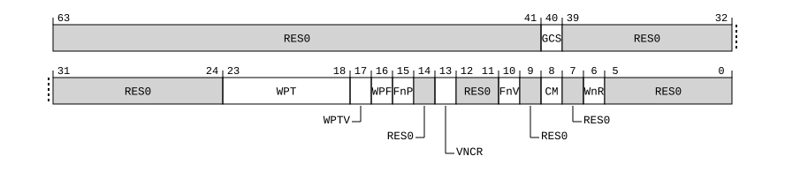

# ​H9.2.30 EDHSR, External Debug Halting Syndrome Register

Source: <https://developer.arm.com/documentation/ddi0487/mc/-Part-H-External-Debug/-Chapter-H9-External-Debug-Register-Descriptions/-H9-2-External-debug-registers/-H9-2-30-EDHSR--External-Debug-Halting-Syndrome-Register>

##### H9.2.30 EDHSR, External Debug Halting Syndrome Register

The EDHSR characteristics are:

Purpose
:   Holds syndrome information for a debug event.

Configuration
:   EDHSR is in the Core power domain

    The value of this register is UNKNOWN if the PE is in Non-debug state, or if [EDSCR](/documentation/ddi0487/mc/-Part-H-External-Debug/-Chapter-H9-External-Debug-Register-Descriptions/-H9-2-External-debug-registers/-H9-2-48-EDSCR--External-Debug-Status-and-Control-Register?lang=en#reg_ext_edscr).STATUS is not `0b101011`.

    This register is present only when FEAT\_EDHSR is implemented. Otherwise, direct accesses to EDHSR are RES0.

Attributes
:   EDHSR is a 64-bit register.

###### Field descriptions

Bits [63:41]
:   Reserved, RES0.

GCS, bit [40]
:   When FEAT\_GCS is implemented and FEAT\_Debugv8p9 is implemented:
    :   Guarded control stack data access.

        Indicates that the Watchpoint debug event is due to a Guarded control stack data access.

<table>
 <colgroup>
  <col/>
  <col/>
 </colgroup>
 <thead>
  <tr>
   <th>
    <strong>
     GCS
    </strong>
   </th>
   <th>
    <strong>
     Meaning
    </strong>
   </th>
  </tr>
 </thead>
 <tbody>
  <tr>
   <td>
    

     <code>
      0b0
     </code>
    

   </td>
   <td>
    

     The Watchpoint debug event is not due to a Guarded control stack data access.
    

   </td>
  </tr>
  <tr>
   <td>
    

     <code>
      0b1
     </code>
    

   </td>
   <td>
    

     The Watchpoint debug event is due to a Guarded control stack data access.
    

   </td>
  </tr>
 </tbody>
</table>

        The reset behavior of this field is:

        - On a Warm reset, this field resets to an architecturally UNKNOWN value.

    Otherwise:
    :   Reserved, RES0.

Bits [39:24]
:   Reserved, RES0.

WPT, bits [23:18]
:   Watchpoint number. When EDHSR.WPTV is 1, holds the index of a watchpoint that triggered the Watchpoint debug event.

    The reset behavior of this field is:

    - On a Warm reset, this field resets to an architecturally UNKNOWN value.

WPTV, bit [17]
:   Watchpoint number valid.

<table>
 <colgroup>
  <col/>
  <col/>
  <col/>
 </colgroup>
 <thead>
  <tr>
   <th>
    <strong>
     WPTV
    </strong>
   </th>
   <th>
    <strong>
     Meaning
    </strong>
   </th>
   <th>
    <strong>
     Applies when
    </strong>
   </th>
  </tr>
 </thead>
 <tbody>
  <tr>
   <td>
    

     <code>
      0b0
     </code>
    

   </td>
   <td>
    

     EDHSR.WPT field is not valid, and holds an
     <small>
      UNKNOWN
     </small>
     value.
    

   </td>
   <td>
    

     FEAT_Debugv8p9 is not implemented
    

   </td>
  </tr>
  <tr>
   <td>
    

     <code>
      0b1
     </code>
    

   </td>
   <td>
    

     EDHSR.WPT field is valid, and holds the number of a watchpoint that triggered the Watchpoint debug event.
    

   </td>
   <td>
   </td>
  </tr>
 </tbody>
</table>

    The reset behavior of this field is:

    - On a Warm reset, this field resets to an architecturally UNKNOWN value.

WPF, bit [16]
:   Watchpoint might be false-positive.

<table>
 <colgroup>
  <col/>
  <col/>
  <col/>
 </colgroup>
 <thead>
  <tr>
   <th>
    <strong>
     WPF
    </strong>
   </th>
   <th>
    <strong>
     Meaning
    </strong>
   </th>
   <th>
    <strong>
     Applies when
    </strong>
   </th>
  </tr>
 </thead>
 <tbody>
  <tr>
   <td>
    

     <code>
      0b0
     </code>
    

   </td>
   <td>
    

     The watchpoint matched an address or address range that was accessed by the instruction.
    

   </td>
   <td>
   </td>
  </tr>
  <tr>
   <td>
    

     <code>
      0b1
     </code>
    

   </td>
   <td>
    

     The watchpoint matched an address or address range that might not have been accessed by the instruction.
    

   </td>
   <td>
    

     FEAT_SVE is implemented or FEAT_SME is implemented
    

   </td>
  </tr>
 </tbody>
</table>

    Arm strongly recommends that this bit is set to 0, other than when one of the following instructions might generate a watchpoint match for an address or address range that the instruction does not access:

    - An SVE contiguous vector load/store instruction, when the PE is in Streaming SVE mode.
    - An SME load/store instruction.

    The reset behavior of this field is:

    - On a Warm reset, this field resets to an architecturally UNKNOWN value.

FnP, bit [15]
:   [EDWAR](/documentation/ddi0487/mc/-Part-H-External-Debug/-Chapter-H9-External-Debug-Register-Descriptions/-H9-2-External-debug-registers/-H9-2-51-EDWAR--External-Debug-Watchpoint-Address-Register?lang=en#reg_ext_edwar) not Precise.

<table>
 <colgroup>
  <col/>
  <col/>
  <col/>
 </colgroup>
 <thead>
  <tr>
   <th>
    <strong>
     FnP
    </strong>
   </th>
   <th>
    <strong>
     Meaning
    </strong>
   </th>
   <th>
    <strong>
     Applies when
    </strong>
   </th>
  </tr>
 </thead>
 <tbody>
  <tr>
   <td>
    

     <code>
      0b0
     </code>
    

   </td>
   <td>
    

     If the
     <a class="document-topic" document-topic-path="/ddi0487/mc/-Part-H-External-Debug/-Chapter-H9-External-Debug-Register-Descriptions/-H9-2-External-debug-registers/-H9-2-51-EDWAR--External-Debug-Watchpoint-Address-Register?lang=en#reg_ext_edwar" href="/documentation/ddi0487/mc/-Part-H-External-Debug/-Chapter-H9-External-Debug-Register-Descriptions/-H9-2-External-debug-registers/-H9-2-51-EDWAR--External-Debug-Watchpoint-Address-Register?lang=en#reg_ext_edwar">
      EDWAR
     </a>
     is valid, it holds the virtual address of an access or sequence of contiguous accesses that triggered the Watchpoint debug event.
    

   </td>
   <td>
   </td>
  </tr>
  <tr>
   <td>
    

     <code>
      0b1
     </code>
    

   </td>
   <td>
    

     If the
     <a class="document-topic" document-topic-path="/ddi0487/mc/-Part-H-External-Debug/-Chapter-H9-External-Debug-Register-Descriptions/-H9-2-External-debug-registers/-H9-2-51-EDWAR--External-Debug-Watchpoint-Address-Register?lang=en#reg_ext_edwar" href="/documentation/ddi0487/mc/-Part-H-External-Debug/-Chapter-H9-External-Debug-Register-Descriptions/-H9-2-External-debug-registers/-H9-2-51-EDWAR--External-Debug-Watchpoint-Address-Register?lang=en#reg_ext_edwar">
      EDWAR
     </a>
     is valid, it holds any virtual address within the smallest implemented translation granule that contains the virtual address of an access or set of contiguous accesses that triggered the Watchpoint debug event.
    

   </td>
   <td>
    

     FEAT_SME is implemented or FEAT_SVE is implemented
    

   </td>
  </tr>
 </tbody>
</table>

    The reset behavior of this field is:

    - On a Warm reset, this field resets to an architecturally UNKNOWN value.

Bit [14]
:   Reserved, RES0.

VNCR, bit [13]
:   When FEAT\_Debugv8p9 is implemented:
    :   [VNCR\_EL2](/documentation/ddi0487/mc/-Part-D-The-AArch64-System-Level-Architecture/-Chapter-D24-AArch64-System-Register-Descriptions/-D24-2-General-system-control-registers/-D24-2-219-VNCR-EL2--Virtual-Nested-Control-Register?lang=en#reg_aarch64_vncr_el2) access. Indicates that the Watchpoint debug event came from use of [VNCR\_EL2](/documentation/ddi0487/mc/-Part-D-The-AArch64-System-Level-Architecture/-Chapter-D24-AArch64-System-Register-Descriptions/-D24-2-General-system-control-registers/-D24-2-219-VNCR-EL2--Virtual-Nested-Control-Register?lang=en#reg_aarch64_vncr_el2) register by EL1 code.

<table>
 <colgroup>
  <col/>
  <col/>
  <col/>
 </colgroup>
 <thead>
  <tr>
   <th>
    <strong>
     VNCR
    </strong>
   </th>
   <th>
    <strong>
     Meaning
    </strong>
   </th>
   <th>
    <strong>
     Applies when
    </strong>
   </th>
  </tr>
 </thead>
 <tbody>
  <tr>
   <td>
    

     <code>
      0b0
     </code>
    

   </td>
   <td>
    

     The Watchpoint debug event was not generated by the use of
     <a class="document-topic" document-topic-path="/ddi0487/mc/-Part-D-The-AArch64-System-Level-Architecture/-Chapter-D24-AArch64-System-Register-Descriptions/-D24-2-General-system-control-registers/-D24-2-219-VNCR-EL2--Virtual-Nested-Control-Register?lang=en#reg_aarch64_vncr_el2" href="/documentation/ddi0487/mc/-Part-D-The-AArch64-System-Level-Architecture/-Chapter-D24-AArch64-System-Register-Descriptions/-D24-2-General-system-control-registers/-D24-2-219-VNCR-EL2--Virtual-Nested-Control-Register?lang=en#reg_aarch64_vncr_el2">
      VNCR_EL2
     </a>
     by EL1 code.
    

   </td>
   <td>
   </td>
  </tr>
  <tr>
   <td>
    

     <code>
      0b1
     </code>
    

   </td>
   <td>
    

     The Watchpoint debug event was generated by the use of
     <a class="document-topic" document-topic-path="/ddi0487/mc/-Part-D-The-AArch64-System-Level-Architecture/-Chapter-D24-AArch64-System-Register-Descriptions/-D24-2-General-system-control-registers/-D24-2-219-VNCR-EL2--Virtual-Nested-Control-Register?lang=en#reg_aarch64_vncr_el2" href="/documentation/ddi0487/mc/-Part-D-The-AArch64-System-Level-Architecture/-Chapter-D24-AArch64-System-Register-Descriptions/-D24-2-General-system-control-registers/-D24-2-219-VNCR-EL2--Virtual-Nested-Control-Register?lang=en#reg_aarch64_vncr_el2">
      VNCR_EL2
     </a>
     by EL1 code.
    

   </td>
   <td>
    

     FEAT_NV2 is implemented
    

   </td>
  </tr>
 </tbody>
</table>

        The reset behavior of this field is:

        - On a Warm reset, this field resets to an architecturally UNKNOWN value.

    Otherwise:
    :   Reserved, RES0.

Bits [12:11]
:   Reserved, RES0.

FnV, bit [10]
:   [EDWAR](/documentation/ddi0487/mc/-Part-H-External-Debug/-Chapter-H9-External-Debug-Register-Descriptions/-H9-2-External-debug-registers/-H9-2-51-EDWAR--External-Debug-Watchpoint-Address-Register?lang=en#reg_ext_edwar) not Valid.

<table>
 <colgroup>
  <col/>
  <col/>
  <col/>
 </colgroup>
 <thead>
  <tr>
   <th>
    <strong>
     FnV
    </strong>
   </th>
   <th>
    <strong>
     Meaning
    </strong>
   </th>
   <th>
    <strong>
     Applies when
    </strong>
   </th>
  </tr>
 </thead>
 <tbody>
  <tr>
   <td>
    

     <code>
      0b0
     </code>
    

   </td>
   <td>
    

     <a class="document-topic" document-topic-path="/ddi0487/mc/-Part-H-External-Debug/-Chapter-H9-External-Debug-Register-Descriptions/-H9-2-External-debug-registers/-H9-2-51-EDWAR--External-Debug-Watchpoint-Address-Register?lang=en#reg_ext_edwar" href="/documentation/ddi0487/mc/-Part-H-External-Debug/-Chapter-H9-External-Debug-Register-Descriptions/-H9-2-External-debug-registers/-H9-2-51-EDWAR--External-Debug-Watchpoint-Address-Register?lang=en#reg_ext_edwar">
      EDWAR
     </a>
     is valid.
    

   </td>
   <td>
   </td>
  </tr>
  <tr>
   <td>
    

     <code>
      0b1
     </code>
    

   </td>
   <td>
    

     <a class="document-topic" document-topic-path="/ddi0487/mc/-Part-H-External-Debug/-Chapter-H9-External-Debug-Register-Descriptions/-H9-2-External-debug-registers/-H9-2-51-EDWAR--External-Debug-Watchpoint-Address-Register?lang=en#reg_ext_edwar" href="/documentation/ddi0487/mc/-Part-H-External-Debug/-Chapter-H9-External-Debug-Register-Descriptions/-H9-2-External-debug-registers/-H9-2-51-EDWAR--External-Debug-Watchpoint-Address-Register?lang=en#reg_ext_edwar">
      EDWAR
     </a>
     is not valid, and holds an
     <small>
      UNKNOWN
     </small>
     value.
    

   </td>
   <td>
    

     FEAT_SME is implemented or FEAT_SVE is implemented
    

   </td>
  </tr>
 </tbody>
</table>

    The reset behavior of this field is:

    - On a Warm reset, this field resets to an architecturally UNKNOWN value.

Bit [9]
:   Reserved, RES0.

CM, bit [8]
:   When FEAT\_Debugv8p9 is implemented:
    :   Cache maintenance. Indicates whether the Watchpoint debug event came from a cache maintenance instruction.

<table>
 <colgroup>
  <col/>
  <col/>
 </colgroup>
 <thead>
  <tr>
   <th>
    <strong>
     CM
    </strong>
   </th>
   <th>
    <strong>
     Meaning
    </strong>
   </th>
  </tr>
 </thead>
 <tbody>
  <tr>
   <td>
    

     <code>
      0b0
     </code>
    

   </td>
   <td>
    

     The Watchpoint debug event was not generated by the execution of one of the System instructions identified in the description of value 1.
    

   </td>
  </tr>
  <tr>
   <td>
    

     <code>
      0b1
     </code>
    

   </td>
   <td>
    

     The Watchpoint debug event was generated by the execution of a cache maintenance instruction. The
     <a class="document-topic" document-topic-path="/ddi0487/mc/-Part-C-The-AArch64-Instruction-Set/-Chapter-C5-The-A64-System-Instruction-Class/-C5-3-A64-System-instructions-for-cache-maintenance/-C5-3-38-DC-ZVA--Data-Cache-Zero-by-VA?lang=en#reg_aarch64_dc_zva" href="/documentation/ddi0487/mc/-Part-C-The-AArch64-Instruction-Set/-Chapter-C5-The-A64-System-Instruction-Class/-C5-3-A64-System-instructions-for-cache-maintenance/-C5-3-38-DC-ZVA--Data-Cache-Zero-by-VA?lang=en#reg_aarch64_dc_zva">
      DC ZVA
     </a>
     ,
     <a class="document-topic" document-topic-path="/ddi0487/mc/-Part-C-The-AArch64-Instruction-Set/-Chapter-C5-The-A64-System-Instruction-Class/-C5-3-A64-System-instructions-for-cache-maintenance/-C5-3-30-DC-GVA--Data-Cache-set-Allocation-Tag-by-VA?lang=en#reg_aarch64_dc_gva" href="/documentation/ddi0487/mc/-Part-C-The-AArch64-Instruction-Set/-Chapter-C5-The-A64-System-Instruction-Class/-C5-3-A64-System-instructions-for-cache-maintenance/-C5-3-30-DC-GVA--Data-Cache-set-Allocation-Tag-by-VA?lang=en#reg_aarch64_dc_gva">
      DC GVA
     </a>
     , and
     <a class="document-topic" document-topic-path="/ddi0487/mc/-Part-C-The-AArch64-Instruction-Set/-Chapter-C5-The-A64-System-Instruction-Class/-C5-3-A64-System-instructions-for-cache-maintenance/-C5-3-31-DC-GZVA--Data-Cache-set-Allocation-Tags-and-Zero-by-VA?lang=en#reg_aarch64_dc_gzva" href="/documentation/ddi0487/mc/-Part-C-The-AArch64-Instruction-Set/-Chapter-C5-The-A64-System-Instruction-Class/-C5-3-A64-System-instructions-for-cache-maintenance/-C5-3-31-DC-GZVA--Data-Cache-set-Allocation-Tags-and-Zero-by-VA?lang=en#reg_aarch64_dc_gzva">
      DC GZVA
     </a>
     instructions are not cache maintenance instructions, and therefore do not cause this field to be set to 1.
    

   </td>
  </tr>
 </tbody>
</table>

        The reset behavior of this field is:

        - On a Warm reset, this field resets to an architecturally UNKNOWN value.

    Otherwise:
    :   Reserved, RES0.

Bit [7]
:   Reserved, RES0.

WnR, bit [6]
:   When FEAT\_Debugv8p9 is implemented:
    :   Write not Read. Indicates whether the Watchpoint debug event was caused by an instruction writing to a memory location, or by an instruction reading from a memory location.

<table>
 <colgroup>
  <col/>
  <col/>
 </colgroup>
 <thead>
  <tr>
   <th>
    <strong>
     WnR
    </strong>
   </th>
   <th>
    <strong>
     Meaning
    </strong>
   </th>
  </tr>
 </thead>
 <tbody>
  <tr>
   <td>
    

     <code>
      0b0
     </code>
    

   </td>
   <td>
    

     Watchpoint debug event caused by an instruction reading from a memory location.
    

   </td>
  </tr>
  <tr>
   <td>
    

     <code>
      0b1
     </code>
    

   </td>
   <td>
    

     Watchpoint debug event caused by an instruction writing to a memory location.
    

   </td>
  </tr>
 </tbody>
</table>

        For Watchpoint debug events on cache maintenance instructions, this field is set to 1.

        For Watchpoint debug events from an atomic instruction, this field is set to 0 if a read of the location would have generated the Watchpoint debug event, otherwise it is set to 1.

        If multiple watchpoints match on the same access, it is UNPREDICTABLE which watchpoint generates the Watchpoint debug event.

        The reset behavior of this field is:

        - On a Warm reset, this field resets to an architecturally UNKNOWN value.

    Otherwise:
    :   Reserved, RES0.

Bits [5:0]
:   Reserved, RES0.

###### Accessing EDHSR

EDHSR can be accessed through the external debug interface:

<table>
 <colgroup>
  <col/>
  <col/>
  <col/>
 </colgroup>
 <thead>
  <tr>
   <th>
    <strong>
     Component
    </strong>
   </th>
   <th>
    <strong>
     Offset
    </strong>
   </th>
   <th>
    <strong>
     Instance
    </strong>
   </th>
  </tr>
 </thead>
 <tbody>
  <tr>
   <td>
    

     Debug
    

   </td>
   <td>
    

     <code>
      0x038
     </code>
    

   </td>
   <td>
    

     EDHSR
    

   </td>
  </tr>
 </tbody>
</table>

Accessible as follows:

- When DoubleLockStatus(), or !IsCorePowered(), or OSLockStatus(), accesses to this register return an ERROR.
- Otherwise, accesses to this register are RO.
