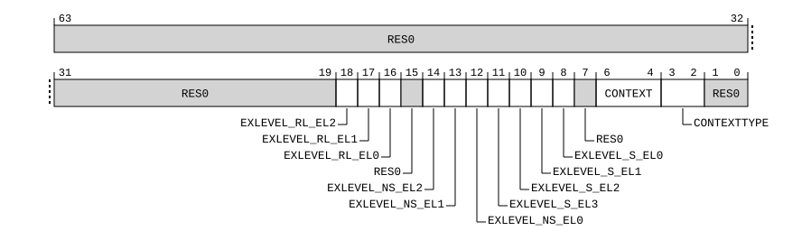

# ​H9.3.1 TRCACATR<n>, Trace Address Comparator Access Type Register <n>, n = 0 - 15

Source: <https://developer.arm.com/documentation/ddi0487/mc/-Part-H-External-Debug/-Chapter-H9-External-Debug-Register-Descriptions/-H9-3-External-trace-registers/-H9-3-1-TRCACATR-n---Trace-Address-Comparator-Access-Type-Register--n---n---0---15>

##### H9.3.1 TRCACATR<n>, Trace Address Comparator Access Type Register <n>, n = 0 - 15

The TRCACATR<n> characteristics are:

Purpose
:   Defines the type of access for the corresponding [TRCACVR<n>](/documentation/ddi0487/mc/-Part-H-External-Debug/-Chapter-H9-External-Debug-Register-Descriptions/-H9-3-External-trace-registers/-H9-3-2-TRCACVR-n---Trace-Address-Comparator-Value-Register--n---n---0---15?lang=en#reg_ext_trcacvrn) Register. This register configures the context type, Exception levels, alignment, masking that is applied by the Address Comparator, and how the Address Comparator behaves when it is one half of an Address Range Comparator.

Configuration
:   External register TRCACATR<n> bits [63:0] are architecturally mapped to AArch64 System register [TRCACATR<n>](/documentation/ddi0487/mc/-Part-D-The-AArch64-System-Level-Architecture/-Chapter-D24-AArch64-System-Register-Descriptions/-D24-4-Trace-registers/-D24-4-11-TRCACATR-n---Trace-Address-Comparator-Access-Type-Register--n---n---0---15?lang=en#reg_aarch64_trcacatrn)[63:0].

    This register is present only when FEAT\_ETE is implemented and FEAT\_TRC\_EXT is implemented. Otherwise, direct accesses to TRCACATR<n> are RES0.

Attributes
:   TRCACATR<n> is a 64-bit register.

###### Field descriptions

Bits [63:19]
:   Reserved, RES0.

EXLEVEL\_RL\_EL2, bit [18]
:   When FEAT\_RME is implemented:
    :   Realm EL2 address comparison control. Controls whether a comparison can occur at EL2 in Realm state.

<table>
 <colgroup>
  <col/>
  <col/>
 </colgroup>
 <thead>
  <tr>
   <th>
    <strong>
     EXLEVEL_RL_EL2
    </strong>
   </th>
   <th>
    <strong>
     Meaning
    </strong>
   </th>
  </tr>
 </thead>
 <tbody>
  <tr>
   <td>
    

     <code>
      0b0
     </code>
    

   </td>
   <td>
    

     When
     <a class="document-topic" document-topic-path="/ddi0487/mc/-Part-H-External-Debug/-Chapter-H9-External-Debug-Register-Descriptions/-H9-3-External-trace-registers/-H9-3-1-TRCACATR-n---Trace-Address-Comparator-Access-Type-Register--n---n---0---15?lang=en#reg_ext_trcacatrn" href="/documentation/ddi0487/mc/-Part-H-External-Debug/-Chapter-H9-External-Debug-Register-Descriptions/-H9-3-External-trace-registers/-H9-3-1-TRCACATR-n---Trace-Address-Comparator-Access-Type-Register--n---n---0---15?lang=en#reg_ext_trcacatrn">
      TRCACATR&lt;n&gt;
     </a>
     .EXLEVEL_NS_EL2 is 0 the Address Comparator performs comparisons in Realm EL2.
    

    

     When
     <a class="document-topic" document-topic-path="/ddi0487/mc/-Part-H-External-Debug/-Chapter-H9-External-Debug-Register-Descriptions/-H9-3-External-trace-registers/-H9-3-1-TRCACATR-n---Trace-Address-Comparator-Access-Type-Register--n---n---0---15?lang=en#reg_ext_trcacatrn" href="/documentation/ddi0487/mc/-Part-H-External-Debug/-Chapter-H9-External-Debug-Register-Descriptions/-H9-3-External-trace-registers/-H9-3-1-TRCACATR-n---Trace-Address-Comparator-Access-Type-Register--n---n---0---15?lang=en#reg_ext_trcacatrn">
      TRCACATR&lt;n&gt;
     </a>
     .EXLEVEL_NS_EL2 is 1 the Address Comparator does not perform comparisons in Realm EL2.
    

   </td>
  </tr>
  <tr>
   <td>
    

     <code>
      0b1
     </code>
    

   </td>
   <td>
    

     When
     <a class="document-topic" document-topic-path="/ddi0487/mc/-Part-H-External-Debug/-Chapter-H9-External-Debug-Register-Descriptions/-H9-3-External-trace-registers/-H9-3-1-TRCACATR-n---Trace-Address-Comparator-Access-Type-Register--n---n---0---15?lang=en#reg_ext_trcacatrn" href="/documentation/ddi0487/mc/-Part-H-External-Debug/-Chapter-H9-External-Debug-Register-Descriptions/-H9-3-External-trace-registers/-H9-3-1-TRCACATR-n---Trace-Address-Comparator-Access-Type-Register--n---n---0---15?lang=en#reg_ext_trcacatrn">
      TRCACATR&lt;n&gt;
     </a>
     .EXLEVEL_NS_EL2 is 0 the Address Comparator does not perform comparisons in Realm EL2.
    

    

     When
     <a class="document-topic" document-topic-path="/ddi0487/mc/-Part-H-External-Debug/-Chapter-H9-External-Debug-Register-Descriptions/-H9-3-External-trace-registers/-H9-3-1-TRCACATR-n---Trace-Address-Comparator-Access-Type-Register--n---n---0---15?lang=en#reg_ext_trcacatrn" href="/documentation/ddi0487/mc/-Part-H-External-Debug/-Chapter-H9-External-Debug-Register-Descriptions/-H9-3-External-trace-registers/-H9-3-1-TRCACATR-n---Trace-Address-Comparator-Access-Type-Register--n---n---0---15?lang=en#reg_ext_trcacatrn">
      TRCACATR&lt;n&gt;
     </a>
     .EXLEVEL_NS_EL2 is 1 the Address Comparator performs comparisons in Realm EL2.
    

   </td>
  </tr>
 </tbody>
</table>

        The reset behavior of this field is:

        - On a Trace unit reset, this field resets to an architecturally UNKNOWN value.

    Otherwise:
    :   Reserved, RES0.

EXLEVEL\_RL\_EL1, bit [17]
:   When FEAT\_RME is implemented:
    :   Realm EL1 address comparison control. Controls whether a comparison can occur at EL1 in Realm state.

<table>
 <colgroup>
  <col/>
  <col/>
 </colgroup>
 <thead>
  <tr>
   <th>
    <strong>
     EXLEVEL_RL_EL1
    </strong>
   </th>
   <th>
    <strong>
     Meaning
    </strong>
   </th>
  </tr>
 </thead>
 <tbody>
  <tr>
   <td>
    

     <code>
      0b0
     </code>
    

   </td>
   <td>
    

     When
     <a class="document-topic" document-topic-path="/ddi0487/mc/-Part-H-External-Debug/-Chapter-H9-External-Debug-Register-Descriptions/-H9-3-External-trace-registers/-H9-3-1-TRCACATR-n---Trace-Address-Comparator-Access-Type-Register--n---n---0---15?lang=en#reg_ext_trcacatrn" href="/documentation/ddi0487/mc/-Part-H-External-Debug/-Chapter-H9-External-Debug-Register-Descriptions/-H9-3-External-trace-registers/-H9-3-1-TRCACATR-n---Trace-Address-Comparator-Access-Type-Register--n---n---0---15?lang=en#reg_ext_trcacatrn">
      TRCACATR&lt;n&gt;
     </a>
     .EXLEVEL_NS_EL1 is 0 the Address Comparator performs comparisons in Realm EL1.
    

    

     When
     <a class="document-topic" document-topic-path="/ddi0487/mc/-Part-H-External-Debug/-Chapter-H9-External-Debug-Register-Descriptions/-H9-3-External-trace-registers/-H9-3-1-TRCACATR-n---Trace-Address-Comparator-Access-Type-Register--n---n---0---15?lang=en#reg_ext_trcacatrn" href="/documentation/ddi0487/mc/-Part-H-External-Debug/-Chapter-H9-External-Debug-Register-Descriptions/-H9-3-External-trace-registers/-H9-3-1-TRCACATR-n---Trace-Address-Comparator-Access-Type-Register--n---n---0---15?lang=en#reg_ext_trcacatrn">
      TRCACATR&lt;n&gt;
     </a>
     .EXLEVEL_NS_EL1 is 1 the Address Comparator does not perform comparisons in Realm EL1.
    

   </td>
  </tr>
  <tr>
   <td>
    

     <code>
      0b1
     </code>
    

   </td>
   <td>
    

     When
     <a class="document-topic" document-topic-path="/ddi0487/mc/-Part-H-External-Debug/-Chapter-H9-External-Debug-Register-Descriptions/-H9-3-External-trace-registers/-H9-3-1-TRCACATR-n---Trace-Address-Comparator-Access-Type-Register--n---n---0---15?lang=en#reg_ext_trcacatrn" href="/documentation/ddi0487/mc/-Part-H-External-Debug/-Chapter-H9-External-Debug-Register-Descriptions/-H9-3-External-trace-registers/-H9-3-1-TRCACATR-n---Trace-Address-Comparator-Access-Type-Register--n---n---0---15?lang=en#reg_ext_trcacatrn">
      TRCACATR&lt;n&gt;
     </a>
     .EXLEVEL_NS_EL1 is 0 the Address Comparator does not perform comparisons in Realm EL1.
    

    

     When
     <a class="document-topic" document-topic-path="/ddi0487/mc/-Part-H-External-Debug/-Chapter-H9-External-Debug-Register-Descriptions/-H9-3-External-trace-registers/-H9-3-1-TRCACATR-n---Trace-Address-Comparator-Access-Type-Register--n---n---0---15?lang=en#reg_ext_trcacatrn" href="/documentation/ddi0487/mc/-Part-H-External-Debug/-Chapter-H9-External-Debug-Register-Descriptions/-H9-3-External-trace-registers/-H9-3-1-TRCACATR-n---Trace-Address-Comparator-Access-Type-Register--n---n---0---15?lang=en#reg_ext_trcacatrn">
      TRCACATR&lt;n&gt;
     </a>
     .EXLEVEL_NS_EL1 is 1 the Address Comparator performs comparisons in Realm EL1.
    

   </td>
  </tr>
 </tbody>
</table>

        The reset behavior of this field is:

        - On a Trace unit reset, this field resets to an architecturally UNKNOWN value.

    Otherwise:
    :   Reserved, RES0.

EXLEVEL\_RL\_EL0, bit [16]
:   When FEAT\_RME is implemented:
    :   Realm EL0 address comparison control. Controls whether a comparison can occur at EL0 in Realm state.

<table>
 <colgroup>
  <col/>
  <col/>
 </colgroup>
 <thead>
  <tr>
   <th>
    <strong>
     EXLEVEL_RL_EL0
    </strong>
   </th>
   <th>
    <strong>
     Meaning
    </strong>
   </th>
  </tr>
 </thead>
 <tbody>
  <tr>
   <td>
    

     <code>
      0b0
     </code>
    

   </td>
   <td>
    

     When
     <a class="document-topic" document-topic-path="/ddi0487/mc/-Part-H-External-Debug/-Chapter-H9-External-Debug-Register-Descriptions/-H9-3-External-trace-registers/-H9-3-1-TRCACATR-n---Trace-Address-Comparator-Access-Type-Register--n---n---0---15?lang=en#reg_ext_trcacatrn" href="/documentation/ddi0487/mc/-Part-H-External-Debug/-Chapter-H9-External-Debug-Register-Descriptions/-H9-3-External-trace-registers/-H9-3-1-TRCACATR-n---Trace-Address-Comparator-Access-Type-Register--n---n---0---15?lang=en#reg_ext_trcacatrn">
      TRCACATR&lt;n&gt;
     </a>
     .EXLEVEL_NS_EL0 is 0 the Address Comparator performs comparisons in Realm EL0.
    

    

     When
     <a class="document-topic" document-topic-path="/ddi0487/mc/-Part-H-External-Debug/-Chapter-H9-External-Debug-Register-Descriptions/-H9-3-External-trace-registers/-H9-3-1-TRCACATR-n---Trace-Address-Comparator-Access-Type-Register--n---n---0---15?lang=en#reg_ext_trcacatrn" href="/documentation/ddi0487/mc/-Part-H-External-Debug/-Chapter-H9-External-Debug-Register-Descriptions/-H9-3-External-trace-registers/-H9-3-1-TRCACATR-n---Trace-Address-Comparator-Access-Type-Register--n---n---0---15?lang=en#reg_ext_trcacatrn">
      TRCACATR&lt;n&gt;
     </a>
     .EXLEVEL_NS_EL0 is 1 the Address Comparator does not perform comparisons in Realm EL0.
    

   </td>
  </tr>
  <tr>
   <td>
    

     <code>
      0b1
     </code>
    

   </td>
   <td>
    

     When
     <a class="document-topic" document-topic-path="/ddi0487/mc/-Part-H-External-Debug/-Chapter-H9-External-Debug-Register-Descriptions/-H9-3-External-trace-registers/-H9-3-1-TRCACATR-n---Trace-Address-Comparator-Access-Type-Register--n---n---0---15?lang=en#reg_ext_trcacatrn" href="/documentation/ddi0487/mc/-Part-H-External-Debug/-Chapter-H9-External-Debug-Register-Descriptions/-H9-3-External-trace-registers/-H9-3-1-TRCACATR-n---Trace-Address-Comparator-Access-Type-Register--n---n---0---15?lang=en#reg_ext_trcacatrn">
      TRCACATR&lt;n&gt;
     </a>
     .EXLEVEL_NS_EL0 is 0 the Address Comparator does not perform comparisons in Realm EL0.
    

    

     When
     <a class="document-topic" document-topic-path="/ddi0487/mc/-Part-H-External-Debug/-Chapter-H9-External-Debug-Register-Descriptions/-H9-3-External-trace-registers/-H9-3-1-TRCACATR-n---Trace-Address-Comparator-Access-Type-Register--n---n---0---15?lang=en#reg_ext_trcacatrn" href="/documentation/ddi0487/mc/-Part-H-External-Debug/-Chapter-H9-External-Debug-Register-Descriptions/-H9-3-External-trace-registers/-H9-3-1-TRCACATR-n---Trace-Address-Comparator-Access-Type-Register--n---n---0---15?lang=en#reg_ext_trcacatrn">
      TRCACATR&lt;n&gt;
     </a>
     .EXLEVEL_NS_EL0 is 1 the Address Comparator performs comparisons in Realm EL0.
    

   </td>
  </tr>
 </tbody>
</table>

        The reset behavior of this field is:

        - On a Trace unit reset, this field resets to an architecturally UNKNOWN value.

    Otherwise:
    :   Reserved, RES0.

Bit [15]
:   Reserved, RES0.

EXLEVEL\_NS\_EL2, bit [14]
:   When Non-secure EL2 is implemented:
    :   Non-secure EL2 address comparison control. Controls whether a comparison can occur at EL2 in Non-secure state.

<table>
 <colgroup>
  <col/>
  <col/>
 </colgroup>
 <thead>
  <tr>
   <th>
    <strong>
     EXLEVEL_NS_EL2
    </strong>
   </th>
   <th>
    <strong>
     Meaning
    </strong>
   </th>
  </tr>
 </thead>
 <tbody>
  <tr>
   <td>
    

     <code>
      0b0
     </code>
    

   </td>
   <td>
    

     The Address Comparator performs comparisons in Non-secure EL2.
    

   </td>
  </tr>
  <tr>
   <td>
    

     <code>
      0b1
     </code>
    

   </td>
   <td>
    

     The Address Comparator does not perform comparisons in Non-secure EL2.
    

   </td>
  </tr>
 </tbody>
</table>

        The reset behavior of this field is:

        - On a Trace unit reset, this field resets to an architecturally UNKNOWN value.

    Otherwise:
    :   Reserved, RES0.

EXLEVEL\_NS\_EL1, bit [13]
:   When Non-secure EL1 is implemented:
    :   Non-secure EL1 address comparison control. Controls whether a comparison can occur at EL1 in Non-secure state.

<table>
 <colgroup>
  <col/>
  <col/>
 </colgroup>
 <thead>
  <tr>
   <th>
    <strong>
     EXLEVEL_NS_EL1
    </strong>
   </th>
   <th>
    <strong>
     Meaning
    </strong>
   </th>
  </tr>
 </thead>
 <tbody>
  <tr>
   <td>
    

     <code>
      0b0
     </code>
    

   </td>
   <td>
    

     The Address Comparator performs comparisons in Non-secure EL1.
    

   </td>
  </tr>
  <tr>
   <td>
    

     <code>
      0b1
     </code>
    

   </td>
   <td>
    

     The Address Comparator does not perform comparisons in Non-secure EL1.
    

   </td>
  </tr>
 </tbody>
</table>

        The reset behavior of this field is:

        - On a Trace unit reset, this field resets to an architecturally UNKNOWN value.

    Otherwise:
    :   Reserved, RES0.

EXLEVEL\_NS\_EL0, bit [12]
:   When Non-secure EL0 is implemented:
    :   Non-secure EL0 address comparison control. Controls whether a comparison can occur at EL0 in Non-secure state.

<table>
 <colgroup>
  <col/>
  <col/>
 </colgroup>
 <thead>
  <tr>
   <th>
    <strong>
     EXLEVEL_NS_EL0
    </strong>
   </th>
   <th>
    <strong>
     Meaning
    </strong>
   </th>
  </tr>
 </thead>
 <tbody>
  <tr>
   <td>
    

     <code>
      0b0
     </code>
    

   </td>
   <td>
    

     The Address Comparator performs comparisons in Non-secure EL0.
    

   </td>
  </tr>
  <tr>
   <td>
    

     <code>
      0b1
     </code>
    

   </td>
   <td>
    

     The Address Comparator does not perform comparisons in Non-secure EL0.
    

   </td>
  </tr>
 </tbody>
</table>

        The reset behavior of this field is:

        - On a Trace unit reset, this field resets to an architecturally UNKNOWN value.

    Otherwise:
    :   Reserved, RES0.

EXLEVEL\_S\_EL3, bit [11]
:   When EL3 is implemented:
    :   EL3 address comparison control. Controls whether a comparison can occur at EL3.

<table>
 <colgroup>
  <col/>
  <col/>
 </colgroup>
 <thead>
  <tr>
   <th>
    <strong>
     EXLEVEL_S_EL3
    </strong>
   </th>
   <th>
    <strong>
     Meaning
    </strong>
   </th>
  </tr>
 </thead>
 <tbody>
  <tr>
   <td>
    

     <code>
      0b0
     </code>
    

   </td>
   <td>
    

     The Address Comparator performs comparisons at EL3.
    

   </td>
  </tr>
  <tr>
   <td>
    

     <code>
      0b1
     </code>
    

   </td>
   <td>
    

     The Address Comparator does not perform comparisons at EL3.
    

   </td>
  </tr>
 </tbody>
</table>

        The reset behavior of this field is:

        - On a Trace unit reset, this field resets to an architecturally UNKNOWN value.

    Otherwise:
    :   Reserved, RES0.

EXLEVEL\_S\_EL2, bit [10]
:   When Secure EL2 is implemented:
    :   Secure EL2 address comparison control. Controls whether a comparison can occur at EL2 in Secure state.

<table>
 <colgroup>
  <col/>
  <col/>
 </colgroup>
 <thead>
  <tr>
   <th>
    <strong>
     EXLEVEL_S_EL2
    </strong>
   </th>
   <th>
    <strong>
     Meaning
    </strong>
   </th>
  </tr>
 </thead>
 <tbody>
  <tr>
   <td>
    

     <code>
      0b0
     </code>
    

   </td>
   <td>
    

     The Address Comparator performs comparisons in Secure EL2.
    

   </td>
  </tr>
  <tr>
   <td>
    

     <code>
      0b1
     </code>
    

   </td>
   <td>
    

     The Address Comparator does not perform comparisons in Secure EL2.
    

   </td>
  </tr>
 </tbody>
</table>

        The reset behavior of this field is:

        - On a Trace unit reset, this field resets to an architecturally UNKNOWN value.

    Otherwise:
    :   Reserved, RES0.

EXLEVEL\_S\_EL1, bit [9]
:   When Secure EL1 is implemented:
    :   Secure EL1 address comparison control. Controls whether a comparison can occur at EL1 in Secure state.

<table>
 <colgroup>
  <col/>
  <col/>
 </colgroup>
 <thead>
  <tr>
   <th>
    <strong>
     EXLEVEL_S_EL1
    </strong>
   </th>
   <th>
    <strong>
     Meaning
    </strong>
   </th>
  </tr>
 </thead>
 <tbody>
  <tr>
   <td>
    

     <code>
      0b0
     </code>
    

   </td>
   <td>
    

     The Address Comparator performs comparisons in Secure EL1.
    

   </td>
  </tr>
  <tr>
   <td>
    

     <code>
      0b1
     </code>
    

   </td>
   <td>
    

     The Address Comparator does not perform comparisons in Secure EL1.
    

   </td>
  </tr>
 </tbody>
</table>

        The reset behavior of this field is:

        - On a Trace unit reset, this field resets to an architecturally UNKNOWN value.

    Otherwise:
    :   Reserved, RES0.

EXLEVEL\_S\_EL0, bit [8]
:   When Secure EL0 is implemented:
    :   Secure EL0 address comparison control. Controls whether a comparison can occur at EL0 in Secure state.

<table>
 <colgroup>
  <col/>
  <col/>
 </colgroup>
 <thead>
  <tr>
   <th>
    <strong>
     EXLEVEL_S_EL0
    </strong>
   </th>
   <th>
    <strong>
     Meaning
    </strong>
   </th>
  </tr>
 </thead>
 <tbody>
  <tr>
   <td>
    

     <code>
      0b0
     </code>
    

   </td>
   <td>
    

     The Address Comparator performs comparisons in Secure EL0.
    

   </td>
  </tr>
  <tr>
   <td>
    

     <code>
      0b1
     </code>
    

   </td>
   <td>
    

     The Address Comparator does not perform comparisons in Secure EL0.
    

   </td>
  </tr>
 </tbody>
</table>

        The reset behavior of this field is:

        - On a Trace unit reset, this field resets to an architecturally UNKNOWN value.

    Otherwise:
    :   Reserved, RES0.

Bit [7]
:   Reserved, RES0.

CONTEXT, bits [6:4]
:   When TRCIDR4.NUMCIDC != '0000' or TRCIDR4.NUMVMIDC != '0000':
    :   Selects a Context Identifier Comparator or Virtual Context Identifier Comparator:

<table>
 <colgroup>
  <col/>
  <col/>
  <col/>
 </colgroup>
 <thead>
  <tr>
   <th>
    <strong>
     CONTEXT
    </strong>
   </th>
   <th>
    <strong>
     Meaning
    </strong>
   </th>
   <th>
    <strong>
     Applies when
    </strong>
   </th>
  </tr>
 </thead>
 <tbody>
  <tr>
   <td>
    

     <code>
      0b000
     </code>
    

   </td>
   <td>
    

     Comparator 0.
    

   </td>
   <td>
   </td>
  </tr>
  <tr>
   <td>
    

     <code>
      0b001
     </code>
    

   </td>
   <td>
    

     Comparator 1.
    

   </td>
   <td>
    

     UInt(TRCIDR4.NUMCIDC) &gt; 1 or UInt(TRCIDR4.NUMVMIDC) &gt; 1
    

   </td>
  </tr>
  <tr>
   <td>
    

     <code>
      0b010
     </code>
    

   </td>
   <td>
    

     Comparator 2.
    

   </td>
   <td>
    

     UInt(TRCIDR4.NUMCIDC) &gt; 2 or UInt(TRCIDR4.NUMVMIDC) &gt; 2
    

   </td>
  </tr>
  <tr>
   <td>
    

     <code>
      0b011
     </code>
    

   </td>
   <td>
    

     Comparator 3.
    

   </td>
   <td>
    

     UInt(TRCIDR4.NUMCIDC) &gt; 3 or UInt(TRCIDR4.NUMVMIDC) &gt; 3
    

   </td>
  </tr>
  <tr>
   <td>
    

     <code>
      0b100
     </code>
    

   </td>
   <td>
    

     Comparator 4.
    

   </td>
   <td>
    

     UInt(TRCIDR4.NUMCIDC) &gt; 4 or UInt(TRCIDR4.NUMVMIDC) &gt; 4
    

   </td>
  </tr>
  <tr>
   <td>
    

     <code>
      0b101
     </code>
    

   </td>
   <td>
    

     Comparator 5.
    

   </td>
   <td>
    

     UInt(TRCIDR4.NUMCIDC) &gt; 5 or UInt(TRCIDR4.NUMVMIDC) &gt; 5
    

   </td>
  </tr>
  <tr>
   <td>
    

     <code>
      0b110
     </code>
    

   </td>
   <td>
    

     Comparator 6.
    

   </td>
   <td>
    

     UInt(TRCIDR4.NUMCIDC) &gt; 6 or UInt(TRCIDR4.NUMVMIDC) &gt; 6
    

   </td>
  </tr>
  <tr>
   <td>
    

     <code>
      0b111
     </code>
    

   </td>
   <td>
    

     Comparator 7.
    

   </td>
   <td>
    

     UInt(TRCIDR4.NUMCIDC) &gt; 7 or UInt(TRCIDR4.NUMVMIDC) &gt; 7
    

   </td>
  </tr>
 </tbody>
</table>

        The width of this field is dependent on the maximum number of Context Identifier Comparators or Virtual Context Identifier Comparators implemented. Unimplemented bits are RES0.

        The reset behavior of this field is:

        - On a Trace unit reset, this field resets to an architecturally UNKNOWN value.

    Otherwise:
    :   Reserved, RES0.

CONTEXTTYPE, bits [3:2]
:   When TRCIDR4.NUMCIDC != '0000' or TRCIDR4.NUMVMIDC != '0000':
    :   Controls whether the Address Comparator is dependent on a Context Identifier Comparator, a Virtual Context Identifier Comparator, or both comparisons.

<table>
 <colgroup>
  <col/>
  <col/>
  <col/>
 </colgroup>
 <thead>
  <tr>
   <th>
    <strong>
     CONTEXTTYPE
    </strong>
   </th>
   <th>
    <strong>
     Meaning
    </strong>
   </th>
   <th>
    <strong>
     Applies when
    </strong>
   </th>
  </tr>
 </thead>
 <tbody>
  <tr>
   <td>
    

     <code>
      0b00
     </code>
    

   </td>
   <td>
    

     The Address Comparator is not dependent on the Context Identifier Comparators or Virtual Context Identifier Comparators.
    

   </td>
   <td>
   </td>
  </tr>
  <tr>
   <td>
    

     <code>
      0b01
     </code>
    

   </td>
   <td>
    

     The Address Comparator is dependent on the Context Identifier Comparator that
     <a class="document-topic" document-topic-path="/ddi0487/mc/-Part-H-External-Debug/-Chapter-H9-External-Debug-Register-Descriptions/-H9-3-External-trace-registers/-H9-3-1-TRCACATR-n---Trace-Address-Comparator-Access-Type-Register--n---n---0---15?lang=en#reg_ext_trcacatrn" href="/documentation/ddi0487/mc/-Part-H-External-Debug/-Chapter-H9-External-Debug-Register-Descriptions/-H9-3-External-trace-registers/-H9-3-1-TRCACATR-n---Trace-Address-Comparator-Access-Type-Register--n---n---0---15?lang=en#reg_ext_trcacatrn">
      TRCACATR&lt;n&gt;
     </a>
     .CONTEXT specifies. The Address Comparator signals a match only if both the Context Identifier Comparator and the address comparison match.
    

   </td>
   <td>
    

     TRCIDR4.NUMCIDC != &lsquo;0000&rsquo;
    

   </td>
  </tr>
  <tr>
   <td>
    

     <code>
      0b10
     </code>
    

   </td>
   <td>
    

     The Address Comparator is dependent on the Virtual Context Identifier Comparator that
     <a class="document-topic" document-topic-path="/ddi0487/mc/-Part-H-External-Debug/-Chapter-H9-External-Debug-Register-Descriptions/-H9-3-External-trace-registers/-H9-3-1-TRCACATR-n---Trace-Address-Comparator-Access-Type-Register--n---n---0---15?lang=en#reg_ext_trcacatrn" href="/documentation/ddi0487/mc/-Part-H-External-Debug/-Chapter-H9-External-Debug-Register-Descriptions/-H9-3-External-trace-registers/-H9-3-1-TRCACATR-n---Trace-Address-Comparator-Access-Type-Register--n---n---0---15?lang=en#reg_ext_trcacatrn">
      TRCACATR&lt;n&gt;
     </a>
     .CONTEXT specifies. The Address Comparator signals a match only if both the Virtual Context Identifier Comparator and the address comparison match.
    

   </td>
   <td>
    

     TRCIDR4.NUMVMIDC != &lsquo;0000&rsquo;
    

   </td>
  </tr>
  <tr>
   <td>
    

     <code>
      0b11
     </code>
    

   </td>
   <td>
    

     The Address Comparator is dependent on the Context Identifier Comparator and Virtual Context Identifier Comparator that
     <a class="document-topic" document-topic-path="/ddi0487/mc/-Part-H-External-Debug/-Chapter-H9-External-Debug-Register-Descriptions/-H9-3-External-trace-registers/-H9-3-1-TRCACATR-n---Trace-Address-Comparator-Access-Type-Register--n---n---0---15?lang=en#reg_ext_trcacatrn" href="/documentation/ddi0487/mc/-Part-H-External-Debug/-Chapter-H9-External-Debug-Register-Descriptions/-H9-3-External-trace-registers/-H9-3-1-TRCACATR-n---Trace-Address-Comparator-Access-Type-Register--n---n---0---15?lang=en#reg_ext_trcacatrn">
      TRCACATR&lt;n&gt;
     </a>
     .CONTEXT specifies. The Address Comparator signals a match only if the Context Identifier Comparator, the Virtual Context Identifier Comparator, and address comparison all match.
    

   </td>
   <td>
    

     TRCIDR4.NUMCIDC != &lsquo;0000&rsquo; and TRCIDR4.NUMVMIDC != &lsquo;0000&rsquo;
    

   </td>
  </tr>
 </tbody>
</table>

        If [TRCIDR4](/documentation/ddi0487/mc/-Part-H-External-Debug/-Chapter-H9-External-Debug-Register-Descriptions/-H9-3-External-trace-registers/-H9-3-37-TRCIDR4--Trace-ID-Register-4?lang=en#reg_ext_trcidr4).NUMCIDC == `0b0000`, then bit [2] is RES0.

        If [TRCIDR4](/documentation/ddi0487/mc/-Part-H-External-Debug/-Chapter-H9-External-Debug-Register-Descriptions/-H9-3-External-trace-registers/-H9-3-37-TRCIDR4--Trace-ID-Register-4?lang=en#reg_ext_trcidr4).NUMVMIDC == `0b0000`, then bit [3] is RES0.

        The reset behavior of this field is:

        - On a Trace unit reset, this field resets to an architecturally UNKNOWN value.

    Otherwise:
    :   Reserved, RES0.

Bits [1:0]
:   Reserved, RES0.

###### Accessing TRCACATR<n>

Must be programmed if any of the following are true:

- [TRCBBCTLR](/documentation/ddi0487/mc/-Part-H-External-Debug/-Chapter-H9-External-Debug-Register-Descriptions/-H9-3-External-trace-registers/-H9-3-5-TRCBBCTLR--Trace-Branch-Broadcast-Control-Register?lang=en#reg_ext_trcbbctlr).RANGE[n/2] == 1.
- [TRCRSCTLR<a>](/documentation/ddi0487/mc/-Part-H-External-Debug/-Chapter-H9-External-Debug-Register-Descriptions/-H9-3-External-trace-registers/-H9-3-62-TRCRSCTLR-n---Trace-Resource-Selection-Control-Register--n---n---2---31?lang=en#reg_ext_trcrsctlrn).GROUP == `0b0100` and [TRCRSCTLR<a>](/documentation/ddi0487/mc/-Part-H-External-Debug/-Chapter-H9-External-Debug-Register-Descriptions/-H9-3-External-trace-registers/-H9-3-62-TRCRSCTLR-n---Trace-Resource-Selection-Control-Register--n---n---2---31?lang=en#reg_ext_trcrsctlrn).SAC[n] == 1.
- [TRCRSCTLR<a>](/documentation/ddi0487/mc/-Part-H-External-Debug/-Chapter-H9-External-Debug-Register-Descriptions/-H9-3-External-trace-registers/-H9-3-62-TRCRSCTLR-n---Trace-Resource-Selection-Control-Register--n---n---2---31?lang=en#reg_ext_trcrsctlrn).GROUP == `0b0101` and [TRCRSCTLR<a>](/documentation/ddi0487/mc/-Part-H-External-Debug/-Chapter-H9-External-Debug-Register-Descriptions/-H9-3-External-trace-registers/-H9-3-62-TRCRSCTLR-n---Trace-Resource-Selection-Control-Register--n---n---2---31?lang=en#reg_ext_trcrsctlrn).ARC[n/2] == 1.
- [TRCVIIECTLR](/documentation/ddi0487/mc/-Part-H-External-Debug/-Chapter-H9-External-Debug-Register-Descriptions/-H9-3-External-trace-registers/-H9-3-76-TRCVIIECTLR--Trace-ViewInst-Include-Exclude-Control-Register?lang=en#reg_ext_trcviiectlr).EXCLUDE[n/2] == 1.
- [TRCVIIECTLR](/documentation/ddi0487/mc/-Part-H-External-Debug/-Chapter-H9-External-Debug-Register-Descriptions/-H9-3-External-trace-registers/-H9-3-76-TRCVIIECTLR--Trace-ViewInst-Include-Exclude-Control-Register?lang=en#reg_ext_trcviiectlr).INCLUDE[n/2] == 1.
- [TRCVISSCTLR](/documentation/ddi0487/mc/-Part-H-External-Debug/-Chapter-H9-External-Debug-Register-Descriptions/-H9-3-External-trace-registers/-H9-3-78-TRCVISSCTLR--Trace-ViewInst-Start-Stop-Control-Register?lang=en#reg_ext_trcvissctlr).START[n] == 1.
- [TRCVISSCTLR](/documentation/ddi0487/mc/-Part-H-External-Debug/-Chapter-H9-External-Debug-Register-Descriptions/-H9-3-External-trace-registers/-H9-3-78-TRCVISSCTLR--Trace-ViewInst-Start-Stop-Control-Register?lang=en#reg_ext_trcvissctlr).STOP[n] == 1.
- TRCSSCCR<>.ARC[n/2] == 1.
- TRCSSCCR<>.SAC[n] == 1.
- [TRCQCTLR](/documentation/ddi0487/mc/-Part-H-External-Debug/-Chapter-H9-External-Debug-Register-Descriptions/-H9-3-External-trace-registers/-H9-3-61-TRCQCTLR--Trace-Q-Element-Control-Register?lang=en#reg_ext_trcqctlr).RANGE[n/2] == 1.

If the trace unit is not in the Idle state it is CONSTRAINED UNPREDICTABLE whether writes to this register are ignored.

TRCACATR<n> can be accessed through the external debug interface:

<table>
 <colgroup>
  <col/>
  <col/>
  <col/>
 </colgroup>
 <thead>
  <tr>
   <th>
    <strong>
     Component
    </strong>
   </th>
   <th>
    <strong>
     Offset
    </strong>
   </th>
   <th>
    <strong>
     Instance
    </strong>
   </th>
  </tr>
 </thead>
 <tbody>
  <tr>
   <td>
    

     ETE
    

   </td>
   <td>
    

     <code>
      0x480 + (8 * n)
     </code>
    

   </td>
   <td>
    

     TRCACATR&lt;n&gt;
    

   </td>
  </tr>
 </tbody>
</table>

Accessible as follows:

- When OSLockStatus(), or !AllowExternalTraceAccess(addrdesc), or !IsTraceCorePowered(), accesses to this register return an ERROR.
- When n >= (NUM\_TRACE\_ADDRESS\_COMPARATOR\_PAIRS \* 2), accesses to this register are RES0.
- Otherwise, accesses to this register are RW.
