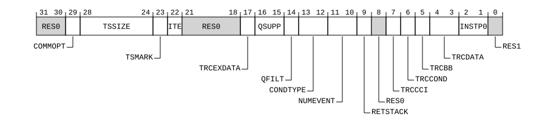

# ​H9.3.29 TRCIDR0, Trace ID Register 0

Source: <https://developer.arm.com/documentation/ddi0487/mc/-Part-H-External-Debug/-Chapter-H9-External-Debug-Register-Descriptions/-H9-3-External-trace-registers/-H9-3-29-TRCIDR0--Trace-ID-Register-0>

##### H9.3.29 TRCIDR0, Trace ID Register 0

The TRCIDR0 characteristics are:

Purpose
:   Returns the tracing capabilities of the trace unit.

Configuration
:   External register TRCIDR0 bits [31:0] are architecturally mapped to AArch64 System register [TRCIDR0](/documentation/ddi0487/mc/-Part-D-The-AArch64-System-Level-Architecture/-Chapter-D24-AArch64-System-Register-Descriptions/-D24-4-Trace-registers/-D24-4-31-TRCIDR0--Trace-ID-Register-0?lang=en#reg_aarch64_trcidr0)[31:0].

    This register is present only when FEAT\_ETE is implemented and FEAT\_TRC\_EXT is implemented. Otherwise, direct accesses to TRCIDR0 are RES0.

Attributes
:   TRCIDR0 is a 32-bit register.

###### Field descriptions

Bits [31:30]
:   Reserved, RES0.

COMMOPT, bit [29]
:   Indicates the contents and encodings of Cycle count packets.

    The value of this field is an IMPLEMENTATION DEFINED choice of:

<table>
 <colgroup>
  <col/>
  <col/>
 </colgroup>
 <thead>
  <tr>
   <th>
    <strong>
     COMMOPT
    </strong>
   </th>
   <th>
    <strong>
     Meaning
    </strong>
   </th>
  </tr>
 </thead>
 <tbody>
  <tr>
   <td>
    

     <code>
      0b0
     </code>
    

   </td>
   <td>
    

     Commit mode 0.
    

   </td>
  </tr>
  <tr>
   <td>
    

     <code>
      0b1
     </code>
    

   </td>
   <td>
    

     Commit mode 1.
    

   </td>
  </tr>
 </tbody>
</table>

    The Commit mode defines the contents and encodings of Cycle Count packets, in particular how Commit elements are indicated by these packets. See the descriptions of these packets for more details.

    Accessing this field has the following behavior:

    - Access to this field is RAO/WI if all of the following are true:
      - TRCIDR0.TRCCCI == ‘1’
      - UInt(TRCIDR8.MAXSPEC) == `0x0`
    - When TRCIDR0.TRCCCI == ‘0’, access to this field is RAZ/WI.
    - Otherwise, access to this field is RO.

TSSIZE, bits [28:24]
:   Indicates that the trace unit implements Global timestamping and the size of the timestamp value.

    The value of this field is an IMPLEMENTATION DEFINED choice of:

<table>
 <colgroup>
  <col/>
  <col/>
 </colgroup>
 <thead>
  <tr>
   <th>
    <strong>
     TSSIZE
    </strong>
   </th>
   <th>
    <strong>
     Meaning
    </strong>
   </th>
  </tr>
 </thead>
 <tbody>
  <tr>
   <td>
    

     <code>
      0b00000
     </code>
    

   </td>
   <td>
    

     Global timestamping not implemented.
    

   </td>
  </tr>
  <tr>
   <td>
    

     <code>
      0b01000
     </code>
    

   </td>
   <td>
    

     Global timestamping implemented with a 64-bit timestamp value.
    

   </td>
  </tr>
 </tbody>
</table>

    All other values are reserved.

    When FEAT\_ETE is implemented, the only permitted value is `0b01000`.

    Access to this field is RO.

TSMARK, bit [23]
:   Indicates whether Timestamp Marker elements are generated.

    The value of this field is an IMPLEMENTATION DEFINED choice of:

<table>
 <colgroup>
  <col/>
  <col/>
 </colgroup>
 <thead>
  <tr>
   <th>
    <strong>
     TSMARK
    </strong>
   </th>
   <th>
    <strong>
     Meaning
    </strong>
   </th>
  </tr>
 </thead>
 <tbody>
  <tr>
   <td>
    

     <code>
      0b0
     </code>
    

   </td>
   <td>
    

     Timestamp Marker elements are not generated.
    

   </td>
  </tr>
  <tr>
   <td>
    

     <code>
      0b1
     </code>
    

   </td>
   <td>
    

     Timestamp Marker elements are generated.
    

   </td>
  </tr>
 </tbody>
</table>

    Access to this field is RO.

ITE, bit [22]
:   Indicates whether Instrumentation Trace is implemented.

    The value of this field is an IMPLEMENTATION DEFINED choice of:

<table>
 <colgroup>
  <col/>
  <col/>
 </colgroup>
 <thead>
  <tr>
   <th>
    <strong>
     ITE
    </strong>
   </th>
   <th>
    <strong>
     Meaning
    </strong>
   </th>
  </tr>
 </thead>
 <tbody>
  <tr>
   <td>
    

     <code>
      0b0
     </code>
    

   </td>
   <td>
    

     Instrumentation Trace not implemented.
    

   </td>
  </tr>
  <tr>
   <td>
    

     <code>
      0b1
     </code>
    

   </td>
   <td>
    

     Instrumentation Trace implemented.
    

   </td>
  </tr>
 </tbody>
</table>

    This field has the value 1 if FEAT\_ITE is implemented.

    Access to this field is RO.

Bits [21:18]
:   Reserved, RES0.

TRCEXDATA, bit [17]
:   When TRCIDR0.TRCDATA != '00':
    :   Indicates if the trace unit implements tracing of data transfers for exceptions and exception returns. Data tracing is not implemented in ETE and this field is reserved for other trace architectures. Allocated in other trace architectures.

        The value of this field is an IMPLEMENTATION DEFINED choice of:

<table>
 <colgroup>
  <col/>
  <col/>
 </colgroup>
 <thead>
  <tr>
   <th>
    <strong>
     TRCEXDATA
    </strong>
   </th>
   <th>
    <strong>
     Meaning
    </strong>
   </th>
  </tr>
 </thead>
 <tbody>
  <tr>
   <td>
    

     <code>
      0b0
     </code>
    

   </td>
   <td>
    

     Tracing of data transfers for exceptions and exception returns not implemented.
    

   </td>
  </tr>
  <tr>
   <td>
    

     <code>
      0b1
     </code>
    

   </td>
   <td>
    

     Tracing of data transfers for exceptions and exception returns implemented.
    

   </td>
  </tr>
 </tbody>
</table>

        Access to this field is RO.

    Otherwise:
    :   Reserved, RES0.

QSUPP, bits [16:15]
:   Indicates that the trace unit implements Q element support.

    The value of this field is an IMPLEMENTATION DEFINED choice of:

<table>
 <colgroup>
  <col/>
  <col/>
 </colgroup>
 <thead>
  <tr>
   <th>
    <strong>
     QSUPP
    </strong>
   </th>
   <th>
    <strong>
     Meaning
    </strong>
   </th>
  </tr>
 </thead>
 <tbody>
  <tr>
   <td>
    

     <code>
      0b00
     </code>
    

   </td>
   <td>
    

     Q element support is not implemented.
    

   </td>
  </tr>
  <tr>
   <td>
    

     <code>
      0b01
     </code>
    

   </td>
   <td>
    

     Q element support is implemented, and only supports Q elements with instruction counts.
    

   </td>
  </tr>
  <tr>
   <td>
    

     <code>
      0b10
     </code>
    

   </td>
   <td>
    

     Q element support is implemented, and only supports Q elements without instruction counts.
    

   </td>
  </tr>
  <tr>
   <td>
    

     <code>
      0b11
     </code>
    

   </td>
   <td>
    

     Q element support is implemented, and supports:
    

    <ul>
     <li>
      

       Q elements with instruction counts.
      

     </li>
     <li>
      

       Q elements without instruction counts.
      

     </li>
    </ul>
   </td>
  </tr>
 </tbody>
</table>

    Access to this field is RO.

QFILT, bit [14]
:   Indicates if the trace unit implements Q element filtering.

    The value of this field is an IMPLEMENTATION DEFINED choice of:

<table>
 <colgroup>
  <col/>
  <col/>
 </colgroup>
 <thead>
  <tr>
   <th>
    <strong>
     QFILT
    </strong>
   </th>
   <th>
    <strong>
     Meaning
    </strong>
   </th>
  </tr>
 </thead>
 <tbody>
  <tr>
   <td>
    

     <code>
      0b0
     </code>
    

   </td>
   <td>
    

     Q element filtering is not implemented.
    

   </td>
  </tr>
  <tr>
   <td>
    

     <code>
      0b1
     </code>
    

   </td>
   <td>
    

     Q element filtering is implemented.
    

   </td>
  </tr>
 </tbody>
</table>

    If TRCIDR0.QSUPP == `0b00` then this field is 0.

    Access to this field is RO.

CONDTYPE, bits [13:12]
:   When TRCIDR0.TRCCOND == '1':
    :   Indicates how conditional instructions are traced. Conditional instruction tracing is not implemented in ETE and this field is reserved for other trace architectures. Allocated in other trace architectures.

        The value of this field is an IMPLEMENTATION DEFINED choice of:

<table>
 <colgroup>
  <col/>
  <col/>
 </colgroup>
 <thead>
  <tr>
   <th>
    <strong>
     CONDTYPE
    </strong>
   </th>
   <th>
    <strong>
     Meaning
    </strong>
   </th>
  </tr>
 </thead>
 <tbody>
  <tr>
   <td>
    

     <code>
      0b00
     </code>
    

   </td>
   <td>
    

     Conditional instructions are traced with an indication of whether they pass or fail their condition code check.
    

   </td>
  </tr>
  <tr>
   <td>
    

     <code>
      0b01
     </code>
    

   </td>
   <td>
    

     Conditional instructions are traced with an indication of the
     <a class="document-topic" document-topic-path="/ddi0487/mc/-Part-G-The-AArch32-System-Level-Architecture/-Chapter-G8-AArch32-System-Register-Descriptions/-G8-2-General-system-control-registers/-G8-2-8-APSR--Application-Program-Status-Register?lang=en#reg_aarch32_apsr" href="/documentation/ddi0487/mc/-Part-G-The-AArch32-System-Level-Architecture/-Chapter-G8-AArch32-System-Register-Descriptions/-G8-2-General-system-control-registers/-G8-2-8-APSR--Application-Program-Status-Register?lang=en#reg_aarch32_apsr">
      APSR
     </a>
     condition flags.
    

   </td>
  </tr>
 </tbody>
</table>

        All other values are reserved.

        Access to this field is RO.

    Otherwise:
    :   Reserved, RES0.

NUMEVENT, bits [11:10]
:   When TRCIDR4.NUMRSPAIR == '0000':
    :   Indicates the number of ETEEvents implemented.

<table>
 <colgroup>
  <col/>
  <col/>
 </colgroup>
 <thead>
  <tr>
   <th>
    <strong>
     NUMEVENT
    </strong>
   </th>
   <th>
    <strong>
     Meaning
    </strong>
   </th>
  </tr>
 </thead>
 <tbody>
  <tr>
   <td>
    

     <code>
      0b00
     </code>
    

   </td>
   <td>
    

     The trace unit supports 0 ETEEvents.
    

   </td>
  </tr>
 </tbody>
</table>

        All other values are reserved.

        Access to this field is RO.

    When TRCIDR4.NUMRSPAIR != '0000':
    :   Indicates the number of ETEEvents implemented.

        The value of this field is an IMPLEMENTATION DEFINED choice of:

<table>
 <colgroup>
  <col/>
  <col/>
 </colgroup>
 <thead>
  <tr>
   <th>
    <strong>
     NUMEVENT
    </strong>
   </th>
   <th>
    <strong>
     Meaning
    </strong>
   </th>
  </tr>
 </thead>
 <tbody>
  <tr>
   <td>
    

     <code>
      0b00
     </code>
    

   </td>
   <td>
    

     The trace unit supports 1 ETEEvent.
    

   </td>
  </tr>
  <tr>
   <td>
    

     <code>
      0b01
     </code>
    

   </td>
   <td>
    

     The trace unit supports 2 ETEEvents.
    

   </td>
  </tr>
  <tr>
   <td>
    

     <code>
      0b10
     </code>
    

   </td>
   <td>
    

     The trace unit supports 3 ETEEvents.
    

   </td>
  </tr>
  <tr>
   <td>
    

     <code>
      0b11
     </code>
    

   </td>
   <td>
    

     The trace unit supports 4 ETEEvents.
    

   </td>
  </tr>
 </tbody>
</table>

        Access to this field is RO.

    Otherwise:
    :   Reserved, RES0.

RETSTACK, bit [9]
:   Indicates if the trace unit supports the return stack.

    The value of this field is an IMPLEMENTATION DEFINED choice of:

<table>
 <colgroup>
  <col/>
  <col/>
 </colgroup>
 <thead>
  <tr>
   <th>
    <strong>
     RETSTACK
    </strong>
   </th>
   <th>
    <strong>
     Meaning
    </strong>
   </th>
  </tr>
 </thead>
 <tbody>
  <tr>
   <td>
    

     <code>
      0b0
     </code>
    

   </td>
   <td>
    

     Return stack not implemented.
    

   </td>
  </tr>
  <tr>
   <td>
    

     <code>
      0b1
     </code>
    

   </td>
   <td>
    

     Return stack implemented.
    

   </td>
  </tr>
 </tbody>
</table>

    Access to this field is RO.

Bit [8]
:   Reserved, RES0.

TRCCCI, bit [7]
:   Indicates if the trace unit implements cycle counting.

    The value of this field is an IMPLEMENTATION DEFINED choice of:

<table>
 <colgroup>
  <col/>
  <col/>
 </colgroup>
 <thead>
  <tr>
   <th>
    <strong>
     TRCCCI
    </strong>
   </th>
   <th>
    <strong>
     Meaning
    </strong>
   </th>
  </tr>
 </thead>
 <tbody>
  <tr>
   <td>
    

     <code>
      0b0
     </code>
    

   </td>
   <td>
    

     Cycle counting not implemented.
    

   </td>
  </tr>
  <tr>
   <td>
    

     <code>
      0b1
     </code>
    

   </td>
   <td>
    

     Cycle counting implemented.
    

   </td>
  </tr>
 </tbody>
</table>

    When FEAT\_ETE is implemented, the only permitted value is 1.

    Access to this field is RO.

TRCCOND, bit [6]
:   Indicates if the trace unit implements conditional instruction tracing. Conditional instruction tracing is not implemented in ETE and this field is reserved for other trace architectures.

    The value of this field is an IMPLEMENTATION DEFINED choice of:

<table>
 <colgroup>
  <col/>
  <col/>
 </colgroup>
 <thead>
  <tr>
   <th>
    <strong>
     TRCCOND
    </strong>
   </th>
   <th>
    <strong>
     Meaning
    </strong>
   </th>
  </tr>
 </thead>
 <tbody>
  <tr>
   <td>
    

     <code>
      0b0
     </code>
    

   </td>
   <td>
    

     Conditional instruction tracing not implemented.
    

   </td>
  </tr>
  <tr>
   <td>
    

     <code>
      0b1
     </code>
    

   </td>
   <td>
    

     Conditional instruction tracing implemented.
    

   </td>
  </tr>
 </tbody>
</table>

    When FEAT\_ETE is implemented, the only permitted value is 0.

    Access to this field is RO.

TRCBB, bit [5]
:   Indicates if the trace unit implements branch broadcasting.

    The value of this field is an IMPLEMENTATION DEFINED choice of:

<table>
 <colgroup>
  <col/>
  <col/>
 </colgroup>
 <thead>
  <tr>
   <th>
    <strong>
     TRCBB
    </strong>
   </th>
   <th>
    <strong>
     Meaning
    </strong>
   </th>
  </tr>
 </thead>
 <tbody>
  <tr>
   <td>
    

     <code>
      0b0
     </code>
    

   </td>
   <td>
    

     Branch broadcasting not implemented.
    

   </td>
  </tr>
  <tr>
   <td>
    

     <code>
      0b1
     </code>
    

   </td>
   <td>
    

     Branch broadcasting implemented.
    

   </td>
  </tr>
 </tbody>
</table>

    When FEAT\_ETE is implemented, the only permitted value is 1.

    Access to this field is RO.

TRCDATA, bits [4:3]
:   Indicates if the trace unit implements data tracing. Data tracing is not implemented in ETE and this field is reserved for other trace architectures.

    The value of this field is an IMPLEMENTATION DEFINED choice of:

<table>
 <colgroup>
  <col/>
  <col/>
 </colgroup>
 <thead>
  <tr>
   <th>
    <strong>
     TRCDATA
    </strong>
   </th>
   <th>
    <strong>
     Meaning
    </strong>
   </th>
  </tr>
 </thead>
 <tbody>
  <tr>
   <td>
    

     <code>
      0b00
     </code>
    

   </td>
   <td>
    

     Data tracing not implemented.
    

   </td>
  </tr>
  <tr>
   <td>
    

     <code>
      0b11
     </code>
    

   </td>
   <td>
    

     Data tracing implemented.
    

   </td>
  </tr>
 </tbody>
</table>

    All other values are reserved.

    When FEAT\_ETE is implemented, the only permitted value is `0b00`.

    Access to this field is RO.

INSTP0, bits [2:1]
:   Indicates if load and store instructions are P0 instructions. Load and store instructions as P0 instructions is not implemented in ETE and this field is reserved for other trace architectures.

    The value of this field is an IMPLEMENTATION DEFINED choice of:

<table>
 <colgroup>
  <col/>
  <col/>
 </colgroup>
 <thead>
  <tr>
   <th>
    <strong>
     INSTP0
    </strong>
   </th>
   <th>
    <strong>
     Meaning
    </strong>
   </th>
  </tr>
 </thead>
 <tbody>
  <tr>
   <td>
    

     <code>
      0b00
     </code>
    

   </td>
   <td>
    

     Load and store instructions are not P0 instructions.
    

   </td>
  </tr>
  <tr>
   <td>
    

     <code>
      0b11
     </code>
    

   </td>
   <td>
    

     Load and store instructions are P0 instructions.
    

   </td>
  </tr>
 </tbody>
</table>

    All other values are reserved.

    When FEAT\_ETE is implemented, the only permitted value is `0b00`.

    Access to this field is RO.

Bit [0]
:   Reserved, RES1.

###### Accessing TRCIDR0

TRCIDR0 can be accessed through the external debug interface:

<table>
 <colgroup>
  <col/>
  <col/>
  <col/>
 </colgroup>
 <thead>
  <tr>
   <th>
    <strong>
     Component
    </strong>
   </th>
   <th>
    <strong>
     Offset
    </strong>
   </th>
   <th>
    <strong>
     Instance
    </strong>
   </th>
  </tr>
 </thead>
 <tbody>
  <tr>
   <td>
    

     ETE
    

   </td>
   <td>
    

     <code>
      0x1E0
     </code>
    

   </td>
   <td>
    

     TRCIDR0
    

   </td>
  </tr>
 </tbody>
</table>

Accessible as follows:

- When OSLockStatus() or !IsTraceCorePowered(), accesses to this register return an ERROR.
- Otherwise, accesses to this register are RO.
