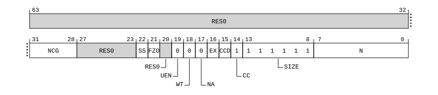

# ​I5.3.11 PMCFGR, Performance Monitors Configuration Register

Source: <https://developer.arm.com/documentation/ddi0487/mc/-Part-I-Memory-mapped-Components-of-the-Arm-Architecture/-Chapter-I5-External-System-Control-Register-Descriptions/-I5-3-Performance-Monitors-external-register-descriptions/-I5-3-11-PMCFGR--Performance-Monitors-Configuration-Register>

##### I5.3.11 PMCFGR, Performance Monitors Configuration Register

The PMCFGR characteristics are:

Purpose
:   Contains PMU-specific configuration data.

Configuration
:   PMCFGR is in the Core power domain.

    This register is present only when FEAT\_PMUv3\_EXT is implemented and FEAT\_PMUv3 is implemented. Otherwise, direct accesses to PMCFGR are RES0.

Attributes
:   PMCFGR is a:

    - 64-bit register when FEAT\_PMUv3\_EXT64 is implemented.
    - 32-bit register otherwise.

###### Field descriptions

When FEAT\_PMUv3\_EXT64 is implemented:
:   

Bits [63:32]
:   Reserved, RES0.

NCG, bits [31:28]
:   Defines the number of counter groups implemented, minus one.

    The value of this field is an IMPLEMENTATION DEFINED choice of:

<table>
 <colgroup>
  <col/>
  <col/>
 </colgroup>
 <thead>
  <tr>
   <th>
    <strong>
     NCG
    </strong>
   </th>
   <th>
    <strong>
     Meaning
    </strong>
   </th>
  </tr>
 </thead>
 <tbody>
  <tr>
   <td>
    

     <code>
      0b0000
     </code>
    

   </td>
   <td>
    

     One counter group implemented.
    

   </td>
  </tr>
  <tr>
   <td>
    

     <code>
      0b0001
     </code>
    

   </td>
   <td>
    

     Two counter groups implemented.
    

   </td>
  </tr>
 </tbody>
</table>

    All other values are reserved.

    [FEAT\_PMUv3\_ICNTR](/documentation/ddi0487/mc/-Part-A-Arm-Architecture-Introduction-and-Overview/-Chapter-A2-A-profile-Architecture-Extensions/-A2-2-Armv8-A-architecture-extensions/-A2-2-10-The-Armv8-9-architecture-extension?lang=en#feat_feat_pmuv3_icntr) implements the functionality identified by the value `0b0001`.

    Access to this field is RO.

Bits [27:23]
:   Reserved, RES0.

SS, bit [22]
:   Snapshot supported.

    The value of this field is an IMPLEMENTATION DEFINED choice of:

<table>
 <colgroup>
  <col/>
  <col/>
 </colgroup>
 <thead>
  <tr>
   <th>
    <strong>
     SS
    </strong>
   </th>
   <th>
    <strong>
     Meaning
    </strong>
   </th>
  </tr>
 </thead>
 <tbody>
  <tr>
   <td>
    

     <code>
      0b0
     </code>
    

   </td>
   <td>
    

     Snapshot mechanism not supported. The locations
     <code>
      0x600
     </code>
     -
     <code>
      0x7FC
     </code>
     and
     <code>
      0xE30
     </code>
     -
     <code>
      0xE3C
     </code>
     are
     <small>
      IMPLEMENTATION DEFINED
     </small>
     .
    

   </td>
  </tr>
  <tr>
   <td>
    

     <code>
      0b1
     </code>
    

   </td>
   <td>
    

     Snapshot mechanism supported.
    

    

     If
     <a class="document-topic" document-topic-path="/ddi0487/mc/-Part-A-Arm-Architecture-Introduction-and-Overview/-Chapter-A2-A-profile-Architecture-Extensions/-A2-2-Armv8-A-architecture-extensions/-A2-2-10-The-Armv8-9-architecture-extension?lang=en#feat_feat_pmuv3_ss" href="/documentation/ddi0487/mc/-Part-A-Arm-Architecture-Introduction-and-Overview/-Chapter-A2-A-profile-Architecture-Extensions/-A2-2-Armv8-A-architecture-extensions/-A2-2-10-The-Armv8-9-architecture-extension?lang=en#feat_feat_pmuv3_ss">
      FEAT_PMUv3_SS
     </a>
     is implemented, then the following registers are implemented:
    

    <ul>
     <li>
      

       <a class="document-topic" document-topic-path="/ddi0487/mc/-Part-I-Memory-mapped-Components-of-the-Arm-Architecture/-Chapter-I5-External-System-Control-Register-Descriptions/-I5-3-Performance-Monitors-external-register-descriptions/-I5-3-30-PMEVCNTSVR-n--EL1--Performance-Monitors-Event-Count-Saved-Value-Registers--n---0---30?lang=en#reg_pmu_pmevcntsvrn_el1" href="/documentation/ddi0487/mc/-Part-I-Memory-mapped-Components-of-the-Arm-Architecture/-Chapter-I5-External-System-Control-Register-Descriptions/-I5-3-Performance-Monitors-external-register-descriptions/-I5-3-30-PMEVCNTSVR-n--EL1--Performance-Monitors-Event-Count-Saved-Value-Registers--n---0---30?lang=en#reg_pmu_pmevcntsvrn_el1">
        PMEVCNTSVR&lt;n&gt;_EL1
       </a>
       .
      

     </li>
     <li>
      

       <a class="document-topic" document-topic-path="/ddi0487/mc/-Part-I-Memory-mapped-Components-of-the-Arm-Architecture/-Chapter-I5-External-System-Control-Register-Descriptions/-I5-3-Performance-Monitors-external-register-descriptions/-I5-3-5-PMCCNTSVR-EL1--Performance-Monitors-Cycle-Count-Saved-Value-Register?lang=en#reg_pmu_pmccntsvr_el1" href="/documentation/ddi0487/mc/-Part-I-Memory-mapped-Components-of-the-Arm-Architecture/-Chapter-I5-External-System-Control-Register-Descriptions/-I5-3-Performance-Monitors-external-register-descriptions/-I5-3-5-PMCCNTSVR-EL1--Performance-Monitors-Cycle-Count-Saved-Value-Register?lang=en#reg_pmu_pmccntsvr_el1">
        PMCCNTSVR_EL1
       </a>
       .
      

     </li>
     <li>
      

       If
       <a class="document-topic" document-topic-path="/ddi0487/mc/-Part-A-Arm-Architecture-Introduction-and-Overview/-Chapter-A2-A-profile-Architecture-Extensions/-A2-2-Armv8-A-architecture-extensions/-A2-2-10-The-Armv8-9-architecture-extension?lang=en#feat_feat_pmuv3_icntr" href="/documentation/ddi0487/mc/-Part-A-Arm-Architecture-Introduction-and-Overview/-Chapter-A2-A-profile-Architecture-Extensions/-A2-2-Armv8-A-architecture-extensions/-A2-2-10-The-Armv8-9-architecture-extension?lang=en#feat_feat_pmuv3_icntr">
        FEAT_PMUv3_ICNTR
       </a>
       is implemented,
       <a class="document-topic" document-topic-path="/ddi0487/mc/-Part-I-Memory-mapped-Components-of-the-Arm-Architecture/-Chapter-I5-External-System-Control-Register-Descriptions/-I5-3-Performance-Monitors-external-register-descriptions/-I5-3-35-PMICNTSVR-EL1--Performance-Monitors-Instruction-Count-Saved-Value-Register?lang=en#reg_pmu_pmicntsvr_el1" href="/documentation/ddi0487/mc/-Part-I-Memory-mapped-Components-of-the-Arm-Architecture/-Chapter-I5-External-System-Control-Register-Descriptions/-I5-3-Performance-Monitors-external-register-descriptions/-I5-3-35-PMICNTSVR-EL1--Performance-Monitors-Instruction-Count-Saved-Value-Register?lang=en#reg_pmu_pmicntsvr_el1">
        PMICNTSVR_EL1
       </a>
       .
      

     </li>
     <li>
      

       <a class="document-topic" document-topic-path="/ddi0487/mc/-Part-I-Memory-mapped-Components-of-the-Arm-Architecture/-Chapter-I5-External-System-Control-Register-Descriptions/-I5-3-Performance-Monitors-external-register-descriptions/-I5-3-57-PMSSCR-EL1--Performance-Monitors-Snapshot-Status-and-Capture-Register?lang=en#reg_pmu_pmsscr_el1" href="/documentation/ddi0487/mc/-Part-I-Memory-mapped-Components-of-the-Arm-Architecture/-Chapter-I5-External-System-Control-Register-Descriptions/-I5-3-Performance-Monitors-external-register-descriptions/-I5-3-57-PMSSCR-EL1--Performance-Monitors-Snapshot-Status-and-Capture-Register?lang=en#reg_pmu_pmsscr_el1">
        PMSSCR_EL1
       </a>
       .
      

     </li>
    </ul>
    

     Otherwise, locations
     <code>
      0x600
     </code>
     -
     <code>
      0x7FC
     </code>
     and
     <code>
      0xE30
     </code>
     -
     <code>
      0xE3C
     </code>
     contain
     <small>
      IMPLEMENTATION DEFINED
     </small>
     snapshot registers.
    

   </td>
  </tr>
 </tbody>
</table>

    [FEAT\_PMUv3\_SS](/documentation/ddi0487/mc/-Part-A-Arm-Architecture-Introduction-and-Overview/-Chapter-A2-A-profile-Architecture-Extensions/-A2-2-Armv8-A-architecture-extensions/-A2-2-10-The-Armv8-9-architecture-extension?lang=en#feat_feat_pmuv3_ss) implements the functionality identified by the value 1.

    If [FEAT\_PMUv3\_SS](/documentation/ddi0487/mc/-Part-A-Arm-Architecture-Introduction-and-Overview/-Chapter-A2-A-profile-Architecture-Extensions/-A2-2-Armv8-A-architecture-extensions/-A2-2-10-The-Armv8-9-architecture-extension?lang=en#feat_feat_pmuv3_ss) is not implemented, a PMU might include an IMPLEMENTATION DEFINED snapshot mechanism, including one using the IMPLEMENTATION DEFINED registers `0x600`-`0x7FC` and `0xE30`-`0xE3C`.

    Access to this field is RO.

FZO, bit [21]
:   Freeze-on-overflow supported.

    The value of this field is an IMPLEMENTATION DEFINED choice of:

<table>
 <colgroup>
  <col/>
  <col/>
 </colgroup>
 <thead>
  <tr>
   <th>
    <strong>
     FZO
    </strong>
   </th>
   <th>
    <strong>
     Meaning
    </strong>
   </th>
  </tr>
 </thead>
 <tbody>
  <tr>
   <td>
    

     <code>
      0b0
     </code>
    

   </td>
   <td>
    

     Freeze-on-overflow mechanism is not supported.
     <a class="document-topic" document-topic-path="/ddi0487/mc/-Part-I-Memory-mapped-Components-of-the-Arm-Architecture/-Chapter-I5-External-System-Control-Register-Descriptions/-I5-3-Performance-Monitors-external-register-descriptions/-I5-3-22-PMCR-EL0--Performance-Monitors-Control-Register?lang=en#reg_pmu_pmcr_el0" href="/documentation/ddi0487/mc/-Part-I-Memory-mapped-Components-of-the-Arm-Architecture/-Chapter-I5-External-System-Control-Register-Descriptions/-I5-3-Performance-Monitors-external-register-descriptions/-I5-3-22-PMCR-EL0--Performance-Monitors-Control-Register?lang=en#reg_pmu_pmcr_el0">
      PMCR_EL0
     </a>
     .FZO is
     <small>
      RES0
     </small>
     .
    

   </td>
  </tr>
  <tr>
   <td>
    

     <code>
      0b1
     </code>
    

   </td>
   <td>
    

     Freeze-on-overflow mechanism is supported.
     <a class="document-topic" document-topic-path="/ddi0487/mc/-Part-I-Memory-mapped-Components-of-the-Arm-Architecture/-Chapter-I5-External-System-Control-Register-Descriptions/-I5-3-Performance-Monitors-external-register-descriptions/-I5-3-22-PMCR-EL0--Performance-Monitors-Control-Register?lang=en#reg_pmu_pmcr_el0" href="/documentation/ddi0487/mc/-Part-I-Memory-mapped-Components-of-the-Arm-Architecture/-Chapter-I5-External-System-Control-Register-Descriptions/-I5-3-Performance-Monitors-external-register-descriptions/-I5-3-22-PMCR-EL0--Performance-Monitors-Control-Register?lang=en#reg_pmu_pmcr_el0">
      PMCR_EL0
     </a>
     .FZO is RW.
    

   </td>
  </tr>
 </tbody>
</table>

    [FEAT\_PMUv3p7](/documentation/ddi0487/mc/-Part-A-Arm-Architecture-Introduction-and-Overview/-Chapter-A2-A-profile-Architecture-Extensions/-A2-2-Armv8-A-architecture-extensions/-A2-2-8-The-Armv8-7-architecture-extension?lang=en#feat_feat_pmuv3p7) implements the functionality added by the value 1.

    From Armv8.7, if [FEAT\_PMUv3](/documentation/ddi0487/mc/-Part-A-Arm-Architecture-Introduction-and-Overview/-Chapter-A2-A-profile-Architecture-Extensions/-A2-2-Armv8-A-architecture-extensions/-A2-2-1-The-Armv8-0-architecture-extension?lang=en#feat_feat_pmuv3) is implemented, the only permitted value is 1.

    Access to this field is RO.

Bit [20]
:   Reserved, RES0.

UEN, bit [19]
:   User-mode Enable Register supported. [PMUSERENR\_EL0](/documentation/ddi0487/mc/-Part-D-The-AArch64-System-Level-Architecture/-Chapter-D24-AArch64-System-Register-Descriptions/-D24-5-Performance-Monitors-registers/-D24-5-25-PMUSERENR-EL0--Performance-Monitors-User-Enable-Register?lang=en#reg_aarch64_pmuserenr_el0) is not visible in the external debug interface, so this bit is RAZ.

    Reads as `0b0`

    Access to this field is RO.

WT, bit [18]
:   This feature is not supported, so this bit is RAZ.

    Reads as `0b0`

    Access to this field is RO.

NA, bit [17]
:   This feature is not supported, so this bit is RAZ.

    Reads as `0b0`

    Access to this field is RO.

EX, bit [16]
:   Export supported.

    The value of this field is an IMPLEMENTATION DEFINED choice of:

<table>
 <colgroup>
  <col/>
  <col/>
 </colgroup>
 <thead>
  <tr>
   <th>
    <strong>
     EX
    </strong>
   </th>
   <th>
    <strong>
     Meaning
    </strong>
   </th>
  </tr>
 </thead>
 <tbody>
  <tr>
   <td>
    

     <code>
      0b0
     </code>
    

   </td>
   <td>
    

     <a class="document-topic" document-topic-path="/ddi0487/mc/-Part-I-Memory-mapped-Components-of-the-Arm-Architecture/-Chapter-I5-External-System-Control-Register-Descriptions/-I5-3-Performance-Monitors-external-register-descriptions/-I5-3-22-PMCR-EL0--Performance-Monitors-Control-Register?lang=en#reg_pmu_pmcr_el0" href="/documentation/ddi0487/mc/-Part-I-Memory-mapped-Components-of-the-Arm-Architecture/-Chapter-I5-External-System-Control-Register-Descriptions/-I5-3-Performance-Monitors-external-register-descriptions/-I5-3-22-PMCR-EL0--Performance-Monitors-Control-Register?lang=en#reg_pmu_pmcr_el0">
      PMCR_EL0
     </a>
     .X is
     <small>
      RES0
     </small>
     .
    

   </td>
  </tr>
  <tr>
   <td>
    

     <code>
      0b1
     </code>
    

   </td>
   <td>
    

     <a class="document-topic" document-topic-path="/ddi0487/mc/-Part-I-Memory-mapped-Components-of-the-Arm-Architecture/-Chapter-I5-External-System-Control-Register-Descriptions/-I5-3-Performance-Monitors-external-register-descriptions/-I5-3-22-PMCR-EL0--Performance-Monitors-Control-Register?lang=en#reg_pmu_pmcr_el0" href="/documentation/ddi0487/mc/-Part-I-Memory-mapped-Components-of-the-Arm-Architecture/-Chapter-I5-External-System-Control-Register-Descriptions/-I5-3-Performance-Monitors-external-register-descriptions/-I5-3-22-PMCR-EL0--Performance-Monitors-Control-Register?lang=en#reg_pmu_pmcr_el0">
      PMCR_EL0
     </a>
     .X is read/write.
    

   </td>
  </tr>
 </tbody>
</table>

    Access to this field is RO.

CCD, bit [15]
:   Cycle counter has prescale.

    This is RES1 if AArch32 is supported, and RAZ otherwise.

    The value of this field is an IMPLEMENTATION DEFINED choice of:

<table>
 <colgroup>
  <col/>
  <col/>
 </colgroup>
 <thead>
  <tr>
   <th>
    <strong>
     CCD
    </strong>
   </th>
   <th>
    <strong>
     Meaning
    </strong>
   </th>
  </tr>
 </thead>
 <tbody>
  <tr>
   <td>
    

     <code>
      0b0
     </code>
    

   </td>
   <td>
    

     <a class="document-topic" document-topic-path="/ddi0487/mc/-Part-I-Memory-mapped-Components-of-the-Arm-Architecture/-Chapter-I5-External-System-Control-Register-Descriptions/-I5-3-Performance-Monitors-external-register-descriptions/-I5-3-22-PMCR-EL0--Performance-Monitors-Control-Register?lang=en#reg_pmu_pmcr_el0" href="/documentation/ddi0487/mc/-Part-I-Memory-mapped-Components-of-the-Arm-Architecture/-Chapter-I5-External-System-Control-Register-Descriptions/-I5-3-Performance-Monitors-external-register-descriptions/-I5-3-22-PMCR-EL0--Performance-Monitors-Control-Register?lang=en#reg_pmu_pmcr_el0">
      PMCR_EL0
     </a>
     .D is
     <small>
      RES0
     </small>
     .
    

   </td>
  </tr>
  <tr>
   <td>
    

     <code>
      0b1
     </code>
    

   </td>
   <td>
    

     <a class="document-topic" document-topic-path="/ddi0487/mc/-Part-I-Memory-mapped-Components-of-the-Arm-Architecture/-Chapter-I5-External-System-Control-Register-Descriptions/-I5-3-Performance-Monitors-external-register-descriptions/-I5-3-22-PMCR-EL0--Performance-Monitors-Control-Register?lang=en#reg_pmu_pmcr_el0" href="/documentation/ddi0487/mc/-Part-I-Memory-mapped-Components-of-the-Arm-Architecture/-Chapter-I5-External-System-Control-Register-Descriptions/-I5-3-Performance-Monitors-external-register-descriptions/-I5-3-22-PMCR-EL0--Performance-Monitors-Control-Register?lang=en#reg_pmu_pmcr_el0">
      PMCR_EL0
     </a>
     .D is read/write.
    

   </td>
  </tr>
 </tbody>
</table>

    Access to this field is RO.

CC, bit [14]
:   Dedicated cycle counter (counter 31) supported.

    Reads as `0b1`

    Access to this field is RO.

SIZE, bits [13:8]
:   Size of counters, minus one. This field defines the size of the largest counter implemented by the Performance Monitors Unit.

    From Armv8.0, the largest counter is 64-bits, so the value of this field is `0b111111`.

    This field is used by software to determine the spacing of the counters in the memory-map. From Armv8.0, the counters are a doubleword-aligned addresses.

    Reads as `0b111111`

    Access to this field is RO.

N, bits [7:0]
:   Number of counters accessible, minus one.

    The value of this field is an IMPLEMENTATION DEFINED choice of:

<table>
 <colgroup>
  <col/>
  <col/>
 </colgroup>
 <thead>
  <tr>
   <th>
    <strong>
     N
    </strong>
   </th>
   <th>
    <strong>
     Meaning
    </strong>
   </th>
  </tr>
 </thead>
 <tbody>
  <tr>
   <td>
    

     <code>
      0x00
     </code>
    

   </td>
   <td>
    

     Only
     <a class="document-topic" document-topic-path="/ddi0487/mc/-Part-I-Memory-mapped-Components-of-the-Arm-Architecture/-Chapter-I5-External-System-Control-Register-Descriptions/-I5-3-Performance-Monitors-external-register-descriptions/-I5-3-4-PMCCNTR-EL0--Performance-Monitors-Cycle-Counter?lang=en#reg_pmu_pmccntr_el0" href="/documentation/ddi0487/mc/-Part-I-Memory-mapped-Components-of-the-Arm-Architecture/-Chapter-I5-External-System-Control-Register-Descriptions/-I5-3-Performance-Monitors-external-register-descriptions/-I5-3-4-PMCCNTR-EL0--Performance-Monitors-Cycle-Counter?lang=en#reg_pmu_pmccntr_el0">
      PMCCNTR_EL0
     </a>
     accessible.
    

   </td>
  </tr>
  <tr>
   <td>
    

     <code>
      0x01
     </code>
     ..
     <code>
      0x20
     </code>
    

   </td>
   <td>
    

     Number of counters accessible, 2 to 33, minus one.
    

   </td>
  </tr>
 </tbody>
</table>

    All other values are reserved.

    If [FEAT\_PMUv3\_ICNTR](/documentation/ddi0487/mc/-Part-A-Arm-Architecture-Introduction-and-Overview/-Chapter-A2-A-profile-Architecture-Extensions/-A2-2-Armv8-A-architecture-extensions/-A2-2-10-The-Armv8-9-architecture-extension?lang=en#feat_feat_pmuv3_icntr) is implemented, then the value `0x00` is not permitted.

    The count includes:

    - The cycle counter, [PMCCNTR\_EL0](/documentation/ddi0487/mc/-Part-I-Memory-mapped-Components-of-the-Arm-Architecture/-Chapter-I5-External-System-Control-Register-Descriptions/-I5-3-Performance-Monitors-external-register-descriptions/-I5-3-4-PMCCNTR-EL0--Performance-Monitors-Cycle-Counter?lang=en#reg_pmu_pmccntr_el0).
    - If [FEAT\_PMUv3\_ICNTR](/documentation/ddi0487/mc/-Part-A-Arm-Architecture-Introduction-and-Overview/-Chapter-A2-A-profile-Architecture-Extensions/-A2-2-Armv8-A-architecture-extensions/-A2-2-10-The-Armv8-9-architecture-extension?lang=en#feat_feat_pmuv3_icntr) is implemented, the Instruction Counter, [PMICNTR\_EL0](/documentation/ddi0487/mc/-Part-I-Memory-mapped-Components-of-the-Arm-Architecture/-Chapter-I5-External-System-Control-Register-Descriptions/-I5-3-Performance-Monitors-external-register-descriptions/-I5-3-34-PMICNTR-EL0--Performance-Monitors-Instruction-Counter-Register?lang=en#reg_pmu_pmicntr_el0).

    When FEAT\_PMUv3\_EXTPMN is implemented and the access to this register is not a Most secure access, the following apply:

    - If [FEAT\_PMUv3\_ICNTR](/documentation/ddi0487/mc/-Part-A-Arm-Architecture-Introduction-and-Overview/-Chapter-A2-A-profile-Architecture-Extensions/-A2-2-Armv8-A-architecture-extensions/-A2-2-10-The-Armv8-9-architecture-extension?lang=en#feat_feat_pmuv3_icntr) is not implemented, this field reads as the Effective value of [PMCCR](/documentation/ddi0487/mc/-Part-I-Memory-mapped-Components-of-the-Arm-Architecture/-Chapter-I5-External-System-Control-Register-Descriptions/-I5-3-Performance-Monitors-external-register-descriptions/-I5-3-6-PMCCR--PMU-Configuration-Control-Register?lang=en#reg_pmu_pmccr).EPMN.
    - If [FEAT\_PMUv3\_ICNTR](/documentation/ddi0487/mc/-Part-A-Arm-Architecture-Introduction-and-Overview/-Chapter-A2-A-profile-Architecture-Extensions/-A2-2-Armv8-A-architecture-extensions/-A2-2-10-The-Armv8-9-architecture-extension?lang=en#feat_feat_pmuv3_icntr) is implemented, this field reads as the Effective value of [PMCCR](/documentation/ddi0487/mc/-Part-I-Memory-mapped-Components-of-the-Arm-Architecture/-Chapter-I5-External-System-Control-Register-Descriptions/-I5-3-Performance-Monitors-external-register-descriptions/-I5-3-6-PMCCR--PMU-Configuration-Control-Register?lang=en#reg_pmu_pmccr).EPMN plus one.

    Otherwise, the following apply:

    - If [FEAT\_PMUv3\_ICNTR](/documentation/ddi0487/mc/-Part-A-Arm-Architecture-Introduction-and-Overview/-Chapter-A2-A-profile-Architecture-Extensions/-A2-2-Armv8-A-architecture-extensions/-A2-2-10-The-Armv8-9-architecture-extension?lang=en#feat_feat_pmuv3_icntr) is not implemented, this field reads as the number of event counters implemented.
    - If [FEAT\_PMUv3\_ICNTR](/documentation/ddi0487/mc/-Part-A-Arm-Architecture-Introduction-and-Overview/-Chapter-A2-A-profile-Architecture-Extensions/-A2-2-Armv8-A-architecture-extensions/-A2-2-10-The-Armv8-9-architecture-extension?lang=en#feat_feat_pmuv3_icntr) is implemented, this field reads as the number of event counters implemented plus one.

    For example, if PMCFGR.N == `0x07`, then:

    - There are eight counters in total.
    - If [FEAT\_PMUv3\_ICNTR](/documentation/ddi0487/mc/-Part-A-Arm-Architecture-Introduction-and-Overview/-Chapter-A2-A-profile-Architecture-Extensions/-A2-2-Armv8-A-architecture-extensions/-A2-2-10-The-Armv8-9-architecture-extension?lang=en#feat_feat_pmuv3_icntr) is not implemented, this comprises 7 event counters and the cycle counter.
    - If [FEAT\_PMUv3\_ICNTR](/documentation/ddi0487/mc/-Part-A-Arm-Architecture-Introduction-and-Overview/-Chapter-A2-A-profile-Architecture-Extensions/-A2-2-Armv8-A-architecture-extensions/-A2-2-10-The-Armv8-9-architecture-extension?lang=en#feat_feat_pmuv3_icntr) is implemented, this comprises 6 event counters, the cycle counter, and the instruction counter.

    The maximum number of event counters is 31.

    Access to this field is RO.

Otherwise:
:   

NCG, bits [31:28]
:   Defines the number of counter groups implemented, minus one.

    The value of this field is an IMPLEMENTATION DEFINED choice of:

<table>
 <colgroup>
  <col/>
  <col/>
 </colgroup>
 <thead>
  <tr>
   <th>
    <strong>
     NCG
    </strong>
   </th>
   <th>
    <strong>
     Meaning
    </strong>
   </th>
  </tr>
 </thead>
 <tbody>
  <tr>
   <td>
    

     <code>
      0b0000
     </code>
    

   </td>
   <td>
    

     One counter group implemented.
    

   </td>
  </tr>
  <tr>
   <td>
    

     <code>
      0b0001
     </code>
    

   </td>
   <td>
    

     Two counter groups implemented.
    

   </td>
  </tr>
 </tbody>
</table>

    All other values are reserved.

    [FEAT\_PMUv3\_ICNTR](/documentation/ddi0487/mc/-Part-A-Arm-Architecture-Introduction-and-Overview/-Chapter-A2-A-profile-Architecture-Extensions/-A2-2-Armv8-A-architecture-extensions/-A2-2-10-The-Armv8-9-architecture-extension?lang=en#feat_feat_pmuv3_icntr) implements the functionality identified by the value `0b0001`.

    Access to this field is RO.

Bits [27:23]
:   Reserved, RES0.

SS, bit [22]
:   Snapshot supported.

    The value of this field is an IMPLEMENTATION DEFINED choice of:

<table>
 <colgroup>
  <col/>
  <col/>
 </colgroup>
 <thead>
  <tr>
   <th>
    <strong>
     SS
    </strong>
   </th>
   <th>
    <strong>
     Meaning
    </strong>
   </th>
  </tr>
 </thead>
 <tbody>
  <tr>
   <td>
    

     <code>
      0b0
     </code>
    

   </td>
   <td>
    

     Snapshot mechanism not supported. The locations
     <code>
      0x600
     </code>
     -
     <code>
      0x7FC
     </code>
     and
     <code>
      0xE30
     </code>
     -
     <code>
      0xE3C
     </code>
     are
     <small>
      IMPLEMENTATION DEFINED
     </small>
     .
    

   </td>
  </tr>
  <tr>
   <td>
    

     <code>
      0b1
     </code>
    

   </td>
   <td>
    

     Snapshot mechanism supported.
    

    

     If
     <a class="document-topic" document-topic-path="/ddi0487/mc/-Part-A-Arm-Architecture-Introduction-and-Overview/-Chapter-A2-A-profile-Architecture-Extensions/-A2-2-Armv8-A-architecture-extensions/-A2-2-10-The-Armv8-9-architecture-extension?lang=en#feat_feat_pmuv3_ss" href="/documentation/ddi0487/mc/-Part-A-Arm-Architecture-Introduction-and-Overview/-Chapter-A2-A-profile-Architecture-Extensions/-A2-2-Armv8-A-architecture-extensions/-A2-2-10-The-Armv8-9-architecture-extension?lang=en#feat_feat_pmuv3_ss">
      FEAT_PMUv3_SS
     </a>
     is implemented, then the following registers are implemented:
    

    <ul>
     <li>
      

       <a class="document-topic" document-topic-path="/ddi0487/mc/-Part-I-Memory-mapped-Components-of-the-Arm-Architecture/-Chapter-I5-External-System-Control-Register-Descriptions/-I5-3-Performance-Monitors-external-register-descriptions/-I5-3-30-PMEVCNTSVR-n--EL1--Performance-Monitors-Event-Count-Saved-Value-Registers--n---0---30?lang=en#reg_pmu_pmevcntsvrn_el1" href="/documentation/ddi0487/mc/-Part-I-Memory-mapped-Components-of-the-Arm-Architecture/-Chapter-I5-External-System-Control-Register-Descriptions/-I5-3-Performance-Monitors-external-register-descriptions/-I5-3-30-PMEVCNTSVR-n--EL1--Performance-Monitors-Event-Count-Saved-Value-Registers--n---0---30?lang=en#reg_pmu_pmevcntsvrn_el1">
        PMEVCNTSVR&lt;n&gt;_EL1
       </a>
       .
      

     </li>
     <li>
      

       <a class="document-topic" document-topic-path="/ddi0487/mc/-Part-I-Memory-mapped-Components-of-the-Arm-Architecture/-Chapter-I5-External-System-Control-Register-Descriptions/-I5-3-Performance-Monitors-external-register-descriptions/-I5-3-5-PMCCNTSVR-EL1--Performance-Monitors-Cycle-Count-Saved-Value-Register?lang=en#reg_pmu_pmccntsvr_el1" href="/documentation/ddi0487/mc/-Part-I-Memory-mapped-Components-of-the-Arm-Architecture/-Chapter-I5-External-System-Control-Register-Descriptions/-I5-3-Performance-Monitors-external-register-descriptions/-I5-3-5-PMCCNTSVR-EL1--Performance-Monitors-Cycle-Count-Saved-Value-Register?lang=en#reg_pmu_pmccntsvr_el1">
        PMCCNTSVR_EL1
       </a>
       .
      

     </li>
     <li>
      

       If
       <a class="document-topic" document-topic-path="/ddi0487/mc/-Part-A-Arm-Architecture-Introduction-and-Overview/-Chapter-A2-A-profile-Architecture-Extensions/-A2-2-Armv8-A-architecture-extensions/-A2-2-10-The-Armv8-9-architecture-extension?lang=en#feat_feat_pmuv3_icntr" href="/documentation/ddi0487/mc/-Part-A-Arm-Architecture-Introduction-and-Overview/-Chapter-A2-A-profile-Architecture-Extensions/-A2-2-Armv8-A-architecture-extensions/-A2-2-10-The-Armv8-9-architecture-extension?lang=en#feat_feat_pmuv3_icntr">
        FEAT_PMUv3_ICNTR
       </a>
       is implemented,
       <a class="document-topic" document-topic-path="/ddi0487/mc/-Part-I-Memory-mapped-Components-of-the-Arm-Architecture/-Chapter-I5-External-System-Control-Register-Descriptions/-I5-3-Performance-Monitors-external-register-descriptions/-I5-3-35-PMICNTSVR-EL1--Performance-Monitors-Instruction-Count-Saved-Value-Register?lang=en#reg_pmu_pmicntsvr_el1" href="/documentation/ddi0487/mc/-Part-I-Memory-mapped-Components-of-the-Arm-Architecture/-Chapter-I5-External-System-Control-Register-Descriptions/-I5-3-Performance-Monitors-external-register-descriptions/-I5-3-35-PMICNTSVR-EL1--Performance-Monitors-Instruction-Count-Saved-Value-Register?lang=en#reg_pmu_pmicntsvr_el1">
        PMICNTSVR_EL1
       </a>
       .
      

     </li>
     <li>
      

       <a class="document-topic" document-topic-path="/ddi0487/mc/-Part-I-Memory-mapped-Components-of-the-Arm-Architecture/-Chapter-I5-External-System-Control-Register-Descriptions/-I5-3-Performance-Monitors-external-register-descriptions/-I5-3-57-PMSSCR-EL1--Performance-Monitors-Snapshot-Status-and-Capture-Register?lang=en#reg_pmu_pmsscr_el1" href="/documentation/ddi0487/mc/-Part-I-Memory-mapped-Components-of-the-Arm-Architecture/-Chapter-I5-External-System-Control-Register-Descriptions/-I5-3-Performance-Monitors-external-register-descriptions/-I5-3-57-PMSSCR-EL1--Performance-Monitors-Snapshot-Status-and-Capture-Register?lang=en#reg_pmu_pmsscr_el1">
        PMSSCR_EL1
       </a>
       .
      

     </li>
    </ul>
    

     Otherwise, locations
     <code>
      0x600
     </code>
     -
     <code>
      0x7FC
     </code>
     and
     <code>
      0xE30
     </code>
     -
     <code>
      0xE3C
     </code>
     contain
     <small>
      IMPLEMENTATION DEFINED
     </small>
     snapshot registers.
    

   </td>
  </tr>
 </tbody>
</table>

    [FEAT\_PMUv3\_SS](/documentation/ddi0487/mc/-Part-A-Arm-Architecture-Introduction-and-Overview/-Chapter-A2-A-profile-Architecture-Extensions/-A2-2-Armv8-A-architecture-extensions/-A2-2-10-The-Armv8-9-architecture-extension?lang=en#feat_feat_pmuv3_ss) implements the functionality identified by the value 1.

    If [FEAT\_PMUv3\_SS](/documentation/ddi0487/mc/-Part-A-Arm-Architecture-Introduction-and-Overview/-Chapter-A2-A-profile-Architecture-Extensions/-A2-2-Armv8-A-architecture-extensions/-A2-2-10-The-Armv8-9-architecture-extension?lang=en#feat_feat_pmuv3_ss) is not implemented, a PMU might include an IMPLEMENTATION DEFINED snapshot mechanism, including one using the IMPLEMENTATION DEFINED registers `0x600`-`0x7FC` and `0xE30`-`0xE3C`.

    Access to this field is RO.

FZO, bit [21]
:   Freeze-on-overflow supported.

    The value of this field is an IMPLEMENTATION DEFINED choice of:

<table>
 <colgroup>
  <col/>
  <col/>
 </colgroup>
 <thead>
  <tr>
   <th>
    <strong>
     FZO
    </strong>
   </th>
   <th>
    <strong>
     Meaning
    </strong>
   </th>
  </tr>
 </thead>
 <tbody>
  <tr>
   <td>
    

     <code>
      0b0
     </code>
    

   </td>
   <td>
    

     Freeze-on-overflow mechanism is not supported.
     <a class="document-topic" document-topic-path="/ddi0487/mc/-Part-I-Memory-mapped-Components-of-the-Arm-Architecture/-Chapter-I5-External-System-Control-Register-Descriptions/-I5-3-Performance-Monitors-external-register-descriptions/-I5-3-22-PMCR-EL0--Performance-Monitors-Control-Register?lang=en#reg_pmu_pmcr_el0" href="/documentation/ddi0487/mc/-Part-I-Memory-mapped-Components-of-the-Arm-Architecture/-Chapter-I5-External-System-Control-Register-Descriptions/-I5-3-Performance-Monitors-external-register-descriptions/-I5-3-22-PMCR-EL0--Performance-Monitors-Control-Register?lang=en#reg_pmu_pmcr_el0">
      PMCR_EL0
     </a>
     .FZO is
     <small>
      RES0
     </small>
     .
    

   </td>
  </tr>
  <tr>
   <td>
    

     <code>
      0b1
     </code>
    

   </td>
   <td>
    

     Freeze-on-overflow mechanism is supported.
     <a class="document-topic" document-topic-path="/ddi0487/mc/-Part-I-Memory-mapped-Components-of-the-Arm-Architecture/-Chapter-I5-External-System-Control-Register-Descriptions/-I5-3-Performance-Monitors-external-register-descriptions/-I5-3-22-PMCR-EL0--Performance-Monitors-Control-Register?lang=en#reg_pmu_pmcr_el0" href="/documentation/ddi0487/mc/-Part-I-Memory-mapped-Components-of-the-Arm-Architecture/-Chapter-I5-External-System-Control-Register-Descriptions/-I5-3-Performance-Monitors-external-register-descriptions/-I5-3-22-PMCR-EL0--Performance-Monitors-Control-Register?lang=en#reg_pmu_pmcr_el0">
      PMCR_EL0
     </a>
     .FZO is RW.
    

   </td>
  </tr>
 </tbody>
</table>

    [FEAT\_PMUv3p7](/documentation/ddi0487/mc/-Part-A-Arm-Architecture-Introduction-and-Overview/-Chapter-A2-A-profile-Architecture-Extensions/-A2-2-Armv8-A-architecture-extensions/-A2-2-8-The-Armv8-7-architecture-extension?lang=en#feat_feat_pmuv3p7) implements the functionality added by the value 1.

    From Armv8.7, if [FEAT\_PMUv3](/documentation/ddi0487/mc/-Part-A-Arm-Architecture-Introduction-and-Overview/-Chapter-A2-A-profile-Architecture-Extensions/-A2-2-Armv8-A-architecture-extensions/-A2-2-1-The-Armv8-0-architecture-extension?lang=en#feat_feat_pmuv3) is implemented, the only permitted value is 1.

    Access to this field is RO.

Bit [20]
:   Reserved, RES0.

UEN, bit [19]
:   User-mode Enable Register supported. [PMUSERENR\_EL0](/documentation/ddi0487/mc/-Part-D-The-AArch64-System-Level-Architecture/-Chapter-D24-AArch64-System-Register-Descriptions/-D24-5-Performance-Monitors-registers/-D24-5-25-PMUSERENR-EL0--Performance-Monitors-User-Enable-Register?lang=en#reg_aarch64_pmuserenr_el0) is not visible in the external debug interface, so this bit is RAZ.

    Reads as `0b0`

    Access to this field is RO.

WT, bit [18]
:   This feature is not supported, so this bit is RAZ.

    Reads as `0b0`

    Access to this field is RO.

NA, bit [17]
:   This feature is not supported, so this bit is RAZ.

    Reads as `0b0`

    Access to this field is RO.

EX, bit [16]
:   Export supported.

    The value of this field is an IMPLEMENTATION DEFINED choice of:

<table>
 <colgroup>
  <col/>
  <col/>
 </colgroup>
 <thead>
  <tr>
   <th>
    <strong>
     EX
    </strong>
   </th>
   <th>
    <strong>
     Meaning
    </strong>
   </th>
  </tr>
 </thead>
 <tbody>
  <tr>
   <td>
    

     <code>
      0b0
     </code>
    

   </td>
   <td>
    

     <a class="document-topic" document-topic-path="/ddi0487/mc/-Part-I-Memory-mapped-Components-of-the-Arm-Architecture/-Chapter-I5-External-System-Control-Register-Descriptions/-I5-3-Performance-Monitors-external-register-descriptions/-I5-3-22-PMCR-EL0--Performance-Monitors-Control-Register?lang=en#reg_pmu_pmcr_el0" href="/documentation/ddi0487/mc/-Part-I-Memory-mapped-Components-of-the-Arm-Architecture/-Chapter-I5-External-System-Control-Register-Descriptions/-I5-3-Performance-Monitors-external-register-descriptions/-I5-3-22-PMCR-EL0--Performance-Monitors-Control-Register?lang=en#reg_pmu_pmcr_el0">
      PMCR_EL0
     </a>
     .X is
     <small>
      RES0
     </small>
     .
    

   </td>
  </tr>
  <tr>
   <td>
    

     <code>
      0b1
     </code>
    

   </td>
   <td>
    

     <a class="document-topic" document-topic-path="/ddi0487/mc/-Part-I-Memory-mapped-Components-of-the-Arm-Architecture/-Chapter-I5-External-System-Control-Register-Descriptions/-I5-3-Performance-Monitors-external-register-descriptions/-I5-3-22-PMCR-EL0--Performance-Monitors-Control-Register?lang=en#reg_pmu_pmcr_el0" href="/documentation/ddi0487/mc/-Part-I-Memory-mapped-Components-of-the-Arm-Architecture/-Chapter-I5-External-System-Control-Register-Descriptions/-I5-3-Performance-Monitors-external-register-descriptions/-I5-3-22-PMCR-EL0--Performance-Monitors-Control-Register?lang=en#reg_pmu_pmcr_el0">
      PMCR_EL0
     </a>
     .X is read/write.
    

   </td>
  </tr>
 </tbody>
</table>

    Access to this field is RO.

CCD, bit [15]
:   Cycle counter has prescale.

    This is RES1 if AArch32 is supported, and RAZ otherwise.

    The value of this field is an IMPLEMENTATION DEFINED choice of:

<table>
 <colgroup>
  <col/>
  <col/>
 </colgroup>
 <thead>
  <tr>
   <th>
    <strong>
     CCD
    </strong>
   </th>
   <th>
    <strong>
     Meaning
    </strong>
   </th>
  </tr>
 </thead>
 <tbody>
  <tr>
   <td>
    

     <code>
      0b0
     </code>
    

   </td>
   <td>
    

     <a class="document-topic" document-topic-path="/ddi0487/mc/-Part-I-Memory-mapped-Components-of-the-Arm-Architecture/-Chapter-I5-External-System-Control-Register-Descriptions/-I5-3-Performance-Monitors-external-register-descriptions/-I5-3-22-PMCR-EL0--Performance-Monitors-Control-Register?lang=en#reg_pmu_pmcr_el0" href="/documentation/ddi0487/mc/-Part-I-Memory-mapped-Components-of-the-Arm-Architecture/-Chapter-I5-External-System-Control-Register-Descriptions/-I5-3-Performance-Monitors-external-register-descriptions/-I5-3-22-PMCR-EL0--Performance-Monitors-Control-Register?lang=en#reg_pmu_pmcr_el0">
      PMCR_EL0
     </a>
     .D is
     <small>
      RES0
     </small>
     .
    

   </td>
  </tr>
  <tr>
   <td>
    

     <code>
      0b1
     </code>
    

   </td>
   <td>
    

     <a class="document-topic" document-topic-path="/ddi0487/mc/-Part-I-Memory-mapped-Components-of-the-Arm-Architecture/-Chapter-I5-External-System-Control-Register-Descriptions/-I5-3-Performance-Monitors-external-register-descriptions/-I5-3-22-PMCR-EL0--Performance-Monitors-Control-Register?lang=en#reg_pmu_pmcr_el0" href="/documentation/ddi0487/mc/-Part-I-Memory-mapped-Components-of-the-Arm-Architecture/-Chapter-I5-External-System-Control-Register-Descriptions/-I5-3-Performance-Monitors-external-register-descriptions/-I5-3-22-PMCR-EL0--Performance-Monitors-Control-Register?lang=en#reg_pmu_pmcr_el0">
      PMCR_EL0
     </a>
     .D is read/write.
    

   </td>
  </tr>
 </tbody>
</table>

    Access to this field is RO.

CC, bit [14]
:   Dedicated cycle counter (counter 31) supported.

    Reads as `0b1`

    Access to this field is RO.

SIZE, bits [13:8]
:   Size of counters, minus one. This field defines the size of the largest counter implemented by the Performance Monitors Unit.

    From Armv8.0, the largest counter is 64-bits, so the value of this field is `0b111111`.

    This field is used by software to determine the spacing of the counters in the memory-map. From Armv8.0, the counters are a doubleword-aligned addresses.

    Reads as `0b111111`

    Access to this field is RO.

N, bits [7:0]
:   Number of counters accessible, minus one.

    The value of this field is an IMPLEMENTATION DEFINED choice of:

<table>
 <colgroup>
  <col/>
  <col/>
 </colgroup>
 <thead>
  <tr>
   <th>
    <strong>
     N
    </strong>
   </th>
   <th>
    <strong>
     Meaning
    </strong>
   </th>
  </tr>
 </thead>
 <tbody>
  <tr>
   <td>
    

     <code>
      0x00
     </code>
    

   </td>
   <td>
    

     Only
     <a class="document-topic" document-topic-path="/ddi0487/mc/-Part-I-Memory-mapped-Components-of-the-Arm-Architecture/-Chapter-I5-External-System-Control-Register-Descriptions/-I5-3-Performance-Monitors-external-register-descriptions/-I5-3-4-PMCCNTR-EL0--Performance-Monitors-Cycle-Counter?lang=en#reg_pmu_pmccntr_el0" href="/documentation/ddi0487/mc/-Part-I-Memory-mapped-Components-of-the-Arm-Architecture/-Chapter-I5-External-System-Control-Register-Descriptions/-I5-3-Performance-Monitors-external-register-descriptions/-I5-3-4-PMCCNTR-EL0--Performance-Monitors-Cycle-Counter?lang=en#reg_pmu_pmccntr_el0">
      PMCCNTR_EL0
     </a>
     accessible.
    

   </td>
  </tr>
  <tr>
   <td>
    

     <code>
      0x01
     </code>
     ..
     <code>
      0x20
     </code>
    

   </td>
   <td>
    

     Number of counters accessible, 2 to 33, minus one.
    

   </td>
  </tr>
 </tbody>
</table>

    All other values are reserved.

    If [FEAT\_PMUv3\_ICNTR](/documentation/ddi0487/mc/-Part-A-Arm-Architecture-Introduction-and-Overview/-Chapter-A2-A-profile-Architecture-Extensions/-A2-2-Armv8-A-architecture-extensions/-A2-2-10-The-Armv8-9-architecture-extension?lang=en#feat_feat_pmuv3_icntr) is implemented, then the value `0x00` is not permitted.

    The count includes:

    - The cycle counter, [PMCCNTR\_EL0](/documentation/ddi0487/mc/-Part-I-Memory-mapped-Components-of-the-Arm-Architecture/-Chapter-I5-External-System-Control-Register-Descriptions/-I5-3-Performance-Monitors-external-register-descriptions/-I5-3-4-PMCCNTR-EL0--Performance-Monitors-Cycle-Counter?lang=en#reg_pmu_pmccntr_el0).
    - If [FEAT\_PMUv3\_ICNTR](/documentation/ddi0487/mc/-Part-A-Arm-Architecture-Introduction-and-Overview/-Chapter-A2-A-profile-Architecture-Extensions/-A2-2-Armv8-A-architecture-extensions/-A2-2-10-The-Armv8-9-architecture-extension?lang=en#feat_feat_pmuv3_icntr) is implemented, the Instruction Counter, [PMICNTR\_EL0](/documentation/ddi0487/mc/-Part-I-Memory-mapped-Components-of-the-Arm-Architecture/-Chapter-I5-External-System-Control-Register-Descriptions/-I5-3-Performance-Monitors-external-register-descriptions/-I5-3-34-PMICNTR-EL0--Performance-Monitors-Instruction-Counter-Register?lang=en#reg_pmu_pmicntr_el0).

    When FEAT\_PMUv3\_EXTPMN is implemented and the access to this register is not a Most secure access, the following apply:

    - If [FEAT\_PMUv3\_ICNTR](/documentation/ddi0487/mc/-Part-A-Arm-Architecture-Introduction-and-Overview/-Chapter-A2-A-profile-Architecture-Extensions/-A2-2-Armv8-A-architecture-extensions/-A2-2-10-The-Armv8-9-architecture-extension?lang=en#feat_feat_pmuv3_icntr) is not implemented, this field reads as the Effective value of [PMCCR](/documentation/ddi0487/mc/-Part-I-Memory-mapped-Components-of-the-Arm-Architecture/-Chapter-I5-External-System-Control-Register-Descriptions/-I5-3-Performance-Monitors-external-register-descriptions/-I5-3-6-PMCCR--PMU-Configuration-Control-Register?lang=en#reg_pmu_pmccr).EPMN.
    - If [FEAT\_PMUv3\_ICNTR](/documentation/ddi0487/mc/-Part-A-Arm-Architecture-Introduction-and-Overview/-Chapter-A2-A-profile-Architecture-Extensions/-A2-2-Armv8-A-architecture-extensions/-A2-2-10-The-Armv8-9-architecture-extension?lang=en#feat_feat_pmuv3_icntr) is implemented, this field reads as the Effective value of [PMCCR](/documentation/ddi0487/mc/-Part-I-Memory-mapped-Components-of-the-Arm-Architecture/-Chapter-I5-External-System-Control-Register-Descriptions/-I5-3-Performance-Monitors-external-register-descriptions/-I5-3-6-PMCCR--PMU-Configuration-Control-Register?lang=en#reg_pmu_pmccr).EPMN plus one.

    Otherwise, the following apply:

    - If [FEAT\_PMUv3\_ICNTR](/documentation/ddi0487/mc/-Part-A-Arm-Architecture-Introduction-and-Overview/-Chapter-A2-A-profile-Architecture-Extensions/-A2-2-Armv8-A-architecture-extensions/-A2-2-10-The-Armv8-9-architecture-extension?lang=en#feat_feat_pmuv3_icntr) is not implemented, this field reads as the number of event counters implemented.
    - If [FEAT\_PMUv3\_ICNTR](/documentation/ddi0487/mc/-Part-A-Arm-Architecture-Introduction-and-Overview/-Chapter-A2-A-profile-Architecture-Extensions/-A2-2-Armv8-A-architecture-extensions/-A2-2-10-The-Armv8-9-architecture-extension?lang=en#feat_feat_pmuv3_icntr) is implemented, this field reads as the number of event counters implemented plus one.

    For example, if PMCFGR.N == `0x07`, then:

    - There are eight counters in total.
    - If [FEAT\_PMUv3\_ICNTR](/documentation/ddi0487/mc/-Part-A-Arm-Architecture-Introduction-and-Overview/-Chapter-A2-A-profile-Architecture-Extensions/-A2-2-Armv8-A-architecture-extensions/-A2-2-10-The-Armv8-9-architecture-extension?lang=en#feat_feat_pmuv3_icntr) is not implemented, this comprises 7 event counters and the cycle counter.
    - If [FEAT\_PMUv3\_ICNTR](/documentation/ddi0487/mc/-Part-A-Arm-Architecture-Introduction-and-Overview/-Chapter-A2-A-profile-Architecture-Extensions/-A2-2-Armv8-A-architecture-extensions/-A2-2-10-The-Armv8-9-architecture-extension?lang=en#feat_feat_pmuv3_icntr) is implemented, this comprises 6 event counters, the cycle counter, and the instruction counter.

    The maximum number of event counters is 31.

    Access to this field is RO.

###### Accessing PMCFGR

> #### Note
>
> `AllowExternalPMUAccess()` has a new definition from Armv8.4. Refer to the Pseudocode definitions for more information.

Accesses to this register use the following encodings:

When FEAT\_PMUv3\_EXT64 is implemented
:   [63:0] Accessible at offset `0xE00` from PMU

    - When DoubleLockStatus(), or !IsCorePowered(), or !AllowExternalPMUAccess(addrdesc), accesses to this register generate an error response.
    - When (((!IsFeatureImplemented(FEAT\_PMUv3\_EXTPMN)) || (!IsMostSecureAccess(addrdesc))) || (PMCCR().OSLO == ‘0’)) && OSLockStatus(), accesses to this register generate an error response.
    - Otherwise, accesses to this register are RO.

When FEAT\_PMUv3\_EXT32 is implemented
:   [31:0] Accessible at offset `0xE00` from PMU

    - When DoubleLockStatus(), or !IsCorePowered(), or !AllowExternalPMUAccess(addrdesc), accesses to this register generate an error response.
    - When (((!IsFeatureImplemented(FEAT\_PMUv3\_EXTPMN)) || (!IsMostSecureAccess(addrdesc))) || (PMCCR().OSLO == ‘0’)) && OSLockStatus(), accesses to this register generate an error response.
    - Otherwise, accesses to this register are RO.
