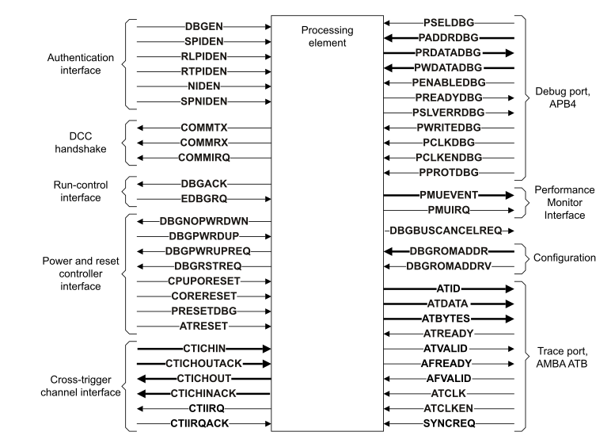

# ​K5.1 About the recommended external debug interface

Source: <https://developer.arm.com/documentation/ddi0487/mc/-Part-K-Appendixes/-Appendix-K5-Recommended-External-Debug-Interface/-K5-1-About-the-recommended-external-debug-interface>

#### K5.1 About the recommended external debug interface

See the *Note* on the first page of this appendix for information about the architectural status of this recommended debug interface.

This specification provides a recommended external debug interface for Armv8 and later architectures to define a standard set of connections for validation environments. Generally, the connection between components, such as between the PE and Trace extension, is not described here, although the table does include the signals for the CTI connection. [Table K5-1](/documentation/ddi0487/mc/-Part-K-Appendixes/-Appendix-K5-Recommended-External-Debug-Interface/-K5-1-About-the-recommended-external-debug-interface?lang=en#tbl_cacheihf) shows the signals in the recommended interface.

<table id="tbl_cacheihf">
 <caption>
  Table K5-1 Recommended debug interface signals
 </caption>
 <colgroup>
  <col/>
  <col/>
  <col/>
  <col/>
 </colgroup>
 <thead>
  <tr>
   <th>
    Name
   </th>
   <th>
    Direction
   </th>
   <th>
    Description
   </th>
   <th>
    Notes
   </th>
  </tr>
 </thead>
 <tbody>
  <tr>
   <td>
    <strong>
     DBGEN
    </strong>
   </td>
   <td>
    In
   </td>
   <td>
    External debug enable
   </td>
   <td>
    -
   </td>
  </tr>
  <tr>
   <td rowspan="2">
    <strong>
     SPIDEN
    </strong>
   </td>
   <td rowspan="2">
    In
   </td>
   <td>
    Secure privileged external debug enable
   </td>
   <td>
    -
   </td>
  </tr>
  <tr>
   <td>
    Secure privileged self-hosted debug enable
   </td>
   <td>
    Only in Secure AArch32 modes when enabled by
    <a class="document-topic" document-topic-path="/ddi0487/mc/-Part-D-The-AArch64-System-Level-Architecture/-Chapter-D24-AArch64-System-Register-Descriptions/-D24-3-Debug-System-registers/-D24-3-18-MDCR-EL3--Monitor-Debug-Configuration-Register--EL3-?lang=en#reg_aarch64_mdcr_el3" href="/documentation/ddi0487/mc/-Part-D-The-AArch64-System-Level-Architecture/-Chapter-D24-AArch64-System-Register-Descriptions/-D24-3-Debug-System-registers/-D24-3-18-MDCR-EL3--Monitor-Debug-Configuration-Register--EL3-?lang=en#reg_aarch64_mdcr_el3">
     MDCR_EL3
    </a>
    .SPD32
   </td>
  </tr>
  <tr>
   <td>
    <strong>
     RLPIDEN
    </strong>
   </td>
   <td>
    In
   </td>
   <td>
    Realm privileged external debug enable
   </td>
   <td rowspan="2">
    Only if
    <a class="document-topic" document-topic-path="/ddi0487/mc/-Part-A-Arm-Architecture-Introduction-and-Overview/-Chapter-A2-A-profile-Architecture-Extensions/-A2-3-Armv9-A-architecture-extensions/-A2-3-3-The-Armv9-2-architecture-extension?lang=en#feat_feat_rme" href="/documentation/ddi0487/mc/-Part-A-Arm-Architecture-Introduction-and-Overview/-Chapter-A2-A-profile-Architecture-Extensions/-A2-3-Armv9-A-architecture-extensions/-A2-3-3-The-Armv9-2-architecture-extension?lang=en#feat_feat_rme">
     FEAT_RME
    </a>
    is implemented.
   </td>
  </tr>
  <tr>
   <td>
    <strong>
     RTPIDEN
    </strong>
   </td>
   <td>
    In
   </td>
   <td>
    Root privileged external debug enable
   </td>
  </tr>
  <tr>
   <td>
    <strong>
     NIDEN
    </strong>
   </td>
   <td>
    In
   </td>
   <td>
    External profiling and trace enable
   </td>
   <td>
    If
    <a class="document-topic" document-topic-path="/ddi0487/mc/-Part-A-Arm-Architecture-Introduction-and-Overview/-Chapter-A2-A-profile-Architecture-Extensions/-A2-2-Armv8-A-architecture-extensions/-A2-2-5-The-Armv8-4-architecture-extension?lang=en#feat_feat_debugv8p4" href="/documentation/ddi0487/mc/-Part-A-Arm-Architecture-Introduction-and-Overview/-Chapter-A2-A-profile-Architecture-Extensions/-A2-2-Armv8-A-architecture-extensions/-A2-2-5-The-Armv8-4-architecture-extension?lang=en#feat_feat_debugv8p4">
     FEAT_Debugv8p4
    </a>
    is implemented, this signal is not implemented.
   </td>
  </tr>
  <tr>
   <td>
    <strong>
     SPNIDEN
    </strong>
   </td>
   <td>
    In
   </td>
   <td>
    Secure external profiling and trace enable
   </td>
   <td>
    If
    <a class="document-topic" document-topic-path="/ddi0487/mc/-Part-A-Arm-Architecture-Introduction-and-Overview/-Chapter-A2-A-profile-Architecture-Extensions/-A2-2-Armv8-A-architecture-extensions/-A2-2-5-The-Armv8-4-architecture-extension?lang=en#feat_feat_debugv8p4" href="/documentation/ddi0487/mc/-Part-A-Arm-Architecture-Introduction-and-Overview/-Chapter-A2-A-profile-Architecture-Extensions/-A2-2-Armv8-A-architecture-extensions/-A2-2-5-The-Armv8-4-architecture-extension?lang=en#feat_feat_debugv8p4">
     FEAT_Debugv8p4
    </a>
    is implemented, this signal is not implemented.
   </td>
  </tr>
  <tr>
   <td>
    <strong>
     EDBGRQ
    </strong>
   </td>
   <td>
    In
   </td>
   <td>
    External halt request
   </td>
   <td>
    <small>
     IMPLEMENTATION DEFINED
    </small>
    mechanism to halt the PE. See
    <a class="document-topic" document-topic-path="/ddi0487/mc/-Part-K-Appendixes/-Appendix-K5-Recommended-External-Debug-Interface/-K5-1-About-the-recommended-external-debug-interface/-K5-1-1-EDBGRQ-and-DBGACK?lang=en#chdfcccf" href="/documentation/ddi0487/mc/-Part-K-Appendixes/-Appendix-K5-Recommended-External-Debug-Interface/-K5-1-About-the-recommended-external-debug-interface/-K5-1-1-EDBGRQ-and-DBGACK?lang=en#chdfcccf">
     EDBGRQ and DBGACK
    </a>
    .
   </td>
  </tr>
  <tr>
   <td>
    <strong>
     DBGACK
    </strong>
   </td>
   <td>
    Out
   </td>
   <td>
    Debug Acknowledge
   </td>
   <td>
    Indicate to the system that a PE is in Debug state. See
    <a class="document-topic" document-topic-path="/ddi0487/mc/-Part-K-Appendixes/-Appendix-K5-Recommended-External-Debug-Interface/-K5-1-About-the-recommended-external-debug-interface/-K5-1-1-EDBGRQ-and-DBGACK?lang=en#chdfcccf" href="/documentation/ddi0487/mc/-Part-K-Appendixes/-Appendix-K5-Recommended-External-Debug-Interface/-K5-1-About-the-recommended-external-debug-interface/-K5-1-1-EDBGRQ-and-DBGACK?lang=en#chdfcccf">
     EDBGRQ and DBGACK
    </a>
    .
   </td>
  </tr>
  <tr>
   <td>
    <strong>
     COMMIRQ
    </strong>
   </td>
   <td>
    Out
   </td>
   <td>
    DCC interrupt
   </td>
   <td>
    Interface to an interrupt controller. See
    <a class="document-topic" document-topic-path="/ddi0487/mc/-Part-H-External-Debug/-Chapter-H4-The-Debug-Communication-Channel-and-Instruction-Transfer-Register/-H4-6-Interrupt-driven-use-of-the-DCC?lang=en#babcafeb" href="/documentation/ddi0487/mc/-Part-H-External-Debug/-Chapter-H4-The-Debug-Communication-Channel-and-Instruction-Transfer-Register/-H4-6-Interrupt-driven-use-of-the-DCC?lang=en#babcafeb">
     Interrupt-driven use of the DCC
    </a>
    and the pseudocode for function
    <a class="document-topic" document-topic-path="/ddi0487/mc/-Part-J-Architectural-Pseudocode/-Chapter-J1-A-profile-Architecture-Pseudocode/-J1-4-Shared-pseudocode/-J1-4-47-CheckForDCCInterrupts?lang=en#asl_func_checkfordccinterrupts_0" href="/documentation/ddi0487/mc/-Part-J-Architectural-Pseudocode/-Chapter-J1-A-profile-Architecture-Pseudocode/-J1-4-Shared-pseudocode/-J1-4-47-CheckForDCCInterrupts?lang=en#asl_func_checkfordccinterrupts_0">
     <code>
      CheckForDCCInterrupts
     </code>
    </a>
    <code>
     ()
    </code>
    .
   </td>
  </tr>
  <tr>
   <td>
    <strong>
     PMUIRQ
    </strong>
   </td>
   <td>
    Out
   </td>
   <td>
    Performance Monitor overflow
   </td>
   <td>
    Interface to an interrupt controller. See
    <a class="document-topic" document-topic-path="/ddi0487/mc/-Part-D-The-AArch64-System-Level-Architecture/-Chapter-D13-The-Performance-Monitors-Extension/-D13-3-Behavior-on-overflow?lang=en#cihhhafh" href="/documentation/ddi0487/mc/-Part-D-The-AArch64-System-Level-Architecture/-Chapter-D13-The-Performance-Monitors-Extension/-D13-3-Behavior-on-overflow?lang=en#cihhhafh">
     Behavior on overflow
    </a>
    .
   </td>
  </tr>
  <tr>
   <td>
    <strong>
     COMMRX
    </strong>
   </td>
   <td>
    Out
   </td>
   <td>
    DTRRX is full
   </td>
   <td rowspan="2">
    Provided for legacy connection to an interrupt controller only. See
    <a class="document-topic" document-topic-path="/ddi0487/mc/-Part-H-External-Debug/-Chapter-H4-The-Debug-Communication-Channel-and-Instruction-Transfer-Register/-H4-6-Interrupt-driven-use-of-the-DCC?lang=en#babcafeb" href="/documentation/ddi0487/mc/-Part-H-External-Debug/-Chapter-H4-The-Debug-Communication-Channel-and-Instruction-Transfer-Register/-H4-6-Interrupt-driven-use-of-the-DCC?lang=en#babcafeb">
     Interrupt-driven use of the DCC
    </a>
    and the pseudocode for function
    <a class="document-topic" document-topic-path="/ddi0487/mc/-Part-J-Architectural-Pseudocode/-Chapter-J1-A-profile-Architecture-Pseudocode/-J1-4-Shared-pseudocode/-J1-4-47-CheckForDCCInterrupts?lang=en#asl_func_checkfordccinterrupts_0" href="/documentation/ddi0487/mc/-Part-J-Architectural-Pseudocode/-Chapter-J1-A-profile-Architecture-Pseudocode/-J1-4-Shared-pseudocode/-J1-4-47-CheckForDCCInterrupts?lang=en#asl_func_checkfordccinterrupts_0">
     <code>
      CheckForDCCInterrupts
     </code>
    </a>
    <code>
     ()
    </code>
    .
   </td>
  </tr>
  <tr>
   <td>
    <strong>
     COMMTX
    </strong>
   </td>
   <td>
    Out
   </td>
   <td>
    DTRTX is empty
   </td>
  </tr>
  <tr>
   <td>
    <strong>
     PMUEVENT[n:0]
    </strong>
   </td>
   <td>
    Out
   </td>
   <td>
    Performance Monitors event bus
   </td>
   <td>
    See
    <a class="document-topic" document-topic-path="/ddi0487/mc/-Part-K-Appendixes/-Appendix-K5-Recommended-External-Debug-Interface/-K5-2-PMUEVENT-bus?lang=en#cachedbj" href="/documentation/ddi0487/mc/-Part-K-Appendixes/-Appendix-K5-Recommended-External-Debug-Interface/-K5-2-PMUEVENT-bus?lang=en#cachedbj">
     PMUEVENT bus
    </a>
    .
   </td>
  </tr>
  <tr>
   <td>
    <strong>
     DBGNOPWRDWN
    </strong>
   </td>
   <td>
    Out
   </td>
   <td>
    Emulate low-power state request
   </td>
   <td>
    

     Interface to a power controller.
    

    

     See
     <a class="document-topic" document-topic-path="/ddi0487/mc/-Part-H-External-Debug/-Chapter-H6-Debug-Reset-and-Powerdown-Support/-H6-5-Emulating-low-power-states?lang=en#chddfhhh" href="/documentation/ddi0487/mc/-Part-H-External-Debug/-Chapter-H6-Debug-Reset-and-Powerdown-Support/-H6-5-Emulating-low-power-states?lang=en#chddfhhh">
      Emulating low-power states
     </a>
     .
    

   </td>
  </tr>
  <tr>
   <td>
    <strong>
     DBGPWRUPREQ
    </strong>
   </td>
   <td>
    Out
   </td>
   <td>
    Core powerup request
   </td>
   <td>
    

     Interface to a power controller.
    

    

     See
     <a class="document-topic" document-topic-path="/ddi0487/mc/-Part-H-External-Debug/-Chapter-H6-Debug-Reset-and-Powerdown-Support/-H6-4-Powerup-request-mechanism?lang=en#babbbiih" href="/documentation/ddi0487/mc/-Part-H-External-Debug/-Chapter-H6-Debug-Reset-and-Powerdown-Support/-H6-4-Powerup-request-mechanism?lang=en#babbbiih">
      Powerup request mechanism
     </a>
     .
    

   </td>
  </tr>
  <tr>
   <td>
    <strong>
     DBGRSTREQ
    </strong>
   </td>
   <td>
    Out
   </td>
   <td>
    Warm reset request
   </td>
   <td>
    

     Interface to a power controller.
    

    

     See
     <a class="document-topic" document-topic-path="/ddi0487/mc/-Part-H-External-Debug/-Chapter-H9-External-Debug-Register-Descriptions/-H9-2-External-debug-registers/-H9-2-45-EDPRCR--External-Debug-Power-Reset-Control-Register?lang=en#reg_ext_edprcr" href="/documentation/ddi0487/mc/-Part-H-External-Debug/-Chapter-H9-External-Debug-Register-Descriptions/-H9-2-External-debug-registers/-H9-2-45-EDPRCR--External-Debug-Power-Reset-Control-Register?lang=en#reg_ext_edprcr">
      EDPRCR
     </a>
     .CWRR.
    

   </td>
  </tr>
  <tr>
   <td>
    <strong>
     DBGBUSCANCELREQ
    </strong>
   </td>
   <td>
    Out
   </td>
   <td>
    Allow asynchronous entry to Debug state
   </td>
   <td>
    

     Extension to the bus interface.
    

    

     See
     <a class="document-topic" document-topic-path="/ddi0487/mc/-Part-H-External-Debug/-Chapter-H9-External-Debug-Register-Descriptions/-H9-2-External-debug-registers/-H9-2-47-EDRCR--External-Debug-Reserve-Control-Register?lang=en#reg_ext_edrcr" href="/documentation/ddi0487/mc/-Part-H-External-Debug/-Chapter-H9-External-Debug-Register-Descriptions/-H9-2-External-debug-registers/-H9-2-47-EDRCR--External-Debug-Reserve-Control-Register?lang=en#reg_ext_edrcr">
      EDRCR
     </a>
     .CBRRQ.
    

   </td>
  </tr>
  <tr>
   <td>
    <strong>
     DBGPWRDUP
    </strong>
   </td>
   <td>
    In
   </td>
   <td>
    Core powerup status
   </td>
   <td>
    

     Interface to a power controller.
    

    

     See
     <a class="document-topic" document-topic-path="/ddi0487/mc/-Part-H-External-Debug/-Chapter-H9-External-Debug-Register-Descriptions/-H9-2-External-debug-registers/-H9-2-46-EDPRSR--External-Debug-Processor-Status-Register?lang=en#reg_ext_edprsr" href="/documentation/ddi0487/mc/-Part-H-External-Debug/-Chapter-H9-External-Debug-Register-Descriptions/-H9-2-External-debug-registers/-H9-2-46-EDPRSR--External-Debug-Processor-Status-Register?lang=en#reg_ext_edprsr">
      EDPRSR
     </a>
     .PU.
    

   </td>
  </tr>
  <tr>
   <td>
    <strong>
     DBGROMADDR[n:12]
    </strong>
   </td>
   <td>
    In
   </td>
   <td>
    <a class="document-topic" document-topic-path="/ddi0487/mc/-Part-D-The-AArch64-System-Level-Architecture/-Chapter-D24-AArch64-System-Register-Descriptions/-D24-3-Debug-System-registers/-D24-3-19-MDRAR-EL1--Monitor-Debug-ROM-Address-Register?lang=en#reg_aarch64_mdrar_el1" href="/documentation/ddi0487/mc/-Part-D-The-AArch64-System-Level-Architecture/-Chapter-D24-AArch64-System-Register-Descriptions/-D24-3-Debug-System-registers/-D24-3-19-MDRAR-EL1--Monitor-Debug-ROM-Address-Register?lang=en#reg_aarch64_mdrar_el1">
     MDRAR_EL1
    </a>
    .ROMADDR
   </td>
   <td>
    <em>
     n
    </em>
    depends on the size of the physical address space. Arm recommends these signals are tied
    <strong>
     LOW
    </strong>
    .
   </td>
  </tr>
  <tr>
   <td>
    <strong>
     DBGROMADDRV
    </strong>
   </td>
   <td>
    In
   </td>
   <td>
    <a class="document-topic" document-topic-path="/ddi0487/mc/-Part-D-The-AArch64-System-Level-Architecture/-Chapter-D24-AArch64-System-Register-Descriptions/-D24-3-Debug-System-registers/-D24-3-19-MDRAR-EL1--Monitor-Debug-ROM-Address-Register?lang=en#reg_aarch64_mdrar_el1" href="/documentation/ddi0487/mc/-Part-D-The-AArch64-System-Level-Architecture/-Chapter-D24-AArch64-System-Register-Descriptions/-D24-3-Debug-System-registers/-D24-3-19-MDRAR-EL1--Monitor-Debug-ROM-Address-Register?lang=en#reg_aarch64_mdrar_el1">
     MDRAR_EL1
    </a>
    .Valid
   </td>
   <td>
    Arm recommends these signals are tied
    <strong>
     LOW
    </strong>
    .
   </td>
  </tr>
  <tr>
   <td>
    <strong>
     PRESETDBG
    </strong>
   </td>
   <td>
    In
   </td>
   <td>
    External Debug reset
   </td>
   <td>
    -
   </td>
  </tr>
  <tr>
   <td>
    <strong>
     CPUPORESET
    </strong>
   </td>
   <td>
    In
   </td>
   <td>
    Cold reset
   </td>
   <td>
    -
   </td>
  </tr>
  <tr>
   <td>
    <strong>
     CORERESET
    </strong>
   </td>
   <td>
    In
   </td>
   <td>
    Warm reset
   </td>
   <td>
    -
   </td>
  </tr>
  <tr>
   <td>
    <strong>
     PSELDBG
    </strong>
   </td>
   <td>
    In
   </td>
   <td rowspan="11">
    Debug APB interface
    <a class="document-topic" document-topic-path="/ddi0487/mc/-Part-K-Appendixes/-Appendix-K5-Recommended-External-Debug-Interface/-K5-1-About-the-recommended-external-debug-interface?lang=en#fn_tbl_cacheihf_a" href="/documentation/ddi0487/mc/-Part-K-Appendixes/-Appendix-K5-Recommended-External-Debug-Interface/-K5-1-About-the-recommended-external-debug-interface?lang=en#fn_tbl_cacheihf_a">
     
      a
     
    </a>
   </td>
   <td rowspan="11">
    

     For details, see
     <em>
      AMBA APB3
     </em>
     . Arm recommends a single port for all integrated debug components.
    

    

     <code>
      PADDRDBG31
     </code>
     distinguishes memory-mapped and Debug Access Port accesses:
    

    <dl>
     <dt>
      0
     </dt>
     <dd>
      

       Memory-mapped access
      

     </dd>
     <dt>
      1
     </dt>
     <dd>
      

       Debug Access Port access
      

     </dd>
    </dl>
    

     If
     <a class="document-topic" document-topic-path="/ddi0487/mc/-Part-A-Arm-Architecture-Introduction-and-Overview/-Chapter-A2-A-profile-Architecture-Extensions/-A2-2-Armv8-A-architecture-extensions/-A2-2-5-The-Armv8-4-architecture-extension?lang=en#feat_feat_debugv8p4" href="/documentation/ddi0487/mc/-Part-A-Arm-Architecture-Introduction-and-Overview/-Chapter-A2-A-profile-Architecture-Extensions/-A2-2-Armv8-A-architecture-extensions/-A2-2-5-The-Armv8-4-architecture-extension?lang=en#feat_feat_debugv8p4">
      FEAT_Debugv8p4
     </a>
     is implemented,
     <strong>
      PPROTDBG[1]
     </strong>
     distinguishes between Secure and Non-secure accesses.
    

    

     For details, see
     <a class="document-topic" document-topic-path="/ddi0487/mc/-Part-K-Appendixes/-Appendix-K5-Recommended-External-Debug-Interface/-K5-1-About-the-recommended-external-debug-interface/-K5-1-2-Non-secure--Secure--Realm--and-Root-views-of-the-debug-registers?lang=en#views_debug_reg" href="/documentation/ddi0487/mc/-Part-K-Appendixes/-Appendix-K5-Recommended-External-Debug-Interface/-K5-1-About-the-recommended-external-debug-interface/-K5-1-2-Non-secure--Secure--Realm--and-Root-views-of-the-debug-registers?lang=en#views_debug_reg">
      Non-secure, Secure, Realm, and Root views of the debug registers
     </a>
     .
    

   </td>
  </tr>
  <tr>
   <td>
    <strong>
     PENABLEDBG
    </strong>
   </td>
   <td>
    In
   </td>
  </tr>
  <tr>
   <td>
    <strong>
     PWRITEDBG
    </strong>
   </td>
   <td>
    In
   </td>
  </tr>
  <tr>
   <td>
    <strong>
     PRDATADBG[31:0]
    </strong>
   </td>
   <td>
    Out
   </td>
  </tr>
  <tr>
   <td>
    <strong>
     PWDATADBG[31:0]
    </strong>
   </td>
   <td>
    In
   </td>
  </tr>
  <tr>
   <td>
    <strong>
     PADDRDBG[n:2]
    </strong>
    <a class="document-topic" document-topic-path="/ddi0487/mc/-Part-K-Appendixes/-Appendix-K5-Recommended-External-Debug-Interface/-K5-1-About-the-recommended-external-debug-interface?lang=en#fn_tbl_cacheihf_b" href="/documentation/ddi0487/mc/-Part-K-Appendixes/-Appendix-K5-Recommended-External-Debug-Interface/-K5-1-About-the-recommended-external-debug-interface?lang=en#fn_tbl_cacheihf_b">
     
      b
     
    </a>
   </td>
   <td>
    In
   </td>
  </tr>
  <tr>
   <td>
    <strong>
     PREADYDBG
    </strong>
   </td>
   <td>
    Out
   </td>
  </tr>
  <tr>
   <td>
    <strong>
     PSLVERRDBG
    </strong>
   </td>
   <td>
    Out
   </td>
  </tr>
  <tr>
   <td>
    <strong>
     PCLKDBG
    </strong>
   </td>
   <td>
    In
   </td>
  </tr>
  <tr>
   <td>
    <strong>
     PCLKENDBG
    </strong>
   </td>
   <td>
    In
   </td>
  </tr>
  <tr>
   <td>
    <strong>
     PPROTDBG[1]
    </strong>
   </td>
   <td>
    In
   </td>
  </tr>
  <tr>
   <td>
    <strong>
     CTICHIN
    </strong>
   </td>
   <td>
    In
   </td>
   <td rowspan="4">
    CoreSight channel interface
   </td>
   <td rowspan="4">
    For details, see the
    <em>
     Arm
     
      &reg;
     
     CoreSight&trade; Architecture Specification
    </em>
    . The ACK signals are not required if the channel interface is synchronous.
   </td>
  </tr>
  <tr>
   <td>
    <strong>
     CTICHOUTACK
    </strong>
   </td>
   <td>
    In
   </td>
  </tr>
  <tr>
   <td>
    <strong>
     CTICHOUT
    </strong>
   </td>
   <td>
    Out
   </td>
  </tr>
  <tr>
   <td>
    <strong>
     CTICHINACK
    </strong>
   </td>
   <td>
    Out
   </td>
  </tr>
  <tr>
   <td>
    <strong>
     CTIIRQ
    </strong>
   </td>
   <td>
    Out
   </td>
   <td rowspan="2">
    CTI interrupt, see
    <a class="document-topic" document-topic-path="/ddi0487/mc/-Part-H-External-Debug/-Chapter-H5-The-Embedded-Cross-Trigger-Interface/-H5-4-Description-and-allocation-of-CTI-triggers?lang=en#cegbfacf" href="/documentation/ddi0487/mc/-Part-H-External-Debug/-Chapter-H5-The-Embedded-Cross-Trigger-Interface/-H5-4-Description-and-allocation-of-CTI-triggers?lang=en#cegbfacf">
     Description and allocation of CTI triggers
    </a>
   </td>
   <td rowspan="2">
    Implements a handshake for an edge-triggered interrupt.
   </td>
  </tr>
  <tr>
   <td>
    <strong>
     CTIIRQACK
    </strong>
   </td>
   <td>
    In
   </td>
  </tr>
  <tr>
   <td>
    <strong>
     ATDATA[n&times;8-1:0]
    </strong>
   </td>
   <td>
    Out
   </td>
   <td rowspan="4">
    AMBA 4 ATB interface
    <a class="document-topic" document-topic-path="/ddi0487/mc/-Part-K-Appendixes/-Appendix-K5-Recommended-External-Debug-Interface/-K5-1-About-the-recommended-external-debug-interface?lang=en#fn_tbl_cacheihf_c" href="/documentation/ddi0487/mc/-Part-K-Appendixes/-Appendix-K5-Recommended-External-Debug-Interface/-K5-1-About-the-recommended-external-debug-interface?lang=en#fn_tbl_cacheihf_c">
     
      c
     
    </a>
   </td>
   <td rowspan="4">
    For details, see the
    <em>
     AMBA 4 ATB Protocol Specification, ATBv1.0 and ATBv1.1
    </em>
    . Only available if the
    <small>
     OPTIONAL
    </small>
    Trace extension is implemented.
   </td>
  </tr>
  <tr>
   <td>
    <strong>
     ATBYTES[n-1:0]
    </strong>
   </td>
   <td>
    Out
   </td>
  </tr>
  <tr>
   <td>
    <strong>
     ATID[6:0]
    </strong>
   </td>
   <td>
    Out
   </td>
  </tr>
  <tr>
   <td>
    <strong>
     ATREADY
    </strong>
   </td>
   <td>
    In
   </td>
  </tr>
  <tr>
   <td>
    <strong>
     ATVALID
    </strong>
   </td>
   <td>
    Out
   </td>
   <td rowspan="7">
    AMBA 4 ATB interface
    <a class="document-topic" document-topic-path="/ddi0487/mc/-Part-K-Appendixes/-Appendix-K5-Recommended-External-Debug-Interface/-K5-1-About-the-recommended-external-debug-interface?lang=en#fn_tbl_cacheihf_c" href="/documentation/ddi0487/mc/-Part-K-Appendixes/-Appendix-K5-Recommended-External-Debug-Interface/-K5-1-About-the-recommended-external-debug-interface?lang=en#fn_tbl_cacheihf_c">
     
      c
     
    </a>
   </td>
   <td rowspan="7">
    For details, see the
    <em>
     AMBA 4 ATB Protocol Specification, ATBv1.0 and ATBv1.1
    </em>
    . Only available if the
    <small>
     OPTIONAL
    </small>
    Trace extension is implemented.
   </td>
  </tr>
  <tr>
   <td>
    <strong>
     AFREADY
    </strong>
   </td>
   <td>
    Out
   </td>
  </tr>
  <tr>
   <td>
    <strong>
     AFVALID
    </strong>
   </td>
   <td>
    Out
   </td>
  </tr>
  <tr>
   <td>
    <strong>
     SYNCREQ
    </strong>
   </td>
   <td>
    In
   </td>
  </tr>
  <tr>
   <td>
    <strong>
     ATCLK
    </strong>
   </td>
   <td>
    In
   </td>
  </tr>
  <tr>
   <td>
    <strong>
     ATCLKEN
    </strong>
   </td>
   <td>
    In
   </td>
  </tr>
  <tr>
   <td>
    <strong>
     ATRESET
    </strong>
   </td>
   <td>
    In
   </td>
  </tr>
 </tbody>
</table>

a. This is the port where the PE completes debug APB transactions. Arm recommends a single port for all integrated debug components.

b. The value of *n* depends on the size of the address space occupied by the Debug port.

c. This is the port where the PE outputs trace.

[Figure K5-1](/documentation/ddi0487/mc/-Part-K-Appendixes/-Appendix-K5-Recommended-External-Debug-Interface/-K5-1-About-the-recommended-external-debug-interface?lang=en#fig_cacejjbj) shows the recommended debug interface.

Figure K5-1 Recommended external debug interface, including the APB4 Completer port

