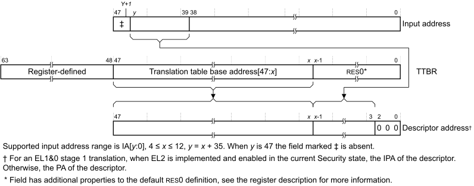
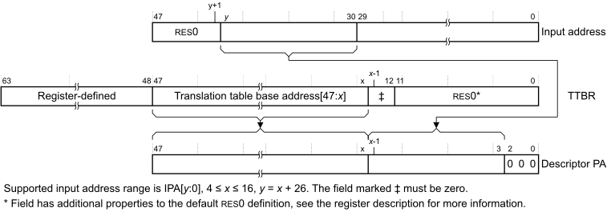
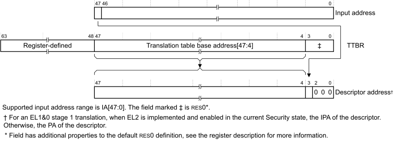
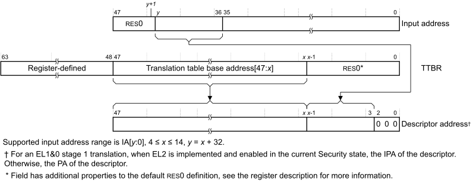
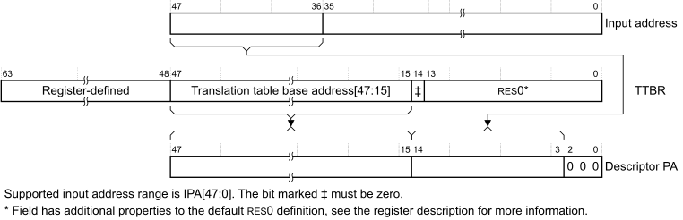
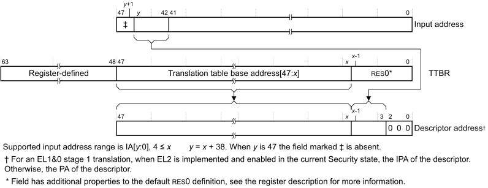
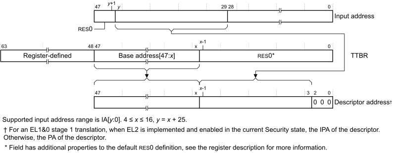
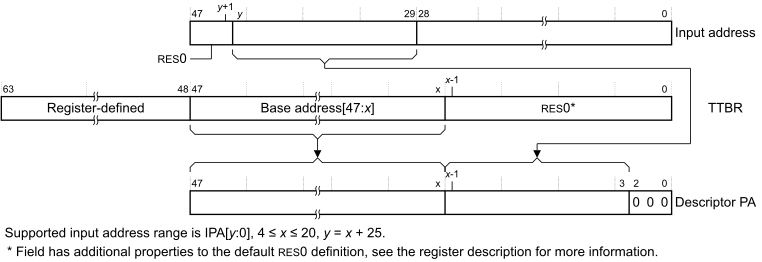

# ​K8.1.1 Examples of performing the initial lookup

Source: <https://developer.arm.com/documentation/ddi0487/mc/-Part-K-Appendixes/-Appendix-K8-Address-Translation-Examples/-K8-1-AArch64-Address-translation-examples/-K8-1-1-Examples-of-performing-the-initial-lookup>

##### K8.1.1 Examples of performing the initial lookup

The address ranges used for the initial translation table lookup depend on the translation granule, as described in:

- [Performing the initial lookup using the 4KB translation granule](/documentation/ddi0487/mc/-Part-K-Appendixes/-Appendix-K8-Address-Translation-Examples/-K8-1-AArch64-Address-translation-examples/-K8-1-1-Examples-of-performing-the-initial-lookup?lang=en#cbbegadd).
- [Performing the initial lookup using the 16KB granule](/documentation/ddi0487/mc/-Part-K-Appendixes/-Appendix-K8-Address-Translation-Examples/-K8-1-AArch64-Address-translation-examples/-K8-1-1-Examples-of-performing-the-initial-lookup?lang=en#chddjdad).
- [Performing the initial lookup using the 64KB translation granule](/documentation/ddi0487/mc/-Part-K-Appendixes/-Appendix-K8-Address-Translation-Examples/-K8-1-AArch64-Address-translation-examples/-K8-1-1-Examples-of-performing-the-initial-lookup?lang=en#cbbihiji).

###### K8.1.1.1 Performing the initial lookup using the 4KB translation granule

This subsection describes examples of the initial lookup when using the 4KB translation granule that [VMSAv8-64 Stage 2 address translation using the 4KB translation granule](/documentation/ddi0487/mc/-Part-D-The-AArch64-System-Level-Architecture/-Chapter-D8-The-AArch64-Virtual-Memory-System-Architecture/-D8-2-Translation-process/-D8-2-8-VMSAv8-64-translation-using-the-4KB-granule?lang=en#mdsec_stage_2_address_translation_using_the_4kb_translation_granule) describes as starting at level 0 or at level 1. It includes those stage 2 translations where concatenation of translation tables is required for the lookup to start at level 1. This means that it gives specific examples of the mechanisms described in [Translation process](/documentation/ddi0487/mc/-Part-D-The-AArch64-System-Level-Architecture/-Chapter-D8-The-AArch64-Virtual-Memory-System-Architecture/-D8-2-Translation-process?lang=en#mdsec_translation_process).

> #### Note
>
> For stage 2 translations, the same principles apply to an initial lookup that [VMSAv8-64 Stage 2 address translation using the 4KB translation granule](/documentation/ddi0487/mc/-Part-D-The-AArch64-System-Level-Architecture/-Chapter-D8-The-AArch64-Virtual-Memory-System-Architecture/-D8-2-Translation-process/-D8-2-8-VMSAv8-64-translation-using-the-4KB-granule?lang=en#mdsec_stage_2_address_translation_using_the_4kb_translation_granule) describes as starting at level 1. In this case, for some IA sizes concatenation of translation tables means the lookup can, instead, start at level 2.

The following subsections describe these examples of the initial lookup:

- [Initial lookup at level 0, 4KB translation granule](/documentation/ddi0487/mc/-Part-K-Appendixes/-Appendix-K8-Address-Translation-Examples/-K8-1-AArch64-Address-translation-examples/-K8-1-1-Examples-of-performing-the-initial-lookup?lang=en#chdgdeid).
- [Initial lookup at level 1, 4KB translation granule](/documentation/ddi0487/mc/-Part-K-Appendixes/-Appendix-K8-Address-Translation-Examples/-K8-1-AArch64-Address-translation-examples/-K8-1-1-Examples-of-performing-the-initial-lookup?lang=en#chdcgeag).

In all cases, for a stage 2 translation, the [VTCR\_EL2](/documentation/ddi0487/mc/-Part-D-The-AArch64-System-Level-Architecture/-Chapter-D24-AArch64-System-Register-Descriptions/-D24-2-General-system-control-registers/-D24-2-223-VTCR-EL2--Virtualization-Translation-Control-Register?lang=en#reg_aarch64_vtcr_el2).SL0 field must indicate the required initial lookup level, and this level must be consistent with the value of the [VTCR\_EL2](/documentation/ddi0487/mc/-Part-D-The-AArch64-System-Level-Architecture/-Chapter-D24-AArch64-System-Register-Descriptions/-D24-2-General-system-control-registers/-D24-2-223-VTCR-EL2--Virtualization-Translation-Control-Register?lang=en#reg_aarch64_vtcr_el2).T0SZ field, see [VMSAv8-64 Stage 2 address translation using the 4KB translation granule](/documentation/ddi0487/mc/-Part-D-The-AArch64-System-Level-Architecture/-Chapter-D8-The-AArch64-Virtual-Memory-System-Architecture/-D8-2-Translation-process/-D8-2-8-VMSAv8-64-translation-using-the-4KB-granule?lang=en#mdsec_stage_2_address_translation_using_the_4kb_translation_granule).

**K8.1.1.1.1 Initial lookup at level 0, 4KB translation granule**

This subsection describes initial lookups with an input address width of (*n*+1) bits, meaning the input address is IA[*n*:0]. As described in [VMSAv8-64 translation using the 4KB granule](/documentation/ddi0487/mc/-Part-D-The-AArch64-System-Level-Architecture/-Chapter-D8-The-AArch64-Virtual-Memory-System-Architecture/-D8-2-Translation-process/-D8-2-8-VMSAv8-64-translation-using-the-4KB-granule?lang=en#mdsec_translation_using_the_4kb_granule), a stage 1 or stage 2 initial lookup at level 0 is required when 39 ≤ *n* ≤ 47. For these lookups:

- [TTBR\_ELx](/documentation/ddi0487/mc/-Part-D-The-AArch64-System-Level-Architecture/-Chapter-D8-The-AArch64-Virtual-Memory-System-Architecture/-D8-1-Address-translation/-D8-1-4-The-System-registers-relevant-to-MMU-operation?lang=en#chdbibbd)[47:(*n*-35)] specify the translation table base address.
- Bits[*n*:39] of the input address are bits[(*n*-36):3] of the descriptor offset in the translation table.

> #### Note
>
> This means that, when the input address width is less than 48 bits:
>
> - The size of the translation table is reduced.
> - More low-order bits of the [TTBR\_ELx](/documentation/ddi0487/mc/-Part-D-The-AArch64-System-Level-Architecture/-Chapter-D8-The-AArch64-Virtual-Memory-System-Architecture/-D8-1-Address-translation/-D8-1-4-The-System-registers-relevant-to-MMU-operation?lang=en#chdbibbd) are required to specify the translation table base address.
> - Fewer input address bit are used to specify the descriptor offset in the translation table.
>
> For example, if the input address width is 46 bits:
>
> - The translation table size is 1KB.
> - [TTBR\_ELx](/documentation/ddi0487/mc/-Part-D-The-AArch64-System-Level-Architecture/-Chapter-D8-The-AArch64-Virtual-Memory-System-Architecture/-D8-1-Address-translation/-D8-1-4-The-System-registers-relevant-to-MMU-operation?lang=en#chdbibbd) bits[47:10] specify the translation table base address.
> - Input address bits[45:39] specify bits[9:3] of the descriptor offset.

[Figure K8-1](/documentation/ddi0487/mc/-Part-K-Appendixes/-Appendix-K8-Address-Translation-Examples/-K8-1-AArch64-Address-translation-examples/-K8-1-1-Examples-of-performing-the-initial-lookup?lang=en#fig_beiiidah) shows this lookup:

Figure K8-1 Initial lookup for VMSAv8-64 using the 4KB granule, starting at level 0

**K8.1.1.1.2 Initial lookup at level 1, 4KB translation granule**

This subsection describes initial lookups with an input address width of (*n*+1) bits, meaning the input address is IA[*n*:0].

For a stage 1 or stage 2 initial lookup at level 1, without use of concatenated translation tables
:   As described in [VMSAv8-64 translation using the 4KB granule](/documentation/ddi0487/mc/-Part-D-The-AArch64-System-Level-Architecture/-Chapter-D8-The-AArch64-Virtual-Memory-System-Architecture/-D8-2-Translation-process/-D8-2-8-VMSAv8-64-translation-using-the-4KB-granule?lang=en#mdsec_translation_using_the_4kb_granule), this applies to IA[*n*:0], where 30 ≤ *n* ≤ 38. For these lookups:

    - There is a single translation table at this level.
    - [TTBR\_ELx](/documentation/ddi0487/mc/-Part-D-The-AArch64-System-Level-Architecture/-Chapter-D8-The-AArch64-Virtual-Memory-System-Architecture/-D8-1-Address-translation/-D8-1-4-The-System-registers-relevant-to-MMU-operation?lang=en#chdbibbd)[47:(*n*-26)] specify the translation table base address.
    - Bits[*n*:30] of the input address are bits[(*n*-27):3] of the descriptor offset in the translation table.

    [Figure K8-2](/documentation/ddi0487/mc/-Part-K-Appendixes/-Appendix-K8-Address-Translation-Examples/-K8-1-AArch64-Address-translation-examples/-K8-1-1-Examples-of-performing-the-initial-lookup?lang=en#fig_chdgdihh) shows this lookup:

    Figure K8-2 Initial lookup for VMSAv8-64 using the 4KB granule, starting at level 1, without concatenation

    

For a stage 2 initial lookup at level 1, with concatenated translation tables
:   As described in [VMSAv8-64 Stage 2 address translation using the 4KB translation granule](/documentation/ddi0487/mc/-Part-D-The-AArch64-System-Level-Architecture/-Chapter-D8-The-AArch64-Virtual-Memory-System-Architecture/-D8-2-Translation-process/-D8-2-8-VMSAv8-64-translation-using-the-4KB-granule?lang=en#mdsec_stage_2_address_translation_using_the_4kb_translation_granule), this applies to IA[*n*:0], where 39 ≤ *n* ≤ 42. For these lookups:

    - There are 2(*n*-38) concatenated translation tables at this level.
    - These concatenated translation tables must be aligned to 2(*n*-38) × 4KB. This means [TTBR\_ELx](/documentation/ddi0487/mc/-Part-D-The-AArch64-System-Level-Architecture/-Chapter-D8-The-AArch64-Virtual-Memory-System-Architecture/-D8-1-Address-translation/-D8-1-4-The-System-registers-relevant-to-MMU-operation?lang=en#chdbibbd)[(*n* -27):12] must be zero.
    - [TTBR\_ELx](/documentation/ddi0487/mc/-Part-D-The-AArch64-System-Level-Architecture/-Chapter-D8-The-AArch64-Virtual-Memory-System-Architecture/-D8-1-Address-translation/-D8-1-4-The-System-registers-relevant-to-MMU-operation?lang=en#chdbibbd)[47:(*n*-26)] specify the base address of the block of concatenated translation tables.
    - Bits[*n*:30] of the input address are bits[(*n*-27):3] of the descriptor offset from the base address of the block of concatenated translation tables.

    [Figure K8-3](/documentation/ddi0487/mc/-Part-K-Appendixes/-Appendix-K8-Address-Translation-Examples/-K8-1-AArch64-Address-translation-examples/-K8-1-1-Examples-of-performing-the-initial-lookup?lang=en#fig_cbbcfcde) shows this lookup:

    Figure K8-3 Initial lookup for VMSAv8-64 using the 4KB granule, starting at level 1, with concatenation

    

###### K8.1.1.2 Performing the initial lookup using the 16KB granule

This subsection describes examples of the initial lookup when using the 16KB translation granule that [VMSAv8-64 Stage 2 address translation using the 16KB translation granule](/documentation/ddi0487/mc/-Part-D-The-AArch64-System-Level-Architecture/-Chapter-D8-The-AArch64-Virtual-Memory-System-Architecture/-D8-2-Translation-process/-D8-2-9-VMSAv8-64-translation-using-the-16KB-granule?lang=en#mdsec_stage_2_address_translation_using_the_16kb_translation_granule) describes as starting at level 0 or at level 1. It includes those stage 2 translations where concatenation of translation tables is required for the lookup to start at level 1. This means that it gives specific examples of the mechanisms described in [Translation process](/documentation/ddi0487/mc/-Part-D-The-AArch64-System-Level-Architecture/-Chapter-D8-The-AArch64-Virtual-Memory-System-Architecture/-D8-2-Translation-process?lang=en#mdsec_translation_process).

> #### Note
>
> For stage 2 translations, the same principles apply to an initial lookup that [VMSAv8-64 Stage 2 address translation using the 16KB translation granule](/documentation/ddi0487/mc/-Part-D-The-AArch64-System-Level-Architecture/-Chapter-D8-The-AArch64-Virtual-Memory-System-Architecture/-D8-2-Translation-process/-D8-2-9-VMSAv8-64-translation-using-the-16KB-granule?lang=en#mdsec_stage_2_address_translation_using_the_16kb_translation_granule) describes as starting at level 1. In this case, for some IA sizes concatenation of translation tables means the lookup can, instead, start at level 2.

The following subsections describe these examples of the initial lookup:

- [Initial lookup at level 0, 16KB translation granule](/documentation/ddi0487/mc/-Part-K-Appendixes/-Appendix-K8-Address-Translation-Examples/-K8-1-AArch64-Address-translation-examples/-K8-1-1-Examples-of-performing-the-initial-lookup?lang=en#chddiedj).
- [Initial lookup at level 1, 16KB translation granule](/documentation/ddi0487/mc/-Part-K-Appendixes/-Appendix-K8-Address-Translation-Examples/-K8-1-AArch64-Address-translation-examples/-K8-1-1-Examples-of-performing-the-initial-lookup?lang=en#chdijgdi).

In all cases, for a stage 2 translation, the [VTCR\_EL2](/documentation/ddi0487/mc/-Part-D-The-AArch64-System-Level-Architecture/-Chapter-D24-AArch64-System-Register-Descriptions/-D24-2-General-system-control-registers/-D24-2-223-VTCR-EL2--Virtualization-Translation-Control-Register?lang=en#reg_aarch64_vtcr_el2).SL0 field must indicate the required initial lookup level, and this level must be consistent with the value of the [VTCR\_EL2](/documentation/ddi0487/mc/-Part-D-The-AArch64-System-Level-Architecture/-Chapter-D24-AArch64-System-Register-Descriptions/-D24-2-General-system-control-registers/-D24-2-223-VTCR-EL2--Virtualization-Translation-Control-Register?lang=en#reg_aarch64_vtcr_el2).T0SZ field, see [VMSAv8-64 Stage 2 address translation using the 16KB translation granule](/documentation/ddi0487/mc/-Part-D-The-AArch64-System-Level-Architecture/-Chapter-D8-The-AArch64-Virtual-Memory-System-Architecture/-D8-2-Translation-process/-D8-2-9-VMSAv8-64-translation-using-the-16KB-granule?lang=en#mdsec_stage_2_address_translation_using_the_16kb_translation_granule).

**K8.1.1.2.1 Initial lookup at level 0, 16KB translation granule**

This subsection describes initial lookups with an input address width of (*n*+1) bits, meaning the input address is IA[*n*:0]. As described in [VMSAv8-64 translation using the 16KB granule](/documentation/ddi0487/mc/-Part-D-The-AArch64-System-Level-Architecture/-Chapter-D8-The-AArch64-Virtual-Memory-System-Architecture/-D8-2-Translation-process/-D8-2-9-VMSAv8-64-translation-using-the-16KB-granule?lang=en#mdsec_translation_using_the_16kb_granule), the only case where an address translation using the 16KB granule starts at level 0 is a stage 1 translation of a 48-bit input address, IA[47:0]. For this lookup:

- The required translation table has only two entries, meaning its size is 16 bytes, and it must be aligned to 16 bytes.
- [TTBR\_ELx](/documentation/ddi0487/mc/-Part-D-The-AArch64-System-Level-Architecture/-Chapter-D8-The-AArch64-Virtual-Memory-System-Architecture/-D8-1-Address-translation/-D8-1-4-The-System-registers-relevant-to-MMU-operation?lang=en#chdbibbd)[47:4] specify the translation table base address.
- Bit[47] of the input address is bit[3] of the descriptor offset in the translation table.

[Figure K8-4](/documentation/ddi0487/mc/-Part-K-Appendixes/-Appendix-K8-Address-Translation-Examples/-K8-1-AArch64-Address-translation-examples/-K8-1-1-Examples-of-performing-the-initial-lookup?lang=en#fig_chddcjgd) shows this lookup:

Figure K8-4 Initial lookup for VMSAv8-64 using the 16KB granule, starting at level 0

**K8.1.1.2.2 Initial lookup at level 1, 16KB translation granule**

This subsection describes initial lookups with an input address width of (*n*+1) bits, meaning the input address is IA[*n*:0].

For a stage 1 or stage 2 initial lookup at level 1, without use of concatenated translation tables
:   As described in [VMSAv8-64 translation using the 16KB granule](/documentation/ddi0487/mc/-Part-D-The-AArch64-System-Level-Architecture/-Chapter-D8-The-AArch64-Virtual-Memory-System-Architecture/-D8-2-Translation-process/-D8-2-9-VMSAv8-64-translation-using-the-16KB-granule?lang=en#mdsec_translation_using_the_16kb_granule), this applies to IA[*n*:0], where 36 ≤ *n* ≤ 46. For these lookups:

    - There is a single translation table at this level.
    - [TTBR\_ELx](/documentation/ddi0487/mc/-Part-D-The-AArch64-System-Level-Architecture/-Chapter-D8-The-AArch64-Virtual-Memory-System-Architecture/-D8-1-Address-translation/-D8-1-4-The-System-registers-relevant-to-MMU-operation?lang=en#chdbibbd)[47:(*n*-32)] specify the translation table base address.
    - Bits[*n*:36] of the input address are bits[(*n*-33):3] of the descriptor offset in the translation table.

    [Figure K8-5](/documentation/ddi0487/mc/-Part-K-Appendixes/-Appendix-K8-Address-Translation-Examples/-K8-1-AArch64-Address-translation-examples/-K8-1-1-Examples-of-performing-the-initial-lookup?lang=en#fig_chdhgcdf) shows this lookup:

    Figure K8-5 Initial lookup for VMSAv8-64 using the 16KB granule, starting at level 1, without concatenation

    

For a stage 2 initial lookup at level 1, with concatenated translation tables
:   As described in [VMSAv8-64 Stage 2 address translation using the 16KB translation granule](/documentation/ddi0487/mc/-Part-D-The-AArch64-System-Level-Architecture/-Chapter-D8-The-AArch64-Virtual-Memory-System-Architecture/-D8-2-Translation-process/-D8-2-9-VMSAv8-64-translation-using-the-16KB-granule?lang=en#mdsec_stage_2_address_translation_using_the_16kb_translation_granule), the only case where an address translation using the 16KB granule starts at level 1 because of concatenation of translation tables is a stage 2 translation of a 48-bit input address, IA[47:0]. For this lookup:

    - There are two concatenated translation tables at this level.
    - These concatenated translation tables must be aligned to 2 × 16KB. This means [TTBR\_ELx](/documentation/ddi0487/mc/-Part-D-The-AArch64-System-Level-Architecture/-Chapter-D8-The-AArch64-Virtual-Memory-System-Architecture/-D8-1-Address-translation/-D8-1-4-The-System-registers-relevant-to-MMU-operation?lang=en#chdbibbd)[14] must be zero.
    - [TTBR\_ELx](/documentation/ddi0487/mc/-Part-D-The-AArch64-System-Level-Architecture/-Chapter-D8-The-AArch64-Virtual-Memory-System-Architecture/-D8-1-Address-translation/-D8-1-4-The-System-registers-relevant-to-MMU-operation?lang=en#chdbibbd)[47:15] specify the base address of the block of two concatenated translation tables.
    - Bits[47:36] of the input address are bits[14:3] of the descriptor offset from the base address of the block of concatenated translation tables.

    [Figure K8-6](/documentation/ddi0487/mc/-Part-K-Appendixes/-Appendix-K8-Address-Translation-Examples/-K8-1-AArch64-Address-translation-examples/-K8-1-1-Examples-of-performing-the-initial-lookup?lang=en#fig_chdhgaad) shows this lookup:

    Figure K8-6 Initial lookup for VMSAv8-64 using the 16KB granule, starting at level 1, with concatenation

    

###### K8.1.1.3 Performing the initial lookup using the 64KB translation granule

This subsection describes examples of the initial lookup when using the 64KB translation granule that [VMSAv8-64 Stage 2 address translation using the 64KB translation granule](/documentation/ddi0487/mc/-Part-D-The-AArch64-System-Level-Architecture/-Chapter-D8-The-AArch64-Virtual-Memory-System-Architecture/-D8-2-Translation-process/-D8-2-10-VMSAv8-64-translation-using-the-64KB-granule?lang=en#mdsec_stage_2_address_translation_using_the_64kb_translation_granule) describes as starting at level 1 or at level 2. It includes those stage 2 translations where concatenation of translation tables is required for the lookup to start at level 2. This means that it gives specific examples of the mechanisms described in [Translation process](/documentation/ddi0487/mc/-Part-D-The-AArch64-System-Level-Architecture/-Chapter-D8-The-AArch64-Virtual-Memory-System-Architecture/-D8-2-Translation-process?lang=en#mdsec_translation_process).

> #### Note
>
> For stage 2 translations, the same principles apply to an initial lookup that [VMSAv8-64 Stage 2 address translation using the 64KB translation granule](/documentation/ddi0487/mc/-Part-D-The-AArch64-System-Level-Architecture/-Chapter-D8-The-AArch64-Virtual-Memory-System-Architecture/-D8-2-Translation-process/-D8-2-10-VMSAv8-64-translation-using-the-64KB-granule?lang=en#mdsec_stage_2_address_translation_using_the_64kb_translation_granule) describes as starting at level 2. In this case, for some IA sizes concatenation of translation tables means the lookup can, instead, start at level 3.

The following subsections describe these examples of the initial lookup:

- [Initial lookup at level 1, 64KB translation granule](/documentation/ddi0487/mc/-Part-K-Appendixes/-Appendix-K8-Address-Translation-Examples/-K8-1-AArch64-Address-translation-examples/-K8-1-1-Examples-of-performing-the-initial-lookup?lang=en#chddefcf).
- [Initial lookup at level 2, 64KB translation granule](/documentation/ddi0487/mc/-Part-K-Appendixes/-Appendix-K8-Address-Translation-Examples/-K8-1-AArch64-Address-translation-examples/-K8-1-1-Examples-of-performing-the-initial-lookup?lang=en#chddjfea).

In all cases, for a stage 2 translation, the [VTCR\_EL2](/documentation/ddi0487/mc/-Part-D-The-AArch64-System-Level-Architecture/-Chapter-D24-AArch64-System-Register-Descriptions/-D24-2-General-system-control-registers/-D24-2-223-VTCR-EL2--Virtualization-Translation-Control-Register?lang=en#reg_aarch64_vtcr_el2).SL0 field must indicate the required initial lookup level, and this level must be consistent with the value of the [VTCR\_EL2](/documentation/ddi0487/mc/-Part-D-The-AArch64-System-Level-Architecture/-Chapter-D24-AArch64-System-Register-Descriptions/-D24-2-General-system-control-registers/-D24-2-223-VTCR-EL2--Virtualization-Translation-Control-Register?lang=en#reg_aarch64_vtcr_el2).T0SZ field, see [VMSAv8-64 Stage 2 address translation using the 64KB translation granule](/documentation/ddi0487/mc/-Part-D-The-AArch64-System-Level-Architecture/-Chapter-D8-The-AArch64-Virtual-Memory-System-Architecture/-D8-2-Translation-process/-D8-2-10-VMSAv8-64-translation-using-the-64KB-granule?lang=en#mdsec_stage_2_address_translation_using_the_64kb_translation_granule).

**K8.1.1.3.1 Initial lookup at level 1, 64KB translation granule**

This subsection describes initial lookups with an input address width of (*n*+1) bits, meaning the input address is IA[*n*:0]. As described in [VMSAv8-64 translation using the 64KB granule](/documentation/ddi0487/mc/-Part-D-The-AArch64-System-Level-Architecture/-Chapter-D8-The-AArch64-Virtual-Memory-System-Architecture/-D8-2-Translation-process/-D8-2-10-VMSAv8-64-translation-using-the-64KB-granule?lang=en#mdsec_translation_using_the_64kb_granule), a stage 1 or stage 2 initial lookup at level 1 is required when 42 ≤ *n* ≤ 47. For these lookups:

- The size of the translation table is 2(*n*-39) bytes. This means the size of the translation table, at this level, is always less than the granule size. The address of this translation table must align to the size of the table.
- Bits[*n*:42] of the input address are bits[(*n* - 39):3] of the descriptor offset in the translation table.
- Bits[47:(*n*-38)] of the [TTBR\_ELx](/documentation/ddi0487/mc/-Part-D-The-AArch64-System-Level-Architecture/-Chapter-D8-The-AArch64-Virtual-Memory-System-Architecture/-D8-1-Address-translation/-D8-1-4-The-System-registers-relevant-to-MMU-operation?lang=en#chdbibbd) specify the translation table base address.

[Figure K8-7](/documentation/ddi0487/mc/-Part-K-Appendixes/-Appendix-K8-Address-Translation-Examples/-K8-1-AArch64-Address-translation-examples/-K8-1-1-Examples-of-performing-the-initial-lookup?lang=en#fig_cbbfdejh) shows this lookup:

Figure K8-7 Initial lookup for VMSAv8-64 using the 64KB granule, starting at level 1

**K8.1.1.3.2 Initial lookup at level 2, 64KB translation granule**

This subsection describes initial lookups with an input address width of (*n*+1) bits, meaning the input address is IA[*n*:0].

For a stage 1 or stage 2 initial lookup at level 2, without the use of concatenated translation tables
:   As described in [VMSAv8-64 translation using the 64KB granule](/documentation/ddi0487/mc/-Part-D-The-AArch64-System-Level-Architecture/-Chapter-D8-The-AArch64-Virtual-Memory-System-Architecture/-D8-2-Translation-process/-D8-2-10-VMSAv8-64-translation-using-the-64KB-granule?lang=en#mdsec_translation_using_the_64kb_granule), this applies to IA[*n*:0], where 29 ≤ *n* ≤ 41. For these lookups:

    - There is a single translation table at this level.
    - [TTBR\_ELx](/documentation/ddi0487/mc/-Part-D-The-AArch64-System-Level-Architecture/-Chapter-D8-The-AArch64-Virtual-Memory-System-Architecture/-D8-1-Address-translation/-D8-1-4-The-System-registers-relevant-to-MMU-operation?lang=en#chdbibbd)[47:(*n*-25)] of the specify the translation table base address.
    - Bits[*n*:29] of the input address are bits[(*n*-26):3] of the descriptor offset in the translation table.

    [Figure K8-8](/documentation/ddi0487/mc/-Part-K-Appendixes/-Appendix-K8-Address-Translation-Examples/-K8-1-AArch64-Address-translation-examples/-K8-1-1-Examples-of-performing-the-initial-lookup?lang=en#fig_cbbdggjc) shows this lookup:

    Figure K8-8 Initial lookup for VMSAv8-64 using the 64KB granule, starting at level 2, without concatenation

    

For a stage 2 initial lookup at level 2, with concatenated translation tables
:   As described in [VMSAv8-64 Stage 2 address translation using the 64KB translation granule](/documentation/ddi0487/mc/-Part-D-The-AArch64-System-Level-Architecture/-Chapter-D8-The-AArch64-Virtual-Memory-System-Architecture/-D8-2-Translation-process/-D8-2-10-VMSAv8-64-translation-using-the-64KB-granule?lang=en#mdsec_stage_2_address_translation_using_the_64kb_translation_granule), this applies to IA[*n*:0], where 42 ≤ *n* ≤ 45. For these lookups:

    - There are 2(*m*-41) concatenated translation tables at this level.
    - These concatenated translation tables must be aligned to 2(*m*-41) × 64KB. This means [TTBR\_ELx](/documentation/ddi0487/mc/-Part-D-The-AArch64-System-Level-Architecture/-Chapter-D8-The-AArch64-Virtual-Memory-System-Architecture/-D8-1-Address-translation/-D8-1-4-The-System-registers-relevant-to-MMU-operation?lang=en#chdbibbd)[(*n*-26):16] must be zero.
    - [TTBR\_ELx](/documentation/ddi0487/mc/-Part-D-The-AArch64-System-Level-Architecture/-Chapter-D8-The-AArch64-Virtual-Memory-System-Architecture/-D8-1-Address-translation/-D8-1-4-The-System-registers-relevant-to-MMU-operation?lang=en#chdbibbd)[47:(*n*-25)] specify the base address of the block of translation tables.
    - Bits[ *n*:42] of the input address are bits[(*n*-26):16] of the descriptor offset from the base address of the block of translation tables.

    [Figure K8-9](/documentation/ddi0487/mc/-Part-K-Appendixes/-Appendix-K8-Address-Translation-Examples/-K8-1-AArch64-Address-translation-examples/-K8-1-1-Examples-of-performing-the-initial-lookup?lang=en#fig_chdfebbh) shows this lookup:

    Figure K8-9 Initial lookup for VMSAv8-64 using the 64KB granule, starting at level 2, with concatenation

    
