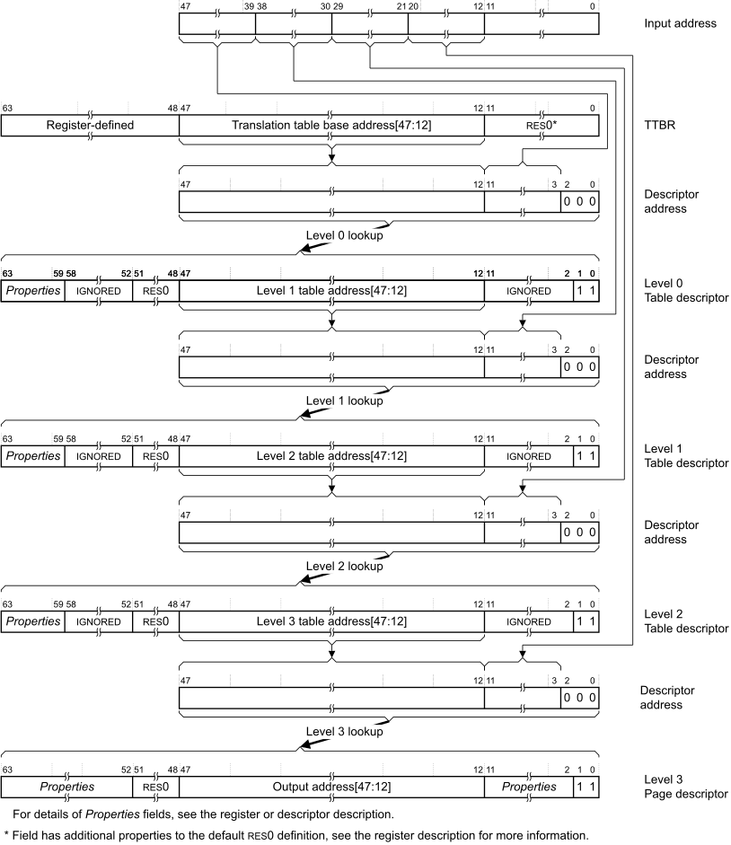
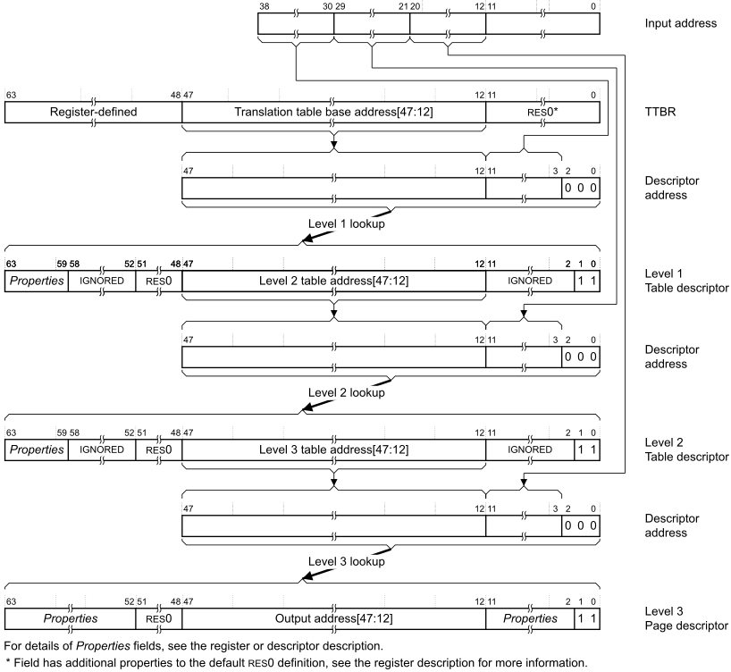
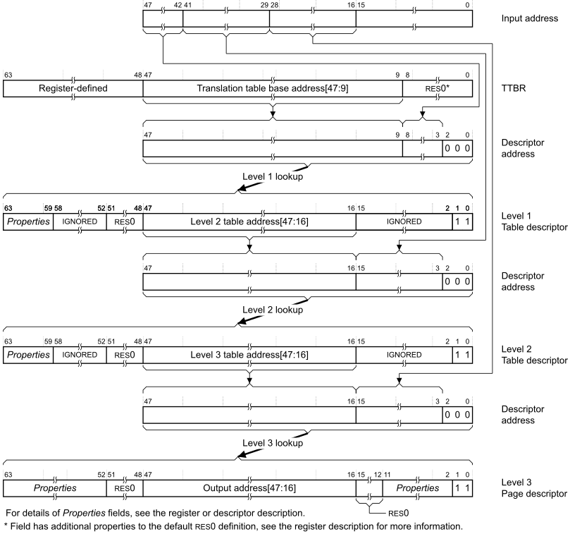
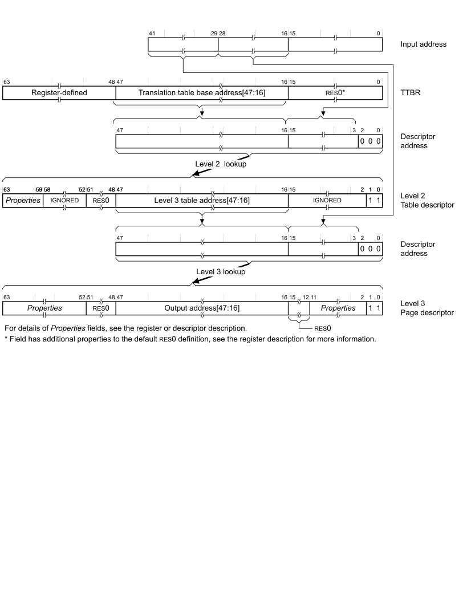

# ​K8.1.2 Full translation flows for VMSAv8-64 address translation

Source: <https://developer.arm.com/documentation/ddi0487/mc/-Part-K-Appendixes/-Appendix-K8-Address-Translation-Examples/-K8-1-AArch64-Address-translation-examples/-K8-1-2-Full-translation-flows-for-VMSAv8-64-address-translation>

##### K8.1.2 Full translation flows for VMSAv8-64 address translation

In a translation table walk, only the first lookup uses the translation table base address from the appropriate [TTBR\_ELx](/documentation/ddi0487/mc/-Part-D-The-AArch64-System-Level-Architecture/-Chapter-D8-The-AArch64-Virtual-Memory-System-Architecture/-D8-1-Address-translation/-D8-1-4-The-System-registers-relevant-to-MMU-operation?lang=en#chdbibbd). Subsequent lookups use a combination of address information from:

- The table descriptor read in the previous lookup.
- The input address.

This section describes example full translation flows, from the initial lookup to the address of a memory page. The example flows:

- Resolve the maximum-sized IA range supported by the initial lookup level.
- Do not have any concatenation of translation tables.
- Cover only the 4KB and the 64KB translation granules.

[Examples of performing the initial lookup](/documentation/ddi0487/mc/-Part-K-Appendixes/-Appendix-K8-Address-Translation-Examples/-K8-1-AArch64-Address-translation-examples/-K8-1-1-Examples-of-performing-the-initial-lookup?lang=en#cbbgahfe) described how either reducing the IA range or concatenating translation tables affects the initial lookup.

> #### Note
>
> Reducing the IA range or concatenating translation tables affects only the initial lookup.

The following sections describe full VMSAv8-64 translation flows, down to an entry for a memory page:

- [The address and properties fields shown in the translation flows](/documentation/ddi0487/mc/-Part-K-Appendixes/-Appendix-K8-Address-Translation-Examples/-K8-1-AArch64-Address-translation-examples/-K8-1-2-Full-translation-flows-for-VMSAv8-64-address-translation?lang=en#beijbgja).
- [Full translation flow using the 4KB granule and starting at level 0](/documentation/ddi0487/mc/-Part-K-Appendixes/-Appendix-K8-Address-Translation-Examples/-K8-1-AArch64-Address-translation-examples/-K8-1-2-Full-translation-flows-for-VMSAv8-64-address-translation?lang=en#beijbddb).
- [Full translation flow using the 4KB granule and starting at level 1](/documentation/ddi0487/mc/-Part-K-Appendixes/-Appendix-K8-Address-Translation-Examples/-K8-1-AArch64-Address-translation-examples/-K8-1-2-Full-translation-flows-for-VMSAv8-64-address-translation?lang=en#beighifj).
- [Full translation flow using the 64KB granule and starting at level 1](/documentation/ddi0487/mc/-Part-K-Appendixes/-Appendix-K8-Address-Translation-Examples/-K8-1-AArch64-Address-translation-examples/-K8-1-2-Full-translation-flows-for-VMSAv8-64-address-translation?lang=en#cbbbecjf).
- [Full translation flow using the 64KB granule and starting at level 2](/documentation/ddi0487/mc/-Part-K-Appendixes/-Appendix-K8-Address-Translation-Examples/-K8-1-AArch64-Address-translation-examples/-K8-1-2-Full-translation-flows-for-VMSAv8-64-address-translation?lang=en#cbbfhiad).

###### K8.1.2.1 The address and properties fields shown in the translation flows

For an EL1&0 stage 1 translation, when EL2 is implemented and enabled in the current Security state:

- Any descriptor address is the IPA of the required descriptor.
- The final output address is the IPA of the block or page.

In these cases, an EL1&0 stage 2 translation is performed to translate the IPA to the required PA.

For all other translations, the final output address is the PA of the block or page, and any descriptor address is the PA of the descriptor.

*Properties* indicates register or translation table fields that return information, other than address information, about the translation or the targeted memory region. For more information, see [Translation table descriptor formats](/documentation/ddi0487/mc/-Part-D-The-AArch64-System-Level-Architecture/-Chapter-D8-The-AArch64-Virtual-Memory-System-Architecture/-D8-3-Translation-table-descriptor-formats?lang=en#mdsec_translation_table_descriptor_formats).

###### K8.1.2.2 Full translation flow using the 4KB granule and starting at level 0

[Figure K8-10](/documentation/ddi0487/mc/-Part-K-Appendixes/-Appendix-K8-Address-Translation-Examples/-K8-1-AArch64-Address-translation-examples/-K8-1-2-Full-translation-flows-for-VMSAv8-64-address-translation?lang=en#fig_beiicgad) shows the complete translation flow for a stage 1 translation table walk for a 48-bit input address. This lookup must start with a level 0 lookup. For more information about the fields shown in the figure, see [The address and properties fields shown in the translation flows](/documentation/ddi0487/mc/-Part-K-Appendixes/-Appendix-K8-Address-Translation-Examples/-K8-1-AArch64-Address-translation-examples/-K8-1-2-Full-translation-flows-for-VMSAv8-64-address-translation?lang=en#beijbgja).

Figure K8-10 Complete stage 1 translation of a 48-bit address using the 4KB translation granule

If the level 1 lookup or level 2 lookup returns a block descriptor then the translation table walk completes at that level.

[Figure K8-10](/documentation/ddi0487/mc/-Part-K-Appendixes/-Appendix-K8-Address-Translation-Examples/-K8-1-AArch64-Address-translation-examples/-K8-1-2-Full-translation-flows-for-VMSAv8-64-address-translation?lang=en#fig_beiicgad) shows a stage 1 translation. The only difference for a stage 2 translation is that bits[63:58] of the Table descriptors are SBZ.

###### K8.1.2.3 Full translation flow using the 4KB granule and starting at level 1

[Figure K8-11](/documentation/ddi0487/mc/-Part-K-Appendixes/-Appendix-K8-Address-Translation-Examples/-K8-1-AArch64-Address-translation-examples/-K8-1-2-Full-translation-flows-for-VMSAv8-64-address-translation?lang=en#fig_beijgdga) shows the complete translation flow for a stage 1 translation table walk for a 39-bit input address. This lookup must start with a level 1 lookup. For more information about the fields shown in the figure, see [The address and properties fields shown in the translation flows](/documentation/ddi0487/mc/-Part-K-Appendixes/-Appendix-K8-Address-Translation-Examples/-K8-1-AArch64-Address-translation-examples/-K8-1-2-Full-translation-flows-for-VMSAv8-64-address-translation?lang=en#beijbgja).

Figure K8-11 Complete stage 1 translation of a 39-bit address using the 4KB translation granule

If the level 1 lookup or the level 2 lookup returns a block descriptor then the translation table walk completes at that level.

[Figure K8-11](/documentation/ddi0487/mc/-Part-K-Appendixes/-Appendix-K8-Address-Translation-Examples/-K8-1-AArch64-Address-translation-examples/-K8-1-2-Full-translation-flows-for-VMSAv8-64-address-translation?lang=en#fig_beijgdga) shows a stage 1 translation. The only difference for a stage 2 translation is that bits[63:58] of the Table descriptors are SBZ.

Comparing this translation with the translation for a 48-bit address, shown in [Figure K8-10](/documentation/ddi0487/mc/-Part-K-Appendixes/-Appendix-K8-Address-Translation-Examples/-K8-1-AArch64-Address-translation-examples/-K8-1-2-Full-translation-flows-for-VMSAv8-64-address-translation?lang=en#fig_beiicgad), shows how the translation for the 42-bit address start the same lookup process one stage later.

###### K8.1.2.4 Full translation flow using the 64KB granule and starting at level 1

[Figure K8-12](/documentation/ddi0487/mc/-Part-K-Appendixes/-Appendix-K8-Address-Translation-Examples/-K8-1-AArch64-Address-translation-examples/-K8-1-2-Full-translation-flows-for-VMSAv8-64-address-translation?lang=en#fig_cbbdgeii) shows the complete translation flow for a stage 1 translation table walk for a 48-bit input address. This lookup must start with a level 1 lookup. For more information about the fields shown in the figure, see [The address and properties fields shown in the translation flows](/documentation/ddi0487/mc/-Part-K-Appendixes/-Appendix-K8-Address-Translation-Examples/-K8-1-AArch64-Address-translation-examples/-K8-1-2-Full-translation-flows-for-VMSAv8-64-address-translation?lang=en#beijbgja).

Figure K8-12 Complete stage 1 translation of a 48-bit address using the 64KB translation granule

If the level 2 lookup returns a block descriptor then the translation table walk completes at that level.

[Figure K8-12](/documentation/ddi0487/mc/-Part-K-Appendixes/-Appendix-K8-Address-Translation-Examples/-K8-1-AArch64-Address-translation-examples/-K8-1-2-Full-translation-flows-for-VMSAv8-64-address-translation?lang=en#fig_cbbdgeii) shows a stage 1 translation. The only difference for a stage 2 translation is that bits[63:58] of the Table descriptors are SBZ.

The level 1 lookup resolves only 6 bits of the input address. As described in [Performing the initial lookup using the 64KB translation granule](/documentation/ddi0487/mc/-Part-K-Appendixes/-Appendix-K8-Address-Translation-Examples/-K8-1-AArch64-Address-translation-examples/-K8-1-1-Examples-of-performing-the-initial-lookup?lang=en#cbbihiji), this means:

- The translation table size for this level is only 512 bytes.
- The required translation table alignment for this level is 512 bytes.
- The Base address field in the [TTBR\_ELx](/documentation/ddi0487/mc/-Part-D-The-AArch64-System-Level-Architecture/-Chapter-D8-The-AArch64-Virtual-Memory-System-Architecture/-D8-1-Address-translation/-D8-1-4-The-System-registers-relevant-to-MMU-operation?lang=en#chdbibbd) is extended, at the low-order end, to be bits[47:9].

###### K8.1.2.5 Full translation flow using the 64KB granule and starting at level 2

[Figure K8-13](/documentation/ddi0487/mc/-Part-K-Appendixes/-Appendix-K8-Address-Translation-Examples/-K8-1-AArch64-Address-translation-examples/-K8-1-2-Full-translation-flows-for-VMSAv8-64-address-translation?lang=en#fig_cbbgcedg) shows the complete translation flow for a stage 1 translation table walk for a 42-bit input address. This lookup must start with a level 2 lookup. For more information about the fields shown in the figure, see [The address and properties fields shown in the translation flows](/documentation/ddi0487/mc/-Part-K-Appendixes/-Appendix-K8-Address-Translation-Examples/-K8-1-AArch64-Address-translation-examples/-K8-1-2-Full-translation-flows-for-VMSAv8-64-address-translation?lang=en#beijbgja).

Figure K8-13 Complete stage 1 translation of a 42-bit address using the 64KB translation granule

If the level 2 lookup returns a block descriptor then the translation table walk completes at that level.

[Figure K8-13](/documentation/ddi0487/mc/-Part-K-Appendixes/-Appendix-K8-Address-Translation-Examples/-K8-1-AArch64-Address-translation-examples/-K8-1-2-Full-translation-flows-for-VMSAv8-64-address-translation?lang=en#fig_cbbgcedg) shows a stage 1 translation. The only difference for a stage 2 translation is that bits[63:58] of the Table descriptors are SBZ.

Comparing this translation with the translation for a 48-bit address, shown in [Figure K8-12](/documentation/ddi0487/mc/-Part-K-Appendixes/-Appendix-K8-Address-Translation-Examples/-K8-1-AArch64-Address-translation-examples/-K8-1-2-Full-translation-flows-for-VMSAv8-64-address-translation?lang=en#fig_cbbdgeii), shows:

- The translation for the 42-bit address starts the same lookup process one stage later.
- Because the initial lookup resolves 13 bits of address:

  - The translation table size for this level is 64KB.
  - The required translation table alignment for this level is 64KB.
  - The Base address field in the [TTBR\_ELx](/documentation/ddi0487/mc/-Part-D-The-AArch64-System-Level-Architecture/-Chapter-D8-The-AArch64-Virtual-Memory-System-Architecture/-D8-1-Address-translation/-D8-1-4-The-System-registers-relevant-to-MMU-operation?lang=en#chdbibbd) is bits[47:16].
