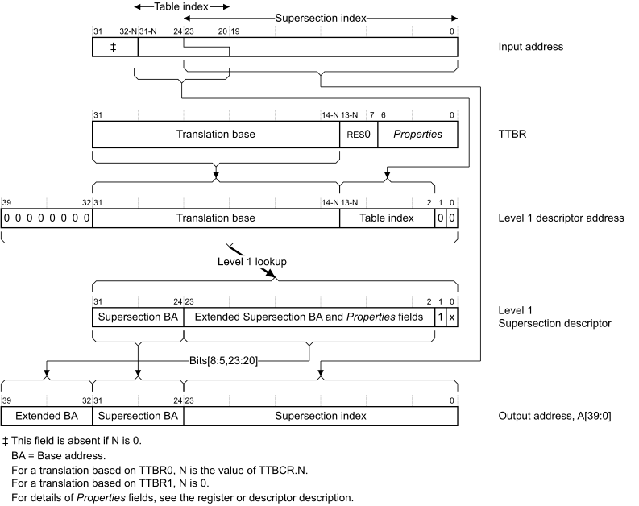
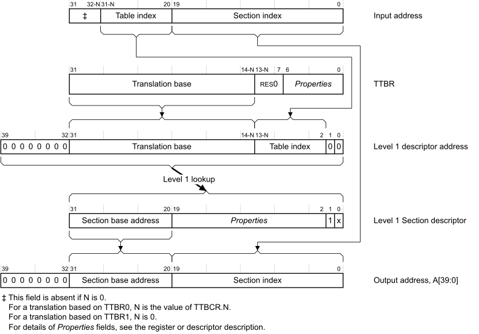
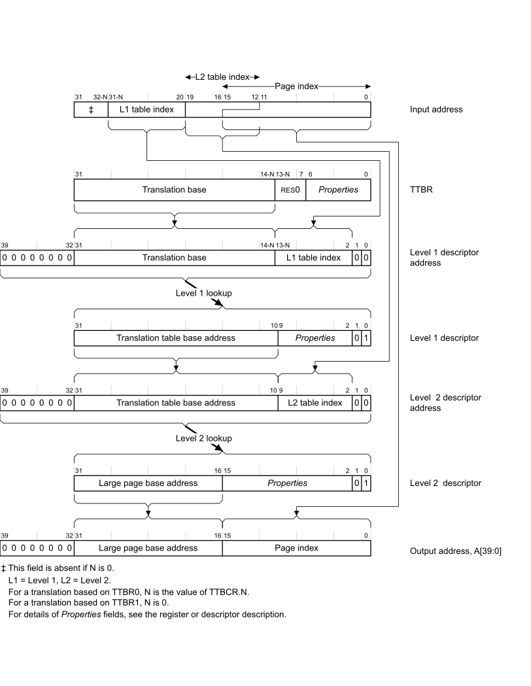
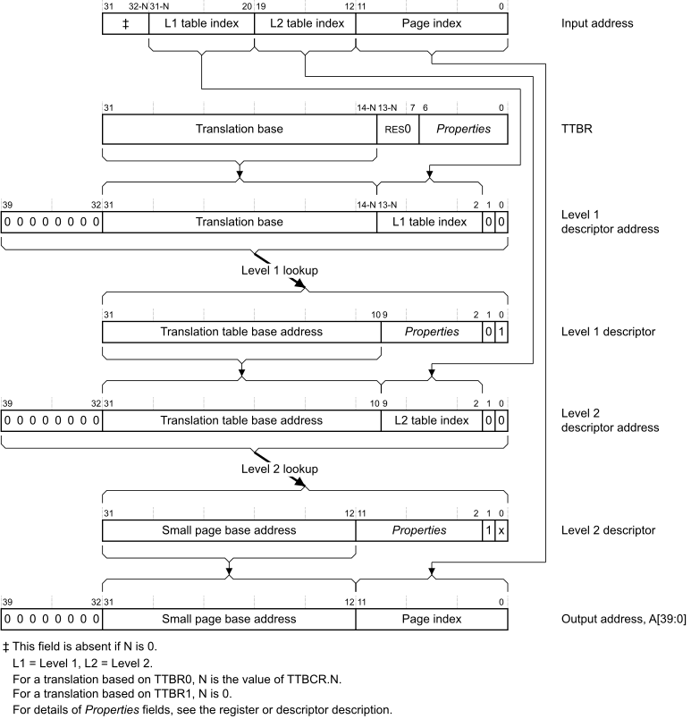

# ​K8.2.1 Address translation examples using the VMSAv8-32 Short descriptor translation table format

Source: <https://developer.arm.com/documentation/ddi0487/mc/-Part-K-Appendixes/-Appendix-K8-Address-Translation-Examples/-K8-2-AArch32-Address-translation-examples/-K8-2-1-Address-translation-examples-using-the-VMSAv8-32-Short-descriptor-translation-table-format>

##### K8.2.1 Address translation examples using the VMSAv8-32 Short descriptor translation table format

[VMSAv8-32 Short-descriptor Translation Table format descriptors](/documentation/ddi0487/mc/-Part-G-The-AArch32-System-Level-Architecture/-Chapter-G5-The-AArch32-Virtual-Memory-System-Architecture/-G5-4-The-VMSAv8-32-Short-descriptor-translation-table-format/-G5-4-1-VMSAv8-32-Short-descriptor-Translation-Table-format-descriptors?lang=en#cacbacgh) describes the memory section and page option for a single VMSAv8-32 address translation. The following sections show the full translation flow for each of these options:

- [Translation flow for a Supersection](/documentation/ddi0487/mc/-Part-K-Appendixes/-Appendix-K8-Address-Translation-Examples/-K8-2-AArch32-Address-translation-examples/-K8-2-1-Address-translation-examples-using-the-VMSAv8-32-Short-descriptor-translation-table-format?lang=en#babhffia).
- [Translation flow for a Section](/documentation/ddi0487/mc/-Part-K-Appendixes/-Appendix-K8-Address-Translation-Examples/-K8-2-AArch32-Address-translation-examples/-K8-2-1-Address-translation-examples-using-the-VMSAv8-32-Short-descriptor-translation-table-format?lang=en#babdbchd).
- [Translation flow for a Large page](/documentation/ddi0487/mc/-Part-K-Appendixes/-Appendix-K8-Address-Translation-Examples/-K8-2-AArch32-Address-translation-examples/-K8-2-1-Address-translation-examples-using-the-VMSAv8-32-Short-descriptor-translation-table-format?lang=en#babbdieb).
- [Translation flow for a Small page](/documentation/ddi0487/mc/-Part-K-Appendixes/-Appendix-K8-Address-Translation-Examples/-K8-2-AArch32-Address-translation-examples/-K8-2-1-Address-translation-examples-using-the-VMSAv8-32-Short-descriptor-translation-table-format?lang=en#c4babiahhd).

[The address and Properties fields shown in the translation flows](/documentation/ddi0487/mc/-Part-K-Appendixes/-Appendix-K8-Address-Translation-Examples/-K8-2-AArch32-Address-translation-examples/-K8-2-1-Address-translation-examples-using-the-VMSAv8-32-Short-descriptor-translation-table-format?lang=en#beifbafg) summarizes the information returned by the lookup.

###### K8.2.1.1 Translation flow for a Supersection

[Figure K8-14](/documentation/ddi0487/mc/-Part-K-Appendixes/-Appendix-K8-Address-Translation-Examples/-K8-2-AArch32-Address-translation-examples/-K8-2-1-Address-translation-examples-using-the-VMSAv8-32-Short-descriptor-translation-table-format?lang=en#fig_cbhcifbf) shows the complete translation flow for a Supersection. For more information about the fields shown in this figure, see [The address and Properties fields shown in the translation flows](/documentation/ddi0487/mc/-Part-K-Appendixes/-Appendix-K8-Address-Translation-Examples/-K8-2-AArch32-Address-translation-examples/-K8-2-1-Address-translation-examples-using-the-VMSAv8-32-Short-descriptor-translation-table-format?lang=en#beifbafg).

Figure K8-14 VMSAv8-32 Short-descriptor Supersection address translation

> #### Note
>
> [Figure K8-14](/documentation/ddi0487/mc/-Part-K-Appendixes/-Appendix-K8-Address-Translation-Examples/-K8-2-AArch32-Address-translation-examples/-K8-2-1-Address-translation-examples-using-the-VMSAv8-32-Short-descriptor-translation-table-format?lang=en#fig_cbhcifbf) shows how, when the input address, the VA, addresses a Supersection, the top four bits of the *Supersection index* bits of the address overlap the bottom four bits of the *Table index* bits. For more information, see [Additional requirements for Short-descriptor format translation tables](/documentation/ddi0487/mc/-Part-G-The-AArch32-System-Level-Architecture/-Chapter-G5-The-AArch32-Virtual-Memory-System-Architecture/-G5-4-The-VMSAv8-32-Short-descriptor-translation-table-format/-G5-4-1-VMSAv8-32-Short-descriptor-Translation-Table-format-descriptors?lang=en#cbhdajaf).

###### K8.2.1.2 Translation flow for a Section

[Figure K8-15](/documentation/ddi0487/mc/-Part-K-Appendixes/-Appendix-K8-Address-Translation-Examples/-K8-2-AArch32-Address-translation-examples/-K8-2-1-Address-translation-examples-using-the-VMSAv8-32-Short-descriptor-translation-table-format?lang=en#fig_cbheahee) shows the complete translation flow for a Section. For more information about the fields shown in this figure, see [The address and Properties fields shown in the translation flows](/documentation/ddi0487/mc/-Part-K-Appendixes/-Appendix-K8-Address-Translation-Examples/-K8-2-AArch32-Address-translation-examples/-K8-2-1-Address-translation-examples-using-the-VMSAv8-32-Short-descriptor-translation-table-format?lang=en#beifbafg).

Figure K8-15 VMSAv8-32 Short-descriptor Section address translation

###### K8.2.1.3 Translation flow for a Large page

[Figure K8-16](/documentation/ddi0487/mc/-Part-K-Appendixes/-Appendix-K8-Address-Translation-Examples/-K8-2-AArch32-Address-translation-examples/-K8-2-1-Address-translation-examples-using-the-VMSAv8-32-Short-descriptor-translation-table-format?lang=en#fig_cacdabgb) shows the complete translation flow for a Large page. For more information about the fields shown in this figure, see [The address and Properties fields shown in the translation flows](/documentation/ddi0487/mc/-Part-K-Appendixes/-Appendix-K8-Address-Translation-Examples/-K8-2-AArch32-Address-translation-examples/-K8-2-1-Address-translation-examples-using-the-VMSAv8-32-Short-descriptor-translation-table-format?lang=en#beifbafg).

Figure K8-16 VMSAv8-32 Short-descriptor Large page address translation

> #### Note
>
> [Figure K8-16](/documentation/ddi0487/mc/-Part-K-Appendixes/-Appendix-K8-Address-Translation-Examples/-K8-2-AArch32-Address-translation-examples/-K8-2-1-Address-translation-examples-using-the-VMSAv8-32-Short-descriptor-translation-table-format?lang=en#fig_cacdabgb) shows how, when the input address, the VA, addresses a Large page, the top four bits of the *page index* bits of the address overlap the bottom four bits of the *level 1 table index* bits. For more information, see [Additional requirements for Short-descriptor format translation tables](/documentation/ddi0487/mc/-Part-G-The-AArch32-System-Level-Architecture/-Chapter-G5-The-AArch32-Virtual-Memory-System-Architecture/-G5-4-The-VMSAv8-32-Short-descriptor-translation-table-format/-G5-4-1-VMSAv8-32-Short-descriptor-Translation-Table-format-descriptors?lang=en#cbhdajaf).

###### K8.2.1.4 Translation flow for a Small page

[Figure K8-17](/documentation/ddi0487/mc/-Part-K-Appendixes/-Appendix-K8-Address-Translation-Examples/-K8-2-AArch32-Address-translation-examples/-K8-2-1-Address-translation-examples-using-the-VMSAv8-32-Short-descriptor-translation-table-format?lang=en#fig_caccjadj) shows the complete translation flow for a Small page. For more information about the fields shown in this figure, see [The address and Properties fields shown in the translation flows](/documentation/ddi0487/mc/-Part-K-Appendixes/-Appendix-K8-Address-Translation-Examples/-K8-2-AArch32-Address-translation-examples/-K8-2-1-Address-translation-examples-using-the-VMSAv8-32-Short-descriptor-translation-table-format?lang=en#beifbafg).

Figure K8-17 VMSAv8-32 Short-descriptor Small page address translation

###### K8.2.1.5 The address and Properties fields shown in the translation flows

For the Non-secure PL1&0 stage 1 translation tables:

- Any descriptor address is the IPA of the required descriptor.
- The final output address is the IPA of the Section, Supersection, Large page, or Small page.

In these cases, a PL1&0 stage 2 translation is performed to translate the IPA to the required PA.

Otherwise, the address is the PA of the descriptor, Section, Supersection, Large page, or Small page.

*Properties* indicates register or translation table fields that return information, other than address information, about the translation or the targeted memory region. For more information, see [Information returned by a translation table lookup](/documentation/ddi0487/mc/-Part-G-The-AArch32-System-Level-Architecture/-Chapter-G5-The-AArch32-Virtual-Memory-System-Architecture/-G5-3-Translation-tables/-G5-3-2-Information-returned-by-a-translation-table-lookup?lang=en#beibeddj), and the description of the register or translation table descriptor.

For translations using the Short-descriptor translation table format, [VMSAv8-32 Short-descriptor Translation Table format descriptors](/documentation/ddi0487/mc/-Part-G-The-AArch32-System-Level-Architecture/-Chapter-G5-The-AArch32-Virtual-Memory-System-Architecture/-G5-4-The-VMSAv8-32-Short-descriptor-translation-table-format/-G5-4-1-VMSAv8-32-Short-descriptor-Translation-Table-format-descriptors?lang=en#cacbacgh) describes the descriptors formats.
