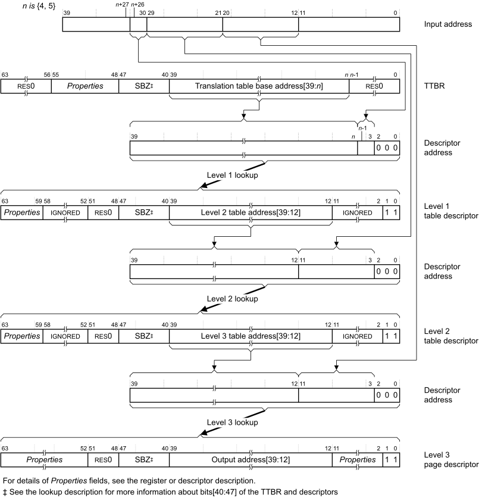
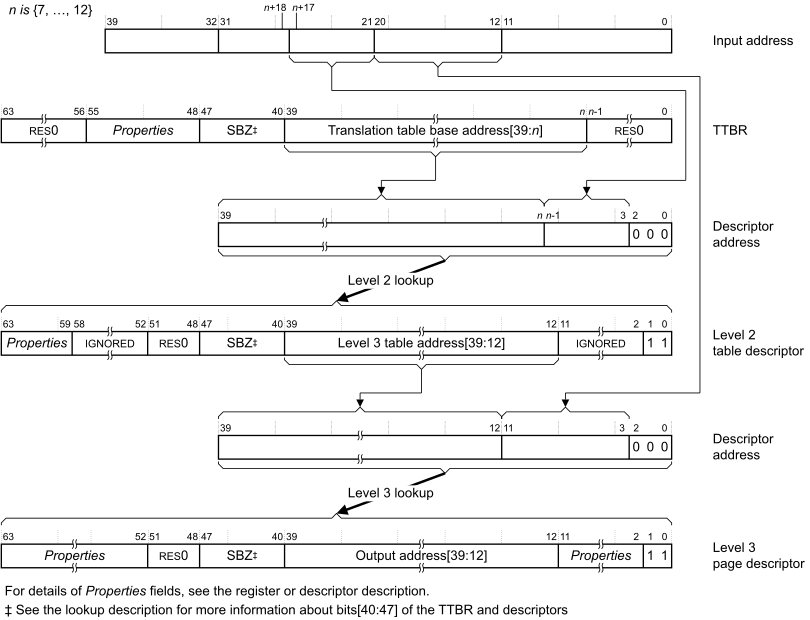

# ​K8.2.2 Address translation examples using the VMSAv8-32 Long descriptor translation table format

Source: <https://developer.arm.com/documentation/ddi0487/mc/-Part-K-Appendixes/-Appendix-K8-Address-Translation-Examples/-K8-2-AArch32-Address-translation-examples/-K8-2-2-Address-translation-examples-using-the-VMSAv8-32-Long-descriptor-translation-table-format>

##### K8.2.2 Address translation examples using the VMSAv8-32 Long descriptor translation table format

As described in [Translation table walks, when using the VMSAv8-32 Long-descriptor translation table format](/documentation/ddi0487/mc/-Part-G-The-AArch32-System-Level-Architecture/-Chapter-G5-The-AArch32-Virtual-Memory-System-Architecture/-G5-5-The-VMSAv8-32-Long-descriptor-translation-table-format/-G5-5-7-Translation-table-walks--when-using-the-VMSAv8-32-Long-descriptor-translation-table-format?lang=en#chdgeafa), in a translation table walk, only the first lookup uses the translation table base address from the appropriate [TTBR](/documentation/ddi0487/mc/-Part-K-Appendixes/-Appendix-K14-Registers-Index/-K14-1-Introduction-and-register-disambiguation/-K14-1-1-Register-name-disambiguation-by-Execution-state?lang=en#cegcjgag). Subsequent lookups use a combination of address information from:

- The table descriptor read in the previous lookup.
- The input address.

The following sections give examples of full VMSAv8-32 Long-descriptor format address translation flows, down to an entry for a 4KB page:

- [Full translation flow, starting at level 1 lookup](/documentation/ddi0487/mc/-Part-K-Appendixes/-Appendix-K8-Address-Translation-Examples/-K8-2-AArch32-Address-translation-examples/-K8-2-2-Address-translation-examples-using-the-VMSAv8-32-Long-descriptor-translation-table-format?lang=en#chdgjhej).
- [Full translation flow, starting at level 2 lookup](/documentation/ddi0487/mc/-Part-K-Appendixes/-Appendix-K8-Address-Translation-Examples/-K8-2-AArch32-Address-translation-examples/-K8-2-2-Address-translation-examples-using-the-VMSAv8-32-Long-descriptor-translation-table-format?lang=en#chdbiidc).

[The address and Properties fields shown in the translation flows](/documentation/ddi0487/mc/-Part-K-Appendixes/-Appendix-K8-Address-Translation-Examples/-K8-2-AArch32-Address-translation-examples/-K8-2-1-Address-translation-examples-using-the-VMSAv8-32-Short-descriptor-translation-table-format?lang=en#beifbafg) summarizes the information returned by the lookup.

###### K8.2.2.1 Full translation flow, starting at level 1 lookup

[Figure K8-18](/documentation/ddi0487/mc/-Part-K-Appendixes/-Appendix-K8-Address-Translation-Examples/-K8-2-AArch32-Address-translation-examples/-K8-2-2-Address-translation-examples-using-the-VMSAv8-32-Long-descriptor-translation-table-format?lang=en#fig_chdjggia) shows the complete translation flow for a VMSAv8-32 Long-descriptor stage 1 translation table walk that starts with a level 1 lookup. For more information about the fields shown in the figure, see [The address and Properties fields shown in the translation flows](/documentation/ddi0487/mc/-Part-K-Appendixes/-Appendix-K8-Address-Translation-Examples/-K8-2-AArch32-Address-translation-examples/-K8-2-1-Address-translation-examples-using-the-VMSAv8-32-Short-descriptor-translation-table-format?lang=en#beifbafg).

Figure K8-18 Complete VMSAv8-32 Long-descriptor format stage 1 translation, starting at level 1

If the level 1 lookup or the level 2 lookup returns a block descriptor then the translation table walk completes at that level.

If bits[47:40] of the [TTBR](/documentation/ddi0487/mc/-Part-K-Appendixes/-Appendix-K14-Registers-Index/-K14-1-Introduction-and-register-disambiguation/-K14-1-1-Register-name-disambiguation-by-Execution-state?lang=en#cegcjgag) or the descriptor are not zero then the lookup will generate an Address size fault, see [Address size fault](/documentation/ddi0487/mc/-Part-G-The-AArch32-System-Level-Architecture/-Chapter-G5-The-AArch32-Virtual-Memory-System-Architecture/-G5-11-VMSAv8-32-memory-aborts/-G5-11-1-Types-of-MMU-faults?lang=en#chdefhib).

A stage 2 translation that starts at a level 1 lookup differs from the translation shown in [Figure K8-18](/documentation/ddi0487/mc/-Part-K-Appendixes/-Appendix-K8-Address-Translation-Examples/-K8-2-AArch32-Address-translation-examples/-K8-2-2-Address-translation-examples-using-the-VMSAv8-32-Long-descriptor-translation-table-format?lang=en#fig_chdjggia) only as follows:

- The possible values of *n* are 4-13, to support an input address of between 31 and 40 bits.
- A descriptor and output addresses are always PAs.

###### K8.2.2.2 Full translation flow, starting at level 2 lookup

[Figure K8-19](/documentation/ddi0487/mc/-Part-K-Appendixes/-Appendix-K8-Address-Translation-Examples/-K8-2-AArch32-Address-translation-examples/-K8-2-2-Address-translation-examples-using-the-VMSAv8-32-Long-descriptor-translation-table-format?lang=en#fig_chdjifhc) shows the complete translation flow for a stage 1 VMSAv8-32 Long-descriptor translation table walk that starts at a level 2 lookup. For more information about the fields shown in the figure, see [The address and Properties fields shown in the translation flows](/documentation/ddi0487/mc/-Part-K-Appendixes/-Appendix-K8-Address-Translation-Examples/-K8-2-AArch32-Address-translation-examples/-K8-2-1-Address-translation-examples-using-the-VMSAv8-32-Short-descriptor-translation-table-format?lang=en#beifbafg).

Figure K8-19 Complete VMSAv8-32 Long-descriptor format stage 1 translation, starting at level 2

If the level 2 lookup returns a block descriptor then the translation table walk completes at that level.

If bits[47:40] of the [TTBR](/documentation/ddi0487/mc/-Part-K-Appendixes/-Appendix-K14-Registers-Index/-K14-1-Introduction-and-register-disambiguation/-K14-1-1-Register-name-disambiguation-by-Execution-state?lang=en#cegcjgag) or the descriptor are not zero then the lookup will generate an Address size fault, see [Address size fault](/documentation/ddi0487/mc/-Part-G-The-AArch32-System-Level-Architecture/-Chapter-G5-The-AArch32-Virtual-Memory-System-Architecture/-G5-11-VMSAv8-32-memory-aborts/-G5-11-1-Types-of-MMU-faults?lang=en#chdefhib).

A stage 2 translation that starts at a level 2 lookup differs from the translation shown in [Figure K8-19](/documentation/ddi0487/mc/-Part-K-Appendixes/-Appendix-K8-Address-Translation-Examples/-K8-2-AArch32-Address-translation-examples/-K8-2-2-Address-translation-examples-using-the-VMSAv8-32-Long-descriptor-translation-table-format?lang=en#fig_chdjifhc) only as follows:

- The possible values of *n* are 7-16, to support an input address of up to 34 bits.
- The descriptor and output addresses are always PAs.

###### K8.2.2.3 The address and Properties fields shown in the translation flows

For the Non-secure PL1&0 stage 1 translation:

- Any descriptor address is the IPA of the required descriptor.
- The final output address is the IPA of the block or page.

In these cases, a PL1&0 stage 2 translation is performed to translate the IPA to the required PA.

For all other translations, the final output address is the PA of the block or page, and any descriptor address is the PA of the descriptor.

*Properties* indicates register or translation table fields that return information, other than address information, about the translation or the targeted memory region. For more information, see [Information returned by a translation table lookup](/documentation/ddi0487/mc/-Part-G-The-AArch32-System-Level-Architecture/-Chapter-G5-The-AArch32-Virtual-Memory-System-Architecture/-G5-3-Translation-tables/-G5-3-2-Information-returned-by-a-translation-table-lookup?lang=en#beibeddj), and the description of the register or translation table descriptor.

For translations using the Long-descriptor translation table format, [VMSAv8-32 Long-descriptor Translation Table format descriptors](/documentation/ddi0487/mc/-Part-G-The-AArch32-System-Level-Architecture/-Chapter-G5-The-AArch32-Virtual-Memory-System-Architecture/-G5-5-The-VMSAv8-32-Long-descriptor-translation-table-format/-G5-5-2-VMSAv8-32-Long-descriptor-Translation-Table-format-descriptors?lang=en#beiiacda) describes the descriptors formats.
