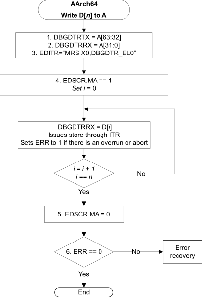
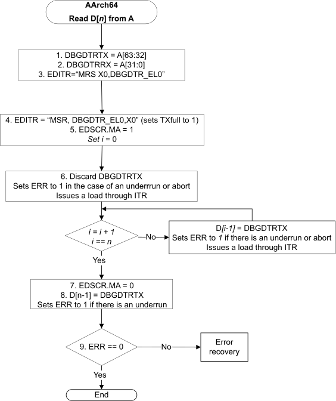

# ​K9.1 Using Memory access mode in AArch64 state

Source: <https://developer.arm.com/documentation/ddi0487/mc/-Part-K-Appendixes/-Appendix-K9-Recommended-Upload-and-Download-Processes-for-External-Debug/-K9-1-Using-Memory-access-mode-in-AArch64-state>

#### K9.1 Using Memory access mode in AArch64 state

[Figure K9-1](/documentation/ddi0487/mc/-Part-K-Appendixes/-Appendix-K9-Recommended-Upload-and-Download-Processes-for-External-Debug/-K9-1-Using-Memory-access-mode-in-AArch64-state?lang=en#fig_babfiijg) and [Figure K9-2](/documentation/ddi0487/mc/-Part-K-Appendixes/-Appendix-K9-Recommended-Upload-and-Download-Processes-for-External-Debug/-K9-1-Using-Memory-access-mode-in-AArch64-state?lang=en#fig_babfegcg) show the processes for using Memory access mode to implement a download (external host to target) and an upload (target to external host).

To transfer *n* words of data:

- The download sequence needs *n*+6 accesses by the external debug interface.
- The upload sequence needs *n*+8 accesses by the external debug interface.

In both cases, in the innermost loop the debugger can make an external access to a DTR without polling [EDSCR](/documentation/ddi0487/mc/-Part-H-External-Debug/-Chapter-H9-External-Debug-Register-Descriptions/-H9-2-External-debug-registers/-H9-2-48-EDSCR--External-Debug-Status-and-Control-Register?lang=en#reg_ext_edscr) after each write as underrun and overrun detection prevent failure. Normally external accesses from the debugger are outpaced by the memory accesses of the PE, making underruns and overruns unlikely. If this is not the case, the [EDSCR](/documentation/ddi0487/mc/-Part-H-External-Debug/-Chapter-H9-External-Debug-Register-Descriptions/-H9-2-External-debug-registers/-H9-2-48-EDSCR--External-Debug-Status-and-Control-Register?lang=en#reg_ext_edscr).ERR flag is set to 1. This is checked once at the end of the sequence, although a debugger can check it more often, for example once for each page. If the [EDSCR](/documentation/ddi0487/mc/-Part-H-External-Debug/-Chapter-H9-External-Debug-Register-Descriptions/-H9-2-External-debug-registers/-H9-2-48-EDSCR--External-Debug-Status-and-Control-Register?lang=en#reg_ext_edscr).ERR flag is set to 1 because of overrun or underrun, the debugger can restart. The address to restart from is frozen in X0. [EDSCR](/documentation/ddi0487/mc/-Part-H-External-Debug/-Chapter-H9-External-Debug-Register-Descriptions/-H9-2-External-debug-registers/-H9-2-48-EDSCR--External-Debug-Status-and-Control-Register?lang=en#reg_ext_edscr).ERR might also be set because of a Data Abort.

If underruns and overruns are common, the debugger can pace itself accordingly.

> #### Note
>
> - The base address must be a multiple of 4.
> - The order of the writes that set up the address does not matter in Debug state.

Figure K9-1 Fast code download in AArch64 state (external host to target)

In [Figure K9-1](/documentation/ddi0487/mc/-Part-K-Appendixes/-Appendix-K9-Recommended-Upload-and-Download-Processes-for-External-Debug/-K9-1-Using-Memory-access-mode-in-AArch64-state?lang=en#fig_babfiijg), the sequence for the fast code download is as follows:

1. Setup. From the external debug interface:

   1. Write address [31:0] to [DBGDTRRX\_EL0](/documentation/ddi0487/mc/-Part-H-External-Debug/-Chapter-H9-External-Debug-Register-Descriptions/-H9-2-External-debug-registers/-H9-2-6-DBGDTRRX-EL0--Debug-Data-Transfer-Register--Receive?lang=en#reg_ext_dbgdtrrx_el0).
   2. Write address [63:32] to [DBGDTRTX\_EL0](/documentation/ddi0487/mc/-Part-H-External-Debug/-Chapter-H9-External-Debug-Register-Descriptions/-H9-2-External-debug-registers/-H9-2-7-DBGDTRTX-EL0--Debug-Data-Transfer-Register--Transmit?lang=en#reg_ext_dbgdtrtx_el0).
   3. Write `MRS X0, DBGDTR_EL0` to [EDITR](/documentation/ddi0487/mc/-Part-H-External-Debug/-Chapter-H9-External-Debug-Register-Descriptions/-H9-2-External-debug-registers/-H9-2-32-EDITR--External-Debug-Instruction-Transfer-Register?lang=en#reg_ext_editr). The PE executes this instruction.
   4. Set [EDSCR](/documentation/ddi0487/mc/-Part-H-External-Debug/-Chapter-H9-External-Debug-Register-Descriptions/-H9-2-External-debug-registers/-H9-2-48-EDSCR--External-Debug-Status-and-Control-Register?lang=en#reg_ext_edscr).MA to 1.
2. Loop *n* times. From the external debug interface:

   1. Write to [DBGDTRRX\_EL0](/documentation/ddi0487/mc/-Part-H-External-Debug/-Chapter-H9-External-Debug-Register-Descriptions/-H9-2-External-debug-registers/-H9-2-6-DBGDTRRX-EL0--Debug-Data-Transfer-Register--Receive?lang=en#reg_ext_dbgdtrrx_el0). The PE reads the word from DTRRX and stores it to memory. It increments X0 by 4.
3. Epilogue. From the external debug interface:

   1. Clear [EDSCR](/documentation/ddi0487/mc/-Part-H-External-Debug/-Chapter-H9-External-Debug-Register-Descriptions/-H9-2-External-debug-registers/-H9-2-48-EDSCR--External-Debug-Status-and-Control-Register?lang=en#reg_ext_edscr).MA to 0.
   2. Read [EDSCR](/documentation/ddi0487/mc/-Part-H-External-Debug/-Chapter-H9-External-Debug-Register-Descriptions/-H9-2-External-debug-registers/-H9-2-48-EDSCR--External-Debug-Status-and-Control-Register?lang=en#reg_ext_edscr) to check for overruns or Data Aborts during download.

Figure K9-2 Fast data upload in AArch64 state (target to external host)

In [Figure K9-2](/documentation/ddi0487/mc/-Part-K-Appendixes/-Appendix-K9-Recommended-Upload-and-Download-Processes-for-External-Debug/-K9-1-Using-Memory-access-mode-in-AArch64-state?lang=en#fig_babfegcg), the sequence for the fast code download is as follows:

1. Setup. From the external debug interface:

   1. Write address [31:0] to [DBGDTRRX\_EL0](/documentation/ddi0487/mc/-Part-H-External-Debug/-Chapter-H9-External-Debug-Register-Descriptions/-H9-2-External-debug-registers/-H9-2-6-DBGDTRRX-EL0--Debug-Data-Transfer-Register--Receive?lang=en#reg_ext_dbgdtrrx_el0).
   2. Write address [63:32] to [DBGDTRTX\_EL0](/documentation/ddi0487/mc/-Part-H-External-Debug/-Chapter-H9-External-Debug-Register-Descriptions/-H9-2-External-debug-registers/-H9-2-7-DBGDTRTX-EL0--Debug-Data-Transfer-Register--Transmit?lang=en#reg_ext_dbgdtrtx_el0).
   3. Write `MRS X0, DBGDTR_EL0` to [EDITR](/documentation/ddi0487/mc/-Part-H-External-Debug/-Chapter-H9-External-Debug-Register-Descriptions/-H9-2-External-debug-registers/-H9-2-32-EDITR--External-Debug-Instruction-Transfer-Register?lang=en#reg_ext_editr).
   4. Write `MSR DBGDTR_EL0, X0` to [EDITR](/documentation/ddi0487/mc/-Part-H-External-Debug/-Chapter-H9-External-Debug-Register-Descriptions/-H9-2-External-debug-registers/-H9-2-32-EDITR--External-Debug-Instruction-Transfer-Register?lang=en#reg_ext_editr). This dummy operation ensures [EDSCR](/documentation/ddi0487/mc/-Part-H-External-Debug/-Chapter-H9-External-Debug-Register-Descriptions/-H9-2-External-debug-registers/-H9-2-48-EDSCR--External-Debug-Status-and-Control-Register?lang=en#reg_ext_edscr).TXfull == 1.
   5. Set [EDSCR](/documentation/ddi0487/mc/-Part-H-External-Debug/-Chapter-H9-External-Debug-Register-Descriptions/-H9-2-External-debug-registers/-H9-2-48-EDSCR--External-Debug-Status-and-Control-Register?lang=en#reg_ext_edscr).MA to 1.
   6. Read [DBGDTRTX\_EL0](/documentation/ddi0487/mc/-Part-D-The-AArch64-System-Level-Architecture/-Chapter-D24-AArch64-System-Register-Descriptions/-D24-3-Debug-System-registers/-D24-3-8-DBGDTRTX-EL0--Debug-Data-Transfer-Register--Transmit?lang=en#reg_aarch64_dbgdtrtx_el0) and discard the value. The PE returns the previous DTR value, loads the first word, and writes it to DTR. It increments X0 by 4.
2. Loop *n*-1 times. From the external debug interface:

   1. Read [DBGDTRTX\_EL0](/documentation/ddi0487/mc/-Part-H-External-Debug/-Chapter-H9-External-Debug-Register-Descriptions/-H9-2-External-debug-registers/-H9-2-7-DBGDTRTX-EL0--Debug-Data-Transfer-Register--Transmit?lang=en#reg_ext_dbgdtrtx_el0). The PE returns the previous DTRTX value, loads a new word, and writes it to DTRTX. It increments X0 by 4.
3. Epilogue. From the external debug interface:

   1. Clear [EDSCR](/documentation/ddi0487/mc/-Part-H-External-Debug/-Chapter-H9-External-Debug-Register-Descriptions/-H9-2-External-debug-registers/-H9-2-48-EDSCR--External-Debug-Status-and-Control-Register?lang=en#reg_ext_edscr).MA to 0.
   2. Read [DBGDTRTX\_EL0](/documentation/ddi0487/mc/-Part-H-External-Debug/-Chapter-H9-External-Debug-Register-Descriptions/-H9-2-External-debug-registers/-H9-2-7-DBGDTRTX-EL0--Debug-Data-Transfer-Register--Transmit?lang=en#reg_ext_dbgdtrtx_el0) for the *n*th value.
   3. Read [EDSCR](/documentation/ddi0487/mc/-Part-H-External-Debug/-Chapter-H9-External-Debug-Register-Descriptions/-H9-2-External-debug-registers/-H9-2-48-EDSCR--External-Debug-Status-and-Control-Register?lang=en#reg_ext_edscr) to check for underruns, overruns or Data Aborts during upload.
