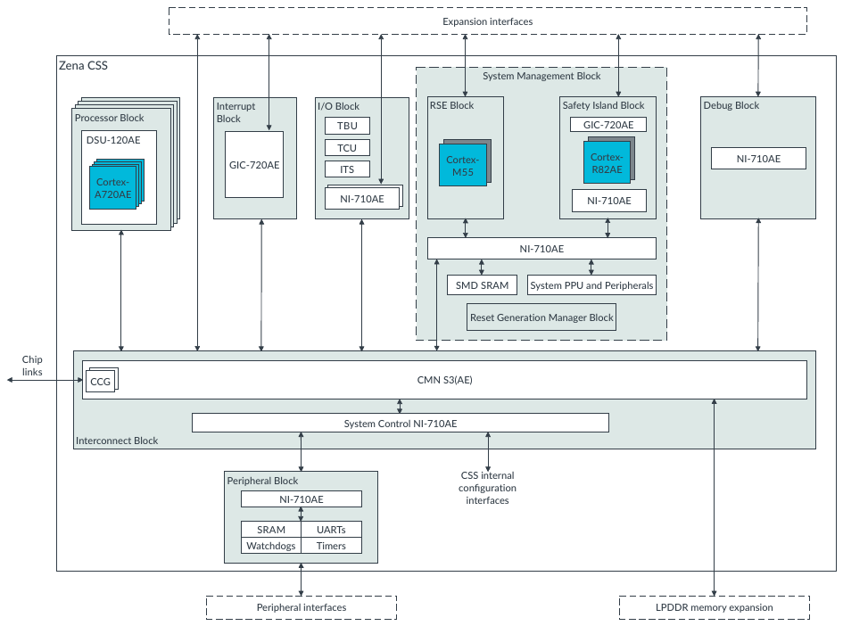

# 2. Block diagram for Zena CSS

<!-- Source PDF page: 7 -->

The Zena CSS design is partitioned into functional blocks that combine Arm IP and the supporting
logic around them.

System components are distributed across the subsystem and incorporated into multiple functional
blocks.

The following figure shows a high-level block diagram of the logical view of Zena CSS.

**Figure 2-1: Zena CSS high-level block diagram**

Expansion interfaces

Zena CSS
System Management Block

Interrupt                 I/O Block              RSE Block                       Safety Island Block            Debug Block
Processor Block             Block
TBU                                                     GIC-720AE
DSU-120AE
TCU
Cortex-                            Cortex-                         NI-710AE
GIC-720AE                    ITS                                                     R82AE
Cortex-
Cortex-                                                                     M55
Cortex-
Cortex-
A720AE
A720AE
A720AE
A720AE                                                 NI-710AE
NI-710AE                                                NI-710AE

NI-710AE

SMD SRAM             System PPU and Peripherals

Reset Generation Manager Block

Chip
links
CCG
CCG                                                                    CMN S3(AE)

System Control NI-710AE
Interconnect Block

Peripheral Block                                         CSS internal
configuration
NI-710AE                                   interfaces

SRAM          UARTs
Watchdogs          Timers

Peripheral interfaces                                                                       LPDDR memory expansion

This document refers to the Primary Compute subsystem, which includes the
Processor Block, Interconnect Block, I/O Block, Interrupt Block, and Peripheral
Block.

To learn more about the functional blocks in Zena CSS, see Functional blocks in Zena CSS.
