
# 6. Boot flow of Zena CSS

<!-- Source PDF page: 18 -->

The Zena CSS boot flow describes the initial portion of boot operations and the boot block device
interface.

The general boot flow is described in the main boot sequence. Each lifeline in the figures
represents an abstract system consisting of hardware and software:
•      The External Safety Manager and the Block Device Controller are not part of Zena CSS. The
Runtime Security Engine, the Safety Island, and the Primary Compute are part of Zena CSS.
•      The Runtime Security Engine system consists of the RSE Block and multiple software images.
•      The Safety Island system consists of the Safety Island Block and multiple software images.
•      The Primary Compute system consists of the Processor Block, the Interrupt Block, the I/O
Block, the Interconnect Block, the Peripheral Block, and multiple software images.
•      The Reset Generation Manager Block is a shared component that is part of the Runtime
Security Engine system, the Safety Island system, and the Primary Compute system.

## 6.1 Main boot sequence
The main boot sequence includes the key stages of the boot process, ensuring a systematic and
Secure initialization of Zena CSS.

In the figures illustrating the main boot sequence, a ref element indicates a part of
the sequence that a later section describes in more detail.

Common procedures during the stages of the main sequence include self tests,
image loading, and verification.

System boot sequence
The following figure shows the Zena CSS system boot sequence, in which the Runtime Security
Engine performs a self test before the rest of the boot flow proceeds.

**Figure 6-1: System boot sequence**

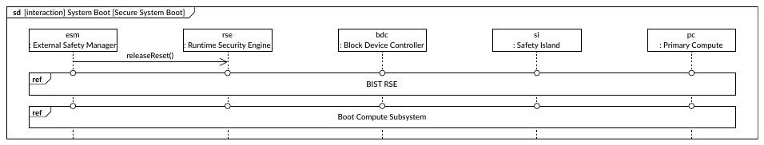

sd [interaction] System Boot [Secure System Boot]

esm                                         rse                        bdc                      si                             pc
: External Safety Manager                    : Runtime Security Engine   : Block Device Controller   : Safety Island               : Primary Compute
releaseReset()

ref
BIST RSE

ref
Boot Compute Subsystem

For more information about the self test, see BIST RSE sequence.

<!-- Source PDF page: 19 -->

Compute subsystem (CSS) boot sequence
The following figure shows the CSS boot sequence that was initiated during the preceding system
boot sequence.

**Figure 6-2: CSS boot sequence**

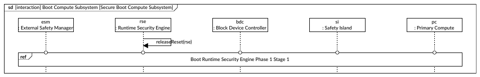

sd [interaction] Boot Compute Subsystem [Secure Boot Compute Subsystem]

esm                                       rse                                         bdc                               si                             pc
: External Safety Manager                  : Runtime Security Engine                    : Block Device Controller            : Safety Island               : Primary Compute

releaseReset(rse)

ref
Boot Runtime Security Engine Phase 1 Stage 1

Runtime Security Engine (RSE) boot sequence
The RSE boot sequence takes place in three parts. The first figure shows the RSE phase 1 stage 1
boot sequence that was initiated during the preceding CSS boot sequence.

**Figure 6-3: RSE phase 1 stage 1 boot sequence**

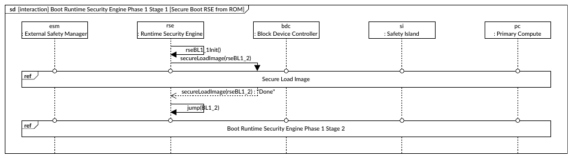

sd [interaction] Boot Runtime Security Engine Phase 1 Stage 1 [Secure Boot RSE from ROM]

esm                                       rse                                         bdc                               si                             pc
: External Safety Manager                  : Runtime Security Engine                    : Block Device Controller            : Safety Island               : Primary Compute

rseBL1_1Init()
secureLoadImage(rseBL1_2)

ref
Secure Load Image

secureLoadImage(rseBL1_2) : "Done"

jump(BL1_2)

ref
Boot Runtime Security Engine Phase 1 Stage 2

RSE BL1_1 is a boot loader (stored in ROM) that is responsible for the first few steps of the RSE
boot sequence:
1. Initialize critical RSE subsystems.
2. Check for a valid RSE BL1_2 image in a One-Time-Programmable (OTP) memory block. If valid:
a. Load RSE BL1_2 from OTP memory to RSE SRAM.
b. Jump to RSE BL1_2 in RSE SRAM.

For more information about the image load, see Secure load image sequence.

The second figure shows the RSE phase 1 stage 2 boot sequence, which was initiated during the
preceding boot sequence.

<!-- Source PDF page: 20 -->

**Figure 6-4: RSE phase 1 stage 2 boot sequence**

sd [interaction] Boot Runtime Security Engine Phase 1 Stage 2 [Secure Boot RSE from OTP]

esm                                         rse                                       bdc                           si                             pc
: External Safety Manager                    : Runtime Security Engine                  : Block Device Controller        : Safety Island               : Primary Compute

rseBL1_2Init()
secureLoadImage(rseBL2)

ref
Secure Load Image

secureLoadImage(rseBL2) : "Done"

jump(BL2)

ref
Boot Runtime Security Engine Phase 2

RSE BL1_2 is a boot loader that is responsible for the next steps of the RSE boot sequence:
1. Initialize remaining RSE subsystems, and execute any patch code required.
2. Initialize the Block Device Controller.
3. Check for a valid RSE BL2 image in a block device. If valid:
a. Load RSE BL2 from the block device to RSE SRAM.
b. Jump to RSE BL2 in RSE SRAM.

For more information about the image load, see Secure load image sequence.

The third figure shows the RSE phase 2 boot sequence, which was initiated during the preceding
boot sequence.

**Figure 6-5: RSE phase 2 boot sequence**

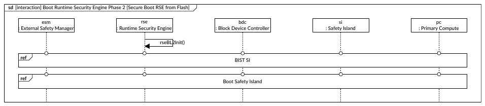

sd [interaction] Boot Runtime Security Engine Phase 2 [Secure Boot RSE from Flash]

esm                                         rse                                       bdc                           si                             pc
: External Safety Manager                    : Runtime Security Engine                  : Block Device Controller        : Safety Island               : Primary Compute

rseBL2Init()

ref
BIST SI

ref
Boot Safety Island

RSE BL2 is a boot loader that is responsible for the final steps of the RSE boot sequence:
1. Initialize critical portions of the system management block.
2. Initiate a self test on the Safety Island.
3. Control the first part of the Safety Island boot sequence.

For more information about the self test, see BIST Safety Island sequence.

Safety Island boot sequence
The following figure shows the Safety Island boot sequence that was initiated during the preceding
RSE phase 2 boot sequence.

<!-- Source PDF page: 21 -->

**Figure 6-6: Safety Island boot sequence**

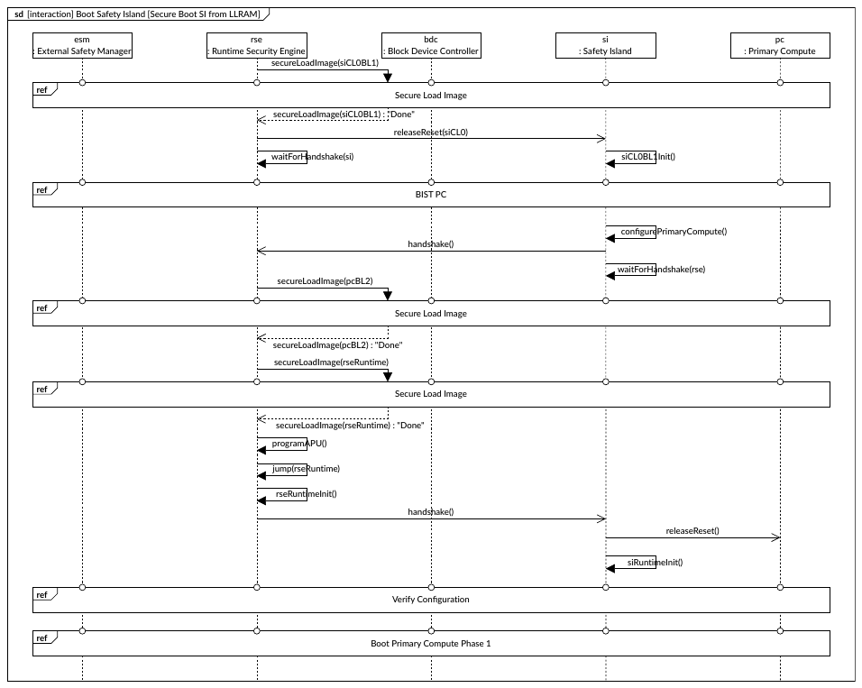

sd [interaction] Boot Safety Island [Secure Boot SI from LLRAM]

esm                                         rse                                      bdc                       si                                       pc
: External Safety Manager                    : Runtime Security Engine                 : Block Device Controller    : Safety Island                         : Primary Compute
secureLoadImage(siCL0BL1)

ref
Secure Load Image

secureLoadImage(siCL0BL1) : "Done"

releaseReset(siCL0)

waitForHandshake(si)                                              siCL0BL1Init()

ref
BIST PC

configurePrimaryCompute()
handshake()

waitForHandshake(rse)
secureLoadImage(pcBL2)

ref
Secure Load Image

secureLoadImage(pcBL2) : "Done"

secureLoadImage(rseRuntime)

ref
Secure Load Image

secureLoadImage(rseRuntime) : "Done"

programAPU()

jump(rseRuntime)

rseRuntimeInit()

handshake()

releaseReset()

siRuntimeInit()

ref
Verify Configuration

ref
Boot Primary Compute Phase 1

The first part of the boot sequence is controlled by the RSE BL2 boot loader:
1. Load SI CL0BL1 from the block device to the Safety Island Cluster 0 Low-Latency RAM
(LLRAM).
2. Release the Safety Island Cluster 0 from reset.

Control then passes to the SI CL0BL1 runtime for Safety Island Cluster 0, which boots the rest of
the system and provides safety services:
1. Initiate a self test on the Primary Compute.
2. Program the Primary Compute subsystems:
a. Arm® Neoverse® CMN S3(AE) Coherent Mesh Network
b. Arm® CoreLink™ GIC-720AE Generic Interrupt Controller
c. Peripheral Block devices

For more information about the self test, see BIST Primary Compute sequence.

<!-- Source PDF page: 22 -->

Control then returns to the RSE BL2 boot loader, which performs its remaining tasks:
1. Load Primary Compute BL2 from the block device to the Secure SRAM in the Peripheral Block
in the Primary Compute.
2. Load the RSE runtime from the block device to the RSE SRAM.
3. Program access protection units in the Arm® CoreLink™ NI-710AE Network-on-Chip
Interconnect.
4. Jump to RSE runtime in RSE SRAM.

The RSE runtime is stored in the block device and provides security services.

Finally, control passes once more to the SI CL0BL1 runtime, which completes the Safety Island
boot sequence:
1. Release the primary Arm® Cortex®-A720AE from reset.
2. Initialize and perform Runtime Safety Services.

For more information about the image loads, see Secure load image sequence.

At the end of the Safety Island boot sequence, the RSE and the Safety Island are both in runtime
mode. Two further sequences are initiated: the verify configuration sequence and the Primary
Compute boot sequence.

Primary Compute boot sequence
The Primary Compute boot sequence takes place in three parts. The first figure shows the Primary
Compute boot phase 1 sequence that was initiated during the preceding Safety Island boot
sequence.

The Block Device Controller in the following figures might be different from the one
in previous figures that describe the boot flow.

<!-- Source PDF page: 23 -->

**Figure 6-7: Primary Compute phase 1 boot sequence**

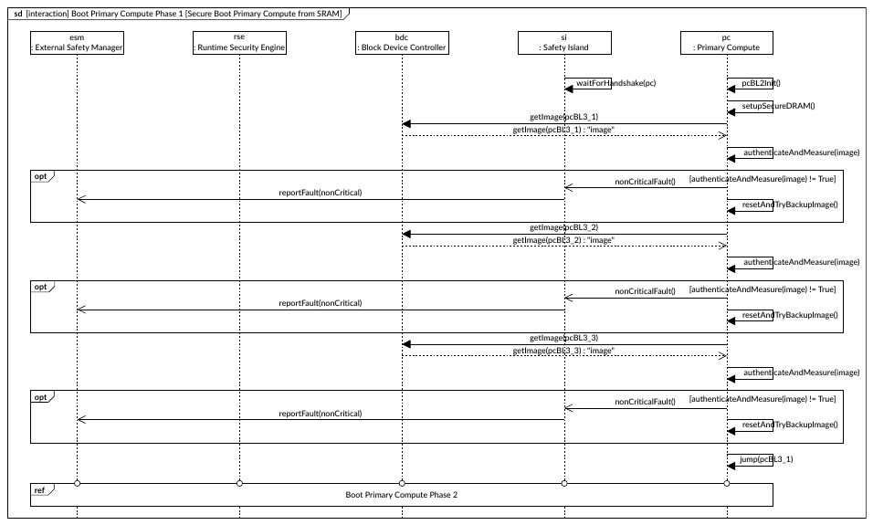

sd [interaction] Boot Primary Compute Phase 1 [Secure Boot Primary Compute from SRAM]

esm                                      rse                                         bdc                              si                                            pc
: External Safety Manager                 : Runtime Security Engine                    : Block Device Controller           : Safety Island                              : Primary Compute

waitForHandshake(pc)                          pcBL2Init()

setupSecureDRAM()
getImage(pcBL3_1)
getImage(pcBL3_1) : "image"

authenticateAndMeasure(image)

opt                                                                                                                                                                   [authenticateAndMeasure(image) != True]
nonCriticalFault()
reportFault(nonCritical)
resetAndTryBackupImage()

getImage(pcBL3_2)
getImage(pcBL3_2) : "image"

authenticateAndMeasure(image)

opt                                                                                                                                                                   [authenticateAndMeasure(image) != True]
nonCriticalFault()
reportFault(nonCritical)
resetAndTryBackupImage()

getImage(pcBL3_3)
getImage(pcBL3_3) : "image"

authenticateAndMeasure(image)

opt                                                                                                                                                                   [authenticateAndMeasure(image) != True]
nonCriticalFault()
reportFault(nonCritical)
resetAndTryBackupImage()

jump(pcBL3_1)

ref
Boot Primary Compute Phase 2

Primary Compute BL2 is the first-stage trusted firmware for the primary Application Processor (AP).
The boot sequence proceeds like this:
1. Set up the Secure DRAM.
2. Load Primary Compute BL3_1 from the block device to the Secure SRAM in the Peripheral
Block in the Primary Compute.
3. Load Primary Compute BL3_2 from the block device to the Secure DRAM.
4. Load Primary Compute BL3_3 from the block device to the Non-secure DRAM.
5. Run Primary Compute BL3_1.

The second figure shows the Primary Compute phase 2 boot sequence, which was initiated during
the preceding boot sequence.

**Figure 6-8: Primary Compute phase 2 boot sequence**

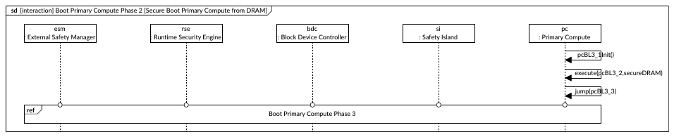

sd [interaction] Boot Primary Compute Phase 2 [Secure Boot Primary Compute from DRAM]

esm                                      rse                                          bdc                              si                                            pc
: External Safety Manager                 : Runtime Security Engine                     : Block Device Controller           : Safety Island                              : Primary Compute

pcBL3_1Init()

execute(pcBL3_2,secureDRAM)

jump(pcBL3_3)

ref
Boot Primary Compute Phase 3

<!-- Source PDF page: 24 -->

Primary Compute BL3_1 is the second-stage trusted firmware for APs. This part of the boot
sequence proceeds like this:
1. Initialize Trusted Firmware-A services.
2. Run Primary Compute BL3_2, which is a trusted execution environment for APs:
a. Initialize the OP-TEE environment.
b. Initialize Secure partitions.
c. Return to Primary Compute BL3_1.
3. Run Primary Compute BL3_3.

The third figure shows the Primary Compute phase 3 boot sequence, which was initiated during
the preceding boot sequence.

**Figure 6-9: Primary Compute phase 3 boot sequence**

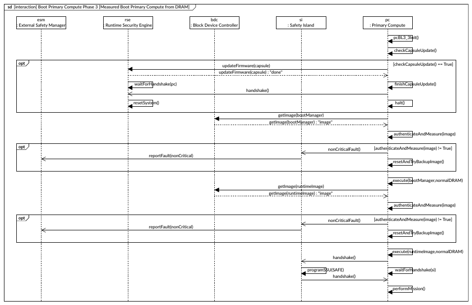

sd [interaction] Boot Primary Compute Phase 3 [Measured Boot Primary Compute from DRAM]

esm                                     rse                                         bdc                                             si                                        pc
: External Safety Manager                : Runtime Security Engine                    : Block Device Controller                          : Safety Island                          : Primary Compute

pcBL3_3Init()

checkCapsuleUpdate()

opt                                                                                                                                                                                         [checkCapsuleUpdate() == True]
updateFirmware(capsule)
updateFirmware(capsule) : "done"

waitForHandshake(pc)                                                                                                                 finishCapsuleUpdate()
handshake()

resetSystem()                                                                                                                         halt()

getImage(bootManager)
getImage(bootManager) : "image"

authenticateAndMeasure(image)

opt                                                                                                                                                                               [authenticateAndMeasure(image) != True]
nonCriticalFault()
reportFault(nonCritical)
resetAndTryBackupImage()

execute(bootManager,normalDRAM)
getImage(runtimeImage)
getImage(runtimeImage) : "image"

authenticateAndMeasure(image)

opt                                                                                                                                                                               [authenticateAndMeasure(image) != True]
nonCriticalFault()
reportFault(nonCritical)
resetAndTryBackupImage()

execute(runtimeImage,normalDRAM)
handshake()

programSSU(SAFE)                          waitForHandshake(si)
handshake()

performMission()

Primary Compute BL3_3 is a boot loader for APs. It controls the final stages of the main boot
sequence:
1. Check for available capsule updates.
2. If a capsule update is available:
a. Perform the capsule update.
b. Reset the system.

<!-- Source PDF page: 25 -->

3. Check for a valid Primary Compute boot manager. If valid:
a. Load the Primary Compute boot manager from the block device to Non-secure DRAM.
b. Jump to the Primary Compute boot manager in Non-secure DRAM.
4. Check for a valid Primary Compute runtime, such as an optional hypervisor, an Operating
System (OS), or applications. If valid:
a. Load the Primary Compute runtime from the block device to Non-secure DRAM.
b. Jump to the Primary Compute runtime.

Secure load image sequence
Many phases of the main boot sequence contain steps for securely loading images that control or
are required in later phases. The following figure represents the sequence through which these
images are loaded.

**Figure 6-10: Secure load image sequence**

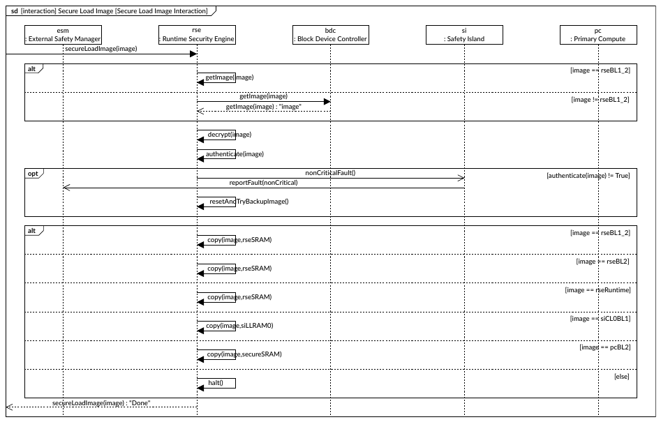

sd [interaction] Secure Load Image [Secure Load Image Interaction]

esm                                         rse                                                bdc                      si                                pc
: External Safety Manager                    : Runtime Security Engine                           : Block Device Controller   : Safety Island                  : Primary Compute
secureLoadImage(image)

alt                                                                                                                                                          [image == rseBL1_2]
getImage(image)

getImage(image)                                                                 [image != rseBL1_2]
getImage(image) : "image"

decrypt(image)

authenticate(image)

opt                                                                                                  nonCriticalFault()                              [authenticate(image) != True]
reportFault(nonCritical)

resetAndTryBackupImage()

alt                                                                                                                                                          [image == rseBL1_2]
copy(image,rseSRAM)

[image == rseBL2]
copy(image,rseSRAM)

[image == rseRuntime]
copy(image,rseSRAM)

[image == siCL0BL1]
copy(image,siLLRAM0)

[image == pcBL2]
copy(image,secureSRAM)

[else]
halt()

secureLoadImage(image) : "Done"

BIST RSE sequence
Many phases of the main boot sequence initiate the Built-In Self Test (BIST) sequences of different
parts of the system.

The following figure shows the BIST RSE sequence that was initiated during the Zena CSS system
boot sequence in Figure 6-1: System boot sequence on page 18.

<!-- Source PDF page: 26 -->

**Figure 6-11: BIST RSE sequence**

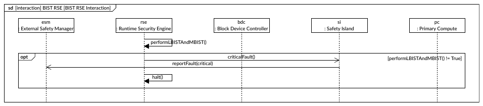

sd [interaction] BIST RSE [BIST RSE Interaction]

esm                                              rse                                                  bdc                               si                                            pc
: External Safety Manager                         : Runtime Security Engine                             : Block Device Controller            : Safety Island                              : Primary Compute

performLBISTAndMBIST()

opt                                                                                                            criticalFault()                                            [performLBISTAndMBIST() != True]
reportFault(critical)

halt()

BIST Safety Island sequence
Many phases of the main boot sequence initiate the BIST sequences of different parts of the
system.

The following figure shows the BIST Safety Island sequence that was initiated during the RSE phase
2 boot sequence in Figure 6-5: RSE phase 2 boot sequence on page 20.

**Figure 6-12: BIST Safety Island sequence**

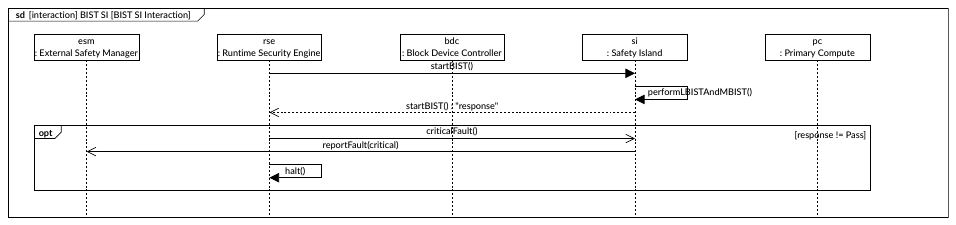

sd [interaction] BIST SI [BIST SI Interaction]

esm                                           rse                                                  bdc                         si                                           pc
: External Safety Manager                      : Runtime Security Engine                           : Block Device Controller        : Safety Island                             : Primary Compute
startBIST()

performLBISTAndMBIST()
startBIST() : "response"

opt                                                                                                     criticalFault()                                                           [response != Pass]
reportFault(critical)

halt()

BIST Primary Compute sequence
Many phases of the main boot sequence initiate the BIST sequences of different parts of the
system.

The following figure shows the BIST Primary Compute sequence that was initiated during the
Safety Island boot sequence in Figure 6-6: Safety Island boot sequence on page 21.

**Figure 6-13: BIST Primary Compute sequence**

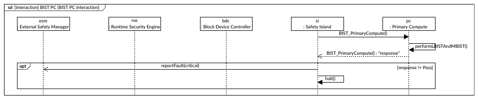

sd [interaction] BIST PC [BIST PC Interaction]

esm                                           rse                                                bdc                           si                                           pc
: External Safety Manager                      : Runtime Security Engine                           : Block Device Controller        : Safety Island                             : Primary Compute
BIST_PrimaryCompute()

performLBISTAndMBIST()
BIST_PrimaryCompute() : "response"

opt                                                                       reportFault(critical)                                                                                   [response != Pass]

halt()

<!-- Source PDF page: 27 -->

Verify configuration sequence
At the end of the Safety Island boot sequence, the verify configuration sequence is initiated to
ensure that the Safety Island is correctly configured and ready for operation.

The following figure shows the sequence that was started in Figure 6-6: Safety Island boot
sequence on page 21.

**Figure 6-14: Verify configuration sequence**

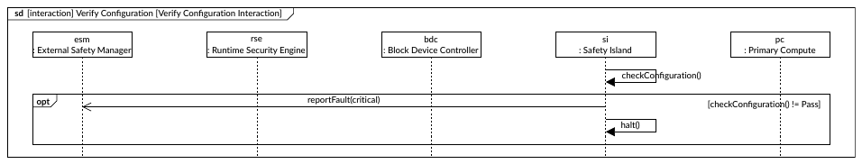

sd [interaction] Verify Configuration [Verify Configuration Interaction]

esm                                          rse                                                bdc                      si                                          pc
: External Safety Manager                     : Runtime Security Engine                           : Block Device Controller   : Safety Island                            : Primary Compute

checkConfiguration()

opt                                                                      reportFault(critical)                                                                 [checkConfiguration() != Pass]

halt()

## 6.2 Selecting and updating firmware images
The boot sequence expects an A+B model, where there are always two independent sets of
firmware images available to the system. The whichImageSet variable stored in Secure, non-volatile
memory determines which set to use.

If authentication for any image in the selected firmware image set fails, the system must indicate a
non-critical fault and fall back to the alternate image set.

If authentication for any image in the alternate firmware image set also fails, the system must
indicate a critical fault and not continue.

To update the firmware, leave the current set of images intact, but update every image in the
alternate set. Then, update the whichImageSet variable atomically to point to the updated set of
images. Finally, reset the system to trigger the use of the new images.

If anti-rollback measures are required, you must replace the remaining old set of images with the
new set after successfully booting with the new images.
