
# 9. Programmer's model for Zena CSS

<!-- Source PDF page: 33 -->

The programmer's model describes the Zena CSS memory locations, register details, and bit
descriptions that you need to write software that runs on the subsystem hardware.

## 9.1 Memory maps
The Zena CSS memory maps show how the subsystem memory is structured.

The main memory maps are:
•    AP system memory map
•    Cluster management domain memory map
•    Memory controller control memory map
•    System management memory map
•    PCIe MMIO memory map
•    I/O Block configuration space memory map
•    Debug memory map
•    RSE memory map
•    Safety Island memory map

Zena CSS supports 2 security states. The Physical Address Space bits and the Non-secure bit
define the security attributes for each transaction.

For physical address spaces such as DRAM and on-chip SRAM regions, transactions with the
appropriate security attributes are allowed as in the following table.

**Table 9-1: Physical address space ownership and access restrictions**

Region ownership                                 Non-secure access                                    Secure access
Non-secure (NS)                                  Accept                                               Deny
Secure (S)                                       Deny                                                 Accept

For example, a transaction that accesses a Secure or Non-secure region needs to come with the
correct NS bit to indicate if the transaction is Secure or Non-secure. From the perspective of the
system, Secure and Non-secure regions are different physical address spaces, and the NS bit can be
considered as an extension of the address bits. So a Secure transaction cannot access Non-secure
physical address space, and a Non-secure transaction cannot access Secure physical address space.

For the register spaces within the system IP components, transactions with the appropriate security
attributes are allowed as in the following table.

<!-- Source PDF page: 34 -->

**Table 9-2: Component configuration register space ownership and access restrictions**

Register ownership                                 Non-secure access                                   Secure access
Non-secure                                         Accept                                              Accept
Secure                                             Deny                                                Accept

Any transaction with security attributes that do not follow the rules in Table 9-1: Physical address
space ownership and access restrictions on page 33 and Table 9-2: Component configuration
register space ownership and access restrictions on page 34 returns a DECERR or SLVERR
response. For more information on DECERR and SLVERR responses, see AMBA® AXI Protocol
Specification, issue K.

The memory map defines different regions as:
•   Statically Secure or Non-secure
•   Software configurable
•   Secure for each access (per-access security)

Software configurable
These are components or regions that trusted software configures independently during boot
time. The software can change their default security access to either the Secure or Non-
secure state.
Secure for each access
These are components or regions that determine the security permissions for each access
based on the Non-secure bits. These bits are propagated along with each transaction and
access checks are done in the network interconnect or in the component itself. Any accesses
that fail the security check must result in a DECERR or SLVERR response.

Unless stated otherwise:
•   Accesses to reserved areas within the memory map also result in an IMPLEMENTATION DEFINED
error response.
•   Accesses to memory regions that are in reset or powered down should not hang the system,
and should result in an IMPLEMENTATION DEFINED error response.
•   When accessing areas occupied by peripherals or devices, the peripherals or devices determine
the response to return. These accesses can include unmapped or reserved areas within the
areas occupied by the peripheral or device.
•   For any Non-secure access targeting Secure regions, it is recommended to have one of the
following responses:
◦   DECERR response. Legacy subordinates can also return a SLVERR response for Secure
access failed cases.
◦   OKAY response. With Read-As-Zero and Writes Ignored (RAZ/WI).

<!-- Source PDF page: 35 -->

•   Any access to reserved areas within a subordinate component should generate a
RAZ/WI response.

•   Any access to unmapped address regions in the interconnect should generate a
DECERR response.

### 9.1.1 AP system memory map
The Application Processor (AP) system memory map defines the address regions accessible to key
system components, either directly or through remapping.

The AP memory map is visible to the following:
•    Application processors
•    System Management Block through address remapping
•    Safety Island (SI) through address remapping
•    RSE through address remapping
•    Embedded Trace Router
•    Coherent Expansion AXI subordinate interfaces
•    AP AXI-Access Port (AXI-AP)

**Table 9-3: AP memory map**

Start address      End address          Size      Name                           Description                                    Access
control
0x00_0000_0000 0x00_07FF_FFFF 128 MB Shared SRAM                                 Shared SRAM in Peripheral Block accessible     Secure,
by AP, RSE, and Safety Island and              Non-
programmable by software to Secure and         secure
Non-secure partitions
0x00_0800_0000 0x00_0FFF_FFFF 128 MB AP Memory Expansion 1                       Expansion Memory region for System-on-         Per-
Chip (SoC) components                          Access
Security
0x00_1000_0000 0x00_10FF_FFFF 16 MB               System NoC0 GPV                NoC interconnect connected to SoC              Secure
peripherals using the Global Programmer's
View (NI-710AE in System Management
Block)
0x00_1100_0000 0x00_11FF_FFFF 16 MB               System NoC1 GPV                NoC interconnect connected to SoC            Secure
peripherals (NI-710AE in Interconnect Block)
0x00_1200_0000 0x00_12FF_FFFF 16 MB               System NoC2 GPV                NoC interconnect connected to SoC              Secure
peripherals (NI-710AE in Peripheral Block)
0x00_1300_0000 0x00_13FF_FFFF 16 MB               System NoC3 GPV                NoC interconnect connected to SoC              Secure
peripherals
0x00_1400_0000 0x00_1A3F_FFFF 100 MB Reserved                                    -                                              -
0x00_1A40_0000 0x00_1A40_FFFF 64 KB               NS_UART                        AP Non-secure UART                             Non-
secure
0x00_1A41_0000 0x00_1A41_FFFF 64 KB               S_UART                         AP Secure UART                                 Secure

<!-- Source PDF page: 36 -->

Start address      End address          Size      Name                           Description                                    Access
control
0x00_1A42_0000 0x00_1A42_FFFF 64 KB               AP0_NS_WDOG0                   AP Non-secure Watchdog Control frame           Non-
CONTROL                                                                       secure
0x00_1A43_0000 0x00_1A43_FFFF 64 KB               AP0_NS_WDOG0 REFRESH AP Non-secure Watchdog Refresh frame                     Non-
secure
0x00_1A44_0000 0x00_1A45_FFFF 128 KB              Reserved                       -                                              -
0x00_1A46_0000 0x00_1A46_FFFF 64 KB               AP0_S_WDOG CONTROL             AP0 Secure/trusted Watchdog Control frame Secure
0x00_1A47_0000 0x00_1A47_FFFF 64 KB               AP0_S_WDOG REFRESH             AP0 Secure/trusted Watchdog Refresh frame Secure
0x00_1A48_0000 0x00_1A49_FFFF 128 KB              Reserved                       -                                              -
0x00_1A4A_0000 0x00_1A4A_FFFF 64 KB               SID                            System ID registers                            Non-
secure
0x00_1A4B_0000 0x00_1A80_FFFF 3.375               Reserved                       -                                              -
MB
0x00_1A81_0000 0x00_1A81_FFFF 64 KB               AP0_REFCLK_CNTCTL              AP Generic Timer Control frame                 Non-
secure
0x00_1A82_0000 0x00_1A82_FFFF 64 KB               AP0_REFCLK_S_CNTBase1          AP Secure Generic Timer Control base frame Secure
0x00_1A83_0000 0x00_1A83_FFFF 64 KB               AP0_REFCLK_NS_CNTBase0 AP Non-secure Generic Timer Control base               Non-
frame                                                  secure
0x00_1A84_0000 0x00_1ABF_FFFF 3.75                Reserved                       -                                              -
MB
0x00_1AC0_0000 0x00_1AC2_FFFF 192 KB              SCMI_SCMI_MHU_SND_S            SCMI to SCMI multichip communication           Secure
0x00_1AC3_0000 0x00_1AC5_FFFF 192 KB              SCMI_SCMI_MHU_RCV_S            SCMI to SCMI multichip communication           Secure
0x00_1AC6_0000 0x00_1ADF_FFFF 1.625               Reserved                       -                                              -
MB
0x00_1AE0_0000 0x00_1AE2_FFFF 192 KB              RSE_RSE_MHU_SND_S              RSE to RSE multichip communication             Secure
0x00_1AE3_0000 0x00_1AE5_FFFF 192 KB              RSE_RSE_MHU_RCV_S              RSE to RSE multichip communication             Secure
0x00_1AE6_0000 0x00_1B9F_FFFF 11.625              Reserved                       -                                              -
MB
0x00_1BA0_0000 0x00_1BA2_FFFF 192 KB              SI_SI_MHU_SND_S                SI to SI multichip communication               Secure
0x00_1BA3_0000 0x00_1BA5_FFFF 192 KB              SI_SI_MHU_RCV_S                SI to SI multichip communication               Secure
0x00_1BA6_0000 0x00_1CFF_FFFF 21.625              Reserved                       -                                              -
MB
0x00_1D00_0000 0x00_1DEF_FFFF 15 MB               FMU Region                     FMU Region space for all in APP Subsystem      -
FMU
0x00_1DF0_0000 0x00_1DFF_FFFF 1 MB                Reserved                       -                                              -
0x00_1E00_0000 0x00_1EFF_FFFF 16 MB               STM                            STM Stimulus address region                    -
0x00_1F00_0000 0x00_1FFF_FFFF 16 MB               Reserved                       -                                              -
0x00_2000_0000 0x00_27FF_FFFF 128 MB GIC                                         -                                              Per-
Access
Security
0x00_2800_0000 0x00_2FFF_FFFF 128 MB Reserved                                    -                                              -
0x00_3000_0000 0x00_3FFF_FFFF 256 MB AP Memory Expansion                         AP Memory Expansion                            Per-
Access
Security

<!-- Source PDF page: 37 -->

Start address      End address          Size      Name                           Description                                    Access
control
0x00_4000_0000 0x00_4FFF_FFFF 256 MB System Management Domain Access into the System Management Domain Per-
Access Region            by ATUs. By default, this path is closed, but Access
can be opened for access into shared SMD      Security,
SRAM, or any other part of the system in the filtered
SI and the System Management Domain.          by
ATUs
0x00_5000_0000 0x00_5000_FFFF 64 KB               SMD AP_EXP_I_1 NoC             Configuration space for the NoC SMD             Per-
config space                    AP_EXP_I_1                                     Access
Security
0x00_5001_0000 0x00_5FFE_FFFF 255.875 Reserved                                   -                                              -
MB
0x00_5FFF_0000 0x00_5FFF_FFFF 64 KB               RGIC2LGIC_MESSREG              This frame is for remote GIC to local GIC      Per-
interrupt message communication                Access
Security
0x00_6000_0000 0x00_7FFF_FFFF 512 MB PCIe NI-710AE Memory                        PCIe Memory space1. This region is always      Per-
space1                                      offset from address 0x00. Any area of this      Access
DRAM can only exist in one chiplet but         Security
can be mapped to any chiplet. Any unused
regions are reserved.
0x00_8000_0000 0x00_FFFF_FFFF 2 GB                DRAM                           DRAM. This region is always offset from         -
address 0x00. Any area of this DRAM can
only exist in one chiplet but can be mapped
to any chiplet. Any unused regions are
reserved.
0x01_0000_0000 0x01_3FFF_FFFF 1 GB                CMN GPV                        CMN GPV Regions CMN                            -
0x01_4000_0000 0x01_7FFF_FFFF 1 GB                Cluster management domain 1 GB region partitioned into two                    -
memory map                512 MB halves. 0x1_4000_0000 to
0x1_5FFF_FFFF is the AP Utility Space,
which also hosts the Cluster Utility Bus.
0x1_6000_0000 to 0x1_7FFF_FFFF is
reserved.
0x01_8000_0000 0x01_BFFF_FFFF 1 GB                Memory controller control      Memory controllers, MPR, PHYs. This is         -
memory map                     currently divided into 64 MB spaces and
mapped to SN-F.F to support DMCs, MPR,
and PHYs
0x01_C000_0000 0x02_1FFF_FFFF 1.5 GB              SMMU+NI-710AE GPV +            I/O Block configuration space                   -
PCIe CTRL+PHY
0x02_2000_0000 0x05_FFFF_FFFF 15.5 GB Reserved                                   -                                              -
0x06_0000_0000 0x07_FFFF_FFFF 8 GB                AP Memory Expansion 2          -                                              -
0x08_0000_0000 0x08_7FFF_FFFF 2 GB                Debug Memory Map               -                                              -
0x08_8000_0000 0x0D_FFFF_FFFF 22 GB               DRAM                           -                                              -
0x0E_0000_0000 0x0F_FFFF_FFFF 8 GB                Reserved                       -                                              -

Application address mapping for multichip
For a multichip case, the application memory base address for the on-chip peripherals for each
chip is different. The offset for each chip depends on SID_CHIP_ID and CHIP_ADDR_SZ and it is
IMPLEMENTATION DEFINED.

<!-- Source PDF page: 38 -->

**Table 9-4: Multichip AP memory map**

Start address         End address            Size     Chip number
0x00_0000_0000        0x0F_FFFF_FFFF         64 GB Chip0 on-chip Peripheral Space region
0x10_0000_0000        0x1F_FFFF_FFFF         64 GB Chip1 on-chip Peripheral Space region for systems with more than 1 chip.
Reserved in single-chip systems.
0x20_0000_0000        0x2F_FFFF_FFFF         64 GB Chip2 on-chip Peripheral Space region for systems with more than 1 chip.
Reserved in single-chip systems.
0x30_0000_0000        0x3F_FFFF_FFFF         64 GB Reserved
0x40_0000_0000        0xFF_FFFF_FFFF         768      Reserved
GB
0x100_0000_0000       0x100_FFFF_FFFF        4 GB     PCI NI-710AE Memory space2. This region can be mapped to any chip.
0x101_0000_0000       0x1FF_FFFF_FFFF        0.996    PCI NI-710AE Memory space3. This region can be mapped to any chip.
TB
0x200_0000_0000       0xBFFF_FFFF_FFFF 190            DRAM. This region can be mapped to any chip.
TB
0xC000_0000_0000 0xFFFF_FFFF_FFFF 64 TB AP Memory Expansion 3. This region can be mapped to any chip.

### 9.1.2 Cluster management domain memory map
The cluster management domain regions consist of views into each cluster utility area as well as
into the host Monitor Group Interface (MGI).

The following table shows the memory map for the cluster management domain.

**Table 9-5: Cluster management domain memory map**

Start address   End address    AP start address      AP end address       Size Name              Description                      Access
control
0x0000_0000 0x03FF_FFFF 0x01_4000_0000 0x01_43FF_FFFF 64 Cluster 0                               Peripherals shared between       Per-
MB Management                              the MDC and AP for Cluster       Access
Domain                                  0. See Cluster <n> utility       Security
AP Shared                               region memory map
Peripherals
0x0400_0000 0x07FF_FFFF 0x01_4400_0000 0x01_47FF_FFFF 64 Cluster 1 MDC Peripherals shared between                                 Per-
MB AP Shared     the MDC and AP for Cluster                                 Access
Peripherals   1. See Cluster <n> utility                                 Security
region memory map
0x0800_0000 0x0BFF_FFFF 0x01_4800_0000 0x01_4BFF_FFFF 64 Cluster 2 MDC Peripherals shared between                                 Per-
MB AP Shared     the MDC and AP for Cluster                                 Access
Peripherals   2. See Cluster <n> utility                                 Security
region memory map
0x0C00_0000 0x0FFF_FFFF 0x01_4C00_0000 0x01_4FFF_FFFF 64 Cluster 3 MDC Peripherals shared between                                 Per-
MB AP Shared     the MDC and AP for Cluster                                 Access
Peripherals   3. See Cluster <n> utility                                 Security
region memory map
0x1000_0000 0x3FFF_FFFF 0x01_5000_0000 0x01_7FFF_FFFF 768 Reserved                               -                                -
MB

<!-- Source PDF page: 39 -->

Cluster <n> utility region memory map
Each cluster utility region has a specific mapping.

The start address for each region is offset from the corresponding address in Table 9-5: Cluster
management domain memory map on page 38.

**Table 9-6: Cluster <n> utility region memory map**

Start address   End address    Size     Name                 Description                                                      Access
control
0x0000_0000 0x000F_FFFF 1 MB            Reserved             -                                                                -
0x0010_0000 0x001F_FFFF 1 MB            SBISTC               Software Built-In Self Test (SBIST) controller registers         Secure
0x0020_0000 0x007F_FFFF 6 MB            AP cluster           Area to host MGIs and any other cluster-related control          Per-Access
expansion space      entities                                                         Security
0x0080_0000 0x00FF_FFFF 8 MB            Reserved             -                                                                -
0x0100_0000 0x0100_FFFF 64 KB           Cluster control      External cluster system control registers                        Secure
0x0101_0000 0x0101_FFFF 64 KB           Cluster MPAM         External MPAM registers                                          Per-Access
Security
0x0102_0000 0x0102_FFFF 64 KB           Cluster RAS          External cluster RAS registers                                   Per-Access
Security
0x0103_0000 0x0103_FFFF 64 KB           Cluster PPU          External cluster PPU registers                                   Secure
0x0104_0000 0x0104_FFFF 64 KB           Activity monitors External cluster AMU registers                                      Per-Access
Security
0x0105_0000 0x0105_FFFF 64 KB           Cluster AE           External cluster AE registers                                    Per-Access
registers                                                                             Security
0x0106_0000 0x0107_FFFF 128             Reserved             -                                                                -
KB
0x0108_0000 0x0108_FFFF 64 KB           Core 0 PPU           External core PPU registers                                      Secure
0x0109_0000 0x010F_FFFF 448             Core 0 registers     Core registers                                                   Per-Access
KB                                                                                                    Security
0x0110_0000 0x0117_FFFF 512             Reserved             -                                                                -
KB
0x0118_0000 0x0118_FFFF 64 KB           Core 1 PPU           External core PPU registers                                      Secure
0x0119_0000 0x011F_FFFF 448             Core 1 registers     Core registers                                                   Per-Access
KB                                                                                                    Security
0x0120_0000 0x0127_FFFF 512             Reserved             -                                                                -
KB
0x0128_0000 0x0128_FFFF 64 KB           Core 2 PPU           External core PPU registers                                      Secure
0x0129_0000 0x012F_FFFF 448             Core 2 registers     Core registers                                                   Per-Access
KB                                                                                                    Security
0x0130_0000 0x0137_FFFF 512             Reserved             -                                                                -
KB
0x0138_0000 0x0138_FFFF 64 KB           Core 3 PPU           External core PPU registers                                      Secure
0x0139_0000 0x013F_FFFF 448             Core 3 registers     Core registers                                                   Per-Access
KB                                                                                                    Security
0x0140_0000 0x01FF_FFFF 12 MB Reserved                       -                                                                -

<!-- Source PDF page: 40 -->

Start address   End address    Size     Name                 Description                                                    Access
control
0x0200_0000 0x0200_FFFF 64 KB           Cluster control      Cluster control registers for RVBAR address configuration, see Secure
registers            E_CPU_CSR register summary
0x0201_0000 0x03FF_FFFF 31.938 Reserved                      -                                                              -
MB

### 9.1.3 Memory controller control memory map
The memory controller control regions consist of views into each memory controller control
expansion area.

The memory controller control region for each cluster is mapped as shown in the following table.

**Table 9-7: Memory controller control memory map**

Start address   End address    AP start address     AP end address         Size    Name                                Access control
0x0000_0000 0x03FF_FFFF 0x01_8000_0000 0x01_83FF_FFFF 64 MB DRAM Controller Control                                    Per-Access
Expansion 0                                                Security
0x0400_0000 0x07FF_FFFF 0x01_8400_0000 0x01_87FF_FFFF 64 MB DRAM Controller Control                                    Per-Access
Expansion 1                                                Security
0x0800_0000 0x0BFF_FFFF 0x01_8800_0000 0x01_8BFF_FFFF 64 MB DRAM Controller Control                                    Per-Access
Expansion 2                                                Security
0x0C00_0000 0x0FFF_FFFF 0x01_8C00_0000 0x01_8FFF_FFFF 64 MB DRAM Controller Control                                    Per-Access
Expansion 3                                                Security
0x1000_0000 0x13FF_FFFF 0x01_9000_0000 0x01_93FF_FFFF 64 MB DRAM Controller Control                                    Per-Access
Expansion 4                                                Security
0x1400_0000 0x17FF_FFFF 0x01_9400_0000 0x01_97FF_FFFF 64 MB DRAM Controller Control                                    Per-Access
Expansion 5                                                Security
0x1800_0000 0x1BFF_FFFF 0x01_9800_0000 0x01_9BFF_FFFF 64 MB DRAM Controller Control                                    Per-Access
Expansion 6                                                Security
0x1C00_0000 0x1FFF_FFFF 0x01_9C00_0000 0x01_9FFF_FFFF 64 MB DRAM Controller Control                                    Per-Access
Expansion 7                                                Security
0x2000_0000 0x3FFF_FFFF 0x01_A000_0000 0x01_BFFF_FFFF 512                          Reserved                            -
MB

### 9.1.4 System management memory map
The system management memory map is the map of an independent 52-bit address space for
system management.

This address space has four key regions that are also defined by the top 4 address bits [51:48] as
follows:
0000
This region maps only to a port that accesses the Primary Compute application physical
address space.

<!-- Source PDF page: 41 -->

0001
This region maps only to a port that accesses the Primary Compute application address
space. This port targets a Translation Control Unit (TCU) so that memory mapping can be
controlled by the Application Processor (AP).
0010
This region is the shared System Management Domain (SMD) that hosts shared SRAMs,
system-related PPUs, power and clock control system-wide logic, and expansion interfaces
for additional power and clock control logic. This region is also available for external
peripherals for off-chip interfaces to Power Management Integrated Circuits (PMICs).
0011
This region maps to the RSE. Because the RSE is a 32-bit system, all access within this region
that is outside the RSE subsystem space is blocked.
0100
This region maps to the Safety Island. Because the Safety Island is a 40-bit system, all access
within this region that is outside the Safety Island subsystem space is blocked.

All other encodings are reserved.

The Access Protection Unit (APU) of the NI-710AE is provided for access to each of the preceding
subsystems to provide access filtering. By default, all accesses are blocked except for the RSE. RSE
can then decide how to allocate access.

**Table 9-8: System management memory map**

Start address             End address                 Size      Name        Description                      Access control
0x00_0000_0000_0000 0x00_FFFF_FFFF_FFFF 256 TB                  AP          Region for access to the AP      Per-Access Security. APU
Access      physical memory map              on NI-710AE gating.
Default to only the RSE at
boot.
0x01_0000_0000_0000 0x01_FFFF_FFFF_FFFF 256 TB                  AP          Region for access to the AP      Per-Access Security. APU
Access      memory map through TCU           on NI-710AE gating.
through                                      Default to only the RSE at
TCU                                          boot.
0x02_0000_0000_0000 0x02_0000_5FFF_FFFF 1.5 GB                  Reserved    -                                -
0x02_0000_6000_0000 0x02_0000_600F_FFFF 1 MB                    SMD         System Management Shared       Per-Access Security. APU
SRAM 1      SRAM. Accessible to all        on NI-710AE gating.
MB          subsystems firewalled using the Default to only the RSE at
APU.                           boot.
0x02_0000_6010_0000 0x02_0000_CFFF_FFFF 1.749                   Reserved    -                                -
GB
0x02_0000_D000_0000 0x02_0000_D7FF_FFFF 128 MB CSS                          CSS Control region               Per-Access Security. APU
Control                                                       on NI-710AE gating.
Default to only the RSE at
boot.
0x02_0000_D800_0000 0x02_0000_E7FF_FFFF 256 MB System    System Control expansion area Per-Access Security. APU
Control   targeting System Expansion    on NI-710AE gating.
Expansion AXI interface                 Default to only the RSE at
boot.

<!-- Source PDF page: 42 -->

Start address             End address                 Size      Name        Description                      Access control
0x02_0000_E800_0000 0x02_FFFF_FFFF_FFFF 255.996 Reserved                    -                                -
TB
0x03_0000_0000_0000 0x03_0000_FFFF_FFFF 4 GB                    RSE         Region for access into the RSE   Per-Access Security. APU
Access      address space                    on NI-710AE gating.
Default to only the RSE at
boot.
0x03_0001_0800_0000 0x03_FFFF_FFFF_FFFF 255.996 Reserved                    -                                -
TB
0x04_0000_0000_0000 0x04_0000_FFFF_FFFF 256 TB                  SI Access Region for access into the SI      Per-Access Security. APU
address space                      on NI-710AE gating.
Default to only the RSE at
boot.
0x05_0000_0000_0000 0x0F_FFFF_FFFF_FFFF 2816                    Reserved    -                                -
TB

9.1.4.1 CSS control region memory map
The CSS control region memory map includes local peripherals and expansion space in the System
Management Domain (SMD).

**Table 9-9: CSS control region memory map**

Start address             End address                 Size     Name                        Description                  Access control
0x02_0000_D000_0000 0x02_0000_D000_FFFF 64 KB                  Reserved                    -                            -
0x02_0000_D001_0000 0x02_0000_D001_FFFF 64 KB                  Reset Generation            Reset Generation Manager     Secure. APU
Manager                     Register Block, see Reset    on NI-710AE
Generation Manager           gating. Default
register summary             to only the RSE
at boot.
0x02_0000_D002_0000 0x02_0000_D006_FFFF 320                    Reserved                    -                            -
KB
0x02_0000_D007_0000 0x02_0000_D007_FFFF 64 KB                  SMD Expansion to SMD        SMD Expansion to SMD         Secure. APU
Access ATU                  Access ATU Configuration,     on NI-710AE
see ATU register summary     gating. Default
to only the RSE
at boot.
0x02_0000_D008_0000 0x02_0000_D008_FFFF 64 KB                  AP to SMD Access ATU        Application Processor        Secure. APU
to SMD Access ATU            on NI-710AE
Configuration, see ATU        gating. Default
register summary             to only the RSE
at boot.
0x02_0000_D009_0000 0x02_0000_D009_FFFF 64 KB                  CLUSMGT to SMD              Cluster Management           Secure. APU
Access ATU                  to SMD Access ATU            on NI-710AE
Configuration, see ATU        gating. Default
register summary             to only the RSE
at boot.
0x02_0000_D00A_0000 0x02_0000_D00F_FFFF 384                    Reserved                    -                            -
KB

<!-- Source PDF page: 43 -->

Start address             End address                 Size     Name                        Description                   Access control
0x02_0000_D010_0000 0x02_0000_D010_FFFF 64 KB                  REFCLK Counter              The REFCLK counter            Secure. APU
CNTControlBase              registers provide access to   on NI-710AE
and control of the counter.   gating. Default
to only the RSE
at boot.
0x02_0000_D011_0000 0x02_0000_D011_FFFF 64 KB                  REFCLK Counter              The REFCLK counter Read       Secure. APU
CNTRead                     Frame to provide access to    on NI-710AE
read counter value            gating. Default
to only the RSE
at boot.
0x02_0000_D012_0000 0x02_0000_D012_FFFF 64 KB                  SYSCNT0_MSTSYNC             The System Generic timer      Secure. APU
_CTRL                       synchronization control,      on NI-710AE
see System Generic Timer      gating. Default
Synchronization register      to only the RSE
summary                       at boot.
0x02_0000_D013_0000 0x02_0000_D01F_FFFF 832                    Reserved                    -                             -
KB
0x02_0000_D020_0000 0x02_0000_D020_FFFF 64 KB                  SYSTOP Power                The SYSTOP Power              Secure. APU
Integration                 Integration                   on NI-710AE
gating. Default
to only the RSE
at boot.
0x02_0000_D021_0000 0x02_0000_D021_FFFF 64 KB                  DBGTOP Power                The DBGTOP Power              Secure. APU
Integration                 Integration                   on NI-710AE
gating. Default
to only the RSE
at boot.
0x02_0000_D022_0000 0x02_0000_D02F_FFFF 896                    Reserved                    -                             -
KB
0x02_0000_D030_0000 0x02_0000_D030_FFFF 64 KB                  UART                        General purpose UART in       S/NS. APU
the System Management         on NI-710AE
Domain                        gating. Default
to only the RSE
at boot.
0x02_0000_D031_0000 0x02_0000_D031_FFFF 64 KB                  GPIO                        GPIO in the System            S/NS. APU
Management Domain             on NI-710AE
gating. Default
to only the RSE
at boot.
0x02_0000_D032_0000 0x02_0000_D03F_FFFF 896                    Reserved                    -                             -
KB
0x02_0000_D040_0000 0x02_0000_D040_FFFF 64 KB                  System ID register          System ID Register in         S/NS. APU
the System Management         on NI-710AE
Domain, see System ID         gating. Default
register summary              to only the RSE
at boot.
0x02_0000_D041_0000 0x02_0000_D105_FFFF 12.313 Reserved                                    -                             -
MB
0x02_0000_D106_0000 0x02_0000_D106_FFFF 64 KB                  AP_SM_ATU_ERR_REC           Error record block for AP to -
SMD ATU.

<!-- Source PDF page: 44 -->

Start address             End address                 Size     Name                        Description                     Access control
0x02_0000_D107_0000 0x02_0000_D107_FFFF 64 KB                  SM_SI_ATU_ERR_REC           Error record block for SMD      -
to SI ATU.
0x02_0000_D108_0000 0x02_0000_D10B_FFFF 256                    Reserved                    -                               -
KB
0x02_0000_D10C_0000 0x02_0000_D10C_FFFF 64 KB                  REFCLK_CNTCTRLBASE          Error record block              -
_ERR_REC                    for REFCLK Counter
CNTControlBase.
0x02_0000_D10D_0000 0x02_0000_D10D_FFFF 64 KB                  REFCLK_CNTREAD              Error record block for          -
_ERR_REC                    REFCLK Counter Read.
0x02_0000_D10E_0000 0x02_0000_D10E_FFFF 64 KB                  SYSCNT0 _MSYNC_ERR          Error record block for The      -
_REC                        System Generic timer
synchronization control.
0x02_0000_D10F_0000 0x02_0000_D10F_FFFF 64 KB                  SYSTOP_PWR_ERR_REC          Error record block for          -
SYSTOP Power Integration
0x02_0000_D110_0000 0x02_0000_D110_FFFF 64 KB                  DBGTOP_PWR_ERR_REC Error record block for   -
DBGTOP Power Integration
0x02_0000_D111_0000 0x02_0000_D111_FFFF 64 KB                  UART_ERR_REC                Error record block for SMD      -
UART
0x02_0000_D112_0000 0x02_0000_D112_FFFF 64 KB                  GPIO_ERR_REC                Error record block for SMD      -
GPIO
0x02_0000_D113_0000 0x02_0000_D1FF_FFFF 14.813 Reserved                                    -                               -
MB
0x02_0000_D200_0000 0x02_0000_D20F_FFFF 1 MB                   FMU_CLUSTER_000             FMU access of Network-       -
on-Chip (NoC) in Cluster 0's
subsystem
0x02_0000_D210_0000 0x02_0000_D21F_FFFF 1 MB                   FMU_CLUSTER_001             FMU access of NoC in            -
Cluster 1's subsystem
0x02_0000_D220_0000 0x02_0000_D22F_FFFF 1 MB                   FMU_CLUSTER_002             FMU access of NoC in            -
Cluster 2's subsystem
0x02_0000_D230_0000 0x02_0000_D23F_FFFF 1 MB                   FMU_CLUSTER_003             FMU access of NoC in            -
Cluster 3's subsystem
0x02_0000_D240_0000 0x02_0000_D24F_FFFF 1 MB                   FMU_SYS_CTRL                FMU access of NoC of            -
system control
0x02_0000_D250_0000 0x02_0000_D25F_FFFF 1 MB                   FMU_GIC                     FMU access of GIC               -
0x02_0000_D260_0000 0x02_0000_D26F_FFFF 1 MB                   FMU_SMD                     FMU access of NoC in SMD -
0x02_0000_D270_0000 0x02_0000_D27F_FFFF 1 MB                   FMU_PERIPH                  FMU access of NoC in            -
Peripheral block
0x02_0000_D280_0000 0x02_0000_D28F_FFFF 1 MB                   FMU_IOBLOCK_1               FMU access of NoC 1 of IO -
block
0x02_0000_D290_0000 0x02_0000_D29F_FFFF 1 MB                   FMU_IOBLOCK_2               FMU access of NoC 2 of IO -
block
0x02_0000_D2A0_0000 0x02_0000_D2AF_FFFF 1 MB                   FMU_SMD_AP _EXP_I_1         FMU access for NoC of AP        -
expansion interface
0x02_0000_D2B0_0000 0x02_0000_D2BF_FFFF 1 MB                   FMU_SMD_AHB2AXI             FMU access of NoC of            -
AHB2AXI
0x02_0000_D2C0_0000 0x02_0000_D300_FFFF 4.063                  Reserved                    -                               -
MB

<!-- Source PDF page: 45 -->

Start address             End address                 Size     Name                           Description                      Access control
0x02_0000_D301_0000 0x02_0000_D301_FFFF 64 KB                  I/O Block register             Registers for I/O Block, see -
description                    SMD CSR register summary
0x02_0000_D302_0000 0x02_0000_D305_FFFF 256                    SMD NoC config space            Configuration space for           -
KB                                                    SMD NoC
0x02_0000_D306_0000 0x02_0000_D308_FFFF 192                    SMD AHB2AXI NoC                Configuration space for           -
KB                     config space                    SMD AHB2AXI NoC
0x02_0000_D309_0000 0x02_0000_D7FF_FFFF 79.438 Reserved                                       -                                -
MB

9.1.4.2 SYSTOP power integration memory map
The following table shows the SYSTOP power integration memory map.

**Table 9-10: SYSTOP power integration memory map**

Start address             End address                 Size Name             Description                                        Access control
0x02_0000_D020_0000 0x02_0000_D020_0FFF 4                    SYSTOP_CTRL SYSTOP integration control registers, see             Secure. APU
KB                               SYSTOP PIK register summary                           on NI-710AE
gating. Default
to only the RSE
at boot.
0x02_0000_D020_1000 0x02_0000_D020_1FFF 4                    SYSTOP_PPU     Power Policy Unit that is responsible              Secure. APU
KB                                  for all SYSTOP logic. For register                 on NI-710AE
information, see the Arm® Power Policy             gating. Default
Unit Architecture Specification, version 1.1,       to only the RSE
issue E.                                           at boot.
0x02_0000_D020_2000 0x02_0000_D020_FFFF 56                   Reserved       -                                                  -
KB

9.1.4.3 DBGTOP power integration memory map
The following table shows the DBGTOP power integration memory map.

**Table 9-11: DBGTOP power integration memory map**

Start address             End address                 Size Name                 Description                                    Access control
0x02_0000_D021_0000 0x02_0000_D021_0FFF 4                    DBGTOP_CTRL DBGTOP integration control registers,                 Secure. APU
KB                               see DBGTOP PIK register summary                       on NI-710AE
gating. Default
to only the RSE
at boot.
0x02_0000_D021_1000 0x02_0000_D021_1FFF 4                    DBGTOP_PPU         Power Policy Unit that is responsible          Secure. APU
KB                                      for all DBGTOP logic. For register             on NI-710AE
information, see the Arm® Power Policy         gating. Default
Unit Architecture Specification, version 1.1,   to only the RSE
issue E.                                       at boot.
0x02_0000_D021_2000 0x02_0000_D021_FFFF 56                   Reserved           -                                              -
KB

<!-- Source PDF page: 46 -->

9.1.4.4 RSE access map in SMD
This region implements the Combined Messaging unit (CMU) access by the System Management
Domain (SMD) to RSE.

**Table 9-12: RSE access map in SMD**

Start address             End address                 Size   Name                  Description                            Access
control
0x03_0000_1AE0_0000 0x03_0000_1AE2_FFFF 192                  RSE_CMU_MHU6_S RSE (Chip 1) to RSE (Chip 0) Secure           Secure
KB                                  Send frame
0x03_0000_1AE3_0000 0x03_0000_1AE5_FFFF 192                  RSE_CMU_MHU6_R RSE (Chip 0) to RSE (Chip 1) Secure           Secure
KB                                  Receive frame
0x03_0000_1B60_0000 0x03_0000_1B62_FFFF 192                  RSE_CMU_MHU2_S AP Domain 0 to RSE Secure Send                Secure, AP
KB                                  frame                                         only
0x03_0000_1B63_0000 0x03_0000_1B65_FFFF 192                  RSE_CMU_MHU2_R RSE to AP Domain 0 Secure Receive Secure, AP
KB                                  frame                             only
0x03_0000_1B66_0000 0x03_0000_1B68_FFFF 192                  RSE_CMU_MHU3_S AP Domain 0 to RSE Non-secure                 Non-secure,
KB                                  Send frame                                    AP only
0x03_0000_1B69_0000 0x03_0000_1B6B_FFFF 192                  RSE_CMU_MHU3_R RSE to AP Domain 0 Non-secure                 Non-secure,
KB                                  Receive frame                                 AP only

### 9.1.5 PCIe MMIO memory map
The following table shows an example PCIe MMIO memory map.

**Table 9-13: Example PCIe MMIO memory map**

Start address       End address           Size    Name        Description
0x000_0000_0000 0x000_7FFF_FFFF 2 GB Reserved                 -
0x100_0000_0000 0x100_0FFF_FFFF 256               ECAM0    ECAM0 Memory region - This region is reserved for the ECAM space. This
MB                - PCI    address region is split across multiple HNPs as required by the devices
NI-710AE connected to each PCIe controller. This is mapped to each PCIe path using
Memory RNSAM to a particular HNP connected to PCIe X8 CFG port.
space2
0x100_1000_0000 0x100_1FFF_FFFF 256               ECAM1    ECAM1 Memory region - This region is reserved for the ECAM space. This
MB                - PCI    address region is split across multiple HNPs as required by the devices
NI-710AE connected to each PCIe controller. This is mapped to each PCIe path using
Memory RNSAM to a particular HNP connected to PCIe X4_0 CFG port.
space2
0x100_2000_0000 0x100_2FFF_FFFF 256               ECAM2    ECAM2 Memory region - This region is reserved for the ECAM space. This
MB                - PCI    address region is split across multiple HNPs as required by the devices
NI-710AE connected to each PCIe controller. This is mapped to each PCIe path using
Memory RNSAM to a particular HNP connected to PCIe X4_1 CFG port.
space2
0x100_3000_0000 0x100_3FFF_FFFF 256               ECAM3    ECAM3 Memory region - This region is reserved for the ECAM space. This
MB                - PCI    address region is split across multiple HNPs as required by the devices
NI-710AE connected to each PCIe controller. This is mapped to each PCIe path using
Memory RNSAM to a particular HNP connected to PCIe X1_0 CFG port.
space2

<!-- Source PDF page: 47 -->

Start address       End address           Size    Name        Description
0x100_4000_0000 0x100_4FFF_FFFF 256               ECAM4    ECAM4 Memory region - This region is reserved for the ECAM space. This
MB                - PCI    address region is split across multiple HNPs as required by the devices
NI-710AE connected to each PCIe controller. This is mapped to each PCIe path using
Memory RNSAM to a particular HNP connected to PCIe X1_1 CFG port.
space2
0x100_5000_0000 0x100_5FFF_FFFF 256               Reserved    -
MB
0x100_6000_0000 0x100_FFFF_FFFF 2.5               Reserved    -
GB
0x101_0000_0000 0x101_1FFF_FFFF 512               PCIe     MMIOH Memory region - This region is reserved for MMIO space. This
MB                NI-710AE region is used for the PCIe X4_0 port or for the first half of a PCIe X8
Memory port.
space3
(X4_0)
0x101_2000_0000 0x101_3FFF_FFFF 512               PCIe     MMIOH Memory region - This region is reserved for MMIO space. This
MB                NI-710AE region is used for the PCIe X4_1 port or for the second half of a PCIe X8
Memory port.
space3
(X4_1)
0x101_4000_0000 0x101_5FFF_FFFF 512               PCIe     MMIOH Memory region - This region is reserved for MMIO space. This
MB                NI-710AE region is used for the PCIe X1_0 port.
Memory
space3
(X1_0)
0x101_6000_0000 0x101_7FFF_FFFF 512               PCIe     MMIOH Memory region - This region is reserved for MMIO space. This
MB                NI-710AE region is used for the PCIe X1_1 port.
Memory
space3
(X1_1)
0x101_8000_0000 0x1FF_FFFF_FFFF 0.994 Reserved                -
TB

### 9.1.6 I/O Block configuration space memory map
The following table shows the global I/O Block view.

**Table 9-14: Global I/O Block memory map**

Start address       End address           Size    Name            Description
0x001_C000_0000 0x001_C7FF_FFFF 128               Memory      Memory map for the TCU, associated TBUs, NI-710AE, and expansions
MB                map for I/O for the I/O Block. For details, see Table 9-15: I/O Block memory map on
Block       page 48.
0x001_C800_0000 0x002_1FFF_FFFF 1.375 Reserved                    -
GB

The following table shows the I/O Block memory map.

The start address for the I/O Block memory region is offset from the corresponding address in
**Table 9-14: Global I/O Block memory map on page 47.**

<!-- Source PDF page: 48 -->

**Table 9-15: I/O Block memory map**

Start address      End address           Size Name         Description
0x00_0000_0000 0x00_01FF_FFFF 32 TCU and                   TCU and its associated TBU. See the Arm® CoreLink™ MMU-720AE System
MB TBUs                      Memory Management Unit Technical Reference Manual for details
0x00_0200_0000 0x00_027F_FFFF 8  NCI0 GPV                  GPV for Network-on-Chip (NoC) 0
MB
0x00_0280_0000 0x00_02FF_FFFF 8  NCI1 GPV                  GPV for NoC 1
MB
0x00_0300_0000 0x00_037F_FFFF 8  Reserved                  -
MB
0x00_0380_0000 0x00_05AF_FFFF 35 Reserved                  -
MB
0x00_05B0_0000 0x00_05B0_FFFF 64              Expansion Expansion for I/O integration control registers, see IO_REGBANK register
KB              for IO      summary
Integration
Control
0x00_05B1_0000 0x00_05BF_FFFF 960 Reserved                 -
KB
0x00_05C0_0000 0x00_05FF_FFFF 4  PCIe PHY                  Expansion interface for PHY and other component configuration register
MB                           space. Up to PCIe0-7: 512 KB each
0x00_0600_0000 0x00_07FF_FFFF 32 Bifurcation Expansion interface for x16 PCIe Bifurcation path0, up to PCIe0-7 controller
MB path0       configuration space. 4 MB for each controller. This is the region assigned to
the PCIe-specific controller registers, not the ECAM space root port registers.

### 9.1.7 Debug memory map
The following table shows the debug memory map.

**Table 9-16: Debug memory map**

Start address   End address      AP start address       AP end address           Size Name                      Description
0x0003_0000 0x0003_FFFF 0x0008_0003_0000 0x0008_0003_FFFF 64                          AON_CTI                   Debug AON domain CTI
KB                                                    configuration registers
0x0004_0000 0x0004_FFFF 0x0008_0004_0000 0x0008_0004_FFFF 64                          AON_SMB_ATF               Debug AON domain ATF
KB                                                    configuration registers
0x0005_0000 0x0005_FFFF 0x0008_0005_0000 0x0008_0005_FFFF 64                          AON_TPIU                  Debug AON domain TPIU
KB                                                    configuration registers
0x0006_1000 0x0006_1FFF 0x0008_0006_1000 0x0008_0006_1FFF 4                           AON_SI_APBAP              Debug AON domain SI
KB                                                    APB-AP. This provides
access to upper 4 KB of
APB-AP in SI.
0x0008_0000 0x0008_FFFF 0x0008_0008_0000 0x0008_0008_FFFF 64                          AON__ETS _Replicator      Debug AON domain ETS
KB                                                    replicator configuration
registers
0x0009_0000 0x0009_FFFF 0x0008_0009_0000 0x0008_0009_FFFF 64                          TPIU_HSSTP_Replicator Debug AON domain
KB                                                TPIU-HSSTP replicator
configuration registers

<!-- Source PDF page: 49 -->

Start address   End address    AP start address        AP end address           Size Name                      Description
0x000A_0000 0x000A_FFFF 0x0008_000A_0000 0x0008_000A_FFFF 64                         HSSTP_ETS                 Debug AON domain
KB                                                   HSSTP ETS configuration
registers
0x000B_1000 0x000B_1FFF 0x0008_000B_1000 0x0008_000B_1FFF 4                          RSE_AHBAPH                Debug AON domain RSE
KB                                                   APBH. This provides
access to upper 4 KB of
AHB-AP in RSE
0x0081_1000 0x0081_1FFF 0x0008_0081_1000 0x0008_0081_1FFF 4                          AP_AXIAP                  AP AXI-AP configuration
KB                                                   registers
0x0101_0000 0x0101_FFFF 0x0008_0101_0000 0x0008_0101_FFFF 64                         Cluster0_ETF              Cluster0 ETF
KB                                                   configuration registers
0x0102_0000 0x0102_FFFF 0x0008_0102_0000 0x0008_0102_FFFF 64                         Cluster1_ETF              Cluster1 ETF
KB                                                   configuration registers
0x0103_0000 0x0103_FFFF 0x0008_0103_0000 0x0008_0103_FFFF 64                         Cluster2_ETF              Cluster2 ETF
KB                                                   configuration registers
0x0104_0000 0x0104_FFFF 0x0008_0104_0000 0x0008_0104_FFFF 64                         Cluster3_ETF              Cluster3 ETF
KB                                                   configuration registers
0x0105_0000 0x0105_FFFF 0x0008_0105_0000 0x0008_0105_FFFF 64                         Cluster_ATF               Cluster ATF configuration
KB                                                   registers
0x0180_0000 0x01FF_FFFF 0x0008_0180_0000 0x0008_01FF_FFFF 8  Cluster0_CPU_DBG                                  Cluster0 CPU debug
MB                                                   block
0x0200_0000 0x027F_FFFF 0x0008_0200_0000 0x0008_027F_FFFF 8  Cluster1_CPU_DBG                                  Cluster1 CPU debug
MB                                                   block
0x0280_0000 0x02FF_FFFF 0x0008_0280_0000 0x0008_02FF_FFFF 8  Cluster2_CPU_DBG                                  Cluster2 CPU debug
MB                                                   block
0x0300_0000 0x037F_FFFF 0x0008_0300_0000 0x0008_037F_FFFF 8  Cluster3_CPU_DBG                                  Cluster3 CPU debug
MB                                                   block
0x0401_0000 0x0401_FFFF 0x0008_0401_0000 0x0008_0401_FFFF 64                         APP_STM                   STM configuration
KB                                                   registers
0x0402_0000 0x0402_FFFF 0x0008_0402_0000 0x0008_0402_FFFF 64                         CMN_ATF                   CMN ATF configuration
KB                                                   registers
0x0403_0000 0x0403_FFFF 0x0008_0403_0000 0x0008_0403_FFFF 64                         CMN_ETF                   CMN ETF configuration
KB                                                   registers
0x0404_0000 0x0404_FFFF 0x0008_0404_0000 0x0008_0404_FFFF 64                         System_ATF                System ATF configuration
KB                                                   registers
0x0405_0000 0x0405_FFFF 0x0008_0405_0000 0x0008_0405_FFFF 64                         System_CTI0               System CTI0
KB                                                   configuration registers
0x0406_0000 0x0406_FFFF 0x0008_0406_0000 0x0008_0406_FFFF 64                         System_CTI1               System CTI1
KB                                                   configuration registers
0x0407_0000 0x0407_FFFF 0x0008_0407_0000 0x0008_0407_FFFF 64                         System_ETR                System ETR configuration
KB                                                   registers
0x0408_0000 0x0408_FFFF 0x0008_0408_0000 0x0008_0408_FFFF 64                         TCU_ATF                   TCU ATF configuration
KB                                                   registers
0x0409_0000 0x0409_FFFF 0x0008_0409_0000 0x0008_0409_FFFF 64                         APP_Expansion_ATF         APP Expansion ATF
KB                                                   configuration registers
0x040A_0000 0x040A_FFFF 0x0008_040A_0000 0x0008_040A_FFFF 64                         STM_ETF                   STM ETF configuration
KB                                                   registers

<!-- Source PDF page: 50 -->

Start address   End address    AP start address        AP end address           Size Name                      Description
0x040B_0000 0x040B_FFFF 0x0008_040B_0000 0x0008_040B_FFFF 64                         AON_ETF                   AON ETF configuration
KB                                                   registers
0x040C_0000 0x040C_FFFF 0x0008_040C_0000 0x0008_040C_FFFF 64                         STM_ETR                   STM ETR configuration
KB                                                   registers
0x040D_0000 0x040D_FFFF 0x0008_040D_0000 0x0008_040D_FFFF 64                         System_CATU               System CATU
KB                                                   configuration registers
0x040E_0000 0x040E_FFFF 0x0008_040E_0000 0x0008_040E_FFFF 64                         STM_CATU                  STM CATU configuration
KB                                                   registers
0x040F_0000 0x040F_FFFF 0x0008_040F_0000 0x0008_040F_FFFF 64                         APP_Replicator            APP Replicator
KB                                                   configuration registers
0x0410_0000 0x0410_FFFF 0x0008_0410_0000 0x0008_0410_FFFF 64                         EXP_ETF                   EXP ETF configuration
KB                                                   registers
0x0411_0000 0x0411_FFFF 0x0008_0411_0000 0x0008_0411_FFFF 64                         TCU_ETF                   TCU ETF configuration
KB                                                   registers
0x0412_0000 0x0412_FFFF 0x0008_0412_0000 0x0008_0412_FFFF 64                         System_ETF                System ETF configuration
KB                                                   registers
0x0413_0000 0x0413_FFFF 0x0008_0413_0000 0x0008_0413_FFFF 64                         TCU_ELA                   TCU ELA configuration
KB                                                   registers
0x0500_0000 0x05FF_FFFF 0x0008_0500_0000 0x0008_05FF_FFFF 16 Debug_expansion                                   Debug Expansion region
MB

### 9.1.8 RSE memory map
Runtime Security Engine (RSE) is a Cortex-M55-based subsystem that implements a 32-bit address
space.

The Cortex-M55 uses a fixed high-level memory map as specified in the Arm®v8-M Architecture
Reference Manual, issue B.p.

The RSE memory maps show how RSE memory is allocated.

Each area of memory has associated security attributes. These security attributes are defined as:
S
Secure access only
NS
Non-secure access
S_PPC
Secure access only, gated by a Peripheral Protection Controller (PPC)
NS_PPC
Non-secure access only, gated by a PPC
P
Privileged access only

<!-- Source PDF page: 51 -->

UP
Unprivileged and Privileged access allowed
UP_PPC
Unprivileged access, gated by a PPC
Exempt
Any access with no security limitations

9.1.8.1 RSE system memory map
The system memory map is divided into Secure and Non-secure regions. Each region has a size
of 256 MB. Some address areas are exempted from security mapping because they are related to
debug functionality.

You can map memory blocks and peripherals as Secure or Non-secure by aliasing several address
regions, as shown in Table 9-17: System memory map on page 52. Software then allocates each
block or peripheral as Secure or Non-secure using protection controllers. The columns in the table
specify the security for each area along with its ID.

Except when specifically stated, the following occurs:
•    All accesses to unmapped regions of the memory result in a bus-error response.
•    When accessing an unmapped address space in a mapped region taken by a peripheral, the
access results in Read-As-Zero and Write-Ignored (RAZ/WI).
•    Any accesses that result in security violations are either RAZ/WI or return a bus-error response
as defined by the SECRESPCFG register setting.

Some regions of the memory map are reserved to maintain compatibility, while other areas are
mapped to expansion interfaces.

The populated Volatile Memory regions implement Exclusive Access Monitoring (EAM):
•    0x2100_0000 to 0x2107_FFFF
•    0x3100_0000 to 0x3107_FFFF

Therefore, accesses that target the populated volatile memory at these address regions support
exclusive access, provided they are from:
•    CPU0
•    Expansion managers, through the Subordinate AXI Main Expansion interfaces and Subordinate
AHB (S-AHB) Peripheral Expansion interfaces.

Exclusive access is not supported for other regions implemented in RSE. For regions that reside
in user expansion areas, the user expansion logic defines exclusive access support. If an exclusive
access tries to access a region that does not support exclusive accesses, these accesses are not be
monitored for exclusive access and might still update their target memory locations regardless of
their associated exclusive responses.

<!-- Source PDF page: 52 -->

The following table shows the system memory map.

**Table 9-17: System memory map**

Row ID     Start address   End address    Security         Size         Region         Description         Alias with     Alias
name                               row ID         description
1          0x0000_0000 0x00FF_FFFF NS                      16 MB        ITCM           Processor         5                Aliased
Instruction TCM                    (MPCs)
up to 16 MB.
Unused areas are
reserved. See RSE
Processor TCM
memory map.
2          0x0100_0000 0x09FF_FFFF NS                      144 MB       Main           Manager Code        -              Aliased
Expansion      Main Expansion                     (MPCs)
interfaces     interface. Includes
SIC and ATU
regions. See
**Table 9-24: RSE**

AXI Manager
Expansion code
interface memory
map on page
69.
3          0x0A00_0000 0x0DFF_FFFF NS                      64 MB        Processor      Processor S-AHB 7                  Aliased
ITCM           Instruction TCM                    (MPCs)
Access. Unused
areas are reserved.
See RSE Processor
TCM memory
map.
4          0x0E00_0000 0x0FFF_FFFF NS                      32 MB        Reserved       Reserved            -              -
5          0x1000_0000 0x10FF_FFFF S                       16 MB        ITCM           Processor         1                Aliased
Instruction TCM                    (MPCs)
up to 16 MB.
Unused areas are
reserved. See RSE
Processor TCM
memory map.
6          0x1100_0000 0x19FF_FFFF S                       144 MB       Main           Manager Code        -              -
Expansion      Main Expansion
interfaces     interface. Includes
ROM, SIC, and
ATU regions. See
**Table 9-24: RSE**

AXI Manager
Expansion code
interface memory
map on page
69.

<!-- Source PDF page: 53 -->

Row ID     Start address   End address    Security         Size         Region         Description         Alias with     Alias
name                               row ID         description
7          0x1A00_0000 0x1DFF_FFFF S                       64 MB        Processor      Processor S-AHB 3                  Aliased
ITCM           Instruction TCM                    (MPCs)
Access. Unused
areas are reserved.
See RSE Processor
TCM memory
map.
8          0x1E00_0000 0x1FFF_FFFF S                       32 MB        Reserved       Reserved            -              -
9          0x2000_0000 0x20FF_FFFF NS                      16 MB        DTCM           Processor Data    13               Aliased
TCM up to 16 MB.                   (MPCs)
Unused areas are
reserved. See RSE
Processor TCM
memory map.
10         0x2100_0000 0x23FF_FFFF NS                      48 MB        Volatile       Internal Multi-     14             Aliased
memory         bank volatile                      (MPCs)
memory. See RSE
volatile memory
region memory
map.
11         0x2400_0000 0x27FF_FFFF NS                      64 MB        Processor      Processor S-AHB 15                 Aliased
DTCM           Data TCM Access.                   (MPCs)
See RSE Processor
TCM memory
map.
12         0x2800_0000 0x2FFF_FFFF NS                      128 MB       Main           RSE Manager         -              -
Expansion      AXI Integration
interfaces     Expansion
interface. See
Table 9-25:
RSE Expansion
Manager AXI
Integration
interface on page
69.
13         0x3000_0000 0x30FF_FFFF S                       16 MB        DTCM           Processor Data    9                Aliased
TCM up to 16 MB.                   (MPCs)
Unused areas are
reserved. See RSE
Processor TCM
memory map.
14         0x3100_0000 0x33FF_FFFF S                       48 MB        Multibank      Internal Multi-     10             Aliased
memory         bank volatile                      (MPCs)
memory. See RSE
volatile memory
region memory
map.
15         0x3400_0000 0x37FF_FFFF S                       64 MB        Processor      Processor S-AHB 11                 Aliased
DTCM           Data TCM Access.                   (MPCs)
See RSE Processor
TCM memory
map.

<!-- Source PDF page: 54 -->

Row ID     Start address   End address    Security         Size         Region         Description          Alias with    Alias
name                                row ID        description
16         0x3800_0000 0x3FFF_FFFF S                       128 MB       Main           RSE Manager          -             -
Expansion      AXI Integration
interfaces     Expansion
interface. See
Table 9-25:
RSE Expansion
Manager AXI
Integration
interface on page
69.
17         0x4000_0000 0x4000_FFFF NS                      64 KB        Peripherals    RSE Peripheral       27            SYS Aliased
region memory                      Region (NS
map                                _PPC)
18         0x4001_0000 0x4001_FFFF NS                      64 KB        Private        Processor Private    -             Processor
processor      Peripheral region.                 Private Area
See RSE Private
processor region
memory map.
19         0x4002_0000 0x4003_FFFF NS                      128 KB       Reserved       Reserved (bus        -             AON Sys
error)                             Ctrl Area
20         0x4004_0000 0x400F_FFFF NS                      768 KB       Peripherals    RSE Peripheral       -             SYS Un-
region memory                      aliased (PPC)
map
21         0x4010_0000 0x47FF_FFFF NS                      127 MB       AHB            Manager AHB         -              -
Peripheral     Peripheral
Expansion      Expansion
interface. Includes
the RSE expansion
peripherals. See
RSE Peripheral
region memory
map.
22         0x4800_0000 0x4800_FFFF NS                      64 KB        Peripherals    RSE Peripheral       32            SYS Aliased
region memory                      Region
map                                (NS_PPC)
23         0x4801_0000 0x4801_FFFF NS                      64 KB        Reserved       Reserved (bus        -             Processor
error)                             Private Area
24         0x4802_0000 0x4803_FFFF NS                      128 KB       System         System control       -             AON Sys
Control        peripheral region.                 Ctrl Area
See RSE System
control memory
map.
25         0x4804_0000 0x480F_FFFF NS                      768 KB       Peripherals    RSE Peripheral       -             SYS Un-
region memory                      aliased
map
26         0x4810_0000 0x4FFF_FFFF NS                      127 MB       AHB            Manager AHB        -               -
Peripheral     Peripheral
Expansion      Integration
Expansion
interface. See RSE
Peripheral region
memory map

<!-- Source PDF page: 55 -->

Row ID     Start address   End address    Security         Size         Region         Description          Alias with    Alias
name                                row ID        description
27         0x5000_0000 0x5000_FFFF S                       64 KB        Peripherals    RSE Peripheral       17            SYS Aliased
region memory                      Region
map
28         0x5001_0000 0x5001_FFFF S                       64 KB        Private        Processor Private    -             Processor
processor      Peripheral region.                 Private Area
See RSE Private
processor region
memory map.
29         0x5002_0000 0x5003_FFFF S                       128 KB       Reserved       Reserved (bus        19            AON Sys
error)                             Ctrl Area
30         0x5004_0000 0x500F_FFFF S                       768 KB       Peripherals    RSE Peripheral       -             SYS Un-
region memory                      aliased
map
31         0x5010_0000 0x57FF_FFFF S                       127 MB       AHB            Manager AHB         -              -
Peripheral     Peripheral
Expansion      Expansion
interface. Includes
the RSE expansion
peripherals. See
RSE Peripheral
region memory
map.
32         0x5800_0000 0x5800_FFFF S                       64 KB        Peripherals    RSE Peripheral       22            SYS Aliased
region memory                      Region
map                                (S_PPC)
33         0x5801_0000 0x5801_FFFF S                       64 KB        Reserved       Reserved (bus        -             Processor
error)                             Private Area
34         0x5802_0000 0x5803_FFFF S                       128 KB       System         System control       -             AON Sys
Control        peripheral region.                 Ctrl Area
See RSE System
control memory
map.
35         0x5804_0000 0x580F_FFFF S                       768 KB       Peripherals    RSE Peripheral       -             SYS Un-
region memory                      aliased
map
36         0x5810_0000 0x5FFF_FFFF S                       127 MB       AHB            Manager AHB       -                -
Peripheral     Peripheral
Expansion      Integration
Expansion
interface. See
Table 9-26:
Expansion
Manager
Peripheral AHB
Interconnect
interfaces memory
map on page
70.

<!-- Source PDF page: 56 -->

Row ID     Start address   End address    Security         Size         Region         Description         Alias with     Alias
name                               row ID         description
37         0x6000_0000 0x6FFF_FFFF NS                      256 MB       Main           Manager AXI         -              -
Expansion      Main Expansion
interfaces     interface. See
**Table 9-24: RSE**

AXI Manager
Expansion code
interface memory
map on page
69.
38         0x7000_0000 0x7FFF_FFFF S                       256 MB       Main           Manager AXI         -              -
Expansion      Main Expansion
interfaces     interface. See
**Table 9-24: RSE**

AXI Manager
Expansion code
interface memory
map on page
69.
39         0x8000_0000 0x8FFF_FFFF NS                      256 MB       Main           RSE Manager         -              -
Expansion      AXI Integration
interfaces     Expansion
interface. See
Table 9-25:
RSE Expansion
Manager AXI
Integration
interface on page
69.
40         0x9000_0000 0x9FFF_FFFF S                       256 MB       Main           RSE Manager         -              -
Expansion      AXI Integration
interfaces     Expansion
interface. See
Table 9-25:
RSE Expansion
Manager AXI
Integration
interface on page
69.
41         0xA000_0000 0xAFFF_FFFF NS                      256 MB       Main           RSE Manager         -              -
Expansion      AXI Integration
interfaces     Expansion
interface. See
Table 9-25:
RSE Expansion
Manager AXI
Integration
interface on page
69.

<!-- Source PDF page: 57 -->

Row ID     Start address   End address    Security         Size         Region         Description         Alias with     Alias
name                               row ID         description
42         0xB000_0000 0xBFFF_FFFF S                       256 MB       Main           RSE Manager         -              -
Expansion      AXI Integration
interfaces     Expansion
interface. See
Table 9-25:
RSE Expansion
Manager AXI
Integration
interface on page
69.
43         0xC000_0000 0xCFFF_FFFF NS                      256 MB       Main           RSE Manager         -              -
Expansion      AXI Integration
interfaces     Expansion
interface. See
Table 9-25:
RSE Expansion
Manager AXI
Integration
interface on page
69.
44         0xD000_0000 0xDFFF_FFFF S                       256 MB       Main           RSE Manager         -              -
Expansion      AXI Integration
interfaces     Expansion
interface. See
Table 9-25:
RSE Expansion
Manager AXI
Integration
interface on page
69.
45         0xE000_0000 0xE00F_FFFF Exempt                  1 MB         PPB            Processor Private -                -
Peripheral Bus
region. Local to
each processor.
See RSE processor
PPB and PPB
Expansion RSE
debug memory
map
46         0xE010_0000 0xE01F_FFFF NS                      1 MB         Reserved       Reserved            49             -
47         0xE020_0000 0xEFFF_FFFF NS                      254 MB       AHB            Manager AHB       -                -
Peripheral     Peripheral
Expansion      Integration
Expansion
interface. See
Table 9-26:
Expansion
Manager
Peripheral AHB
Interconnect
interfaces memory
map on page
70.

<!-- Source PDF page: 58 -->

Row ID      Start address   End address    Security         Size         Region         Description          Alias with       Alias
name                                row ID           description
48          0xF000_0000 0xF00F_FFFF Exempt                  1 MB         Reserved       Reserved (bus        -                -
error). Only visible
through the
Debug Access
interface and
through the
System Debug
Access
49          0xF010_0000 0xF01F_FFFF S                       1 MB         Debug          Debug system         46               -
system         access, gated
access         using DTACG
50          0xF020_0000 0xFFFF_FFFF S                       254 MB       AHB            Manager AHB       -                   -
Peripheral     Peripheral
Expansion      Integration
Expansion
interface. See
Table 9-26:
Expansion
Manager
Peripheral AHB
Interconnect
interfaces memory
map on page
70.

9.1.8.2 RSE peripheral region memory map
The peripheral region contains memory regions used by the peripherals of the system.

These memory regions include the base peripherals that are connected to the Peripheral AHB
Interconnect, as specified in the Arm® Corstone™ Reference Systems Architecture Specification Ma1,
and the RSE expansion peripherals that are connected to the RSE Custom-M AHB Interconnect.

For memory regions that are aliased to both Secure and Non-secure regions, the final mapping of
a peripheral in these regions to either Secure or Non-secure regions is determined by a Peripheral
Protection Controller (PPC) that is programmed using Secure Access Configuration registers. RSE
software programs the Secure Access Configuration registers during the boot process.

**Table 9-18: Peripheral region memory map**

Row ID     Start address    End address    Security      Size          Region name       Description             Alias with   Alias
row ID       description
1          0x4000_0000 0x4000_0FFF NS_PPC                4 KB          Reserved          Reserved                47           SYS Aliased
(NS_PPC)
2          0x4000_1000 0x4000_1FFF NS_PPC                4 KB          Reserved          Reserved                48           SYS Aliased
(NS_PPC)
3          0x4000_2000 0x4000_3FFF NS                    8 KB          DMA-350           DMA-350                 49           SYS Aliased
Configuration
interface

<!-- Source PDF page: 59 -->

Row ID    Start address   End address     Security      Size          Region name       Description           Alias with    Alias
row ID        description
4         0x4000_4000 0x4000_4FFF NS_PPC                4 KB          Reserved          Reserved              50            SYS Aliased
(NS_PPC)
5         0x4000_5000 0x4000_5FFF NS_PPC                4 KB          Reserved          Reserved              51            SYS Aliased
(NS_PPC)
6         0x4000_6000 0x4000_6FFF NS_PPC                4 KB          Reserved          Reserved              52            SYS Aliased
(NS_PPC)
7         0x4000_7000 0x4000_7FFF NS_PPC                4 KB          Reserved          Reserved              53            SYS Aliased
(NS_PPC)
8         0x4000_8000 0x4000_FFFF NS                    32 KB         Reserved          Reserved (RAZ/WI)     -             SYS Un-
aliased
9         0x4004_0000 0x4007_FFFF NS                    256 KB        Reserved          Reserved (bus         -             SYS Un-
error)                              aliased
10        0x4008_0000 0x4008_0FFF NS                    4 KB          NSACFG            Non-secure            -             SYS Un-
Access                              aliased
Configuration
Register Block
11        0x4008_1000 0x400F_FFFF NS                    508 KB        Reserved          Reserved (RAZ/WI)     -             SYS Un-
aliased
12        0x4010_0000 0x4010_0FFF NS_PPC                4 KB          GPIO0             GPIO0                 67            SYS Aliased
Configuration                        (NS_PPC)
interface
13        0x4010_1000 0x4010_1FFF NS_PPC                4 KB          GPIO1             GPIO1                 68            SYS Aliased
Configuration                        (NS_PPC)
interface
14        0x4010_2000 0x4015_2FFF NS                    324 KB        Reserved          Reserved (RAZ/WI)     -             SYS Un-
aliased
15        0x4015_3000 0x4015_3FFF NS_PPC                4 KB          SDC-600           SDC-600 Secure        74            SYS Aliased
Debug Channel                       (NS_PPC)
16        0x4015_4000 0x4015_7FFF NS                    16 KB         Reserved          Reserved (RAZ/WI)     -             SYS Un-
aliased
17        0x4015_8000 0x4015_8FFF NS_PPC                4 KB          SOC_TIMER0        Zena CSS System       76            SYS Aliased
Timestamp-based                     (NS_PPC)
Timer 0
18        0x4015_9000 0x4015_9FFF NS_PPC                4 KB          SOC_TIMER1        Zena CSS System       77            SYS Aliased
Timestamp-based                     (NS_PPC)
Timer 1
19        0x4015_A000 0x4015_FFFF NS                    24 KB         Reserved          Reserved (RAZ/WI)     -             SYS Un-
aliased
20        0x4016_0000 0x4016_FFFF NS_PPC                64 KB         CMU_MHU0_S Combined-                    83            SYS Aliased
MHU0 Sender                                (NS_PPC)
Configuration
interface
21        0x4017_0000 0x4017_FFFF NS_PPC                64 KB         CMU_MHU0_R Combined-                    84            SYS Aliased
MHU0 Receiver                              (NS_PPC)
Configuration
interface

<!-- Source PDF page: 60 -->

Row ID    Start address   End address     Security      Size          Region name       Description          Alias with    Alias
row ID        description
22        0x4018_0000 0x4018_FFFF NS_PPC                64 KB         CMU_MHU1_S Combined-                   85            SYS Aliased
MHU1 Sender                               (NS_PPC)
Configuration
interface
23        0x4019_0000 0x4019_FFFF NS_PPC                64 KB         CMU_MHU1_R Combined-                   86            SYS Aliased
MHU1 Receiver                             (NS_PPC)
Configuration
interface
24        0x401A_0000 0x401A_FFFF NS_PPC                64 KB         CMU_MHU2_S Combined-                   87            SYS Aliased
MHU2 Sender                               (NS_PPC)
Configuration
interface
25        0x401B_0000 0x401B_FFFF NS_PPC                64 KB         CMU_MHU2_R Combined-                   88            SYS Aliased
MHU2 Receiver                             (NS_PPC)
Configuration
interface
26        0x401C_0000 0x401C_FFFF NS_PPC                64 KB         CMU_MHU3_S Combined-                   89            SYS Aliased
MHU3 Sender                               (NS_PPC)
Configuration
interface
27        0x401D_0000 0x401D_FFFF NS_PPC                64 KB         CMU_MHU3_R Combined-                   90            SYS Aliased
MHU3 Receiver                             (NS_PPC)
Configuration
interface
28        0x401E_0000 0x401E_FFFF NS_PPC                64 KB         CMU_MHU4_S Combined-                   91            SYS Aliased
MHU4 Sender                               (NS_PPC)
Configuration
interface
29        0x401F_0000 0x401F_FFFF NS_PPC                64 KB         CMU_MHU4_R Combined-                   92            SYS Aliased
MHU4 Receiver                             (NS_PPC)
Configuration
interface
30        0x4020_0000 0x4020_FFFF NS_PPC                64 KB         CMU_MHU5_S Combined-                   93            SYS Aliased
MHU5 Sender                               (NS_PPC)
Configuration
interface
31        0x4021_0000 0x4021_FFFF NS_PPC                64 KB         CMU_MHU5_R Combined-                   94            SYS Aliased
MHU5 Receiver                             (NS_PPC)
Configuration
interface
32        0x4022_0000 0x4022_FFFF NS_PPC                64 KB         CMU_MHU6_S Combined-                   95            SYS Aliased
MHU6 Sender                               (NS_PPC)
Configuration
interface
33        0x4023_0000 0x4023_FFFF NS_PPC                64 KB         CMU_MHU6_R Combined-                   96            SYS Aliased
MHU6 Receiver                             (NS_PPC)
Configuration
interface

<!-- Source PDF page: 61 -->

Row ID    Start address   End address     Security      Size          Region name       Description           Alias with    Alias
row ID        description
34        0x4024_0000 0x4024_FFFF NS_PPC                64 KB         CMU_MHU7_S Combined-                    97            SYS Aliased
MHU7 Sender                                (NS_PPC)
Configuration
interface
35        0x4025_0000 0x4025_FFFF NS_PPC                64 KB         CMU_MHU7_R Combined-                    98            SYS Aliased
MHU7 Receiver                              (NS_PPC)
Configuration
interface
36        0x4026_0000 0x4026_FFFF NS_PPC                64 KB         CMU_MHU8_S Combined-                    99            SYS Aliased
MHU8 Sender                                (NS_PPC)
Configuration
interface
37        0x4027_0000 0x4027_FFFF NS_PPC                64 KB         CMU_MHU8_R Combined-                    100           SYS Aliased
MHU8 Receiver                              (NS_PPC)
Configuration
interface
38        0x4028_0000 0x47FF_FFFF NS                    125.5 MB      Reserved          Reserved (RAZ/WI)     -             SYS Un-
aliased
39        0x4800_0000 0x4800_0FFF NS_PPC                4 KB          TIMER0            Timer 0               102           SYS Aliased
(NS_PPC)
40        0x4800_1000 0x4800_1FFF NS_PPC                4 KB          TIMER1            Timer 1               103           SYS Aliased
(NS_PPC)
41        0x4800_2000 0x4800_2FFF NS_PPC                4 KB          TIMER2            Timer 2               104           SYS Aliased
(NS_PPC)
42        0x4800_3000 0x4800_3FFF NS_PPC                4 KB          TIMER3            Timer 3 (AoN)         105           SYS Aliased
(NS_PPC)
43        0x4800_4000 0x4800_FFFF NS                    48 KB         Reserved          Reserved (RAZ/WI)     -             SYS Un-
aliased
44        0x4804_0000 0x4804_0FFF NS                    4 KB          NSWDCTRL          Non-secure            -             SYS Un-
Watchdog control                    aliased
frame
45        0x4804_1000 0x4804_1FFF NS                    4 KB          NSWDREF           Non-secure            -             SYS Un-
Watchdog refresh                    aliased
frame
46        0x4804_2000 0x480F_FFFF NS                    760 KB        Reserved          Reserved (RAZ/WI)     -             SYS Un-
aliased
47        0x5000_0000 0x5000_0FFF S_PPC                 4 KB          Reserved          Reserved              1             SYS Aliased
(S_PPC)
48        0x5000_1000 0x5000_1FFF S_PPC                 4 KB          Reserved          Reserved              2             SYS Aliased
(S_PPC)
49        0x5000_2000 0x5000_3FFF S                     8 KB          DMA-350           DMA-350               3             SYS Aliased
Configuration
interface
50        0x5000_4000 0x5000_4FFF S_PPC                 4 KB          Reserved          Reserved              4             SYS Aliased
(S_PPC)
51        0x5000_5000 0x5000_5FFF S_PPC                 4 KB          Reserved          Reserved              5             SYS Aliased
(S_PPC)

<!-- Source PDF page: 62 -->

Row ID    Start address   End address     Security      Size          Region name       Description           Alias with    Alias
row ID        description
52        0x5000_6000 0x5000_6FFF S_PPC                 4 KB          Reserved          Reserved              6             SYS Aliased
(S_PPC)
53        0x5000_7000 0x5000_7FFF S_PPC                 4 KB          Reserved          Reserved              7             SYS Aliased
(S_PPC)
54        0x5000_8000 0x5000_FFFF S                     32 KB         Reserved          Reserved (RAZ/WI)     -             SYS Un-
aliased
55        0x5004_0000 0x5007_FFFF S                     256 KB        Reserved          Reserved (bus         -             SYS Un-
error)                              aliased
56        0x5008_0000 0x5008_0FFF S                     4 KB          SACFG             Secure Access         -             SYS Un-
Configuration                        aliased
Register Block
57        0x5008_1000 0x5008_2FFF S                     8 KB          Reserved          Reserved (RAZ/WI)     -             SYS Un-
aliased
58        0x5008_3000 0x5008_3FFF S                     4 KB          VM0MPC            VM0 Memory            -             SYS Un-
Protection                          aliased
Controller
59        0x5008_4000 0x5008_4FFF S                     4 KB          VM1MPC            VM1 Memory            -             SYS Un-
Protection                          aliased
Controller
60        0x5008_5000 0x5008_5FFF S                     4 KB          Reserved          Reserved (RAZ/WI)     -             SYS Un-
aliased
61        0x5008_6000 0x5008_6FFF S                     4 KB          Reserved          Reserved (RAZ/WI)     -             SYS Un-
aliased
62        0x5008_7000 0x5009_DFFF S                     92 KB         Reserved          Reserved (RAZ/WI)     -             SYS Un-
aliased
63        0x5009_E000 0x5009_EFFF S_PPC                 4 KB          KMU               Key Management        -             SYS Un-
Unit                                aliased
(S_PPC)
64        0x5009_F000 0x5009_FFFF S_PPC                 4 KB          SAM               Security Alarm        -             SYS Un-
Manager                             aliased
(S_PPC)
65        0x500A_0000 0x500A_FFFF S_PPC                 64 KB         LCM               Lifecycle Manager     -             SYS Un-
aliased
(S_PPC)
66        0x500B_0000 0x500F_FFFF S                     320 KB        Reserved          Reserved (RAZ/WI)     -             SYS Un-
aliased
67        0x5010_0000 0x5010_0FFF S_PPC                 4 KB          GPIO0             GPIO0                 12            SYS Aliased
Configuration                        (S_PPC)
interface
68        0x5010_1000 0x5010_1FFF S_PPC                 4 KB          GPIO1             GPIO1                 13            SYS Aliased
Configuration                        (S_PPC)
interface
69        0x5010_2000 0x5013_FFFF S                     248 KB        Reserved          Reserved (RAZ/WI)     -             SYS Un-
aliased
70        0x5014_0000 0x5014_FFFF S_PPC                 64 KB         Reserved          Reserved              -             SYS Un-
aliased
(S_PPC)

<!-- Source PDF page: 63 -->

Row ID    Start address   End address     Security      Size          Region name       Description           Alias with    Alias
row ID        description
71        0x5015_0000 0x5015_0FFF S_PPC                 4 KB          ATU               Address               -             SYS Un-
Translation Unit                    aliased
(S_PPC)
72        0x5015_1000 0x5015_1FFF S_PPC                 4 KB          Reserved          Reserved              -             SYS Un-
aliased
(S_PPC)
73        0x5015_2000 0x5015_2FFF S_PPC                 4 KB          PKEY              APB key private       -             SYS Un-
management port                     aliased
(S_PPC)
74        0x5015_3000 0x5015_3FFF S_PPC                 4 KB          SDC-600           SDC-600 Secure        15            SYS Aliased
Debug Channel                       (S_PPC)
75        0x5015_4000 0x5015_7FFF S_PPC                 16 KB         User designated Reserved for            -             SYS Un-
crypto IP       accessing user                        aliased
designated                            (S_PPC)
crypto IP in RSE
integration layer
76        0x5015_8000 0x5015_8FFF S_PPC                 4 KB          SOC_TIMER0        Zena CSS System       17            SYS Aliased
Timestamp-based                     (S_PPC)
Timer 0
77        0x5015_9000 0x5015_9FFF S_PPC                 4 KB          SOC_TIMER1        Zena CSS System       18            SYS Aliased
Timestamp-based                     (S_PPC)
Timer 1
78        0x5015_A000 0x5015_AFFF S_PPC                 4 KB          LSC_CB            Local System          -             SYS Un-
Counter Control                     aliased
Base                                (S_PPC)
79        0x5015_B000 0x5015_BFFF S                     4 KB          LSC_RB            Local System          -             SYS Un-
Counter Read                        aliased
Base
80        0x5015_C000 0x5015_CFFF S                     4 KB          INT_CHECKER       Integrity Checker     -             SYS Un-
aliased
81        0x5015_D000 0x5015_DFFF S                     4 KB          TRAM              TRAM                  -             SYS Un-
aliased
82        0x5015_E000 0x5015_FFFF S                     8 KB          Reserved          Reserved (RAZ/WI)     -             SYS Un-
aliased
83        0x5016_0000 0x5016_FFFF S_PPC                 64 KB         CMU_MHU0_S Combined-                    20            SYS Aliased
MHU0 Sender                                (S_PPC)
Configuration
interface
84        0x5017_0000 0x5017_FFFF S_PPC                 64 KB         CMU_MHU0_R Combined-                    21            SYS Aliased
MHU0 Receiver                              (S_PPC)
Configuration
interface
85        0x5018_0000 0x5018_FFFF S_PPC                 64 KB         CMU_MHU1_S Combined-                    22            SYS Aliased
MHU1 Sender                                (S_PPC)
Configuration
interface
86        0x5019_0000 0x5019_FFFF S_PPC                 64 KB         CMU_MHU1_R Combined-                    23            SYS Aliased
MHU1 Receiver                              (S_PPC)
Configuration
interface

<!-- Source PDF page: 64 -->

Row ID    Start address   End address     Security      Size          Region name       Description          Alias with    Alias
row ID        description
87        0x501A_0000 0x501A_FFFF S_PPC                 64 KB         CMU_MHU2_S Combined-                   24            SYS Aliased
MHU2 Sender                               (S_PPC)
Configuration
interface
88        0x501B_0000 0x501B_FFFF S_PPC                 64 KB         CMU_MHU2_R Combined-                   25            SYS Aliased
MHU2 Receiver                             (S_PPC)
Configuration
interface
89        0x501C_0000 0x501C_FFFF S_PPC                 64 KB         CMU_MHU3_S Combined-                   26            SYS Aliased
MHU3 Sender                               (S_PPC)
Configuration
interface
90        0x501D_0000 0x501D_FFFF S_PPC                 64 KB         CMU_MHU3_R Combined-                   27            SYS Aliased
MHU3 Receiver                             (S_PPC)
Configuration
interface
91        0x501E_0000 0x501E_FFFF S_PPC                 64 KB         CMU_MHU4_S Combined-                   28            SYS Aliased
MHU4 Sender                               (S_PPC)
Configuration
interface
92        0x501F_0000 0x501F_FFFF S_PPC                 64 KB         CMU_MHU4_R Combined-                   29            SYS Aliased
MHU4 Receiver                             (S_PPC)
Configuration
interface
93        0x5020_0000 0x5020_FFFF S_PPC                 64 KB         CMU_MHU5_S Combined-                   30            SYS Aliased
MHU5 Sender                               (S_PPC)
Configuration
interface
94        0x5021_0000 0x5021_FFFF S_PPC                 64 KB         CMU_MHU5_R Combined-                   31            SYS Aliased
MHU5 Receiver                             (S_PPC)
Configuration
interface
95        0x5022_0000 0x5022_FFFF S_PPC                 64 KB         CMU_MHU6_S Combined-                   32            SYS Aliased
MHU6 Sender                               (S_PPC)
Configuration
interface
96        0x5023_0000 0x5023_FFFF S_PPC                 64 KB         CMU_MHU6_R Combined-                   33            SYS Aliased
MHU6 Receiver                             (S_PPC)
Configuration
interface
97        0x5024_0000 0x5024_FFFF S_PPC                 64 KB         CMU_MHU7_S Combined-                   34            SYS Aliased
MHU7 Sender                               (S_PPC)
Configuration
interface
98        0x5025_0000 0x5025_FFFF S_PPC                 64 KB         CMU_MHU7_R Combined-                   35            SYS Aliased
MHU7 Receiver                             (S_PPC)
Configuration
interface

<!-- Source PDF page: 65 -->

Row ID     Start address   End address     Security      Size              Region name    Description          Alias with    Alias
row ID        description
99         0x5026_0000 0x5026_FFFF S_PPC                 64 KB             CMU_MHU8_S Combined-                36            SYS Aliased
MHU8 Sender                            (S_PPC)
Configuration
interface
100        0x5027_0000 0x5027_FFFF S_PPC                 64 KB             CMU_MHU8_R Combined-                37            SYS Aliased
MHU8 Receiver                          (S_PPC)
Configuration
interface
101        0x5028_0000 0x57FF_FFFF S                     125.5 MB          Reserved       Reserved (RAZ/WI)    -             SYS Un-
aliased
102        0x5800_0000 0x5800_0FFF S_PPC                 4 KB              TIMER0         Timer 0              39            SYS Aliased
(S_PPC)
103        0x5800_1000 0x5800_1FFF S_PPC                 4 KB              TIMER1         Timer 1              40            SYS Aliased
(S_PPC)
104        0x5800_2000 0x5800_2FFF S_PPC                 4 KB              TIMER2         Timer 2              41            SYS Aliased
(S_PPC)
105        0x5800_3000 0x5800_3FFF S_PPC                 4 KB              TIMER3         Timer 3 (AoN)        42            SYS Aliased
(S_PPC)
106        0x5800_4000 0x5800_FFFF S                     48 KB             Reserved       Reserved (RAZ/WI)    -             SYS Un-
aliased
107        0x5804_0000 0x5804_0FFF S                     4 KB              SWDCTRL        Secure Watchdog      -             SYS Un-
Control Frame                      aliased
108        0x5804_1000 0x5804_1FFF S                     4 KB              SWDREF         Secure Watchdog      -             SYS Un-
Refresh Frame                      aliased
109        0x5804_2000 0x580F_FFFF S                     760 KB            Reserved       Reserved (RAZ/WI)    -             SYS Un-
aliased

9.1.8.3 RSE debug system access memory map
The following table shows the memory map of the RSE debug system.

When a region is reserved, all access attempts that target it return a bus error.

**Table 9-19: RSE debug system access memory map**

Row ID     Start address            End address                 Security        Size          Region name             Description
1          0xE010_0000              0xE01F_FFFF                 NS              1024 KB       Reserved                Reserved
2          0xF010_0000              0xF01F_FFFF                 S               1024 KB       Reserved                Reserved

<!-- Source PDF page: 66 -->

9.1.8.4 RSE processor PPB and PPB Expansion RSE debug memory map
The following table shows the memory map of the processor Private Peripheral Bus (PPB).

**Table 9-20: Processor PPB memory map**

Row ID          Start address        End address            Security           Size                Region name        Description
1               0xE000_0000          0xE003_FFFF            Exempt             256 KB              Reserved           Reserved
2               0xE004_0000          0xE004_0FFF            Exempt             4 KB                TPIU               Trace Port
Interface Unit
3               0xE004_1000          0xE004_1FFF            Exempt             4 KB                ETM                Embedded Trace
module
4               0xE004_2000          0xE004_2FFF            Exempt             4 KB                CTI                Cross-Trigger
Interface
5               0xE004_3000          0xE004_4FFF            Exempt             8 KB                Reserved           Reserved
6               0xE004_5000          0xE004_5FFF            Exempt             4 KB                ETB                Embedded Trace
Buffer
7               0xE004_6000          0xE004_6FFF            Exempt             4 KB                PMC                Reserved
8               0xE004_7000          0xE004_7FFF            Exempt             4 KB                EWIC               External Wakeup
Interrupt
Controller
9               0xE004_8000          0xE004_8FFF            Exempt             4 KB                SBIST              Reserved
10              0xE004_9000          0xE00F_EFFF            Exempt             728 KB              PPB Expansion      CPU0 PPB
Expansion
interface. See
**Table 9-21: PPB**

Expansion - RSE
debug memory
map on page
66
11              0xE00F_F000          0xE00F_FFFF            Exempt             4 KB                ROM Table          CPU0 ROM table

The following table shows the memory map of the PPB Expansion.

**Table 9-21: PPB Expansion - RSE debug memory map**

Row ID         Start address         End address            Security          Size               Region name           Description
12             0xE004_9000           0xE004_FFFF            Exempt            28 KB              Reserved              Reserved
13             0xE005_0000           0xE005_0FFF            Exempt            4 KB               RSE_DBG_RT            RSE System
Debug ROM
Table
14             0xE005_1000           0xE005_1FFF            Exempt            4 KB               RSE_DBG_CTI           RSE Cross-
Trigger Interface
for connecting
triggers from
DMA, timers,
watchdog,
processor cores
15             0xE005_2000           0xE005_FFFF            Exempt            56 KB              Reserved              Reserved

<!-- Source PDF page: 67 -->

Row ID          Start address         End address            Security          Size               Region name           Description
16              0xE006_0000           0xE006_FFFF            Exempt            64 KB              RSE_DBG_EXP           Expansion
Debug Space.
If debug
expansion is
implemented, its
expansion ROM
table must be
located at this
address followed
by address
ranges for
the expansion
debug
components
that the ROM
describes.
17              0xE007_0000           0xE00F_EFFF            Exempt            572 KB             Reserved              Reserved

9.1.8.5 RSE system control memory map
The system control peripheral memory regions are a collection of memory regions where system
control related peripherals are mapped. These peripherals reside in the PD_AON domain.

There are four regions, as the following table shows.

**Table 9-22: System control peripheral regions**

Offset               Description                Security Aliased
0x4002_0000 -       Low-latency system         NS        Some peripherals might be aliased in the associated Secure region,
0x4003_FFFF         control peripherals                  0x5002_0000 to 0x5003_FFFF.
0x4802_0000 -       High-latency system        NS        Some peripherals are expected to be aliased in the associated Secure region,
0x4803_FFFF         control peripherals                  0x5802_0000 to 0x5803_FFFF.
0x5002_0000 -       Low-latency system         S         Some peripherals might be expected to be aliased in the associated Non-
0x5003_FFFF         control peripherals                  secure region, 0x4002_0000 to 0x4003_FFFF.
0x5802_0000 -       High-latency system        S         Some peripherals are expected to be aliased in the associated Non-secure
0x5803_FFFF         control peripherals                  region, 0x4802_0000 to 0x4803_FFFF.

For an aliased peripheral in these regions, the mapping of each to either a Secure or a Non-secure
region is determined by Peripheral Protection Controllers (PPCs) that are controlled using the
Secure Access Configuration register block. These PPCs also define Privileged or Unprivileged
accessibility.

The following table shows the system control memory map.

**Table 9-23: System control memory map**

Row ID      Start address   End address      Security        Size         Region name       Description       Alias with      Alias
row ID          description
1           0x4002_0000 0x4003_FFFF NS                       128 KB       Reserved          Reserved (bus     -               AON Sys
error)                            Ctrl Area

<!-- Source PDF page: 68 -->

Row ID    Start address   End address      Security        Size         Region name       Description       Alias with    Alias
row ID        description
2         0x4802_0000 0x4802_0FFF NS, UP                   4 KB         SYSINFO           System            -             AON Sys
Information                     Ctrl Area
register block
3         0x4802_1000 0x4802_EFFF NS                       56 KB        Reserved          Reserved (RAZ/    -             AON Sys
WI)                             Ctrl Area
4         0x4802_F000 0x4802_FFFF NS_PPC,                  4 KB         SLOWCLK           Timer running     19            AON Sys
Timer             on SLOWCLK                      Ctrl Area
UP_PPC
5         0x4803_0000 0x4803_FFFF NS                       64 KB        Reserved          Reserved (bus     -             AON Sys
error)                          Ctrl Area
6         0x5002_0000 0x5003_FFFF S                        128 KB       Reserved          Reserved (bus     -             AON Sys
error)                          Ctrl Area
7         0x5802_0000 0x5802_0FFF S, UP                    4 KB         SYSINFO           System            -             AON Sys
Information                     Ctrl Area
Register Block
8         0x5802_1000 0x5802_1FFF S, P                     4 KB         SYSCONTROL        System Control    -             AON Sys
Register Block                  Ctrl Area
9         0x5802_2000 0x5802_2FFF S, P                     4 KB         SYS_PPU           PPU for BR_SYS -                AON Sys
Ctrl Area
10        0x5802_3000 0x5802_3FFF S, P                     4 KB         CPU0CORE_PPU PPU for                -             AON Sys
BR_CPU0                              Ctrl Area
11        0x5802_4000 0x5802_4FFF S, P                     4 KB         Reserved          Reserved          -             AON Sys
Ctrl Area
12        0x5802_5000 0x5802_5FFF S, P                     4 KB         Reserved          Reserved          -             AON Sys
Ctrl Area
13        0x5802_6000 0x5802_6FFF S, P                     4 KB         Reserved          Reserved          -             AON Sys
Ctrl Area
14        0x5802_7000 0x5802_7FFF S                        4 KB         Reserved          Reserved          -             AON Sys
Ctrl Area
15        0x5802_8000 0x5802_8FFF S, P                     4 KB         MGMT_PPU          PPU for           -             AON Sys
BR_MGMT                         Ctrl Area
16        0x5802_9000 0x5802_9FFF S, P                     4 KB         DEBUG_PPU         PPU for           -             AON Sys
BR_DEBUG                        Ctrl Area
17        0x5802_A000 0x5802_DFFF S                        16 KB        Reserved          Reserved (RAZ/    -             AON Sys
WI)                             Ctrl Area
18        0x5802_E000 0x5802_EFFF S, P                     4 KB         SLOWCLK           Secure            -             AON Sys
Watchdog          Watchdog                        Ctrl Area
running on
SLOWCLK
19        0x5802_F000 0x5802_FFFF S_PPC,                   4 KB         SLOWCLK           Timer running     4             AON Sys
UP_PPC                                Timer             on SLOWCLK                      Ctrl Area
20        0x5803_0000 0x5803_FFFF S                        64 KB        Reserved          Reserved (bus     -             AON Sys
error)                          Ctrl Area

<!-- Source PDF page: 69 -->

9.1.8.6 RSE Main Interconnect Expansion interfaces memory map
The following tables show the memory map of the main interconnect expansion interfaces.

•    RSE Expansion AXI Manager Code interface
•    RSE Expansion AXI Manager Integration interface
•    Expansion Manager Peripheral AHB Interconnect interface

The following table shows the Expansion Manager AXI Code interface (MCI) and ATU Data
interface memory map.

**Table 9-24: RSE AXI Manager Expansion code interface memory map**

Row ID        Start address   End address    Security         Size          Region name Description        Alias with     Alias
row ID         description
1             0x0100_0000 0x01FF_FFFF NS                      16 MB         Reserved        Reserved       -              -
(bus error)
2             0x0200_0000 0x02FF_FFFF NS                      16 MB         Reserved        Reserved       -              -
3             0x0300_0000 0x09FF_FFFF NS                      112 MB        Reserved        Reserved       -              -
(bus error)
4             0x1100_0000 0x11FF_FFFF S                       16 MB         ROM             Secure RSE     -              -
ROM region
for first stage
boot loader
5             0x1200_0000 0x12FF_FFFF S                       16 MB         ATU             Secure RSE     2              Aliased
ATU code                      (MPCs)
region
6             0x1300_0000 0x19FF_FFFF S                       112 MB        Reserved        Reserved       -              -
(bus error)
7             0x6000_0000 0x6FFF_FFFF NS                      256 MB        ATU_DATA        Non-secure     -              -
RSE ATU
data region
8             0x7000_0000 0x7FFF_FFFF S                       256 MB        ATU_DATA        Secure RSE     -              -
ATU data
region

The following table shows the RSE Expansion AXI manager interface (EXMRSEAXI).

**Table 9-25: RSE Expansion Manager AXI Integration interface**

Row ID           Start address      End address          Security           Size               Region name       Description
9                0x2800_0000        0x2FFF_FFFF          NS                 128 MB             Main Expansion    RSE Manager AXI
interfaces        Integration Expansion
interface
10               0x3800_0000        0x3FFF_FFFF          S                  128 MB             Main Expansion    RSE Manager AXI
interfaces        Integration Expansion
interface
11               0x8000_0000        0x8FFF_FFFF          NS                 256 MB             Main Expansion    RSE Manager AXI
interfaces        Integration Expansion
interface

<!-- Source PDF page: 70 -->

Row ID          Start address       End address          Security           Size               Region name        Description
12              0x9000_0000         0x9FFF_FFFF          S                  256 MB             Main Expansion     RSE Manager AXI
interfaces         Integration Expansion
interface
13              0xA000_0000         0xAFFF_FFFF          NS                 256 MB             Main Expansion     RSE Manager AXI
interfaces         Integration Expansion
interface Devices
access
14              0xB000_0000         0xBFFF_FFFF          S                  256 MB             Main Expansion     RSE Manager AXI
interfaces         Integration Expansion
interface Devices
access
15              0xC000_0000         0xCFFF_FFFF          NS                 256 MB             Main Expansion     RSE Manager AXI
interfaces         Integration Expansion
interface Devices
access
16              0xD000_0000         0xDFFF_FFFF          S                  256 MB             Main Expansion     RSE Manager AXI
interfaces         Integration Expansion
interface Devices
access

**Table 9-26: Expansion Manager Peripheral AHB Interconnect interfaces memory map**

Row ID      Start address   End address     Security         Size         Region         Description         Alias with    Alias
name                               row ID        description
17          0x4810_0000 0x4FFF_FFFF NS                       127 MB       AHB            Manager AHB         -             SYS Un-
Peripheral     Peripheral                        aliased
Expansion      Integration
Expansion
interface
18          0x5810_0000 0x5FFF_FFFF S                        127 MB       AHB            Manager AHB       -               SYS Un-
Peripheral     Peripheral                        aliased
Expansion      Integration
Expansion
interface. Some
of this space is
already used for
the MHUs. See
**Table 9-30: RSE**

integration layer
expansion region
on page 74.
19          0xE020_0000 0xEFFF_FFFF NS                       254 MB       Reserved       -                   -             -
20          0xF020_0000 0xFFFF_FFFF S                        254 MB       Reserved       -                   -             -

9.1.8.7 RSE ROM
RSE supports a ROM bank that contains the RSE First Stage Boot Loader (FSBL).

The ROM size is 128 KB. The ROM is not aliased and is used for Secure access only.

The ROM resides in the following location within the 16 MB ROM region:

<!-- Source PDF page: 71 -->

•     0x1100_0000 to 0x11FF_FFFF for Secure access

9.1.8.8 RSE volatile memory region memory map
The following table shows an example memory map of the volatile memory region where two 256
KB memory banks are configured.

**Table 9-27: Volatile memory region memory map**

Start address        End address        Access control       Size         Name         Description
0x2100_0000          0x2103_FFFF        NS                   256 KB       VM0          Maps to internal volatile memory bank 0
0x2104_0000          0x2107_FFFF        NS                   256 KB       VM1          Maps to internal volatile memory bank 1
0x2108_0000          0x23FF_FFFF        NS                   47.5 MB      Reserved     Reserved (bus error)
0x3100_0000          0x3103_FFFF        S                    256 KB       VM0          Maps to internal volatile memory bank 0
0x3104_0000          0x3107_FFFF        S                    256 KB       VM1          Maps to internal volatile memory bank 1
0x3108_0000          0x33FF_FFFF        S                    47.5 MB      Reserved     Reserved (bus error)

9.1.8.9 RSE processor TCM memory map
The processor in RSE is configured to implement Tightly Coupled Memory (TCM) for Instruction
and Data.

These memories reside in the following locations from the perspective of each processor core:
•     0x0000_0000 to 0x00FF_FFFF and 0x1000_0000 to 0x10FF_FFFF for the Instruction
TCM. Both regions are aliased, and each provides up to 16 MB of TCM space.
•     0x2000_0000 to 0x20FF_FFFF and 0x3000_0000 to 0x30FF_FFFF for the Data TCM.
Both regions are aliased, and each provides up to 16 MB of TCM space.

The processor has access to its own local TCMs through the private address of each local TCM,
and to the TCMs of other processors through the Main Interconnect. The processor does not have
access to its own TCMs through the Main Interconnect. Other expansion managers on the Main
Interconnect have access to all the TCMs. We provide a TCM DMA subordinate interface to allow
expansion managers to access the TCMs.

All TCMs always start at the base address of each region. Any memory areas in that region that are
not used are reserved and return a bus-error response if accessed.

The following table shows the memory map of the processor TCM.

**Table 9-28: Processor TCM memory map**

Row ID          Start address   End address    Security        Size           Region name Description         Alias with    Alias
row ID        description
1               0x0000_0000 0x0000_7FFF NS                     32 KB          ITCM            Processor       3             Aliased
Instruction                   (MPCs)
TCM

<!-- Source PDF page: 72 -->

Row ID     Start address    End address     Security        Size           Region name Description        Alias with     Alias
row ID         description
2          0x0000_8000 0x00FF_FFFF NS                       15.969 MB      Reserved        Reserved       -              -
3          0x1000_0000 0x1000_7FFF S                        32 KB          ITCM            Processor      1              Aliased
Instruction                   (MPCs)
TCM
4          0x1000_8000 0x10FF_FFFF S                        15.969 MB      Reserved        Reserved       -              -
5          0x2000_0000 0x2000_7FFF NS                       32 KB          DTCM            Processor      7              Aliased
Data TCM                      (MPCs)
6          0x2000_8000 0x20FF_FFFF NS                       15.969 MB      Reserved        Reserved       -              -
7          0x3000_0000 0x3000_7FFF S                        32 KB          DTCM            Processor      5              Aliased
Data TCM                      (MPCs)
8          0x3000_8000 0x30FF_FFFF S                        15.969 MB      Reserved        Reserved       -              -
9          0x2400_0000 0x2400_7FFF NS                       32 KB          CPU0 DTCM CPU0 S-AHB 17                       Aliased
Data TCM                            (MPCs)
Access
10         0x2400_8000 0x24FF_FFFF NS                       15.969 MB      Reserved        Reserved       -              -
11         0x2500_0000 0x2500_7FFF NS                       32 KB          Reserved        Reserved       19             -
12         0x2500_8000 0x25FF_FFFF NS                       15.969 MB      Reserved        Reserved       -              -
13         0x2600_0000 0x2600_7FFF NS                       32 KB          Reserved        Reserved       -              -
14         0x2600_8000 0x26FF_FFFF NS                       15.969 MB      Reserved        Reserved       -              -
15         0x2700_0000 0x2700_7FFF NS                       32 KB          Reserved        Reserved       -              -
16         0x2700_8000 0x27FF_FFFF NS                       15.969 MB      Reserved        Reserved       -              -
17         0x3400_0000 0x3400_7FFF S                        32 KB          CPU0 DTCM CPU0 S-AHB 9                        Aliased
Data TCM                            (MPCs)
Access
18         0x3400_8000 0x34FF_FFFF S                        15.969 MB      Reserved        Reserved       -              -
19         0x3500_0000 0x3500_7FFF S                        32 KB          Reserved        Reserved       11             -
20         0x3500_8000 0x35FF_FFFF S                        15.969 MB      Reserved        Reserved       -              -
21         0x3600_0000 0x3600_7FFF S                        32 KB          Reserved        Reserved       -              -
22         0x3600_8000 0x36FF_FFFF S                        15.969 MB      Reserved        Reserved       -              -
23         0x3700_0000 0x3700_7FFF S                        32 KB          Reserved        Reserved       -              -
24         0x3700_8000 0x37FF_FFFF S                        15.969 MB      Reserved        Reserved       -              -
25         0x0A00_0000 0x0A00_7FFF NS                       32 KB          CPU0 ITCM       CPU0 S-AHB 33                 Aliased
Instruction                   (MPCs)
TCM Access
26         0x0A00_8000 0x0AFF_FFFF NS                       15.969 MB      Reserved        Reserved       -              -
27         0x0B00_0000 0x0B00_7FFF NS                       32 KB          Reserved        Reserved       -              -
28         0x0B00_8000 0x0BFF_FFFF NS                       15.969 MB      Reserved        Reserved       -              -
29         0x0C00_0000 0xC00_7FFF           NS              32 KB          Reserved        Reserved       -              -
30         0x0C00_8000 0xCFF_FFFF           NS              15.969 MB      Reserved        Reserved       -              -
31         0x0D00_0000 0x0D00_7FFF NS                       32 KB          Reserved        Reserved       -              -
32         0x0D00_8000 0x0DFF_FFFF NS                       15.969 MB      Reserved        Reserved       -              -

<!-- Source PDF page: 73 -->

Row ID        Start address   End address     Security        Size           Region name Description        Alias with       Alias
row ID           description
33            0x1A00_0000 0x1A00_7FFF S                       32 KB          CPU0 ITCM       CPU0 S-AHB 25                   Aliased
Instruction                     (MPCs)
TCM Access
(Unused
areas are
reserved)
34            0x1A00_8000 0x1AFF_FFFF S                       15.969 MB      Reserved        Reserved       -                -
35            0x1B00_0000 0x1B00_7FFF S                       32 KB          Reserved        Reserved       -                -
36            0x1B00_8000 0x1BFF_FFFF S                       15.969 MB      Reserved        Reserved       -                -
37            0x1C00_0000 0x1C00_7FFF S                       32 KB          Reserved        Reserved       -                -
38            0x1C00_8000 0x1CFF_FFFF S                       15.969 MB      Reserved        Reserved       -                -
39            0x1D00_0000 0x1D00_7FFF S                       32 KB          Reserved        Reserved       -                -
40            0x1D00_8000 0x1DFF_FFFF S                       15.969 MB      Reserved        Reserved       -                -

9.1.8.10 RSE private processor region memory map
Each processor in the system has its own copy of the Private Processor Region that is only
accessible by that processor.

Each Private Processor Region consists of the following four subregions:
•     0x4001_0000 to 0x4001_FFFF implements a Non-secure LOW Access Latency Region
•     0x4801_0000 to 0x4801_FFFF implements a Non-secure HIGH Access Latency Region
•     0x5001_0000 to 0x5001_FFFF implements a Secure LOW Access Latency Region
•     0x5801_0000 to 0x5801_FFFF implements a Secure HIGH Access Latency Region

Each of these regions is private to its associated processor and is not accessible from any other
processor in the system, including via the expansion subordinate interfaces on the Main and
Peripheral Interconnects. Access is only possible through the external debugger of the local
processor. Of the four subregions, only 0x4001_0000 to 0x4001_FFFF and 0x5001_0000 to
0x5001_FFFF implement registers.

In RSE, the read-write registers in the Private Processor Region are protected by parity. When
a parity error is detected in any of these registers, a PPRPARERR signal is set. This signal is
connected to the SAM as an input event.

The following table shows the memory map of the Private Processor Region.

**Table 9-29: Private Processor Region memory map**

Row ID        Start address   End address    Access         Size           Security           Description       Alias with   Alias
control                                                            row ID       description
1             0x4001_0000 0x4001_1FFF NS                    8 KB           Reserved           Reserved          -            Processor
(RAZ/WI)                       Private Area

<!-- Source PDF page: 74 -->

Row ID          Start address   End address    Access            Size        Security           Description    Alias with     Alias
control                                                         row ID         description
2               0x4001_2000 0x4001_2FFF NS, P                    4 KB        CPU0_PWRCTRL CPU0 Power 8                        Processor
Control                             Private Area
Block
3               0x4001_3000 0x4001_EFFF NS                       48 KB       Reserved           Reserved       -              Processor
(RAZ/WI)                      Private Area
4               0x4001_F000 0x4001_FFFF NS, UP                   4 KB        CPU0_IDENTITY CPU0                10             Processor
Identity                           Private Area
Block
5               0x4801_0000 0x4801_FFFF NS                       64 KB       Reserved           Reserved       -              Processor
(bus error)                   Private Area
6               0x5001_0000 0x5001_0FFF S                        4 KB        Reserved           Reserved       -              Processor
Private Area
7               0x5001_1000 0x5001_1FFF S, P                     4 KB        CPU0_SECCTRL       CPU0 Local     -              Processor
Security                      Private Area
Control
Block
8               0x5001_2000 0x5001_2FFF S, P                     4 KB        CPU0_PWRCTRL CPU0 Power 2                        Processor
Control                             Private Area
Block
9               0x5001_3000 0x5001_EFFF S                        48 KB       Reserved           Reserved       -              Processor
(RAZ/WI)                      Private Area
10              0x5001_F000 0x5001_FFFF S, UP                    4 KB        CPU0_IDENTITY CPU0                4              Processor
Identity                           Private Area
Block
11              0x5801_0000 0x5801_FFFF S                        64 KB       Reserved           Reserved       -              Processor
(bus error)                   Private Area

9.1.8.11 RSE integration layer expansion region memory map
The RSE integration layer expansion region is part of Zena CSS.

The following table describes the RSE integration layer expansion region. The other MHUs are
listed in Table 9-26: Expansion Manager Peripheral AHB Interconnect interfaces memory map on
page 70. Only the RSE can access the unreserved regions described in the following table.

**Table 9-30: RSE integration layer expansion region**

Start address     End address     Size    Peripheral         Description                                                          Security
0x5810_0000 0x5810_0FFF 4 KB              RSE Int registers Block that contains the register block that the RSE can access.       S
0x5810_1000 0x5810_1FFF 4 KB              RSE S UART         RSE Secure UART                                                      S
0x5810_2000 0x5810_FFFF 56 KB             Reserved           -                                                                    -
0x5811_0000 0x5811_0FFF 4 KB              RSE IL             RSE expansion layer. The PPC passes only Secure transactions and     S_PPC
forwards them to the Integration Layer Control Unit (ILCU).
0x5811_1000 0x5811_1FFF 4 KB              RSE IL             RSE expansion layer. The PPC passes only Secure transactions and     S_PPC
forwards them to the OTP Wrapper (OTPW).
0x5811_2000 0x5811_2FFF 4 KB              RSE IL             RSE expansion layer. The PPC passes only Secure transactions and     S_PPC
forwards them to the Diagnostics Control and Status Unit (DCSU).

<!-- Source PDF page: 75 -->

Start address   End address      Size    Peripheral          Description                                                         Security
0x5811_3000 0x5811_FFFF 52 KB            Reserved            -                                                                   S_PPC
0x5820_0000 0x5820_FFFF 64 KB            CMU_MHU9_S          Combined-MHU9 Sender Configuration interface                         S
0x5821_0000 0x5821_FFFF 64 KB            CMU_MHU9_R          Combined-MHU9 Receiver Configuration interface                       S
0x5822_0000 0x5822_FFFF 64 KB            CMU_MHU10_S Combined-MHU10 Sender Configuration interface                                S
0x5823_0000 0x5823_FFFF 64 KB            CMU_MHU10_R Combined-MHU10 Receiver Configuration interface                              S
0x5824_0000 0x5824_FFFF 64 KB            Reserved            -                                                                   -
0x5825_0000 0x5825_FFFF 64 KB            Reserved            -                                                                   -
0x5826_0000 0x5826_FFFF 64 KB            Reserved            -                                                                   -
0x5827_0000 0x5827_FFFF 64 KB            Reserved            -                                                                   -
0x5828_0000 0x5828_FFFF 64 KB            Reserved            -                                                                   -
0x5829_0000 0x5829_FFFF 64 KB            Reserved            -                                                                   -
0x582A_0000 0x58FF_FFFF 13.375 Reserved                      -                                                                   -
MB

### 9.1.9 Safety Island memory map
The Safety Island has two memory maps that describe the structure of the memory.

The memory maps are:
•    Main memory map
•    Cluster 0 SPP memory map

9.1.9.1 Main memory map
The Safety Island main memory map is visible to all cores within Safety Island processor Cluster 0
(CL0). The main memory map is also visible to the external Runtime Security Engine (RSE) in the
wider SoC.

The RSE can only access 32-bit addresses but uses Address Translation Units (ATUs) that can
access all subsets of the Safety Island memory map that the RSE is allowed to access.

The following table lists the regions in the main memory map for Safety Island.

**Table 9-31: Safety Island main memory map**

Start address      End address           Region                                        Size Accessible by
0x07_0000_0000 0x07_3FFF_FFFF Reserved                                                 1     –
GB
0x06_4000_0000 0x06_FFFF_FFFF Reserved                                                 3     –
GB
0x06_0000_0000 0x06_3FFF_FFFF Expansion port 0                                         1     •    Safety Island DMA-350 instance
GB         through [IOE_ICP_ACC0]
•    Software running on Cluster 0 through
[CL0_ICP_MM]

<!-- Source PDF page: 76 -->

Start address      End address          Region                                        Size Accessible by
0x04_0000_0000 0x05_FFFF_FFFF Debug                                                   8     Software running on Cluster 0 through
GB    [CL0_ICP_MM]
0x01_8000_0000 0x03_FFFF_FFFF Reserved                                                10    –
GB
0x01_7800_0000 0x01_7FFF_FFFF Reserved                                                128 –
MB
0x01_7000_0000 0x01_77FF_FFFF Safety Island core 0 Shared Peripheral Port             128 –
(SPP).                                                  MB

For more information, see Cluster 0 SPP
memory map.
0x01_4080_0000 0x01_6FFF_FFFF Reserved                                                760 –
MB
0x01_4000_0000 0x01_407F_FFFF Reserved                                                8     –
MB
0x01_3072_0000 0x01_3FFF_FFFF Reserved                                                249 –
MB
0x01_3070_0000 0x01_3071_FFFF Reserved                                                128 –
KB
0x01_3060_8000 0x01_306F_FFFF Reserved                                                992 –
KB
0x01_3060_0000 0x01_3060_7FFF Reserved                                                32    –
KB
0x01_3052_0000 0x01_305F_FFFF Reserved                                                896 –
KB
0x01_3050_0000 0x01_3051_FFFF Reserved                                                128 –
KB
0x01_3040_8000 0x01_304F_FFFF Reserved                                                992 –
KB
0x01_3040_0000 0x01_3040_7FFF Reserved                                                32    –
KB
0x01_3032_0000 0x01_303F_FFFF Reserved                                                896 –
KB
0x01_3030_0000 0x01_3031_FFFF Reserved                                                128 –
KB
0x01_3020_8000 0x01_302F_FFFF Reserved                                                992 –
KB
0x01_3020_0000 0x01_3020_7FFF Reserved                                                32    –
KB
0x01_3012_0000 0x01_301F_FFFF Reserved                                                896 –
KB
0x01_3010_0000 0x01_3011_FFFF Reserved                                                128 –
KB
0x01_3000_8000 0x01_300F_FFFF Reserved                                                992 –
KB
0x01_3000_0000 0x01_3000_7FFF Reserved                                                32    –
KB

<!-- Source PDF page: 77 -->

Start address      End address          Region                                        Size Accessible by
0x01_2080_0000 0x01_2FFF_FFFF Reserved                                                248 –
MB
0x01_2000_0000 0x01_207F_FFFF Safety Island core 0 LLRAM                              8     •    [EXPSUB] (Access Protection Unit
MB         (APU) on Safety Island interconnect can
restrict access)
•    External debugger or debug software
running on Cluster 0 through
[DTE_ICP_ACC]
•    Safety Island DMA-350 instance
through [IOE_ICP_ACC0]
•    [RSEMM] (APU on Safety Island
interconnect can restrict access)
•    Software running on Cluster 0 through
[CL0_ICP_MM]
0x01_1010_8000 0x01_1FFF_FFFF Reserved                                                255 –
MB
0x01_1010_0000 0x01_1010_7FFF Cluster 0 core 0 Data Tightly Coupled                   32    •    [EXPSUB] (APU on Safety Island
Memory (DTCM)                                           KB         interconnect can restrict access)
•    External debugger or debug software
running on Cluster 0 through
[DTE_ICP_ACC]
•    Safety Island DMA-350 instance
through [IOE_ICP_ACC0]
•    [RSEMM] (APU on Safety Island
interconnect can restrict access)
•    Software running on Cluster 0 through
[CL0_ICP_MM]
0x01_1000_8000 0x01_100F_FFFF Reserved                                                992 –
KB
0x01_1000_0000 0x01_1000_7FFF Cluster 0 core 0 Instructions Tightly                   32    •    [EXPSUB] (APU on Safety Island
Coupled Memory (ITCM)                                   KB         interconnect can restrict access)
•    External debugger or debug software
running on Cluster 0 through
[DTE_ICP_ACC]
•    Safety Island DMA-350 instance
through [IOE_ICP_ACC0]
•    [RSEMM] (APU on Safety Island
interconnect can restrict access)
•    Software running on Cluster 0 through
[CL0_ICP_MM]
0x01_0020_0000 0x01_0FFF_FFFF Reserved                                                254 –
MB
0x01_0010_0000 0x01_001F_FFFF Private access to DTCM for each core                    1     –
MB
0x01_0000_0000 0x01_000F_FFFF Private access to ITCM for each core                    1     –
MB

<!-- Source PDF page: 78 -->

Start address      End address          Region                                        Size Accessible by
0x00_8000_0000 0x00_FFFF_FFFF SoC primary compute memory access                       2     •    [EXPSUB]
GB         Safety Island DMA-350 instance
•
through [IOE_ICP_ACC0]
•    Software running on Cluster 0 through
[CL0_ICP_MM]
0x00_6000_0000 0x00_7FFF_FFFF Local Quad Serial Peripheral Interface                  512 •      [EXPSUB]
(QSPI) Flash memory                                     MB •       External debugger or debug software
running on Cluster 0 through
[DTE_ICP_ACC]
•    Safety Island DMA-350 instance
through [IOE_ICP_ACC0] (APU on
Safety Island interconnect can restrict
access)
•    [RSEMM] (APU on Safety Island
interconnect can restrict access)
0x00_4880_0000 0x00_5FFF_FFFF Reserved                                                376 –
MB
0x00_4800_0000 0x00_487F_FFFF Reserved                                                8     –
MB
0x00_4080_0000 0x00_47FF_FFFF Reserved                                                120 –
MB
0x00_4000_0000 0x00_407F_FFFF Local SRAM banks group0                                 8     •    [EXPSUB] (APU on Safety Island
MB         interconnect can restrict access)
•    External debugger or debug software
running on Cluster 0 through
[DTE_ICP_ACC]
•    Safety Island DMA-350 instance
through [IOE_ICP_ACC0] (APU on
Safety Island interconnect can restrict
access)
•    [RSEMM] (APU on Safety Island
interconnect can restrict access)
•    Software running on Cluster 0 through
[CL0_ICP_MM] (APU on Safety Island
interconnect can restrict access)
0x00_3C08_0000 0x00_3FFF_FFFF Reserved                                                63.5 –
MB
0x00_3C06_0000 0x00_3C07_FFFF Reserved                                                128 –
KB
0x00_3C04_0000 0x00_3C05_FFFF Reserved                                                128 –
KB
0x00_3C02_0000 0x00_3C03_FFFF Cluster 0 to external Runtime Security   128 •                     External debugger or debug software
Engine (RSE) Message Handling Unit (MHU) KB                        running on Cluster 0 through
Receiver                                                           [DTE_ICP_ACC]
•    [RSEMHU]
0x00_3C00_0000 0x00_3C01_FFFF External RSE to Cluster 0 MHU Sender                    128 •      External debugger or debug software
KB         running on Cluster 0 through
[DTE_ICP_ACC]
•    [RSEMHU]

<!-- Source PDF page: 79 -->

Start address      End address          Region                                        Size Accessible by
0x00_3B4F_0000 0x00_3BFF_FFFF Reserved                                                11    –
MB
0x00_3B4C_0000 0x00_3B4E_FFFF Reserved                                                192 –
KB
0x00_3B4B_0000 0x00_3B4B_FFFF Reserved                                                64    –
KB
0x00_3B48_0000 0x00_3B4A_FFFF Reserved                                                192 –
KB
0x00_3B47_0000 0x00_3B47_FFFF Reserved                                                64    –
KB
0x00_3B44_0000 0x00_3B46_FFFF Reserved                                                192 –
KB
0x00_3B43_0000 0x00_3B43_FFFF Reserved                                                64    –
KB
0x00_3B40_0000 0x00_3B42_FFFF Reserved                                                192 –
KB
0x00_3B3F_0000 0x00_3B3F_FFFF Reserved                                                64    –
KB
0x00_3B3C_0000 0x00_3B3E_FFFF Cluster 0 to SoC primary compute MHU                    192 •      External debugger or debug software
Receiver (Domain 3)                                     KB         running on Cluster 0 through
[DTE_ICP_ACC]
•    [PCMHU]
•    [RSEMHU]
0x00_3B3B_0000 0x00_3B3B_FFFF Reserved                                                64    –
KB
0x00_3B38_0000 0x00_3B3A_FFFF SoC primary compute to Cluster 0 MHU                    192 •      External debugger or debug software
Sender (Domain 3)                                       KB         running on Cluster 0 through
[DTE_ICP_ACC]
•    [PCMHU]
•    [RSEMHU]
0x00_3B37_0000 0x00_3B37_FFFF Reserved                                                64    –
KB
0x00_3B34_0000 0x00_3B36_FFFF Cluster 0 to SoC primary compute MHU                    192 •      External debugger or debug software
Receiver (Domain 2)                                     KB         running on Cluster 0 through
[DTE_ICP_ACC]
•    [PCMHU]
•    [RSEMHU]
0x00_3B33_0000 0x00_3B33_FFFF Reserved                                                64    –
KB
0x00_3B30_0000 0x00_3B32_FFFF SoC primary compute to Cluster 0 MHU                    192 •      External debugger or debug software
Sender (Domain 2)                                       KB         running on Cluster 0 through
[DTE_ICP_ACC]
•    [PCMHU]
•    [RSEMHU]
0x00_3B1F_0000 0x00_3B2F_FFFF Reserved                                                1     –
MB

<!-- Source PDF page: 80 -->

Start address      End address          Region                                        Size Accessible by
0x00_3B1C_0000 0x00_3B1E_FFFF Reserved                                                192 –
KB
0x00_3B1B_0000 0x00_3B1B_FFFF Reserved                                                64    –
KB
0x00_3B18_0000 0x00_3B1A_FFFF Reserved                                                192 –
KB
0x00_3B17_0000 0x00_3B17_FFFF Reserved                                                64    –
KB
0x00_3B14_0000 0x00_3B16_FFFF Reserved                                                192 –
KB
0x00_3B13_0000 0x00_3B13_FFFF Reserved                                                64    –
KB
0x00_3B10_0000 0x00_3B12_FFFF Reserved                                                192 –
KB
0x00_3B0F_0000 0x00_3B0F_FFFF Reserved                                                64    –
KB
0x00_3B0C_0000 0x00_3B0E_FFFF Cluster 0 to SoC primary compute MHU                    192 •      External debugger or debug software
Receiver (Domain 1)                                     KB         running on Cluster 0 through
[DTE_ICP_ACC]
•    [PCMHU]
•    [RSEMHU]
0x00_3B0B_0000 0x00_3B0B_FFFF Reserved                                                64    –
KB
0x00_3B08_0000 0x00_3B0A_FFFF SoC primary compute to Cluster 0 MHU                    192 •      External debugger or debug software
Sender (Domain 1)                                       KB         running on Cluster 0 through
[DTE_ICP_ACC]
•    [PCMHU]
•    [RSEMHU]
0x00_3B07_0000 0x00_3B07_FFFF Reserved                                                64    –
KB
0x00_3B04_0000 0x00_3B06_FFFF Cluster 0 to SoC primary compute MHU                    192 •      External debugger or debug software
Receiver (Domain 0)                                     KB         running on Cluster 0 through
[DTE_ICP_ACC]
•    [PCMHU]
•    [RSEMHU]
0x00_3B03_0000 0x00_3B03_FFFF Reserved                                                64    –
KB
0x00_3B00_0000 0x00_3B02_FFFF SoC primary compute to Cluster 0 MHU                    192 •      External debugger or debug software
Sender (Domain 0)                                       KB         running on Cluster 0 through
[DTE_ICP_ACC]
•    [PCMHU]
•    [RSEMHU]
0x00_393F_0000 0x00_3AFF_FFFF Reserved                                                28    –
MB
0x00_393C_0000 0x00_393E_FFFF Reserved                                                192 –
KB

<!-- Source PDF page: 81 -->

Start address      End address          Region                                        Size Accessible by
0x00_393B_0000 0x00_393B_FFFF Reserved                                                64    –
KB
0x00_3938_0000 0x00_393A_FFFF Reserved                                                192 –
KB
0x00_3937_0000 0x00_3937_FFFF Reserved                                                64    –
KB
0x00_3934_0000 0x00_3936_FFFF Reserved                                                192 –
KB
0x00_3933_0000 0x00_3933_FFFF Reserved                                                64    –
KB
0x00_3930_0000 0x00_3932_FFFF Reserved                                                192 –
KB
0x00_3926_0000 0x00_392F_FFFF Reserved                                                640 –
KB
0x00_3924_0000 0x00_3925_FFFF Reserved                                                128 –
KB
0x00_3922_0000 0x00_3923_FFFF Reserved                                                128 –
KB
0x00_3920_0000 0x00_3921_FFFF Reserved                                                128 –
KB
0x00_3916_0000 0x00_391F_FFFF Reserved                                                640 –
KB
0x00_3914_0000 0x00_3915_FFFF Reserved                                                128 –
KB
0x00_3912_0000 0x00_3913_FFFF Reserved                                                128 –
KB
0x00_3910_0000 0x00_3911_FFFF Reserved                                                128 –
KB
0x00_390F_0000 0x00_390F_FFFF Reserved                                                64    –
KB
0x00_390C_0000 0x00_390E_FFFF Reserved                                                192 –
KB
0x00_390B_0000 0x00_390B_FFFF Reserved                                                64    –
KB
0x00_3908_0000 0x00_390A_FFFF Reserved                                                192 –
KB
0x00_3907_0000 0x00_3907_FFFF Reserved                                                64    –
KB
0x00_3904_0000 0x00_3906_FFFF Reserved                                                192 –
KB
0x00_3903_0000 0x00_3903_FFFF Reserved                                                64    –
KB
0x00_3900_0000 0x00_3902_FFFF Reserved                                                192 –
KB
0x00_383F_0000 0x00_383F_FFFF Reserved                                                12    –
MB

<!-- Source PDF page: 82 -->

Start address      End address          Region                                        Size Accessible by
0x00_383C_0000 0x00_383E_FFFF SoC primary compute to Cluster 0 MHU                    192 •      External debugger or debug software
Receiver (Domain 3)                                     KB         running on Cluster 0 through
[DTE_ICP_ACC]
•    Software running on Cluster 0 through
[CL0_ICP_MM]
0x00_383B_0000 0x00_383B_FFFF Reserved                                                64    –
KB
0x00_3838_0000 0x00_383A_FFFF Cluster 0 to SoC primary compute MHU                    192 •      External debugger or debug software
Sender (Domain 3)                                       KB         running on Cluster 0 through
[DTE_ICP_ACC]
•    Software running on Cluster 0 through
[CL0_ICP_MM]
0x00_3837_0000 0x00_3837_FFFF Reserved                                                64    –
KB
0x00_3834_0000 0x00_3836_FFFF SoC primary compute to Cluster 0 MHU                    192 •      External debugger or debug software
Receiver (Domain 2)                                     KB         running on Cluster 0 through
[DTE_ICP_ACC]
•    Software running on Cluster 0 through
[CL0_ICP_MM]
0x00_3833_0000 0x00_3833_FFFF Reserved                                                64    –
KB
0x00_3830_0000 0x00_3832_FFFF Cluster 0 to SoC primary compute MHU                    192 •      External debugger or debug software
Sender (Domain 2)                                       KB         running on Cluster 0 through
[DTE_ICP_ACC]
•    Software running on Cluster 0 through
[CL0_ICP_MM]
0x00_3826_0000 0x00_382F_FFFF Reserved                                                640 –
KB
0x00_3824_0000 0x00_3825_FFFF Reserved                                                128 –
KB
0x00_3822_0000 0x00_3823_FFFF Reserved                                                128 –
KB
0x00_3820_0000 0x00_3821_FFFF Reserved                                                128 –
KB
0x00_3816_0000 0x00_381F_FFFF Reserved                                                640 –
KB
0x00_3814_0000 0x00_3815_FFFF External RSE to Cluster 0 MHU Receiver                  128 •      External debugger or debug software
KB         running on Cluster 0 through
[DTE_ICP_ACC]
•    Software running on Cluster 0 through
[CL0_ICP_MM]
0x00_3812_0000 0x00_3813_FFFF Reserved                                                128 –
KB
0x00_3810_0000 0x00_3811_FFFF Cluster 0 to external RSE MHU Sender                    128 •      External debugger or debug software
KB         running on Cluster 0 through
[DTE_ICP_ACC]
•    Software running on Cluster 0 through
[CL0_ICP_MM]

<!-- Source PDF page: 83 -->

Start address      End address          Region                                        Size Accessible by
0x00_380F_0000 0x00_380F_FFFF Reserved                                                64    –
KB
0x00_380C_0000 0x00_380E_FFFF SoC primary compute to Cluster 0 MHU                    192 •      External debugger or debug software
Receiver (Domain 1)                                     KB         running on Cluster 0 through
[DTE_ICP_ACC]
•    Software running on Cluster 0 through
[CL0_ICP_MM]
0x00_380B_0000 0x00_380B_FFFF Reserved                                                64    –
KB
0x00_3808_0000 0x00_380A_FFFF Cluster 0 to SoC primary compute MHU                    192 •      External debugger or debug software
Sender (Domain 1)                                       KB         running on Cluster 0 through
[DTE_ICP_ACC]
•    Software running on Cluster 0 through
[CL0_ICP_MM]
0x00_3807_0000 0x00_3807_FFFF Reserved                                                64    –
KB
0x00_3804_0000 0x00_3806_FFFF SoC primary compute to Cluster 0 MHU                    192 •      External debugger or debug software
Receiver (Domain 0)                                     KB         running on Cluster 0 through
[DTE_ICP_ACC]
•    Software running on Cluster 0 through
[CL0_ICP_MM]
0x00_3803_0000 0x00_3803_FFFF Reserved                                                64    –
KB
0x00_3800_0000 0x00_3802_FFFF Cluster 0 to SoC primary compute MHU                    192 •      External debugger or debug software
Sender (Domain 0)                                       KB         running on Cluster 0 through
[DTE_ICP_ACC]
•    Software running on Cluster 0 through
[CL0_ICP_MM]
0x00_3238_0000 0x00_37FF_FFFF Reserved                                                92.5 –
MB
0x00_3237_0000 0x00_3237_FFFF Reserved                                                64    –
KB
0x00_3236_0000 0x00_3236_FFFF Reserved                                                64    –
KB
0x00_3235_0000 0x00_3235_FFFF Reserved                                                64    –
KB
0x00_3234_0000 0x00_3234_FFFF Reserved                                                64    –
KB
0x00_3233_0000 0x00_3233_FFFF SoC primary compute to Cluster 0 Sender                 64    •    External debugger or debug software
FMU (Domain 3)                                          KB         running on Cluster 0 through
[DTE_ICP_ACC]
•    Software running on Cluster 0 through
[CL0_ICP_MM]
0x00_3232_0000 0x00_3232_FFFF Cluster 0 to SoC primary compute Sender                 64    •    External debugger or debug software
FMU (Domain 3)                                          KB         running on Cluster 0 through
[DTE_ICP_ACC]
•    Software running on Cluster 0 through
[CL0_ICP_MM]

<!-- Source PDF page: 84 -->

Start address      End address          Region                                        Size Accessible by
0x00_3231_0000 0x00_3231_FFFF SoC primary compute to Cluster 0 Sender                 64    •    External debugger or debug software
FMU (Domain 2)                                          KB         running on Cluster 0 through
[DTE_ICP_ACC]
•    Software running on Cluster 0 through
[CL0_ICP_MM]
0x00_3230_0000 0x00_3230_FFFF Cluster 0 to SoC primary compute Sender                 64    •    External debugger or debug software
FMU (Domain 2)                                          KB         running on Cluster 0 through
[DTE_ICP_ACC]
•    Software running on Cluster 0 through
[CL0_ICP_MM]
0x00_322A_0000 0x00_322F_FFFF Reserved                                                384 –
KB
0x00_3229_0000 0x00_3229_FFFF Reserved                                                64    –
KB
0x00_3228_0000 0x00_3228_FFFF Reserved                                                64    –
KB
0x00_3220_0000 0x00_3227_FFFF Reserved                                                512 –
KB
0x00_321F_0000 0x00_321F_FFFF Reserved                                                64    –
KB
0x00_321E_0000 0x00_321E_FFFF Reserved                                                64    –
KB
0x00_321D_0000 0x00_321D_FFFF External RSE MHU to Cluster 0 Sender                    64    •    External debugger or debug software
FMU                                                     KB         running on Cluster 0 through
[DTE_ICP_ACC]
•    Software running on Cluster 0 through
[CL0_ICP_MM]
0x00_321C_0000 0x00_321C_FFFF Cluster 0 to external RSE Sender FMU                    64    •    External debugger or debug software
KB         running on Cluster 0 through
[DTE_ICP_ACC]
•    Software running on Cluster 0 through
[CL0_ICP_MM]
0x00_3218_0000 0x00_3218_FFFF Reserved                                                256 –
KB
0x00_3217_0000 0x00_3217_FFFF Reserved                                                64    –
KB
0x00_3216_0000 0x00_3216_FFFF Reserved                                                64    –
KB
0x00_3215_0000 0x00_3215_FFFF Reserved                                                64    –
KB
0x00_3214_0000 0x00_3214_FFFF Reserved                                                64    –
KB
0x00_3213_0000 0x00_3213_FFFF SoC primary compute to Cluster 0 MHU                    64    •    External debugger or debug software
Sender FMU (Domain 1)                                   KB         running on Cluster 0 through
[DTE_ICP_ACC]
•    Software running on Cluster 0 through
[CL0_ICP_MM]

<!-- Source PDF page: 85 -->

Start address      End address          Region                                        Size Accessible by
0x00_3212_0000 0x00_3212_FFFF Cluster 0 to SoC primary compute MHU                    64    •    External debugger or debug software
Sender FMU (Domain 1)                                   KB         running on Cluster 0 through
[DTE_ICP_ACC]
•    Software running on Cluster 0 through
[CL0_ICP_MM]
0x00_3211_0000 0x00_3211_FFFF SoC primary compute to Cluster 0 MHU                    64    •    External debugger or debug software
Sender FMU (Domain 0)                                   KB         running on Cluster 0 through
[DTE_ICP_ACC]
•    Software running on Cluster 0 through
[CL0_ICP_MM]
0x00_3210_0000 0x00_3210_FFFF Cluster 0 to SoC primary compute MHU                    64    •    External debugger or debug software
Sender FMU (Domain 0)                                   KB         running on Cluster 0 through
[DTE_ICP_ACC]
•    Software running on Cluster 0 through
[CL0_ICP_MM]
0x00_3204_1000 0x00_320F_FFFF Reserved                                                768 –
KB
0x00_3203_0000 0x00_3203_FFFF MHU interconnect FMU                                    64    •    External debugger or debug software
KB         running on Cluster 0 through
[DTE_ICP_ACC]
•    Software running on Cluster 0 through
[CL0_ICP_MM]
0x00_3202_0000 0x00_3202_FFFF GIC-720AE FMU                                           64    •    External debugger or debug software
KB         running on Cluster 0 through
[DTE_ICP_ACC]
•    Software running on Cluster 0 through
[CL0_ICP_MM]
0x00_3201_0000 0x00_3201_FFFF Secondary interconnect FMU                              64    •    External debugger or debug software
KB         running on Cluster 0 through
[DTE_ICP_ACC]
•    Software running on Cluster 0 through
[CL0_ICP_MM]
0x00_3200_0000 0x00_3200_FFFF Primary interconnect FMU                                64    •    External debugger or debug software
KB         running on Cluster 0 through
[DTE_ICP_ACC]
•    Software running on Cluster 0 through
[CL0_ICP_MM]
0x00_3101_1000 0x00_31FF_FFFF Reserved                                                16    –
MB
0x00_3101_0000 0x00_3101_0FFF Address Translation Unit (ATU) PCPA                     4     [RSEMM] (APU on Safety Island
programming                                             KB    interconnect can restrict access)
0x00_3100_1000 0x00_3100_FFFF Reserved                                                60    –
KB
0x00_3100_0000 0x00_3100_0FFF ATU PCMA programming                                    4     [RSEMM] (APU on Safety Island
KB    interconnect can restrict access)
0x00_3030_0000 0x00_30FF_FFFF Reserved                                                13    –
MB
0x00_3008_0000 0x00_302F_FFFF Reserved                                                15.5 –
MB

<!-- Source PDF page: 86 -->

Start address      End address          Region                                        Size Accessible by
0x00_3000_0000 0x00_307F_FFFF GIC-720AE View0.                                        512 Software running on Cluster 0 through
KB [CL0_ICP_MM] (APU on Safety Island
View 0 of GIC-720AE multi view (single            interconnect can restrict access)
interface).
0x00_2B37_1000 0x00_2FFF_FFFF Reserved                                                76.5 –
MB
0x00_2B37_0000 0x00_2B37_0FFF Reserved                                                4     –
KB
0x00_2B36_1000 0x00_2B36_FFFF Reserved                                                60    –
KB
0x00_2B36_0000 0x00_2B36_0FFF Reserved                                                4     –
KB
0x00_2B35_1000 0x00_2B35_FFFF Reserved                                                60    –
KB
0x00_2B35_0000 0x00_2B35_0FFF Programmable MBIST controller Advanced                  4     •    [RSEMM] (APU on Safety Island
Peripheral Bus (APB) APB1 interface for                 KB         interconnect can restrict access)
Cluster 0 private SRAM                                        •    Software running on Cluster 0 through
[CL0_ICP_MM]
0x00_2B34_1000 0x00_2B34_FFFF Reserved                                                60    –
KB
0x00_2B34_0000 0x00_2B34_0FFF Programmable MBIST controller APB0                      4     •    [RSEMM] (APU on Safety Island
interface for Cluster 0 private SRAM                    KB         interconnect can restrict access)
•    Software running on Cluster 0 through
[CL0_ICP_MM]
0x00_2B33_1000 0x00_2B33_FFFF Reserved                                                60    –
KB
0x00_2B33_0000 0x00_2B33_0FFF Reserved                                                4     –
KB
0x00_2B32_1000 0x00_2B32_FFFF Reserved                                                60    –
KB
0x00_2B32_0000 0x00_2B32_0FFF Reserved                                                4     –
KB
0x00_2B31_1000 0x00_2B31_FFFF Reserved                                                60    –
KB
0x00_2B31_0000 0x00_2B31_0FFF Programmable MBIST controller APB1                      4     •    [RSEMM] (APU on Safety Island
interface for shared SRAM0                              KB         interconnect can restrict access)
•    Software running on Cluster 0 through
[CL0_ICP_MM]
0x00_2B30_1000 0x00_2B30_FFFF Reserved                                                60    –
KB
0x00_2B30_0000 0x00_2B30_0FFF Programmable MBIST controller APB0                      4     •    [RSEMM] (APU on Safety Island
interface for shared SRAM0                              KB         interconnect can restrict access)
•    Software running on Cluster 0 through
[CL0_ICP_MM]
0x00_2B11_0000 0x00_2B2F_FFFF Reserved                                                1.9   –
MB
0x00_2B10_0000 0x00_2B10_FFFF Safety Island Built-In Self Test (BIST) control 64            [RSEMM] (APU on Safety Island
KB            interconnect can restrict access)

<!-- Source PDF page: 87 -->

Start address      End address          Region                                        Size Accessible by
0x00_2A7B_0000 0x00_2B0F_FFFF Reserved                                                9.3   –
MB
0x00_2A7A_0000 0x00_2A7A_FFFF Reserved                                                64    –
KB
0x00_2A79_0000 0x00_2A79_FFFF Reserved                                                64    –
KB
0x00_2A78_0000 0x00_2A78_FFFF Reserved                                                64    –
KB
0x00_2A73_0000 0x00_2A77_FFFF Reserved                                                320 –
KB
0x00_2A72_0000 0x00_2A72_FFFF SYSCLK_CNTBase_CL0.                                     64    •    External debugger or debug software
KB         running on Cluster 0 through
Programming interface for Cluster 0                      [DTE_ICP_ACC]
SYSCLK timer.                                       •    Software running on Cluster 0 through
[CL0_ICP_MM]
0x00_2A71_0000 0x00_2A71_FFFF WDOG_CL0_REFRESH.                                       64    •    External debugger or debug software
KB         running on Cluster 0 through
Refresh frame for Cluster 0 watchdog.                    [DTE_ICP_ACC]
•    Software running on Cluster 0 through
[CL0_ICP_MM]
0x00_2A70_0000 0x00_2A70_FFFF WDOG_CL0_CONTROL.                                       64    •    External debugger or debug software
KB         running on Cluster 0 through
Control frame for Cluster 0 watchdog.                    [DTE_ICP_ACC]
•    Software running on Cluster 0 through
[CL0_ICP_MM]
0x00_2A6F_0000 0x00_2A6F_FFFF SYSCLK_CNTCTLBase.                                      64    •    External debugger or debug software
KB         running on Cluster 0 through
Programming interface for SYSCLK timer.                  [DTE_ICP_ACC]
•    Software running on Cluster 0 through
[CL0_ICP_MM]
0x00_2A6C_0000 0x00_2A6E_FFFF Reserved                                                192 –
KB
0x00_2A6B_0000 0x00_2A6B_FFFF Safety Island System Status Control register 64               •    External debugger or debug software
KB                    running on Cluster 0 through
[DTE_ICP_ACC]
•    [RSEMM] (APU on Safety Island
interconnect can restrict access)
•    Software running on Cluster 0 through
[CL0_ICP_MM] (APU on Safety Island
interconnect can restrict access)
0x00_2A60_1000 0x00_2A6A_FFFF Reserved                                                700 –
KB
0x00_2A60_0000 0x00_2A60_0FFF Safety Island Power Integration Kit (PIK)               4     [RSEMM] (APU on Safety Island
KB    interconnect can restrict access)
0x00_2A56_0000 0x00_2A5F_FFFF Reserved                                                640 –
KB

<!-- Source PDF page: 88 -->

Start address      End address          Region                                        Size Accessible by
0x00_2A55_0000 0x00_2A55_FFFF Base Element Block FMU4.                                64    •    External debugger or debug software
KB         running on Cluster 0 through
FMU4 collects faults from all Safety Island              [DTE_ICP_ACC]
components except the Safety Island                 •    Software running on Cluster 0 through
processor cluster.                                       [CL0_ICP_MM]
0x00_2A54_0000 0x00_2A54_FFFF Base Element Block FMU3.                                64    •    External debugger or debug software
KB         running on Cluster 0 through
FMU3 collects Safety Island processor                    [DTE_ICP_ACC]
cluster faults.                                     •    Software running on Cluster 0 through
[CL0_ICP_MM]
0x00_2A53_0000 0x00_2A53_FFFF Base Element Block FMU2.                                64    •    External debugger or debug software
KB         running on Cluster 0 through
FMU2 collects SoC component faults.                      [DTE_ICP_ACC]
•    Software running on Cluster 0 through
[CL0_ICP_MM]
0x00_2A52_0000 0x00_2A52_FFFF Base Element Block FMU1.                                64    •    External debugger or debug software
KB         running on Cluster 0 through
FMU1 collects SoC component faults.                      [DTE_ICP_ACC]
•    Software running on Cluster 0 through
[CL0_ICP_MM]
0x00_2A51_0000 0x00_2A51_FFFF Base Element Block FMU0.                                64    •    External debugger or debug software
KB         running on Cluster 0 through
Root FMU.                                                [DTE_ICP_ACC]
•    Software running on Cluster 0 through
[CL0_ICP_MM]
0x00_2A50_1000 0x00_2A50_FFFF Reserved                                                60    –
KB
0x00_2A50_0000 0x00_2A50_0FFF Safety Status Unit (SSU)                                4     •    External debugger or debug software
KB         running on Cluster 0 through
[DTE_ICP_ACC]
•    Software running on Cluster 0 through
[CL0_ICP_MM]
0x00_2A41_1000 0x00_2A4F_FFFF Reserved                                                956 –
KB
0x00_2A41_0000 0x00_2A41_0FFF Reserved                                                4     –
KB
0x00_2A40_1000 0x00_2A40_FFFF Reserved                                                60    –
KB
0x00_2A40_0000 0x00_2A40_0FFF Universal Asynchronous Receiver                         4     •    External debugger or debug software
Transmitter (UART) for Cluster 0                        KB         running on Cluster 0 through
[DTE_ICP_ACC]
•    Software running on Cluster 0 through
[CL0_ICP_MM]
0x00_2A32_0000 0x00_2A3F_FFFF Reserved                                                896 –
KB
0x00_2A30_0000 0x00_2A31_FFFF MHU interconnect GPV.                                   128 •      External debugger or debug software
KB         running on Cluster 0 through
Configuration space for the MHU                           [DTE_ICP_ACC]
interconnect.                                       •    Software running on Cluster 0 through
[CL0_ICP_MM]

<!-- Source PDF page: 89 -->

Start address      End address          Region                                        Size Accessible by
0x00_2A21_0000 0x00_2A2F_FFFF Reserved                                                960 –
KB
0x00_2A20_0000 0x00_2A20_FFFF Secondary interconnect GPV.                             64    •    External debugger or debug software
KB         running on Cluster 0 through
Configuration space for the secondary                     [DTE_ICP_ACC]
interconnect.                                       •    Software running on Cluster 0 through
[CL0_ICP_MM]
0x00_2A04_0000 0x00_2A1F_FFFF Reserved                                                1.75 –
MB
0x00_2A00_0000 0x00_2A03_FFFF Primary interconnect GPV.                               260 •      External debugger or debug software
KB         running on Cluster 0 through
Configuration space for the primary                       [DTE_ICP_ACC]
interconnect.                                       •    Software running on Cluster 0 through
[CL0_ICP_MM]
0x00_28C0_0000 0x00_29FF_FFFF Reserved                                                20    –
MB
0x00_2880_0000 0x00_28BF_FFFF Reserved                                                4     –
MB
0x00_2820_0000 0x00_287F_FFFF Reserved                                                6     –
MB
0x00_2800_0000 0x00_281F_FFFF Cluster 0 Utility bus                                   2     •    External debugger or debug software
MB         running on Cluster 0 through
[DTE_ICP_ACC]
•    [RSEMM] (APU on Safety Island
interconnect can restrict access)
•    Software running on Cluster 0 through
[CL0_ICP_MM]
0x00_2000_0000 0x00_27FF_FFFF Reserved                                                128 –
MB
0x00_1800_0000 0x00_1FFF_FFFF SoC primary compute subsystem peripheral 128 •                     [EXPSUB]
access                                   MB •                      Software running on Cluster 0 through
[CL0_ICP_MM]
0x00_0881_0000 0x00_17FF_FFFF Reserved                                                248 –
MB
0x00_0880_0000 0x00_0880_FFFF General Purpose Input Output (GPIO)                     64    •    [EXPSUB]
KB         Software running on Cluster 0 through
•
[CL0_ICP_MM]
0x00_0801_2000 0x00_087F_FFFF Reserved                                                8     –
MB
0x00_0801_0000 0x00_0801_1FFF Reserved                                                8     –
KB
0x00_0800_2000 0x00_0800_FFFF Reserved                                                56    –
KB
0x00_0800_0000 0x00_0800_1FFF DMA0                                                    8     Software running on Cluster 0 through
KB    [CL0_ICP_MM]
0x00_0001_0000 0x00_07FF_FFFF Reserved                                                128 –
MB

<!-- Source PDF page: 90 -->

Start address      End address          Region                                        Size Accessible by
0x00_0000_0000 0x00_0000_FFFF Boot ROM                                                64    Software running on Cluster 0 through
KB    [CL0_ICP_MM]

9.1.9.2 Cluster 0 SPP memory map
The Cluster 0 SPP memory map is for the Safety Island processor Cluster 0 (CL0) Shared Peripheral
Port (SPP) interface on the primary interconnect.

The following table lists the regions in the Cluster 0 SPP memory map. Any gaps in the memory
map are reserved regions.

**Table 9-32: Memory map for the Cluster 0 SPP region**

Start address      End address          Region                                                                                   Size
0x01_713C_0000 0x01_713E_FFFF SoC primary compute to Cluster 0 Message Handling Unit (MHU) Receiver (Domain 3) 192 KB
0x01_713B_0000 0x01_713B_FFFF Reserved                                                                                           64 KB
0x01_7138_0000 0x01_713A_FFFF Cluster 0 to SoC primary compute MHU Sender (Domain 3)                                             192 KB
0x01_7137_0000 0x01_7137_FFFF Reserved                                                                                           64 KB
0x01_7134_0000 0x01_7136_FFFF Soc primary compute to Cluster 0 MHU Receiver (Domain 2)                                           192 KB
0x01_7133_0000 0x01_7133_FFFF Reserved                                                                                           64 KB
0x01_7130_0000 0x01_7132_FFFF Cluster 0 to SoC primary compute MHU Sender (Domain 2)                                             192 KB
0x01_7126_0000 0x01_712F_FFFF Reserved                                                                                           640 KB
0x01_7124_0000 0x01_7125_FFFF Reserved                                                                                           128 KB
0x01_7122_0000 0x01_7123_FFFF Reserved                                                                                           128 KB
0x01_7120_0000 0x01_7121_FFFF Reserved                                                                                           128 KB
0x01_7116_0000 0x01_711F_FFFF Reserved                                                                                           640 KB
0x01_7114_0000 0x01_7115_FFFF External Runtime Security Engine (RSE) to Cluster 0 MHU Receiver                                   128 KB
0x01_7112_0000 0x01_7113_FFFF Reserved                                                                                           128 KB
0x01_7110_0000 0x01_7111_FFFF Cluster 0 to external RSE MHU Sender                                                               128 KB
0x01_710F_0000 0x01_710F_FFFF Reserved                                                                                           64 KB
0x01_710C_0000 0x01_710E_FFFF SoC primary compute to Cluster 0 MHU Receiver (Domain 1)                                           192 KB
0x01_710B_0000 0x01_710B_FFFF Reserved                                                                                           64 KB
0x01_7108_0000 0x01_710A_FFFF Cluster 0 to SoC primary compute MHU Sender (Domain 1)                                             192 KB
0x01_7107_0000 0x01_7107_FFFF Reserved                                                                                           64 KB
0x01_7104_0000 0x01_7106_FFFF SoC primary compute to Cluster 0 MHU Receiver (Domain 0)                                           192 KB
0x01_7103_0000 0x01_7103_FFFF Reserved                                                                                           64 KB
0x01_7100_0000 0x01_7102_FFFF Cluster 0 to SoC primary compute MHU Sender (Domain 0)                                             192 KB
0x01_7073_0000 0x01_70FF_FFFF Reserved                                                                                           8.8 MB
0x01_7072_0000 0x01_7072_FFFF REFCLK_SSYSCLK_CNTBase0.                                                                           64 KB

Programming interface for SSYSCLK timer.

<!-- Source PDF page: 91 -->

Start address       End address          Region                                                                                     Size
0x01_7071_0000 0x01_7071_FFFF S_WDOG_CL0_REFRESH.                                                                                   64 KB

Secure refresh frame for Cluster 0 watchdog.
0x01_7070_0000 0x01_7070_FFFF S_WDOG_CL0_CONTROL.                                                                                   64 KB

Secure control frame for Cluster 0 watchdog.
0x01_7040_1000 0x01_706F_FFFF Reserved                                                                                              3 MB
0x01_7040_0000 0x01_7040_0FFF Cluster 0 Universal Asynchronous Receiver Transmitter (UART)                                          4 KB

## 9.2 Interrupt maps
The Zena CSS interrupt maps list the interrupt IDs and provide other information about each
interrupt. Other information about the interrupts can include the interrupt source, a description of
the interrupt, triggering, whether edge or level, and polarity.

### 9.2.1 AP interrupt map
The Generic Interrupt Controller (GIC) architecture defines the Private Peripheral Interrupts (PPIs)
and the Shared Peripheral Interrupts (SPIs). PPIs exist separately for every Application Processor
(AP) core. SPIs are shared for all AP cores.

9.2.1.1 AP GIC PPI interrupt map
The Generic Interrupt Controller (GIC) in Zena CSS contains various Private Peripheral Interrupts
(PPIs) that exist separately for each Application Processor (AP) core.

The PPIs are listed in the following table.

**Table 9-33: AP GIC PPIs**

Interrupt   Interrupt name Description                                                                                   Trigger Polarity
ID
16          nERRIRQ          Core error interrupt                                                                        Level    Active-
LOW
17          nFaultIRQ        Core fault interrupt                                                                        Level    Active-
LOW
18          nTBEIRQ          Trace Buffer Extension interrupt request                                                     Level    Active-
LOW
19          CNTHVS           Secure Exception Level 2 (EL2) virtual timer interrupt, if Processing Elements (PEs) are    Level    Active-
Armv8.4 or greater                                                                                   LOW
20          CNTHPS           Secure EL2 physical timer interrupt, if PEs are Armv8.4 or greater                          Level    Active-
LOW
21          PMBIRQ           Statistical profiling interrupt, if statistical profiling extensions are implemented          Level    Active-
LOW

<!-- Source PDF page: 92 -->

Interrupt    Interrupt name Description                                                                                  Trigger Polarity
ID
22           COMMIRQn         Debug communications channel receive or transmit request                                   Level       Active-
LOW
23           PMUIRQn          Performance Monitoring Unit (PMU) interrupt                                                Level       Active-
LOW
24           CTIIRQ           Crosse Trigger Interface (CTI) interrupt                                                   Edge        Rising
edge
25           VCPUMNTIRQn Virtual maintenance interrupt                                                                   Level       Active-
LOW
26           CNTHPIRQn        Hypervisor Non-secure EL2 timer event                                                      Level       Active-
LOW
27           CNTVIRQn         Virtual timer event                                                                        Level       Active-
LOW
28           CNTHVIRQn        EL2 virtual timer                                                                          Level       Active-
LOW
29           CNTPSIRQn        Secure Privilege (PL1) physical timer event                                                Level       Active-
LOW
30           CNTPNSIRQn       Non-secure PL1 physical timer event                                                        Level       Active-
LOW
31           Reserved         -                                                                                          -           -
1087:1056 Reserved            Reserved.                                                                                  Level       Active-
LOW
Note:
You must ensure these are tied HIGH.

9.2.1.2 AP GIC SPI interrupt map
The Generic Interrupt Controller (GIC) in Zena CSS contains various Shared Peripheral Interrupts
(SPIs) that are shared between all of the Application Processor (AP) cores.

The interrupt ID ranges are calculated from CHIP_START_INTID.

**Table 9-34: SPI ID ranges**

Chip                    CHIP_START_INTID                                             CHIP_END_INTID
Chip 0                  32                                                           511
Chip 1                  512                                                          991

The following table lists the SPIs in Zena CSS.

**Table 9-35: AP GIC SPIs**

Interrupt Interrupt source                                     Description                                                   Trigger Polarity
ID range
0           nCLUSTER_0_FAULTIRQ                                Fault Interrupt Request (IRQ) for Cluster 0                   Level       Active-
LOW

<!-- Source PDF page: 93 -->

Interrupt Interrupt source                                   Description                                                Trigger Polarity
ID range
1         nCLUSTER_0_ERRIRQ                                  Error IRQ for Cluster 0                                    Level    Active-
LOW
2         nCLUSTER_0_MPAMSIRQ                                Memory System Resource Partitioning And Monitoring         Level    Active-
(MPAM) Secure programming error for Cluster 0                       LOW
3         nCLUSTER_0_MPAMNSIRQ                               MPAM Non-secure programming error for Cluster 0            Level    Active-
LOW
4         nCLUSTER_1_FAULTIRQ                                Fault IRQ for Cluster 1                                    Level    Active-
LOW
5         nCLUSTER_1_ERRIRQ                                  Error IRQ for Cluster 1                                    Level    Active-
LOW
6         nCLUSTER_1_MPAMSIRQ                                MPAM Secure programming error for Cluster 1                Level    Active-
LOW
7         nCLUSTER_1_MPAMNSIRQ                               MPAM Non-secure programming error for Cluster 1            Level    Active-
LOW
8         nCLUSTER_2_FAULTIRQ                                Fault IRQ for Cluster 2                                    Level    Active-
LOW
9         nCLUSTER_2_ERRIRQ                                  Error IRQ for Cluster 2                                    Level    Active-
LOW
10        nCLUSTER_2_MPAMSIRQ                                MPAM Secure programming error for Cluster 2                Level    Active-
LOW
11        nCLUSTER_2_MPAMNSIRQ                               MPAM Non-secure programming error for Cluster 2            Level    Active-
LOW
12        nCLUSTER_3_FAULTIRQ                                Fault IRQ for Cluster 3                                    Level    Active-
LOW
13        nCLUSTER_3_ERRIRQ                                  Error IRQ for Cluster 3                                    Level    Active-
LOW
14        nCLUSTER_3_MPAMSIRQ                                MPAM Secure programming error for Cluster 3                Level    Active-
LOW
15        nCLUSTER_3_MPAMNSIRQ                               MPAM Non-secure programming error for Cluster 3            Level    Active-
LOW
16        Reserved                                           -                                                          -        -
17        CMN INTREQPMU_DTC0                                 Coherent Mesh Network Performance Monitoring Unit          Level    Active-
(PMU) Count Overflow Interrupt of the single Data                    HIGH
Transfer Controller (DTC) domain
23:18     Reserved                                           -                                                          -        -
24        INTREQERRS                                         Secure error handling interrupt from CMN                   Level    Active-
HIGH
25        INTREQFAULTS                                       Secure Fault handling interrupt from CMN                   Level    Active-
HIGH
26        INTREQERRNS                                        Non-secure Error handling interrupt from CMN               Level    Active-
HIGH
27        INTREQFAULTNS                                      Non-secure Fault handling interrupt from CMN               Level    Active-
HIGH
28        INTREQMPAMERRNS                                    Non-secure MPAM fault handling interrupt                   Level    Active-
HIGH

<!-- Source PDF page: 94 -->

Interrupt Interrupt source                                   Description                                                   Trigger Polarity
ID range
29        INTREQMPAMERRS                                     Secure MPAM fault handling interrupt                          Level   Active-
HIGH
30        GIC-D                                              GIC PMU counter overflow interrupt                             Level   Active-
HIGH
31        CATU                                               Address error in Central Address Translation Unit (CATU)      Level   Active-
HIGH
32        STMETR_INT                                         ETRBUFINT interrupt from STM ETR                              Level   Active-
HIGH
33        SYSETR_INT0                                        ETRBUFINT interrupt from System ETR0                          Level   Active-
HIGH
34        ETR_CATU_INT                                       ETR_CATU interrupt                                            Level   Active-
HIGH
35        ETS_INT                                            ETS buffer interrupt                                           Level   Active-
HIGH
36        STM-500                                            STM-500 Synchronization Interrupt                             Edge    Rising
edge
38:37     CTI                                                CoreSight Triggers from system CTI trigout[n+1:n]             Edge    Rising
edge
39        Reserved                                           -                                                             -       -
40        SMB_PARITY_ERROR_SPI                               Parity error from System Management Block (SMB)               Level   Active-
HIGH
41        CPU0_PARITY_ERROR_OUT                              Parity error from CPU Cluster 0                               Level   Active-
HIGH
42        CPU1_PARITY_ERROR_OUT                              Parity error from CPU Cluster 1                               Level   Active-
HIGH
43        CPU2_PARITY_ERROR_OUT                              Parity error from CPU Cluster 2                               Level   Active-
HIGH
44        CPU3_PARITY_ERROR_OUT                              Parity error from CPU Cluster 3                               Level   Active-
HIGH
45        IO_BLOCK_PARITY_ERROR_SPI                          Parity error from I/O Block                                   Level   Active-
HIGH
46        Reserved                                           -                                                             -       -
47        AP0_SWDOG_WDOGINT                                  AP0 Secure Watchdog interrupt WDOGINT(WS0)                    Level   Active-
HIGH
48        AP_REFCLK Generic Timer (Secure)                   AP_REFCLK Generic Timer Interrupt (Secure)                    Level   Active-
HIGH
49        AP_REFCLK Generic Timer (Non-secure)               AP_REFCLK Generic Timer Interrupt (Non-secure)                Level   Active-
HIGH
50        AP0_NSWDOG_WDOGINT                                 AP0 Non-secure Watchdog timer interrupt                       Level   Active-
WDOGINT(WS0)                                                          HIGH
51        AP0_NSWDOG_WDOGRES                                 AP0 Non-secure Watchdog reset interrupt                       Level   Active-
WDOGRES(WS1)                                                          HIGH
52        AP_UART_NS                                         AP Non-secure UART interrupt                                  Level   Active-
HIGH
53        AP_UART_S                                          AP Secure UART interrupt                                      Level   Active-
HIGH

<!-- Source PDF page: 95 -->

Interrupt Interrupt source                                   Description                                                Trigger Polarity
ID range
63:54     Reserved                                           -                                                          -        -
64        IOMACROCOMBINED<n>_PMU_IRPT                        Combined PMU IRPT of IOMACRO<n>TCU, and                    Edge     Rising
associated TBUs: TCU PMU interrupt, TBU0 PMU                        edge
interrupt, and TBU1 PMU interrupt.
65        IOMACROTCU<n>_EVENTS_IRPT_S                        Event Queue Secure interrupt, indicating event queue       Edge     Rising
non-empty or overflow, or SYNC complete Secure                       edge
interrupt, or global Secure interrupt.
66        IOMACROCOMBINED<n>_RAS_ERR                         Combined ERR IRPT of IOMACRO<n> TCU, associated            Level    Active-
TBUs and NI: TCU RAS ERI interrupt, TBU0 RAS ERI                    HIGH
interrupt, TBU1 RAS ERI interrupt, NCI<n> FMU RAS
error interrupts
67        IOMACROCOMBINED<n>_RAS_FHI                         Combined FHI IRPT of IOMACRO<n> TCU, associated            Level    Active-
TBUs and NI: TCU RAS FHI interrupt, TBU0 RAS FHI                    HIGH
interrupt, TBU1 RAS FHI interrupt, NCI<n> FMU RAS
fault interrupts.
68        IOMACROTCU_GP_IRPT                                 An error becomes active in SMMU_ROOT_GPF_FAR or            Edge     Rising
SMMU_ROOT_GPT_CFG_FAR.                                              edge
69        NCI_CONS_NS_INT                                    NoC (Network-on-Chip) Consolidated Non-secure              Level    Active-
interrupt                                                           HIGH
70        NCI_CONS_S_INT                                     NoC Consolidated Secure interrupt                          Level    Active-
HIGH
71        NCI_CONS_nPMUINT                                   NoC Consolidated PMU interrupt                             Level    Active-
LOW
111:72    Reserved                                           -                                                          -        -
112       APDOM0_SICL0_MHU_SEND_IRQ                          AP Domain 0 to SICL0 MHU Send frame interrupt              Level    Active-
HIGH
113       SICL0_APDOM0_MHU_RCV_IRQ                           SICL0 to AP Domain 0 MHU Receive frame interrupt           Level    Active-
HIGH
114       APDOM1_SICL0_MHU_SEND_IRQ                          AP Domain 1 to SICL0 MHU Send frame interrupt              Level    Active-
HIGH
115       SICL0_APDOM1_MHU_RCV_IRQ                           SICL0 to AP Domain 1 MHU Receive frame interrupt           Level    Active-
HIGH
116       APDOM2_SICL0_MHU_SEND_IRQ                          AP Domain 2 to SICL0 MHU Send frame interrupt              Level    Active-
HIGH
117       SICL0_APDOM2_MHU_RCV_IRQ                           SICL0 to AP Domain 2 MHU Receive frame interrupt           Level    Active-
HIGH
118       APDOM3_SICL0_MHU_SEND_IRQ                          AP Domain 3 to SICL0 MHU Send frame interrupt              Level    Active-
HIGH
119       SICL0_APDOM3_MHU_RCV_IRQ                           SICL0 to AP Domain 3 MHU Receive frame interrupt           Level    Active-
HIGH
127:120 Reserved                                             -                                                          -        -
128       APDOM0_RSE_MHU_SEND_NS_IRQ                         AP Domain 0 to RSE MHU Send frame interrupt                Level    Active-
HIGH
129       RSE_APDOM0_MHU RCV_NS_IRQ                          RSE to AP Domain 0 MHU Receive frame interrupt             Level    Active-
HIGH
143:130 Reserved                                             -                                                          -        -

<!-- Source PDF page: 96 -->

Interrupt Interrupt source                                   Description                                                Trigger Polarity
ID range
144       CLUSTER0_NI_PD_0_INTERRUPT                         Cluster 0 Network-on-Chip (NoC) Power Domain (PD) 0        Edge     Rising
Secure Interrupt                                                    edge
145       CLUSTER0_NI_PD_0_NS_INTERRUPT                      Cluster 0 NoC PD 0 Non-secure Interrupt                    Edge     Rising
edge
146       CLUSTER1_NI_PD_0_INTERRUPT                         Cluster 1 NoC PD 0 Secure Interrupt                        Edge     Rising
edge
147       CLUSTER1_NI_PD_0_NS_INTERRUPT                      Cluster 1 NoC PD 0 Non-secure Interrupt                    Edge     Rising
edge
148       CLUSTER2_NI_PD_0_INTERRUPT                         Cluster 2 NoC PD 0 Secure Interrupt                        Edge     Rising
edge
149       CLUSTER2_NI_PD_0_NS_INTERRUPT                      Cluster 2 NoC PD 0 Non-secure Interrupt                    Edge     Rising
edge
150       CLUSTER3_NI_PD_0_INTERRUPT                         Cluster 3 NoC PD 0 Secure Interrupt                        Edge     Rising
edge
151       CLUSTER3_NI_PD_0_NS_INTERRUPT                      Cluster 3 NoC PD 0 Non-secure Interrupt                    Edge     Rising
edge
152       SYS_CTRL_NI_PD_0_INTERRUPT                         System Control NoC PD 0 Secure Interrupt                   Edge     Rising
edge
153       SYS_CTRL_NI_PD_0_NS_INTERRUPT                      System Control NoC PD 0 Non-secure Interrupt               Edge     Rising
edge
154       SMD_NI_PD_0_INTERRUPT                              SMD NoC PD 0 Secure Interrupt                              Edge     Rising
edge
155       SMD_NI_PD_0_NS_INTERRUPT                           SMD NoC PD 0 Non-secure Interrupt                          Edge     Rising
edge
156       PERIPH_NI_PD_0_INTERRUPT                           Peripheral Block NoC PD 0 Secure Interrupt                 Edge     Rising
edge
157       PERIPH_NI_PD_0_NS_INTERRUPT                        Peripheral Block NoC PD 0 Non-secure Interrupt             Edge     Rising
edge
167:158 Reserved                                             -                                                          -        -
168       CLUSTER_NI_CLK_DSU_PPU_nPMUINTERRUPT PMU interrupt for the DSU PPU clock domain of the Core Edge                       Rising
Manager NI-710AE inside the Processor Block                                       edge
169       CLUSTER_NI_CLK_DSU_nPMUINTERRUPT                   PMU interrupt for the DSU clock domain of the Core         Edge     Rising
Manager NI-710AE inside the Processor Block                         edge
170       CLUSTER_NI_CLK_PEB_nPMUINTERRUPT                   PMU interrupt for the PEB clock domain of the Core         Edge     Rising
Manager NI-710AE inside the Processor Block                         edge
171       SYSCTRL_CD_0_nPMUINTERRUPT                         PMU interrupt for the clock domain of the SYSCTRL          Edge     Rising
interconnect                                                        edge
172       SMB_RSE_CLK_nPMUINTERRUPT                          PMU interrupt for the RSE clock domain of the SMB          Edge     Rising
interconnect                                                        edge
173       SMB_SI_CLK_nPMUINTERRUPT                           PMU interrupt for the SI clock domain of the SMB           Edge     Rising
interconnect                                                        edge
174       SMB_1GHZ_CLK_nPMUINTERRUPT                         PMU interrupt for the 1 GHz clock domain of the SMB        Edge     Rising
interconnect                                                        edge
175       SMB_EXP_CLK_nPMUINTERRUPT                          PMU interrupt for the EXP clock domain of the SMB          Edge     Rising
interconnect                                                        edge

<!-- Source PDF page: 97 -->

Interrupt Interrupt source                                   Description                                                Trigger Polarity
ID range
176       PERIPH_AXICLK_nPMUINTERRUPT                        PMU interrupt for the AXI clock domain of the Peripheral   Edge     Rising
interconnect                                                        edge
183:177 Reserved                                             -                                                          -        -
184       CLUSTER_0_PMU_IRQ                                  Cluster 0 PMU Interrupt                                    Edge     Rising
edge
185       CLUSTER_1_PMU_IRQ                                  Cluster 1 PMU Interrupt                                    Edge     Rising
edge
186       CLUSTER_2_PMU_IRQ                                  Cluster 2 PMU Interrupt                                    Edge     Rising
edge
187       CLUSTER_3_PMU_IRQ                                  Cluster 3 PMU Interrupt                                    Edge     Rising
edge
191:188 Reserved                                             -                                                          -        -
192       SMD UART S                                         Interrupt from SMD UART                                    Level    Active-
HIGH
193       SMD GPIO                                           Interrupt from SMD GPIO                                    Level    Active-
HIGH
194       SMBGCNTCTRL_SYNC_ERR_INT                           Interrupt from SMB Gcounter Sync                           Level    Active-
HIGH
195       SMD_DBGTOP_PPU                                     Interrupt from DBGTOP PPU                                  Level    Active-
HIGH
199:196 Reserved                                             -                                                          -        -
200       GIC_FAULT_INT                                      RAS fault IRQ from GIC (no need to connect, driven         -        -
internally by GIC)
201       GIC_ERR_INT                                        RAS error IRQ from GIC (no need to connect, driven         -        -
internally by GIC)
207:202 Reserved                                             -                                                          -        -
255:208 EXGICINT_0                                           External interrupt EXGICINT[47:0]                          -        -
271:256 AP IRQ Expansion Interrupts for PEX interrupts       Interrupts from Cluster PEX                                -        -
383:272 EXGICINT_1                                           External interrupt EXGICINT[159:48]                        -        -
447:384 Reserved                                             -                                                          -        -
448       EXDMCINT_DMC0_COMBINED_TEMP_IN                     Combined temperature interrupt from DMC0                   Level    Active-
HIGH
449       EXDMCINT_DMC1_COMBINED_TEMP_IN                     Combined temperature interrupt from DMC1                   Level    Active-
HIGH
450       EXDMCINT_DMC2_COMBINED_TEMP_IN                     Combined temperature interrupt from DMC2                   Level    Active-
HIGH
451       EXDMCINT_DMC3_COMBINED_TEMP_IN                     Combined temperature interrupt from DMC3                   Level    Active-
HIGH
452       EXDMCINT_DMC4_COMBINED_TEMP_IN                     Combined temperature interrupt from DMC4                   Level    Active-
HIGH
453       EXDMCINT_DMC5_COMBINED_TEMP_IN                     Combined temperature interrupt from DMC5                   Level    Active-
HIGH
454       EXDMCINT_DMC6_COMBINED_TEMP_IN                     Combined temperature interrupt from DMC6                   Level    Active-
HIGH

<!-- Source PDF page: 98 -->

Interrupt Interrupt source                                   Description                                                 Trigger Polarity
ID range
455       EXDMCINT_DMC7_COMBINED_TEMP_IN                     Combined temperature interrupt from DMC7                    Level     Active-
HIGH
456       EXDMCINT_DMC0_COMBINED_ERR_INT                     Combined error interrupt from DMC0                          Level     Active-
HIGH
457       EXDMCINT_DMC1_COMBINED_ERR_INT                     Combined error interrupt from DMC1                          Level     Active-
HIGH
458       EXDMCINT_DMC2_COMBINED_ERR_INT                     Combined error interrupt from DMC2                          Level     Active-
HIGH
459       EXDMCINT_DMC3_COMBINED_ERR_INT                     Combined error interrupt from DMC3                          Level     Active-
HIGH
460       EXDMCINT_DMC4_COMBINED_ERR_INT                     Combined error interrupt from DMC4                          Level     Active-
HIGH
461       EXDMCINT_DMC5_COMBINED_ERR_INT                     Combined error interrupt from DMC5                          Level     Active-
HIGH
462       EXDMCINT_DMC6_COMBINED_ERR_INT                     Combined error interrupt from DMC6                          Level     Active-
HIGH
463       EXDMCINT_DMC7_COMBINED_ERR_INT                     Combined error interrupt from DMC7                          Level     Active-
HIGH
479:464 Reserved                                             -                                                           -         -

### 9.2.2 Interrupt map for RSE
The Runtime Security Engine (RSE) receives interrupts from various sources. These interrupts are
routed to the Nested Vectored Interrupt Controller (NVIC) that is included in the Cortex-M55
processor, where they can be managed by software.

The sources of interrupts for RSE are:
•   CoreSight power and reset request interrupts
•   Internal RSE interrupts
•   Expansion RSE interrupts
•   Inter-processor interrupts from AP

The interrupt map indicates those interrupts that also act as wakeup interrupts at the processor
associated External Wake-up Interrupt Controller (EWIC). For more information about EWIC, see
the Arm® Cortex®-M55 Processor Technical Reference Manual.

The following table shows the RSE interrupts.

**Table 9-36: RSE interrupts**

IRQ No. Source                                    Description                                                                Edge Polarity
or
Level
NMI      Non-maskable interrupts                  Combined SAM, Secure Watchdog, SLOWCLK watchdog, and                       Level Active-
CPU0EXPNMI. EWIC support.                                                        HIGH

<!-- Source PDF page: 99 -->

IRQ No. Source                                    Description                                                             Edge Polarity
or
Level
0       Non-secure watchdog reset interrupt       Watchdog counter time-out interrupt. EWIC support.                      Level Active-
HIGH
1       Non-secure watchdog interrupt             Watchdog counter time-out interrupt. EWIC support.                      Level Active-
HIGH
2       SLOWCLK Timer                             SLOWCLK Timer counter zero interrupt. EWIC support.                     Level Active-
HIGH
3       Timer 0                                   Timer 0 counter zero interrupt. EWIC support.                           Level Active-
HIGH
4       Timer 1                                   Timer 1 counter zero interrupt. EWIC support.                           Level Active-
HIGH
5       Timer 2                                   Timer 2 counter zero interrupt. EWIC support.                           Level Active-
HIGH
8:6     Reserved                                  -                                                                       -       -
9       MPC Combined (Secure)                     OR'd interrupts from all MPCs in RSE. EWIC support.                     Level Active-
HIGH
10      PPC Combined (Secure)                     OR'd interrupts from all PPCs in RSE. EWIC support.                     Level Active-
HIGH
11      MSC Combined (Secure)                     OR'd interrupts from all MSCs in RSE. EWIC support.                     Level Active-
HIGH
12      Bridge Error Combined interrupt           OR'd error interrupts from all Secure bridges. EWIC support.            Level Active-
(Secure)                                                                                                                HIGH
13      Reserved                                  -                                                                       -       -
14      PPU combined (Secure)                     MGMT, SYS, DEBUG, CPU PPU combined interrupt request. EWIC              Level Active-
support.                                                                      HIGH
19:15   Reserved                                  -                                                                       -       -
20      KMU (Secure)                              KMU error status interrupt                                              Level Active-
HIGH
23:21   Reserved                                  -                                                                       -       -
24      DMA (Combined Secure)                     DMA channel Secure interrupt. EWIC support.                             Level Active-
HIGH
25      DMA (Combined Non-secure)                 DMA channel Non-secure interrupt. EWIC support.                         Level Active-
HIGH
26      DMA (Security violation)                  DMA security violation interrupt. EWIC support.                         Level Active-
HIGH
27      Timer 3 AON                               Timer3 timer_count zero interrupt. EWIC support.                        Level Active-
HIGH
28      CPU0CTIIRQ0 (local processor CTI          CPU CTI trigger interrupt 0                                             Level Active-
only)                                                                                                                   HIGH
29      CPU0CTIIRQ1 (local processor CTI          CPU CTI trigger interrupt 1                                             Level Active-
only)                                                                                                                   HIGH
31:30   Reserved                                  -                                                                       -       -
32      Security Alarm Manager Critical           SAM action interrupt request                                            Level Active-
Security Fault (Secure)                                                                                                 HIGH
33      Security Alarm Manager Security Fault     SAM action interrupt request                                            Level Active-
(Secure)                                                                                                                HIGH

<!-- Source PDF page: 100 -->

IRQ No. Source                                  Description                                                             Edge Polarity
or
Level
34      GPIO Combined (Secure)                  -                                                                       Level Active-
HIGH
35      Secure Debug Channel (SDC-600           -                                                                       Level Active-
internal)                                                                                                             HIGH
36      FPU Exceptions                          -                                                                       Level Active-
HIGH
37      SRAM detected and corrected single      -                                                                       Edge    Active-
ECC error (Secure)                                                                                                      HIGH
38      Reserved                                -                                                                       Level Active-
HIGH
39      ATU (Secure)                            Address translation error interrupt                                     Level Active-
HIGH
40      CMU MHU 0 Sender                        MHU<n> combined interrupt request                                       Level Active-
HIGH
41      CMU MHU 0 Receiver                      MHU<n> combined interrupt request                                       Level Active-
HIGH
42      CMU MHU 1 Sender                        MHU<n> combined interrupt request                                       Level Active-
HIGH
43      CMU MHU 1 Receiver                      MHU<n> combined interrupt request                                       Level Active-
HIGH
44      CMU MHU 2 Sender                        MHU<n> combined interrupt request                                       Level Active-
HIGH
45      CMU MHU 2 Receiver                      MHU<n> combined interrupt request                                       Level Active-
HIGH
46      CMU MHU 3 Sender                        MHU<n> combined interrupt request                                       Level Active-
HIGH
47      CMU MHU 3 Receiver                      MHU<n> combined interrupt request                                       Level Active-
HIGH
48      CMU MHU 4 Sender                        MHU<n> combined interrupt request                                       Level Active-
HIGH
49      CMU MHU 4 Receiver                      MHU<n> combined interrupt request                                       Level Active-
HIGH
50      CMU MHU 5 Sender                        MHU<n> combined interrupt request                                       Level Active-
HIGH
51      CMU MHU 5 Receiver                      MHU<n> combined interrupt request                                       Level Active-
HIGH
52      CMU MHU 6 Sender                        MHU<n> combined interrupt request                                       Level Active-
HIGH
53      CMU MHU 6 Receiver                      MHU<n> combined interrupt request                                       Level Active-
HIGH
54      CMU MHU 7 Sender                        MHU<n> combined interrupt request                                       Level Active-
HIGH
55      CMU MHU 7 Receiver                      MHU<n> combined interrupt request                                       Level Active-
HIGH
56      CMU MHU 8 Sender                        MHU<n> combined interrupt request                                       Level Active-
HIGH

<!-- Source PDF page: 101 -->

IRQ No. Source                                    Description                                                             Edge Polarity
or
Level
57       CMU MHU 8 Receiver                       MHU<n> combined interrupt request                                       Level Active-
HIGH
58       Cryptographic device (Secure)            -                                                                       Level Active-
HIGH
59       Zena CSS System Timer 0 AON              -                                                                       Level Active-
HIGH
60       Zena CSS System Timer 1 AON              -                                                                       Level Active-
HIGH
61       SRAM ECC detected partial write, or      -                                                                       Edge    Active-
Detected read of partial written data                                                                                    HIGH
(Secure)
62       Integrity checker connected to RSE       -                                                                       Level Active-
HIGH
108:63   Reserved                                 -                                                                       Level Active-
HIGH
109      Expansion ATU                            System Control Expansion ATU interrupt                                  Level Active-
HIGH
110      RSS_S_ARSM_ECC_FHI_INT                   Secure on-chip shared (ARSM) and RAM ECC FHI interrupt generated Level Active-
for RSE accesses                                                       HIGH
111      RSS_NS_ARSM_ECC_FHI_INT                  Non on-chip shared Secure RAM ECC FHI interrupt generated for           Level Active-
RSE accesses                                                                  HIGH
112      RSS_RT_ARSM_ECC_FHI_INT                  Root on-chip shared RAM ECC FHI interrupt generated for RSE             Level Active-
accesses                                                                      HIGH
113      RSS_RL_ARSM_ECC_FHI_INT                  Realm on-chip shared RAM ECC FHI interrupt generated for RSE            Level Active-
accesses                                                                      HIGH
114      RSS_S_RSM_SRAM_FHI_INT                   Shared SRAM (RSM) ECC FHI interrupt generated for RSE Secure            Level Active-
accesses                                                                      HIGH
115      RSS_NS_RSM_SRAM_FHI_INT                  Shared SRAM (RSM) ECC FHI interrupt generated for RSE Non-              Level Active-
secure accesses                                                               HIGH
116      RSS_S_UART                               Secure UART interrupt                                                   Level Active-
HIGH
117      External interrupt                       RSE SoC Expansion                                                       Level Active-
HIGH
121:118 Reserved                                  -                                                                       -       -
126:122 External Interrupts                       5 Interrupts for RSE SoC Expansion. Exported to CSS top-level for use Level Active-
as expansion interrupts.                                                    HIGH
136:127 Reserved                                  -                                                                       -       -
191:137 External Interrupts                       Reserved for RSE Expansion. Exported to CSS top-level for use as        Level Active-
expansion interrupts. See Table 9-37: RSE expansion interrupts on             HIGH
page 102.

For more information on the RSE expansion interrupts, see RSE expansion interrupt map.

<!-- Source PDF page: 102 -->

### 9.2.3 RSE expansion interrupt map
RSE expansion interrupts are signals receiving interrupt behavior from sources outside of the RSE
Block.

These signals connect directly to the Nested Vectored Interrupt Controller (NVIC) of the RSE,
enabling the RSE firmware to respond to platform-level events such as safety, security, power, and
debug issues.

The following table shows the RSE expansion interrupts.

**Table 9-37: RSE expansion interrupts**

Interrupt   Interrupt name                  Description
ID
137         SMD_UART_S                      RSE Secure UART interrupt
138         RSE2SICL0_MHU_SEND_IRQ          RSE to Safety Island Cluster 0 (SICL0) Message Handling Unit (MHU) Send frame interrupt
139         SICL02RSE_MHU_RCV_IRQ           SICL0 to RSE MHU Receive frame interrupt
141:140     Reserved                        -
142         RSEA2RSEB_MHU_SEND_IRQ RSE (Chip 0) to RSE (Chip 1) Send frame Combined interrupt
143         RSEB2RSEA_MHU_RCV_IRQ           RSE (Chip 1) to RSE (Chip 0) Receive frame Combined interrupt
144         SMD_CLUSMGMT_ATU_INT            System Management Domain (SMD) Cluster Management Address Translation Unit (ATU)
interrupt
145         SMD_EXP_ATU_INT                 SMD Expansion ATU interrupt
146         SMD_AP_ATU_INT                  SMD ATU interrupt to the Application Processor (AP) through CMN S3(AE)
147         SMD_GPIO_INT                    SMD GPIO interrupt
148         SMD_SYSTOP_PPU_INT              SYSTOP Power Policy Unit (PPU) interrupt
149         SMD_DBGTOP_PPU_INT              DBGTOP PPU interrupt
179:150     Reserved                        -
180         OTPW_INT                        One-Time Programmable Wrapper (OTPW) interrupt from RSE integration layer expansion
region
181         DCSU_INT                        Debug and Control System Unit (DCSU) interrupt from RSE integration layer expansion
region
191:182     Reserved                        -

For more information on the RSE interrupts, see Interrupt map for RSE.

### 9.2.4 SI interrupt map
The Safety Island (SI) subsystem consists of a single cluster with 1 primary Cortex-R82AE core and
an extra redundant Cortex-R82AE configured in Dual-Core LockStep (DCLS).

The Generic Interrupt Controller (GIC) architecture defines two types of interrupts: Private
Peripheral Interrupts (PPIs) and Shared Peripheral Interrupts (SPIs).

<!-- Source PDF page: 103 -->

PPIs exist separately for every application processor, whereas SPIs are shared by all application
processors (APs).

**Table 9-38: Safety Island interrupt map**

ID    SPI    Interrupt                                             Description                 Interface           Type Edge     Polarity
ID                                                                                                                or level
0–15 -       Software                                              Software generated, no      GIC-720AE           SGI    Edge      -
physical interrupt          cluster interface
16–   -      Reserved                                              -                           -                   -      -         -
19
20    -      CNTHPSIRQ                                             Secure EL2 physical timer CL0_GIC_PPI[2]        PPI    Level     Low
21    -      Reserved                                              -                           -                   -      -         -
22    -      COMMIRQ                                               Debug communications        CL0_GIC_PPI[5]      PPI    Level     Low
channel request
23    -      PMUIRQ                                                Performance Monitoring      CL0_GIC_PPI[4]      PPI    Level     Low
Unit (PMU) event
24    -      CTIIRQ                                                Cross-trigger interface     DTE_GIC_IRQ[3] PPI         Edge      Positive
(pulse)
25    -      vCPUMNTIRQ                                            Virtual maintenance         CL0_GIC_PPI[3]      PPI    Level     Low
26    -      Reserved                                              -                           -                   -      -         -
27    -      CNTVIRQ                                               Virtual timer event         CL0_GIC_PPI[1]      PPI    Level     Low
28    -      Reserved                                              -                           -                   -      -         -
29    -      CNTPSIRQ                                              Secure PL1 physical timer CL0_GIC_PPI[0]        PPI    Level     Low
event
30–   -      Reserved                                              -                           -                   -      -         -
32
33    1      Reserved                                              -                           -                   -      -         -
34    2      System timer for Safety Island processor Cluster 0    -                           BAS_GIC_SPI[2]      SPI    Level     High
(CL0)
35    3      Reserved                                              -                           -                   -      -         -
36    4      Reserved                                              -                           -                   -      -         -
37    5      First interrupt of Cluster 0 system watchdog          -                           BAS_GIC_SPI[3]      SPI    Level     High
38    6      Reserved                                              -                           -                   -      -         -
39    7      Reserved                                              -                           -                   -      -         -
40    8      Universal Asynchronous Receiver Transmitter           -                           BAS_GIC_SPI[4]      SPI    Level     High
(UART) for Cluster 0
41–   9–39 Reserved                                                -                           -                   -      -         -
71
72    40     Reserved                                              -                           -                   -      -         -
73    41     Reserved                                              -                           -                   -      -         -
74    42     Reserved                                              -                           -                   -      -         -
75    43     Reserved                                              -                           -                   -      -         -
76    44     Reserved                                              -                           -                   -      -         -
77    45     Reserved                                              -                           -                   -      -         -
78    46     Reserved                                              -                           -                   -      -         -

<!-- Source PDF page: 104 -->

ID    SPI    Interrupt                                             Description                 Interface         Type Edge     Polarity
ID                                                                                                              or level
79    47     Reserved                                              -                           -                 -      -        -
80    48     Reserved                                              -                           -                 -      -        -
81    49     Reserved                                              -                           -                 -      -        -
82    50     Reserved                                              -                           -                 -      -        -
83    51     Reserved                                              -                           -                 -      -        -
84–   52–    Reserved                                              -                           -                 -      -        -
95    63
96    64     Cluster 0 to CSS Primary Compute Message              -                           MHU_GIC_SPI[3] SPI       Level    High
Handling Unit (MHU) Sender (Domain 0)
97    65     CSS Primary Compute to Cluster 0 MHU receiver         -                           MHU_GIC_SPI[2] SPI       Level    High
(Domain 0)
98    66     Cluster 0 to CSS Primary Compute MHU sender           -                           MHU_GIC_SPI[5] SPI       Level    High
(Domain 1)
99    67     CSS Primary Compute to Cluster 0 MHU receiver         -                           MHU_GIC_SPI[4] SPI       Level    High
(Domain 1)
100   68     Cluster 0 to CSS Primary Compute MHU sender           -                           MHU_GIC_SPI[7] SPI       Level    High
(Domain 2)
101   69     CSS Primary Compute to Cluster 0 MHU receiver         -                           MHU_GIC_SPI[6] SPI       Level    High
(Domain 2)
102   70     Cluster 0 to CSS Primary Compute MHU sender           -                           MHU_GIC_SPI[9] SPI       Level    High
(Domain 3)
103   71     CSS Primary Compute to Cluster 0 MHU receiver         -                           MHU_GIC_SPI[8] SPI       Level    High
(Domain 3)
104   72     Cluster 0 to external MHU sender                      -                           MHU_GIC_SPI[1] SPI       Level    High
105   73     External RSE to Cluster 0 MHU receiver                -                           MHU_GIC_SPI[0] SPI       Level    High
106   74     Reserved                                              -                           -                 -      -        -
107   75     Reserved                                              -                           -                 -      -        -
108– 76–     Reserved                                              -                           -                 -      -        -
127 95
128   96     Fault Management Unit (FMU) critical error            -                           BAS_GIC_SPI[1]    SPI    Level    High
129   97     FMU non-critical error                                -                           BAS_GIC_SPI[0]    SPI    Level    High
130– 98–     Reserved                                              -                           -                 -      -        -
137 105
138   106    DMA0                                                  -                           IOE_GIC_SPI[0]    SPI    Level    High
139   107    Reserved                                              -                           -                 -      -        -
140   108    Reserved                                              -                           -                 -      -        -
141   109    PMU interrupt for SI primary interconnect CD_DBG -                                ICP_GIC_SPI[4]    SPI    Level    Low
clock domain
142   110    PMU interrupt for SI primary interconnect CD_RSE      -                           ICP_GIC_SPI[1]    SPI    Level    Low
clock domain
143   111    PMU interrupt for SI primary interconnect CD_CPU      -                           ICP_GIC_SPI[2]    SPI    Level    Low
clock domain
144   112    PMU interrupt for SI primary interconnect CD_GIC      -                           ICP_GIC_SPI[3]    SPI    Level    Low
clock domain

<!-- Source PDF page: 105 -->

ID    SPI    Interrupt                                             Description                 Interface         Type Edge     Polarity
ID                                                                                                              or level
145   113    PMU interrupt for SI primary interconnect CD_SYS      -                           ICP_GIC_SPI[0]    SPI    Level     Low
clock domain
146   114    PMU interrupt for secondary interconnect CD_RSE       -                           ICS_GIC_SPI[0]    SPI    Level     Low
clock domain
147   115    PMU interrupt for MHU interconnect CD_SYS clock -                                 ICM_GIC_SPI[0]    SPI    Level     Low
domain
148   116    PMU interrupt for MHU interconnect CD_RSE clock -                                 ICM_GIC_SPI[1]    SPI    Level     Low
domain
149   117    Reserved                                              -                           -                 -      -         -
150   118    Programmable Memory Built-In Self Test (MBIST)        -                           SH1_GIC_SPI[0]    SPI    Edge      Negative
controller 0 for shared SRAM1
151   119    Programmable MBIST controller 1 for shared            -                           SH1_GIC_SPI[1]    SPI    Edge      Negative
SRAM1
152   120    Reserved                                              -                           -                 -      -         -
153   121    Reserved                                              -                           -                 -      -         -
154   122    Programmable MBIST controller 0 for Cluster 0         -                           LM0_GIC_SPI[0]    SPI    Edge      Negative
private SRAM
155   123    Programmable MBIST controller 1 for Cluster 0         -                           LM0_GIC_SPI[1]    SPI    Edge      Negative
private SRAM
156   124    Reserved                                              -                           -                 -      -         -
157   125    Reserved                                              -                           -                 -      -         -
158– 126– Reserved                                                 -                           -                 -      -         -
168 136
169   137    PMU Interrupt for Cluster 0                           -                           CL0_GIC_SPI[0]    SPI    Level     Low
170– 138– Reserved                                                 -                           -                 -      -         -
175 143
176   144    Reserved                                              -                           -                 -      -         -
177   145    Reserved                                              -                           -                 -      -         -
178   146    Reserved                                              -                           -                 -      -         -
179   147    Reserved                                              -                           -                 -      -         -
180– 148– Reserved                                                 -                           -                 -      -         -
183 151
184   152    Reserved                                              -                           -                 -      -         -
185   153    Reserved                                              -                           -                 -      -         -
186– 154– Reserved                                                 -                           -                 -      -         -
223 191
224   192    Generic Debug Block Cross-Trigger Interface (CTI) 0 -                             DTE_GIC_IRQ[0] SPI       Level     High
225   193    Generic Debug Block CTI 1                             -                           DTE_GIC_IRQ[1] SPI       Level     High
226   194    Cluster 0 CTI                                         -                           DTE_GIC_IRQ[2] SPI       Edge      Positive
(pulse)
227   195    Reserved                                              -                           -                 -      -         -
228– 196– Reserved                                                 -                           -                 -      -         -
255 223

<!-- Source PDF page: 106 -->

ID    SPI    Interrupt                                             Description                 Interface         Type Edge     Polarity
ID                                                                                                              or level
256– 224– Expansion for host system                                -                           -                 SPI    -         -
383 351
384   352    PMCRUNNING for Cluster 0                              -                           CL0_GIC_SPI[1]    SPI    Edge      Negative
385   353    Reserved                                              -                           -                 -      -         -
386   354    PMCRUNNING for Cluster 0 core 0                       -                           CL0_GIC_SPI[3]    SPI    Edge      Negative
387– 355– Reserved                                                 -                           -                 -      -         -
393 361
394   362    Reserved                                              -                           -                 -      -         -
395   363    Reserved                                              -                           -                 -      -         -
396   364    Reserved                                              -                           -                 -      -         -
397   365    Reserved                                              -                           -                 -      -         -
398   366    Reserved                                              -                           -                 -      -         -
399   367    Reserved                                              -                           -                 -      -         -
400– 368– Reserved                                                 -                           -                 -      -         -
511 479

### 9.2.5 SI expansion interrupt map
The Safety Island (SI) subsystem consists of a single cluster with 1 primary Cortex-R82AE core and
an extra redundant Cortex-R82AE configured in Dual-Core LockStep (DCLS).

**Table 9-39: Safety Island expansion interrupts**

ID       Source                                   Description                                                               Type Edge/
Level
256      CDBGPWRREQ_INT                           Debug Power up request from Debugger                                      SPI   Level
257      CSYSPWRREQ_INT                           SYSTOP Power up request from Debugger                                     SPI   Level
258      CDBGRSTREQ_INT                           Debug Reset request from Debugger                                         SPI   Level
259      CSYSRSTREQ_INT                           SYSTOP Reset request from Debugger                                        SPI   Level
260      APCLUS0PPU_INT                           Application Processor (AP) Cluster 0 Power Policy Unit (PPU) interrupt SPI      Level
261      APCLUS0CORE0PPU_INT                      AP Cluster 0 Core 0 PPU interrupt                                         SPI   Level
262      APCLUS0CORE1PPU_INT                      AP Cluster 0 Core 1 PPU interrupt                                         SPI   Level
263      APCLUS0CORE2PPU_INT                      AP Cluster 0 Core 2 PPU interrupt                                         SPI   Level
264      APCLUS0CORE3PPU_INT                      AP Cluster 0 Core 3 PPU interrupt                                         SPI   Level
265      APCLUS1PPU_INT                           AP Cluster 1 PPU interrupt                                                SPI   Level
266      APCLUS1CORE0PPU_INT                      AP Cluster 1 Core 0 PPU interrupt                                         SPI   Level
267      APCLUS1CORE1PPU_INT                      AP Cluster 1 Core 1 PPU interrupt                                         SPI   Level
268      APCLUS1CORE2PPU_INT                      AP Cluster 1 Core 2 PPU interrupt                                         SPI   Level
269      APCLUS1CORE3PPU_INT                      AP Cluster 1 Core 3 PPU interrupt                                         SPI   Level
270      APCLUS2PPU_INT                           AP Cluster 2 PPU interrupt                                                SPI   Level
271      APCLUS2CORE0PPU_INT                      AP Cluster 2 Core 0 PPU interrupt                                         SPI   Level
272      APCLUS2CORE1PPU_INT                      AP Cluster 2 Core 1 PPU interrupt                                         SPI   Level

<!-- Source PDF page: 107 -->

ID     Source                                 Description                                                                   Type Edge/
Level
273    APCLUS2CORE2PPU_INT                    AP Cluster 2 Core 2 PPU interrupt                                             SPI   Level
274    APCLUS2CORE3PPU_INT                    AP Cluster 2 Core 3 PPU interrupt                                             SPI   Level
275    APCLUS3PPU_INT                         AP Cluster 3 PPU interrupt                                                    SPI   Level
276    APCLUS3CORE0PPU_INT                    AP Cluster 3 Core 0 PPU interrupt                                             SPI   Level
277    APCLUS3CORE1PPU_INT                    AP Cluster 3 Core 1 PPU interrupt                                             SPI   Level
278    APCLUS3CORE2PPU_INT                    AP Cluster 3 Core 2 PPU interrupt                                             SPI   Level
279    APCLUS3CORE3PPU_INT                    AP Cluster 3 Core 3 PPU interrupt                                             SPI   Level
280    SYSTOPPPU_INT                          SYSTOP PPU interrupt                                                          SPI   Level
281    DBGTOPPPU_INT                          DBGTOP PPU interrupt                                                          SPI   Level
282    SMD_GPIO_INT                           System Management Domain General-Purpose Input/Output (GPIO)                  SPI   Level
interrupt
283    SMD_UART_INT                           System Management Domain UART interrupt                                       SPI   Level
284    Reserved                               -                                                                             -     -
285    Reserved                               -                                                                             -     -
286    GENTIM_SYNC_INT0                       System Generic Timer Synchronization interrupt                                SPI   Level
287    Reserved                               -                                                                             -     -
303:288 SMD_EXP_GRP0                          System Management Block extension group 0                                     SPI   Level
319:304 SMD_EXP_GRP1                          System Management Block extension group 1                                     SPI   Level
320    AP_NON_SEC_WD_WS0_IRQ                  AP Non-secure watchdog WS0 Interrupt Request (IRQ)                            SPI   Level
321    AP_NON_SEC_WD_WS1_IRQ                  AP Non-secure watchdog WS1 IRQ                                                SPI   Level
322    AP_SEC_WD_WS0_IRQ                      AP Secure watchdog WS0 IRQ                                                    SPI   Level
323    AP_SEC_WD_WS1_IRQ                      AP Secure watchdog WS1 IRQ                                                    SPI   Level
324    AP_CL0_CORES_COMBINED_FHI_INT Cluster 0 Cores combined fault interrupt                                               SPI   Level
325    AP_CL0_CORES_COMBINED_ERR_INT Cluster 0 Cores combined error interrupt                                               SPI   Level
326    AP_CL1_CORES_COMBINED_FHI_INT Cluster 1 Cores combined fault interrupt                                               SPI   Level
327    AP_CL1_CORES_COMBINED_ERR_INT Cluster 1 Cores combined error interrupt                                               SPI   Level
328    AP_CL2_CORES_COMBINED_FHI_INT Cluster 2 Cores combined fault interrupt                                               SPI   Level
329    AP_CL2_CORES_COMBINED_ERR_INT Cluster 2 Cores combined error interrupt                                               SPI   Level
330    AP_CL3_CORES_COMBINED_FHI_INT Cluster 3 Cores combined fault interrupt                                               SPI   Level
331    AP_CL3_CORES_COMBINED_ERR_INT Cluster 3 Cores combined error interrupt                                               SPI   Level
332    AP_CL0_FHI_INT                         Cluster Reliability, Availability, and Serviceability (RAS) fault interrupt   SPI   Level
333    AP_CL0_ERR_INT                         Cluster RAS error interrupt                                                   SPI   Level
334    AP_CL0_MPAMS_INT                       Cluster RAS Memory System Resource Partitioning And Monitoring                SPI   Level
(MPAM) Secure interrupt
335    AP_CL0_MPAMNS_INT                      Cluster RAS MPAM Non-secure interrupt                                         SPI   Level
336    AP_CL1_FHI_INT                         Cluster RAS fault interrupt                                                   SPI   Level
337    AP_CL1_ERR_INT                         Cluster RAS error interrupt                                                   SPI   Level
338    AP_CL1_MPAMS_INT                       Cluster RAS MPAM Secure interrupt                                             SPI   Level
339    AP_CL1_MPAMNS_INT                      Cluster RAS MPAM Non-secure interrupt                                         SPI   Level
340    AP_CL2_FHI_INT                         Cluster RAS fault interrupt                                                   SPI   Level

<!-- Source PDF page: 108 -->

ID      Source                                  Description                                                              Type Edge/
Level
341     AP_CL2_ERR_INT                          Cluster RAS error interrupt                                              SPI    Level
342     AP_CL2_MPAMS_INT                        Cluster RAS MPAM Secure interrupt                                        SPI    Level
343     AP_CL2_MPAMNS_INT                       Cluster RAS MPAM Non-secure interrupt                                    SPI    Level
344     AP_CL3_FHI_INT                          Cluster RAS fault interrupt                                              SPI    Level
345     AP_CL3_ERR_INT                          Cluster RAS error interrupt                                              SPI    Level
346     AP_CL3_MPAMS_INT                        Cluster RAS MPAM Secure interrupt                                        SPI    Level
347     AP_CL3_MPAMNS_INT                       Cluster RAS MPAM Non-secure interrupt                                    SPI    Level
348     AP_GIC_FAULT_INT                        Generic Interrupt Controller (GIC) RAS Fault Handling Interrupt (FHI)    SPI    Level
349     AP_GIC_ERR_INT                          GIC RAS Error Reporting Interrupt (ERI)                                  SPI    Level
350     INTREQERRS                              Secure error handling interrupt from CMN S3(AE)                          SPI    Level
351     INTREQFAULTS                            Secure Fault handling interrupt from CMN S3(AE)                          SPI    Level
352     INTREQERRNS                             Non-secure Error handling interrupt from CMN S3(AE)                      SPI    Level
353     INTREQFAULTNS                           Non-secure Fault handling interrupt from CMN S3(AE)                      SPI    Level
354     INTREQMPAMERRNS                         Non-secure MPAM fault handling interrupt                                 SPI    Level
355     INTREQMPAMERRS                          Secure MPAM fault handling interrupt                                     SPI    Level
356     SMMU_ERI_COMBINED                       Combined ERI from I/O Block                                              SPI    Level
357     SMMU_FHI_COMBINED                       Combined FHI from I/O Block                                              SPI    Level
358     SMMU_CRI_COMBINED                       Combined Correctable Error Interrupt (CR) from I/O Block                 SPI    Level
383:359 Reserved                                -                                                                        -      -

## 9.3 Register descriptions for the Primary Compute subsystem
Register descriptions provide information needed to program the subsystem. Each description gives
details about a register, such as configurations, attributes, and bit assignments.

The following guidelines apply to registers described in Zena CSS:
•    Only 32-bit aligned accesses are allowed for registers. Responses to unaligned accesses are
UNPREDICTABLE.

•    Write access to Read Only (RO) registers is ignored (WI) and no error responses are generated.
•    Read access from Write only (WO) register fields returns all zeros (RAZ) and no error responses
are generated.

Access type is described as follows:
RW
Read and write
RO
Read-only

<!-- Source PDF page: 109 -->

WO
Write-only
RAZ/WI
Read-As-Zero, Write-Ignored
RAZW1S
Read-As-Zero, Write 1 to Set
RAZWW1C
Read-As-Zero, Write 1 to Clear
RAOWI
Read-As-One, Write-Ignored

### 9.3.1 ATU_F1 registers summary
The ATU_F1 register block provides APB registers to configure a page-granular, region-based
translation from logical addresses to physical addresses, with optional AXI attribute overrides,
mismatch reporting, and general purpose registers that software can use. The ATU_F1 register
block includes also standard peripheral and component ID registers.

The following summary table provides an overview of IMPLEMENTATION DEFINED memory-mapped
ATU_F1 registers.

For more information on registers listed in the table, click on the link associated with the register
name.

For registers without a listed reset value, refer to the individual field resets documented on the
register description pages.

**Table 9-40: ATU_F1 registers summary**

Offset            Name               Reset           Width Description
0x0              ATUBC              0x000005D5 32-bit ATU Build Configuration register
0x4              ATUC               0x00000000 32-bit ATU Configuration register
0x8              ATUIS              0x00000000 32-bit ATU Interrupt Status register
0xC              ATUIE              0x00000001 32-bit ATU Interrupt Enable register
0x10             ATUIC              0x00000000 32-bit ATU Interrupt Clear register
0x14             ATUMA_L            0x00000000 32-bit ATU Mismatched Address Low register
0x18             ATUMA_H            0x00000000 32-bit ATU Mismatched Address High register
0x20 + (n * 4)   ATURSSLA_L<n>      0x00000000 32-bit Least Significant (LS) Bits Of Right Shifted Start Logical Address n register
0xA0 + (n * 4)   ATURSELA_L<n>      0x00000000 32-bit Least Significant (LS) Bits Of Right Shifted End Logical Address n register
0x120 + (n * 4) ATURAV_L<n>         0x00000000 32-bit ATU Region Add Value Low n register
0x1A0 + (n * 4) ATURAV_H<n>         0x00000000 32-bit ATU Region Add Value High n register
0x220 + (n * 4) ATUROBA<n>          0x00008000 32-bit ATU Region Output Bus Attributes n register
0x2A0 + (n * 4) ATURGPV<n>          0x00000000 32-bit ATU Region General Purpose n register

<!-- Source PDF page: 110 -->

Offset           Name               Reset           Width Description
0x320 + (n * 4) ATURSSLA_H<n> 0x00000000 32-bit Most Significant (MS) Bits Of Right Shifted Start Logical Address n register
0x3A0 + (n * 4) ATURSELA_H<n> 0x00000000 32-bit Most Significant (MS) Bits Of Right Shifted End Logical Address n register
0xFD0           PIDR4              0x00000004 32-bit Peripheral ID4 register
0xFE0           PIDR0              0x000000C0 32-bit Peripheral ID0 register
0xFE4           PIDR1              0x000000B3 32-bit Peripheral ID1 register
0xFE8           PIDR2              0x0000001B 32-bit Peripheral ID2 register
0xFEC           PIDR3              0x00000000 32-bit Peripheral ID3 register
0xFF0           CIDR0              0x0000000D 32-bit Component ID0 register
0xFF4           CIDR1              0x000000F0 32-bit Component ID1 register
0xFF8           CIDR2              0x00000005 32-bit Component ID2 register
0xFFC           CIDR3              0x000000B1 32-bit Component ID3 register

9.3.1.1 ATUBC, ATU Build Configuration register
The ATUBC register reflects the build configuration for software usage. The reset value for ATUBC
depends on the selected configuration of the Address Translation Unit (ATU).

Configurations
This register is available in all configurations.

Attributes
Width
32
Component
ATU_F1
Register offset
0x0
Access type
RO
Reset value
0000 0000 0000 0000 0000 0101 1101 0101
|    |    |    |    |    |    |    | |
31   27   23   19   15   11   7    3 0

Bit descriptions
**Figure 9-1: ATUBC bit assignments**

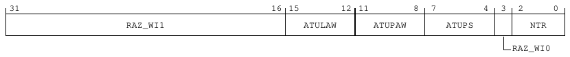

31                                                16 15            12 11            8   7           4   3    2         0
RAZ_WI1                             ATULAW           ATUPAW           ATUPS                NTR

RAZ_WI0

<!-- Source PDF page: 111 -->

**Table 9-41: ATUBC bit descriptions**

Bits     Name      Description                                                                                                    Reset
[31:16] RAZ_WI1 Reserved                                                                                                          0x0000
[15:12] ATULAW The logical address width of the subsystem. This value affects the address of the ATU and the                       0b0000
ATURAV_L<n> and ATURAV_H<n> registers. This value can be configured to 0x0, 0x2, or 0x4.
[11:8]   ATUPAW The physical address width of the subsystem. This value affects the address of the ATU and the                     0b0101
ATURAV_L<n> and ATURAV_H<n> registers.
[7:4]    ATUPS     Page size. This is the region granularity and alignment in bytes.                                              0b1101
[3]      RAZ_WI0 Reserved                                                                                                         0b0
[2:0]    NTR       Number of translation regions. This specifies the number of available regions.                                  0b101

Accessibility
Component                                       Offset                         Instance                         Range
ATU_F1                                          0x0                           ATUBC                            None

9.3.1.2 ATUC, ATU Configuration register
The ATUC register is used by software to control each ATU configuration.

Configurations
This register is available in all configurations.

Attributes
Width
32
Component
ATU_F1
Register offset
0x4
Access type
RW
Reset value
0000 0000 0000 0000 0000 0000 0000 0000
|    |    |    |    |    |    |    | |
31   27   23   19   15   11   7    3 0

Bit descriptions
**Figure 9-2: ATUC bit assignments**

31                                                                                                     0
RE

<!-- Source PDF page: 112 -->

**Table 9-43: ATUC bit descriptions**

Bits   Name Description                                                                                                      Reset
[31:0] RE     ATU Regions Enablement. The bit that is set enables its corresponding region. n = ATUBC.NTR Number of          0x00000000
implemented bits (n-1:0) is per ATUBC.NTR.
•    Bit 0 - Enable Region 0
•    Bit 1 - Enable Region 1
•    ..
•    Bit n-1 - Enable Region n-1

Accessibility
Component                                        Offset                      Instance                           Range
ATU_F1                                           0x4                        ATUC                               None

9.3.1.3 ATUIS, ATU Interrupt Status register
The ATUIS register indicates the status of the current interrupt events. Writing one to bit 0 of the
Interrupt Clear register, ATUIC, also clears the interrupt status bit in ATUIS.

Configurations
This register is available in all configurations.

Attributes
Width
32
Component
ATU_F1
Register offset
0x8
Access type
RO
Reset value
0000 0000 0000 0000 0000 0000 0000 0000
|    |    |    |    |    |    |    | |
31   27   23   19   15   11   7    3 0

Bit descriptions
**Figure 9-3: ATUIS bit assignments**

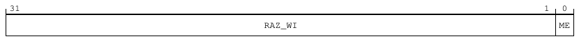

31                                                                                              1   0
RAZ_WI                                                   ME

<!-- Source PDF page: 113 -->

**Table 9-45: ATUIS bit descriptions**

Bits     Name     Description                                                                  Reset
[31:1] RAZ_WI Reserved                                                                         0b0000000000000000000000000000000
[0]      ME       Mismatch Error. This indicates an address mismatch error. When set, the      0b0
ATUMA register holds the offending Logical Address.

Accessibility
Component                                         Offset                        Instance                           Range
ATU_F1                                            0x8                          ATUIS                              None

9.3.1.4 ATUIE, ATU Interrupt Enable register
The ATUIE register enables the corresponding interrupt events.

Configurations
This register is available in all configurations.

Attributes
Width
32
Component
ATU_F1
Register offset
0xC
Access type
RW
Reset value
0000 0000 0000 0000 0000 0000 0000 0001
|    |    |    |    |    |    |    | |
31   27   23   19   15   11   7    3 0

Bit descriptions
**Figure 9-4: ATUIE bit assignments**

31                                                                                                   1   0
RAZ_WI                                                   ME

**Table 9-47: ATUIE bit descriptions**

Bits       Name            Description                                    Reset
[31:1]     RAZ_WI          Reserved                                       0b0000000000000000000000000000000

<!-- Source PDF page: 114 -->

Bits     Name            Description                                    Reset
[0]      ME              Enable Mismatch Error interrupt                0b1

Accessibility
Component                                       Offset                        Instance                           Range
ATU_F1                                          0xC                          ATUIE                              None

9.3.1.5 ATUIC, ATU Interrupt Clear register
The ATUIC register clears the corresponding interrupt events.

Configurations
This register is available in all configurations.

Attributes
Width
32
Component
ATU_F1
Register offset
0x10
Access type
RW
Reset value
0000 0000 0000 0000 0000 0000 0000 0000
|    |    |    |    |    |    |    | |
31   27   23   19   15   11   7    3 0

Bit descriptions
**Figure 9-5: ATUIC bit assignments**

31                                                                                                   1   0
RAZ_WI                                                   ME

**Table 9-49: ATUIC bit descriptions**

Bits   Name      Description                                                                Reset
[31:1] RAZ_WI Reserved                                                                      0b0000000000000000000000000000000
[0]    ME        When written as 1, clears the ME interrupt status in the ATUIS register.   0b0

<!-- Source PDF page: 115 -->

Accessibility
Component                                      Offset                        Instance                           Range
ATU_F1                                         0x10                         ATUIC                              None

9.3.1.6 ATUMA_L, ATU Mismatched Address Low register
The ATUMA_L register holds the last mismatched logical address which caused the ATU to reject
the access to the system memory causing bus errors or interrupt events. ATUMA_L captures the
Least Significant (LS) 32 bits of the Mismatch Address.

Configurations
This register is available in all configurations.

Attributes
Width
32
Component
ATU_F1
Register offset
0x14
Access type
RO
Reset value
0000 0000 0000 0000 0000 0000 0000 0000
|    |    |    |    |    |    |    | |
31   27   23   19   15   11   7    3 0

Bit descriptions
**Figure 9-6: ATUMA_L bit assignments**

31                                                                                                     0
MA

**Table 9-51: ATUMA_L bit descriptions**

Bits   Name Description                                                                                                     Reset
[31:0] MA     LS 32 bits of the full Mismatch Address. This indicates the offending mismatched logical address that          0x00000000
caused the mismatch error.

<!-- Source PDF page: 116 -->

Accessibility
Component                                    Offset                      Instance                                  Range
ATU_F1                                       0x14                       ATUMA_L                                   None

9.3.1.7 ATUMA_H, ATU Mismatched Address High register
The ATUMA_H register holds the last mismatched logical address which caused the ATU to reject
the access to the system memory causing bus errors or interrupt events. ATUMA_H captures the
Most Significant (MS) 32 bits of the Mismatch Address.

Configurations
This register is available in all configurations.

Attributes
Width
32
Component
ATU_F1
Register offset
0x18
Access type
RO
Reset value
0000 0000 0000 0000 0000 0000 0000 0000
|    |    |    |    |    |    |    | |
31   27   23   19   15   11   7    3 0

Bit descriptions
**Figure 9-7: ATUMA_H bit assignments**

31                                                16 15                                                  0
RAZ_WI                                                  MA

**Table 9-53: ATUMA_H bit descriptions**

Bits     Name     Description                                                                                                       Reset
[31:16] RAZ_WI Reserved                                                                                                             0x0000
[15:0]   MA       MS 32 bits of the full Mismatch Address. Indicates the offending mismatch address that caused the mismatch 0x0000
error.

<!-- Source PDF page: 117 -->

Accessibility
Component                                     Offset                      Instance                                  Range
ATU_F1                                        0x18                       ATUMA_H                                   None

9.3.1.8 ATURSSLA_L<n>, Least Significant (LS) Bits Of Right Shifted Start Logical
Address n register, n = 0 - 31
The ATURSSLA_L<n> register holds the least significant bits of the right shifted start logical
address of region <n>. The ATU allows access to the enabled address range of region <n> if
the right shifted transaction address is between the concatenation of ATURSSLA_H<n> and
ATURSSLA_L<n> and the concatenation of ATURSELA_H<n> and ATURSELA_L<n> registers. If all
the enabled regions do not allow access, then the transaction is blocked.

Configurations
This register is available in all configurations.

Attributes
Width
32
Component
ATU_F1
Register offset
0x20 + (n * 4)
Access type
RW
Reset value
0000 0000 0000 0000 0000 0000 0000 0000
|    |    |    |    |    |    |    | |
31   27   23   19   15   11   7    3 0

Bit descriptions
**Figure 9-8: ATURSSLA_L<n> bit assignments**

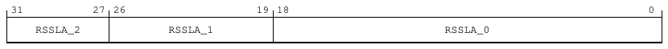

31             27 26                     19 18                                                          0
RSSLA_2              RSSLA_1                                      RSSLA_0

**Table 9-55: ATURSSLA_L<n> bit descriptions**

Bits     Name      Description                                                                                Reset
[31:27] RSSLA_2 Right Shifted Start logical address used for the corresponding region. PS (Page Size)         0b00000
refers to ATUBC.PS bit. The value stored in this field is the start logical address right
shifted by the value of the PS.

<!-- Source PDF page: 118 -->

Bits     Name      Description                                                                                Reset
[26:19] RSSLA_1 Right Shifted Start logical address used for the corresponding region. PS (Page Size)         0x00
refers to ATUBC.PS bit. The value stored in this field is the start logical address right
shifted by the value of the PS.
[18:0]   RSSLA_0 Right Shifted Start logical address used for the corresponding region. PS (Page Size)        0b0000000000000000000
refers to ATUBC.PS bit. The value stored in this field is the start logical address right
shifted by the value of the PS.

Accessibility
Component                           Offset                                 Instance                                       Range
ATU_F1                              0x20 + (n * 4)                        ATURSSLA_L<n>                                  None

9.3.1.9 ATURSELA_L<n>, Least Significant (LS) Bits Of Right Shifted End Logical
Address n register, n = 0 - 31
The ATURSELA_L<n> register holds the least significant bits of the right shifted end logical
address of region <n>. The ATU allows access to the enabled address range of region <n> if
the right shifted transaction address is between the concatenation of ATURSSLA_H<n> and
ATURSSLA_L<n> and the concatenation of ATURSELA_H<n> and ATURSELA_L<n> registers.

Configurations
This register is available in all configurations.

Attributes
Width
32
Component
ATU_F1
Register offset
0xA0 + (n * 4)
Access type
RW
Reset value
0000 0000 0000 0000 0000 0000 0000 0000
|    |    |    |    |    |    |    | |
31   27   23   19   15   11   7    3 0

Bit descriptions
**Figure 9-9: ATURSELA_L<n> bit assignments**

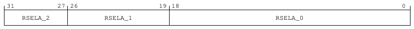

31             27 26                     19 18                                                          0
RSELA_2               RSELA_1                                     RSELA_0

<!-- Source PDF page: 119 -->

**Table 9-57: ATURSELA_L<n> bit descriptions**

Bits     Name     Description                                                                               Reset
[31:27] RSELA_2 Right Shifted End logical address used for the corresponding region. The value stored in 0b00000
this field is the end logical address within the last page, right shifted by the value of the
PS.
[26:19] RSELA_1 Right Shifted End logical address used for the corresponding region. The value stored in 0x00
this field is the end logical address within the last page, right shifted by the value of the
PS.
[18:0]   RSELA_0 Right Shifted End logical address used for the corresponding region. The value stored in 0b0000000000000000000
this field is the end logical address within the last page, right shifted by the value of the
PS.

Accessibility
Component                        Offset                                  Instance                                        Range
ATU_F1                           0xA0 + (n * 4)                         ATURSELA_L<n>                                   None

9.3.1.10 ATURAV_L<n>, ATU Region Add Value Low n register, n = 0 - 31
This register, along with the ATURAV_H register, defines the offset to be added to the incoming
Logical Address, to compute the result, the Physical Address for region n. The number of regions n
depends on the ATUNTR configuration parameter.

Configurations
This register is available in all configurations.

Attributes
Width
32
Component
ATU_F1
Register offset
0x120 + (n * 4)
Access type
RW
Reset value
0000 0000 0000 0000 0000 0000 0000 0000
|    |    |    |    |    |    |    | |
31   27   23   19   15   11   7    3 0

<!-- Source PDF page: 120 -->

Bit descriptions
**Figure 9-10: ATURAV_L<n> bit assignments**

31                                                                                                      0
ADD_VALUE

**Table 9-59: ATURAV_L<n> bit descriptions**

Bits   Name          Description                                                                                             Reset
[31:0] ADD_VALUE Least Significant (LS) bits of the AddValue used for the corresponding region. The value stored in        0x00000000
this field is the LS bits of AddValue right shifted by the value of the PS. The MS bits are stored in the
ATURAV_H<n> register.

Accessibility
Component                          Offset                                     Instance                                   Range
ATU_F1                             0x120 + (n * 4)                           ATURAV_L<n>                                None

9.3.1.11 ATURAV_H<n>, ATU Region Add Value High n register, n = 0 - 31
This register, along with the ATURAV_L register, defines the offset to be added to the incoming
Logical Address, to compute the result, the Physical Address for region n. The number of regions n
depends on the ATUNTR configuration parameter.

Configurations
This register is available in all configurations.

Attributes
Width
32
Component
ATU_F1
Register offset
0x1A0 + (n * 4)
Access type
RW
Reset value
0000 0000 0000 0000 0000 0000 0000 0000
|    |    |    |    |    |    |    | |
31   27   23   19   15   11   7    3 0

<!-- Source PDF page: 121 -->

Bit descriptions
**Figure 9-11: ATURAV_H<n> bit assignments**

31                                                                               7     6                 0
RAZ_WI                                               ADD_VALUE

**Table 9-61: ATURAV_H<n> bit descriptions**

Bits    Name         Description                                                                     Reset
[31:7] RAZ_WI        Reserved                                                                        0b0000000000000000000000000
[6:0]   ADD_VALUE MS bits of the ADD_VALUE used for the corresponding region. The value           0b0000000
stored in this field is the MS 32 bits of AddValue right shifted by the value of
the PS. Page Size (PS) refers to the ATUBC.PS bit.

Accessibility
Component                          Offset                                     Instance                                      Range
ATU_F1                             0x1A0 + (n * 4)                           ATURAV_H<n>                                   None

9.3.1.12 ATUROBA<n>, ATU Region Output Bus Attributes n register, n = 0 - 31
The ATUROBA<n> register indicates the output bus attributes of region <n>. The
AxCACHE3..AxCACHE0 must be programmed so that the resulting AxCACHE[3:0] values comply
with the values available in the AMBA® AXI Protocol Specification. AxCACHE[3:0] must not be
0b0100, 0b0101, 0b1100, or 0b1101.

Configurations
This register is available in all configurations.

Attributes
Width
32
Component
ATU_F1
Register offset
0x220 + (n * 4)
Access type
RW
Reset value
0000 0000 0000 0000 1000 0000 0000 0000
|    |    |    |    |    |    |    | |
31   27   23   19   15   11   7    3 0

<!-- Source PDF page: 122 -->

Bit descriptions
**Figure 9-12: ATUROBA<n> bit assignments**

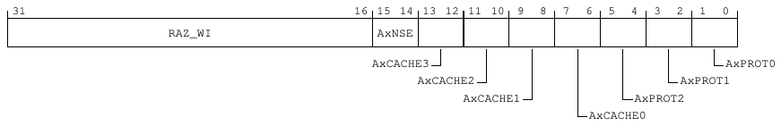

31                                                16 15 14 13 12 11 10    9   8   7   6   5   4   3   2   1   0
RAZ_WI                        AxNSE

AxCACHE3                                            AxPROT0
AxCACHE2                                AxPROT1
AxCACHE1                    AxPROT2
AxCACHE0

**Table 9-63: ATUROBA<n> bit descriptions**

Bits    Name        Description                                                                                                      Reset
[31:16] RAZ_WI      Reserved                                                                                                         0x0000
[15:14] AxNSE       Affects the AxNSE signal at the main AXI Interconnect that goes to the SoC. Supported values are as               0b10
follows:
•   0b00 - Reserved
•   0b01 - Reserved
•   0b10 - Set 0. AxNSE of the output bus is set to 0
•   0b11 - Set 1. AxNSE of the output bus is set to 1

For information about the AxNSE signal, see AMBA® AXI Protocol Specification.
[13:12] AxCACHE3 Affects the AxCACHE[3] signal (Other Allocate) at the output bus which goes to the SoC. Supported                    0b00
values are as follows:
•   0b00 - Passthrough. AxCACHE[3] of the input bus is transferred as is to the output bus
•   0b01 - Reserved
•   0b10 - Set 0. AxCACHE[3] of the output bus is set to 0
•   0b11 - Set 1. AxCACHE[3] of the output bus is set to 1
[11:10] AxCACHE2 Affects the AxCACHE[2] signal (Allocate) at the output bus which goes to the SoC. Supported values are               0b00
as follows:
•   0b00 - Passthrough. AxCACHE[2] of the input bus is transferred as is to the output bus
•   0b01 - Reserved
•   0b10 - Set 0. AxCACHE[2] of the output bus is set to 0
•   0b11 - Set 1. AxCACHE[2] of the output bus is set to 1
[9:8]   AxCACHE1 Affects the AxCACHE[1] signal (modifiable) at the output bus which goes to the SoC. Supported values are 0b00
as follows:
•   0b00 - Passthrough. AxCACHE[1] of the input bus is transferred as is to the output bus
•   0b01 - Reserved
•   0b10 - Set 0. AxCACHE[1] of the output bus is set to 0
•   0b11 - Set 1. AxCACHE[1] of the output bus is set to 1

<!-- Source PDF page: 123 -->

Bits     Name        Description                                                                                                  Reset
[7:6]    AxCACHE0 Affects the AxCACHE[0] signal (Bufferable) at the output bus which goes to the SoC. Supported values are 0b00
as follows:
•   0b00 - Passthrough. AxCACHE[0] of the input bus is transferred as is to the output bus
•   0b01 - Reserved
•   0b10 - Set 0. AxCACHE[0] of the output bus is set to 0
•   0b11 - Set 1. AxCACHE[0] of the output bus is set to 1
[5:4]    AxPROT2     Affects the AxPROT[2] signal (Instruction access) at the output bus which goes to the SoC. Supported          0b00
values are as follows:
•   0b00 - Passthrough. AxPROT[2] of the input bus is transferred as is to the output bus
•   0b01 - Reserved
•   0b10 - Set 0. AxPROT[2] of the output bus is set to 0
•   0b11 - Set 1. AxPROT[2] of the output bus is set to 1
[3:2]    AxPROT1     Affects the AxPROT[1] signal (Non-secure access) at the output bus which goes to the SoC. Supported           0b00
values are as follows:
•   0b00 - Passthrough. AxPROT[1] of the input bus is transferred as is to the output bus
•   0b01 - Reserved
•   0b10 - Set 0. AxPROT[1] of the output bus is set to 0
•   0b11 - Set 1. AxPROT[1] of the output bus is set to 1
[1:0]    AxPROT0     Affects the AxPROT[0] signal (Privileged access) at the output bus which goes to the SoC. Supported           0b00
values are as follows:
•   0b00 - Passthrough. AxPROT[0] of the input bus is transferred as is to the output bus
•   0b01 - Reserved
•   0b10 - Set 0. AxPROT[0] of the output bus is set to 0
•   0b11 - Set 1. AxPROT[0] of the output bus is set to 1

Accessibility
Component                          Offset                                     Instance                                  Range
ATU_F1                             0x220 + (n * 4)                           ATUROBA<n>                                None

9.3.1.13 ATURGPV<n>, ATU Region General Purpose n register, n = 0 - 31
The ATURGPV<n> register is intended for general-purpose use of the software by storing software
related values for region <n>. The hardware does not use the values stored in this register. The
idea is to put one software flag per region or attribute in this register, which describes the region to
the software. An example use case is to mark which entity owns the destined physical address of
this region, for example, a system-provided region versus a subsystem owned and managed region.
Software can use the flags as a security measure when the address translation API is called.

Configurations
This register is available in all configurations.

<!-- Source PDF page: 124 -->

Attributes
Width
32
Component
ATU_F1
Register offset
0x2A0 + (n * 4)
Access type
RW
Reset value
0000 0000 0000 0000 0000 0000 0000 0000
|    |    |    |    |    |    |    | |
31   27   23   19   15   11   7    3 0

Bit descriptions
**Figure 9-13: ATURGPV<n> bit assignments**

31                                                                           8   7                      0
RAZ_WI                                               VALUE

**Table 9-65: ATURGPV<n> bit descriptions**

Bits        Name             Description                                                                             Reset
[31:8]      RAZ_WI           Reserved                                                                                0x000000
[7:0]       VALUE            Value. Used by software for general-purpose use.                                        0x00

Accessibility
Component                         Offset                                       Instance                                 Range
ATU_F1                            0x2A0 + (n * 4)                             ATURGPV<n>                               None

9.3.1.14 ATURSSLA_H<n>, Most Significant (MS) Bits Of Right Shifted Start Logical
Address n register, n = 0 - 31
The ATURSSLA_H<n> register holds the most significant bits of the right shifted start logical
address of region <n>. The ATU allows access to the enabled address range of region <n> if
the right shifted transaction address is between the concatenation of ATURSSLA_H<n> and
ATURSSLA_L<n> and the concatenation of ATURSELA_H<n> and ATURSELA_L<n> registers. If all
the enabled regions do not allow access, then the transaction is blocked.

Configurations
This register is available in all configurations.

<!-- Source PDF page: 125 -->

Attributes
Width
32
Component
ATU_F1
Register offset
0x320 + (n * 4)
Access type
RW
Reset value
0000 0000 0000 0000 0000 0000 0000 0000
|    |    |    |    |    |    |    | |
31   27   23   19   15   11   7    3 0

Bit descriptions
**Figure 9-14: ATURSSLA_H<n> bit assignments**

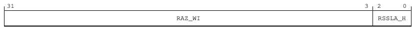

31                                                                                           3   2     0
RAZ_WI                                               RSSLA_H

**Table 9-67: ATURSSLA_H<n> bit descriptions**

Bits    Name      Description                                                                Reset
[31:3] RAZ_WI     Reserved                                                                   0b00000000000000000000000000000
[2:0]   RSSLA_H Right Shifted Start Logical Address used for the corresponding region.       0b000

Accessibility
Component                       Offset                                    Instance                                        Range
ATU_F1                          0x320 + (n * 4)                          ATURSSLA_H<n>                                   None

9.3.1.15 ATURSELA_H<n>, Most Significant (MS) Bits Of Right Shifted End Logical
Address n register, n = 0 - 31
The ATURSELA_H<n> register holds the most significant bits of the right shifted end logical
address of region <n>. The ATU allows access to the enabled address range of region <n> if
the right shifted transaction address is between the concatenation of ATURSSLA_H<n> and
ATURSSLA_L<n> and the concatenation of ATURSELA_H<n> and ATURSELA_L<n> registers.

Configurations
This register is available in all configurations.

<!-- Source PDF page: 126 -->

Attributes
Width
32
Component
ATU_F1
Register offset
0x3A0 + (n * 4)
Access type
RW
Reset value
0000 0000 0000 0000 0000 0000 0000 0000
|    |    |    |    |    |    |    | |
31   27   23   19   15   11   7    3 0

Bit descriptions
**Figure 9-15: ATURSELA_H<n> bit assignments**

31                                                                                           3   2     0
RAZ_WI                                               RSELA_H

**Table 9-69: ATURSELA_H<n> bit descriptions**

Bits    Name       Description                                                              Reset
[31:3] RAZ_WI      Reserved                                                                 0b00000000000000000000000000000
[2:0]   RSELA_H Right Shifted End logical address used for the corresponding region.        0b000

Accessibility
Component                        Offset                                   Instance                                        Range
ATU_F1                           0x3A0 + (n * 4)                         ATURSELA_H<n>                                   None

9.3.1.16 PIDR4, Peripheral ID4 register
The PIDR4 register returns byte[4] of the peripheral ID.

Configurations
This register is available in all configurations.

Attributes
Width
32

<!-- Source PDF page: 127 -->

Component
ATU_F1
Register offset
0xFD0
Access type
RO
Reset value
0000 0000 0000 0000 0000 0000 0000 0100
|    |    |    |    |    |    |    | |
31   27   23   19   15   11   7    3 0

Bit descriptions
**Figure 9-16: PIDR4 bit assignments**

31                                                                          8   7           4    3           0
RAZ_WI                                            SIZE            DES_2

**Table 9-71: PIDR4 bit descriptions**

Bits          Name                Description                                                                         Reset
[31:8]        RAZ_WI              Reserved                                                                            0x000000
[7:4]         SIZE                4KB count, number of 4K pages used                                                  0b0000
[3:0]         DES_2               JEP106 continuation code                                                            0b0100

Accessibility
Component                                       Offset                       Instance                                 Range
ATU_F1                                          0xFD0                       PIDR4                                    None

9.3.1.17 PIDR0, Peripheral ID0 register
The PIDR0 register returns byte[0] of the peripheral ID.

Configurations
This register is available in all configurations.

Attributes
Width
32
Component
ATU_F1

<!-- Source PDF page: 128 -->

Register offset
0xFE0
Access type
RO
Reset value
0000 0000 0000 0000 0000 0000 1100 0000
|    |    |    |    |    |    |    | |
31   27   23   19   15   11   7    3 0

Bit descriptions
**Figure 9-17: PIDR0 bit assignments**

31                                                                           8   7                        0
RAZ_WI                                               PART_0

**Table 9-73: PIDR0 bit descriptions**

Bits         Name              Description                                                                            Reset
[31:8]       RAZ_WI            Reserved                                                                               0x000000
[7:0]        PART_0            Identification register part number bits[7:0]                                           0xC0

Accessibility
Component                                      Offset                          Instance                         Range
ATU_F1                                         0xFE0                          PIDR0                            None

9.3.1.18 PIDR1, Peripheral ID1 register
The PIDR1 register returns byte[1] of the peripheral ID.

Configurations
This register is available in all configurations.

Attributes
Width
32
Component
ATU_F1
Register offset
0xFE4
Access type
RO

<!-- Source PDF page: 129 -->

Reset value
0000 0000 0000 0000 0000 0000 1011 0011
|    |    |    |    |    |    |    | |
31   27   23   19   15   11   7    3 0

Bit descriptions
**Figure 9-18: PIDR1 bit assignments**

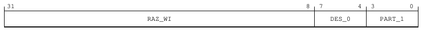

31                                                                          8   7            4    3            0
RAZ_WI                                            DES_0            PART_1

**Table 9-75: PIDR1 bit descriptions**

Bits         Name              Description                                                                                 Reset
[31:8]       RAZ_WI            Reserved                                                                                    0x000000
[7:4]        DES_0             JEP106 identification code bits[3:0]                                                         0b1011
[3:0]        PART_1            Identification register part number bits[11:8]                                               0b0011

Accessibility
Component                                      Offset                           Instance                               Range
ATU_F1                                         0xFE4                           PIDR1                                  None

9.3.1.19 PIDR2, Peripheral ID2 register
The PIDR2 register returns byte[2] of the peripheral ID.

Configurations
This register is available in all configurations.

Attributes
Width
32
Component
ATU_F1
Register offset
0xFE8
Access type
RO
Reset value
0000 0000 0000 0000 0000 0000 0001 1011
|    |    |    |    |    |    |    | |
31   27   23   19   15   11   7    3 0

<!-- Source PDF page: 130 -->

Bit descriptions
**Figure 9-19: PIDR2 bit assignments**

31                                                                           8   7              4    3    2           0
RAZ_WI                                           REVISION                 DES_1

JEDEC

**Table 9-77: PIDR2 bit descriptions**

Bits          Name                    Description                                                                        Reset
[31:8]        RAZ_WI                  Reserved                                                                           0x000000
[7:4]         REVISION                Revision code                                                                      0b0001
[3]           JEDEC                   JEDEC                                                                              0b1
[2:0]         DES_1                   JEP106 identification code bits[6:4]                                                0b011

Accessibility
Component                                      Offset                        Instance                                    Range
ATU_F1                                         0xFE8                        PIDR2                                       None

9.3.1.20 PIDR3, Peripheral ID3 register
The PIDR3 register returns byte[3] of the peripheral ID.

Configurations
This register is available in all configurations.

Attributes
Width
32
Component
ATU_F1
Register offset
0xFEC
Access type
RO
Reset value
0000 0000 0000 0000 0000 0000 0000 0000
|    |    |    |    |    |    |    | |
31   27   23   19   15   11   7    3 0

<!-- Source PDF page: 131 -->

Bit descriptions
**Figure 9-20: PIDR3 bit assignments**

31                                                                           8   7             4    3          0
RAZ_WI                                            REVAND            CMOD

**Table 9-79: PIDR3 bit descriptions**

Bits            Name                   Description                                                                     Reset
[31:8]          RAZ_WI                 Reserved                                                                        0x000000
[7:4]           REVAND                 Manufacturer revision number                                                    0b0000
[3:0]           CMOD                   Customer Modified                                                                0b0000

Accessibility
Component                                      Offset                        Instance                                   Range
ATU_F1                                         0xFEC                        PIDR3                                      None

9.3.1.21 CIDR0, Component ID0 register
The CIDR0 register returns byte[0] of the component ID.

Configurations
This register is available in all configurations.

Attributes
Width
32
Component
ATU_F1
Register offset
0xFF0
Access type
RO
Reset value
0000 0000 0000 0000 0000 0000 0000 1101
|    |    |    |    |    |    |    | |
31   27   23   19   15   11   7    3 0

<!-- Source PDF page: 132 -->

Bit descriptions
**Figure 9-21: CIDR0 bit assignments**

31                                                                           8   7                      0
RAZ_WI                                               PRMBL_0

**Table 9-81: CIDR0 bit descriptions**

Bits                     Name                             Description                                Reset
[31:8]                   RAZ_WI                           Reserved                                   0x000000
[7:0]                    PRMBL_0                          Preamble                                   0x0D

Accessibility
Component                                      Offset                        Instance                            Range
ATU_F1                                         0xFF0                        CIDR0                               None

9.3.1.22 CIDR1, Component ID1 register
The CIDR1 register returns byte[1] of the component ID.

Configurations
This register is available in all configurations.

Attributes
Width
32
Component
ATU_F1
Register offset
0xFF4
Access type
RO
Reset value
0000 0000 0000 0000 0000 0000 1111 0000
|    |    |    |    |    |    |    | |
31   27   23   19   15   11   7    3 0

<!-- Source PDF page: 133 -->

Bit descriptions
**Figure 9-22: CIDR1 bit assignments**

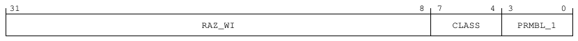

31                                                                           8   7             4    3             0
RAZ_WI                                            CLASS             PRMBL_1

**Table 9-83: CIDR1 bit descriptions**

Bits                Name                           Description                                             Reset
[31:8]              RAZ_WI                         Reserved                                                0x000000
[7:4]               CLASS                          Component class                                         0b1111
[3:0]               PRMBL_1                        Preamble                                                0b0000

Accessibility
Component                                      Offset                        Instance                                   Range
ATU_F1                                         0xFF4                        CIDR1                                      None

9.3.1.23 CIDR2, Component ID2 register
The CIDR2 register returns byte[2] of the component ID.

Configurations
This register is available in all configurations.

Attributes
Width
32
Component
ATU_F1
Register offset
0xFF8
Access type
RO
Reset value
0000 0000 0000 0000 0000 0000 0000 0101
|    |    |    |    |    |    |    | |
31   27   23   19   15   11   7    3 0

<!-- Source PDF page: 134 -->

Bit descriptions
**Figure 9-23: CIDR2 bit assignments**

31                                                                           8   7                      0
RAZ_WI                                               PRMBL_2

**Table 9-85: CIDR2 bit descriptions**

Bits                     Name                             Description                                Reset
[31:8]                   RAZ_WI                           Reserved                                   0x000000
[7:0]                    PRMBL_2                          Preamble                                   0x05

Accessibility
Component                                      Offset                        Instance                            Range
ATU_F1                                         0xFF8                        CIDR2                               None

9.3.1.24 CIDR3, Component ID3 register
The CIDR3 register returns byte[3] of the component ID.

Configurations
This register is available in all configurations.

Attributes
Width
32
Component
ATU_F1
Register offset
0xFFC
Access type
RO
Reset value
0000 0000 0000 0000 0000 0000 1011 0001
|    |    |    |    |    |    |    | |
31   27   23   19   15   11   7    3 0

<!-- Source PDF page: 135 -->

Bit descriptions
**Figure 9-24: CIDR3 bit assignments**

31                                                                           8   7                       0
RAZ_WI                                                PRMBL_3

**Table 9-87: CIDR3 bit descriptions**

Bits                     Name                             Description                                Reset
[31:8]                   RAZ_WI                           Reserved                                   0x000000
[7:0]                    PRMBL_3                          Preamble                                   0xB1

Accessibility
Component                                      Offset                        Instance                             Range
ATU_F1                                         0xFFC                        CIDR3                                None

### 9.3.2 DBGTOP_PIK registers summary
The DBGTOP_PIK register block provides APB registers to control and check debug clocks and
handshakes.

The following summary table provides an overview of IMPLEMENTATION DEFINED memory-mapped
DBG_PIK registers.

For more information on registers listed in the table, click on the link associated with the register
name.

For registers without a listed reset value, refer to the individual field resets documented on the
register description pages.

**Table 9-89: DBGTOP_PIK registers summary**

Offset     Name                             Reset                 Width      Description
0x800     TRACECLK_CTRL                    0x20000101            32-bit     Trace Clock Control register
0x804     DBG_APBCLK_CTRL                  0x20183101            32-bit     Debug APB Clock Control register
0xA00     CLK_FORCE_STATUS                 0x00000000            32-bit     Clock Force Status register
0xA04     CLK_FORCE_SET                    0x00000000            32-bit     Clock Force Set register
0xA08     CLK_FORCE_CLR                    0x00000000            32-bit     Clock Force Clear register
0xC00     DBG_PWR_REQ_ST                   0x00000000            32-bit     Debug Powerup Request Status register
0xC04     DBG_PWR_ACK                      0x00000000            32-bit     Debug Powerup Acknowledge register
0xC08     DBG_RST_REQ_ST                   0x00000000            32-bit     Debug Reset Request Status register
0xC0C     DBG_RST_ACK                      0x00000000            32-bit     Debug Reset Acknowledge register
0xE00     TRI_REDT_INTR                    0x00000000            32-bit     Triple Redundancy Interrupt register
0xFC0     PIK_CONFIG                       0x00000001            32-bit     Power Integration Kit Configuration register

<!-- Source PDF page: 136 -->

Offset   Name                           Reset                 Width       Description
0xFD0   SID_PID_4                      0x00000002            32-bit      System ID Peripheral ID 4 register
0xFE0   SID_PID_0                      0x00000000            32-bit      System ID Peripheral ID 0 register
0xFE4   SID_PID_1                      0x000B0000            32-bit      System ID Peripheral ID 1 register
0xFE8   SID_PID_2                      0x0000000B            32-bit      System ID Peripheral ID 2 register
0xFEC   SID_PID_3                      0x00000000            32-bit      System ID Peripheral ID 3 register
0xFF0   COMPID0                        0x0000000D            32-bit      System ID Component ID 0 register
0xFF4   COMPID1                        0x000000F0            32-bit      System ID Component ID 1 register
0xFF8   COMPID2                        0x00000005            32-bit      System ID Component ID 2 register
0xFFC   COMPID3                        0x000000B1            32-bit      System ID Component ID 3 register

9.3.2.1 TRACECLK_CTRL, Trace Clock Control register
The TRACECLK_CTRL register provides the ability to program the number of clock cycles between
the TRACECLK not being required and the request to dynamically clock gate it.

Configurations
This register is available in all configurations.

Attributes
Width
32
Component
DBGTOP_PIK
Register offset
0x800
Access type
RW
Reset value
0010 0000 0000 0000 0000 0001 0000 0001
|    |    |    |    |    |    |    | |
31   27   23   19   15   11   7    3 0

Bit descriptions
**Figure 9-25: TRACECLK_CTRL bit assignments**

31                     24 23            19 18 17 16            12 11 10   9   8   7               2   1   0
ENTRY_DLY          CLK_DIV_RATIO                                              reserved2

reserved0                                  CLK_SEL_CUR                  CLK_SEL
CLK_DIV_RATIO_CUR                 reserved1

<!-- Source PDF page: 137 -->

**Table 9-90: TRACECLK_CTRL bit descriptions**

Bits    Name                    Description                                                                                    Reset
[31:24] ENTRY_DLY               This specifies the number of clock cycles used as an entry delay before the Q-Channel Clock 0x20
Controller gates an enabled clock. The ENTRYDELAY value is synchronized to CLK and
loaded into the entry-delay counter when the state machine enters the CLK_RUN state, or
while in CLK_RUN when CLKFORCE or any CLKQACTIVE signal is asserted.
[23:19] CLK_DIV_RATIO           The requested new value of the clock divider.                                                  0b00000
[18:17] reserved0               Reserved                                                                                       0b00
[16:12] CLK_DIV_RATIO_CUR Volatile. Indicates when the circuit has safely switched to a new value of CLK_DIV_RATIO.            0b00000
[11:10] reserved1               Reserved                                                                                       0b00
[9:8]   CLK_SEL_CUR             Volatile. Current active parent clock selection. During the transition between clocks, the      0b01
clock output will be temporarily gated and this field reads as zero (N'b0s) until the switch has
safely completed.
[7:2]   reserved2               Reserved                                                                                       0b000000
[1:0]   CLK_SEL                 Clock select register for TRACECLK (2'b00 = clk source 0: REF_CLK, 2'b10 = clk source 1:       0b01
PLL clock)

Accessibility
Component                                  Offset               Instance                                              Range
DBGTOP_PIK                                 0x800               TRACECLK_CTRL                                         None

9.3.2.2 DBG_APBCLK_CTRL, Debug APB Clock Control register
The DBG_APBCLK_CTRL register provides the ability to program the number of clock cycles
between the DBG_APBCLK not being required and the request to dynamically clock gate it.

Configurations
This register is available in all configurations.

Attributes
Width
32
Component
DBGTOP_PIK
Register offset
0x804
Access type
RW
Reset value
0010 0000 0001 1000 0011 0001 0000 0001
|    |    |    |    |    |    |    | |
31   27   23   19   15   11   7    3 0

<!-- Source PDF page: 138 -->

Bit descriptions
**Figure 9-26: DBG_APBCLK_CTRL bit assignments**

31                     24 23            19 18 17 16            12 11 10   9   8   7               2   1   0
ENTRY_DLY           CLK_DIV_RATIO                                             reserved2

reserved0                                 CLK_SEL_CUR                  CLK_SEL
CLK_DIV_RATIO_CUR                reserved1

**Table 9-92: DBG_APBCLK_CTRL bit descriptions**

Bits    Name                    Description                                                                                       Reset
[31:24] ENTRY_DLY               This specifies the number of clock cycles used as an entry delay before the Q-Channel Clock 0x20
Controller gates an enabled clock. The ENTRYDELAY value is synchronized to CLK and
loaded into the entry-delay counter when the state machine enters the CLK_RUN state, or
while in CLK_RUN when CLKFORCE or any CLKQACTIVE signal is asserted.
[23:19] CLK_DIV_RATIO           The requested new value of the clock divider.                                                     0b00011
[18:17] reserved0               Reserved                                                                                          0b00
[16:12] CLK_DIV_RATIO_CUR Volatile. Indicates when the circuit has safely switched to a new value of CLK_DIV_RATIO.               0b00011
[11:10] reserved1               Reserved                                                                                          0b00
[9:8]   CLK_SEL_CUR             Volatile. Current active parent clock selection. During the transition between clocks, the      0b01
clock output will be temporarily gated and this field reads as zero (N'b0s) until the switch has
safely completed.
[7:2]   reserved2               Reserved                                                                                          0b000000
[1:0]   CLK_SEL                 Clock select register for DBG_APBCLK (2'b00 = clk source 0: REF_CLK, 2'b10 = clk source           0b01
1: PLL clock)

Accessibility
Component                               Offset                 Instance                                                    Range
DBGTOP_PIK                              0x804                 DBG_APBCLK_CTRL                                             None

9.3.2.3 CLK_FORCE_STATUS, Clock Force Status register
The CLK_FORCE_STATUS register captures the status (enabled/disabled) of the dynamic clock
gating on DBG_APBCLK and TRACECLK.

Configurations
This register is available in all configurations.

Attributes
Width
32
Component
DBGTOP_PIK

<!-- Source PDF page: 139 -->

Register offset
0xA00
Access type
RO
Reset value
0000 0000 0000 0000 0000 0000 0000 0000
|    |    |    |    |    |    |    | |
31   27   23   19   15   11   7    3 0

Bit descriptions
**Figure 9-27: CLK_FORCE_STATUS bit assignments**

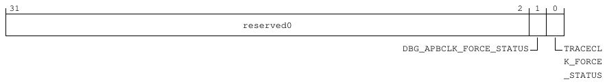

31                                                                                              2    1   0
reserved0

DBG_APBCLK_FORCE_STATUS           TRACECL
K_FORCE
_STATUS

**Table 9-94: CLK_FORCE_STATUS bit descriptions**

Bits   Name                               Description                                      Reset
[31:2] reserved0                          Reserved                                         0b000000000000000000000000000000
[1]    DBG_APBCLK_FORCE_STATUS            Volatile. Clock force status for DBG_APBCLK      0b0
[0]    TRACECLK_FORCE_STATUS              Volatile. Clock force status for TRACECLK        0b0

Accessibility
Component                             Offset                Instance                                                      Range
DBGTOP_PIK                            0xA00                CLK_FORCE_STATUS                                              None

9.3.2.4 CLK_FORCE_SET, Clock Force Set register
The CLK_FORCE_SET register provides the ability to disable dynamic clock gating on
DBG_APBCLK and TRACECLK.

Configurations
This register is available in all configurations.

Attributes
Width
32
Component
DBGTOP_PIK

<!-- Source PDF page: 140 -->

Register offset
0xA04
Access type
WO
Reset value
0000 0000 0000 0000 0000 0000 0000 0000
|    |    |    |    |    |    |    | |
31   27   23   19   15   11   7    3 0

Bit descriptions
**Figure 9-28: CLK_FORCE_SET bit assignments**

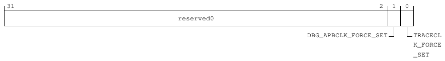

31                                                                                             2    1     0
reserved0

DBG_APBCLK_FORCE_SET             TRACECL
K_FORCE
_SET

**Table 9-96: CLK_FORCE_SET bit descriptions**

Bits     Name                             Description                                Reset
[31:2]   reserved0                        Reserved                                   0b000000000000000000000000000000
[1]      DBG_APBCLK_FORCE_SET             Clock force set for DBG_APBCLK             0b0
[0]      TRACECLK_FORCE_SET               Clock force set for TRACECLK               0b0

Accessibility
Component                                Offset                  Instance                                                Range
DBGTOP_PIK                               0xA04                  CLK_FORCE_SET                                           None

9.3.2.5 CLK_FORCE_CLR, Clock Force Clear register
The CLK_FORCE_CLR register is used to force clear DBG_APBCLK and TRACECLK to be free-
running.

Configurations
This register is available in all configurations.

Attributes
Width
32
Component
DBGTOP_PIK

<!-- Source PDF page: 141 -->

Register offset
0xA08
Access type
WO
Reset value
0000 0000 0000 0000 0000 0000 0000 0000
|    |    |    |    |    |    |    | |
31   27   23   19   15   11   7    3 0

Bit descriptions
**Figure 9-29: CLK_FORCE_CLR bit assignments**

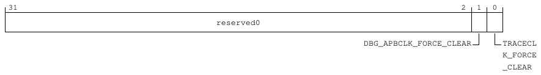

31                                                                                             2    1   0
reserved0

DBG_APBCLK_FORCE_CLEAR           TRACECL
K_FORCE
_CLEAR

**Table 9-98: CLK_FORCE_CLR bit descriptions**

Bits     Name                               Description                                Reset
[31:2]   reserved0                          Reserved                                   0b000000000000000000000000000000
[1]      DBG_APBCLK_FORCE_CLEAR             Clock force clear for DBG_APBCLK           0b0
[0]      TRACECLK_FORCE_CLEAR               Clock force clear for TRACECLK             0b0

Accessibility
Component                                Offset                  Instance                                                Range
DBGTOP_PIK                               0xA08                  CLK_FORCE_CLR                                           None

9.3.2.6 DBG_PWR_REQ_ST, Debug Powerup Request Status register
The DBG_PWR_REQ_ST register provides the status of the CDBGPWRUPREQ signal.

Configurations
This register is available in all configurations.

Attributes
Width
32
Component
DBGTOP_PIK

<!-- Source PDF page: 142 -->

Register offset
0xC00
Access type
RO
Reset value
0000 0000 0000 0000 0000 0000 0000 0000
|    |    |    |    |    |    |    | |
31   27   23   19   15   11   7    3 0

Bit descriptions
**Figure 9-30: DBG_PWR_REQ_ST bit assignments**

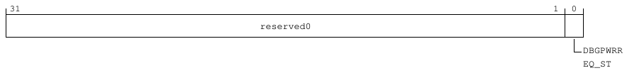

31                                                                                                  1   0
reserved0

DBGPWRR
EQ_ST

**Table 9-100: DBG_PWR_REQ_ST bit descriptions**

Bits   Name                  Description                                              Reset
[31:1] reserved0             Reserved                                                 0b0000000000000000000000000000000
[0]    DBGPWRREQ_ST          Volatile. Current status of the CDBGPWRUPREQ             0b0

Accessibility
Component                               Offset                 Instance                                                Range
DBGTOP_PIK                              0xC00                 DBG_PWR_REQ_ST                                          None

9.3.2.7 DBG_PWR_ACK, Debug Powerup Acknowledge register
The DBG_PWR_ACK register sets the value of the CDBGPWRUPACK signal.

Configurations
This register is available in all configurations.

Attributes
Width
32
Component
DBGTOP_PIK
Register offset
0xC04

<!-- Source PDF page: 143 -->

Access type
RW
Reset value
0000 0000 0000 0000 0000 0000 0000 0000
|    |    |    |    |    |    |    | |
31   27   23   19   15   11   7    3 0

Bit descriptions
**Figure 9-31: DBG_PWR_ACK bit assignments**

31                                                                                                 1   0
reserved0

DBGPWRA
CK

**Table 9-102: DBG_PWR_ACK bit descriptions**

Bits     Name                Description                                      Reset
[31:1]   reserved0           Reserved                                         0b0000000000000000000000000000000
[0]      DBGPWRACK           Set the value of CDBGPWRUPACK                    0b0

Accessibility
Component                                  Offset                 Instance                                            Range
DBGTOP_PIK                                 0xC04                 DBG_PWR_ACK                                         None

9.3.2.8 DBG_RST_REQ_ST, Debug Reset Request Status register
The DBG_RST_REQ_ST register provides the status of the CDBGRSTREQ signal.

Configurations
This register is available in all configurations.

Attributes
Width
32
Component
DBGTOP_PIK
Register offset
0xC08
Access type
RO

<!-- Source PDF page: 144 -->

Reset value
0000 0000 0000 0000 0000 0000 0000 0000
|    |    |    |    |    |    |    | |
31   27   23   19   15   11   7    3 0

Bit descriptions
**Figure 9-32: DBG_RST_REQ_ST bit assignments**

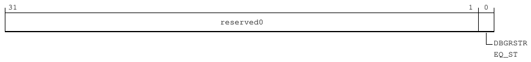

31                                                                                                 1   0
reserved0

DBGRSTR
EQ_ST

**Table 9-104: DBG_RST_REQ_ST bit descriptions**

Bits     Name                Description                                            Reset
[31:1]   reserved0           Reserved                                               0b0000000000000000000000000000000
[0]      DBGRSTREQ_ST        Volatile. Current status of the CDBGRSTREQ             0b0

Accessibility
Component                               Offset                 Instance                                                Range
DBGTOP_PIK                              0xC08                 DBG_RST_REQ_ST                                          None

9.3.2.9 DBG_RST_ACK, Debug Reset Acknowledge register
The DBG_RST_ACK register sets the value of the CDBGRSTACK signal.

Configurations
This register is available in all configurations.

Attributes
Width
32
Component
DBGTOP_PIK
Register offset
0xC0C
Access type
RW
Reset value
0000 0000 0000 0000 0000 0000 0000 0000
|    |    |    |    |    |    |    | |

<!-- Source PDF page: 145 -->

31    27     23     19     15     11     7      3   0

Bit descriptions
**Figure 9-33: DBG_RST_ACK bit assignments**

31                                                                                                 1   0
reserved0

DBGRSTA
CK

**Table 9-106: DBG_RST_ACK bit descriptions**

Bits     Name                Description                                  Reset
[31:1]   reserved0           Reserved                                     0b0000000000000000000000000000000
[0]      DBGRSTACK           Set the value of CDBGRSTACK                  0b0

Accessibility
Component                                  Offset                   Instance                                          Range
DBGTOP_PIK                                 0xC0C                   DBG_RST_ACK                                       None

9.3.2.10 TRI_REDT_INTR, Triple Redundancy Interrupt register
The TRI_REDT_INTR register provides information about triple redundancy interrupts for various
registers.

Configurations
This register is available in all configurations.

Attributes
Width
32
Component
DBGTOP_PIK
Register offset
0xE00
Access type
RO
Reset value
0000 0000 0000 0000 0000 0000 0000 0000
|    |    |    |    |    |    |    | |
31   27   23   19   15   11   7    3 0

<!-- Source PDF page: 146 -->

Bit descriptions
**Figure 9-34: TRI_REDT_INTR bit assignments**

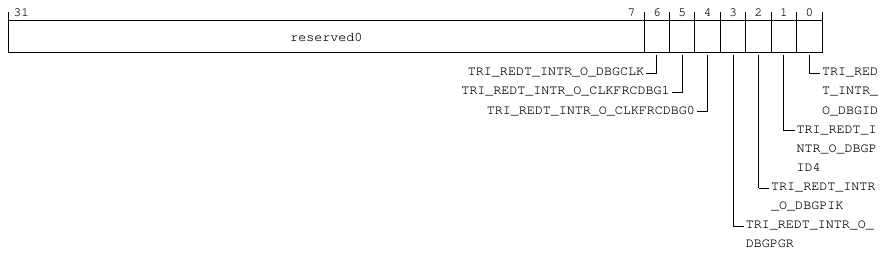

31                                                                              7     6   5   4   3    2   1   0
reserved0

TRI_REDT_INTR_O_DBGCLK                              TRI_RED
TRI_REDT_INTR_O_CLKFRCDBG1                           T_INTR_
TRI_REDT_INTR_O_CLKFRCDBG0                        O_DBGID
TRI_REDT_I
NTR_O_DBGP
ID4
TRI_REDT_INTR
_O_DBGPIK
TRI_REDT_INTR_O_
DBGPGR

**Table 9-108: TRI_REDT_INTR bit descriptions**

Bits   Name                                Description                                              Reset
[31:7] reserved0                           Reserved                                                 0b0000000000000000000000000
[6]    TRI_REDT_INTR_O_DBGCLK              Volatile. Triple redundancy interrupt for DBGCLK         0b0
registers
[5]    TRI_REDT_INTR_O_CLKFRCDBG1 Volatile. Triple redundancy interrupt for                         0b0
CLK_FORCE_1 registers
[4]    TRI_REDT_INTR_O_CLKFRCDBG0 Volatile. Triple redundancy interrupt for                         0b0
CLK_FORCE_0 registers
[3]    TRI_REDT_INTR_O_DBGPGR              Volatile. Triple redundancy interrupt for DBG_GPR        0b0
registers
[2]    TRI_REDT_INTR_O_DBGPIK              Volatile. Triple redundancy interrupt for DBG_PIK        0b0
registers
[1]    TRI_REDT_INTR_O_DBGPID4             Volatile. Triple redundancy interrupt for DBG_PID        0b0
registers
[0]    TRI_REDT_INTR_O_DBGID               Volatile. Triple redundancy interrupt for DBG_ID         0b0
registers

Accessibility
Component                                 Offset                      Instance                                              Range
DBGTOP_PIK                                0xE00                      TRI_REDT_INTR                                         None

9.3.2.11 PIK_CONFIG, Power Integration Kit Configuration register
The PIK_CONFIG register controls power integration and logic configuration.

Configurations
This register is available in all configurations.

<!-- Source PDF page: 147 -->

Attributes
Width
32
Component
DBGTOP_PIK
Register offset
0xFC0
Access type
RO
Reset value
0000 0000 0000 0000 0000 0000 0000 0001
|    |    |    |    |    |    |    | |
31   27   23   19   15   11   7    3 0

Bit descriptions
**Figure 9-35: PIK_CONFIG bit assignments**

31                                                                                         4   3           0
reserved0                                            NO_OF_PPU

**Table 9-110: PIK_CONFIG bit descriptions**

Bits     Name             Description                                                                                           Reset
[31:4]   reserved0        Reserved                                                                                              0x0000000
[3:0]    NO_OF_PPU        Defines the number of Power Policy Units (PPUs) in the power integration region.                       0b0001

Accessibility
Component                                      Offset                       Instance                                     Range
DBGTOP_PIK                                     0xFC0                       PIK_CONFIG                                   None

9.3.2.12 SID_PID_4, System ID Peripheral ID 4 register
The SID_PID_4 register contains information about the number of address blocks that the logic
occupies and the JEDEC JEP106 configuration code for the peripheral.

Configurations
This register is available in all configurations.

Attributes
Width
32

<!-- Source PDF page: 148 -->

Component
DBGTOP_PIK
Register offset
0xFD0
Access type
RO
Reset value
0000 0000 0000 0000 0000 0000 0000 0010
|    |    |    |    |    |    |    | |
31   27   23   19   15   11   7    3 0

Bit descriptions
**Figure 9-36: SID_PID_4 bit assignments**

31                                                                           8   7           4   3           0
reserved0                                           SIZE           DES_2

**Table 9-112: SID_PID_4 bit descriptions**

Bits    Name         Description                                                                                                        Reset
[31:8] reserved0 Reserved                                                                                                               0x000000
[7:4]   SIZE         Indicates the memory size that is used by this component. Returns 0 indicating that the component                  0b0000
uses an UNKNOWN number of 4KB blocks. Using the SIZE field to indicate the size of the component is
deprecated.
[3:0]   DES_2        JEP106 continuation code. Together, with PIDR2.DES_1 and PIDR1.DES_0, they indicate the designer of                0b0010
the component and not the implementer, except where the two are the same.

Accessibility
Component                                          Offset                      Instance                                  Range
DBGTOP_PIK                                         0xFD0                      SID_PID_4                                 None

9.3.2.13 SID_PID_0, System ID Peripheral ID 0 register
The SID_PID_0 register contains the first eight bits of the identifier for the peripheral.

Configurations
This register is available in all configurations.

Attributes
Width
32

<!-- Source PDF page: 149 -->

Component
DBGTOP_PIK
Register offset
0xFE0
Access type
RO
Reset value
0000 0000 0000 0000 0000 0000 0000 0000
|    |    |    |    |    |    |    | |
31   27   23   19   15   11   7    3 0

Bit descriptions
**Figure 9-37: SID_PID_0 bit assignments**

31                                                                            8   7                       0
reserved0                                              PART_0

**Table 9-114: SID_PID_0 bit descriptions**

Bits    Name       Description                                                                                                    Reset
[31:8] reserved0 Reserved                                                                                                         0x000000
[7:0]   PART_0     Specifies bits [7:0] of the part identifier for the peripheral. The value is defined by the implementation.       0x00

Accessibility
Component                                        Offset                     Instance                                Range
DBGTOP_PIK                                       0xFE0                     SID_PID_0                               None

9.3.2.14 SID_PID_1, System ID Peripheral ID 1 register
The SID_PID_1 register contains the first four bits of the JEDEC JEP106 identity code and the
second four bits of the identifier for the peripheral.

Configurations
This register is available in all configurations.

Attributes
Width
32
Component
DBGTOP_PIK

<!-- Source PDF page: 150 -->

Register offset
0xFE4
Access type
RO
Reset value
0000 0000 0000 1011 0000 0000 0000 0000
|    |    |    |    |    |    |    | |
31   27   23   19   15   11   7    3 0

Bit descriptions
**Figure 9-38: SID_PID_1 bit assignments**

31                       24 23                     16 15                                                0
reserved0                    DES_0                                   PART1

**Table 9-116: SID_PID_1 bit descriptions**

Bits      Name             Description                                                                                             Reset
[31:24]   reserved0        Reserved                                                                                                0x00
[23:16]   DES_0            Specifies bits [3:0] of the JEDEC JEP106 identity code for the peripheral. Set to 0xB.                   0x0B
[15:0]    PART1            Specifies bits [11:8] of the part identifier for the peripheral. IMPLEMENTATION DEFINED.                  0x0000

Accessibility
Component                                           Offset                     Instance                               Range
DBGTOP_PIK                                          0xFE4                     SID_PID_1                              None

9.3.2.15 SID_PID_2, System ID Peripheral ID 2 register
The SID_PID_2 register specifies whether the JEDEC JEP106 identification scheme is in use, and
contains parts of the peripheral JEP106 designer code and block version.

Configurations
This register is available in all configurations.

Attributes
Width
32
Component
DBGTOP_PIK
Register offset
0xFE8

<!-- Source PDF page: 151 -->

Access type
RO
Reset value
0000 0000 0000 0000 0000 0000 0000 1011
|    |    |    |    |    |    |    | |
31   27   23   19   15   11   7    3 0

Bit descriptions
**Figure 9-39: SID_PID_2 bit assignments**

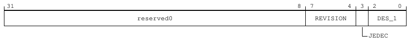

31                                                                           8   7              4   3    2           0
reserved0                                          REVISION                DES_1

JEDEC

**Table 9-118: SID_PID_2 bit descriptions**

Bits    Name        Description                                                                                                              Reset
[31:8] reserved0    Reserved                                                                                                                 0x000000
[7:4]   REVISION    Specifies the major revision number for the block. IMPLEMENTATION DEFINED.                                                0b0000
[3]     JEDEC       Specifies whether the JEDEC JEP106 identification scheme is in use. Set to 0x1.                                            0b1
[2:0]   DES_1       Specifies bits [6:4] of the JEDEC JEP106 designer code for the peripheral. Set to 0x3 for Arm.                            0b011

Accessibility
Component                                       Offset                     Instance                                      Range
DBGTOP_PIK                                      0xFE8                     SID_PID_2                                     None

9.3.2.16 SID_PID_3, System ID Peripheral ID 3 register
The SID_PID_3 register provides information about any modifications to the peripheral.

Configurations
This register is available in all configurations.

Attributes
Width
32
Component
DBGTOP_PIK
Register offset
0xFEC
Access type
RO

<!-- Source PDF page: 152 -->

Reset value
0000 0000 0000 0000 0000 0000 0000 0000
|    |    |    |    |    |    |    | |
31   27   23   19   15   11   7    3 0

Bit descriptions
**Figure 9-40: SID_PID_3 bit assignments**

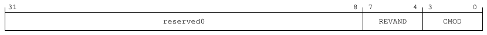

31                                                                          8   7             4   3          0
reserved0                                           REVAND           CMOD

**Table 9-120: SID_PID_3 bit descriptions**

Bits    Name       Description                                                                                                        Reset
[31:8] reserved0 Reserved                                                                                                             0x000000
[7:4]   REVAND Manufacturer revision number. This field indicates minor errata fixes specific to this design, for example,               0b0000
metal fixes after implementation.
[3:0]   CMOD       Customer modification number. Incremented on authorized customer modifications.                                      0b0000

Accessibility
Component                                       Offset                     Instance                                     Range
DBGTOP_PIK                                      0xFEC                     SID_PID_3                                    None

9.3.2.17 COMPID0, System ID Component ID 0 register
The COMPID0 register contains segment 0 of the preamble to the system ID component class
identifier.

Configurations
This register is available in all configurations.

Attributes
Width
32
Component
DBGTOP_PIK
Register offset
0xFF0
Access type
RO
Reset value
0000 0000 0000 0000 0000 0000 0000 1101

<!-- Source PDF page: 153 -->

|      |      |      |      |       |     |      |   |
31     27     23     19     15      11    7      3   0

Bit descriptions
**Figure 9-41: COMPID0 bit assignments**

31                                                                           8   7                     0
reserved0                                             PRMBL_0

**Table 9-122: COMPID0 bit descriptions**

Bits    Name        Description                                                                                                Reset
[31:8] reserved0    Reserved                                                                                                   0x000000
[7:0]   PRMBL_0     Specifies segment 0 of the preamble to the code that identifies the system ID component class.               0x0D

Accessibility
Component                                       Offset                      Instance                               Range
DBGTOP_PIK                                      0xFF0                      COMPID0                                None

9.3.2.18 COMPID1, System ID Component ID 1 register
The COMPID1 register contains segment 1 of the preamble and the system ID component class
identifier.

Configurations
This register is available in all configurations.

Attributes
Width
32
Component
DBGTOP_PIK
Register offset
0xFF4
Access type
RO
Reset value
0000 0000 0000 0000 0000 0000 1111 0000
|    |    |    |    |    |    |    | |
31   27   23   19   15   11   7    3 0

<!-- Source PDF page: 154 -->

Bit descriptions
**Figure 9-42: COMPID1 bit assignments**

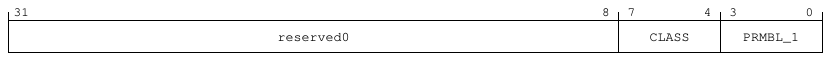

31                                                                           8   7            4   3             0
reserved0                                           CLASS           PRMBL_1

**Table 9-124: COMPID1 bit descriptions**

Bits    Name        Description                                                                                                         Reset
[31:8] reserved0    Reserved                                                                                                            0x000000
[7:4]   CLASS       Specifies a code that identifies the system ID component class.                                                       0b1111
[3:0]   PRMBL_1     Specifies segment 1 of the preamble to the code that identifies the system ID component class.                        0b0000

Accessibility
Component                                       Offset                      Instance                                   Range
DBGTOP_PIK                                      0xFF4                      COMPID1                                    None

9.3.2.19 COMPID2, System ID Component ID 2 register
The COMPID2 register contains segment 2 of the preamble to the system ID component class
identifier.

Configurations
This register is available in all configurations.

Attributes
Width
32
Component
DBGTOP_PIK
Register offset
0xFF8
Access type
RO
Reset value
0000 0000 0000 0000 0000 0000 0000 0101
|    |    |    |    |    |    |    | |
31   27   23   19   15   11   7    3 0

<!-- Source PDF page: 155 -->

Bit descriptions
**Figure 9-43: COMPID2 bit assignments**

31                                                                           8   7                     0
reserved0                                             PRMBL_2

**Table 9-126: COMPID2 bit descriptions**

Bits    Name        Description                                                                                                Reset
[31:8] reserved0    Reserved                                                                                                   0x000000
[7:0]   PRMBL_2     Specifies segment 2 of the preamble to the code that identifies the system ID component class.               0x05

Accessibility
Component                                       Offset                      Instance                               Range
DBGTOP_PIK                                      0xFF8                      COMPID2                                None

9.3.2.20 COMPID3, System ID Component ID 3 register
The COMPID3 register contains segment 3 of the preamble to the system ID component class
identifier.

Configurations
This register is available in all configurations.

Attributes
Width
32
Component
DBGTOP_PIK
Register offset
0xFFC
Access type
RO
Reset value
0000 0000 0000 0000 0000 0000 1011 0001
|    |    |    |    |    |    |    | |
31   27   23   19   15   11   7    3 0

<!-- Source PDF page: 156 -->

Bit descriptions
**Figure 9-44: COMPID3 bit assignments**

31                                                                           8   7                     0
reserved0                                             PRMBL_3

**Table 9-128: COMPID3 bit descriptions**

Bits    Name        Description                                                                                                Reset
[31:8] reserved0    Reserved                                                                                                   0x000000
[7:0]   PRMBL_3     Specifies segment 3 of the preamble to the code that identifies the system ID component class.               0xB1

Accessibility
Component                                       Offset                      Instance                               Range
DBGTOP_PIK                                      0xFFC                      COMPID3                                None

### 9.3.3 IO_REGBANK registers summary
The IO_REGBANK register block provides the interrupt control registers for the I/O Block. The
block includes registers for the error recovery, fault handling, critical error, and Performance
Monitoring Unit (PMU) interrupts. It also includes registers for triple-redundancy control and
standard Peripheral ID and Component ID registers for system-level identification.

The following summary table provides an overview of IMPLEMENTATION DEFINED memory-mapped
IO_REGBANK registers.

For more information on registers listed in the table, click on the link associated with the register
name.

For registers without a listed reset value, refer to the individual field resets documented on the
register description pages.

**Table 9-130: IO_REGBANK registers summary**

Offset Name                                 Reset           Width Description
0x0     SMMU_PMU_IRPT                      0x00000000 32-bit SMMU PMU Interrupt Status register
0x4     SMMU_PMU_IRPT_CHK                  0x0000003F 32-bit SMMU PMU Interrupt Check Status register
0x8     TCU_EDGE_TRI_IRPTS_1               0x00000000 32-bit TCU Edge-Triggered Interrupt Status register
0xC     TCU_EDGE_TRI_IRPTS_1_CHK           0x0000000F 32-bit TCU Edge-Triggered Interrupt Check Status register
0x10    SMMU_RAS_LT_ERI                    0x00000000 32-bit SMMU RAS Level-Triggered ERI Status register
0x14    SMMU_RAS_LT_FHI_CHK                0x0000003F 32-bit SMMU RAS Level-Triggered FHI Check Signal Status register
0x18    SMMU_RAS_LT_FHI                    0x00000000 32-bit SMMU RAS Level-Triggered FHI Status register
0x1C    SMMU_RAS_LT_ERI_CHK                0x0000003F 32-bit SMMU RAS Level-Triggered ERI Check Signal status
0x20    SMMU_RAS_LT_CRI                    0x00000000 32-bit SMMU RAS Level-Triggered CRI Status register

<!-- Source PDF page: 157 -->

Offset Name                               Reset           Width Description
0x24   SMMU_RAS_LT_CRI_CHK               0x0000003F 32-bit SMMU RAS Level-Triggered CRI Check Signal Status register
0x28   TCU_EDGE_TRI_IRPTS_2              0x00000000 32-bit TCU Edge-Triggered Interrupt Status register
0x2C   TCU_EDGE_TRI_IRPTS_2_CHK          0x00000007 32-bit TCU Edge-Triggered Interrupt Check Status register
0x30   IONI_PD_NS_INTERRUPT              0x00000000 32-bit IONI Non-secure Interrupt Status register
0x34   IONI_PD_NS_INTERRUPTCHK           0x00000003 32-bit IONI Non-Secure Interrupt Check Status register
0x38   IONI_NICLK_nPMUINTERRUPT          0x00000003 32-bit IONI Active-LOW PMU Interrupt Output Status register
0x3C   IONI_PD_INTERRUPT                 0x00000000 32-bit IONI Interrupt Status register
0x40   IONI_PD_INTERRUPTCHK              0x00000003 32-bit IONI Interrupt Check Status register
0xE00 TRI_REDT_INTR_O_IOBPID4_CFG 0x00000000 32-bit Triple-Redundancy PID4 Interrupt Output Protection Status register
0xE04 TRI_REDT_INTR_O_IOBID_CFG          0x00000000 32-bit Triple-Redundancy PID0/1/2/3 and CID Interrupt Output Protection
Status register
0xFD0 SID_PID_4                          0x00000002 32-bit System ID Peripheral ID 4 register
0xFE0 SID_PID_0                          0x00000000 32-bit System ID Peripheral ID 0 register
0xFE4 SID_PID_1                          0x000B0000 32-bit System ID Peripheral ID 1 register
0xFE8 SID_PID_2                          0x0000000B 32-bit System ID Peripheral ID 2 register
0xFEC SID_PID_3                          0x00000000 32-bit System ID Peripheral ID 3 register
0xFF0 COMPID0                            0x0000000D 32-bit System ID Component ID 0 register
0xFF4 COMPID1                            0x000000F0 32-bit System ID Component ID 1 register
0xFF8 COMPID2                            0x00000005 32-bit System ID Component ID 2 register
0xFFC COMPID3                            0x000000B1 32-bit System ID Component ID 3 register

9.3.3.1 SMMU_PMU_IRPT, SMMU PMU Interrupt Status register
The SMMU_PMU_IRPT register indicates the status of the edge-triggered PMU interrupt sources
for the Translation Control Unit (TCU) and Translation Buffer Units (TBUs).

Configurations
This register is available in all configurations.

Attributes
Width
32
Component
IO_REGBANK
Register offset
0x0
Access type
RO
Reset value
0000 0000 0000 0000 0000 0000 0000 0000

<!-- Source PDF page: 158 -->

|      |      |       |       |    |      |      |   |
31     27     23      19      15   11     7      3   0

Bit descriptions
**Figure 9-45: SMMU_PMU_IRPT bit assignments**

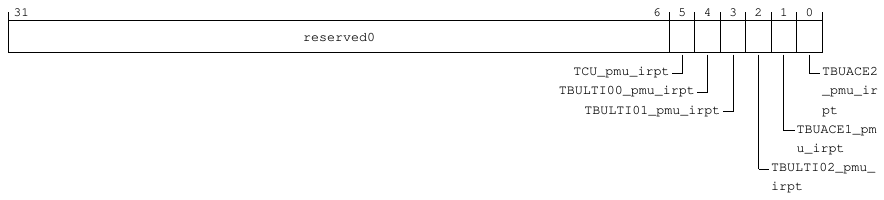

31                                                                                    6   5   4   3   2    1   0
reserved0

TCU_pmu_irpt                           TBUACE2
TBULTI00_pmu_irpt                        _pmu_ir
TBULTI01_pmu_irpt                     pt
TBUACE1_pm
u_irpt
TBULTI02_pmu_
irpt

**Table 9-131: SMMU_PMU_IRPT bit descriptions**

Bits   Name                 Description                                                            Reset
[31:6] reserved0            Reserved                                                               0b00000000000000000000000000
[5]    TCU_pmu_irpt         Volatile. TCU edge-triggered PMU interrupt assertion signal.           0b0
[4]    TBULTI00_pmu_irpt Volatile. TBU Local Trigger Interface (LTI) edge-triggered PMU            0b0
interrupt assertion signal.
[3]    TBULTI01_pmu_irpt Volatile. TBU LTI edge-triggered PMU interrupt assertion signal.          0b0
[2]    TBULTI02_pmu_irpt Volatile. TBU LTI edge-triggered PMU interrupt assertion signal.          0b0
[1]    TBUACE1_pmu_irpt Volatile. TBU AMBA Coherency Extensions (ACE) edge-triggered               0b0
PMU interrupt assertion signal.
[0]    TBUACE2_pmu_irpt Volatile. TBU ACE edge-triggered PMU interrupt assertion signal.           0b0

Accessibility
Component                                 Offset               Instance                                                        Range
IO_REGBANK                                0x0                 SMMU_PMU_IRPT                                                   None

9.3.3.2 SMMU_PMU_IRPT_CHK, SMMU PMU Interrupt Check Status register
The SMMU_PMU_IRPT_CHK register indicates the edge-triggered PMU interrupt check signal
status for the TCU and TBUs.

Configurations
This register is available in all configurations.

Attributes
Width
32

<!-- Source PDF page: 159 -->

Component
IO_REGBANK
Register offset
0x4
Access type
RO
Reset value
0000 0000 0000 0000 0000 0000 0011 1111
|    |    |    |    |    |    |    | |
31   27   23   19   15   11   7    3 0

Bit descriptions
**Figure 9-46: SMMU_PMU_IRPT_CHK bit assignments**

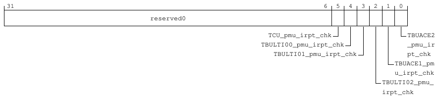

31                                                                                    6   5   4   3   2    1   0
reserved0

TCU_pmu_irpt_chk                           TBUACE2
TBULTI00_pmu_irpt_chk                        _pmu_ir
TBULTI01_pmu_irpt_chk                     pt_chk
TBUACE1_pm
u_irpt_chk
TBULTI02_pmu_
irpt_chk

**Table 9-133: SMMU_PMU_IRPT_CHK bit descriptions**

Bits   Name                     Description                                                        Reset
[31:6] reserved0                Reserved                                                           0b00000000000000000000000000
[5]    TCU_pmu_irpt_chk         Volatile. TCU edge-triggered PMU interrupt assertion check         0b1
signal.
[4]    TBULTI00_pmu_irpt_chk Volatile. TBU LTI edge-triggered PMU interrupt assertion check 0b1
signal.
[3]    TBULTI01_pmu_irpt_chk Volatile. TBU LTI edge-triggered PMU interrupt assertion check 0b1
signal.
[2]    TBULTI02_pmu_irpt_chk Volatile. TBU LTI edge-triggered PMU interrupt assertion check 0b1
signal.
[1]    TBUACE1_pmu_irpt_chk Volatile. TBU ACE edge-triggered PMU interrupt assertion               0b1
check signal.
[0]    TBUACE2_pmu_irpt_chk Volatile. TBU ACE edge-triggered PMU interrupt assertion               0b1
check signal.

Accessibility
Component                           Offset               Instance                                                               Range
IO_REGBANK                          0x4                 SMMU_PMU_IRPT_CHK                                                      None

<!-- Source PDF page: 160 -->

9.3.3.3 TCU_EDGE_TRI_IRPTS_1, TCU Edge-Triggered Interrupt Status register
The TCU_EDGE_TRI_IRPTS_1 register indicates the status of the edge-triggered interrupts
TCU_event_q_irpt_s, TCU_cmd_sync_irpt_s, TCU_global_irpt_s, and TCU_pri_q_irpt_ns.

Configurations
This register is available in all configurations.

Attributes
Width
32
Component
IO_REGBANK
Register offset
0x8
Access type
RO
Reset value
0000 0000 0000 0000 0000 0000 0000 0000
|    |    |    |    |    |    |    | |
31   27   23   19   15   11   7    3 0

Bit descriptions
**Figure 9-47: TCU_EDGE_TRI_IRPTS_1 bit assignments**

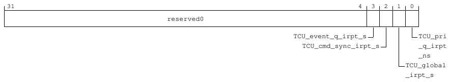

31                                                                                        4   3   2   1    0
reserved0

TCU_event_q_irpt_s                  TCU_pri
TCU_cmd_sync_irpt_s               _q_irpt
_ns
TCU_global
_irpt_s

**Table 9-135: TCU_EDGE_TRI_IRPTS_1 bit descriptions**

Bits   Name                  Description                                                                                          Reset
[31:4] reserved0             Reserved                                                                                             0x0000000
[3]    TCU_event_q_irpt_s    Volatile. Edge-triggered event queue, Secure interrupt.                                              0b0
[2]    TCU_cmd_sync_irpt_s Volatile. Edge-triggered SYNC complete, Secure interrupt.                                              0b0
[1]    TCU_global_irpt_s     Volatile. Edge-triggered global Secure interrupt.                                                    0b0
[0]    TCU_pri_q_irpt_ns     Volatile. Edge-triggered Non-secure Page Request Interface (PRI) queue interrupt assertion           0b0
signal.

<!-- Source PDF page: 161 -->

Accessibility
Component                           Offset              Instance                                                           Range
IO_REGBANK                          0x8                TCU_EDGE_TRI_IRPTS_1                                               None

9.3.3.4 TCU_EDGE_TRI_IRPTS_1_CHK, TCU Edge-Triggered Interrupt Check Status
register
The TCU_EDGE_TRI_IRPTS_1_CHK register indicates the TCU edge-triggered interrupt 1 check
signal status.

Configurations
This register is available in all configurations.

Attributes
Width
32
Component
IO_REGBANK
Register offset
0xC
Access type
RO
Reset value
0000 0000 0000 0000 0000 0000 0000 1111
|    |    |    |    |    |    |    | |
31   27   23   19   15   11   7    3 0

Bit descriptions
**Figure 9-48: TCU_EDGE_TRI_IRPTS_1_CHK bit assignments**

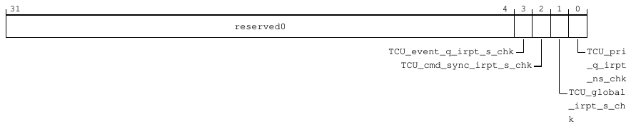

31                                                                                        4   3   2   1    0
reserved0

TCU_event_q_irpt_s_chk                  TCU_pri
TCU_cmd_sync_irpt_s_chk               _q_irpt
_ns_chk
TCU_global
_irpt_s_ch
k

**Table 9-137: TCU_EDGE_TRI_IRPTS_1_CHK bit descriptions**

Bits   Name                         Description                                                                                    Reset
[31:4] reserved0                    Reserved                                                                                       0x0000000

<!-- Source PDF page: 162 -->

Bits   Name                            Description                                                                             Reset
[3]    TCU_event_q_irpt_s_chk          Volatile. Edge-triggered event queue, Secure interrupt check signal.                    0b1
[2]    TCU_cmd_sync_irpt_s_chk         Volatile. Edge-triggered SYNC complete, Secure interrupt check signal.                  0b1
[1]    TCU_global_irpt_s_chk           Volatile. Edge-triggered global Secure interrupt check signal.                          0b1
[0]    TCU_pri_q_irpt_ns_chk           Volatile. Edge-triggered Non-secure PRI queue interrupt assertion check signal.         0b1

Accessibility
Component                        Offset               Instance                                                                Range
IO_REGBANK                       0xC                 TCU_EDGE_TRI_IRPTS_1_CHK                                                None

9.3.3.5 SMMU_RAS_LT_ERI, SMMU RAS Level-Triggered ERI Status register
The SMMU_RAS_LT_ERI register indicates the status of the Reliability, Availability, and
Serviceability (RAS) level-triggered Error Recovery Interrupt (ERI) sources for the System Memory
Management Unit (SMMU) and TBUs.

Configurations
This register is available in all configurations.

Attributes
Width
32
Component
IO_REGBANK
Register offset
0x10
Access type
RO
Reset value
0000 0000 0000 0000 0000 0000 0000 0000
|    |    |    |    |    |    |    | |
31   27   23   19   15   11   7    3 0

<!-- Source PDF page: 163 -->

Bit descriptions
**Figure 9-49: SMMU_RAS_LT_ERI bit assignments**

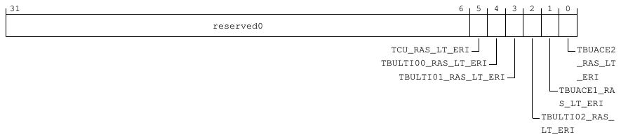

31                                                                                    6   5   4   3   2    1   0
reserved0

TCU_RAS_LT_ERI                            TBUACE2
TBULTI00_RAS_LT_ERI                         _RAS_LT
TBULTI01_RAS_LT_ERI                      _ERI
TBUACE1_RA
S_LT_ERI
TBULTI02_RAS_
LT_ERI

**Table 9-139: SMMU_RAS_LT_ERI bit descriptions**

Bits   Name                    Description                                                         Reset
[31:6] reserved0               Reserved                                                            0b00000000000000000000000000
[5]    TCU_RAS_LT_ERI          Volatile. Level-triggered error recovery RAS interrupt for the      0b0
TCU.
[4]    TBULTI00_RAS_LT_ERI Volatile. Level-triggered error recovery RAS interrupt for              0b0
TBULTI00.
[3]    TBULTI01_RAS_LT_ERI Volatile. Level-triggered error recovery RAS interrupt for              0b0
TBULTI01.
[2]    TBULTI02_RAS_LT_ERI Volatile. Level-triggered error recovery RAS interrupt for              0b0
TBULTI02.
[1]    TBUACE1_RAS_LT_ERI Volatile. Level-triggered error recovery RAS interrupt for               0b0
TBUACE1.
[0]    TBUACE2_RAS_LT_ERI Volatile. Level-triggered error recovery RAS interrupt for               0b0
TBUACE2.

Accessibility
Component                               Offset                 Instance                                                        Range
IO_REGBANK                              0x10                  SMMU_RAS_LT_ERI                                                 None

9.3.3.6 SMMU_RAS_LT_FHI_CHK, SMMU RAS Level-Triggered FHI Check Signal
Status register
The SMMU_RAS_LT_FHI_CHK register indicates the RAS level-triggered Fault Handling Interrupt
(FHI) check signal status for the SMMU and TBUs.

Configurations
This register is available in all configurations.

Attributes
Width
32

<!-- Source PDF page: 164 -->

Component
IO_REGBANK
Register offset
0x14
Access type
RO
Reset value
0000 0000 0000 0000 0000 0000 0011 1111
|    |    |    |    |    |    |    | |
31   27   23   19   15   11   7    3 0

Bit descriptions
**Figure 9-50: SMMU_RAS_LT_FHI_CHK bit assignments**

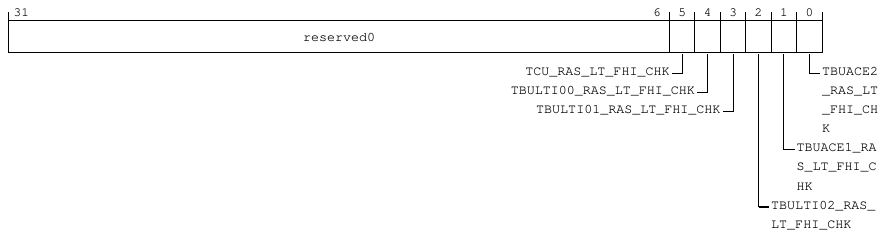

31                                                                                    6   5   4   3   2    1   0
reserved0

TCU_RAS_LT_FHI_CHK                           TBUACE2
TBULTI00_RAS_LT_FHI_CHK                        _RAS_LT
TBULTI01_RAS_LT_FHI_CHK                     _FHI_CH
K
TBUACE1_RA
S_LT_FHI_C
HK
TBULTI02_RAS_
LT_FHI_CHK

**Table 9-141: SMMU_RAS_LT_FHI_CHK bit descriptions**

Bits   Name                          Description                                                   Reset
[31:6] reserved0                     Reserved                                                      0b00000000000000000000000000
[5]    TCU_RAS_LT_FHI_CHK            Volatile. Level-triggered fault handling RAS interrupt CHK    0b1
signal status for the TCU.
[4]    TBULTI00_RAS_LT_FHI_CHK Volatile. Level-triggered fault handling RAS interrupt CHK          0b1
signal status for TBULTI00.
[3]    TBULTI01_RAS_LT_FHI_CHK Volatile. Level-triggered fault handling RAS interrupt CHK          0b1
signal status for TBULTI01.
[2]    TBULTI02_RAS_LT_FHI_CHK Volatile. Level-triggered fault handling RAS interrupt CHK          0b1
signal status for TBULTI02.
[1]    TBUACE1_RAS_LT_FHI_CHK Volatile. Level-triggered fault handling RAS interrupt CHK           0b1
signal status for TBUACE1.
[0]    TBUACE2_RAS_LT_FHI_CHK Volatile. Level-triggered fault handling RAS interrupt CHK           0b1
signal status for TBUACE2.

Accessibility
Component                          Offset               Instance                                                                Range
IO_REGBANK                         0x14                SMMU_RAS_LT_FHI_CHK                                                     None

<!-- Source PDF page: 165 -->

9.3.3.7 SMMU_RAS_LT_FHI, SMMU RAS Level-Triggered FHI Status register
The SMMU_RAS_LT_FHI register indicates the level-triggered fault handling RAS interrupt for the
TCU and TBUs.

Configurations
This register is available in all configurations.

Attributes
Width
32
Component
IO_REGBANK
Register offset
0x18
Access type
RO
Reset value
0000 0000 0000 0000 0000 0000 0000 0000
|    |    |    |    |    |    |    | |
31   27   23   19   15   11   7    3 0

Bit descriptions
**Figure 9-51: SMMU_RAS_LT_FHI bit assignments**

31                                                                                   6   5   4   3   2    1   0
reserved0

TCU_RAS_LT_FHI                          TBUACE2
TBULTI00_RAS_LT_FHI                       _RAS_LT
TBULTI01_RAS_LT_FHI                    _FHI
TBUACE1_RA
S_LT_FHI
TBULTI02_RAS_
LT_FHI

**Table 9-143: SMMU_RAS_LT_FHI bit descriptions**

Bits   Name                    Description                                                         Reset
[31:6] reserved0               Reserved                                                            0b00000000000000000000000000
[5]    TCU_RAS_LT_FHI          Volatile. Level-triggered fault handling RAS interrupt for the      0b0
TCU.
[4]    TBULTI00_RAS_LT_FHI Volatile. Level-triggered fault handling RAS interrupt for              0b0
TBULTI00.
[3]    TBULTI01_RAS_LT_FHI Volatile. Level-triggered fault handling RAS interrupt for              0b0
TBULTI01.

<!-- Source PDF page: 166 -->

Bits   Name                    Description                                                         Reset
[2]    TBULTI02_RAS_LT_FHI Volatile. Level-triggered fault handling RAS interrupt for              0b0
TBULTI02.
[1]    TBUACE1_RAS_LT_FHI Volatile. Level-triggered fault handling RAS interrupt for               0b0
TBUACE1.
[0]    TBUACE2_RAS_LT_FHI Volatile. Level-triggered fault handling RAS interrupt for               0b0
TBUACE2.

Accessibility
Component                              Offset                  Instance                                                 Range
IO_REGBANK                             0x18                   SMMU_RAS_LT_FHI                                          None

9.3.3.8 SMMU_RAS_LT_ERI_CHK, SMMU RAS Level-Triggered ERI Check Signal
status
The SMMU_RAS_LT_ERI_CHK register indicates the status of the RAS level-triggered Error
Recovery Interrupt (ERI) check signal for the SMMU and TBUs.

Configurations
This register is available in all configurations.

Attributes
Width
32
Component
IO_REGBANK
Register offset
0x1C
Access type
RO
Reset value
0000 0000 0000 0000 0000 0000 0011 1111
|    |    |    |    |    |    |    | |
31   27   23   19   15   11   7    3 0

<!-- Source PDF page: 167 -->

Bit descriptions
**Figure 9-52: SMMU_RAS_LT_ERI_CHK bit assignments**

31                                                                                    6   5   4   3   2    1   0
reserved0

TCU_RAS_LT_ERI_CHK                           TBUACE2
TBULTI00_RAS_LT_ERI_CHK                        _RAS_LT
TBULTI01_RAS_LT_ERI_CHK                     _ERI_CH
K
TBUACE1_RA
S_LT_ERI_C
HK
TBULTI02_RAS_
LT_ERI_CHK

**Table 9-145: SMMU_RAS_LT_ERI_CHK bit descriptions**

Bits   Name                          Description                                                   Reset
[31:6] reserved0                     Reserved                                                      0b00000000000000000000000000
[5]    TCU_RAS_LT_ERI_CHK            Volatile. Level-triggered error recovery RAS interrupt CHK    0b1
signal status for the TCU.
[4]    TBULTI00_RAS_LT_ERI_CHK Volatile. Level-triggered error recovery RAS interrupt CHK          0b1
signal status for TBULTI00.
[3]    TBULTI01_RAS_LT_ERI_CHK Volatile. Level-triggered error recovery RAS interrupt CHK          0b1
signal status for TBULTI01.
[2]    TBULTI02_RAS_LT_ERI_CHK Volatile. Level-triggered error recovery RAS interrupt CHK          0b1
signal status for TBULTI02.
[1]    TBUACE1_RAS_LT_ERI_CHK Volatile. Level-triggered error recovery RAS interrupt CHK           0b1
signal status for TBUACE1.
[0]    TBUACE2_RAS_LT_ERI_CHK Volatile. Level-triggered error recovery RAS interrupt CHK           0b1
signal status for TBUACE2.

Accessibility
Component                           Offset              Instance                                                                Range
IO_REGBANK                          0x1C               SMMU_RAS_LT_ERI_CHK                                                     None

9.3.3.9 SMMU_RAS_LT_CRI, SMMU RAS Level-Triggered CRI Status register
The SMMU_RAS_LT_CRI register indicates the level-triggered Critical Error Interrupt (CRI) for the
TCU and TBUs.

Configurations
This register is available in all configurations.

Attributes
Width
32

<!-- Source PDF page: 168 -->

Component
IO_REGBANK
Register offset
0x20
Access type
RO
Reset value
0000 0000 0000 0000 0000 0000 0000 0000
|    |    |    |    |    |    |    | |
31   27   23   19   15   11   7    3 0

Bit descriptions
**Figure 9-53: SMMU_RAS_LT_CRI bit assignments**

31                                                                                     6   5   4   3   2    1   0
reserved0

TCU_RAS_LT_CRI                            TBUACE2
TBULTI00_RAS_LT_CRI                         _RAS_LT
TBULTI01_RAS_LT_CRI                      _CRI
TBUACE1_RA
S_LT_CRI
TBULTI02_RAS_
LT_CRI

**Table 9-147: SMMU_RAS_LT_CRI bit descriptions**

Bits   Name                    Description                                                           Reset
[31:6] reserved0               Reserved                                                              0b00000000000000000000000000
[5]    TCU_RAS_LT_CRI          Volatile. Level-triggered critical error RAS interrupt for the TCU.   0b0
[4]    TBULTI00_RAS_LT_CRI Volatile. Level-triggered critical error RAS interrupt for                0b0
TBULTI00.
[3]    TBULTI01_RAS_LT_CRI Volatile. Level-triggered critical error RAS interrupt for                0b0
TBULTI01.
[2]    TBULTI02_RAS_LT_CRI Volatile. Level-triggered critical error RAS interrupt for                0b0
TBULTI02.
[1]    TBUACE1_RAS_LT_CRI Volatile. Level-triggered critical error RAS interrupt for                 0b0
TBUACE1.
[0]    TBUACE2_RAS_LT_CRI Volatile. Level-triggered critical error RAS interrupt for                 0b0
TBUACE2.

Accessibility
Component                               Offset                 Instance                                                         Range
IO_REGBANK                              0x20                  SMMU_RAS_LT_CRI                                                  None

<!-- Source PDF page: 169 -->

9.3.3.10 SMMU_RAS_LT_CRI_CHK, SMMU RAS Level-Triggered CRI Check Signal
Status register
The SMMU_RAS_LT_CRI_CHK register indicates the status of the RAS level-triggered CRI check
signal for the SMMU and TBUs.

Configurations
This register is available in all configurations.

Attributes
Width
32
Component
IO_REGBANK
Register offset
0x24
Access type
RO
Reset value
0000 0000 0000 0000 0000 0000 0011 1111
|    |    |    |    |    |    |    | |
31   27   23   19   15   11   7    3 0

Bit descriptions
**Figure 9-54: SMMU_RAS_LT_CRI_CHK bit assignments**

31                                                                                    6   5   4   3   2    1   0
reserved0

TCU_RAS_LT_CRI_CHK                           TBUACE2
TBULTI00_RAS_LT_CRI_CHK                        _RAS_LT
TBULTI01_RAS_LT_CRI_CHK                     _CRI_CH
K
TBUACE1_RA
S_LT_CRI_C
HK
TBULTI02_RAS_
LT_CRI_CHK

**Table 9-149: SMMU_RAS_LT_CRI_CHK bit descriptions**

Bits   Name                         Description                                                   Reset
[31:6] reserved0                    Reserved                                                      0b00000000000000000000000000
[5]    TCU_RAS_LT_CRI_CHK           Volatile. Level-triggered critical error RAS interrupt CHK    0b1
signal status for the TCU.
[4]    TBULTI00_RAS_LT_CRI_CHK Volatile. Level-triggered critical error RAS interrupt CHK         0b1
signal status for TBULTI00.

<!-- Source PDF page: 170 -->

Bits   Name                          Description                                                   Reset
[3]    TBULTI01_RAS_LT_CRI_CHK Volatile. Level-triggered critical error RAS interrupt CHK          0b1
signal status for TBULTI01.
[2]    TBULTI02_RAS_LT_CRI_CHK Volatile. Level-triggered critical error RAS interrupt CHK          0b1
signal status for TBULTI02.
[1]    TBUACE1_RAS_LT_CRI_CHK Volatile. Level-triggered critical error RAS interrupt CHK           0b1
signal status for TBUACE1.
[0]    TBUACE2_RAS_LT_CRI_CHK Volatile. Level-triggered critical error RAS interrupt CHK           0b1
signal status for TBUACE2.

Accessibility
Component                          Offset               Instance                                                          Range
IO_REGBANK                         0x24                SMMU_RAS_LT_CRI_CHK                                               None

9.3.3.11 TCU_EDGE_TRI_IRPTS_2, TCU Edge-Triggered Interrupt Status register
The TCU_EDGE_TRI_IRPTS_2 register indicates the status of the edge-triggered interrupts
TCU_event_q_irpt_ns, TCU_cmd_sync_irpt_ns, and TCU_global_irpt_ns.

Configurations
This register is available in all configurations.

Attributes
Width
32
Component
IO_REGBANK
Register offset
0x28
Access type
RO
Reset value
0000 0000 0000 0000 0000 0000 0000 0000
|    |    |    |    |    |    |    | |
31   27   23   19   15   11   7    3 0

<!-- Source PDF page: 171 -->

Bit descriptions
**Figure 9-55: TCU_EDGE_TRI_IRPTS_2 bit assignments**

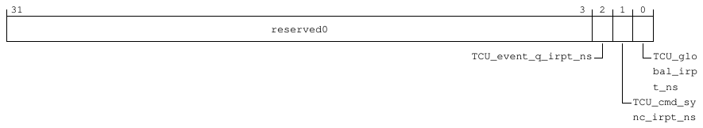

31                                                                                             3   2   1    0
reserved0

TCU_event_q_irpt_ns               TCU_glo
bal_irp
t_ns
TCU_cmd_sy
nc_irpt_ns

**Table 9-151: TCU_EDGE_TRI_IRPTS_2 bit descriptions**

Bits   Name                    Description                                                     Reset
[31:3] reserved0               Reserved                                                        0b00000000000000000000000000000
[2]    TCU_event_q_irpt_ns     Volatile. Edge-triggered Event queue, Non-secure interrupt.     0b0
[1]    TCU_cmd_sync_irpt_ns Volatile. Edge-triggered SYNC complete, Non-secure                 0b0
interrupt.
[0]    TCU_global_irpt_ns      Volatile. Edge-triggered Global Non-secure interrupt.           0b0

Accessibility
Component                           Offset              Instance                                                            Range
IO_REGBANK                          0x28               TCU_EDGE_TRI_IRPTS_2                                                None

9.3.3.12 TCU_EDGE_TRI_IRPTS_2_CHK, TCU Edge-Triggered Interrupt Check
Status register
The TCU_EDGE_TRI_IRPTS_2_CHK register indicates the TCU edge-triggered interrupt 2 check
signal status.

Configurations
This register is available in all configurations.

Attributes
Width
32
Component
IO_REGBANK
Register offset
0x2C
Access type
RO

<!-- Source PDF page: 172 -->

Reset value
0000 0000 0000 0000 0000 0000 0000 0111
|    |    |    |    |    |    |    | |
31   27   23   19   15   11   7    3 0

Bit descriptions
**Figure 9-56: TCU_EDGE_TRI_IRPTS_2_CHK bit assignments**

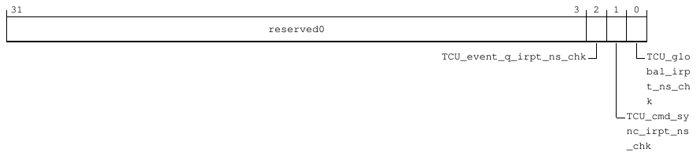

31                                                                                             3   2   1    0
reserved0

TCU_event_q_irpt_ns_chk               TCU_glo
bal_irp
t_ns_ch
k
TCU_cmd_sy
nc_irpt_ns
_chk

**Table 9-153: TCU_EDGE_TRI_IRPTS_2_CHK bit descriptions**

Bits   Name                        Description                                                 Reset
[31:3] reserved0                   Reserved                                                    0b00000000000000000000000000000
[2]    TCU_event_q_irpt_ns_chk     Volatile. Edge-triggered Event queue, Non-secure            0b1
interrupt check signal.
[1]    TCU_cmd_sync_irpt_ns_chk Volatile. Edge-triggered SYNC complete, Non-secure             0b1
interrupt check signal.
[0]    TCU_global_irpt_ns_chk      Volatile. Edge-triggered Global Non-secure interrupt        0b1
check signal.

Accessibility
Component                        Offset            Instance                                                                     Range
IO_REGBANK                       0x2C             TCU_EDGE_TRI_IRPTS_2_CHK                                                     None

9.3.3.13 IONI_PD_NS_INTERRUPT, IONI Non-secure Interrupt Status register
The IONI_PD_NS_INTERRUPT edge-triggered register indicates the Non-secure interrupt status for
I/O Block Network Interface (NI) instances.

Configurations
This register is available in all configurations.

Attributes
Width
32
Component
IO_REGBANK

<!-- Source PDF page: 173 -->

Register offset
0x30
Access type
RO
Reset value
0000 0000 0000 0000 0000 0000 0000 0000
|    |    |    |    |    |    |    | |
31   27   23   19   15   11   7    3 0

Bit descriptions
**Figure 9-57: IONI_PD_NS_INTERRUPT bit assignments**

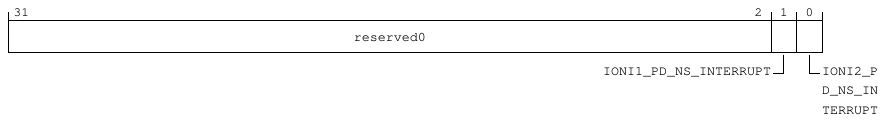

31                                                                                              2    1   0
reserved0

IONI1_PD_NS_INTERRUPT           IONI2_P
D_NS_IN
TERRUPT

**Table 9-155: IONI_PD_NS_INTERRUPT bit descriptions**

Bits   Name                        Description                                               Reset
[31:2] reserved0                   Reserved                                                  0b000000000000000000000000000000
[1]    IONI1_PD_NS_INTERRUPT Volatile. Edge-triggered Non-secure interrupt for each          0b0
power domain.
[0]    IONI2_PD_NS_INTERRUPT Volatile. Edge-triggered Non-secure interrupt for each          0b0
power domain.

Accessibility
Component                          Offset               Instance                                                          Range
IO_REGBANK                         0x30                IONI_PD_NS_INTERRUPT                                              None

9.3.3.14 IONI_PD_NS_INTERRUPTCHK, IONI Non-Secure Interrupt Check Status
register
The IONI_PD_NS_INTERRUPT_CHK register indicates the Non-secure interrupt check signal status
for I/O Block NI instances.

Configurations
This register is available in all configurations.

Attributes
Width
32

<!-- Source PDF page: 174 -->

Component
IO_REGBANK
Register offset
0x34
Access type
RO
Reset value
0000 0000 0000 0000 0000 0000 0000 0011
|    |    |    |    |    |    |    | |
31   27   23   19   15   11   7    3 0

Bit descriptions
**Figure 9-58: IONI_PD_NS_INTERRUPTCHK bit assignments**

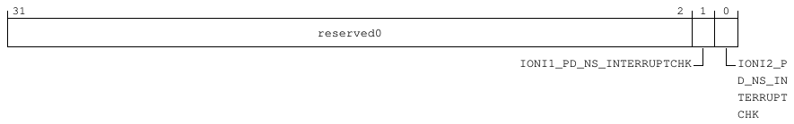

31                                                                                              2    1   0
reserved0

IONI1_PD_NS_INTERRUPTCHK           IONI2_P
D_NS_IN
TERRUPT
CHK

**Table 9-157: IONI_PD_NS_INTERRUPTCHK bit descriptions**

Bits   Name                              Description                                         Reset
[31:2] reserved0                         Reserved                                            0b000000000000000000000000000000
[1]    IONI1_PD_NS_INTERRUPTCHK Volatile. Edge-triggered Non-secure interrupt                0b1
check signal for each power domain.
[0]    IONI2_PD_NS_INTERRUPTCHK Volatile. Edge-triggered Non-secure interrupt                0b1
check signal for each power domain.

Accessibility
Component                        Offset              Instance                                                                 Range
IO_REGBANK                       0x34               IONI_PD_NS_INTERRUPTCHK                                                  None

9.3.3.15 IONI_NICLK_nPMUINTERRUPT, IONI Active-LOW PMU Interrupt Output
Status register
The IONI_NICLK_nPMUINTERRUPT register indicates the status of active-LOW PMU interrupt
outputs for I/O Block NI instances.

Configurations
This register is available in all configurations.

<!-- Source PDF page: 175 -->

Attributes
Width
32
Component
IO_REGBANK
Register offset
0x38
Access type
RO
Reset value
0000 0000 0000 0000 0000 0000 0000 0011
|    |    |    |    |    |    |    | |
31   27   23   19   15   11   7    3 0

Bit descriptions
**Figure 9-59: IONI_NICLK_NPMUINTERRUPT bit assignments**

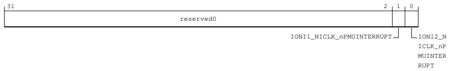

31                                                                                              2    1   0
reserved0

IONI1_NICLK_nPMUINTERRUPT           IONI2_N
ICLK_nP
MUINTER
RUPT

**Table 9-159: IONI_NICLK_nPMUINTERRUPT bit descriptions**

Bits   Name                              Description                                         Reset
[31:2] reserved0                         Reserved                                            0b000000000000000000000000000000
[1]    IONI1_NICLK_nPMUINTERRUPT Volatile. IONI 1 active-LOW PMU interrupt                   0b1
status.
[0]    IONI2_NICLK_nPMUINTERRUPT Volatile. IONI 2 active-LOW PMU interrupt                   0b1
status.

Accessibility
Component                       Offset            Instance                                                                    Range
IO_REGBANK                      0x38             IONI_NICLK_nPMUINTERRUPT                                                    None

<!-- Source PDF page: 176 -->

9.3.3.16 IONI_PD_INTERRUPT, IONI Interrupt Status register
The IONI_PD_INTERRUPT edge-triggered register indicates the Secure interrupt status for I/O
Block NI instances.

Configurations
This register is available in all configurations.

Attributes
Width
32
Component
IO_REGBANK
Register offset
0x3C
Access type
RO
Reset value
0000 0000 0000 0000 0000 0000 0000 0000
|    |    |    |    |    |    |    | |
31   27   23   19   15   11   7    3 0

Bit descriptions
**Figure 9-60: IONI_PD_INTERRUPT bit assignments**

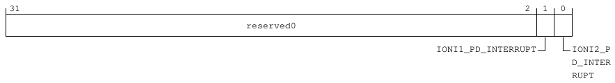

31                                                                                              2     1   0
reserved0

IONI1_PD_INTERRUPT           IONI2_P
D_INTER
RUPT

**Table 9-161: IONI_PD_INTERRUPT bit descriptions**

Bits   Name                    Description                                                   Reset
[31:2] reserved0               Reserved                                                      0b000000000000000000000000000000
[1]    IONI1_PD_INTERRUPT Volatile. Edge-triggered Secure interrupt for each power           0b0
domain.
[0]    IONI2_PD_INTERRUPT Volatile. Edge-triggered Secure interrupt for each power           0b0
domain.

Accessibility
Component                             Offset                Instance                                                       Range
IO_REGBANK                            0x3C                 IONI_PD_INTERRUPT                                              None

<!-- Source PDF page: 177 -->

9.3.3.17 IONI_PD_INTERRUPTCHK, IONI Interrupt Check Status register
The IONI_PD_INTERRUPT_CHK register indicates the Secure interrupt check signal status for I/O
Block NI instances.

Configurations
This register is available in all configurations.

Attributes
Width
32
Component
IO_REGBANK
Register offset
0x40
Access type
RO
Reset value
0000 0000 0000 0000 0000 0000 0000 0011
|    |    |    |    |    |    |    | |
31   27   23   19   15   11   7    3 0

Bit descriptions
**Figure 9-61: IONI_PD_INTERRUPTCHK bit assignments**

31                                                                                              2    1    0
reserved0

IONI1_PD_INTERRUPTCHK            IONI2_P
D_INTER
RUPTCHK

**Table 9-163: IONI_PD_INTERRUPTCHK bit descriptions**

Bits   Name                         Description                                              Reset
[31:2] reserved0                    Reserved                                                 0b000000000000000000000000000000
[1]    IONI1_PD_INTERRUPTCHK Volatile. Edge-triggered Secure interrupt check signal          0b1
for each power domain.
[0]    IONI2_PD_INTERRUPTCHK Volatile. Edge-triggered Secure interrupt check signal          0b1
for each power domain.

Accessibility
Component                          Offset              Instance                                                               Range
IO_REGBANK                         0x40               IONI_PD_INTERRUPTCHK                                                   None

<!-- Source PDF page: 178 -->

9.3.3.18 TRI_REDT_INTR_O_IOBPID4_CFG, Triple-Redundancy PID4 Interrupt
Output Protection Status register
The TRI_REDT_INTR_O_IOBPID4_CFG register specifies the triple-redundancy control or status for
PID4 interrupt output protection.

Configurations
This register is available in all configurations.

Attributes
Width
32
Component
IO_REGBANK
Register offset
0xE00
Access type
RO
Reset value
0000 0000 0000 0000 0000 0000 0000 0000
|    |    |    |    |    |    |    | |
31   27   23   19   15   11   7    3 0

Bit descriptions
**Figure 9-62: TRI_REDT_INTR_O_IOBPID4_CFG bit assignments**

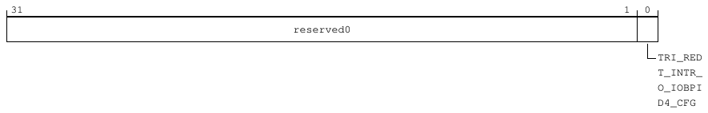

31                                                                                                  1   0
reserved0

TRI_RED
T_INTR_
O_IOBPI
D4_CFG

**Table 9-165: TRI_REDT_INTR_O_IOBPID4_CFG bit descriptions**

Bits   Name                               Description                                       Reset
[31:1] reserved0                          Reserved                                          0b0000000000000000000000000000000
[0]    TRI_REDT_INTR_O_IOBPID4_CFG Triple-redundancy PID4 interrupt output                  0b0
protection status.

Accessibility
Component                      Offset           Instance                                                                     Range
IO_REGBANK                     0xE00           TRI_REDT_INTR_O_IOBPID4_CFG                                                  None

<!-- Source PDF page: 179 -->

9.3.3.19 TRI_REDT_INTR_O_IOBID_CFG, Triple-Redundancy PID0/1/2/3 and CID
Interrupt Output Protection Status register
The TRI_REDT_INTR_O_IOBID_CFG register is the triple-redundancy register for CID registers.

Configurations
This register is available in all configurations.

Attributes
Width
32
Component
IO_REGBANK
Register offset
0xE04
Access type
RO
Reset value
0000 0000 0000 0000 0000 0000 0000 0000
|    |    |    |    |    |    |    | |
31   27   23   19   15   11   7    3 0

Bit descriptions
**Figure 9-63: TRI_REDT_INTR_O_IOBID_CFG bit assignments**

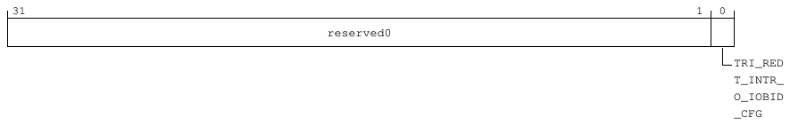

31                                                                                                  1   0
reserved0

TRI_RED
T_INTR_
O_IOBID
_CFG

**Table 9-167: TRI_REDT_INTR_O_IOBID_CFG bit descriptions**

Bits   Name                             Description                                         Reset
[31:1] reserved0                        Reserved                                            0b0000000000000000000000000000000
[0]    TRI_REDT_INTR_O_IOBID_CFG Triple-redundancy PID0/1/2/3 and                 0b0
CID0/1/2/3/4 interrupt output protection status.

Accessibility
Component                       Offset              Instance                                                                 Range
IO_REGBANK                      0xE04              TRI_REDT_INTR_O_IOBID_CFG                                                None

<!-- Source PDF page: 180 -->

9.3.3.20 SID_PID_4, System ID Peripheral ID 4 register
The SID_PID_4 register contains information about the number of blocks that the logic occupies
and the JEDEC JEP106 continuation code for the peripheral.

Configurations
This register is available in all configurations.

Attributes
Width
32
Component
IO_REGBANK
Register offset
0xFD0
Access type
RO
Reset value
0000 0000 0000 0000 0000 0000 0000 0010
|    |    |    |    |    |    |    | |
31   27   23   19   15   11   7    3 0

Bit descriptions
**Figure 9-64: SID_PID_4 bit assignments**

31                                                                           8   7           4   3            0
reserved0                                           SIZE            DES_2

**Table 9-169: SID_PID_4 bit descriptions**

Bits    Name         Description                                                                                                         Reset
[31:8] reserved0 Reserved                                                                                                                0x000000
[7:4]   SIZE         Indicates the memory size that is used by this component. Returns 0 to indicate that the component                  0b0000
uses an UNKNOWN number of 4KB blocks. Using the SIZE field to indicate the size of the component is
deprecated.
[3:0]   DES_2        JEP106 continuation code. Together with PIDR2.DES_1 and PIDR1.DES_0, they indicate the designer of                  0b0010
the component and not the implementer, except where the two are the same.

Accessibility
Component                                          Offset                      Instance                                      Range
IO_REGBANK                                         0xFD0                      SID_PID_4                                     None

<!-- Source PDF page: 181 -->

9.3.3.21 SID_PID_0, System ID Peripheral ID 0 register
The SID_PID_0 register contains the first eight bits of the identifier for the peripheral.

Configurations
This register is available in all configurations.

Attributes
Width
32
Component
IO_REGBANK
Register offset
0xFE0
Access type
RO
Reset value
0000 0000 0000 0000 0000 0000 0000 0000
|    |    |    |    |    |    |    | |
31   27   23   19   15   11   7    3 0

Bit descriptions
**Figure 9-65: SID_PID_0 bit assignments**

31                                                                            8   7                       0
reserved0                                              PART_0

**Table 9-171: SID_PID_0 bit descriptions**

Bits    Name       Description                                                                                                    Reset
[31:8] reserved0 Reserved                                                                                                         0x000000
[7:0]   PART_0     Specifies bits [7:0] of the part identifier for the peripheral. The value is defined by the implementation.       0x00

Accessibility
Component                                        Offset                      Instance                               Range
IO_REGBANK                                       0xFE0                      SID_PID_0                              None

<!-- Source PDF page: 182 -->

9.3.3.22 SID_PID_1, System ID Peripheral ID 1 register
The SID_PID_1 register contains the first four bits of the JEDEC JEP106 identity code and the
second four bits of the identifier for the peripheral.

Configurations
This register is available in all configurations.

Attributes
Width
32
Component
IO_REGBANK
Register offset
0xFE4
Access type
RO
Reset value
0000 0000 0000 1011 0000 0000 0000 0000
|    |    |    |    |    |    |    | |
31   27   23   19   15   11   7    3 0

Bit descriptions
**Figure 9-66: SID_PID_1 bit assignments**

31                       24 23                     16 15                                                0
reserved0                       DES_0                                PART1

**Table 9-173: SID_PID_1 bit descriptions**

Bits      Name             Description                                                                                             Reset
[31:24]   reserved0        Reserved                                                                                                0x00
[23:16]   DES_0            Specifies bits [3:0] of the JEDEC JEP106 identity code for the peripheral. Set to 0xB.                   0x0B
[15:0]    PART1            Specifies bits [11:8] of the part identifier for the peripheral. IMPLEMENTATION DEFINED.                  0x0000

Accessibility
Component                                              Offset                  Instance                               Range
IO_REGBANK                                             0xFE4                  SID_PID_1                              None

<!-- Source PDF page: 183 -->

9.3.3.23 SID_PID_2, System ID Peripheral ID 2 register
The SID_PID_2 register specifies whether the JEDEC JEP106 identification scheme is in use and
contains parts of the peripheral JEP106 designer code and block version.

Configurations
This register is available in all configurations.

Attributes
Width
32
Component
IO_REGBANK
Register offset
0xFE8
Access type
RO
Reset value
0000 0000 0000 0000 0000 0000 0000 1011
|    |    |    |    |    |    |    | |
31   27   23   19   15   11   7    3 0

Bit descriptions
**Figure 9-67: SID_PID_2 bit assignments**

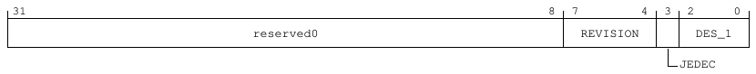

31                                                                           8   7              4   3    2           0
reserved0                                          REVISION                DES_1

JEDEC

**Table 9-175: SID_PID_2 bit descriptions**

Bits    Name        Description                                                                                                              Reset
[31:8] reserved0    Reserved                                                                                                                 0x000000
[7:4]   REVISION    Specifies the major revision number for the block. IMPLEMENTATION DEFINED.                                                0b0000
[3]     JEDEC       Specifies whether the JEDEC JEP106 identification scheme is in use. Set to 0x1.                                            0b1
[2:0]   DES_1       Specifies bits [6:4] of the JEDEC JEP106 designer code for the peripheral. Set to 0x3 for Arm.                            0b011

Accessibility
Component                                        Offset                     Instance                                     Range
IO_REGBANK                                       0xFE8                     SID_PID_2                                    None

<!-- Source PDF page: 184 -->

9.3.3.24 SID_PID_3, System ID Peripheral ID 3 register
The SID_PID_3 register provides information about any modifications to the peripheral, minor
manufacturer revision and customer modification number.

Configurations
This register is available in all configurations.

Attributes
Width
32
Component
IO_REGBANK
Register offset
0xFEC
Access type
RO
Reset value
0000 0000 0000 0000 0000 0000 0000 0000
|    |    |    |    |    |    |    | |
31   27   23   19   15   11   7    3 0

Bit descriptions
**Figure 9-68: SID_PID_3 bit assignments**

31                                                                          8   7             4   3          0
reserved0                                           REVAND           CMOD

**Table 9-177: SID_PID_3 bit descriptions**

Bits    Name       Description                                                                                                        Reset
[31:8] reserved0 Reserved                                                                                                             0x000000
[7:4]   REVAND Manufacturer revision number. This field indicates minor errata fixes specific to this design, for example,               0b0000
metal fixes after implementation.
[3:0]   CMOD       Customer modification number. Incremented on authorized customer modifications.                                      0b0000

Accessibility
Component                                        Offset                     Instance                                    Range
IO_REGBANK                                       0xFEC                     SID_PID_3                                   None

<!-- Source PDF page: 185 -->

9.3.3.25 COMPID0, System ID Component ID 0 register
The COMPID0 register contains segment 0 of the preamble to the system ID component class
identifier.

Configurations
This register is available in all configurations.

Attributes
Width
32
Component
IO_REGBANK
Register offset
0xFF0
Access type
RO
Reset value
0000 0000 0000 0000 0000 0000 0000 1101
|    |    |    |    |    |    |    | |
31   27   23   19   15   11   7    3 0

Bit descriptions
**Figure 9-69: COMPID0 bit assignments**

31                                                                           8   7                     0
reserved0                                             PRMBL_0

**Table 9-179: COMPID0 bit descriptions**

Bits    Name        Description                                                                                                Reset
[31:8] reserved0    Reserved                                                                                                   0x000000
[7:0]   PRMBL_0     Specifies segment 0 of the preamble to the code that identifies the system ID component class.               0x0D

Accessibility
Component                                        Offset                     Instance                               Range
IO_REGBANK                                       0xFF0                     COMPID0                                None

<!-- Source PDF page: 186 -->

9.3.3.26 COMPID1, System ID Component ID 1 register
The COMPID1 register contains segment 1 of the preamble to the system ID component class
identifier and the class code.

Configurations
This register is available in all configurations.

Attributes
Width
32
Component
IO_REGBANK
Register offset
0xFF4
Access type
RO
Reset value
0000 0000 0000 0000 0000 0000 1111 0000
|    |    |    |    |    |    |    | |
31   27   23   19   15   11   7    3 0

Bit descriptions
**Figure 9-70: COMPID1 bit assignments**

31                                                                           8   7            4   3             0
reserved0                                           CLASS           PRMBL_1

**Table 9-181: COMPID1 bit descriptions**

Bits    Name        Description                                                                                                         Reset
[31:8] reserved0    Reserved                                                                                                            0x000000
[7:4]   CLASS       Specifies a code that identifies the system ID component class.                                                       0b1111
[3:0]   PRMBL_1     Specifies segment 1 of the preamble to the code that identifies the system ID component class.                        0b0000

Accessibility
Component                                        Offset                     Instance                                   Range
IO_REGBANK                                       0xFF4                     COMPID1                                    None

<!-- Source PDF page: 187 -->

9.3.3.27 COMPID2, System ID Component ID 2 register
The COMPID2 register contains segment 2 of the preamble to the system ID component class
identifier.

Configurations
This register is available in all configurations.

Attributes
Width
32
Component
IO_REGBANK
Register offset
0xFF8
Access type
RO
Reset value
0000 0000 0000 0000 0000 0000 0000 0101
|    |    |    |    |    |    |    | |
31   27   23   19   15   11   7    3 0

Bit descriptions
**Figure 9-71: COMPID2 bit assignments**

31                                                                           8   7                     0
reserved0                                             PRMBL_2

**Table 9-183: COMPID2 bit descriptions**

Bits    Name        Description                                                                                                Reset
[31:8] reserved0    Reserved                                                                                                   0x000000
[7:0]   PRMBL_2     Specifies segment 2 of the preamble to the code that identifies the system ID component class.               0x05

Accessibility
Component                                        Offset                     Instance                               Range
IO_REGBANK                                       0xFF8                     COMPID2                                None

<!-- Source PDF page: 188 -->

9.3.3.28 COMPID3, System ID Component ID 3 register
The COMPID3 register contains segment 3 of the preamble to the system ID component class
identifier.

Configurations
This register is available in all configurations.

Attributes
Width
32
Component
IO_REGBANK
Register offset
0xFFC
Access type
RO
Reset value
0000 0000 0000 0000 0000 0000 1011 0001
|    |    |    |    |    |    |    | |
31   27   23   19   15   11   7    3 0

Bit descriptions
**Figure 9-72: COMPID3 bit assignments**

31                                                                           8   7                     0
reserved0                                             PRMBL_3

**Table 9-185: COMPID3 bit descriptions**

Bits    Name        Description                                                                                                Reset
[31:8] reserved0    Reserved                                                                                                   0x000000
[7:0]   PRMBL_3     Specifies segment 3 of the preamble to the code that identifies the system ID component class.               0xB1

Accessibility
Component                                        Offset                     Instance                               Range
IO_REGBANK                                       0xFFC                     COMPID3                                None

<!-- Source PDF page: 189 -->

### 9.3.4 CSS_RGM registers summary
The CSS_RGM register block provides APB registers to monitor and manage resets.

The following summary table provides an overview of IMPLEMENTATION DEFINED memory-mapped
CSS_RGM registers.

For more information on registers listed in the table, click on the link associated with the register
name.

For registers without a listed reset value, refer to the individual field resets documented on the
register description pages.

**Table 9-187: CSS_RGM registers summary**

Offset    Name                              Reset                Width      Description
0x10     RGM_CTRL                          0x00000000           32-bit     Reset Generation Manager Control register
0x20     RGM_RST_SYNDROME                  0x00000000           32-bit     RGM Reset Syndrome register
0x30     RGM_RST_MASK                      0x00000000           32-bit     RGM Reset Mask register
0xE00    TRI_REDT_INTR                     0x00000000           32-bit     Triple Redundancy Interrupt register
0xFC0    PIK_CONFIG                        0x00000001           32-bit     Power Integration Kit Configuration register
0xFD0    SID_PID_4                         0x00000002           32-bit     System ID Peripheral ID 4 register
0xFE0    SID_PID_0                         0x00000000           32-bit     System ID Peripheral ID 0 register
0xFE4    SID_PID_1                         0x000B0000           32-bit     System ID Peripheral ID 1 register
0xFE8    SID_PID_2                         0x0000000B           32-bit     System ID Peripheral ID 2 register
0xFEC    SID_PID_3                         0x00000000           32-bit     System ID Peripheral ID 3 register
0xFF0    COMPID0                           0x0000000D           32-bit     System ID Component ID 0 register
0xFF4    COMPID1                           0x000000F0           32-bit     System ID Component ID 1 register
0xFF8    COMPID2                           0x00000005           32-bit     System ID Component ID 2 register
0xFFC    COMPID3                           0x000000B1           32-bit     System ID Component ID 3 register

9.3.4.1 RGM_CTRL, Reset Generation Manager Control register
Reset Generation Manager Control Register

Configurations
This register is available in all configurations.

Attributes
Width
32
Component
CSS_RGM

<!-- Source PDF page: 190 -->

Register offset
0x10
Access type
RO
Reset value
0000 0000 0000 0000 0000 0000 0000 0000
|    |    |    |    |    |    |    | |
31   27   23   19   15   11   7    3 0

Bit descriptions
**Figure 9-73: RGM_CTRL bit assignments**

31                                                                                                      0
reserved0

**Table 9-188: RGM_CTRL bit descriptions**

Bits                 Name                             Description                             Reset
[31:0]               reserved0                        Reserved                                0x00000000

Accessibility
Component                                  Offset                      Instance                                    Range
CSS_RGM                                    0x10                       RGM_CTRL                                    None

9.3.4.2 RGM_RST_SYNDROME, RGM Reset Syndrome register
The RGM_RST_SYNDROME register stores the request or reason for reset.

Configurations
This register is available in all configurations.

Attributes
Width
32
Component
CSS_RGM
Register offset
0x20
Access type
RW

<!-- Source PDF page: 191 -->

Reset value
0000 0000 0000 0000 0000 0000 0000 0000
|    |    |    |    |    |    |    | |
31   27   23   19   15   11   7    3 0

Bit descriptions
**Figure 9-74: RGM_RST_SYNDROME bit assignments**

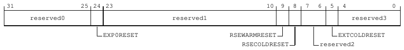

31                  25 24 23                                          10   9   8   7   6   5   4               0
reserved0                              reserved1                                             reserved3

EXP0RESET                          RSEWARMRESET                    EXTCOLDRESET
RSECOLDRESET            reserved2

**Table 9-190: RGM_RST_SYNDROME bit descriptions**

Bits      Name                        Description                                                              Reset
[31:25]   reserved0                   Reserved                                                                 0b0000000
[24]      EXP0RESET                   Expansion 0 Initiated Reset                                              0b0
[23:10]   reserved1                   Reserved                                                                 0b00000000000000
[9]       RSEWARMRESET                RSE Initiated Warm Reset (Hosted Subsystem 0)                            0b0
[8]       RSECOLDRESET                RSE Initiated Cold Reset (Hosted Subsystem 0)                            0b0
[7:6]     reserved2                   Reserved                                                                 0b00
[5]       EXTCOLDRESET                External Cold Reset Request                                              0b0
[4:0]     reserved3                   Reserved                                                                 0b00000

Accessibility
Component                        Offset                Instance                                                               Range
CSS_RGM                          0x20                 RGM_RST_SYNDROME                                                       None

9.3.4.3 RGM_RST_MASK, RGM Reset Mask register
The RGM_RST_MASK enables or disables requests to generate resets.

Configurations
This register is available in all configurations.

Attributes
Width
32
Component
CSS_RGM
Register offset
0x30

<!-- Source PDF page: 192 -->

Access type
RW
Reset value
0000 0000 0000 0000 0000 0000 0000 0000
|    |    |    |    |    |    |    | |
31   27   23   19   15   11   7    3 0

Bit descriptions
**Figure 9-75: RGM_RST_MASK bit assignments**

31                  25 24 23                                                                            0
reserved0                                             reserved1

EXP0RESETEN

**Table 9-192: RGM_RST_MASK bit descriptions**

Bits           Name                            Description                                                       Reset
[31:25]        reserved0                       Reserved                                                          0b0000000
[24]           EXP0RESETEN                     Expansion 0 Initiated Reset Enable                                0b0
[23:0]         reserved1                       Reserved                                                          0x000000

Accessibility
Component                              Offset                  Instance                                               Range
CSS_RGM                                0x30                   RGM_RST_MASK                                           None

9.3.4.4 TRI_REDT_INTR, Triple Redundancy Interrupt register
The TRI_REDT_INTR register provides information about triple redundancy interrupts for various
RGM registers.

Configurations
This register is available in all configurations.

Attributes
Width
32
Component
CSS_RGM
Register offset
0xE00
Access type
RO

<!-- Source PDF page: 193 -->

Reset value
0000 0000 0000 0000 0000 0000 0000 0000
|    |    |    |    |    |    |    | |
31   27   23   19   15   11   7    3 0

Bit descriptions
**Figure 9-76: TRI_REDT_INTR bit assignments**

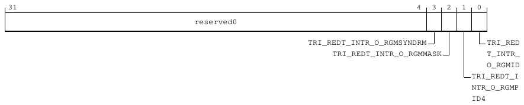

31                                                                                        4   3   2   1    0
reserved0

TRI_REDT_INTR_O_RGMSYNDRM                   TRI_RED
TRI_REDT_INTR_O_RGMMASK                T_INTR_
O_RGMID
TRI_REDT_I
NTR_O_RGMP
ID4

**Table 9-194: TRI_REDT_INTR bit descriptions**

Bits   Name                                  Description                                                                           Reset
[31:4] reserved0                             Reserved                                                                              0x0000000
[3]    TRI_REDT_INTR_O_RGMSYNDRM             Volatile. Triple redundancy interrupt for RGM_RST_SYNDROME register                   0b0
[2]    TRI_REDT_INTR_O_RGMMASK               Volatile. Triple redundancy interrupt for RGM_RST_MASK register                       0b0
[1]    TRI_REDT_INTR_O_RGMPID4               Volatile. Triple redundancy interrupt for RGM peripheral ID registers                 0b0
[0]    TRI_REDT_INTR_O_RGMID                 Volatile. Triple redundancy interrupt for RGM component ID registers                  0b0

Accessibility
Component                              Offset                    Instance                                              Range
CSS_RGM                                0xE00                    TRI_REDT_INTR                                         None

9.3.4.5 PIK_CONFIG, Power Integration Kit Configuration register
The PIK_CONFIG register controls power integration and logic configuration.

Configurations
This register is available in all configurations.

Attributes
Width
32
Component
CSS_RGM
Register offset
0xFC0

<!-- Source PDF page: 194 -->

Access type
RO
Reset value
0000 0000 0000 0000 0000 0000 0000 0001
|    |    |    |    |    |    |    | |
31   27   23   19   15   11   7    3 0

Bit descriptions
**Figure 9-77: PIK_CONFIG bit assignments**

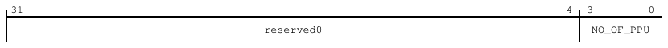

31                                                                                       4   3            0
reserved0                                           NO_OF_PPU

**Table 9-196: PIK_CONFIG bit descriptions**

Bits     Name               Description                                                                                       Reset
[31:4]   reserved0          Reserved                                                                                          0x0000000
[3:0]    NO_OF_PPU          Volatile. Defines the number of PPUs in the power integration region.                              0b0001

Accessibility
Component                                 Offset                     Instance                                          Range
CSS_RGM                                   0xFC0                     PIK_CONFIG                                        None

9.3.4.6 SID_PID_4, System ID Peripheral ID 4 register
The SID_PID_4 register contains information about the number of address blocks that the logic
occupies and the JEDEC JEP106 configuration code for the peripheral.

Configurations
This register is available in all configurations.

Attributes
Width
32
Component
CSS_RGM
Register offset
0xFD0
Access type
RO

<!-- Source PDF page: 195 -->

Reset value
0000 0000 0000 0000 0000 0000 0000 0010
|    |    |    |    |    |    |    | |
31   27   23   19   15   11   7    3 0

Bit descriptions
**Figure 9-78: SID_PID_4 bit assignments**

31                                                                           8   7           4   3           0
reserved0                                           SIZE           DES_2

**Table 9-198: SID_PID_4 bit descriptions**

Bits    Name         Description                                                                                                        Reset
[31:8] reserved0 Reserved                                                                                                               0x000000
[7:4]   SIZE         Indicates the memory size that is used by this component. Returns 0 indicating that the component                  0b0000
uses an UNKNOWN number of 4KB blocks. Using the SIZE field to indicate the size of the component is
deprecated.
[3:0]   DES_2        JEP106 continuation code. Together, with PIDR2.DES_1 and PIDR1.DES_0, they indicate the designer of                0b0010
the component and not the implementer, except where the 2 are the same.

Accessibility
Component                                      Offset                       Instance                                     Range
CSS_RGM                                        0xFD0                       SID_PID_4                                    None

9.3.4.7 SID_PID_0, System ID Peripheral ID 0 register
The SID_PID_0 register contains the first eight bits of the identifier for the peripheral.

Configurations
This register is available in all configurations.

Attributes
Width
32
Component
CSS_RGM
Register offset
0xFE0
Access type
RO

<!-- Source PDF page: 196 -->

Reset value
0000 0000 0000 0000 0000 0000 0000 0000
|    |    |    |    |    |    |    | |
31   27   23   19   15   11   7    3 0

Bit descriptions
**Figure 9-79: SID_PID_0 bit assignments**

31                                                                            8   7                       0
reserved0                                              PART_0

**Table 9-200: SID_PID_0 bit descriptions**

Bits    Name       Description                                                                                                    Reset
[31:8] reserved0 Reserved                                                                                                         0x000000
[7:0]   PART_0     Specifies bits [7:0] of the part identifier for the peripheral. The value is defined by the implementation.       0x00

Accessibility
Component                                    Offset                      Instance                                  Range
CSS_RGM                                      0xFE0                      SID_PID_0                                 None

9.3.4.8 SID_PID_1, System ID Peripheral ID 1 register
The SID_PID_1 register contains the first four bits of the JEDEC JEP106 identity code and the
second four bits of the identifier for the peripheral.

Configurations
This register is available in all configurations.

Attributes
Width
32
Component
CSS_RGM
Register offset
0xFE4
Access type
RO
Reset value
0000 0000 0000 1011 0000 0000 0000 0000
|    |    |    |    |    |    |    | |
31   27   23   19   15   11   7    3 0

<!-- Source PDF page: 197 -->

Bit descriptions
**Figure 9-80: SID_PID_1 bit assignments**

31                       24 23                     16 15                                                0
reserved0                    DES_0                                   PART1

**Table 9-202: SID_PID_1 bit descriptions**

Bits      Name             Description                                                                                             Reset
[31:24]   reserved0        Reserved                                                                                                0x00
[23:16]   DES_0            Specifies bits [3:0] of the JEDEC JEP106 identity code for the peripheral. Set to 0xB.                   0x0B
[15:0]    PART1            Specifies bits [11:8] of the part identifier for the peripheral. IMPLEMENTATION DEFINED.                  0x0000

Accessibility
Component                                       Offset                      Instance                                 Range
CSS_RGM                                         0xFE4                      SID_PID_1                                None

9.3.4.9 SID_PID_2, System ID Peripheral ID 2 register
The SID_PID_2 register specifies whether the JEDEC JEP106 identification scheme is in use, and
contains parts of the peripheral JEP106 designer code and block version.

Configurations
This register is available in all configurations.

Attributes
Width
32
Component
CSS_RGM
Register offset
0xFE8
Access type
RO
Reset value
0000 0000 0000 0000 0000 0000 0000 1011
|    |    |    |    |    |    |    | |
31   27   23   19   15   11   7    3 0

<!-- Source PDF page: 198 -->

Bit descriptions
**Figure 9-81: SID_PID_2 bit assignments**

31                                                                           8   7              4   3    2           0
reserved0                                          REVISION                DES_1

JEDEC

**Table 9-204: SID_PID_2 bit descriptions**

Bits    Name        Description                                                                                                              Reset
[31:8] reserved0    Reserved                                                                                                                 0x000000
[7:4]   REVISION    Specifies the major revision number for the block. IMPLEMENTATION DEFINED.                                                0b0000
[3]     JEDEC       Specifies whether the JEDEC JEP106 identification scheme is in use. Set to 0x1.                                            0b1
[2:0]   DES_1       Specifies bits [6:4] of the JEDEC JEP106 designer code for the peripheral. Set to 0x3 for Arm.                            0b011

Accessibility
Component                                   Offset                       Instance                                        Range
CSS_RGM                                     0xFE8                       SID_PID_2                                       None

9.3.4.10 SID_PID_3, System ID Peripheral ID 3 register
The SID_PID_3 register provides information about any modifications to the peripheral.

Configurations
This register is available in all configurations.

Attributes
Width
32
Component
CSS_RGM
Register offset
0xFEC
Access type
RO
Reset value
0000 0000 0000 0000 0000 0000 0000 0000
|    |    |    |    |    |    |    | |
31   27   23   19   15   11   7    3 0

<!-- Source PDF page: 199 -->

Bit descriptions
**Figure 9-82: SID_PID_3 bit assignments**

31                                                                          8   7             4   3          0
reserved0                                           REVAND           CMOD

**Table 9-206: SID_PID_3 bit descriptions**

Bits    Name       Description                                                                                                        Reset
[31:8] reserved0 Reserved                                                                                                             0x000000
[7:4]   REVAND Manufacturer revision number. This field indicates minor errata fixes specific to this design, for example,               0b0000
metal fixes after implementation.
[3:0]   CMOD       Customer modification number. Incremented on authorized customer modifications.                                      0b0000

Accessibility
Component                                   Offset                       Instance                                       Range
CSS_RGM                                     0xFEC                       SID_PID_3                                      None

9.3.4.11 COMPID0, System ID Component ID 0 register
The COMPID0 register contains segment 0 of the preamble to the system ID component class
identifier.

Configurations
This register is available in all configurations.

Attributes
Width
32
Component
CSS_RGM
Register offset
0xFF0
Access type
RO
Reset value
0000 0000 0000 0000 0000 0000 0000 1101
|    |    |    |    |    |    |    | |
31   27   23   19   15   11   7    3 0

<!-- Source PDF page: 200 -->

Bit descriptions
**Figure 9-83: COMPID0 bit assignments**

31                                                                           8   7                     0
reserved0                                             PRMBL_0

**Table 9-208: COMPID0 bit descriptions**

Bits    Name        Description                                                                                                Reset
[31:8] reserved0    Reserved                                                                                                   0x000000
[7:0]   PRMBL_0     Specifies segment 0 of the preamble to the code that identifies the system ID component class.               0x0D

Accessibility
Component                                    Offset                      Instance                                 Range
CSS_RGM                                      0xFF0                      COMPID0                                  None

9.3.4.12 COMPID1, System ID Component ID 1 register
The COMPID1 register contains segment 1 of the preamble and the system ID component class
identifier.

Configurations
This register is available in all configurations.

Attributes
Width
32
Component
CSS_RGM
Register offset
0xFF4
Access type
RO
Reset value
0000 0000 0000 0000 0000 0000 1111 0000
|    |    |    |    |    |    |    | |
31   27   23   19   15   11   7    3 0

<!-- Source PDF page: 201 -->

Bit descriptions
**Figure 9-84: COMPID1 bit assignments**

31                                                                           8   7            4   3             0
reserved0                                           CLASS           PRMBL_1

**Table 9-210: COMPID1 bit descriptions**

Bits    Name        Description                                                                                                         Reset
[31:8] reserved0    Reserved                                                                                                            0x000000
[7:4]   CLASS       Specifies a code that identifies the system ID component class.                                                       0b1111
[3:0]   PRMBL_1     Specifies segment 1 of the preamble to the code that identifies the system ID component class.                        0b0000

Accessibility
Component                                    Offset                      Instance                                      Range
CSS_RGM                                      0xFF4                      COMPID1                                       None

9.3.4.13 COMPID2, System ID Component ID 2 register
The COMPID2 register contains segment 2 of the preamble to the system ID component class
identifier.

Configurations
This register is available in all configurations.

Attributes
Width
32
Component
CSS_RGM
Register offset
0xFF8
Access type
RO
Reset value
0000 0000 0000 0000 0000 0000 0000 0101
|    |    |    |    |    |    |    | |
31   27   23   19   15   11   7    3 0

<!-- Source PDF page: 202 -->

Bit descriptions
**Figure 9-85: COMPID2 bit assignments**

31                                                                           8   7                     0
reserved0                                             PRMBL_2

**Table 9-212: COMPID2 bit descriptions**

Bits    Name        Description                                                                                                Reset
[31:8] reserved0    Reserved                                                                                                   0x000000
[7:0]   PRMBL_2     Specifies segment 2 of the preamble to the code that identifies the system ID component class.               0x05

Accessibility
Component                                    Offset                      Instance                                 Range
CSS_RGM                                      0xFF8                      COMPID2                                  None

9.3.4.14 COMPID3, System ID Component ID 3 register
The COMPID3 register contains segment 3 of the preamble to the system ID component class
identifier.

Configurations
This register is available in all configurations.

Attributes
Width
32
Component
CSS_RGM
Register offset
0xFFC
Access type
RO
Reset value
0000 0000 0000 0000 0000 0000 1011 0001
|    |    |    |    |    |    |    | |
31   27   23   19   15   11   7    3 0

<!-- Source PDF page: 203 -->

Bit descriptions
**Figure 9-86: COMPID3 bit assignments**

31                                                                           8   7                     0
reserved0                                             PRMBL_3

**Table 9-214: COMPID3 bit descriptions**

Bits    Name        Description                                                                                                Reset
[31:8] reserved0    Reserved                                                                                                   0x000000
[7:0]   PRMBL_3     Specifies segment 3 of the preamble to the code that identifies the system ID component class.               0xB1

Accessibility
Component                                    Offset                      Instance                                 Range
CSS_RGM                                      0xFFC                      COMPID3                                  None

### 9.3.5 SMD_CSR registers summary
The SMD_CSR block provides configuration control for each TBU’s micro-TLB (uTLB) cache
replacement policy, with built-in parity protection for reliability. It also includes registers that define
the upper and base Stream ID bits, enabling identification of the transaction source. In addition, the
block contains standard Peripheral ID and Component ID registers used for system-level peripheral
recognition and component classification.

The following summary table provides an overview of IMPLEMENTATION DEFINED memory-mapped
smd_csr registers.

For more information on registers listed in the table, click on the link associated with the register
name.

For registers without a listed reset value, refer to the individual field resets documented on the
register description pages.

**Table 9-216: SMD_CSR registers summary**

Offset     Name                      Reset                Width      Description
0x0       IO_MMU_CFG                0x00000AA8           32-bit     SMMU TBU Configuration register
0x4       IO_TBU_NS_SID             0x1C8EAC78           32-bit     SMMU TBU Non-secure SID Configuration register
0x8       IO_TBU_S_SID              0x1C8EAC78           32-bit     SMMU TBU Secure SID Configuration register
0xC       IO_TCU_SID                0x00000000           32-bit     Translation Control Unit (TCU) Stream ID register
0x10      IO_TCU_SID_CHK            0xFFFFFFFF           32-bit     IO_TCU_SID Parity (chk) register
0xFD0     SID_PID_4                 0x00000002           32-bit     System ID Peripheral ID 4 register
0xFE0     SID_PID_0                 0x00000000           32-bit     System ID Peripheral ID 0 register
0xFE4     SID_PID_1                 0x000B0000           32-bit     System ID Peripheral ID 1 register

<!-- Source PDF page: 204 -->

Offset   Name                    Reset                Width      Description
0xFE8   SID_PID_2               0x0000000B           32-bit     System ID Peripheral ID 2 register
0xFEC   SID_PID_3               0x00000000           32-bit     System ID Peripheral ID 3 register
0xFF0   COMPID0                 0x0000000D           32-bit     System ID Component ID 0 register
0xFF4   COMPID1                 0x000000F0           32-bit     System ID Component ID 1 register
0xFF8   COMPID2                 0x00000005           32-bit     System ID Component ID 2 register
0xFFC   COMPID3                 0x000000B1           32-bit     System ID Component ID 3 register

9.3.5.1 IO_MMU_CFG, SMMU TBU Configuration register
The IO_MMU_CFG register enables round-robin selection for the micro Translation Lookaside
Buffers (uTLBs) in each Translation Buffer Unit (TBU) and includes parity check bits for the related
control fields.

Configurations
This register is available in all configurations.

Attributes
Width
32
Component
SMD_CSR
Register offset
0x0
Access type
RW
Reset value
0000 0000 0000 0000 0000 1010 1010 1000
|    |    |    |    |    |    |    | |
31   27   23   19   15   11   7    3 0

<!-- Source PDF page: 205 -->

Bit descriptions
**Figure 9-87: IO_MMU_CFG bit assignments**

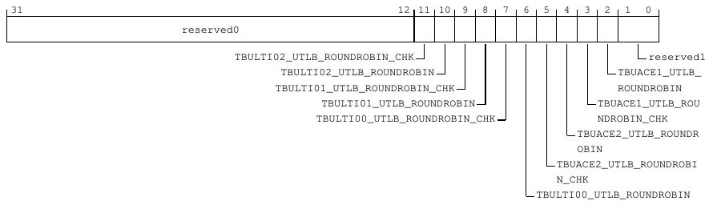

31                                                           12 11 10   9   8   7   6    5   4   3   2   1   0
reserved0

TBULTI02_UTLB_ROUNDROBIN_CHK                                            reserved1
TBULTI02_UTLB_ROUNDROBIN                                    TBUACE1_UTLB_
TBULTI01_UTLB_ROUNDROBIN_CHK                                 ROUNDROBIN
TBULTI01_UTLB_ROUNDROBIN                          TBUACE1_UTLB_ROU
TBULTI00_UTLB_ROUNDROBIN_CHK                       NDROBIN_CHK
TBUACE2_UTLB_ROUNDR
OBIN
TBUACE2_UTLB_ROUNDROBI
N_CHK
TBULTI00_UTLB_ROUNDROBIN

**Table 9-217: IO_MMU_CFG bit descriptions**

Bits      Name                                          Description                                                                    Reset
[31:12]   reserved0                                     Reserved.                                                                      0x00000
[11]      TBULTI02_UTLB_ROUNDROBIN_CHK                  Parity check bit for TBULTI02_utlb_roundrobin.                                 0b1
[10]      TBULTI02_UTLB_ROUNDROBIN                      Enable round-robin uTLB selection for TBULTI02 interface:                      0b0
•     0b0 - Disabled
•     0b1 - Enabled
[9]       TBULTI01_UTLB_ROUNDROBIN_CHK                  Parity check bit for TBULTI01_utlb_roundrobin.                                 0b1
[8]       TBULTI01_UTLB_ROUNDROBIN                      Enable round-robin uTLB selection for TBULTI01 interface:                      0b0
•     0b0 - Disabled
•     0b1 - Enabled
[7]       TBULTI00_UTLB_ROUNDROBIN_CHK                  Parity check bit for TBULTI00_utlb_roundrobin.                                 0b1
[6]       TBULTI00_UTLB_ROUNDROBIN                      Enable round-robin uTLB selection for TBULTI00 interface:                      0b0
•     0b0 - Disabled
•     0b1 - Enabled
[5]       TBUACE2_UTLB_ROUNDROBIN_CHK                   Parity check bit for TBUACE2_utlb_roundrobin.                                  0b1
[4]       TBUACE2_UTLB_ROUNDROBIN                       Enable round-robin uTLB selection for TBU ACE2 interface:                      0b0
•     0b0 - Disabled
•     0b1 - Enabled
[3]       TBUACE1_UTLB_ROUNDROBIN_CHK                   Parity check bit for TBUACE1_utlb_roundrobin.                                  0b1
[2]       TBUACE1_UTLB_ROUNDROBIN                       Enable round-robin uTLB selection for TBU ACE1 interface:                      0b0
•     0b0 - Disabled
•     0b1 - Enabled
[1:0]     reserved1                                     Reserved                                                                       0b00

Accessibility
Component                               Offset                    Instance                                                  Range
SMD_CSR                                 0x0                      IO_MMU_CFG                                                None

<!-- Source PDF page: 206 -->

9.3.5.2 IO_TBU_NS_SID, SMMU TBU Non-secure SID Configuration register
The IO_TBU_NS_SID register is used for Non-secure Stream ID (SID) high-bit configuration for
each SMMU TBU interface, with associated parity (chk) fields.

Configurations
This register is available in all configurations.

Attributes
Width
32
Component
SMD_CSR
Register offset
0x4
Access type
RW
Reset value
0001 1100 1000 1110 1010 1100 0111 1000
|    |    |    |    |    |    |    | |
31   27   23   19   15   11   7    3 0

Bit descriptions
**Figure 9-88: IO_TBU_NS_SID bit assignments**

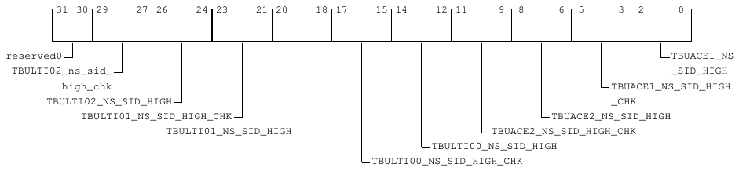

31 30 29     27 26     24 23     21 20     18 17     15 14     12 11      9   8       6   5   3   2     0

reserved0                                                                                                     TBUACE1_NS
TBULTI02_ns_sid_                                                                                             _SID_HIGH
high_chk                                                                                   TBUACE1_NS_SID_HIGH
TBULTI02_NS_SID_HIGH                                                                         _CHK
TBULTI01_NS_SID_HIGH_CHK                                                     TBUACE2_NS_SID_HIGH
TBULTI01_NS_SID_HIGH                                 TBUACE2_NS_SID_HIGH_CHK
TBULTI00_NS_SID_HIGH
TBULTI00_NS_SID_HIGH_CHK

**Table 9-219: IO_TBU_NS_SID bit descriptions**

Bits      Name                                       Description                                                               Reset
[31:30]   reserved0                                  Reserved                                                                  0b00
[29:27]   TBULTI02_NS_SID_HIGH_CHK                   Parity check bits for TBULTI02_NS_SID_HIGH.                               0b011
[26:24]   TBULTI02_NS_SID_HIGH                       High SID bits for TBULTI02 Non-secure transactions.                       0b100
[23:21]   TBULTI01_NS_SID_HIGH_CHK                   Parity check bits for TBULTI01_NS_SID_HIGH.                               0b100
[20:18]   TBULTI01_NS_SID_HIGH                       High SID bits for TBULTI01 Non-secure transactions.                       0b011

<!-- Source PDF page: 207 -->

Bits      Name                                         Description                                                              Reset
[17:15]   TBULTI00_NS_SID_HIGH_CHK                     Parity check bits for TBULTI00_NS_SID_HIGH.                              0b101
[14:12]   TBULTI00_NS_SID_HIGH                         High SID bits for TBULTI00 Non-secure transactions.                      0b010
[11:9]    TBUACE2_NS_SID_HIGH_CHK                      Parity check bits for TBUACE2_NS_SID_HIGH.                               0b110
[8:6]     TBUACE2_NS_SID_HIGH                          High SID bits for ACE2 Non-secure transactions.                          0b001
[5:3]     TBUACE1_NS_SID_HIGH_CHK                      Parity check bits for TBUACE1_NS_SID_HIGH.                               0b111
[2:0]     TBUACE1_NS_SID_HIGH                          High SID bits for ACE1 Non-secure transactions.                          0b000

Accessibility
Component                              Offset                  Instance                                              Range
SMD_CSR                                0x4                    IO_TBU_NS_SID                                         None

9.3.5.3 IO_TBU_S_SID, SMMU TBU Secure SID Configuration register
The IO_TBU_S_SID register is used for Secure SID high-bit configuration for each SMMU TBU
interface, with associated parity (chk) fields.

Configurations
This register is available in all configurations.

Attributes
Width
32
Component
SMD_CSR
Register offset
0x8
Access type
RW
Reset value
0001 1100 1000 1110 1010 1100 0111 1000
|    |    |    |    |    |    |    | |
31   27   23   19   15   11   7    3 0

<!-- Source PDF page: 208 -->

Bit descriptions
**Figure 9-89: IO_TBU_S_SID bit assignments**

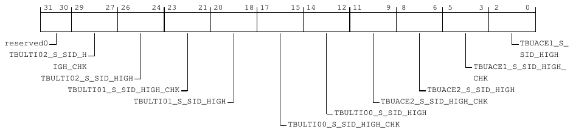

31 30 29     27 26     24 23     21 20     18 17     15 14     12 11      9   8       6   5   3   2       0

reserved0                                                                                                     TBUACE1_S_
TBULTI02_S_SID_H                                                                                             SID_HIGH
IGH_CHK                                                                                   TBUACE1_S_SID_HIGH_
TBULTI02_S_SID_HIGH                                                                         CHK
TBULTI01_S_SID_HIGH_CHK                                                     TBUACE2_S_SID_HIGH
TBULTI01_S_SID_HIGH                                 TBUACE2_S_SID_HIGH_CHK
TBULTI00_S_SID_HIGH
TBULTI00_S_SID_HIGH_CHK

**Table 9-221: IO_TBU_S_SID bit descriptions**

Bits        Name                                        Description                                                               Reset
[31:30]     reserved0                                   Reserved                                                                  0b00
[29:27]     TBULTI02_S_SID_HIGH_CHK                     Parity check bits for TBULTI02_S_SID_HIGH.                                0b011
[26:24]     TBULTI02_S_SID_HIGH                         High SID bits for TBULTI02 Secure transactions.                           0b100
[23:21]     TBULTI01_S_SID_HIGH_CHK                     Parity check bits for TBULTI01_S_SID_HIGH.                                0b100
[20:18]     TBULTI01_S_SID_HIGH                         High SID bits for TBULTI01 Secure transactions.                           0b011
[17:15]     TBULTI00_S_SID_HIGH_CHK                     Parity check bits for TBULTI00_S_SID_HIGH.                                0b101
[14:12]     TBULTI00_S_SID_HIGH                         High SID bits for TBULTI00 Secure transactions.                           0b010
[11:9]      TBUACE2_S_SID_HIGH_CHK                      Parity check bits for TBUACE2_S_SID_HIGH.                                 0b110
[8:6]       TBUACE2_S_SID_HIGH                          High SID bits for ACE2 Secure transactions.                               0b001
[5:3]       TBUACE1_S_SID_HIGH_CHK                      Parity check bits for TBUACE1_S_SID_HIGH.                                 0b111
[2:0]       TBUACE1_S_SID_HIGH                          High SID bits for ACE1 Secure transactions.                               0b000

Accessibility
Component                                Offset                   Instance                                             Range
SMD_CSR                                  0x8                     IO_TBU_S_SID                                         None

9.3.5.4 IO_TCU_SID, Translation Control Unit (TCU) Stream ID register
The IO_TCU_SID register holds the 32-bit base SID value.

Configurations
This register is available in all configurations.

Attributes
Width
32

<!-- Source PDF page: 209 -->

Component
SMD_CSR
Register offset
0xC
Access type
RW
Reset value
0000 0000 0000 0000 0000 0000 0000 0000
|    |    |    |    |    |    |    | |
31   27   23   19   15   11   7    3 0

Bit descriptions
**Figure 9-90: IO_TCU_SID bit assignments**

31                                                                                                     0
IO_TCU_SID

**Table 9-223: IO_TCU_SID bit descriptions**

Bits   Name          Description                                                                                            Reset
[31:0] IO_TCU_SID TCU SID value. Set the IO_TCU_SID and IO_TCU_SID_CHK registers once before you enable                     0x00000000
the fault monitor. If you need to change these values, disable the fault monitor first to prevent
unintended fault detection.

Accessibility
Component                                  Offset                    Instance                                      Range
SMD_CSR                                    0xC                      IO_TCU_SID                                    None

9.3.5.5 IO_TCU_SID_CHK, IO_TCU_SID Parity (chk) register
The IO_TCU_SID_CHK register contains parity bits associated with the TCU SID value. Set the
IO_TCU_SID and IO_TCU_SID_CHK registers once before you enable the fault monitor. If you need
to change these values, disable the fault monitor first to prevent unintended fault detection.

Configurations
This register is available in all configurations.

Attributes
Width
32
Component
SMD_CSR

<!-- Source PDF page: 210 -->

Register offset
0x10
Access type
RW
Reset value
1111 1111 1111 1111 1111 1111 1111 1111
|    |    |    |    |    |    |    | |
31   27   23   19   15   11   7    3 0

Bit descriptions
**Figure 9-91: IO_TCU_SID_CHK bit assignments**

31                                                                                                      0
IO_TCU_SID_CHK

**Table 9-225: IO_TCU_SID_CHK bit descriptions**

Bits         Name                               Description                                                    Reset
[31:0]       IO_TCU_SID_CHK                     Parity check bits for IO_TCU_SID.                              0xFFFFFFFF

Accessibility
Component                            Offset                    Instance                                               Range
SMD_CSR                              0x10                     IO_TCU_SID_CHK                                         None

9.3.5.6 SID_PID_4, System ID Peripheral ID 4 register
The SID_PID_4 register contains information about the number of address blocks that the logic
occupies and the JEDEC JEP106 configuration code for the peripheral.

Configurations
This register is available in all configurations.

Attributes
Width
32
Component
SMD_CSR
Register offset
0xFD0
Access type
RO

<!-- Source PDF page: 211 -->

Reset value
0000 0000 0000 0000 0000 0000 0000 0010
|    |    |    |    |    |    |    | |
31   27   23   19   15   11   7    3 0

Bit descriptions
**Figure 9-92: SID_PID_4 bit assignments**

31                                                                           8   7           4   3           0
reserved0                                           SIZE           DES_2

**Table 9-227: SID_PID_4 bit descriptions**

Bits    Name         Description                                                                                                        Reset
[31:8] reserved0 Reserved                                                                                                               0x000000
[7:4]   SIZE         Indicates the memory size that is used by this component. Returns 0 indicating that the component                  0b0000
uses an UNKNOWN number of 4KB blocks. Using the SIZE field to indicate the size of the component is
deprecated.
[3:0]   DES_2        JEP106 continuation code. Together, with PIDR2.DES_1 and PIDR1.DES_0, they indicate the designer of                0b0010
the component and not the implementer, except where the two are the same.

Accessibility
Component                                      Offset                       Instance                                     Range
SMD_CSR                                        0xFD0                       SID_PID_4                                    None

9.3.5.7 SID_PID_0, System ID Peripheral ID 0 register
The SID_PID_0 register contains the first eight bits of the identifier for the peripheral.

Configurations
This register is available in all configurations.

Attributes
Width
32
Component
SMD_CSR
Register offset
0xFE0
Access type
RO

<!-- Source PDF page: 212 -->

Reset value
0000 0000 0000 0000 0000 0000 0000 0000
|    |    |    |    |    |    |    | |
31   27   23   19   15   11   7    3 0

Bit descriptions
**Figure 9-93: SID_PID_0 bit assignments**

31                                                                            8   7                       0
reserved0                                              PART_0

**Table 9-229: SID_PID_0 bit descriptions**

Bits    Name       Description                                                                                                    Reset
[31:8] reserved0 Reserved                                                                                                         0x000000
[7:0]   PART_0     Specifies bits [7:0] of the part identifier for the peripheral. The value is defined by the implementation.       0x00

Accessibility
Component                                    Offset                      Instance                                  Range
SMD_CSR                                      0xFE0                      SID_PID_0                                 None

9.3.5.8 SID_PID_1, System ID Peripheral ID 1 register
The SID_PID_1 register contains the first four bits of the JEDEC JEP106 identity code and the
second four bits of the identifier for the peripheral.

Configurations
This register is available in all configurations.

Attributes
Width
32
Component
SMD_CSR
Register offset
0xFE4
Access type
RO
Reset value
0000 0000 0000 1011 0000 0000 0000 0000
|    |    |    |    |    |    |    | |
31   27   23   19   15   11   7    3 0

<!-- Source PDF page: 213 -->

Bit descriptions
**Figure 9-94: SID_PID_1 bit assignments**

31                       24 23                     16 15                                                0
reserved0                    DES_0                                   PART1

**Table 9-231: SID_PID_1 bit descriptions**

Bits      Name             Description                                                                                             Reset
[31:24]   reserved0        Reserved                                                                                                0x00
[23:16]   DES_0            Specifies bits [3:0] of the JEDEC JEP106 identity code for the peripheral. Set to 0xB.                   0x0B
[15:0]    PART1            Specifies bits [11:8] of the part identifier for the peripheral. IMPLEMENTATION DEFINED.                  0x0000

Accessibility
Component                                       Offset                      Instance                                 Range
SMD_CSR                                         0xFE4                      SID_PID_1                                None

9.3.5.9 SID_PID_2, System ID Peripheral ID 2 register
The SID_PID_2 register specifies whether the JEDEC JEP106 identification scheme is in use, and
contains parts of the peripheral JEP106 designer code and block version.

Configurations
This register is available in all configurations.

Attributes
Width
32
Component
SMD_CSR
Register offset
0xFE8
Access type
RO
Reset value
0000 0000 0000 0000 0000 0000 0000 1011
|    |    |    |    |    |    |    | |
31   27   23   19   15   11   7    3 0

<!-- Source PDF page: 214 -->

Bit descriptions
**Figure 9-95: SID_PID_2 bit assignments**

31                                                                           8   7              4   3    2           0
reserved0                                          REVISION                DES_1

JEDEC

**Table 9-233: SID_PID_2 bit descriptions**

Bits    Name        Description                                                                                                              Reset
[31:8] reserved0    Reserved                                                                                                                 0x000000
[7:4]   REVISION    Specifies the major revision number for the block. IMPLEMENTATION DEFINED.                                                0b0000
[3]     JEDEC       Specifies whether the JEDEC JEP106 identification scheme is in use. Set to 0x1.                                            0b1
[2:0]   DES_1       Specifies bits [6:4] of the JEDEC JEP106 designer code for the peripheral. Set to 0x3 for Arm.                            0b011

Accessibility
Component                                   Offset                       Instance                                        Range
SMD_CSR                                     0xFE8                       SID_PID_2                                       None

9.3.5.10 SID_PID_3, System ID Peripheral ID 3 register
The SID_PID_3 register provides information about any modifications to the peripheral.

Configurations
This register is available in all configurations.

Attributes
Width
32
Component
SMD_CSR
Register offset
0xFEC
Access type
RO
Reset value
0000 0000 0000 0000 0000 0000 0000 0000
|    |    |    |    |    |    |    | |
31   27   23   19   15   11   7    3 0

<!-- Source PDF page: 215 -->

Bit descriptions
**Figure 9-96: SID_PID_3 bit assignments**

31                                                                          8   7             4   3          0
reserved0                                           REVAND           CMOD

**Table 9-235: SID_PID_3 bit descriptions**

Bits    Name       Description                                                                                                        Reset
[31:8] reserved0 Reserved                                                                                                             0x000000
[7:4]   REVAND Manufacturer revision number. This field indicates minor errata fixes specific to this design, for example,               0b0000
metal fixes after implementation.
[3:0]   CMOD       Customer modification number. Incremented on authorized customer modifications.                                      0b0000

Accessibility
Component                                   Offset                       Instance                                       Range
SMD_CSR                                     0xFEC                       SID_PID_3                                      None

9.3.5.11 COMPID0, System ID Component ID 0 register
The COMPID0 register contains segment 0 of the preamble to the system ID component class
identifier.

Configurations
This register is available in all configurations.

Attributes
Width
32
Component
SMD_CSR
Register offset
0xFF0
Access type
RO
Reset value
0000 0000 0000 0000 0000 0000 0000 1101
|    |    |    |    |    |    |    | |
31   27   23   19   15   11   7    3 0

<!-- Source PDF page: 216 -->

Bit descriptions
**Figure 9-97: COMPID0 bit assignments**

31                                                                           8   7                     0
reserved0                                             PRMBL_0

**Table 9-237: COMPID0 bit descriptions**

Bits    Name        Description                                                                                                Reset
[31:8] reserved0    Reserved                                                                                                   0x000000
[7:0]   PRMBL_0     Specifies segment 0 of the preamble to the code that identifies the system ID component class.               0x0D

Accessibility
Component                                    Offset                      Instance                                 Range
SMD_CSR                                      0xFF0                      COMPID0                                  None

9.3.5.12 COMPID1, System ID Component ID 1 register
The COMPID1 register contains segment 1 of the preamble and the system ID component class
identifier.

Configurations
This register is available in all configurations.

Attributes
Width
32
Component
SMD_CSR
Register offset
0xFF4
Access type
RO
Reset value
0000 0000 0000 0000 0000 0000 1111 0000
|    |    |    |    |    |    |    | |
31   27   23   19   15   11   7    3 0

<!-- Source PDF page: 217 -->

Bit descriptions
**Figure 9-98: COMPID1 bit assignments**

31                                                                           8   7            4   3             0
reserved0                                           CLASS           PRMBL_1

**Table 9-239: COMPID1 bit descriptions**

Bits    Name        Description                                                                                                         Reset
[31:8] reserved0    Reserved                                                                                                            0x000000
[7:4]   CLASS       Specifies a code that identifies the system ID component class.                                                       0b1111
[3:0]   PRMBL_1     Specifies segment 1 of the preamble to the code that identifies the system ID component class.                        0b0000

Accessibility
Component                                    Offset                      Instance                                      Range
SMD_CSR                                      0xFF4                      COMPID1                                       None

9.3.5.13 COMPID2, System ID Component ID 2 register
The COMPID2 register contains segment 2 of the preamble to the system ID component class
identifier.

Configurations
This register is available in all configurations.

Attributes
Width
32
Component
SMD_CSR
Register offset
0xFF8
Access type
RO
Reset value
0000 0000 0000 0000 0000 0000 0000 0101
|    |    |    |    |    |    |    | |
31   27   23   19   15   11   7    3 0

<!-- Source PDF page: 218 -->

Bit descriptions
**Figure 9-99: COMPID2 bit assignments**

31                                                                           8   7                     0
reserved0                                             PRMBL_2

**Table 9-241: COMPID2 bit descriptions**

Bits    Name        Description                                                                                                Reset
[31:8] reserved0    Reserved                                                                                                   0x000000
[7:0]   PRMBL_2     Specifies segment 2 of the preamble to the code that identifies the system ID component class.               0x05

Accessibility
Component                                    Offset                      Instance                                 Range
SMD_CSR                                      0xFF8                      COMPID2                                  None

9.3.5.14 COMPID3, System ID Component ID 3 register
The COMPID3 register contains segment 3 of the preamble to the system ID component class
identifier.

Configurations
This register is available in all configurations.

Attributes
Width
32
Component
SMD_CSR
Register offset
0xFFC
Access type
RO
Reset value
0000 0000 0000 0000 0000 0000 1011 0001
|    |    |    |    |    |    |    | |
31   27   23   19   15   11   7    3 0

<!-- Source PDF page: 219 -->

Bit descriptions
**Figure 9-100: COMPID3 bit assignments**

31                                                                           8   7                     0
reserved0                                             PRMBL_3

**Table 9-243: COMPID3 bit descriptions**

Bits    Name        Description                                                                                                Reset
[31:8] reserved0    Reserved                                                                                                   0x000000
[7:0]   PRMBL_3     Specifies segment 3 of the preamble to the code that identifies the system ID component class.               0xB1

Accessibility
Component                                    Offset                      Instance                                 Range
SMD_CSR                                      0xFFC                      COMPID3                                  None

### 9.3.6 E_CPU_CSR registers summary
The E_CPU_CSR register block provides configuration control for the operating environment
of the CPU. The control and status registers handle data management, instruction execution,
interrupt handling, timer management, power control and protection, and safety and security
control. The block also includes standard Peripheral ID and Component ID registers for system-
level identification.

The following summary table provides an overview of IMPLEMENTATION DEFINED memory-mapped
E_CPU_CSR registers.

For more information on registers listed in the table, click on the link associated with the register
name.

For registers without a listed reset value, refer to the individual field resets documented on the
register description pages.

**Table 9-245: E_CPU_CSR registers summary**

Offset Name                                        Reset           Width Description
0x0     CLX_CFG_CFGEND                            0x00000000 32-bit Endianness Configuration register
0x4     CLX_CFG_BROADCAST                         0x000000F3 32-bit Broadcast Configuration register
0x8     CLX_CFG_CORESLDEFAULT                     0x00000000 32-bit Core Split Lock Configuration register
0xC     CLX_CFG_CLUSTERSLDEFAULT                  0x00000001 32-bit Cluster Split Lock Configuration register
0x10    CLX_CFG_DEVNRINTERLEAVE                   0x00000000 32-bit Device Interleave Configuration register
0x14    CLX_CFG_REQUESTERDISABLE                  0x00000000 32-bit Disable Requester Port Configuration register
0x18    CLX_CFG_REQUESTERINTERLEAVE0_0 0x00000001 32-bit Requester Interleave 0 Lower Configuration register
0x1C    CLX_CFG_REQUESTERINTERLEAVE0_1 0x00000000 32-bit Requester Interleave 0 Upper Configuration register

<!-- Source PDF page: 220 -->

Offset Name                                      Reset          Width Description
0x20   CLX_CFG_REQUESTERINTERLEAVE1_0 0x00000002 32-bit Requester Interleave 1 Lower Configuration register
0x24   CLX_CFG_REQUESTERINTERLEAVE1_1 0x00000000 32-bit Requester Interleave 1 Upper Configuration register
0x28   CLX_CFG_GICDISABLE                       0x00000000 32-bit Disable GIC Configuration register
0x30   CLX_CFG_DEFAULTP                         0x00000000 32-bit Default Port Configuration register
0x34   CLX_CFG_ASTART0P0                        0x00000000 32-bit Region 0 Port 0 Start Address Configuration register
0x38   CLX_CFG_AEND0P0                          0x00000000 32-bit Region 0 Port 0 End Address Configuration register
0x3C   CLX_CFG_ASTART1P0                        0x00000000 32-bit Region 1 Port 0 Start Address Configuration register
0x40   CLX_CFG_AEND1P0                          0x00000000 32-bit Region 1 Port 0 End Address Configuration register
0x44   CLX_CFG_ASTART2P0                        0x00000000 32-bit Region 2 Port 0 Start Address Configuration register
0x48   CLX_CFG_AEND2P0                          0x00000000 32-bit Region 2 Port 0 End Address Configuration register
0x4C   CLX_CFG_ASTART3P0                        0x00000000 32-bit Region 3 Port 0 Start Address Configuration register
0x50   CLX_CFG_AEND3P0                          0x00000000 32-bit Region 3 Port 0 End Address Configuration register
0x100 CLX_CORE0_RVBARADDR_0                     0x00000000 32-bit Core 0 Reset Vector Base Address Lower Configuration register
0x104 CLX_CORE0_RVBARADDR_1                     0x00000000 32-bit Core 0 Reset Vector Base Address Upper Configuration register
0x108 CLX_CORE1_RVBARADDR_0                     0x00000000 32-bit Core 1 Reset Vector Base Address Lower Configuration register
0x10C CLX_CORE1_RVBARADDR_1                     0x00000000 32-bit Core 1 Reset Vector Base Address Upper Configuration register
0x110 CLX_CORE2_RVBARADDR_0                     0x00000000 32-bit Core 2 Reset Vector Base Address Lower Configuration register
0x114 CLX_CORE2_RVBARADDR_1                     0x00000000 32-bit Core 2 Reset Vector Base Address Upper Configuration register
0x118 CLX_CORE3_RVBARADDR_0                     0x00000000 32-bit Core 3 Reset Vector Base Address Lower Configuration register
0x11C CLX_CORE3_RVBARADDR_1                     0x00000000 32-bit Core 3 Reset Vector Base Address Upper Configuration register
0x140 CLX_CORE0_MPMMEN                          0x00000001 32-bit Core 0 MPMM Configuration register
0x144 CLX_CORE0_MPMMSTATE                       0x00000000 32-bit Core 0 MPMM State register
0x148 CLX_CORE1_MPMMEN                          0x00000001 32-bit Core 1 MPMM Configuration register
0x14C CLX_CORE1_MPMMSTATE                       0x00000000 32-bit Core 1 MPMM State register
0x150 CLX_CORE2_MPMMEN                          0x00000001 32-bit Core 2 MPMM Configuration register
0x154 CLX_CORE2_MPMMSTATE                       0x00000000 32-bit Core 2 MPMM State register
0x158 CLX_CORE3_MPMMEN                          0x00000001 32-bit Core 3 MPMM Configuration register
0x15C CLX_CORE3_MPMMSTATE                       0x00000000 32-bit Core 3 MPMM State register
0x180 CLX_CLUSTER_MPMMEN                        0x00000001 32-bit Cluster MPMM Configuration register
0x184 CLX_CLUSTER_MPMMSTATE                     0x00000000 32-bit Cluster MPMM State register
0x188 CLX_CORE0_PDPSTATE                        0x00000000 32-bit Core 0 PDP State Configuration register
0x18C CLX_CORE1_PDPSTATE                        0x00000000 32-bit Core 1 PDP State Configuration register
0x190 CLX_CORE2_PDPSTATE                        0x00000000 32-bit Core 2 PDP State Configuration register
0x194 CLX_CORE3_PDPSTATE                        0x00000000 32-bit Core 3 PDP State Configuration register
0x1A8 CLX_CORE0_DISPBLK                         0x00000000 32-bit Core 0 Dispatch Block Configuration register
0x1AC CLX_CORE1_DISPBLK                         0x00000000 32-bit Core 1 Dispatch Block Configuration register
0x1B0 CLX_CORE2_DISPBLK                         0x00000000 32-bit Core 2 Dispatch Block Configuration register
0x1B4 CLX_CORE3_DISPBLK                         0x00000000 32-bit Core 3 Dispatch Block Configuration register
0x200 CLX_CORE0_SW_WDT_CLR                      0x00000000 32-bit Core 0 Watchdog Timer Clear register
0x204 CLX_CORE1_SW_WDT_CLR                      0x00000000 32-bit Core 1 Watchdog Timer Clear register

<!-- Source PDF page: 221 -->

Offset Name                                     Reset          Width Description
0x208 CLX_CORE2_SW_WDT_CLR                     0x00000000 32-bit Core 2 Watchdog Timer Clear register
0x20C CLX_CORE3_SW_WDT_CLR                     0x00000000 32-bit Core 3 Watchdog Timer Clear register
0x300 CLX_PPU_IFP_CMPEN                        0x00070007 32-bit Cluster PPU Interface Protection Comparison Configuration
register
0x304 CLX_PPU_IFP_FORCE                        0x00000000 32-bit Cluster PPU Interface Protection Force register
0x308 CLX_CLUSTER_IFP_CMPEN                    0x03FF03FF 32-bit Cluster Interface Protection Compare Enable register
0x30C CLX_CLUSTER_IFP_FORCE                    0x00000000 32-bit Cluster Interface Protection Force register
0x310 CLX_PPU_DCLS_CMPEN                       0x00070007 32-bit Cluster PPU DCLS Compare Enable Configuration register
0x314 CLX_PPU_DCLS_FORCE                       0x00000000 32-bit PPU DCLS Force register
0x320 CLX_CORE_DCLS_CMPENCP0                   0x001F001F 32-bit Core Pair 0 DCLS Compare Configuration register
0x324 CLX_CORE_DCLS_FORCECP0                   0x00000000 32-bit Force Core Pair 0 DCLS Control Signals register
0x328 CLX_CORE_DCLS_CMPENCP1                   0x001F001F 32-bit Core Pair 0 DCLS Compare Configuration register
0x32C CLX_CORE_DCLS_FORCECP1                   0x00000000 32-bit Force Core Pair 1 DCLS Control Signals register
0x340 CLX_CLUSTER_DCLS_CMPENP                  0x000003FF 32-bit Cluster Primary DCLS Compare Configuration register
0x344 CLX_CLUSTER_DCLS_CMPENR                  0x000003FF 32-bit Cluster Redundant DCLS Compare Configuration register
0x348 CLX_CLUSTER_DCLS_FORCEP                  0x00000000 32-bit Cluster Primary DCLS Force Bits Configuration register
0x34C CLX_CLUSTER_DCLS_FORCER                  0x00000000 32-bit Cluster Redundant DCLS Force Bits Configuration register
0x380 CLX_PPU_IFP_FAULTP                       0x00000000 32-bit PPU IFP Primary Fault Status Configuration register
0x384 CLX_PPU_IFP_FAULTR                       0x00000000 32-bit PPU IFP Redundant Fault Status Configuration register
0x388 CLX_CLUSTER_IFP_FAULTP                   0x00000000 32-bit Cluster IFP Primary Fault Indicators Configuration register
0x38C CLX_CLUSTER_IFP_FAULTR                   0x00000000 32-bit Cluster IFP Redundant Fault Indicators Configuration register
0x390 CLX_PPU_DCLS_FAULTP                      0x00000000 32-bit PPU DCLS Primary Fault Status register
0x394 CLX_PPU_DCLS_FAULTR                      0x00000000 32-bit PPU DCLS Redundant Fault Status register
0x398 CLX_CLUSTER_DCLS_FAULTP                  0x00000000 32-bit Cluster DCLS Primary Fault Configuration register
0x39C CLX_CLUSTER_DCLS_FAULTR                  0x00000000 32-bit Cluster DCLS Redundant Fault Configuration register
0x3A0 CLX_CORE_DCLS_FAULTCP0P                  0x00000000 32-bit Core Pair 0 DCLS Primary Fault Configuration register
0x3A4 CLX_CORE_DCLS_FAULTCP0R                  0x00000000 32-bit Core Pair 0 DCLS Redundant Fault Configuration register
0x3A8 CLX_CORE_DCLS_FAULTCP1P                  0x00000000 32-bit Core Pair 1 DCLS Primary Fault Configuration register
0x3AC CLX_CORE_DCLS_FAULTCP1R                  0x00000000 32-bit Core Pair 1 DCLS Redundant Fault Configuration register
0x400 CLX_SBIST_BP_ERR                         0x00000002 32-bit SBIST Bus Protection Error Status Configuration register
0x404 CLX_SBIST_DEADLOCK                       0x000000F0 32-bit SBIST Deadlock Configuration register
0x408 CLX_SBIST_CORE0_TESTSTATUS               0x00000001 32-bit Core 0 SBIST Test Status register
0x40C CLX_SBIST_CORE1_TESTSTATUS               0x00000001 32-bit Core 1 SBIST Test Status register
0x410 CLX_SBIST_CORE2_TESTSTATUS               0x00000001 32-bit Core 2 SBIST Test Status register
0x414 CLX_SBIST_CORE3_TESTSTATUS               0x00000001 32-bit Core 3 SBIST Test Status register
0x428 CLX_SBIST_CORE0_TESTID                   0xF0000000 32-bit Core 0 SBIST Test ID register
0x42C CLX_SBIST_CORE1_TESTID                   0xF0000000 32-bit Core 1 SBIST Test ID register.
0x430 CLX_SBIST_CORE2_TESTID                   0xF0000000 32-bit Core 2 SBIST Test ID register
0x434 CLX_SBIST_CORE3_TESTID                   0xF0000000 32-bit Core 3 SBIST Test ID register
0x448 CLX_SBIST_CORE0_TESTFMODE                0x00000010 32-bit Core 0 SBIST Fault and Test Mode Status register
0x44C CLX_SBIST_CORE1_TESTFMODE                0x00000010 32-bit Core 1 SBIST Fault and Test Mode Status register

<!-- Source PDF page: 222 -->

Offset Name                                     Reset          Width Description
0x450 CLX_SBIST_CORE2_TESTFMODE                0x00000010 32-bit Core 2 SBIST Fault and Test Mode Status register
0x454 CLX_SBIST_CORE3_TESTFMODE                0x00000010 32-bit Core 3 SBIST Fault and Test Mode Status register
0xE00 TRI_REDT_INTR                            0x00000000 32-bit Triple Redundancy Error Interrupt register
0xF00 CLX_CORE0_PPUHWSTAT                      0x00000001 32-bit Core 0 PPU Hardware Power Domain Status register
0xF04 CLX_CORE1_PPUHWSTAT                      0x00000001 32-bit Core 1 PPU Hardware Power Domain Status register
0xF08 CLX_CORE2_PPUHWSTAT                      0x00000001 32-bit Core 2 PPU Hardware Power Domain Status register
0xF0C CLX_CORE3_PPUHWSTAT                      0x00000001 32-bit Core 3 PPU Hardware Power Domain Status register
0xF20 CLX_CLUSTER_PPUHWSTAT                    0x00010001 32-bit Cluster PPU Hardware Power Domain Status register
0xF24 CLX_CORE_WDT_TIMEOUT                     0x00000000 32-bit Core Watchdog Timeout Status register
0xF28 nCOREERRIRQ                              0x0000000F 32-bit Core Error Interrupt Outputs Latched Status register
0xF2C nCOREFAULTIRQ                            0x0000000F 32-bit Core Fault Interrupt Outputs Latched Status register
0xF30 CLK_DSU_PPU_nPMUINTERRUPT                0x00000001 32-bit DSU PPU Clock PMU Interrupt Status register
0xF38 CLK_PEB_nPMUINTERRUPT                    0x00000001 32-bit PEB Clock PMU Interrupt Status register
0xFD0 PID_4                                    0x00000004 32-bit Peripheral ID 4 register
0xFE0 PID_0                                    0x00000000 32-bit Peripheral ID 0 register
0xFE4 PID_1                                    0x000B0000 32-bit Peripheral ID 1 register
0xFE8 PID_2                                    0x0000000B 32-bit Peripheral ID 2 register
0xFEC PID_3                                    0x00000000 32-bit Peripheral ID 3 register
0xFF0 COMPID0                                  0x0000000D 32-bit System ID Component ID 0 register
0xFF4 COMPID1                                  0x000000F0 32-bit System ID Component ID 1 register
0xFF8 COMPID2                                  0x00000005 32-bit System ID Component ID 2 register
0xFFC COMPID3                                  0x000000B1 32-bit System ID Component ID 3 register

9.3.6.1 CLX_CFG_CFGEND, Endianness Configuration register
The CLX_CFG_CFGEND register indicates the endianness configuration for each element.

Configurations
This register is available in all configurations.

Attributes
Width
32
Component
E_CPU_CSR
Register offset
0x0
Access type
RW

<!-- Source PDF page: 223 -->

Reset value
0000 0000 0000 0000 0000 0000 0000 0000
|    |    |    |    |    |    |    | |
31   27   23   19   15   11   7    3 0

Bit descriptions
**Figure 9-101: CLX_CFG_CFGEND bit assignments**

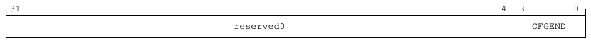

31                                                                                        4   3            0
reserved0                                               CFGEND

**Table 9-246: CLX_CFG_CFGEND bit descriptions**

Bits    Name      Description                                                                                                      Reset
[31:4] reserved0 Reserved                                                                                                          0x0000000
[3:0]   CFGEND Provides access to the CFGEND[3:0] signal which selects endianness per processing element (0 = little-              0b0000
endian, 1 = big-endian).

Accessibility
Component                           Offset                 Instance                                                      Range
E_CPU_CSR                           0x0                   CLX_CFG_CFGEND                                                None

9.3.6.2 CLX_CFG_BROADCAST, Broadcast Configuration register
The CLX_CFG_BROADCAST register controls how broadcasting behaves.

Configurations
This register is available in all configurations.

Attributes
Width
32
Component
E_CPU_CSR
Register offset
0x4
Access type
RW
Reset value
0000 0000 0000 0000 0000 0000 1111 0011
|    |    |    |    |    |    |    | |
31   27   23   19   15   11   7    3 0

<!-- Source PDF page: 224 -->

Bit descriptions
**Figure 9-102: CLX_CFG_BROADCAST bit assignments**

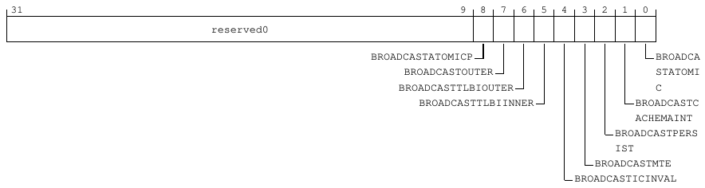

31                                                                        9   8   7   6   5   4    3   2   1   0
reserved0

BROADCASTATOMICP                                    BROADCA
BROADCASTOUTER                                 STATOMI
BROADCASTTLBIOUTER                              C
BROADCASTTLBIINNER                       BROADCASTC
ACHEMAINT
BROADCASTPERS
IST
BROADCASTMTE
BROADCASTICINVAL

**Table 9-248: CLX_CFG_BROADCAST bit descriptions**

Bits   Name                        Description                                                           Reset
[31:9] reserved0                   Reserved                                                              0b00000000000000000000000
[8]    BROADCASTATOMICP            Provides access to BROADCASTATOMICP signal which controls 0b0
broadcasting of atomic transactions on the peripheral port (0 =
disabled, 1 = enabled).
[7]    BROADCASTOUTER              Provides access to BROADCASTOUTER signal which controls               0b1
broadcasting of shareable transactions (0 = disabled, 1 =
enabled).
[6]    BROADCASTTLBIOUTER          Provides access to BROADCASTTLBOUTER (field name                       0b1
BROADCASTTLBIOUTER) which controls broadcasting of
outer shareable Translation Lookaside Buffer (TLB) invalidate
Distributed Virtual Memory (DVM) messages (0 = disabled, 1 =
enabled).
[5]    BROADCASTTLBIINNER          Provides access to BROADCASTTLBINNER (field name                       0b1
BROADCASTTLBIINNER) which controls broadcasting of inner
shareable TLB invalidate DVM messages (0 = disabled, 1 =
enabled).
[4]    BROADCASTICINVAL            Provides access to BROADCASTICINVAL signal which controls 0b1
broadcasting of instruction cache invalidate DVM messages (0 =
disabled, 1 = enabled).
[3]    BROADCASTMTE                Provides access to BROADCASTMTE signal which controls                 0b0
broadcasting of Memory Tagging Extension (MTE) transactions
(0 = disabled, 1 = enabled).
[2]    BROADCASTPERSIST            Provides access to BROADCASTPERSIST signal which controls             0b0
broadcasting of cache clean to point-of-persistence operations
(0 = disabled, 1 = enabled).
[1]    BROADCASTCACHEMAINT Provides access to BROADCASTCACHEMAINT signal which                           0b1
controls broadcasting of cache maintenance operations to
downstream caches (0 = disabled, 1 = enabled).
[0]    BROADCASTATOMIC             Provides access to BROADCASTATOMIC signal which controls              0b1
broadcasting of atomic transactions (0 = disabled, 1 = enabled).

<!-- Source PDF page: 225 -->

Accessibility
Component                        Offset                Instance                                                          Range
E_CPU_CSR                        0x4                  CLX_CFG_BROADCAST                                                 None

9.3.6.3 CLX_CFG_CORESLDEFAULT, Core Split Lock Configuration register
The CLX_CFG_CORESLDEFAULT register indicates if the core is executing in Split mode or Lock
mode.

Configurations
This register is available in all configurations.

Attributes
Width
32
Component
E_CPU_CSR
Register offset
0x8
Access type
RO
Reset value
0000 0000 0000 0000 0000 0000 0000 0000
|    |    |    |    |    |    |    | |
31   27   23   19   15   11   7    3 0

Bit descriptions
**Figure 9-103: CLX_CFG_CORESLDEFAULT bit assignments**

31                                                                                        4   3        0
reserved0

CORESLDEFAUL
T

**Table 9-250: CLX_CFG_CORESLDEFAULT bit descriptions**

Bits    Name              Description                                                                                          Reset
[31:4] reserved0          Reserved                                                                                             0x0000000
[3:0]   CORESLDEFAULT Read-only view of the CORESLDEFAULT[3:0] signal which gives information about Lock mode                  0b0000
(1) or Split mode (0) for individual cores.

<!-- Source PDF page: 226 -->

Accessibility
Component                      Offset               Instance                                                                   Range
E_CPU_CSR                      0x8                 CLX_CFG_CORESLDEFAULT                                                      None

9.3.6.4 CLX_CFG_CLUSTERSLDEFAULT, Cluster Split Lock Configuration register
The CLX_CFG_CLUSTERSLDEFAULT register indicates if the cluster is executing in Split mode or
Lock mode.

Configurations
This register is available in all configurations.

Attributes
Width
32
Component
E_CPU_CSR
Register offset
0xC
Access type
RO
Reset value
0000 0000 0000 0000 0000 0000 0000 0001
|    |    |    |    |    |    |    | |
31   27   23   19   15   11   7    3 0

Bit descriptions
**Figure 9-104: CLX_CFG_CLUSTERSLDEFAULT bit assignments**

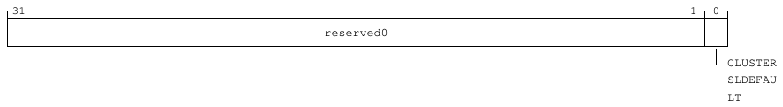

31                                                                                                    1    0
reserved0

CLUSTER
SLDEFAU
LT

**Table 9-252: CLX_CFG_CLUSTERSLDEFAULT bit descriptions**

Bits   Name                   Description                                                     Reset
[31:1] reserved0              Reserved                                                        0b0000000000000000000000000000000
[0]    CLUSTERSLDEFAULT Read-only view of the CLUSTERSLDEFAULT signal which         0b1
gives information about cluster Lock mode (1) or Split mode
(0).

<!-- Source PDF page: 227 -->

Accessibility
Component                    Offset            Instance                                                                      Range
E_CPU_CSR                    0xC              CLX_CFG_CLUSTERSLDEFAULT                                                      None

9.3.6.5 CLX_CFG_DEVNRINTERLEAVE, Device Interleave Configuration register
The CLX_CFG_DEVNRINTERLEAVE register controls whether device interleaving is enabled for
non-reorderable transactions.

Configurations
This register is available in all configurations.

Attributes
Width
32
Component
E_CPU_CSR
Register offset
0x10
Access type
RW
Reset value
0000 0000 0000 0000 0000 0000 0000 0000
|    |    |    |    |    |    |    | |
31   27   23   19   15   11   7    3 0

Bit descriptions
**Figure 9-105: CLX_CFG_DEVNRINTERLEAVE bit assignments**

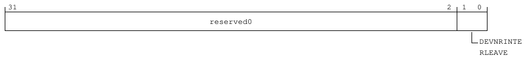

31                                                                                              2   1   0
reserved0

DEVNRINTE
RLEAVE

**Table 9-254: CLX_CFG_DEVNRINTERLEAVE bit descriptions**

Bits    Name                 Description                                                     Reset
[31:2] reserved0             Reserved                                                        0b000000000000000000000000000000
[1:0]   DEVNRINTERLEAVE Provides access to the DEVNRINTERLEAVE[1:0] signal of the 0b00
cluster which enables interleaving of device non-reorderable
transactions across all manager ports by address.

<!-- Source PDF page: 228 -->

Accessibility
Component                    Offset              Instance                                                                     Range
E_CPU_CSR                    0x10               CLX_CFG_DEVNRINTERLEAVE                                                      None

9.3.6.6 CLX_CFG_REQUESTERDISABLE, Disable Requester Port Configuration
register
The CLX_CFG_REQUESTERDISABLE register controls if the bus requester ports are disabled.

Configurations
This register is available in all configurations.

Attributes
Width
32
Component
E_CPU_CSR
Register offset
0x14
Access type
RW
Reset value
0000 0000 0000 0000 0000 0000 0000 0000
|    |    |    |    |    |    |    | |
31   27   23   19   15   11   7    3 0

Bit descriptions
**Figure 9-106: CLX_CFG_REQUESTERDISABLE bit assignments**

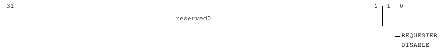

31                                                                                               2   1   0
reserved0

REQUESTER
DISABLE

**Table 9-256: CLX_CFG_REQUESTERDISABLE bit descriptions**

Bits    Name                  Description                                                     Reset
[31:2] reserved0              Reserved                                                        0b000000000000000000000000000000
[1:0]   REQUESTERDISABLE Provides access to the cluster configuration signal                   0b00
REQUESTERDISABLE[CMP-1:0], which disables the bus
requester ports. CMP is the number of bus requester ports
configured at build time, which is 2 for this configuration.

<!-- Source PDF page: 229 -->

Accessibility
Component                    Offset             Instance                                                                    Range
E_CPU_CSR                    0x14              CLX_CFG_REQUESTERDISABLE                                                    None

9.3.6.7 CLX_CFG_REQUESTERINTERLEAVE0_0, Requester Interleave 0 Lower
Configuration register
The CLX_CFG_REQUESTERINTERLEAVE0_0 register specifies the configurable address mask
[37:6] used to determine the bus requester port 0 to which the requests are sent.

Configurations
This register is available in all configurations.

Attributes
Width
32
Component
E_CPU_CSR
Register offset
0x18
Access type
RW
Reset value
0000 0000 0000 0000 0000 0000 0000 0001
|    |    |    |    |    |    |    | |
31   27   23   19   15   11   7    3 0

Bit descriptions
**Figure 9-107: CLX_CFG_REQUESTERINTERLEAVE0_0 bit assignments**

31                                                                                                      0
REQUESTERINTERLEAVE0_0

**Table 9-258: CLX_CFG_REQUESTERINTERLEAVE0_0 bit descriptions**

Bits   Name                            Description                                                                           Reset
[31:0] REQUESTERINTERLEAVE0_0 Provides access to the REQUESTERINTERLEAVE0[37:6] portion of the cluster                       0x00000001
configuration signal REQUESTERINTERLEAVE0[47:0], which specifies the
configurable address mask used for determining the bus requester port to which
the requests are sent.

<!-- Source PDF page: 230 -->

Accessibility
Component                 Offset          Instance                                                                              Range
E_CPU_CSR                 0x18           CLX_CFG_REQUESTERINTERLEAVE0_0                                                        None

9.3.6.8 CLX_CFG_REQUESTERINTERLEAVE0_1, Requester Interleave 0 Upper
Configuration register
The CLX_CFG_REQUESTERINTERLEAVE0_1 register specifies the configurable address mask
[47:38] used to determine the bus requester port 0 to which the requests are sent.

Configurations
This register is available in all configurations.

Attributes
Width
32
Component
E_CPU_CSR
Register offset
0x1C
Access type
RW
Reset value
0000 0000 0000 0000 0000 0000 0000 0000
|    |    |    |    |    |    |    | |
31   27   23   19   15   11   7    3 0

Bit descriptions
**Figure 9-108: CLX_CFG_REQUESTERINTERLEAVE0_1 bit assignments**

31                                                                    10   9                           0
reserved0                                      REQUESTERINTERLEAVE0

**Table 9-260: CLX_CFG_REQUESTERINTERLEAVE0_1 bit descriptions**

Bits    Name                        Description                                                           Reset
[31:10] reserved0                   Reserved                                                              0b0000000000000000000000
[9:0]   REQUESTERINTERLEAVE0 Provides access to the REQUESTERINTERLEAVE0[47:38]                           0b0000000000
portion of the cluster configuration signal
REQUESTERINTERLEAVE0[47:0], which specifies the
configurable address mask used for determining the bus
requester port to which the requests are sent.

<!-- Source PDF page: 231 -->

Accessibility
Component                 Offset          Instance                                                                              Range
E_CPU_CSR                 0x1C           CLX_CFG_REQUESTERINTERLEAVE0_1                                                        None

9.3.6.9 CLX_CFG_REQUESTERINTERLEAVE1_0, Requester Interleave 1 Lower
Configuration register
The CLX_CFG_REQUESTERINTERLEAVE1_0 register specifies the configurable address mask
[37:6] used to determine the bus requester port 1 to which the requests are sent.

Configurations
This register is available in all configurations.

Attributes
Width
32
Component
E_CPU_CSR
Register offset
0x20
Access type
RW
Reset value
0000 0000 0000 0000 0000 0000 0000 0010
|    |    |    |    |    |    |    | |
31   27   23   19   15   11   7    3 0

Bit descriptions
**Figure 9-109: CLX_CFG_REQUESTERINTERLEAVE1_0 bit assignments**

31                                                                                                     0
REQUESTERINTERLEAVE1_0

**Table 9-262: CLX_CFG_REQUESTERINTERLEAVE1_0 bit descriptions**

Bits   Name                           Description                                                                           Reset
[31:0] REQUESTERINTERLEAVE1_0 Provides access to the REQUESTERINTERLEAVE1[37:6] portion of the cluster                      0x00000002
configuration signal REQUESTERINTERLEAVE1[47:0], which specifies the
configurable address mask used for determining the bus requester port to which
the requests are sent.

<!-- Source PDF page: 232 -->

Accessibility
Component                 Offset          Instance                                                                              Range
E_CPU_CSR                 0x20           CLX_CFG_REQUESTERINTERLEAVE1_0                                                        None

9.3.6.10 CLX_CFG_REQUESTERINTERLEAVE1_1, Requester Interleave 1 Upper
Configuration register
The CLX_CFG_REQUESTERINTERLEAVE1_1 register specifies the configurable address mask
[47:38] used to determine the bus requester port 1 to which the requests are sent.

Configurations
This register is available in all configurations.

Attributes
Width
32
Component
E_CPU_CSR
Register offset
0x24
Access type
RW
Reset value
0000 0000 0000 0000 0000 0000 0000 0000
|    |    |    |    |    |    |    | |
31   27   23   19   15   11   7    3 0

Bit descriptions
**Figure 9-110: CLX_CFG_REQUESTERINTERLEAVE1_1 bit assignments**

31                                                                    10   9                           0
reserved0                                      REQUESTERINTERLEAVE1

**Table 9-264: CLX_CFG_REQUESTERINTERLEAVE1_1 bit descriptions**

Bits    Name                        Description                                                           Reset
[31:10] reserved0                   Reserved                                                              0b0000000000000000000000
[9:0]   REQUESTERINTERLEAVE1 Provides access to the REQUESTERINTERLEAVE1[47:38]                           0b0000000000
portion of the cluster configuration signal
REQUESTERINTERLEAVE1[47:0], which specifies the
configurable address mask used for determining the bus
requester port to which the requests are sent.

<!-- Source PDF page: 233 -->

Accessibility
Component                 Offset           Instance                                                                              Range
E_CPU_CSR                 0x24            CLX_CFG_REQUESTERINTERLEAVE1_1                                                        None

9.3.6.11 CLX_CFG_GICDISABLE, Disable GIC Configuration register
The CLX_CFG_GICDISABLE register indicates if the Generic Interrupt Controller (GIC) is disabled.

Configurations
This register is available in all configurations.

Attributes
Width
32
Component
E_CPU_CSR
Register offset
0x28
Access type
RO
Reset value
0000 0000 0000 0000 0000 0000 0000 0000
|    |    |    |    |    |    |    | |
31   27   23   19   15   11   7    3 0

Bit descriptions
**Figure 9-111: CLX_CFG_GICDISABLE bit assignments**

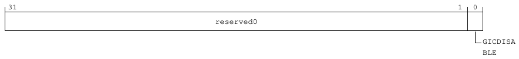

31                                                                                                 1   0
reserved0

GICDISA
BLE

**Table 9-266: CLX_CFG_GICDISABLE bit descriptions**

Bits     Name              Description                                        Reset
[31:1]   reserved0         Reserved                                           0b0000000000000000000000000000000
[0]      GICDISABLE        Configuration input for GICDISABLE                  0b0

Accessibility
Component                         Offset               Instance                                                         Range
E_CPU_CSR                         0x28                CLX_CFG_GICDISABLE                                               None

<!-- Source PDF page: 234 -->

9.3.6.12 CLX_CFG_DEFAULTP, Default Port Configuration register
The CLX_CFG_DEFAULTP register specifies the default port configuration.

Configurations
This register is available in all configurations.

Attributes
Width
32
Component
E_CPU_CSR
Register offset
0x30
Access type
RW
Reset value
0000 0000 0000 0000 0000 0000 0000 0000
|    |    |    |    |    |    |    | |
31   27   23   19   15   11   7    3 0

Bit descriptions
**Figure 9-112: CLX_CFG_DEFAULTP bit assignments**

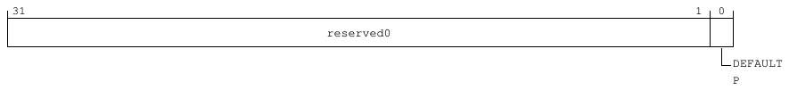

31                                                                                                  1   0
reserved0

DEFAULT
P

**Table 9-268: CLX_CFG_DEFAULTP bit descriptions**

Bits   Name        Description                                                              Reset
[31:1] reserved0   Reserved                                                                 0b0000000000000000000000000000000
[0]    DEFAULTP Provides access to the DEFAULTP configuration signal which selects           0b0
the default port (0 = main requester ports, 1 = peripheral port).

Accessibility
Component                          Offset                Instance                                                      Range
E_CPU_CSR                          0x30                 CLX_CFG_DEFAULTP                                              None

<!-- Source PDF page: 235 -->

9.3.6.13 CLX_CFG_ASTART0P0, Region 0 Port 0 Start Address Configuration
register
The CLX_CFG_ASTART0P0 register specifies the start address for peripheral port address range 0
in region 0.

Configurations
This register is available in all configurations.

Attributes
Width
32
Component
E_CPU_CSR
Register offset
0x34
Access type
RW
Reset value
0000 0000 0000 0000 0000 0000 0000 0000
|    |    |    |    |    |    |    | |
31   27   23   19   15   11   7    3 0

Bit descriptions
**Figure 9-113: CLX_CFG_ASTART0P0 bit assignments**

31       28 27                                                                                         0
Reserved                                             ASTART0P0

**Table 9-270: CLX_CFG_ASTART0P0 bit descriptions**

Bits     Name         Description                                                                                               Reset
[31:28] Reserved      Reserved                                                                                                  0b0000
[27:0]   ASTART0P0 Start address for peripheral port address range 0 (inclusive). Provides access to configuration signal        0x0000000
ASTART0P[47:20].

Accessibility
Component                           Offset               Instance                                                        Range
E_CPU_CSR                           0x34                CLX_CFG_ASTART0P0                                               None

<!-- Source PDF page: 236 -->

9.3.6.14 CLX_CFG_AEND0P0, Region 0 Port 0 End Address Configuration register
The CLX_CFG_AEND0P0 register specifies the end address for peripheral port address range 0 in
region 0.

Configurations
This register is available in all configurations.

Attributes
Width
32
Component
E_CPU_CSR
Register offset
0x38
Access type
RW
Reset value
0000 0000 0000 0000 0000 0000 0000 0000
|    |    |    |    |    |    |    | |
31   27   23   19   15   11   7    3 0

Bit descriptions
**Figure 9-114: CLX_CFG_AEND0P0 bit assignments**

31         28 27                                                                                       0
Reserved                                             AEND0P0

**Table 9-272: CLX_CFG_AEND0P0 bit descriptions**

Bits     Name       Description                                                                                                Reset
[31:28] Reserved    Reserved                                                                                                   0b0000
[27:0]   AEND0P0 End address for peripheral port address range 0 (exclusive). Provides access to configuration signal           0x0000000
AEND0P[47:20].

Accessibility
Component                              Offset             Instance                                                      Range
E_CPU_CSR                              0x38              CLX_CFG_AEND0P0                                               None

<!-- Source PDF page: 237 -->

9.3.6.15 CLX_CFG_ASTART1P0, Region 1 Port 0 Start Address Configuration
register
The CLX_CFG_ASTART1P0 register specifies the start address for peripheral port address range 0
in region 1.

Configurations
This register is available in all configurations.

Attributes
Width
32
Component
E_CPU_CSR
Register offset
0x3C
Access type
RW
Reset value
0000 0000 0000 0000 0000 0000 0000 0000
|    |    |    |    |    |    |    | |
31   27   23   19   15   11   7    3 0

Bit descriptions
**Figure 9-115: CLX_CFG_ASTART1P0 bit assignments**

31                                         18 17                                                         0
Reserved                                             ASTART1P0

**Table 9-274: CLX_CFG_ASTART1P0 bit descriptions**

Bits     Name         Description                                                                                Reset
[31:18] Reserved      Reserved                                                                                   0b00000000000000
[17:0]   ASTART1P0 Start address for peripheral port address range 1 (inclusive). Provides access to             0b000000000000000000
configuration signal ASTART1P[47:30].

Accessibility
Component                           Offset               Instance                                                           Range
E_CPU_CSR                           0x3C                CLX_CFG_ASTART1P0                                                  None

<!-- Source PDF page: 238 -->

9.3.6.16 CLX_CFG_AEND1P0, Region 1 Port 0 End Address Configuration register
The CLX_CFG_AEND1P0 register specifies the end address for peripheral port address range 0 in
region 1.

Configurations
This register is available in all configurations.

Attributes
Width
32
Component
E_CPU_CSR
Register offset
0x40
Access type
RW
Reset value
0000 0000 0000 0000 0000 0000 0000 0000
|    |    |    |    |    |    |    | |
31   27   23   19   15   11   7    3 0

Bit descriptions
**Figure 9-116: CLX_CFG_AEND1P0 bit assignments**

31                                         18 17                                                        0
Reserved                                              AEND1P0

**Table 9-276: CLX_CFG_AEND1P0 bit descriptions**

Bits     Name       Description                                                                                Reset
[31:18] Reserved    Reserved                                                                                   0b00000000000000
[17:0]   AEND1P0 End address for peripheral port address range 1 (exclusive). Provides access to               0b000000000000000000
configuration signal AEND1P[47:30].

Accessibility
Component                           Offset                Instance                                                       Range
E_CPU_CSR                           0x40                 CLX_CFG_AEND1P0                                                None

<!-- Source PDF page: 239 -->

9.3.6.17 CLX_CFG_ASTART2P0, Region 2 Port 0 Start Address Configuration
register
The CLX_CFG_ASTART2P0 register specifies the start address for peripheral port address range 0
in region 2.

Configurations
This register is available in all configurations.

Attributes
Width
32
Component
E_CPU_CSR
Register offset
0x44
Access type
RW
Reset value
0000 0000 0000 0000 0000 0000 0000 0000
|    |    |    |    |    |    |    | |
31   27   23   19   15   11   7    3 0

Bit descriptions
**Figure 9-117: CLX_CFG_ASTART2P0 bit assignments**

31                                         18 17                                                         0
Reserved                                             ASTART2P0

**Table 9-278: CLX_CFG_ASTART2P0 bit descriptions**

Bits     Name         Description                                                                                Reset
[31:18] Reserved      Reserved                                                                                   0b00000000000000
[17:0]   ASTART2P0 Start address for peripheral port address range 2 (inclusive). Provides access to             0b000000000000000000
configuration signal ASTART2P[47:30].

Accessibility
Component                           Offset               Instance                                                           Range
E_CPU_CSR                           0x44                CLX_CFG_ASTART2P0                                                  None

<!-- Source PDF page: 240 -->

9.3.6.18 CLX_CFG_AEND2P0, Region 2 Port 0 End Address Configuration register
The CLX_CFG_AEND2P0 register specifies the end address for peripheral port address range 0 in
region 2.

Configurations
This register is available in all configurations.

Attributes
Width
32
Component
E_CPU_CSR
Register offset
0x48
Access type
RW
Reset value
0000 0000 0000 0000 0000 0000 0000 0000
|    |    |    |    |    |    |    | |
31   27   23   19   15   11   7    3 0

Bit descriptions
**Figure 9-118: CLX_CFG_AEND2P0 bit assignments**

31                                         18 17                                                        0
Reserved                                              AEND2P0

**Table 9-280: CLX_CFG_AEND2P0 bit descriptions**

Bits     Name       Description                                                                                Reset
[31:18] Reserved    Reserved                                                                                   0b00000000000000
[17:0]   AEND2P0 End address for peripheral port address range 2 (exclusive). Provides access to               0b000000000000000000
configuration signal AEND2P[47:30].

Accessibility
Component                           Offset                Instance                                                       Range
E_CPU_CSR                           0x48                 CLX_CFG_AEND2P0                                                None

<!-- Source PDF page: 241 -->

9.3.6.19 CLX_CFG_ASTART3P0, Region 3 Port 0 Start Address Configuration
register
The CLX_CFG_ASTART3P0 register specifies the start address for peripheral port address range 0
in region 3.

Configurations
This register is available in all configurations.

Attributes
Width
32
Component
E_CPU_CSR
Register offset
0x4C
Access type
RW
Reset value
0000 0000 0000 0000 0000 0000 0000 0000
|    |    |    |    |    |    |    | |
31   27   23   19   15   11   7    3 0

Bit descriptions
**Figure 9-119: CLX_CFG_ASTART3P0 bit assignments**

31                                         18 17                                                         0
Reserved                                             ASTART3P0

**Table 9-282: CLX_CFG_ASTART3P0 bit descriptions**

Bits     Name         Description                                                                                Reset
[31:18] Reserved      Reserved                                                                                   0b00000000000000
[17:0]   ASTART3P0 Start address for peripheral port address range 3 (inclusive). Provides access to             0b000000000000000000
configuration signal ASTART3P[47:30].

Accessibility
Component                           Offset               Instance                                                           Range
E_CPU_CSR                           0x4C                CLX_CFG_ASTART3P0                                                  None

<!-- Source PDF page: 242 -->

9.3.6.20 CLX_CFG_AEND3P0, Region 3 Port 0 End Address Configuration register
The CLX_CFG_AEND3P0 register specifies the end address for peripheral port address range 0 in
region 3.

Configurations
This register is available in all configurations.

Attributes
Width
32
Component
E_CPU_CSR
Register offset
0x50
Access type
RW
Reset value
0000 0000 0000 0000 0000 0000 0000 0000
|    |    |    |    |    |    |    | |
31   27   23   19   15   11   7    3 0

Bit descriptions
**Figure 9-120: CLX_CFG_AEND3P0 bit assignments**

31                                         18 17                                                        0
Reserved                                              AEND3P0

**Table 9-284: CLX_CFG_AEND3P0 bit descriptions**

Bits     Name       Description                                                                                Reset
[31:18] Reserved    Reserved                                                                                   0b00000000000000
[17:0]   AEND3P0 End address for peripheral port address range 3 (exclusive). Provides access to               0b000000000000000000
configuration signal AEND3P[47:30].

Accessibility
Component                           Offset                Instance                                                       Range
E_CPU_CSR                           0x50                 CLX_CFG_AEND3P0                                                None

<!-- Source PDF page: 243 -->

9.3.6.21 CLX_CORE0_RVBARADDR_0, Core 0 Reset Vector Base Address Lower
Configuration register
The CLX_CORE0_RVBARADDR_0 register specifies the Reset Vector Base address lower
configuration for core 0.

Configurations
This register is available in all configurations.

Attributes
Width
32
Component
E_CPU_CSR
Register offset
0x100
Access type
RW
Reset value
0000 0000 0000 0000 0000 0000 0000 0000
|    |    |    |    |    |    |    | |
31   27   23   19   15   11   7    3 0

Bit descriptions
**Figure 9-121: CLX_CORE0_RVBARADDR_0 bit assignments**

31                                                                                                  2   1    0
RVBARADDR0

reserved0

**Table 9-286: CLX_CORE0_RVBARADDR_0 bit descriptions**

Bits    Name             Description                                                             Reset
[31:2] RVBARADDR0 Provides access to the RVBARADDR0[31:2] portion of the                         0b000000000000000000000000000000
RVBARADDRx[47:2] signal, which sets the Reset Vector Base
Address for core 0 (execution in 64-bit state).
[1:0]   reserved0        Reserved                                                                0b00

Accessibility
Component                      Offset                 Instance                                                                   Range
E_CPU_CSR                      0x100                 CLX_CORE0_RVBARADDR_0                                                      None

<!-- Source PDF page: 244 -->

9.3.6.22 CLX_CORE0_RVBARADDR_1, Core 0 Reset Vector Base Address Upper
Configuration register
The CLX_CORE0_RVBARADDR_1 register specifies the Reset Vector Base address upper
configuration for core 0.

Configurations
This register is available in all configurations.

Attributes
Width
32
Component
E_CPU_CSR
Register offset
0x104
Access type
RW
Reset value
0000 0000 0000 0000 0000 0000 0000 0000
|    |    |    |    |    |    |    | |
31   27   23   19   15   11   7    3 0

Bit descriptions
**Figure 9-122: CLX_CORE0_RVBARADDR_1 bit assignments**

31                                                 16 15                                                0
reserved0                                            RVBARADDR0

**Table 9-288: CLX_CORE0_RVBARADDR_1 bit descriptions**

Bits     Name            Description                                                                                               Reset
[31:16] reserved0        Reserved                                                                                                  0x0000
[15:0]   RVBARADDR0 Provides access to the RVBARADDR0[47:32] portion of the RVBARADDRx[47:2] signal, which stores                  0x0000
the upper bits of Reset Vector Base Address for core 0.

Accessibility
Component                     Offset               Instance                                                                Range
E_CPU_CSR                     0x104               CLX_CORE0_RVBARADDR_1                                                   None

<!-- Source PDF page: 245 -->

9.3.6.23 CLX_CORE1_RVBARADDR_0, Core 1 Reset Vector Base Address Lower
Configuration register
The CLX_CORE1_RVBARADDR_0 register specifies the Reset Vector Base address lower
configuration for core 1.

Configurations
This register is available in all configurations.

Attributes
Width
32
Component
E_CPU_CSR
Register offset
0x108
Access type
RW
Reset value
0000 0000 0000 0000 0000 0000 0000 0000
|    |    |    |    |    |    |    | |
31   27   23   19   15   11   7    3 0

Bit descriptions
**Figure 9-123: CLX_CORE1_RVBARADDR_0 bit assignments**

31                                                                                                  2   1    0
RVBARADDR1

reserved0

**Table 9-290: CLX_CORE1_RVBARADDR_0 bit descriptions**

Bits    Name             Description                                                             Reset
[31:2] RVBARADDR1 Provides access to the RVBARADDR1[31:2] portion of the                         0b000000000000000000000000000000
RVBARADDRx[47:2] signal, which sets the Reset Vector Base
Address for core 1 (execution in 64-bit state).
[1:0]   reserved0        Reserved                                                                0b00

Accessibility
Component                      Offset                 Instance                                                                   Range
E_CPU_CSR                      0x108                 CLX_CORE1_RVBARADDR_0                                                      None

<!-- Source PDF page: 246 -->

9.3.6.24 CLX_CORE1_RVBARADDR_1, Core 1 Reset Vector Base Address Upper
Configuration register
The CLX_CORE1_RVBARADDR_1 register specifies the Reset Vector Base address upper
configuration for core 1.

Configurations
This register is available in all configurations.

Attributes
Width
32
Component
E_CPU_CSR
Register offset
0x10C
Access type
RW
Reset value
0000 0000 0000 0000 0000 0000 0000 0000
|    |    |    |    |    |    |    | |
31   27   23   19   15   11   7    3 0

Bit descriptions
**Figure 9-124: CLX_CORE1_RVBARADDR_1 bit assignments**

31                                                 16 15                                                0
reserved0                                            RVBARADDR1

**Table 9-292: CLX_CORE1_RVBARADDR_1 bit descriptions**

Bits     Name            Description                                                                                               Reset
[31:16] reserved0        Reserved                                                                                                  0x0000
[15:0]   RVBARADDR1 Provides access to the RVBARADDR1[47:32] portion of the RVBARADDRx[47:2] signal, which stores                  0x0000
the upper bits of Reset Vector Base Address for core 1.

Accessibility
Component                     Offset               Instance                                                                Range
E_CPU_CSR                     0x10C               CLX_CORE1_RVBARADDR_1                                                   None

<!-- Source PDF page: 247 -->

9.3.6.25 CLX_CORE2_RVBARADDR_0, Core 2 Reset Vector Base Address Lower
Configuration register
The CLX_CORE2_RVBARADDR_0 register specifies the Reset Vector Base address lower
configuration for core 2.

Configurations
This register is available in all configurations.

Attributes
Width
32
Component
E_CPU_CSR
Register offset
0x110
Access type
RW
Reset value
0000 0000 0000 0000 0000 0000 0000 0000
|    |    |    |    |    |    |    | |
31   27   23   19   15   11   7    3 0

Bit descriptions
**Figure 9-125: CLX_CORE2_RVBARADDR_0 bit assignments**

31                                                                                                  2   1    0
RVBARADDR2

reserved0

**Table 9-294: CLX_CORE2_RVBARADDR_0 bit descriptions**

Bits    Name             Description                                                             Reset
[31:2] RVBARADDR2 Provides access to the RVBARADDR2[31:2] portion of the                         0b000000000000000000000000000000
RVBARADDRx[47:2] signal, which sets the Reset Vector Base
Address for core 2 (execution in 64-bit state).
[1:0]   reserved0        Reserved                                                                0b00

Accessibility
Component                      Offset                 Instance                                                                   Range
E_CPU_CSR                      0x110                 CLX_CORE2_RVBARADDR_0                                                      None

<!-- Source PDF page: 248 -->

9.3.6.26 CLX_CORE2_RVBARADDR_1, Core 2 Reset Vector Base Address Upper
Configuration register
The CLX_CORE2_RVBARADDR_1 register specifies the Reset Vector Base address upper
configuration for core 2.

Configurations
This register is available in all configurations.

Attributes
Width
32
Component
E_CPU_CSR
Register offset
0x114
Access type
RW
Reset value
0000 0000 0000 0000 0000 0000 0000 0000
|    |    |    |    |    |    |    | |
31   27   23   19   15   11   7    3 0

Bit descriptions
**Figure 9-126: CLX_CORE2_RVBARADDR_1 bit assignments**

31                                                 16 15                                                0
reserved0                                            RVBARADDR2

**Table 9-296: CLX_CORE2_RVBARADDR_1 bit descriptions**

Bits     Name            Description                                                                                               Reset
[31:16] reserved0        Reserved                                                                                                  0x0000
[15:0]   RVBARADDR2 Provides access to the RVBARADDR2[47:32] portion of the RVBARADDRx[47:2] signal, which stores                  0x0000
the upper bits of Reset Vector Base Address for core 2.

Accessibility
Component                     Offset               Instance                                                                Range
E_CPU_CSR                     0x114               CLX_CORE2_RVBARADDR_1                                                   None

<!-- Source PDF page: 249 -->

9.3.6.27 CLX_CORE3_RVBARADDR_0, Core 3 Reset Vector Base Address Lower
Configuration register
The CLX_CORE3_RVBARADDR_0 register specifies the Reset Vector Base address lower
configuration for core 3.

Configurations
This register is available in all configurations.

Attributes
Width
32
Component
E_CPU_CSR
Register offset
0x118
Access type
RW
Reset value
0000 0000 0000 0000 0000 0000 0000 0000
|    |    |    |    |    |    |    | |
31   27   23   19   15   11   7    3 0

Bit descriptions
**Figure 9-127: CLX_CORE3_RVBARADDR_0 bit assignments**

31                                                                                                  2   1    0
RVBARADDR3

reserved0

**Table 9-298: CLX_CORE3_RVBARADDR_0 bit descriptions**

Bits    Name             Description                                                             Reset
[31:2] RVBARADDR3 Provides access to the RVBARADDR3[31:2] portion of the                         0b000000000000000000000000000000
RVBARADDRx[47:2] signal, which sets the Reset Vector Base
Address for core 3 (execution in 64-bit state).
[1:0]   reserved0        Reserved                                                                0b00

Accessibility
Component                      Offset                 Instance                                                                   Range
E_CPU_CSR                      0x118                 CLX_CORE3_RVBARADDR_0                                                      None

<!-- Source PDF page: 250 -->

9.3.6.28 CLX_CORE3_RVBARADDR_1, Core 3 Reset Vector Base Address Upper
Configuration register
The CLX_CORE3_RVBARADDR_1 register specifies the Reset Vector Base address upper
configuration for core 3.

Configurations
This register is available in all configurations.

Attributes
Width
32
Component
E_CPU_CSR
Register offset
0x11C
Access type
RW
Reset value
0000 0000 0000 0000 0000 0000 0000 0000
|    |    |    |    |    |    |    | |
31   27   23   19   15   11   7    3 0

Bit descriptions
**Figure 9-128: CLX_CORE3_RVBARADDR_1 bit assignments**

31                                                 16 15                                                0
reserved0                                            RVBARADDR3

**Table 9-300: CLX_CORE3_RVBARADDR_1 bit descriptions**

Bits     Name            Description                                                                                               Reset
[31:16] reserved0        Reserved                                                                                                  0x0000
[15:0]   RVBARADDR3 Provides access to the RVBARADDR3[47:32] portion of the RVBARADDRx[47:2] signal, which stores                  0x0000
the upper bits of Reset Vector Base Address for core 3.

Accessibility
Component                     Offset               Instance                                                                Range
E_CPU_CSR                     0x11C               CLX_CORE3_RVBARADDR_1                                                   None

<!-- Source PDF page: 251 -->

9.3.6.29 CLX_CORE0_MPMMEN, Core 0 MPMM Configuration register
The CLX_CORE0_MPMMEN register specifies if the Maximum Power Mitigation Mechanism
(MPMM) feature is enabled for core 0.

Configurations
This register is available in all configurations.

Attributes
Width
32
Component
E_CPU_CSR
Register offset
0x140
Access type
RW
Reset value
0000 0000 0000 0000 0000 0000 0000 0001
|    |    |    |    |    |    |    | |
31   27   23   19   15   11   7    3 0

Bit descriptions
**Figure 9-129: CLX_CORE0_MPMMEN bit assignments**

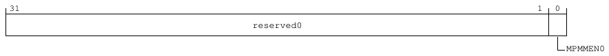

31                                                                                                  1   0
reserved0

MPMMEN0

**Table 9-302: CLX_CORE0_MPMMEN bit descriptions**

Bits   Name         Description                                                             Reset
[31:1] reserved0    Reserved                                                                0b0000000000000000000000000000000
[0]    MPMMEN0 Indicates if the MPMM feature is enabled for core 0 (0 = disabled, 1 = 0b1
enabled). For details about the MPMM behavior, see the DSU-120AE
dependent features section of the Technical Reference Manual (TRM)
for your core.

Accessibility
Component                         Offset               Instance                                                         Range
E_CPU_CSR                         0x140               CLX_CORE0_MPMMEN                                                 None

<!-- Source PDF page: 252 -->

9.3.6.30 CLX_CORE0_MPMMSTATE, Core 0 MPMM State register
The CLX_CORE0_MPMMSTATE register specifies the MPMM state for core 0.

Configurations
This register is available in all configurations.

Attributes
Width
32
Component
E_CPU_CSR
Register offset
0x144
Access type
RW
Reset value
0000 0000 0000 0000 0000 0000 0000 0000
|    |    |    |    |    |    |    | |
31   27   23   19   15   11   7    3 0

Bit descriptions
**Figure 9-130: CLX_CORE0_MPMMSTATE bit assignments**

31                                                                                             2   1   0
reserved0

MPMMSTATE
0

**Table 9-304: CLX_CORE0_MPMMSTATE bit descriptions**

Bits     Name                Description                                          Reset
[31:2]   reserved0           Reserved                                             0b000000000000000000000000000000
[1:0]    MPMMSTATE0          Selected MPMM gear (0-2) for the core.               0b00

Accessibility
Component                      Offset              Instance                                                               Range
E_CPU_CSR                      0x144              CLX_CORE0_MPMMSTATE                                                    None

<!-- Source PDF page: 253 -->

9.3.6.31 CLX_CORE1_MPMMEN, Core 1 MPMM Configuration register
The CLX_CORE1_MPMMEN register specifies if the MPMM feature is enabled for core 1.

Configurations
This register is available in all configurations.

Attributes
Width
32
Component
E_CPU_CSR
Register offset
0x148
Access type
RW
Reset value
0000 0000 0000 0000 0000 0000 0000 0001
|    |    |    |    |    |    |    | |
31   27   23   19   15   11   7    3 0

Bit descriptions
**Figure 9-131: CLX_CORE1_MPMMEN bit assignments**

31                                                                                                  1   0
reserved0

MPMMEN1

**Table 9-306: CLX_CORE1_MPMMEN bit descriptions**

Bits   Name         Description                                                             Reset
[31:1] reserved0    Reserved                                                                0b0000000000000000000000000000000
[0]    MPMMEN1 Indicates if the MPMM feature is enabled for core 1 (0 = disabled, 1 = 0b1
enabled). For details about the MPMM behavior, see the DSU-120AE
dependent features section of the Technical Reference Manual (TRM)
for your core.

Accessibility
Component                         Offset               Instance                                                         Range
E_CPU_CSR                         0x148               CLX_CORE1_MPMMEN                                                 None

<!-- Source PDF page: 254 -->

9.3.6.32 CLX_CORE1_MPMMSTATE, Core 1 MPMM State register
The CLX_CORE1_MPMMSTATE register specifies the MPMM state for core 1.

Configurations
This register is available in all configurations.

Attributes
Width
32
Component
E_CPU_CSR
Register offset
0x14C
Access type
RW
Reset value
0000 0000 0000 0000 0000 0000 0000 0000
|    |    |    |    |    |    |    | |
31   27   23   19   15   11   7    3 0

Bit descriptions
**Figure 9-132: CLX_CORE1_MPMMSTATE bit assignments**

31                                                                                             2   1    0
reserved0

MPMMSTATE
1

**Table 9-308: CLX_CORE1_MPMMSTATE bit descriptions**

Bits     Name                Description                                          Reset
[31:2]   reserved0           Reserved                                             0b000000000000000000000000000000
[1:0]    MPMMSTATE1          Selected MPMM gear (0-2) for the core.               0b00

Accessibility
Component                      Offset              Instance                                                                  Range
E_CPU_CSR                      0x14C              CLX_CORE1_MPMMSTATE                                                       None

<!-- Source PDF page: 255 -->

9.3.6.33 CLX_CORE2_MPMMEN, Core 2 MPMM Configuration register
The CLX_CORE2_MPMMEN register specifies if the MPMM feature is enabled for core 2.

Configurations
This register is available in all configurations.

Attributes
Width
32
Component
E_CPU_CSR
Register offset
0x150
Access type
RW
Reset value
0000 0000 0000 0000 0000 0000 0000 0001
|    |    |    |    |    |    |    | |
31   27   23   19   15   11   7    3 0

Bit descriptions
**Figure 9-133: CLX_CORE2_MPMMEN bit assignments**

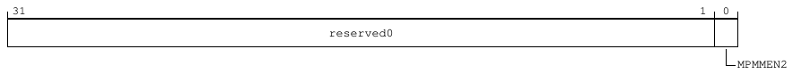

31                                                                                                  1   0
reserved0

MPMMEN2

**Table 9-310: CLX_CORE2_MPMMEN bit descriptions**

Bits   Name         Description                                                             Reset
[31:1] reserved0    Reserved                                                                0b0000000000000000000000000000000
[0]    MPMMEN2 Indicates if the MPMM feature is enabled for core 2 (0 = disabled, 1 = 0b1
enabled). For details about the MPMM behavior, see the DSU-120AE
dependent features section of the Technical Reference Manual (TRM)
for your core.

Accessibility
Component                         Offset               Instance                                                         Range
E_CPU_CSR                         0x150               CLX_CORE2_MPMMEN                                                 None

<!-- Source PDF page: 256 -->

9.3.6.34 CLX_CORE2_MPMMSTATE, Core 2 MPMM State register
The CLX_CORE2_MPMMSTATE register specifies the MPMM state for core 2.

Configurations
This register is available in all configurations.

Attributes
Width
32
Component
E_CPU_CSR
Register offset
0x154
Access type
RW
Reset value
0000 0000 0000 0000 0000 0000 0000 0000
|    |    |    |    |    |    |    | |
31   27   23   19   15   11   7    3 0

Bit descriptions
**Figure 9-134: CLX_CORE2_MPMMSTATE bit assignments**

31                                                                                             2   1   0
reserved0

MPMMSTATE
2

**Table 9-312: CLX_CORE2_MPMMSTATE bit descriptions**

Bits     Name                Description                                          Reset
[31:2]   reserved0           Reserved                                             0b000000000000000000000000000000
[1:0]    MPMMSTATE2          Selected MPMM gear (0-2) for the core.               0b00

Accessibility
Component                      Offset              Instance                                                               Range
E_CPU_CSR                      0x154              CLX_CORE2_MPMMSTATE                                                    None

<!-- Source PDF page: 257 -->

9.3.6.35 CLX_CORE3_MPMMEN, Core 3 MPMM Configuration register
The CLX_CORE3_MPMMEN register specifies if the MPMM feature is enabled for core 3.

Configurations
This register is available in all configurations.

Attributes
Width
32
Component
E_CPU_CSR
Register offset
0x158
Access type
RW
Reset value
0000 0000 0000 0000 0000 0000 0000 0001
|    |    |    |    |    |    |    | |
31   27   23   19   15   11   7    3 0

Bit descriptions
**Figure 9-135: CLX_CORE3_MPMMEN bit assignments**

31                                                                                                  1   0
reserved0

MPMMEN3

**Table 9-314: CLX_CORE3_MPMMEN bit descriptions**

Bits   Name         Description                                                             Reset
[31:1] reserved0    Reserved                                                                0b0000000000000000000000000000000
[0]    MPMMEN3 Indicates if the MPMM feature is enabled for core 3 (0 = disabled, 1 = 0b1
enabled). For details about the MPMM behavior, see the DSU-120AE
dependent features section of the Technical Reference Manual (TRM)
for your core.

Accessibility
Component                         Offset               Instance                                                         Range
E_CPU_CSR                         0x158               CLX_CORE3_MPMMEN                                                 None

<!-- Source PDF page: 258 -->

9.3.6.36 CLX_CORE3_MPMMSTATE, Core 3 MPMM State register
The CLX_CORE3_MPMMSTATE register specifies the MPMM state for core 3.

Configurations
This register is available in all configurations.

Attributes
Width
32
Component
E_CPU_CSR
Register offset
0x15C
Access type
RW
Reset value
0000 0000 0000 0000 0000 0000 0000 0000
|    |    |    |    |    |    |    | |
31   27   23   19   15   11   7    3 0

Bit descriptions
**Figure 9-136: CLX_CORE3_MPMMSTATE bit assignments**

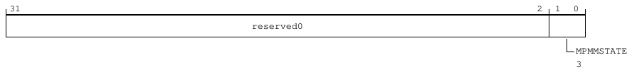

31                                                                                             2   1    0
reserved0

MPMMSTATE
3

**Table 9-316: CLX_CORE3_MPMMSTATE bit descriptions**

Bits     Name                Description                                          Reset
[31:2]   reserved0           Reserved                                             0b000000000000000000000000000000
[1:0]    MPMMSTATE3          Selected MPMM gear (0-2) for the core.               0b00

Accessibility
Component                      Offset              Instance                                                                  Range
E_CPU_CSR                      0x15C              CLX_CORE3_MPMMSTATE                                                       None

<!-- Source PDF page: 259 -->

9.3.6.37 CLX_CLUSTER_MPMMEN, Cluster MPMM Configuration register
The CLX_CLUSTER_MPMMEN register specifies if the MPMM feature is enabled for the cluster.

Configurations
This register is available in all configurations.

Attributes
Width
32
Component
E_CPU_CSR
Register offset
0x180
Access type
RW
Reset value
0000 0000 0000 0000 0000 0000 0000 0001
|    |    |    |    |    |    |    | |
31   27   23   19   15   11   7    3 0

Bit descriptions
**Figure 9-137: CLX_CLUSTER_MPMMEN bit assignments**

31                                                                                                   1   0
reserved0

CLUSTER
MPMM

**Table 9-318: CLX_CLUSTER_MPMMEN bit descriptions**

Bits   Name              Description                                                         Reset
[31:1] reserved0         Reserved                                                            0b0000000000000000000000000000000
[0]    CLUSTERMPMM Indicates if the MPMM feature is enabled for the cluster                  0b1
(0 = disabled, 1 = enabled). For details about the MPMM
behavior, see the DSU-120AE dependent features section of
the Technical Reference Manual (TRM) for your core.

Accessibility
Component                       Offset               Instance                                                             Range
E_CPU_CSR                       0x180               CLX_CLUSTER_MPMMEN                                                   None

<!-- Source PDF page: 260 -->

9.3.6.38 CLX_CLUSTER_MPMMSTATE, Cluster MPMM State register
The CLX_CLUSTER_MPMMSTATE register specifies the MPMM state for the cluster.

Configurations
This register is available in all configurations.

Attributes
Width
32
Component
E_CPU_CSR
Register offset
0x184
Access type
RW
Reset value
0000 0000 0000 0000 0000 0000 0000 0000
|    |    |    |    |    |    |    | |
31   27   23   19   15   11   7    3 0

Bit descriptions
**Figure 9-138: CLX_CLUSTER_MPMMSTATE bit assignments**

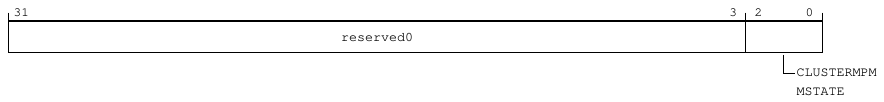

31                                                                                           3   2     0
reserved0

CLUSTERMPM
MSTATE

**Table 9-320: CLX_CLUSTER_MPMMSTATE bit descriptions**

Bits    Name                     Description                                                 Reset
[31:3] reserved0                 Reserved                                                    0b00000000000000000000000000000
[2:0]   CLUSTERMPMMSTATE         Maximum Power Mitigation Mechanism gear selection.          0b000

Accessibility
Component                     Offset             Instance                                                                 Range
E_CPU_CSR                     0x184             CLX_CLUSTER_MPMMSTATE                                                    None

<!-- Source PDF page: 261 -->

9.3.6.39 CLX_CORE0_PDPSTATE, Core 0 PDP State Configuration register
The CLX_CORE0_PDPSTATE register specifies the Performance Defined Power (PDP) state
configuration for core 0.

Configurations
This register is available in all configurations.

Attributes
Width
32
Component
E_CPU_CSR
Register offset
0x188
Access type
RW
Reset value
0000 0000 0000 0000 0000 0000 0000 0000
|    |    |    |    |    |    |    | |
31   27   23   19   15   11   7    3 0

Bit descriptions
**Figure 9-139: CLX_CORE0_PDPSTATE bit assignments**

31                                                                                        4   3        0
reserved0                                            PDPSTATE0

**Table 9-322: CLX_CORE0_PDPSTATE bit descriptions**

Bits    Name         Description                                                                                                Reset
[31:4] reserved0     Reserved                                                                                                   0x0000000
[3:0]   PDPSTATE0 PDP state signal for core 0. If PDP is enabled, it selects which PDP configuration to apply. For details       0b0000
about the PDP behavior, see the DSU-120AE dependent features section of the Technical Reference
Manual (TRM) for your core.

Accessibility
Component                          Offset              Instance                                                           Range
E_CPU_CSR                          0x188              CLX_CORE0_PDPSTATE                                                 None

<!-- Source PDF page: 262 -->

9.3.6.40 CLX_CORE1_PDPSTATE, Core 1 PDP State Configuration register
The CLX_CORE1_PDPSTATE register specifies the PDP state configuration for core 1.

Configurations
This register is available in all configurations.

Attributes
Width
32
Component
E_CPU_CSR
Register offset
0x18C
Access type
RW
Reset value
0000 0000 0000 0000 0000 0000 0000 0000
|    |    |    |    |    |    |    | |
31   27   23   19   15   11   7    3 0

Bit descriptions
**Figure 9-140: CLX_CORE1_PDPSTATE bit assignments**

31                                                                                        4   3        0
reserved0                                            PDPSTATE1

**Table 9-324: CLX_CORE1_PDPSTATE bit descriptions**

Bits    Name         Description                                                                                                Reset
[31:4] reserved0     Reserved                                                                                                   0x0000000
[3:0]   PDPSTATE1 PDP state signal for core 1. If PDP is enabled, it selects which PDP configuration to apply. For details       0b0000
about the PDP behavior, see the DSU-120AE dependent features section of the Technical Reference
Manual (TRM) for your core.

Accessibility
Component                          Offset              Instance                                                           Range
E_CPU_CSR                          0x18C              CLX_CORE1_PDPSTATE                                                 None

<!-- Source PDF page: 263 -->

9.3.6.41 CLX_CORE2_PDPSTATE, Core 2 PDP State Configuration register
The CLX_CORE2_PDPSTATE register specifies the PDP state configuration for core 2.

Configurations
This register is available in all configurations.

Attributes
Width
32
Component
E_CPU_CSR
Register offset
0x190
Access type
RW
Reset value
0000 0000 0000 0000 0000 0000 0000 0000
|    |    |    |    |    |    |    | |
31   27   23   19   15   11   7    3 0

Bit descriptions
**Figure 9-141: CLX_CORE2_PDPSTATE bit assignments**

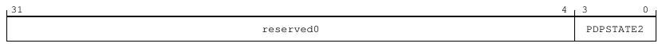

31                                                                                        4   3        0
reserved0                                            PDPSTATE2

**Table 9-326: CLX_CORE2_PDPSTATE bit descriptions**

Bits    Name         Description                                                                                                Reset
[31:4] reserved0     Reserved                                                                                                   0x0000000
[3:0]   PDPSTATE2 PDP state signal for core 2. If PDP is enabled, it selects which PDP configuration to apply. For details       0b0000
about the PDP behavior, see the DSU-120AE dependent features section of the Technical Reference
Manual (TRM) for your core.

Accessibility
Component                          Offset              Instance                                                           Range
E_CPU_CSR                          0x190              CLX_CORE2_PDPSTATE                                                 None

<!-- Source PDF page: 264 -->

9.3.6.42 CLX_CORE3_PDPSTATE, Core 3 PDP State Configuration register
The CLX_CORE3_PDPSTATE register specifies the PDP state configuration for core 3.

Configurations
This register is available in all configurations.

Attributes
Width
32
Component
E_CPU_CSR
Register offset
0x194
Access type
RW
Reset value
0000 0000 0000 0000 0000 0000 0000 0000
|    |    |    |    |    |    |    | |
31   27   23   19   15   11   7    3 0

Bit descriptions
**Figure 9-142: CLX_CORE3_PDPSTATE bit assignments**

31                                                                                        4   3        0
reserved0                                            PDPSTATE3

**Table 9-328: CLX_CORE3_PDPSTATE bit descriptions**

Bits    Name         Description                                                                                                Reset
[31:4] reserved0     Reserved                                                                                                   0x0000000
[3:0]   PDPSTATE3 PDP state signal for core 3. If PDP is enabled, it selects which PDP configuration to apply. For details       0b0000
about the PDP behavior, see the DSU-120AE dependent features section of the Technical Reference
Manual (TRM) for your core.

Accessibility
Component                          Offset              Instance                                                           Range
E_CPU_CSR                          0x194              CLX_CORE3_PDPSTATE                                                 None

<!-- Source PDF page: 265 -->

9.3.6.43 CLX_CORE0_DISPBLK, Core 0 Dispatch Block Configuration register
The CLX_CORE0_DISPBLK register specifies the Dispatch Block (DISPBLK) configuration for core
0. In extreme core thermal or power conditions, you can force the core to stall without stopping
the clock. When the core is stalled, all new dispatch instructions are stopped.

Configurations
This register is available in all configurations.

Attributes
Width
32
Component
E_CPU_CSR
Register offset
0x1A8
Access type
RW
Reset value
0000 0000 0000 0000 0000 0000 0000 0000
|    |    |    |    |    |    |    | |
31   27   23   19   15   11   7    3 0

Bit descriptions
**Figure 9-143: CLX_CORE0_DISPBLK bit assignments**

31                                                                                                  1   0
reserved0

DISPBLK
0

**Table 9-330: CLX_CORE0_DISPBLK bit descriptions**

Bits   Name       Description                                                               Reset
[31:1] reserved0 Reserved                                                                   0b0000000000000000000000000000000
[0]    DISPBLK0 Dispatch Block (DISPBLK) signal of Core 0. If DISPBLK is enabled,           0b0
selects which DISPBLK configuration to apply. For details about the
DISPBLK behavior, see the DSU-120AE dependent features in the
Technical Reference Manual (TRM) for your core.

Accessibility
Component                         Offset                Instance                                                        Range
E_CPU_CSR                         0x1A8                CLX_CORE0_DISPBLK                                               None

<!-- Source PDF page: 266 -->

9.3.6.44 CLX_CORE1_DISPBLK, Core 1 Dispatch Block Configuration register
The CLX_CORE1_DISPBLK register specifies the Dispatch Block (DISPBLK) configuration for core
1. In extreme core thermal or power conditions, you can force the core to stall without stopping
the clock. When the core is stalled, all new dispatch instructions are stopped.

Configurations
This register is available in all configurations.

Attributes
Width
32
Component
E_CPU_CSR
Register offset
0x1AC
Access type
RW
Reset value
0000 0000 0000 0000 0000 0000 0000 0000
|    |    |    |    |    |    |    | |
31   27   23   19   15   11   7    3 0

Bit descriptions
**Figure 9-144: CLX_CORE1_DISPBLK bit assignments**

31                                                                                                  1   0
reserved0

DISPBLK
1

**Table 9-332: CLX_CORE1_DISPBLK bit descriptions**

Bits   Name       Description                                                               Reset
[31:1] reserved0 Reserved                                                                   0b0000000000000000000000000000000
[0]    DISPBLK1 Dispatch Block (DISPBLK) signal of core 1. If DISPBLK is enabled,           0b0
selects which DISPBLK configuration to apply. For details about the
DISPBLK behavior, see the DSU-120AE dependent features in the
Technical Reference Manual (TRM) for your core.

Accessibility
Component                         Offset                 Instance                                                       Range
E_CPU_CSR                         0x1AC                 CLX_CORE1_DISPBLK                                              None

<!-- Source PDF page: 267 -->

9.3.6.45 CLX_CORE2_DISPBLK, Core 2 Dispatch Block Configuration register
The CLX_CORE2_DISPBLK register specifies the Dispatch Block (DISPBLK) configuration for core
2. In extreme core thermal or power conditions, you can force the core to stall without stopping
the clock. When the core is stalled, all new dispatch instructions are stopped.

Configurations
This register is available in all configurations.

Attributes
Width
32
Component
E_CPU_CSR
Register offset
0x1B0
Access type
RW
Reset value
0000 0000 0000 0000 0000 0000 0000 0000
|    |    |    |    |    |    |    | |
31   27   23   19   15   11   7    3 0

Bit descriptions
**Figure 9-145: CLX_CORE2_DISPBLK bit assignments**

31                                                                                                  1   0
reserved0

DISPBLK
2

**Table 9-334: CLX_CORE2_DISPBLK bit descriptions**

Bits   Name       Description                                                               Reset
[31:1] reserved0 Reserved                                                                   0b0000000000000000000000000000000
[0]    DISPBLK2 Dispatch Block (DISPBLK) signal of core 2. If DISPBLK is enabled,           0b0
selects which DISPBLK configuration to apply. For details about the
DISPBLK behavior, see the DSU-120AE dependent features in the
Technical Reference Manual (TRM) for your core.

Accessibility
Component                         Offset                Instance                                                        Range
E_CPU_CSR                         0x1B0                CLX_CORE2_DISPBLK                                               None

<!-- Source PDF page: 268 -->

9.3.6.46 CLX_CORE3_DISPBLK, Core 3 Dispatch Block Configuration register
Specifies the Dispatch Block (DISPBLK) configuration for core 3. In extreme core thermal or power
conditions, you can force the core to stall without stopping the clock. When the core is stalled, all
new dispatch instructions are stopped.

Configurations
This register is available in all configurations.

Attributes
Width
32
Component
E_CPU_CSR
Register offset
0x1B4
Access type
RW
Reset value
0000 0000 0000 0000 0000 0000 0000 0000
|    |    |    |    |    |    |    | |
31   27   23   19   15   11   7    3 0

Bit descriptions
**Figure 9-146: CLX_CORE3_DISPBLK bit assignments**

31                                                                                                  1   0
reserved0

DISPBLK
3

**Table 9-336: CLX_CORE3_DISPBLK bit descriptions**

Bits   Name       Description                                                               Reset
[31:1] reserved0 Reserved                                                                   0b0000000000000000000000000000000
[0]    DISPBLK3 Dispatch Block (DISPBLK) signal of core 3. If DISPBLK is enabled,           0b0
selects which DISPBLK configuration to apply. For details about the
DISPBLK behavior, see the DSU-120AE dependent features in the
Technical Reference Manual (TRM) for your core.

Accessibility
Component                         Offset                Instance                                                        Range
E_CPU_CSR                         0x1B4                CLX_CORE3_DISPBLK                                               None

<!-- Source PDF page: 269 -->

9.3.6.47 CLX_CORE0_SW_WDT_CLR, Core 0 Watchdog Timer Clear register
The CLX_CORE0_SW_WDT_CLR register clears the software watchdog timer for core 0.

Configurations
This register is available in all configurations.

Attributes
Width
32
Component
E_CPU_CSR
Register offset
0x200
Access type
RW
Reset value
0000 0000 0000 0000 0000 0000 0000 0000
|    |    |    |    |    |    |    | |
31   27   23   19   15   11   7    3 0

Bit descriptions
**Figure 9-147: CLX_CORE0_SW_WDT_CLR bit assignments**

31                                                                                                 1    0
reserved0

SW_WDT_
CLR

**Table 9-338: CLX_CORE0_SW_WDT_CLR bit descriptions**

Bits     Name                  Description                                 Reset
[31:1]   reserved0             Reserved                                    0b0000000000000000000000000000000
[0]      SW_WDT_CLR            Core 0 Watchdog Timer Clear                 0b0

Accessibility
Component                      Offset             Instance                                                                   Range
E_CPU_CSR                      0x200             CLX_CORE0_SW_WDT_CLR                                                       None

<!-- Source PDF page: 270 -->

9.3.6.48 CLX_CORE1_SW_WDT_CLR, Core 1 Watchdog Timer Clear register
The CLX_CORE1_SW_WDT_CLR register clears the software watchdog timer for core 1.

Configurations
This register is available in all configurations.

Attributes
Width
32
Component
E_CPU_CSR
Register offset
0x204
Access type
RW
Reset value
0000 0000 0000 0000 0000 0000 0000 0000
|    |    |    |    |    |    |    | |
31   27   23   19   15   11   7    3 0

Bit descriptions
**Figure 9-148: CLX_CORE1_SW_WDT_CLR bit assignments**

31                                                                                                 1    0
reserved0

SW_WDT_
CLR

**Table 9-340: CLX_CORE1_SW_WDT_CLR bit descriptions**

Bits     Name                  Description                                 Reset
[31:1]   reserved0             Reserved                                    0b0000000000000000000000000000000
[0]      SW_WDT_CLR            Core 1 Watchdog Timer Clear                 0b0

Accessibility
Component                      Offset             Instance                                                                   Range
E_CPU_CSR                      0x204             CLX_CORE1_SW_WDT_CLR                                                       None

<!-- Source PDF page: 271 -->

9.3.6.49 CLX_CORE2_SW_WDT_CLR, Core 2 Watchdog Timer Clear register
The CLX_CORE2_SW_WDT_CLR register clears the software watchdog timer for core 2.

Configurations
This register is available in all configurations.

Attributes
Width
32
Component
E_CPU_CSR
Register offset
0x208
Access type
RW
Reset value
0000 0000 0000 0000 0000 0000 0000 0000
|    |    |    |    |    |    |    | |
31   27   23   19   15   11   7    3 0

Bit descriptions
**Figure 9-149: CLX_CORE2_SW_WDT_CLR bit assignments**

31                                                                                                 1    0
reserved0

SW_WDT_
CLR

**Table 9-342: CLX_CORE2_SW_WDT_CLR bit descriptions**

Bits     Name                  Description                                 Reset
[31:1]   reserved0             Reserved                                    0b0000000000000000000000000000000
[0]      SW_WDT_CLR            Core 2 Watchdog Timer Clear                 0b0

Accessibility
Component                      Offset             Instance                                                                   Range
E_CPU_CSR                      0x208             CLX_CORE2_SW_WDT_CLR                                                       None

<!-- Source PDF page: 272 -->

9.3.6.50 CLX_CORE3_SW_WDT_CLR, Core 3 Watchdog Timer Clear register
The CLX_CORE3_SW_WDT_CLR register clears the software watchdog timer for core 3.

Configurations
This register is available in all configurations.

Attributes
Width
32
Component
E_CPU_CSR
Register offset
0x20C
Access type
RW
Reset value
0000 0000 0000 0000 0000 0000 0000 0000
|    |    |    |    |    |    |    | |
31   27   23   19   15   11   7    3 0

Bit descriptions
**Figure 9-150: CLX_CORE3_SW_WDT_CLR bit assignments**

31                                                                                                 1    0
reserved0

SW_WDT_
CLR

**Table 9-344: CLX_CORE3_SW_WDT_CLR bit descriptions**

Bits     Name                  Description                                 Reset
[31:1]   reserved0             Reserved                                    0b0000000000000000000000000000000
[0]      SW_WDT_CLR            Core 3 Watchdog Timer Clear                 0b0

Accessibility
Component                      Offset              Instance                                                                  Range
E_CPU_CSR                      0x20C              CLX_CORE3_SW_WDT_CLR                                                      None

<!-- Source PDF page: 273 -->

9.3.6.51 CLX_PPU_IFP_CMPEN, Cluster PPU Interface Protection Comparison
Configuration register
The CLX_PPU_IFP_CMPEN register enables comparison logic for the cluster Power Policy Unit
(PPU) interface.

Configurations
This register is available in all configurations.

Attributes
Width
32
Component
E_CPU_CSR
Register offset
0x300
Access type
RW
Reset value
0000 0000 0000 0111 0000 0000 0000 0111
|    |    |    |    |    |    |    | |
31   27   23   19   15   11   7    3 0

Bit descriptions
**Figure 9-151: CLX_PPU_IFP_CMPEN bit assignments**

31                                     19 18     16 15                                      3   2       0
reserved0                                            reserved1

PPU_IFP_CMPENR                                        PPU_IFP_CM
PENP

**Table 9-346: CLX_PPU_IFP_CMPEN bit descriptions**

Bits     Name               Description                                                                              Reset
[31:19] reserved0           Reserved                                                                                 0b0000000000000
[18:16] PPU_IFP_CMPENR Redundant compare enable signal.                                                              0b111
[15:3]   reserved1          Reserved                                                                                 0b0000000000000
[2:0]    PPU_IFP_CMPENP Cluster interface protection compare enable primary signal. If set, then the                 0b111
corresponding bit of the PPUIFPFAULTP will be set when a fault is detected.

Accessibility
Component                         Offset                Instance                                                          Range
E_CPU_CSR                         0x300                CLX_PPU_IFP_CMPEN                                                 None

<!-- Source PDF page: 274 -->

9.3.6.52 CLX_PPU_IFP_FORCE, Cluster PPU Interface Protection Force register
The CLX_PPU_IFP_FORCE register forces the corresponding PPUIFPFAULTP signal bits.

Configurations
This register is available in all configurations.

Attributes
Width
32
Component
E_CPU_CSR
Register offset
0x304
Access type
RW
Reset value
0000 0000 0000 0000 0000 0000 0000 0000
|    |    |    |    |    |    |    | |
31   27   23   19   15   11   7    3 0

Bit descriptions
**Figure 9-152: CLX_PPU_IFP_FORCE bit assignments**

31                                     19 18     16 15                                      3   2       0
reserved0                                            reserved1

PPU_IFP_FORCER                                        PPU_IFP_FO
RCEP

**Table 9-348: CLX_PPU_IFP_FORCE bit descriptions**

Bits     Name               Description                                                                              Reset
[31:19] reserved0           Reserved                                                                                 0b0000000000000
[18:16] PPU_IFP_FORCER Redundant interface protection force signal.                                                  0b000
[15:3]   reserved1          Reserved                                                                                 0b0000000000000
[2:0]    PPU_IFP_FORCEP Cluster interface protection force primary signal. When a bit is set, the corresponding      0b000
PPUIFPFAULTP bit is forced HIGH.

Accessibility
Component                          Offset                Instance                                                         Range
E_CPU_CSR                          0x304                CLX_PPU_IFP_FORCE                                                None

<!-- Source PDF page: 275 -->

9.3.6.53 CLX_CLUSTER_IFP_CMPEN, Cluster Interface Protection Compare Enable
register
The CLX_CLUSTER_IFP_CMPEN register enables comparison logic for cluster interface protection.

Configurations
This register is available in all configurations.

Attributes
Width
32
Component
E_CPU_CSR
Register offset
0x308
Access type
RW
Reset value
0000 0011 1111 1111 0000 0011 1111 1111
|    |    |    |    |    |    |    | |
31   27   23   19   15   11   7    3 0

Bit descriptions
**Figure 9-153: CLX_CLUSTER_IFP_CMPEN bit assignments**

31                26 25                             16 15               10   9                           0
reserved0              CLUSTER_IFP_CMPENR              reserved1             CLUSTER_IFP_CMPENP

**Table 9-350: CLX_CLUSTER_IFP_CMPEN bit descriptions**

Bits    Name                     Description                                                                               Reset
[31:26] reserved0                Reserved                                                                                  0b000000
[25:16] CLUSTER_IFP_CMPENR Redundant interface protection fault reporting signal. This signal is active-HIGH and           0b1111111111
level-sensitive.
[15:10] reserved1                Reserved                                                                                  0b000000
[9:0]   CLUSTER_IFP_CMPENP Cluster interface protection compare enable primary signal. If set, then the                    0b1111111111
corresponding bit of the CLUSTERIFPFAULTP will be set when a fault is detected.

Accessibility
Component                      Offset                Instance                                                               Range
E_CPU_CSR                      0x308                CLX_CLUSTER_IFP_CMPEN                                                  None

<!-- Source PDF page: 276 -->

9.3.6.54 CLX_CLUSTER_IFP_FORCE, Cluster Interface Protection Force register
The CLX_CLUSTER_IFP_FORCE register forces cluster interface protection CLUSTERIFPFAULTP
signal bits.

Configurations
This register is available in all configurations.

Attributes
Width
32
Component
E_CPU_CSR
Register offset
0x30C
Access type
RW
Reset value
0000 0000 0000 0000 0000 0000 0000 0000
|    |    |    |    |    |    |    | |
31   27   23   19   15   11   7    3 0

Bit descriptions
**Figure 9-154: CLX_CLUSTER_IFP_FORCE bit assignments**

31                26 25                             16 15               10   9                           0
reserved0              CLUSTER_IFP_FORCER              reserved1             CLUSTER_IFP_FORCEP

**Table 9-352: CLX_CLUSTER_IFP_FORCE bit descriptions**

Bits    Name                     Description                                                                               Reset
[31:26] reserved0                Reserved                                                                                  0b000000
[25:16] CLUSTER_IFP_FORCER Redundant interface protection force signal.                                                    0b0000000000
[15:10] reserved1                Reserved                                                                                  0b000000
[9:0]   CLUSTER_IFP_FORCEP Cluster interface protection force primary signal. When a bit is set, then the                  0b0000000000
corresponding CLUSTERIFPFAULTP bit is forced HIGH.

Accessibility
Component                      Offset                 Instance                                                              Range
E_CPU_CSR                      0x30C                 CLX_CLUSTER_IFP_FORCE                                                 None

<!-- Source PDF page: 277 -->

9.3.6.55 CLX_PPU_DCLS_CMPEN, Cluster PPU DCLS Compare Enable
Configuration register
The CLX_PPU_DCLS_CMPEN register enables comparison logic for cluster PPU Dual-Core
LockStep (DCLS).

Configurations
This register is available in all configurations.

Attributes
Width
32
Component
E_CPU_CSR
Register offset
0x310
Access type
RW
Reset value
0000 0000 0000 0111 0000 0000 0000 0111
|    |    |    |    |    |    |    | |
31   27   23   19   15   11   7    3 0

Bit descriptions
**Figure 9-155: CLX_PPU_DCLS_CMPEN bit assignments**

31                                     19 18     16 15                                      3   2       0
reserved0                                            reserved1

PPU_DCLS_CMPENR                                      PPU_DCLS_C
MPENP

**Table 9-354: CLX_PPU_DCLS_CMPEN bit descriptions**

Bits     Name                  Description                                                                           Reset
[31:19] reserved0              Reserved                                                                              0b0000000000000
[18:16] PPU_DCLS_CMPENR Redundant compare enable signal.                                                             0b111
[15:3]   reserved1             Reserved                                                                              0b0000000000000
[2:0]    PPU_DCLS_CMPENP PPU DCLS compare enable primary signal. If set, then the corresponding bit of the           0b111
PPUDCLSFAULTP is set when a fault is detected.

Accessibility
Component                        Offset              Instance                                                             Range
E_CPU_CSR                        0x310              CLX_PPU_DCLS_CMPEN                                                   None

<!-- Source PDF page: 278 -->

9.3.6.56 CLX_PPU_DCLS_FORCE, PPU DCLS Force register
The CLX_PPU_DCLS_FORCE register forces the corresponding PPUDCLSFAULTP signal bits.

Configurations
This register is available in all configurations.

Attributes
Width
32
Component
E_CPU_CSR
Register offset
0x314
Access type
RW
Reset value
0000 0000 0000 0000 0000 0000 0000 0000
|    |    |    |    |    |    |    | |
31   27   23   19   15   11   7    3 0

Bit descriptions
**Figure 9-156: CLX_PPU_DCLS_FORCE bit assignments**

31                                     19 18     16 15                                      3   2       0
reserved0                                            reserved1

PPU_DCLS_FORCER                                      PPU_DCLS_F
ORCEP

**Table 9-356: CLX_PPU_DCLS_FORCE bit descriptions**

Bits     Name                 Description                                                                            Reset
[31:19] reserved0             Reserved                                                                               0b0000000000000
[18:16] PPU_DCLS_FORCER Redundant DCLS force signal.                                                                 0b000
[15:3]   reserved1            Reserved                                                                               0b0000000000000
[2:0]    PPU_DCLS_FORCEP PPU DCLS force primary signal. When a bit is set, then the corresponding                    0b000
PPUDCLSFAULTP bit is forced HIGH.

Accessibility
Component                        Offset               Instance                                                            Range
E_CPU_CSR                        0x314               CLX_PPU_DCLS_FORCE                                                  None

<!-- Source PDF page: 279 -->

9.3.6.57 CLX_CORE_DCLS_CMPENCP0, Core Pair 0 DCLS Compare Configuration
register
The CLX_CORE_DCLS_CMPENCP0 register enables comparison logic for the core pair 0 DCLS
interface.

Configurations
This register is available in all configurations.

Attributes
Width
32
Component
E_CPU_CSR
Register offset
0x320
Access type
RW
Reset value
0000 0000 0001 1111 0000 0000 0001 1111
|    |    |    |    |    |    |    | |
31   27   23   19   15   11   7    3 0

Bit descriptions
**Figure 9-157: CLX_CORE_DCLS_CMPENCP0 bit assignments**

31                              21 20            16 15                               5   4            0
reserved0                                               reserved1

CORE_DCLS_CMPENCP0R                                 CORE_DCLS_CMP
ENCP0P

**Table 9-358: CLX_CORE_DCLS_CMPENCP0 bit descriptions**

Bits     Name                        Description                                                                        Reset
[31:21] reserved0                    Reserved                                                                           0b00000000000
[20:16] CORE_DCLS_CMPENCP0R Redundant compare enable signal.                                                            0b11111
[15:5]   reserved1                   Reserved                                                                           0b00000000000
[4:0]    CORE_DCLS_CMPENCP0P Core pair DCLS compare enable primary signal. If set, then the corresponding bit 0b11111
of the COREDCLSFAULTCP0P is set when a fault is detected.

<!-- Source PDF page: 280 -->

Accessibility
Component                    Offset              Instance                                                                  Range
E_CPU_CSR                    0x320              CLX_CORE_DCLS_CMPENCP0                                                    None

9.3.6.58 CLX_CORE_DCLS_FORCECP0, Force Core Pair 0 DCLS Control Signals
register
The CLX_CORE_DCLS_FORCECP0 register forces core pair 0 DCLS control signals. The register
provides primary and redundant drive values.

Configurations
This register is available in all configurations.

Attributes
Width
32
Component
E_CPU_CSR
Register offset
0x324
Access type
RW
Reset value
0000 0000 0000 0000 0000 0000 0000 0000
|    |    |    |    |    |    |    | |
31   27   23   19   15   11   7    3 0

Bit descriptions
**Figure 9-158: CLX_CORE_DCLS_FORCECP0 bit assignments**

31                              21 20            16 15                               5   4            0
reserved0                                             reserved1

CORE_DCLS_FORCE_CP0R                                CORE_DCLS_FOR
CECP0

**Table 9-360: CLX_CORE_DCLS_FORCECP0 bit descriptions**

Bits     Name                        Description                                                                        Reset
[31:21] reserved0                    Reserved                                                                           0b00000000000
[20:16] CORE_DCLS_FORCE_CP0R Redundant DCLS force signal.                                                               0b00000
[15:5]   reserved1                   Reserved                                                                           0b00000000000

<!-- Source PDF page: 281 -->

Bits    Name                          Description                                                                        Reset
[4:0]   CORE_DCLS_FORCECP0            Core pair DCLS force primary signal. When a bit is set, then the corresponding     0b00000
COREDCLSFAULTCP0P bit is forced HIGH.

Accessibility
Component                     Offset             Instance                                                                   Range
E_CPU_CSR                     0x324             CLX_CORE_DCLS_FORCECP0                                                     None

9.3.6.59 CLX_CORE_DCLS_CMPENCP1, Core Pair 0 DCLS Compare Configuration
register
The CLX_CORE_DCLS_CMPENCP1 enables comparison logic for the core pair 1 DCLS interface.
The register provides primary and redundant control sets.

Configurations
This register is available in all configurations.

Attributes
Width
32
Component
E_CPU_CSR
Register offset
0x328
Access type
RW
Reset value
0000 0000 0001 1111 0000 0000 0001 1111
|    |    |    |    |    |    |    | |
31   27   23   19   15   11   7    3 0

Bit descriptions
**Figure 9-159: CLX_CORE_DCLS_CMPENCP1 bit assignments**

31                               21 20            16 15                               5   4             0
reserved0                                               reserved1

CORE_DCLS_CMPENCP1R                                   CORE_DCLS_CMP
ENCP1P

<!-- Source PDF page: 282 -->

**Table 9-362: CLX_CORE_DCLS_CMPENCP1 bit descriptions**

Bits     Name                        Description                                                                        Reset
[31:21] reserved0                    Reserved                                                                           0b00000000000
[20:16] CORE_DCLS_CMPENCP1R Redundant compare enable signal.                                                            0b11111
[15:5]   reserved1                   Reserved                                                                           0b00000000000
[4:0]    CORE_DCLS_CMPENCP1P Core pair DCLS compare enable primary signal. If set, then the corresponding bit 0b11111
of the COREDCLSFAULTCP1P will be set when a fault is detected.

Accessibility
Component                    Offset              Instance                                                                  Range
E_CPU_CSR                    0x328              CLX_CORE_DCLS_CMPENCP1                                                    None

9.3.6.60 CLX_CORE_DCLS_FORCECP1, Force Core Pair 1 DCLS Control Signals
register
The CLX_CORE_DCLS_FORCECP1 register forces core pair 1 DCLS control outputs. The register
provides primary and redundant value sets.

Configurations
This register is available in all configurations.

Attributes
Width
32
Component
E_CPU_CSR
Register offset
0x32C
Access type
RW
Reset value
0000 0000 0000 0000 0000 0000 0000 0000
|    |    |    |    |    |    |    | |
31   27   23   19   15   11   7    3 0

<!-- Source PDF page: 283 -->

Bit descriptions
**Figure 9-160: CLX_CORE_DCLS_FORCECP1 bit assignments**

31                              21 20            16 15                               5   4            0
reserved0                                               reserved1

CORE_DCLS_FORCECP1R                                 CORE_DCLS_FOR
CECP1

**Table 9-364: CLX_CORE_DCLS_FORCECP1 bit descriptions**

Bits     Name                       Description                                                                         Reset
[31:21] reserved0                   Reserved                                                                            0b00000000000
[20:16] CORE_DCLS_FORCECP1R Redundant DCLS force signal.                                                                0b00000
[15:5]   reserved1                  Reserved                                                                            0b00000000000
[4:0]    CORE_DCLS_FORCECP1         Core pair DCLS force primary signal. When a bit is set, then the corresponding      0b00000
COREDCLSFAULTCP1P bit is forced HIGH.

Accessibility
Component                     Offset             Instance                                                                  Range
E_CPU_CSR                     0x32C             CLX_CORE_DCLS_FORCECP1                                                    None

9.3.6.61 CLX_CLUSTER_DCLS_CMPENP, Cluster Primary DCLS Compare
Configuration register
The CLX_CLUSTER_DCLS_CMPENP register enables comparison logic for cluster-level DCLS (one
bit per monitored signal).

Configurations
This register is available in all configurations.

Attributes
Width
32
Component
E_CPU_CSR
Register offset
0x340
Access type
RW
Reset value
0000 0000 0000 0000 0000 0011 1111 1111
|    |    |    |    |    |    |    | |

<!-- Source PDF page: 284 -->

31     27     23      19       15   11    7        3   0

Bit descriptions
**Figure 9-161: CLX_CLUSTER_DCLS_CMPENP bit assignments**

31                                         18 17                                                       0
reserved0                                      CLUSTER_DCLS_CMPENP

**Table 9-366: CLX_CLUSTER_DCLS_CMPENP bit descriptions**

Bits     Name                        Description                                                              Reset
[31:18] reserved0                    Reserved                                                                 0b00000000000000
[17:0]   CLUSTER_DCLS_CMPENP Cluster DCLS compare enable primary signal. If set, then the                     0b000000001111111111
corresponding bit of the CLUSTERDCLSFAULTP will be set when a
fault is detected.

Accessibility
Component                    Offset              Instance                                                                  Range
E_CPU_CSR                    0x340              CLX_CLUSTER_DCLS_CMPENP                                                   None

9.3.6.62 CLX_CLUSTER_DCLS_CMPENR, Cluster Redundant DCLS Compare
Configuration register
The CLX_CLUSTER_DCLS_CMPENR register stores a redundant copy of cluster DCLS compare
enable bits for safety cross-checking.

Configurations
This register is available in all configurations.

Attributes
Width
32
Component
E_CPU_CSR
Register offset
0x344
Access type
RW
Reset value
0000 0000 0000 0000 0000 0011 1111 1111
|    |    |    |    |    |    |    | |
31   27   23   19   15   11   7    3 0

<!-- Source PDF page: 285 -->

Bit descriptions
**Figure 9-162: CLX_CLUSTER_DCLS_CMPENR bit assignments**

31                                          18 17                                                      0
reserved0                                        CLUSTER_DCLS_CMPENR

**Table 9-368: CLX_CLUSTER_DCLS_CMPENR bit descriptions**

Bits      Name                                    Description                                      Reset
[31:18]   reserved0                               Reserved                                         0b00000000000000
[17:0]    CLUSTER_DCLS_CMPENR                     Redundant compare enable signal.                 0b000000001111111111

Accessibility
Component                    Offset             Instance                                                                   Range
E_CPU_CSR                    0x344             CLX_CLUSTER_DCLS_CMPENR                                                    None

9.3.6.63 CLX_CLUSTER_DCLS_FORCEP, Cluster Primary DCLS Force Bits
Configuration register
The CLX_CLUSTER_DCLS_FORCEP register stores primary force bits driving cluster DCLS logic
(one bit per forced path).

Configurations
This register is available in all configurations.

Attributes
Width
32
Component
E_CPU_CSR
Register offset
0x348
Access type
RW
Reset value
0000 0000 0000 0000 0000 0000 0000 0000
|    |    |    |    |    |    |    | |
31   27   23   19   15   11   7    3 0

<!-- Source PDF page: 286 -->

Bit descriptions
**Figure 9-163: CLX_CLUSTER_DCLS_FORCEP bit assignments**

31                                         18 17                                                       0
reserved0                                        CLUSTER_DCLS_FORCEP

**Table 9-370: CLX_CLUSTER_DCLS_FORCEP bit descriptions**

Bits     Name                      Description                                                                Reset
[31:18] reserved0                  Reserved                                                                   0b00000000000000
[17:0]   CLUSTER_DCLS_FORCEP Cluster DCLS force primary signal. When a bit is set, then the                   0b000000000000000000
corresponding CLUSTERDCLSFAULTP bit is forced HIGH.

Accessibility
Component                    Offset               Instance                                                                 Range
E_CPU_CSR                    0x348               CLX_CLUSTER_DCLS_FORCEP                                                  None

9.3.6.64 CLX_CLUSTER_DCLS_FORCER, Cluster Redundant DCLS Force Bits
Configuration register
The CLX_CLUSTER_DCLS_FORCER register stores a redundant force bit set for cluster DCLS
signals, which is used to validate the primary set.

Configurations
This register is available in all configurations.

Attributes
Width
32
Component
E_CPU_CSR
Register offset
0x34C
Access type
RW
Reset value
0000 0000 0000 0000 0000 0000 0000 0000
|    |    |    |    |    |    |    | |
31   27   23   19   15   11   7    3 0

<!-- Source PDF page: 287 -->

Bit descriptions
**Figure 9-164: CLX_CLUSTER_DCLS_FORCER bit assignments**

31                                         18 17                                                       0
reserved0                                        CLUSTER_DCLS_FORCER

**Table 9-372: CLX_CLUSTER_DCLS_FORCER bit descriptions**

Bits        Name                                    Description                                  Reset
[31:18]     reserved0                               Reserved                                     0b00000000000000
[17:0]      CLUSTER_DCLS_FORCER                     Redundant DCLS force signal.                 0b000000000000000000

Accessibility
Component                    Offset               Instance                                                                 Range
E_CPU_CSR                    0x34C               CLX_CLUSTER_DCLS_FORCER                                                  None

9.3.6.65 CLX_PPU_IFP_FAULTP, PPU IFP Primary Fault Status Configuration
register
The CLX_PPU_IFP_FAULTP register indicates the primary fault status for PPU interface protection
channels.

Configurations
This register is available in all configurations.

Attributes
Width
32
Component
E_CPU_CSR
Register offset
0x380
Access type
RO
Reset value
0000 0000 0000 0000 0000 0000 0000 0000
|    |    |    |    |    |    |    | |
31   27   23   19   15   11   7    3 0

<!-- Source PDF page: 288 -->

Bit descriptions
**Figure 9-165: CLX_PPU_IFP_FAULTP bit assignments**

31                                                                                              3   2      0
reserved0

PPU_IFP_FA
ULTP

**Table 9-374: CLX_PPU_IFP_FAULTP bit descriptions**

Bits    Name              Description                                                            Reset
[31:3] reserved0          Reserved                                                               0b00000000000000000000000000000
[2:0]   PPU_IFP_FAULTP Cluster interface protection reporting signal. Each bit is set when       0b000
a fault is detected on the interface corresponding to that bit. This
signal is active-HIGH and level-sensitive.

Accessibility
Component                          Offset                 Instance                                                            Range
E_CPU_CSR                          0x380                 CLX_PPU_IFP_FAULTP                                                  None

9.3.6.66 CLX_PPU_IFP_FAULTR, PPU IFP Redundant Fault Status Configuration
register
The CLX_PPU_IFP_FAULTR register indicates the redundant fault status for PPU interface
protection (used for comparison).

Configurations
This register is available in all configurations.

Attributes
Width
32
Component
E_CPU_CSR
Register offset
0x384
Access type
RO
Reset value
0000 0000 0000 0000 0000 0000 0000 0000
|    |    |    |    |    |    |    | |
31   27   23   19   15   11   7    3 0

<!-- Source PDF page: 289 -->

Bit descriptions
**Figure 9-166: CLX_PPU_IFP_FAULTR bit assignments**

31                                                                                               3   2      0
reserved0

PPU_IFP_FA
ULTR

**Table 9-376: CLX_PPU_IFP_FAULTR bit descriptions**

Bits    Name              Description                                                            Reset
[31:3] reserved0          Reserved                                                               0b00000000000000000000000000000
[2:0]   PPU_IFP_FAULTR Redundant interface protection fault reporting signal. This signal is 0b000
active-HIGH and level-sensitive.

Accessibility
Component                         Offset                  Instance                                                            Range
E_CPU_CSR                         0x384                  CLX_PPU_IFP_FAULTR                                                  None

9.3.6.67 CLX_CLUSTER_IFP_FAULTP, Cluster IFP Primary Fault Indicators
Configuration register
The CLX_CLUSTER_IFP_FAULTP register stores primary fault indicators for cluster interface
protection channels.

Configurations
This register is available in all configurations.

Attributes
Width
32
Component
E_CPU_CSR
Register offset
0x388
Access type
RO
Reset value
0000 0000 0000 0000 0000 0000 0000 0000
|    |    |    |    |    |    |    | |
31   27   23   19   15   11   7    3 0

<!-- Source PDF page: 290 -->

Bit descriptions
**Figure 9-167: CLX_CLUSTER_IFP_FAULTP bit assignments**

31                                                                    10   9                           0
reserved0                                        CLUSTER_IFP_FAULTP

**Table 9-378: CLX_CLUSTER_IFP_FAULTP bit descriptions**

Bits    Name                    Description                                                               Reset
[31:10] reserved0               Reserved                                                                  0b0000000000000000000000
[9:0]   CLUSTER_IFP_FAULTP Cluster interface protection reporting signal. Each bit is set when a     0b0000000000
fault is detected on the interface corresponding to that bit. This signal
is active-HIGH and level-sensitive.

Accessibility
Component                      Offset              Instance                                                               Range
E_CPU_CSR                      0x388              CLX_CLUSTER_IFP_FAULTP                                                 None

9.3.6.68 CLX_CLUSTER_IFP_FAULTR, Cluster IFP Redundant Fault Indicators
Configuration register
The CLX_CLUSTER_IFP_FAULTR register stores redundant fault indicators for cluster interface
protection.

Configurations
This register is available in all configurations.

Attributes
Width
32
Component
E_CPU_CSR
Register offset
0x38C
Access type
RO
Reset value
0000 0000 0000 0000 0000 0000 0000 0000
|    |    |    |    |    |    |    | |
31   27   23   19   15   11   7    3 0

<!-- Source PDF page: 291 -->

Bit descriptions
**Figure 9-168: CLX_CLUSTER_IFP_FAULTR bit assignments**

31                                                                    10   9                           0
reserved0                                        CLUSTER_IFP_FAULTR

**Table 9-380: CLX_CLUSTER_IFP_FAULTR bit descriptions**

Bits    Name                    Description                                                               Reset
[31:10] reserved0               Reserved                                                                  0b0000000000000000000000
[9:0]   CLUSTER_IFP_FAULTR Redundant interface protection fault reporting signal. This signal is          0b0000000000
active-HIGH and level-sensitive.

Accessibility
Component                      Offset              Instance                                                               Range
E_CPU_CSR                      0x38C              CLX_CLUSTER_IFP_FAULTR                                                 None

9.3.6.69 CLX_PPU_DCLS_FAULTP, PPU DCLS Primary Fault Status register
The CLX_PPU_DCLS_FAULTP register indicates primary fault status for PPU DCLS protection logic.

Configurations
This register is available in all configurations.

Attributes
Width
32
Component
E_CPU_CSR
Register offset
0x390
Access type
RO
Reset value
0000 0000 0000 0000 0000 0000 0000 0000
|    |    |    |    |    |    |    | |
31   27   23   19   15   11   7    3 0

<!-- Source PDF page: 292 -->

Bit descriptions
**Figure 9-169: CLX_PPU_DCLS_FAULTP bit assignments**

31                                                                                             3   2     0
reserved0

PPU_DCLS_F
AULTP

**Table 9-382: CLX_PPU_DCLS_FAULTP bit descriptions**

Bits    Name                Description                                                        Reset
[31:3] reserved0            Reserved                                                           0b00000000000000000000000000000
[2:0]   PPU_DCLS_FAULTP PPU interface protection reporting signal. Each bit is set when a 0b000
fault is detected on the interface corresponding to that bit. This
signal is active-HIGH and level-sensitive.

Accessibility
Component                        Offset               Instance                                                              Range
E_CPU_CSR                        0x390               CLX_PPU_DCLS_FAULTP                                                   None

9.3.6.70 CLX_PPU_DCLS_FAULTR, PPU DCLS Redundant Fault Status register
The CLX_PPU_DCLS_FAULTR register stores a redundant fault status for PPU DCLS protection.

Configurations
This register is available in all configurations.

Attributes
Width
32
Component
E_CPU_CSR
Register offset
0x394
Access type
RO
Reset value
0000 0000 0000 0000 0000 0000 0000 0000
|    |    |    |    |    |    |    | |
31   27   23   19   15   11   7    3 0

<!-- Source PDF page: 293 -->

Bit descriptions
**Figure 9-170: CLX_PPU_DCLS_FAULTR bit assignments**

31                                                                                             3   2     0
reserved0

PPU_DCLS_F
AULTR

**Table 9-384: CLX_PPU_DCLS_FAULTR bit descriptions**

Bits    Name                Description                                                        Reset
[31:3] reserved0            Reserved                                                           0b00000000000000000000000000000
[2:0]   PPU_DCLS_FAULTR Redundant DCLS fault signal. This signal is active-HIGH and            0b000
level-sensitive.

Accessibility
Component                        Offset               Instance                                                              Range
E_CPU_CSR                        0x394               CLX_PPU_DCLS_FAULTR                                                   None

9.3.6.71 CLX_CLUSTER_DCLS_FAULTP, Cluster DCLS Primary Fault Configuration
register
The CLX_CLUSTER_DCLS_FAULTP register stores primary fault bits from cluster DCLS monitoring
fabric.

Configurations
This register is available in all configurations.

Attributes
Width
32
Component
E_CPU_CSR
Register offset
0x398
Access type
RO
Reset value
0000 0000 0000 0000 0000 0000 0000 0000
|    |    |    |    |    |    |    | |
31   27   23   19   15   11   7    3 0

<!-- Source PDF page: 294 -->

Bit descriptions
**Figure 9-171: CLX_CLUSTER_DCLS_FAULTP bit assignments**

31                                         18 17                                                       0
reserved0                                       CLUSTER_DCLS_FAULTP

**Table 9-386: CLX_CLUSTER_DCLS_FAULTP bit descriptions**

Bits     Name                      Description                                                                Reset
[31:18] reserved0                  Reserved                                                                   0b00000000000000
[17:0]   CLUSTER_DCLS_FAULTP Cluster interface protection reporting signal. Each bit is set when a fault      0b000000000000000000
is detected on the interface corresponding to that bit. This signal is
active-HIGH and level-sensitive.

Accessibility
Component                     Offset               Instance                                                                Range
E_CPU_CSR                     0x398               CLX_CLUSTER_DCLS_FAULTP                                                 None

9.3.6.72 CLX_CLUSTER_DCLS_FAULTR, Cluster DCLS Redundant Fault
Configuration register
The CLX_CLUSTER_DCLS_FAULTR register stores redundant cluster DCLS fault bits for diagnostic
comparison.

Configurations
This register is available in all configurations.

Attributes
Width
32
Component
E_CPU_CSR
Register offset
0x39C
Access type
RO
Reset value
0000 0000 0000 0000 0000 0000 0000 0000
|    |    |    |    |    |    |    | |
31   27   23   19   15   11   7    3 0

<!-- Source PDF page: 295 -->

Bit descriptions
**Figure 9-172: CLX_CLUSTER_DCLS_FAULTR bit assignments**

31                                         18 17                                                       0
reserved0                                       CLUSTER_DCLS_FAULTR

**Table 9-388: CLX_CLUSTER_DCLS_FAULTR bit descriptions**

Bits     Name                     Description                                                                 Reset
[31:18] reserved0                 Reserved                                                                    0b00000000000000
[17:0]   CLUSTER_DCLS_FAULTR Redundant DCLS fault signal. This signal is active-HIGH and level-               0b000000000000000000
sensitive.

Accessibility
Component                     Offset               Instance                                                                Range
E_CPU_CSR                     0x39C               CLX_CLUSTER_DCLS_FAULTR                                                 None

9.3.6.73 CLX_CORE_DCLS_FAULTCP0P, Core Pair 0 DCLS Primary Fault
Configuration register
The CLX_CORE_DCLS_FAULTCP0P register stores primary DCLS fault indication bits for core pair
0.

Configurations
This register is available in all configurations.

Attributes
Width
32
Component
E_CPU_CSR
Register offset
0x3A0
Access type
RO
Reset value
0000 0000 0000 0000 0000 0000 0000 0000
|    |    |    |    |    |    |    | |
31   27   23   19   15   11   7    3 0

<!-- Source PDF page: 296 -->

Bit descriptions
**Figure 9-173: CLX_CORE_DCLS_FAULTCP0P bit assignments**

31                                                                                    5   4            0
reserved0

CORE_DCLS_FAU
LTCP0P

**Table 9-390: CLX_CORE_DCLS_FAULTCP0P bit descriptions**

Bits    Name                      Description                                                     Reset
[31:5] reserved0                  Reserved                                                        0b000000000000000000000000000
[4:0]   CORE_DCLS_FAULTCP0P Core pair interface protection reporting signal. Each bit is set 0b00000
when a fault is detected on the interface corresponding to
that bit. This signal is active-HIGH and level-sensitive.

Accessibility
Component                    Offset              Instance                                                                  Range
E_CPU_CSR                    0x3A0              CLX_CORE_DCLS_FAULTCP0P                                                   None

9.3.6.74 CLX_CORE_DCLS_FAULTCP0R, Core Pair 0 DCLS Redundant Fault
Configuration register
The CLX_CORE_DCLS_FAULTCP0R register stores redundant DCLS fault indication bits for core
pair 0.

Configurations
This register is available in all configurations.

Attributes
Width
32
Component
E_CPU_CSR
Register offset
0x3A4
Access type
RO
Reset value
0000 0000 0000 0000 0000 0000 0000 0000
|    |    |    |    |    |    |    | |
31   27   23   19   15   11   7    3 0

<!-- Source PDF page: 297 -->

Bit descriptions
**Figure 9-174: CLX_CORE_DCLS_FAULTCP0R bit assignments**

31                                                                                    5   4            0
reserved0

CORE_DCLS_FAU
LTCP0R

**Table 9-392: CLX_CORE_DCLS_FAULTCP0R bit descriptions**

Bits    Name                      Description                                                     Reset
[31:5] reserved0                  Reserved                                                        0b000000000000000000000000000
[4:0]   CORE_DCLS_FAULTCP0R Redundant DCLS fault signal. This signal is active-HIGH and           0b00000
level-sensitive.

Accessibility
Component                    Offset              Instance                                                                  Range
E_CPU_CSR                    0x3A4              CLX_CORE_DCLS_FAULTCP0R                                                   None

9.3.6.75 CLX_CORE_DCLS_FAULTCP1P, Core Pair 1 DCLS Primary Fault
Configuration register
The CLX_CORE_DCLS_FAULTCP1P register stores primary DCLS fault indication bits for core pair
1.

Configurations
This register is available in all configurations.

Attributes
Width
32
Component
E_CPU_CSR
Register offset
0x3A8
Access type
RO
Reset value
0000 0000 0000 0000 0000 0000 0000 0000
|    |    |    |    |    |    |    | |
31   27   23   19   15   11   7    3 0

<!-- Source PDF page: 298 -->

Bit descriptions
**Figure 9-175: CLX_CORE_DCLS_FAULTCP1P bit assignments**

31                                                                                    5   4            0
reserved0

CORE_DCLS_FAU
LTCP1P

**Table 9-394: CLX_CORE_DCLS_FAULTCP1P bit descriptions**

Bits    Name                      Description                                                     Reset
[31:5] reserved0                  Reserved                                                        0b000000000000000000000000000
[4:0]   CORE_DCLS_FAULTCP1P Core pair interface protection reporting signal. Each bit is set 0b00000
when a fault is detected on the interface corresponding to
that bit. This signal is active-HIGH and level-sensitive.

Accessibility
Component                    Offset              Instance                                                                  Range
E_CPU_CSR                    0x3A8              CLX_CORE_DCLS_FAULTCP1P                                                   None

9.3.6.76 CLX_CORE_DCLS_FAULTCP1R, Core Pair 1 DCLS Redundant Fault
Configuration register
The CLX_CORE_DCLS_FAULTCP1R register stores redundant DCLS fault indication bits for core
pair 1.

Configurations
This register is available in all configurations.

Attributes
Width
32
Component
E_CPU_CSR
Register offset
0x3AC
Access type
RO
Reset value
0000 0000 0000 0000 0000 0000 0000 0000
|    |    |    |    |    |    |    | |
31   27   23   19   15   11   7    3 0

<!-- Source PDF page: 299 -->

Bit descriptions
**Figure 9-176: CLX_CORE_DCLS_FAULTCP1R bit assignments**

31                                                                                    5   4            0
reserved0

CORE_DCLS_FAU
LTCP1R

**Table 9-396: CLX_CORE_DCLS_FAULTCP1R bit descriptions**

Bits    Name                      Description                                                     Reset
[31:5] reserved0                  Reserved                                                        0b000000000000000000000000000
[4:0]   CORE_DCLS_FAULTCP1R Redundant DCLS fault signal. This signal is active-HIGH and           0b00000
level-sensitive.

Accessibility
Component                    Offset              Instance                                                                  Range
E_CPU_CSR                    0x3AC              CLX_CORE_DCLS_FAULTCP1R                                                   None

9.3.6.77 CLX_SBISTC_BP_ERR, SBIST Bus Protection Error Status Configuration
register
The CLX_SBISTC_BP_ERR register indicates the SBIST bus protection error status and associated
parity check.

Configurations
This register is available in all configurations.

Attributes
Width
32
Component
E_CPU_CSR
Register offset
0x400
Access type
RO
Reset value
0000 0000 0000 0000 0000 0000 0000 0010
|    |    |    |    |    |    |    | |
31   27   23   19   15   11   7    3 0

<!-- Source PDF page: 300 -->

Bit descriptions
**Figure 9-177: CLX_SBISTC_BP_ERR bit assignments**

31                                                                                              2    1   0
reserved0

SBIST_BP_ERRORCHK           SBIST_B
P_ERROR

**Table 9-398: CLX_SBISTC_BP_ERR bit descriptions**

Bits   Name                    Description                                                   Reset
[31:2] reserved0               Reserved                                                      0b000000000000000000000000000000
[1]    SBIST_BP_ERRORCHK Parity signal for SBISTC_BP_ERROR.                                  0b1
[0]    SBISTC_BP_ERROR         The SBISTC_BP_ERROR output signal is asserted when            0b0
there is a bus parity error detected either on the AXI5 or on
the Q-Channel interface.

Accessibility
Component                          Offset                 Instance                                                       Range
E_CPU_CSR                          0x400                 CLX_SBISTC_BP_ERR                                              None

9.3.6.78 CLX_SBIST_DEADLOCK, SBIST Deadlock Configuration register
The CLX_SBIST_DEADLOCK register stores the deadlock detection results from SBIST with parity
nibble for integrity.

Configurations
This register is available in all configurations.

Attributes
Width
32
Component
E_CPU_CSR
Register offset
0x404
Access type
RO
Reset value
0000 0000 0000 0000 0000 0000 1111 0000
|    |    |    |    |    |    |    | |
31   27   23   19   15   11   7    3 0

<!-- Source PDF page: 301 -->

Bit descriptions
**Figure 9-178: CLX_SBIST_DEADLOCK bit assignments**

31                                                                           8   7         4   3              0
reserved0                                      DEADLOCKCHK       DEADLOCK

**Table 9-400: CLX_SBIST_DEADLOCK bit descriptions**

Bits    Name              Description                                                                                                 Reset
[31:8] reserved0          Reserved                                                                                                    0x000000
[7:4]   DEADLOCKCHK Parity signal for DEADLOCK.                                                                                       0b1111
[3:0]   DEADLOCK          Provides access to DEADLOCK from SBIST controller, which indicates if a deadlock is detected.               0b0000

Accessibility
Component                        Offset               Instance                                                              Range
E_CPU_CSR                        0x404               CLX_SBIST_DEADLOCK                                                    None

9.3.6.79 CLX_SBIST_CORE0_TESTSTATUS, Core 0 SBIST Test Status register
The CLX_SBIST_CORE0_TESTSTATUS register indicates the self-test execution status and parity
for core 0 SBIST sequence.

Configurations
This register is available in all configurations.

Attributes
Width
32
Component
E_CPU_CSR
Register offset
0x408
Access type
RO
Reset value
0000 0000 0000 0000 0000 0000 0000 0001
|    |    |    |    |    |    |    | |
31   27   23   19   15   11   7    3 0

<!-- Source PDF page: 302 -->

Bit descriptions
**Figure 9-179: CLX_SBIST_CORE0_TESTSTATUS bit assignments**

31                                                                                    5   4    3        0
reserved0                                               TESTSTATUS

TESTSTATUSCHK

**Table 9-402: CLX_SBIST_CORE0_TESTSTATUS bit descriptions**

Bits     Name                     Description                                        Reset
[31:5]   reserved0                Reserved                                           0b000000000000000000000000000
[4]      TESTSTATUSCHK            Parity for TESTSTATUS.                             0b0
[3:0]    TESTSTATUS               Core 0 SBIST TESTSTATUS register.                  0b0001

Accessibility
Component                   Offset             Instance                                                                       Range
E_CPU_CSR                   0x408             CLX_SBIST_CORE0_TESTSTATUS                                                     None

9.3.6.80 CLX_SBIST_CORE1_TESTSTATUS, Core 1 SBIST Test Status register
The CLX_SBIST_CORE1_TESTSTATUS register indicates the self-test execution status and parity
for core 1 SBIST sequence.

Configurations
This register is available in all configurations.

Attributes
Width
32
Component
E_CPU_CSR
Register offset
0x40C
Access type
RO
Reset value
0000 0000 0000 0000 0000 0000 0000 0001
|    |    |    |    |    |    |    | |
31   27   23   19   15   11   7    3 0

<!-- Source PDF page: 303 -->

Bit descriptions
**Figure 9-180: CLX_SBIST_CORE1_TESTSTATUS bit assignments**

31                                                                                    5   4    3        0
reserved0                                               TESTSTATUS

TESTSTATUSCHK

**Table 9-404: CLX_SBIST_CORE1_TESTSTATUS bit descriptions**

Bits     Name                     Description                                        Reset
[31:5]   reserved0                Reserved                                           0b000000000000000000000000000
[4]      TESTSTATUSCHK            Parity for TESTSTATUS.                             0b0
[3:0]    TESTSTATUS               Core 1 SBIST TESTSTATUS register.                  0b0001

Accessibility
Component                   Offset             Instance                                                                       Range
E_CPU_CSR                   0x40C             CLX_SBIST_CORE1_TESTSTATUS                                                     None

9.3.6.81 CLX_SBIST_CORE2_TESTSTATUS, Core 2 SBIST Test Status register
The CLX_SBIST_CORE2_TESTSTATUS register indicates the self-test execution status and parity
for core 2 SBIST sequence.

Configurations
This register is available in all configurations.

Attributes
Width
32
Component
E_CPU_CSR
Register offset
0x410
Access type
RO
Reset value
0000 0000 0000 0000 0000 0000 0000 0001
|    |    |    |    |    |    |    | |
31   27   23   19   15   11   7    3 0

<!-- Source PDF page: 304 -->

Bit descriptions
**Figure 9-181: CLX_SBIST_CORE2_TESTSTATUS bit assignments**

31                                                                                    5   4    3        0
reserved0                                               TESTSTATUS

TESTSTATUSCHK

**Table 9-406: CLX_SBIST_CORE2_TESTSTATUS bit descriptions**

Bits     Name                     Description                                        Reset
[31:5]   reserved0                Reserved                                           0b000000000000000000000000000
[4]      TESTSTATUSCHK            Parity for TESTSTATUS.                             0b0
[3:0]    TESTSTATUS               Core 2 SBIST TESTSTATUS register.                  0b0001

Accessibility
Component                   Offset             Instance                                                                       Range
E_CPU_CSR                   0x410             CLX_SBIST_CORE2_TESTSTATUS                                                     None

9.3.6.82 CLX_SBIST_CORE3_TESTSTATUS, Core 3 SBIST Test Status register
The CLX_SBIST_CORE3_TESTSTATUS register indicates the self-test execution status and parity
for core 3 SBIST sequence.

Configurations
This register is available in all configurations.

Attributes
Width
32
Component
E_CPU_CSR
Register offset
0x414
Access type
RO
Reset value
0000 0000 0000 0000 0000 0000 0000 0001
|    |    |    |    |    |    |    | |
31   27   23   19   15   11   7    3 0

<!-- Source PDF page: 305 -->

Bit descriptions
**Figure 9-182: CLX_SBIST_CORE3_TESTSTATUS bit assignments**

31                                                                                    5   4    3        0
reserved0                                               TESTSTATUS

TESTSTATUSCHK

**Table 9-408: CLX_SBIST_CORE3_TESTSTATUS bit descriptions**

Bits     Name                     Description                                        Reset
[31:5]   reserved0                Reserved                                           0b000000000000000000000000000
[4]      TESTSTATUSCHK            Parity for TESTSTATUS.                             0b0
[3:0]    TESTSTATUS               Core 3 SBIST TESTSTATUS register.                  0b0001

Accessibility
Component                   Offset             Instance                                                                       Range
E_CPU_CSR                   0x414             CLX_SBIST_CORE3_TESTSTATUS                                                     None

9.3.6.83 CLX_SBIST_CORE0_TESTID, Core 0 SBIST Test ID register
The CLX_SBIST_CORE0_TESTID register indicates the identifier and parity for the current or last
SBIST test on core 0.

Configurations
This register is available in all configurations.

Attributes
Width
32
Component
E_CPU_CSR
Register offset
0x428
Access type
RO
Reset value
1111 0000 0000 0000 0000 0000 0000 0000
|    |    |    |    |    |    |    | |
31   27   23   19   15   11   7    3 0

<!-- Source PDF page: 306 -->

Bit descriptions
**Figure 9-183: CLX_SBIST_CORE0_TESTID bit assignments**

31        28 27                                                                                         0
TESTIDCHK                                               TESTID

**Table 9-410: CLX_SBIST_CORE0_TESTID bit descriptions**

Bits     Name         Description                                                                                               Reset
[31:28] TESTIDCHK Parity for TESTID                                                                                             0b1111
[27:0]   TESTID       TESTID status signal from SBIST controller. The TESTID signal identifies the currently running part of 0x0000000
the Self-Test Library (STL), including the test IP, part ID, and iteration count.

Accessibility
Component                        Offset             Instance                                                               Range
E_CPU_CSR                        0x428             CLX_SBIST_CORE0_TESTID                                                 None

9.3.6.84 CLX_SBIST_CORE1_TESTID, Core 1 SBIST Test ID register.
The CLX_SBIST_CORE1_TESTID register indicates the identifier and parity for the current or last
SBIST test on core 1.

Configurations
This register is available in all configurations.

Attributes
Width
32
Component
E_CPU_CSR
Register offset
0x42C
Access type
RO
Reset value
1111 0000 0000 0000 0000 0000 0000 0000
|    |    |    |    |    |    |    | |
31   27   23   19   15   11   7    3 0

<!-- Source PDF page: 307 -->

Bit descriptions
**Figure 9-184: CLX_SBIST_CORE1_TESTID bit assignments**

31        28 27                                                                                         0
TESTIDCHK                                               TESTID

**Table 9-412: CLX_SBIST_CORE1_TESTID bit descriptions**

Bits     Name         Description                                                                                               Reset
[31:28] TESTIDCHK Parity for TESTID.                                                                                            0b1111
[27:0]   TESTID       TESTID status signal from SBIST controller. The TESTID signal identifies the currently running part of 0x0000000
the Self-Test Library (STL), including the test IP, part ID, and iteration count.

Accessibility
Component                        Offset             Instance                                                               Range
E_CPU_CSR                        0x42C             CLX_SBIST_CORE1_TESTID                                                 None

9.3.6.85 CLX_SBIST_CORE2_TESTID, Core 2 SBIST Test ID register
The CLX_SBIST_CORE2_TESTID register indicates the identifier and parity for the current or last
SBIST test on core 2.

Configurations
This register is available in all configurations.

Attributes
Width
32
Component
E_CPU_CSR
Register offset
0x430
Access type
RO
Reset value
1111 0000 0000 0000 0000 0000 0000 0000
|    |    |    |    |    |    |    | |
31   27   23   19   15   11   7    3 0

<!-- Source PDF page: 308 -->

Bit descriptions
**Figure 9-185: CLX_SBIST_CORE2_TESTID bit assignments**

31        28 27                                                                                         0
TESTIDCHK                                               TESTID

**Table 9-414: CLX_SBIST_CORE2_TESTID bit descriptions**

Bits     Name         Description                                                                                               Reset
[31:28] TESTIDCHK Parity for TESTID.                                                                                            0b1111
[27:0]   TESTID       TESTID status signal from SBIST controller. The TESTID signal identifies the currently running part of 0x0000000
the Self-Test Library (STL), including the test IP, part ID, and iteration count.

Accessibility
Component                        Offset             Instance                                                               Range
E_CPU_CSR                        0x430             CLX_SBIST_CORE2_TESTID                                                 None

9.3.6.86 CLX_SBIST_CORE3_TESTID, Core 3 SBIST Test ID register
The CLX_SBIST_CORE3_TESTID register indicates the identifier and parity for the current or last
SBIST test on core 3.

Configurations
This register is available in all configurations.

Attributes
Width
32
Component
E_CPU_CSR
Register offset
0x434
Access type
RO
Reset value
1111 0000 0000 0000 0000 0000 0000 0000
|    |    |    |    |    |    |    | |
31   27   23   19   15   11   7    3 0

<!-- Source PDF page: 309 -->

Bit descriptions
**Figure 9-186: CLX_SBIST_CORE3_TESTID bit assignments**

31        28 27                                                                                         0
TESTIDCHK                                               TESTID

**Table 9-416: CLX_SBIST_CORE3_TESTID bit descriptions**

Bits     Name         Description                                                                                               Reset
[31:28] TESTIDCHK Parity for TESTID.                                                                                            0b1111
[27:0]   TESTID       TESTID status signal from SBIST controller. The TESTID signal identifies the currently running part of 0x0000000
the Self-Test Library (STL), including the test IP, part ID, and iteration count.

Accessibility
Component                        Offset             Instance                                                               Range
E_CPU_CSR                        0x434             CLX_SBIST_CORE3_TESTID                                                 None

9.3.6.87 CLX_SBIST_CORE0_TESTFMODE, Core 0 SBIST Fault and Test Mode
Status register
The CLX_SBIST_CORE0_TESTFMODE register indicates the fault injection / test mode status and
parity for core 0 SBIST.

Configurations
This register is available in all configurations.

Attributes
Width
32
Component
E_CPU_CSR
Register offset
0x448
Access type
RO
Reset value
0000 0000 0000 0000 0000 0000 0001 0000
|    |    |    |    |    |    |    | |
31   27   23   19   15   11   7    3 0

<!-- Source PDF page: 310 -->

Bit descriptions
**Figure 9-187: CLX_SBIST_CORE0_TESTFMODE bit assignments**

31                                                                                      5   4    3        0
reserved0                                                TESTFMODE

TESTFMODECHK

**Table 9-418: CLX_SBIST_CORE0_TESTFMODE bit descriptions**

Bits    Name              Description                                                              Reset
[31:5] reserved0          Reserved                                                                 0b000000000000000000000000000
[4]     TESTFMODECHK Parity for TESTFMODE.                                                         0b1
[3:0]   TESTFMODE         TESTFMODE signal from the SBIST controller. The TESTFMODE                0b0000
signal indicates the nature of the fault encountered by the Self-Test
Library (STL).

Accessibility
Component                   Offset             Instance                                                                        Range
E_CPU_CSR                   0x448             CLX_SBIST_CORE0_TESTFMODE                                                       None

9.3.6.88 CLX_SBIST_CORE1_TESTFMODE, Core 1 SBIST Fault and Test Mode
Status register
The CLX_SBIST_CORE1_TESTFMODE register indicates the fault injection / test mode status and
parity for core 1 SBIST.

Configurations
This register is available in all configurations.

Attributes
Width
32
Component
E_CPU_CSR
Register offset
0x44C
Access type
RO
Reset value
0000 0000 0000 0000 0000 0000 0001 0000
|    |    |    |    |    |    |    | |
31   27   23   19   15   11   7    3 0

<!-- Source PDF page: 311 -->

Bit descriptions
**Figure 9-188: CLX_SBIST_CORE1_TESTFMODE bit assignments**

31                                                                                      5   4    3        0
reserved0                                                TESTFMODE

TESTFMODECHK

**Table 9-420: CLX_SBIST_CORE1_TESTFMODE bit descriptions**

Bits    Name              Description                                                              Reset
[31:5] reserved0          Reserved                                                                 0b000000000000000000000000000
[4]     TESTFMODECHK Parity for TESTFMODE.                                                         0b1
[3:0]   TESTFMODE         TESTFMODE signal from the SBIST controller. The TESTFMODE                0b0000
signal indicates the nature of the fault encountered by the Self-Test
Library (STL).

Accessibility
Component                   Offset             Instance                                                                        Range
E_CPU_CSR                   0x44C             CLX_SBIST_CORE1_TESTFMODE                                                       None

9.3.6.89 CLX_SBIST_CORE2_TESTFMODE, Core 2 SBIST Fault and Test Mode
Status register
The CLX_SBIST_CORE2_TESTFMODE register indicates the fault injection / test mode status and
parity for core 2 SBIST.

Configurations
This register is available in all configurations.

Attributes
Width
32
Component
E_CPU_CSR
Register offset
0x450
Access type
RO
Reset value
0000 0000 0000 0000 0000 0000 0001 0000
|    |    |    |    |    |    |    | |
31   27   23   19   15   11   7    3 0

<!-- Source PDF page: 312 -->

Bit descriptions
**Figure 9-189: CLX_SBIST_CORE2_TESTFMODE bit assignments**

31                                                                                      5   4    3        0
reserved0                                                TESTFMODE

TESTFMODECHK

**Table 9-422: CLX_SBIST_CORE2_TESTFMODE bit descriptions**

Bits    Name              Description                                                              Reset
[31:5] reserved0          Reserved                                                                 0b000000000000000000000000000
[4]     TESTFMODECHK Parity for TESTFMODE.                                                         0b1
[3:0]   TESTFMODE         TESTFMODE signal from the SBIST controller. The TESTFMODE                0b0000
signal indicates the nature of the fault encountered by the Self-Test
Library (STL).

Accessibility
Component                   Offset             Instance                                                                        Range
E_CPU_CSR                   0x450             CLX_SBIST_CORE2_TESTFMODE                                                       None

9.3.6.90 CLX_SBIST_CORE3_TESTFMODE, Core 3 SBIST Fault and Test Mode
Status register
The CLX_SBIST_CORE3_TESTFMODE register indicates the fault injection / test mode status and
parity for core 3 SBIST.

Configurations
This register is available in all configurations.

Attributes
Width
32
Component
E_CPU_CSR
Register offset
0x454
Access type
RO
Reset value
0000 0000 0000 0000 0000 0000 0001 0000
|    |    |    |    |    |    |    | |
31   27   23   19   15   11   7    3 0

<!-- Source PDF page: 313 -->

Bit descriptions
**Figure 9-190: CLX_SBIST_CORE3_TESTFMODE bit assignments**

31                                                                                      5   4    3        0
reserved0                                                TESTFMODE

TESTFMODECHK

**Table 9-424: CLX_SBIST_CORE3_TESTFMODE bit descriptions**

Bits    Name              Description                                                              Reset
[31:5] reserved0          Reserved                                                                 0b000000000000000000000000000
[4]     TESTFMODECHK Parity for TESTFMODE.                                                         0b1
[3:0]   TESTFMODE         TESTFMODE signal from the SBIST controller. The TESTFMODE                0b0000
signal indicates the nature of the fault encountered by the Self-Test
Library (STL).

Accessibility
Component                   Offset             Instance                                                                        Range
E_CPU_CSR                   0x454             CLX_SBIST_CORE3_TESTFMODE                                                       None

9.3.6.91 TRI_REDT_INTR, Triple Redundancy Error Interrupt register
The TRI_REDT_INTR register indicates the aggregated triple redundancy error interrupt status per
protected address range segment.

Configurations
This register is available in all configurations.

Attributes
Width
32
Component
E_CPU_CSR
Register offset
0xE00
Access type
RO
Reset value
0000 0000 0000 0000 0000 0000 0000 0000
|    |    |    |    |    |    |    | |
31   27   23   19   15   11   7    3 0

<!-- Source PDF page: 314 -->

Bit descriptions
**Figure 9-191: TRI_REDT_INTR bit assignments**

31                                                                                       4   3   2   1    0
reserved0

TRI_REDT_INTR_O_5                 TRI_RED
TRI_REDT_INTR_O_4              T_INTR_
O_1
TRI_REDT_I
NTR_O_2

**Table 9-426: TRI_REDT_INTR bit descriptions**

Bits     Name                             Description                                                                     Reset
[31:4]   reserved0                        Reserved                                                                        0x0000000
[3]      TRI_REDT_INTR_O_5                Triple redundancy for address range 0x300-0x3FF.                                0b0
[2]      TRI_REDT_INTR_O_4                Triple redundancy for address range 0x200-0x2FF.                                0b0
[1]      TRI_REDT_INTR_O_2                Triple redundancy for address range 0x100-0x1FF.                                0b0
[0]      TRI_REDT_INTR_O_1                Triple redundancy for address range 0x000-0x0FF.                                0b0

Accessibility
Component                              Offset                    Instance                                              Range
E_CPU_CSR                              0xE00                    TRI_REDT_INTR                                         None

9.3.6.92 CLX_CORE0_PPUHWSTAT, Core 0 PPU Hardware Power Domain Status
register
The CLX_CORE0_PPUHWSTAT register stores a snapshot of the hardware power domain status
signals for core 0.

Configurations
This register is available in all configurations.

Attributes
Width
32
Component
E_CPU_CSR
Register offset
0xF00
Access type
RO

<!-- Source PDF page: 315 -->

Reset value
0000 0000 0000 0000 0000 0000 0000 0001
|    |    |    |    |    |    |    | |
31   27   23   19   15   11   7    3 0

Bit descriptions
**Figure 9-192: CLX_CORE0_PPUHWSTAT bit assignments**

31                                                16 15                                                0
reserved0                                          CORE0PPUHWSTAT

**Table 9-428: CLX_CORE0_PPUHWSTAT bit descriptions**

Bits     Name                 Description                                                                                         Reset
[31:16] reserved0             Reserved                                                                                            0x0000
[15:0]   CORE0PPUHWSTAT The PPU Hardware Status output indicates the current power mode for core 0. The signal can                0x0001
be used by other hardware elements that depend on the mode of the PPU, for example, other
PPUs.

Accessibility
Component                      Offset                 Instance                                                           Range
E_CPU_CSR                      0xF00                 CLX_CORE0_PPUHWSTAT                                                None

9.3.6.93 CLX_CORE1_PPUHWSTAT, Core 1 PPU Hardware Power Domain Status
register
The CLX_CORE1_PPUHWSTAT register stores a snapshot of hardware power domain status
signals for core 1.

Configurations
This register is available in all configurations.

Attributes
Width
32
Component
E_CPU_CSR
Register offset
0xF04
Access type
RO

<!-- Source PDF page: 316 -->

Reset value
0000 0000 0000 0000 0000 0000 0000 0001
|    |    |    |    |    |    |    | |
31   27   23   19   15   11   7    3 0

Bit descriptions
**Figure 9-193: CLX_CORE1_PPUHWSTAT bit assignments**

31                                                16 15                                                0
reserved0                                          CORE1PPUHWSTAT

**Table 9-430: CLX_CORE1_PPUHWSTAT bit descriptions**

Bits     Name                 Description                                                                                         Reset
[31:16] reserved0             Reserved                                                                                            0x0000
[15:0]   CORE1PPUHWSTAT The PPU Hardware Status output indicates the current power mode for core 1. The signal can                0x0001
be used by other hardware elements that depend on the mode of the PPU, for example, other
PPUs.

Accessibility
Component                      Offset                 Instance                                                           Range
E_CPU_CSR                      0xF04                 CLX_CORE1_PPUHWSTAT                                                None

9.3.6.94 CLX_CORE2_PPUHWSTAT, Core 2 PPU Hardware Power Domain Status
register
The CLX_CORE2_PPUHWSTAT register stores a snapshot of hardware power domain status
signals for core 2.

Configurations
This register is available in all configurations.

Attributes
Width
32
Component
E_CPU_CSR
Register offset
0xF08
Access type
RO

<!-- Source PDF page: 317 -->

Reset value
0000 0000 0000 0000 0000 0000 0000 0001
|    |    |    |    |    |    |    | |
31   27   23   19   15   11   7    3 0

Bit descriptions
**Figure 9-194: CLX_CORE2_PPUHWSTAT bit assignments**

31                                                16 15                                                0
reserved0                                          CORE2PPUHWSTAT

**Table 9-432: CLX_CORE2_PPUHWSTAT bit descriptions**

Bits     Name                 Description                                                                                         Reset
[31:16] reserved0             Reserved                                                                                            0x0000
[15:0]   CORE2PPUHWSTAT The PPU Hardware Status output indicates the current power mode for core 2. The signal can                0x0001
be used by other hardware elements that depend on the mode of the PPU, for example, other
PPUs.

Accessibility
Component                      Offset                 Instance                                                           Range
E_CPU_CSR                      0xF08                 CLX_CORE2_PPUHWSTAT                                                None

9.3.6.95 CLX_CORE3_PPUHWSTAT, Core 3 PPU Hardware Power Domain Status
register
The CLX_CORE3_PPUHWSTAT register stores a snapshot of hardware power domain status
signals for core 3.

Configurations
This register is available in all configurations.

Attributes
Width
32
Component
E_CPU_CSR
Register offset
0xF0C
Access type
RO

<!-- Source PDF page: 318 -->

Reset value
0000 0000 0000 0000 0000 0000 0000 0001
|    |    |    |    |    |    |    | |
31   27   23   19   15   11   7    3 0

Bit descriptions
**Figure 9-195: CLX_CORE3_PPUHWSTAT bit assignments**

31                                                16 15                                                0
reserved0                                          CORE3PPUHWSTAT

**Table 9-434: CLX_CORE3_PPUHWSTAT bit descriptions**

Bits     Name                 Description                                                                                         Reset
[31:16] reserved0             Reserved                                                                                            0x0000
[15:0]   CORE3PPUHWSTAT The PPU Hardware Status output indicates the current power mode for core 3. The signal can                0x0001
be used by other hardware elements that depend on the mode of the PPU, for example, other
PPUs.

Accessibility
Component                      Offset                 Instance                                                           Range
E_CPU_CSR                      0xF0C                 CLX_CORE3_PPUHWSTAT                                                None

9.3.6.96 CLX_CLUSTER_PPUHWSTAT, Cluster PPU Hardware Power Domain
Status register
The CLX_CLUSTER_PPUHWSTAT register stores a snapshot of the hardware power domain status
signals for the cluster.

Configurations
This register is available in all configurations.

Attributes
Width
32
Component
E_CPU_CSR
Register offset
0xF20
Access type
RO

<!-- Source PDF page: 319 -->

Reset value
0000 0000 0000 0001 0000 0000 0000 0001
|    |    |    |    |    |    |    | |
31   27   23   19   15   11   7    3 0

Bit descriptions
**Figure 9-196: CLX_CLUSTER_PPUHWSTAT bit assignments**

31                                                                                                     0
CLUSTERPPUHWSTAT

**Table 9-436: CLX_CLUSTER_PPUHWSTAT bit descriptions**

Bits   Name                    Description                                                                                  Reset
[31:0] CLUSTERPPUHWSTAT The PPU Hardware Status output indicates the current power and operating mode for the 0x00010001
cluster. The signal can be used by other hardware elements that depend on the mode of
the PPU, for example, other PPUs.

Accessibility
Component                     Offset              Instance                                                                Range
E_CPU_CSR                     0xF20              CLX_CLUSTER_PPUHWSTAT                                                   None

9.3.6.97 CLX_CORE_WDT_TIMEOUT, Core Watchdog Timeout Status register
The CLX_CORE_WDT_TIMEOUT register stores the watchdog timeout status bits for each core.

Configurations
This register is available in all configurations.

Attributes
Width
32
Component
E_CPU_CSR
Register offset
0xF24
Access type
RO
Reset value
0000 0000 0000 0000 0000 0000 0000 0000
|    |    |    |    |    |    |    | |
31   27   23   19   15   11   7    3 0

<!-- Source PDF page: 320 -->

Bit descriptions
**Figure 9-197: CLX_CORE_WDT_TIMEOUT bit assignments**

31                                                                                        4   3            0
reserved0

CORE_WDT_TIM
EOUTSTAT

**Table 9-438: CLX_CORE_WDT_TIMEOUT bit descriptions**

Bits        Name                                                  Description                                         Reset
[31:4]      reserved0                                             Reserved                                            0x0000000
[3:0]       CORE_WDT_TIMEOUTSTAT                                  Watchdog Timeout Status                             0b0000

Accessibility
Component                      Offset             Instance                                                                     Range
E_CPU_CSR                      0xF24             CLX_CORE_WDT_TIMEOUT                                                         None

9.3.6.98 nCOREERRIRQ, Core Error Interrupt Outputs Latched Status register
The nCOREERRIRQ register specifies the error indicator for an Error-Correcting Code (ECC) error
that causes potential data corruption or loss of coherency.

Configurations
This register is available in all configurations.

Attributes
Width
32
Component
E_CPU_CSR
Register offset
0xF28
Access type
RO
Reset value
0000 0000 0000 0000 0000 0000 0000 1111
|    |    |    |    |    |    |    | |
31   27   23   19   15   11   7    3 0

<!-- Source PDF page: 321 -->

Bit descriptions
**Figure 9-198: NCOREERRIRQ bit assignments**

31                                                                                         4   3           0
reserved0                                            nCOREERRIRQ

**Table 9-440: nCOREERRIRQ bit descriptions**

Bits    Name              Description                                                                                               Reset
[31:4] reserved0          Reserved                                                                                                  0x0000000
[3:0]   nCOREERRIRQ Error indicator for an ECC error that causes potential data corruption or loss of coherency. Bits 3             0b1111
down to 0 are for the L1 and L2 RAMs in each core.

Accessibility
Component                                 Offset                   Instance                                              Range
E_CPU_CSR                                 0xF28                   nCOREERRIRQ                                           None

9.3.6.99 nCOREFAULTIRQ, Core Fault Interrupt Outputs Latched Status register
The nCOREFAULTIRQ register indicates the fault indicator for a detected 1-bit or 2-bit ECC error
in the core RAMs.

Configurations
This register is available in all configurations.

Attributes
Width
32
Component
E_CPU_CSR
Register offset
0xF2C
Access type
RO
Reset value
0000 0000 0000 0000 0000 0000 0000 1111
|    |    |    |    |    |    |    | |
31   27   23   19   15   11   7    3 0

<!-- Source PDF page: 322 -->

Bit descriptions
**Figure 9-199: NCOREFAULTIRQ bit assignments**

31                                                                                        4   3          0
Reserved

nCOREFAULTIR
Q

**Table 9-442: nCOREFAULTIRQ bit descriptions**

Bits     Name                    Description                                                                              Reset
[31:4]   Reserved                Reserved                                                                                 0x0000000
[3:0]    nCOREFAULTIRQ           Fault indicator for a detected 1 or 2 bit ECC error in the core RAMs.                    0b1111

Accessibility
Component                             Offset                   Instance                                                Range
E_CPU_CSR                             0xF2C                   nCOREFAULTIRQ                                           None

9.3.6.100         CLK_DSU_PPU_nPMUINTERRUPT, DSU PPU Clock PMU Interrupt
Status register
The CLK_DSU_PPU_nPMUINTERRUPT register specifies the DynamIQ Shared Unit (DSU) Network
Interface (NI) active-LOW interrupt to indicate a counter, event, or cycle has overflowed for any
CLK_DSU logic.

Configurations
This register is available in all configurations.

Attributes
Width
32
Component
E_CPU_CSR
Register offset
0xF30
Access type
RO
Reset value
0000 0000 0000 0000 0000 0000 0000 0001
|    |    |    |    |    |    |    | |
31   27   23   19   15   11   7    3 0

<!-- Source PDF page: 323 -->

Bit descriptions
**Figure 9-200: CLK_DSU_PPU_NPMUINTERRUPT bit assignments**

31                                                                                                   1   0
Reserved

CLK_DSU
_PPU_nP
MUINTER
RUPT

**Table 9-444: CLK_DSU_PPU_nPMUINTERRUPT bit descriptions**

Bits   Name                                 Description                                      Reset
[31:1] Reserved                             Reserved                                         0b0000000000000000000000000000000
[0]    CLK_DSU_PPU_nPMUINTERRUPT NI DSU PPU CLK Performance Monitoring                       0b1
Unit (PMU) Interrupt

Accessibility
Component                   Offset             Instance                                                                       Range
E_CPU_CSR                   0xF30             CLK_DSU_PPU_nPMUINTERRUPT                                                      None

9.3.6.101         CLK_PEB_nPMUINTERRUPT, PEB Clock PMU Interrupt Status register
The CLK_PEB_nPMUINTERRUPT register specifies the DSU NI active-LOW interrupt to indicate a
counter, event, or cycle has overflowed for any CLK_PEB logic.

Configurations
This register is available in all configurations.

Attributes
Width
32
Component
E_CPU_CSR
Register offset
0xF38
Access type
RO
Reset value
0000 0000 0000 0000 0000 0000 0000 0001
|    |    |    |    |    |    |    | |
31   27   23   19   15   11   7    3 0

<!-- Source PDF page: 324 -->

Bit descriptions
**Figure 9-201: CLK_PEB_NPMUINTERRUPT bit assignments**

31                                                                                                 1    0
reserved0

CLK_PEB
_nPMUIN
TERRUPT

**Table 9-446: CLK_PEB_nPMUINTERRUPT bit descriptions**

Bits     Name                              Description                              Reset
[31:1]   reserved0                         Reserved                                 0b0000000000000000000000000000000
[0]      CLK_PEB_nPMUINTERRUPT             NI DSU PEB CLK PMU Interrupt             0b1

Accessibility
Component                      Offset             Instance                                                                   Range
E_CPU_CSR                      0xF38             CLK_PEB_nPMUINTERRUPT                                                      None

9.3.6.102         PID_4, Peripheral ID 4 register
The PID_4 register contains information about the number of blocks that the logic occupies and
the JEDEC JEP106 continuation code for the peripheral.

Configurations
This register is available in all configurations.

Attributes
Width
32
Component
E_CPU_CSR
Register offset
0xFD0
Access type
RO
Reset value
0000 0000 0000 0000 0000 0000 0000 0100
|    |    |    |    |    |    |    | |
31   27   23   19   15   11   7    3 0

<!-- Source PDF page: 325 -->

Bit descriptions
**Figure 9-202: PID_4 bit assignments**

31                                                                           8   7        4    3        0
reserved0

PID4_FOUR_KB_COUNT_IN                   PID4_JEP106_
C_CODE_IN

**Table 9-448: PID_4 bit descriptions**

Bits    Name                        Description                                                                                 Reset
[31:8] reserved0                    Reserved                                                                                    0x000000
[7:4]   PID4_FOUR_KB_COUNT_IN Specifies the number of 4 KB address blocks that are required to access the registers,             0b0000
expressed in powers of 2.
[3:0]   PID4_JEP106_C_CODE_IN       Specifies the JEDEC JEP106 continuation code for the peripheral, which indicates the         0b0100
number of continuation characters in the manufacturer identity code. 0x4 for Arm.

Accessibility
Component                                      Offset                        Instance                              Range
E_CPU_CSR                                      0xFD0                        PID_4                                 None

9.3.6.103         PID_0, Peripheral ID 0 register
The PID_0 register contains the first eight bits of the identifier for the peripheral.

Configurations
This register is available in all configurations.

Attributes
Width
32
Component
E_CPU_CSR
Register offset
0xFE0
Access type
RO
Reset value
0000 0000 0000 0000 0000 0000 0000 0000
|    |    |    |    |    |    |    | |
31   27   23   19   15   11   7    3 0

<!-- Source PDF page: 326 -->

Bit descriptions
**Figure 9-203: PID_0 bit assignments**

31                                                                           8   7                           0
reserved0                                         PID0_PART_NUMBER_0_IN

**Table 9-450: PID_0 bit descriptions**

Bits            Name                                                             Description                      Reset
[31:8]          reserved0                                                        Reserved                         0x000000
[7:0]           PID0_PART_NUMBER_0_IN                                            Reserved                         0x00

Accessibility
Component                                      Offset                        Instance                               Range
E_CPU_CSR                                      0xFE0                        PID_0                                  None

9.3.6.104         PID_1, Peripheral ID 1 register
The PID_1 register contains the first four bits of the JEDEC JEP106 identity code and the second
four bits of the identifier for the peripheral.

Configurations
This register is available in all configurations.

Attributes
Width
32
Component
E_CPU_CSR
Register offset
0xFE4
Access type
RO
Reset value
0000 0000 0000 1011 0000 0000 0000 0000
|    |    |    |    |    |    |    | |
31   27   23   19   15   11   7    3 0

<!-- Source PDF page: 327 -->

Bit descriptions
**Figure 9-204: PID_1 bit assignments**

31                   24 23                      16 15                                                 0
reserved0           PID1_JEP106_ID_3_0_IN                    PID1_PART_NUMBER_1_IN

**Table 9-452: PID_1 bit descriptions**

Bits      Name                             Description                                                                           Reset
[31:24]   reserved0                        Reserved                                                                              0x00
[23:16]   PID1_JEP106_ID_3_0_IN            Specifies bits[3:0] of the JEDEC JEP106 identity code for the peripheral               0x0B
[15:0]    PID1_PART_NUMBER_1_IN            Specifies bits[11:8] of the part identifier for the peripheral.                         0x0000

Accessibility
Component                                      Offset                          Instance                           Range
E_CPU_CSR                                      0xFE4                          PID_1                              None

9.3.6.105         PID_2, Peripheral ID 2 register
The PID_2 register specifies whether the JEDEC JEP106 identification scheme is in use and
contains parts of the peripheral JEP106 designer code and block version.

Configurations
This register is available in all configurations.

Attributes
Width
32
Component
E_CPU_CSR
Register offset
0xFE8
Access type
RO
Reset value
0000 0000 0000 0000 0000 0000 0000 1011
|    |    |    |    |    |    |    | |
31   27   23   19   15   11   7    3 0

<!-- Source PDF page: 328 -->

Bit descriptions
**Figure 9-205: PID_2 bit assignments**

31                                                                          8   7        4    3    2     0
reserved0

PID2_REVISION_IN                      PID2_JEP10
6_ID_6_4_I
N
PID2_JEDEC_USED_
IN

**Table 9-454: PID_2 bit descriptions**

Bits     Name                         Description                                                                                 Reset
[31:8]   reserved0                    Reserved                                                                                    0x000000
[7:4]    PID2_REVISION_IN             Specifies the major revision number for the block.                                           0b0000
[3]      PID2_JEDEC_USED_IN           Specifies whether the JEDEC JEP106 identification scheme is in use                            0b1
[2:0]    PID2_JEP106_ID_6_4_IN        Specifies bits[6:4] of the JEDEC JEP106 designer code for the peripheral.                    0b011

Accessibility
Component                                      Offset                        Instance                              Range
E_CPU_CSR                                      0xFE8                        PID_2                                 None

9.3.6.106         PID_3, Peripheral ID 3 register
The PID_3 register provides information about any modifications to the peripheral, minor
manufacturer revision and customer modification number.

Configurations
This register is available in all configurations.

Attributes
Width
32
Component
E_CPU_CSR
Register offset
0xFEC
Access type
RO
Reset value
0000 0000 0000 0000 0000 0000 0000 0000
|    |    |    |    |    |    |    | |

<!-- Source PDF page: 329 -->

31     27     23     19     15      11     7     3   0

Bit descriptions
**Figure 9-206: PID_3 bit assignments**

31                                                                           8   7         4    3        0
reserved0                                    PID3_REV_IN

PID3_MOD_NUM
BER_IN

**Table 9-456: PID_3 bit descriptions**

Bits    Name                      Description                                                                                    Reset
[31:8] reserved0                  Reserved                                                                                       0x000000
[7:4]   PID3_REV_IN               Manufacturer revision number. This field indicates minor errata fixes specific to this design, 0b0000
for example, metal fixes after implementation.
[3:0]   PID3_MOD_NUMBER_IN Customer modification number. This field is incremented on authorized customer                          0b0000
modifications.

Accessibility
Component                                       Offset                        Instance                              Range
E_CPU_CSR                                       0xFEC                        PID_3                                 None

9.3.6.107           COMPID0, System ID Component ID 0 register
The COMPID0 register contains segment 0 of the preamble to the system ID component class
identifier.

Configurations
This register is available in all configurations.

Attributes
Width
32
Component
E_CPU_CSR
Register offset
0xFF0
Access type
RO
Reset value
0000 0000 0000 0000 0000 0000 0000 1101
|    |    |    |    |    |    |    | |

<!-- Source PDF page: 330 -->

31     27     23       19     15    11     7     3    0

Bit descriptions
**Figure 9-207: COMPID0 bit assignments**

31                                                                           8   7                       0
reserved0                                         ID0_COMP_ID_0_IN

**Table 9-458: COMPID0 bit descriptions**

Bits    Name                 Description                                                                                         Reset
[31:8] reserved0             Reserved                                                                                            0x000000
[7:0]   ID0_COMP_ID_0_IN Specifies segment 0 of the preamble to the code that identifies the system ID component class. 0x0D

Accessibility
Component                                       Offset                    Instance                                 Range
E_CPU_CSR                                       0xFF0                    COMPID0                                  None

9.3.6.108           COMPID1, System ID Component ID 1 register
The COMPID1 register contains segment 1 of the preamble to the system ID component class
identifier and the class code.

Configurations
This register is available in all configurations.

Attributes
Width
32
Component
E_CPU_CSR
Register offset
0xFF4
Access type
RO
Reset value
0000 0000 0000 0000 0000 0000 1111 0000
|    |    |    |    |    |    |    | |
31   27   23   19   15   11   7    3 0

<!-- Source PDF page: 331 -->

Bit descriptions
**Figure 9-208: COMPID1 bit assignments**

31                                                                           8   7                       0
reserved0                                           ID1_COMP_ID_1_IN

**Table 9-460: COMPID1 bit descriptions**

Bits    Name                Description                                                                                          Reset
[31:8] reserved0            Reserved                                                                                             0x000000
[7:0]   ID1_COMP_ID_1_IN Specifies segment 1 of the preamble to the code that identifies the system ID component class             0xF0
[3:0]. Specifies a code that identifies the system ID component class [7:4].

Accessibility
Component                                    Offset                      Instance                                  Range
E_CPU_CSR                                    0xFF4                      COMPID1                                   None

9.3.6.109         COMPID2, System ID Component ID 2 register
The COMPID2 register contains segment 2 of the preamble to the system ID component class
identifier.

Configurations
This register is available in all configurations.

Attributes
Width
32
Component
E_CPU_CSR
Register offset
0xFF8
Access type
RO
Reset value
0000 0000 0000 0000 0000 0000 0000 0101
|    |    |    |    |    |    |    | |
31   27   23   19   15   11   7    3 0

<!-- Source PDF page: 332 -->

Bit descriptions
**Figure 9-209: COMPID2 bit assignments**

31                                                                           8   7                       0
reserved0                                           ID2_COMP_ID_2_IN

**Table 9-462: COMPID2 bit descriptions**

Bits    Name                 Description                                                                                         Reset
[31:8] reserved0             Reserved                                                                                            0x000000
[7:0]   ID2_COMP_ID_2_IN Specifies segment 2 of the preamble to the code that identifies the system ID component class. 0x05

Accessibility
Component                                    Offset                      Instance                                  Range
E_CPU_CSR                                    0xFF8                      COMPID2                                   None

9.3.6.110         COMPID3, System ID Component ID 3 register
The COMPID3 register contains segment 3 of the preamble to the system ID component class
identifier.

Configurations
This register is available in all configurations.

Attributes
Width
32
Component
E_CPU_CSR
Register offset
0xFFC
Access type
RO
Reset value
0000 0000 0000 0000 0000 0000 1011 0001
|    |    |    |    |    |    |    | |
31   27   23   19   15   11   7    3 0

<!-- Source PDF page: 333 -->

Bit descriptions
**Figure 9-210: COMPID3 bit assignments**

31                                                                           8   7                       0
reserved0                                           ID3_COMP_ID_3_IN

**Table 9-464: COMPID3 bit descriptions**

Bits    Name                 Description                                                                                         Reset
[31:8] reserved0             Reserved                                                                                            0x000000
[7:0]   ID3_COMP_ID_3_IN Specifies segment 3 of the preamble to the code that identifies the system ID component class. 0xB1

Accessibility
Component                                    Offset                      Instance                                  Range
E_CPU_CSR                                    0xFFC                      COMPID3                                   None

### 9.3.7 System_Generic_Timer_Synchronization registers summary
The System Generic Timer Synchronization block handles time synchronization between the
primary and secondary chips through a request–acknowledge handshake. It includes registers
for threshold comparison, time-value storage, timeout control, and interrupt generation, along
with status registers reporting synchronization progress, network delays, and failures. Standard
Peripheral ID and Component ID registers are also provided for system-level identification.

The following summary table provides an overview of IMPLEMENTATION DEFINED memory-mapped
System_Generic_Timer_Synchronization registers.

For more information on registers listed in the table, click on the link associated with the register
name.

For registers without a listed reset value, refer to the individual field resets documented on the
register description pages.

**Table 9-466: System_Generic_Timer_Synchronization registers summary**

Offset Name                                       Reset            Width Description
0x0     MST_GCNT_SYNC_CTRL                       0x00000000 32-bit Primary Generic Counter Synchronization Control register
0x4     SLVCHIP_GCNT_SYNC_CTRL                   0x00000000 32-bit Secondary Generic Counter Synchronization Control register
0x8     SLVCHIP_GCNT_OFFSET_THRESHOLD 0x00000000 32-bit Secondary Generic Counter Offset Threshold register
0xC     SLVCHIP_GCNT_INT_STATUS                  0x00000000 32-bit Secondary Generic Counter Interrupt Status register
0x10    GCNT_TIMEOUT                             0x00000000 32-bit Generic Counter Timeout register
0x14    SLVCHIP_GCNT_SYNC_INTERVAL               0x00000000 32-bit Secondary Generic Counter Synchronization Interval register
0x18    SLVCHIP_GCNT_UPDT_VAL_L                  0x00000000 32-bit Secondary Generic Counter Update Lower Value register
0x1C    SLVCHIP_GCNT_UPDT_VAL_U                  0x00000000 32-bit Secondary Generic Counter Update Upper Value register

<!-- Source PDF page: 334 -->

Offset Name                                     Reset           Width Description
0x20   GCNT_SYNC_STATUS                        0x00000000 32-bit Generic Counter Synchronization Status register
0x24   SLVCHIP_GCNT_NW_DLY                     0x00000000 32-bit Secondary Generic Counter Network Delay register
0x28   SLVCHIP_GCNT_RETRY_CNT                  0x00000000 32-bit Secondary Generic Counter Retry Count register
0x2C   SLVCHIP_GCNT_MSTSLV_DIFF_L              0x00000000 32-bit Secondary Generic Counter Time value difference (Lower 32
bits)
0x30   SECCHIP_GCNT_MSTSLV_DIFF_U              0x00000000 32-bit Secondary Generic Counter Time value difference (Upper 32
bits)
0x34   PRI_EXP_RND_TRIP_DELAY                  0x00000000 32-bit Expected Round-trip Delay Value register
0x38   EXP_UPDT_TIME_THRESHOLD                 0x00000000 32-bit Expected Update Time Difference Threshold Value register
0x3C   MSTCHIP_GCNT_EXP_UPDT_TIME              0x00000000 32-bit Primary Generic Counter Expected Update Time register
0x40   SLVCHIP_GCNT_EXP_UPDT_TIME              0x00000000 32-bit Secondary Generic Counter Expected Update Time register
0xFD0 PID_4                                    0x00000004 32-bit Generic Counter Synchronization Peripheral ID 4 register
0xFE0 PID_0                                    0x000000E8 32-bit Generic Counter Synchronization Peripheral ID 0 register
0xFE4 PID_1                                    0x000000B0 32-bit Generic Counter Synchronization Peripheral ID 1 register
0xFE8 PID_2                                    0x0000001B 32-bit Generic Counter Synchronization Peripheral ID 2 register
0xFEC PID_3                                    0x00000000 32-bit Generic Counter Synchronization Peripheral ID 3 register
0xFF0 COMP_ID0                                 0x0000000D 32-bit Generic Counter Synchronization Component ID 0 register
0xFF4 COMP_ID1                                 0x000000F0 32-bit Generic Counter Synchronization Component ID 1 register
0xFF8 COMP_ID2                                 0x00000005 32-bit Generic Counter Synchronization Component ID 2 register
0xFFC COMP_ID3                                 0x000000B1 32-bit Generic Counter Synchronization Component ID 3 register

9.3.7.1 MST_GCNT_SYNC_CTRL, Primary Generic Counter Synchronization
Control register
The MST_GCNT_SYNC_CTRL register is responsible for the synchronization configuration of the
primary chip.

Configurations
This register is available in all configurations.

Attributes
Width
32
Component
System_Generic_Timer_Synchronization
Register offset
0x0
Access type
RW

<!-- Source PDF page: 335 -->

Reset value
0000 0000 0000 0000 0000 0000 0000 0000
|    |    |    |    |    |    |    | |
31   27   23   19   15   11   7    3 0

Bit descriptions
**Figure 9-211: MST_GCNT_SYNC_CTRL bit assignments**

31                                                       14 13 12               7     6                  1   0
RAZ_WI                                                          TURN_AR_TIME       EN

USE_PRG_RNDT_DELAY              MSTUPDT_ADDR_OFFSET

**Table 9-467: MST_GCNT_SYNC_CTRL bit descriptions**

Bits     Name                         Description                                                                   Reset
[31:14] RAZ_WI                        This field is RAZWI                                                            0b000000000000000000
[13]     USE_PRG_RNDT_DELAY           Use the value programmed in the PRI_EXP_RND_TRIP_DELAY register 0b0
instead of the delay value measured during the handshake process
between the primary and secondary chips:
•    0b0: PRI_EXP_RND_TRIP_DELAY register value not used.
•    0b1: PRI_EXP_RND_TRIP_DELAY register value overrides the
delay value measured during the handshake process between the
primary and secondary chips.
[12:7]   MSTUPDT_ADDR_OFFSET Indicates which secondary chip this primary instance is communicating 0b000000
with. This is used to offset the SYNCNT_ MSTUPDT_ADDR that
is allocated in CPU0 address space. The address used to send the
Tupdate value is MSTUPDT_ADDR_OFFSET * 0x010_0000_0000 +
SYNCNT_ MSTUPDT_ADDR. This field can be written to only one
time.
[6:1]    TURN_AR_TIME                 Number of clocks to wait between consecutive sync_in/sync_out                 0b000000
transactions in the synchronization process between primary and
secondary chips for both pass and fail scenarios.
[0]      EN                           Enable synchronization process                                                0b0

Accessibility
Component                                                              Offset         Instance                                           Range
System_Generic_Timer_Synchronization                                   0x0           MST_GCNT_SYNC_CTRL                                 None

9.3.7.2 SLVCHIP_GCNT_SYNC_CTRL, Secondary Generic Counter Synchronization
Control register
The SLVCHIP_GCNT_SYNC_CTRL register is responsible for the synchronization configuration of
the secondary chip.

Configurations
This register is available in all configurations.

<!-- Source PDF page: 336 -->

Attributes
Width
32
Component
System_Generic_Timer_Synchronization
Register offset
0x4
Access type
RW
Reset value
0000 0000 0000 0000 0000 0000 0000 0000
|    |    |    |    |    |    |    | |
31   27   23   19   15   11   7    3 0

Bit descriptions
**Figure 9-212: SLVCHIP_GCNT_SYNC_CTRL bit assignments**

31                                                                           8   7                   2   1    0
RAZ_WI                                            TURN_AR_TIME           EN

EN_SYNC_IM
M

**Table 9-469: SLVCHIP_GCNT_SYNC_CTRL bit descriptions**

Bits    Name              Description                                                                                                  Reset
[31:8] RAZ_WI             This field is RAZWI                                                                                           0x000000
[7:2]   TURN_AR_TIME Number of clocks to wait between consecutive sync_in/sync_out transactions in the                                 0b000000
synchronization process between primary and secondary chips for both pass and fail scenarios.
[1]     EN_SYNC_IMM Enables immediate synchronization process.                                                                         0b0

Software can use this instead of continuous mode.
[0]     EN                Enable synchronization process                                                                               0b0

Accessibility
Component                                                         Offset       Instance                                                 Range
System_Generic_Timer_Synchronization                              0x4         SLVCHIP_GCNT_SYNC_CTRL                                   None

<!-- Source PDF page: 337 -->

9.3.7.3 SLVCHIP_GCNT_OFFSET_THRESHOLD, Secondary Generic Counter
Offset Threshold register
The SLVCHIP_GCNT_OFFSET_THRESHOLD register indicates the Secondary Generic Counter
Offset Threshold.

Configurations
This register is available in all configurations.

Attributes
Width
32
Component
System_Generic_Timer_Synchronization
Register offset
0x8
Access type
RW
Reset value
0000 0000 0000 0000 0000 0000 0000 0000
|    |    |    |    |    |    |    | |
31   27   23   19   15   11   7    3 0

Bit descriptions
**Figure 9-213: SLVCHIP_GCNT_OFFSET_THRESHOLD bit assignments**

31                                                                                                     0
THRSHLD_VAL

**Table 9-471: SLVCHIP_GCNT_OFFSET_THRESHOLD bit descriptions**

Bits   Name              Description                                                                                        Reset
[31:0] THRSHLD_VAL A software-programmed threshold value to be compared against the difference between the             0x00000000
secondary chip's counter value and the primary chip's calculated timer update value, to be used by
the secondary chip's counter. If the difference is greater than this programmed value, a threshold
interrupt is raised.

Accessibility
Component                                                Offset       Instance                                                   Range
System_Generic_Timer_Synchronization                     0x8         SLVCHIP_GCNT_OFFSET_THRESHOLD                              None

<!-- Source PDF page: 338 -->

9.3.7.4 SLVCHIP_GCNT_INT_STATUS, Secondary Generic Counter Interrupt Status
register
The SLVCHIP_GCNT_INT_STATUS register indicates Secondary Generic Counter Interrupt Status.

Configurations
This register is available in all configurations.

Attributes
Width
32
Component
System_Generic_Timer_Synchronization
Register offset
0xC
Access type
RW
Reset value
0000 0000 0000 0000 0000 0000 0000 0000
|    |    |    |    |    |    |    | |
31   27   23   19   15   11   7    3 0

Bit descriptions
**Figure 9-214: SLVCHIP_GCNT_INT_STATUS bit assignments**

31                                                                                    6   5   4   3   2    1   0
RAZ_WI

EXPECTED_UPDTIME_FAILED_INTERRUPT                            SYNC_FA
THRESHOLD_FAILED_INTERRUPT                         ILED_AF
TIME_OUT_INTERRUPT                      TER_NUM
BER_OF_
RETRIES
_SPECIF
IED
SYNC_PASSE
D_INTERRUP
T_STATUS
SYNC_FAILED_I
NTERRUPT_STAT
US

**Table 9-473: SLVCHIP_GCNT_INT_STATUS bit descriptions**

Bits   Name                                                       Description                    Reset
[31:6] RAZ_WI                                                     This field is RAZWI             0b00000000000000000000000000

<!-- Source PDF page: 339 -->

Bits   Name                                                         Description                    Reset
[5]    EXPECTED_UPDTIME_FAILED_INTERRUPT                            Difference between Primary 0b0
expected update time
and secondary expected
update is greater than the
programmed threshold value.
[4]    THRESHOLD_FAILED_INTERRUPT                                   The time difference             0b0
between primary and
secondary is greater than
the programmed threshold
values.
[3]    TIME_OUT_INTERRUPT                                           Time out interrupt             0b0
when primary chip does
not respond to the
synchronization request.
[2]    SYNC_FAILED_INTERRUPT_STATUS                                 Failed synchronization         0b0
interrupt status bit in
a software initiated
synchronization process
by setting EN_SYNC_IMM
register field.
[1]    SYNC_PASSED_INTERRUPT_STATUS                                 Passed synchronization         0b0
interrupt status bit in
a software initiated
synchronization process by
setting the EN_SYNC_IMM
register field.
[0]    SYNC_FAILED_AFTER_NUMBER_OF_RETRIES_SPECIFIED Synchronization failed after                  0b0
n-number of retries.

Accessibility
Component                                                       Offset        Instance                                          Range
System_Generic_Timer_Synchronization                            0xC          SLVCHIP_GCNT_INT_STATUS                           None

9.3.7.5 GCNT_TIMEOUT, Generic Counter Timeout register
The GCNT_TIMEOUT register holds the timeout value during all phases of the synchronization
process so that if a response is not received an interrupt can be triggered.

Configurations
This register is available in all configurations.

Attributes
Width
32
Component
System_Generic_Timer_Synchronization

<!-- Source PDF page: 340 -->

Register offset
0x10
Access type
RW
Reset value
0000 0000 0000 0000 0000 0000 0000 0000
|    |    |    |    |    |    |    | |
31   27   23   19   15   11   7    3 0

Bit descriptions
**Figure 9-215: GCNT_TIMEOUT bit assignments**

31                                                                                                    0
TIMEOUT_VAL

**Table 9-475: GCNT_TIMEOUT bit descriptions**

Bits          Name                            Description                                                    Reset
[31:0]        TIMEOUT_VAL                     Synchronization timeout value                                  0x00000000

Accessibility
Component                                                                  Offset          Instance                             Range
System_Generic_Timer_Synchronization                                       0x10           GCNT_TIMEOUT                         None

9.3.7.6 SLVCHIP_GCNT_SYNC_INTERVAL, Secondary Generic Counter
Synchronization Interval register
The SLVCHIP_GCNT_SYNC_INTERVAL register indicates the time interval to perform the
synchronization process.

Configurations
This register is available in all configurations.

Attributes
Width
32
Component
System_Generic_Timer_Synchronization
Register offset
0x14

<!-- Source PDF page: 341 -->

Access type
RW
Reset value
0000 0000 0000 0000 0000 0000 0000 0000
|    |    |    |    |    |    |    | |
31   27   23   19   15   11   7    3 0

Bit descriptions
**Figure 9-216: SLVCHIP_GCNT_SYNC_INTERVAL bit assignments**

31                                                                                                      0
SYNC_INTRVL

**Table 9-477: SLVCHIP_GCNT_SYNC_INTERVAL bit descriptions**

Bits     Name                     Description                                                                       Reset
[31:0]   SYNC_INTRVL              Interval time to start the next synchronization process                           0x00000000

Accessibility
Component                                                     Offset        Instance                                             Range
System_Generic_Timer_Synchronization                          0x14         SLVCHIP_GCNT_SYNC_INTERVAL                           None

9.3.7.7 SLVCHIP_GCNT_UPDT_VAL_L, Secondary Generic Counter Update Lower
Value register
The SLVCHIP_GCNT_UPDT_VAL_L register indicates the time value bits[31:0] sent from the
Primary Counter.

Configurations
This register is available in all configurations.

Attributes
Width
32
Component
System_Generic_Timer_Synchronization
Register offset
0x18
Access type
RO

<!-- Source PDF page: 342 -->

Reset value
0000 0000 0000 0000 0000 0000 0000 0000
|    |    |    |    |    |    |    | |
31   27   23   19   15   11   7    3 0

Bit descriptions
**Figure 9-217: SLVCHIP_GCNT_UPDT_VAL_L bit assignments**

31                                                                                                     0
TUPDT_L

**Table 9-479: SLVCHIP_GCNT_UPDT_VAL_L bit descriptions**

Bits           Name                   Description                                                          Reset
[31:0]         TUPDT_L                Lower 32 bits of Tupdate value                                       0x00000000

Accessibility
Component                                                       Offset          Instance                                        Range
System_Generic_Timer_Synchronization                            0x18           SLVCHIP_GCNT_UPDT_VAL_L                         None

9.3.7.8 SLVCHIP_GCNT_UPDT_VAL_U, Secondary Generic Counter Update Upper
Value register
The SLVCHIP_GCNT_UPDT_VAL_U register indicates the time value bits[63:32] sent from the
Primary Counter.

Configurations
This register is available in all configurations.

Attributes
Width
32
Component
System_Generic_Timer_Synchronization
Register offset
0x1C
Access type
RO
Reset value
0000 0000 0000 0000 0000 0000 0000 0000
|    |    |    |    |    |    |    | |
31   27   23   19   15   11   7    3 0

<!-- Source PDF page: 343 -->

Bit descriptions
**Figure 9-218: SLVCHIP_GCNT_UPDT_VAL_U bit assignments**

31                                                                                                     0
TUPDT_U

**Table 9-481: SLVCHIP_GCNT_UPDT_VAL_U bit descriptions**

Bits           Name                   Description                                                          Reset
[31:0]         TUPDT_U                Upper 32 bits of Tupdate value.                                      0x00000000

Accessibility
Component                                                      Offset        Instance                                           Range
System_Generic_Timer_Synchronization                           0x1C         SLVCHIP_GCNT_UPDT_VAL_U                            None

9.3.7.9 GCNT_SYNC_STATUS, Generic Counter Synchronization Status register
The GCNT_SYNC_STATUS register indicates the status of the current synchronization process.

Configurations
This register is available in all configurations.

Attributes
Width
32
Component
System_Generic_Timer_Synchronization
Register offset
0x20
Access type
RW
Reset value
0000 0000 0000 0000 0000 0000 0000 0000
|    |    |    |    |    |    |    | |
31   27   23   19   15   11   7    3 0

<!-- Source PDF page: 344 -->

Bit descriptions
**Figure 9-219: GCNT_SYNC_STATUS bit assignments**

31                                                                                    5    4   3   2   1   0
RAZ_WI

RNDTRIP_THRESHOLD_FAILED                 CUR_SYNC_
STATUS
PREV_SYNC_STATU
S

**Table 9-483: GCNT_SYNC_STATUS bit descriptions**

Bits    Name                            Description                                               Reset
[31:5] RAZ_WI                           This field is RAZWI                                        0b000000000000000000000000000
[4]     RNDTRIP_THRESHOLD_FAILED Interrupt status bit indicating the difference between            0b0
the PRI_EXP_RND_TRIP_DELAY register value and
the delay value measured during the handshake
process between primary and secondary chips:
•    0b0: If the delay value measured during the
handshake process between the primary
and secondary chips is greater than the
RNDTRIP_THRSHOLD bit field value (from the
PRI_EXP_RND_TRIP_DELAY register), then an
interrupt is generated.
•    0b1: PRI_EXP_RND_TRIP_DELAY register
overrides the delay value measured during the
handshake process between the primary and
secondary chips.
[3:2]   PREV_SYNC_STATUS                Indicates the status of the previous synchronization      0b00
process:
•    0b00: No synchronization process completed
•    0b01: Previous synchronization process was
successful
•    0b10: Error in the previous synchronization
process
•    0b11: Reserved. These bits need to be set to
error case for all synchronization failure cases
including the failure due to physical attack case.
[1:0]   CUR_SYNC_STATUS                 Indicates the status of the current synchronization       0b00
process:
•    0b00: First synchronization sequence is not
started
•    0b01: Synchronization in progress
•    0b10: Idle period between synchronization
processes
•    0b11: Reserved

<!-- Source PDF page: 345 -->

Accessibility
Component                                                                 Offset         Instance                                   Range
System_Generic_Timer_Synchronization                                      0x20          GCNT_SYNC_STATUS                           None

9.3.7.10 SLVCHIP_GCNT_NW_DLY, Secondary Generic Counter Network Delay
register
The SLVCHIP_GCNT_NW_DLY register indicates the network delay value between the primary and
secondary chips through chiplet links.

Configurations
This register is available in all configurations.

Attributes
Width
32
Component
System_Generic_Timer_Synchronization
Register offset
0x24
Access type
RW
Reset value
0000 0000 0000 0000 0000 0000 0000 0000
|    |    |    |    |    |    |    | |
31   27   23   19   15   11   7    3 0

Bit descriptions
**Figure 9-220: SLVCHIP_GCNT_NW_DLY bit assignments**

31                                                                                                         0
NW_DLY

**Table 9-485: SLVCHIP_GCNT_NW_DLY bit descriptions**

Bits     Name            Description                                                                                       Reset
[31:0]   NW_DLY          Network delay value between primary and secondary using chiplet links                             0x00000000

Accessibility
Component                                                              Offset        Instance                                       Range
System_Generic_Timer_Synchronization                                   0x24         SLVCHIP_GCNT_NW_DLY                            None

<!-- Source PDF page: 346 -->

9.3.7.11 SLVCHIP_GCNT_RETRY_CNT, Secondary Generic Counter Retry Count
register
The SLVCHIP_GCNT_RETRY_CNT register indicates the retry count if the update is not successful
because the synchronization process failed due to secondary not receiving the Tupdate value in
time.

Configurations
This register is available in all configurations.

Attributes
Width
32
Component
System_Generic_Timer_Synchronization
Register offset
0x28
Access type
RW
Reset value
0000 0000 0000 0000 0000 0000 0000 0000
|    |    |    |    |    |    |    | |
31   27   23   19   15   11   7    3 0

Bit descriptions
**Figure 9-221: SLVCHIP_GCNT_RETRY_CNT bit assignments**

31                                                                                     5   4                 0
RAZ_WI                                               RETRY_COUNT

**Table 9-487: SLVCHIP_GCNT_RETRY_CNT bit descriptions**

Bits    Name              Description                                                         Reset
[31:5] RAZ_WI             This field is RAZWI                                                  0b000000000000000000000000000
[4:0]   RETRY_COUNT       Retries before raising the interrupt and going into stall mode      0b00000

Accessibility
Component                                                        Offset        Instance                                               Range
System_Generic_Timer_Synchronization                             0x28         SLVCHIP_GCNT_RETRY_CNT                                 None

<!-- Source PDF page: 347 -->

9.3.7.12 SLVCHIP_GCNT_MSTSLV_DIFF_L, Secondary Generic Counter Time value
difference (Lower 32 bits)
The SLVCHIP_GCNT_MSTSLV_DIFF_L register indicates the lower 32 bits of difference between
Tupdate and Tsec when synchronization failed due to being higher than the programmed threshold.

Configurations
This register is available in all configurations.

Attributes
Width
32
Component
System_Generic_Timer_Synchronization
Register offset
0x2C
Access type
RO
Reset value
0000 0000 0000 0000 0000 0000 0000 0000
|    |    |    |    |    |    |    | |
31   27   23   19   15   11   7    3 0

Bit descriptions
**Figure 9-222: SLVCHIP_GCNT_MSTSLV_DIFF_L bit assignments**

31                                                                                                     0
MSTSLV_DIFF_VALU

**Table 9-489: SLVCHIP_GCNT_MSTSLV_DIFF_L bit descriptions**

Bits   Name                  Description                                                                                    Reset
[31:0] MSTSLV_DIFF_VALU Lower 32 bits of difference between Tupdate and Tsecondary when synchronization failed               0x00000000
due to being higher than the programmed threshold.

Accessibility
Component                                                     Offset       Instance                                             Range
System_Generic_Timer_Synchronization                          0x2C        SLVCHIP_GCNT_MSTSLV_DIFF_L                           None

<!-- Source PDF page: 348 -->

9.3.7.13 SECCHIP_GCNT_MSTSLV_DIFF_U, Secondary Generic Counter Time
value difference (Upper 32 bits)
The SECCHIP_GCNT_MSTSLV_DIFF_U register indicates the upper 32 bits of difference between
Tupdate and Tsec when synchronization failed due to being higher than the programmed threshold.

Configurations
This register is available in all configurations.

Attributes
Width
32
Component
System_Generic_Timer_Synchronization
Register offset
0x30
Access type
RO
Reset value
0000 0000 0000 0000 0000 0000 0000 0000
|    |    |    |    |    |    |    | |
31   27   23   19   15   11   7    3 0

Bit descriptions
**Figure 9-223: SECCHIP_GCNT_MSTSLV_DIFF_U bit assignments**

31                                                                                                     0
TUPDT_U

**Table 9-491: SECCHIP_GCNT_MSTSLV_DIFF_U bit descriptions**

Bits   Name       Description                                                                                               Reset
[31:0] TUPDT_U Upper 32 bits of difference between Tupdate and Tsec when synchronization failed due to being higher 0x00000000
than the programmed threshold.

Accessibility
Component                                                     Offset       Instance                                              Range
System_Generic_Timer_Synchronization                          0x30        SECCHIP_GCNT_MSTSLV_DIFF_U                            None

<!-- Source PDF page: 349 -->

9.3.7.14 PRI_EXP_RND_TRIP_DELAY, Expected Round-trip Delay Value register
Expected round-trip delay value, calculated at the primary chip.

Configurations
This register is available in all configurations.

Attributes
Width
32
Component
System_Generic_Timer_Synchronization
Register offset
0x34
Access type
RW
Reset value
0000 0000 0000 0000 0000 0000 0000 0000
|    |    |    |    |    |    |    | |
31   27   23   19   15   11   7    3 0

Bit descriptions
**Figure 9-224: PRI_EXP_RND_TRIP_DELAY bit assignments**

31                                                16 15                       8   7                           0
RAZ_WI                             RNDTRIP_THRESHOLD           EXP_RNDTRIP_DELAY_VAL

**Table 9-493: PRI_EXP_RND_TRIP_DELAY bit descriptions**

Bits     Name                          Description                                                                                     Reset
[31:16] RAZ_WI                         This field is RAZWI                                                                              0x0000
[15:8]   RNDTRIP_THRESHOLD             Round-trip threshold difference between measured and EXP_RNDTRIP_DELAY_VAL                       0x00
[7:0]    EXP_RNDTRIP_DELAY_VAL         Expected round-trip delay value in REFCLK cycles:                                               0x00
•    If MST_GCNT_SYNC_CTRL.USE_PRG_RNDT_DELAY is 0 and the difference
between the delay value measured and this field is greater than the
RNDTRIP_THRESHOLD, then an interrupt is raised.
•    If MST_GCNT_SYNC_CTRL.USE_PRG_RNDT_DELAY is 1, then use this value as
round-trip value instead of the measured delay value

Accessibility
Component                                                        Offset         Instance                                               Range
System_Generic_Timer_Synchronization                             0x34          PRI_EXP_RND_TRIP_DELAY                                 None

<!-- Source PDF page: 350 -->

9.3.7.15 EXP_UPDT_TIME_THRESHOLD, Expected Update Time Difference
Threshold Value register
The EXP_UPDT_TIME_THRESHOLD register indicates the time value bits[31:0] sent from the
manager counter.

Configurations
This register is available in all configurations.

Attributes
Width
32
Component
System_Generic_Timer_Synchronization
Register offset
0x38
Access type
RW
Reset value
0000 0000 0000 0000 0000 0000 0000 0000
|    |    |    |    |    |    |    | |
31   27   23   19   15   11   7    3 0

Bit descriptions
**Figure 9-225: EXP_UPDT_TIME_THRESHOLD bit assignments**

31                                                                                                     0
UPDTIME_THRSHOLD

**Table 9-495: EXP_UPDT_TIME_THRESHOLD bit descriptions**

Bits   Name                      Description                                                                               Reset
[31:0] UPDTIME_THRSHOLD          Expected update time difference between primary and secondary threshold value              0x00000000

Accessibility
Component                                                     Offset        Instance                                            Range
System_Generic_Timer_Synchronization                          0x38         EXP_UPDT_TIME_THRESHOLD                             None

<!-- Source PDF page: 351 -->

9.3.7.16 MSTCHIP_GCNT_EXP_UPDT_TIME, Primary Generic Counter Expected
Update Time register
The MSTCHIP_GCNT_EXP_UPDT_TIME register indicates the expected update timer value to be
used in the secondary from the primary after the synchronization process.

Configurations
This register is available in all configurations.

Attributes
Width
32
Component
System_Generic_Timer_Synchronization
Register offset
0x3C
Access type
RW
Reset value
0000 0000 0000 0000 0000 0000 0000 0000
|    |    |    |    |    |    |    | |
31   27   23   19   15   11   7    3 0

Bit descriptions
**Figure 9-226: MSTCHIP_GCNT_EXP_UPDT_TIME bit assignments**

31                                                                                                     0
PRIEXP_UPDT_TIME_VAL

**Table 9-497: MSTCHIP_GCNT_EXP_UPDT_TIME bit descriptions**

Bits     Name                                    Description                                                         Reset
[31:0]   PRIEXP_UPDT_TIME_VAL                    Calculated update time value on primary chip.                       0x00000000

Accessibility
Component                                                     Offset     Instance                                                Range
System_Generic_Timer_Synchronization                          0x3C      MSTCHIP_GCNT_EXP_UPDT_TIME                              None

<!-- Source PDF page: 352 -->

9.3.7.17 SLVCHIP_GCNT_EXP_UPDT_TIME, Secondary Generic Counter Expected
Update Time register
The SLVCHIP_GCNT_EXP_UPDT_TIME register indicates the calculated update time value on the
secondary chip.

Configurations
This register is available in all configurations.

Attributes
Width
32
Component
System_Generic_Timer_Synchronization
Register offset
0x40
Access type
RW
Reset value
0000 0000 0000 0000 0000 0000 0000 0000
|    |    |    |    |    |    |    | |
31   27   23   19   15   11   7    3 0

Bit descriptions
**Figure 9-227: SLVCHIP_GCNT_EXP_UPDT_TIME bit assignments**

31                                                                                                     0
SECEXP_UPDT_TIME_VAL

**Table 9-499: SLVCHIP_GCNT_EXP_UPDT_TIME bit descriptions**

Bits     Name                                   Description                                                           Reset
[31:0]   SECEXP_UPDT_TIME_VAL                   Calculated update time value on secondary chip.                       0x00000000

Accessibility
Component                                                     Offset      Instance                                               Range
System_Generic_Timer_Synchronization                          0x40       SLVCHIP_GCNT_EXP_UPDT_TIME                             None

<!-- Source PDF page: 353 -->

9.3.7.18 PID_4, Generic Counter Synchronization Peripheral ID 4 register
The PID_4 register contains information about the number of address blocks that the logic
occupies and the JEDEC JEP106 configuration code for the peripheral.

Configurations
This register is available in all configurations.

Attributes
Width
32
Component
System_Generic_Timer_Synchronization
Register offset
0xFD0
Access type
RO
Reset value
0000 0000 0000 0000 0000 0000 0000 0100
|    |    |    |    |    |    |    | |
31   27   23   19   15   11   7    3 0

Bit descriptions
**Figure 9-228: PID_4 bit assignments**

31                                                                           8   7           4   3           0
RAZ_WI                                            SIZE           DES_2

**Table 9-501: PID_4 bit descriptions**

Bits    Name       Description                                                                                                          Reset
[31:8] RAZ_WI This field is RAZWI                                                                                                        0x000000
[7:4]   SIZE       Specifies the number of 4KB address blocks that are required to access the registers, expressed in powers of 0b0000
2.
[3:0]   DES_2      Specifies the JEDEC JEP106 continuation code for the peripheral, which indicates the number of 0x7F                   0b0100
continuation characters in the manufacturer identity code.

Accessibility
Component                                                                               Offset               Instance                Range
System_Generic_Timer_Synchronization                                                    0xFD0               PID_4                   None

<!-- Source PDF page: 354 -->

9.3.7.19 PID_0, Generic Counter Synchronization Peripheral ID 0 register
The PID_0 register contains the first eight bits of the identifier for the peripheral.

Configurations
This register is available in all configurations.

Attributes
Width
32
Component
System_Generic_Timer_Synchronization
Register offset
0xFE0
Access type
RO
Reset value
0000 0000 0000 0000 0000 0000 1110 1000
|    |    |    |    |    |    |    | |
31   27   23   19   15   11   7    3 0

Bit descriptions
**Figure 9-229: PID_0 bit assignments**

31                                                                               8   7                         0
RAZ_WI                                                   PART_0

**Table 9-503: PID_0 bit descriptions**

Bits     Name            Description                                                                                              Reset
[31:8]   RAZ_WI          This field is RAZWI                                                                                       0x000000
[7:0]    PART_0          Specifies bits[7:0] of the part identifier for the peripheral. Set to 0x98.                                0xE8

Accessibility
Component                                                                                Offset               Instance              Range
System_Generic_Timer_Synchronization                                                     0xFE0               PID_0                 None

<!-- Source PDF page: 355 -->

9.3.7.20 PID_1, Generic Counter Synchronization Peripheral ID 1 register
The PID_1 register contains the first four bits of the JEDEC JEP106 identity code and the second
four bits of the identifier for the peripheral.

Configurations
This register is available in all configurations.

Attributes
Width
32
Component
System_Generic_Timer_Synchronization
Register offset
0xFE4
Access type
RO
Reset value
0000 0000 0000 0000 0000 0000 1011 0000
|    |    |    |    |    |    |    | |
31   27   23   19   15   11   7    3 0

Bit descriptions
**Figure 9-230: PID_1 bit assignments**

31                                                                           8   7            4   3            0
RAZ_WI                                            DES_0           PART_1

**Table 9-505: PID_1 bit descriptions**

Bits     Name     Description                                                                                                          Reset
[31:8]   RAZ_WI   This field is RAZWI                                                                                                   0x000000
[7:4]    DES_0    Specifies bits[3:0] of the JEDEC JEP106 identity code for the peripheral. Set to 0xB for Arm.                         0b1011
[3:0]    PART_1   Specifies bits[11:8] of the part identifier for the peripheral. Set to 0x0.                                            0b0000

Accessibility
Component                                                                             Offset              Instance                  Range
System_Generic_Timer_Synchronization                                                  0xFE4              PID_1                     None

<!-- Source PDF page: 356 -->

9.3.7.21 PID_2, Generic Counter Synchronization Peripheral ID 2 register
The PID_2 register specifies whether the JEDEC JEP106 identification scheme is in use, and
contains parts of the peripheral JEP106 designer code and block version.

Configurations
This register is available in all configurations.

Attributes
Width
32
Component
System_Generic_Timer_Synchronization
Register offset
0xFE8
Access type
RO
Reset value
0000 0000 0000 0000 0000 0000 0001 1011
|    |    |    |    |    |    |    | |
31   27   23   19   15   11   7    3 0

Bit descriptions
**Figure 9-231: PID_2 bit assignments**

31                                                                           8   7              4   3    2           0
RAZ_WI                                           REVISION                DES_1

JEDEC

**Table 9-507: PID_2 bit descriptions**

Bits    Name        Description                                                                                                              Reset
[31:8] RAZ_WI       This field is RAZWI                                                                                                       0x000000
[7:4]   REVISION    Specifies the major revision number for the block. Set to 0x0 for r0p0.                                                   0b0001
[3]     JEDEC       Specifies whether the JEDEC JEP106 identification scheme is in use. Set to 0x1.                                            0b1
[2:0]   DES_1       Specifies bits[6:4] of the JEDEC JEP106 designer code for the peripheral. Set to 0x3 for Arm.                             0b011

Accessibility
Component                                                                            Offset               Instance                        Range
System_Generic_Timer_Synchronization                                                 0xFE8               PID_2                           None

<!-- Source PDF page: 357 -->

9.3.7.22 PID_3, Generic Counter Synchronization Peripheral ID 3 register
The PID_3 register is reserved.

Configurations
This register is available in all configurations.

Attributes
Width
32
Component
System_Generic_Timer_Synchronization
Register offset
0xFEC
Access type
RO
Reset value
0000 0000 0000 0000 0000 0000 0000 0000
|    |    |    |    |    |    |    | |
31   27   23   19   15   11   7    3 0

Bit descriptions
**Figure 9-232: PID_3 bit assignments**

31                                                                           8   7                     0
RAZ_WI__02                                             RAZ_WI__01

**Table 9-509: PID_3 bit descriptions**

Bits              Name                                  Description                                          Reset
[31:8]            RAZ_WI__02                            This field is RAZWI                                   0x000000
[7:0]             RAZ_WI__01                            This field is RAZWI                                   0x00

Accessibility
Component                                                                            Offset               Instance          Range
System_Generic_Timer_Synchronization                                                 0xFEC               PID_3             None

<!-- Source PDF page: 358 -->

9.3.7.23 COMP_ID0, Generic Counter Synchronization Component ID 0 register
The COMP_ID0 register contains segment 0 of the generic counter synchronization component
class identifier.

Configurations
This register is available in all configurations.

Attributes
Width
32
Component
System_Generic_Timer_Synchronization
Register offset
0xFF0
Access type
RO
Reset value
0000 0000 0000 0000 0000 0000 0000 1101
|    |    |    |    |    |    |    | |
31   27   23   19   15   11   7    3 0

Bit descriptions
**Figure 9-233: COMP_ID0 bit assignments**

31                                                                           8   7                       0
RAZ_WI                                               COMP_ID0

**Table 9-511: COMP_ID0 bit descriptions**

Bits    Name        Description                                                                                                  Reset
[31:8] RAZ_WI       This field is RAZWI                                                                                           0x000000
[7:0]   COMP_ID0 Specifies segment 0 of the code that identifies the generic counter synchronization component class.              0x0D
Reads as 0x0D.

Accessibility
Component                                                                         Offset           Instance                    Range
System_Generic_Timer_Synchronization                                              0xFF0           COMP_ID0                    None

<!-- Source PDF page: 359 -->

9.3.7.24 COMP_ID1, Generic Counter Synchronization Component ID 1 register
The COMP_ID1 register contains segment 1 of the generic counter synchronization component
class identifier.

Configurations
This register is available in all configurations.

Attributes
Width
32
Component
System_Generic_Timer_Synchronization
Register offset
0xFF4
Access type
RO
Reset value
0000 0000 0000 0000 0000 0000 1111 0000
|    |    |    |    |    |    |    | |
31   27   23   19   15   11   7    3 0

Bit descriptions
**Figure 9-234: COMP_ID1 bit assignments**

31                                                                           8   7                       0
RAZ_WI                                               COMP_ID1

**Table 9-513: COMP_ID1 bit descriptions**

Bits    Name        Description                                                                                                  Reset
[31:8] RAZ_WI       This field is RAZWI                                                                                           0x000000
[7:0]   COMP_ID1 Specifies segment 1 of the code that identifies the generic counter synchronization component class.              0xF0
Reads as 0xF0.

Accessibility
Component                                                                         Offset           Instance                    Range
System_Generic_Timer_Synchronization                                              0xFF4           COMP_ID1                    None

<!-- Source PDF page: 360 -->

9.3.7.25 COMP_ID2, Generic Counter Synchronization Component ID 2 register
The COMP_ID2 register contains segment 2 of the generic counter synchronization component
class identifier.

Configurations
This register is available in all configurations.

Attributes
Width
32
Component
System_Generic_Timer_Synchronization
Register offset
0xFF8
Access type
RO
Reset value
0000 0000 0000 0000 0000 0000 0000 0101
|    |    |    |    |    |    |    | |
31   27   23   19   15   11   7    3 0

Bit descriptions
**Figure 9-235: COMP_ID2 bit assignments**

31                                                                           8   7                       0
RAZ_WI                                               COMP_ID2

**Table 9-515: COMP_ID2 bit descriptions**

Bits    Name        Description                                                                                                  Reset
[31:8] RAZ_WI       This field is RAZWI                                                                                           0x000000
[7:0]   COMP_ID2 Specifies segment 2 of the code that identifies the generic counter synchronization component class.              0x05
Reads as 0x05.

Accessibility
Component                                                                         Offset           Instance                    Range
System_Generic_Timer_Synchronization                                              0xFF8           COMP_ID2                    None

<!-- Source PDF page: 361 -->

9.3.7.26 COMP_ID3, Generic Counter Synchronization Component ID 3 register
The COMP_ID3 register contains segment 3 of the generic counter synchronization component
class identifier.

Configurations
This register is available in all configurations.

Attributes
Width
32
Component
System_Generic_Timer_Synchronization
Register offset
0xFFC
Access type
RO
Reset value
0000 0000 0000 0000 0000 0000 1011 0001
|    |    |    |    |    |    |    | |
31   27   23   19   15   11   7    3 0

Bit descriptions
**Figure 9-236: COMP_ID3 bit assignments**

31                                                                           8   7                       0
RAZ_WI                                               COMP_ID3

**Table 9-517: COMP_ID3 bit descriptions**

Bits    Name        Description                                                                                                  Reset
[31:8] RAZ_WI       This field is RAZWI                                                                                           0x000000
[7:0]   COMP_ID3 Specifies segment 3 of the code that identifies the generic counter synchronization component class.              0xB1
Reads as 0xB1.

Accessibility
Component                                                                         Offset           Instance                    Range
System_Generic_Timer_Synchronization                                              0xFFC           COMP_ID3                    None

<!-- Source PDF page: 362 -->

### 9.3.8 System_ID registers summary
The System ID block provides version and configuration information for the subsystem and the SoC
in which it is integrated. In multi-socket implementations, it additionally contains fields identifying
the chip mode and chiplet type to facilitate system-level differentiation and configuration
management. Standard Peripheral ID and Component ID registers are also provided for system-
level identification.

The following summary table provides an overview of IMPLEMENTATION DEFINED memory-mapped
System_ID registers.

For more information on registers listed in the table, click on the link associated with the register
name.

For registers without a listed reset value, refer to the individual field resets documented on the
register description pages.

**Table 9-519: System_ID registers summary**

Offset     Name                         Reset                   Width       Description
0x40      SID_SYSTEM_ID                0x00477000              32-bit      System ID System Identification register
0x50      SID_SOC_ID                   0x00000001              32-bit      System ID SoC Identification register
0x60      SID_CHIP_ID                  0x00000000              32-bit      System ID Chip Identification register
0x70      SID_SYSTEM_CFG               0x00000000              32-bit      System ID System Configuration register
0xFD0     SID_PID_4                    0x00000004              32-bit      System ID Peripheral ID 4 register
0xFE0     SID_PID_0                    0x000000BC              32-bit      System ID Peripheral ID 0 register
0xFE4     SID_PID_1                    0x000000B0              32-bit      System ID Peripheral ID 1 register
0xFE8     SID_PID_2                    0x0000000B              32-bit      System ID Peripheral ID 2 register
0xFEC     SID_PID_3                    0x00000000              32-bit      System ID Peripheral ID 3 register
0xFF0     COMPID0                      0x0000000D              32-bit      System ID Component ID 0 register
0xFF4     COMPID1                      0x000000F0              32-bit      System ID Component ID 1 register
0xFF8     COMPID2                      0x00000005              32-bit      System ID Component ID 2 register
0xFFC     COMPID3                      0x000000B1              32-bit      System ID Component ID 3 register

9.3.8.1 SID_SYSTEM_ID, System ID System Identification register
The SID_SYSTEM_ID register contains version information for the subsystem.

Configurations
This register is available in all configurations.

Attributes
Width
32

<!-- Source PDF page: 363 -->

Component
System_ID
Register offset
0x40
Access type
RO
Reset value
0000 0000 0100 0111 0111 0000 0000 0000
|    |    |    |    |    |    |    | |
31   27   23   19   15   11   7    3 0

Bit descriptions
**Figure 9-237: SID_SYSTEM_ID bit assignments**

31        28 27            23 22                               12 11                                    0
RAZ_WI                  DESIGNER_ID                           PART_NUMBER

VARIANT_NUMBER

**Table 9-520: SID_SYSTEM_ID bit descriptions**

Bits     Name                   Description                                                                           Reset
[31:28] VARIANT_NUMBER          Specifies the configuration code for the compute subsystem.                             0b0000
[27:23] RAZ_WI                  This field is RAZWI                                                                    0b00000
[22:12] DESIGNER_ID             Specifies the identification code for the subsystem designer. 0x477 for Arm.            0b10001110111
[11:0]   PART_NUMBER            Specifies the part number for the subsystem.                                           0x000

Accessibility
Component                              Offset                   Instance                                             Range
System_ID                              0x40                    SID_SYSTEM_ID                                        None

9.3.8.2 SID_SOC_ID, System ID SoC Identification register
The SID_SOC_ID register contains version information for the SoC that integrates the subsystem.
The value of this register depends on the SID_SOC_ID signal.

Configurations
This register is available in all configurations.

Attributes
Width
32

<!-- Source PDF page: 364 -->

Component
System_ID
Register offset
0x50
Access type
RO
Reset value
0000 0000 0000 0000 0000 0000 0000 0001
|    |    |    |    |    |    |    | |
31   27   23   19   15   11   7    3 0

Bit descriptions
**Figure 9-238: SID_SOC_ID bit assignments**

31        28 27                                                12 11                                 1   0
SOC_TPARTNO                                SOC_DESIGNER_ID

SOC_TREVISION                                                                                         RAO_WI

**Table 9-522: SID_SOC_ID bit descriptions**

Bits     Name                Description                                                                                 Reset
[31:28] SOC_TREVISION        SoC Target Revision. The value is driven from the tie-off primary input port -               0b0000
SOC_TREVISION
[27:12] SOC_TPARTNO          SoC Target Part Number. The value is driven from the tie-off primary input port -            0x0000
SOC_TPARTNO
[11:1]   SOC_DESIGNER_ID SoC Designer ID, based on the 11-bit JEDEC JEP106 continuation and identity code.               0b00000000000

The value is driven from the tie-off primary input SOC_DESIGNER_ID signal.
[0]      RAO_WI              This field is RAOWI                                                                          0b1

Accessibility
Component                                  Offset                    Instance                                      Range
System_ID                                  0x50                     SID_SOC_ID                                    None

9.3.8.3 SID_CHIP_ID, System ID Chip Identification register
The SID_CHIP_ID register contains information about the node when there are multiple sockets.
The value of this register depends on the CHIP_ID and MULTI_CHIP_MODE signals.

Configurations
This register is available in all configurations.

<!-- Source PDF page: 365 -->

Attributes
Width
32
Component
System_ID
Register offset
0x60
Access type
RO
Reset value
0000 0000 0000 0000 0000 0000 0000 0000
|    |    |    |    |    |    |    | |
31   27   23   19   15   11   7    3 0

Bit descriptions
**Figure 9-239: SID_CHIP_ID bit assignments**

31         28 27          24 23      20 19                                 9   8    7                        0
RAZ_WI__02                                          RAZ_WI__01                             CHIP_ID

MAJOR_REVISION                MINOR_REVISION                                  MULTI_CHIP_MODE

**Table 9-524: SID_CHIP_ID bit descriptions**

Bits     Name                   Description                                                                                  Reset
[31:28] RAZ_WI__02              This field is RAZWI                                                                           0b0000
[27:24] MAJOR_REVISION          Specifies the major revision number for the compute subsystem.                                0b0000
[23:20] MINOR_REVISION          Specifies the minor revision number for the compute subsystem.                                0b0000
[19:9]   RAZ_WI__01             This field is RAZWI                                                                           0b00000000000
[8]      MULTI_CHIP_MODE Specifies the chip mode, as indicated by the input signals into the compute subsystem:               0b0
•   0b0 - Single chip mode
•   0b1 - Multichip mode
[7:0]    CHIP_ID                Specifies the CHIP_ID tie-off value in multichip mode. In single chip mode, this value is 0x00
0.

Accessibility
Component                                  Offset                    Instance                                             Range
System_ID                                  0x60                     SID_CHIP_ID                                          None

9.3.8.4 SID_SYSTEM_CFG, System ID System Configuration register
The SID_SYSTEM_CFG register contains information about the subsystem configuration when
multiple variants that use the same compute subsystem are supported. For example, when 2 DDR

<!-- Source PDF page: 366 -->

channel and 4 DDR channel variants are supported. The value of this register depends on the
SID_SYSTEM_CFG signal.

Configurations
This register is available in all configurations.

Attributes
Width
32
Component
System_ID
Register offset
0x70
Access type
RO
Reset value
0000 0000 0000 0000 0000 0000 0000 0000
|    |    |    |    |    |    |    | |
31   27   23   19   15   11   7    3 0

Bit descriptions
**Figure 9-240: SID_SYSTEM_CFG bit assignments**

31                                                                                                      0
SYSTEM_CONFIG_INFO

**Table 9-526: SID_SYSTEM_CFG bit descriptions**

Bits        Name                                      Description                                                 Reset
[31:0]      SYSTEM_CONFIG_INFO                        Dependent on the implementation.                            0x00000000

Accessibility
Component                            Offset                    Instance                                               Range
System_ID                            0x70                     SID_SYSTEM_CFG                                         None

9.3.8.5 SID_PID_4, System ID Peripheral ID 4 register
The SID_PID_4 register contains information about the number of address blocks that the logic
occupies and the JEDEC JEP106 configuration code for the peripheral.

Configurations
This register is available in all configurations.

<!-- Source PDF page: 367 -->

Attributes
Width
32
Component
System_ID
Register offset
0xFD0
Access type
RO
Reset value
0000 0000 0000 0000 0000 0000 0000 0100
|    |    |    |    |    |    |    | |
31   27   23   19   15   11   7    3 0

Bit descriptions
**Figure 9-241: SID_PID_4 bit assignments**

31                                                                           8   7           4   3           0
RAZ_WI                                            SIZE           DES_2

**Table 9-528: SID_PID_4 bit descriptions**

Bits    Name       Description                                                                                                          Reset
[31:8] RAZ_WI This field is RAZWI                                                                                                        0x000000
[7:4]   SIZE       Specifies the number of 4KB address blocks that are required to access the registers, expressed in powers of 0b0000
2.
[3:0]   DES_2      Specifies the JEDEC JEP106 continuation code for the peripheral, which indicates the number of                        0b0100
continuation characters in the manufacturer identity code.

Accessibility
Component                                      Offset                       Instance                                     Range
System_ID                                      0xFD0                       SID_PID_4                                    None

9.3.8.6 SID_PID_0, System ID Peripheral ID 0 register
The SID_PID_0 register contains the first 8 bits of the identifier for the peripheral.

Configurations
This register is available in all configurations.

<!-- Source PDF page: 368 -->

Attributes
Width
32
Component
System_ID
Register offset
0xFE0
Access type
RO
Reset value
0000 0000 0000 0000 0000 0000 1011 1100
|    |    |    |    |    |    |    | |
31   27   23   19   15   11   7    3 0

Bit descriptions
**Figure 9-242: SID_PID_0 bit assignments**

31                                                                           8   7                      0
RAZ_WI                                                PART_0

**Table 9-530: SID_PID_0 bit descriptions**

Bits    Name     Description                                                                                                    Reset
[31:8] RAZ_WI This field is RAZWI                                                                                                0x000000
[7:0]   PART_0   Specifies bits [7:0] of the part identifier for the peripheral. The value is defined by the implementation.       0xBC

Accessibility
Component                                    Offset                      Instance                                  Range
System_ID                                    0xFE0                      SID_PID_0                                 None

9.3.8.7 SID_PID_1, System ID Peripheral ID 1 register
The SID_PID_1 register contains the first 4 bits of the JEDEC JEP106 identity code and the second
8 bits of the identifier for the peripheral.

Configurations
This register is available in all configurations.

Attributes
Width
32

<!-- Source PDF page: 369 -->

Component
System_ID
Register offset
0xFE4
Access type
RO
Reset value
0000 0000 0000 0000 0000 0000 1011 0000
|    |    |    |    |    |    |    | |
31   27   23   19   15   11   7    3 0

Bit descriptions
**Figure 9-243: SID_PID_1 bit assignments**

31                                                                           8   7            4   3            0
RAZ_WI                                           DES_0           PART_1

**Table 9-532: SID_PID_1 bit descriptions**

Bits     Name       Description                                                                                                        Reset
[31:8]   RAZ_WI     This field is RAZWI                                                                                                 0x000000
[7:4]    DES_0      Specifies bits[3:0] of the JEDEC JEP106 identity code for the peripheral. Set to 0xB.                               0b1011
[3:0]    PART_1     Specifies bits[11:8] of the part identifier for the peripheral.                                                      0b0000

Accessibility
Component                                     Offset                      Instance                                     Range
System_ID                                     0xFE4                      SID_PID_1                                    None

9.3.8.8 SID_PID_2, System ID Peripheral ID 2 register
The SID_PID_2 register specifies whether the JEDEC JEP106 identification scheme is in use, and
contains parts of the peripheral JEP106 designer code and block version.

Configurations
This register is available in all configurations.

Attributes
Width
32
Component
System_ID

<!-- Source PDF page: 370 -->

Register offset
0xFE8
Access type
RO
Reset value
0000 0000 0000 0000 0000 0000 0000 1011
|    |    |    |    |    |    |    | |
31   27   23   19   15   11   7    3 0

Bit descriptions
**Figure 9-244: SID_PID_2 bit assignments**

31                                                                           8   7              4   3    2           0
RAZ_WI                                           REVISION                DES_1

JEDEC

**Table 9-534: SID_PID_2 bit descriptions**

Bits    Name        Description                                                                                                              Reset
[31:8] RAZ_WI       This field is RAZWI                                                                                                       0x000000
[7:4]   REVISION    Specifies the major revision number for the block.                                                                        0b0000
[3]     JEDEC       Specifies whether the JEDEC JEP106 identification scheme is in use. Set to 0x1.                                            0b1
[2:0]   DES_1       Specifies bits [6:4] of the JEDEC JEP106 designer code for the peripheral. Set to 0x3 for Arm.                            0b011

Accessibility
Component                                   Offset                       Instance                                        Range
System_ID                                   0xFE8                       SID_PID_2                                       None

9.3.8.9 SID_PID_3, System ID Peripheral ID 3 register
The SID_PID_3 register provides information about any modifications to the peripheral.

Configurations
This register is available in all configurations.

Attributes
Width
32
Component
System_ID
Register offset
0xFEC

<!-- Source PDF page: 371 -->

Access type
RO
Reset value
0000 0000 0000 0000 0000 0000 0000 0000
|    |    |    |    |    |    |    | |
31   27   23   19   15   11   7    3 0

Bit descriptions
**Figure 9-245: SID_PID_3 bit assignments**

31                                                                          8   7             4   3          0
RAZ_WI                                            REVAND           CMOD

**Table 9-536: SID_PID_3 bit descriptions**

Bits    Name      Description                                                                                                         Reset
[31:8] RAZ_WI This field is RAZWI                                                                                                      0x000000
[7:4]   REVAND Manufacturer revision number. This field indicates minor errata fixes specific to this design, for example                0b0000
metal fixes after implementation.
[3:0]   CMOD      Customer modification number. Incremented on authorized customer modifications.                                       0b0000

Accessibility
Component                                   Offset                       Instance                                       Range
System_ID                                   0xFEC                       SID_PID_3                                      None

9.3.8.10 COMPID0, System ID Component ID 0 register
The COMPID0 register contains segment 0 of the preamble to the system ID component class
identifier.

Configurations
This register is available in all configurations.

Attributes
Width
32
Component
System_ID
Register offset
0xFF0
Access type
RO

<!-- Source PDF page: 372 -->

Reset value
0000 0000 0000 0000 0000 0000 0000 1101
|    |    |    |    |    |    |    | |
31   27   23   19   15   11   7    3 0

Bit descriptions
**Figure 9-246: COMPID0 bit assignments**

31                                                                           8   7                     0
RAZ_WI                                              PRMBL_0

**Table 9-538: COMPID0 bit descriptions**

Bits    Name        Description                                                                                                Reset
[31:8] RAZ_WI       This field is RAZWI                                                                                         0x000000
[7:0]   PRMBL_0     Specifies segment 0 of the preamble to the code that identifies the system ID component class.               0x0D

Accessibility
Component                                    Offset                      Instance                                 Range
System_ID                                    0xFF0                      COMPID0                                  None

9.3.8.11 COMPID1, System ID Component ID 1 register
The COMPID1 register contains segment 1 of the preamble and the system ID component class
identifier.

Configurations
This register is available in all configurations.

Attributes
Width
32
Component
System_ID
Register offset
0xFF4
Access type
RO
Reset value
0000 0000 0000 0000 0000 0000 1111 0000
|    |    |    |    |    |    |    | |
31   27   23   19   15   11   7    3 0

<!-- Source PDF page: 373 -->

Bit descriptions
**Figure 9-247: COMPID1 bit assignments**

31                                                                           8   7            4   3             0
RAZ_WI                                            CLASS           PRMBL_1

**Table 9-540: COMPID1 bit descriptions**

Bits    Name        Description                                                                                                         Reset
[31:8] RAZ_WI       This field is RAZWI                                                                                                  0x000000
[7:4]   CLASS       Specifies a code that identifies the system ID component class.                                                       0b1111
[3:0]   PRMBL_1     Specifies segment 1 of the preamble to the code that identifies the system ID component class.                        0b0000

Accessibility
Component                                    Offset                      Instance                                      Range
System_ID                                    0xFF4                      COMPID1                                       None

9.3.8.12 COMPID2, System ID Component ID 2 register
The COMPID2 register contains segment 2 of the preamble to the system ID component class
identifier.

Configurations
This register is available in all configurations.

Attributes
Width
32
Component
System_ID
Register offset
0xFF8
Access type
RO
Reset value
0000 0000 0000 0000 0000 0000 0000 0101
|    |    |    |    |    |    |    | |
31   27   23   19   15   11   7    3 0

<!-- Source PDF page: 374 -->

Bit descriptions
**Figure 9-248: COMPID2 bit assignments**

31                                                                           8   7                     0
RAZ_WI                                              PRMBL_2

**Table 9-542: COMPID2 bit descriptions**

Bits    Name        Description                                                                                                Reset
[31:8] RAZ_WI       This field is RAZWI                                                                                         0x000000
[7:0]   PRMBL_2     Specifies segment 2 of the preamble to the code that identifies the system ID component class.               0x05

Accessibility
Component                                    Offset                      Instance                                 Range
System_ID                                    0xFF8                      COMPID2                                  None

9.3.8.13 COMPID3, System ID Component ID 3 register
The COMPID3 register contains segment 3 of the preamble to the system ID component class
identifier.

Configurations
This register is available in all configurations.

Attributes
Width
32
Component
System_ID
Register offset
0xFFC
Access type
RO
Reset value
0000 0000 0000 0000 0000 0000 1011 0001
|    |    |    |    |    |    |    | |
31   27   23   19   15   11   7    3 0

<!-- Source PDF page: 375 -->

Bit descriptions
**Figure 9-249: COMPID3 bit assignments**

31                                                                           8   7                     0
RAZ_WI                                              PRMBL_3

**Table 9-544: COMPID3 bit descriptions**

Bits    Name        Description                                                                                                Reset
[31:8] RAZ_WI       This field is RAZWI                                                                                         0x000000
[7:0]   PRMBL_3     Specifies segment 3 of the preamble to the code that identifies the system ID component class.               0xB1

Accessibility
Component                                    Offset                      Instance                                 Range
System_ID                                    0xFFC                      COMPID3                                  None

### 9.3.9 SYSTOP_PIK registers summary
The SYSTOP_PIK block provides clock control for subsystem components, including per-core, per-
cluster, and system-level domains such as the DSU, GIC, IO, RSE, SI, and SMD. It also monitors
dynamic clock-gating status, power-up request and acknowledgment signals, and logs triple-
redundancy interrupt errors for fault detection. Standard Peripheral ID and Component ID registers
are also provided for system-level identification.

The following summary table provides an overview of IMPLEMENTATION DEFINED memory-mapped
System_Power_Integration_Kit_System_PIK_registers.

For more information on registers listed in the table, click on the link associated with the register
name.

For registers without a listed reset value, refer to the individual field resets documented on the
register description pages.

**Table 9-546: SYSTOP_PIK registers summary**

Offset    Name                            Reset                Width    Description
0x800    CORE_CTRL0_0                    0x20000101           32-bit   Cluster 0 CORE CLK Control 0 register
0x804    CORE_CTRL0_1                    0x20000101           32-bit   Cluster 0 CORE CLK Control 1 register
0x808    CORE_CTRL0_2                    0x20000101           32-bit   Cluster 0 CORE CLK Control 2 register
0x80C    CORE_CTRL0_3                    0x20000101           32-bit   Cluster 0 CORE CLK Control 3 register
0x810    CORE_CTRL1_0                    0x20000101           32-bit   Cluster 1 CORE CLK Control 0 register
0x814    CORE_CTRL1_1                    0x20000101           32-bit   Cluster 1 CORE CLK Control 1 register
0x818    CORE_CTRL1_2                    0x20000101           32-bit   Cluster 1 CORE CLK Control 2 register
0x81C    CORE_CTRL1_3                    0x20000101           32-bit   Cluster 1 CORE CLK Control 3 register

<!-- Source PDF page: 376 -->

Offset   Name                          Reset                Width    Description
0x820   CORE_CTRL2_0                  0x20000101           32-bit   Cluster 2 CORE CLK Control 0 register
0x824   CORE_CTRL2_1                  0x20000101           32-bit   Cluster 2 CORE CLK Control 1 register
0x828   CORE_CTRL2_2                  0x20000101           32-bit   Cluster 2 CORE CLK Control 2 register
0x82C   CORE_CTRL2_3                  0x20000101           32-bit   Cluster 2 CORE CLK Control 3 register
0x830   CORE_CTRL3_0                  0x20000101           32-bit   Cluster 3 CORE CLK Control 0 register
0x834   CORE_CTRL3_1                  0x20000101           32-bit   Cluster 3 CORE CLK Control 1 register
0x838   CORE_CTRL3_2                  0x20000101           32-bit   Cluster 3 CORE CLK Control 2 register
0x83C   CORE_CTRL3_3                  0x20000101           32-bit   Cluster 3 CORE CLK Control 3 register
0x840   SYSCLK_CTRL                   0x20000101           32-bit   SYSCLK Control register
0x850   DSU_PERIPHCLK_CTRL            0x20000101           32-bit   DSU Clock PERIPHCLK Control register
0x854   DSU_ATCLK_CTRL                0x20000101           32-bit   DSU Clock ATCLK Control register
0x858   DSU_GICCLK_CTRL               0x20000101           32-bit   DSU Clock GICCLK Control register
0x85C   DSU_PCLK_CTRL                 0x20000101           32-bit   DSU Clock PCLK Control register
0x860   DSU_PPUCLK_CTRL               0x20000101           32-bit   DSU Clock PPUCLK Control register
0x870   PERIPHCLK_ACLK_CTRL           0x20000101           32-bit   Peripheral Clock ACLK Control register
0x874   PERIPHCLK_PCLK_CTRL           0x20183101           32-bit   Peripheral Clock PCLK Control register
0x880   GICCLK_CTRL                   0x20000101           32-bit   GIC Clock GICCLK Control register
0x890   IOCLK_CTRL                    0x20000101           32-bit   IO Block Clock IOCLK Control register
0x8A0   RSECLK_CTRL                   0x20000202           32-bit   RSE Clock RSECLK Control register
0x8B0   SISYSCLK_CTRL                 0x20000101           32-bit   SI System Clock SISYSCLK Control register
0x8C0   SICPU_CTRL                    0x20000101           32-bit   SI CPU Clock SICPUCLK Control register
0x8D0   SMDPERI_ACLK_CTRL             0x20000101           32-bit   SMD Peripheral SMD PERI ACLK Control register
0x8D4   SMDPERI_PCLK_CTRL             0x20183101           32-bit   SMD Peripheral SMD PERI PCLK Control register
0xA00   CLKFORCE_STATUS               0x00000000           32-bit   Clock Force Status register
0xA04   CLKFORCE_SET                  0x00000000           32-bit   Clock Force Set register
0xA08   CLKFORCE_CLR                  0x00000000           32-bit   Clock Force Clear register
0xC00   SYS_PWR_REQ_ST                0x00000000           32-bit   System Power-up Request Status register
0xC04   SYS_PWR_ACK                   0x00000000           32-bit   SYS_PWR_ACK
0xC08   SYS_RST_REQ_ST                0x00000000           32-bit   System Reset Request Status register
0xC0C   SYS_RST_ACK                   0x00000000           32-bit   System Reset Request Acknowledge register
0xE00   TRI_REDT_INTR                 0x00000000           32-bit   Triple Redundancy Interrupt Control and Status register
0xFC0   PIK_CONFIG                    0x00000001           32-bit   Power Integration Configuration register
0xFD0   SID_PID_4                     0x00000002           32-bit   System ID Peripheral ID 4 register
0xFE0   SID_PID_0                     0x00000000           32-bit   System ID Peripheral ID 0 register
0xFE4   SID_PID_1                     0x000B0000           32-bit   System ID Peripheral ID 1 register
0xFE8   SID_PID_2                     0x0000000B           32-bit   System ID Peripheral ID 2 register
0xFEC   SID_PID_3                     0x00000000           32-bit   System ID Peripheral ID 3 register
0xFF0   COMPID0                       0x0000000D           32-bit   System ID Component ID 0 register
0xFF4   COMPID1                       0x000000F0           32-bit   System ID Component ID 1 register
0xFF8   COMPID2                       0x00000005           32-bit   System ID Component ID 2 register

<!-- Source PDF page: 377 -->

Offset    Name                             Reset              Width    Description
0xFFC    COMPID3                          0x000000B1         32-bit   System ID Component ID 3 register

9.3.9.1 CORE_CTRL0_0, Cluster 0 CORE CLK Control 0 register
The CORE_CTRL0_0 register controls the core clock signal for Core 0 in Cluster 0.

Configurations
This register is available in all configurations.

Attributes
Width
32
Component
SYSTOP_PIK
Register offset
0x800
Access type
RW
Reset value
0010 0000 0000 0000 0000 0001 0000 0001
|    |    |    |    |    |    |    | |
31   27   23   19   15   11   7    3 0

Bit descriptions
**Figure 9-250: CORE_CTRL0_0 bit assignments**

31                     24 23           19 18 17 16              12 11 10   9   8   7               2   1   0
ENTRY_DLY          CLK_DIV_RATIO                                                reserved2

reserved0                                   CLK_SEL_CUR                   CLK_SEL
CLK_DIV_RATIO_CUR                  reserved1

**Table 9-547: CORE_CTRL0_0 bit descriptions**

Bits    Name                   Description                                                                                         Reset
[31:24] ENTRY_DLY              This specifies the number of clock cycles used as an entry delay before the Q-Channel Clock 0x20
Controller gates an enabled clock. The ENTRYDELAY value is synchronized to CLK and
loaded into the entry-delay counter when the state machine enters the CLK_RUN state, or
while in CLK_RUN when CLKFORCE or any CLKQACTIVE signal is asserted.
[23:19] CLK_DIV_RATIO          The requested new value of the clock divider.                                                       0b00000
[18:17] reserved0              Reserved                                                                                            0b00
[16:12] CLK_DIV_RATIO_CUR Volatile. Indicates when the circuit has safely switched to a new value of CLK_DIV_RATIO.                0b00000
[11:10] reserved1              Reserved                                                                                            0b00

<!-- Source PDF page: 378 -->

Bits    Name                    Description                                                                                     Reset
[9:8]   CLK_SEL_CUR             Volatile. Current active parent clock selection. During the transition between clocks, the      0b01
clock output will be temporarily gated and this field will be 0b00 until the switch has safely
completed.
[7:2]   reserved2               Reserved                                                                                        0b000000
[1:0]   CLK_SEL                 Requested parent clock selection:                                                               0b01
•    0b00 - No clock/OFF
•    0b01 - REFCLK
•    0b10 - PLL

Accessibility
Component                                Offset                   Instance                                            Range
SYSTOP_PIK                               0x800                   CORE_CTRL0_0                                        None

9.3.9.2 CORE_CTRL0_1, Cluster 0 CORE CLK Control 1 register
The CORE_CTRL0_1 register controls the core clock signal for Core 1 in Cluster 0.

Configurations
This register is available in all configurations.

Attributes
Width
32
Component
SYSTOP_PIK
Register offset
0x804
Access type
RW
Reset value
0010 0000 0000 0000 0000 0001 0000 0001
|    |    |    |    |    |    |    | |
31   27   23   19   15   11   7    3 0

<!-- Source PDF page: 379 -->

Bit descriptions
**Figure 9-251: CORE_CTRL0_1 bit assignments**

31                      24 23            19 18 17 16            12 11 10   9   8   7               2   1   0
ENTRY_DLY            CLK_DIV_RATIO                                             reserved2

reserved0                                 CLK_SEL_CUR                  CLK_SEL
CLK_DIV_RATIO_CUR                reserved1

**Table 9-549: CORE_CTRL0_1 bit descriptions**

Bits    Name                    Description                                                                                        Reset
[31:24] ENTRY_DLY               This specifies the number of clock cycles used as an entry delay before the Q-Channel Clock 0x20
Controller gates an enabled clock. The ENTRYDELAY value is synchronized to CLK and
loaded into the entry-delay counter when the state machine enters the CLK_RUN state, or
while in CLK_RUN when CLKFORCE or any CLKQACTIVE signal is asserted.
[23:19] CLK_DIV_RATIO           The requested new value of the clock divider.                                                      0b00000
[18:17] reserved0               Reserved                                                                                           0b00
[16:12] CLK_DIV_RATIO_CUR Volatile. Indicates when the circuit has safely switched to a new value of CLK_DIV_RATIO.                0b00000
[11:10] reserved1               Reserved                                                                                           0b00
[9:8]   CLK_SEL_CUR             Volatile. Current active parent clock selection. During the transition between clocks, the         0b01
clock output will be temporarily gated and this field will show 0b00 until the switch has
safely completed.
[7:2]   reserved2               Reserved                                                                                           0b000000
[1:0]   CLK_SEL                 Requested parent clock selection:                                                                  0b01
•    0b00 - No clock/OFF
•    0b01 - REFCLK
•    0b10 - PLL

Accessibility
Component                                Offset                   Instance                                              Range
SYSTOP_PIK                               0x804                   CORE_CTRL0_1                                          None

9.3.9.3 CORE_CTRL0_2, Cluster 0 CORE CLK Control 2 register
The CORE_CTRL0_2 register controls the core clock signal for Core 2 in Cluster 0.

Configurations
This register is available in all configurations.

Attributes
Width
32
Component
SYSTOP_PIK

<!-- Source PDF page: 380 -->

Register offset
0x808
Access type
RW
Reset value
0010 0000 0000 0000 0000 0001 0000 0001
|    |    |    |    |    |    |    | |
31   27   23   19   15   11   7    3 0

Bit descriptions
**Figure 9-252: CORE_CTRL0_2 bit assignments**

31                      24 23            19 18 17 16            12 11 10   9   8   7               2   1   0
ENTRY_DLY            CLK_DIV_RATIO                                             reserved2

reserved0                                 CLK_SEL_CUR                  CLK_SEL
CLK_DIV_RATIO_CUR                reserved1

**Table 9-551: CORE_CTRL0_2 bit descriptions**

Bits    Name                    Description                                                                                        Reset
[31:24] ENTRY_DLY               This specifies the number of clock cycles used as an entry delay before the Q-Channel Clock 0x20
Controller gates an enabled clock. The ENTRYDELAY value is synchronized to CLK and
loaded into the entry-delay counter when the state machine enters the CLK_RUN state, or
while in CLK_RUN when CLKFORCE or any CLKQACTIVE signal is asserted.
[23:19] CLK_DIV_RATIO           The requested new value of the clock divider.                                                      0b00000
[18:17] reserved0               Reserved                                                                                           0b00
[16:12] CLK_DIV_RATIO_CUR Volatile. Indicates when the circuit has safely switched to a new value of CLK_DIV_RATIO.                0b00000
[11:10] reserved1               Reserved                                                                                           0b00
[9:8]   CLK_SEL_CUR             Volatile. Current active parent clock selection. During the transition between clocks, the         0b01
clock output will be temporarily gated and this field will show 0b00 until the switch has
safely completed.
[7:2]   reserved2               Reserved                                                                                           0b000000
[1:0]   CLK_SEL                 Requested parent clock selection:                                                                  0b01
•    0b00 - No clock/OFF
•    0b01 - REFCLK
•    0b10 - PLL

Accessibility
Component                                Offset                   Instance                                              Range
SYSTOP_PIK                               0x808                   CORE_CTRL0_2                                          None

<!-- Source PDF page: 381 -->

9.3.9.4 CORE_CTRL0_3, Cluster 0 CORE CLK Control 3 register
The CORE_CTRL0_3 register controls the core clock signal for Core 3 in Cluster 0.

Configurations
This register is available in all configurations.

Attributes
Width
32
Component
SYSTOP_PIK
Register offset
0x80C
Access type
RW
Reset value
0010 0000 0000 0000 0000 0001 0000 0001
|    |    |    |    |    |    |    | |
31   27   23   19   15   11   7    3 0

Bit descriptions
**Figure 9-253: CORE_CTRL0_3 bit assignments**

31                    24 23            19 18 17 16            12 11 10   9   8   7               2   1   0
ENTRY_DLY          CLK_DIV_RATIO                                              reserved2

reserved0                                 CLK_SEL_CUR                  CLK_SEL
CLK_DIV_RATIO_CUR                reserved1

**Table 9-553: CORE_CTRL0_3 bit descriptions**

Bits    Name                   Description                                                                                       Reset
[31:24] ENTRY_DLY              This specifies the number of clock cycles used as an entry delay before the Q-Channel Clock 0x20
Controller gates an enabled clock. The ENTRYDELAY value is synchronized to CLK and
loaded into the entry-delay counter when the state machine enters the CLK_RUN state, or
while in CLK_RUN when CLKFORCE or any CLKQACTIVE signal is asserted.
[23:19] CLK_DIV_RATIO          The requested new value of the clock divider.                                                     0b00000
[18:17] reserved0              Reserved                                                                                          0b00
[16:12] CLK_DIV_RATIO_CUR Volatile. Indicates when the circuit has safely switched to a new value of CLK_DIV_RATIO.              0b00000
[11:10] reserved1              Reserved                                                                                          0b00
[9:8]   CLK_SEL_CUR            Volatile. Current active parent clock selection. During the transition between clocks, the        0b01
clock output will be temporarily gated and this field will show 0b00 until the switch has
safely completed.
[7:2]   reserved2              Reserved                                                                                          0b000000

<!-- Source PDF page: 382 -->

Bits    Name                    Description                                                                                        Reset
[1:0]   CLK_SEL                 Requested parent clock selection:                                                                  0b01
•    0b00 - No clock/OFF
•    0b01 - REFCLK
•    0b10 - PLL

Accessibility
Component                                Offset                   Instance                                              Range
SYSTOP_PIK                               0x80C                   CORE_CTRL0_3                                          None

9.3.9.5 CORE_CTRL1_0, Cluster 1 CORE CLK Control 0 register
The CORE_CTRL1_0 register controls the core clock signal for Core 0 in Cluster 1.

Configurations
This register is available in all configurations.

Attributes
Width
32
Component
SYSTOP_PIK
Register offset
0x810
Access type
RW
Reset value
0010 0000 0000 0000 0000 0001 0000 0001
|    |    |    |    |    |    |    | |
31   27   23   19   15   11   7    3 0

Bit descriptions
**Figure 9-254: CORE_CTRL1_0 bit assignments**

31                      24 23            19 18 17 16            12 11 10   9   8   7               2   1   0
ENTRY_DLY            CLK_DIV_RATIO                                             reserved2

reserved0                                 CLK_SEL_CUR                  CLK_SEL
CLK_DIV_RATIO_CUR                reserved1

<!-- Source PDF page: 383 -->

**Table 9-555: CORE_CTRL1_0 bit descriptions**

Bits    Name                    Description                                                                                     Reset
[31:24] ENTRY_DLY               This specifies the number of clock cycles used as an entry delay before the Q-Channel Clock 0x20
Controller gates an enabled clock. The ENTRYDELAY value is synchronized to CLK and
loaded into the entry-delay counter when the state machine enters the CLK_RUN state, or
while in CLK_RUN when CLKFORCE or any CLKQACTIVE signal is asserted.
[23:19] CLK_DIV_RATIO           The requested new value of the clock divider.                                                   0b00000
[18:17] reserved0               Reserved                                                                                        0b00
[16:12] CLK_DIV_RATIO_CUR Volatile. Indicates when the circuit has safely switched to a new value of CLK_DIV_RATIO.             0b00000
[11:10] reserved1               Reserved                                                                                        0b00
[9:8]   CLK_SEL_CUR             Volatile. Current active parent clock selection. During the transition between clocks, the      0b01
clock output will be temporarily gated and this field will show 0b00 until the switch has
safely completed.
[7:2]   reserved2               Reserved                                                                                        0b000000
[1:0]   CLK_SEL                 Requested parent clock selection:                                                               0b01
•    0b00 - No clock/OFF
•    0b01 - REFCLK
•    0b10 - PLL

Accessibility
Component                                Offset                   Instance                                            Range
SYSTOP_PIK                               0x810                   CORE_CTRL1_0                                        None

9.3.9.6 CORE_CTRL1_1, Cluster 1 CORE CLK Control 1 register
The CORE_CTRL1_1 register controls the core clock signal for Core 1 in Cluster 1.

Configurations
This register is available in all configurations.

Attributes
Width
32
Component
SYSTOP_PIK
Register offset
0x814
Access type
RW
Reset value
0010 0000 0000 0000 0000 0001 0000 0001
|    |    |    |    |    |    |    | |

<!-- Source PDF page: 384 -->

31     27       23    19      15    11       7       3      0

Bit descriptions
**Figure 9-255: CORE_CTRL1_1 bit assignments**

31                      24 23            19 18 17 16            12 11 10   9   8   7               2   1   0
ENTRY_DLY            CLK_DIV_RATIO                                             reserved2

reserved0                                 CLK_SEL_CUR                  CLK_SEL
CLK_DIV_RATIO_CUR                reserved1

**Table 9-557: CORE_CTRL1_1 bit descriptions**

Bits    Name                    Description                                                                                        Reset
[31:24] ENTRY_DLY               This specifies the number of clock cycles used as an entry delay before the Q-Channel Clock 0x20
Controller gates an enabled clock. The ENTRYDELAY value is synchronized to CLK and
loaded into the entry-delay counter when the state machine enters the CLK_RUN state, or
while in CLK_RUN when CLKFORCE or any CLKQACTIVE signal is asserted.
[23:19] CLK_DIV_RATIO           The requested new value of the clock divider.                                                      0b00000
[18:17] reserved0               Reserved                                                                                           0b00
[16:12] CLK_DIV_RATIO_CUR Volatile. Indicates when the circuit has safely switched to a new value of CLK_DIV_RATIO.                0b00000
[11:10] reserved1               Reserved                                                                                           0b00
[9:8]   CLK_SEL_CUR             Volatile. Current active parent clock selection. During the transition between clocks, the         0b01
clock output will be temporarily gated and this field will show 0b00 until the switch has
safely completed.
[7:2]   reserved2               Reserved                                                                                           0b000000
[1:0]   CLK_SEL                 Requested parent clock selection:                                                                  0b01
•    0b00 - No clock/OFF
•    0b01 - REFCLK
•    0b10 - PLL

Accessibility
Component                                Offset                       Instance                                          Range
SYSTOP_PIK                               0x814                       CORE_CTRL1_1                                      None

9.3.9.7 CORE_CTRL1_2, Cluster 1 CORE CLK Control 2 register
The CORE_CTRL1_2 register controls the core clock signal for Core 2 in Cluster 1.

Configurations
This register is available in all configurations.

Attributes
Width
32

<!-- Source PDF page: 385 -->

Component
SYSTOP_PIK
Register offset
0x818
Access type
RW
Reset value
0010 0000 0000 0000 0000 0001 0000 0001
|    |    |    |    |    |    |    | |
31   27   23   19   15   11   7    3 0

Bit descriptions
**Figure 9-256: CORE_CTRL1_2 bit assignments**

31                      24 23            19 18 17 16            12 11 10   9   8   7               2   1   0
ENTRY_DLY            CLK_DIV_RATIO                                             reserved2

reserved0                                 CLK_SEL_CUR                  CLK_SEL
CLK_DIV_RATIO_CUR                reserved1

**Table 9-559: CORE_CTRL1_2 bit descriptions**

Bits    Name                    Description                                                                                        Reset
[31:24] ENTRY_DLY               This specifies the number of clock cycles used as an entry delay before the Q-Channel Clock 0x20
Controller gates an enabled clock. The ENTRYDELAY value is synchronized to CLK and
loaded into the entry-delay counter when the state machine enters the CLK_RUN state, or
while in CLK_RUN when CLKFORCE or any CLKQACTIVE signal is asserted.
[23:19] CLK_DIV_RATIO           The requested new value of the clock divider.                                                      0b00000
[18:17] reserved0               Reserved                                                                                           0b00
[16:12] CLK_DIV_RATIO_CUR Volatile. Indicates when the circuit has safely switched to a new value of CLK_DIV_RATIO.                0b00000
[11:10] reserved1               Reserved                                                                                           0b00
[9:8]   CLK_SEL_CUR             Volatile. Current active parent clock selection. During the transition between clocks, the         0b01
clock output will be temporarily gated and this field will show 0b00 until the switch has
safely completed.
[7:2]   reserved2               Reserved                                                                                           0b000000
[1:0]   CLK_SEL                 Requested parent clock selection:                                                                  0b01
•    0b00 - No clock/OFF
•    0b01 - REFCLK
•    0b10 - PLL

Accessibility
Component                                Offset                   Instance                                              Range
SYSTOP_PIK                               0x818                   CORE_CTRL1_2                                          None

<!-- Source PDF page: 386 -->

9.3.9.8 CORE_CTRL1_3, Cluster 1 CORE CLK Control 3 register
The CORE_CTRL1_3 register controls the core clock signal for Core 3 in Cluster 1.

Configurations
This register is available in all configurations.

Attributes
Width
32
Component
SYSTOP_PIK
Register offset
0x81C
Access type
RW
Reset value
0010 0000 0000 0000 0000 0001 0000 0001
|    |    |    |    |    |    |    | |
31   27   23   19   15   11   7    3 0

Bit descriptions
**Figure 9-257: CORE_CTRL1_3 bit assignments**

31                    24 23            19 18 17 16            12 11 10   9   8   7               2   1   0
ENTRY_DLY          CLK_DIV_RATIO                                              reserved2

reserved0                                 CLK_SEL_CUR                  CLK_SEL
CLK_DIV_RATIO_CUR                reserved1

**Table 9-561: CORE_CTRL1_3 bit descriptions**

Bits    Name                   Description                                                                                       Reset
[31:24] ENTRY_DLY              This specifies the number of clock cycles used as an entry delay before the Q-Channel Clock 0x20
Controller gates an enabled clock. The ENTRYDELAY value is synchronized to CLK and
loaded into the entry-delay counter when the state machine enters the CLK_RUN state, or
while in CLK_RUN when CLKFORCE or any CLKQACTIVE signal is asserted.
[23:19] CLK_DIV_RATIO          The requested new value of the clock divider.                                                     0b00000
[18:17] reserved0              Reserved                                                                                          0b00
[16:12] CLK_DIV_RATIO_CUR Volatile. Indicates when the circuit has safely switched to a new value of CLK_DIV_RATIO.              0b00000
[11:10] reserved1              Reserved                                                                                          0b00
[9:8]   CLK_SEL_CUR            Volatile. Current active parent clock selection. During the transition between clocks, the        0b01
clock output will be temporarily gated and this field will show 0b00 until the switch has
safely completed.
[7:2]   reserved2              Reserved                                                                                          0b000000

<!-- Source PDF page: 387 -->

Bits    Name                    Description                                                                                        Reset
[1:0]   CLK_SEL                 Requested parent clock selection:                                                                  0b01
•    0b00 - No clock/OFF
•    0b01 - REFCLK
•    0b10 - PLL

Accessibility
Component                                Offset                   Instance                                              Range
SYSTOP_PIK                               0x81C                   CORE_CTRL1_3                                          None

9.3.9.9 CORE_CTRL2_0, Cluster 2 CORE CLK Control 0 register
The CORE_CTRL2_0 register controls the core clock signal for Core 0 in Cluster 2.

Configurations
This register is available in all configurations.

Attributes
Width
32
Component
SYSTOP_PIK
Register offset
0x820
Access type
RW
Reset value
0010 0000 0000 0000 0000 0001 0000 0001
|    |    |    |    |    |    |    | |
31   27   23   19   15   11   7    3 0

Bit descriptions
**Figure 9-258: CORE_CTRL2_0 bit assignments**

31                      24 23            19 18 17 16            12 11 10   9   8   7               2   1   0
ENTRY_DLY            CLK_DIV_RATIO                                             reserved2

reserved0                                 CLK_SEL_CUR                  CLK_SEL
CLK_DIV_RATIO_CUR                reserved1

<!-- Source PDF page: 388 -->

**Table 9-563: CORE_CTRL2_0 bit descriptions**

Bits    Name                    Description                                                                                     Reset
[31:24] ENTRY_DLY               This specifies the number of clock cycles used as an entry delay before the Q-Channel Clock 0x20
Controller gates an enabled clock. The ENTRYDELAY value is synchronized to CLK and
loaded into the entry-delay counter when the state machine enters the CLK_RUN state, or
while in CLK_RUN when CLKFORCE or any CLKQACTIVE signal is asserted.
[23:19] CLK_DIV_RATIO           The requested new value of the clock divider.                                                   0b00000
[18:17] reserved0               Reserved                                                                                        0b00
[16:12] CLK_DIV_RATIO_CUR Volatile. Indicates when the circuit has safely switched to a new value of CLK_DIV_RATIO.             0b00000
[11:10] reserved1               Reserved                                                                                        0b00
[9:8]   CLK_SEL_CUR             Volatile. Current active parent clock selection. During the transition between clocks, the      0b01
clock output will be temporarily gated and this field will show 0b00 until the switch has
safely completed.
[7:2]   reserved2               Reserved                                                                                        0b000000
[1:0]   CLK_SEL                 Requested parent clock selection:                                                               0b01
•    0b00 - No clock/OFF
•    0b01 - REFCLK
•    0b10 - PLL

Accessibility
Component                                Offset                   Instance                                            Range
SYSTOP_PIK                               0x820                   CORE_CTRL2_0                                        None

9.3.9.10 CORE_CTRL2_1, Cluster 2 CORE CLK Control 1 register
The CORE_CTRL2_1 register controls the core clock signal for Core 1 in Cluster 2.

Configurations
This register is available in all configurations.

Attributes
Width
32
Component
SYSTOP_PIK
Register offset
0x824
Access type
RW
Reset value
0010 0000 0000 0000 0000 0001 0000 0001
|    |    |    |    |    |    |    | |

<!-- Source PDF page: 389 -->

31     27       23    19      15    11       7       3      0

Bit descriptions
**Figure 9-259: CORE_CTRL2_1 bit assignments**

31                      24 23            19 18 17 16            12 11 10   9   8   7               2   1   0
ENTRY_DLY            CLK_DIV_RATIO                                             reserved2

reserved0                                 CLK_SEL_CUR                  CLK_SEL
CLK_DIV_RATIO_CUR                reserved1

**Table 9-565: CORE_CTRL2_1 bit descriptions**

Bits    Name                    Description                                                                                        Reset
[31:24] ENTRY_DLY               This specifies the number of clock cycles used as an entry delay before the Q-Channel Clock 0x20
Controller gates an enabled clock. The ENTRYDELAY value is synchronized to CLK and
loaded into the entry-delay counter when the state machine enters the CLK_RUN state, or
while in CLK_RUN when CLKFORCE or any CLKQACTIVE signal is asserted.
[23:19] CLK_DIV_RATIO           The requested new value of the clock divider.                                                      0b00000
[18:17] reserved0               Reserved                                                                                           0b00
[16:12] CLK_DIV_RATIO_CUR Volatile. Indicates when the circuit has safely switched to a new value of CLK_DIV_RATIO.                0b00000
[11:10] reserved1               Reserved                                                                                           0b00
[9:8]   CLK_SEL_CUR             Volatile. Current active parent clock selection. During the transition between clocks, the         0b01
clock output will be temporarily gated and this field will show 0b00 until the switch has
safely completed.
[7:2]   reserved2               Reserved                                                                                           0b000000
[1:0]   CLK_SEL                 Requested parent clock selection:                                                                  0b01
•    0b00 - No clock/OFF
•    0b01 - REFCLK
•    0b10 - PLL

Accessibility
Component                                Offset                       Instance                                          Range
SYSTOP_PIK                               0x824                       CORE_CTRL2_1                                      None

9.3.9.11 CORE_CTRL2_2, Cluster 2 CORE CLK Control 2 register
The CORE_CTRL2_2 register controls the core clock signal for Core 2 in Cluster 2.

Configurations
This register is available in all configurations.

Attributes
Width
32

<!-- Source PDF page: 390 -->

Component
SYSTOP_PIK
Register offset
0x828
Access type
RW
Reset value
0010 0000 0000 0000 0000 0001 0000 0001
|    |    |    |    |    |    |    | |
31   27   23   19   15   11   7    3 0

Bit descriptions
**Figure 9-260: CORE_CTRL2_2 bit assignments**

31                      24 23            19 18 17 16            12 11 10   9   8   7               2   1   0
ENTRY_DLY            CLK_DIV_RATIO                                             reserved2

reserved0                                 CLK_SEL_CUR                  CLK_SEL
CLK_DIV_RATIO_CUR                reserved1

**Table 9-567: CORE_CTRL2_2 bit descriptions**

Bits    Name                    Description                                                                                        Reset
[31:24] ENTRY_DLY               This specifies the number of clock cycles used as an entry delay before the Q-Channel Clock 0x20
Controller gates an enabled clock. The ENTRYDELAY value is synchronized to CLK and
loaded into the entry-delay counter when the state machine enters the CLK_RUN state, or
while in CLK_RUN when CLKFORCE or any CLKQACTIVE signal is asserted.
[23:19] CLK_DIV_RATIO           The requested new value of the clock divider.                                                      0b00000
[18:17] reserved0               Reserved                                                                                           0b00
[16:12] CLK_DIV_RATIO_CUR Volatile. Indicates when the circuit has safely switched to a new value of CLK_DIV_RATIO.                0b00000
[11:10] reserved1               Reserved                                                                                           0b00
[9:8]   CLK_SEL_CUR             Volatile. Current active parent clock selection. During the transition between clocks, the         0b01
clock output will be temporarily gated and this field will show 0b00 until the switch has
safely completed.
[7:2]   reserved2               Reserved                                                                                           0b000000
[1:0]   CLK_SEL                 Requested parent clock selection:                                                                  0b01
•    0b00 - No clock/OFF
•    0b01 - REFCLK
•    0b10 - PLL

Accessibility
Component                                Offset                   Instance                                              Range
SYSTOP_PIK                               0x828                   CORE_CTRL2_2                                          None

<!-- Source PDF page: 391 -->

9.3.9.12 CORE_CTRL2_3, Cluster 2 CORE CLK Control 3 register
The CORE_CTRL2_3 register controls the core clock signal for Core 3 in Cluster 2.

Configurations
This register is available in all configurations.

Attributes
Width
32
Component
SYSTOP_PIK
Register offset
0x82C
Access type
RW
Reset value
0010 0000 0000 0000 0000 0001 0000 0001
|    |    |    |    |    |    |    | |
31   27   23   19   15   11   7    3 0

Bit descriptions
**Figure 9-261: CORE_CTRL2_3 bit assignments**

31                    24 23            19 18 17 16            12 11 10   9   8   7               2   1   0
ENTRY_DLY          CLK_DIV_RATIO                                              reserved2

reserved0                                 CLK_SEL_CUR                  CLK_SEL
CLK_DIV_RATIO_CUR                reserved1

**Table 9-569: CORE_CTRL2_3 bit descriptions**

Bits    Name                   Description                                                                                       Reset
[31:24] ENTRY_DLY              This specifies the number of clock cycles used as an entry delay before the Q-Channel Clock 0x20
Controller gates an enabled clock. The ENTRYDELAY value is synchronized to CLK and
loaded into the entry-delay counter when the state machine enters the CLK_RUN state, or
while in CLK_RUN when CLKFORCE or any CLKQACTIVE signal is asserted.
[23:19] CLK_DIV_RATIO          The requested new value of the clock divider.                                                     0b00000
[18:17] reserved0              Reserved                                                                                          0b00
[16:12] CLK_DIV_RATIO_CUR Volatile. Indicates when the circuit has safely switched to a new value of CLK_DIV_RATIO.              0b00000
[11:10] reserved1              Reserved                                                                                          0b00
[9:8]   CLK_SEL_CUR            Volatile. Current active parent clock selection. During the transition between clocks, the        0b01
clock output will be temporarily gated and this field will show 0b00 until the switch has
safely completed.
[7:2]   reserved2              Reserved                                                                                          0b000000

<!-- Source PDF page: 392 -->

Bits    Name                    Description                                                                                        Reset
[1:0]   CLK_SEL                 Requested parent clock selection:                                                                  0b01
•    0b00 - No clock/OFF
•    0b01 - REFCLK
•    0b10 - PLL

Accessibility
Component                                Offset                   Instance                                              Range
SYSTOP_PIK                               0x82C                   CORE_CTRL2_3                                          None

9.3.9.13 CORE_CTRL3_0, Cluster 3 CORE CLK Control 0 register
The CORE_CTRL3_0 register controls the core clock signal for Core 0 in Cluster 3.

Configurations
This register is available in all configurations.

Attributes
Width
32
Component
SYSTOP_PIK
Register offset
0x830
Access type
RW
Reset value
0010 0000 0000 0000 0000 0001 0000 0001
|    |    |    |    |    |    |    | |
31   27   23   19   15   11   7    3 0

Bit descriptions
**Figure 9-262: CORE_CTRL3_0 bit assignments**

31                      24 23            19 18 17 16            12 11 10   9   8   7               2   1   0
ENTRY_DLY            CLK_DIV_RATIO                                             reserved2

reserved0                                 CLK_SEL_CUR                  CLK_SEL
CLK_DIV_RATIO_CUR                reserved1

<!-- Source PDF page: 393 -->

**Table 9-571: CORE_CTRL3_0 bit descriptions**

Bits    Name                    Description                                                                                     Reset
[31:24] ENTRY_DLY               This specifies the number of clock cycles used as an entry delay before the Q-Channel Clock 0x20
Controller gates an enabled clock. The ENTRYDELAY value is synchronized to CLK and
loaded into the entry-delay counter when the state machine enters the CLK_RUN state, or
while in CLK_RUN when CLKFORCE or any CLKQACTIVE signal is asserted.
[23:19] CLK_DIV_RATIO           The requested new value of the clock divider.                                                   0b00000
[18:17] reserved0               Reserved                                                                                        0b00
[16:12] CLK_DIV_RATIO_CUR Volatile. Indicates when the circuit has safely switched to a new value of CLK_DIV_RATIO.             0b00000
[11:10] reserved1               Reserved                                                                                        0b00
[9:8]   CLK_SEL_CUR             Volatile. Current active parent clock selection. During the transition between clocks, the      0b01
clock output will be temporarily gated and this field will show 0b00 until the switch has
safely completed.
[7:2]   reserved2               Reserved                                                                                        0b000000
[1:0]   CLK_SEL                 Requested parent clock selection:                                                               0b01
•    0b00 - No clock/OFF
•    0b01 - REFCLK
•    0b10 - PLL

Accessibility
Component                                Offset                   Instance                                            Range
SYSTOP_PIK                               0x830                   CORE_CTRL3_0                                        None

9.3.9.14 CORE_CTRL3_1, Cluster 3 CORE CLK Control 1 register
The CORE_CTRL3_1 register controls the core clock signal for Core 1 in Cluster 3.

Configurations
This register is available in all configurations.

Attributes
Width
32
Component
SYSTOP_PIK
Register offset
0x834
Access type
RW
Reset value
0010 0000 0000 0000 0000 0001 0000 0001
|    |    |    |    |    |    |    | |

<!-- Source PDF page: 394 -->

31     27       23    19      15    11       7       3      0

Bit descriptions
**Figure 9-263: CORE_CTRL3_1 bit assignments**

31                      24 23            19 18 17 16            12 11 10   9   8   7               2   1   0
ENTRY_DLY            CLK_DIV_RATIO                                             reserved2

reserved0                                 CLK_SEL_CUR                  CLK_SEL
CLK_DIV_RATIO_CUR                reserved1

**Table 9-573: CORE_CTRL3_1 bit descriptions**

Bits    Name                    Description                                                                                        Reset
[31:24] ENTRY_DLY               This specifies the number of clock cycles used as an entry delay before the Q-Channel Clock 0x20
Controller gates an enabled clock. The ENTRYDELAY value is synchronized to CLK and
loaded into the entry-delay counter when the state machine enters the CLK_RUN state, or
while in CLK_RUN when CLKFORCE or any CLKQACTIVE signal is asserted.
[23:19] CLK_DIV_RATIO           The requested new value of the clock divider.                                                      0b00000
[18:17] reserved0               Reserved                                                                                           0b00
[16:12] CLK_DIV_RATIO_CUR Volatile. Indicates when the circuit has safely switched to a new value of CLK_DIV_RATIO.                0b00000
[11:10] reserved1               Reserved                                                                                           0b00
[9:8]   CLK_SEL_CUR             Volatile. Current active parent clock selection. During the transition between clocks, the         0b01
clock output will be temporarily gated and this field will show 0b00 until the switch has
safely completed.
[7:2]   reserved2               Reserved                                                                                           0b000000
[1:0]   CLK_SEL                 Requested parent clock selection:                                                                  0b01
•    0b00 - No clock/OFF
•    0b01 - REFCLK
•    0b10 - PLL

Accessibility
Component                                Offset                       Instance                                          Range
SYSTOP_PIK                               0x834                       CORE_CTRL3_1                                      None

9.3.9.15 CORE_CTRL3_2, Cluster 3 CORE CLK Control 2 register
The CORE_CTRL3_2 register controls the core clock signal for Core 2 in Cluster 3.

Configurations
This register is available in all configurations.

Attributes
Width
32

<!-- Source PDF page: 395 -->

Component
SYSTOP_PIK
Register offset
0x838
Access type
RW
Reset value
0010 0000 0000 0000 0000 0001 0000 0001
|    |    |    |    |    |    |    | |
31   27   23   19   15   11   7    3 0

Bit descriptions
**Figure 9-264: CORE_CTRL3_2 bit assignments**

31                      24 23            19 18 17 16            12 11 10   9   8   7               2   1   0
ENTRY_DLY            CLK_DIV_RATIO                                             reserved2

reserved0                                 CLK_SEL_CUR                  CLK_SEL
CLK_DIV_RATIO_CUR                reserved1

**Table 9-575: CORE_CTRL3_2 bit descriptions**

Bits    Name                    Description                                                                                        Reset
[31:24] ENTRY_DLY               This specifies the number of clock cycles used as an entry delay before the Q-Channel Clock 0x20
Controller gates an enabled clock. The ENTRYDELAY value is synchronized to CLK and
loaded into the entry-delay counter when the state machine enters the CLK_RUN state, or
while in CLK_RUN when CLKFORCE or any CLKQACTIVE signal is asserted.
[23:19] CLK_DIV_RATIO           The requested new value of the clock divider.                                                      0b00000
[18:17] reserved0               Reserved                                                                                           0b00
[16:12] CLK_DIV_RATIO_CUR Volatile. Indicates when the circuit has safely switched to a new value of CLK_DIV_RATIO.                0b00000
[11:10] reserved1               Reserved                                                                                           0b00
[9:8]   CLK_SEL_CUR             Volatile. Current active parent clock selection. During the transition between clocks, the         0b01
clock output will be temporarily gated and this field will show 0b00 until the switch has
safely completed.
[7:2]   reserved2               Reserved                                                                                           0b000000
[1:0]   CLK_SEL                 Requested parent clock selection:                                                                  0b01
•    0b00 - No clock/OFF
•    0b01 - REFCLK
•    0b10 - PLL

Accessibility
Component                                Offset                   Instance                                              Range
SYSTOP_PIK                               0x838                   CORE_CTRL3_2                                          None

<!-- Source PDF page: 396 -->

9.3.9.16 CORE_CTRL3_3, Cluster 3 CORE CLK Control 3 register
The CORE_CTRL3_3 register controls the core clock signal for Core 3 in Cluster 3.

Configurations
This register is available in all configurations.

Attributes
Width
32
Component
SYSTOP_PIK
Register offset
0x83C
Access type
RW
Reset value
0010 0000 0000 0000 0000 0001 0000 0001
|    |    |    |    |    |    |    | |
31   27   23   19   15   11   7    3 0

Bit descriptions
**Figure 9-265: CORE_CTRL3_3 bit assignments**

31                    24 23            19 18 17 16            12 11 10   9   8   7               2   1   0
ENTRY_DLY          CLK_DIV_RATIO                                              reserved2

reserved0                                 CLK_SEL_CUR                  CLK_SEL
CLK_DIV_RATIO_CUR                reserved1

**Table 9-577: CORE_CTRL3_3 bit descriptions**

Bits    Name                   Description                                                                                       Reset
[31:24] ENTRY_DLY              This specifies the number of clock cycles used as an entry delay before the Q-Channel Clock 0x20
Controller gates an enabled clock. The ENTRYDELAY value is synchronized to CLK and
loaded into the entry-delay counter when the state machine enters the CLK_RUN state, or
while in CLK_RUN when CLKFORCE or any CLKQACTIVE signal is asserted.
[23:19] CLK_DIV_RATIO          The requested new value of the clock divider.                                                     0b00000
[18:17] reserved0              Reserved                                                                                          0b00
[16:12] CLK_DIV_RATIO_CUR Volatile. Indicates when the circuit has safely switched to a new value of CLK_DIV_RATIO.              0b00000
[11:10] reserved1              Reserved                                                                                          0b00
[9:8]   CLK_SEL_CUR            Volatile. Current active parent clock selection. During the transition between clocks, the        0b01
clock output will be temporarily gated and this field will show 0b00 until the switch has
safely completed.
[7:2]   reserved2              Reserved                                                                                          0b000000

<!-- Source PDF page: 397 -->

Bits    Name                    Description                                                                                        Reset
[1:0]   CLK_SEL                 Requested parent clock selection:                                                                  0b01
•    0b00 - No clock/OFF
•    0b01 - REFCLK
•    0b10 - PLL

Accessibility
Component                                Offset                   Instance                                              Range
SYSTOP_PIK                               0x83C                   CORE_CTRL3_3                                          None

9.3.9.17 SYSCLK_CTRL, SYSCLK Control register
The SYSCLK_CTRL register provides the ability to control the Cache Coherent Interconnect Clock
INTCLK.

Configurations
This register is available in all configurations.

Attributes
Width
32
Component
SYSTOP_PIK
Register offset
0x840
Access type
RW
Reset value
0010 0000 0000 0000 0000 0001 0000 0001
|    |    |    |    |    |    |    | |
31   27   23   19   15   11   7    3 0

Bit descriptions
**Figure 9-266: SYSCLK_CTRL bit assignments**

31                      24 23            19 18 17 16            12 11 10   9   8   7               2   1   0
ENTRY_DLY            CLK_DIV_RATIO                                             reserved2

reserved0                                 CLK_SEL_CUR                  CLK_SEL
CLK_DIV_RATIO_CUR                reserved1

<!-- Source PDF page: 398 -->

**Table 9-579: SYSCLK_CTRL bit descriptions**

Bits    Name                    Description                                                                                     Reset
[31:24] ENTRY_DLY               This specifies the number of clock cycles used as an entry delay before the Q-Channel Clock 0x20
Controller gates an enabled clock. The ENTRYDELAY value is synchronized to CLK and
loaded into the entry-delay counter when the state machine enters the CLK_RUN state, or
while in CLK_RUN when CLKFORCE or any CLKQACTIVE signal is asserted.
[23:19] CLK_DIV_RATIO           The requested new value of the clock divider.                                                   0b00000
[18:17] reserved0               Reserved                                                                                        0b00
[16:12] CLK_DIV_RATIO_CUR Volatile. Indicates when the circuit has safely switched to a new value of CLK_DIV_RATIO.             0b00000
[11:10] reserved1               Reserved                                                                                        0b00
[9:8]   CLK_SEL_CUR             Volatile. Current active parent clock selection. During the transition between clocks, the      0b01
clock output will be temporarily gated and this field will show 0b00 until the switch has
safely completed.
[7:2]   reserved2               Reserved                                                                                        0b000000
[1:0]   CLK_SEL                 Requested parent clock selection:                                                               0b01
•    0b00 - No clock/OFF
•    0b01 - REFCLK
•    0b10 - PLL

Accessibility
Component                                  Offset                    Instance                                        Range
SYSTOP_PIK                                 0x840                    SYSCLK_CTRL                                     None

9.3.9.18 DSU_PERIPHCLK_CTRL, DSU Clock PERIPHCLK Control register
The DSU_PERIPHCLK_CTRL register controls DSU_PERIPHCLK, which is the APB peripheral clock
for the DSU.

Configurations
This register is available in all configurations.

Attributes
Width
32
Component
SYSTOP_PIK
Register offset
0x850
Access type
RW
Reset value
0010 0000 0000 0000 0000 0001 0000 0001

<!-- Source PDF page: 399 -->

|      |        |       |     |     |        |    |    |
31     27       23      19    15    11       7    3    0

Bit descriptions
**Figure 9-267: DSU_PERIPHCLK_CTRL bit assignments**

31                       24 23           19 18 17 16            12 11 10   9   8   7               2   1   0
ENTRY_DLY            CLK_DIV_RATIO                                             reserved2

reserved0                                 CLK_SEL_CUR                  CLK_SEL
CLK_DIV_RATIO_CUR                reserved1

**Table 9-581: DSU_PERIPHCLK_CTRL bit descriptions**

Bits    Name                    Description                                                                                        Reset
[31:24] ENTRY_DLY               This specifies the number of clock cycles used as an entry delay before the Q-Channel Clock 0x20
Controller gates an enabled clock. The ENTRYDELAY value is synchronized to CLK and
loaded into the entry-delay counter when the state machine enters the CLK_RUN state, or
while in CLK_RUN when CLKFORCE or any CLKQACTIVE signal is asserted.
[23:19] CLK_DIV_RATIO           The requested new value of the clock divider.                                                      0b00000
[18:17] reserved0               Reserved                                                                                           0b00
[16:12] CLK_DIV_RATIO_CUR Volatile. Indicates when the circuit has safely switched to a new value of CLK_DIV_RATIO.                0b00000
[11:10] reserved1               Reserved                                                                                           0b00
[9:8]   CLK_SEL_CUR             Volatile. Current active parent clock selection. During the transition between clocks, the         0b01
clock output will be temporarily gated and this field will show 0b00 until the switch has
safely completed.
[7:2]   reserved2               Reserved                                                                                           0b000000
[1:0]   CLK_SEL                 Requested parent clock selection:                                                                  0b01
•    0b00 - No clock/OFF
•    0b01 - REFCLK
•    0b10 - PLL

Accessibility
Component                           Offset               Instance                                                           Range
SYSTOP_PIK                          0x850               DSU_PERIPHCLK_CTRL                                                 None

9.3.9.19 DSU_ATCLK_CTRL, DSU Clock ATCLK Control register
The DSU_ATCLK_CTRL register controls DSU_ATCLK, which is the ATB clock for the DSU.

Configurations
This register is available in all configurations.

<!-- Source PDF page: 400 -->

Attributes
Width
32
Component
SYSTOP_PIK
Register offset
0x854
Access type
RW
Reset value
0010 0000 0000 0000 0000 0001 0000 0001
|    |    |    |    |    |    |    | |
31   27   23   19   15   11   7    3 0

Bit descriptions
**Figure 9-268: DSU_ATCLK_CTRL bit assignments**

31                     24 23            19 18 17 16            12 11 10   9   8   7               2   1   0
ENTRY_DLY           CLK_DIV_RATIO                                              reserved2

reserved0                                  CLK_SEL_CUR                  CLK_SEL
CLK_DIV_RATIO_CUR                 reserved1

**Table 9-583: DSU_ATCLK_CTRL bit descriptions**

Bits    Name                   Description                                                                                        Reset
[31:24] ENTRY_DLY              This specifies the number of clock cycles used as an entry delay before the Q-Channel Clock 0x20
Controller gates an enabled clock. The ENTRYDELAY value is synchronized to CLK and
loaded into the entry-delay counter when the state machine enters the CLK_RUN state, or
while in CLK_RUN when CLKFORCE or any CLKQACTIVE signal is asserted.
[23:19] CLK_DIV_RATIO          The requested new value of the clock divider.                                                      0b00000
[18:17] reserved0              Reserved                                                                                           0b00
[16:12] CLK_DIV_RATIO_CUR Volatile. Indicates when the circuit has safely switched to a new value of CLK_DIV_RATIO.               0b00000
[11:10] reserved1              Reserved                                                                                           0b00
[9:8]   CLK_SEL_CUR            Volatile. Current active parent clock selection. During the transition between clocks, the         0b01
clock output will be temporarily gated and this field will show 0b00 until the switch has
safely completed.
[7:2]   reserved2              Reserved                                                                                           0b000000
[1:0]   CLK_SEL                Requested parent clock selection:                                                                  0b01
•    0b00 - No clock/OFF
•    0b01 - REFCLK
•    0b10 - PLL

<!-- Source PDF page: 401 -->

Accessibility
Component                               Offset                 Instance                                                    Range
SYSTOP_PIK                              0x854                 DSU_ATCLK_CTRL                                              None

9.3.9.20 DSU_GICCLK_CTRL, DSU Clock GICCLK Control register
DSU Clock GICCLK Control.

Configurations
This register is available in all configurations.

Attributes
Width
32
Component
SYSTOP_PIK
Register offset
0x858
Access type
RW
Reset value
0010 0000 0000 0000 0000 0001 0000 0001
|    |    |    |    |    |    |    | |
31   27   23   19   15   11   7    3 0

Bit descriptions
**Figure 9-269: DSU_GICCLK_CTRL bit assignments**

31                     24 23            19 18 17 16            12 11 10   9   8   7               2    1   0
ENTRY_DLY           CLK_DIV_RATIO                                             reserved2

reserved0                                 CLK_SEL_CUR                     CLK_SEL
CLK_DIV_RATIO_CUR                reserved1

**Table 9-585: DSU_GICCLK_CTRL bit descriptions**

Bits    Name                    Description                                                                                         Reset
[31:24] ENTRY_DLY               This specifies the number of clock cycles used as an entry delay before the Q-Channel Clock 0x20
Controller gates an enabled clock. The ENTRYDELAY value is synchronized to CLK and
loaded into the entry-delay counter when the state machine enters the CLK_RUN state, or
while in CLK_RUN when CLKFORCE or any CLKQACTIVE signal is asserted.
[23:19] CLK_DIV_RATIO           The requested new value of the clock divider.                                                       0b00000
[18:17] reserved0               Reserved                                                                                            0b00
[16:12] CLK_DIV_RATIO_CUR Volatile. Indicates when the circuit has safely switched to a new value of CLK_DIV_RATIO.                 0b00000

<!-- Source PDF page: 402 -->

Bits    Name                    Description                                                                                     Reset
[11:10] reserved1               Reserved                                                                                        0b00
[9:8]   CLK_SEL_CUR             Volatile. Current active parent clock selection. During the transition between clocks, the      0b01
clock output will be temporarily gated and this field will show 0b00 until the switch has
safely completed.
[7:2]   reserved2               Reserved                                                                                        0b000000
[1:0]   CLK_SEL                 Requested parent clock selection:                                                               0b01
•    0b00 - No clock/OFF
•    0b01 - REFCLK
•    0b10 - PLL

Accessibility
Component                             Offset                 Instance                                                   Range
SYSTOP_PIK                            0x858                 DSU_GICCLK_CTRL                                            None

9.3.9.21 DSU_PCLK_CTRL, DSU Clock PCLK Control register
The DSU_PCLK_CTRL register controls DSU_PCLK, which is the APB peripheral clock for the DSU.

Configurations
This register is available in all configurations.

Attributes
Width
32
Component
SYSTOP_PIK
Register offset
0x85C
Access type
RW
Reset value
0010 0000 0000 0000 0000 0001 0000 0001
|    |    |    |    |    |    |    | |
31   27   23   19   15   11   7    3 0

<!-- Source PDF page: 403 -->

Bit descriptions
**Figure 9-270: DSU_PCLK_CTRL bit assignments**

31                      24 23            19 18 17 16            12 11 10   9   8   7               2   1   0
ENTRY_DLY           CLK_DIV_RATIO                                              reserved2

reserved0                                  CLK_SEL_CUR                  CLK_SEL
CLK_DIV_RATIO_CUR                 reserved1

**Table 9-587: DSU_PCLK_CTRL bit descriptions**

Bits    Name                    Description                                                                                        Reset
[31:24] ENTRY_DLY               This specifies the number of clock cycles used as an entry delay before the Q-Channel Clock 0x20
Controller gates an enabled clock. The ENTRYDELAY value is synchronized to CLK and
loaded into the entry-delay counter when the state machine enters the CLK_RUN state, or
while in CLK_RUN when CLKFORCE or any CLKQACTIVE signal is asserted.
[23:19] CLK_DIV_RATIO           The requested new value of the clock divider.                                                      0b00000
[18:17] reserved0               Reserved                                                                                           0b00
[16:12] CLK_DIV_RATIO_CUR Volatile. Indicates when the circuit has safely switched to a new value of CLK_DIV_RATIO.                0b00000
[11:10] reserved1               Reserved                                                                                           0b00
[9:8]   CLK_SEL_CUR             Volatile. Current active parent clock selection. During the transition between clocks, the         0b01
clock output will be temporarily gated and this field will show 0b00 until the switch has
safely completed.
[7:2]   reserved2               Reserved                                                                                           0b000000
[1:0]   CLK_SEL                 Requested parent clock selection:                                                                  0b01
•    0b00 - No clock/OFF
•    0b01 - REFCLK
•    0b10 - PLL

Accessibility
Component                               Offset                   Instance                                               Range
SYSTOP_PIK                              0x85C                   DSU_PCLK_CTRL                                          None

9.3.9.22 DSU_PPUCLK_CTRL, DSU Clock PPUCLK Control register
The DSU_PPUCLK_CTRL register controls DSU_PPUCLK, which is the clock for the DSU Power
Policy Unit (PPU).

Configurations
This register is available in all configurations.

Attributes
Width
32

<!-- Source PDF page: 404 -->

Component
SYSTOP_PIK
Register offset
0x860
Access type
RW
Reset value
0010 0000 0000 0000 0000 0001 0000 0001
|    |    |    |    |    |    |    | |
31   27   23   19   15   11   7    3 0

Bit descriptions
**Figure 9-271: DSU_PPUCLK_CTRL bit assignments**

31                      24 23            19 18 17 16            12 11 10   9   8   7               2    1   0
ENTRY_DLY           CLK_DIV_RATIO                                              reserved2

reserved0                                  CLK_SEL_CUR                   CLK_SEL
CLK_DIV_RATIO_CUR                 reserved1

**Table 9-589: DSU_PPUCLK_CTRL bit descriptions**

Bits    Name                    Description                                                                                         Reset
[31:24] ENTRY_DLY               This specifies the number of clock cycles used as an entry delay before the Q-Channel Clock 0x20
Controller gates an enabled clock. The ENTRYDELAY value is synchronized to CLK and
loaded into the entry-delay counter when the state machine enters the CLK_RUN state, or
while in CLK_RUN when CLKFORCE or any CLKQACTIVE signal is asserted.
[23:19] CLK_DIV_RATIO           The requested new value of the clock divider.                                                       0b00000
[18:17] reserved0               Reserved                                                                                            0b00
[16:12] CLK_DIV_RATIO_CUR Volatile. Indicates when the circuit has safely switched to a new value of CLK_DIV_RATIO.                 0b00000
[11:10] reserved1               Reserved                                                                                            0b00
[9:8]   CLK_SEL_CUR             Volatile. Current active parent clock selection. During the transition between clocks, the          0b01
clock output will be temporarily gated and this field will show 0b00 until the switch has
safely completed.
[7:2]   reserved2               Reserved                                                                                            0b000000
[1:0]   CLK_SEL                 Requested parent clock selection:                                                                   0b01
•    0b00 - No clock/OFF
•    0b01 - REFCLK
•    0b10 - PLL

Accessibility
Component                            Offset                 Instance                                                        Range
SYSTOP_PIK                           0x860                 DSU_PPUCLK_CTRL                                                 None

<!-- Source PDF page: 405 -->

9.3.9.23 PERIPHCLK_ACLK_CTRL, Peripheral Clock ACLK Control register
Peripheral Clock ACLK Control.

Configurations
This register is available in all configurations.

Attributes
Width
32
Component
SYSTOP_PIK
Register offset
0x870
Access type
RW
Reset value
0010 0000 0000 0000 0000 0001 0000 0001
|    |    |    |    |    |    |    | |
31   27   23   19   15   11   7    3 0

Bit descriptions
**Figure 9-272: PERIPHCLK_ACLK_CTRL bit assignments**

31                    24 23            19 18 17 16            12 11 10   9   8   7               2   1   0
ENTRY_DLY          CLK_DIV_RATIO                                              reserved2

reserved0                                 CLK_SEL_CUR                  CLK_SEL
CLK_DIV_RATIO_CUR                reserved1

**Table 9-591: PERIPHCLK_ACLK_CTRL bit descriptions**

Bits    Name                   Description                                                                                       Reset
[31:24] ENTRY_DLY              This specifies the number of clock cycles used as an entry delay before the Q-Channel Clock 0x20
Controller gates an enabled clock. The ENTRYDELAY value is synchronized to CLK and
loaded into the entry-delay counter when the state machine enters the CLK_RUN state, or
while in CLK_RUN when CLKFORCE or any CLKQACTIVE signal is asserted.
[23:19] CLK_DIV_RATIO          The requested new value of the clock divider.                                                     0b00000
[18:17] reserved0              Reserved                                                                                          0b00
[16:12] CLK_DIV_RATIO_CUR Volatile. Indicates when the circuit has safely switched to a new value of CLK_DIV_RATIO.              0b00000
[11:10] reserved1              Reserved                                                                                          0b00
[9:8]   CLK_SEL_CUR            Volatile. Current active parent clock selection. During the transition between clocks, the        0b01
clock output will be temporarily gated and this field will show 0b00 until the switch has
safely completed.
[7:2]   reserved2              Reserved                                                                                          0b000000

<!-- Source PDF page: 406 -->

Bits    Name                    Description                                                                                        Reset
[1:0]   CLK_SEL                 Requested parent clock selection:                                                                  0b01
•     0b00 - No clock/OFF
•     0b01 - REFCLK
•     0b10 - PLL

Accessibility
Component                           Offset             Instance                                                             Range
SYSTOP_PIK                          0x870             PERIPHCLK_ACLK_CTRL                                                  None

9.3.9.24 PERIPHCLK_PCLK_CTRL, Peripheral Clock PCLK Control register
Peripheral Clock PCLK Control.

Configurations
This register is available in all configurations.

Attributes
Width
32
Component
SYSTOP_PIK
Register offset
0x874
Access type
RW
Reset value
0010 0000 0001 1000 0011 0001 0000 0001
|    |    |    |    |    |    |    | |
31   27   23   19   15   11   7    3 0

Bit descriptions
**Figure 9-273: PERIPHCLK_PCLK_CTRL bit assignments**

31                      24 23            19 18 17 16            12 11 10   9   8   7               2   1   0
ENTRY_DLY           CLK_DIV_RATIO                                              reserved2

reserved0                                  CLK_SEL_CUR                  CLK_SEL
CLK_DIV_RATIO_CUR                 reserved1

<!-- Source PDF page: 407 -->

**Table 9-593: PERIPHCLK_PCLK_CTRL bit descriptions**

Bits    Name                    Description                                                                                      Reset
[31:24] ENTRY_DLY               This specifies the number of clock cycles used as an entry delay before the Q-Channel Clock 0x20
Controller gates an enabled clock. The ENTRYDELAY value is synchronized to CLK and
loaded into the entry-delay counter when the state machine enters the CLK_RUN state, or
while in CLK_RUN when CLKFORCE or any CLKQACTIVE signal is asserted.
[23:19] CLK_DIV_RATIO           The requested new value of the clock divider.                                                    0b00011
[18:17] reserved0               Reserved                                                                                         0b00
[16:12] CLK_DIV_RATIO_CUR Volatile. Indicates when the circuit has safely switched to a new value of CLK_DIV_RATIO.              0b00011
[11:10] reserved1               Reserved                                                                                         0b00
[9:8]   CLK_SEL_CUR             Volatile. Current active parent clock selection. During the transition between clocks, the       0b01
clock output will be temporarily gated and this field will show 0b00 until the switch has
safely completed.
[7:2]   reserved2               Reserved                                                                                         0b000000
[1:0]   CLK_SEL                 Requested parent clock selection:                                                                0b01
•    0b00 - No clock/OFF
•    0b01 - REFCLK
•    0b10 - PLL

Accessibility
Component                           Offset              Instance                                                          Range
SYSTOP_PIK                          0x874              PERIPHCLK_PCLK_CTRL                                               None

9.3.9.25 GICCLK_CTRL, GIC Clock GICCLK Control register
The GICCLK_CTRL register controls GICCLK, which is the clock for the Generic Interrupt Controller
(GIC).

Configurations
This register is available in all configurations.

Attributes
Width
32
Component
SYSTOP_PIK
Register offset
0x880
Access type
RW
Reset value
0010 0000 0000 0000 0000 0001 0000 0001

<!-- Source PDF page: 408 -->

|      |        |     |       |     |       |     |    |
31     27       23    19      15    11      7     3    0

Bit descriptions
**Figure 9-274: GICCLK_CTRL bit assignments**

31                      24 23            19 18 17 16            12 11 10   9   8   7               2   1   0
ENTRY_DLY           CLK_DIV_RATIO                                              reserved2

reserved0                                  CLK_SEL_CUR                  CLK_SEL
CLK_DIV_RATIO_CUR                 reserved1

**Table 9-595: GICCLK_CTRL bit descriptions**

Bits    Name                    Description                                                                                        Reset
[31:24] ENTRY_DLY               This specifies the number of clock cycles used as an entry delay before the Q-Channel Clock 0x20
Controller gates an enabled clock. The ENTRYDELAY value is synchronized to CLK and
loaded into the entry-delay counter when the state machine enters the CLK_RUN state, or
while in CLK_RUN when CLKFORCE or any CLKQACTIVE signal is asserted.
[23:19] CLK_DIV_RATIO           The requested new value of the clock divider.                                                      0b00000
[18:17] reserved0               Reserved                                                                                           0b00
[16:12] CLK_DIV_RATIO_CUR Volatile. Indicates when the circuit has safely switched to a new value of CLK_DIV_RATIO.                0b00000
[11:10] reserved1               Reserved                                                                                           0b00
[9:8]   CLK_SEL_CUR             Volatile. Current active parent clock selection. During the transition between clocks, the         0b01
clock output will be temporarily gated and this field will show 0b00 until the switch has
safely completed.
[7:2]   reserved2               Reserved                                                                                           0b000000
[1:0]   CLK_SEL                 Requested parent clock selection:                                                                  0b01
•    0b00 - No clock/OFF
•    0b01 - REFCLK
•    0b10 - PLL

Accessibility
Component                                  Offset                    Instance                                           Range
SYSTOP_PIK                                 0x880                    GICCLK_CTRL                                        None

9.3.9.26 IOCLK_CTRL, IO Block Clock IOCLK Control register
The IOCLK_CTRL register controls the I/O logic clock.

Configurations
This register is available in all configurations.

<!-- Source PDF page: 409 -->

Attributes
Width
32
Component
SYSTOP_PIK
Register offset
0x890
Access type
RW
Reset value
0010 0000 0000 0000 0000 0001 0000 0001
|    |    |    |    |    |    |    | |
31   27   23   19   15   11   7    3 0

Bit descriptions
**Figure 9-275: IOCLK_CTRL bit assignments**

31                     24 23            19 18 17 16            12 11 10   9   8   7               2   1   0
ENTRY_DLY           CLK_DIV_RATIO                                              reserved2

reserved0                                  CLK_SEL_CUR                  CLK_SEL
CLK_DIV_RATIO_CUR                 reserved1

**Table 9-597: IOCLK_CTRL bit descriptions**

Bits    Name                   Description                                                                                        Reset
[31:24] ENTRY_DLY              This specifies the number of clock cycles used as an entry delay before the Q-Channel Clock 0x20
Controller gates an enabled clock. The ENTRYDELAY value is synchronized to CLK and
loaded into the entry-delay counter when the state machine enters the CLK_RUN state, or
while in CLK_RUN when CLKFORCE or any CLKQACTIVE signal is asserted.
[23:19] CLK_DIV_RATIO          The requested new value of the clock divider.                                                      0b00000
[18:17] reserved0              Reserved                                                                                           0b00
[16:12] CLK_DIV_RATIO_CUR Volatile. Indicates when the circuit has safely switched to a new value of CLK_DIV_RATIO.               0b00000
[11:10] reserved1              Reserved                                                                                           0b00
[9:8]   CLK_SEL_CUR            Volatile. Current active parent clock selection. During the transition between clocks, the         0b01
clock output will be temporarily gated and this field will show 0b00 until the switch has
safely completed.
[7:2]   reserved2              Reserved                                                                                           0b000000
[1:0]   CLK_SEL                Requested parent clock selection:                                                                  0b01
•    0b00 - No clock/OFF
•    0b01 - REFCLK
•    0b10 - PLL

<!-- Source PDF page: 410 -->

Accessibility
Component                                  Offset                    Instance                                          Range
SYSTOP_PIK                                 0x890                    IOCLK_CTRL                                        None

9.3.9.27 RSECLK_CTRL, RSE Clock RSECLK Control register
The RSECLK_CTRL register controls the top-level RSE clock.

Configurations
This register is available in all configurations.

Attributes
Width
32
Component
SYSTOP_PIK
Register offset
0x8A0
Access type
RW
Reset value
0010 0000 0000 0000 0000 0010 0000 0010
|    |    |    |    |    |    |    | |
31   27   23   19   15   11   7    3 0

Bit descriptions
**Figure 9-276: RSECLK_CTRL bit assignments**

31                     24 23            19 18 17 16            12 11 10   9   8   7                2   1   0
ENTRY_DLY          CLK_DIV_RATIO                                              reserved2

reserved0                                  CLK_SEL_CUR                   CLK_SEL
CLK_DIV_RATIO_CUR                 reserved1

**Table 9-599: RSECLK_CTRL bit descriptions**

Bits    Name                    Description                                                                                        Reset
[31:24] ENTRY_DLY               This specifies the number of clock cycles used as an entry delay before the Q-Channel Clock 0x20
Controller gates an enabled clock. The ENTRYDELAY value is synchronized to CLK and
loaded into the entry-delay counter when the state machine enters the CLK_RUN state, or
while in CLK_RUN when CLKFORCE or any CLKQACTIVE signal is asserted.
[23:19] CLK_DIV_RATIO           The requested new value of the clock divider.                                                      0b00000
[18:17] reserved0               Reserved                                                                                           0b00
[16:12] CLK_DIV_RATIO_CUR Volatile. Indicates when the circuit has safely switched to a new value of CLK_DIV_RATIO.                0b00000

<!-- Source PDF page: 411 -->

Bits    Name                    Description                                                                                     Reset
[11:10] reserved1               Reserved                                                                                        0b00
[9:8]   CLK_SEL_CUR             Volatile. Current active parent clock selection. During the transition between clocks, the      0b10
clock output will be temporarily gated and this field will show 0b00 until the switch has
safely completed.
[7:2]   reserved2               Reserved                                                                                        0b000000
[1:0]   CLK_SEL                 Requested parent clock selection:                                                               0b10
•    0b00 - No clock/OFF
•    0b01 - REFCLK
•    0b10 - PLL

Accessibility
Component                                  Offset                    Instance                                        Range
SYSTOP_PIK                                 0x8A0                    RSECLK_CTRL                                     None

9.3.9.28 SISYSCLK_CTRL, SI System Clock SISYSCLK Control register
The SISYSCLK_CTRL register controls the System clock for the Safety Island (SI).

Configurations
This register is available in all configurations.

Attributes
Width
32
Component
SYSTOP_PIK
Register offset
0x8B0
Access type
RW
Reset value
0010 0000 0000 0000 0000 0001 0000 0001
|    |    |    |    |    |    |    | |
31   27   23   19   15   11   7    3 0

<!-- Source PDF page: 412 -->

Bit descriptions
**Figure 9-277: SISYSCLK_CTRL bit assignments**

31                      24 23            19 18 17 16            12 11 10   9   8   7               2   1   0
ENTRY_DLY            CLK_DIV_RATIO                                             reserved2

reserved0                                 CLK_SEL_CUR                  CLK_SEL
CLK_DIV_RATIO_CUR                reserved1

**Table 9-601: SISYSCLK_CTRL bit descriptions**

Bits    Name                    Description                                                                                        Reset
[31:24] ENTRY_DLY               This specifies the number of clock cycles used as an entry delay before the Q-Channel Clock 0x20
Controller gates an enabled clock. The ENTRYDELAY value is synchronized to CLK and
loaded into the entry-delay counter when the state machine enters the CLK_RUN state, or
while in CLK_RUN when CLKFORCE or any CLKQACTIVE signal is asserted.
[23:19] CLK_DIV_RATIO           The requested new value of the clock divider.                                                      0b00000
[18:17] reserved0               Reserved                                                                                           0b00
[16:12] CLK_DIV_RATIO_CUR Volatile. Indicates when the circuit has safely switched to a new value of CLK_DIV_RATIO.                0b00000
[11:10] reserved1               Reserved                                                                                           0b00
[9:8]   CLK_SEL_CUR             Volatile. Current active parent clock selection. During the transition between clocks, the         0b01
clock output will be temporarily gated and this field will show 0b00 until the switch has
safely completed.
[7:2]   reserved2               Reserved                                                                                           0b000000
[1:0]   CLK_SEL                 Requested parent clock selection:                                                                  0b01
•    0b00 - No clock/OFF
•    0b01 - REFCLK
•    0b10 - PLL

Accessibility
Component                                Offset                   Instance                                              Range
SYSTOP_PIK                               0x8B0                   SISYSCLK_CTRL                                         None

9.3.9.29 SICPU_CTRL, SI CPU Clock SICPUCLK Control register
The SICPU_CTRL register controls the CPU clock for the SI.

Configurations
This register is available in all configurations.

Attributes
Width
32
Component
SYSTOP_PIK

<!-- Source PDF page: 413 -->

Register offset
0x8C0
Access type
RW
Reset value
0010 0000 0000 0000 0000 0001 0000 0001
|    |    |    |    |    |    |    | |
31   27   23   19   15   11   7    3 0

Bit descriptions
**Figure 9-278: SICPU_CTRL bit assignments**

31                      24 23            19 18 17 16            12 11 10   9   8   7                2   1   0
ENTRY_DLY           CLK_DIV_RATIO                                              reserved2

reserved0                                  CLK_SEL_CUR                   CLK_SEL
CLK_DIV_RATIO_CUR                 reserved1

**Table 9-603: SICPU_CTRL bit descriptions**

Bits    Name                    Description                                                                                         Reset
[31:24] ENTRY_DLY               This specifies the number of clock cycles used as an entry delay before the Q-Channel Clock 0x20
Controller gates an enabled clock. The ENTRYDELAY value is synchronized to CLK and
loaded into the entry-delay counter when the state machine enters the CLK_RUN state, or
while in CLK_RUN when CLKFORCE or any CLKQACTIVE signal is asserted.
[23:19] CLK_DIV_RATIO           The requested new value of the clock divider.                                                       0b00000
[18:17] reserved0               Reserved                                                                                            0b00
[16:12] CLK_DIV_RATIO_CUR Volatile. Indicates when the circuit has safely switched to a new value of CLK_DIV_RATIO.                 0b00000
[11:10] reserved1               Reserved                                                                                            0b00
[9:8]   CLK_SEL_CUR             Volatile. Current active parent clock selection. During the transition between clocks, the          0b01
clock output will be temporarily gated and this field will show 0b00 until the switch has
safely completed.
[7:2]   reserved2               Reserved                                                                                            0b000000
[1:0]   CLK_SEL                 Requested parent clock selection:                                                                   0b01
•    0b00 - No clock/OFF
•    0b01 - REFCLK
•    0b10 - PLL

Accessibility
Component                                   Offset                     Instance                                         Range
SYSTOP_PIK                                  0x8C0                     SICPU_CTRL                                       None

<!-- Source PDF page: 414 -->

9.3.9.30 SMDPERI_ACLK_CTRL, SMD Peripheral SMD PERI ACLK Control register
The SMDPERI_ACLK_CTRL register controls the peripheral ACLK for the System Management
Domain (SMD).

Configurations
This register is available in all configurations.

Attributes
Width
32
Component
SYSTOP_PIK
Register offset
0x8D0
Access type
RW
Reset value
0010 0000 0000 0000 0000 0001 0000 0001
|    |    |    |    |    |    |    | |
31   27   23   19   15   11   7    3 0

Bit descriptions
**Figure 9-279: SMDPERI_ACLK_CTRL bit assignments**

31                    24 23            19 18 17 16            12 11 10   9   8   7               2   1   0
ENTRY_DLY          CLK_DIV_RATIO                                              reserved2

reserved0                                 CLK_SEL_CUR                  CLK_SEL
CLK_DIV_RATIO_CUR                reserved1

**Table 9-605: SMDPERI_ACLK_CTRL bit descriptions**

Bits    Name                   Description                                                                                       Reset
[31:24] ENTRY_DLY              This specifies the number of clock cycles used as an entry delay before the Q-Channel Clock 0x20
Controller gates an enabled clock. The ENTRYDELAY value is synchronized to CLK and
loaded into the entry-delay counter when the state machine enters the CLK_RUN state, or
while in CLK_RUN when CLKFORCE or any CLKQACTIVE signal is asserted.
[23:19] CLK_DIV_RATIO          The requested new value of the clock divider.                                                     0b00000
[18:17] reserved0              Reserved                                                                                          0b00
[16:12] CLK_DIV_RATIO_CUR Volatile. Indicates when the circuit has safely switched to a new value of CLK_DIV_RATIO.              0b00000
[11:10] reserved1              Reserved                                                                                          0b00
[9:8]   CLK_SEL_CUR            Volatile. Current active parent clock selection. During the transition between clocks, the        0b01
clock output will be temporarily gated and this field will show 0b00 until the switch has
safely completed.

<!-- Source PDF page: 415 -->

Bits    Name                    Description                                                                                        Reset
[7:2]   reserved2               Reserved                                                                                           0b000000
[1:0]   CLK_SEL                 Requested parent clock selection.                                                                  0b01
•    0b00 - No clock/OFF
•    0b01 - REFCLK
•    0b10 - PLL

Accessibility
Component                           Offset                Instance                                                          Range
SYSTOP_PIK                          0x8D0                SMDPERI_ACLK_CTRL                                                 None

9.3.9.31 SMDPERI_PCLK_CTRL, SMD Peripheral SMD PERI PCLK Control register
The SMDPERI_PCLK_CTRL register controls the peripheral PCLK for the SMD.

Configurations
This register is available in all configurations.

Attributes
Width
32
Component
SYSTOP_PIK
Register offset
0x8D4
Access type
RW
Reset value
0010 0000 0001 1000 0011 0001 0000 0001
|    |    |    |    |    |    |    | |
31   27   23   19   15   11   7    3 0

Bit descriptions
**Figure 9-280: SMDPERI_PCLK_CTRL bit assignments**

31                      24 23            19 18 17 16            12 11 10   9   8   7               2   1   0
ENTRY_DLY           CLK_DIV_RATIO                                              reserved2

reserved0                                  CLK_SEL_CUR                  CLK_SEL
CLK_DIV_RATIO_CUR                 reserved1

<!-- Source PDF page: 416 -->

**Table 9-607: SMDPERI_PCLK_CTRL bit descriptions**

Bits    Name                    Description                                                                                     Reset
[31:24] ENTRY_DLY               This specifies the number of clock cycles used as an entry delay before the Q-Channel Clock 0x20
Controller gates an enabled clock. The ENTRYDELAY value is synchronized to CLK and
loaded into the entry-delay counter when the state machine enters the CLK_RUN state, or
while in CLK_RUN when CLKFORCE or any CLKQACTIVE signal is asserted.
[23:19] CLK_DIV_RATIO           The requested new value of the clock divider.                                                   0b00011
[18:17] reserved0               Reserved                                                                                        0b00
[16:12] CLK_DIV_RATIO_CUR Volatile. Indicates when the circuit has safely switched to a new value of CLK_DIV_RATIO.             0b00011
[11:10] reserved1               Reserved                                                                                        0b00
[9:8]   CLK_SEL_CUR             Volatile. Current active parent clock selection. During the transition between clocks, the      0b01
clock output will be temporarily gated and this field will show 0b00 until the switch has
safely completed.
[7:2]   reserved2               Reserved                                                                                        0b000000
[1:0]   CLK_SEL                 Requested parent clock selection:                                                               0b01
•    0b00 - No clock/OFF
•    0b01 - REFCLK
•    0b10 - PLL

Accessibility
Component                           Offset                Instance                                                       Range
SYSTOP_PIK                          0x8D4                SMDPERI_PCLK_CTRL                                              None

9.3.9.32 CLKFORCE_STATUS, Clock Force Status register
The CLKFORCE_STATUS register captures whether dynamic clock gating is enabled or disabled for
relevant clock signals.

Configurations
This register is available in all configurations.

Attributes
Width
32
Component
SYSTOP_PIK
Register offset
0xA00
Access type
RO
Reset value
0000 0000 0000 0000 0000 0000 0000 0000

<!-- Source PDF page: 417 -->

|      |      |      |      |      |       |         |   |
31     27     23     19     15     11      7         3   0

Bit descriptions
**Figure 9-281: CLKFORCE_STATUS bit assignments**

31 30 29 28 27 26 25 24 23 22 21 20 19 18 17 16 15 14 13 12 11 10             9   8   7   6   5   4   3   2   1   0

reserve                                                                                                                CLUSTER
d0                                                                                                               0_CORE0
SMDPERI_PC                                                                                                             _FORCE_
LK_FORCE_S                                                                                                             STATUS
TATUS                                                                                                        CLUSTER0_C
SMDPERI_ACLK_                                                                                                      ORE1_FORCE
FORCE_STATUS                                                                                                     _STATUS
SICPUCLK_FORCE_S                                                                                               CLUSTER0_CORE
TATUS                                                                                             2_FORCE_STATU
SISYSCLK_FORCE_STAT                                                                                            S
US                                                                                      CLUSTER0_CORE3_F
RSECLK_FORCE_STATUS                                                                                     ORCE_STATUS
IOCLK_FORCE_STATUS                                                                             CLUSTER1_CORE0_FORC
GICCLK_FORCE_STATUS                                                                         E_STATUS
PERIPHCLK_PCLK_FORCE_STATUS                                                                    CLUSTER1_CORE1_FORCE_S
PERIPHCLK_ACLK_FORCE_STATUS                                                                TATUS
DSU_PPUCLK_FORCE_STATUS                                                         CLUSTER1_CORE2_FORCE_STAT
DSU_PCLK_FORCE_STATUS                                                      US
DSU_GICCLK_FORCE_STATUS                                               CLUSTER1_CORE3_FORCE_STATUS
DSU_ATCLK_FORCE_STATUS                                        CLUSTER2_CORE0_FORCE_STATUS
DSU_PERIPHCLK_FORCE_STATUS                                  CLUSTER2_CORE1_FORCE_STATUS
SYSCLK_FORCE_STATUS                           CLUSTER2_CORE2_FORCE_STATUS
CLUSTER2_CORE3_FORCE_STATUS
CLUSTER3_CORE0_FORCE_STATUS
CLUSTER3_CORE1_FORCE_STATUS
CLUSTER3_CORE2_FORCE_STATUS
CLUSTER3_CORE3_FORCE_STATUS

**Table 9-609: CLKFORCE_STATUS bit descriptions**

Bits   Name                                               Description                                                                     Reset
[31]   reserved0                                          Reserved                                                                        0b0
[30]   SMDPERI_PCLK_FORCE_STATUS                          Volatile. Clock Force Status for SMDPERI_PCLK                                   0b0
[29]   SMDPERI_ACLK_FORCE_STATUS                          Volatile. Clock Force Status for SMDPERI_ACLK                                   0b0
[28]   SICPUCLK_FORCE_STATUS                              Volatile. Clock Force Status for SICPUCLK                                       0b0
[27]   SISYSCLK_FORCE_STATUS                              Volatile. Clock Force Status for SISYSCLK                                       0b0
[26]   RSECLK_FORCE_STATUS                                Volatile. Clock Force Status for RSECLK                                         0b0
[25]   IOCLK_FORCE_STATUS                                 Volatile. Clock Force Status for IOCLK                                          0b0
[24]   GICCLK_FORCE_STATUS                                Volatile. Clock Force Status for GICCLK                                         0b0
[23]   PERIPHCLK_PCLK_FORCE_STATUS                        Volatile. Clock Force Status for PERIPHCLK_PCLK                                 0b0
[22]   PERIPHCLK_ACLK_FORCE_STATUS                        Volatile. Clock Force Status for PERIPHCLK_ACLK                                 0b0
[21]   DSU_PPUCLK_FORCE_STATUS                            Volatile. Clock Force Status for DSU_PPUCLK                                     0b0
[20]   DSU_PCLK_FORCE_STATUS                              Volatile. Clock Force Status for DSU_PCLK                                       0b0
[19]   DSU_GICCLK_FORCE_STATUS                            Volatile. Clock Force Status for DSU_GICCLK                                     0b0

<!-- Source PDF page: 418 -->

Bits   Name                                              Description                                                              Reset
[18]   DSU_ATCLK_FORCE_STATUS                            Volatile. Clock Force Status for DSU_ATCLK                               0b0
[17]   DSU_PERIPHCLK_FORCE_STATUS                        Volatile. Clock Force Status for DSU_PERIPHCLK                           0b0
[16]   SYSCLK_FORCE_STATUS                               Volatile. Clock Force Status for SYSCLK                                  0b0
[15]   CLUSTER3_CORE3_FORCE_STATUS                       Volatile. Clock Force Status for CLUSTER CORE CLK                        0b0
[14]   CLUSTER3_CORE2_FORCE_STATUS                       Volatile. Clock Force Status for CLUSTER CORE CLK                        0b0
[13]   CLUSTER3_CORE1_FORCE_STATUS                       Volatile. Clock Force Status for CLUSTER CORE CLK                        0b0
[12]   CLUSTER3_CORE0_FORCE_STATUS                       Volatile. Clock Force Status for CLUSTER CORE CLK                        0b0
[11]   CLUSTER2_CORE3_FORCE_STATUS                       Volatile. Clock Force Status for CLUSTER CORE CLK                        0b0
[10]   CLUSTER2_CORE2_FORCE_STATUS                       Volatile. Clock Force Status for CLUSTER CORE CLK                        0b0
[9]    CLUSTER2_CORE1_FORCE_STATUS                       Volatile. Clock Force Status for CLUSTER CORE CLK                        0b0
[8]    CLUSTER2_CORE0_FORCE_STATUS                       Volatile. Clock Force Status for CLUSTER CORE CLK                        0b0
[7]    CLUSTER1_CORE3_FORCE_STATUS                       Volatile. Clock Force Status for CLUSTER CORE CLK                        0b0
[6]    CLUSTER1_CORE2_FORCE_STATUS                       Volatile. Clock Force Status for CLUSTER CORE CLK                        0b0
[5]    CLUSTER1_CORE1_FORCE_STATUS                       Volatile. Clock Force Status for CLUSTER CORE CLK                        0b0
[4]    CLUSTER1_CORE0_FORCE_STATUS                       Volatile. Clock Force Status for CLUSTER CORE CLK                        0b0
[3]    CLUSTER0_CORE3_FORCE_STATUS                       Volatile. Clock Force Status for CLUSTER CORE CLK                        0b0
[2]    CLUSTER0_CORE2_FORCE_STATUS                       Volatile. Clock Force Status for CLUSTER CORE CLK                        0b0
[1]    CLUSTER0_CORE1_FORCE_STATUS                       Volatile. Clock Force Status for CLUSTER CORE CLK                        0b0
[0]    CLUSTER0_CORE0_FORCE_STATUS                       Volatile. Clock Force Status for CLUSTER CORE CLK                        0b0

Accessibility
Component                           Offset                 Instance                                                    Range
SYSTOP_PIK                          0xA00                 CLKFORCE_STATUS                                             None

9.3.9.33 CLKFORCE_SET, Clock Force Set register
The CLKFORCE_SET register provides the ability to disabled dynamic clock gating on relevant clock
signals. Writing a bit to 1 sets the corresponding bit in CLKFORCE_STATUS, disabling dynamic
clock gating.

Configurations
This register is available in all configurations.

Attributes
Width
32
Component
SYSTOP_PIK
Register offset
0xA04

<!-- Source PDF page: 419 -->

Access type
WO
Reset value
0000 0000 0000 0000 0000 0000 0000 0000
|    |    |    |    |    |    |    | |
31   27   23   19   15   11   7    3 0

Bit descriptions
**Figure 9-282: CLKFORCE_SET bit assignments**

31 30 29 28 27 26 25 24 23 22 21 20 19 18 17 16 15 14 13 12 11 10          9   8   7   6   5   4   3   2   1   0

reserve                                                                                                           CLUSTER
d0                                                                                                          0_CORE0
SMDPERI_PC                                                                                                        _FORCE_
LK_FORCE_S                                                                                                        SET
ET                                                                                                   CLUSTER0_C
SMDPERI_ACLK_                                                                                                 ORE1_FORCE
FORCE_SET                                                                                                _SET
SICPUCLK_FORCE_S                                                                                          CLUSTER0_CORE
ET                                                                                        2_FORCE_SET
SISYSCLK_FORCE_SET                                                                                    CLUSTER0_CORE3_F
RSECLK_FORCE_SET                                                                                ORCE_SET
IOCLK_FORCE_SET                                                                        CLUSTER1_CORE0_FORC
GICCLK_FORCE_SET                                                                    E_SET
PERIPHCLK_PCLK_FORCE_SET                                                               CLUSTER1_CORE1_FORCE_S
PERIPHCLK_ACLK_FORCE_SET                                                           ET
DSU_PPUCLK_FORCE_SET                                                    CLUSTER1_CORE2_FORCE_SET
DSU_PCLK_FORCE_SET                                             CLUSTER1_CORE3_FORCE_SET
DSU_GICCLK_FORCE_SET                                       CLUSTER2_CORE0_FORCE_SET
DSU_ATCLK_FORCE_SET                                CLUSTER2_CORE1_FORCE_SET
DSU_PERIPHCLK_FORCE_SET                         CLUSTER2_CORE2_FORCE_SET
SYSCLK_FORCE_SET                   CLUSTER2_CORE3_FORCE_SET
CLUSTER3_CORE0_FORCE_SET
CLUSTER3_CORE1_FORCE_SET
CLUSTER3_CORE2_FORCE_SET
CLUSTER3_CORE3_FORCE_SET

**Table 9-611: CLKFORCE_SET bit descriptions**

Bits   Name                                            Description                                                                    Reset
[31]   reserved0                                       Reserved                                                                       0b0
[30]   SMDPERI_PCLK_FORCE_SET                          Volatile. Clock Force Set for SMDPERI_PCLK                                     0b0
[29]   SMDPERI_ACLK_FORCE_SET                          Volatile. Clock Force Set for SMDPERI_ACLK                                     0b0
[28]   SICPUCLK_FORCE_SET                              Volatile. Clock Force Set for SICPUCLK                                         0b0
[27]   SISYSCLK_FORCE_SET                              Volatile. Clock Force Set for SISYSCLK                                         0b0
[26]   RSECLK_FORCE_SET                                Volatile. Clock Force Set for RSECLK                                           0b0
[25]   IOCLK_FORCE_SET                                 Volatile. Clock Force Set for IOCLK                                            0b0
[24]   GICCLK_FORCE_SET                                Volatile. Clock Force Set for GICCLK                                           0b0
[23]   PERIPHCLK_PCLK_FORCE_SET                        Volatile. Clock Force Set for PERIPHCLK_PCLK                                   0b0
[22]   PERIPHCLK_ACLK_FORCE_SET                        Volatile. Clock Force Set for PERIPHCLK_ACLK                                   0b0

<!-- Source PDF page: 420 -->

Bits   Name                                             Description                                                              Reset
[21]   DSU_PPUCLK_FORCE_SET                             Volatile. Clock Force Set for DSU_PPUCLK                                 0b0
[20]   DSU_PCLK_FORCE_SET                               Volatile. Clock Force Set for DSU_PCLK                                   0b0
[19]   DSU_GICCLK_FORCE_SET                             Volatile. Clock Force Set for DSU_GICCLK                                 0b0
[18]   DSU_ATCLK_FORCE_SET                              Volatile. Clock Force Set for DSU_ATCLK                                  0b0
[17]   DSU_PERIPHCLK_FORCE_SET                          Volatile. Clock Force Set for DSU_PERIPHCLK                              0b0
[16]   SYSCLK_FORCE_SET                                 Volatile. Clock Force Set for SYSCLK                                     0b0
[15]   CLUSTER3_CORE3_FORCE_SET                         Volatile. Clock Force Set for CLUSTER CORE CLK                           0b0
[14]   CLUSTER3_CORE2_FORCE_SET                         Volatile. Clock Force Set for CLUSTER CORE CLK                           0b0
[13]   CLUSTER3_CORE1_FORCE_SET                         Volatile. Clock Force Set for CLUSTER CORE CLK                           0b0
[12]   CLUSTER3_CORE0_FORCE_SET                         Volatile. Clock Force Set for CLUSTER CORE CLK                           0b0
[11]   CLUSTER2_CORE3_FORCE_SET                         Volatile. Clock Force Set for CLUSTER CORE CLK                           0b0
[10]   CLUSTER2_CORE2_FORCE_SET                         Volatile. Clock Force Set for CLUSTER CORE CLK                           0b0
[9]    CLUSTER2_CORE1_FORCE_SET                         Volatile. Clock Force Set for CLUSTER CORE CLK                           0b0
[8]    CLUSTER2_CORE0_FORCE_SET                         Volatile. Clock Force Set for CLUSTER CORE CLK                           0b0
[7]    CLUSTER1_CORE3_FORCE_SET                         Volatile. Clock Force Set for CLUSTER CORE CLK                           0b0
[6]    CLUSTER1_CORE2_FORCE_SET                         Volatile. Clock Force Set for CLUSTER CORE CLK                           0b0
[5]    CLUSTER1_CORE1_FORCE_SET                         Volatile. Clock Force Set for CLUSTER CORE CLK                           0b0
[4]    CLUSTER1_CORE0_FORCE_SET                         Volatile. Clock Force Set for CLUSTER CORE CLK                           0b0
[3]    CLUSTER0_CORE3_FORCE_SET                         Volatile. Clock Force Set for CLUSTER CORE CLK                           0b0
[2]    CLUSTER0_CORE2_FORCE_SET                         Volatile. Clock Force Set for CLUSTER CORE CLK                           0b0
[1]    CLUSTER0_CORE1_FORCE_SET                         Volatile. Clock Force Set for CLUSTER CORE CLK                           0b0
[0]    CLUSTER0_CORE0_FORCE_SET                         Volatile. Clock Force Set for CLUSTER CORE CLK                           0b0

Accessibility
Component                               Offset                   Instance                                            Range
SYSTOP_PIK                              0xA04                   CLKFORCE_SET                                        None

9.3.9.34 CLKFORCE_CLR, Clock Force Clear register
The CLKFORCE_CLR register provides the ability to force clear relevant clock signals to be free
running. Writing a bit to 1 clears the corresponding bit in CLKFORCE_STATUS to 0, allowing
dynamic clock gating.

Configurations
This register is available in all configurations.

Attributes
Width
32

<!-- Source PDF page: 421 -->

Component
SYSTOP_PIK
Register offset
0xA08
Access type
WO
Reset value
0000 0000 0000 0000 0000 0000 0000 0000
|    |    |    |    |    |    |    | |
31   27   23   19   15   11   7    3 0

Bit descriptions
**Figure 9-283: CLKFORCE_CLR bit assignments**

31 30 29 28 27 26 25 24 23 22 21 20 19 18 17 16 15 14 13 12 11 10         9   8   7   6   5   4   3   2   1   0

reserve                                                                                                           CLUSTER
d0                                                                                                          0_CORE0
SMDPERI_PC                                                                                                        _FORCE_
LK_FORCE_C                                                                                                        CLR
LR                                                                                                   CLUSTER0_C
SMDPERI_ACLK_                                                                                                 ORE1_FORCE
FORCE_CLR                                                                                                _CLR
SICPUCLK_FORCE_C                                                                                          CLUSTER0_CORE
LR                                                                                        2_FORCE_CLR
SISYSCLK_FORCE_CLR                                                                                    CLUSTER0_CORE3_F
RSECLK_FORCE_CLR                                                                                ORCE_CLR
IOCLK_FORCE_CLR                                                                        CLUSTER1_CORE0_FORC
GICCLK_FORCE_CLR                                                                    E_CLR
PERIPHCLK_PCLK_FORCE_CLR                                                               CLUSTER1_CORE1_FORCE_C
PERIPHCLK_ACLK_FORCE_CLR                                                           LR
DSU_PPUCLK_FORCE_CLR                                                    CLUSTER1_CORE2_FORCE_CLR
DSU_PCLK_FORCE_CLR                                             CLUSTER1_CORE3_FORCE_CLR
DSU_GICCLK_FORCE_CLR                                       CLUSTER2_CORE0_FORCE_CLR
DSU_ATCLK_FORCE_CLR                                CLUSTER2_CORE1_FORCE_CLR
DSU_PERIPHCLK_FORCE_CLR                         CLUSTER2_CORE2_FORCE_CLR
SYSCLK_FORCE_CLR                   CLUSTER2_CORE3_FORCE_CLR
CLUSTER3_CORE0_FORCE_CLR
CLUSTER3_CORE1_FORCE_CLR
CLUSTER3_CORE2_FORCE_CLR
CLUSTER3_CORE3_FORCE_CLR

**Table 9-613: CLKFORCE_CLR bit descriptions**

Bits   Name                                           Description                                                                    Reset
[31]   reserved0                                      Reserved                                                                       0b0
[30]   SMDPERI_PCLK_FORCE_CLR                         Volatile. Clock Force Clear for SMDPERI_PCLK                                   0b0
[29]   SMDPERI_ACLK_FORCE_CLR                         Volatile. Clock Force Clear for SMDPERI_ACLK                                   0b0
[28]   SICPUCLK_FORCE_CLR                             Volatile. Clock Force Clear for SICPUCLK                                       0b0
[27]   SISYSCLK_FORCE_CLR                             Volatile. Clock Force Clear for SISYSCLK                                       0b0
[26]   RSECLK_FORCE_CLR                               Volatile. Clock Force Clear for RSECLK                                         0b0

<!-- Source PDF page: 422 -->

Bits   Name                                            Description                                                               Reset
[25]   IOCLK_FORCE_CLR                                 Volatile. Clock Force Clear for IOCLK                                     0b0
[24]   GICCLK_FORCE_CLR                                Volatile. Clock Force Clear for GICCLK                                    0b0
[23]   PERIPHCLK_PCLK_FORCE_CLR                        Volatile. Clock Force Clear for PERIPHCLK_PCLK                            0b0
[22]   PERIPHCLK_ACLK_FORCE_CLR                        Volatile. Clock Force Clear for PERIPHCLK_ACLK                            0b0
[21]   DSU_PPUCLK_FORCE_CLR                            Volatile. Clock Force Clear for DSU_PPUCLK                                0b0
[20]   DSU_PCLK_FORCE_CLR                              Volatile. Clock Force Clear for DSU_PCLK                                  0b0
[19]   DSU_GICCLK_FORCE_CLR                            Volatile. Clock Force Clear for DSU_GICCLK                                0b0
[18]   DSU_ATCLK_FORCE_CLR                             Volatile. Clock Force Clear for DSU_ATCLK                                 0b0
[17]   DSU_PERIPHCLK_FORCE_CLR                         Volatile. Clock Force Clear for DSU_PERIPHCLK                             0b0
[16]   SYSCLK_FORCE_CLR                                Volatile. Clock Force Clear for SYSCLK                                    0b0
[15]   CLUSTER3_CORE3_FORCE_CLR                        Volatile. Clock Force Clear for CLUSTER CORE CLK                          0b0
[14]   CLUSTER3_CORE2_FORCE_CLR                        Volatile. Clock Force Clear for CLUSTER CORE CLK                          0b0
[13]   CLUSTER3_CORE1_FORCE_CLR                        Volatile. Clock Force Clear for CLUSTER CORE CLK                          0b0
[12]   CLUSTER3_CORE0_FORCE_CLR                        Volatile. Clock Force Clear for CLUSTER CORE CLK                          0b0
[11]   CLUSTER2_CORE3_FORCE_CLR                        Volatile. Clock Force Clear for CLUSTER CORE CLK                          0b0
[10]   CLUSTER2_CORE2_FORCE_CLR                        Volatile. Clock Force Clear for CLUSTER CORE CLK                          0b0
[9]    CLUSTER2_CORE1_FORCE_CLR                        Volatile. Clock Force Clear for CLUSTER CORE CLK                          0b0
[8]    CLUSTER2_CORE0_FORCE_CLR                        Volatile. Clock Force Clear for CLUSTER CORE CLK                          0b0
[7]    CLUSTER1_CORE3_FORCE_CLR                        Volatile. Clock Force Clear for CLUSTER CORE CLK                          0b0
[6]    CLUSTER1_CORE2_FORCE_CLR                        Volatile. Clock Force Clear for CLUSTER CORE CLK                          0b0
[5]    CLUSTER1_CORE1_FORCE_CLR                        Volatile. Clock Force Clear for CLUSTER CORE CLK                          0b0
[4]    CLUSTER1_CORE0_FORCE_CLR                        Volatile. Clock Force Clear for CLUSTER CORE CLK                          0b0
[3]    CLUSTER0_CORE3_FORCE_CLR                        Volatile. Clock Force Clear for CLUSTER CORE CLK                          0b0
[2]    CLUSTER0_CORE2_FORCE_CLR                        Volatile. Clock Force Clear for CLUSTER CORE CLK                          0b0
[1]    CLUSTER0_CORE1_FORCE_CLR                        Volatile. Clock Force Clear for CLUSTER CORE CLK                          0b0
[0]    CLUSTER0_CORE0_FORCE_CLR                        Volatile. Clock Force Clear for CLUSTER CORE CLK                          0b0

Accessibility
Component                               Offset                  Instance                                             Range
SYSTOP_PIK                              0xA08                  CLKFORCE_CLR                                         None

9.3.9.35 SYS_PWR_REQ_ST, System Power-up Request Status register
This register captures current status of CSYSPWRUPREQ.

Configurations
This register is available in all configurations.

<!-- Source PDF page: 423 -->

Attributes
Width
32
Component
SYSTOP_PIK
Register offset
0xC00
Access type
RO
Reset value
0000 0000 0000 0000 0000 0000 0000 0000
|    |    |    |    |    |    |    | |
31   27   23   19   15   11   7    3 0

Bit descriptions
**Figure 9-284: SYS_PWR_REQ_ST bit assignments**

31                                                                                                 1   0
reserved0

SYSPWRR
EQ_ST

**Table 9-615: SYS_PWR_REQ_ST bit descriptions**

Bits     Name               Description                                               Reset
[31:1]   reserved0          Reserved                                                  0b0000000000000000000000000000000
[0]      SYSPWRREQ_ST       Volatile. Current Status of the CSYSPWRUPREQ              0b0

Accessibility
Component                              Offset                  Instance                                                Range
SYSTOP_PIK                             0xC00                  SYS_PWR_REQ_ST                                          None

9.3.9.36 SYS_PWR_ACK, SYS_PWR_ACK
SYS_PWR_ACK sets the current value of CSYSPWRUPACK.

Configurations
This register is available in all configurations.

Attributes
Width
32

<!-- Source PDF page: 424 -->

Component
SYSTOP_PIK
Register offset
0xC04
Access type
RW
Reset value
0000 0000 0000 0000 0000 0000 0000 0000
|    |    |    |    |    |    |    | |
31   27   23   19   15   11   7    3 0

Bit descriptions
**Figure 9-285: SYS_PWR_ACK bit assignments**

31                                                                                                 1   0
reserved0

SYSPWRA
CK

**Table 9-617: SYS_PWR_ACK bit descriptions**

Bits     Name             Description                                            Reset
[31:1]   reserved0        Reserved                                               0b0000000000000000000000000000000
[0]      SYSPWRACK        Volatile. Set the value of CSYSPWRUPACK                0b0

Accessibility
Component                                Offset                   Instance                                           Range
SYSTOP_PIK                               0xC04                   SYS_PWR_ACK                                        None

9.3.9.37 SYS_RST_REQ_ST, System Reset Request Status register
The SYS_RST_REQ_ST register captures the current status of the CSYSRSTREQ signal.

Configurations
This register is available in all configurations.

Attributes
Width
32
Component
SYSTOP_PIK

<!-- Source PDF page: 425 -->

Register offset
0xC08
Access type
RO
Reset value
0000 0000 0000 0000 0000 0000 0000 0000
|    |    |    |    |    |    |    | |
31   27   23   19   15   11   7    3 0

Bit descriptions
**Figure 9-286: SYS_RST_REQ_ST bit assignments**

31                                                                                                 1   0
reserved0

SYSRSTR
EQ_ST

**Table 9-619: SYS_RST_REQ_ST bit descriptions**

Bits     Name               Description                                            Reset
[31:1]   reserved0          Reserved                                               0b0000000000000000000000000000000
[0]      SYSRSTREQ_ST       Volatile. Current Status of the CSYSRSTREQ             0b0

Accessibility
Component                              Offset                  Instance                                               Range
SYSTOP_PIK                             0xC08                  SYS_RST_REQ_ST                                         None

9.3.9.38 SYS_RST_ACK, System Reset Request Acknowledge register
System Reset Request Acknowledge register

Configurations
This register is available in all configurations.

Attributes
Width
32
Component
SYSTOP_PIK
Register offset
0xC0C

<!-- Source PDF page: 426 -->

Access type
RW
Reset value
0000 0000 0000 0000 0000 0000 0000 0000
|    |    |    |    |    |    |    | |
31   27   23   19   15   11   7    3 0

Bit descriptions
**Figure 9-287: SYS_RST_ACK bit assignments**

31                                                                                                 1   0
reserved0

SYSRSTA
CK

**Table 9-621: SYS_RST_ACK bit descriptions**

Bits     Name              Description                                        Reset
[31:1]   reserved0         Reserved                                           0b0000000000000000000000000000000
[0]      SYSRSTACK         Volatile. Value set for CSYSRSTACK                 0b0

Accessibility
Component                                Offset                     Instance                                        Range
SYSTOP_PIK                               0xC0C                     SYS_RST_ACK                                     None

9.3.9.39 TRI_REDT_INTR, Triple Redundancy Interrupt Control and Status register
The TRI_REDT_INTR register provides triple redundancy interrupt configuration and status for
various CLK registers. A value of 0 for a bit indicates no triple redundant error for the associated
registers; a value of 1 indicates an error.

Configurations
This register is available in all configurations.

Attributes
Width
32
Component
SYSTOP_PIK
Register offset
0xE00

<!-- Source PDF page: 427 -->

Access type
RO
Reset value
0000 0000 0000 0000 0000 0000 0000 0000
|    |    |    |    |    |    |    | |
31   27   23   19   15   11   7    3 0

Bit descriptions
**Figure 9-288: TRI_REDT_INTR bit assignments**

31                                               16 15 14 13 12 11 10    9   8   7    6   5   4   3   2   1   0
reserved0

TRI_REDT_INTR_O_CORECLK                                                             TRI_RED
TRI_REDT_INTR_O_SYSCLK                                                          T_INTR_
TRI_REDT_INTR_O_DSUCLK                                                       O_SYSID
TRI_REDT_INTR_O_PERICLK                                               TRI_REDT_I
TRI_REDT_INTR_O_GICCLK                                            NTR_O_SYSP
TRI_REDT_INTR_O_IOCLK                                         ID4
TRI_REDT_INTR_O_RSECLK                                 TRI_REDT_INTR
TRI_REDT_INTR_O_SICLK                              _O_SYSPIK
TRI_REDT_INTR_O_
SYSGPR
TRI_REDT_INTR_O_CLK
FRCSYS0
TRI_REDT_INTR_O_CLKFRC
SYS1
TRI_REDT_INTR_O_SMDPERICL
K
TRI_REDT_INTR_O_SICPUCLK

**Table 9-623: TRI_REDT_INTR bit descriptions**

Bits      Name                                      Description                                                                         Reset
[31:16]   reserved0                                 Reserved                                                                            0x0000
[15]      TRI_REDT_INTR_O_CORECLK                   Volatile. Triple redundancy interrupt for CORE CLK registers                        0b0
[14]      TRI_REDT_INTR_O_SYSCLK                    Volatile. Triple redundancy interrupt for SYS CLK registers                         0b0
[13]      TRI_REDT_INTR_O_DSUCLK                    Volatile. Triple redundancy interrupt for DSU CLK registers                         0b0
[12]      TRI_REDT_INTR_O_PERICLK                   Volatile. Triple redundancy interrupt for PERI CLK registers                        0b0
[11]      TRI_REDT_INTR_O_GICCLK                    Volatile. Triple redundancy interrupt for GIC CLK registers                         0b0
[10]      TRI_REDT_INTR_O_IOCLK                     Volatile. Triple redundancy interrupt for IO CLK registers                          0b0
[9]       TRI_REDT_INTR_O_RSECLK                    Volatile. Triple redundancy interrupt for RSE CLK registers                         0b0
[8]       TRI_REDT_INTR_O_SICLK                     Volatile. Triple redundancy interrupt for SI CLK registers                          0b0
[7]       TRI_REDT_INTR_O_SICPUCLK                  Volatile. Triple redundancy interrupt for SI CPU CLK registers                      0b0
[6]       TRI_REDT_INTR_O_SMDPERICLK                Volatile. Triple redundancy interrupt for SMD PERI CLK registers                    0b0
[5]       TRI_REDT_INTR_O_CLKFRCSYS1                Volatile. Triple redundancy interrupt for CLK FORCE 1 registers                     0b0
[4]       TRI_REDT_INTR_O_CLKFRCSYS0                Volatile. Triple redundancy interrupt for CLK FORCE 0 registers                     0b0
[3]       TRI_REDT_INTR_O_SYSGPR                    Volatile. Triple redundancy interrupt for SYS GPR registers                         0b0
[2]       TRI_REDT_INTR_O_SYSPIK                    Volatile. Triple redundancy interrupt for SYS PIK registers                         0b0

<!-- Source PDF page: 428 -->

Bits     Name                                     Description                                                                       Reset
[1]      TRI_REDT_INTR_O_SYSPID4                  Volatile. Triple redundancy interrupt for SYS PID registers                       0b0
[0]      TRI_REDT_INTR_O_SYSID                    Volatile. Triple redundancy interrupt for SYS ID registers                        0b0

Accessibility
Component                                Offset                  Instance                                                Range
SYSTOP_PIK                               0xE00                  TRI_REDT_INTR                                           None

9.3.9.40 PIK_CONFIG, Power Integration Configuration register
The PIK_CONFIG register controls power integration and logic configuration.

Configurations
This register is available in all configurations.

Attributes
Width
32
Component
SYSTOP_PIK
Register offset
0xFC0
Access type
RO
Reset value
0000 0000 0000 0000 0000 0000 0000 0001
|    |    |    |    |    |    |    | |
31   27   23   19   15   11   7    3 0

Bit descriptions
**Figure 9-289: PIK_CONFIG bit assignments**

31                                                                                         4   3           0
reserved0                                             NO_OF_PPU

**Table 9-625: PIK_CONFIG bit descriptions**

Bits     Name                 Description                                                                                 Reset
[31:4]   reserved0            Reserved                                                                                    0x0000000
[3:0]    NO_OF_PPU            Defines the number of PPUs in the power integration region.                                  0b0001

<!-- Source PDF page: 429 -->

Accessibility
Component                                     Offset                     Instance                                            Range
SYSTOP_PIK                                    0xFC0                     PIK_CONFIG                                          None

9.3.9.41 SID_PID_4, System ID Peripheral ID 4 register
The SID_PID_4 register contains information about the number of address blocks that the logic
occupies and the JEDEC JEP106 configuration code for the peripheral.

Configurations
This register is available in all configurations.

Attributes
Width
32
Component
SYSTOP_PIK
Register offset
0xFD0
Access type
RO
Reset value
0000 0000 0000 0000 0000 0000 0000 0010
|    |    |    |    |    |    |    | |
31   27   23   19   15   11   7    3 0

Bit descriptions
**Figure 9-290: SID_PID_4 bit assignments**

31                                                                           8   7           4   3           0
reserved0                                           SIZE           DES_2

**Table 9-627: SID_PID_4 bit descriptions**

Bits    Name         Description                                                                                                        Reset
[31:8] reserved0 Reserved                                                                                                               0x000000
[7:4]   SIZE         Indicates the memory size that is used by this component. Returns 0 indicating that the component                  0b0000
uses an UNKNOWN number of 4KB blocks. Using the SIZE field to indicate the size of the component is
deprecated.
[3:0]   DES_2        JEP106 continuation code. Together, with PIDR2.DES_1 and PIDR1.DES_0, they indicate the designer of                0b0010
the component and not the implementer, except where the two are the same.

<!-- Source PDF page: 430 -->

Accessibility
Component                                     Offset                       Instance                                 Range
SYSTOP_PIK                                    0xFD0                       SID_PID_4                                None

9.3.9.42 SID_PID_0, System ID Peripheral ID 0 register
The SID_PID_0 register contains the first eight bits of the identifier for the peripheral.

Configurations
This register is available in all configurations.

Attributes
Width
32
Component
SYSTOP_PIK
Register offset
0xFE0
Access type
RO
Reset value
0000 0000 0000 0000 0000 0000 0000 0000
|    |    |    |    |    |    |    | |
31   27   23   19   15   11   7    3 0

Bit descriptions
**Figure 9-291: SID_PID_0 bit assignments**

31                                                                            8   7                       0
reserved0                                              PART_0

**Table 9-629: SID_PID_0 bit descriptions**

Bits    Name       Description                                                                                                    Reset
[31:8] reserved0 Reserved                                                                                                         0x000000
[7:0]   PART_0     Specifies bits [7:0] of the part identifier for the peripheral. The value is defined by the implementation.       0x00

Accessibility
Component                                     Offset                      Instance                                 Range
SYSTOP_PIK                                    0xFE0                      SID_PID_0                                None

<!-- Source PDF page: 431 -->

9.3.9.43 SID_PID_1, System ID Peripheral ID 1 register
The SID_PID_1 register contains the first four bits of the JEDEC JEP106 identity code and the
second four bits of the identifier for the peripheral.

Configurations
This register is available in all configurations.

Attributes
Width
32
Component
SYSTOP_PIK
Register offset
0xFE4
Access type
RO
Reset value
0000 0000 0000 1011 0000 0000 0000 0000
|    |    |    |    |    |    |    | |
31   27   23   19   15   11   7    3 0

Bit descriptions
**Figure 9-292: SID_PID_1 bit assignments**

31                       24 23                     16 15                                                0
reserved0                    DES_0                                   PART1

**Table 9-631: SID_PID_1 bit descriptions**

Bits      Name             Description                                                                                             Reset
[31:24]   reserved0        Reserved                                                                                                0x00
[23:16]   DES_0            Specifies bits [3:0] of the JEDEC JEP106 identity code for the peripheral. Set to 0xB.                   0x0B
[15:0]    PART1            Specifies bits [11:8] of the part identifier for the peripheral. IMPLEMENTATION DEFINED.                  0x0000

Accessibility
Component                                        Offset                      Instance                                Range
SYSTOP_PIK                                       0xFE4                      SID_PID_1                               None

<!-- Source PDF page: 432 -->

9.3.9.44 SID_PID_2, System ID Peripheral ID 2 register
The SID_PID_2 register specifies whether the JEDEC JEP106 identification scheme is in use, and
contains parts of the peripheral JEP106 designer code and block version.

Configurations
This register is available in all configurations.

Attributes
Width
32
Component
SYSTOP_PIK
Register offset
0xFE8
Access type
RO
Reset value
0000 0000 0000 0000 0000 0000 0000 1011
|    |    |    |    |    |    |    | |
31   27   23   19   15   11   7    3 0

Bit descriptions
**Figure 9-293: SID_PID_2 bit assignments**

31                                                                           8   7              4   3    2           0
reserved0                                          REVISION                DES_1

JEDEC

**Table 9-633: SID_PID_2 bit descriptions**

Bits    Name        Description                                                                                                              Reset
[31:8] reserved0    Reserved                                                                                                                 0x000000
[7:4]   REVISION    Specifies the major revision number for the block. IMPLEMENTATION DEFINED.                                                0b0000
[3]     JEDEC       Specifies whether the JEDEC JEP106 identification scheme is in use. Set to 0x1.                                            0b1
[2:0]   DES_1       Specifies bits [6:4] of the JEDEC JEP106 designer code for the peripheral. Set to 0x3 for Arm.                            0b011

Accessibility
Component                                     Offset                      Instance                                       Range
SYSTOP_PIK                                    0xFE8                      SID_PID_2                                      None

<!-- Source PDF page: 433 -->

9.3.9.45 SID_PID_3, System ID Peripheral ID 3 register
The SID_PID_3 register provides information about any modifications to the peripheral.

Configurations
This register is available in all configurations.

Attributes
Width
32
Component
SYSTOP_PIK
Register offset
0xFEC
Access type
RO
Reset value
0000 0000 0000 0000 0000 0000 0000 0000
|    |    |    |    |    |    |    | |
31   27   23   19   15   11   7    3 0

Bit descriptions
**Figure 9-294: SID_PID_3 bit assignments**

31                                                                          8   7             4   3          0
reserved0                                           REVAND           CMOD

**Table 9-635: SID_PID_3 bit descriptions**

Bits    Name       Description                                                                                                        Reset
[31:8] reserved0 Reserved                                                                                                             0x000000
[7:4]   REVAND Manufacturer revision number. This field indicates minor errata fixes specific to this design, for example,               0b0000
metal fixes after implementation.
[3:0]   CMOD       Customer modification number. Incremented on authorized customer modifications.                                      0b0000

Accessibility
Component                                     Offset                      Instance                                      Range
SYSTOP_PIK                                    0xFEC                      SID_PID_3                                     None

<!-- Source PDF page: 434 -->

9.3.9.46 COMPID0, System ID Component ID 0 register
The COMPID0 register contains segment 0 of the preamble to the system ID component class
identifier.

Configurations
This register is available in all configurations.

Attributes
Width
32
Component
SYSTOP_PIK
Register offset
0xFF0
Access type
RO
Reset value
0000 0000 0000 0000 0000 0000 0000 1101
|    |    |    |    |    |    |    | |
31   27   23   19   15   11   7    3 0

Bit descriptions
**Figure 9-295: COMPID0 bit assignments**

31                                                                           8   7                     0
reserved0                                             PRMBL_0

**Table 9-637: COMPID0 bit descriptions**

Bits    Name        Description                                                                                                Reset
[31:8] reserved0    Reserved                                                                                                   0x000000
[7:0]   PRMBL_0     Specifies segment 0 of the preamble to the code that identifies the system ID component class.               0x0D

Accessibility
Component                                     Offset                      Instance                                Range
SYSTOP_PIK                                    0xFF0                      COMPID0                                 None

<!-- Source PDF page: 435 -->

9.3.9.47 COMPID1, System ID Component ID 1 register
The COMPID1 register contains segment 1 of the preamble and the system ID component class
identifier.

Configurations
This register is available in all configurations.

Attributes
Width
32
Component
SYSTOP_PIK
Register offset
0xFF4
Access type
RO
Reset value
0000 0000 0000 0000 0000 0000 1111 0000
|    |    |    |    |    |    |    | |
31   27   23   19   15   11   7    3 0

Bit descriptions
**Figure 9-296: COMPID1 bit assignments**

31                                                                           8   7            4   3             0
reserved0                                           CLASS           PRMBL_1

**Table 9-639: COMPID1 bit descriptions**

Bits    Name        Description                                                                                                         Reset
[31:8] reserved0    Reserved                                                                                                            0x000000
[7:4]   CLASS       Specifies a code that identifies the system ID component class.                                                       0b1111
[3:0]   PRMBL_1     Specifies segment 1 of the preamble to the code that identifies the system ID component class.                        0b0000

Accessibility
Component                                     Offset                      Instance                                     Range
SYSTOP_PIK                                    0xFF4                      COMPID1                                      None

<!-- Source PDF page: 436 -->

9.3.9.48 COMPID2, System ID Component ID 2 register
The COMPID2 register contains segment 2 of the preamble to the system ID component class
identifier.

Configurations
This register is available in all configurations.

Attributes
Width
32
Component
SYSTOP_PIK
Register offset
0xFF8
Access type
RO
Reset value
0000 0000 0000 0000 0000 0000 0000 0101
|    |    |    |    |    |    |    | |
31   27   23   19   15   11   7    3 0

Bit descriptions
**Figure 9-297: COMPID2 bit assignments**

31                                                                           8   7                     0
reserved0                                             PRMBL_2

**Table 9-641: COMPID2 bit descriptions**

Bits    Name        Description                                                                                                Reset
[31:8] reserved0    Reserved                                                                                                   0x000000
[7:0]   PRMBL_2     Specifies segment 2 of the preamble to the code that identifies the system ID component class.               0x05

Accessibility
Component                                     Offset                      Instance                                Range
SYSTOP_PIK                                    0xFF8                      COMPID2                                 None

<!-- Source PDF page: 437 -->

9.3.9.49 COMPID3, System ID Component ID 3 register
The COMPID3 register contains segment 3 of the preamble to the system ID component class
identifier.

Configurations
This register is available in all configurations.

Attributes
Width
32
Component
SYSTOP_PIK
Register offset
0xFFC
Access type
RO
Reset value
0000 0000 0000 0000 0000 0000 1011 0001
|    |    |    |    |    |    |    | |
31   27   23   19   15   11   7    3 0

Bit descriptions
**Figure 9-298: COMPID3 bit assignments**

31                                                                           8   7                     0
reserved0                                             PRMBL_3

**Table 9-643: COMPID3 bit descriptions**

Bits    Name        Description                                                                                                Reset
[31:8] reserved0    Reserved                                                                                                   0x000000
[7:0]   PRMBL_3     Specifies segment 3 of the preamble to the code that identifies the system ID component class.               0xB1

Accessibility
Component                                     Offset                      Instance                                Range
SYSTOP_PIK                                    0xFFC                      COMPID3                                 None

<!-- Source PDF page: 438 -->

## 9.4 Register descriptions for RSE
Register descriptions provide information needed to program the subsystem. Each description gives
details about a register, such as configurations, attributes, and bit assignments.

The RSE contains the following types of registers:
RSE Secure Access Configuration registers
The Secure Access Configuration register block implements program-visible states that allow
software to control security gating units within the design.
RSE Non-secure Access Configuration registers
The Non-secure Access Configuration register block implements program-visible states that
allow software to control various security gating units within the design.
RSE Timestamp Timers registers
The RSE implements four Timestamp-based timers in the system, TIMER<N>, where N is 0 to
3.
RSE Timestamp Watchdogs Generic Watchdog Control Frame registers
The RSE implements two Timestamp-based Timers Watchdogs.
RSE Timestamp Watchdogs Generic Watchdog Refresh Frame registers
The RSE implements two Timestamp-based Timer Watchdogs.
RSE GPIO registers
The RSE integrates two GPIO elements.
RSE DMA register
The RSE implements one DMA-350.
RSE SDC-600 Internal registers
The SDC-600 internal registers allow the RSE software to communicate with an external
debugger platform and exchange Secure debug enablement related content.
RSE Local System Counter register
The RSE implements a Local System Counter.
RSE CPU0_IDENTITY registers
The RSE implements a CPU0_IDENTITY register block for RSE CPU0.
RSE CPU0 SECCTRL registers
The processor in the system has associated with it a CPU0_SECCTRL register block that
allows the security locks of the processor to be configured.
RSE System Information registers
The System Information register block provides information on the system configuration and
identity.
RSE System Control registers
The System Control register block implements registers for power, clocks, resets, and other
general system control.

<!-- Source PDF page: 439 -->

RSE Processor Private Peripheral Bus registers
Each Armv8-M processor hosts a local Private Peripheral Bus region for integration with
CoreSight debug and trace components that are normally local to each processor and are not
intended for general peripheral usage.
RSE Integration layer registers
Registers in the RSE Integration layer.

The following information applies to Runtime Security Engine registers:
•    The base address is not fixed and can be different for any particular system implementation.
The offset of each register from the base address is fixed.
•    Do not attempt to access reserved or unused address locations. Attempting to access these
locations can result in unexpected behavior.
•    Unless otherwise stated in the accompanying text:
◦    Do not modify undefined register bits
◦    Ignore undefined register bits on reads
◦    All register bits are reset to the reset value specified in the register summary table of each
block

Unless stated otherwise, after a register bit field is modified by a register access, it retains its values
until a reset is applied or power is lost.

Register values are defined using actual values that are written in or read from the registers.

They are expressed as numbers, either as binary numbers or hexadecimal numbers. Alternatively,
for single-bit values, they can be expressed as either 1 or 0, representing 0b1 and 0b0
respectively.

Access type is described as follows:
RW
Read and write
RO
Read-only
WO
Write-only
RAZ/WI
Read-As-Zero, Write-Ignored
RAZW1S
Read-As-Zero, Write 1 to Set
RAZWW1C
Read-As-Zero, Write 1 to Clear

<!-- Source PDF page: 440 -->

### 9.4.1 RSE Secure Access Configuration register summary
The Secure Access Configuration register block implements program-visible states that allow
software to control security gating units within the design.

This register block base address is defined in the RSE peripheral region memory map.

This register block is Secure Privileged access only and supports 32-bit read/write accesses.

For write access to these registers, only 32-bit writes are supported. Any byte and halfword writes
result in its write data ignored. All registers reside in the PD_AON power domain and are reset by
nWARMRESETSYS_RSS.

In RSE, the RW registers in the Secure Access Configuration register block are protected by parity.
When a parity error is detected in any of these registers, a SACPARERR signal is set. This signal is
connected to the SAM as an input event.

**Table 9-645: RSE Secure access configuration register summary**

Offset Name                 Type Reset               Width Description
0x000 SPCSECCTRL           RW      0x0000_0000 32           Secure Privilege Controller Secure Configuration Control register
0x004 BUSWAIT              RW      CFG_DEF          32      Bus Access wait control after reset
0x008 Reserved             RAZ/    0x0000_0000 32           Reserved
WI

0x010 SECRESPCFG           RW      0x0000_0000 32           Security Violation Response Configuration register
0x014 NSCCFG               RW      0x0000_0000 32           Non-secure Callable Configuration for IDAU
0x018 Reserved             RAZ/    0x0000_0000 32           Reserved
WI

0x01C SECMPCINTSTAT        RO      0x0000_0000 32           Secure MPC Interrupt Status
0x020 SECPPCINTSTAT        RO      0x0000_0000 32           Secure PPC Interrupt Status
0x024 SECPPCINTCL          RW      0x0000_0000 32           Secure PPC Interrupt Clear
0x028 SECPPCINTEN          RW      0x0000_0000 32           Secure PPC Interrupt Enable
0x02C Reserved             RAZ/    0x0000_0000 32           Reserved
WI

0x030 SECMSCINTSTAT        RO      0x0000_0000 32           Secure MSC Interrupt Status
0x034 SECMSCINTCLR         RW      0x0000_0000 32           Secure MSC Interrupt Clear
0x038 SECMSCINTEN          RW      0x0000_0000 32           Secure MSC Interrupt Enable
0x03C Reserved             RAZ/    0x0000_0000 32           Reserved
WI

0x040 BRGINTSTAT           RO      0x0000_0000 32           Bridge Buffer Error Interrupt Status
0x044 BRGINTCLR            RW      0x0000_0000 32           Bridge Buffer Error Interrupt Clear
0x048 BRGINTEN             RW      0x0000_0000 32           Bridge Buffer Error Interrupt Enable
0x04C Reserved             RAZ/    0x0000_0000 32           Reserved
WI

0x050 MAINNSPPC0           RW      0x0000_0000 32           Non-secure Access Peripheral Protection Control 0 on the Main
Interconnect.

<!-- Source PDF page: 441 -->

Offset Name                Type Reset               Width Description
0x054 Reserved            RAZ/    0x0000_0000 32           Reserved
-                         WI
0x05C
0x060 MAINNSPPCEXP0       RW      0x0000_0000 32           Expansion 0 Non-secure Access Peripheral Protection Control on the Main
Interconnect.
0x064 MAINNSPPCEXP1       RW      0x0000_0000 32           Expansion 1 Non-secure Access Peripheral Protection Control on the Main
Interconnect.
0x068 MAINNSPPCEXP2       RW      0x0000_0000 32           Expansion 2 Non-secure Access Peripheral Protection Control on the Main
Interconnect.
0x06C MAINNSPPCEXP3       RW      0x0000_0000 32           Expansion 3 Non-secure Access Peripheral Protection Control on the Main
Interconnect.
0x070 PERIPHNSPPC0        RW      0x0000_0000 32           Non-secure Access Peripheral Protection Control 0 on Peripheral
Interconnect. Each bit field defines the Non-secure access settings for an
associated peripheral:
•    1: Allow Non-secure Access
•    0: Disallow Non-secure Access Resets to 0
0x074 PERIPHNSPPC1        RW      0x0000_0000 32           Non-secure Access Peripheral Protection Control 1 on Peripheral
Interconnect.
0x078 Reserved            RAZ/    0x0000_0000 32           Reserved
-                         WI
0x07C
0x080 PERIPHNSPPCEXP0 RW          0x0000_0000 32           Expansion 0 Non-secure Access Peripheral Protection Control on Peripheral
Bus.
0x084 PERIPHNSPPCEXP1 RW          0x0000_0000 32           Expansion 1 Non-secure Access Peripheral Protection Control on Peripheral
Bus.
0x088 PERIPHNSPPCEXP2 RW          0x0000_0000 32           Expansion 2 Non-secure Access Peripheral Protection Control on Peripheral
Bus.
0x08C PERIPHNSPPCEXP3 RW          0x0000_0000 32           Expansion 3 Non-secure Access Peripheral Protection Control on Peripheral
Bus.
0x090 MAINSPPPC0          RW      0x0000_0000 32           Secure Unprivileged Access Peripheral Protection Control 0 on Main
Interconnect.
0x094 Reserved            RAZ/    0x0000_0000 32           Reserved
-                         WI
0x09C
0x0A0 MAINSPPPCEXP0       RW      0x0000_0000 32           Expansion 0 Secure Unprivileged Access Peripheral Protection Control on
Main Interconnect.
0x0A4 MAINSPPPCEXP1       RW      0x0000_0000 32           Expansion 1 Secure Unprivileged Access Peripheral Protection Control on
Main Interconnect.
0x0A8 MAINSPPPCEXP2       RW      0x0000_0000 32           Expansion 2 Secure Unprivileged Access Peripheral Protection Control on
Main Interconnect.
0x0AC MAINSPPPCEXP3       RW      0x0000_0000 32           Expansion 3 Secure Unprivileged Access Peripheral Protection Control on
Main Interconnect.
0x0B0 PERIPHSPPPC0        RW      0x0000_0000 32           Secure Unprivileged Access Peripheral Protection Control 0 on Peripheral
Interconnect.
0x0B4 PERIPHSPPPC1        RW      0x0000_0000 32           Secure Unprivileged Access Peripheral Protection Control 1 on Peripheral
Interconnect.

<!-- Source PDF page: 442 -->

Offset Name                Type Reset               Width Description
0x0B8 Reserved            RAZ/    0x0000_0000 32           Reserved
-                         WI
0x0BC
0x0C0 PERIPHSPPPCEXP0 RW          0x0000_0000 32           Expansion 0 Secure Unprivileged Access Peripheral Protection Control on
Peripheral Interconnect.
0x0C4 PERIPHSPPPCEXP1 RW          0x0000_0000 32           Expansion 1 Secure Unprivileged Access Peripheral Protection Control on
Peripheral Interconnect.
0x0C8 PERIPHSPPPCEXP2 RW          0x0000_0000 32           Expansion 2 Secure Unprivileged Access Peripheral Protection Control on
Peripheral Interconnect.
0x0CC PERIPHSPPPCEXP3 RW          0x0000_0000 32           Expansion 3 Secure Unprivileged Access Peripheral Protection Control on
Peripheral Interconnect.
0x0D0 NSMSCEXP            RW      CFG_DEF          32      Expansion MSC Non-secure Configuration
0x0D4 Reserved            RAZ/    0x0000_0000 32           Reserved
–                         WI
0xFCC
0xFD0 PIDR4               RO      0x0000_0004 32           Peripheral ID 4
0xFD4 Reserved            RAZ/    0x0000_0000 32           Reserved
-                         WI
0xFDC
0xFE0 PIDR0               RO      0x0000_00C0 32           Peripheral ID 0
0xFE4 PIDR1               RO      0x0000_00B8 32           Peripheral ID 1
0xFE8 PIDR2               RO      0x0000_000B 32           Peripheral ID 2
0xFEC PIDR3               RO      0x0000_0000 32           Peripheral ID 3
0xFF0 CIDR0               RO      0x0000_000D 32           Component ID 0
0xFF4 CIDR1               RO      0x0000_00F0 32           Component ID 1
0xFF8 CIDR2               RO      0x0000_0005 32           Component ID 2
0xFFC CIDR3               RO      0x0000_00B1 32           Component ID 3

9.4.1.1 SPCSECCTRL, Security Privilege Controller Security Configuration Control
register
The Security Privilege Controller Security Configuration Control register implements the security
lock register.

Configurations
This register is available in all configurations

Attributes
Width
32 bits
Functional group
RSE Secure Access Configuration register summary

<!-- Source PDF page: 443 -->

Address offset
0x000
Type
RW
Reset value
0x0000_0000

Bit descriptions
The following table shows the register bit assignments.

**Table 9-646: SPCSECCTRL register bit descriptions**

Bits   Name               Description                                                                          Type      Reset
[31:1] -                  Reserved                                                                             RAZ/WI    0x0000_0000
[0]    SPCSECCFGLOCK Active-HIGH Control to disable writes to Security related control registers in the        RAZW1S 0x00
Secure Access Configuration Register Block. Once set HIGH, it can no longer be
cleared to zero except through reset.

The following registers can no longer be modified when SPCSECCFGLOCK is set
HIGH:
•   NSCCFG
•   MAINNSPPC0
•   MAINNSPPCEXP0
•   MAINNSPPCEXP1
•   MAINNSPPCEXP2
•   MAINNSPPCEXP3
•   PERIPHNSPPC0
•   PERIPHNSPPC1
•   PERIPHNSPPCEXP0
•   PERIPHNSPPCEXP1
•   PERIPHNSPPCEXP2
•   PERIPHNSPPCEXP3
•   MAINSPPPCEXP0
•   MAINSPPPCEXP1
•   MAINSPPPCEXP2
•   MAINSPPPCEXP3
•   PERIPHSPPPC0
•   PERIPHSPPPC1
•   PERIPHSPPPCEXP<0>
•   PERIPHSPPPCEXP<1>
•   PERIPHSPPPCEXP<2>
•   PERIPHSPPPCEXP<3>
•   NSMSCEXP

<!-- Source PDF page: 444 -->

9.4.1.2 BUSWAIT, Bus Access Wait register
The Bus Access Wait register allows software to gate access entering the interconnect from
specific managers in the system, causing them to stall so that the processor can complete the
configuration of the MPCs or other Security registers in the system prior to the stalled accesses
commencing.

Configurations
This register is available in all configurations

Attributes
Width
32 bits
Functional group
RSE Secure Access Configuration register summary
Address offset
0x004
Type
RW
Reset value
Configuration-defined

Bit descriptions
The following table shows the register bit assignments.

**Table 9-647: BUSWAIT register bit descriptions**

Bits     Name                   Description                                                                                   Type Reset
[31:17] -                       Reserved                                                                                      RAZ/   0x0000
WI

[16]     ACC_WAITN_STATUS This status register indicates the status of any gating units that are used to block bus            RO     0x00
access to the system:
•    0: Block access
•    1: Allow access

This register reflects the combined status of all gating units in the system, including
status on the input signal ACCWAITNSTATUS, expected to be driven from external
gating units.

Both ACC_WAITN_STATUS and ACC_WAITN together, ensuring that software can
determine that all gates have reached the state that is requested.
[15:1]   -                      Reserved                                                                                      RAZ/   0x0000
WI

<!-- Source PDF page: 445 -->

Bits       Name                   Description                                                                                 Type Reset
[0]        ACC_WAITN              Request gating units to block bus access to system:                                         RW     0
•    0: Block access
•    1: Allow access

This control only affects the Access Control Gates (ACG) in the system that feeds into
the interconnect, and it excludes access from processor cores. This register also drives
the output signal ACCWAITn.

Both ACC_WAITN_STATUS and ACC_WAITN together, ensuring that software can
determine that all gates have reached the state that is requested.

9.4.1.3 SECRESPCFG, Security Violation Response Configuration register
The Security Violation Response Configuration register is used to define the response to an access
that causes a security violation on the Bus interconnect.

Configurations
This register is available in all configurations

Attributes
Width
32 bits
Functional group
RSE Secure Access Configuration register summary
Address offset
0x010
Type
RW
Reset value
0x0000_0000

Bit descriptions
The following table shows the register bit assignments.

**Table 9-648: SECRESPCFG register bit descriptions**

Bits   Name            Description                                                                                     Type Reset
[31:1] -               Reserved                                                                                        RAZ/   0x0000_0000
WI

<!-- Source PDF page: 446 -->

Bits   Name            Description                                                                                    Type Reset
[0]    SECRESPCFG This field configures the response in case of a security violation:                                   RW    0x00
•     0: RAZ/WI
•     1: Bus error

Note:
Some components, for example, the AHB MPCs, provide their own control registers to
configure their own response.

9.4.1.4 NSCCFG, Non-secure Callable Configuration register
The Non-secure Callable Configuration register allows software to define if the region
0x1000_0000 to 0x1FFF_FFFF that normally hosts Secure code, and the region 0x3000_0000
to 0x3FFF_FFFF that normally implements Secure Volatile Memories, are Non-secure Callable
regions of memory.

Configurations
This register is available in all configurations

Attributes
Width
32 bits
Functional group
RSE Secure Access Configuration register summary
Address offset
0x014
Type
RW
Reset value
0x0000_0000

Bit descriptions
The following table shows the register bit assignments.

**Table 9-649: NSCCFG register bit descriptions**

Bits   Name        Description                                                                                     Type     Reset
[31:2] -           Reserved                                                                                        RAZ/WI   0x0000_0000
[1]    RAMNSC      Configures if the region 0x3000_0000 to 0x3FFF_FFFF is Non-secure Callable:                      RW       0x00
•       0: Not Non-secure Callable
•       1: Non-secure Callable

<!-- Source PDF page: 447 -->

Bits   Name         Description                                                                                  Type      Reset
[0]    CODENSC Configures if the CODE region 0x1000_0000 to 0x1FFF_FFFF is Non-secure Callable:                   RW        0x00
•   0: Not Non-secure Callable
•   1: Non-secure Callable

9.4.1.5 SECMPCINTSTAT, Secure MPC Interrupt Status
The interrupt signals from all Memory Protection Controllers (MPC), both in RSE and in the
Expansion logic, are merged and sent to the processors on a single Interrupt signal. The Secure
MPC Interrupt Status Register provides Secure software with the ability to check which one of the
MPC is causing the interrupt. Once the source of the interrupt is identified, you must use the MPC
register interface to clear the interrupt.

Configurations
This register is available in all configurations.

Attributes
Width
32 bits
Functional group
RSE Secure Access Configuration register summary
Address offset
0x01C
Type
RW
Reset value
0x0000_0000

Bit descriptions
The following table shows the register bit assignments.

**Table 9-650: SECMPCINTSTAT register bit descriptions**

Bits    Name                  Description                                                                           Type Reset
[31:17] SMPCEXP_STATUS Interrupt Status for Expansion Memory Protection Controller. Each bit n shows the            RO     0x0000_0000
status of input signal SMPCEXPSTATUS. RSE supports 15 SMPCEXPSTATUS input
signals.
•   Bits 31:24 – Reserved for MPCs in RSE Integration layer. These options are
enabled, and require the integrator to tie their inputs to 0 if not used.
•   Bits 23:17 - Reserved for MPCs in RSE Customization Layer, currently not used
and disabled.
[16]    -                     Reserved                                                                              RAZ/   0x0000_0000
WI

<!-- Source PDF page: 448 -->

Bits     Name                  Description                                                                            Type Reset
[15:4]   -                     Reserved                                                                               RAZ/   0x0000_0000
WI

[3]      SMPCVM3_STATUS Interrupt Status for Memory Protection Controller of Volatile Memory Bank 3. This             RO     0x00
register is not used and reserved, if NUMVMBANK < 4.
[2]      SMPCVM2_STATUS Interrupt Status for Memory Protection Controller of Volatile Memory Bank 2. This             RO     0x00
register is not used and reserved, if NUMVMBANK < 3.
[1]      SMPCVM1_STATUS Interrupt Status for Memory Protection Controller of Volatile Memory Bank 1. This             RO     0x00
register is not used and reserved, if NUMVMBANK < 2.
[0]      SMPCVM0_STATUS Interrupt Status for Memory Protection Controller of Volatile Memory Bank 0. This             RO     0x00
register is not used and reserved, if NUMVMBANK < 1.

9.4.1.6 SECPPCINTSTAT, PPC Secure PPC Interrupt Status register
When access violations occur on any Peripheral Protection Controller, a level interrupt is raised
through a combined interrupt that is then sent to the processors. The PPC Secure PPC Interrupt
Status allows software to determine source of the interrupt.

Configurations
This register is available in all configurations

Attributes
Width
32 bits
Functional group
RSE Secure Access Configuration register summary
Address offset
0x020
Type
RO
Reset value
0x0000_0000

Bit descriptions
The following table shows the register bit assignments.

**Table 9-651: SECPPCINTSTAT register bit descriptions**

Bits     Name                        Description                                                                              Type Reset
[31:24] -                            Reserved                                                                                 RAZ/   0x000
WI

[23:20] SMAINPPCEXP_STATUS           Interrupt Status of Expansion Peripheral Protection Controller on the Main               RO     0x00
Interconnect. Each bit n shows the status of PPC connected to the input signal
SMAINPPCEXPSTATUS[n].

<!-- Source PDF page: 449 -->

Bits     Name                        Description                                                                               Type Reset
[19:8]   -                           Reserved                                                                                  RAZ/   0x00
WI

[7:4]    SPERIPHPPCEXP_STATUS Interrupt Status of Expansion Peripheral Protection Controller on the Peripheral                 RO     0x00
Interconnect. Each bit n shows the status of a PPC connected to the input signal
SPERIPHPPCEXPSTATUS[n]:
•   Bit 7 – This bit is connected to the interrupt from an Integration layer PPC
which is controlled by the PERIPHNSPPCEXP3, PERIPHSPPPCEXP3, and
PERIPHNSPPPCEXP3 registers.
•   Bit 6 – This bit is connected to the interrupt from an Integration layer PPC
which is controlled by the PERIPHNSPPCEXP2, and PERIPHSPPPCEXP2,
PERIPHNSPPPCEXP2 registers.
•   Bit 5 – This bit is connected to the interrupt from a Customization layer PPC
which is controlled by the PERIPHNSPPCEXP1, PERIPHSPPPCEXP1, and
PERIPHNSPPPCEXP1 registers.
•   Bit 4 – connected to interrupt from the Customization layer PPC which is
controlled by PERIPHNSPPCEXP0, PERIPHSPPPCEXP0, PERIPHNSPPPCEXP0
registers.
[3:2]    -                           Reserved                                                                                  RAZ/   0x00
WI

[1]      SPERIPHPPC1_STATUS          Interrupt Status of Peripheral Protection Controller Group 1 on the Peripheral            RO     0x00
Interconnect within the System.
[0]      SPERIPHPPC0_STATUS          Interrupt Status of Peripheral Protection Controller Group 0 on the Peripheral            RO     0x00
Interconnect within the System.

9.4.1.7 SECPPCINTCLR, PPC Secure PPC Interrupt Clear register
When access violations occur on any Peripheral Protection Controller, a level interrupt is raised
through a combined interrupt that is then sent to the processors. The PPC Secure PPC Interrupt
Clear register allow software to clear the interrupt.

Configurations
This register is available in all configurations

Attributes
Width
32 bits
Functional group
RSE Secure Access Configuration register summary
Address offset
0x024
Type
RW
Reset value
0x0000_0000

<!-- Source PDF page: 450 -->

Bit descriptions
The following table shows the register bit assignments.

**Table 9-652: SECPPCINTCLR register bit descriptions**

Bits     Name                    Description                                                                                   Type     Reset
[31:24] -                        Reserved                                                                                      RAZ/WI   0x000
[23:20] SMAINPPCEXP_CLR          Interrupt Clear of Expansion Peripheral Protection Controller on the Main                     RAZW1C 0x00
Interconnect. Each bit n, when set HIGH clears the interrupt status of the PPC
connected to SMAINPPCEXPSTATUS[n] and SMAINPPCEXPCLEAR[n].
[19:8]   -                       Reserved                                                                                      RAZ/WI   0x00
[7:4]    SPERIPHPPCEXP_CLR Interrupt Clear of Expansion Peripheral Protection Controller on the Peripheral                     RAZW1C 0x00
Interconnect. Each bit n, when set HIGH clears the interrupt status of the PPC
connected to SPERIPHPPCEXPSTATUS[n] and SPERIHPPCEXPCLEAR[n].

The allocation of these bits is as follows:
•    Bit [7] – This bit clears the interrupt of an Integration layer PPC that is controlled
by PERIPHNSPPCEXP3, PERIPHSPPPCEXP3, and PERIPHNSPPPCEXP3
registers.
•    Bit [6] – This bit clears the interrupt of an Integration layer PPC that is controlled
by PERIPHNSPPCEXP2, PERIPHSPPPCEXP2, and PERIPHNSPPPCEXP2
registers.
•    Bit [5] – This bit clears the interrupt of a Customization layer PPC
that is controlled by PERIPHNSPPCEXP1, PERIPHSPPPCEXP1, and
PERIPHNSPPPCEXP1 registers.
•    Bit [4] – This bit clears the interrupt of a Customization layer PPC
that is controlled by PERIPHNSPPCEXP0, PERIPHSPPPCEXP0, and
PERIPHNSPPPCEXP0 registers.
[3:2]    -                       Reserved                                                                                      RAZ/WI   0x00
[1]      SPERIPHPPC1_CLR         Interrupt Clear of Peripheral Protection Controller 1 on the Peripheral Interconnect          RAZW1C 0x00
within the System.
[0]      SPERIPHPPC0_CLR         Interrupt Clear of Peripheral Protection Controller 0 on the Peripheral Interconnect          RAZW1C 0x00
within the System.

9.4.1.8 SECPPCINTEN, Secure PPC Interrupt Enable register
When access violations occur on any Peripheral Protection Controller, a level interrupt is raised
through a combined interrupt that is then sent to the processors. The Secure PPC Interrupt Enable
register allows software to enable or disable (mask) the interrupt.

Configurations
This register is available in all configurations

Attributes
Width
32 bits
Functional group
RSE Secure Access Configuration register summary

<!-- Source PDF page: 451 -->

Address offset
0x028
Type
RW
Reset value
0x0000_0000

Bit descriptions
The following table shows the register bit assignments.

**Table 9-653: SECPPCINTEN register bit descriptions**

Bits     Name                   Description                                                                                      Type Reset
[31:24] -                       Reserved                                                                                         RAZ/   0x000
WI

[23:20] SMAINPPCEXP_EN          Interrupt Enable of Expansion Peripheral Protection Controller on the Main Interconnect.         RW     0x00
Write 1 to bit n, to enable interrupt from SMAINPPCEXP_STATUS[n].
[19:8]   -                      Reserved                                                                                         RAZ/   0x00
WI

[7:4]    SPERIPHPPCEXP_EN Interrupt Enable of Expansion Peripheral Protection Controller on the Peripheral                       RW     0x00
Interconnect. Write 1 to bit n, to enable interrupt from SPERIPHPPCEXP_STATUS[n].
•   Bit [7] – This bit enables the interrupt of an Integration layer PPC that is controlled by
PERIPHNSPPCEXP3, PERIPHSPPPCEXP3, and PERIPHNSPPPCEXP3 registers.
•   Bit [6] – This bit enables the interrupt of an Integration layer PPC that is controlled by
PERIPHNSPPCEXP2, PERIPHSPPPCEXP2, and PERIPHNSPPPCEXP2 registers.
•   Bit [5] – This bit enables the interrupt of a Customization layer PPC that is controlled
by PERIPHNSPPCEXP1, PERIPHSPPPCEXP1, and PERIPHNSPPPCEXP1 registers.
•   Bit [4] – This bit enables the interrupt of an Customization layer PPC that is controlled
by PERIPHNSPPCEXP0, PERIPHSPPPCEXP0, and PERIPHNSPPPCEXP0 registers.
[3:2]    -                      Reserved                                                                                         RAZ/   0x00
WI

[1]      SPERIPHPPC1_EN         Interrupt Enable of Peripheral Protection Controller Group 1 on the Peripheral Interconnect RW          0x00
within the system. Write 1 to enable the interrupt from SPERIPHPPC1_STATUS.
[0]      SPERIPHPPC0_EN         Interrupt Enable of Peripheral Protection Controller Group 0 on the Peripheral Interconnect RW          0x00
within the system. Write 1 to enable interrupt from SPERIPHPPC0_STATUS.

9.4.1.9 SECMSCINTSTAT, Secure MSC Interrupt Status register
When security violation occurs at any Manager Security Controller (MSC) in RSE and in the
expansion logic, an interrupt is raised through a combined interrupt to the processors. The Secure
MSC Interrupt Status register allows software to determine which one of the MSCs is causing the
interrupt.

Configurations
This register is available in all configurations

<!-- Source PDF page: 452 -->

Attributes
Width
32 bits
Functional group
RSE Secure Access Configuration register summary
Address offset
0x030
Type
RO
Reset value
0x0000_0000

Bit descriptions
The following table shows the register bit assignments.

**Table 9-654: SECMSCINTSTAT register bit descriptions**

Bits     Name                      Description                                                                              Type Reset
[31:18] SMSCEXP_STATUS             Interrupt Status for Expansion MSC. Each bit n shows the interrupt status of MSC         RO     0x0000
connected to the input signal SMSCEXPSTATUS[n].
•    Bits [31:24] – These bits show the interrupt status for MSCs in RSE Integration
layer. If you are not using these bits, you must tie their inputs to zero.
•    Bits [23:18] - Reserved
[17]     SMSCINTCHKR_STATUS Interrupt status for Integrity Checker MSC                                                      RO     0x0
[16]     SMSCCRYPTO_STATUS         Interrupt status for Crypto MSC                                                          RO     0x0
[15:4]   -                         Reserved                                                                                 RAZ/   0x0
WI

[3]      SMSCDMAM1_STATUS          Interrupt status for DMA M1 MSC                                                          RO     0x0
[2]      SMSCDMAM0_STATUS          Interrupt status for DMA M0 MSC                                                          RO     0x0
[1:0]    -                         Reserved                                                                                 RAZ/   0x0
WI

9.4.1.10 SECMSCINTCLR, Secure MSC Interrupt Clear register
When security violation occurs at any Manager Security Controller (MSC) in RSE and in the
expansion logic, an interrupt is raised through a combined interrupt to the processors. The Secure
MSC Interrupt Clear register allows software to clear the interrupt.

Configurations
This register is available in all configurations

<!-- Source PDF page: 453 -->

Attributes
Width
32 bits
Functional group
RSE Secure Access Configuration register summary
Address offset
0x034
Type
RW
Reset value
0x0000_0000

Bit descriptions
The following table shows the register bit assignments.

**Table 9-655: SECMSCINTCLR register bit descriptions**

Bits     Name                  Description                                                                             Type        Reset
[31:18] SMSCEXP_CLR            Interrupt Clear for Expansion MSC. Each bit “n”, when set HIGH, clears the interrupt    RAZW1C 0x0000
status of the MSC connected to SMSCEXPSTATUS[n] and SMSCEXPCLEAR[n].
•    [31:24] – These bits clear the interrupt status for the MSCs in RSE Integration
layer.
•    [23:18] - Reserved
[17]     SMSCINTCHKR_CLR Interrupt clear for Integrity Checker MSC                                                     RAZW1C 0x0
[16]     SMSCCRYPTO_CLR        Interrupt clear for Crypto MSC                                                          RAZW1C 0x0
[15:4]   -                     Reserved                                                                                RAZ/WI      0x0
[3]      SMSCDMAM1_CLR         Interrupt clear for DMA M1 MSC                                                          RAZW1C 0x0
[2]      SMSCDMAM0_CLR         Interrupt clear for DMA M0 MSC                                                          RAZW1C 0x0
[1:0]    -                     Reserved                                                                                RAZ/WI      0x0

9.4.1.11 SECMSCINTEN, Secure MSC Interrupt Enable register
When security violation occurs at any Manager Security Controller (MSC) in RSE and in the
expansion logic, an interrupt is raised through a combined interrupt to the processors. The Secure
MSC Interrupt Enable register allows software to determine source of the interrupt.

Configurations
This register is available in all configurations

Attributes
Width
32 bits

<!-- Source PDF page: 454 -->

Functional group
RSE Secure Access Configuration register summary
Address offset
0x038
Type
RW
Reset value
0x0000_0000

Bit descriptions
The following table shows the register bit assignments.

**Table 9-656: SECMSCINTEN register bit descriptions**

Bits     Name                 Description                                                                                     Type Reset
[31:18] SMSCEXP_EN            Interrupt Enable for Expansion MSC. Each bit n enables or disables the input interrupt          RW     0x0000
signal SMSCEXPSTATUS[n].
•    [31:24] – These bits control the interrupt enable for the MSCs in RSE Integration layer.
•    [23:18] - Reserved
[17]     SMSCINTCHKR_EN Interrupt enable for Integrity Checker MSC                                                            RW     0x0
[16]     SMSCCRYPTO_EN        Interrupt enable for Crypto MSC                                                                 RW     0x0
[15:4]   -                    Reserved                                                                                        RAZ/   0x0
WI

[3]      SMSCDMAM1_EN         Interrupt enable for DMA M1 MSC                                                                 RW     0x0
[2]      SMSCDMAM0_EN         Interrupt enable for DMA M0 MSC                                                                 RW     0x0
[1:0]    -                    Reserved                                                                                        RAZ/   0x0
WI

9.4.1.12 BRGINTSTAT, Bridge Buffer Error Interrupt Status register
The RSE and its expansion logic can contain bus bridges which are necessary to handle clock
domain crossing.

To improve system performance, some of these bridges can buffer write data and complete a write
access on their subordinate interfaces before any potential error response is received for the write
access on their manager interfaces. When this occurs, these bridges can raise a combined interrupt.
The Bridge Buffer Error Interrupt Status allows software to check which one of the bus bridges is
causing the interrupt.

Configurations
This register is available in all configurations

<!-- Source PDF page: 455 -->

Attributes
Width
32 bits
Functional group
RSE Secure Access Configuration register summary
Address offset
0x040
Type
RO
Reset value
0x0000_0000

Bit descriptions
The following table shows the register bit assignments.

**Table 9-657: BRGINTSTAT register bit descriptions**

Bits     Name               Description                                                                                     Type Reset
[31:16] BRGEXP_STATUS Interrupt Status for Expansion Bridge Buffer Error Interrupts. Each bit n shows the interrupt          RO     0x0000
status of the bridge connected to the input signal BRGEXPSTATUS[n]. RSE supports 16
BRGEXPSTATUS input signals.
[15:0]   -                  Reserved                                                                                        RAZ/   0x0000
WI

9.4.1.13 BRGINTCLR, Bridge Buffer Error Interrupt Clear register
The RSE and its expansion logic can contain bus bridges which are necessary to handle clock
domain crossing.

To improve system performance, some of these bridges can buffer write data and complete a write
access on their subordinate interfaces before any potential error response is received for the write
access on their manager interfaces. When this occurs, these bridges can raise a combined interrupt.
The Bridge Buffer Error Interrupt Clear register allows software to clear the interrupt.

Configurations
This register is available in all configurations

Attributes
Width
32 bits
Functional group
RSE Secure Access Configuration register summary

<!-- Source PDF page: 456 -->

Address offset
0x044
Type
RW
Reset value
0x0000_0000

Bit descriptions
The following table shows the register bit assignments.

**Table 9-658: BRGINTCLR register bit descriptions**

Bits     Name            Description                                                                                   Type        Reset
[31:16] BRGEXP_CLR Interrupt Clear of Expansion Bridge Buffer Error Interrupts. Each bit n, when set HIGH, clears RAZW1C 0x0000
the interrupt status of the bridge connected to BRGEXPSTATUS[n] and BRGEXPCLEAR[n].
RSE supports 16 BRGEXPSTATUS input signals.
[15:0]   -               Reserved                                                                                      RAZ/WI      0x0000

9.4.1.14 BRGINTEN, Bridge Buffer Error Interrupt Enable register
The RSE and its expansion logic can contain bus bridges which are necessary to handle clock
domain crossing.

To improve system performance, some of these bridges can buffer write data and complete a write
access on their subordinate interfaces before any potential error response is received for the write
access on their manager interfaces. When this occurs, these bridges can raise a combined interrupt.
The Bridge Buffer Error Interrupt Enable register allows software to enable or disable (mask) the
interrupt.

Configurations
This register is available in all configurations

Attributes
Width
32 bits
Functional group
RSE Secure Access Configuration register summary
Address offset
0x048
Type
RW
Reset value
0x0000_0000

<!-- Source PDF page: 457 -->

Bit descriptions
The following table shows the register bit assignments.

**Table 9-659: BRGINTEN register bit descriptions**

Bits     Name           Description                                                                                           Type Reset
[31:16] BRGEXP_EN Interrupt Enable of Expansion Bridge Buffer Error Interrupts. Each bit n enables the interrupt of            RW     0x0000
the bridge connected to BRGEXPSTATUS[n]. RSE supports 16 BRGEXPSTATUS input signals.
[15:0]   -              Reserved                                                                                              RAZ/   0x0000
WI

9.4.1.15 MAINNSPPC0, Main Interconnect Non-secure Access Peripheral
Protection Controller register
The Main Interconnect Non-secure Access Peripheral Protection Controller register. This register
allows software to configure whether each peripheral on the Main Interconnect that it controls
through a PPC is Secure access only or is Non-secure access only. RSE currently does not have
any interfaces on the Main Interconnect that need security configuration support of the PPC.
Therefore, this register is reserved.

Configurations
This register is available in all configurations

Attributes
Width
32 bits
Functional group
RSE Secure Access Configuration register summary
Address offset
0x050
Type
RW
Reset value
0x0000_0000

Bit descriptions
The following table shows the register bit assignments.

**Table 9-660: MAINNSPPC0 register bit descriptions**

Bits                Name                 Description                        Type                   Reset
[31:0]              -                    Reserved                           RAZ/WI                 0x0000_0000

<!-- Source PDF page: 458 -->

9.4.1.16 MAINNSPPCEXP0 Main Interconnect Non-secure Access Subordinate
Peripheral Protection Controller Expansion register 0
The Main Interconnect Non-secure Access Subordinate Peripheral Protection Controller Expansion
register 0 allows software to configure a Main Interconnect peripheral that it controls through a
PPC, which resides in the RSE expansion outside RSE.

The register fields directly control the equivalent expansion signal on the Security Control
Expansion interface.

Configurations
These registers are available in all configurations.

Attributes
Width
32 bits
Functional group
RSE Secure Access Configuration register summary
Address offset
0x060
Type
RW
Reset value
0x0000_0000

Bit descriptions
The following table shows the register bit assignments for the MAINNSPPCEXP0 registers.

**Table 9-661: MAINNSPPCEXP0 register bit descriptions**

Bits     Name               Description                                                                                    Type Reset
[31:16] -                   Reserved                                                                                       RAZ/   0x0000
WI

[15:0]   MAINNSPPCEXP0 Expansion 0 Non-secure Access Main Interconnect Subordinate Peripheral Protection                   RW     0x0000
Control. Each bit n drives the output signal MAINNSPPCEXP0[n].
•   0: Allow Secure access only.
•   1: Allow Non-secure access only

<!-- Source PDF page: 459 -->

9.4.1.17 MAINNSPPCEXP1 Main Interconnect Non-secure Access Subordinate
Peripheral Protection Controller Expansion register 1
The Main Interconnect Non-secure Access Subordinate Peripheral Protection Controller Expansion
register 1 allows software to configure a Main Interconnect peripheral that it controls through a
PPC, which resides in the RSE expansion outside RSE.

The register fields directly control the equivalent expansion signal on the Security Control
Expansion interface.

Configurations
These registers are available in all configurations

Attributes
Width
32 bits
Functional group
RSE Secure Access Configuration register summary
Address offset
0x064
Type
RW
Reset value
0x0000_0000

Bit descriptions
The following table shows the register bit assignments for the MAINNSPPCEXP0 registers.

**Table 9-662: MAINNSPPCEXP1 register bit descriptions**

Bits     Name               Description                                                                                    Type Reset
[31:16] -                   Reserved                                                                                       RAZ/   0x0000
WI

[15:0]   MAINNSPPCEXP1 Expansion 1 Non-secure Access Main Interconnect Subordinate Peripheral Protection                   RW     0x0000
Control. Each bit n drives the output signal MAINNSPPCEXP1[n].
•   0: Allow Secure access only
•   1: Allow Non-secure access only

<!-- Source PDF page: 460 -->

9.4.1.18 MAINNSPPCEXP2 Main Interconnect Non-secure Access Subordinate
Peripheral Protection Controller Expansion register 2
The Main Interconnect Non-secure Access Subordinate Peripheral Protection Controller Expansion
register 2 allows software to configure a Main Interconnect peripheral that it controls through a
PPC, which resides in the RSE expansion outside RSE.

The register fields directly control the equivalent expansion signal on the Security Control
Expansion interface.

Configurations
These registers are available in all configurations

Attributes
Width
32 bits
Functional group
RSE Secure Access Configuration register summary
Address offset
0x068
Type
RW
Reset value
0x0000_0000

Bit descriptions
The following table shows the register bit assignments for the MAINNSPPCEXP2 registers.

**Table 9-663: MAINNSPPCEXP2 register bit descriptions**

Bits     Name               Description                                                                                    Type Reset
[31:16] -                   Reserved                                                                                       RAZ/   0x0000
WI

[15:0]   MAINNSPPCEXP2 Expansion 2 Non-secure Access Main Interconnect Subordinate Peripheral Protection                   RW     0x0000
Control. Each bit n drives the output signal MAINNSPPCEXP2[n].
•   0: Allow Secure access only.
•   1: Allow Non-secure access only

<!-- Source PDF page: 461 -->

9.4.1.19 MAINNSPPCEXP3 Main Interconnect Non-secure Access Subordinate
Peripheral Protection Controller Expansion register 3
The Main Interconnect Non-secure Access Subordinate Peripheral Protection Controller Expansion
register 3 allows software to configure a Main Interconnect peripheral, which it controls through a
PPC that resides in the RSE expansion outside RSE.

The register fields directly control the equivalent expansion signal on the Security Control
Expansion interface.

Configurations
These registers are available in all configurations

Attributes
Width
32 bits
Functional group
RSE Secure Access Configuration register summary
Address offset
0x06C
Type
RW
Reset value
0x0000_0000

Bit descriptions
The following table shows the register bit assignments for the MAINNSPPCEXP2 registers.

**Table 9-664: MAINNSPPCEXP3 register bit descriptions**

Bits     Name               Description                                                                                    Type Reset
[31:16] -                   Reserved                                                                                       RAZ/   0x0000
WI

[15:0]   MAINNSPPCEXP3 Expansion 3 Non-secure Access Main Interconnect Subordinate Peripheral Protection                   RW     0x0000
Control. Each bit n drives the output signal MAINNSPPCEXP3[n].
•   0: Allow Secure access only.
•   1: Allow Non-secure access only

<!-- Source PDF page: 462 -->

9.4.1.20 PERIPHNSPPC0, Peripheral Interconnect Non-secure Access Peripheral
Protection Controller register 0
The Peripheral Interconnect Non-secure Access Peripheral Protection Controller (PPC) registers
allow software to configure if each peripheral on the Peripheral Interconnect that it controls
through a PPC is Secure access only or is Non-secure access only.

Access to the control interfaces of the Memory Protection Controllers in the system are filtered by
PPC0. However, the control interface security settings are fixed and are therefore not represented
in this register. Hence, if accessed using the wrong security at the configuration interface, an
interrupt is raised for PPC0.

Configurations
This register is available in all configurations

Attributes
Width
32 bits
Functional group
RSE Secure Access Configuration register summary
Address offset
0x074
Type
RW
Reset value
0x0000_0000

Bit descriptions
The following table shows the register bit assignments.

**Table 9-665: PERIPHNSPPC0 register bit descriptions**

Bits        Name                     Description                                               Type            Reset
[31:6]      -                        Reserved                                                  RAZ/WI          0x000_000
[5]         NS_TIMER3                Access Security for TIMER 3                               RW              0x00
•   0: Allow Secure access only
•   1: Allow Non-secure access only
[4:3]       -                        Reserved                                                  RAZ/WI          0x00
[2]         NS_TIMER2                Access Security for TIMER 2                               RW              0x00
•   0: Allow Secure access only
•   1: Allow Non-secure access only
[1]         NS_TIMER1                Access Security for TIMER 1                               RW              0x00
•   0: Allow Secure access only
•   1: Allow Non-secure access only

<!-- Source PDF page: 463 -->

Bits          Name                      Description                                               Type              Reset
[0]           NS_TIMER0                 Access Security for TIMER 0                               RW                0x00
•   0: Allow Secure access only
•   1: Allow Non-secure access only

Related information
PERIPHNSPPC1, Peripheral Interconnect Non-secure Access Peripheral Protection Controller
register 1 on page 463

9.4.1.21 PERIPHNSPPC1, Peripheral Interconnect Non-secure Access Peripheral
Protection Controller register 1
The Peripheral Interconnect Non-secure Access Peripheral Protection Controller (PPC) registers
allow software to configure if each peripheral on the Peripheral Interconnect that it controls
through a PPC is Secure access only or is Non-secure access only.

Access to the control interface of the SLOWCLK Watchdog timer is filtered by PPC1. However,
the control interface security settings are fixed and are therefore not represented in this register.
Hence, if accessed using the wrong security at the configuration interface, an interrupt is raised for
PPC1.

Configurations
This register is available in all configurations

Attributes
Width
32 bits
Functional group
RSE Secure Access Configuration register summary
Address offset
0x074
Type
RW
Reset value
0x0000_0000

Bit descriptions
The following table shows the register bit assignments.

**Table 9-666: PERIPHNSPPC1 register bit descriptions**

Bits     Name                                Description                                                   Type       Reset
[31:1]   -                                   Reserved                                                      RAZ/WI     0x0000_0000

<!-- Source PDF page: 464 -->

Bits   Name                            Description                                                   Type     Reset
[0]    NS_SLOWCLK_TIMER                Access Security for SLOWCLK_TIMER                             RW       0x00
•    0: Allow Secure access only
•    1: Allow Non-secure access only

Related information
PERIPHNSPPC0, Peripheral Interconnect Non-secure Access Peripheral Protection Controller
register 0 on page 461

9.4.1.22 PERIPHNSPPCEXP0, Peripheral Interconnect Non-secure Access
Subordinate Peripheral Protection Controller Expansion register 0
The Peripheral Interconnect Non-secure Access Subordinate Peripheral Protection Controller
Expansion register 0. This register allows software to configure each Peripheral Interconnect
peripheral that it controls through each PPC that Reside in the expansion logic outside RSE.

These register fields directly control the expansion signals on the Security Control Expansion
interface. Access to the Local System Counter Read Base interface in the system are filtered by
expansion PPC. Its security settings are fixed and are not represented in the bit descriptions table.
Therefore, if accessed using the wrong security at its configuration interface, it also results in an
interrupt being raised for PPC.

Configurations
This register is available in all configurations.

Attributes
Width
32 bits
Functional group
RSE Secure Access Configuration register summary
Address offset
0x080
Type
RW
Reset value
0x0000_0000

Bit descriptions
The following table shows the register bit assignments.

<!-- Source PDF page: 465 -->

**Table 9-667: PERIPHNSPPCEXP0 register bit descriptions**

Bits    Name                        Description                                                                            Type Reset
[31:12] -                           Reserved                                                                               RAZ/   0x0000
WI

[11]    NS_CMU_MHU8_R               Access Security for Combined-MHU8 Receiver.                                            RW     0x0000
[10]    NS__MHU8_S                  Access Security for Combined-MHU8 Sender.                                              RW     0x0000
[9]     NS_SOC_SYSTEM_TIMER1 The matching NS control bit of the LCLSYS_CTR_CTRL, which is a Secure-only                    RAZ/   0
device. Reserved. Do not change.                                                              WI

[8]     NS_SOC_SYSTEM_TIMER1 Access Security for Zena CSS System Timer 1.                                                  RW     0x00
•    0: Allow Secure access only
•    1: Allow Non-secure access only
[7]     NS_SOC_SYSTEM_TIMER0 Access Security for Zena CSS System Timer 0.                                                  RW     0x00
•    0: Allow Secure access only
•    1: Allow Non-secure access only
[6]     -                           Reserved                                                                               RAZ/   0x00
WI

[5]     NS_SDC_600                  Access Security for SDC-600 internal device.                                           RW     0x00
•    0: Allow Secure access only
•    1: Allow Non-secure access only
[4:2]   -                           Reserved.                                                                              RAZ/   0x00
WI

[1]     NS_GPIO1                    Access Security for GPIO1.                                                             RW     0x00
•    0: Allow Secure access only
•    1: Allow Non-secure access only
[0]     NS_GPIO0                    Access Security for GPIO0.                                                             RW     0x00
•    0: Allow Secure access only
•    1: Allow Non-secure access only

Related information
PERIPHNSPPCEXP1, Peripheral Interconnect Non-secure Access Subordinate Peripheral Protection
Controller Expansion register 1 on page 465
PERIPHNSPPCEXP2, Peripheral Interconnect Non-secure Access Subordinate Peripheral Protection
Controller Expansion register 2 on page 468
PERIPHNSPPCEXP3, Peripheral Interconnect Non-secure Access Subordinate Peripheral Protection
Controller Expansion register 3 on page 469

<!-- Source PDF page: 466 -->

9.4.1.23 PERIPHNSPPCEXP1, Peripheral Interconnect Non-secure Access
Subordinate Peripheral Protection Controller Expansion register 1
The Peripheral Interconnect Non-secure Access Subordinate Peripheral Protection Controller
Expansion register 1. This register allows software to configure each Peripheral Interconnect
peripheral that it controls through each PPC that Reside in the expansion logic outside RSE.

These register fields directly control the expansion signals on the Security Control Expansion
interface. Access to the Local System Counter Read Base interface in the system are filtered by
expansion PPC. Its security settings are fixed and are not represented in the bit descriptions table.
Therefore, if accessed using the wrong security at its configuration interface, it also results in an
interrupt being raised for PPC.

Configurations
This register is available in all configurations.

Attributes
Width
32 bits
Functional group
RSE Secure Access Configuration register summary
Address offset
0x084
Type
RW
Reset value
0x0000_0000

Bit descriptions
The following table shows the register bit assignments.

**Table 9-668: PERIPHNSPPCEXP1 register bit descriptions**

Bits      Name                          Description                                                            Type        Reset
[31:16]   -                             Reserved                                                               RAZ/WI      0x0000
[15]      NS_CMU_MHU7_R                 Access Security for Combined-MHU7 Receiver.                            RW          0
•    0: Allow Secure access only
•    1: Allow Non-secure access only
[14]      NS_CMU_MHU7_S                 Access Security for Combined-MHU7 Sender.                              RW          0
•    0: Allow Secure access only
•    1: Allow Non-secure access only
[13]      NS_CMU_MHU6_R                 Access Security for Combined-MHU6 Receiver.                            RW          0
•    0: Allow Secure access only
•    1: Allow Non-secure access only

<!-- Source PDF page: 467 -->

Bits   Name                          Description                                                            Type        Reset
[12]   NS_CMU_MHU6_S                 Access Security for Combined-MHU6 Sender.                              RW          0
•    0: Allow Secure access only
•    1: Allow Non-secure access only
[11]   NS_CMU_MHU5_R                 Access Security for Combined-MHU5 Receiver.                            RW          0
•    0: Allow Secure access only
•    1: Allow Non-secure access only
[10]   NS_CMU_MHU5_S                 Access Security for Combined-MHU5 Sender.                              RW          0
•    0: Allow Secure access only
•    1: Allow Non-secure access only
[9]    NS_CMU_MHU4_R                 Access Security for Combined-MHU4 Receiver.                            RW          0
•    0: Allow Secure access only
•    1: Allow Non-secure access only
[8]    NS_CMU_MHU4_S                 Access Security for Combined-MHU4 Sender.                              RW          0
•    0: Allow Secure access only
•    1: Allow Non-secure access only
[7]    NS_CMU_MHU3_R                 Access Security for Combined-MHU3 Receiver.                            RW          0
•    0: Allow Secure access only
•    1: Allow Non-secure access only
[6]    NS_CMU_MHU3_S                 Access Security for Combined-MHU3 Sender.                              RW          0
•    0: Allow Secure access only
•    1: Allow Non-secure access only
[5]    NS_CMU_MHU2_R                 Access Security for Combined-MHU2 Receiver.                            RW          0
•    0: Allow Secure access only
•    1: Allow Non-secure access only
[4]    NS_CMU_MHU2_S                 Access Security for Combined-MHU2 Sender.                              RW          0
•    0: Allow Secure access only
•    1: Allow Non-secure access only
[3]    NS_CMU_MHU1_R                 Access Security for Combined-MHU1 Receiver.                            RW          0
•    0: Allow Secure access only
•    1: Allow Non-secure access only
[2]    NS_CMU_MHU1_S                 Access Security for Combined-MHU1 Sender.                              RW          0
•    0: Allow Secure access only
•    1: Allow Non-secure access only
[1]    NS_CMU_MHU0_R                 Access Security for Combined-MHU0 Receiver.                            RW          0
•    0: Allow Secure access only
•    1: Allow Non-secure access only
[0]    NS_CMU_MHU0_S                 Access Security for Combined-MHU0 Sender.                              RW          0
•    0: Allow Secure access only
•    1: Allow Non-secure access only

<!-- Source PDF page: 468 -->

Related information
PERIPHNSPPCEXP0, Peripheral Interconnect Non-secure Access Subordinate Peripheral Protection
Controller Expansion register 0 on page 464
PERIPHNSPPCEXP2, Peripheral Interconnect Non-secure Access Subordinate Peripheral Protection
Controller Expansion register 2 on page 468
PERIPHNSPPCEXP3, Peripheral Interconnect Non-secure Access Subordinate Peripheral Protection
Controller Expansion register 3 on page 469

9.4.1.24 PERIPHNSPPCEXP2, Peripheral Interconnect Non-secure Access
Subordinate Peripheral Protection Controller Expansion register 2
The Peripheral Interconnect Non-secure Access Subordinate Peripheral Protection Controller
Expansion register 2. This register allows software to configure each Peripheral Interconnect
peripheral that it controls through each PPC that Reside in the expansion logic outside RSE.

These register fields directly control the expansion signals on the Security Control Expansion
interface. Access to the Local System Counter Read Base interface in the system are filtered by
expansion PPC. Its security settings are fixed and are not represented in the bit descriptions table.
Therefore, if accessed using the wrong security at its configuration interface, it also results in an
interrupt being raised for PPC.

Configurations
This register is available in all configurations.

Attributes
Width
32 bits
Functional group
RSE Secure Access Configuration register summary
Address offset
0x088
Type
RW
Reset value
0x0000_0000

Bit descriptions
The following table shows the register bit assignments.

**Table 9-669: PERIPHNSPPCEXP2 register bit descriptions**

Bits    Name                  Description                                                                                  Type Reset
[31:16] -                     Reserved                                                                                     RAZ/   0x0000
WI

<!-- Source PDF page: 469 -->

Bits     Name                 Description                                                                                  Type Reset
[15:0]   PERIPHNSPPCEXP2 These bits control the integration layer PPC. The bit names are dependent on the                  RW     0x0000
implementation of the integration layer.

Related information
PERIPHNSPPCEXP0, Peripheral Interconnect Non-secure Access Subordinate Peripheral Protection
Controller Expansion register 0 on page 464
PERIPHNSPPCEXP1, Peripheral Interconnect Non-secure Access Subordinate Peripheral Protection
Controller Expansion register 1 on page 465
PERIPHNSPPCEXP3, Peripheral Interconnect Non-secure Access Subordinate Peripheral Protection
Controller Expansion register 3 on page 469

9.4.1.25 PERIPHNSPPCEXP3, Peripheral Interconnect Non-secure Access
Subordinate Peripheral Protection Controller Expansion register 3
The Peripheral Interconnect Non-secure Access Subordinate Peripheral Protection Controller
Expansion register 3 allows software to configure each Peripheral Interconnect peripheral that it
controls through each PPC that resides in the expansion logic outside RSE.

These register fields directly control the expansion signals on the Security Control Expansion
interface. Access to the Local System Counter Read Base interface in the system are filtered by
expansion PPC, though its security settings are fixed and are not represented in the bit descriptions
table. Hence if accessed using the wrong security at its configuration interface, it also results in
interrupt being raised for PPC.

The PERIPHNSPPCEXP3 register may be used for additional expansions.

Configurations
This register is available in all configurations.

Attributes
Width
32 bits
Functional group
RSE Secure Access Configuration register summary
Address offset
0x08C
Type
RW
Reset value
0x0000_0000

<!-- Source PDF page: 470 -->

Bit descriptions
The PERIPHNSPPCEXP3 register may be used for additional expansions.

**Table 9-670: PERIPHNSPPCEXP3 register bit descriptions**

Bits     Name                  Description                                                                                 Type Reset
[31:16] -                      Reserved                                                                                    RAZ/   0x0000
WI

[15:0]   PERIPHNSPPPCEXP3 These bits control the integration layer PPC. The bit names are dependent on the                 RW     0x0000
implementation of the integration layer.

Related information
PERIPHNSPPCEXP0, Peripheral Interconnect Non-secure Access Subordinate Peripheral Protection
Controller Expansion register 0 on page 464
PERIPHNSPPCEXP1, Peripheral Interconnect Non-secure Access Subordinate Peripheral Protection
Controller Expansion register 1 on page 465
PERIPHNSPPCEXP2, Peripheral Interconnect Non-secure Access Subordinate Peripheral Protection
Controller Expansion register 2 on page 468

9.4.1.26 MAINSPPPC0, Secure Unprivileged Access Main Interconnect Subordinate
Peripheral Protection Controller register
This register is reserved. RSE does not have any Main Interconnect subordinate interfaces that
need Secure Unprivileged Access configuration support of the PPC.

Configurations
This register is reserved.

Attributes
Width
32 bits
Functional group
RSE Secure Access Configuration register summary
Address offset
0x090
Type
RW
Reset value
0x0000_0000

Bit descriptions
The following table shows the register bit assignments.

<!-- Source PDF page: 471 -->

**Table 9-671: MAINSPPPC0 register bit descriptions**

Bits               Name               Description                        Type                   Reset
[31:0]             -                  Reserved                           RAZ/WI                 0x0000_0000

Related information
RSE Secure Access Configuration register summary on page 439

9.4.1.27 MAINSPPPCEXP0 Expansion Secure Privilege Access Main Interconnect
Subordinate Peripheral Protection Controller Register 0
The Expansion Secure Privilege Access Main Interconnect Subordinate Peripheral Protection
Controller Register 0. This register allows software to configure a Main Interconnect peripheral
that it controls through a PPC. The Main Interconnect Peripheral must reside in the expansion
logic outside RSE. The peripheral can allow either only Secure privileged accesses or Secure
Unprivileged accesses as well.

These register fields directly control the expansion signals on the Security Control Expansion
interface.

Configurations
This register is available in all configurations.

Attributes
Width
32 bits
Functional group
RSE Secure Access Configuration register summary
Address offset
0x0A0
Type
RW
Reset value
0x0000_0000

Bit descriptions
The following table shows the MAINSPPPCEXP0 register bit assignments.

**Table 9-672: MAINSPPPCEXP0 register bit descriptions**

Bits     Name              Description                                                                                     Type Reset
[31:16] -                  Reserved                                                                                        RAZ/   0x0000
WI

<!-- Source PDF page: 472 -->

Bits     Name              Description                                                                                     Type Reset
[15:0]   MAINSPPPCEXP0 Expansion 0 Secure Privilege Access Main Interconnect Subordinate Peripheral Protection             RW     0x0000
Control. Each bit m drives the output signal MAINSPPPCEXP0[m]. m is 0 to 15.
•    0: Allow Secure privileged access only
•    1: Allow Secure Unprivileged and privileged access

Related information
RSE Secure Access Configuration register summary on page 439

9.4.1.28 MAINSPPPCEXP1 Expansion Secure Privilege Access Main Interconnect
Subordinate Peripheral Protection Controller Register 1
The Expansion Secure Privilege Access Main Interconnect Subordinate Peripheral Protection
Controller Register 1. This register allows software to configure a Main Interconnect peripheral
that it controls through a PPC. The Main Interconnect Peripheral must reside in the expansion
logic outside RSE. The peripheral can allow either only Secure privileged accesses or Secure
Unprivileged accesses as well.

These register fields directly control the expansion signals on the Security Control Expansion
interface.

Configurations
This register is available in all configurations.

Attributes
Width
32 bits
Functional group
RSE Secure Access Configuration register summary
Address offset
0x0A4
Type
RW
Reset value
0x0000_0000

Bit descriptions
The following table shows the MAINSPPPCEXP1 register bit assignments.

**Table 9-673: MAINSPPPCEXP1 register bit descriptions**

Bits     Name              Description                                                                                     Type Reset
[31:16] -                  Reserved                                                                                        RAZ/   0x0000
WI

<!-- Source PDF page: 473 -->

Bits     Name              Description                                                                                     Type Reset
[15:0]   MAINSPPPCEXP1 Expansion 1 Secure Privilege Access Main Interconnect Subordinate Peripheral Protection             RW     0x0000
Control. Each bit m drives the output signal MAINSPPPCEXP1[m]. m is 0 to 15.
•    0: Allow Secure privileged access only
•    1: Allow Secure Unprivileged and privileged access

Related information
RSE Secure Access Configuration register summary on page 439

9.4.1.29 MAINSPPPCEXP2 Expansion Secure Privilege Access Main Interconnect
Subordinate Peripheral Protection Controller Register 2
The Expansion Secure Privilege Access Main Interconnect Subordinate Peripheral Protection
Controller Register 2. This register allows software to configure a Main Interconnect peripheral
that it controls through a PPC. The Main Interconnect Peripheral must reside in the expansion
logic outside RSE. The peripheral can allow either only Secure privileged accesses or Secure
Unprivileged accesses as well.

These register fields directly control the expansion signals on the Security Control Expansion
interface.

Configurations
This register is available in all configurations.

Attributes
Width
32 bits
Functional group
RSE Secure Access Configuration register summary
Address offset
0x0A8
Type
RW
Reset value
0x0000_0000

Bit descriptions
The following table shows the MAINSPPPCEXP2 register bit assignments.

**Table 9-674: MAINSPPPCEXP2 register bit descriptions**

Bits     Name              Description                                                                                     Type Reset
[31:16] -                  Reserved                                                                                        RAZ/   0x0000
WI

<!-- Source PDF page: 474 -->

Bits     Name              Description                                                                                     Type Reset
[15:0]   MAINSPPPCEXP2 Expansion 1 Secure Privilege Access Main Interconnect Subordinate Peripheral Protection             RW     0x0000
Control. Each bit m drives the output signal MAINSPPPCEXP2[m]. m is 0 to 15.
•    0: Allow Secure privileged access only
•    1: Allow Secure Unprivileged and privileged access

Related information
RSE Secure Access Configuration register summary on page 439

9.4.1.30 MAINSPPPCEXP3 Expansion Secure Privilege Access Main Interconnect
Subordinate Peripheral Protection Controller Register 3
The Expansion Secure Privilege Access Main Interconnect Subordinate Peripheral Protection
Controller Register 3. This register allows software to configure a Main Interconnect peripheral
that it controls through a PPC. The Main Interconnect Peripheral must reside in the expansion
logic outside RSE. The peripheral can allow either only Secure privileged accesses or Secure
Unprivileged accesses as well.

These register fields directly control the expansion signals on the Security Control Expansion
interface.

Configurations
This register is available in all configurations.

Attributes
Width
32 bits
Functional group
RSE Secure Access Configuration register summary
Address offset
0x0AC
Type
RW
Reset value
0x0000_0000

Bit descriptions
The following table shows the MAINSPPPCEXP3 register bit assignments.

**Table 9-675: MAINSPPPCEXP3 register bit descriptions**

Bits     Name              Description                                                                                     Type Reset
[31:16] -                  Reserved                                                                                        RAZ/   0x0000
WI

<!-- Source PDF page: 475 -->

Bits     Name                 Description                                                                                     Type Reset
[15:0]   MAINSPPPCEXP3 Expansion 1 Secure Privilege Access Main Interconnect Subordinate Peripheral Protection                RW     0x0000
Control. Each bit m drives the output signal MAINSPPPCEXP3[m]. m is 0 to 15.
•    0: Allow Secure privileged access only
•    1: Allow Secure Unprivileged and privileged access

Related information
RSE Secure Access Configuration register summary on page 439

9.4.1.31 PERIPHSPPPC0, Secure Unprivileged Access Peripheral Interconnect
Subordinate Peripheral Protection Controller register 0
Secure Unprivileged Access Peripheral Interconnect Subordinate Peripheral Protection Controller
register. This register allows software to configure whether each Peripheral Interconnect peripheral
it controls through a PPC allows Secure privileged access only, or Secure unprivileged access as
well.

Configurations
This register is available in all configurations.

Attributes
Width
32 bits
Functional group
RSE Secure Access Configuration register summary
Address offset
0x0B0
Type
RW
Reset value
0x0000_0000

Bit descriptions
The following table shows the register bit assignments.

**Table 9-676: PERIPHSPPPC0 register bit descriptions**

Bits       Name                                  Description                                                 Type        Reset
[31:7]     -                                     Reserved                                                    RAZ/WI      0x000_000
[6]        SP_WATCHDOG_REF                       Secure Watchdog Refresh Frame.                              RW          0x00
•   0: Allow Secure privileged access only
•   1: Allow Secure Unprivileged and privileged access

<!-- Source PDF page: 476 -->

Bits    Name                                  Description                                                 Type        Reset
[5]     SP_TIMER3                             Secure privileged setting for TIMER 3.                      RW          0x00
•   0: Allow Secure privileged access only
•   1: Allow Secure Unprivileged and privileged access
[4:3]   -                                     Reserved                                                    RAZ/WI      0x00
[2]     SP_TIMER2                             Secure privileged setting for TIMER 2.                      RW          0x00
•   0: Allow Secure privileged access only
•   1: Allow Secure Unprivileged and privileged access
[1]     SP_TIMER1                             Secure privileged setting for TIMER 1.                      RW          0x00
•   0: Allow Secure privileged access only
•   1: Allow Secure Unprivileged and privileged access
[0]     SP_TIMER0                             Secure privileged setting for TIMER 0.                      RW          0x00
•   0: Allow Secure privileged access only
•   1: Allow Secure Unprivileged and privileged access

Related information
PERIPHSPPPC1, Secure Unprivileged Access Peripheral Interconnect Subordinate Peripheral
Protection Controller register 1 on page 476

9.4.1.32 PERIPHSPPPC1, Secure Unprivileged Access Peripheral Interconnect
Subordinate Peripheral Protection Controller register 1
Secure Unprivileged Access Peripheral Interconnect Subordinate Peripheral Protection Controller
register. This register allows software to configure whether each Peripheral Interconnect peripheral
it controls through a PPC allows Secure privileged access only, or Secure unprivileged access as
well.

Configurations
This register is available in all configurations.

Attributes
Width
32 bits
Functional group
RSE Secure Access Configuration register summary
Address offset
0x0B4
Type
RW
Reset value
0x0000_0000

<!-- Source PDF page: 477 -->

Bit descriptions
The following table shows the register bit assignments.

**Table 9-677: PERIPHSPPPC1 register bit descriptions**

Bits     Name                       Description                                                               Type      Reset
[31:4]   -                          Reserved                                                                  RAZ/WI    0x0000_0000
[3]      SP_LCM                     Secure privileged setting for interconnect access to the LCM.             RW        0x00
•    0: Allow Secure privileged access only
•    1: Allow Secure Unprivileged and privileged access
[2]      SP_SAM                     Secure privileged setting for interconnect access to the SAM.             RW        0x00
•    0: Allow Secure privileged access only
•    1: Allow Secure Unprivileged and privileged access
[1]      SP_KMU                     Secure privileged setting for interconnect access to KMU.                 RW        0x00
•    0: Allow Secure privileged access only
•    1: Allow Secure Unprivileged and privileged access
[0]      SP_SLOWCLK_TIMER           Secure privileged setting for SLOWCLK_TIMER.                              RW        0x00
•    0: Allow Secure privileged access only
•    1: Allow Secure Unprivileged and privileged access

Related information
PERIPHSPPPC0, Secure Unprivileged Access Peripheral Interconnect Subordinate Peripheral
Protection Controller register 0 on page 475

9.4.1.33 PERIPHSPPPCEXP0, Expansion Secure Privilege Access Peripheral
Interconnect Subordinate Peripheral Protection Controller register 0
The Expansion Secure Privilege Access Peripheral Interconnect Subordinate Peripheral Protection
Controller Register 0. This register allows software to configure each Peripheral Interconnect
peripheral that it controls through each PPC.

The PPCs reside in the expansion logic outside RSE. The access privilege may be set to either
Secure privileged access only or Secure unprivileged access as well. These directly control the
expansion signals on the Security Control Expansion interface. All four PERIPHSPPPCEXP<0-3>
registers are similar.

Configurations
This register is available in all configurations.

Attributes
Width
32 bits
Functional group
RSE Secure Access Configuration register summary

<!-- Source PDF page: 478 -->

Address offset
0x0C0
Type
RW
Reset value
0x0000_0000

Bit descriptions
The following table shows the register bit assignments.

**Table 9-678: PERIPHSPPPCEXP0 register bit descriptions**

Bits    Name                        Description                                                                          Type     Reset
[31:10] -                           Reserved                                                                             RAZ/     0x0000
WI

[13]    SP_INT_INTCKR               Secure privileged setting for Integrity Checker in the RSE Integration layer         RW       0
[12]    SP_TRAM                     Secure privileged setting for TRAM in the RSE base system                            RW       0
[11]    SP_CMU_MHU8_R               Secure privileged setting for Combined- MHU8 Receiver                                RAZ/     0x0000
WI

[10]    SP_CMU_MHU8_S               Secure privileged setting for Combined-MHU8 Sender                                   RAZ/     0x0000
WI

[9]     SP_LCLSYS_CTR_CTRL          Secure privileged setting for Local System Counter Control Base.                     RW       0x00
•    0: Allow Secure privileged access only
•    1: Allow Secure unprivileged and privileged access
[8]     SP_SOC_SYSTEM_TIMER1 Secure privileged setting for Zena CSS System Timer 1.                                      RW       0x00
•    0: Allow Secure privileged access only
•    1: Allow Secure unprivileged and privileged access
[7]     SP_SOC_SYSTEM_TIMER0 Secure privileged setting for Zena CSS System Timer 0.                                      RW       0x00
•    0: Allow Secure privileged access only
•    1: Allow Secure unprivileged and privileged access
[6]     SP_CRYPTO                   Secure privileged setting for cryptographic device.                                  RW       0x00
•    0: Allow Secure privileged access only
•    1: Allow Secure unprivileged and privileged access
[5]     SP_SDC_600                  Secure privileged setting for SDC-600 internal device.                               RW       0x00
•    0: Allow Secure privileged access only
•    1: Allow Secure unprivileged and privileged access
[4]     SP_ATU                      Secure privileged setting for interconnect access to Address Translation Unit        RW       0x00
(ATU).
•    0: Allow Secure privileged access only
•    1: Allow Secure unprivileged and privileged access
[3]     SP_SIC                      Reserved                                                                             RAZ/     0x00
WI

<!-- Source PDF page: 479 -->

Bits   Name                      Description                                                                          Type     Reset
[2]    SP_PKEY                   Secure privileged setting for the APB key private management port.                   RW       0x00
•    0: Allow Secure privileged access only
•    1: Allow Secure unprivileged and privileged access
[1]    SP_GPIO1                  Secure privileged setting for GPIO1.                                                 RW       0x00
•    0: Allow Secure privileged access only
•    1: Allow Secure unprivileged and privileged access
[0]    SP_GPIO0                  Secure privileged setting for GPIO0.                                                 RW       0x00
•    0: Allow Secure privileged access only
•    1: Allow Secure unprivileged and privileged access

Related information
PERIPHSPPPCEXP1, Expansion Secure Privilege Access Peripheral Interconnect Subordinate
Peripheral Protection Controller register 1 on page 479
PERIPHSPPPCEXP2, Expansion Secure Privilege Access Peripheral Interconnect Subordinate
Peripheral Protection Controller register 2 on page 481
PERIPHSPPPCEXP3, Expansion Secure Privilege Access Peripheral Interconnect Subordinate
Peripheral Protection Controller register 3 on page 482

9.4.1.34 PERIPHSPPPCEXP1, Expansion Secure Privilege Access Peripheral
Interconnect Subordinate Peripheral Protection Controller register 1
The Expansion Secure Privilege Access Peripheral Interconnect Subordinate Peripheral Protection
Controller Register 1. This register allows software to configure each Peripheral Interconnect
peripheral that it controls through each PPC.

The PPCs reside in the expansion logic outside RSE. The access privilege may be set to either
Secure privileged access only or Secure unprivileged access as well. These directly control the
expansion signals on the Security Control Expansion interface. All four PERIPHSPPPCEXP<0-3>
registers are similar.

Configurations
This register is available in all configurations.

Attributes
Width
32 bits
Functional group
RSE Secure Access Configuration register summary
Address offset
0x0C4
Type
RW

<!-- Source PDF page: 480 -->

Reset value
0x0000_0000

Bit descriptions
The following table shows the register bit assignments.

**Table 9-679: PERIPHSPPPCEXP1 register bit descriptions**

Bits      Name                      Description                                                                  Type       Reset
[31:16]   -                         Reserved.                                                                    RAZ/WI     0x0000
[15]      SP_CMU_MHU7_R             Secure privileged setting for Combined-MHU7 Receiver.                        RW         0
•    0: Allow Secure privileged access only
•    1: Allow Secure unprivileged and privileged access
[14]      SP_CMU_MHU7_S             Secure privileged setting for Combined-MHU7 Sender.                          RW         0
•    0: Allow Secure privileged access only
•    1: Allow Secure unprivileged and privileged access
[13]      SP_CMU_MHU6_R             Secure privileged setting for Combined-MHU6 Receiver.                        RW         0
•    0: Allow Secure privileged access only
•    1: Allow Secure unprivileged and privileged access
[12]      SP_CMU_MHU6_S             Secure privileged setting for Combined-MHU6 Sender.                          RW         0
•    0: Allow Secure privileged access only
•    1: Allow Secure unprivileged and privileged access
[11]      SP_CMU_MHU5_R             Secure privileged setting for Combined-MHU5 Receiver.                        RW         0
•    0: Allow Secure privileged access only
•    1: Allow Secure unprivileged and privileged access
[10]      SP_CMU_MHU5_S             Secure privileged setting for Combined-MHU5 Sender.                          RW         0
•    0: Allow Secure privileged access only
•    1: Allow Secure unprivileged and privileged access
[9]       SP_CMU_MHU4_R             Secure privileged setting for Combined-MHU4 Receiver.                        RW         0
•    0: Allow Secure privileged access only
•    1: Allow Secure unprivileged and privileged access
[8]       SP_CMU_MHU4_S             Secure privileged setting for Combined-MHU4 Sender.                          RW         0
•    0: Allow Secure privileged access only
•    1: Allow Secure unprivileged and privileged access
[7]       SP_CMU_MHU3_R             Secure privileged setting for Combined-MHU3 Receiver.                        RW         0
•    0: Allow Secure privileged access only
•    1: Allow Secure unprivileged and privileged access
[6]       SP_CMU_MHU3_S             Secure privileged setting for Combined-MHU3 Sender.                          RW         0
•    0: Allow Secure privileged access only
•    1: Allow Secure unprivileged and privileged access
[5]       SP_CMU_MHU2_R             Secure privileged setting for Combined- HU2 Receiver.                        RW         0
•    0: Allow Secure privileged access only
•    1: Allow Secure unprivileged and privileged access

<!-- Source PDF page: 481 -->

Bits   Name                      Description                                                                  Type       Reset
[4]    SP_CMU_MHU2_S             Secure privileged setting for Combined-MHU2 Sender.                          RW         0
•    0: Allow Secure privileged access only
•    1: Allow Secure unprivileged and privileged access
[3]    SP_CMU_MHU1_R             Secure privileged setting for Combined-MHU1 Receiver.                        RW         0
•    0: Allow Secure privileged access only.
•    1: Allow Secure unprivileged and privileged access.
[2]    SP_CMU_MHU1_S             Secure privileged setting for Combined-MHU1 Sender.                          RW         0
•    0: Allow Secure privileged access only
•    1: Allow Secure unprivileged and privileged access
[1]    SP_CMU_MHU0_R             Secure privileged setting for Combined-MHU0 Receiver.                        RW         0
•    0: Allow Secure privileged access only
•    1: Allow Secure unprivileged and privileged access
[0]    SP_CMU_MHU0_S             Secure privileged setting for Combined-MHU0 Sender.                          RW         0
•    0: Allow Secure privileged access only
•    1: Allow Secure unprivileged and privileged access

Related information
PERIPHSPPPCEXP0, Expansion Secure Privilege Access Peripheral Interconnect Subordinate
Peripheral Protection Controller register 0 on page 477
PERIPHSPPPCEXP2, Expansion Secure Privilege Access Peripheral Interconnect Subordinate
Peripheral Protection Controller register 2 on page 481
PERIPHSPPPCEXP3, Expansion Secure Privilege Access Peripheral Interconnect Subordinate
Peripheral Protection Controller register 3 on page 482

9.4.1.35 PERIPHSPPPCEXP2, Expansion Secure Privilege Access Peripheral
Interconnect Subordinate Peripheral Protection Controller register 2
The Expansion Secure Privilege Access Peripheral Interconnect Subordinate Peripheral Protection
Controller Register 2. Ths register allows software to configure each Peripheral Interconnect
peripheral that it controls through each PPC. The PPCs reside in the expansion logic outside RSE.

Each bit <n> drives the output signal PERIPHSPPPCEXP2[m] if PERIPHSPPPCEXP2[n] is also LOW.

The access privilege may be set to either Secure privileged access only or Secure unprivileged
access as well. These register fields directly control the expansion signals on the Security Control
Expansion interface. All four PERIPHSPPPCEXP<0-3> registers are similar.

Configurations
This register is available in all configurations.

<!-- Source PDF page: 482 -->

Attributes
Width
32 bits
Functional group
RSE Secure Access Configuration register summary
Address offset
0x0C8
Type
RW
Reset value
0x0000_0000

Bit descriptions
The following table shows the register bit assignments.

**Table 9-680: PERIPHSPPPCEXP2 register bit descriptions**

Bits     Name                Description                                                                                   Type Reset
[31:16] -                    Reserved                                                                                      RAZ/   0x0000
WI

[15:0]   PERIPHSPPPCEXP2 These bits control the integration layer PPC. The bit names are dependent on the                  RW     0x0000
implementation of the integration layer.

Related information
PERIPHSPPPCEXP0, Expansion Secure Privilege Access Peripheral Interconnect Subordinate
Peripheral Protection Controller register 0 on page 477
PERIPHSPPPCEXP1, Expansion Secure Privilege Access Peripheral Interconnect Subordinate
Peripheral Protection Controller register 1 on page 479
PERIPHSPPPCEXP3, Expansion Secure Privilege Access Peripheral Interconnect Subordinate
Peripheral Protection Controller register 3 on page 482

9.4.1.36 PERIPHSPPPCEXP3, Expansion Secure Privilege Access Peripheral
Interconnect Subordinate Peripheral Protection Controller register 3
The Expansion Secure Privilege Access Peripheral Interconnect Subordinate Peripheral Protection
Controller Register 3 allows software to configure each Peripheral Interconnect peripheral that it
controls through each PPC. The PPCs reside in the expansion logic outside RSE.

The access privilege may be set to either Secure privileged access only or Secure unprivileged
access as well. These register fields directly control the expansion signals on the Security Control
Expansion interface. All four PERIPHSPPPCEXP<0-3> registers are similar.

Configurations
This register is available in all configurations.

<!-- Source PDF page: 483 -->

Attributes
Width
32 bits
Functional group
RSE Secure Access Configuration register summary
Address offset
0x0C8
Type
RW
Reset value
0x0000_0000

Bit descriptions
**Table 9-681: PERIPHSPPPCEXP3 register bit descriptions**

Bits     Name                Description                                                                                   Type Reset
[31:16] -                    Reserved                                                                                      RAZ/   0x0000
WI

[15:0]   PERIPHSPPPCEXP3 These bits control the integration layer PPC. The bit names are dependent on the                  RW     0x0000
implementation of the integration layer.

Related information
PERIPHSPPPCEXP0, Expansion Secure Privilege Access Peripheral Interconnect Subordinate
Peripheral Protection Controller register 0 on page 477
PERIPHSPPPCEXP1, Expansion Secure Privilege Access Peripheral Interconnect Subordinate
Peripheral Protection Controller register 1 on page 479
PERIPHSPPPCEXP2, Expansion Secure Privilege Access Peripheral Interconnect Subordinate
Peripheral Protection Controller register 2 on page 481

9.4.1.37 NSMSCEXP, Non-secure Expansion Manager Security Controller register
The Non-secure Expansion Manager Security Controller register allows software to configure if
each manager that is located behind each MSC in the RSE expansion is a Secure or Non-secure
device.

Configurations
This register is available in all configurations.

Attributes
Width
32 bits
Functional group
RSE Secure Access Configuration register summary

<!-- Source PDF page: 484 -->

Address offset
0x0D0
Type
RW
Reset value
Configuration-dependent

Bit descriptions
The following table shows the register bit assignments.

**Table 9-682: NSMSCEXP register bit descriptions**

Bits     Name                Description                                                                      Type Reset
[31:18] NS_MSCEXP[15:1] Expansion MSC Non-secure Configuration. Each bit n controls the Non-secure RW                 NSMSCEXPRST[15:1]
configuration of each MSC and drives the signals NSMSCEXP[n].
•    Set HIGH to define a Manager as Non-secure
•    Set LOW to define a Manager as Secure
[17]     NS_MSCEXP[1]        Reserved for Integrity Checker MS                                                RW     NS_MSCEXP[1]
[16]     NS_MSCEXP[0]        Reserved for Cryptographic device MSC, which is configured as Secure only.        RAZ/   NSMSCEXPRST[0]
WI

[15:0]   -                   Reserved                                                                         RAZ/   0x0000
WI

Related information
RSE Secure Access Configuration register summary on page 439

9.4.1.38 PIDR4, Secure Access Configuration Peripheral ID register 4
The Peripheral ID4 register returns byte[4] of the peripheral ID.

Configurations
This register is available in all configurations.

Attributes
Width
32
Functional group
RSE Secure Access Configuration register summary
Address offset
0xFD0
Type
RO

<!-- Source PDF page: 485 -->

Reset value
0x0000_0004

Bit descriptions
The following table shows the register bit assignments.

**Table 9-683: Peripheral ID 4 register bit descriptions**

Bits      Name         Description                                                                          Type   Reset
[31:8]    -            Reserved                                                                             RO     0x0000_0000
[7:4]     SIZE         4 KB Count - the number of 4K pages used.                                            RO     0x0
•   0x00: 4K
•   0x01: 8K
•   0x02: 16K
•   0x03: 32K
[3:0]     DES_2        JEP106 Continuation Code. 0x4 for Arm products.                                      RO     0x04

Related information
Secure Access Configuration Peripheral ID 0 on page 485
Secure Access Configuration Peripheral ID 1 on page 486
Secure Access Configuration Peripheral ID 2 on page 487
Secure Access Configuration Peripheral ID 3 on page 487

9.4.1.39 PIDR0, Secure Access Configuration Peripheral ID 0 register
The Secure Access Configuration Peripheral ID0 register returns byte[0] of the peripheral ID.

Configurations
This register is available in all configurations.

Attributes
Width
32
Functional group
RSE Secure Access Configuration register summary
Address offset
0x0FE0
Type
RO
Reset value
0x0000_00C0

<!-- Source PDF page: 486 -->

Bit descriptions
The following table shows the register bit assignments.

**Table 9-684: Peripheral ID 0 register bit descriptions**

Bits         Name          Description                                                                 Type      Reset
[31:8]       -             Reserved                                                                    RO        0x0000_0000
[7:0]        PART_0        Identification register part number, bits[7:0]                               RO        0xC0

Related information
Secure Access Configuration Peripheral ID 1 on page 486
Secure Access Configuration Peripheral ID 2 on page 487
Secure Access Configuration Peripheral ID 3 on page 487
Secure Access Configuration Peripheral ID 4 on page 484

9.4.1.40 PIDR1, Secure Access Configuration Peripheral ID 1 register
The Peripheral ID1 register returns byte[1] of the peripheral ID.

Configurations
This register is available in all configurations.

Attributes
Width
32
Functional group
RSE Secure Access Configuration register summary
Address offset
0x0FE4
Type
RO
Reset value
0xB8

Bit descriptions
The following table shows the register bit assignments.

**Table 9-685: Peripheral ID 1 register bit descriptions**

Bits     Name          Description                                                                               Type     Reset
[31:8]   -             Reserved                                                                                  RO       0x0000_00
[7:4]    DES_0         JEP106 identification code, bits[3:0]. 0x3B for Arm products.                              RO       0xB
[3:0]    PART_1        Identification register part number, bits[11:8]                                            RO       0x8

<!-- Source PDF page: 487 -->

Related information
Secure Access Configuration Peripheral ID 0 on page 485
Secure Access Configuration Peripheral ID 2 on page 487
Secure Access Configuration Peripheral ID 3 on page 487
Secure Access Configuration Peripheral ID 4 on page 484

9.4.1.41 PIDR2, Secure Access Configuration Peripheral ID 02 register
The Peripheral ID2 register returns byte[2] of the peripheral ID.

Configurations
This register is available in all configurations.

Attributes
Width
32
Functional group
RSE Secure Access Configuration register summary
Address offset
0x0FE8
Type
RO
Reset value
0x0000_000B

Bit descriptions
The following table shows the register bit assignments.

**Table 9-686: Peripheral ID 2 register bit descriptions**

Bits     Name             Description                                                                            Type      Reset
[31:8]   -                Reserved                                                                               RO        0x0000_00
[7:4]    REVISION         Starts at zero and increments for every new IP release.                                RO        0x0
[3]      JEDEC            Constant 0x1. Indicates that a JEDEC assigned value is used.                           RO        0x1
[2:0]    DES_1            JEP106 identification code,bits[6:4]. 0x3B for Arm products.                            RO        0x011

Related information
Secure Access Configuration Peripheral ID 0 on page 485
Secure Access Configuration Peripheral ID 1 on page 486
Secure Access Configuration Peripheral ID 3 on page 487
Secure Access Configuration Peripheral ID 4 on page 484

<!-- Source PDF page: 488 -->

9.4.1.42 PIDR3, Secure Access Configuration Peripheral ID 03 register
The Peripheral ID3 register returns byte[3] of the peripheral ID.

Configurations
This register is available in all configurations.

Attributes
Width
32
Functional group
RSE Secure Access Configuration register summary
Address offset
0x0FEC
Type
RO
Reset value
0x0

Bit descriptions
The following table shows the register bit assignments.

**Table 9-687: Peripheral ID 3 register bit descriptions**

Bits    Name      Description                                                                                                  Type Reset
[31:8] -          Reserved                                                                                                     RO    0x0
[7:4]   REVAND Starts at zero for every revision and increments if metal fixes are applied between 2 IP releases.               RO    0x0
[3:0]   CMOD      Customer Modified, normally zero, but if a partner applies any changes themselves, they must change this      RO    0x0
value.

Related information
Secure Access Configuration Peripheral ID 0 on page 485
Secure Access Configuration Peripheral ID 1 on page 486
Secure Access Configuration Peripheral ID 2 on page 487
Secure Access Configuration Peripheral ID 4 on page 484

9.4.1.43 CIDR0, Secure Access Configuration Component ID 0 register
The Component ID0 register returns byte[0] of the component ID.

Configurations
This register is available in all configurations.

<!-- Source PDF page: 489 -->

Attributes
Width
32
Functional group
RSE Secure Access Configuration register summary
Address offset
0x0FF0
Type
RO
Reset value
0xD

Bit descriptions
The following table shows the register bit assignments.

**Table 9-688: Component ID 0 register bit descriptions**

Bits              Name                          Description                         Type             Reset
[31:8]            -                             Reserved                            RO               0x0000_00
[7:0]             PRMBL_0                       Preamble                            RO               0xD

Related information
Secure Access Configuration Component ID 1 register on page 489
Secure Access Configuration Component ID 2 register on page 490
Secure Access Configuration Component ID 3 register on page 491

9.4.1.44 CIDR1, Secure Access Configuration Component ID 1 register
The Component ID1 register returns byte[1] of the component ID.

Configurations
This register is available in all configurations.

Attributes
Width
32
Functional group
RSE Secure Access Configuration register summary
Address offset
0x0FF4

<!-- Source PDF page: 490 -->

Type
RO
Reset value
0xF0

Bit descriptions
The following table shows the register bit assignments.

**Table 9-689: Component ID 1 register bit descriptions**

Bits            Name                      Description                                 Type               Reset
[31:8]          -                         Reserved                                    RAZ/WI             0x0000_00
[7:4]           CLASS                     Component class                             RO                 0xF
[3:0]           PRMBL_1                   Preamble                                    RO                 0x0

Related information
Secure Access Configuration Component ID 0 register on page 488
Secure Access Configuration Component ID 2 register on page 490
Secure Access Configuration Component ID 3 register on page 491

9.4.1.45 CIDR2, Secure Access Configuration Component ID 2 register
The Component ID2 register returns byte[2] of the component ID.

Configurations
This register is available in all configurations.

Attributes
Width
32
Functional group
RSE Secure Access Configuration register summary
Address offset
0x0FF8
Type
RO
Reset value
0x5

Bit descriptions
The following table shows the register bit assignments.

<!-- Source PDF page: 491 -->

**Table 9-690: Component ID 2 register bit descriptions**

Bits              Name                          Description                         Type             Reset
[31:8]            -                             Reserved                            RO               0x0000_00
[7:0]             PRMBL_2                       Preamble                            RO               0x5

Related information
Secure Access Configuration Component ID 0 register on page 488
Secure Access Configuration Component ID 1 register on page 489
Secure Access Configuration Component ID 3 register on page 491

9.4.1.46 CIDR3, Secure Access Configuration Component ID 3 register
The Component ID3 register returns byte[3] of the component ID.

Configurations
This register is available in all configurations.

Attributes
Width
32
Functional group
RSE Secure Access Configuration register summary
Address offset
0x0FFC
Type
RO
Reset value
0xB1

Bit descriptions
The following table shows the register bit assignments.

**Table 9-691: Component ID 3 register bit descriptions**

Bits              Name                          Description                         Type             Reset
[31:8]            -                             Reserved                            RO               0x0000_00
[7:0]             PRMBL_3                       Preamble                            RO               0xB1

Related information
Secure Access Configuration Component ID 0 register on page 488
Secure Access Configuration Component ID 1 register on page 489
Secure Access Configuration Component ID 2 register on page 490

<!-- Source PDF page: 492 -->

### 9.4.2 RSE Non-secure Access Configuration register summary
The Non-secure Access Configuration register block implements program-visible states that allow
software to control various security gating units within the design.

This register block base address is defined in the RSE peripheral region memory map. This register
is Non-secure Privileged Access only and supports 32-bit read-write accesses. For write access
to these registers, only 32-bit writes are supported. Any byte and halfword writes result in its
write data ignored. All these registers reside in the PD_AON power domain and are reset by
nWARMRESETSYS_RSS.

In RSE the read-write registers in the Non-secure Access Configuration Register Block are
protected by parity. When a parity error is detected in any of these registers, a NSACPARERR
signal is set. This signal is connected to the SAM as an input event.

**Table 9-692: Non-secure Access Configuration Register Block register summary**

Offset     Name                  Type Reset              Width Description
0x000-    Reserved              RAZ/   0x0000_0000 32           Reserved
0x08C                           WI

0x090     MAINNSPPPC0           RW     0x0000_0000 32           Non-secure Unprivileged Access Peripheral Protection Control 0 on
Main interconnect.
0x094-    Reserved              RAZ/   0x0000_0000 32           Reserved
0x09C                           WI

0x0A0     MAINNSPPPCEXP0        RW     0x0000_0000 32           Expansion 0 Non-secure Unprivileged Access Peripheral Protection
Control on Main interconnect.
0x0A4     MAINNSPPPCEXP1        RW     0x0000_0000 32           Expansion 1 Non-secure Unprivileged Access. Peripheral Protection
Control on Main interconnect.
0x0A8     MAINNSPPPCEXP2        RW     0x0000_0000 32           Expansion 2 Non-secure Unprivileged Access Peripheral Protection
Control on Main interconnect.
0x0AC     MAINNSPPPCEXP3        RW     0x0000_0000 32           Expansion 3 Non-secure Unprivileged Access Peripheral Protection
Control on Main interconnect.
0x0B0     PERIPHNSPPPC0         RW     0x0000_0000 32           Non-secure Unprivileged Access Peripheral Protection Control 0 on
Peripheral interconnect.
0x0B4     PERIPHNSPPPC1         RW     0x0000_0000 32           Non-secure Unprivileged Access Peripheral Protection Control 1 on
Peripheral interconnect.
0x0B8-    Reserved              RAZ/   0x0000_0000 32           Reserved
0x0BC                           WI

0x0C0     PERIPHNSPPPCEXP0 RW          0x0000_0000 32           Expansion 0 Non-secure Unprivileged Access Peripheral Protection
Control on Peripheral interconnect.
0x0C4     PERIPHNSPPPCEXP1 RW          0x0000_0000 32           Expansion 1 Non-secure Unprivileged Access Peripheral Protection
Control on Peripheral interconnect.
0x0C8     PERIPHNSPPPCEXP2 RW          0x0000_0000 32           Expansion 2 Non-secure Unprivileged Access Peripheral Protection
Control on Peripheral interconnect.
0x0CC     PERIPHNSPPPCEXP3 RW          0x0000_0000 32           Expansion 3 Non-secure Unprivileged Access Peripheral Protection
Control on Peripheral interconnect.
0x0D0–    Reserved              RAZ/   0x0000_0000 32           Reserved
0xFCC                           WI

<!-- Source PDF page: 493 -->

Offset     Name                  Type Reset              Width Description
0xFD0     PIDR4                 RO     0x0000_0004 32           Peripheral ID 4
0xFD4-    Reserved              RAZ/   0x0000_0000 32           Reserved
0xFDC                           WI

0xFE0     PIDR0                 RO     0x0000_00C1 32           Peripheral ID 0
0xFE4     PIDR1                 RO     0x0000_00B8 32           Peripheral ID 1
0xFE8     PIDR2                 RO     0x0000_000B 32           Peripheral ID 2
0xFEC     PIDR3                 RO     0x0000_0000 32           Peripheral ID 3
0xFF0     CIDR0                 RO     0x0000_000D 32           Component ID 0
0xFF4     CIDR1                 RO     0x0000_00F0 32           Component ID 1
0xFF8     CIDR2                 RO     0x0000_0005 32           Component ID 2
0xFFC     CIDR3                 RO     0x0000_00B1 32           Component ID 3

9.4.2.1 MAINNSPPPC0, Non-secure Unprivileged Access Main Interconnect
Subordinate PPC register 0
This register is reserved. RSE does not have any Main interconnect subordinate interfaces that
need Non-secure Unprivileged Access configuration support of the PPC.

Configurations
This register is reserved.

Attributes
Width
32 bits
Functional group
RSE Non-secure Access Configuration register summary
Address offset
0x090
Type
RW
Reset value
0x0000_0000

Bit descriptions
The following table shows the register bit assignments.

**Table 9-693: MAINNSPPPC0 register bit descriptions**

Bits              Name               Description                       Type                   Reset
[31:0]            -                  Reserved                          RAZ/WI                 0x0000_0000

<!-- Source PDF page: 494 -->

9.4.2.2 MAINNSPPPCEXP0, Expansion Non-secure Privilege Access Main
Interconnect Subordinate Peripheral Protection Controller register 0
The Expansion Non-secure Privilege Access Main Interconnect Subordinate Peripheral Protection
Controller register 0.

This register allows software to configure Main interconnect peripherals that:
•   It controls through each PPC
•   Reside in the expansion logic outside RSE
•   Is only Non-secure Privileged Access or is allowed Non-secure Unprivileged access as well

This register field directly controls the expansion signals on the Security Control Expansion
interface.

Configurations
These registers are available in all configurations.

Attributes
Width
32 bits
Functional group
RSE Non-secure Access Configuration register summary
Address offset
0x0A0
Type
RW
Reset value
0x0000_0000

Bit descriptions
The following table shows the register bit assignments.

**Table 9-694: MAINNSPPPCEXP0 register bit descriptions**

Bits     Name                Description                                                                                   Type Reset
[31:16] -                    Reserved                                                                                      RAZ/   0x0000
WI

[15:0]   MAINNSPPPCEXP0 Expansion 0 Non-secure Privileged Access Main Interconnect Subordinate                             RW     0x0000
Peripheral Protection Control. Each bit N (where N is 0 to 3) drives the output signal
MAINNSPPPCEXP0[m] if MAINNSPPCEXP0[n] is also HIGH.
•    0: Allow Non-secure privileged access only
•    1: Allow Non-secure unprivileged and privileged access

<!-- Source PDF page: 495 -->

9.4.2.3 MAINNSPPPCEXP1, Expansion Non-secure Privilege Access Main
Interconnect Subordinate Peripheral Protection Controller register 1
The Expansion Non-secure Privilege Access Main Interconnect Subordinate Peripheral Protection
Controller register 1.

This register allows software to configure Main interconnect peripherals that:
•   It controls through each PPC
•   Reside in the expansion logic outside RSE
•   Is only Non-secure Privileged Access or is allowed Non-secure Unprivileged access as well

This register field directly controls the expansion signals on the Security Control Expansion
interface.

Configurations
These registers are available in all configurations.

Attributes
Width
32 bits
Functional group
RSE Non-secure Access Configuration register summary
Address offset
0x0A4
Type
RW
Reset value
0x0000_0000

Bit descriptions
The following table shows the register bit assignments.

**Table 9-695: MAINNSPPPCEXP1 register bit descriptions**

Bits     Name                Description                                                                                   Type Reset
[31:16] -                    Reserved                                                                                      RAZ/   0x0000
WI

[15:0]   MAINNSPPPCEXP1 Expansion 0 Non-secure Privileged Access Main Interconnect Subordinate                             RW     0x0000
Peripheral Protection Control. Each bit N (where N is 0 to 3) drives the output signal
MAINNSPPPCEXP1[m] if MAINNSPPCEXP0[n] is also HIGH.
•    0: Allow Non-secure privileged access only
•    1: Allow Non-secure unprivileged and privileged access

<!-- Source PDF page: 496 -->

9.4.2.4 MAINNSPPPCEXP2, Expansion Non-secure Privilege Access Main
Interconnect Subordinate Peripheral Protection Controller register 0
The Expansion Non-secure Privilege Access Main Interconnect Subordinate Peripheral Protection
Controller register 2.

This register allows software to configure Main interconnect peripherals that:
•   It controls through each PPC
•   Reside in the expansion logic outside RSE
•   Is only Non-secure Privileged Access or is allowed Non-secure Unprivileged access as well

This register field directly controls the expansion signals on the Security Control Expansion
interface.

Configurations
These registers are available in all configurations.

Attributes
Width
32 bits
Functional group
RSE Non-secure Access Configuration register summary
Address offset
0x0A8
Type
RW
Reset value
0x0000_0000

Bit descriptions
The following table shows the register bit assignments.

**Table 9-696: MAINNSPPPCEXP2 register bit descriptions**

Bits     Name                Description                                                                                   Type Reset
[31:16] -                    Reserved                                                                                      RAZ/   0x0000
WI

[15:0]   MAINNSPPPCEXP2 Expansion 0 Non-secure Privileged Access Main Interconnect Subordinate                             RW     0x0000
Peripheral Protection Control. Each bit N (where N is 0 to 3) drives the output signal
MAINNSPPPCEXP2[m] if MAINNSPPCEXP0[n] is also HIGH.
•    0: Allow Non-secure privileged access only
•    1: Allow Non-secure unprivileged and privileged access

<!-- Source PDF page: 497 -->

9.4.2.5 MAINNSPPPCEXP3, Expansion Non-secure Privilege Access Main
Interconnect Subordinate Peripheral Protection Controller register 3
The Expansion Non-secure Privilege Access Main Interconnect Subordinate Peripheral Protection
Controller register 3.

This register allows software to configure Main interconnect peripherals that:
•   It controls through each PPC
•   Reside in the expansion logic outside RSE
•   Is only Non-secure Privileged Access or is allowed Non-secure Unprivileged access as well

This register field directly controls the expansion signals on the Security Control Expansion
interface.

Configurations
These registers are available in all configurations.

Attributes
Width
32 bits
Functional group
RSE Non-secure Access Configuration register summary
Address offset
0x0AC
Type
RW
Reset value
0x0000_0000

Bit descriptions
The following table shows the register bit assignments.

**Table 9-697: MAINNSPPPCEXP3 register bit descriptions**

Bits     Name                Description                                                                                   Type Reset
[31:16] -                    Reserved                                                                                      RAZ/   0x0000
WI

[15:0]   MAINNSPPPCEXP3 Expansion 0 Non-secure Privileged Access Main Interconnect Subordinate                             RW     0x0000
Peripheral Protection Control. Each bit N (where N is 0 to 3) drive the output signal
MAINNSPPPCEXP3[m] if MAINNSPPCEXP0[n] is also HIGH.
•    0: Allow Non-secure privileged access only
•    1: Allow Non-secure unprivileged and privileged access

<!-- Source PDF page: 498 -->

9.4.2.6 PERIPHNSPPPC0, Non-secure Unprivileged Access Peripheral Interconnect
Subordinate Peripheral Protection Controller register 0
Non-secure Unprivileged Access Peripheral Interconnect Subordinate Peripheral Protection
Controller register 0. This register allows software to configure whether each Peripheral
Interconnect peripheral it controls through a PPC allows Non-secure unprivileged access

Configurations
This register is available in all configurations.

Attributes
Width
32 bits
Functional group
RSE Non-secure Access Configuration register summary
Address offset
0x0B0
Type
RW
Reset value
0x0000_0000

Bit descriptions
The following table shows the register bit assignments.

**Table 9-698: PERIPHNSPPPC0 register bit descriptions**

Bits   Name                    Description                                                                           Type Reset
[31:7] -                       Reserved                                                                              RAZ/   0x0000_000
WI

[6]    NSP_WATCHDOG_REF Non-secure privileged setting for Secure Watchdog Refresh Frame.                             RW     0x00
•    0: Allow Non-secure privileged access only
•    1: Allow Non-secure unprivileged and privileged access
[5]    NSP_TIMER3              Non-secure privileged setting for TIMER 3.                                            RW     0x00
•    0: Allow Non-secure privileged access only
•    1: Allow Non-secure unprivileged and privileged access
[4]    NSP_IPC_MHU1            Non-secure privileged setting for Inter-Processor MHU 1. When NUMCPU = 0,             RW     0x00
this field is reserved and RAZ/WI.
•    0: Allow Non-secure privileged access only
•    1: Allow Non-secure unprivileged and privileged access
[3]    NSP_IPC_MHU0            Non-secure privileged setting for Inter-Processor MHU 0. When NUMCPU = 0,             RW     0x00
this field is reserved and RAZ/WI.
•    0: Allow Non-secure privileged access only
•    1: Allow Non-secure unprivileged and privileged access

<!-- Source PDF page: 499 -->

Bits   Name                   Description                                                                           Type Reset
[2]    NSP_TIMER2             Non-secure privileged setting for TIMER 2.                                            RW     0x00
•    0: Allow Non-secure privileged access only
•    1: Allow Non-secure unprivileged and privileged access
[1]    NSP_TIMER1             Non-secure privileged setting for TIMER 1.                                            RW     0x00
•    0: Allow Non-secure privileged access only
•    1: Allow Non-secure unprivileged and privileged access
[0]    NSP_TIMER0             Non-secure privileged setting for TIMER 0.                                            RW     0x00
•    0: Allow Non-secure privileged access only
•    1: Allow Non-secure unprivileged and privileged access

Related information
PERIPHNSPPPC1, Non-secure Unprivileged Access Peripheral Interconnect Subordinate Peripheral
Protection Controller register 1 on page 499

9.4.2.7 PERIPHNSPPPC1, Non-secure Unprivileged Access Peripheral Interconnect
Subordinate Peripheral Protection Controller register 1
The Non-secure Unprivileged Access Peripheral Interconnect Subordinate Peripheral Protection
Controller register 1. This register allows software to configure, whether each Peripheral
Interconnect peripheral it controls through a PPC, Is only Non-secure Privileged Access or is
allowed Non-secure unprivileged access as well.

Configurations
This register is available in all configurations.

Attributes
Width
32 bits
Functional group
RSE Non-secure Access Configuration register summary
Address offset
0x0B4
Type
RW
Reset value
0x0000_0000

Bit descriptions
The following table shows the register bit assignments.

<!-- Source PDF page: 500 -->

**Table 9-699: PERIPHNSPPPC1 register bit descriptions**

Bits     Name                            Description                                                         Type      Reset
[31:1]   -                               Reserved                                                            RAZ/WI    0x0000_0000
[0]      NSP_SLOWCLK_TIMER               Non-secure privileged setting for SLOWCLK_TIMER.                    RW        0x00
•   0: Allow Non-secure privileged access only
•   1: Allow Non-secure unprivileged and privileged access

Related information
PERIPHNSPPPC0, Non-secure Unprivileged Access Peripheral Interconnect Subordinate Peripheral
Protection Controller register 0 on page 497

9.4.2.8 PERIPHNSPPPCEXP0, Expansion Non-secure Privilege Access Peripheral
Interconnect Subordinate Peripheral Protection Controller register 0
The Expansion Non-secure Privilege Access Peripheral Interconnect Subordinate Peripheral
Protection Controller register 0. This register allows software to configure, whether the Peripheral
Interconnect peripheral it controls through the PPC, which Reside in the expansion logic outside
RSE, Is only Non-secure Privileged Access or is allowed Non-secure unprivileged access as well.

The fields in this register directly control the expansion signals on the Security Control Expansion
interface.

PERIPHNSPPPCEXP0, PERIPHNSPPPCEXP1, PERIPHNSPPPCEXP2, and PERIPHNSPPPCEXP3
registers are assigned to RSE peripheral expansions. All four registers are similar.

Configurations
This register is available in all configurations.

Attributes
Width
32 bits
Functional group
RSE Non-secure Access Configuration register summary
Address offset
0x0C0
Type
RW
Reset value
0x0000_0000

Bit descriptions
The following table shows the register bit assignments.

<!-- Source PDF page: 501 -->

**Table 9-700: PERIPHNSPPPCEXP0 register bit descriptions**

Bits      Name                                Description                                                               Type      Reset
[31:12]   -                                   Reserved                                                                  RAZ/WI    0x0000
[11]      NSP_CMU_MHU8_R                      Non-secure privileged setting for Combined-MHU8 Receiver                  RW        0x0000
[10]      NSP_CMU_MHU8_S                      Non-secure privileged setting for Combined-MHU8 Sender                    RW        0x0000
[9]       -                                   Reserved                                                                  RAZ/WI    0
[8]       NSP_SOC_SYSTEM_TIMER1               Non-secure privileged setting for Zena CSS System Timer 1.                RW        0x00
•    0: Allow Non-secure privileged access only
•    1: Allow Non-secure unprivileged and privileged access
[7]       NSP_SOC_SYSTEM_TIMER0               Non-secure privileged setting for Zena CSS System Timer 0.                RW        0x00
•    0: Allow Non-secure privileged access only
•    1: Allow Non-secure unprivileged and privileged access
[6]       -                                   Reserved                                                                  RAZ/WI    0x0000
[5]       NSP_SDC_600                         Non-secure privileged setting for SDC-600 internal device.                RW        0x00
•    0: Allow Non-secure privileged access only
•    1: Allow Non-secure unprivileged and privileged access
[4:2]     -                                   Reserved                                                                  RAZ/WI    0x00
[1]       NSP_GPIO1                           Non-secure privileged setting for GPIO1.                                  RW        0x00
•    0: Allow Non-secure privileged access only
•    1: Allow Non-secure unprivileged and privileged access
[0]       NSP_GPIO0                           Non-secure privileged setting for GPIO0.                                  RW        0x00
•    0: Allow Non-secure privileged access only
•    1: Allow Non-secure unprivileged and privileged access

Related information
PERIPHNSPPPCEXP1, Expansion Non-secure Privilege Access Peripheral Interconnect Subordinate
Peripheral Protection Controller register 1 on page 501
PERIPHNSPPPCEXP2, Expansion Non-secure Privilege Access Peripheral Interconnect Subordinate
Peripheral Protection Controller register 2 on page 504
PERIPHNSPPPCEXP3, Expansion Non-secure Privilege Access Peripheral Interconnect Subordinate
Peripheral Protection Controller register 3 on page 505

9.4.2.9 PERIPHNSPPPCEXP1, Expansion Non-secure Privilege Access Peripheral
Interconnect Subordinate Peripheral Protection Controller register 1
The Expansion Non-secure Privilege Access Peripheral Interconnect Subordinate Peripheral
Protection Controller register 1. This register allows software to configure whether the Peripheral
Interconnect peripheral it controls through the PPC, which Reside in the expansion logic outside
RSE, Is only Non-secure Privileged Access or is allowed Non-secure unprivileged access as well.

The fields in this register directly control the expansion signals on the Security Control Expansion
interface.

<!-- Source PDF page: 502 -->

PERIPHNSPPPCEXP0, PERIPHNSPPPCEXP1, PERIPHNSPPPCEXP2, and PERIPHNSPPPCEXP3
registers are assigned to RSE peripheral expansions. All four registers are similar.

Configurations
This register is available in all configurations.

Attributes
Width
32 bits
Functional group
RSE Non-secure Access Configuration register summary
Address offset
0x0C4
Type
RW
Reset value
0x0000_0000

Bit descriptions
The following table shows the register bit assignments.

**Table 9-701: PERIPHNSPPPCEXP1 register bit descriptions**

Bits      Name                          Description                                                                    Type      Reset
[31:16]   -                             Reserved                                                                       RAZ/WI    0x0000
[15]      NSP_CMU_MHU7_R                Non-secure privileged setting for Combined-MHU7 Receiver.                      RW        0
•   0: Allow Non-secure privileged access only
•   1: Allow Non-secure unprivileged and privileged access
[14]      NSP_CMU_MHU7_S                Non-secure privileged setting for Combined-MHU7 Sender.                        RW        0
•   0: Allow Non-secure privileged access only
•   1: Allow Non-secure unprivileged and privileged access
[13]      NSP_CMU_MHU6_R                Non-secure privileged setting for Combined-MHU6 Receiver.                      RW        0
•   0: Allow Non-secure privileged access only
•   1: Allow Non-secure unprivileged and privileged access
[12]      NSP_CMU_MHU6_S                Non-secure privileged setting for Combined-MHU6 Sender.                        RW        0
•   0: Allow Non-secure privileged access only
•   1: Allow Non-secure unprivileged and privileged access
[11]      NSP_CMU_MHU5_R                Non-secure privileged setting for Combined-MHU5 Receiver.                      RW        0
•   0: Allow Non-secure privileged access only
•   1: Allow Non-secure unprivileged and privileged access

<!-- Source PDF page: 503 -->

Bits   Name                      Description                                                                    Type      Reset
[10]   NSP_CMU_MHU5_S            Non-secure privileged setting for Combined-MHU5 Sender.                        RW        0
•   0: Allow Non-secure privileged access only
•   1: Allow Non-secure unprivileged and privileged access
[9]    NSP_CMU_MHU4_R            Non-secure privileged setting for Combined-MHU4 Receiver.                      RW        0
•   0: Allow Non-secure privileged access only
•   1: Allow Non-secure unprivileged and privileged access
[8]    NSP_CMU_MHU4_S            Non-secure privileged setting for Combined-MHU4 Sender.                        RW        0
•   0: Allow Non-secure privileged access only
•   1: Allow Non-secure unprivileged and privileged access
[7]    NSP_CMU_MHU3_R            Non-secure privileged setting for Combined-MHU3 Receiver.                      RW        0
•   0: Allow Non-secure privileged access only
•   1: Allow Non-secure unprivileged and privileged access
[6]    NSP_CMU_MHU3_S            Non-secure privileged setting for Combined-MHU3 Sender.                        RW        0
•   0: Allow Non-secure privileged access only
•   1: Allow Non-secure unprivileged and privileged access
[5]    NSP_CMU_MHU2_R            Non-secure privileged setting for Combined-MHU2 Receiver.                      RW        0
•   0: Allow Non-secure privileged access only
•   1: Allow Non-secure unprivileged and privileged access
[4]    NSP_CMU_MHU2_S            Non-secure privileged setting for Combined-MHU2 Sender.                        RW        0
•   0: Allow Non-secure privileged access only
•   1: Allow Non-secure unprivileged and privileged access
[3]    NSP_CMU_MHU1_R            Non-secure privileged setting for Combined-MHU1 Receiver.                      RW        0
•   0: Allow Non-secure privileged access only
•   1: Allow Non-secure unprivileged and privileged access
[2]    NSP_CMU_MHU1_S            Non-secure privileged setting for Combined-MHU1 Sender.                        RW        0
•   0: Allow Non-secure privileged access only
•   1: Allow Non-secure unprivileged and privileged access
[1]    NSP_CMU_MHU0_R            Non-secure privileged setting for Combined-MHU0 Receiver.                      RW        0
•   0: Allow Non-secure privileged access only
•   1: Allow Non-secure unprivileged and privileged access
[0]    NSP_CMU_MHU0_S            Non-secure privileged setting for Combined-MHU0 Sender.                        RW        0
•   0: Allow Non-secure privileged access only
•   1: Allow Non-secure unprivileged and privileged access

Related information
PERIPHNSPPPCEXP0, Expansion Non-secure Privilege Access Peripheral Interconnect Subordinate
Peripheral Protection Controller register 0 on page 500
PERIPHNSPPPCEXP2, Expansion Non-secure Privilege Access Peripheral Interconnect Subordinate
Peripheral Protection Controller register 2 on page 504
PERIPHNSPPPCEXP3, Expansion Non-secure Privilege Access Peripheral Interconnect Subordinate
Peripheral Protection Controller register 3 on page 505

<!-- Source PDF page: 504 -->

9.4.2.10 PERIPHNSPPPCEXP2, Expansion Non-secure Privilege Access Peripheral
Interconnect Subordinate Peripheral Protection Controller register 2
The Expansion Non-secure Privilege Access Peripheral Interconnect Subordinate Peripheral
Protection Controller register 2. This register allows software to configure whether the Peripheral
Interconnect peripheral it controls through the PPC, which Reside in the expansion logic outside
RSE, Is only Non-secure Privileged Access or is allowed Non-secure unprivileged access as well.

The fields in this register directly control the expansion signals on the Security Control Expansion
interface.

PERIPHNSPPPCEXP0, PERIPHNSPPPCEXP1, PERIPHNSPPPCEXP2, and PERIPHNSPPPCEXP3
registers are assigned to RSE peripheral expansions. All four registers are similar.

Configurations
This register is available in all configurations.

Attributes
Width
32 bits
Functional group
RSE Non-secure Access Configuration register summary
Address offset
0x0C8
Type
RW
Reset value
0x0000_0000

Bit descriptions
The following table shows the register bit assignments.

**Table 9-702: PERIPHNSPPPCEXP2 register bit descriptions**

Bits     Name                  Description                                                                                 Type Reset
[31:16] -                      Reserved                                                                                    RAZ/   0x0000
WI

[15:0]   PERIPHNSPPPCEXP2 These bits control the integration layer PPC. The bit names are dependent on the                 RW     0x00
implementation of the integration layer.

Related information
PERIPHNSPPPCEXP0, Expansion Non-secure Privilege Access Peripheral Interconnect Subordinate
Peripheral Protection Controller register 0 on page 500

<!-- Source PDF page: 505 -->

PERIPHNSPPPCEXP1, Expansion Non-secure Privilege Access Peripheral Interconnect Subordinate
Peripheral Protection Controller register 1 on page 501
PERIPHNSPPPCEXP3, Expansion Non-secure Privilege Access Peripheral Interconnect Subordinate
Peripheral Protection Controller register 3 on page 505

9.4.2.11 PERIPHNSPPPCEXP3, Expansion Non-secure Privilege Access Peripheral
Interconnect Subordinate Peripheral Protection Controller register 3
The Expansion Non-secure Privilege Access Peripheral Interconnect Subordinate Peripheral
Protection Controller register 3. This register allows software to configure if the Peripheral
Interconnect peripheral it controls through the PPC, which Reside in the expansion logic outside
RSE, Is only Non-secure Privileged Access or is allowed Non-secure unprivileged access as well.

The fields in this register directly control the expansion signals on the Security Control Expansion
interface.

PERIPHNSPPPCEXP0, PERIPHNSPPPCEXP1, PERIPHNSPPPCEXP2, and PERIPHNSPPPCEXP3
registers are assigned to RSE peripheral expansions. All four registers are similar.

Configurations
This register is available in all configurations.

Attributes
Width
32 bits
Functional group
RSE Non-secure Access Configuration register summary
Address offset
0x0C8
Type
RW
Reset value
0x0000_0000

Bit descriptions
The following table shows the register bit assignments.

**Table 9-703: PERIPHNSPPPCEXP3 register bit descriptions**

Bits     Name                  Description                                                                                 Type Reset
[31:16] -                      Reserved                                                                                    RAZ/   0x0000
WI

[15:0]   PERIPHNSPPPCEXP3 These bits control the integration layer PPC. The bit names are dependent on the                 RW     0x00
implementation of the integration layer.

<!-- Source PDF page: 506 -->

Related information
PERIPHNSPPPCEXP0, Expansion Non-secure Privilege Access Peripheral Interconnect Subordinate
Peripheral Protection Controller register 0 on page 500
PERIPHNSPPPCEXP1, Expansion Non-secure Privilege Access Peripheral Interconnect Subordinate
Peripheral Protection Controller register 1 on page 501
PERIPHNSPPPCEXP2, Expansion Non-secure Privilege Access Peripheral Interconnect Subordinate
Peripheral Protection Controller register 2 on page 504

9.4.2.12 PIDR4, Non-secure Access Configuration Peripheral ID register 4
The Peripheral ID4 register returns byte[4] of the peripheral ID.

Configurations
This register is available in all configurations.

Attributes
Width
32
Functional group
RSE Non-secure Access Configuration register summary
Address offset
0xFD0
Type
RO
Reset value
0x0000_0004

Bit descriptions
The following table shows the register bit assignments.

**Table 9-704: Peripheral ID 4 register bit descriptions**

Bits      Name         Description                                                                          Type   Reset
[31:8]    -            Reserved                                                                             RO     0x0000_0000
[7:4]     SIZE         4 KB Count - the number of 4K pages used.                                            RO     0x0
•   0x00: 4K
•   0x01: 8K
•   0x02: 16K
•   0x03: 32K
[3:0]     DES_2        JEP106 Continuation Code. 0x4 for Arm products.                                      RO     0x04

Related information
Non-secure Access Configuration Peripheral ID 0 on page 507

<!-- Source PDF page: 507 -->

Non-secure Access Configuration Peripheral ID 1 on page 507
Non-secure Access Configuration Peripheral ID 2 on page 508
Non-secure Access Configuration Peripheral ID 3 on page 509

9.4.2.13 PIDR0, Non-secure Access Configuration Peripheral ID 0 register
The Peripheral ID0 register returns byte[0] of the peripheral ID.

Configurations
This register is available in all configurations.

Attributes
Width
32
Functional group
RSE Non-secure Access Configuration register summary
Address offset
0x0FE0
Type
RO
Reset value
0x0000_00C1

Bit descriptions
The following table shows the register bit assignments.

**Table 9-705: Peripheral ID 0 register bit descriptions**

Bits       Name          Description                                                                Type      Reset
[31:8]     -             Reserved                                                                   RO        0x0000_0000
[7:0]      PART_0        Identification register part number, bits[7:0]                              RO        0xC1

Related information
Non-secure Access Configuration Peripheral ID 1 on page 507
Non-secure Access Configuration Peripheral ID 2 on page 508
Non-secure Access Configuration Peripheral ID 3 on page 509
Non-secure Access Configuration Peripheral ID 4 on page 506

<!-- Source PDF page: 508 -->

9.4.2.14 PIDR1, Non-secure Access Configuration Peripheral ID 1 register
The Peripheral ID1 register returns byte[1] of the peripheral ID.

Configurations
This register is available in all configurations.

Attributes
Width
32
Functional group
RSE Non-secure Access Configuration register summary
Address offset
0x0FE4
Type
RO
Reset value
0x0000_00B8

Bit descriptions
The following table shows the register bit assignments.

**Table 9-706: Peripheral ID 1 register bit descriptions**

Bits     Name          Description                                                                               Type     Reset
[31:8]   -             Reserved                                                                                  RO       0x0000_00
[7:4]    DES_0         JEP106 identification code, bits[3:0]. 0x3B for Arm products.                              RO       0xB
[3:0]    PART_1        Identification register part number, bits[11:8]                                            RO       0x8

Related information
Non-secure Access Configuration Peripheral ID 0 on page 485
Non-secure Access Configuration Peripheral ID 2 on page 487
Non-secure Access Configuration Peripheral ID 3 on page 487
Non-secure Access Configuration Peripheral ID 4 on page 484

9.4.2.15 PIDR2, Non-secure Access Configuration Peripheral ID 02 register
The Peripheral ID2 register returns byte[2] of the peripheral ID.

Configurations
This register is available in all configurations.

<!-- Source PDF page: 509 -->

Attributes
Width
32
Functional group
RSE Non-secure Access Configuration register summary
Address offset
0x0FE8
Type
RO
Reset value
0x0000_000B

Bit descriptions
The following table shows the register bit assignments.

**Table 9-707: Peripheral ID 2 register bit descriptions**

Bits     Name             Description                                                                            Type      Reset
[31:8]   -                Reserved                                                                               RO        0x0000_00
[7:4]    REVISION         Starts at zero and increments for every new IP release.                                RO        0x0
[3]      JEDEC            Constant 0x1. Indicates that a JEDEC assigned value is used                            RO        0x1
[2:0]    DES_1            JEP106 identification code,bits[6:4]. 0x3B for Arm products.                            RO        0x011

Related information
Non-secure Access Configuration Peripheral ID 0 on page 507
Non-secure Access Configuration Peripheral ID 1 on page 507
Non-secure Access Configuration Peripheral ID 3 on page 509
Non-secure Access Configuration Peripheral ID 4 on page 506

9.4.2.16 PIDR3, Non-secure Access Configuration Peripheral ID 03 register
The Peripheral ID3 register returns byte[3] of the peripheral ID.

Configurations
This register is available in all configurations.

Attributes
Width
32
Functional group
RSE Non-secure Access Configuration register summary

<!-- Source PDF page: 510 -->

Address offset
0x0FEC
Type
RO
Reset value
0x0

Bit descriptions
The following table shows the register bit assignments.

**Table 9-708: Peripheral ID 3 register bit descriptions**

Bits    Name      Description                                                                                                  Type Reset
[31:8] -          Reserved                                                                                                     RO    0x0
[7:4]   REVAND Starts at zero for every revision and increments if metal fixes are applied between 2 IP releases.               RO    0x0
[3:0]   CMOD      Customer Modified, normally zero, but if a partner applies any changes themselves, they must change this      RO    0x0
value.

Related information
Non-secure Access Configuration Peripheral ID 0 on page 507
Non-secure Access Configuration Peripheral ID 1 on page 507
Non-secure Access Configuration Peripheral ID 2 on page 508
Non-secure Access Configuration Peripheral ID 4 on page 506

9.4.2.17 CIDR0, Non-secure Access Configuration Component ID 0 register
The Component ID0 register returns byte[0] of the component ID.

Configurations
This register is available in all configurations.

Attributes
Width
32
Functional group
RSE Non-secure Access Configuration register summary
Address offset
0x0FF0
Type
RO
Reset value
0xD

<!-- Source PDF page: 511 -->

Bit descriptions
The following table shows the register bit assignments.

**Table 9-709: Component ID 0 register bit descriptions**

Bits                Name                        Description                         Type             Reset
[31:8]              -                           Reserved                            RO               0x0000_00
[7:0]               PRMBL_0                     Preamble                            RO               0xD

Related information
Non-secure Access Configuration Component ID 1 register on page 511
Non-secure Access Configuration Component ID 2 register on page 512
Non-secure Access Configuration Component ID 3 register on page 512

9.4.2.18 CIDR1, Non-secure Access Configuration Component ID 1 register
The Component ID1 register returns byte[1] of the component ID.

Configurations
This register is available in all configurations.

Attributes
Width
32
Functional group
RSE Non-secure Access Configuration register summary
Address offset
0x0FF4
Type
RO
Reset value
0xF0

Bit descriptions
The following table shows the register bit assignments.

**Table 9-710: Component ID 1 register bit descriptions**

Bits            Name                      Description                                 Type                 Reset
[31:8]          -                         Reserved                                    RAZ/WI               0x0000_00
[7:4]           CLASS                     Component class                             RO                   0xF
[3:0]           PRMBL_1                   Preamble                                    RO                   0x0

<!-- Source PDF page: 512 -->

Related information
Non-secure Access Configuration Component ID 0 register on page 510
Non-secure Access Configuration Component ID 2 register on page 512
Non-secure Access Configuration Component ID 3 register on page 512

9.4.2.19 CIDR2, Non-secure Access Configuration Component ID 2 register
The Component ID2 register returns byte[2] of the component ID.

Configurations
This register is available in all configurations.

Attributes
Width
32
Functional group
RSE Non-secure Access Configuration register summary
Address offset
0x0FF8
Type
RO
Reset value
0x5

Bit descriptions
The following table shows the register bit assignments.

**Table 9-711: Component ID 2 register bit descriptions**

Bits              Name                          Description                         Type             Reset
[31:8]            -                             Reserved                            RO               0x0000_00
[7:0]             PRMBL_2                       Preamble                            RO               0x5

Related information
Non-secure Access Configuration Component ID 0 register on page 510
Non-secure Access Configuration Component ID 1 register on page 511
Non-secure Access Configuration Component ID 3 register on page 512

<!-- Source PDF page: 513 -->

9.4.2.20 CIDR3, Non-secure Access Configuration Component ID 3 register
The Component ID3 register returns byte[3] of the component ID.

Configurations
This register is available in all configurations.

Attributes
Width
32
Functional group
RSE Non-secure Access Configuration register summary
Address offset
0x0FFC
Type
RO
Reset value
0xB1

Bit descriptions
The following table shows the register bit assignments.

**Table 9-712: Component ID 3 register bit descriptions**

Bits              Name                          Description                         Type             Reset
[31:8]            -                             Reserved                            RO               0x0000_00
[7:0]             PRMBL_3                       Preamble                            RO               0xB1

Related information
Non-secure Access Configuration Component ID 0 register on page 510
Non-secure Access Configuration Component ID 1 register on page 511
Non-secure Access Configuration Component ID 2 register on page 512

### 9.4.3 RSE Timestamp Timers register summary
The RSE implements four Timestamp-based timers in the system, TIMER<N>, where N is 0 to 3.

All timers are mapped to the Secure or Non-secure world through PPC0, which also controls
accessibility of unprivileged accesses. See RSE Secure Access Configuration register summary.

All timestamp timers and watchdogs reside in PD_AON power domain. Most timers are reset by
nWARMRESETSYS_RSS, except for Timer 3, Zena CSS System Timer 0, and Zena CSS System
Timer 1. Timer 3, Zena CSS System Timer 0, and Zena CSS System Timer 1, which are reset by
nWARMRESETAON.

<!-- Source PDF page: 514 -->

For more information about these registers, see Arm® Corstone™ Reference Systems Architecture
Specification Ma1.

### 9.4.4 RSE Timestamp Watchdogs Generic Watchdog Control Frame register summary
The RSE implements two Timestamp-based Timers Watchdogs. They reside in PD_AON power
domain and are reset by nWARMRESETSYS_RSS. One watchdog timer is Secure access only, while
another is Non-secure.

Each watchdog accessibility to unprivileged access is also controlled by through PPC0. See RSE
Secure Access Configuration register summary and RSE Non-secure Access Configuration register
summary.

Each Watchdog Timer implements two register frames, a Control Frame and a Refresh Frame. The
following table lists the Control Frame registers implemented in the Timestamp-based Timers and
the Watchdog.

For more information about these registers, see Arm® Corstone™ Reference Systems Architecture
Specification Ma1.

### 9.4.5 RSE Timestamp Watchdogs Generic Watchdog Refresh Frame register summary
The RSE implements two Timestamp-based Timer Watchdogs. They reside in PD_AON power
domain and are reset by nWARMRESETSYS_RSS. One watchdog timer is Secure access only, while
another is Non-secure.

Each watchdog accessibility to unprivileged access is also controlled by through PPC0. See RSE
Secure Access Configuration register summary and RSE Non-secure Access Configuration register
summary.

Each Watchdog Timer implements two register frames, a Control Frame and a Refresh Frame.

For more information about these registers, see Arm® Corstone™ Reference Systems Architecture
Specification Ma1.

### 9.4.6 RSE GPIO register summary
The RSE integrates two GPIO elements.

For more information about the GPIO registers, see the Programmer Model in the Arm® PrimeCell
General Purpose Input/Output (PL061) Technical Reference Manual.

<!-- Source PDF page: 515 -->

### 9.4.7 RSE DMA register summary
The RSE implements one DMA-350.

For more information about the DMA-350 registers, see the Programmers Model in the Arm®
CoreLink™ DMA-350 Controller Technical Reference Manual for full details of the DMA software
interface.

### 9.4.8 RSE SDC-600 Internal register summary
The SDC-600 internal registers allow the RSE software to communicate with an external debugger
platform and exchange Secure debug enablement related content, for example, a Secure debug
certificate.

The RSE integration of the SDC-600 Internal element is defined in the Arm® CoreSight™ SDC-600
Secure Debug Channel Technical Reference Manual. See Table 3-6 in the Arm® CoreSight™ SDC-600
Secure Debug Channel Technical Reference Manual for the list of implemented registers.

The external debugger platform has access to the SDC-600 External element.

The SDC-600 internal registers are accessible by Secure and Non-secure, privileged and non-
privileged software.

Non-secure access is controlled by a PPC through the Peripheral Interconnect Non-secure Access
Subordinate Peripheral Protection Controller Expansion Register 0. See the SDC_600 bit in
PERIPHNSPPCEXP0, Peripheral Interconnect Non-secure Access Subordinate Peripheral Protection
Controller Expansion register 0.

Unprivileged level access is controlled by a PPC through the Expansion Secure Privilege Access
Peripheral Interconnect Subordinate Peripheral Protection Controller Register 0. See the SDC_600
bit in PERIPHSPPPCEXP0, Expansion Secure Privilege Access Peripheral Interconnect Subordinate
Peripheral Protection Controller register 0. All SDC-600 Internal registers are in the PD_AON
power domain and are reset by nWARMRESETSYS_RSS.

Non-secure unprivileged level access is controlled by a PPC through the Expansion Non-secure
Privilege Access Peripheral Interconnect Subordinate Peripheral Protection Controller Register
0. See SDC_600 bit in PERIPHNSPPPCEXP0, Expansion Non-secure Privilege Access Peripheral
Interconnect Subordinate Peripheral Protection Controller register 0.

All SDC-600 internal registers are in the PD_AON power domain and are reset by
nWARMRESETSYS_RSS.

The RSE implements an SDC-600 internal register block. The register block base addresses for
Secure accesses and for Non-secure accesses are defined in RSE Peripheral region memory map.

<!-- Source PDF page: 516 -->

### 9.4.9 RSE Local System Counter register summary
The RSE implements a Local System Counter. Its purpose is to provide TIMER<N> where N is 0 to
3 with their CNTVALUEB input signals.

For more information, see the Arm® Corstone™ Reference Systems Architecture Specification Ma1.

The Local System Counter IP provides two register blocks:
•   Local System Counter Control Base – allows software to control and read the counter.
•   Local System Counter Read Base – allows Non-secure software to perform read only
operations to the counter.

9.4.9.1 RSE Local System Counter Control Base register summary
Local System Counter Control Base is mapped to the Secure or Non-secure world through PPC2,
which also control accessibility of unprivileged accesses.

For more information, about Secure access registers, see RSE Secure Access Configuration register
summary.

The Local System Counter resides in the PD_AON power domain and is reset by
nWARMRESETAON.

The following table lists the registers implemented in the Local System Counter Control Base. For
more information about these registers, see the Arm® Corstone™ Reference Systems Architecture
Specification Ma1.

9.4.9.2 RSE Local System Counter Read Base Register summary
Local System Counter Read Base is mapped to the Secure world.

Local System Counter resides in the PD_AON power domain and is reset by nWARMRESETAON.

The following table lists the registers implemented in the Local System Counter Read Base. For
more information about these registers, see the Arm® Corstone™ Reference Systems Architecture
Specification Ma1.

### 9.4.10 RSE CPU0_IDENTITY register summary
The RSE implements a CPU0_IDENTITY register block for RSE CPU0.

This register block base address is defined in the RSE private processor region memory map. The
register block is aliased in a Non-secure region and also aliased in a Secure region. The CPU0 can
only see its own CPU0_IDENTITY registers. These registers are read-only and any writes to them
are ignored. The following table lists the registers in each CPU0IDENTITY block.

<!-- Source PDF page: 517 -->

**Table 9-713: RSE CPU0_IDENTITY register summary**

Offset                    Name           Access       Reset                   Width       Description
0x000                    CPUID          RO           0x0000_0000             32          Unique processor Identity Number
0x004 – 0xFCC            Reserved       RAZ/WI       0x0000_0000             32          Reserved
0xFD0                    PIDR4          RO           0x0000_0004             32          Peripheral ID 4
0xFD4 – 0xFDC            Reserved       RAZ/WI       0x0000_0000             32          Reserved
0xFE0                    PIDR0          RO           0x0000_00C3             32          Peripheral ID 0
0xFE4                    PIDR1          RO           0x0000_00B8             32          Peripheral ID 1
0xFE8                    PIDR2          RO           0x0000_000B             32          Peripheral ID 2
0xFEC                    PIDR3          RO           0x0000_0000             32          Peripheral ID 3
0xFF0                    CIDR0          RO           0x0000_000D             32          Component ID 0
0xFF4                    CIDR1          RO           0x0000_00F0             32          Component ID 1
0xFF8                    CIDR2          RO           0x0000_0005             32          Component ID 2
0xFFC                    CIDR3          RO           0x0000_00B1             32          Component ID 3

9.4.10.1 CPUID, Unique Processor Identity Number
The CPUID register is a RO register that, when read by CPU0, provides an identity code to the
processor that is unique to that processor.

Configurations
This register is available in all configurations.

Attributes
Width
32 bits
Functional group
RSE CPU0_IDENTITY register summary
Address offset
0x000
Type
RO
Reset value
0x0000_0000

Bit descriptions
The following table shows the register bit assignments.

**Table 9-714: CPUID register bit descriptions**

Bits            Name                 Description                                     Type                  Reset
[31:4]          -                    Reserved                                        RAZ/WI                0x000_0000

<!-- Source PDF page: 518 -->

Bits             Name                  Description                                    Type                   Reset
[3:0]            CPUID                 Processor Identity                             RO                     4'b0000

Related information
RSE CPU0_IDENTITY register summary on page 516

9.4.10.2 PIDR4, CPU0_IDENTITY Peripheral ID register 4
The Peripheral ID4 register returns byte[4] of the peripheral ID.

Configurations
This register is available in all configurations.

Attributes
Width
32
Functional group
RSE CPU0_IDENTITY register summary
Address offset
0xFD0
Type
RO
Reset value
0x0000_0004

Bit descriptions
The following table shows the register bit assignments.

**Table 9-715: Peripheral ID 4 register bit descriptions**

Bits      Name          Description                                                                          Type      Reset
[31:8]    -             Reserved                                                                             RO        0x0000_0000
[7:4]     SIZE          4 KB Count - the number of 4K pages used.                                            RO        0x0
•   0x00: 4K
•   0x01: 8K
•   0x02: 16K
•   0x03: 32K
[3:0]     DES_2         JEP106 Continuation Code. 0x4 for Arm products.                                      RO        0x04

Related information
PIDR0, CPU0_IDENTITY Peripheral ID register 0 on page 519
PIDR1, CPU0_IDENTITY Peripheral ID register 1 on page 519
PIDR2, CPU0_IDENTITY Peripheral ID register 2 on page 520

<!-- Source PDF page: 519 -->

PIDR3, CPU0_IDENTITY Peripheral ID register 3 on page 521

9.4.10.3 PIDR0, CPU0_IDENTITY Peripheral ID 0 register
The Peripheral ID0 register returns byte[0] of the peripheral ID.

Configurations
This register is available in all configurations.

Attributes
Width
32
Functional group
RSE CPU0_IDENTITY register summary
Address offset
0xFE0
Type
RO
Reset value
0x0000_00C7

Bit descriptions
The following table shows the register bit assignments.

**Table 9-716: Peripheral ID 0 register bit descriptions**

Bits       Name          Description                                                                Type      Reset
[31:8]     -             Reserved                                                                   RO        0x0000_0000
[7:0]      PART_0        Identification register part number, bits[7:0]                              RO        0xC7

Related information
PIDR1, CPU0_IDENTITY Peripheral ID register 1 on page 519
PIDR2, CPU0_IDENTITY Peripheral ID register 2 on page 520
PIDR3, CPU0_IDENTITY Peripheral ID register 3 on page 521
PIDR4, CPU0_IDENTITY Peripheral ID register 4 on page 518

9.4.10.4 PIDR1, CPU0_IDENTITY Peripheral ID 1 register
The Peripheral ID1 register returns byte[1] of the peripheral ID.

Configurations
This register is available in all configurations.

<!-- Source PDF page: 520 -->

Attributes
Width
32
Functional group
RSE CPU0_IDENTITY register summary
Address offset
0xFE4
Type
RO
Reset value
0xB8

Bit descriptions
The following table shows the register bit assignments.

**Table 9-717: Peripheral ID 1 register bit descriptions**

Bits     Name          Description                                                                               Type     Reset
[31:8]   -             Reserved                                                                                  RO       0x0000_00
[7:4]    DES_0         JEP106 identification code, bits[3:0]. 0x3B for Arm products.                              RO       0xB
[3:0]    PART_1        Identification register part number, bits[11:8]                                            RO       0x8

Related information
PIDR0, CPU0_IDENTITY Peripheral ID register 0 on page 519
PIDR2, CPU0_IDENTITY Peripheral ID register 2 on page 520
PIDR3, CPU0_IDENTITY Peripheral ID register 3 on page 521
PIDR4, CPU0_IDENTITY Peripheral ID register 4 on page 518

9.4.10.5 PIDR2, CPU0_IDENTITY Peripheral ID 2 register
The Peripheral ID2 register returns byte[2] of the peripheral ID.

Configurations
This register is available in all configurations.

Attributes
Width
32
Functional group
RSE CPU0_IDENTITY register summary
Address offset
0xFE8

<!-- Source PDF page: 521 -->

Type
RO
Reset value
0x0000_000B

Bit descriptions
The following table shows the register bit assignments.

**Table 9-718: Peripheral ID 2 register bit descriptions**

Bits     Name             Description                                                                            Type      Reset
[31:8]   -                Reserved                                                                               RO        0x0000_00
[7:4]    REVISION         Starts at zero and increments for every new IP release.                                RO        0x0
[3]      JEDEC            Constant 0x1. Indicates that a JEDEC assigned value is used.                           RO        0x1
[2:0]    DES_1            JEP106 identification code bits[6:4]. 0x3B for Arm products.                            RO        0x011

Related information
PIDR0, CPU0_IDENTITY Peripheral ID register 0 on page 519
PIDR1, CPU0_IDENTITY Peripheral ID register 1 on page 519
PIDR3, CPU0_IDENTITY Peripheral ID register 3 on page 521
PIDR4, CPU0_IDENTITY Peripheral ID register 4 on page 518

9.4.10.6 PIDR3, CPU0_IDENTITY Peripheral ID 3 register
The Peripheral ID3 register returns byte[3] of the peripheral ID.

Configurations
This register is available in all configurations.

Attributes
Width
32
Functional group
RSE CPU0_IDENTITY register summary
Address offset
0xFEC
Type
RO
Reset value
0x0000_0000

<!-- Source PDF page: 522 -->

Bit descriptions
The following table shows the register bit assignments.

**Table 9-719: Peripheral ID 3 register bit descriptions**

Bits     Name      Description                                                                                                  Type Reset
[31:8] -           Reserved                                                                                                     RO    0x0
[7:4]    REVAND Starts at zero for every revision and increments if metal fixes are applied between 2 IP releases.               RO    0x0
[3:0]    CMOD      Customer Modified. Normally zero, but if a partner applies any changes themselves, they must change this RO         0x0
value.

Related information
PIDR0, CPU0_IDENTITY Peripheral ID register 0 on page 519
PIDR1, CPU0_IDENTITY Peripheral ID register 1 on page 519
PIDR2, CPU0_IDENTITY Peripheral ID register 2 on page 520
PIDR4, CPU0_IDENTITY Peripheral ID register 4 on page 518

9.4.10.7 CIDR0, CPU0_IDENTITY Component ID 0 register
The Component ID0 register returns byte[0] of the component ID.

Configurations
This register is available in all configurations.

Attributes
Width
32
Functional group
RSE CPU0_IDENTITY register summary
Address offset
0xFF0
Type
RO
Reset value
0x0000_000D

Bit descriptions
The following table shows the register bit assignments.

**Table 9-720: Component ID 0 register bit descriptions**

Bits                 Name                          Description                         Type             Reset
[31:8]               -                             Reserved                            RO               0x0000_00
[7:0]                PRMBL_0                       Preamble                            RO               0xD

<!-- Source PDF page: 523 -->

Related information
CIDR1, CPU0_IDENTITY Component ID 1 register on page 523
CIDR2, CPU0_IDENTITY Component ID 2 register on page 523
CIDR3, CPU0_IDENTITY Component ID 3 register on page 524

9.4.10.8 CIDR1, CPU0_IDENTITY Component ID 1 register
The Component ID1 register returns byte[1] of the component ID.

Configurations
This register is available in all configurations.

Attributes
Width
32
Functional group
RSE CPU0_IDENTITY register summary
Address offset
0xFF4
Type
RO
Reset value
0x0000_00F0

Bit descriptions
The following table shows the register bit assignments.

**Table 9-721: Component ID 1 register bit descriptions**

Bits            Name                      Description                                 Type               Reset
[31:8]          -                         Reserved                                    RAZ/WI             0x0000_00
[7:4]           CLASS                     Component class                             RO                 0xF
[3:0]           PRMBL_1                   Preamble                                    RO                 0x0

Related information
CIDR0, CPU0_IDENTITY Component ID 0 register on page 522
CIDR2, CPU0_IDENTITY Component ID 2 register on page 523
CIDR3, CPU0_IDENTITY Base Component ID 3 register on page 524

<!-- Source PDF page: 524 -->

9.4.10.9 CIDR2, CPU0_IDENTITY Component ID 2 register
The Component ID2 register returns byte[2] of the component ID.

Configurations
This register is available in all configurations.

Attributes
Width
32
Functional group
RSE CPU0_IDENTITY register summary
Address offset
0x0FF8
Type
RO
Reset value
0x0000_0005

Bit descriptions
The following table shows the register bit assignments.

**Table 9-722: Component ID 2 register bit descriptions**

Bits              Name                          Description                         Type             Reset
[31:8]            -                             Reserved                            RO               0x0000_00
[7:0]             PRMBL_2                       Preamble                            RO               0x5

Related information
CIDR0, CPU0_IDENTITY Component ID 0 register on page 522
CIDR1, CPU0_IDENTITY Component ID 1 register on page 523
CIDR3, CPU0_IDENTITY Component ID 3 register on page 524

9.4.10.10         CIDR3, CPU0_IDENTITY Component ID 3 register
The Component ID3 register returns byte[3] of the component ID.

Configurations
This register is available in all configurations.

Attributes
Width
32

<!-- Source PDF page: 525 -->

Functional group
RSE CPU0_IDENTITY register summary
Address offset
0xFFC
Type
RO
Reset value
0x0000_00B1

Bit descriptions
The following table shows the register bit assignments.

**Table 9-723: Component ID 3 register bit descriptions**

Bits              Name                          Description                         Type                Reset
[31:8]            -                             Reserved                            RO                  0x0000_00
[7:0]             PRMBL_3                       Preamble                            RO                  0xB1

Related information
CIDR0, CPU0_IDENTITY Component ID 0 register on page 522
CIDR1, CPU0_IDENTITY Component ID 1 register on page 523
CIDR2, CPU0_IDENTITY Component ID 2 register on page 523

### 9.4.11 RSE CPU0 SECCTRL register summary
The processor in the system has associated with it a CPU0_SECCTRL register block that allows the
security locks of the processor to be configured.

The register block resides in the same reset domain (nWARMRESETCPU0) and power domain as
the processor core, so that when the processor is powered down, they are also powered down
and are cleared when powered back up. These registers are Secure access only and reside at base
address as defined in RSE private processor region memory map. Table 9-724: CPU0_SECCTRL
register summary on page 525 lists the registers in the CPU0_SECCTRL register block.

**Table 9-724: CPU0_SECCTRL register summary**

Offset                  Name              Access     Reset                  Width      Description
0x000                  CPUSECCFG         RW         0x0000_0000            32         Processor Local Security Configuration
0x004 – 0xFCC          Reserved          RAZ/WI     0x0000_0000            32         Reserved
0xFD0                  PIDR4             RO         0x0000_0004            32         Peripheral ID 4
0xFD4 – 0xFDC          Reserved          RAZ/WI     0x0000_0000            32         Reserved
0xFE0                  PIDR0             RO         0x0000_00C6            32         Peripheral ID 0
0xFE4                  PIDR1             RO         0x0000_00B8            32         Peripheral ID 1
0xFE8                  PIDR2             RO         0x0000_000B            32         Peripheral ID 2

<!-- Source PDF page: 526 -->

Offset                 Name                Access     Reset                  Width      Description
0xFEC                 PIDR3               RO         0x0000_0000            32         Peripheral ID 3
0xFF0                 CIDR0               RO         0x0000_000D            32         Component ID 0
0xFF4                 CIDR1               RO         0x0000_00F0            32         Component ID 1
0xFF8                 CIDR2               RO         0x0000_0005            32         Component ID 2
0xFFC                 CIDR3               RO         0x0000_00B1            32         Component ID 3

9.4.11.1 CPUSECCFG, the Processor Local Security Configuration register
The Processor Local Security Configuration register allows software to set security lock bits at the
interface of the associated processor, CPU0.

Configurations
This register is available in all configurations.

Attributes
Width
32 bits
Functional group
RSE CPU0 SECCTRL register summary
Address offset
0x000
Type
RW
Reset value
0x0000_0000

Bit descriptions
The following table shows the register bit assignments.

**Table 9-725: CPUSECCFG register bit descriptions**

Bits    Name            Description                                                                                Type   Reset
[31:6] -                Reserved                                                                                   RAZ/   0x0000_0000
WI

[5]     LOCKDTGU        When HIGH, disables writes to CPU0 DTGU_CTRL and DTGU_LUTn registers from                  RW1S 0x00
software or from a debug agent connected to the processor. Once set HIGH, it cannot
be cleared until reset.
[4]     LOCKITGU        When HIGH, disables writes to CPU0 ITGU_CTRL and ITGU_LUTn from software or                RW1S 0x00
from a debug agent connected to the processor. Once set HIGH, it cannot be cleared
until reset.
[3]     LOCKTCM         When HIGH, disables writes to CPU0 ITCMCR, DTCMCR from software or from a                  RW1S 0x00
debug agent connected to the processor. Once set HIGH, it cannot be cleared until
reset.

<!-- Source PDF page: 527 -->

Bits     Name             Description                                                                                  Type   Reset
[2]      LOCKSMPU         When HIGH, disables write to CPU0 MPU_CTRL, MPU_RNR, MPU_RBAR, MPU_RLAR,                     RW1S 0x00
MPU_RBAR_An, MPU_RLAR_An registers associated with the Secure MPU from
software or from a debug agent connected to the processor. Once set HIGH, it cannot
be cleared until reset.
[1]      LOCKSAU          When HIGH, disables writes to CPU0 SAU_CTRL, SAU_RNR, SAU_RBAR and                           RW1S 0x00
SAU_RLAR registers from software or from a debug agent connected to the processor.
Once set HIGH, it cannot be cleared until reset.
[0]      LOCKSVTAIRCR When HIGH, disables writes to CPU0 VTOR_S, AIRCR.PRIS, and AIRCR.BFHFNMINS                       RW1S 0x00
registers. Once set HIGH, it cannot be cleared until reset.

9.4.11.2 PIDR4, CPU0 SECCTRL Peripheral ID register 4
The Peripheral ID4 register returns byte[4] of the peripheral ID.

Configurations
This register is available in all configurations.

Attributes
Width
32
Functional group
RSE CPU0 SECCTRL register summary
Address offset
0xFD0
Type
RO
Reset value
0x0000_0004

Bit descriptions
The following table shows the register bit assignments.

**Table 9-726: Peripheral ID 4 register bit descriptions**

Bits        Name         Description                                                                          Type   Reset
[31:8]      -            Reserved                                                                             RO     0x0000_0000
[7:4]       SIZE         4 KB Count - the number of 4K pages used.                                            RO     0x0
•   0x00: 4K
•   0x01: 8K
•   0x02: 16K
•   0x03: 32K
[3:0]       DES_2        JEP106 Continuation Code. 0x4 for Arm products.                                      RO     0x04

<!-- Source PDF page: 528 -->

Related information
PIDR0, CPU0 SECCTRL Peripheral ID register 0 on page 519
PIDR1, CPU0 SECCTRL Peripheral ID register 1 on page 519
PIDR2, CPU0 SECCTRL Peripheral ID register 2 on page 520
PIDR3, CPU0 SECCTRL Peripheral ID register 3 on page 521

9.4.11.3 PIDR0, CPU0 SECCTRL Peripheral ID 0 register
The Peripheral ID0 register returns byte[0] of the peripheral ID.

Configurations
This register is available in all configurations.

Attributes
Width
32
Functional group
RSE CPU0 SECCTRL register summary
Address offset
0xFE0
Type
RO
Reset value
0x0000_00C6

Bit descriptions
The following table shows the register bit assignments.

**Table 9-727: Peripheral ID 0 register bit descriptions**

Bits       Name          Description                                                                Type      Reset
[31:8]     -             Reserved                                                                   RO        0x0000_0000
[7:0]      PART_0        Identification register part number, bits[7:0]                              RO        0xC6

Related information
PIDR1, CPU0 SECCTRL Peripheral ID register 1 on page 519
PIDR2, CPU0 SECCTRL Peripheral ID register 2 on page 520
PIDR3, CPU0 SECCTRL Peripheral ID register 3 on page 521
PIDR4, CPU0 SECCTRL Peripheral ID register 4 on page 518

<!-- Source PDF page: 529 -->

9.4.11.4 PIDR1, CPU0 SECCTRL Peripheral ID 1 register
The Peripheral ID1 register returns byte[1] of the peripheral ID.

Configurations
This register is available in all configurations.

Attributes
Width
32
Functional group
RSE CPU0 SECCTRL register summary
Address offset
0xFE4
Type
RO
Reset value
0xB8

Bit descriptions
The following table shows the register bit assignments.

**Table 9-728: Peripheral ID 1 register bit descriptions**

Bits     Name          Description                                                                               Type     Reset
[31:8]   -             Reserved                                                                                  RO       0x0000_00
[7:4]    DES_0         JEP106 identification code, bits[3:0]. 0x3B for Arm products.                              RO       0xB
[3:0]    PART_1        Identification register part number, bits[11:8]                                            RO       0x8

Related information
PIDR0, CPU0 SECCTRL Peripheral ID register 0 on page 519
PIDR2, CPU0 SECCTRL Peripheral ID register 2 on page 520
PIDR3, CPU0 SECCTRL Peripheral ID register 3 on page 521
PIDR4, CPU0 SECCTRL Peripheral ID register 4 on page 518

9.4.11.5 PIDR2, CPU0 SECCTRL Peripheral ID 2 register
The Peripheral ID2 register returns byte[2] of the peripheral ID.

Configurations
This register is available in all configurations.

<!-- Source PDF page: 530 -->

Attributes
Width
32
Functional group
RSE CPU0 SECCTRL register summary
Address offset
0xFE8
Type
RO
Reset value
0x0000_000B

Bit descriptions
The following table shows the register bit assignments.

**Table 9-729: Peripheral ID 2 register bit descriptions**

Bits     Name             Description                                                                            Type      Reset
[31:8]   -                Reserved                                                                               RO        0x0000_00
[7:4]    REVISION         Starts at zero and increments for every new IP release.                                RO        0x0
[3]      JEDEC            Constant 0x1. Indicates that a JEDEC assigned value is used                            RO        0x1
[2:0]    DES_1            JEP106 identification code,bits[6:4]. 0x3B for Arm products.                            RO        0x011

Related information
PIDR0, CPU0 SECCTRL Peripheral ID register 0 on page 519
PIDR1, CPU0 SECCTRL Peripheral ID register 1 on page 519
PIDR3, CPU0 SECCTRL Peripheral ID register 3 on page 521
PIDR4, CPU0 SECCTRL Peripheral ID register 4 on page 518

9.4.11.6 PIDR3, CPU0 SECCTRL Peripheral ID 3 register
The Peripheral ID3 register returns byte[3] of the peripheral ID.

Configurations
This register is available in all configurations.

Attributes
Width
32
Functional group
RSE CPU0 SECCTRL register summary

<!-- Source PDF page: 531 -->

Address offset
0xFEC
Type
RO
Reset value
0x0000_0000

Bit descriptions
The following table shows the register bit assignments.

**Table 9-730: Peripheral ID 3 register bit descriptions**

Bits    Name      Description                                                                                                  Type Reset
[31:8] -          Reserved                                                                                                     RO    0x0
[7:4]   REVAND Starts at zero for every revision and increments if metal fixes are applied between 2 IP releases.               RO    0x0
[3:0]   CMOD      Customer Modified, normally zero, but if a partner applies any changes themselves, they must change this      RO    0x0
value.

Related information
PIDR0, CPU0 SECCTRL Peripheral ID register 0 on page 519
PIDR1, CPU0 SECCTRL Peripheral ID register 1 on page 519
PIDR2, CPU0 SECCTRL Peripheral ID register 2 on page 520
PIDR4, CPU0 SECCTRL Peripheral ID register 4 on page 518

9.4.11.7 CIDR0, CPU0 SECCTRL Component ID 0 register
The Component ID0 register returns byte[0] of the component ID.

Configurations
This register is available in all configurations.

Attributes
Width
32
Functional group
RSE CPU0_IDENTITY register summary
Address offset
0xFF0
Type
RO
Reset value
0x0000_000D

<!-- Source PDF page: 532 -->

Bit descriptions
The following table shows the register bit assignments.

**Table 9-731: Component ID 0 register bit descriptions**

Bits                Name                        Description                         Type             Reset
[31:8]              -                           Reserved                            RO               0x0000_00
[7:0]               PRMBL_0                     Preamble                            RO               0xD

Related information
CIDR1, CPU0 SECCTRL Component ID 1 register on page 532
CIDR2, CPU0 SECCTRL Component ID 2 register on page 533
CIDR3, CPU0 SECCTRL Component ID 3 register on page 533

9.4.11.8 CIDR1, CPU0 SECCTRL Component ID 1 register
The Component ID1 register returns byte[1] of the component ID.

Configurations
This register is available in all configurations.

Attributes
Width
32
Functional group
RSE CPU0 SECCTRL register summary
Address offset
0xFF4
Type
RO
Reset value
0x0000_00F0

Bit descriptions
The following table shows the register bit assignments.

**Table 9-732: Component ID 1 register bit descriptions**

Bits            Name                      Description                                 Type                 Reset
[31:8]          -                         Reserved                                    RAZ/WI               0x0000_00
[7:4]           CLASS                     Component class                             RO                   0xF
[3:0]           PRMBL_1                   Preamble                                    RO                   0x0

<!-- Source PDF page: 533 -->

Related information
CIDR0, CPU0 SECCTRL Component ID 0 register on page 531
CIDR2, CPU0 SECCTRL Component ID 2 register on page 533
CIDR3, CPU0 SECCTRL Component ID 3 register on page 533

9.4.11.9 CIDR2, CPU0 SECCTRL Component ID 2 register
The Component ID2 register returns byte[2] of the component ID.

Configurations
This register is available in all configurations.

Attributes
Width
32
Functional group
RSE CPU0 SECCTRL register summary
Address offset
0x0FF8
Type
RO
Reset value
0x0000_0005

Bit descriptions
The following table shows the register bit assignments.

**Table 9-733: Component ID 2 register bit descriptions**

Bits              Name                          Description                         Type             Reset
[31:8]            -                             Reserved                            RO               0x0000_00
[7:0]             PRMBL_2                       Preamble                            RO               0x5

Related information
CIDR0, CPU0 SECCTRL Component ID 0 register on page 531
CIDR1, CPU0 SECCTRL Component ID 1 register on page 532
CIDR3, CPU0 SECCTRL Component ID 3 register on page 533

<!-- Source PDF page: 534 -->

9.4.11.10         CIDR3, CPU0 SECCTRL Component ID 3 register
The Component ID3 register returns byte[3] of the component ID.

Configurations
This register is available in all configurations.

Attributes
Width
32
Functional group
RSE CPU0 SECCTRL register summary
Address offset
0xFFC
Type
RO
Reset value
0x0000_00B1

Bit descriptions
The following table shows the register bit assignments.

**Table 9-734: Component ID 3 register bit descriptions**

Bits              Name                          Description                         Type             Reset
[31:8]            -                             Reserved                            RO               0x0000_00
[7:0]             PRMBL_3                       Preamble                            RO               0xB1

Related information
CIDR0, CPU0 SECCTRL Component ID 0 register on page 531
CIDR1, CPU0 SECCTRL Component ID 1 register on page 532
CIDR2, CPU0 SECCTRL Component ID 2 register on page 533

### 9.4.12 RSE System Information register summary
The System Information register block provides information on the system configuration and
identity.

This register block is read-only and is accessible by accesses of any security attributes. This register
block is aliased to the Secure region and Non-secure region with base addresses as defined in the
RSE System control memory map.

<!-- Source PDF page: 535 -->

**Table 9-735: System Information register map**

Offset               Name                 Access    Reset Value           Width     Description
0x000               SOC_IDENTITY         RO        CFG_DEF               32        SoC Identity register.
0x004               SYS_CONFIG0          RO        CFG_DEF               32        System Hardware Configuration 0 register.
0x008               SYS_CONFIG1          RO        CFG_DEF               32        System Hardware Configuration 1 register.
0x00C               SYS_CONFIG2          RO        CFG_DEF               32        System Hardware Configuration 2 register.
0x010 – 0xFC4       Reserved             RAZ/WI    0x0000_0000           32        Reserved
0xFC8               IIDR                 RO        CFG_DEF               32        RSE Implementation Identity register.
0xFCC               Reserved             RAZ/WI    0x0000_0000           32        Reserved
0xFD0               PIDR4                RO        0x0000_0004           32        Peripheral ID 4
0xFD4 – 0xFDC       Reserved             RAZ/WI    0x0000_0000           32        Reserved
0xFE0               PIDR0                RO        0x0000_00C5           32        Peripheral ID 0
0xFE4               PIDR1                RO        0x0000_00B8           32        Peripheral ID 1
0xFE8               PIDR2                RO        0x0000_000B           32        Peripheral ID 2
0xFEC               PIDR3                RO        0x0000_0000           32        Peripheral ID 3
0xFF0               CIDR0                RO        0x0000_000D           32        Component ID 0
0xFF4               CIDR1                RO        0x0000_00F0           32        Component ID 1
0xFF8               CIDR2                RO        0x0000_0005           32        Component ID 2
0xFFC               CIDR3                RO        0x0000_00B1           32        Component ID 3

9.4.12.1 SOC_IDENTITY, SoC Identity register
The System-on-Chip (SoC) Identity register provides an area where software can find out the
SoC part number, implementor, and revision number. These are defined by configuration and are
expected to be set by a SoC integrator to identify the SoC.

We recommend that the SoC Identity values are also used to identify the SoC or the complete
system to the debugger in one or both of the following ways:
1. If the system is a standalone system, the SoC Identity values can be used to generate the
TARGETID of the SoC Debug Port in the expansion system, as follows:
•   TARGETID[31:28] uses SOCVAR,
•   TARGETID[27:16] uses SOCPRTID,
•   TARGETID[15:12] tied to 0x00
•   TARGETID[11:1] uses {SOCIMPLID[11:8], SOCIMPLID[6:0]}.
•   TARGETID[0] tied to 0b1.

For information about TARGETID, see the Arm® Debug Interface Architecture Specification
ADIv6.0.
2. The SoC Identity values can also be used to define the PIDR values of the first Debug ROM in
the expansion system that the debugger sees for this system, as follows:
•   REVISION uses SOCVAR,

<!-- Source PDF page: 536 -->

•    {PART_1, PART_0} uses SOCPRTID,
•    {DES_2, DES_1, DES_0} uses SOCIMPLID,
•    REVAND uses SOCREV,
•    CMOD set to 0x0.

For information about the PIDR registers for the CoreSight Debug ROM, see the Arm®
CoreSight™ Architecture Specification v3.0.

Configurations
This register is available in all configurations.

Attributes
The register characteristics are:
Width
32 bits
Functional group
RSE System Information register summary
Address offset
0x000
Type
Read-only
Reset value
Configuration-defined

Bit descriptions
The following table shows the register bit assignments.

**Table 9-736: SOC_IDENTITY register bit descriptions**

Bits      Name                        Description                                                                        Type    Reset
[31:20]   SOC_PRODUCT_ID              IMPL_DEF value identifying the SoC.                                                RO      0x7E2
[19:16]   SOC_VARIANT                 IMPL_DEF value variant or major revision of the SoC.                               RO      0x0
[15:12]   SOC_REVISION                IMPL_DEF value used to distinguish minor revisions of the SoC.                     RO      0x0
[11:0]    SOC_IMPLEMENTATOR           Contains the JEP106 code of the company that implemented the SoC:                  RO      0x43B

- [11:8] JEP106 continuation code of implementer.

- [7] Always 0.

- [6:0] JEP106 identity code of implementer.

<!-- Source PDF page: 537 -->

9.4.12.2 SYS_CONFIG0, the System Hardware Configuration register 0
The System Hardware Configuration register 0 allows software to find out about the configuration
of RSE.

Configurations
This register is available in all configurations.

Attributes
The register characteristics are:
Width
32 bits
Functional group
RSE System Information register summary
Address offset
0x004
Type
Read-only
Reset value
0xC732

Bit descriptions
The following table shows the register bit assignments.

**Table 9-737: SYS_CONFIG0 register bit descriptions**

Bits   Name                Description                                                                                   Type    Reset
[31:27] Reserved           Reserved                                                                                      RAZ/    0x00
WI

[26:19] Reserved           Reserved                                                                                      RO      0x00
[18:16] CPU0_TYPE          CPU 0 Core Type:                                                                              RO      0b011

In RSE this register value is fixed to 011.
•   000 Does not exist
•   011: Cortex-M55 processor
•   Others reserved
[15:13] Reserved           Reserved                                                                                      RO      0b00
[12:11] PI_LEVEL           Power Infrastructure Level:                                                                   RO      0b01
•   00: Basic Level
•   01: Intermediate Level
•   10: Advanced Level
•   Others reserved.
[10]   HAS_CSS             Include CoreSight SoC-600 based Debug infrastructure. ‘0' = No, ‘1' = Yes.                    RO      0x0

<!-- Source PDF page: 538 -->

Bits      Name                Description                                                                                    Type    Reset
[9]       HAS_CRYPTO          Cryptographic engine included.                                                                 RO      0x1
•   0: Not included
•   1: Cryptographic engine included
[8:4]     VM_ADDR_WIDTH Volatile Memory Bank Address Width, where the size of each bank is equal to                          RO      19
2VM_ADDR_WIDTH bytes.
[3:0]     NUM_VM_BANK         Number of Volatile Memory Banks.                                                               RO      2

Related information
RSE System Information register summary on page 534

9.4.12.3 SYS_CONFIG1, the System Hardware Configuration register 1
The System Hardware Configuration register 1 allows software to find out about the configuration
of RSE.

Configurations
This register is available in all configurations.

Attributes
The register characteristics are:
Width
32 bits
Functional group
RSE System Information register summary
Address offset
0x008
Type
Read-only
Reset value
Configuration-defined

Bit descriptions
The following table shows the register bit assignments.

**Table 9-738: SYS_CONFIG1 register bit descriptions**

Bits                   Name                               Description                         Type                  Reset
[31:11]                Reserved                           Reserved                            RAZ/WI                0x0000
[10:8]                 CPU3_TYPE                          Reserved                            RO                    0x0
[7:3]                  Reserved                           Reserved                            RAZ/WI                0x0
[2:0]                  CPU2_TYPE                          Reserved                            RO                    0x0

<!-- Source PDF page: 539 -->

Related information
RSE System Information register summary on page 534

9.4.12.4 SYS_CONFIG2, the System Hardware Configuration register 2
The System Hardware Configuration register 2 allows software to find out about the configuration
of RSE.

Configurations
This register is available in all configurations.

Attributes
The register characteristics are:
Width
32 bits
Functional group
RSE System Information register summary
Address offset
0x00C
Type
Read-only
Reset value
0x0000_1000

Bit descriptions
The following table shows the register bit assignments.

**Table 9-739: SYS_CONFIG2 register bit descriptions**

Bits              Name                            Description                                 Type                Reset
[31:25]           Reserved                        Reserved                                    RAZ/WI              0x0000
[24]              Reserved                        Reserved                                    RO                  0
[23:15]           Reserved                        Reserved                                    RAZ/WI              0x0000
[14:12]           DMA_TYPE                        DMA Core Type:                              RO                  001
•   000: Does not exist
•   001: DMA-350

Others Reserved
[11:9]            Reserved                        Reserved                                    RAZ/WI              0x0
[8:6]             Reserved                        Reserved                                    RAZ/WI              0x0
[5:3]             Reserved                        Reserved                                    RAZ/WI              0x0
[2:0]             Reserved                        Reserved                                    RAZ/WI              0x0

<!-- Source PDF page: 540 -->

Related information
RSE System Information register summary on page 534

9.4.12.5 IIDR, RSE Implementation Identity register
The RSE Implementation Identity register provides an area where software can find out about the
RSE Implementation part number, its implementor, and revision number. These are defined by
configuration points that are expected to be set by the RSE implementation.

Configurations
This register is available in all configurations.

Attributes
The register characteristics are:
Width
32 bits
Functional group
RSE System Information register summary
Address offset
0xFC8
Type
Read-only
Reset value
Configuration-defined

Bit descriptions
The following table shows the register bit assignments.

**Table 9-740: IIDR register bit descriptions**

Bits     Name                   Description                                                                                  Type Reset
[31:20] IMP_PRODUCT_ID          IMPLEMENTATION DEFINED value identifying the RSE implementation.                             RO     0x7E3
[19:16] IMP_VARIANT             IMPLEMENTATION DEFINED value variant or major revision of the RSE implementation.            RO     0x0
[15:12] IMP_REVISION            IMPLEMENTATION DEFINED value used to distinguish minor revisions of the RSE                  RO     0x0
implementation.
[11:0]   IMP_IMPLEMENTATOR Contains the JEP106 code of the company that implemented the RSE implementation:                  RO     0x43B
•      [11:8] JEP106 continuation code of implementer.
•      [7] Always 0.
•      [6:0] JEP106 identity code of implementer.

Related information
RSE System Information register summary on page 534

<!-- Source PDF page: 541 -->

9.4.12.6 PIDR4, System Information Peripheral ID register 4
The Peripheral ID4 register returns byte[4] of the peripheral ID.

Configurations
This register is available in all configurations.

Attributes
Width
32
Functional group
RSE System Information register summary
Address offset
0xFD0
Type
RO
Reset value
0x0000_0004

Bit descriptions
The following table shows the register bit assignments.

**Table 9-741: Peripheral ID 4 register bit descriptions**

Bits      Name         Description                                                                          Type   Reset
[31:8]    -            Reserved                                                                             RO     0x0000_0000
[7:4]     SIZE         4 KB Count - the number of 4K pages used.                                            RO     0x0
•   0x00: 4K
•   0x01: 8K
•   0x02: 16K
•   0x03: 32K
[3:0]     DES_2        JEP106 Continuation Code. 0x4 for Arm products.                                      RO     0x04

Related information
PIDR0, System Information Peripheral ID register 0 on page 541
PIDR1, System Information Peripheral ID register 1 on page 542
PIDR2, System Information Peripheral ID register 2 on page 543
PIDR3, System Information Peripheral ID register 3 on page 544

<!-- Source PDF page: 542 -->

9.4.12.7 PIDR0, System Information Peripheral ID 0 register
The Peripheral ID0 register returns byte[0] of the peripheral ID.

Configurations
This register is available in all configurations.

Attributes
Width
32
Functional group
RSE System Information register summary
Address offset
0xFE0
Type
RO
Reset value
0x0000_00C5

Bit descriptions
The following table shows the register bit assignments.

**Table 9-742: Peripheral ID 0 register bit descriptions**

Bits       Name          Description                                                                Type      Reset
[31:8]     -             Reserved                                                                   RO        0x0000_0000
[7:0]      PART_0        Identification register part number, bits[7:0]                              RO        0x00C5

Related information
PIDR1, System Information Peripheral ID register 1 on page 542
PIDR2, System Information Peripheral ID register 2 on page 543
PIDR3, System Information Peripheral ID register 3 on page 544
PIDR4, System Information Peripheral ID register 4 on page 541

9.4.12.8 PIDR1, System Information Peripheral ID 1 register
The Peripheral ID1 register returns byte[1] of the peripheral ID.

Configurations
This register is available in all configurations.

<!-- Source PDF page: 543 -->

Attributes
Width
32
Functional group
RSE System Information register summary
Address offset
0xFE4
Type
RO
Reset value
0x0000_00B8

Bit descriptions
The following table shows the register bit assignments.

**Table 9-743: Peripheral ID 1 register bit descriptions**

Bits     Name          Description                                                                           Type     Reset
[31:8]   -             Reserved                                                                              RO       0x0000_0000
[7:4]    DES_0         JEP106 identification code, bits[3:0]. 0x3B for Arm products.                          RO       0xB
[3:0]    PART_1        Identification register part number, bits[11:8]                                        RO       0x8

Related information
PIDR0, System Information Peripheral ID register 0 on page 541
PIDR2, System Information Peripheral ID register 2 on page 543
PIDR3, System Information Peripheral ID register 3 on page 544
PIDR4, System Information Peripheral ID register 4 on page 541

9.4.12.9 PIDR2, System Information Peripheral ID 2 register
The Peripheral ID2 register returns byte[2] of the peripheral ID.

Configurations
This register is available in all configurations.

Attributes
Width
32
Functional group
RSE System Information register summary
Address offset
0xFE8

<!-- Source PDF page: 544 -->

Type
RO
Reset value
0x0000_000B

Bit descriptions
The following table shows the register bit assignments.

**Table 9-744: Peripheral ID 2 register bit descriptions**

Bits     Name             Description                                                                            Type      Reset
[31:8]   -                Reserved                                                                               RO        0x0000_00
[7:4]    REVISION         Starts at zero and increments for every new IP release.                                RO        0x0
[3]      JEDEC            Constant 0x1. Indicates that a JEDEC assigned value is used                            RO        0x1
[2:0]    DES_1            JEP106 identification code,bits[6:4]. 0x3B for Arm products.                            RO        0x011

Related information
PIDR0, System Information Peripheral ID register 0 on page 541
PIDR2, System Information Peripheral ID register 1 on page 542
PIDR3, System Information Peripheral ID register 3 on page 544
PIDR4, System Information Peripheral ID register 4 on page 541

9.4.12.10         PIDR3, System Information Peripheral ID 3 register
The Peripheral ID3 register returns byte[3] of the peripheral ID.

Configurations
This register is available in all configurations.

Attributes
Width
32
Functional group
RSE System Information register summary
Address offset
0xFEC
Type
RO
Reset value
0x0000_0000

<!-- Source PDF page: 545 -->

Bit descriptions
The following table shows the register bit assignments.

**Table 9-745: Peripheral ID 3 register bit descriptions**

Bits     Name      Description                                                                                                  Type Reset
[31:8] -           Reserved                                                                                                     RO    0x0
[7:4]    REVAND Starts at zero for every revision and increments if metal fixes are applied between 2 IP releases.               RO    0x0
[3:0]    CMOD      Customer Modified, normally zero, but if a partner applies any changes themselves, they must change this      RO    0x0
value.

Related information
PIDR0, System Information Peripheral ID register 0 on page 541
PIDR2, System Information Peripheral ID register 1 on page 542
PIDR3, System Information Peripheral ID register 3 on page 544
PIDR4, System Information Peripheral ID register 4 on page 541

9.4.12.11           CIDR0, System Information Component ID 0 register
The Component ID0 register returns byte[0] of the component ID.

Configurations
This register is available in all configurations.

Attributes
Width
32
Functional group
RSE System Information register summary
Address offset
0xFF0
Type
RO
Reset value
0x0000_000D

Bit descriptions
The following table shows the register bit assignments.

**Table 9-746: Component ID 0 register bit descriptions**

Bits                 Name                          Description                         Type             Reset
[31:8]               -                             Reserved                            RO               0x0000_00
[7:0]                PRMBL_0                       Preamble                            RO               0xD

<!-- Source PDF page: 546 -->

Related information
CIDR1, System Information Component ID 1 register on page 546
CIDR2, System Information Component ID 2 register on page 546
CIDR3, System Information Component ID 3 register on page 547

9.4.12.12         CIDR1, System Information Component ID 1 register
The Component ID1 register returns byte[1] of the component ID.

Configurations
This register is available in all configurations.

Attributes
Width
32
Functional group
RSE System Information register summary
Address offset
0xFF4
Type
RO
Reset value
0x0000_00F0

Bit descriptions
The following table shows the register bit assignments.

**Table 9-747: Component ID 1 register bit descriptions**

Bits            Name                      Description                                 Type               Reset
[31:8]          -                         Reserved                                    RAZ/WI             0x0000_00
[7:4]           CLASS                     Component class                             RO                 0xF
[3:0]           PRMBL_1                   Preamble                                    RO                 0x0

Related information
CIDR0, System Information Component ID 0 register on page 545
CIDR2, System Information Component ID 2 register on page 546
CIDR3, System Information Component ID 3 register on page 547

<!-- Source PDF page: 547 -->

9.4.12.13         CIDR2, System Information Component ID 2 register
The Component ID2 register returns byte[2] of the component ID.

Configurations
This register is available in all configurations.

Attributes
Width
32
Functional group
RSE System Information register summary
Address offset
0x0FF8
Type
RO
Reset value
0x0000_0005

Bit descriptions
The following table shows the register bit assignments.

**Table 9-748: Component ID 2 register bit descriptions**

Bits              Name                          Description                         Type             Reset
[31:8]            -                             Reserved                            RO               0x0000_00
[7:0]             PRMBL_2                       Preamble                            RO               0x5

Related information
CIDR0, System Information Component ID 0 register on page 545
CIDR1, System Information Component ID 1 register on page 546
CIDR3, System Information Component ID 3 register on page 547

9.4.12.14         CIDR3, System Information Component ID 3 register
The Component ID3 register returns byte[3] of the component ID.

Configurations
This register is available in all configurations.

Attributes
Width
32

<!-- Source PDF page: 548 -->

Functional group
RSE System Information register summary
Address offset
0xFFC
Type
RO
Reset value
0x0000_00B1

Bit descriptions
The following table shows the register bit assignments.

**Table 9-749: Component ID 3 register bit descriptions**

Bits              Name                          Description                         Type             Reset
[31:8]            -                             Reserved                            RO               0x0000_00
[7:0]             PRMBL_3                       Preamble                            RO               0xB1

Related information
CIDR0, System Information Component ID 0 register on page 545
CIDR1, System Information Component ID 1 register on page 546
CIDR2, System Information Component ID 2 register on page 546

### 9.4.13 RSE System Control register summary
The System Control register block implements registers for power, clocks, resets, and other general
system control.

This module resides at base address as defined in the RSE System control memory map in the
Secure region. The System Control register Bbock is Secure privilege access only. For write access
to these registers, only 32-bit writes are supported. Any Byte and Half word writes result in its
write data ignored. The following table shows the details of this register block.

Most System Control registers reside in the PD_AON power domain. When entering lower power
states, some of the register values must be retained. How you achieve retention is IMPLEMENTATION
DEFINED.

In RSE the read-write registers in the System Control Registers Block are protected by parity.
When a parity error is detected in any of these registers a SCPARERR signal is set. This signal is
connected to the SAM as an input event.

**Table 9-750: RSE System Control register summary**

Offset             Name                          Access Reset              Width Description
0x000 - 0x008 Reserved                          RAZ/WI   0x0000_0000 32           Reserved

<!-- Source PDF page: 549 -->

Offset          Name                           Access Reset              Width Description
0x00C          SCSECCTRL                      RW       0x0000_0000 32           System Control Security Controls register
0x010          CLK_CFG0                       RW       CFG_DEF          32      Clock Configuration Register 0.
0x014          CLK_CFG1                       RW       CFG_DEF          32      Clock Configuration Register 1.
0x018          CLOCK_FORCE                    RW       CFG_DEF          32      Clock Forces.
0x1C           Reserved                       RAZ/WI   0x0000_0000 32           Reserved
0x20 – 0x0FF   Reserved                       RAZ/WI   0x0000_0000 32           Reserved
0x100          RESET_SYNDROME                 RW       0x0000_0001 32           Reset syndrome.
0x104          RESET_MASK                     RW       CFG_DEF          32      Reset Mask.
0x108          SWRESET                        WO       0x0000_0000 32           Software Reset.
0x10C          GRETREG                        RW       0x0000_0000 32           General Purpose Retention Register.
0x110          INITSVTOR0                     RW       CFG_DEF          32      CPU 0 Initial Secure Reset Vector Register.
0x114 - 0x11C Reserved                        RAZ/WI   0x0000_0000 32           Reserved
0x120          CPUWAIT                        RW       CFG_DEF          32      CPU Boot Wait Control.
0x124          NMI_ENABLE                     RW       CFG_DEF          32      Enabling and Disabling Non-Maskable Interrupts.
0x128          PPUINTSTAT                     RO       0x0000_0000 32           PPU Interrupt Status
0x129 – 0x1F8 Reserved                        RAZ/WI   0x0000_0000 32           Reserved
0x1FC          PWRCTRL                        RW       0x0000_0003 32           Power Configuration and Control.
0x200 - 0x24C Reserved                        RAZ/WI   0x0000_0000 32           Reserved
0x250          GRETEXREG                      RW       0x0000_0000 32           General Purpose Retention Expansion register.
0x254          DMA_BOOT_EN                    RW       CFG_DEF          32      DMA-350 Boot Enable Static Configuration register.
0x258          DMA_BOOT_ADDR                  RW       CFG_DEF          32      DMA-350 Boot Address Static Configuration register.
0x25C          LCM_DCU_FORCE_DISABLE RW                CFG_DEF          32      LCM DCU Force Disable.
0x260 – 0xFCC Reserved                        RAZ/WI   0x0000_0000 32           Reserved
0xFD0          PIDR4                          RO       0x0000_0004 32           Peripheral ID 4
0xFD4 – 0xFDC Reserved                        RAZ/WI   0x0000_0000 32           Reserved
0xFE0          PIDR0                          RO       0x0000_00C2 32           Peripheral ID 0
0xFE4          PIDR1                          RO       0x0000_00B8 32           Peripheral ID 1
0xFE8          PIDR2                          RO       0x0000_000B 32           Peripheral ID 2
0xFEC          PIDR3                          RO       0x0000_0000 32           Peripheral ID 3
0xFF0          CIDR0                          RO       0x0000_000D 32           Component ID 0
0xFF4          CIDR1                          RO       0x0000_00F0 32           Component ID 1
0xFF8          CIDR2                          RO       0x0000_0005 32           Component ID 2
0xFFC          CIDR3                          RO       0x0000_00B1 32           Component ID 3

9.4.13.1 SCSECCTRL, System Control Security Controls register
The System Control Security Controls provide register bits to set the Secure Configuration lock of
this register block.

This register is reset by nCOLDRESETAON.

<!-- Source PDF page: 550 -->

This register resides in the PD_AON power domain.

Configurations
This register is available in all configurations.

Attributes
Width
32 bits
Functional group
RSE System Control register summary
Address offset
SCSECCTRL
Type
RW
Reset value
0x0000_0000

Bit descriptions
The following table shows the register bit assignments.

**Table 9-751: SCSECCTRL register bit descriptions**

Bits    Name             Description                                                                             Type      Reset
[31:3] -                 Reserved                                                                                RAZ/WI    0x0000_0000
[2]     SCSECCFGLOCK Active-HIGH control to disable writes to Security related control registers                 RAZW1S 0x00
SECDBGSET and SECDBGCLR. Once set HIGH, it can no longer be cleared to zero
except through Cold Reset.
[1:0]   -                Reserved                                                                                RAZ/WI    0x00

Related information
RSE System Control register summary on page 548

9.4.13.2 CLK_CFG0, Clock Configuration register 0
The CLK_CFG0 register provides control register fields to drive expansion clock generation logic
that drives clock for RSE.

Each clock control handshake comprises of a:
•   Configuration request register, CLKCFG
•   Status register, CLKCFGSTATUS, that acts as an acknowledgment.

Arm recommends that after writing to each CLKCFG field, software always polls the associated
CLKCFGSTATUS field, until CLKCFGSTATUS is the same as CLKCFG, before doing any other
operations. In addition, if it is the first write to the register after boot, Arm recommends that

<!-- Source PDF page: 551 -->

software polls to check that the targeted CLKCFGSTATUS field matches its associated CLKCFG
value before the write occurs.

The actual number of bits being implemented in the related CLKCFG and CLKCFGSTATUS signals
can be less than that defined below, and is IMPLEMENTATION DEFINED. For any bit that is not
implemented, the associated register bit is RAZ/WI.

This register is reset by nCOLDRESETAON only.

This register resides in the PD_AON power domain.

Configurations
This register is available in all configurations.

Attributes
Width
32 bits
Functional group
RSE System Control register summary
Address offset
0x010
Type
RW
Reset value
Defined by the CPU0CLKCFGRST signal.

Bit descriptions
The following table shows the register bit assignments.

**Table 9-752: CLK_CFG0 register bit descriptions**

Bits     Name                  Description                                                          Type Reset
[31:28] Reserved               Reserved                                                             RAZ/   0x00
WI

[27:24] Reserved               Reserved                                                             RAZ/   0x00
WI

[23:20] Reserved               Reserved                                                             RAZ/   0x00
WI

[19:16] CPU0CLKCFGSTATUS Clock Configuration Status value that reports the status of clock           RO     0x00
control for CPU0CLK.
[15:12] Reserved               Reserved                                                             RAZ/   0x00
WI

[11:8]   Reserved              Reserved                                                             RAZ/   0x00
WI

[7:4]    Reserved              Reserved                                                             RAZ/   0x00
WI

<!-- Source PDF page: 552 -->

Bits    Name                  Description                                                          Type Reset
[3:0]   CPU0CLKCFG            Clock Configuration value that drives CPU0CLKCFG signals.             RW    Defined by the
CPU0CLKCFGRST signal

Related information
CLK_CFG1, Clock Configuration register 1 on page 552
RSE System Control register summary on page 548

9.4.13.3 CLK_CFG1, Clock Configuration register 1
The CLK_CFG1 register provides control register fields to drive expansion clock generation logic
that drives clock for RSE.

Each clock control handshake comprises of a:
•    Configuration request register, CLKCFG
•    Status register, CLKCFGSTATUS, that acts as an acknowledgment.

Arm recommends that after writing to each CLKCFG field, software always polls the associated
CLKCFGSTATUS field, until CLKCFGSTATUS is the same as CLKCFG, before doing any other
operations. In addition, if it is the first write to the register after boot, Arm recommends that
software polls to check that the targeted CLKCFGSTATUS field matches its associated CLKCFG
value before the write occurs.

The actual number of bits being implemented in the related CLKCFG and CLKCFGSTATUS signals
can be less than that defined below, and is IMPLEMENTATION DEFINED. For any bit that is not
implemented, the associated register bit is RAZ/WI.

This register is reset by nCOLDRESETAON only.

This register resides in the PD_AON power domain.

Configurations
This register is available in all configurations.

Attributes
Width
32 bits
Functional group
RSE System Control register summary
Address offset
0x014
Type
RW

<!-- Source PDF page: 553 -->

Reset value
Configuration-defined

Bit descriptions
The following table shows the register bit assignments.

**Table 9-753: CLK_CFG1 register bit descriptions**

Bits     Name                   Description                                                           Type Reset
[31:24] -                       Reserved                                                              RAZ/   0x000
WI

[23:20] AONCLKCFGSTATUS Clock Configuration Status value that reports the status of clock              RO     0x00
control for AONCLK.
[19:16] SYSCLKCFGSTATUS         Clock Configuration Status value that reports the status of clock      RO     0x00
control for SYSCLK.
[15:8]   -                      Reserved                                                              RAZ/   0x000
WI

[7:4]    AONCLKCFG              Clock Configuration value that drives AONCLKCFG signals.               RW     Defined by the
AONCLKCFGRST signal
[3:0]    SYSCLKCFG              Clock Configuration value that drives SYSCLKCFG signals.               RW     Defined by the
SYSCLKCFGRST signal

Related information
CLK_CFG0, Clock Configuration register 0 on page 550
RSE System Control register summary on page 548

9.4.13.4 CLOCK_FORCE, Clock Force register
The Clock Force register allows software to override dynamic clock gating that may be
implemented in the system and keep each clock running.

Bits 0 to 4 are clock forces. They do not apply to clock gates within the design, which are
responsible for the gating of clocks, when gating power to a power gated region. Instead, clock
forces are applied to hierarchical dynamic clock gating within the system, with one bit for each
power domain.

Forcing a clock ON can reduce the latency. The latency is incurred as a result of dynamic clock
control, but it generally has a reverse side effect of increasing the dynamic power consumption of
the system.

All clock force default values are set HIGH at reset. This allows the system to boot if any
hierarchical dynamic clock control implementation is non-functional. You must clear the associated
clock force register bit to enable hierarchical dynamic clock control for each power domain.

Bits 16 to 19 are used to force the external clock generator to continue generate its clock. This is
be useful in avoiding clock generators, like PLLs, from turning off, which can result in a long turn on
time.

<!-- Source PDF page: 554 -->

These registers are reset by nCOLDRESETAON only.

This register resides in the PD_AON power domain.

Configurations
This register is available in all configurations.

Attributes
Width
32 bits
Functional group
RSE System Control register summary
Address offset
0x018
Type
RW
Reset value
0x0000_00F7

Bit descriptions
The following table shows the register bit assignments.

**Table 9-754: CLOCK_FORCE register bit descriptions**

Bits     Name                  Description                                                                                   Type Reset
[31:20] -                      Reserved                                                                                      RAZ/   0x000
WI

[19]     CPU0CLK_FORCE         Set HIGH to request the input CPU0CLK source to stay ON.                                      RW     0x0
[18]     DEBUGCLK_FORCE Set HIGH to request the input DEBUGCLK source to stay ON. This field is reserved and                  RW     0x0
RAZ/WI if DEBUGCLK is not implemented.

[17]     SYSCLK_FORCE          Set HIGH to request the input SYSCLK source to stay ON.                                       RW     0x0
[16]     AONCLK_FORCE          Set HIGH to request the input AONCLK source to stay ON.                                       RW     0x0
[15:5]   -                     Reserved                                                                                      RAZ/   0x000
WI

[4]      CPU0_CLKFORCE         Set HIGH to force PD_CPU0 Local clocks to run.                                                RW     0x1
[3]      -                     Reserved                                                                                      RAZ/   0x0
WI

[2]      DEBUG_CLKFORCE Set HIGH to force all clocks in PD_DEBUG to run.                                                     RW     0x1
[1]      SYS_CLKFORCE          Set HIGH to force all clocks in PD_SYS to run.                                                RW     0x1
[0]      MGMT_CLKFORCE Set HIGH to force all clocks in PD_MGMT domain to run.                                                RW     0x1

Related information
RSE System Control register summary on page 548

<!-- Source PDF page: 555 -->

9.4.13.5 RESET_SYNDROME, Reset Syndrome register
This register stores the reason for the last reset event.

The RESET_SYNDROME register is reset by nPORESETAON. Specific bits of this register can be
cleared by software writing zero to that bit. Writing HIGH to a bit results in that bit write value
being ignored and the bit maintaining its previous value. If this register is not cleared after starting
from a reset event, then after another reset event it may no longer accurately reflect the last reset
event.

CPU0LOCKUP does not actually generate reset. When HIGH, it indicates that a processor has
locked-up and could be a precursor to another reset event, for example, watchdog timer reset
request.

This register resides in the PD_AON power domain.

This register always stores Reset events, even if the Cold reset generation is performed externally
into the system through the HOSTRESETREQ reset request signal. CPU0LOCKUP events are
always stored, and only reset requests that are not masked by their respective mask bits are stored
in the register.

Configurations
This register is available in all configurations.

Attributes
Width
32 bits
Functional group
RSE System Control register summary
Address offset
0x100
Type
RW
Reset value
0x0000_0001

Bit descriptions
The following table shows the register bit assignments.

<!-- Source PDF page: 556 -->

**Table 9-755: RESET_SYNDROME register bit descriptions**

Bits     Name                    Description                                                                                 Type    Reset
[31:24] SWSYN                    Software defined reset syndrome. This field is set after reset caused by software setting     RW0C 0x00
the SWSYN field and the SWRESETREQ field in the SWRESET register. It may serve as
a messaging box between software running before the reset and software running after
the reset.
[23:18] -                        Reserved                                                                                    RAZ/    0x00
WI

[17]     SAMCRSTREQ              SAM Cold Reset request. This bit is set when SAM Action 0 is set, which results with        RW0C 0x0
reset of RSE. This bit indicates to software following reset that SAM action 0 caused the
RSE reset.
[16]     SAMWRSTREQ              SAM Warm Reset request. This bit is set when SAM Action 1 is set, which results with a      RW0C 0x0
reset of RSE. This bit indicates to software following reset that SAM action 1 caused the
RSE reset.
[15:13] -                        Reserved                                                                                    RAZ/    0x0
WI

[12]     CPU0LOCKUP              CPU0 Lockup status                                                                          RW0C 0x0
[11:9]   -                       Reserved                                                                                    RAZ/    0x0
WI

[8]      CPU0RSTREQ              CPU0 Warm Reset request                                                                     RW0C 0x0
[7]      HOSTRESETREQ            Host Level Cold Reset Request input                                                         RW0C 0x0
[6]      LCMRSTREQ               LCM Reset Request indicating that LCM sp_rst_req was asserted.                              RW0C 0x0
[5]      SWRESETREQ              Software Cold Reset request                                                                 RW0C 0x0
[4]      RESETREQ_RSS            RSE Hardware Cold Reset Request input                                                       RW0C 0x0
[3]      SLOWCLKWDRSTREQ SLOWCLK Watchdog Cold Reset request                                                                 RW0C 0x0
[2]      SWDRSTREQ               Secure Watchdog Cold Reset request                                                          RW0C 0x0
[1]      NSWDRSTREQ              Non-secure Watchdog Cold Reset request                                                      RW0C 0x0
[0]      PoR                     Cold reset                                                                                  RW0C 0x1

Related information
RSE System Control register summary on page 548

9.4.13.6 RESET_MASK, Reset Mask register
The RESET_MASK register allows software to control which reset sources are going to be merged
to generate the system-wide Warm reset, nWARMRESETAON, or the nCOLDRESETAON signal.
Set each bit HIGH to enable each source.

If cleared, these mask bits not only prevent the reset source being used to generate the reset, but
also prevent the associated RESET_SYNDROME register bit from recording the event.

The final reset is only generated in RSE.

This register is reset by nWARMRESETAON.

This register resides in the PD_AON power domain.

<!-- Source PDF page: 557 -->

Configurations
This register is available in all configurations.

Attributes
Width
32 bits
Functional group
RSE System Control register summary
Address offset
0x104
Type
RW
Reset value
0x0000_0100

Bit descriptions
The following table shows the register bit assignments.

**Table 9-756: RESET_MASK register bit descriptions**

Bits    Name               Description                                                                                Type Reset
[31:9] -                   Reserved                                                                                   RAZ/   0x00_0000
WI

[8]     CPU0RSTREQEN       CPU0 Warm Reset Request enable. Set the bit HIGH to enable CPU0 Warm Reset                 RW     1
request
[7:2]   -                  Reserved                                                                                   RAZ/   0x000
WI

[1]     NSWDRSTREQEN Non-secure Watchdog Reset enable. Set the bit HIGH to enable the Non-secure                      RW     0x00
Watchdog Reset request
[0]     -                  Reserved                                                                                   RAZ/   0x00
WI

9.4.13.7 SWRESET, Software Reset register
The SWRESET register allows software to request a system Cold reset. To request a Cold reset,
write 1 to the register. The register always returns zeros.

This register resides in PD_AON.

Configurations
This register is available in all configurations.

<!-- Source PDF page: 558 -->

Attributes
Width
32 bits
Functional group
RSE System Control register summary
Address offset
0x108
Type
WO
Reset value
0x0000_0000

Bit descriptions
The following table shows the register bit assignments.

**Table 9-757: SWRESET register bit descriptions**

Bits     Name            Description                                                                             Type      Reset
[31:24] SWSYN            Software defined reset syndrome. Software sets this field when it sets the                RAZW1S 0x00
SWRESETREQ field of this register.

It may serve as a messaging box between software running before the reset and
software running after the reset. A possible use case for this field is to communicate
to the ROM the need to not lock the SIC DCUs, which are related to the realm debug
of the SoC.

The SWSYN must be written along with SWRESETREQ, otherwise it is ignored and
the SWSYN value is not stored. It propagates to the RESET_SYNDROME register
when the reset occurs.
[23:6]   -               Reserved                                                                                RAZ/WI    0x0000_0000
[5]      SWRESETREQ Software Cold Reset Request. Write 1 to request a system reset that is equivalent to         RAZW1S 0x0
a watchdog or power-on reset.
[4:0]    -               Reserved                                                                                RAZ/WI    0x0

Related information
RSE System Control register summary on page 548
RESET_SYNDROME, Reset Syndrome register on page 555

9.4.13.8 GRETREG, General Purpose Retention register
The General Purpose Retention register provides 32 bits of retention register for general storage,
through HIBERNATION0 or HIBERNATION1 system power states.

This register resides in the PD_AON power domain.

This register is reset by nCOLDRESETAON only.

<!-- Source PDF page: 559 -->

In the RSE system, this register is also reflected in the PSI PSISTATUS signals.

Configurations
This register is available in all configurations.

Attributes
Width
32 bits
Functional group
RSE System Control register summary
Address offset
0x10C
Type
RW
Reset value
0x0000_0000

Bit descriptions
The following table shows the register bit assignments.

**Table 9-758: GRETREG register bit descriptions**

Bits        Name                Description                                                             Type      Reset
[31:0]      GRETREG             General Purpose Retention register                                      RW        0x0_0000

Related information
RSE System Control register summary on page 548

9.4.13.9 INITSVTOR0, CPU0 Initial Secure Reset Vector register
The INITSVTOR0 register is used to define the CPU0 Initial Secure Vector table offset
(VTOR_S.TBLOFF[31:7]) out of reset.

This register is reset by nWARMRESETAON.

This register resides in the PD_AON power domain.

Configurations
The INITSVTOR0 register exists for RSE. The INITSVTOR2, and INITSVTOR3 registers are reserved
and are RAZ/WI.

Attributes
Width
32 bits

<!-- Source PDF page: 560 -->

Functional group
RSE System Control register summary
Address offset
0x110
Type
RW
Reset value
0x22_0000

Bit descriptions
The following table shows the register bit assignments for the INITSVTOR0 register.

**Table 9-759: INITSVTOR0 register bit descriptions**

Bits    Name               Description                                                                            Type       Reset
[31:7] INITSVTOR0          Default Secure Vector table offset at reset for CPU0.                                   RW         0x22_0000
[6:1]   -                  Reserved                                                                               RAZ/WI     0x000
[0]     INITSVTOR0LOCK Lock INITSVTOR0.                                                                           RAZW1S 0x00

When set to 1, stops any further writes to INITSVTOR0 and INITSVTOR0LOCK
fields. Cleared only by Warm reset.

9.4.13.10         CPUWAIT, CPU Boot Wait Control register
This register provides controls to force each processor to wait after reset rather than boot
immediately. This allows another entity in the expansion system or the debugger to access the
system prior to the processor booting.

This register is reset by nCOLDRESETAON only.

This register resides in the PD_AON power domain.

Configurations
This register is available in all configurations.

Attributes
Width
32 bits
Functional group
RSE System Control register summary
Address offset
0x120

<!-- Source PDF page: 561 -->

Type
RW
Reset value
Configuration-defined

Bit descriptions
The following table shows the register bit assignments.

**Table 9-760: CPUWAIT register bit descriptions**

Bits   Name         Description                                                        Type     Reset
[31:1] -            Reserved                                                           RAZ/WI   0x0000_0000
[0]    CPU0WAIT     CPU 0 waits at boot.                                               RW       Defined by the CPU0WAITRST signal.
•    0: Boot normally
•    1: Wait at boot

When the CPU0WAITCLR input is 1, this bit is also cleared.

9.4.13.11         NMI_ENABLE, Enabling and Disabling Non-Maskable Interrupts
register
This register provides controls to enable or disable the internally or externally generated Non-
Maskable Interrupt sources from generating an NMI interrupt on each processor core. This allows
a processor to take control of all internal NMI interrupt sources or allow all processors to see the
same NMI interrupts. This register is reset by nWARMRESETAON and its reset value is defined by
the configuration options.

This register resides in the PD_AON power domain.

Configurations
This register is available in all configurations.

Attributes
The register characteristics are:
Width
32 bits
Functional group
RSE System Control register summary
Address offset
0x124
Type
Read-write

<!-- Source PDF page: 562 -->

Reset value
Configuration-defined

Bit descriptions
The following table shows the register bit assignments.

**Table 9-761: NMI_ENABLE register bit descriptions**

Bits     Name                      Description                                                             Type Reset
[31:17] -                          Reserved.                                                               RAZ/   0x0000
WI

[16]     CPU0_EXPNMI_ENABLE CPU0 Externally Sourced NMI Enable. This determines if the input, RW                  Defined by the
CPU0EXPNMI, can raise NMI interrupt on CPU0:                                          CPU0EXPNMIENABLERST
HIGH, allowed.                                                            signal
•
•    LOW, is masked and not allowed.
[15:1]   -                         Reserved.                                                               RAZ/   0x0000
WI

[0]      CPU0_INTNMI_ENABLE CPU 0 Internally Sourced NMI Enable. This determines if the RSE                RW     Defined by the
internally generated NMI interrupt sources can raise NMI interrupt                    CPU0INTNMIENABLERST
on CPU0:                                                                              signal
•    HIGH, allowed.
•    LOW, is masked and not allowed.

9.4.13.12         PPUINTSTAT, the PPU Interrupt Status register
The PPU interrupt status register RSE system.

This register resides in the PD_AON power domain.

This register is reset by nWARMRESETAON.

Configurations
This register is available in all configurations.

Attributes
Width
32 bits
Functional group
RSE System Control register summary
Address offset
0x128
Type
RO

<!-- Source PDF page: 563 -->

Reset value
0x0000_0000

Bit descriptions
The following table shows the register bit assignments.

**Table 9-762: PPUINTSTAT register bit descriptions**

Bits        Name                                  Description                                    Type         Reset
[31:12]     -                                     Reserved                                       RAZ/WI       0x0000_0000
[11]        DEBUG_PPU_INTSTAT                     Debug PPU Interrupt                            RO           0x0
[10:3]      -                                     Reserved                                       RAZ/WI       0x0
[2]         CPU0_PPU_INTSTAT                      CPU0 PPU interrupt                             RO           0x0
[1]         SYS_PPU_INTSTAT                       System PPU interrupt                           RO           0x0
[0]         MGMT_PPU_INTSTAT                      Management PPU interrupt                       RO           0x0

9.4.13.13         PWRCTRL, Power Configuration and Control register
The Power Control register configures the power control features in RSE system.

This register is reset by nWARMRESETAON.

This register resides in the PD_AON power domain.

Configurations
This register is available in all configurations.

Attributes
Width
32 bits
Functional group
RSE System Control register summary
Address offset
0x128
Type
RW
Reset value
0x0000_0003

Bit descriptions
The following table shows the register bit assignments.

<!-- Source PDF page: 564 -->

**Table 9-763: PWRCTRL register**

Bits   Name                    Description                                                                         Type Reset
[31:2] -                       Reserved                                                                            RAZ/   0x0000_0000
WI

[1]    PPU_ACCESS_UNLOCK PPU_ACCESS_FILTER write unlock.                                                           W0C 0x01

When set to 1, the bits for both PPU_ACCESS_FILTER and this register can be
written.

When set to 0, the bits for both PPU_ACCESS_FILTER and this register are no
longer writable, and PPU_ACCESS_UNLOCK remains 0.
[0]    PPU_ACCESS_FILTER       Filter Access to PPU Registers.                                                     RW     0x01

When set to 1, only key PPU interrupt handling registers are open to write
access, and all other PPU registers are read-only.

When set to 0, it releases all PPU register to full access.

Related information
RSE System Control register summary on page 548

9.4.13.14         GRETEXREG, General Purpose Retention Expansion register
The General Purpose Retention Expansion register provides 32 bits of retention register for general
storage, through HIBERNATION0 or HIBERNATION1 system power states.

This register is reset by nCOLDRESETAON only.

This register resides in the PD_AON power domain.

In the RSE system, this register is also reflected in the PSI PSISTATUS signals.

Configurations
This register is available in all configurations.

Attributes
Width
32 bits
Functional group
RSE System Control register summary
Address offset
0x250
Type
RW

<!-- Source PDF page: 565 -->

Reset value
0x0000_0000

Bit descriptions
The following table shows the register bit assignments.

**Table 9-764: GRETEXREG register bit descriptions**

Bits      Name                 Description                                                                 Type      Reset
[31:0]    GRETEXREG            General Purpose Retention Expansion register                                RW        0x0_0000

Related information
RSE System Control register summary on page 548

9.4.13.15         DMA_BOOT_EN, DMA-350 Boot Enable Static Configuration register
The DMA-350 Boot Static Configuration register defines the DMA-350 boot configuration signals
used to enable channel 0 first command loading after DMA reset. The register is retained through
HIBERNATION0 or HIBERNATION1 system power states.

This register is reset by nCOLDRESETAON only.

This register resides in the PD_AON power domain.

Configurations
This register is available in all configurations.

Attributes
Width
32 bits
Functional group
RSE System Control register summary
Address offset
0x254
Type
RW
Reset value
Configuration-defined

Bit descriptions
The following table shows the register bit assignments.

<!-- Source PDF page: 566 -->

**Table 9-765: DMA_BOOT_EN register bit descriptions**

Bits     Name                  Description                                                                 Type Reset
[31:18] -                      Reserved                                                                    RAZ/   0x0000_0000
WI

[17:16] BOOT_SHARE_ATTR DMA-350 boot address memory shareability attributes. Has the                       RW     DMA_BOOT_SHARE_ATTR
same encoding as the LINKSHAREATTR register, as defined in Arm®
CoreLink™ DMA-350 Controller Technical Reference Manual.
[15:8]   BOOT_MEM_ATTR         DMA-350 boot address memory attributes. Has the same encoding               RW     DMA_BOOT_MEM_ATTR
as the LINKMEMATTRHI and LINKMEMATTRLO registers combined,
as defined in Arm® CoreLink™ DMA-350 Controller Technical Reference
Manual.
[7:1]    -                     Reserved                                                                    RAZ/   0x0000_0000
WI

[0]      BOOT_EN               DMA-350 boot enable.                                                        RW     1

Related information
RSE System Control register summary on page 548

9.4.13.16         DMA_BOOT_ADDR, the DMA-350 Boot Static Configuration register
The DMA-350 Boot Static Configuration register defines the DMA-350 boot configuration signals
used to enable channel 0 first command loading after DMA reset. The register is retained through
HIBERNATION0 or HIBERNATION1 system power states.

This register is reset by nCOLDRESETAON only.

This register resides in the PD_AON power domain.

Configurations
This register is available in all configurations.

Attributes
Width
32 bits
Functional group
RSE System Control register summary
Address offset
0x258
Type
RW
Reset value
0x101_F000

<!-- Source PDF page: 567 -->

Bit descriptions
The following table shows the register bit assignments.

**Table 9-766: DMA_BOOT_ADDR register bit descriptions**

Bits     Name           Description                                                                                  Type Reset
[31:28] -               Reserved                                                                                     RAZ/   0x0000_0000
WI

[27:2]   BOOT_ADDR DMA-350 boot address offset within the DMA_BOOT_REGION. These bits are mapped to RW                       0x40_7C00
bits [27:2] of the DMA Boot address signals.
[1:0]    -              Reserved                                                                                     RAZ/   0x0000_0000
WI

Related information
RSE System Control register summary on page 548

9.4.13.17         LCM_DCU_FORCE_DISABLE, the LCM DCU Force Disable register
The LCM DCU Force Disable register allows RSE to disable the LCM debug control signals during
boot. The register is retained through HIBERNATION0 or HIBERNATION1 system power states.

This register is reset by nCOLDRESETAON only.

This register resides in the PD_AON power domain.

Configurations
This register is available in all configurations.

Attributes
Width
32 bits
Functional group
RSE System Control register summary
Address offset
0x25C
Type
RW
Reset value
0xFF55_5555

Bit descriptions
The following table shows the register bit assignments.

<!-- Source PDF page: 568 -->

**Table 9-767: LCM_DCU_FORCE_DISABLE register bit descriptions**

Bits     Name               Description                                                                                Type Reset
[31:0] FORCE_DISABLE Allows to force a group of LCM DCU signals to zero (debug disabled). These bits are               RW    0xFF55_5555
associated with LCM DCU bits [31:0].

For more information, see Arm® Lifecycle Manager Specification.

Related information
RSE System Control register summary on page 548

9.4.13.18           PIDR4, System Control Peripheral ID register 4
The Peripheral ID4 register returns byte[4] of the peripheral ID.

Configurations
This register is available in all configurations.

Attributes
Width
32
Functional group
RSE System Control register summary
Address offset
0xFD0
Type
RO
Reset value
0x0000_0004

Bit descriptions
The following table shows the register bit assignments.

**Table 9-768: Peripheral ID 4 register bit descriptions**

Bits       Name         Description                                                                          Type   Reset
[31:8]     -            Reserved                                                                             RO     0x0000_0000
[7:4]      SIZE         4 KB Count - the number of 4K pages used.                                            RO     0x0
•     0x00: 4K
•     0x01: 8K
•     0x02: 16K
•     0x03: 32K
[3:0]      DES_2        JEP106 Continuation Code. 0x4 for Arm products.                                      RO     0x04

<!-- Source PDF page: 569 -->

Related information
PIDR0, System Control Peripheral ID register 0 on page 569
PIDR1, System Control Peripheral ID register 1 on page 569
PIDR2, System Control Peripheral ID register 2 on page 570
PIDR3, System Control Peripheral ID register 3 on page 571

9.4.13.19         PIDR0, System Control Peripheral ID 0 register
The Peripheral ID0 register returns byte[0] of the peripheral ID.

Configurations
This register is available in all configurations.

Attributes
Width
32
Functional group
RSE System Control register summary
Address offset
0xFE0
Type
RO
Reset value
0x0000_00C2

Bit descriptions
The following table shows the register bit assignments.

**Table 9-769: Peripheral ID 0 register bit descriptions**

Bits       Name          Description                                                                Type      Reset
[31:8]     -             Reserved                                                                   RO        0x0000_0000
[7:0]      PART_0        Identification register part number, bits[7:0]                              RO        0xC2

Related information
PIDR1, System Control Peripheral ID register 1 on page 569
PIDR2, System Control Peripheral ID register 2 on page 570
PIDR3, System Control Peripheral ID register 3 on page 571
PIDR4, System Control Peripheral ID register 4 on page 568

<!-- Source PDF page: 570 -->

9.4.13.20         PIDR1, System Control Peripheral ID 1 register
The Peripheral ID1 register returns byte[1] of the peripheral ID.

Configurations
This register is available in all configurations.

Attributes
Width
32
Functional group
RSE System Control register summary
Address offset
0xFE4
Type
RO
Reset value
0x0000_00B8

Bit descriptions
The following table shows the register bit assignments.

**Table 9-770: Peripheral ID 1 register bit descriptions**

Bits     Name          Description                                                                               Type     Reset
[31:8]   -             Reserved                                                                                  RO       0x0000_00
[7:4]    DES_0         JEP106 identification code, bits[3:0]. 0x3B for Arm products.                              RO       0xB
[3:0]    PART_1        Identification register part number, bits[11:8]                                            RO       0x8

Related information
PIDR0, System Control Peripheral ID register 0 on page 569
PIDR2, System Control Peripheral ID register 2 on page 570
PIDR3, System Control Peripheral ID register 3 on page 571
PIDR4, System Control Peripheral ID register 4 on page 568

9.4.13.21         PIDR2, System Control Peripheral ID 2 register
The Peripheral ID2 register returns byte[2] of the peripheral ID.

Configurations
This register is available in all configurations.

<!-- Source PDF page: 571 -->

Attributes
Width
32
Functional group
RSE System Control register summary
Address offset
0xFE8
Type
RO
Reset value
0x0000_000B

Bit descriptions
The following table shows the register bit assignments.

**Table 9-771: Peripheral ID 2 register bit descriptions**

Bits     Name             Description                                                                            Type      Reset
[31:8]   -                Reserved                                                                               RO        0x0000_00
[7:4]    REVISION         Starts at zero and increments for every new IP release.                                RO        0x0
[3]      JEDEC            Constant 0x1. Indicates that a JEDEC assigned value is used                            RO        0x1
[2:0]    DES_1            JEP106 identification code,bits[6:4]. 0x3B for Arm products.                            RO        0x011

Related information
PIDR0, System Control Peripheral ID register 0 on page 569
PIDR2, System Control Peripheral ID register 1 on page 569
PIDR3, System Control Peripheral ID register 3 on page 571
PIDR4, System Control Peripheral ID register 4 on page 568

9.4.13.22         PIDR3, System Control Peripheral ID 3 register
The Peripheral ID3 register returns byte[3] of the peripheral ID.

Configurations
This register is available in all configurations.

Attributes
Width
32
Functional group
RSE System Control register summary

<!-- Source PDF page: 572 -->

Address offset
0xFEC
Type
RO
Reset value
0x0000_0000

Bit descriptions
The following table shows the register bit assignments.

**Table 9-772: Peripheral ID 3 register bit descriptions**

Bits    Name      Description                                                                                                  Type Reset
[31:8] -          Reserved                                                                                                     RO    0x0
[7:4]   REVAND Starts at zero for every revision and increments if metal fixes are applied between 2 IP releases.               RO    0x0
[3:0]   CMOD      Customer Modified, normally zero, but if a partner applies any changes themselves, they must change this      RO    0x0
value.

Related information
PIDR0, System Control Peripheral ID register 0 on page 569
PIDR2, System Control Peripheral ID register 1 on page 569
PIDR3, System Control Peripheral ID register 3 on page 571
PIDR4, System Control Peripheral ID register 4 on page 568

9.4.13.23           CIDR0, System Control Component ID 0 register
The Component ID0 register returns byte[0] of the component ID.

Configurations
This register is available in all configurations.

Attributes
Width
32
Functional group
RSE System Control register summary
Address offset
0xFF0
Type
RO
Reset value
0x0000_000D

<!-- Source PDF page: 573 -->

Bit descriptions
The following table shows the register bit assignments.

**Table 9-773: Component ID 0 register bit descriptions**

Bits                Name                        Description                         Type             Reset
[31:8]              -                           Reserved                            RO               0x0000_00
[7:0]               PRMBL_0                     Preamble                            RO               0xD

Related information
CIDR1, System Control Component ID 1 register on page 573
CIDR2, System Control Component ID 2 register on page 574
CIDR3, System Control Component ID 3 register on page 574

9.4.13.24          CIDR1, System Control Component ID 1 register
The Component ID1 register returns byte[1] of the component ID.

Configurations
This register is available in all configurations.

Attributes
Width
32
Functional group
RSE System Control register summary
Address offset
0xFF4
Type
RO
Reset value
0x0000_00F0

Bit descriptions
The following table shows the register bit assignments.

**Table 9-774: Component ID 1 register bit descriptions**

Bits            Name                      Description                                 Type                 Reset
[31:8]          -                         Reserved                                    RAZ/WI               0x0000_00
[7:4]           CLASS                     Component class                             RO                   0xF
[3:0]           PRMBL_1                   Preamble                                    RO                   0x0

<!-- Source PDF page: 574 -->

Related information
CIDR0, System Control Component ID 0 register on page 572
CIDR2, System Control Component ID 2 register on page 574
CIDR3, System Control Component ID 3 register on page 574

9.4.13.25         CIDR2, System Control Component ID 2 register
The Component ID2 register returns byte[2] of the component ID.

Configurations
This register is available in all configurations.

Attributes
Width
32
Functional group
RSE System Control register summary
Address offset
0x0FF8
Type
RO
Reset value
0x0000_0005

Bit descriptions
The following table shows the register bit assignments.

**Table 9-775: Component ID 2 register bit descriptions**

Bits              Name                          Description                         Type             Reset
[31:8]            -                             Reserved                            RO               0x0000_00
[7:0]             PRMBL_2                       Preamble                            RO               0x5

Related information
CIDR0, System Control Component ID 0 register on page 572
CIDR1, System Control Component ID 1 register on page 573
CIDR3, System Control Component ID 3 register on page 574

<!-- Source PDF page: 575 -->

9.4.13.26         CIDR3, System Control Component ID 3 register
The Component ID3 register returns byte[3] of the component ID.

Configurations
This register is available in all configurations.

Attributes
Width
32
Functional group
RSE System Control register summary
Address offset
0xFFC
Type
RO
Reset value
0x0000_00B1

Bit descriptions
The following table shows the register bit assignments.

**Table 9-776: Component ID 3 register bit descriptions**

Bits              Name                          Description                         Type             Reset
[31:8]            -                             Reserved                            RO               0x0000_00
[7:0]             PRMBL_3                       Preamble                            RO               0xB1

Related information
CIDR0, System Control Component ID 0 register on page 572
CIDR1, System Control Component ID 1 register on page 573
CIDR2, System Control Component ID 2 register on page 574

### 9.4.14 RSE Processor Private Peripheral Bus region
Each processor, as defined by the Armv8-M architecture, hosts a local Private Peripheral Bus (PPB)
region at address 0xE000_0000 to 0xE00F_FFFF. This region is for integration with CoreSight
debug and trace components that are normally local to each processor and are not intended for
general peripheral usage.

For more information about the Armv8-M architecture, see the Arm®v8-M Architecture Reference
Manual, issue B.p.

<!-- Source PDF page: 576 -->

In RSE, this region has the memory map as shown in RSE processor PPB and PPB Expansion RSE
debug memory map.

The RSE system level debug CoreSight ROM table points to the MCU ROM table. For more
information about the MCU ROM table, see the Arm® Cortex®-M55 Processor Technical Reference
Manual.

For more information about the ETM, CTI, PMC, SBIST, and the processor ROM table, see the
Arm® Cortex®-M55 Processor Technical Reference Manual.

For more information about the CPU0 Private Peripheral Bus Region, see RSE processor PPB and
PPB Expansion RSE debug memory map.

9.4.14.1 EWIC register summary
The RSE is designed to always support an External Wakeup Interrupt Controller (EWIC) for the
processor in the system.

The EWIC allows the system to support the processor being switched off independently. The
EWIC runs at a lower clock rate to help reduce PD_AON dynamic and leakage power consumption.
The EWIC is in the PD_AON power domain, runs on AONCLK, and is in the nWARMRESETAON
reset domain. The EWIC is only accessible through the Private Peripheral Bus Region that is
associated with CPU0, at address range 0xE004_7000 to 0xE004_7FFF.

In RSE, the read-write EWIC registers in the processor Private Peripheral Bus (PPB) Region are
protected by parity. When a parity error is detected in any of these registers, a PPBPARERR signal
is set. This signal is connected to the SAM as an input event.

For more information about the EWIC registers, see the Arm® Cortex®-M55 Processor Technical
Reference Manual.

### 9.4.15 RSE Integration layer registers
The RSE Integration layer components, such as the Integration Layer Control Unit (ILCU), the
Diagnostics Control and Status Unit (DCSU), and One Time Programmable (OTP) Wrapper contain
various registers.

9.4.15.1 Integration layer Control Unit registers
The Integration Layer Control Unit implements R/W registers which allow the DMA at early
boot time to set the Multiplexer, set the Trigger Multiplexer, set the LCM Seed interface to allow
the proper operation of the LCM which waits for LFSR seed, and allows the DMA to switch the

<!-- Source PDF page: 577 -->

multiplexers to other selection per the progress of the boot. It allows software to access the OTP
Wrapper to control it and to sense its status.

All Integration Layer Control Unit registers reside in the PD_AON power domain and are reset
by nCOLDRESETAON. This allows the Integration Layer Control Unit to preserve its state during
Secure provisioning.

The following table summarizes the Integration Layer Control Unit registers and their attributes.

**Table 9-777: Integration Layer Control Unit register summary**

Offset         Name                     Type Reset              Width Description
0x0000        ILCU_CFG                 RO     0x0000_0000 32-bit Reflects the configuration parameters of the ILCU.

Value is according to LCM_RNG_SEED_NOT_REQUIRED
configuration parameter.
0x0004        TRIG_MUX_CTRL            RW     0x0000_0000 32-bit Controls the Trigger Multiplexer.
0x0008        IRQ_MUX_CTRL             RW     0x0000_0000 32-bit Controls the Multiplexer.
0x000C        CLOCK_DIVIDER_CTRL RW           0x0000_0000 32-bit Controls the Clock Divider.
0x0010        SECURE_GPO               RW     0x0000_0000 32-bit Controls the secure_gpo signals.
0x0014 -      Reserved                 RAZ/   0x0000_0000 32-bit Reserved.
0x005C                                 WI

0x0060        LCM_SEED0                WO     0x5EED_3100 32-bit Stores bits [31:00] of the lcm_seed_lfsr_data signal.
0x0064        LCM_SEED1                WO     0x6332_5EED 32-bit Stores bits [63:32] of the lcm_seed_lfsr_data signal.
0x0068        LCM_SEED_CTRL            RW     0x0000_0000 32-bit Controls the lcm_seed_lfsr_valid signal.

Value is according to LCM_RNG_SEED_NOT_REQUIRED
configuration parameter.
0x006C -      Reserved                 RAZ/   0x0000_0000 32-bit Reserved.
0x0FCC                                 WI

0x0FD0        Peripheral ID 4          RO     0x0000_0004 32-bit Peripheral ID 4
0x0FD4 -      Reserved                 RAZ/   0x0000_0000 32-bit Reserved.
0x0FDC                                 WI

0x0FE0        Peripheral ID 0          RO     0x0000_00EB 32-bit Peripheral ID 0
0x0FE4        Peripheral ID 1          RO     0x0000_00B7 32-bit Peripheral ID 1
0x0FE8        Peripheral ID 2          RO     0x0000_000B 32-bit Peripheral ID 2
0x0FEC        Peripheral ID 3          RO     0x0000_0000 32-bit Peripheral ID 3
0x0FF0        Component ID 0           RO     0x0000_000D 32-bit Component ID 0
0x0FF4        Component ID 1           RO     0x0000_00F0 32-bit Component ID 1
0x0FF8        Component ID 2           RO     0x0000_0005 32-bit Component ID 2
0x0FFC        Component ID 3           RO     0x0000_00B1 32-bit Component ID 3

<!-- Source PDF page: 578 -->

9.4.15.1.1      ILCU_CFG

The ILCU_CFG register reflects the ILCU configuration parameters.

Attributes
Width
32-bit
Register offset
0x0000

Type
RO
Reset value
0x0000_0000

**Table 9-778: ILCU_CFG register**

Bits   Name                               Description                                          Type Reset
[31:1] -                                  Reserved                                             RAZ/    0
WI

[0]    LCM_RNG_SEED_NOT_REQUIRED Value of the LCM_RNG_SEED_NOT_REQUIRED                        RO      LCM_RNG_SEED_NOT_REQUIRED
configuration parameter which affects the VALID
bit of the LCM_SEED_CTRL register.

9.4.15.1.2      TRIG_MUX_CTRL

The TRIG_MUX_CTRL register controls the Trigger Multiplexer

Attributes
Width
32-bit
Register offset
0x0004

Type
RW
Reset value
0x0000_0000

**Table 9-779: TRIG_MUX_CTRL register**

Bits   Name     Description                                                                                                 Type     Reset
[31:2] -        Reserved                                                                                                    RAZ/WI   0

<!-- Source PDF page: 579 -->

Bits     Name    Description                                                                                                   Type    Reset
[1:0]    SELECT •     0b00: Routes input Trigger 0 (TRNG Trigger) to the Trigger output interface.                             RW      0
•    0b01: Routes input Trigger 1 (RMA Trigger) to the Trigger output interface.
•    0b10: Routes input Trigger 2 (Integrity Checker Trigger) to the Trigger output interface.
•    0b11: Not connected / reserved. Do not use.

The reset default for this register routes the TRNG trigger to be used by the DMA as its first trigger.

9.4.15.1.3        IRQ_MUX_CTRL

The IRQ_MUX_CTRL register controls the Multiplexer

Attributes
Width
32-bit
Register offset
0x0008

Type
RW
Reset value
0x0000_0000

**Table 9-780: IRQ_MUX_CTRL register**

Bits                   Name                           Description                                 Type                 Reset
[31:1]                 -                              Reserved                                    RAZ                  0
[0]                    SELECT                         •   0: Routes crypto_irq_in signal to       RW                   0
the irq_trigger_out signal which is
connected to the Trigger MUX.
•   1: Routes crypto_irq_in signal (from
the cryptographic device) to the
crypto_irq_out interface which
connects to the interface of the
RSE.

9.4.15.1.4        CLOCK_DIVIDER_CTRL

The CLOCK_DIVIDER_CTRL register controls the Clock Divider. The value written to this register is
reflected in the clk_div_control signal.

Attributes
Width
32-bit

<!-- Source PDF page: 580 -->

Register offset
0x000C

Type
RW
Reset value
0x0000_0000

**Table 9-781: CLOCK_DIVIDER_CTRL register**

Bits     Name        Description                                                                                                Type Reset
[31:11] -            Reserved                                                                                                   RAZ/   0
WI

[10:8]   CURRENT Current setup of the clock divider. When software changes the SELECT value, it has to verify that the          RO     0
value appears in the CURRENT field before it starts using the cryptographic device.
[7:3]    -           Reserved                                                                                                   RAZ/   0
WI

[2:0]    SELECT      •    0b000: Selects 1/1 clock division.                                                                    RW     0
•    0b001: Selects 1/2 clock division.
•    0b010: Selects 1/3 clock division.
•    0b011: Selects 1/4 clock division.
•    0b100: Reserved.
•    0b101: Reserved.
•    0b110: Reserved.
•    0b111: Reserved.

The reset default for this register 0s 0.

9.4.15.1.5       SECURE_GPO

The following section describes the SECURE_GPO register and its usage.

The SECURE_GPO register provides implementation specific Secure signals. The Integration
Layer Control Unit outputs the value in the VALUE field to the secure_gpo interface in a Secure
way such that signal bits [7:0] carry the VALUE field and signal bits [15:8] carry the one's
complement inverse VALUE field. The target of the secure_gpo interface (IMPLEMENTATION DEFINED)
is responsible for verifying that the two sets are inverted correctly. In the case of a mismatch or in
the case that the verified value is supported by the target, an alarm should be signalled back to the
RSE and the target must not use the signal. Depending on target implementation needs, the signal
may not be used by the target until the computed SEC_GPO_ENABLE signal (which is controlled by
DCU[35:34]) is set.

**Table 9-782: SECURE_GPO register**

Bits         Name                      Description                                                                       Type      Reset
[15:8]       INVERSE_VALUE             IMPLEMENTATION DEFINED one's complement of VALUE                                  RW        0
[7:0]        VALUE                     IMPLEMENTATION DEFINED Secure value                                               RW        0

<!-- Source PDF page: 581 -->

9.4.15.1.6      LCM_SEED0

The LCM_SEED0 register stores bits [31:00] of the lcm_seed_lfsr_data signal.

Attributes
Width
32-bit
Register offset
0x0060

Type
WO
Reset value
0x5EED_3100

**Table 9-783: LCM_SEED0 register**

Bits   Name Description                                                                                             Type Reset
[31:0] SEED This field is typically written by the DMA at early boot to allow the LCM to start its operation.        WO 0x5EED_3100

When the LCM_RNG_SEED_NOT_REQUIRED configuration parameter is set to 1, the DMA does
not need to write to this register and its reset value would be used by the LCM.

9.4.15.1.7      LCM_SEED1

The LCM_SEED1 register stores bits [63:32] of the lcm_seed_lfsr_data signal.

Attributes
Width
32-bit
Register offset
0x0064

Type
WO
Reset value
0x6332_5EED

**Table 9-784: LCM_SEED1 register**

Bits   Name Description                                                                                             Type Reset
[31:0] SEED This field is typically written by the DMA at early boot to allow the LCM to start its operation.        WO 0x6332_5EED

When the LCM_RNG_SEED_NOT_REQUIRED configuration parameter is set to 1, the DMA does
not need to write to this register and its reset value would be used by the LCM.

<!-- Source PDF page: 582 -->

9.4.15.1.8       LCM_SEED_CTRL

The LCM_SEED_CTRL register controls the lcm_seed_lfsr_valid signal.

**Table 9-785: LCM_SEED_CTRL register**

Bits     Name Description                                                                           Type Reset
[31:1] -           Reserved                                                                         RAZ/    0
WI

[0]      VALID Controls the seed_valid signal. When set to 1, it Contributes to the setting         *1      LCM_RNG_SEED_NOT_REQUIRED
of the lcm_seed_lfsr_valid signal. This bit must be set by the DMA only after
LCM_SEED0 and LCM_SEED1 registers are initialized with random bits.

Note:
•   The seed_valid signal is gated by otpw_otp_is_ready which allows holding
of the LCM until the OTP memory is ready after reset.
•   *1 indicates that this bit can only be set to 1. When already set to 1
either by DMA or from configuration parameter, it cannot be set back
to 0. It is designed to protect the LCM which stops accessing the OTP
memory when the lcm_seed_lfsr_valid signal is set to 0.

9.4.15.1.9       Peripheral ID 4

The following table shows the register bit assignments.

**Table 9-786: Peripheral ID 4 register bit assignments**

Bits           Name           Description                                                                            Type           Reset
[31:8]         -              Reserved                                                                               RAZ/WI         0x0
[7:4]          SIZE           4 KB Count - the number of 4K pages used.                                              RO             0x0
•     0x0: 1 page - 4K
•     0x1: 2 pages - 8K
•     0x2: 3 pages - 12K
•     0x3: 4 pages - 16K

...
•     0xF: 16 pages - 64K
[3:0]          DES_2          JEP106 Continuation Code.                                                              RO             0x4

9.4.15.1.10 Peripheral ID 0

The following table shows the register bit assignments.

**Table 9-787: Peripheral ID 0 register bit assignments**

Bits          Name                Description                                                                        Type           Reset
[31:8]        -                   Reserved                                                                           RAZ/WI         0x0

<!-- Source PDF page: 583 -->

Bits        Name               Description                                                                           Type           Reset
[7:0]       PART_0             Identification register part number, bits[7:0].                                        RO             0xEB

9.4.15.1.11 Peripheral ID 1

The following table shows the register bit assignments.

**Table 9-788: Peripheral ID 1 register bit assignments**

Bits        Name               Description                                                                           Type           Reset
[31:8]      -                  Reserved                                                                              RAZ/WI         0x0
[7:4]       DES_0              JEP106 identification code, bits[3:0].                                                 RO             0xB
[3:0]       PART_1             Identification register part number, bits[11:8].                                       RO             0x7

9.4.15.1.12 Peripheral ID 2

The following table shows the register bit assignments.

**Table 9-789: Peripheral ID 2 register bit assignments**

Bits            Name                 Description                                                               Type               Reset
[31:8]          -                    Reserved                                                                  RAZ/WI             0x0
[7:4]           REVISION             Revision Code.                                                            RO                 0x0
[3]             JEDEC                JEDEC.                                                                    RO                 0b1
[2:0]           DES_1                JEP106 identification code, bits[6:4].                                     RO                 0b011

9.4.15.1.13 Peripheral ID 3

The following table shows the register bit assignments.

**Table 9-790: Peripheral ID 3 register bit assignments**

Bits                Name                Description                                                           Type                Reset
[31:8]              -                   Reserved                                                              RAZ/WI              0x0
[7:4]               REVAND              Manufacturer revision number.                                         RO                  0x0
[3:0]               CMOD                Customer Modified.                                                     RO                  0x0

9.4.15.1.14 Component ID 0

The following table shows the register bit assignments.

**Table 9-791: Component ID 0 register bit assignments**

Bits                    Name                 Description                                                    Type                 Reset
[31:8]                  -                    Reserved                                                       RAZ/WI               0x0

<!-- Source PDF page: 584 -->

Bits             Name                     Description                                                      Type                Reset
[7:0]            PRMBL_0                  Preamble. Must be 0x0D.                                          RO                  0x0D

9.4.15.1.15 Component ID 1

The following table shows the register bit assignments.

**Table 9-792: Component ID 1 register bit assignments**

Bits     Name           Description                                                                                     Type           Reset
[31:8]   -              Reserved                                                                                        RAZ/WI         0x0
[7:4]    CLASS          Component class. Class F identifies the device as a PrimeCell component.                         RO             0xF
[3:0]    PRMBL_1        Preamble. Must be 0x0.                                                                          RO             0x0

9.4.15.1.16 Component ID 2

The following table shows the register bit assignments.

**Table 9-793: Component ID 2 register bit assignments**

Bits             Name                     Description                                                      Type                Reset
[31:8]           -                        Reserved                                                         RAZ/WI              0x0
[7:0]            PRMBL_2                  Preamble. Must be 0x05.                                          RO                  0x05

9.4.15.1.17 Component ID 3

The following table shows the register bit assignments.

**Table 9-794: Component ID 3 register bit assignments**

Bits             Name                     Description                                                      Type                Reset
[31:8]           -                        Reserved                                                         RAZ/WI              0x0
[7:0]            PRMBL_3                  Preamble. Must be 0xB1.                                          RO                  0xB1

9.4.15.2 RSE Integration layer System Control APB register block registers
The following table shows an overview of the registers in the Integration Layer Register Block.

**Table 9-795: RSE Integration layer System Control APB register block register summary**

Offset                 Name                         Type        Reset                Width     Description
0x000                 RSECORECLK_CTRL              RW          0x00000101           32-bit    RSE CPU0 Clock Control register
0x004                 RSECORECLK_DIV               RW          0x000F000F           32-bit    RSE CPU0 Clock Divider register
0x008-0x010           Reserved                     RAZ/WI      -                    -         Reserved
0x010                 RSE_INTEGRATION              RW          0x00000003           32-bit    RSE Integration layer register

<!-- Source PDF page: 585 -->

Offset                Name                          Type          Reset             Width     Description
0x014                ATU_AP                        RW            0x00000000        32-bit    ATU Access Permission register
0x018-0xFCC          Reserved                      RAZ/WI        -                 -         Reserved
0xFD0                PID4                          RO            0x00000004        32-bit    Peripheral ID 4
0xFD4-0xFDC          Reserved                      RAZ/WI        -                 -         Reserved
0xFE0                PID0                          RO            0x000000EF        32-bit    Peripheral ID 0
0xFE4                PID1                          RO            0x000000B7        32-bit    Peripheral ID 1
0xFE8                PD2                           RO            0x0000000B        32-bit    Peripheral ID 2
0xFEC                PID3                          RO            0x00000000        32-bit    Peripheral ID 3
0xFF0                COMPID0                       RO            0x0000000D        32-bit    Component ID 0 Register
0xFF4                COMPID1                       RO            0x000000F0        32-bit    Component ID 1 Register
0xFF8                COMPID2                       RO            0x00000005        32-bit    Component ID 2 Register
0xFFC                COMPID3                       RO            0x000000B1        32-bit    Component ID 3 Register

9.4.15.2.1      RSECORECLK_CTRL, RSE CPU0 Clock Control register

The following table shows the register bit assignments for RSECORECLK_CTRL.

**Table 9-796: RSECORECLK_CTRL, RSE CPU0 Clock Control register**

Bits       Name                   Description                                                                           Type        Reset
[31:16]    RESERVED               Reserved                                                                              RAZ/WI      -
[15:8]     CLKSELECT_CUR          Acknowledges the currently selected clock source:                                     RO          0x1

0x0 - Reserved 0x1 - REFCLK 0x2 - SYSPLLCLK

Other values are Reserved and never displayed on this register field
[7:0]      CLKSELECT              Select current clock source:                                                          RW          0x1

0x0 - Reserved 0x1 - REFCLK 0x2 - SYSPLLCLK

Other values are Reserved and results in undefined behavior

9.4.15.2.2      RSECORECLK_DIV, RSE CPU0 Clock Divider register

The following table shows the register bit assignments for RSECORECLK_DIV.

**Table 9-797: RSECORECLK_DIV, RSE CPU0 Clock Divider register**

Bits      Name         Description                                                                                           Type       Reset
[31:21] RESERVED       Reserved                                                                                              RAZ/       -
WI

[20:16] CLKDIV_CUR Acknowledges the currently active clock divider value.                                                    RO         0xF

Divider value is the value + 1.

For example, setting 0 indicates divider value of 1.

<!-- Source PDF page: 586 -->

Bits      Name         Description                                                                                             Type      Reset
[15:5]    RESERVED     Reserved                                                                                                RAZ/      -
WI

[4:0]     CLKDIV       Requests a new clock divider value for the respective clock                                             RW        0xF

The divider value is the value of CLKDIV + 1, for example setting a value of 0 indicates a divider
value of 1

9.4.15.2.3      RSE_INTEGRATION, RSE Integration layer register

The following table shows the register bit assignments for RSE_INTEGRATION.

**Table 9-798: RSE_INTEGRATION, RSE Integration layer register**

Bits       Name                         Description                                                                   Type       Reset
[31:17]    RESERVED                     Reserved                                                                      RAZ/WI     -
[16]       MULTI_CHIP_MODE              Specifies the chip mode, as indicated:                                         RO         CFG_DEF
•   0: single-chip
•   1: multichip
[15:8]     CHIP_ID                      Specifies the CHIP_ID tie-off value in multichip mode.                          RO         CFG_DEF
[7:5]      RESERVED                     Reserved                                                                      RAZ/WI     -
[4]        MCP_RAS_ERR_CLEAR            MCP TCM RAS error record clear signal (not used in Zena CSS)                  RW         0x0
[3]        SCP_RAS_ERR_CLEAR            SCP TCM RAS error record clear signal (not used in Zena CSS)                  RW         0x0
[2]        RESERVED                     Reserved                                                                      RAZ/WI     -
[1]        EXTMCPRESETn                 Warm reset signal to MCP (not used in Zena CSS)                               RW         0x1
[0]        EXTSCPRESETn                 Warm reset signal to SCP (not used in Zena CSS)                               RW         0x1

9.4.15.2.4      ATU_AP, ATU Access Permission register

The following table shows the register bit assignments for ATU_AP.

**Table 9-799: ATU_AP, ATU Access Permission register**

Bits                 Name                                  Description                          Type                     Reset
[31:0]               RESERVED                              Reserved                             RAZ/WI                   -

9.4.15.2.5      PID0, RSE Integration layer Peripheral ID 0 register

The following table shows the register bit assignments for PID0.

**Table 9-800: PID0, RSE Integration layer Peripheral ID 0 register**

Bits       Name              Description                                                                              Type           Reset
[31:8]     RESERVED          Reserved                                                                                 RAZ/WI         -
[7:0]      PART_0            Specifies bits[7:0] of the part identifier for the peripheral.                             RO             0xEF

<!-- Source PDF page: 587 -->

9.4.15.2.6       PID1, RSE Integration layer Peripheral ID 1 register

The following table shows the register bit assignments for PID1.

**Table 9-801: PID1, RSE Integration layer Peripheral ID 1 register**

Bits      Name            Description                                                                                    Type         Reset
[31:8]    RESERVED        Reserved                                                                                       RAZ/WI       -
[7:4]     DES_0           Specifies bits[3:0] of the JEDEC JEP106 identity code for the peripheral.                       RO           0xB
[3:0]     PART_1          Specifies bits[11:8] of the part identifier for the peripheral.                                  RO           0x7

9.4.15.2.7       PID2, RSE Integration layer Peripheral ID 2 register

The following table shows the register bit assignments for PID2.

**Table 9-802: PID2, RSE Integration layer Peripheral ID 2 register**

Bits      Name            Description                                                                                     Type          Reset
[31:8]    RESERVED        Reserved                                                                                        RAZ/WI        -
[7:4]     REVISION        Specifies the major revision number for the block.                                               RO            0x0
[3]       JEDEC           Specifies whether the JEDEC JEP106 identification scheme is in use.                               RO            0x1
[2:0]     DES_1           Specifies bits[6:4] of the JEDEC JEP106 designer code for the peripheral.                        RO            0x3

9.4.15.2.8       PID3, RSE Integration layer Peripheral ID 3 register

The following table shows the register bit assignments for PID3.

**Table 9-803: PID3, RSE Integration layer Peripheral ID 3 register**

Bits     Name        Description                                                                                               Type         Reset
[31:8] RESERVED Reserved                                                                                                       RAZ/         -
WI

[7:4]    REVAND      Manufacturer revision number: This field indicates minor errata fixes specific to this design, for           RO           0x0
example

metal fixes after implementation
[3:0]    CMOD        Customer modification number: incremented on authorized customer modifications                              RO           0x0

9.4.15.2.9       PID4, RSE Integration layer Peripheral ID 4 register

The following table shows the register bit assignments for PID4.

**Table 9-804: PID4, RSE Integration layer Peripheral ID 4 register**

Bits     Name        Description                                                                                                 Type Reset
[31:8] RESERVED Reserved                                                                                                         RAZ/       -
WI

<!-- Source PDF page: 588 -->

Bits    Name          Description                                                                                                Type Reset
[7:4]   SIZE          Specifies the number of 4 KB address blocks that are required to access the registers, expressed in         RO    0x0
powers of 2. Set to 0x0.
[3:0]   DES_2         Specifies the JEDEC JEP106 continuation code for the peripheral, which indicates the number of 0x7F         RO    0x4
continuation characters in the manufacturer identity code.

9.4.15.2.10 COMPID0, RSE Integration layer Component ID 0 register

The following table shows the register bit assignments for COMPID0.

**Table 9-805: COMPID0, RSE Integration layer Component ID 0 register**

Bits    Name          Description                                                                                              Type    Reset
[31:8] RESERVED Reserved                                                                                                       RAZ/    -
WI

[7:0]   PRMBL_0       Specifies segment 0 of the preamble to the code that identifies the RSE Integration layer component        RO      0x0D
class.

9.4.15.2.11 COMPID1, RSE Integration layer Component ID 1 register

The following table shows the register bit assignments for COMPID1.

**Table 9-806: COMPID1, RSE Integration layer Component ID 1 register**

Bits    Name          Description                                                                                              Type    Reset
[31:8] RESERVED Reserved                                                                                                       RAZ/    -
WI

[7:4]   CLASS         Specifies a code that identifies the Base SRAM ECC component class                                         RO      0xF
[3:0]   PRMBL_1       Specifies segment 1 of the preamble to the code that identifies the RSE Integration layer component        RO      0x0
class

9.4.15.2.12 COMPID2, RSE Integration layer Component ID 2 register

The following table shows the register bit assignments for COMPID2.

**Table 9-807: COMPID2, RSE Integration layer Component ID 2 register**

Bits    Name          Description                                                                                              Type    Reset
[31:8] RESERVED Reserved                                                                                                       RAZ/    -
WI

[7:0]   PRMBL_2       Specifies segment 2 of the preamble to the code that identifies the RSE Integration layer component        RO      0x05
class.

<!-- Source PDF page: 589 -->

9.4.15.2.13 COMPID3, RSE Integration layer Component ID 3 register

The following table shows the register bit assignments for COMPID3.

**Table 9-808: COMPID3, RSE Integration layer Component ID 3 register**

Bits    Name      Description                                                                                              Type    Reset
[31:8] RESERVED Reserved                                                                                                   RAZ/    -
WI

[7:0]   PRMBL_3   Specifies segment 3 of the preamble to the code that identifies the RSE Integration layer component        RO      0xB1
class.

9.4.15.3 Diagnostics Control and Status Unit registers
Diagnostics Control and Status Unit (DCSU) registers are responsible for collecting various RSE
status signals and make them available to a debugger at any time. Their access is lifecycle state
independent thus they are always available. In addition, the DCSU provides transmit and receive
registers which allow the tester to communicate with RSE software (ROM or runtime).

The following tables summarize the Diagnostics Control and Status Unit registers and their
attributes.

**Table 9-809: Diagnostics Control and Status Unit register summary: registers reset on nCOLDRESETAON**

Offset    Name                      Type          Reset            Width Description
0x0000 SOC_UNIQUE_ID0              See         0x0000_0000 32-bit SoC Unique ID value. This register is written once at boot time
Description                    by the DMA which copies the value from the SoC area OTP
fields of the RSE OTP. For details see, . This register is Write
Once from the Control APB. After the write it becomes RO.
This register is RO to the Diagnostics APB.
0x0004 SOC_UNIQUE_ID1              See         0x0000_0000 32-bit SoC Unique ID value. This register is written once at boot time
Description                    by the DMA which copies the value from the SoC area OTP
fields of the RSE OTP. For details see, . This register is Write
Once from the Control APB. After the write it becomes RO.
This register is RO to the Diagnostics APB.
0x0008 SOC_UNIQUE_ID2              See         0x0000_0000 32-bit SoC Unique ID value. This register is written once at boot time
Description                    by the DMA which copies the value from the SoC area OTP
fields of the RSE OTP. For details see, . This register is Write
Once from the Control APB. After the write it becomes RO.
This register is RO to the Diagnostics APB.
0x000C SOC_FAMILY_ID               See         0x0000_0000 32-bit SoC Family ID value. This register is written once at boot time
Description                    by the DMA which copies the value from the SoC area OTP
fields of the RSE OTP. For details see, . This register is Write
Once from the Control APB. After the write it becomes RO.
This register is RO to the Diagnostics APB.
0x0010 SOC_SERIAL_NUMBER0          See         0x0000_0000 32-bit IEEE ECID value. This register is written once at boot time by
Description                    the DMA which copies the value from the SoC area OTP fields
of the RSE OTP. For details see, . This register is Write Once
from the Control APB. After the write it becomes RO. This
register is RO to the Diagnostics APB.

<!-- Source PDF page: 590 -->

Offset   Name                      Type          Reset            Width Description
0x0014 SOC_SERIAL_NUMBER1         See         0x0000_0000 32-bit IEEE ECID value. This register is written once at boot time by
Description                    the DMA which copies the value from the SoC area OTP fields
of the RSE OTP. For details see, . This register is Write Once
from the Control APB. After the write it becomes RO. This
register is RO to the Diagnostics APB.
0x0018 DIE_ID                     RO            0x0000_0000 32-bit Die ID register. This register is RO to both Control APB and
the Diagnostics APB.
0x001C Reserved                   RAZ/WI        0x0000_0000 32-bit Reserved.
-
0x002C
0x0030 RESET_SYNDROME             See         0x0000_0000 32-bit This register is written once at boot time by the DMA which
Description                    copies the value from the RESET_SYNDROME system register
in RSE. This register is Write Once from the Control APB.
After the write it becomes RO. This register is RO to the
Diagnostics APB.
0x0080 DIAG_CMD_IRQ_STATUS RO                   0x0000_0000 32-bit Diagnostic command IRQ status register. This register is RO to
the Diagnostics APB and to the Control APB.
0x0084 DIAG_CMD_IRQ_EN            See         0x0000_0000 32-bit Diagnostic command IRQ enable register. This register is RW
Description                    to the Control APB and is RO to the Diagnostics APB.
0x0088 DIAG_CMD_IRQ_CLEAR         See         0x0000_0000 32-bit Diagnostic command IRQ clear register. This register is
Description                    RAZW1C to the Control APB and is RO to the Diagnostics
APB.
0x008C Reserved                   RAZ/WI        0x0000_0000 32-bit Reserved.
0x0090 DIAG_RX_COMMAND            See         0x0000_0000 32-bit RX Diagnostic command register. This register has fields which
Description                    are RW to the Diagnostics APB and are RO to the Control
APB and fields which are RO to the Diagnostics APB and are
RW to the Control APB.
0x0094 DIAG_RX_LARGE_PARAM See         0x0000_0000 32-bit RX Diagnostic command large parameter register. This register
Description                    is RW to the Diagnostics APB and is RO to the Control APB.
0x0098 DIAG_RX_DATA0              See         0x0000_0000 32-bit RX Diagnostic command Data 0 register. This register is RW to
Description                    the Diagnostics APB and is RO to the Control APB.
0x009C DIAG_RX_DATA1              See         0x0000_0000 32-bit RX Diagnostic command Data 1 register. This register is RW to
Description                    the Diagnostics APB and is RO to the Control APB.
0x00A0 DIAG_RX_DATA2              See         0x0000_0000 32-bit RX Diagnostic command Data 2 register. This register is RW to
Description                    the Diagnostics APB and is RO to the Control APB.
0x00A4 DIAG_RX_DATA3              See         0x0000_0000 32-bit RX Diagnostic command Data 3 register. This register is RW to
Description                    the Diagnostics APB and is RO to the Control APB.
0x00A8 Reserved                   RAZ/WI        0x0000_0000 32-bit Reserved.
-
0x00BC
0x00C0 DIAG_TX_COMMAND            See         0x0000_0000 32-bit TX Diagnostic command register. This register has fields which
Description                    are RW to the Diagnostics APB and are RO to the Control
APB and fields which are RO to the Diagnostics APB and are
RW to the Control APB.
0x00C4 DIAG_TX_LARGE_PARAM See         0x0000_0000 32-bit TX Diagnostic command large parameter register. This register
Description                    is RW to the Control APB and is read only to the Diagnostics
APB.
0x00C8 DIAG_TX_DATA0              See         0x0000_0000 32-bit TX Diagnostic command Data 0 register. This register is RW to
Description                    the Control APB and is RO to the Diagnostics APB.

<!-- Source PDF page: 591 -->

Offset   Name                      Type          Reset            Width Description
0x00CC DIAG_TX_DATA1              See         0x0000_0000 32-bit TX Diagnostic command Data 1 register. This register is RW to
Description                    the Control APB and is RO to the Diagnostics APB.
0x00D0 DIAG_TX_DATA2              See         0x0000_0000 32-bit TX Diagnostic command Data 2 register. This register is RW to
Description                    the Control APB and is RO to the Diagnostics APB.
0x00D4 DIAG_TX_DATA3              See         0x0000_0000 32-bit TX Diagnostic command Data 3 register. This register is RW to
Description                    the Control APB and is RO to the Diagnostics APB.
0x00D8 Reserved                   RAZ/WI        0x0000_0000 32-bit Reserved.
-
0x00EC
0x00F0 DEVICE_STATUS              See         0x0000_0000 32-bit Device Status value. This register is written once at boot time
Description                    by the DMA which copies the value from the header area of
the OTP memory. This register is Write Once from the Control
APB. After the write it becomes RO. This register is RO to the
Diagnostics APB. |
0x00F4 BOOT_INFO                  See         0x0000_0000 32-bit Boot information registers. This register is programmed by RSE
Description                    boot loaders and firmware to mark successfully passed boot
stages. This register is RW to the Control APB and is RO to
the Diagnostics APB.
0x00F8 SW_DEFINEDO                See         0x0000_0000 32-bit Software defined status registers. This register is set by RSE
Description                    boot loaders and firmware per their needs with non secret
information they want to share with the external world.
This register is RW to the Control APB and is RO to the
Diagnostics APB.
0x00FC SW_DEFINED1                See         0x0000_0000 32-bit Software defined status registers. This register is set by RSE
Description                    boot loaders and firmware per their needs with non secret
information they want to share with the external world.
This register is RW to the Control APB and is RO to the
Diagnostics APB.
0x0F00 Reserved                   RAZ/WI        0x0000_0000 32-bit Read as 0s to provide CoreSight component look and feel
-                                                                  compatibility.
0x0FCC
0x0FD0 Peripheral ID 4            RO            0x0000_0004 32-bit Peripheral ID 4
0x0FD4 Reserved                   RAZ/WI        0x0000_0000 32-bit Reserved.
-
0x0FDC
0x0FE0 Peripheral ID 0            RO            0x0000_0076 32-bit Peripheral ID 0
0x0FE4 Peripheral ID 1            RO            0x0000_00B7 32-bit Peripheral ID 1
0x0FE8 Peripheral ID 2            RO            0x0000_000B 32-bit Peripheral ID 2
0x0FEC Peripheral ID 3            RO            0x0000_0000 32-bit Peripheral ID 3
0x0FF0 Component ID 0             RO            0x0000_000D 32-bit Component ID 0
0x0FF4 Component ID 1             RO            0x0000_0090 32-bit Component ID 1
0x0FF8 Component ID 2             RO            0x0000_0005 32-bit Component ID 2
0x0FFC Component ID 3             RO            0x0000_00B1 32-bit Component ID 3

<!-- Source PDF page: 592 -->

**Table 9-810: Diagnostics Control and Status Unit register summary: registers reset on nCOLDRESETAON, but their**

values are dynamic - when read - the read value shows the current input signal value.
Offset         Name                 Type Reset             Width Description
0x0034        STATUS0              RO     0x0000_0000 32-bit Diagnostics Status 0 register. This register is RO to both Control APB
and the Diagnostics APB.
0x0038        STATUS1              RO     0x0000_0000 32-bit Diagnostics Status 1 register. This register is RO to both Control APB
and the Diagnostics APB.
0x003C        STATUS2              RO     0x0000_0000 32-bit Diagnostics Status 2 register. This register is RO to both Control APB
and the Diagnostics APB.
0x0040        STATUS3              RO     0x0000_0000 32-bit Diagnostics Status 3 register. This register is RO to both Control APB
and the Diagnostics APB.
0x0044        STATUS4              RO     0x0000_0000 32-bit Diagnostics Status 4 register. This register is RO to both Control APB
and the Diagnostics APB.
0x0048        STATUS5              RO     0x0000_0000 32-bit Diagnostics Status 5 register. This register is RO to both Control APB
and the Diagnostics APB.
0x004C        STATUS6              RO     0x0000_0000 32-bit Diagnostics Status 6 register. This register is RO to both Control APB
and the Diagnostics APB.
0x0050        STATUS7              RO     0x0000_0000 32-bit Diagnostics Status 7 register. This register is RO to both Control APB
and the Diagnostics APB.
0x0054        STATUS8              RO     0x0000_0000 32-bit Diagnostics Status 8 register. This register is RO to both Control APB
and the Diagnostics APB.
0x0058        STATUS9              RO     0x0000_0000 32-bit Diagnostics Status 9 register. This register is RO to both Control APB
and the Diagnostics APB.
0x005C        STATUS10             RO     0x0000_0000 32-bit Diagnostics Status 10 register. This register is RO to both Control APB
and the Diagnostics APB.
0x0060        CUSTOM_STATUS0 RO           0x0000_0000 32-bit Custom diagnostics status register. This register is RO to both Control
APB and the Diagnostics APB.
0x0064 -      Reserved             RAZ/   0x0000_0000 32-bit Reserved.
0x007C                             WI

**Table 9-811: Diagnostics Control and Status Unit register summary: registers reset on nPORESETAON**

Offset                              Name                Type           Reset                          Width         Description
0x0100 - 0x011C                    Reserved            RAZ/WI         0x0000_0000                    32-bit        Reserved.

**Table 9-812: Diagnostics Control and Status Unit register summary: registers reset on nPORESETAON, but**

these registers are static - when they are read - the read value shows their input signal value at the transition of
nCOLDRESETAON to 0.
Offset      Name                      Type Reset               Width Description
0x0120 PRST_RESET_SYNDROME RO               0x0000_0000 32-bit This register captures the pre reset value of the RESET_SYNDROME
register at the transition of nCOLDRESETAON to 0.
0x0124 PRST_STATUS0                  RO     0x0000_0000 32-bit This register captures the pre reset value of the input signals of the
STATUS0 register at the transition of nCOLDRESETAON to 0.
0x0128 PRST_STATUS1                  RO     0x0000_0000 32-bit This register captures the pre reset value of the input signals of the
STATUS1 register at the transition of nCOLDRESETAON to 0.
0x012C PRST_STATUS2                  RO     0x0000_0000 32-bit This register captures the pre reset value of the input signals of the
STATUS2 register at the transition of nCOLDRESETAON to 0.

<!-- Source PDF page: 593 -->

Offset    Name                        Type Reset              Width Description
0x0130 PRST_STATUS3                  RO     0x0000_0000 32-bit This register captures the pre reset value of the input signals of the
STATUS3 register at the transition of nCOLDRESETAON to 0.
0x0134 PRST_STATUS4                  RO     0x0000_0000 32-bit This register captures the pre reset value of the input signals of the
STATUS4 register at the transition of nCOLDRESETAON to 0.
0x0138 PRST_STATUS5                  RO     0x0000_0000 32-bit This register captures the pre reset value of the input signals of the
STATUS5 register at the transition of nCOLDRESETAON to 0.
0x013C PRST_STATUS6                  RO     0x0000_0000 32-bit This register captures the pre reset value of the input signals of the
STATUS6 register at the transition of nCOLDRESETAON to 0.
0x0140 PRST_STATUS7                  RO     0x0000_0000 32-bit This register captures the pre reset value of the input signals of the
STATUS7 register at the transition of nCOLDRESETAON to 0.
0x0144 PRST_STATUS8                  RO     0x0000_0000 32-bit This register captures the pre reset value of the input signals of the
STATUS8 register at the transition of nCOLDRESETAON to 0.
0x0148 PRST_STATUS9                  RO     0x0000_0000 32-bit This register captures the pre reset value of the input signals of the
STATUS9 register at the transition of nCOLDRESETAON to 0.
0x014C PRST_STATUS10                 RO     0x0000_0000 32-bit This register captures the pre reset value of the input signals of the
STATUS10 register at the transition of nCOLDRESETAON to 0.
0x0150 PRST_CUSTOM_STATUS0 RO               0x0000_0000 32-bit This register captures the pre reset value of the input signals of the
CUSTOM_STATUS0 register at the transition of nCOLDRESETAON
to 0.
0x0154 Reserved                      RAZ/   0x0000_0000 32-bit Reserved.
-                                    WI
0x0EFC

9.4.15.3.1        SOC_UNIQUE_ID0

The SOC_UNIQUE_ID0 register stores the SoC Unique ID value bits [31:0].

This register resets at nCOLDRESETAON.

**Table 9-813: SOC_UNIQUE_ID0 register**

Bits    Name   Description                                                                                                   Type Reset
[31:0] VALUE SoC Unique ID value.                                                                                            RO(*) 0

(*) This register is Write Once from the Control APB, then it becomes RO. This register is RO from the
Diagnostics APB.

9.4.15.3.2        SOC_UNIQUE_ID1

The SOC_UNIQUE_ID1 register stores the SoC Unique ID value bits [63:32].

This register resets at nCOLDRESETAON.

<!-- Source PDF page: 594 -->

**Table 9-814: SOC_UNIQUE_ID1 register**

Bits   Name   Description                                                                                                   Type Reset
[31:0] VALUE SoC Unique ID value.                                                                                           RO(*) 0

(*) This register is Write Once from the Control APB, then it becomes RO. This register is RO from the
Diagnostics APB.

9.4.15.3.3       SOC_UNIQUE_ID2

The SOC_UNIQUE_ID2 register stores the SoC Unique ID value bits [95:64].

This register resets at nCOLDRESETAON.

**Table 9-815: SOC_UNIQUE_ID2 register**

Bits   Name   Description                                                                                                   Type Reset
[31:0] VALUE SoC Unique ID value.                                                                                           RO(*) 0

(*) This register is Write Once from the Control APB, then it becomes RO. This register is RO from the
Diagnostics APB.

9.4.15.3.4       SOC_FAMILY_ID

The SOC_FAMILY_ID register stores the SoC Family ID value bits [31:0].

This register resets at nCOLDRESETAON.

**Table 9-816: SOC_FAMILY_ID register**

Bits   Name   Description                                                                                                   Type Reset
[31:0] VALUE SoC Family ID value.                                                                                           RO(*) 0

(*) This register is Write Once from the Control APB, then it becomes RO. This register is RO from the
Diagnostics APB.

9.4.15.3.5       SOC_SERIAL_NUMBER0

The SOC_SERIAL_NUMBER0 register stores the IEEE ECID value bits [31:0].

This register resets at nCOLDRESETAON.

**Table 9-817: SOC_SERIAL_NUMBER0 register**

Bits   Name   Description                                                                                                   Type Reset
[31:0] VALUE IEEE ECID value.                                                                                               RO(*) 0

(*) This register is Write Once from the Control APB, then it becomes RO. This register is RO from the
Diagnostics APB.

<!-- Source PDF page: 595 -->

9.4.15.3.6        SOC_SERIAL_NUMBER1

The SOC_SERIAL_NUMBER1 register stores the IEEE ECID value bits [63:32].

This register resets at nCOLDRESETAON.

**Table 9-818: SOC_SERIAL_NUMBER1 register**

Bits     Name   Description                                                                                                    Type Reset
[31:0] VALUE IEEE ECID value.                                                                                                  RO(*) 0

(*) This register is Write Once from the Control APB, then it becomes RO. This register is RO from the
Diagnostics APB.

9.4.15.3.7        DIE_ID

The DIE_ID register stores the Die ID.

This register resets at nCOLDRESETAON.

**Table 9-819: DIE_ID register**

Bits                   Name                             Description                               Type                 Reset
[31:3]                 Reserved                         Reserved                                  RO                   0
[2:0]                  Reserved                         Reserved                                  RO                   0

9.4.15.3.8        RESET_SYNDROME

The RESET_SYNDROME register stores the value of the RESET_SYNDROME system register of
RSE.

This register resets at nCOLDRESETAON.

**Table 9-820: RESET_SYNDROME register**

Bits     Name   Description                                                                                                    Type Reset
[31:0] VALUE Bits assignment in this register are same as the bits in the RESET_SYNDROME system register. The DMA is           RO(*) 0
assumed to write into this register at early boot of the RSE.

(*) This register is Write Once from the Control APB, then it becomes RO. This register is RO from the
Diagnostics APB.

9.4.15.3.9        STATUS0

The STATUS0 register stores RSE status signals.

This register resets at nCOLDRESETAON.

<!-- Source PDF page: 596 -->

**Table 9-821: STATUS0 register**

Bits      Name                    Description                                                                                       Type Reset
[31:10] Reserved                  Reserved                                                                                          RO    0
[9]       sm_control_pos          This field provides the sm_control_pos signal of the Integration layer Control Unit.               RO    0
[8]       rng_source_is_valid     This field provides the rng_source_is_valid signal of the Integration layer Control Unit.          RO    0
[7]       otpw_otp_is_ready       This field provides the otpw_otp_is_ready signal from the OTP Wrapper.                             RO    0
[6]       lcm_seed_lfsr_valid     This field provides the lcm_seed_lfsr_valid signal of the Integration layer Control Unit.          RO    0
[5:4]     trig_mux_ctrl           This field provides the trig_mux_ctrl signal of the Integration layer Control Unit.                RO    0
[3]       irq_mux_ctrl            This field provides the irq_mux_ctrl signal of the Integration layer Control Unit.                 RO    0
[2]       otpw_par_err            This field provides the otpw_par_err signal of the OTP Wrapper.                                    RO    0
[1]       ilcu_par_err            This field provides the ilcu_par_err signal of the Integration layer Control Unit.                 RO    0
[0]       ilcu_apb_par_err        This field provides the ilcu_apb_par_err signal of the Integration layer Control Unit.             RO    0

9.4.15.3.10 STATUS1

The STATUS1 register stores RSE status signals.

This register resets at nCOLDRESETAON.

**Table 9-822: STATUS1 register**

Bits       Name              Description                                                                                           Type   Reset
[31:26]    Reserved          Reserved                                                                                              RO     0
[25:20]    PSIDCUEN1         This field provides the PSIDCUEN1[5:0] signal of the Persistent State Interface (PSI).                 RO     0
[19]       LCSVALID          This field provides the LCSVALID signal of the Persistent State Interface (PSI).                       RO     0
[18:16]    LCS               This field provides the LCS[2:0] signal of the Persistent State Interface (PSI).                       RO     0
[15:0]     PSIGPPC           This field provides the PSIGPPC[15:0] signal of the Persistent State Interface (PSI).                  RO     0

9.4.15.3.11 STATUS2

The STATUS2 register stores RSE status signals.

This register resets at nCOLDRESETAON.

**Table 9-823: STATUS2 register**

Bits      Name            Description                                                                                              Type   Reset
[31:0]    PSIDCUEN0       This field provides the PSIDCUEN0[31:0] signal of the Persistent State Interface (PSI).                   RO     0

9.4.15.3.12 STATUS3

The STATUS3 register stores RSE status signals.

This register resets at nCOLDRESETAON.

<!-- Source PDF page: 597 -->

**Table 9-824: STATUS3 register**

Bits     Name         Description                                                                                          Type Reset
[31:0]   PSIDCUEN0    This field provides the PSIDCUEN0[63:32] signal of the Persistent State Interface (PSI).              RO     0

9.4.15.3.13 STATUS4

The STATUS4 register stores RSE status signals.

This register resets at nCOLDRESETAON.

**Table 9-825: STATUS4 register**

Bits     Name         Description                                                                                          Type Reset
[31:0]   PSIDCUEN0    This field provides the PSIDCUEN0[95:64] signal of the Persistent State Interface (PSI).              RO     0

9.4.15.3.14 STATUS5

The STATUS5 register stores RSE status signals.

This register resets at nCOLDRESETAON.

The RSE is also referred to as the RSS.

**Table 9-826: STATUS5 register**

Bits     Name            Description                                                                                        Type Reset
[31:0] RSSSAMSTATUS      This field provides the RSSSAMSTATUS[31:0] signal of the Persistent State Interface (PSI).          RO     0

9.4.15.3.15 STATUS6

The STATUS6 register stores RSE status signals.

This register resets at nCOLDRESETAON.

The RSE is also referred to as the RSS.

**Table 9-827: STATUS6 register**

Bits     Name            Description                                                                                        Type Reset
[31:0] RSSSAMSTATUS      This field provides the RSSSAMSTATUS[63:32] signal of the Persistent State Interface (PSI).         RO     0

<!-- Source PDF page: 598 -->

9.4.15.3.16 STATUS7

The STATUS7 register stores RSE status signals.

This register resets at nCOLDRESETAON.

The RSE is also referred to as the RSS.

**Table 9-828: STATUS7 register**

Bits    Name            Description                                                                                         Type Reset
[31:0] RSSPSISTATUS     This field provides the RSSPSISTATUS[31:00] signal of the Persistent State Interface (PSI).          RO     0

9.4.15.3.17 STATUS8

The STATUS8 register stores RSE status signals.

This register resets at nCOLDRESETAON.

**Table 9-829: STATUS8 register**

Bits     Name               Description                                                                                     Type Reset
[31:20] RESERVED            Reserved                                                                                        RO     0
[19:15] PSIDMAGPOCH3        This field provides the PSIDMAGPOCH3[4:0] signal of the Persistent State Interface (PSI).        RO     0
[14:10] PSIDMAGPOCH2        This field provides the PSIDMAGPOCH2[4:0] signal of the Persistent State Interface (PSI).        RO     0
[9:5]    PSIDMAGPOCH1       This field provides the PSIDMAGPOCH1[4:0] signal of the Persistent State Interface (PSI).        RO     0
[4:0]    PSIDMAGPOCH0       This field provides the PSIDMAGPOCH0[4:0] signal of the Persistent State Interface (PSI).        RO     0

9.4.15.3.18 STATUS9

The STATUS9 register stores OTP Wrapper status signals.

This register resets at nCOLDRESETAON.

**Table 9-830: STATUS9 register**

Bits    Name           Description                                                                                           Type Reset
[31:0] OTPW_STATUS This field provides the otpw_diag[31:0] signals from the OTP Wrapper. Bit allocations for these            RO    0
signals is described at the OTP Wrapper.

<!-- Source PDF page: 599 -->

9.4.15.3.19 STATUS10

The STATUS10 register stores OTP debug bus status signals.

This register resets at nCOLDRESETAON.

**Table 9-831: STATUS10 register**

Bits      Name             Description                                                                                            Type Reset
[31:0] OTPW_STATUS This field provides the o_otp_debug_bus[31:0] signals from the OTP Wrapper. Bit allocations for                 RO   0
these signals is described at the OTP Wrapper.

9.4.15.3.20 CUSTOM_STATUS0

The CUSTOM_STATUS0 register stores per RSE implementation status signals.

This register resets at nCOLDRESETAON.

**Table 9-832: CUSTOM_STATUS0 register**

Bits         Name                 Description
[31:11]      Reserved             Reserved inputs must be tied to 0.
[10:8]       clk_div_control      This field provides the clk_div_control signal of the Integration Layer Control Unit.
[7:0]        isst_tile_number     This field provides the isst_tile_number signal of the Integration Layer Control Unit.

9.4.15.3.21 DIAG_CMD_IRQ_STATUS

The DIAG_CMD_IRQ_STATUS register tells the RSE CPU that a non-NOP command was written to
the DIAG_RX_COMMAND register.

This register resets at nCOLDRESETAON.

**Table 9-833: DIAG_CMD_IRQ_STATUS register**

Bits      Name                                    Description                                                                     Type Reset
[31:2] RESERVED                                   Reserved                                                                        RO   0
[1]       TX_COMMAND_IS_ACKNOWLEDGED When set, indicates that a non-NOP response status is ready in the STATUS RO                      0
field of the DIAG_TX_COMMAND register.

This bit is set when a non-NOP status was written to the STATUS field of
the DIAG_TX_COMMAND register.

This bit is cleared when the respective bit in the DIAG_CMD_IRQ_CLEAR
register is written as 1.

If the respective bit in the DIAG_CMD_IRQ_EN register is set, then
dcsu_irq would be set to generate interrupt to the RSE CPU.

<!-- Source PDF page: 600 -->

Bits    Name                                    Description                                                                     Type Reset
[0]     RX_COMMAND_IS_AVAILABLE                 When set, indicates that a non-NOP command was written to the CMD               RO     0
field of the DIAG_RX_COMMAND register.

This bit is set when a non-NOP command was written to the CMD field of
the DIAG_RX_COMMAND register.

This bit is cleared when the respective bit in the DIAG_CMD_IRQ_CLEAR
register is written as 1.

If the respective bit in the DIAG_CMD_IRQ_EN is set, then dcsu_irq would
be set to generate interrupt the RSE CPU.

9.4.15.3.22 DIAG_CMD_IRQ_EN

The DIAG_CMD_IRQ_EN register enables status bits in the DIAG_CMD_IRQ_STATUS to generate
interrupt signal.

This register resets at nCOLDRESETAON.

**Table 9-834: DIAG_CMD_IRQ_EN register**

Bits    Name      Description                                                                                                   Type   Reset
[31:2] RESERVED Reserved                                                                                                        RO     0
[1:0]   ENABLE    When one of this field's bits is set to 1, it enables the generation of interrupt when its respective bit in   RW(*) 0
DIAG_CMD_IRQ_STATUS is set.

(*)This field is RW to the Control APB and is RO to the Diagnostics APB.

9.4.15.3.23 DIAG_CMD_IRQ_CLEAR

A write of 1 to a bit in the DIAG_CMD_IRQ_CLEAR register clears the respective bit in the
DIAG_CMD_IRQ_STATUS register. It acknowledges the interrupt. This register always reads as 0.

This register resets at nCOLDRESETAON.

**Table 9-835: DIAG_CMD_IRQ_CLEAR register**

Bits    Name       Description                                                                                           Type          Reset
[31:2] RESERVED Reserved                                                                                                 RO            0
[1:0]   CLEAR      When one of this field's bits is set to 1, it clears its respective bit in DIAG_CMD_IRQ_STATUS.        RAZW1C(*) 0

(*)This field is RAZW1C to the Control APB and is RO to the Diagnostics APB.

<!-- Source PDF page: 601 -->

9.4.15.3.24 DIAG_RX_COMMAND

The DIAG_RX_COMMAND register allows the external Host to initiate predefined commands
which do not require security checks.

This register resets at nCOLDRESETAON.

DIAG_RX_COMMAND register Access rules:
•    After reset the CMD and STATUS fields of this register are reset to 0. This consideration allows
host software to write the first command without polling for a non-zero status.
•    The host must not write to the CMD field of this register a value of 0. Violating this results in
unexpected behavior.
•    The host must not write to the DIAG_RX_COMMAND register until it gets a non-zero value in
the STATUS field.
•    When the host uses the DIAG_RX_LARGE_PARAM, DIAG_RX_DATA0, DIAG_RX_DATA1,
DIAG_RX_DATA2, DIAG_RX_DATA3 registers for a command.

It should not write to these registers until it gets a non 0 value in the STATUS field.

After the host has completed writing to these registers, it is allowed to write the CMD field in
the DIAG_RX_COMMAND register.
•    RSE must not write to the STATUS field of this register a value of 0. Violating this would result
with unexpected behavior.
•    RSE must not write to the STATUS field of this register until it gets a non 0 value in the CMD
field.

**Table 9-836: DIAG_RX_COMMAND register**

Bits    Name      Description                                                                                        Type           Reset
[31:24] STATUS    Status at the completion of a command. Status values:                                              See            0
description(*)
(*) This field is RW for the Control APB and is RO to the Diagnostics APB (the host interface).

The transition of the value in this field from 0 (NOP) to non 0 clears the CMD field of this
register.

The transition of the value of the CMD field in this register from 0 (NOP) to non 0 clears the
STATUS field of this register.

Status values:
•   0: NOP (after reset).
•   0xFF: Unsupported CMD value.
[23:10] SW_DEF Software defined bits. These bits can be used as required by the host control software per the         See            0
defined protocol for the command issued in the CMD field.                                               description(*)

(*) This field is RW for the Diagnostics APB (the host interface) and is RO to the Control APB.

<!-- Source PDF page: 602 -->

Bits    Name      Description                                                                                           Type          Reset
[9:8]   PARAM1 When CMD = WRITE_SOC_AREA or WRITE_DATA, PARAM1 = number of words carried in                             See            0
registers in this command.                                                                               description(*)

(*) This register field is RW for the Diagnostics APB (the host interface) and is RO to the Control
APB.
•    0: Single word. The word is stored in DIAG_RX_DATA0 register.
•    1: Two words. The words are stored in DIAG_RX_DATA0, DIAG_RX_DATA1 registers.
•    2: Three words. The words are stored in DIAG_RX_DATA0, DIAG_RX_DATA1,
DIAG_RX_DATA2 registers.
•    3: Four words. The words are stored in DIAG_RX_DATA0, DIAG_RX_DATA1,
DIAG_RX_DATA2, DIAG_RX_DATA3 registers.
[7:0]   CMD       Command that the Host asks the ROM to perform. Command types:                                         See            0
description(*)
(*) This field is RW for the Diagnostics APB (the host interface) and is RO to the Control APB.

The transition of the value in this field from 0 (NOP) to non 0 clears the STATUS field of this
register and sets the RX_COMMAND_IS_AVAILABLE field in the DIAG_CMD_IRQ_STATUS
register.

The transition of the value of the STATUS field in this register from 0 (NOP) to non 0 clears the
CMD field of this register.

Command values:
•    0: NOP. No command. When ROM detects a non NOP command it acts on it and when done,
it sets the STATUS field to a non 0 status value which clears the CMD field to NOP.

When a non NOP command is written to this register the RX_COMMAND_IS_AVAILABLE field of
DIAG_CMD_IRQ_STATUS register is set to 1.

9.4.15.3.25 DIAG_RX_LARGE_PARAM

The DIAG_RX_LARGE_PARAM register stores a parameter that is typically used with commands
initiated by the DIAG_RX_COMMAND register. This parameter may be the offset into a buffer or
into the OTP memory - according to the issued command.

This register resets at nCOLDRESETAON.

**Table 9-837: DIAG_RX_LARGE_PARAM register**

Bits    Name   Description                                                                                           Type             Reset
[31:0] VALUE This field carries content which is related to the command specified in DIAG_RX_COMMAND                   See              0
register.                                                                                               description(*)

(*) This field is RW for the Diagnostics APB (the host interface) and is RO to the Control APB.

<!-- Source PDF page: 603 -->

9.4.15.3.26 DIAG_RX_DATA0

The DIAG_RX_DATA0 register stores parameters which are used with commands initiated by
DIAG_RX_COMMAND register.

This register resets at nCOLDRESETAON.

**Table 9-838: DIAG_RX_DATA0 register**

Bits   Name   Description                                                                                        Type              Reset
[31:0] VALUE This field carries content which is related to the command specified in DIAG_RX_COMMAND               See               0
register.                                                                                           description(*)

(*) This field is RW for the Diagnostics APB (the host interface) and is RO to the Control APB.

9.4.15.3.27 DIAG_RX_DATA1

The DIAG_RX_DATA1 register stores parameters which are used with commands initiated by
DIAG_RX_COMMAND register.

This register resets at nCOLDRESETAON.

**Table 9-839: DIAG_RX_DATA1 register**

Bits   Name   Description                                                                                        Type              Reset
[31:0] VALUE This field carries content which is related to the command specified in DIAG_RX_COMMAND               See               0
register.                                                                                           description(*)

(*) This field is RW for the Diagnostics APB (the host interface) and is RO to the Control APB.

9.4.15.3.28 DIAG_RX_DATA2

The DIAG_RX_DATA2 register stores parameters which are used with commands initiated by
DIAG_RX_COMMAND register.

This register resets at nCOLDRESETAON.

**Table 9-840: DIAG_RX_DATA2 register**

Bits   Name   Description                                                                                        Type              Reset
[31:0] VALUE This field carries content which is related to the command specified in DIAG_RX_COMMAND               See               0
register.                                                                                           description(*)

(*) This field is RW for the Diagnostics APB (the host interface) and is RO to the Control APB.

<!-- Source PDF page: 604 -->

9.4.15.3.29 DIAG_RX_DATA3

The DIAG_RX_DATA3 register stores parameters which are used with commands initiated by
DIAG_RX_COMMAND register.

This register resets at nCOLDRESETAON.

**Table 9-841: DIAG_RX_DATA3 register**

Bits   Name   Description                                                                                        Type              Reset
[31:0] VALUE This field carries content which is related to the command specified in DIAG_RX_COMMAND               See               0
register.                                                                                           description(*)

(*) This field is RW for the Diagnostics APB (the host interface) and is RO to the Control APB.

9.4.15.3.30 DIAG_TX_COMMAND

The DIAG_TX_COMMAND register allows the RSE firmware to initiate predefined commands to
the external Host which do not require security checks.

This register resets at nCOLDRESETAON.

DIAG_TX_COMMAND register Access rules:
•    After reset the CMD and STATUS fields of this register are reset to 0. This consideration allows
RSE software to write the first command without polling for a non 0 status.
•    RSE software must not write a value of 0 to the CMD field of this register. Violating this results
in unexpected behavior.
•    RSE software must not write to the DIAG_TX_COMMAND register, until it gets a non 0 value
in the STATUS field.
•    When RSE software use the DIAG_TX_LARGE_PARAM, DIAG_TX_DATA0, DIAG_TX_DATA1,
DIAG_TX_DATA2, DIAG_TX_DATA3 registers for a command.

It should not write to these registers until it gets a non-zero value in the STATUS field.

After RSE software has completed writing to these registers, it is allowed to write the CMD
field in the DIAG_TX_COMMAND register.
•    Host must not write to the STATUS field of this register a value of 0. Violating this would result
with unexpected behavior.
•    Host must not write to the STATUS field of this register until it gets a non 0 value in the CMD
field.

<!-- Source PDF page: 605 -->

**Table 9-842: DIAG_TX_COMMAND register**

Bits    Name     Description                                                                                           Type          Reset
[31:24] STATUS   Status at the completion of a command. Status values:                                                 See            0
description(*)
(*) This field is RW for the Diagnostics APB (the host interface) and is RO to the Control APB.

The transition of the value in this field from 0 (NOP) to non 0 clears the CMD field of this register
and sets the TX_COMMAND_IS_ACKNOWLEDGED field in the DIAG_CMD_IRQ_STATUS
register.

The transition of the value of the CMD field in this register from 0 (NOP) to non 0 clears the
STATUS field of this register.

Proposed status values:
•    0: NOP (after reset).
•    1: SUCCESS. When the host completed the current command successfully it sets the
STATUS field to 1 and clears the CMD field.
•    2: FAIL1.
•    3: FAIL2.

When CMD value is not known:
•    0xFF: Unsupported CMD value.

When a non NOP status is written to this register the TX_COMMAND_IS_ACKNOWLEDGED
field of DIAG_CMD_IRQ_STATUS register is set to 1.
[23:10] SW_DEF Software defined bits. These bits can be used as required by the RSE firmware per the defined              See            0
protocol for the command issued in the CMD field.                                                        description(*)

(*) This field is RW for the Control APB and is RO to the Diagnostics APB (the host interface).
[9:8]   PARAM1 When CMD = EXPORT_DATA = number of words carried in this command.                                       See            0
description(*)
(*) This field is RW for the Control APB and is RO to the Diagnostics APB (the host interface).
•    0: Single word. The word is stored in DIAG_TX_DATA0 register.
•    1: Two words. The words are stored in DIAG_TX_DATA0, DIAG_TX_DATA1 registers.
•    2: Three words. The words are stored in DIAG_TX_DATA0, DIAG_TX_DATA1,
DIAG_TX_DATA2 registers.
•    3: Four words. The words are stored in DIAG_TX_DATA0, DIAG_TX_DATA1,
DIAG_TX_DATA2, DIAG_TX_DATA3 registers.

<!-- Source PDF page: 606 -->

Bits    Name      Description                                                                                           Type          Reset
[7:0]   CMD       Command that the RSE firmware asks the Host to perform. Command types:                                 See            0
description(*)
(*) This field is RW for the Control APB and is RO to the Diagnostics APB (the host interface).

The transition of the value in this field from 0 (NOP) to non 0 clears the STATUS field of this
register.

The transition of the value of the STATUS field in this register from 0 (NOP) to non 0 clears the
CMD field of this register.

Proposed command values:
•    0: NOP. No command. When the host detects a non NOP command it acts on it and when
done, it sets the STATUS field to a non 0 status value which clears the CMD field to NOP.
•    1: EXPORT_DATA.
•    2 - 0xFF: All other command values are reserved.

9.4.15.3.31 DIAG_TX_LARGE_PARAM

The DIAG_TX_LARGE_PARAM register stores a parameter that is typically used with commands
initiated by DIAG_TX_COMMAND register. It is used when a large parameter value is required and
the PARAM1 parameter within the DIAG_TX_COMMAND register is too short.

A typical usage for this register is to export the attestation certificate command, where the offset
to which the command data to be written into the Host storage is large to allow accumulation of
large exported content.

This register resets at nCOLDRESETAON.

**Table 9-843: DIAG_TX_LARGE_PARAM register**

Bits    Name   Description                                                                                           Type             Reset
[31:0] VALUE This field carries content which is related to the command specified in DIAG_TX_COMMAND                   See              0
register.                                                                                               description(*)

(*) This field is RW for the Control APB and is RO to the Diagnostics APB (the host interface).

9.4.15.3.32 DIAG_TX_DATA0

The DIAG_TX_DATA0 register stores parameters that are used with commands initiated by
DIAG_TX_COMMAND register.

This register resets at nCOLDRESETAON.

<!-- Source PDF page: 607 -->

**Table 9-844: DIAG_TX_DATA0 register**

Bits   Name   Description                                                                                        Type              Reset
[31:0] VALUE This field carries content which is related to the command specified in DIAG_TX_COMMAND               See               0
register.                                                                                           description(*)

(*) This field is RW for the Control APB and is RO to the Diagnostics APB (the host interface).

9.4.15.3.33 DIAG_TX_DATA1

The DIAG_TX_DATA1 register stores parameters that are used with commands initiated by the
DIAG_TX_COMMAND register.

This register resets at nCOLDRESETAON.

**Table 9-845: DIAG_TX_DATA1 register**

Bits   Name   Description                                                                                        Type              Reset
[31:0] VALUE This field carries content which is related to the command specified in DIAG_TX_COMMAND               See               0
register.                                                                                           description(*)

(*) This field is RW for the Control APB and is RO to the Diagnostics APB (the host interface).

9.4.15.3.34 DIAG_TX_DATA2

The DIAG_TX_DATA2 register stores parameters that are used with commands initiated by the
DIAG_TX_COMMAND register.

This register resets at nCOLDRESETAON.

**Table 9-846: DIAG_TX_DATA2 register**

Bits   Name   Description                                                                                        Type              Reset
[31:0] VALUE This field carries content which is related to the command specified in DIAG_RX_COMMAND               See               0
register.                                                                                           description(*)

(*) This field is RW for the Control APB and is RO to the Diagnostics APB (the host interface).

9.4.15.3.35 DIAG_TX_DATA3

The DIAG_TX_DATA3 register stores parameters that are used with commands initiated by
DIAG_TX_COMMAND register.

This register resets at nCOLDRESETAON.

<!-- Source PDF page: 608 -->

**Table 9-847: DIAG_TX_DATA3 register**

Bits      Name   Description                                                                                             Type              Reset
[31:0] VALUE This field carries content which is related to the command specified in DIAG_RX_COMMAND                       See               0
register.                                                                                                   description(*)

(*) This field is RW for the Control APB and is RO to the Diagnostics APB (the host interface).

9.4.15.3.36 DEVICE_STATUS

The DEVICE_STATUS register stores the Device Status value bits [31:0].

This register resets at nCOLDRESETAON.

**Table 9-848: DEVICE_STATUS register**

Bits                Name                                 Description                                              Type             Reset
[31:16]             FUNC_STATUS                          Device Status value.                                     RO(*)            0
•   0x0000: Device is functional
•   0x0001: Device is functional but RSE debug
has been opened at least once
•   0x0002: Device is bricked due illegal
modification of OTP fields
•   0x0003: Device is bricked due to LFT counter
overrun
•   0x0004: Device is bricked due to SVN counter
overrun
•   0x0005: Device is bricked due to ROTK
revocation counter overrun
•   0x0006: Device is bricked due to BL1-2
integrity check failure
•   Any other value: Device is bricked due to other
reason
[15:0]              ACT_STATUS                           Activation Status value.                                 RO(*)            0
•   0x0000: Device has not been activated yet
•   0xACAC: Device is active and is allowed to
boot
•   Any other value: Device requires activation
each boot

(*) This register is Write Once from the Control APB, then it becomes RO. This register is RO from
the Diagnostics APB.

9.4.15.3.37 BOOT_INFO

The BOOT_INFO register stores the Boot Info value bits [31:0]. It is filled by RSE CPU, dynamically
marking transition between boot stages

This register resets at nCOLDRESETAON.

<!-- Source PDF page: 609 -->

**Table 9-849: BOOT_INFO register**

Bits     Name             Description                                                                                         Type   Reset
[31:29] RESERVED          Reserved                                                                                            RO     0
[28:24] POSTCODE_MAJ POST code Major value.                                                                                   RW(*) 0

The encoding of this field is expected to reflect major milestones of the software, and as such
be standard for this project.

POST codes 5'b00000, 5'b00001, 5'b00010, 5'b00011 must not be used by software.
[23:00] POSTCODE_MIN POST code Minor value.                                                                                   RW(*) 0

Allows software to notify on sub steps within a major step reported in the POSTCODE_MAJ
field. When software update the POSTCODE_MIN field it typically maintains the
POSTCODE_MAJ field value.

(*) This register is RW from the Control APB. This register is RO from the Diagnostics APB.

(*) Boot stages definition is a draft and is subject to change

9.4.15.3.38 SW_DEFINEDO

The SW_DEFINEDO register is filled by RSE CPU with Non-secure status information it wants to
share with the external world. The content of this register is defined by software.

This register resets at nCOLDRESETAON.

**Table 9-850: SW_DEFINEDO register**

Bits            Name                    Description                                                      Type             Reset
[31:0]          STATUS                  Software defined status                                           RW(*)            0

(*) This register is RW from the Control APB. This register is RO from the Diagnostics APB.

9.4.15.3.39 SW_DEFINED1

The SW_DEFINED1 register is filled by RSE CPU with Non-secure status information it wants to
share with the external world. The content of this register is defined by software.

This register resets at nCOLDRESETAON.

**Table 9-851: SW_DEFINED1 register**

Bits            Name                    Description                                                      Type             Reset
[31:0]          STATUS                  Software defined status                                           RW(*)            0

(*) This register is RW from the Control APB. This register is RO from the Diagnostics APB.

<!-- Source PDF page: 610 -->

9.4.15.3.40 PRST_RESET_SYNDROME

The PRST_RESET_SYNDROME register allows the debugger or Host to know the pre-
nCOLDRESETAON value of the RESET_SYNDROME register. It samples its input signals at the
transition of nCOLDRESETAON to 0. The order of the fields and bits in this register is same as of
the dynamic register input signals that it samples.

See RESET_SYNDROME for more information.

This register resets at nPORESETAON.

**Table 9-852: PRST_RESET_SYNDROME register**

Bits     Name                              Description                                                                   Type    Reset
[31:0]   PRE_COLD_RESET_VALUE              Input signal values at the transition of nPORESETAON to 0.                    RO      0

9.4.15.3.41 PRST_STATUS0

The PRST_STATUS0 register allows the debugger or Host to know the pre-nCOLDRESETAON
value of the STATUS0 register. It samples its input signals at the transition of nCOLDRESETAON
to 0. The order of the fields and bits in this register is same as of the dynamic register input signals
that it samples.

See STATUS0 for more information.

This register resets at nPORESETAON.

**Table 9-853: PRST_STATUS0 register**

Bits     Name                              Description                                                                   Type    Reset
[31:0]   PRE_COLD_RESET_VALUE              Input signal values at the transition of nPORESETAON to 0.                    RO      0

9.4.15.3.42 PRST_STATUS1

The PRST_STATUS1 register allows the debugger or Host to know the pre-nCOLDRESETAON
value of the STATUS1 register. It samples its input signals at the transition of nCOLDRESETAON
to 0. The order of the fields and bits in this register is same as of the dynamic register input signals
that it samples.

See STATUS1 for more information.

This register resets at nPORESETAON.

**Table 9-854: PRST_STATUS1 register**

Bits     Name                              Description                                                                   Type    Reset
[31:0]   PRE_COLD_RESET_VALUE              Input signal values at the transition of nPORESETAON to 0.                    RO      0

<!-- Source PDF page: 611 -->

9.4.15.3.43 PRST_STATUS2

The PRST_STATUS2 register allows the debugger or Host to know the pre-nCOLDRESETAON
value of the STATUS2 register. It samples its input signals at the transition of nCOLDRESETAON
to 0. The order of the fields and bits in this register is same as of the dynamic register input signals
that it samples.

See STATUS2 for more information.

This register resets at nPORESETAON.

**Table 9-855: PRST_STATUS2 register**

Bits     Name                              Description                                                                   Type    Reset
[31:0]   PRE_COLD_RESET_VALUE              Input signal values at the transition of nPORESETAON to 0.                    RO      0

9.4.15.3.44 PRST_STATUS3

The PRST_STATUS3 register allows the debugger or Host to know the pre-nCOLDRESETAON
value of the STATUS3 register. It samples its input signals at the transition of nCOLDRESETAON
to 0. The order of the fields and bits in this register is same as of the dynamic register input signals
that it samples.

See STATUS3 for more information.

This register resets at nPORESETAON.

**Table 9-856: PRST_STATUS3 register**

Bits     Name                              Description                                                                   Type    Reset
[31:0]   PRE_COLD_RESET_VALUE              Input signal values at the transition of nPORESETAON to 0.                    RO      0

9.4.15.3.45 PRST_STATUS4

The PRST_STATUS4 register allows the debugger or Host to know the pre-nCOLDRESETAON
value of the STATUS4 register. It samples its input signals at the transition of nCOLDRESETAON
to 0. The order of the fields and bits in this register is same as of the dynamic register input signals
that it samples.

See STATUS4 for more information.

This register resets at nPORESETAON.

**Table 9-857: PRST_STATUS4 register**

Bits     Name                              Description                                                                   Type    Reset
[31:0]   PRE_COLD_RESET_VALUE              Input signal values at the transition of nPORESETAON to 0.                    RO      0

<!-- Source PDF page: 612 -->

9.4.15.3.46 PRST_STATUS5

The PRST_STATUS5 register allows the debugger or Host to know the pre-nCOLDRESETAON
value of the STATUS5 register. It samples its input signals at the transition of nCOLDRESETAON
to 0. The order of the fields and bits in this register is same as of the dynamic register input signals
that it samples.

See STATUS5 for more information.

This register resets at nPORESETAON.

**Table 9-858: PRST_STATUS5 register**

Bits     Name                              Description                                                                   Type    Reset
[31:0]   PRE_COLD_RESET_VALUE              Input signal values at the transition of nPORESETAON to 0.                    RO      0

9.4.15.3.47 PRST_STATUS6

The PRST_STATUS6 register allows the debugger or Host to know the pre-nCOLDRESETAON
value of the STATUS6 register. It samples its input signals at the transition of nCOLDRESETAON
to 0. The order of the fields and bits in this register is same as of the dynamic register input signals
that it samples.

See STATUS6 for more information.

This register resets at nPORESETAON.

**Table 9-859: PRST_STATUS6 register**

Bits     Name                              Description                                                                   Type    Reset
[31:0]   PRE_COLD_RESET_VALUE              Input signal values at the transition of nPORESETAON to 0.                    RO      0

9.4.15.3.48 PRST_STATUS7

The PRST_STATUS7 register allows the debugger or Host to know the pre-nCOLDRESETAON
value of the STATUS7 register. It samples its input signals at the transition of nCOLDRESETAON
to 0. The order of the fields and bits in this register is same as of the dynamic register input signals
that it samples.

See STATUS7 for more information.

This register resets at nPORESETAON.

**Table 9-860: PRST_STATUS7 register**

Bits     Name                              Description                                                                   Type    Reset
[31:0]   PRE_COLD_RESET_VALUE              Input signal values at the transition of nPORESETAON to 0.                    RO      0

<!-- Source PDF page: 613 -->

9.4.15.3.49 PRST_STATUS8

The PRST_STATUS8 register allows the debugger or Host to know the pre-nCOLDRESETAON
value of the STATUS8 register. It samples its input signals at the transition of nCOLDRESETAON
to 0. The order of the fields and bits in this register is same as of the dynamic register input signals
that it samples.

See STATUS8 for more information.

This register resets at nPORESETAON.

**Table 9-861: PRST_STATUS8 register**

Bits     Name                              Description                                                                   Type    Reset
[31:0]   PRE_COLD_RESET_VALUE              Input signal values at the transition of nPORESETAON to 0.                    RO      0

9.4.15.3.50 PRST_STATUS9

The PRST_STATUS9 register allows the debugger or Host to know the pre-nCOLDRESETAON
value of the STATUS9 register. It samples its input signals at the transition of nCOLDRESETAON
to 0. The order of the fields and bits in this register is same as of the dynamic register input signals
that it samples.

See STATUS9 for more information.

This register resets at nPORESETAON.

**Table 9-862: PRST_STATUS9 register**

Bits     Name                              Description                                                                   Type    Reset
[31:0]   PRE_COLD_RESET_VALUE              Input signal values at the transition of nPORESETAON to 0.                    RO      0

9.4.15.3.51 PRST_STATUS10

The PRST_STATUS10 register allows the debugger or Host to know the pre-nCOLDRESETAON
value of the STATUS10 register. It samples its input signals at the transition of nCOLDRESETAON
to 0. The order of the fields and bits in this register is same as of the dynamic register input signals
that it samples.

See STATUS10 for more information.

This register resets at nPORESETAON.

**Table 9-863: PRST_STATUS10 register**

Bits     Name                              Description                                                                   Type    Reset
[31:0]   PRE_COLD_RESET_VALUE              Input signal values at the transition of nPORESETAON to 0.                    RO      0

<!-- Source PDF page: 614 -->

9.4.15.3.52 PRST_CUSTOM_STATUS0

The PRST_CUSTOM_STATUS0 register allows the debugger or Host to know the pre-
nCOLDRESETAON value of the CUSTOM_STATUS0 register. It samples its input signals at the
transition of nCOLDRESETAON to 0. The order of the fields and bits in this register is the same as
of the dynamic register input signals that it samples.

See CUSTOM_STATUS0 for more information.

This register resets at nPORESETAON.

**Table 9-864: PRST_CUSTOM_STATUS0 register**

Bits     Name                                 Description                                                                  Type       Reset
[31:0]   PRE_COLD_RESET_VALUE                 Input signal values at the transition of nPORESETAON to 0.                   RO         0

9.4.15.3.53 Peripheral ID 4

The following table shows the register bit assignments.

**Table 9-865: Peripheral ID 4 register bit assignments**

Bits        Name           Description                                                                             Type         Reset
[31:8]      -              Reserved.                                                                               RO           0x0
[7:4]       SIZE           4 KB Count - the number of 4K pages used.                                               RO           0x0
•      0x0: 1 page - 4K
•      0x1: 2 pages - 8K
•      0x2: 3 pages - 12K
•      0x3: 4 pages - 16K

...
•      0xF: 16 pages - 64K
[3:0]       DES_2          JEP106 Continuation Code.                                                               RO           0x4

9.4.15.3.54 Peripheral ID 0

The following table shows the register bit assignments.

**Table 9-866: Peripheral ID 0 register bit assignments**

Bits        Name               Description                                                                         Type         Reset
[31:8]      -                  Reserved.                                                                           RO           0x0
[7:0]       PART_0             Identification register part number, bits[7:0].                                      RO           0x76

<!-- Source PDF page: 615 -->

9.4.15.3.55 Peripheral ID 1

The following table shows the register bit assignments.

**Table 9-867: Peripheral ID 1 register bit assignments**

Bits        Name                  Description                                                                            Type      Reset
[31:8]      -                     Reserved.                                                                              RO        0x0
[7:4]       DES_0                 JEP106 identification code, bits[3:0].                                                  RO        0xB
[3:0]       PART_1                Identification register part number, bits[11:8].                                        RO        0x7

9.4.15.3.56 Peripheral ID 2

The following table shows the register bit assignments.

**Table 9-868: Peripheral ID 2 register bit assignments**

Bits            Name                     Description                                                                Type        Reset
[31:8]          -                        Reserved.                                                                  RO          0x0
[7:4]           REVISION                 Revision Code.                                                             RO          0x0
[3]             JEDEC                    JEDEC.                                                                     RO          0b1
[2:0]           DES_1                    JEP106 identification code, bits[6:4].                                      RO          0b011

9.4.15.3.57 Peripheral ID 3

The following table shows the register bit assignments.

**Table 9-869: Peripheral ID 3 register bit assignments**

Bits                Name                   Description                                                           Type            Reset
[31:8]              -                      Reserved.                                                             RO              0x0
[7:4]               REVAND                 Manufacturer revision number.                                         RO              0x0
[3:0]               CMOD                   Customer Modified.                                                     RO              0x0

9.4.15.3.58 Component ID 0

The following table shows the register bit assignments.

**Table 9-870: Component ID 0 register bit assignments**

Bits                    Name                    Description                                                    Type             Reset
[31:8]                  -                       Reserved.                                                      RO               0x0
[7:0]                   PRMBL_0                 Preamble. Must be 0x0D.                                        RO               0x0D

<!-- Source PDF page: 616 -->

9.4.15.3.59 Component ID 1

The following table shows the register bit assignments.

**Table 9-871: Component ID 1 register bit assignments**

Bits     Name             Description                                                                                       Type     Reset
[31:8]   -                Reserved.                                                                                         RO       0x0
[7:4]    CLASS            Component class. Class 9 identifies the device as CoreSight component.                             RO       0x9
[3:0]    PRMBL_1          Preamble. Must be 0x0.                                                                            RO       0x0

9.4.15.3.60 Component ID 2

The following table shows the register bit assignments.

**Table 9-872: Component ID 2 register bit assignments**

Bits              Name                        Description                                                     Type           Reset
[31:8]            -                           Reserved.                                                       RO             0x0
[7:0]             PRMBL_2                     Preamble. Must be 0x05.                                         RO             0x05

9.4.15.3.61 Component ID 3

The following table shows the register bit assignments.

**Table 9-873: Component ID 3 register bit assignments**

Bits              Name                        Description                                                     Type           Reset
[31:8]            -                           Reserved.                                                       RO             0x0
[7:0]             PRMBL_3                     Preamble. Must be 0xB1.                                         RO             0xB1

9.4.15.4 OTP Wrapper Generic Registers
The following section describes the OTPW generic registers, which are OTP type agnostic.

9.4.15.4.1      POR Registers File Generic Registers

The following registers are part of the POR reset registers file and are generic registers.

<!-- Source PDF page: 617 -->

9.4.15.4.1.1 GP_AON_0 register

The GP_AON_0 register holds the general purpose register #0 values. This register resets on
nPORESETAON.

**Table 9-874: GP_AON_0 register bit description**

Bits   Name       Description                                                                                                 Type Reset
[31:0] GP_AON An AON general purpose register #0 for RSE FW Usages. This register resets on nPORESETAON.                      R/W 0x0

9.4.15.4.1.2 GP_AON_1 register

The GP_AON_1 register holds the general purpose register #1 values. This register resets on
nPORESETAON.

**Table 9-875: GP_AON_1 register bit description**

Bits   Name       Description                                                                                                 Type Reset
[31:0] GP_AON An AON general purpose register #1 for RSE FW Usages. This register resets on nPORESETAON.                      R/W 0x0

9.4.15.4.2     Warm reset Registers File Generic Control Registers

The following registers are part of the Warm reset registers file and are generic control registers.

9.4.15.4.2.1 OTPW_CONTROL_OG_0 register

The OTPW_CONTROL_OG_0 register holds OTP-generic control values for the OTPW.

**Table 9-876: OTPW_CONTROL_OG_0 register bit description**

Bits   Name                     Description                                                                                    Type Reset
[31:2] -                        Reserved                                                                                       RAZ/   0x0
WI

[1]    APB_REG_SLV_ERR_EN       Controls whether if an error is detected on the APB register interface due to bad              RW     0b0
address access, an APB error signal is also returned or not. The APB register interface is
connected to the integration layer interconnect.
•      0b0: APB error should not be returned.
•      0b1: APB error should be returned.
[0]    APB_HOST_SLV_ERR_EN Controls whether if an error is detected on the APB host interface due to bad address               RW     0b0
access, an APB error signal is also returned as well or not. The APB host interface is
connected to the LCM.
•      0b0: APB error should not be returned.
•      0b1: APB error should be returned.

<!-- Source PDF page: 618 -->

9.4.15.4.3     Warm reset Registers File Generic Status Registers

The following registers are part of the Warm reset registers file and are generic status registers.

9.4.15.4.3.1 OTPW_STATUS_OG_0 register

The OTPW_STATUS_OG_0 register holds OTP-generic status values for the OTPW.

**Table 9-877: OTPW_STATUS_OG_0 register bit description**

Bits     Name                    Description                                                                               Type     Reset
[31:28] VIOLATION_TYPE           Value of the address violation type:                                                      RW1C 0b0000
•     0b0000: Reserved.
•     0b0001: Reserved.
•     0b0010: Host Address decoder read violation.
•     0b0011: Host Address decoder write violation.
•     0b0100: Register access Address decoder read violation.
•     0b0101: Register access Address decoder write violation.
•     0b0110: Register file parity error violation .
•     0b0111: Host id parity error detected.
•     0b1000: Host Address decoder security read violation.
•     0b1001: Host Address decoder security write violation.
•     0b1010: Reserved.
[27:12] VIOLATED_ADDRESS         Value of the address that was violated, 16b address.                                      RW1C 0x0

The violated address is an offset from OTP base address when accessing from the
OTP Host interface, which is 16b address, or an offset from OTPW registers base
address when accessing from the register interface, which is 12b address.
[11:8]   REQUEST_STATUS          Value reflects status of the OTP Wrapper.                                                  RO       0b0000
•     0b'0000: Idle, no request is being executed.
•     0b'0001: Reserved.
•     0b'0010: Reserved.
•     0b'0011: Array Read request from OTP memory is being executed.
•     0b'0100: Array Write request to OTP memory is being executed.
•     0b'0101: Reserved.
•     0b'0110: Reserved.
•     0b'0111: Reserved.
•     0b'1000: Reserved.
•     0b'1001: OTP controller registers Read request from is being executed.
•     0b'1010: OTP controller registers Write request to is being executed.
•     0b'1011: OTPW manages error state.
•     0b'1100: Reserved.
[7:5]    -                       Reserved                                                                                  RAZ/     0x0
WI

<!-- Source PDF page: 619 -->

Bits     Name                    Description                                                                                  Type   Reset
[4]      OTPW_OTP_DFT_EN         Value of the OTPW otp dft enable signal.                                                     RO     0b1(*)
[3]      OTPW_PAR_ERR            Value of the OTPW parity error output signal                                                 RO     0b0(*)
[2]      OTPW_ALARM              Value of the OTPW alarm output signal                                                        RO     0b0(*)
[1]      OTPW_OTP_IS_READY Value of the OTPW OTP is ready output signal                                                       RO     0b0(*)
[0]      OTPW_INT                Value of the OTPW interrupt output signal                                                    RO     0b0(*)

(*) Reset values may be different, based on the functional behavior of the signal.

Their value can change at any time and should reflect how the design is currently operating.

9.4.15.4.4        Warm reset Registers File Generic Notification Registers

There are no generic notification registers that are part of the Warm reset registers file.

9.4.15.4.5        Warm reset Registers File Generic DP Registers

There are no generic design parameters registers that are part of the Warm reset registers file.

## 9.5 Register descriptions for Safety Island
Register descriptions provide the information that is required to program Safety Island. Each
description provides information about a register, such as configurations, attributes, and bit
assignments.

The following table describes the abbreviations that are used to describe the accessibility of Safety
Island bit fields.

**Table 9-878: Register bit field abbreviations**

Abbreviation Accessibility          Description
RW            Read and Write        Unless stated, these bit fields retain the value written to them until reset or powering down.
accessible
RO            Read Only             These bit fields can only be read. Unless stated, writes to these bit fields are ignored. This behavior
is similar to WI bit fields.
RAZ           Read As Zero          These bit fields always return zeros for reads. Unless stated, writes proceed as normal.
WI            Write Ignore          These bit fields ignore writes. Unless stated, reads proceed as normal. This behavior is similar to RO
bit fields.
RAZ/WI        Read As Zero Write    These bit fields always return zeros for reads and ignore writes.
Ignore
RAZ/WO        Read As Zero Write    These bit fields can only be written and always return zeros for reads.
Only
WO            Write Only            These bit fields can only be written. Unless stated, reads from these bit fields return zeros.
W1S           Write 1 to Set        When written with 1, each bit is set to 1. Writing zeros to these bit fields is ignored.
W1C           Write 1 to Clear      When written with 1, each bit is cleared to 0. Writing zeros to these bit fields is ignored.

<!-- Source PDF page: 620 -->

Abbreviation Accessibility         Description
W0S            Write 0 to Set      When written with 0, each bit is set to 1. Writing ones to these bit fields is ignored.
W0C            Write 0 to Clear    When written with 0, each bit is cleared to 0. Writing ones to these bit fields is ignored.

The following principles apply to the Safety Island registers:
•    Only 32-bit aligned accesses are allowed for registers. Responses to unaligned accesses are
UNPREDICTABLE.

•    Write accesses to Read Only (RO) registers are ignored (WI). No error responses are generated.
•    Read accesses from Write Only (WO) register fields return all zeros (RAZ). No error responses
are generated.

### 9.5.1 Fault Management Unit register summary
This section describes the Fault Management Unit (FMU) registers. It contains a summary of the
registers, in order of address offset, and a description of the bit fields for each register.

Summary table
**Table 9-879: Fault Management Unit register summary**

Offset                                                     Name                 Type Width       Description
0x0000 + (0x0040 × n), where n = record number            ERR<n>FR             RO     32-bit    Error feature register
0x0008 + (0x0040 × n), where n = record number            ERR<n>CTLR           RW     32-bit    Error control register
0x0010 + (0x0040 × n), where n = record number            ERR<n>STATUS         RW     32-bit    Error status register
0x8000 + (0x0008 × n), where n = record number            ERRIMPDEF<n>         RW     32-bit    Error detect enable control register
0x8BFC                                                    SYS_KEY              RW     32-bit    SYS_KEY register
0xE000 + (0x0008 × i), where i = 0–5                      ERRGSR_L{0–5}        RO     32-bit    Error Group Status Register
0xE004 + (0x0008 × i), where i = 0–5                      ERRGSR_H{0–5}        RO     32-bit    Error Group Status Register
0xFFD0                                                    ERRPIDR4             RO     32-bit    Peripheral Identification Register 4
0xFFE0                                                    ERRPIDR0             RO     32-bit    Peripheral Identification Register 0
0xFFE4                                                    ERRPIDR1             RO     32-bit    Peripheral Identification Register 1
0xFFE8                                                    ERRPIDR2             RO     32-bit    Peripheral Identification Register 2
0xFFEC                                                    ERRPIDR3             RO     32-bit    Peripheral Identification Register 3
0xFFF0                                                    ERRCIDR0             RO     32-bit    Component Identification Register 0
0xFFF4                                                    ERRCIDR1             RO     32-bit    Component Identification Register 1
0xFFF8                                                    ERRCIDR2             RO     32-bit    Component Identification Register 2
0xFFFC                                                    ERRCIDR3             RO     32-bit    Component Identification Register 3

<!-- Source PDF page: 621 -->

9.5.1.1 Fault Management Unit ERR<n>FR register
Error feature register. Provides error detection capabilities to the FMU.

Configurations
This register is available in all configurations.

Attributes
Its characteristics are:
Width
32-bit
Address offset
0x0000 + (0x0040 × n), where n = record number
Type
RO
Reset value
See individual bit descriptions

Constraints
None.

Bit descriptions
The following table shows the ERR<n>FR register bit descriptions.

**Table 9-880: ERR<n>FR bit descriptions**

Bits    Name        Description                                                                                            Type Reset
[31:24] Reserved –                                                                                                         RO    0x0
[23:22] CI          Critical error interrupt                                                                               RO    0b10

0b10, critical error interrupt is supported and controllable using ERR<n>CTLR.CI
[21:12] Reserved –                                                                                                         RO    0x0
[11:10] CFI         Fault handling interrupt for corrected errors control                                                  RO    See
description
When NON_CRITICAL <n> = 0 or CORRECTED<n> = 0:

0b00, does not support the fault handling interrupt. RES0.

Otherwise:

0b10, enabling and disabling of fault handling interrupts on corrected errors is supported and
controllable using ERR<n>CTLR.CFI

<!-- Source PDF page: 622 -->

Bits    Name        Description                                                                                           Type Reset
[9:8]   UE          Fault handling interrupt for uncorrected errors control                                               RO    See
description
When NON_CRITICAL <n> = 0 or CORRECTED<n> = 1:

0b00, does not support the fault handling interrupt. RES0.

Otherwise:

0b10, in-band error response is supported and controllable using ERR<n>CTLR.UE
[7:6]   FI          Fault handling interrupt                                                                              RO    See
description
When NON_CRITICAL <n> = 0:

0b00, does not support the fault handling interrupt. RES0.

Otherwise:

0b10, fault handling interrupt is supported and controllable using ERR<n>CTLR.FI
[5:2]   Reserved –                                                                                                        RO    0x0
[1:0]   ED          Error reporting and logging feature                                                                   RO    0b10

0b10, error reporting and logging is controllable using ERR_CRTL.ED

9.5.1.2 Fault Management Unit ERR<n>CTLR register
Error control register. Provides control over the error handling and reporting features.

Configurations
This register is available in all configurations.

Attributes
Its characteristics are:
Width
32-bit
Address offset
0x0008 + (0x0040 × n), where n = record number
Type
RW
Reset value
See individual bit descriptions

Constraints
None.

<!-- Source PDF page: 623 -->

Bit descriptions
The following table shows the ERR<n>CTLR register bit descriptions.

**Table 9-881: ERR<n>CTLR bit descriptions**

Bits     Name        Description                                                                                                 Type Reset
[31:14] Reserved –                                                                                                               RO     0x0
[13]     CI          Critical error interrupt                                                                                    RW     1
0b1
Critical error interrupt generated for critical errors
0b0
Critical error interrupt not generated for critical errors

FMU internal errors are considered as non-critical, but can be upgraded to critical. NON_CRITICAL <n>
= 1 source can be upgraded to CRITICAL Once it is upgraded, all controls will be used the same way as
CRITICAL.
[12:9]   Reserved –                                                                                                              RO     0x0
[8]      CFI         Fault handling interrupt for Corrected errors enable                                                        RW     1
unless
When NON_CRITICAL <n> = 0 or CORRECTED<n> = 0 or n = 383:                                                          Res0
Res0
0
Fault handling interrupt not generated for Corrected errors                                                when
Res0
Otherwise:
0b0
Fault handling interrupt disabled
0b1
Fault handling interrupt enabled

Disabling the control will not clean STATUS.V. CFI and FI are both used to check whether corrected
error interrupt is enabled and only be reported when both are enabled. UE has the similar behavior.
[7:5]    Reserved –                                                                                                              RO     0x0
[4]      UE          Fault handling interrupt for Uncorrected errors enable                                                      RW     1
unless
When NON_CRITICAL <n> = 0 or CORRECTED<n> = 1:                                                                     Res0
Res0
0
Fault handling interrupt not generated for Corrected errors                                                when
Res0
Otherwise:
0b0
In-band error response for uncorrected errors disabled
0b1
In-band error response for uncorrected errors enabled

<!-- Source PDF page: 624 -->

Bits    Name        Description                                                                                                  Type Reset
[3]     FI          Fault handling interrupt enable                                                                              RW     1
unless
When NON_CRITICAL <n> = 0:                                                                                          Res0
Res0
0
Error recovery interrupt disabled                                                                            when
Res0
Otherwise:
0b0
Fault handling interrupt disabled
0b1
Fault handling interrupt enabled
[2:1]   Reserved –                                                                                                               RO     0x0
[0]     ED          Error reporting and logging feature                                                                          RW     1

If it is disabled, no error inputs will be checked and outputs will be stable for hardware error
0b0
Error reporting disabled
0b1
Error reporting enabled

9.5.1.3 Fault Management Unit ERR<n>STATUS register
Error status register. Provides error status of safety mechanism in the FMU.

Configurations
This register is available in all configurations.

Attributes
Its characteristics are:
Width
32-bit
Address offset
0x0010 + (0x0040 × n), where n = record number
Type
RW
Reset value
0x00000000

Constraints
None.

<!-- Source PDF page: 625 -->

Bit descriptions
The following table shows the ERR<n>STATUS register bit descriptions.

**Table 9-882: ERR<n>STATUS bit descriptions**

Bits   Name                   Description                                                                          Type              Reset
[31]   Reserved               –                                                                                    RO                0b0
[30]   V                      Valid Status for an upstream error record or input source                            W1C               0
0b0
No valid error bits
0b1
One or more valid error bits
[29]   UE                     Uncorrected Error                                                                    When           0
ERR<n>STATUS.V
When NON_CRITICAL <n> = 0 or CORRECTED<n> = 1:                                       == 0:
Res0
Access to
Error recovery interrupt disabled                                           this field is
UNKNOWN/WI
Otherwise:
0b00                                                                                 Otherwise:
No errors have been detected, or all detected errors have been either
corrected or deferred                                                       Access to this
field is W1C
0b10
At least one detected error was not corrected and not deferred
[28]   Reserved               –                                                                                    RO                0b0
[27]   OF                     Overflow                                                                              When           0
ERR<n>STATUS.V
Otherwise (only used in internal FMU record):                                        == 0:
0b0
Access to
Since this field was last cleared to zero, no error syndrome has been        this field is
discarded                                                                   UNKNOWN/WI.
0b1
Since this field was last cleared to zero, at least one error syndrome has   Otherwise:
been discarded
Access to this
field is W1C
[26]   Reserved               –                                                                                    RO                0b0

<!-- Source PDF page: 626 -->

Bits   Name                    Description                                                                        Type                Reset
[25:24] CE                     Corrected Error                                                                    When           0
ERR<n>STATUS.V
When NON_CRITICAL <n> = 0 or CORRECTED<n> = 0 or n=383:                            == 0:
Res0
Access to
Fault handling interrupt not generated for Corrected errors               this field is
UNKNOWN/WI
Otherwise:
0b00                                                                               Otherwise:
No errors were corrected
Access to this
0b10                                                                               field is W1C
At least one error was corrected
[23:20] Reserved               –                                                                                  RO                  0x0
[19]   CI                      Critical error                                                                     When           0
ERR<n>STATUS.V
0b00
== 0:
No critical error condition
0b1                                                                                Access to
Critical error condition. (upgraded when NON_CRITICAL <n> = 1)            this field is
UNKNOWN/WI

Otherwise:

Access to this
field is W1C
[18:13] Reserved               –                                                                                  RO                  0x0
[12]   IERR.ERR_IN             IMPLEMENTATION DEFINED error code                                                  When           0
ERR<n>STATUS.V
When <n> == 383:                                                                   == 0:
Res0
Access to
This error cannot happen for FMU internal node                            this field is
UNKNOWN/WI
Otherwise (only used in internal FMU record):
0b0                                                                                Otherwise:
Indicates the error is NOT from FMU error inputs
Access to this
0b1                                                                                field is RW
Indicates the error is from FMU error inputs
[11]   IERR.ERR_IN_PARITY IMPLEMENTATION DEFINED error code                                                       When           0
ERR<n>STATUS.V
When <n> == 383:                                                                   == 0:
Res0
Access to
This error cannot happen for FMU internal node                            this field is
UNKNOWN/WI
Otherwise (only used in internal FMU record):
0b0                                                                                Otherwise:
Indicates the error input parity check is NOT failed
Access to this
0b1                                                                                field is RW
Indicates the error input parity check is failed

<!-- Source PDF page: 627 -->

Bits   Name                Description                                                                          Type                Reset
[10]   IERR.APB_PARITY     IMPLEMENTATION DEFINED error code                                                    When           0
ERR<n>STATUS.V
When <n> !== 383:                                                                    == 0:
Res0
Access to
This error can only happen for FMU internal node                            this field is
UNKNOWN/WI
Otherwise (only used in internal FMU record):
0b0                                                                                  Otherwise:
Indicates if there is NOT a parity fault detected in APB interface
Access to this
0b1                                                                                  field is RW
Indicates if there is a parity fault detected in APB interface
[9]    IERR.INC_SEQ        IMPLEMENTATION DEFINED error code                                                    When           0
ERR<n>STATUS.V
When <n> !== 383:                                                                    == 0:
Res0
Access to
This error can only happen for FMU internal node                            this field is
UNKNOWN/WI
Otherwise (only used in internal FMU record):
0b0                                                                                  Otherwise:
Indicates if there is NOT a fault detected in APB access sequence
Access to this
0b1                                                                                  field is RW
Indicates if there is a fault detected in APB access sequence
[8]    IERR.APB_SW         IMPLEMENTATION DEFINED error code                                                    When           0
ERR<n>STATUS.V
When <n> !== 383:                                                                    == 0:
Res0
Access to
This error can only happen for FMU internal node                            this field is
UNKNOWN/WI
Otherwise (only used in internal FMU record):
0b0                                                                                  Otherwise:
Indicates the error input parity check is NOT failed
Access to this
0b1                                                                                  field is RW
Indicates the error input parity check is failed

Indicates one of the following errors:

APB Misaligned 32-bit APB access, PADDR[1:0]!=2;b0

APB size error if there is an APB write transaction with strobe not equal to 0xF

<!-- Source PDF page: 628 -->

Bits    Name                Description                                                                       Type                Reset
[7:0]   SERR                Architecturally defined primary error code. The primary error code might be        When           0
used by a fault handling agent to triage an error without requiring device-       ERR<n>STATUS.V
specific code.                                                                     == 0:

SERR will be set to 0x1 for any error detected in FMU (either hardware or         Access to
software injected error).                                                         this field is
UNKNOWN/WI
Following are encodings defined in RAS architecture
Otherwise:
0b00
No Error                                                                 Access to this
0b01                                                                              field is RW
Implementation defined error
All other values
Reserved

9.5.1.4 Fault Management Unit ERRIMPDEF<n> register
This register provides fields for enabling and disabling error detection logic, upgrading non-critical
error to critical error, and injecting errors.

Configurations
This register is available in all configurations.

Attributes
Its characteristics are:
Width
32-bit
Address offset
0x8000 + (0x0008 × n), where n = record number
Type
RW
Reset value
0x00000180 when n = 0–382, 0x00000070 when n = 383

Constraints
None.

Bit descriptions
The following table shows the ERRIMPDEF<n> register bit descriptions.

<!-- Source PDF page: 629 -->

**Table 9-883: ERRIMPDEF<n> bit descriptions**

Bits     Name        Description                                                                                                 Type Reset
[31:24] THR          Threshold control                                                                                           RW    0

When NON_CRITICAL <n> = 0: Res0

Otherwise:

THRESHOLD holds the value against which COUNT is compared to decide if an error detected by SM
is critical or non-critical

When COUNT >= THRESHOLD and ERRIMPDEF<n>.UE == 1, the next non-critical error will be
upgraded to a critical error and use critical error control.

Any 8-bit unsigned integer value can be written to THRESHOLD in anytime and no constraints.
[23:16] CNT          Non-critical error counter                                                                                  RW    0

When NON_CRITICAL <n> = 0: Res0

Otherwise:

COUNT tracks the number of non-critical errors which have been detected by SM

COUNT will not stop counting but it can be changed by SW reg write

Any 8-bit unsigned integer value can be written to COUNT in anytime and no constraints

Counter will stop counting once it reaches its maximum value (255). At this point software should treat
the counter as if it has overflowed. Even the non-critical error is upgraded, the counter will still count
the error just like it is not upgraded if all other enable settings are enabled.
[15:14] Reserved –                                                                                                               RO    0x0
[13:9]   IE          Error Injection                                                                                             RAZ   0x0

Write 1 to generate an injected error

[13] INJ_ERR[n] input source error_in error (for input source only, generate a pulse for INJ_ERR[n])

[12] INJ_ERR_PARITY[n] input source error_in parity check error (for input source only, generate a
pulse for INJ_ERR_PARITY[n])

[11] APB parity error (error source for FMU internal only)

[10] Incorrect APB key sequence (error source for FMU internal only)

[9] APB security error/APB access error/APB size error (error source for FMU internal only)

INJ_ERR[n] (ERRIMPDEF<n>.IE[13]) and INJ_ERR_PARITY[n] (ERRIMPDEF<n>.IE[12]) must not
be driven at the same time as CLR_ERR[n] (ERRIMPDEF<n>.IC[3]) and CLR_ERR_PARITY[n]
(ERRIMPDEF<n>.IC[2]).

<!-- Source PDF page: 630 -->

Bits    Name        Description                                                                                                 Type Reset
[8:4]   DE          Detect Enable                                                                                               RW    0x18
when
Decode:                                                                                                           n = 0–
382
0b0, disable to detect the select error in FMU
0x7
0b1, enable to detect the select error in FMU                                                                     when n
= 383
Bit control:

[8] input source error_in error (for input source only)

[7] input source error_in parity check error (for input source only)

[6] APB parity error (error source for FMU internal only)

[5] Incorrect APB key sequence (error source for FMU internal only)

[4] APB security error/ APB access error /APB Size error (error source for FMU internal only)

Disable it will not clean status register.
[3:2]   IC          Injected error clear                                                                                        RAZ   0x0

When <n>=383: Res0

Write 1 to generate a clear signal for:

[3] CLR_ERR[n] input source error_in error (for input source only, generate a pulse for CLR_ERR[n])

[2] CLR_ERR_PARITY[n] input source error_in parity check error (for input source only, generate a pulse
for CLR_ERR_PARITY[n])

CLR_ERR[n] (ERRIMPDEF<n>.IC[3]) and CLR_ERR_PARITY[n] (ERRIMPDEF<n>.IC[2]) must not
be driven at the same time as INJ_ERR[n] (ERRIMPDEF<n>.IE[13]) and INJ_ERR_PARITY[n]
(ERRIMPDEF<n>.IE[12]).
[1]     Reserved –                                                                                                              RO    0
[0]     UE          Upgrade Enable:                                                                                             RW    0

When NON_CRITICAL <n>=0: Res0

Otherwise:

0b0, input will always be reported as non-critical output. No upgrade is allowed

0b1, input will be reported as critical output when Threshold > Count, in other words, the error is
upgrade enabled

<!-- Source PDF page: 631 -->

9.5.1.5 Fault Management Unit SYS_KEY register
This register is an IMPLEMENTATION DEFINED register for the SYS_KEY function.

Configurations
This register is available in all configurations.

Attributes
Its characteristics are:
Width
32-bit
Address offset
0x8BFC
Type
RW
Reset value
0x00000000

Constraints
None.

Bit descriptions
The following table shows the SYS_KEY register bit descriptions.

**Table 9-884: SYS_KEY bit descriptions**

Bits   Name Description                                                                                                           Type Reset
[31:0] KEY     Writing the key 0x000000BE with a Secure 32b access unlocks the APB interface for a subsequent Secure              RW    0
write to any other register.

The interface locks again after a subsequent write, whether that write was successful or not.

Writing to a register when unlock will trigger ERR_STATUS[9]

Writing a wrong value to KEY will immediately trigger an inc_seq_err rather than waiting for the following
write access. Similarly, if no attempt is done to write this key, any other write access should report an error.
Reads are allowed without unlocking the key.

When unlocked the key shall be read as 0x000000BE

When locked the key shall be read as 0x00000000

<!-- Source PDF page: 632 -->

9.5.1.6 Fault Management Unit ERRGSR_L{0–5} register
This register shows the status for the records in the groups 0 to 5.

Configurations
This register is available in all configurations.

Attributes
Its characteristics are:
Width
32-bit
Address offset
0xE000 + (0x0008 × i), where i = error group number, 0–5
Type
RO
Reset value
0x000000000

Constraints
None.

Bit descriptions
The following table shows the ERRGSR_L{0–5} register bit descriptions.

**Table 9-885: ERRGSR_L{0–5} bit descriptions**

Bits   Name Description                                                                                                      Type Reset
[31:0] S<m> The status for error record <m>. A read-only copy of ERR<i>STATUS.V.                                             RO    0
0b0
No error
0b1
One or more errors

i = 0–5, and m = 0–31. ERRGSR_L<i>.S<m> shows the status of the node 64i + m and i = 0–5. For example,
ERRGSR_L4.S5 = (64 x 4) + 5 = 261, so it means FMU ERR261.V

9.5.1.7 Fault Management Unit ERRGSR_H{0–5} register
This register shows the status for the records in the groups 0 to 5.

Configurations
This register is available in all configurations.

<!-- Source PDF page: 633 -->

Attributes
Its characteristics are:
Width
32-bit
Address offset
0xE004 + (0x0008 × i), i = error group number, 0–5
Type
RO
Reset value
0x000000000

Constraints
None.

Bit descriptions
The following table shows the ERRGSR_H{0–5} register bit descriptions.

**Table 9-886: ERRGSR_H{0–5} bit descriptions**

Bits   Name Description                                                                                                      Type Reset
[31:0] S<m> The status for error record <m>. A read-only copy of ERR<i>STATUS.V.                                             RO    0
0b0
No error
0b1
One or more errors

i = 0–5, and m = 0–31. ERRGSR_L<i>.S<m> shows the status of the node 64i + 32 + m and i = 0–5. For
example, ERRGSR_H4.S5 = (64 x 4) + 32 + 5 = 293, so it means FMU ERR293.V

9.5.1.8 Fault Management Unit ERRPIDR4 register
Peripheral Identification Register 4 function.

Configurations
This register is available in all configurations.

Attributes
Its characteristics are:
Width
32-bit
Address offset
0xFFD0

<!-- Source PDF page: 634 -->

Type
RO
Reset value
0x00000004

Constraints
None.

Bit descriptions
The following table shows the ERRPIDR4 register bit descriptions.

**Table 9-887: ERRPIDR4 bit descriptions**

Bits    Name        Description                                                                                                  Type Reset
[31:8] Reserved –                                                                                                                RO    0x0
[7:4]   SIZE        Size of the component                                                                                        RO    0x0

The distance from the start of the address space used by this component to the end of the component
identification registers

0x0, The component uses a single 4 KB block. The component uses an IMPLEMENTATION DEFINED number
of 4 KB blocks.
[3:0]   DES_2       Designer, JEP106 continuation code                                                                           RO    0x4

0x4, for a component designed by Arm Limited, the JEP106 bank is 5, meaning this field has the value
0x4

9.5.1.9 Fault Management Unit ERRPIDR0 register
Peripheral Identification Register 0 function.

Configurations
This register is available in all configurations.

Attributes
Its characteristics are:
Width
32-bit
Address offset
0xFFE0
Type
RO
Reset value
0x000000D0

<!-- Source PDF page: 635 -->

Constraints
None.

Bit descriptions
The following table shows the ERRPIDR0 register bit descriptions.

**Table 9-888: ERRPIDR0 bit descriptions**

Bits    Name     Description                                                                                                  Type Reset
[31:8] Reserved –                                                                                                             RO    0x0
[7:0]   PART_0   Part number, bit[7:0]                                                                                        RO    0xD0

The part number is selected by the designer of the component

It is stored in ERRPIDR1.PART_1 and ERRPIDR0.PART_0. There are 8 bits, ERRPIDR2.REVISION and
ERRPIDR3.REVAND, available to define the revision of the component

This field has an IMPLEMENTATION DEFINED value

0xD0, part number, bit[7:0]

9.5.1.10 Fault Management Unit ERRPIDR1 register
Peripheral Identification Register 1 function.

Configurations
This register is available in all configurations.

Attributes
Its characteristics are:
Width
32-bit
Address offset
0xFFE4
Type
RO
Reset value
0x000000B3

Constraints
None.

Bit descriptions
The following table shows the ERRPIDR1 register bit descriptions.

<!-- Source PDF page: 636 -->

**Table 9-889: ERRPIDR1 bit descriptions**

Bits    Name      Description                                                                                                 Type Reset
[31:8] Reserved –                                                                                                             RO    0x0
[7:4]   DES_0     Designer, JEP106 identification code [3:0]                                                                   RO    0xB

0xB, for a component designed by Arm Limited, the JEP106 identification code is 0x3B
[3:0]   PART_1    Part number, bit[11:8]                                                                                      RO    0x3

For details about the Part number, see the description of the ERRPIDR0.PART_0 field in Peripheral ID
Registers

0x3, part number, bit[11:8]

9.5.1.11 Fault Management Unit ERRPIDR2 register
Peripheral Identification Register 2 function.

Configurations
This register is available in all configurations.

Attributes
Its characteristics are:
Width
32-bit
Address offset
0xFFE8
Type
RO
Reset value
0x0000000B

Constraints
None.

Bit descriptions
The following table shows the ERRPIDR2 register bit descriptions.

**Table 9-890: ERRPIDR2 bit descriptions**

Bits    Name       Description                                                                                                Type Reset
[31:8] Reserved    –                                                                                                          RO    0x0

<!-- Source PDF page: 637 -->

Bits    Name       Description                                                                                                Type Reset
[7:4]   REVISION Component major revision                                                                                     RO    0x0

ERRPIDR2.REVISION and ERRPIDR3.REVAND together form the revision number of the component,
with ERRPIDR2.REVISION being the most significant part and ERRPIDR3.REVAND the least significant
part

When a component is changed, ERRPIDR2.REVISION or ERRPIDR3.REVAND are increased to ensure
that software can differentiate the different revisions of the component. ERRPIDR3.REVAND should be
set to 0b0000 when ERRPIDR2.REVISION is increased.

0x0, this field has an IMPLEMENTATION DEFINED value
[3]     JEDEC      JEDEC                                                                                                      RO    1

1, JEDEC-assigned JEP106 implementer code is used
[2:0]   DES_1      Designer, JEP106 identification code, bit[6:4]                                                              RO    0x3

For details about the Part number, see the description of the ERRPIDR0.PART_0 field

0x3, for a component designed by Arm Limited, the JEP106 identification code is 0x3B

9.5.1.12 Fault Management Unit ERRPIDR3 register
Peripheral Identification Register 3 function.

Configurations
This register is available in all configurations.

Attributes
Its characteristics are:
Width
32-bit
Address offset
0xFFEC
Type
RO
Reset value
0x00000000

Constraints
None.

Bit descriptions
The following table shows the ERRPIDR3 register bit descriptions.

<!-- Source PDF page: 638 -->

**Table 9-891: ERRPIDR3 bit descriptions**

Bits    Name    Description                                                                                                  Type Reset
[31:8] Reserved –                                                                                                            RO    0x0
[7:4]   REVAND Component minor revision                                                                                      RO    0x0

ERRPIDR2.REVISION and ERRPIDR3.REVAND together form the revision number of the component, with
ERRPIDR2.REVISION being the most significant part and ERRPIDR3.REVAND the least significant part.
When a component is changed, ERRPIDR2.REVISION or ERRPIDR3.REVAND are increased to ensure that
software can differentiate the different revisions of the component. ERRPIDR3.REVAND should be set to
0b0000 when ERRPIDR2.REVISION is increased.

0b0000, this field has an IMPLEMENTATION DEFINED value
[3:0]   CMOD    Customer Modified                                                                                             RO    0x0

Indicates the component has been modified

Any other value means the component has been modified in an IMPLEMENTATION DEFINED

0b0000, the component is not modified from the original design

9.5.1.13 Fault Management Unit ERRCIDR0 register
Component Identification Register 0 function.

Configurations
This register is available in all configurations.

Attributes
Its characteristics are:
Width
32-bit
Address offset
0xFFF0
Type
RO
Reset value
0x0000000D

Constraints
None.

Bit descriptions
The following table shows the ERRCIDR0 register bit descriptions.

<!-- Source PDF page: 639 -->

**Table 9-892: ERRCIDR0 bit descriptions**

Bits       Name                   Description                                                                           Type       Reset
[31:8]     Reserved               –                                                                                     RO         0x0
[7:0]      PRMBL_0                Component identification preamble, segment 0                                           RO         0x0D

9.5.1.14 Fault Management Unit ERRCIDR1 register
Component Identification Register 1 function.

Configurations
This register is available in all configurations.

Attributes
Its characteristics are:
Width
32-bit
Address offset
0xFFF4
Type
RO
Reset value
0x000000F0

Constraints
None.

Bit descriptions
The following table shows the ERRCIDR1 register bit descriptions.

**Table 9-893: ERRCIDR1 bit descriptions**

Bits     Name            Description                                                                                       Type    Reset
[31:8]   Reserved        –                                                                                                 RO      0x0
[7:4]    CLASS           Component class                                                                                   RO      0b1111

0b1111, Generic peripheral with IMPLEMENTATION DEFINED register layout
[3:0]    PRMBL_0         Component identification preamble, segment 1                                                       RO      0b0000

0b0000

<!-- Source PDF page: 640 -->

9.5.1.15 Fault Management Unit ERRCIDR2 register
Component Identification Register 2 function.

Configurations
This register is available in all configurations.

Attributes
Its characteristics are:
Width
32-bit
Address offset
0xFFF8
Type
RO
Reset value
0x00000005

Constraints
None.

Bit descriptions
The following table shows the ERRCIDR2 register bit descriptions.

**Table 9-894: ERRCIDR2 bit descriptions**

Bits       Name              Description                                                                          Type       Reset
[31:8]     Reserved          –                                                                                    RO         0x0
[7:0]      PRMBL_2           Component identification preamble, segment 2                                          RO         0x05

9.5.1.16 Fault Management Unit ERRCIDR3 register
Component Identification Register 3 function.

Configurations
This register is available in all configurations.

Attributes
Its characteristics are:
Width
32-bit
Address offset
0xFFFC

<!-- Source PDF page: 641 -->

Type
RO
Reset value
0x000000B1

Constraints
None.

Bit descriptions
The following table shows the ERRCIDR3 register bit descriptions.

**Table 9-895: ERRCIDR3 bit descriptions**

Bits       Name              Description                                                                            Type       Reset
[31:8]     Reserved          –                                                                                      RO         0x0
[7:0]      PRMBL_3           Component identification preamble, segment 3                                            RO         0xB1

0xB1

### 9.5.2 System Control register summary
This section describes the System Control registers. It contains a summary of the registers, in order
of address offset, and a description of the bit fields for each register.

Summary table
**Table 9-896: System Control register summary**

Offset     Name                        Type     Width        Description
0x000     CL0_CONFIG_0                RW       32-bit       Set 0 of static configurations for cluster 0
0x004     CL0_CONFIG_1                RW       32-bit       Set 1 of static configurations for cluster 0
0x008     CL0_CONFIG_2                RW       32-bit       Set 2 of static configurations for cluster 0
0x010     CL0_C0_CONFIG_0             RW       32-bit       Set 0 of static configurations for cluster 0 core 0
0x014     CL0_C0_CONFIG_1             RW       32-bit       Set 1 of static configurations for cluster 0 core 0
0x018     CL0_C0_CONFIG_2             RW       32-bit       Set 2 of static configurations for cluster 0 core 0
0x01C     CL0_C0_CONFIG_3             RW       32-bit       Set 3 of static configurations for cluster 0 core 0
0x040     SID_SYSTEM_ID               RO       32-bit       System ID System Identification
0x050     SID_SOC_ID                  RO       32-bit       System ID SoC Identification
0x060     SID_CHIP_ID                 RO       32-bit       System ID Chip Identification
0x070     SID_SYSTEM_CFG              RO       32-bit       System ID System Configuration
0x300     CPUHALT                     RW       32-bit       CPUHALT register for each core in cluster
0x500     MEMPROTCTLR                 RW       32-bit       Safety Island Memory Protection Control Register
0x600     SAFECTLR                    RW       32-bit       Safety Island Debug and Trace Element Control Register
0xFD0     SID_PIDR4                   RO       32-bit       System ID Peripheral ID 4
0xFE0     SID_PIDR0                   RO       32-bit       System ID Peripheral ID 0

<!-- Source PDF page: 642 -->

Offset      Name                        Type     Width        Description
0xFE4      SID_PIDR1                   RO       32-bit       System ID Peripheral ID 1
0xFE8      SID_PIDR2                   RO       32-bit       System ID Peripheral ID 2
0xFEC      SID_PIDR3                   RO       32-bit       System ID Peripheral ID 3
0xFF0      SID_CIDR0                   RO       32-bit       System ID Component ID 0
0xFF4      SID_CIDR1                   RO       32-bit       System ID Component ID 1
0xFF8      SID_CIDR2                   RO       32-bit       System ID Component ID 2
0xFFC      SID_CIDR3                   RO       32-bit       System ID Component ID 3

9.5.2.1 System Control CL0_CONFIG_0 register
Set 0 of static configurations for cluster 0.

Configurations
This register is available in all configurations.

Attributes
Its characteristics are:
Width
32-bit
Address offset
0x000
Type
RW
Reset value
0x01201717

Constraints
None.

Bit descriptions
The following table shows the CL0_CONFIG_0 register bit descriptions.

**Table 9-897: CL0_CONFIG_0 bit descriptions**

Bits     Name                          Description                                                                         Type Reset
[31:20] CFGLLRAMBASEADDR[39:28] Global LLRAM base address                                                                  RW     0x012
[19:7]   CFGSPPBASEADDR[39:27]         Global SPP base address                                                             RW     0x002E
[6]      BROADCASTATOMICL              Enable broadcasting of atomic transactions for the LLRAM interface                  RW     0
[5]      CFGLLRAMSHARED                Configure the multiple clusters connected to the same LLRAM and share data           RW     0
across the cluster. This setting is ignored by Safety Island.
[4]      ELADISABLE                    Disables access to all ELAs in the cores and cluster. This setting is ignored by    RW     1
Safety Island.

<!-- Source PDF page: 643 -->

Bits     Name                          Description                                                                          Type Reset
[3]      GICCDISABLE                   Globally disables the CPU interface logic and routes the external signals directly   RW   0
to the processor
[2]      CFGSPPIMP                     SPP interface is implemented or not                                                  RW   1
[1]      CFGLLRAMEN                    Enable LLRAM out of reset to enable booting from LLRAM                               RW   1
[0]      CFGLLRAMIMP                   LLRAM interface is implemented or not                                                RW   1

9.5.2.2 System Control CL0_CONFIG_1 register
Set 1 of static configurations for cluster 0.

Configurations
This register is available in all configurations.

Attributes
Its characteristics are:
Width
32-bit
Address offset
0x004
Type
RW
Reset value
0x01100002

Constraints
None.

Bit descriptions
The following table shows the CL0_CONFIG_1 register bit descriptions.

**Table 9-898: CL0_CONFIG_1 bit descriptions**

Bits     Name                               Description                                                                     Type Reset
[31:16] CFGACELSTCMBASEADDR[39:24] Global ACE-Lite Subordinate (ACELS) TCM base address                                     RW   0x0110
[15:2]   Reserved                           –                                                                               RO   0x0
[1]      CFGRAMPROTEN                       Affects the reset behavior of MEMPROTEN in                                       RW   1
IMP_CLUSTERMEMPROTCTLR_EL1 as per its description
[0]      CFGTFPEN                           Defines the reset value for IMP_CLUSTERMEMPROTCTLR_EL1.TFPEN                     RO   0
when the processor is configured with flop parity. Res0 for CL0.

<!-- Source PDF page: 644 -->

9.5.2.3 System Control CL0_CONFIG_2 register
Set 2 of static configurations for cluster 0.

Configurations
This register is available in all configurations.

Attributes
Its characteristics are:
Width
32-bit
Address offset
0x008
Type
RW
Reset value
0x00000034

Constraints
None.

Bit descriptions
The following table shows the CL0_CONFIG_2 register bit descriptions.

**Table 9-899: CL0_CONFIG_2 bit descriptions**

Bits     Name                    Description                                                                                  Type Reset
[31:24] CFGMPIDRAFF3[7:0]        Value read in ClusterID Affinity L3 field, MPIDR bits[39:32]                                    RW    0x0
[23:16] CFGMPIDRAFF2[7:0]        Value read in ClusterID Affinity L2 field, MPIDR bits[23:16]                                    RW    0x0
[15:8]   DLCYCLES[7:0]           Configuration for SBISTC_FCTLR to define the reset value for FREQ                              RW    0x0
[7]      DLRESET                 Configuration for SBISTC_FCTLR to enable resetting FREQ to a value defined by                  RW    0
DLCYCLES
[6]      Reserved                –                                                                                            RO    0
[5:4]    CFGCEMODE[1:0]          Affects the cluster execution mode as per IMP_CLUSTERCFR_EL1.CEMODE                           RW    0x3
•     0x11 - CEMODE_LOCK
•     0x01 - CEMODE_SPLIT

If there is any illegal value written (including the unsupported CEMODE), the hardware
will force to update to the highest supported CEMODE
[3]      Reserved                –                                                                                            RO    0
[2]      CFGMMPOISON             Poison is supported or not for the Main Manager (MM) interface                               RW    1
[1]      CFGL2EVAIMP             Affects the behavior of IMP_CLUSTERACTLR_EL1.L2EVADIS and                                     RW    0
IMP_CLUSTERCFR_EL1.L2EVA as per its description
[0]      BROADCASTATOMICM Enable broadcasting of atomic transactions for the Main Manager (MM) interface                      RW    0

<!-- Source PDF page: 645 -->

9.5.2.4 System Control CL0_C0_CONFIG_0 register
Set 0 of static configurations for cluster 0 core 0.

Configurations
This register is available in all configurations.

Attributes
Its characteristics are:
Width
32-bit
Address offset
0x010
Type
RW
Reset value
0x01000001

Constraints
None.

Bit descriptions
The following table shows the CL0_C0_CONFIG_0 register bit descriptions.

**Table 9-900: CL0_C0_CONFIG_0 bit descriptions**

Bits      Name                                              Description                                 Type      Reset
[31:6]    CFGITCMBASEADDR[39:14]                            ITCM base address                           RW        0x0040000
[5:1]     Reserved                                          –                                           RO        0x0
[0]       CFGITCMEN                                         Enable ITCM out of reset                    RW        1

9.5.2.5 System Control CL0_C0_CONFIG_1 register
Set 1 of static configurations for cluster 0 core 0.

Configurations
This register is available in all configurations.

Attributes
Its characteristics are:
Width
32-bit

<!-- Source PDF page: 646 -->

Address offset
0x014
Type
RW
Reset value
0x01001000

Constraints
None.

Bit descriptions
The following table shows the CL0_C0_CONFIG_1 register bit descriptions.

**Table 9-901: CL0_C0_CONFIG_1 bit descriptions**

Bits      Name                                                   Description                            Type     Reset
[31:6]    CFGDTCMBASEADDR[39:14]                                 DTCM base address                      RW       0x0040040
[5:0]     Reserved                                               –                                      RO       0x0

9.5.2.6 System Control CL0_C0_CONFIG_2 register
Set 2 of static configurations for cluster 0 core 0.

Configurations
This register is available in all configurations.

Attributes
Its characteristics are:
Width
32-bit
Address offset
0x018
Type
RW
Reset value
0x01200000

Constraints
None.

Bit descriptions
The following table shows the CL0_C0_CONFIG_2 register bit descriptions.

<!-- Source PDF page: 647 -->

**Table 9-902: CL0_C0_CONFIG_2 bit descriptions**

Bits      Name                                   Description                                            Type     Reset
[31:0]    CFGRVBARADDR[39:8]                     Reset vector base address[39:8]                        RW       0x01200000

9.5.2.7 System Control CL0_C0_CONFIG_3 register
Set 3 of static configurations for cluster 0 core 0.

Configurations
This register is available in all configurations.

Attributes
Its characteristics are:
Width
32-bit
Address offset
0x01C
Type
RW
Reset value
0x00000000

Constraints
None.

Bit descriptions
The following table shows the CL0_C0_CONFIG_3 register bit descriptions.

**Table 9-903: CL0_C0_CONFIG_3 bit descriptions**

Bits         Name                                       Description                                              Type        Reset
[31:26]      CFGRVBARADDR[7:2]                          Reset vector base address[7:2]                           RW          0x0
[25:1]       Reserved                                   –                                                        RO          0x0
[0]          CFGEND                                     Endianness configuration                                  RW          0

9.5.2.8 System Control SID_SYSTEM_ID register
System ID System Identification register.

Configurations
This register is available in all configurations.

<!-- Source PDF page: 648 -->

Attributes
Its characteristics are:
Width
32-bit
Address offset
0x040
Type
RO
Reset value
0x0047773D

Constraints
None.

Bit descriptions
The following table shows the SID_SYSTEM_ID register bit descriptions.

**Table 9-904: SID_SYSTEM_ID bit descriptions**

Bits      Name                 Description                                                                                Type    Reset
[31:28]   MAJOR_VERSION        The rX number (0x0)                                                                        RO      0x0
[27:24]   MINOR_VERSION        The rY number (0x0)                                                                        RO      0x0
[23]      Reserved             –                                                                                          RO      0
[22:12]   DESIGNER_ID          Specifies the identification code for the subsystem designer (0x477 for Arm)                 RO      0x477
[11:0]    PART_NUMBER          Specifies the part number for the subsystem (0x73D for Safety Island)                       RO      0x73D

9.5.2.9 System Control SID_SOC_ID register
SOC_ID, System ID SoC Identification register.

Configurations
This register is available in all configurations.

Attributes
Its characteristics are:
Width
32-bit
Address offset
0x050
Type
RO

<!-- Source PDF page: 649 -->

Reset value
See individual bit descriptions

Constraints
None.

Bit descriptions
The following table shows the SID_SID_SOC_ID register bit descriptions.

**Table 9-905: SID_SOC_ID bit descriptions**

Bits     Name                Description                                                                    Type Reset
[31:28] SOC_TREVISION        SoC Target Revision                                                            RO     Configuration
dependent
The value is driven from the tie-off primary input port
CFG_SOC_TREVISION
[27:12] SOC_TPARTNO          SoC Target Part Number                                                         RO     Configuration
dependent
The value is driven from the tie-off primary input port CFG_SOC_TPARTNO
[11:1]   SOC_DESIGNER_ID SoC Designer ID, based on the 11-bit JEDEC JEP106 continuation and                 RO     Configuration
identity code                                                                             dependent

The value is driven from the tie-off primary input port CFG_SOC_DESIGNER
[0]      Reserved            –                                                                              RO     0

9.5.2.10 System Control SID_CHIP_ID register
System ID Chip Identification register.

Configurations
This register is available in all configurations.

Attributes
Its characteristics are:
Width
32-bit
Address offset
0x060
Type
RO
Reset value
See individual bit descriptions

Constraints
None.

<!-- Source PDF page: 650 -->

Bit descriptions
The following table shows the SID_CHIP_ID register bit descriptions.

**Table 9-906: SID_CHIP_ID bit descriptions**

Bits     Name                 Description                                                                     Type Reset
[31:28] Reserved              –                                                                               RO    0x0
[27:24] MAJOR_VERSION         Specifies the major revision number for the compute subsystem                    RO    Configuration
dependent
The value is driven from the tie-off primary input port
CFG_CHIP_MAJOR_REV
[23:20] MINOR_VERSION         Specifies the minor revision number for the compute subsystem                    RO    Configuration
dependent
The value is driven from the tie-off primary input port
CFG_CHIP_MINOR_REV
[19:9]   Reserved             –                                                                               RO    0x0
[8]      MULTI_CHIP_MODE Specifies the chip mode, as indicated by the input signals into the compute           RO    Configuration
subsystem                                                                                  dependent
0
Single-chip mode
1
Multi-chip mode

The value is driven from the tie-off primary input port
CFG_MULTI_CHIP_MODE
[7:0]    CHIP_ID              Specifies the CHIP_ID tie-off value in multi-chip mode. In single-chip mode,      RO    Configuration
this value is 0                                                                       dependent

The value is driven from the tie-off primary input port CFG_CHIP_ID

9.5.2.11 System Control SID_SYSTEM_CFG register
System ID System Configuration register.

Configurations
This register is available in all configurations.

Attributes
Its characteristics are:
Width
32-bit
Address offset
0x070
Type
RO

<!-- Source PDF page: 651 -->

Reset value
See individual bit descriptions

Constraints
None.

Bit descriptions
The following table shows the SID_SYSTEM_CFG register bit descriptions.

**Table 9-907: SID_SYSTEM_CFG bit descriptions**

Bits   Name        Description                                                                           Type Reset
[31:28] Reserved   –                                                                                     RO     0x0
[27]   SH1_WAIT Shared SRAM1 wait state, which specifies the access time for this memory.                 RO     Configuration
dependent
0
Wait state disabled. Memory accesses take one clock cycle.
1
Wait state enabled. Memory accesses take two clock cycles.
[26:25] Reserved   –                                                                                     RO     0x0
[24]   LM0_WAIT Cluster 0 (CL0) private SRAM wait state, which specifies the access time for this         RO     Configuration
memory.                                                                                         dependent
0
Wait state disabled. Memory accesses take one clock cycle.
1
Wait state enabled. Memory accesses take two clock cycles.
[23:20] Reserved   –                                                                                     RO     0x0

<!-- Source PDF page: 652 -->

Bits     Name       Description                                                                           Type Reset
[19:16] SH1_SIZE    Shared SRAM1 size.                                                                    RO     Configuration
dependent
0
256 KB
1
512 KB
2
768 KB
3
1024 KB
4
1280 KB
5
1536 KB
6
1792 KB
7
2048 KB
8
2560 KB
9
3072 KB
10
3584 KB
11
4096 KB
12
5120 KB
13
6144 KB
14
7168 KB
15
8192 KB
[15:8]   Reserved   –                                                                                     RO     0x0

<!-- Source PDF page: 653 -->

Bits    Name       Description                                                                           Type Reset
[7:4]   LM0_SIZE   CL0 private SRAM size.                                                                RO     Configuration
dependent
0
256 KB
1
512 KB
2
768 KB
3
1024 KB
4
1280 KB
5
1536 KB
6
1792 KB
7
2048 KB
8
2560 KB
9
3072 KB
10
3584 KB
11
4096 KB
12
5120 KB
13
6144 KB
14
7168 KB
15
8192 KB
[3:0]   Reserved   –                                                                                     RO     0x0

9.5.2.12 System Control CPUHALT register
CPUHALT register for each core in cluster.

Configurations
This register is available in all configurations.

<!-- Source PDF page: 654 -->

Attributes
Its characteristics are:
Width
32-bit
Address offset
0x300
Type
RW
Reset value
0x00000000

Constraints
None.

Bit descriptions
The following table shows the CPUHALT register bit descriptions.

**Table 9-908: CPUHALT bit descriptions**

Bits      Name                             Description                                                             Type       Reset
[31:1]    Reserved                         –                                                                       RO         0x0
[0]       CL0_C0_CPUHALT                   CPUHALT signal for Cluster 0 CPU Core 0                                 RW         0

9.5.2.13 System Control MEMPROTCTLR register
Safety Island Memory Protection Control Register.

Configurations
This register is available in all configurations.

Attributes
Its characteristics are:
Width
32-bit
Address offset
0x500
Type
RW
Reset value
0x00000133

<!-- Source PDF page: 655 -->

Constraints
None.

Bit descriptions
The following table shows the MEMPROTCTLR register bit descriptions.

**Table 9-909: MEMPROTCTLR bit descriptions**

Bits     Name                      Description                                                                           Type    Reset
[31:9]   Reserved                  –                                                                                     RO      0x0
[8]      ROM_MEMPROTEN             Memory Protection Control for Boot ROM Memory Controller                              RW      1
[7:5]    Reserved                  –                                                                                     RO      0x0
[4]      SH1_MEMPROTEN             Memory Protection Control for Shared SRAM Memory Controller 1                         RW      1
[3:1]    Reserved                  –                                                                                     RO      0x0
[0]      LM0_MEMPROTEN             Memory Protection Control for Cluster 0 SRAM Memory Controller                        RW      1

9.5.2.14 System Control SAFECTLR register
Safety Island Debug and Trace Element and UART Control Register.

Configurations
This register is available in all configurations.

Attributes
Its characteristics are:
Width
32-bit
Address offset
0x600
Type
RW
Reset value
0x00000000

Constraints
None.

Bit descriptions
The following table shows the SAFECTLR register bit descriptions.

<!-- Source PDF page: 656 -->

**Table 9-910: SAFECTLR bit descriptions**

Bits     Name             Description                                                                                             Type Reset
[31:17] Reserved          –                                                                                                       RO   0x0
[16]     LOCK             Lock control or status bit.                                                                             RW   0

If this register field bit is 0b1, then this whole register cannot be changed until there is reset
applied to the Safety Island.

Otherwise, any field in this register other than RESERVED can be modified.
[15:5]   Reserved         –                                                                                                       RO   0x0
[4]      CAUSE_ERRC       Cause critical error. When set to 1, signals a critical error to the external safety manager.           RW   0
[3:1]    Reserved         –                                                                                                       RO   0x0
[0]      DBG_ALLOWED Safety Island Debug Allowed Control signal for the Debug and Trace Element and UART outputs. RW                   0

If this register field bit is 0b1, the DTE's safe gate will be enabled to allow for any Debug or
UART Output.

Otherwise, the DTE or UART output will be tied off.

9.5.2.15 System Control SID_PIDR4 register
System ID Peripheral ID 4 register.

Configurations
This register is available in all configurations.

Attributes
Its characteristics are:
Width
32-bit
Address offset
0xFD0
Type
RO
Reset value
0x00000004

Constraints
None.

Bit descriptions
The following table shows the SID_PIDR4 register bit descriptions.

<!-- Source PDF page: 657 -->

**Table 9-911: SID_PIDR4 bit descriptions**

Bits    Name        Description                                                                                                   Type Reset
[31:8] Reserved –                                                                                                                 RO    0x0
[7:4]   SIZE        Specifies the number of 4 KB address blocks that are required to access the registers, expressed in powers RO        0x0
of 2
[3:0]   DES_2       Specifies the JEDEC JEP106 continuation code for the peripheral, which indicates the number of                 RO    0x4
continuation characters in the manufacturer identity code. Set 0x4 for Arm.

9.5.2.16 System Control SID_PIDR0 register
System ID Peripheral ID 0 register.

Configurations
This register is available in all configurations.

Attributes
Its characteristics are:
Width
32-bit
Address offset
0xFE0
Type
RO
Reset value
0x0000003D

Constraints
None.

Bit descriptions
The following table shows the SID_PIDR0 register bit descriptions.

**Table 9-912: SID_PIDR0 bit descriptions**

Bits    Name          Description                                                                                                Type Reset
[31:8] Reserved –                                                                                                                RO     0x0
[7:0]   PART_0        Specifies bit[7:0] of the part identifier for the peripheral. The value is defined by the implementation.     RO     0x3D

<!-- Source PDF page: 658 -->

9.5.2.17 System Control SID_PIDR1 register
System ID Peripheral ID 1 register.

Configurations
This register is available in all configurations.

Attributes
Its characteristics are:
Width
32-bit
Address offset
0xFE4
Type
RO
Reset value
0x000000B7

Constraints
None.

Bit descriptions
The following table shows the SID_PIDR1 register bit descriptions.

**Table 9-913: SID_PIDR1 bit descriptions**

Bits     Name        Description                                                                                           Type    Reset
[31:8]   Reserved    –                                                                                                     RO      0x0
[7:4]    DES_0       Specifies bit[3:0] of the JEDEC JEP106 identity code for the peripheral. Set to 0xB.                   RO      0xB
[3:0]    PART_1      Specifies bit[11:8] of the part identifier for the peripheral                                           RO      0x7

9.5.2.18 System Control SID_PIDR2 register
System ID Peripheral ID 2 register.

Configurations
This register is available in all configurations.

Attributes
Its characteristics are:
Width
32-bit

<!-- Source PDF page: 659 -->

Address offset
0xFE8
Type
RO
Reset value
0x0000000B

Constraints
None.

Bit descriptions
The following table shows the SID_PIDR2 register bit descriptions.

**Table 9-914: SID_PIDR2 bit descriptions**

Bits    Name       Description                                                                                             Type Reset
[31:8] Reserved    –                                                                                                       RO     0x0
[7:4]   REVISION   Specifies the major revision number for the block. 0x0 for Safety Island r0                              RO     0x0
[3]     JEDEC      Specifies whether the JEDEC JEP106 identification scheme is in use. Set to 0x1.                           RO     1
[2:0]   DES_1      Specifies bit[6:4] of the JEDEC JEP106 designer code for the peripheral. Set to 0x3 for Arm.             RO     0x3

9.5.2.19 System Control SID_PIDR3 register
System ID Peripheral ID 3 register.

Configurations
This register is available in all configurations.

Attributes
Its characteristics are:
Width
32-bit
Address offset
0xFEC
Type
RO
Reset value
0x00000000

Constraints
None.

<!-- Source PDF page: 660 -->

Bit descriptions
The following table shows the SID_PIDR3 register bit descriptions.

**Table 9-915: SID_PIDR3 bit descriptions**

Bits    Name      Description                                                                                                 Type Reset
[31:8] Reserved –                                                                                                             RO    0x0
[7:4]   REVAND Manufacturer revision number: this field indicates minor errata fixes specific to this design, for example        RO    0x0
metal fixes after implementation
[3:0]   CMOD      Customer modification number: incremented on authorized customer modifications                                RO    0x0

9.5.2.20 System Control SID_CIDR0 register
System ID Component ID 0 register.

Configurations
This register is available in all configurations.

Attributes
Its characteristics are:
Width
32-bit
Address offset
0xFF0
Type
RO
Reset value
0x0000000D

Constraints
None.

Bit descriptions
The following table shows the SID_CIDR0 register bit descriptions.

**Table 9-916: SID_CIDR0 bit descriptions**

Bits    Name        Description                                                                                              Type Reset
[31:8] Reserved     –                                                                                                        RO     0x0
[7:0]   PRMBL_0     Specifies segment 0 of the preamble to the code that identifies the system ID component class              RO     0x0D

<!-- Source PDF page: 661 -->

9.5.2.21 System Control SID_CIDR1 register
System ID Component ID 1 register.

Configurations
This register is available in all configurations.

Attributes
Its characteristics are:
Width
32-bit
Address offset
0xFF4
Type
RO
Reset value
0x000000F0

Constraints
None.

Bit descriptions
The following table shows the SID_CIDR1 register bit descriptions.

**Table 9-917: SID_CIDR1 bit descriptions**

Bits    Name       Description                                                                                              Type Reset
[31:8] Reserved    –                                                                                                        RO     0x0
[7:4]   CLASS      Specifies a code that identifies the system ID component class                                             RO     0xF
[3:0]   PRMBL_1    Specifies segment 1 of the preamble to the code that identifies the system ID component class              RO     0x0

9.5.2.22 System Control SID_CIDR2 register
System ID Component ID 2 register.

Configurations
This register is available in all configurations.

Attributes
Its characteristics are:
Width
32-bit

<!-- Source PDF page: 662 -->

Address offset
0xFF8
Type
RO
Reset value
0x00000005

Constraints
None.

Bit descriptions
The following table shows the SID_CIDR2 register bit descriptions.

**Table 9-918: SID_CIDR2 bit descriptions**

Bits    Name      Description                                                                                              Type Reset
[31:8] Reserved   –                                                                                                        RO     0x0
[7:0]   PRMBL_2   Specifies segment 2 of the preamble to the code that identifies the system ID component class              RO     0x05

9.5.2.23 System Control SID_CIDR3 register
System ID Component ID 3 register.

Configurations
This register is available in all configurations.

Attributes
Its characteristics are:
Width
32-bit
Address offset
0xFFC
Type
RO
Reset value
0x000000B1

Constraints
None.

Bit descriptions
The following table shows the SID_CIDR3 register bit descriptions.

<!-- Source PDF page: 663 -->

**Table 9-919: SID_CIDR3 bit descriptions**

Bits    Name      Description                                                                                               Type Reset
[31:8] Reserved   –                                                                                                         RO     0x0
[7:0]   PRMBL_3   Specifies segment 3 of the preamble to the code that identifies the system ID component class               RO     0xB1

### 9.5.3 Safety Status Unit register summary
This section describes the Safety Status Unit (SSU) registers. It contains a summary of the registers,
in order of address offset, and a description of the bit fields for each register.

Summary table
**Table 9-920: Safety Status Unit register summary**

Offset Name              Type Width Description
0x000 ERR_FR            RO      32-bit Error feature register
0x008 ERR_CTRL          RW      32-bit Error control register
0x010 ERR_STATUS        RW      32-bit Error status register
0x800 ERR_IMPDEF        RW      32-bit Error detect enable control register
0x804 SYS_KEY           RW      32-bit Access KEY Register
0x808 SYS_STATUS        RO      32-bit SSU status register
0x810 SYS_CTRL          RAZ     32-bit SSU FSM control register
0x814 STATUS_DETAIL RW          32-bit Provides a read/write register and the register value is connected to top of the Safety Island top
pin pad
0xFD0 ERRPIDR4          RO      32-bit Peripheral Identification Register 4
0xFE0 ERRPIDR0          RO      32-bit Peripheral Identification Register 0
0xFE4 ERRPIDR1          RO      32-bit Peripheral Identification Register 1
0xFE8 ERRPIDR2          RO      32-bit Peripheral Identification Register 2
0xFEC ERRPIDR3          RO      32-bit Peripheral Identification Register 3
0xFF0 ERRCIDR0          RO      32-bit Component Identification Register 0
0xFF4 ERRCIDR1          RO      32-bit Component Identification Register 1
0xFF8 ERRCIDR2          RO      32-bit Component Identification Register 2
0xFFC ERRCIDR3          RO      32-bit Component Identification Register 3

9.5.3.1 Safety Status Unit ERR_FR register
Error feature register, defines which of the error reporting features are available.

Configurations
This register is available in all configurations.

Attributes
Its characteristics are:

<!-- Source PDF page: 664 -->

Width
32-bit
Address offset
0x000
Type
RO
Reset value
0x00000002

Constraints
None.

Bit descriptions
The following table shows the ERR_FR register bit descriptions.

**Table 9-921: ERR_FR bit descriptions**

Bits    Name      Description                                                                                                   Type Reset
[31:2] Reserved –                                                                                                               RO    0x0
[1:0]   ED        Error logging and enable, indicates if error reporting is always enabled or controllable through              RO    0b10
ERR_CTRL.ED field
0b10
Error reporting and logging is controllable using ERR_CRTL.ED

9.5.3.2 Safety Status Unit ERR_CTRL register
Error control register. Provides fields to enable or disable error reporting mechanisms.

Configurations
This register is available in all configurations.

Attributes
Its characteristics are:
Width
32-bit
Address offset
0x008
Type
RW
Reset value
0x00000001

<!-- Source PDF page: 665 -->

Constraints
None.

Bit descriptions
The following table shows the ERR_CTRL register bit descriptions.

**Table 9-922: ERR_CTRL bit descriptions**

Bits   Name      Description                                                                                                   Type Reset
[31:1] Reserved –                                                                                                              RO    0x0
[0]    ED        Error reporting and logging enable bit                                                                        RW    1

If the register is disabled, no error inputs will be checked and FSM will be stable for both hardware and
software error
0
Error reporting and logging disabled
1
Error reporting and logging enabled

9.5.3.3 Safety Status Unit ERR_STATUS register
Error status register. Provides status bits indicating if there is any fault detected in SSU.

Configurations
This register is available in all configurations.

Attributes
Its characteristics are:
Width
32-bit
Address offset
0x010
Type
RW
Reset value
0x00000000

Constraints
None.

Bit descriptions
The following table shows the ERR_STATUS register bit descriptions.

<!-- Source PDF page: 666 -->

**Table 9-923: ERR_STATUS bit descriptions**

Bits   Name           Description                                                                          Type                       Reset
[31]   Reserved       –                                                                                    RO                         0
[30]   V              Valid bit. Indicates if the error status is valid.                                   W1C                        0
0
Error reporting and logging disabled
1
Error reporting and logging enabled

Write 1 to clear.
[29:28] Reserved      –                                                                                    RO                         0x0
[27]   OF             Overflow                                                                              When                       0
ERR<n>STATUS.V ==
0
0 access to this field is
Since this field was last cleared to zero, no error syndrome has been         UNKNOWN/WI.
discarded
1                                                                                    Otherwise, access to
Since this field was last cleared to zero, at least one error syndrome has    this field is W1C
been discarded

Write 1 to clear.
[26:13] Reserved      –                                                                                    RO                         0x0
[12]   ERR_IN         Indicates if there is a fault detected in APB interface.                             When                       0
ERR<n>STATUS.V ==
0
0 access to this field is
No fault detected in APB interface                                           UNKNOWN/WI
1
Fault detected in APB interface                                              Otherwise access to this
field is RW.
[11]   Reserved       –                                                                                    RO                         0
[10]   APB_PARITY Indicates if there is a parity fault detected in APB interface.                          When                       0
ERR<n>STATUS.V ==
0
0 access to this field is
No fault detected in APB interface                                           UNKNOWN/WI
1
Fault detected in APB interface                                              Otherwise access to this
field is RW.
[9]    INC_SEQ        Indicates if there is a fault detected in APB interface.                             When                       0
ERR<n>STATUS.V ==
0
0 access to this field is
No fault detected in APB interface                                           UNKNOWN/WI
1
Fault detected in APB interface                                              Otherwise access to this
field is RW.
[8]    APB_SW         Indicates if there is a fault detected in APB interface.                             When                       0
ERR<n>STATUS.V ==
0
0 access to this field is
No fault detected in APB interface                                           UNKNOWN/WI
1
Fault detected in APB interface                                              Otherwise access to this
field is RW.

<!-- Source PDF page: 667 -->

Bits    Name         Description                                                                          Type                      Reset
[7:0]   SERR         Architecturally-defined primary error code. The primary error code might be used When                         0x0
by a fault handling agent to triage an error without requiring device-specific code. ERR<n>STATUS.V ==
Following are encodings defined in RAS architecture.                                 0 access to this field is
UNKNOWN/WI
SERR will be set to 0x1 for any error detected in SSU (either hardware or
software injected error)                                                            Otherwise access to this
field is RW.
0
No Error
1
Implementation defined error
All other values
Reserved

9.5.3.4 Safety Status Unit ERR_IMPDEF register
This register provides fields to enable or disable error detection logic.

Configurations
This register is available in all configurations.

Attributes
Its characteristics are:
Width
32-bit
Address offset
0x800
Type
RW
Reset value
0x00000071

Constraints
None.

Bit descriptions
The following table shows the ERR_IMPDEF register bit descriptions.

**Table 9-924: ERR_IMPDEF bit descriptions**

Bits    Name           Description                                                                                            Type Reset
[31:7] Reserved        –                                                                                                      RO    0x0

<!-- Source PDF page: 668 -->

Bits    Name           Description                                                                                            Type Reset
[6]     APB_PROT_EN Parity fault detection in APB interface                                                                   RW    1
0
Disable parity fault detected in APB interface
1
Enable parity fault detected in APB interface
[5]     INC_SEQ_EN     APB security error reporting                                                                           RW    1
0
Disable APB incorrect APB sequence
1
Enable APB security error reporting
[4]     APB_SW_EN      APB SW error detection                                                                                 RW    1
0
Disable the APB SW error detection
1
Enable the APB SW error detection
[3:2]   Reserved       –                                                                                                      RO    0x0
[1]     NCR_EN         Error detection and non-critical error report handling                                                 RW    0
0
Error detections disabled and non-critical error report from FMU will be blocked and ignored
by SSU
1
Error detection is enabled and non-critical error report from FMU will pass to SSU
[0]     CR_EN          Error detection and critical error report handling                                                     RW    1
0
Error detections disabled and critical error report from FMU will be blocked and ignored by
SSU
1
Error detection is enabled and critical error report from FMU will pass to SSU

9.5.3.5 Safety Status Unit SYS_KEY register
This register is an IMPLEMENTATION DEFINED register for the SYS_KEY function.

Writing to a register when lock will trigger ERR_STATUS.[9] and the written register value should
not be changed.

Writing a wrong value to KEY will immediately trigger an inc_seq_err rather than waiting for the
following write access. Similarly, if no attempt is done to write this key, any other write access
should report an error.

Keep writing the SYS_KEY will be considered as error because the correct write sequence shall be
unlock-write-unlock-write. So, any other sequence should be error.

Reads are allowed without unlocking the key.

<!-- Source PDF page: 669 -->

Configurations
This register is available in all configurations.

Attributes
Its characteristics are:
Width
32-bit
Address offset
0x804
Type
RW
Reset value
0x00000000

Constraints
None.

Bit descriptions
The following table shows the SYS_KEY register bit descriptions.

**Table 9-925: SYS_KEY bit descriptions**

Bits   Name Description                                                                                                        Type Reset
[31:0] KEY     Writing the key 0x000000BE with a Secure 32b access unlocks the APB interface for a subsequent Secure           RW    0x0
write to any other register

The interface locks again after a subsequent write, does not matter whether that write was successful or not

Writing to a register when lock will trigger ERR_STATUS.[9] and the written register value should not be
changed

When unlocked the key shall be read as 0x000000BE

When lock the key shall be read as 0x00000000

9.5.3.6 Safety Status Unit SYS_STATUS register
Displays the current status of SSU.

Configurations
This register is available in all configurations.

Attributes
Its characteristics are:

<!-- Source PDF page: 670 -->

Width
32-bit
Address offset
0x808
Type
RO
Reset value
0x00000001

Constraints
None.

Bit descriptions
The following table shows the SYS_STATUS register bit descriptions.

**Table 9-926: SYS_STATUS bit descriptions**

Bits     Name                Description                                                                         Type      Reset
[31:4]   Reserved            –                                                                                   RO        0x0
[3:0]    SYS_STATUS          System error status. Indicates the current status of SSU.                           RO        0b0001
0b0001
TEST, Test mode
0b0010
SAFE, Safe mode of operation
0b0100
ERRN, Non-critical fault detected
0b1000
ERRC, Critical fault detected

9.5.3.7 Safety Status Unit SYS_CTRL register
Status control register, used to trigger state transitions in internal FSM.

Configurations
This register is available in all configurations.

Attributes
Its characteristics are:
Width
32-bit
Address offset
0x810

<!-- Source PDF page: 671 -->

Type
RAZ

Reset value
0x00000000

Constraints
None.

Bit descriptions
The following table shows the SYS_CTRL register bit descriptions.

**Table 9-927: SYS_CTRL bit descriptions**

Bits      Name             Description                                                                             Type      Reset
[31:2]    Reserved         –                                                                                       RO        0x0
[1:0]     ERR_ACT          Error indicator                                                                         RAZ       0x0
0b00
sw_safe, move FSM state to the state SAFE
0b01
sw_errn, move FSM state to the state ERRN
0b10
sw_errc, move FSM state to the state ERRC
0b11
Reserved

9.5.3.8 Safety Status Unit STATUS_DETAIL register
Provides a read/write register and the register value is connected to top of the Safety Island top pin
pad.

Configurations
This register is available in all configurations.

Attributes
Its characteristics are:
Width
32-bit
Address offset
0x814
Type
RW
Reset value
0x00000000

<!-- Source PDF page: 672 -->

Constraints
None.

Bit descriptions
The following table shows the STATUS_DETAIL register bit descriptions.

**Table 9-928: STATUS_DETAIL bit descriptions**

Bits             Name                                Description                                                 Type         Reset
[31:16]          Reserved                            –                                                           RO           0x0
[15:0]           STATUS_DETAIL                       SW IMPLEMENTATION DEFINED                                   RW           0x0

9.5.3.9 Safety Status Unit ERRPIDR4 register
Peripheral Identification Register 4 function.

Configurations
This register is available in all configurations.

Attributes
Its characteristics are:
Width
32-bit
Address offset
0xFD0
Type
RO
Reset value
0x00000004

Constraints
None.

Bit descriptions
The following table shows the ERRPIDR4 register bit descriptions.

**Table 9-929: ERRPIDR4 bit descriptions**

Bits      Name    Description                                                                                                  Type Reset
[31:8] Reserved –                                                                                                              RO     0x0

<!-- Source PDF page: 673 -->

Bits    Name        Description                                                                                                  Type Reset
[7:4]   SIZE        Size of the component                                                                                        RO    0x0

The distance from the start of the address space used by this component to the end of the component
identification registers

0x0, The component uses a single 4 KB block. The component uses an IMPLEMENTATION DEFINED number
of 4 KB blocks.
[3:0]   DES_2       Designer, JEP106 continuation code                                                                           RO    0x4

0x4, for a component designed by Arm Limited, the JEP106 bank is 5, meaning this field has the value
0x4

9.5.3.10 Safety Status Unit ERRPIDR0 register
Peripheral Identification Register 0 function.

Configurations
This register is available in all configurations.

Attributes
Its characteristics are:
Width
32-bit
Address offset
0x0XFE0
Type
RO
Reset value
0x000000D1

Constraints
None.

Bit descriptions
The following table shows the ERRPIDR0 register bit descriptions.

**Table 9-930: ERRPIDR0 bit descriptions**

Bits    Name        Description                                                                                                  Type Reset
[31:8] Reserved –                                                                                                                RO    0x0

<!-- Source PDF page: 674 -->

Bits    Name     Description                                                                                                  Type Reset
[7:0]   PART_0   Part number, bit[7:0]                                                                                        RO    0xD1

The part number is selected by the designer of the component

It is stored in ERRPIDR1.PART_1 and ERRPIDR0.PART_0. There are 8 bits, ERRPIDR2.REVISION and
ERRPIDR3.REVAND, available to define the revision of the component

This field has an IMPLEMENTATION DEFINED value

0xD1, part number, bit[7:0]

9.5.3.11 Safety Status Unit ERRPIDR1 register
Peripheral Identification Register 1 function.

Configurations
This register is available in all configurations.

Attributes
Its characteristics are:
Width
32-bit
Address offset
0xFE4
Type
RO
Reset value
0x000000B3

Constraints
None.

Bit descriptions
The following table shows the ERRPIDR1 register bit descriptions.

**Table 9-931: ERRPIDR1 bit descriptions**

Bits    Name     Description                                                                                                  Type Reset
[31:8] Reserved –                                                                                                             RO    0x0
[7:4]   DES_0    Designer, JEP106 identification code [3:0]                                                                    RO    0xB

0xB, for a component designed by Arm Limited, the JEP106 identification code is 0x3B

<!-- Source PDF page: 675 -->

Bits    Name      Description                                                                                                 Type Reset
[3:0]   PART_1    Part number, bit[11:8]                                                                                      RO    0x3

For details about the Part number, see the description of the ERRPIDR0.PART_0 field in Peripheral ID
Registers

0x3, part number, bit[11:8]

9.5.3.12 Safety Status Unit ERRPIDR2 register
Peripheral Identification Register 2 function.

Configurations
This register is available in all configurations.

Attributes
Its characteristics are:
Width
32-bit
Address offset
0xFE8
Type
RO
Reset value
0x0000000B

Constraints
None.

Bit descriptions
The following table shows the ERRPIDR2 register bit descriptions.

**Table 9-932: ERRPIDR2 bit descriptions**

Bits    Name       Description                                                                                                Type Reset
[31:8] Reserved    –                                                                                                          RO    0x0

<!-- Source PDF page: 676 -->

Bits    Name       Description                                                                                                Type Reset
[7:4]   REVISION Component major revision                                                                                     RO    0x0

ERRPIDR2.REVISION and ERRPIDR3.REVAND together form the revision number of the component,
with ERRPIDR2.REVISION being the most significant part and ERRPIDR3.REVAND the least significant
part

When a component is changed, ERRPIDR2.REVISION or ERRPIDR3.REVAND are increased to ensure
that software can differentiate the different revisions of the component. ERRPIDR3.REVAND should be
set to 0b0000 when ERRPIDR2.REVISION is increased.

0x0, this field has an IMPLEMENTATION DEFINED value
[3]     JEDEC      JEDEC                                                                                                      RO    1

1, JEDEC-assigned JEP106 implementer code is used
[2:0]   DES_1      Designer, JEP106 identification code, bit[6:4]                                                              RO    0x3

For details about the Part number, see the description of the ERRPIDR0.PART_0 field

0x3, for a component designed by Arm Limited, the JEP106 identification code is 0x3B

9.5.3.13 Safety Status Unit ERRPIDR3 register
Peripheral Identification Register 3 function.

Configurations
This register is available in all configurations.

Attributes
Its characteristics are:
Width
32-bit
Address offset
0xFEC
Type
RO
Reset value
0x00000000

Constraints
None.

Bit descriptions
The following table shows the ERRPIDR3 register bit descriptions.

<!-- Source PDF page: 677 -->

**Table 9-933: ERRPIDR3 bit descriptions**

Bits    Name    Description                                                                                                  Type Reset
[31:8] Reserved –                                                                                                            RO    0x0
[7:4]   REVAND Component minor revision                                                                                      RO    0x0

ERRPIDR2.REVISION and ERRPIDR3.REVAND together form the revision number of the component, with
ERRPIDR2.REVISION being the most significant part and ERRPIDR3.REVAND the least significant part.
When a component is changed, ERRPIDR2.REVISION or ERRPIDR3.REVAND are increased to ensure that
software can differentiate the different revisions of the component. ERRPIDR3.REVAND should be set to
0b0000 when ERRPIDR2.REVISION is increased.

0b0000, this field has an IMPLEMENTATION DEFINED value
[3:0]   CMOD    Customer Modified                                                                                             RO    0x0

Indicates the component has been modified

Any other value means the component has been modified in an IMPLEMENTATION DEFINED

0b0000, the component is not modified from the original design

9.5.3.14 Safety Status Unit ERRCIDR0 register
Component Identification Register 0 function.

Configurations
This register is available in all configurations.

Attributes
Its characteristics are:
Width
32-bit
Address offset
0xFF0
Type
RO
Reset value
0x0000000D

Constraints
None.

Bit descriptions
The following table shows the ERRCIDR0 register bit descriptions.

<!-- Source PDF page: 678 -->

**Table 9-934: ERRCIDR0 bit descriptions**

Bits       Name                   Description                                                                           Type       Reset
[31:8]     Reserved               –                                                                                     RO         0x0
[7:0]      PRMBL_0                Component identification preamble, segment 0                                           RO         0x0D

9.5.3.15 Safety Status Unit ERRCIDR1 register
Component Identification Register 1 function.

Configurations
This register is available in all configurations.

Attributes
Its characteristics are:
Width
32-bit
Address offset
0xFF4
Type
RO
Reset value
0x000000F0

Constraints
None.

Bit descriptions
The following table shows the ERRCIDR1 register bit descriptions.

**Table 9-935: ERRCIDR1 bit descriptions**

Bits     Name            Description                                                                                       Type    Reset
[31:8]   Reserved        –                                                                                                 RO      0x0
[7:4]    CLASS           Component class                                                                                   RO      0b1111

0b1111, Generic peripheral with IMPLEMENTATION DEFINED register layout
[3:0]    PRMBL_0         Component identification preamble, segment 1                                                       RO      0b0000

0b0000

<!-- Source PDF page: 679 -->

9.5.3.16 Safety Status Unit ERRCIDR2 register
Component Identification Register 2 function.

Configurations
This register is available in all configurations.

Attributes
Its characteristics are:
Width
32-bit
Address offset
0xFF8
Type
RO
Reset value
0x00000005

Constraints
None.

Bit descriptions
The following table shows the ERRCIDR2 register bit descriptions.

**Table 9-936: ERRCIDR2 bit descriptions**

Bits       Name              Description                                                                          Type       Reset
[31:8]     Reserved          –                                                                                    RO         0x0
[7:0]      PRMBL_2           Component identification preamble, segment 2                                          RO         0x05

9.5.3.17 Safety Status Unit ERRCIDR3 register
Component Identification Register 3 function.

Configurations
This register is available in all configurations.

Attributes
Its characteristics are:
Width
32-bit
Address offset
0xFFC

<!-- Source PDF page: 680 -->

Type
RO
Reset value
0x000000B1

Constraints
None.

Bit descriptions
The following table shows the ERRCIDR3 register bit descriptions.

**Table 9-937: ERRCIDR3 bit descriptions**

Bits       Name              Description                                                                          Type       Reset
[31:8]     Reserved          –                                                                                    RO         0x0
[7:0]      PRMBL_3           Component identification preamble, segment 3                                          RO         0xB1

0xB1
