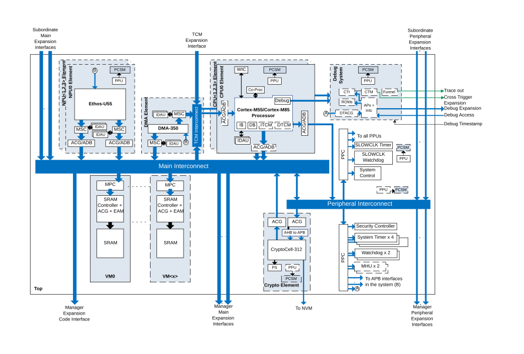

# System block diagram

Source: <https://developer.arm.com/documentation/102803/latest/Overview/Topology/System-block-diagram>

### System block diagram

The following figure shows a representative system block diagram of a fully featured CRSAS Ma1 based IoT Subsystem.

Figure 1. Representative CRSAS Ma1 based system topology

The subsystem can be divided up into the following key groups of functionalities, which in this document is also referred to as elements.

> ### Note
>
> Elements are used simply in this document to group functionalities that are closely related to each other or due to their common configurability.

NPU element
:   Each NPU element contains an Ethos-U55 NPU and its associated private infrastructure to integrate the NPU into the system. CRSAS Ma1 supports zero to four NPU elements within the system.

CPU element
:   Each CPU element contains an Armv8.1-M processor and its associated private infrastructure to integrate the core into the system. CRSAS Ma1 supports one to four CPU elements within the system.

Main interconnect element
:   Connects all parts of the system to each other.

Peripheral interconnect element
:   Provides access to lower performance and often device type peripherals within the system.

DMA element
:   Provides DMA functionality and system and expansion access to the CPU TCMs. The TCM interconnect shown in this element can be merged with the Main interconnect as long as the connectivity shown is maintained.

Volatile memory bank element
:   Volatile memory banks collectively implement the main volatile storage within the subsystem and implement the functionality to manage the volatile storage.

Peripherals element
:   Defines a common set of peripherals expected in the system.

Security and system control element
:   Defines the infrastructure required to implement all configure, control, and monitor system states. These include security, clock, reset, and power control.

Debug system element
:   Defines the debug infrastructures that allow each CPU and the system to be debugged securely.

CryptoCell element
:   Contains a CryptoCell core and its associated infrastructure to integrate the core into the system.
