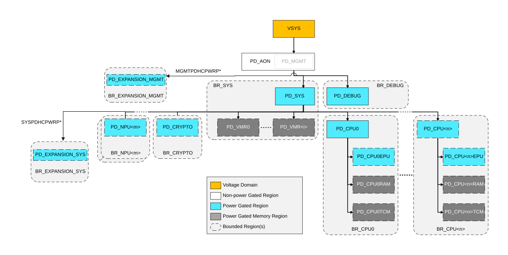

# Power Control P-Channel Expansion Device Interfaces

Source: <https://developer.arm.com/documentation/102803/latest/Interfaces/P-Channel-and-Q-Channel-Device-Interfaces/Power-Control-P-Channel-Expansion-Device-Interfaces>

### Power Control P-Channel Expansion Device Interfaces

CRSAS Ma1 provides power control P-Channel Device interfaces to allow expansion of existing power domain hierarchy with new power domains by coordinating allowed power states of external power domain in the power domain hierarchy.

Each power domain that supports power domain hierarchy extension is provided with a P-Channel interface as follows:

MGMTPDHCPWR P-Channel Device interface for PD\_MGMT
:   This interface resides in the PD\_MGMT power domain when PILEVEL = 2. When PILEVEL < 2, this interface resides in PD\_AON power domain. The interface must only be used for handshaking and coordinating allowed power states of external power domains which are meant to be at the same level as PD\_SYS and PD\_DEBUG in the power domain hierarchy. The interface is running on
    MGMTSYSCLK and reset on
    nCOLDRESETMGMT.

SYSPDHCPWR P-Channel Device interface for PD\_SYS
:   This interface resides in the PD\_MGMT power domain when PILEVEL = 2. When PILEVEL < 2, this interface resides in PD\_AON power domain. The interface must only be used for handshaking and coordinating allowed power states of external power domains which are meant to be at the same level as PD\_NPU and PD\_CPU in the power domain hierarchy. The interface is running on
    MGMTSYSCLK and reset on
    nCOLDRESETMGMT.

Currently, each domain is described as having a minimum of a single P-Channel interface. However, an implementation can provide multiple P-Channel interfaces per domain. For example, to enable multiple power domains to be added and controlled. The number of Power Control P-Channel interfaces per domain is therefore IMPLEMENTATION DEFINED.

These Device P-Channel interfaces are either an asynchronous interface or are synchronous to the clock used in each domain that each of the P-Channel interface controls. The choice is IMPLEMENTATION DEFINED.

For more information on power and voltage domains, please see the following figure and [Power Control Infrastructure](/documentation/102803/0000/Functional-Description/Power-Control-Infrastructure?lang=en "CRSAS Ma1 supports three possible power infrastructure levels:").

Figure 1. Power control P-Channel expansion device interfaces with PILEVEL = 1

