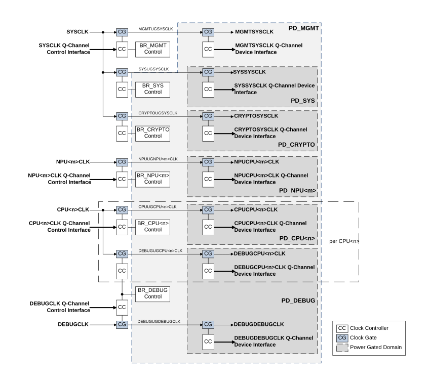

# Clocking infrastructure

Source: <https://developer.arm.com/documentation/102803/latest/Functional-Description/Clocking-infrastructure>

### Clocking infrastructure

CRSAS Ma1 provides several input clocks into the system. These are as follows:

SLOWCLK
:   An always running clock that is expected also to be the first available when the system first powers up.

    This clock is also required to run while others can be turned off when the system is in its lowest power state other than OFF.

    This clock minimally drives the following logic that resides in the PD\_AON power domain:

    - A 32-bit Timer. This timer running at SLOWCLK allows the user to setup a wake event.
    - A 32-bit Watchdog Timer. This watchdog timer provides protection against an unresponsive system, particularly during the lowest power state.

AONCLK
:   This clock drives all other logic that resides in the PD\_AON domain.

    This does not include logic in the PD\_MGMT power domain that is merged into PD\_AON when PILEVEL < 2. The Q-Channel Control interface, AONCLK Q-Channel Control Interface, allows the subsystem to request and handshake the availability of the AONCLK.

    This clock drives the following:

    - External Wakeup Interrupt Controller<n> (EWIC<n>) that allows a processor to be woken through an interrupt.
    - The PD\_MGMT PPU.
    - All other logic in the PD\_AON domain that is not running on SLOWCLK or SYSCLK when PILEVEL < 2.

SYSCLK
:   This is the main system clock that drives most of the system that resides in the PD\_SYS power domain.

    This clock also drives all logic that resides in the PD\_MGMT domain. The Q-Channel Control interface, SYSCLK Q-Channel Control Interface, allows the subsystem to request and handshake the availability of the SYSCLK.

    This clock is requested to run in any of the following cases:

    - System is not in HIBERNATION{0-1} or in SYS\_RET power state.
    - It is forced to run through the CLOCK\_FORCE register.
    - Activity based clock request from the logic associated with this clock.

    This clock drives the following:

    - The Main Interconnect and Peripheral Interconnect and other related functionality like expansion interfaces.
    - System and Security Control related registers and logic, except those that resides in PD\_AON
    - Power Control logic that resides in PD\_MGMT power domain that controls the PD\_SYS, PD\_CPU<n>, PD\_DEBUG, PD\_NPU<m> and PD\_CRYPTO power domains.
    - All Volatile Memory interfaces and peripherals in the PD\_SYS domain, along with the interfaces to Timers and Watchdog timers.

CPU<n>CLK
:   Each clock input drives a single processor core and its associated expansion interfaces and integration logic. The Q-Channel Control interface, CPU<n>CLK Q-Channel Control Interface, allows the subsystem to request and handshake the availability of the CPU<n>CLK.

    Each clock is expected to be requested to run in any of the following cases:

    - Its associated CPU core domain, PD\_CPU<n>, or the CPU core’s debug domain in the Debug System, PD\_DEBUG, are not in OFF, MEM\_RET\* or FULL\_RET\* state.
    - It is forced to run through the CLOCK\_FORCE register.
    - Clock request from the logic associated with this clock.

DEBUGCLK
:   This clock must exist when HASCSS = 1.

    This clock drives the Debug System. The Q-Channel Control interface, DEBUGCLK Q-Channel Control Interface, allows the subsystem to request and handshake the availability of the DEBUGCLK.

    This clock is expected to be requested to run in any of the following cases:

    - Its associated CPU core’s debug domain in the Debug System, PD\_DEBUG, is not in OFF state.
    - It is forced to run through the CLOCK\_FORCE register.
    - Clock request from the logic associated with this clock.

CNTCLK
:   This clock is associated with the System Timestamp input, CNTVALUE<G/B>.

    This clock is used to drive timestamp related logic in all timestamp-based Timers and Watchdogs.

NPU<m>CLK
:   These clocks must be present when NUMNPU > 0. Each clock input drives a single NPU core and its associated interfaces and integration logic. The Q-Channel Control interface, NPU<m>CLK Q-Channel Control Interface, allows the subsystem to request and handshake the availability of the NPU<m>CLK.

    Each clock is expected to be requested to run in any of the following cases:

    - Its associated NPU domain, PD\_NPU<m>, is not in OFF state.
    - It is forced to run through the CLOCK\_FORCE register.
    - Clock request from logic associated with this clock.

The granularity of the switching of each clock as controlled by each clock Q-Channel control interface is IMPLEMENTATION DEFINED. We recommend that all Q-Channel Control interfaces defined here are used in relation to the system power state, where each clock is requested to turn on or off depending on the power state of the domains that use them. The expectation is that there is a higher cycle cost in starting and stopping these clock sources. We do not recommend that these clock Q-Channel control interfaces are used to perform activity based high-level clock gating. Instead, an implementation of CRSAS Ma1 should perform activity based high-level clock gating internally.

The following figure shows an example clock structure showing how the output clocks are related to the input clocks and their power domain relationships.

Figure 1. Clock tree example

> ### Note
>
> The diagram does not show internal Q-Channel and P-Channel infrastructure that is required for each clock controller.
>
> All blocks not in a Power Gated Domain are in the always on PD\_AON domain. For more on power domains, see sections [Advanced level power infrastructure](/documentation/102803/0000/Functional-Description/Power-Control-Infrastructure/Advanced-level-power-infrastructure?lang=en "The Advanced level power infrastructure specifies a power control infrastructure that provides additional functionality to help an implementation achieve very low power at the lowest System Power State. This is achieved by providing more voltage and power domains."), [Intermediate level power infrastructure](/documentation/102803/0000/Functional-Description/Power-Control-Infrastructure/Intermediate-level-power-infrastructure?lang=en "The Intermediate Level power infrastructure makes some simplifications to reduce the complexity of the infrastructure at the cost of reducing the support provided to reduce always-on leakage power and power during HIBERNATE1 state.") and [Basic level power infrastructure](/documentation/102803/0000/Functional-Description/Power-Control-Infrastructure/Basic-level-power-infrastructure?lang=en "The Basic Level power infrastructure, when PILEVEL = 0, locks the CPU top-level power domain to the main system to reduce the complexity of the infrastructure to reduce the complexity of the infrastructure by locking the CPU top-level power domain to the main system. This reduces the number of power domains and hence the number of PPUs in the system."). Note that in this example, clocks are often gated twice, once in relation to the state of a power domain that the clock is driving and gated again internally within a domain depending on the activity within the domain. An implementation of CRSAS Ma1 can have varying levels of gating and this is IMPLEMENTATION DEFINED.

CRSAS Ma1 provides clock source force registers that request the clock sources to continue clock generation regardless of the state of the system. These clock source forces do not affect the power or high-level clock gating provided within the system. For more information, see [CLOCK\_FORCE](/documentation/102803/0000/Programmers-model/System-Control-Peripheral-Region/System-Control-Register-Block/CLOCK-FORCE?lang=en "The Clock Force register allows software to override dynamic clock gating that may be implemented in the system and keep each clock running.").
