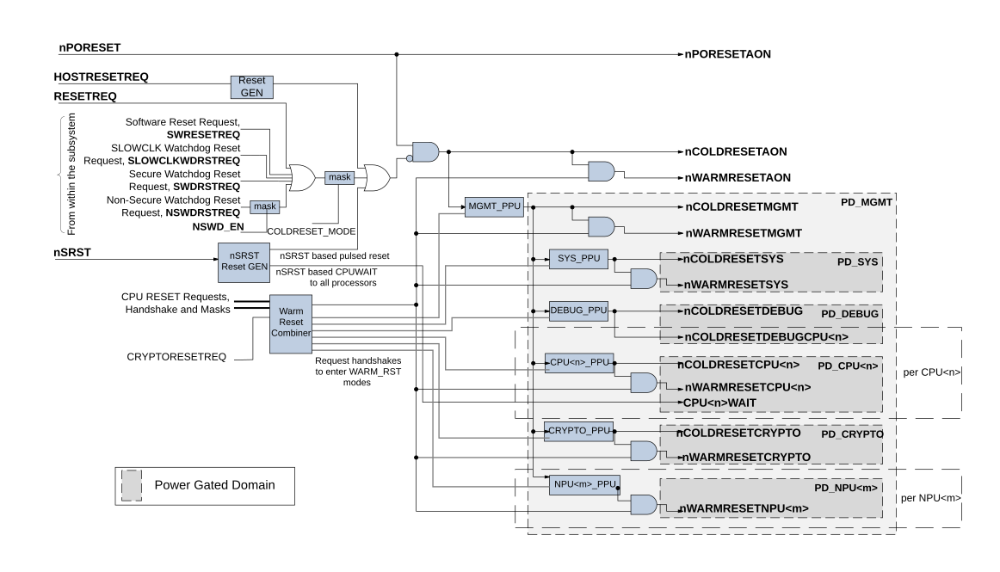

# Reset infrastructure

Source: <https://developer.arm.com/documentation/102803/latest/Functional-Description/Reset-infrastructure>

### Reset infrastructure

CRSAS Ma1 defines the following system level reset scopes, namely:

- Power-on reset
- Cold reset
- Warm reset

It is not possible to have a Power-on reset without also having a Cold reset. It is not possible to have a Cold reset without also having a Warm reset.

On Power-on reset, registers that have a defined reset value contain that value. On Cold reset, same as Power-on reset except the [RESET\_SYNDROME](/documentation/102803/0000/Programmers-model/System-Control-Peripheral-Region/System-Control-Register-Block/RESET-SYNDROME?lang=en "The RESET_SYNDROME register stores the reason for the last Reset event. Writing HIGH to a bit results in that bit write value to be ignored and the bit maintaining its previous value. RESET_SYNDROME is cleared by software writing zero to each bit to clear. If after starting from a reset event, RESET_SYNDROME is not cleared, on another reset event, the register may no longer accurately reflect the last reset event. CPU<n>LOCKUP does not actually generate reset, but when HIGH, it indicates that a CPU has locked-up and could be a precursor to another reset event, for example, watchdog timer reset request.") remain unchanged. On Warm reset, same as Cold reset except, debug related registers, parts of the power clock management infrastructure as specified in this document remain unchanged. Local derivative of these resets may exits per power or clock domain.

Reset distribution defines how the output resets are related to the input resets and reset requests, and which power domains the reset outputs primarily drive.

CRSAS Ma1 has the following reset input signal to reset the subsystem:

nPORESET
:   This is the Active LOW Cold reset input for the system. We recommend that the reset is asserted for one or more
    SLOWCLK cycles.

CRSAS Ma1 also has the following reset-related request and handshake signals:

nSRST
:   This input, typically from an external debugger, is an Active LOW system-wide reset request.

    This reset request, when initially asserted, results in a cold reset being applied to the subsystem and then subsequently removed. However, while nSRST is asserted, the CPUWAIT inputs of all CPUs are held HIGH, preventing all CPU cores from booting, until nSRST is de-asserted. This is regardless of the register setting in the [CPUWAIT](/documentation/102803/0000/Programmers-model/System-Control-Peripheral-Region/System-Control-Register-Block/CPUWAIT?lang=en "The CPUWAIT register provides controls to force each CPU to wait after reset rather than Boot Immediately. This allows another entity in the expansion system or the debugger to access the system prior to the CPU booting.") register. For more information on nSRST, see Arm® Debug Interface Architecture Specification ADIv6.0.

    While the minimum duration of the assertion of nSRST is IMPLEMENTATION DEFINED, we strongly recommend that nSRST input be at least three SLOWCLK cycles long, especially if nSRST is asynchronous to SLOWCLK. This is because nSRST is likely to be treated as a reset request signal that needs to be resynchronized before use, rather than an actual reset signal. It can then be held LOW for as long as is required to hold off the CPU from execution.

RESETREQ
:   This reset request input allows external expansion logic to request for a Cold reset.

    After it is asserted, the signal must be held HIGH until the reset occurs on nCOLDRESETAON which must clear this input. This reset is expected to be driven by expansion logic that is hosted by the subsystem.

HOSTRESETREQ
:   This reset request input allows a higher-level entity to reset the system.

    A higher-level entity can for example be a host system that this subsystem is subservient to, which needs to have control over the reset of this system. Asserting this request causes a Cold reset. Holding this request HIGH maintains the subsystem in Cold reset.

    Since this input, like nSRST, is a request rather than a direct reset input, we strongly recommend that it is asserted for at least three SLOWCLK cycles long.

EXPWARMRESETREQ
:   This expansion Warm reset request output signal, when set to HIGH, indicates that the reset logic is about to assert Warm reset to the system, and waits for the EXPWARMRESETACK signal to be HIGH before asserting the reset.

    This allows any external logic to delay the assertion of Warm reset to be able to complete any critical operations. If this signal is not used, you must connect EXPWARMRESETREQ to EXPWARMRESETACK. Once EXPWARMRESETREQ is set to HIGH, EXPWARMRESETACK must also transition to HIGH in a reasonable time. Similarly, once EXPWARMRESETREQ has returned to LOW, EXPWARMRESETACK must also transition to LOW in a reasonable time. Failing to do so can cause system deadlock.

    The existence of this signal and the associated acknowledge signal is IMPLEMENTATION DEFINED.

EXPWARMRESETACK
:   This expansion Warm reset acknowledge input signal works with EXPWARMRESETREQ to allow any external logic to delay the assertion of Warm reset.

    The existence of this signal and the associated request signal is IMPLEMENTATION DEFINED.

The following outputs are provided for expansion logic hosted by the subsystem:

nCOLDRESETAON
:   This PD\_AON domain reset output is the Cold reset signal intended for use by the subsystem expansion logic. This reset merges other reset sources that are required to cause Cold reset. See
    [Power-on and Cold reset handling](/documentation/102803/0000/Functional-Description/Reset-infrastructure/Power-on-and-Cold-reset-handling?lang=en "The input nPORESET is the power-on reset input that resets all registers in the design. This includes resetting the Reset Syndrome, see RESET_SYNDROME.").

nWARMRESETAON
:   The subsystem generates this signal to perform a system Warm reset. The scope for this reset is a subset of
    nCOLDRESETAON and is also asserted when the system is in WARM\_RST state. It is expected to reset all non-debug related expansion logic that resides in the PD\_AON power domain.

nCOLDRESETMGMT
:   The scope for this reset is a subset of
    nCOLDRESETAON and is also asserted when PD\_MGMT power domain is in lower power (OFF) states. When PILEVEL = 2, it is expected to be used in the PD\_MGMT power domain, or when PILEVEL < 2, it is expected to be used to reset logic that was in the PD\_MGMT that is merged into PD\_AON.

nWARMRESETMGMT
:   The scope for this reset is a subset of
    nCOLDRESETMGMT and is also asserted when system is in WARM\_RST state. When PILEVEL =2, this reset is used to reset all non-debug related expansion logic in the PD\_MGMT power domain. When PILEVEL<2, this reset is used to reset all non-debug related expansion logic in the PD\_AON power domain that was merged from PD\_MGMT.

nCOLDRESETSYS
:   The scope for this reset is a subset of
    nCOLDRESETAON and is also asserted when PD\_SYS power domain is in lower power (MEM\_RET/OFF) states. It is expected to reset all expansion logic in the PD\_SYS power domain.

nWARMRESETSYS
:   The scope for this reset is a subset of
    nCOLDRESETSYS and is also asserted when system is in WARM\_RST state. It is expected to reset all non-debug related expansion logic in the PD\_SYS power domain.

nCOLDRESETDEBUG
:   The scope for this reset is a subset of
    nCOLDRESETAON and is also asserted when PD\_DEBUG power domain is in lower power (OFF) state. It is expected to reset all expansion logic in the PD\_DEBUG power domain.

nWARMRESETCRYPTO
:   The scope for this reset is a subset of
    nCOLDRESETAON and is also asserted when system is in WARM\_RST state and when PD\_CRYTPO is in lower power (OFF) state. It is expected to reset all non-debug related expansion logic in the PD\_CRYPTO power domain. This reset only exists when HASCRYPTO = 1 and PILEVEL = 2.

nCOLDRESETCPU<n>
:   The scope for this reset is a subset of
    nCOLDRESETAON and is also asserted when PD\_CPU< n> power domain is in lower power (MEM\_RET/OFF) states. It is expected to reset all expansion logic in the PD\_CPU< n> power domain.

nWARMRESETCPU<n>
:   The scope for this reset is a subset of
    nCOLDRESETCPU<n> and is also asserted when system is in WARM\_RST state. It is expected to reset all non-debug related expansion logic in the PD\_CPU< n> power domain.

nCOLDRESETDEBUGCPU<n>
:   The scope for this reset is a subset of
    nCOLDRESETAON and is also asserted when PD\_DEBUG system is in lower power (OFF) state. It is expected to reset all debug related expansion logic associated with debug logic of each CPU core that resides in the PD\_DEBUG power domain.

The following signal is provided for internal use and defined for reference and clarity:

nWARMRESETNPU<m>
:   The scope for this reset is a subset of
    nCOLDRESETAON and is also asserted when system is in WARM\_RST state and when PD\_NPU<m> is in lower power (OFF) state. It is expected to reset all logic in the PD\_NPU<m> power domain. This reset must exist when NUMNPU >0.

In addition to the above, four status outputs are provided to indicate the status of four events that can be used to generate a Cold reset of the system. These are as follows:

NSWDRSTREQSTATUS
:   Non-secure watchdog reset request status. This output is ‘1’ when the Non-secure Watchdog is raising a reset request and RESET\_MASK.NSWDRSTREQEN is ‘1’. Once set to HIGH, it does not return to LOW unless a reset occurs clearing this status.

SWDRSTREQSTATUS
:   Secure watchdog reset request status. This output is ‘1’ when the Secure Watchdog is raising a reset request. Once set to HIGH it does not return to LOW unless a reset occurs on
    nCOLDRESETAON, clearing this status.

RESETREQSTATUS
:   Hardware Reset Request status. This output is set to ‘1’ when the
    RESETREQ input is ‘1’. Once set to HIGH, it must not be cleared unless the system is reset on
    nCOLDRESETAON, which restores the register field to ‘0’.

SWRSTREQSTATUS
:   Software Reset Request Status. This output is ‘1’ when SWRESET.SWRESETREQ is set to ‘1’. Once set to HIGH, it must not be cleared unless the system is reset on
    nCOLDRESETAON, which restores the register field to ‘0’.

SSWDRSTREQSTATUS
:   Secure Privileged
    SLOWCLK Watchdog reset request status. This output is ‘1’ when the Secure Privileged
    SLOWCLK Watchdog is raising a reset request. Once set to HIGH, it does not return to LOW unless a reset occurs on
    nCOLDRESETAON, clearing this status.

The following figure shows an example reset structure showing how the output resets are related to the input resets and reset request, and which power domain the reset output primarily drives. The diagram does not show infrastructure for reset resynchronization and how the resets are used within each domain. It shows a reset signal nPORESETAON which is not an output of the subsystem and is only used within the system to reset the RESET\_SYNDROME register. See [RESET\_SYNDROME](/documentation/102803/0000/Programmers-model/System-Control-Peripheral-Region/System-Control-Register-Block/RESET-SYNDROME?lang=en "The RESET_SYNDROME register stores the reason for the last Reset event. Writing HIGH to a bit results in that bit write value to be ignored and the bit maintaining its previous value. RESET_SYNDROME is cleared by software writing zero to each bit to clear. If after starting from a reset event, RESET_SYNDROME is not cleared, on another reset event, the register may no longer accurately reflect the last reset event. CPU<n>LOCKUP does not actually generate reset, but when HIGH, it indicates that a CPU has locked-up and could be a precursor to another reset event, for example, watchdog timer reset request.").

An implementation of CRSAS Ma1 can have a different reset tree implementation but the relationships as specified for the reset signals must remain the same.

Figure 1. Reset structure example

- **[Power-on and Cold reset handling](/documentation/102803/0000/Functional-Description/Reset-infrastructure/Power-on-and-Cold-reset-handling?lang=en)**
   The input nPORESET is the power-on reset input that resets all registers in the design. This includes resetting the Reset Syndrome, see [RESET\_SYNDROME](/documentation/102803/0000/Programmers-model/System-Control-Peripheral-Region/System-Control-Register-Block/RESET-SYNDROME?lang=en "The RESET_SYNDROME register stores the reason for the last Reset event. Writing HIGH to a bit results in that bit write value to be ignored and the bit maintaining its previous value. RESET_SYNDROME is cleared by software writing zero to each bit to clear. If after starting from a reset event, RESET_SYNDROME is not cleared, on another reset event, the register may no longer accurately reflect the last reset event. CPU<n>LOCKUP does not actually generate reset, but when HIGH, it indicates that a CPU has locked-up and could be a precursor to another reset event, for example, watchdog timer reset request.").
- **[CPU Reset Handling](/documentation/102803/0000/Functional-Description/Reset-infrastructure/CPU-Reset-Handling?lang=en)**
   Each CPU<n>’s nPORESET reset input is driven by the PPU that controls each CPU Core power domain, PD\_CPU<n>. This PPU itself is reset using nCOLDRESETMGMT.
- **[NPU Reset handling](/documentation/102803/0000/Functional-Description/Reset-infrastructure/NPU-Reset-handling?lang=en)**
   If NUMNPU > 0, each nRESET input of the NPUs is driven by the PPU that controls the NPU power domain PD\_NPU<m> and the Warm reset is driven from Warm Reset Generation logic that resides in the PD\_AON domain. This, along with all PPUs in the system, is used to force the system to idle before driving Warm reset. The PPU itself is reset using nCOLDRESETMGMT.
- **[Warm Reset Generation](/documentation/102803/0000/Functional-Description/Reset-infrastructure/Warm-Reset-Generation?lang=en)**
   The System provides a Warm reset for each power domain, which is available for the expansion system on the nWARMRESETAON signal. This reset is generated by first merging System reset requests from all CPU<n> in the system, and from CryptoCell if it exists after masking each with the values in the [RESET\_MASK](/documentation/102803/0000/Programmers-model/System-Control-Peripheral-Region/System-Control-Register-Block/RESET-MASK?lang=en "The RESET_MASK register allows software to control which reset sources are going to be merged to generate the system wide warm reset, nWARMRESETAON, or the nCOLDRESETAON signal. Set each bit to HIGH to enable each source. Note that each of these mask bits, if cleared, not only prevents the reset source being used to generate the reset, it also prevents the associated RESET_SYNDROME register bit from recording the event.") register. The merged reset request is then used to request all PPUs in the system to enter the Warm reset state. Once all PPUs have entered the Warm reset, which is the WARM\_RST system power state, then nWARMRESETAON is asserted. Each lower hierarchical domain has its local version of Warm reset signal to perform the Warm reset.
