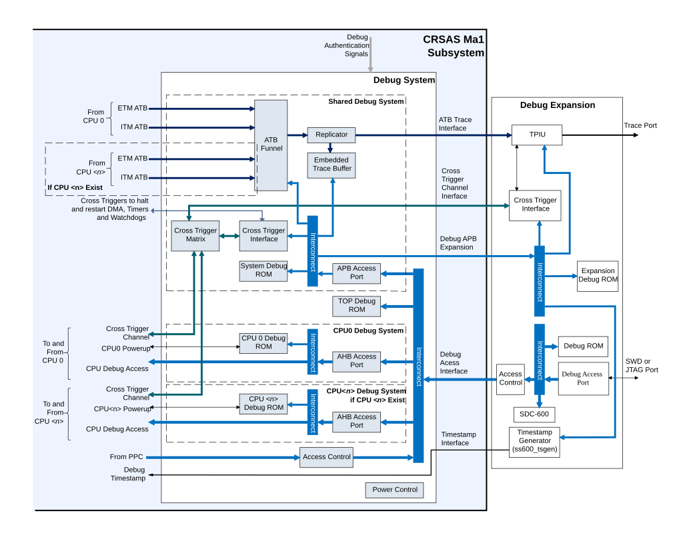

# Full Debug Configuration

Source: <https://developer.arm.com/documentation/102803/latest/Functional-Description/Debug-Infrastructure/Full-Debug-Configuration>

### Full Debug Configuration

When HASCSS = 1 and DEBUGLEVEL > 0, the system contains a CoreSight SoC-600 based debug infrastructure. This infrastructure provides the following functionality:

- A single CoreSight Debug Access Port to access an number of Coresight Access Ports (APs). Each of these next level Coresight Access Ports then provides debug access to each individual CPU core and to the Shared Debug System that they all share.
- When DEBUGLEVEL > 1, a shared trace infrastructure where all trace data are funneled onto a single trace data output, or to an Embedded Trace Buffer (ETB).
- A System Subordinate interface to the main interconnect to provide System access to the CoreSight Access Ports
- Cross Trigger Matrix and Interfaces to distribute triggers between cores and the Shared Debug System.
- Expansion interfaces which allow additional CoreSight components to be added according to the specific needs of an SoC.

The following figure shows a representative example architecture block diagram of the Debug System.

> ### Note
>
> This example does not show IMPLEMENTATION DEFINED components or blocks that may be required due to clock, reset, and power domain crossing, nor does it include bus width conversion or buffering that is not directly visible to software.

Figure 1. Example debug subsystem structure

In the above figure, the block “Debug System” is shown as composed of a number of lower level systems blocks that it provides access to. These include:

- CPU<n> Debug Systems which are each associated to a processor in the system,
- A Shared Debug System, which all processors share to provide the ability to merge trace data, support cross triggering, and to support debug expansion.

- **[Debug Access](/documentation/102803/0000/Functional-Description/Debug-Infrastructure/Full-Debug-Configuration/Debug-Access?lang=en)**
   The CoreSight SoC-600 based debug infrastructure provides a single APB4 Debug Access Interface for an expansion Debug Access Port (DAP) to connect to minimum of two and up to five Memory Access Ports (MEM-AP), along with a Debug ROM table with the following purpose:
- **[Timestamps](/documentation/102803/0000/Functional-Description/Debug-Infrastructure/Full-Debug-Configuration/Timestamps?lang=en)**
   CRSAS Ma1 provides a debug timestamp input, TSVALUE<B/G>[63:0], that is used by all debug logic that requires timestamp within the subsystem. These are primarily the processor cores in the system.
- **[Cross Trigger](/documentation/102803/0000/Functional-Description/Debug-Infrastructure/Full-Debug-Configuration/Cross-Trigger?lang=en)**
   The Shared Debug System implements a Cross Trigger Matrix (CTM) and a single Cross Trigger Interface (CTI). These together allow DMA, timers, and watchdog timers in the CRSAS Ma1 subsystem to be halted and restarted using trigger sources from any of the CPU cores and also from trigger sources external to the subsystem through the Cross Trigger Channel Interface.
- **[Trace Infrastructure](/documentation/102803/0000/Functional-Description/Debug-Infrastructure/Full-Debug-Configuration/Trace-Infrastructure?lang=en)**
   When DEBUGLEVEL = 2, CRSAS Ma1 provides a trace infrastructure that funnels all trace source from all processor cores to a single trace data stream. This stream is then replicated and one drives the ATB Trace interface that is expected to be picked up by a TPIU. The other stream is taken up by the ETB, allowing the trace data to be read by software or by an external debugger through the Debug Access Interface.
