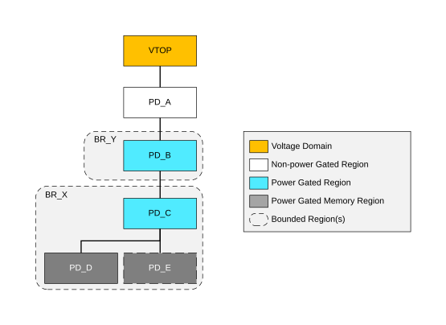
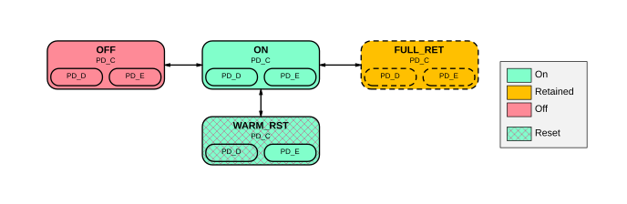

# Power Control Infrastructure

Source: <https://developer.arm.com/documentation/102803/latest/Functional-Description/Power-Control-Infrastructure>

### Power Control Infrastructure

CRSAS Ma1 supports three possible power infrastructure levels:

- PILEVEL = 0: This is Basic Level power infrastructure.
- PILEVEL = 1: This is Intermediate Level power infrastructure.
- PILEVEL = 2: This is Advanced Level power infrastructure.

This section provides a description of the power domain hierarchy, power states of each power domain, and the power control dependencies between the power domains, and, finally the overall system power states.

The following figure shows a simple power hierarchy diagram that is used to describe the power region relationships.

Figure 1. Example power hierarchy

In the preceding diagram, each rectangular block represents either a voltage domain or a power domain. If a line connects two blocks where one is above another, it indicates that the domain below is within the hierarchy of the domain above. For example, PD\_A region is within the VTOP voltage domain, PD\_B is within PD\_A, PD\_C is within PD\_B, and PD\_D and PD\_E is within PD\_C. A block with dotted line indicates that the existence of the region is configuration-dependent.

Typically, when a region in the higher-level hierarchy has several regions below it, before that region can enter a lower power state, the lower hierarchy level regions also must already be in a lower power state, or to transition to the lower power state before or at the same time.

A rounded dotted bounding box over one or several regions indicates that their power states are controlled collectively. These are called Bounded Regions (BR). For example, PD\_C, PD\_D and PD\_E regions are in a bounded region BR\_X. A bounded region is often controlled using a single Power Policy Unit. PPUs are complemented by LPI infrastructure components to bring together the quiescence status and control of IP blocks primarily within the power domains that are controlled by each PPU.

The power modes of a Bounded Region are represented using a state transition diagram that shows all the modes and the supported transitions between them. For example, the following shows a simple four modes transition diagram, for a Bounded Region with three power regions, PD\_C, PD\_D and PD\_E. Each state is represented by a box that represents the higher hierarchy region power state, with boxes internally that represents lower hierarchy region power states. A name is given to each power mode in bold. For example, the diagram below only has four BR power modes, OFF, ON, WARM\_RST and FULL\_RET. The different colors indicate the power state of each region itself. Patterned fill of a region indicates a Bounded Region mode specifically entered to prepare for the application of reset for all registers residing in the corresponding Warm reset domain. PD\_E is never reset because it is a memory power domain. Dashed lined block (FULL\_RET in the example) indicates that the mode is optional.

Figure 2. Example Power Mode Transition Diagram of three bounded power regions, PD\_C, PD\_D and PD\_E

> ### Note
>
> These mode diagrams are very similar to PPU power mode transitions. However, the diagrams here and their modes do not indicate that a power mode in the PPU with the same name is used, although it is likely that they match and it is IMPLEMENTATION DEFINED how these are mapped to PPU modes.

A Power Dependency Control Matrix (PDCM) is also defined as a table for each PILEVEL. The PDCM is used to describe and control how each power domain affects another and the lowest power state each domain is allowed to enter.

For each PILEVEL, a System Level Power State table is provided that defines and describes several high-level power states of the system in relation of the power domains states. Each row of table describes a defined System Level Power state, and the supported power states of the power domains and other system states like clock availability and voltage supply, of that state. Combinations of power domain states that are not supported in the table are not supported by the system.

- **[Advanced level power infrastructure](/documentation/102803/0000/Functional-Description/Power-Control-Infrastructure/Advanced-level-power-infrastructure?lang=en)**
   The Advanced level power infrastructure specifies a power control infrastructure that provides additional functionality to help an implementation achieve very low power at the lowest System Power State. This is achieved by providing more voltage and power domains.
- **[Intermediate level power infrastructure](/documentation/102803/0000/Functional-Description/Power-Control-Infrastructure/Intermediate-level-power-infrastructure?lang=en)**
   The Intermediate Level power infrastructure makes some simplifications to reduce the complexity of the infrastructure at the cost of reducing the support provided to reduce always-on leakage power and power during HIBERNATE1 state.
- **[Basic level power infrastructure](/documentation/102803/0000/Functional-Description/Power-Control-Infrastructure/Basic-level-power-infrastructure?lang=en)**
   The Basic Level power infrastructure, when PILEVEL = 0, locks the CPU top-level power domain to the main system to reduce the complexity of the infrastructure to reduce the complexity of the infrastructure by locking the CPU top-level power domain to the main system. This reduces the number of power domains and hence the number of PPUs in the system.
