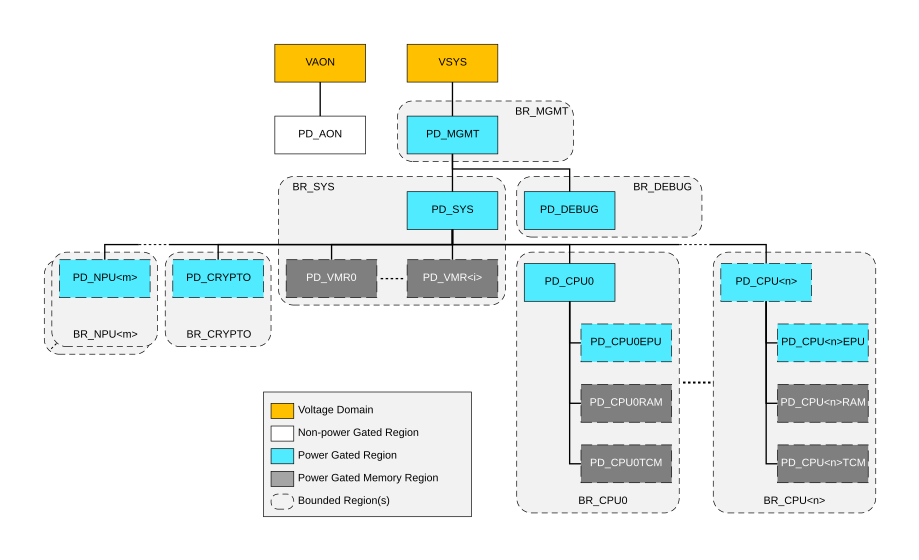

# Power hierarchy

Source: <https://developer.arm.com/documentation/102803/latest/Functional-Description/Power-Control-Infrastructure/Advanced-level-power-infrastructure/Power-hierarchy>

### Power hierarchy

The system at PILEVEL = 2 supports the following power domains:

- PA\_AON
- PD\_DEBUG
- PD\_MGMT
- PD\_SYS
- PD\_VMR<i>, where i is 0 to NUMVMBANK-1, and does not exist if NUMVMBANK = 0
- PD\_CRYPTO
- PD\_NPU<m>, does not exist if NUMNPU = 0
- PD\_CPU<n>
- PD\_CPU<n>EPU
- PD\_CPU<n>RAM
- PD\_CPU<n>TCM

These power domains are hierarchical and the following figure shows the voltage and power domain hierarchy.

Figure 1. Voltage and Power domain hierarchy of a subsystem with PILEVEL = 2

The figure also shows several Bounded Regions. Each of these Bounded Regions is controlled by a single PPU, and these are:

BR\_MGMT
:   This is controlled by a single PPU, MGMT\_PPU.

    The power domain in BR\_MGMT is PD\_MGMT

BR\_DEBUG
:   This is controlled by a single PPU, DEBUG\_PPU.

    The power domain in BR\_DEBUG is PD\_DEBUG: This is a combined power gated logic and memory domain for all debug logic in the system.

BR\_SYS
:   This is controlled by a single PPU, SYS\_PPU.

    The power domains in BR\_SYS are:

    - PD\_SYS
    - PD\_VMR<i> one for each VM<i>, where i is 0 to NUMVMBANK – 1. This power domain does not exist when NUMVMBANK = 0.

BR\_CPU< n>
:   Each is controlled by a single PPU, CPU<n>\_PPU.

    The power domains in BR\_CPU<n> are:

    - PD\_CPU<n>
    - PD\_CPU<n>EPU
    - PD\_CPU<n>RAM
    - PD\_CPU<n>TCM

BR\_CRYPTO
:   This is controlled by a single PPU, CRYPTO\_PPU.

    The power domain in BR\_CRYPTO is PD\_CRYPTO

BR\_NPU<m>
:   Each Bounded Region is controlled by a single PPU, NPU<m>\_PPU.

    The power domain in BR\_NPU<m> is PD\_NPU<m>
