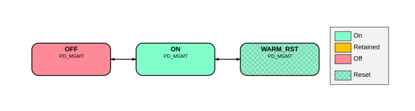

# BR_MGMT power modes

Source: <https://developer.arm.com/documentation/102803/latest/Functional-Description/Power-Control-Infrastructure/Advanced-level-power-infrastructure/BR-MGMT-power-modes>

### BR\_MGMT power modes

The following figure shows the power modes that BR\_MGMT supports.

Figure 1. BR\_MGMT power mode transition diagram

On Cold reset the PD\_MGMT automatically transitions to ON state and enters OFF state eventually. When a Warm reset is requested, the bounded region power state enters the WARM\_RST once the domain is idle and ready for reset. The domain dynamically enters the OFF state. It always either enters or stays in the ON state on the following conditions:

- Any of the other power domains that lie within PD\_MGMT is entering or is already in the ON state.
- MGMTWAKEUP Q-Channel Device Interface for PD\_MGMT is driven to request to leave the OFF state.

BR\_MGMT power modes do not specifically support the FUL\_RET state but some registers that might reside in the PD\_MGMT domain may need to be retained when PD\_MGMT is OFF and it is IMPLEMENTATION DEFINED how this is achieved.
