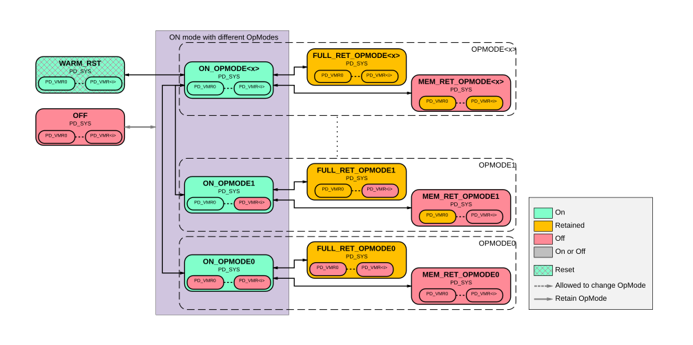

# BR_SYS power modes

Source: <https://developer.arm.com/documentation/102803/latest/Functional-Description/Power-Control-Infrastructure/Advanced-level-power-infrastructure/BR-SYS-power-modes>

###

The following figure shows the power modes that BR\_SYS supports.

Figure 1. BR\_SYS power mode transition diagram

BR\_SYS power modes have 2NUMVMBANK different operating modes, which can be 1, 2, 4, 8, or 16. This is encoded as a binary value of up to four bits with each bit for a PD\_VMR<i>. Each bit therefore indicates a specific PD\_VMR<i> to be enabled or disabled.

When NUMVMBANK = 0, the BR\_SYS power modes only have one operating mode which means that a PPU supporting the BR\_SYS does not need to support operating modes. When a PD\_VMR<i> is disabled, its lower power mode is always the OFF state. Other than OFF or WARM\_RST states, it is only possible to move between the operating modes while in one of the ON modes.

For example, for a system with NUMVMBANK = 2

- OPMODE0: PD\_VMR0 and PD\_VMR1 are both disabled.
- OPMODE1: PD\_VMR0 is enabled and PD\_VMR1 is disabled.
- OPMODE2: PD\_VMR0 is disabled and PD\_VMR1 is enabled.
- OPMODE3: PD\_VMR0 and PD\_VMR1 are both enabled.

On Cold reset, the system enters the ON\_OPMODE<NUMVMBANK-1>. In this power mode, all PD\_VMR<i> are enabled.

When a Warm reset is requested, the bounded region transitions to the WARM\_RST through other power modes once the domain is idle and ready for reset.

> ### Note
>
> The DMA includes a minimum power register in its programmers model. If the DMA is included in the system ( NUMDMA > 0 ), it can prevent PD\_SYS from transitioning to a power state that is lower than its internal minimum power register allows.

- **[Controlling PD\_VMR<i> power mode](/documentation/102803/0000/Functional-Description/Power-Control-Infrastructure/Advanced-level-power-infrastructure/BR-SYS-power-modes/Controlling-PD-VMR-i--power-mode?lang=en)**
   To configure the required low-power state of each PD\_VMR<i>, software must configure the register fields PDCM\_PD\_VMR<i>\_SENSE.MIN\_PWR\_STATE as follows:
