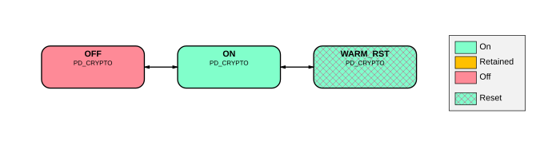

# BR_CRYPTO power modes

Source: <https://developer.arm.com/documentation/102803/latest/Functional-Description/Power-Control-Infrastructure/Advanced-level-power-infrastructure/BR-CRYPTO-power-modes>

### BR\_CRYPTO power modes

The following figure shows the power modes that BR\_CRYPTO supports.

Figure 1. BR\_CRYPTO power mode transition diagram

On Cold reset, the bounded domain enters the ON state.

When a Warm reset is requested, the bounded region transitions to the WARM\_RST once all dependent domain is idle and ready for reset.
