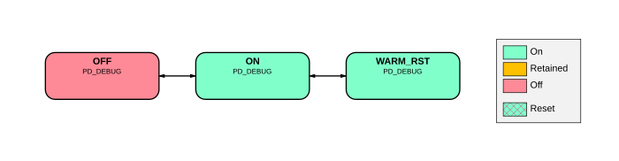

# BR_DEBUG power modes

Source: <https://developer.arm.com/documentation/102803/latest/Functional-Description/Power-Control-Infrastructure/Intermediate-level-power-infrastructure/BR-DEBUG-power-modes>

### BR\_DEBUG power modes

The following figure shows the power modes that BR\_DEBUG supports.

Figure 1. BR\_DEBUG power mode transition diagram

On Cold reset, PD\_DEBUG automatically transitions to ON state, and enters OFF state eventually if the debug system is not required to stay ON. It is woken either through the PD\_DEBUG’s Power Control Wakeup Q-Channel Device Interface interface or through a bus access targeting its shared debug domain. The WARM\_RST state is entered to bring the debug domain into an idle state so that the main system can be Warm reset cleanly. The WARM\_RST state is entered even though the debug domain is not itself being Warm reset at the same time.
