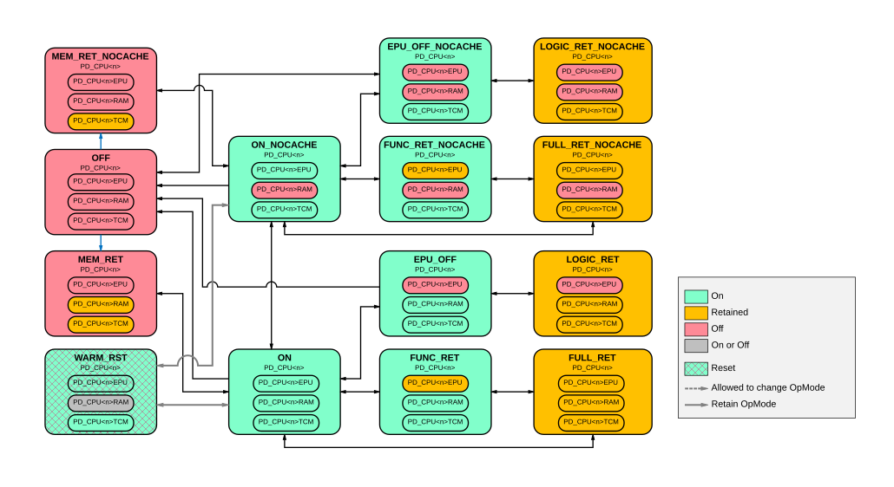

# BR_CPU<n> power modes

Source: <https://developer.arm.com/documentation/102803/latest/Functional-Description/Power-Control-Infrastructure/Intermediate-level-power-infrastructure/BR-CPU-n--power-modes>

### BR\_CPU<n> power modes

The following figure shows the power modes that BR\_CPU<n> supports.

Figure 1. BR\_CPU<n> power mode transition diagram

On Cold reset, the bounded region enters the EPU\_OFF\_NOCACHE power mode.

The PD\_CPU<n>TCM power state always matches that of PD\_CPU<n>, except when in MEM\_RET or MEM\_RET\_NOCACHE states where it is retained. The choice from ON\_NOCACHE to either MEM\_RET\_NOCACHE or OFF is determined by the CPU’s local TCM minimum power state register configuration, CPUPWRCFG.TCM\_MIN\_PWR\_STATE.

When a Warm reset is requested, the bounded region transitions to the WARM\_RST through other power modes once the domains are idle and ready for reset.

- **[Controlling PD\_CPU<n>RAM power states](/documentation/102803/0000/Functional-Description/Power-Control-Infrastructure/Intermediate-level-power-infrastructure/BR-CPU-n--power-modes/Controlling-PD-CPU-n-RAM-power-states?lang=en)**
   The BR\_CPU<n> bounded region uses operating modes to support the ability to turn on or off the cache RAMs in modes other than the OFF mode. Power modes with cache RAMs disabled, called the NOCACHE operating modes, are suffixed with NOCACHE. Power modes with cache RAMs enabled, called the CACHE operating modes, are the modes without the NOCACHE suffix. To select the use of the NONCACHE operating modes, the following registers must be configured:
- **[Controlling PD\_CPU<n>EPU power states](/documentation/102803/0000/Functional-Description/Power-Control-Infrastructure/Intermediate-level-power-infrastructure/BR-CPU-n--power-modes/Controlling-PD-CPU-n-EPU-power-states?lang=en)**
   Other than WARM\_RST state, the BR\_CPU<n> bounded region provides the ability for the PD\_CPU<n>EPU to enter a lower power state independently as long as the PD\_CPU<n> is ON. To control if the PD\_CPU<n>EPU can remain ON or be allowed to enter the Retention (RET) or OFF state, software can use the register CPDLPSTATE.ELPSTATE in conjunction with the CPPWR.SU10 in the CPU as follows:
- **[Controlling PD\_CPU<n> power states](/documentation/102803/0000/Functional-Description/Power-Control-Infrastructure/Intermediate-level-power-infrastructure/BR-CPU-n--power-modes/Controlling-PD-CPU-n--power-states?lang=en)**
   For the PD\_CPU<n> to enter a lower power state, software on the CPU<n> must first configure its CPDLPSTATE.CLPSTATE register to define what power state CPU<n> can enter when in a sleep state as follows:
