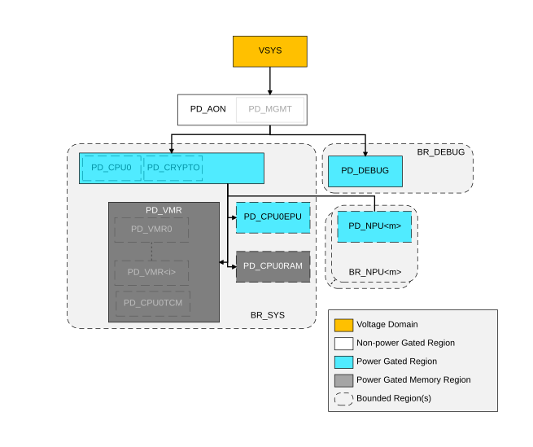

# Power hierarchy

Source: <https://developer.arm.com/documentation/102803/latest/Functional-Description/Power-Control-Infrastructure/Basic-level-power-infrastructure/Power-hierarchy>

### Power hierarchy

The system at PILEVEL = 0 supports only one voltage domain:

VSYS
:   The system voltage domain.

The system at PILEVEL = 0 supports several power domains:

- PA\_AON
- PD\_DEBUG
- PD\_SYS
- PD\_NPU<m>, does not exist if NUMNPU = 0
- PD\_VMR<i>, where i is 0 to NUMVMBANK-1, and does not exist if NUMVMBANK = 0
- PD\_CPU0EPU
- PD\_CPU0RAM

These power domains are hierarchical and the figure shows the voltage and power domain hierarchy.

Figure 1. Voltage and Power domain hierarchy of a subsystem with PILEVEL = 0

The figure also shows several Bounded Regions. Each of these Bounded Regions is controlled by a single PPU, and these are:

BR\_DEBUG
:   This is controlled by a single PPU, DEBUG\_PPU.

    The power domain in BR\_DEBUG is:

    - PD\_DEBUG. This is a combined power gated logic and memory domain for all debug logic in the system.

BR\_NPU<m>
:   Each BR\_NPU bounded region is controlled by a single PPU, NPU<m>\_PPU.

    The power domain in BR\_NPU<m> is:

    - PD\_NPU<m>

BR\_SYS
:   This is controlled by a single PPU, SYS\_PPU.

    The power domains in BR\_SYS are:

    - PD\_SYS. Note that what was PD\_CRYPTO is now merged into PD\_SYS.
    - PD\_CPU0EPU
    - PD\_CPU0RAM
    - PD\_VMR which contains all the volatile memory instances.

What was PD\_CPU in PILEVEL = 1 is now merged with PD\_SYS and the PD\_SYS domain is now controlled by the PPU that used to control PD\_CPU power domain. In addition, what was PD\_CPU0TCM power domain is merged with all PD\_VMR<i>, where i is 0 to NUMVMBANK – 1, to form a single PD\_VMR domain, controlled using the same PPU as if it were the TCM memory in PILEVEL = 1.

Because of this, other than PD\_DEBUG, all other power control depends on a single PPU to reduce complexity and area, but at a cost to flexibility.
