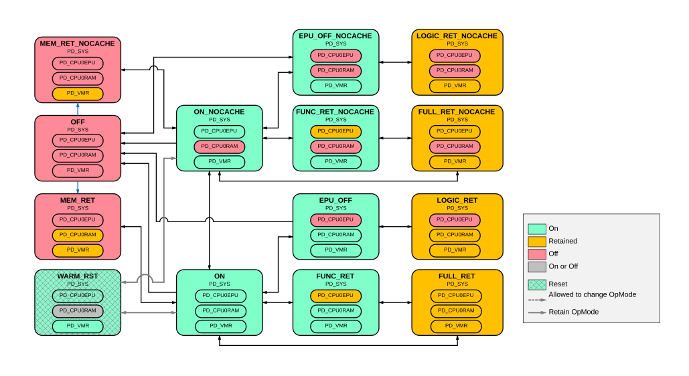

# BR_SYS power modes

Source: <https://developer.arm.com/documentation/102803/latest/Functional-Description/Power-Control-Infrastructure/Basic-level-power-infrastructure/BR-SYS-power-modes>

### BR\_SYS power modes

The following figure shows the power modes that BR\_SYS supports. Because PD\_SYS is merged with PD\_CPU0 when PILEVEL = 0, BR\_SYS has a power mode transition diagram like BR\_CPU<n> when PILEVEL = 1.

Figure 1. BR\_SYS power mode transition diagram

On Cold reset, the bounded region enters EPU\_OFF\_NOCACHE power mode.

The PD\_VMR power state always matches that of PD\_SYS, except when in MEM\_RET or MEM\_RET\_NOCACHE state where it is retained. The choice from ON\_NOCACHE to either MEM\_RET\_NOCACHE or OFF is determined by the CPU 0 local TCM minimum power state register configuration CPUPWRCFG.TCM\_MIN\_PWR\_STATE. Therefore at PILEVEL = 0, Volatile memory bank are treated like TCMs for power control.

When a Warm reset is requested, the bounded region transitions to the WARM\_RST through other power modes once the domains are idle and ready for reset. The DMA includes a minimum power register in its programmers’ model. If the DMA is included in the system ( NUMDMA > 0 ) then it can prevent PD\_SYS from transitioning to a power state that is lower than its internal minimum power register allows.

- **[Controlling PD\_CPU0RAM power states](/documentation/102803/0000/Functional-Description/Power-Control-Infrastructure/Basic-level-power-infrastructure/BR-SYS-power-modes/Controlling-PD-CPU0RAM-power-states?lang=en)**
   The BR\_SYS bounded region uses operating modes to support the ability to turn on or off the cache RAMs in modes other than the OFF mode.
- **[Controlling PD\_CPU0EPU power states](/documentation/102803/0000/Functional-Description/Power-Control-Infrastructure/Basic-level-power-infrastructure/BR-SYS-power-modes/Controlling-PD-CPU0EPU-power-states?lang=en)**
   Other than WARM\_RST state, the BR\_SYS bounded region provides the ability for the PD\_CPU0EPU to enter a lower power state independently as along as the PD\_SYS is ON. To control if the PD\_CPU0EPU can remain ON or be allowed to enter the Retention (RET) or OFF state, software can use the register CPDLPSTATE.ELPSTATE in conjunction with the CPPWR.SU10 in the CPU as follows:
- **[Controlling PD\_SYS Power States](/documentation/102803/0000/Functional-Description/Power-Control-Infrastructure/Basic-level-power-infrastructure/BR-SYS-power-modes/Controlling-PD-SYS-Power-States?lang=en)**
   Other than WARM\_RST state, the BR\_SYS bounded region provides the ability for the PD\_CPU0EPU to enter a lower power state independently as long as the PD\_SYS is ON. To control if the PD\_CPU0EPU can remain ON or be allowed to enter the Retention (RET) or OFF state, software can use the register CPDLPSTATE.ELPSTATE in conjunction with the CPPWR.SU10 in the CPU as follows:
