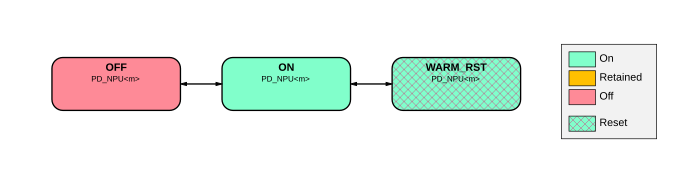

# BR_NPU<m> power modes

Source: <https://developer.arm.com/documentation/102803/latest/Functional-Description/Power-Control-Infrastructure/Basic-level-power-infrastructure/BR-NPU-m--power-modes>

### BR\_NPU<m> power modes

The following figure shows the power modes that BR\_NPU<m>.

Figure 1. BR\_NPU power mode transition diagram

On Cold reset, the bounded domain enters the ON state.

When a Warm reset is requested, the bounded region transitions to the WARM\_RST once all dependent domain is idle and ready for reset. The NPU has a power control register that can be programmed to prevent the NPU powering off. For more information of this register, see Arm® Ethos™-U55 NPU Technical Reference Manual. After reset, the NPU does not block power down, once it enters an idle state.
