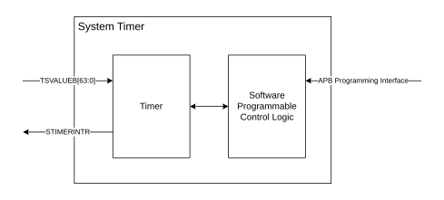

# System Timer overview

Source: <https://developer.arm.com/documentation/102803/latest/System-timer-components/System-Timer-overview>

### System Timer overview

This section provides an overview of the System Timer.

The System Timer has the following features:

- Count up and count down timer functionality with auto‑increment feature.
- Generation of a level triggered interrupt after a preconfigured period of time has passed.
- Time‑based on shared system time count that the System Counter generates.

The following figure shows a block diagram of the System Timer.

Figure 1. CRSAS Ma1 System Timer block diagram

- **[System Timer operation](/documentation/102803/0000/System-timer-components/System-Timer-overview/System-Timer-operation?lang=en)**
   The primary function of the System Timer is to generate an interrupt output that is based on the Timer configuration and interrupt mask setting.
