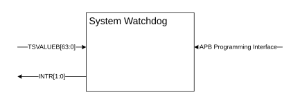

# System Watchdog overview

Source: <https://developer.arm.com/documentation/102803/latest/System-timer-components/System-Watchdog-overview>

### System Watchdog overview

The following figure shows a block diagram of the System Watchdog.

Figure 1. Block diagram of the System Watchdog

- **[Watchdog operation](/documentation/102803/0000/System-timer-components/System-Watchdog-overview/Watchdog-operation?lang=en)**
   The basic function of the Generic Watchdog is to count for a fixed period of time, during which it expects to be refreshed by the system, indicating normal operation.
- **[System watchdog programmers model](/documentation/102803/0000/System-timer-components/System-Watchdog-overview/System-watchdog-programmers-model?lang=en)**
   This section describes the programmers model of the System Watchdog. The Watchdog includes the following two 4KB register frames:
- **[Control Frame registers summary](/documentation/102803/0000/System-timer-components/System-Watchdog-overview/Control-Frame-registers-summary?lang=en)**
   This section provides a summary of the Control Frame registers. The following table shows the Control Frame registers summary.
- **[Refresh Frame registers Summary](/documentation/102803/0000/System-timer-components/System-Watchdog-overview/Refresh-Frame-registers-Summary?lang=en)**
   This section provides a summary of the Refresh Frame registers.
- **[Register descriptions](/documentation/102803/0000/System-timer-components/System-Watchdog-overview/Register-descriptions?lang=en)**
   This section describes each System Watchdog register.
- **[WCS, Watchdog Control and Status register](/documentation/102803/0000/System-timer-components/System-Watchdog-overview/WCS--Watchdog-Control-and-Status-register?lang=en)**
   The WCS register is a control and status register for the watchdog. Any write to this register causes an explicit watchdog refresh.
- **[WOR, Watchdog Offset register](/documentation/102803/0000/System-timer-components/System-Watchdog-overview/WOR--Watchdog-Offset-register?lang=en)**
   The WOR register is a countdown timer value for the watchdog. Any write to this register causes an explicit watchdog refresh.
- **[WCV, Watchdog Compare Value register](/documentation/102803/0000/System-timer-components/System-Watchdog-overview/WCV--Watchdog-Compare-Value-register?lang=en)**
   The WCV register holds the compare value of the watchdog. The following table shows the bit assignments.
- **[W\_IIDR, Watchdog Interface Identification register](/documentation/102803/0000/System-timer-components/System-Watchdog-overview/W-IIDR--Watchdog-Interface-Identification-register?lang=en)**
   The W\_IIDR register is an identification register for the watchdog. The following table shows the bit assignments.
- **[WRR, Watchdog Refresh register](/documentation/102803/0000/System-timer-components/System-Watchdog-overview/WRR--Watchdog-Refresh-register?lang=en)**
   The WRR register is a refresh register for the Watchdog. Any write to this register causes an explicit watchdog refresh.
