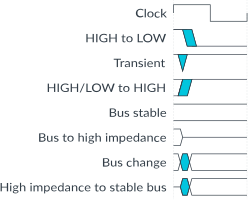

# Conventions

Source: <https://developer.arm.com/documentation/102482/0000/Introduction/Conventions>

### Conventions

The following subsections describe conventions used in Arm documents.

### Glossary

The Arm Glossary is a list of terms used in Arm documentation, together with definitions for those terms. The Arm Glossary does not contain terms that are industry standard unless the Arm meaning differs from the generally accepted meaning.

See the Arm® Glossary for more information: [developer.arm.com/glossary](https://developer.arm.com/glossary).

### Typographic conventions

Arm documentation uses typographical conventions to convey specific meaning.

<table class="documents-typographic.conventions">
 <colgroup>
  <col span="1"/>
  <col span="1"/>
 </colgroup>
 <thead>
  <tr>
   <th class="documents-nocellnorowborder" colspan="1" id="d15039e86" rowspan="1">
    Convention
   </th>
   <th class="documents-cell-norowborder" colspan="1" id="d15039e89" rowspan="1">
    Use
   </th>
  </tr>
 </thead>
 <tbody>
  <tr>
   <td class="documents-nocellnorowborder" colspan="1" rowspan="1">
    italic
   </td>
   <td class="documents-cell-norowborder" colspan="1" rowspan="1">
    Citations.
   </td>
  </tr>
  <tr>
   <td class="documents-nocellnorowborder typographic.conventions.bold" colspan="1" rowspan="1">
    bold
   </td>
   <td class="documents-cell-norowborder" colspan="1" rowspan="1">
    

     Terms in descriptive lists, where appropriate.
    

   </td>
  </tr>
  <tr>
   <td class="documents-nocellnorowborder" colspan="1" rowspan="1">
    <code>
     monospace
    </code>
   </td>
   <td class="documents-cell-norowborder" colspan="1" rowspan="1">
    Text that you can enter at the keyboard, such as commands, file and program names, and source code.
   </td>
  </tr>
  <tr>
   <td class="documents-nocellnorowborder" colspan="1" rowspan="1">
    <code>
     monospace
     
      underline
     
    </code>
   </td>
   <td class="documents-cell-norowborder" colspan="1" rowspan="1">
    A permitted abbreviation for a command or option. You can enter the underlined text instead of the full command or option name.
   </td>
  </tr>
  <tr>
   <td class="documents-nocellnorowborder" colspan="1" rowspan="1">
    <code>
     &lt;and&gt;
    </code>
   </td>
   <td class="documents-cell-norowborder" colspan="1" rowspan="1">
    

     Encloses replaceable terms for assembler syntax where they appear in code or code fragments.
    

    

     For example:
    

    <pre><code>MRC p15, 0, &lt;Rd&gt;, &lt;CRn&gt;, &lt;CRm&gt;, &lt;Opcode_2&gt;</code></pre>
   </td>
  </tr>
  <tr>
   <td class="documents-nocellnorowborder" colspan="1" rowspan="1">
    
     SMALL CAPITALS
    
   </td>
   <td class="documents-cell-norowborder" colspan="1" rowspan="1">
    Terms that have specific technical meanings as defined in the
    <cite>
     Arm&reg; Glossary
    </cite>
    . For example,
    
     IMPLEMENTATION DEFINED
    
    ,
    
     IMPLEMENTATION SPECIFIC
    
    ,
    
     UNKNOWN
    
    , and
    
     UNPREDICTABLE
    
    .
   </td>
  </tr>
  <tr>
   <td class="documents-nocellnorowborder" colspan="1" rowspan="1">
    
   </td>
   <td class="documents-cell-norowborder" colspan="1" rowspan="1">
    Recommendations. Not following these recommendations might lead to system failure or damage.
   </td>
  </tr>
  <tr>
   <td class="documents-nocellnorowborder" colspan="1" rowspan="1">
    
   </td>
   <td class="documents-cell-norowborder" colspan="1" rowspan="1">
    Requirements for the system. Not following these requirements might result in system failure or damage.
   </td>
  </tr>
  <tr>
   <td class="documents-nocellnorowborder" colspan="1" rowspan="1">
    
   </td>
   <td class="documents-cell-norowborder" colspan="1" rowspan="1">
    Requirements for the system. Not following these requirements will result in system failure or damage.
   </td>
  </tr>
  <tr>
   <td class="documents-nocellnorowborder" colspan="1" rowspan="1">
    
   </td>
   <td class="documents-cell-norowborder" colspan="1" rowspan="1">
    An important piece of information that needs your attention.
   </td>
  </tr>
  <tr>
   <td class="documents-nocellnorowborder" colspan="1" rowspan="1">
    
   </td>
   <td class="documents-cell-norowborder" colspan="1" rowspan="1">
    A useful tip that might make it easier, better or faster to perform a task.
   </td>
  </tr>
  <tr>
   <td class="documents-row-nocellborder" colspan="1" rowspan="1">
    
   </td>
   <td class="documents-cellrowborder" colspan="1" rowspan="1">
    A reminder of something important that relates to the information you are reading.
   </td>
  </tr>
 </tbody>
</table>

### Timing diagrams

The following figure explains the components used in timing diagrams. Variations, when they occur, have clear labels. You must not assume any timing information that is not explicit in the diagrams.

Shaded bus and signal areas are undefined, so the bus or signal can assume any value within the shaded area at that time. The actual level is unimportant and does not affect normal operation.

Figure 1. Key to timing diagram conventions

### Signals

The signal conventions are:

Signal level
:   The level of an asserted signal depends on whether the signal is active-HIGH or active-LOW. Asserted means:

    - HIGH for active-HIGH signals.
    - LOW for active-LOW signals.

Lowercase n
:   At the start or end of a signal name, n denotes an active-LOW signal.
