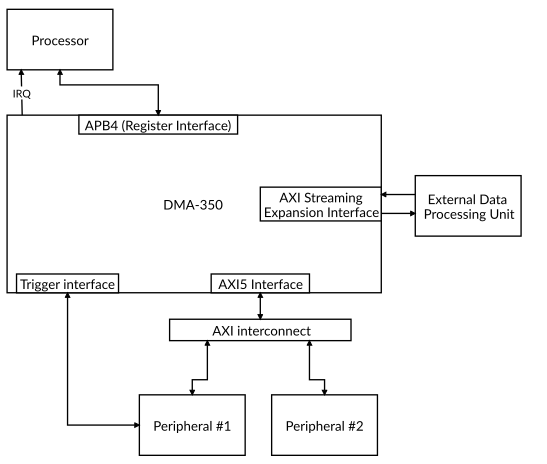

# DMA-350 overview

Source: <https://developer.arm.com/documentation/102482/0000/DMA-350-overview>

### DMA-350 overview

The CoreLink DMA-350 is a Direct Memory Access Controller (DMAC) with AMBA® AXI5 interfaces, which provides fast memory to memory, peripheral to memory, memory to peripheral copy, and peripheral to peripheral capabilities on multiple channels.

The processor in the system can control the DMA channel behavior over an APB4 interface and set security-related settings when Security Extension is supported. The DMAC has configurations for different types of copy, scatter-gather, increment, or two-dimensional image copy operations. It also supports trigger inputs and outputs for flow control and command sequencing capabilities. The DMA-350 adds support for low-power integration through the LPI interfaces for both clock and power.

The DMA-350 can have several channels that can have different properties, like FIFO size, to suit different requirements. Several DMA commands can be combined with the command linking feature. Using the command linking feature, a complex transfer can be set up and the DMAC can perform without the need for interaction with the processor. Each DMA channel can have a stream interface (AXI4-Stream) connected to an external Data Processing Unit. These channels can perform required data processing tasks on the fetched data before the DMAC writes the data to the destination.

The following figure shows DMA-350 in a system:

Figure 1. DMA-350 in a system

- **[Component overview](/documentation/102482/0000/DMA-350-overview/Component-overview?lang=en)**
   The following block diagram shows the top-level components of DMA-350:
- **[Compliance](/documentation/102482/0000/DMA-350-overview/Compliance?lang=en)**
   The DMA-350 interfaces are compliant with the following Arm specifications and protocols:
- **[Key features](/documentation/102482/0000/DMA-350-overview/Key-features?lang=en)**
   The DMA-350 supports the following key features:
- **[Configurable options](/documentation/102482/0000/DMA-350-overview/Configurable-options?lang=en)**
   The DMA-350 can be configured with the following options to meet specific design requirements:
- **[Product documentation and design flow](/documentation/102482/0000/DMA-350-overview/Product-documentation-and-design-flow?lang=en)**
   This section describes the DMA-350 documentation in relation to the design flow.
- **[Product revisions](/documentation/102482/0000/DMA-350-overview/Product-revisions?lang=en)**
   This section describes the differences in functionality between product revisions:
