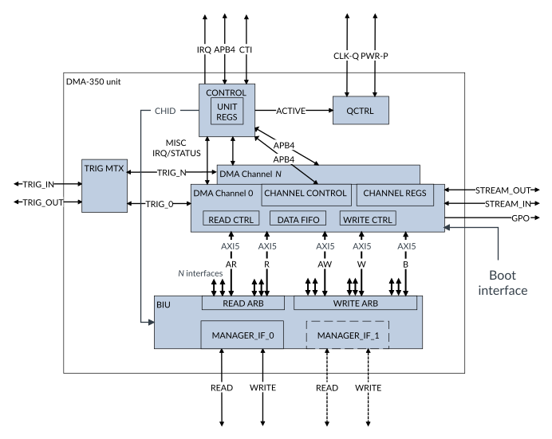

# Component overview

Source: <https://developer.arm.com/documentation/102482/0000/DMA-350-overview/Component-overview>

### Component overview

The following block diagram shows the top-level components of DMA-350:

Figure 1. DMA-350 top-level block diagram

DMA-350 has the following main blocks:

Control
:   Control Block

    - Receives and terminates APB4 bus from the processor
    - Forwards register accesses to each channel
    - Implements the common control functions of the DMAC
    - Handles security and privilege access right settings of the channels
    - Generates interrupts for high-level DMAC events

DMA Channel
:   DMA Channel block

    - Implements one functional unit of the DMA controller that is capable of generating memory transfers
    - Generates AXI transfers that match the settings of the current command
    - Terminates the Trigger Interface from peripherals
    - Generates interrupts and trigger out indications for internal channel events
    - Implements an internal FIFO to separate read and write sides of the channel
    - Implements support for an External Data Processing Unit over the AXI-4 stream interface
    - Several DMA channels may exist in the DMA-350 determined by a configuration parameter

BIU
:   Bus Interface Unit

    - Responsible for routing and arbitrating traffic between the DMA channels and either one or two downstream AXI5 manager interfaces

TRIG MTX
:   Trigger matrix block

    - Implements a selectable connection between the trigger input and output ports of the DMA channels and the top-level trigger input and output ports
    - Allows internal triggering between the channels

QCTRL
:   Power and Clock management

    - Implements the clock and power management features of DMA-350
    - Terminates the LPI interfaces and allows quiescence based on the internal activity
